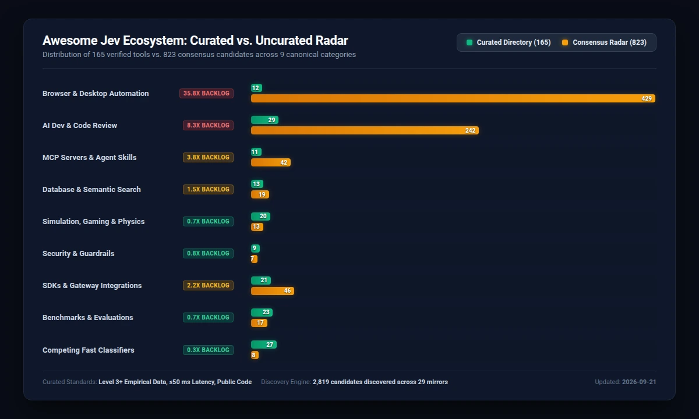

# Awesome Jev Ecosystem Radar  
> [!IMPORTANT]
> **Automated Ecosystem Radar and Staging Backlog:** Unvetted candidate tools discovered across [29 community mirrors](https://github.com/Gerry9000/awesome-jev).
>
> **How to Use the Radar:** The **[Curated Directory (README.md)](README.md)** features production-ready tools meeting our Three-Prong Verification Standard.
> In contrast, this Radar is an excellent resource to mine for hobby projects, hackathon prototypes, maturing tools, and emerging libraries awaiting full evaluation.

The candidate repositories and discussions below were discovered by automated scrapers across [29 community mirrors](https://github.com/Gerry9000/awesome-jev).
They represent the broader, rapidly evolving landscape of fast classification and non-generative AI experiments.
For our verified directory of production tools, interactive demos, and architectural dossiers, see the **[Curated Directory (README.md)](README.md)**.

## Radar Summary
- **Multi-Index Consensus Candidates (Seen in 3+ mirror lists)**: [580 repositories](#1-multi-index-consensus-candidates)
- **Emerging Community Candidates (Seen in 2 mirror lists)**: [349 repositories](#2-emerging-community-candidates)
- **Single-Mention Discovery Queue**: [2073 repositories](#3-single-mention-discovery-queue)
- **Discovered X Discussions and Media Threads**: [702 discussions](#4-discovered-x-discussions-and-demos)
- **Triage & Classification (TypeSafe Jev)**: [576 consensus candidates classified](#1-multi-index-consensus-candidates)
- **Empirical Promotion Candidates**: [94 repositories flagged Level 3+](https://github.com/Gerry9000/awesome-jev)
- **Quality Scale (`🎯 1.0 to 4.0`)**: Every consensus candidate is evaluated against our 4-point empirical rubric: `Level 1` (Prototype/Stub), `Level 2` (Working code), `Level 3` (Measured sub-50 ms latency and telemetry, flagged `🚀 Promotion Ready`), and `Level 4` (Production-grade test suite and continuous evals). Repository stars (`⭐`) reflect live GitHub stargazers.

## Ecosystem Category Distribution: Curated vs. Uncurated Radar

 
<em>Figure 1: Distribution of 160 curated production implementations vs. 569 consensus candidates discovered across 29 community mirrors.</em>

---

## 1. Multi-Index Consensus Candidates

These candidate repositories appear across 3 or more independent comparison mirrors in the ecosystem:

- **[`GodsBoy/jev-agent-skill-router`](https://github.com/GodsBoy/jev-agent-skill-router)** *([15 mirrors](https://github.com/GodsBoy/jev-agent-skill-router))* `⭐ 12` `🏷️ AI Dev & Code Review (50%)` `🎯 Quality: 3.2/4.0` `🚀 Promotion Ready`
- **[`sharziki/semdecide`](https://github.com/sharziki/semdecide)** *([15 mirrors](https://github.com/sharziki/semdecide))* `⭐ 20` `🏷️ AI Dev & Code Review (99%)` `🎯 Quality: 3.5/4.0` `🚀 Promotion Ready` -- Typed semantic decisions for Unix pipelines and CI, powered by TypeSafe AI Jev.
- **[`GhalebDweikat/winnow`](https://github.com/GhalebDweikat/winnow)** *([14 mirrors](https://github.com/GhalebDweikat/winnow))* `⭐ 42` `🏷️ AI Dev & Code Review (99%)` `🎯 Quality: 3.5/4.0` `🚀 Promotion Ready` -- A calibrated context sieve for Claude Code: every tool result is judged by a System One.
- **[`GiesN/typesafe-jev-workflow`](https://github.com/GiesN/typesafe-jev-workflow)** *([13 mirrors](https://github.com/GiesN/typesafe-jev-workflow))* `⭐ 6` `🏷️ Browser & Automation (50%)` `🎯 Quality: 3.2/4.0` `🚀 Promotion Ready`
- **[`mejiasd3v/pi-jev-router`](https://github.com/mejiasd3v/pi-jev-router)** *([13 mirrors](https://github.com/mejiasd3v/pi-jev-router))* `⭐ 10` `🏷️ AI Dev & Code Review (99%)` `🎯 Quality: 3.2/4.0` `🚀 Promotion Ready` -- Automatic model routing for Pi using TypeSafe's Jev through Vercel AI Gateway
- **[`TheoOliveira/pi-jev`](https://github.com/TheoOliveira/pi-jev)** *([13 mirrors](https://github.com/TheoOliveira/pi-jev))* `⭐ 30` `🏷️ AI Dev & Code Review (99%)` `🎯 Quality: 3.5/4.0` `🚀 Promotion Ready` -- Semantic tool routing and typed System One decisions for the Pi coding agent using TypeSafe Jev
- **[`gtaras7/typesafe-jev`](https://github.com/gtaras7/typesafe-jev)** *([12 mirrors](https://github.com/gtaras7/typesafe-jev))* `⭐ 3` `🏷️ Browser & Automation (50%)` `🎯 Quality: 3.2/4.0` `🚀 Promotion Ready`
- **[`wy-coliney/jev-browser-use`](https://github.com/wy-coliney/jev-browser-use)** *([12 mirrors](https://github.com/wy-coliney/jev-browser-use))* `⭐ 310` `🏷️ Browser & Automation (50%)` `🎯 Quality: 3.5/4.0` `🚀 Promotion Ready` -- 5-10x faster browser operations: Jev clicks, Codex thinks and verifies.
- **[`24601/Augustus`](https://github.com/24601/Augustus)** *([11 mirrors](https://github.com/24601/Augustus))* `⭐ 6` `🏷️ AI Dev & Code Review (50%)` `🎯 Quality: 3.5/4.0` `🚀 Promotion Ready` -- Agent skill for the decision-model class (classifiers, encoders/decoders, specialized AR heads, System One).
- **[`asfarsadewa/human-compiler`](https://github.com/asfarsadewa/human-compiler)** *([11 mirrors](https://github.com/asfarsadewa/human-compiler))* `⭐ 0` `🏷️ Browser & Automation (50%)` `🎯 Quality: 3.2/4.0`
- **[`dabit3/jev-experiments`](https://github.com/dabit3/jev-experiments)** *([11 mirrors](https://github.com/dabit3/jev-experiments))* `⭐ 354` `🏷️ Browser & Automation (50%)` `🎯 Quality: 3.2/4.0` `🚀 Promotion Ready`
- **[`DanRWilloughby/snifftest`](https://github.com/DanRWilloughby/snifftest)** *([11 mirrors](https://github.com/DanRWilloughby/snifftest))* `⭐ 27` `🏷️ AI Dev & Code Review (99%)` `🎯 Quality: 3.5/4.0` -- A prose linter that sniffs out AI writing tells.
- **[`keltokhy/jgrep`](https://github.com/keltokhy/jgrep)** *([11 mirrors](https://github.com/keltokhy/jgrep))* `⭐ 16` `🏷️ AI Dev & Code Review (50%)` `🎯 Quality: 3.5/4.0` `🚀 Promotion Ready`
- **[`Kevthetech143/super-jev`](https://github.com/Kevthetech143/super-jev)** *([11 mirrors](https://github.com/Kevthetech143/super-jev))* `⭐ 8` `🏷️ AI Dev & Code Review (99%)` `🎯 Quality: 3.5/4.0` `🚀 Promotion Ready`
- **[`legacybridge-tech/pi-typesafe-jev`](https://github.com/legacybridge-tech/pi-typesafe-jev)** *([11 mirrors](https://github.com/legacybridge-tech/pi-typesafe-jev))* `⭐ 2` `🏷️ Browser & Automation (50%)` `🎯 Quality: 3.5/4.0` `🚀 Promotion Ready` -- A pi extension that exposes TypeSafe (Jev, System One) judgments as five pi tools, so a.
- **[`luantak/is-malicious`](https://github.com/luantak/is-malicious)** *([11 mirrors](https://github.com/luantak/is-malicious))* `⭐ 19` `🏷️ Browser & Automation (50%)` `🎯 Quality: 3.2/4.0`
- **[`phyous/tsai-civ2`](https://github.com/phyous/tsai-civ2)** *([11 mirrors](https://github.com/phyous/tsai-civ2))* `⭐ 1` `🏷️ Browser & Automation (50%)` `🎯 Quality: 3.2/4.0`
- **[`prismhq/jev-router`](https://github.com/prismhq/jev-router)** *([11 mirrors](https://github.com/prismhq/jev-router))* `⭐ 6` `🏷️ AI Dev & Code Review (99%)` `🎯 Quality: 3.2/4.0` `🚀 Promotion Ready`
- **[`razorback16/openjev`](https://github.com/razorback16/openjev)** *([11 mirrors](https://github.com/razorback16/openjev))* `⭐ 262` `🏷️ AI Dev & Code Review (50%)` `🎯 Quality: 3.5/4.0` `🚀 Promotion Ready` -- Open, Jev-compatible System One decision server on DiffusionGemma
- **[`siroccomask/snake-jev`](https://github.com/siroccomask/snake-jev)** *([11 mirrors](https://github.com/siroccomask/snake-jev))* `⭐ 0` `🏷️ Browser & Automation (50%)` `🎯 Quality: 3.2/4.0` `🚀 Promotion Ready`
- **[`sorrycc/typesafe-snake`](https://github.com/sorrycc/typesafe-snake)** *([11 mirrors](https://github.com/sorrycc/typesafe-snake))* `⭐ 20` `🏷️ AI Dev & Code Review (99%)` `🎯 Quality: 3.5/4.0` `🚀 Promotion Ready` -- Snake auto-played by TypeSafe's Jev model: one System One choice per tick, legal moves and facts.
- **[`sufianetaouil/every`](https://github.com/sufianetaouil/every)** *([11 mirrors](https://github.com/sufianetaouil/every))* `⭐ 5` `🏷️ Browser & Automation (50%)` `🎯 Quality: 3.2/4.0`
- **[`sutro-sh/jev-align`](https://github.com/sutro-sh/jev-align)** *([11 mirrors](https://github.com/sutro-sh/jev-align))* `⭐ 259` `🏷️ Browser & Automation (50%)` `🎯 Quality: 3.5/4.0` `🚀 Promotion Ready` -- Build calibrated AI Functions from human feedback using Jev and GEPA.
- **[`tumf/jev-cli`](https://github.com/tumf/jev-cli)** *([11 mirrors](https://github.com/tumf/jev-cli))* `⭐ 9` `🏷️ MCP Servers & Skills (99%)` `🎯 Quality: 3.2/4.0` `🚀 Promotion Ready`
- **[`zhihz/openjev`](https://github.com/zhihz/openjev)** *([11 mirrors](https://github.com/zhihz/openjev))* `⭐ 27` `🏷️ AI Dev & Code Review (50%)` `🎯 Quality: 3.5/4.0` `🚀 Promotion Ready` -- Local bilingual probability decisions from context, questions, and candidate answers.
- **[`AbdelStark/awesome-typesafe`](https://github.com/AbdelStark/awesome-typesafe)** *([10 mirrors](https://github.com/AbdelStark/awesome-typesafe))* `⭐ 424` `🏷️ AI Dev & Code Review (99%)` `🎯 Quality: 3.5/4.0` `🚀 Promotion Ready`
- **[`AbdelStark/bicameral`](https://github.com/AbdelStark/bicameral)** *([10 mirrors](https://github.com/AbdelStark/bicameral))* `⭐ 4` `🏷️ Browser & Automation (50%)` `🎯 Quality: 3.2/4.0`
- **[`AbdelStark/typesafe-rs`](https://github.com/AbdelStark/typesafe-rs)** *([10 mirrors](https://github.com/AbdelStark/typesafe-rs))* `⭐ 1` `🏷️ Browser & Automation (50%)` `🎯 Quality: 3.2/4.0` `🚀 Promotion Ready`
- **[`adarshmishra07/jcm-router`](https://github.com/adarshmishra07/jcm-router)** *([10 mirrors](https://github.com/adarshmishra07/jcm-router))* `⭐ 3` `🏷️ AI Dev & Code Review (99%)` `🎯 Quality: 3.2/4.0`
- **[`AkashPriyadarshii/jev-scout`](https://github.com/AkashPriyadarshii/jev-scout)** *([10 mirrors](https://github.com/AkashPriyadarshii/jev-scout))* `⭐ 2` `🏷️ AI Dev & Code Review (99%)` `🎯 Quality: 3.5/4.0` `🚀 Promotion Ready` -- Zero-hallucination open-source repo and crate scout powered by TypeSafe AI Jev System One scoring
- **[`emrickgarrett/OneVOneJev`](https://github.com/emrickgarrett/OneVOneJev)** *([10 mirrors](https://github.com/emrickgarrett/OneVOneJev))* `⭐ 12` `🏷️ Alternative Classifiers (99%)` `🎯 Quality: 3.5/4.0` `🚀 Promotion Ready` -- 1v1 Jev quickscope arena -- Three.js + TypeSafe System One
- **[`HyunjunJeon/jev-judgment`](https://github.com/HyunjunJeon/jev-judgment)** *([10 mirrors](https://github.com/HyunjunJeon/jev-judgment))* `⭐ 3` `🏷️ Browser & Automation (50%)` `🎯 Quality: 3.2/4.0` `🚀 Promotion Ready`
- **[`joelhooks/pi-fast-jev-compaction`](https://github.com/joelhooks/pi-fast-jev-compaction)** *([10 mirrors](https://github.com/joelhooks/pi-fast-jev-compaction))* `⭐ 8` `🏷️ Browser & Automation (50%)` `🎯 Quality: 3.2/4.0` `🚀 Promotion Ready`
- **[`kavehmz/typesafe-playground`](https://github.com/kavehmz/typesafe-playground)** *([10 mirrors](https://github.com/kavehmz/typesafe-playground))* `⭐ 11` `🏷️ Browser & Automation (50%)` `🎯 Quality: 3.2/4.0` `🚀 Promotion Ready` -- Interactive experiments with TypeSafe Jev, from support routing to 3D driving simulations with real AI decisions.
- **[`kyotofin/tax-doc-classifier`](https://github.com/kyotofin/tax-doc-classifier)** *([10 mirrors](https://github.com/kyotofin/tax-doc-classifier))* `⭐ 326` `🏷️ AI Dev & Code Review (50%)` `🎯 Quality: 3.1/4.0` `🚀 Promotion Ready` -- Tax document page classifier built on Jev decisions.
- **[`raihankhan-rk/diffjury`](https://github.com/raihankhan-rk/diffjury)** *([10 mirrors](https://github.com/raihankhan-rk/diffjury))* `⭐ 4` `🏷️ Browser & Automation (50%)` `🎯 Quality: 3.2/4.0`
- **[`replynodes/jev-web-analyzer`](https://github.com/replynodes/jev-web-analyzer)** *([10 mirrors](https://github.com/replynodes/jev-web-analyzer))* `⭐ 2` `🏷️ SDKs & Gateways (99%)` `🎯 Quality: 3.5/4.0` `🚀 Promotion Ready`
- **[`santos-sanz/jev-audio-beeper`](https://github.com/santos-sanz/jev-audio-beeper)** *([10 mirrors](https://github.com/santos-sanz/jev-audio-beeper))* `⭐ 2` `🏷️ Browser & Automation (50%)` `🎯 Quality: 3.2/4.0` `🚀 Promotion Ready`
- **[`tacticocc/Jevbridge`](https://github.com/tacticocc/Jevbridge)** *([10 mirrors](https://github.com/tacticocc/Jevbridge))* `⭐ 37` `🏷️ AI Dev & Code Review (50%)` `🎯 Quality: 3.1/4.0` `🚀 Promotion Ready` -- ACP and MCP adapter that bridges TypeSafe Jev with any LLM -- computer use and typed.
- **[`uehaj/jev-semgrep`](https://github.com/uehaj/jev-semgrep)** *([10 mirrors](https://github.com/uehaj/jev-semgrep))* `⭐ 123` `🏷️ Database & Search (99%)` `🎯 Quality: 3.1/4.0` `🚀 Promotion Ready` -- grep by meaning, across languages.
- **[`vercel/eve`](https://github.com/vercel/eve)** *([10 mirrors](https://github.com/vercel/eve))* `⭐ 5,295` `🏷️ Browser & Automation (50%)` `🎯 Quality: 3.2/4.0`
- **[`AbdelStark/heist-one`](https://github.com/AbdelStark/heist-one)** *([9 mirrors](https://github.com/AbdelStark/heist-one))* `⭐ 7` `🏷️ Browser & Automation (50%)` `🎯 Quality: 2.8/4.0`
- **[`AbdelStark/s1-rs`](https://github.com/AbdelStark/s1-rs)** *([9 mirrors](https://github.com/AbdelStark/s1-rs))* `⭐ 1` `🏷️ Browser & Automation (50%)` `🎯 Quality: 2.8/4.0`
- **[`AkashPriyadarshii/jev-git`](https://github.com/AkashPriyadarshii/jev-git)** *([9 mirrors](https://github.com/AkashPriyadarshii/jev-git))* `⭐ 2` `🏷️ AI Dev & Code Review (50%)` `🎯 Quality: 3.1/4.0` `🚀 Promotion Ready`
- **[`anpicasso/hermes-jev-approvals`](https://github.com/anpicasso/hermes-jev-approvals)** *([9 mirrors](https://github.com/anpicasso/hermes-jev-approvals))* `⭐ 11` `🏷️ AI Dev & Code Review (99%)` `🎯 Quality: 2.8/4.0`
- **[`Bodila51/grok-bot-jev`](https://github.com/Bodila51/grok-bot-jev)** *([9 mirrors](https://github.com/Bodila51/grok-bot-jev))* `⭐ 70` `🏷️ AI Dev & Code Review (50%)` `🎯 Quality: 3.1/4.0` `🚀 Promotion Ready` -- Connect TypeSafe Jev to Grok Bot as a cheap decision layer - usage gates, skill template.
- **[`Brainwires/jevwire`](https://github.com/Brainwires/jevwire)** *([9 mirrors](https://github.com/Brainwires/jevwire))* `⭐ 15` `🏷️ AI Dev & Code Review (50%)` `🎯 Quality: 3.1/4.0` `🚀 Promotion Ready` -- Jev decision layer for agents: MCP server, embeddable DecisionModel library, and an escalate-only Claude Code plugin.
- **[`burnigtm/jev-mcp`](https://github.com/burnigtm/jev-mcp)** *([9 mirrors](https://github.com/burnigtm/jev-mcp))* `⭐ 34` `🏷️ AI Dev & Code Review (50%)` `🎯 Quality: 3.1/4.0` `🚀 Promotion Ready` -- MCP server that puts TypeSafe Jev on the coding loop in Cursor, Codex, and any MCP.
- **[`cephalization/jev-triage`](https://github.com/cephalization/jev-triage)** *([9 mirrors](https://github.com/cephalization/jev-triage))* `⭐ 1` `🏷️ Security & Moderation (99%)` `🎯 Quality: 2.8/4.0`
- **[`DECRUX9812/typesafe-skill-router`](https://github.com/DECRUX9812/typesafe-skill-router)** *([9 mirrors](https://github.com/DECRUX9812/typesafe-skill-router))* `⭐ 8` `🏷️ AI Dev & Code Review (50%)` `🎯 Quality: 2.8/4.0` -- TypeSafe (Jev) skill routing for Hermes Agent: names the one skill worth loading, before the model.
- **[`GenieRobot/typesafe-ai-rails`](https://github.com/GenieRobot/typesafe-ai-rails)** *([9 mirrors](https://github.com/GenieRobot/typesafe-ai-rails))* `⭐ 2` `🏷️ Simulation & Physical AI (99%)` `🎯 Quality: 2.8/4.0`
- **[`Heman10x-NGU/openJev-verdict-2.0`](https://github.com/Heman10x-NGU/openJev-verdict-2.0)** *([9 mirrors](https://github.com/Heman10x-NGU/openJev-verdict-2.0))* `⭐ 234` `🏷️ AI Dev & Code Review (50%)` `🎯 Quality: 3.1/4.0` `🚀 Promotion Ready` -- Calibrated 151 M Non-Autoregressive Decision Engine beating TypeSafe Jev & Laya on LocalLLaMA/typed-decisions (77.10% acc, 0.0636.
- **[`HyunjunJeon/pi-quiet-ask`](https://github.com/HyunjunJeon/pi-quiet-ask)** *([9 mirrors](https://github.com/HyunjunJeon/pi-quiet-ask))* `⭐ 10` `🏷️ Browser & Automation (50%)` `🎯 Quality: 2.8/4.0`
- **[`iamvatsalpatel/tiershift`](https://github.com/iamvatsalpatel/tiershift)** *([9 mirrors](https://github.com/iamvatsalpatel/tiershift))* `⭐ 3` `🏷️ Browser & Automation (50%)` `🎯 Quality: 2.8/4.0` -- Shift every LLM call to the cheapest model that can handle it.
- **[`kshetrajna12/reflex`](https://github.com/kshetrajna12/reflex)** *([9 mirrors](https://github.com/kshetrajna12/reflex))* `⭐ 101` `🏷️ AI Dev & Code Review (50%)` `🎯 Quality: 3.1/4.0` `🚀 Promotion Ready` -- A small open decision model: state + typed questions -> calibrated probabilities.
- **[`MarissaFamularo/citation-verifier`](https://github.com/MarissaFamularo/citation-verifier)** *([9 mirrors](https://github.com/MarissaFamularo/citation-verifier))* `⭐ 4` `🏷️ Browser & Automation (50%)` `🎯 Quality: 2.8/4.0`
- **[`markjaquith/typesafe-ai-playground`](https://github.com/markjaquith/typesafe-ai-playground)** *([9 mirrors](https://github.com/markjaquith/typesafe-ai-playground))* `⭐ 1` `🏷️ Browser & Automation (50%)` `🎯 Quality: 2.8/4.0`
- **[`monteduro/killmyidea`](https://github.com/monteduro/killmyidea)** *([9 mirrors](https://github.com/monteduro/killmyidea))* `⭐ 54` `🏷️ Browser & Automation (50%)` `🎯 Quality: 2.8/4.0`
- **[`nexibeo/jev-cookbook`](https://github.com/nexibeo/jev-cookbook)** *([9 mirrors](https://github.com/nexibeo/jev-cookbook))* `⭐ 11` `🏷️ Browser & Automation (50%)` `🎯 Quality: 2.8/4.0`
- **[`noplan-inc/limpet`](https://github.com/noplan-inc/limpet)** *([9 mirrors](https://github.com/noplan-inc/limpet))* `⭐ 2` `🏷️ Browser & Automation (50%)` `🎯 Quality: 2.8/4.0`
- **[`r-ms/mini-jev`](https://github.com/r-ms/mini-jev)** *([9 mirrors](https://github.com/r-ms/mini-jev))* `⭐ 40` `🏷️ AI Dev & Code Review (99%)` `🎯 Quality: 3.1/4.0` `🚀 Promotion Ready` -- mini-Jev: what a Jev-style typed-decision interface looks like on a frozen Qwen3-4 B -- read the.
- **[`Tangerg/typesafe-sdk-go`](https://github.com/Tangerg/typesafe-sdk-go)** *([9 mirrors](https://github.com/Tangerg/typesafe-sdk-go))* `⭐ 8` `🏷️ SDKs & Gateways (99%)` `🎯 Quality: 2.8/4.0`
- **[`trungdq88/youtube-sponsor-detection`](https://github.com/trungdq88/youtube-sponsor-detection)** *([9 mirrors](https://github.com/trungdq88/youtube-sponsor-detection))* `⭐ 81` `🏷️ Browser & Automation (50%)` `🎯 Quality: 2.8/4.0`
- **[`usenotra/notra`](https://github.com/usenotra/notra)** *([9 mirrors](https://github.com/usenotra/notra))* `⭐ 204` `🏷️ Browser & Automation (50%)` `🎯 Quality: 2.8/4.0`
- **[`vercel-labs/ai-cli`](https://github.com/vercel-labs/ai-cli)** *([9 mirrors](https://github.com/vercel-labs/ai-cli))* `⭐ 809` `🏷️ MCP Servers & Skills (99%)` `🎯 Quality: 2.8/4.0`
- **[`zadescoxp/Jev-Trades`](https://github.com/zadescoxp/Jev-Trades)** *([9 mirrors](https://github.com/zadescoxp/Jev-Trades))* `⭐ 21` `🏷️ Browser & Automation (50%)` `🎯 Quality: 3.1/4.0` `🚀 Promotion Ready` -- Trading bot with the all new TypeSafe AI's first system one model named as Jev
- **[`zhirschtritt/typesafe-go`](https://github.com/zhirschtritt/typesafe-go)** *([9 mirrors](https://github.com/zhirschtritt/typesafe-go))* `⭐ 1` `🏷️ SDKs & Gateways (99%)` `🎯 Quality: 2.8/4.0` -- Idiomatic Go SDK for the TypeSafe AI API
- **[`AkashPriyadarshii/jev-superpowers`](https://github.com/AkashPriyadarshii/jev-superpowers)** *([8 mirrors](https://github.com/AkashPriyadarshii/jev-superpowers))* `⭐ 12` `🏷️ AI Dev & Code Review (99%)` `🎯 Quality: 3.1/4.0` `🚀 Promotion Ready` -- Systematic software development framework for AI coding agents upgraded with TypeSafe Jev System One typed decisions
- **[`Butochnikov/typesafe-sdk-php`](https://github.com/Butochnikov/typesafe-sdk-php)** *([8 mirrors](https://github.com/Butochnikov/typesafe-sdk-php))* `⭐ 1` `🏷️ SDKs & Gateways (99%)` `🎯 Quality: 2.8/4.0`
- **[`choxos/jev-reviewer`](https://github.com/choxos/jev-reviewer)** *([8 mirrors](https://github.com/choxos/jev-reviewer))* `⭐ 31` `🏷️ Browser & Automation (50%)` `🎯 Quality: 3.1/4.0` `🚀 Promotion Ready` -- Data extraction for systematic reviews, quoted from the papers.
- **[`devagrawal09/stanley-code`](https://github.com/devagrawal09/stanley-code)** *([8 mirrors](https://github.com/devagrawal09/stanley-code))* `⭐ 109` `🏷️ AI Dev & Code Review (99%)` `🎯 Quality: 2.8/4.0`
- **[`DevMortimer/pi-typesafe`](https://github.com/DevMortimer/pi-typesafe)** *([8 mirrors](https://github.com/DevMortimer/pi-typesafe))* `⭐ 32` `🏷️ Browser & Automation (50%)` `🎯 Quality: 2.8/4.0`
- **[`Dimweaker/jev-libero`](https://github.com/Dimweaker/jev-libero)** *([8 mirrors](https://github.com/Dimweaker/jev-libero))* `⭐ 46` `🏷️ Browser & Automation (50%)` `🎯 Quality: 2.8/4.0`
- **[`EugeneBoondock/jevsql`](https://github.com/EugeneBoondock/jevsql)** *([8 mirrors](https://github.com/EugeneBoondock/jevsql))* `⭐ 3` `🏷️ Database & Search (99%)` `🎯 Quality: 2.8/4.0`
- **[`Foadsf/jev-for-engineers`](https://github.com/Foadsf/jev-for-engineers)** *([8 mirrors](https://github.com/Foadsf/jev-for-engineers))* `⭐ 2` `🏷️ Browser & Automation (50%)` `🎯 Quality: 2.8/4.0`
- **[`frostney/clean-code-review`](https://github.com/frostney/clean-code-review)** *([8 mirrors](https://github.com/frostney/clean-code-review))* `⭐ 7` `🏷️ AI Dev & Code Review (99%)` `🎯 Quality: 3.1/4.0` `🚀 Promotion Ready` -- Every code file in a pull request, judged against Uncle Bob's Clean Code by TypeSafe's Jev.
- **[`gaborishka/jev-canvas`](https://github.com/gaborishka/jev-canvas)** *([8 mirrors](https://github.com/gaborishka/jev-canvas))* `⭐ 2` `🏷️ Browser & Automation (50%)` `🎯 Quality: 2.8/4.0`
- **[`genai-craft/openvons`](https://github.com/genai-craft/openvons)** *([8 mirrors](https://github.com/genai-craft/openvons))* `⭐ 13` `🏷️ Alternative Classifiers (99%)` `🎯 Quality: 3.1/4.0` `🚀 Promotion Ready` -- openvons (open-Jev): 有限選択肢に確率で答える判断層 -- テキスト / 画像 / 日本語音声コマンド
- **[`haseeb-heaven/jev-system-one`](https://github.com/haseeb-heaven/jev-system-one)** *([8 mirrors](https://github.com/haseeb-heaven/jev-system-one))* `⭐ 4` `🏷️ AI Dev & Code Review (99%)` `🎯 Quality: 3.1/4.0` `🚀 Promotion Ready` -- A polished OpenAI + TypeSafe Jev terminal interface for answers with transparent decision reports
- **[`hev/reranker`](https://github.com/hev/reranker)** *([8 mirrors](https://github.com/hev/reranker))* `⭐ 8` `🏷️ AI Dev & Code Review (99%)` `🎯 Quality: 3.1/4.0` `🚀 Promotion Ready` -- Use Jev (TypeSafe's System One model) as a calibrated reranker: one call, up to 30 documents.
- **[`huntedman/JevLint`](https://github.com/huntedman/JevLint)** *([8 mirrors](https://github.com/huntedman/JevLint))* `⭐ 11` `🏷️ MCP Servers & Skills (99%)` `🎯 Quality: 3.1/4.0` `🚀 Promotion Ready` -- Configurable semantic linting powered by Jev, with file-level NOUL judgments and a magic-strings plugin.
- **[`jgridifier/jev-research-eval`](https://github.com/jgridifier/jev-research-eval)** *([8 mirrors](https://github.com/jgridifier/jev-research-eval))* `⭐ 2` `🏷️ Database & Search (50%)` `🎯 Quality: 2.8/4.0`
- **[`jmanhype/jev-dspy-lab`](https://github.com/jmanhype/jev-dspy-lab)** *([8 mirrors](https://github.com/jmanhype/jev-dspy-lab))* `⭐ 1` `🏷️ AI Dev & Code Review (50%)` `🎯 Quality: 3.1/4.0` `🚀 Promotion Ready` -- Reproducible calibration and selective-risk benchmarks for Jev/TypeSafe decisions in DSPy workflows
- **[`jomatsu/zod-jev`](https://github.com/jomatsu/zod-jev)** *([8 mirrors](https://github.com/jomatsu/zod-jev))* `⭐ 7` `🏷️ Browser & Automation (50%)` `🎯 Quality: 2.8/4.0`
- **[`keltokhy/jsort`](https://github.com/keltokhy/jsort)** *([8 mirrors](https://github.com/keltokhy/jsort))* `⭐ 9` `🏷️ Browser & Automation (50%)` `🎯 Quality: 2.8/4.0`
- **[`komikat/jev-bfs`](https://github.com/komikat/jev-bfs)** *([8 mirrors](https://github.com/komikat/jev-bfs))* `⭐ 0` `🏷️ Browser & Automation (50%)` `🎯 Quality: 2.8/4.0`
- **[`leonaaardob/fast-dev-compaction`](https://github.com/leonaaardob/fast-dev-compaction)** *([8 mirrors](https://github.com/leonaaardob/fast-dev-compaction))* `⭐ 3` `🏷️ Browser & Automation (50%)` `🎯 Quality: 2.8/4.0`
- **[`nidhi-singh02/agent-router`](https://github.com/nidhi-singh02/agent-router)** *([8 mirrors](https://github.com/nidhi-singh02/agent-router))* `⭐ 60` `🏷️ AI Dev & Code Review (99%)` `🎯 Quality: 2.8/4.0`
- **[`Nyarlathoteppppp/pi-heed`](https://github.com/Nyarlathoteppppp/pi-heed)** *([8 mirrors](https://github.com/Nyarlathoteppppp/pi-heed))* `⭐ 6` `🏷️ Browser & Automation (50%)` `🎯 Quality: 2.8/4.0`
- **[`PistachioAIHQ/jev-synergy-screening`](https://github.com/PistachioAIHQ/jev-synergy-screening)** *([8 mirrors](https://github.com/PistachioAIHQ/jev-synergy-screening))* `⭐ 1` `🏷️ AI Dev & Code Review (99%)` `🎯 Quality: 3.1/4.0` `🚀 Promotion Ready` -- Jev (TypeSafe System One) × ASReview SYNERGY abstract screening demo -- Choice/Noul vs gold labels
- **[`RafalWilinski/vibecheck`](https://github.com/RafalWilinski/vibecheck)** *([8 mirrors](https://github.com/RafalWilinski/vibecheck))* `⭐ 46` `🏷️ Browser & Automation (50%)` `🎯 Quality: 2.8/4.0`
- **[`RINNECODER/jev-behavior-study`](https://github.com/RINNECODER/jev-behavior-study)** *([8 mirrors](https://github.com/RINNECODER/jev-behavior-study))* `⭐ 3` `🏷️ AI Dev & Code Review (99%)` `🎯 Quality: 2.8/4.0`
- **[`shinpr/jev-reranker`](https://github.com/shinpr/jev-reranker)** *([8 mirrors](https://github.com/shinpr/jev-reranker))* `⭐ 2` `🏷️ AI Dev & Code Review (99%)` `🎯 Quality: 2.8/4.0`
- **[`tontoko/jev-browser`](https://github.com/tontoko/jev-browser)** *([8 mirrors](https://github.com/tontoko/jev-browser))* `⭐ 5` `🏷️ Browser & Automation (50%)` `🎯 Quality: 3.1/4.0` `🚀 Promotion Ready` -- One grounded Jev/Playwright core: typed SDK, persistent CLI, and MCP server with native browser operations and.
- **[`y0usaf/typesafe-cli`](https://github.com/y0usaf/typesafe-cli)** *([8 mirrors](https://github.com/y0usaf/typesafe-cli))* `⭐ 4` `🏷️ AI Dev & Code Review (50%)` `🎯 Quality: 3.1/4.0` `🚀 Promotion Ready` -- Ask Jev typed questions from the shell: noul, choice, and score answers as numbers, not prose
- **[`agent-labs-dev/fastbrowse`](https://github.com/agent-labs-dev/fastbrowse)** *([7 mirrors](https://github.com/agent-labs-dev/fastbrowse))* `⭐ 83` `🏷️ Browser & Automation (50%)` `🎯 Quality: 2.8/4.0`
- **[`AlbionaHoti/refgarden`](https://github.com/AlbionaHoti/refgarden)** *([7 mirrors](https://github.com/AlbionaHoti/refgarden))* `⭐ 27` `🏷️ Browser & Automation (50%)` `🎯 Quality: 2.8/4.0`
- **[`BYK/jev-mcp`](https://github.com/BYK/jev-mcp)** *([7 mirrors](https://github.com/BYK/jev-mcp))* `⭐ 1` `🏷️ AI Dev & Code Review (50%)` `🎯 Quality: 3.1/4.0` `🚀 Promotion Ready` -- An eval-first MCP server for TypeSafe's Jev, a System One model that returns typed judgments (noul.
- **[`coldteadotai/abide`](https://github.com/coldteadotai/abide)** *([7 mirrors](https://github.com/coldteadotai/abide))* `⭐ 203` `🏷️ Browser & Automation (50%)` `🎯 Quality: 2.8/4.0`
- **[`devagrawal09/jev-code`](https://github.com/devagrawal09/jev-code)** *([7 mirrors](https://github.com/devagrawal09/jev-code))* `⭐ 109` `🏷️ AI Dev & Code Review (99%)` `🎯 Quality: 2.8/4.0`
- **[`Devin-AXIS/jev-dsh-decision`](https://github.com/Devin-AXIS/jev-dsh-decision)** *([7 mirrors](https://github.com/Devin-AXIS/jev-dsh-decision))* `⭐ 56` `🏷️ AI Dev & Code Review (99%)` `🎯 Quality: 2.8/4.0`
- **[`DomMonte/n8n-nodes-typesafe-ai`](https://github.com/DomMonte/n8n-nodes-typesafe-ai)** *([7 mirrors](https://github.com/DomMonte/n8n-nodes-typesafe-ai))* `⭐ 0` `🏷️ Browser & Automation (99%)` `🎯 Quality: 2.8/4.0`
- **[`fazlerocks/jevmail`](https://github.com/fazlerocks/jevmail)** *([7 mirrors](https://github.com/fazlerocks/jevmail))* `⭐ 37` `🏷️ AI Dev & Code Review (50%)` `🎯 Quality: 3.1/4.0` `🚀 Promotion Ready` -- Open-source AI email triage for Gmail.
- **[`FBddcz/embodied-jev`](https://github.com/FBddcz/embodied-jev)** *([7 mirrors](https://github.com/FBddcz/embodied-jev))* `⭐ 159` `🏷️ AI Dev & Code Review (50%)` `🎯 Quality: 3.1/4.0` `🚀 Promotion Ready` -- EmbodiedJev: MuJoCo robot decision workbench with MiniCPM5-2 B, Jev and compatible model APIs
- **[`FFatTiger/new-api-plugin-typesafe`](https://github.com/FFatTiger/new-api-plugin-typesafe)** *([7 mirrors](https://github.com/FFatTiger/new-api-plugin-typesafe))* `⭐ 3` `🏷️ MCP Servers & Skills (50%)` `🎯 Quality: 2.8/4.0` -- TypeSafe AI System One (Jev) task plugin for QuantumNous/new-api -- native /v1/systemone, synchronous evaluation, token billing
- **[`FirasSX914/Janus`](https://github.com/FirasSX914/Janus)** *([7 mirrors](https://github.com/FirasSX914/Janus))* `⭐ 2` `🏷️ Browser & Automation (50%)` `🎯 Quality: 2.8/4.0`
- **[`gamesonrblx/Jevbridge`](https://github.com/gamesonrblx/Jevbridge)** *([7 mirrors](https://github.com/gamesonrblx/Jevbridge))* `⭐ 37` `🏷️ Simulation & Physical AI (99%)` `🎯 Quality: 2.8/4.0`
- **[`harshil1712/slidepilot`](https://github.com/harshil1712/slidepilot)** *([7 mirrors](https://github.com/harshil1712/slidepilot))* `⭐ 4` `🏷️ Browser & Automation (50%)` `🎯 Quality: 2.8/4.0`
- **[`Hawxy/TypeSafeAI.Net`](https://github.com/Hawxy/TypeSafeAI.Net)** *([7 mirrors](https://github.com/Hawxy/TypeSafeAI.Net))* `⭐ 2` `🏷️ Browser & Automation (50%)` `🎯 Quality: 2.8/4.0`
- **[`hegargarcia/jev-playground`](https://github.com/hegargarcia/jev-playground)** *([7 mirrors](https://github.com/hegargarcia/jev-playground))* `⭐ 0` `🏷️ Browser & Automation (50%)` `🎯 Quality: 2.8/4.0`
- **[`hotchpotch/jev-reranker`](https://github.com/hotchpotch/jev-reranker)** *([7 mirrors](https://github.com/hotchpotch/jev-reranker))* `⭐ 8` `🏷️ Browser & Automation (50%)` `🎯 Quality: 2.8/4.0`
- **[`jerryfane/omp-jev-compaction`](https://github.com/jerryfane/omp-jev-compaction)** *([7 mirrors](https://github.com/jerryfane/omp-jev-compaction))* `⭐ 8` `🏷️ Browser & Automation (50%)` `🎯 Quality: 2.8/4.0`
- **[`joshlarsen/jev-t-rex-runner`](https://github.com/joshlarsen/jev-t-rex-runner)** *([7 mirrors](https://github.com/joshlarsen/jev-t-rex-runner))* `⭐ 0` `🏷️ Browser & Automation (50%)` `🎯 Quality: 2.8/4.0`
- **[`JoshuaSP/open-jev`](https://github.com/JoshuaSP/open-jev)** *([7 mirrors](https://github.com/JoshuaSP/open-jev))* `⭐ 22` `🏷️ Browser & Automation (50%)` `🎯 Quality: 2.8/4.0`
- **[`jtsang4/jev-cli`](https://github.com/jtsang4/jev-cli)** *([7 mirrors](https://github.com/jtsang4/jev-cli))* `⭐ 2` `🏷️ MCP Servers & Skills (99%)` `🎯 Quality: 2.8/4.0`
- **[`keeltrace/hermes-jev`](https://github.com/keeltrace/hermes-jev)** *([7 mirrors](https://github.com/keeltrace/hermes-jev))* `⭐ 12` `🏷️ AI Dev & Code Review (99%)` `🎯 Quality: 3.1/4.0` `🚀 Promotion Ready` -- Typed System One decisions, ranking, verification, and an opt-in Hermes tool gate using TypeSafe Jev.
- **[`keltokhy/jlink`](https://github.com/keltokhy/jlink)** *([7 mirrors](https://github.com/keltokhy/jlink))* `⭐ 4` `🏷️ Browser & Automation (50%)` `🎯 Quality: 2.8/4.0`
- **[`khordoo/jev-reflex-autonomy-lab`](https://github.com/khordoo/jev-reflex-autonomy-lab)** *([7 mirrors](https://github.com/khordoo/jev-reflex-autonomy-lab))* `⭐ 12` `🏷️ Simulation & Physical AI (99%)` `🎯 Quality: 2.8/4.0` -- Multi-drone autonomy lab demonstrating TypeSafe Jev reflex decisions with optional System 2 strategy guidance.
- **[`kitze/pagegrade`](https://github.com/kitze/pagegrade)** *([7 mirrors](https://github.com/kitze/pagegrade))* `⭐ 2` `🏷️ Browser & Automation (50%)` `🎯 Quality: 2.8/4.0`
- **[`mithalouni/system-one-open`](https://github.com/mithalouni/system-one-open)** *([7 mirrors](https://github.com/mithalouni/system-one-open))* `⭐ 25` `🏷️ AI Dev & Code Review (99%)` `🎯 Quality: 3.1/4.0` `🚀 Promotion Ready` -- Open replica of TypeSafe's Jev: typed calibrated decisions in one forward pass, on Gemma 4 E2.
- **[`mizchi/jev-gomoku`](https://github.com/mizchi/jev-gomoku)** *([7 mirrors](https://github.com/mizchi/jev-gomoku))* `⭐ 0` `🏷️ Browser & Automation (50%)` `🎯 Quality: 2.8/4.0`
- **[`NullPo-jp/PocketJev`](https://github.com/NullPo-jp/PocketJev)** *([7 mirrors](https://github.com/NullPo-jp/PocketJev))* `⭐ 1` `🏷️ Browser & Automation (50%)` `🎯 Quality: 2.8/4.0`
- **[`phureewat29/got-jev`](https://github.com/phureewat29/got-jev)** *([7 mirrors](https://github.com/phureewat29/got-jev))* `⭐ 2` `🏷️ Browser & Automation (50%)` `🎯 Quality: 2.8/4.0`
- **[`qkal/Canny`](https://github.com/qkal/Canny)** *([7 mirrors](https://github.com/qkal/Canny))* `⭐ 22` `🏷️ Browser & Automation (50%)` `🎯 Quality: 3.1/4.0` `🚀 Promotion Ready` -- Stops AI coding agents from claiming work is done without evidence.
- **[`rashedInt32/jev-mcp`](https://github.com/rashedInt32/jev-mcp)** *([7 mirrors](https://github.com/rashedInt32/jev-mcp))* `⭐ 5` `🏷️ MCP Servers & Skills (99%)` `🎯 Quality: 2.8/4.0`
- **[`rorshopping/jev-on-a-laptop`](https://github.com/rorshopping/jev-on-a-laptop)** *([7 mirrors](https://github.com/rorshopping/jev-on-a-laptop))* `⭐ 23` `🏷️ Browser & Automation (50%)` `🎯 Quality: 2.8/4.0`
- **[`Sac-Y/Jev-cu`](https://github.com/Sac-Y/Jev-cu)** *([7 mirrors](https://github.com/Sac-Y/Jev-cu))* `⭐ 538` `🏷️ Browser & Automation (50%)` `🎯 Quality: 2.8/4.0`
- **[`sosopop/jev_stock`](https://github.com/sosopop/jev_stock)** *([7 mirrors](https://github.com/sosopop/jev_stock))* `⭐ 12` `🏷️ Browser & Automation (50%)` `🎯 Quality: 2.8/4.0`
- **[`sriganesh/jevibe-check`](https://github.com/sriganesh/jevibe-check)** *([7 mirrors](https://github.com/sriganesh/jevibe-check))* `⭐ 2` `🏷️ Browser & Automation (50%)` `🎯 Quality: 2.8/4.0`
- **[`vinilana/live-jev`](https://github.com/vinilana/live-jev)** *([7 mirrors](https://github.com/vinilana/live-jev))* `⭐ 12` `🏷️ Browser & Automation (50%)` `🎯 Quality: 2.8/4.0`
- **[`3clyp50/a0-typesafe-ai`](https://github.com/3clyp50/a0-typesafe-ai)** *([6 mirrors](https://github.com/3clyp50/a0-typesafe-ai))* `⭐ 5` `🏷️ Browser & Automation (50%)` `🎯 Quality: 2.8/4.0`
- **[`allebee/pytest-jev`](https://github.com/allebee/pytest-jev)** *([6 mirrors](https://github.com/allebee/pytest-jev))* `⭐ 0` `🏷️ MCP Servers & Skills (99%)` `🎯 Quality: 2.8/4.0` -- Semantic assertions for pytest: test what your LLM app's output means, judged by TypeSafe's Jev.
- **[`alterhq/typesafe-sdk-swift`](https://github.com/alterhq/typesafe-sdk-swift)** *([6 mirrors](https://github.com/alterhq/typesafe-sdk-swift))* `⭐ 4` `🏷️ SDKs & Gateways (99%)` `🎯 Quality: 2.8/4.0`
- **[`altryne/jevify`](https://github.com/altryne/jevify)** *([6 mirrors](https://github.com/altryne/jevify))* `⭐ 21` `🏷️ MCP Servers & Skills (99%)` `🎯 Quality: 3.1/4.0` `🚀 Promotion Ready` -- An agent skill to discover TypeSafe Jev opportunities, design typed questions, and learn from recent community.
- **[`bohutang/sift`](https://github.com/bohutang/sift)** *([6 mirrors](https://github.com/bohutang/sift))* `⭐ 9` `🏷️ Browser & Automation (50%)` `🎯 Quality: 2.8/4.0`
- **[`BorisLeMeec/jev`](https://github.com/BorisLeMeec/jev)** *([6 mirrors](https://github.com/BorisLeMeec/jev))* `⭐ 13` `🏷️ Browser & Automation (50%)` `🎯 Quality: 2.8/4.0`
- **[`brainstormity/Jev-X-Sentiment-Analysis`](https://github.com/brainstormity/Jev-X-Sentiment-Analysis)** *([6 mirrors](https://github.com/brainstormity/Jev-X-Sentiment-Analysis))* `⭐ 148` `🏷️ Browser & Automation (50%)` `🎯 Quality: 2.8/4.0`
- **[`Bud-ro/jev-demos`](https://github.com/Bud-ro/jev-demos)** *([6 mirrors](https://github.com/Bud-ro/jev-demos))* `⭐ 0` `🏷️ Browser & Automation (50%)` `🎯 Quality: 2.8/4.0`
- **[`caiovicentino/jev-shield`](https://github.com/caiovicentino/jev-shield)** *([6 mirrors](https://github.com/caiovicentino/jev-shield))* `⭐ 2` `🏷️ Browser & Automation (50%)` `🎯 Quality: 2.8/4.0`
- **[`docxology/daf-jev`](https://github.com/docxology/daf-jev)** *([6 mirrors](https://github.com/docxology/daf-jev))* `⭐ 5` `🏷️ AI Dev & Code Review (50%)` `🎯 Quality: 3.1/4.0` `🚀 Promotion Ready` -- daf-jev: composable Python toolkit for TypeSafe's Jev (System One) decision API -- question builders, confidence gates.
- **[`forvela/jev-agent-browser`](https://github.com/forvela/jev-agent-browser)** *([6 mirrors](https://github.com/forvela/jev-agent-browser))* `⭐ 6` `🏷️ Browser & Automation (99%)` `🎯 Quality: 2.8/4.0`
- **[`Friedjof/jev-mobile`](https://github.com/Friedjof/jev-mobile)** *([6 mirrors](https://github.com/Friedjof/jev-mobile))* `⭐ 3` `🏷️ Browser & Automation (50%)` `🎯 Quality: 2.8/4.0`
- **[`grmkris/robo-harness`](https://github.com/grmkris/robo-harness)** *([6 mirrors](https://github.com/grmkris/robo-harness))* `⭐ 1` `🏷️ Browser & Automation (50%)` `🎯 Quality: 2.8/4.0`
- **[`jcpsimmons/jev-macos-loop`](https://github.com/jcpsimmons/jev-macos-loop)** *([6 mirrors](https://github.com/jcpsimmons/jev-macos-loop))* `⭐ 18` `🏷️ Browser & Automation (50%)` `🎯 Quality: 2.8/4.0`
- **[`johnhughes3/LegalForecastBench`](https://github.com/johnhughes3/LegalForecastBench)** *([6 mirrors](https://github.com/johnhughes3/LegalForecastBench))* `⭐ 5` `🏷️ Browser & Automation (50%)` `🎯 Quality: 2.8/4.0`
- **[`keltokhy/jselect`](https://github.com/keltokhy/jselect)** *([6 mirrors](https://github.com/keltokhy/jselect))* `⭐ 3` `🏷️ Browser & Automation (50%)` `🎯 Quality: 2.8/4.0`
- **[`lahfir/agent-desktop`](https://github.com/lahfir/agent-desktop)** *([6 mirrors](https://github.com/lahfir/agent-desktop))* `⭐ 1,403` `🏷️ Browser & Automation (50%)` `🎯 Quality: 2.8/4.0`
- **[`lakeday-org/perch`](https://github.com/lakeday-org/perch)** *([6 mirrors](https://github.com/lakeday-org/perch))* `⭐ 167` `🏷️ Browser & Automation (50%)` `🎯 Quality: 2.8/4.0`
- **[`maker-KK/todo-jev`](https://github.com/maker-KK/todo-jev)** *([6 mirrors](https://github.com/maker-KK/todo-jev))* `⭐ 2` `🏷️ Browser & Automation (50%)` `🎯 Quality: 3.1/4.0` `🚀 Promotion Ready`
- **[`mateonunez/jod`](https://github.com/mateonunez/jod)** *([6 mirrors](https://github.com/mateonunez/jod))* `⭐ 3` `🏷️ Browser & Automation (50%)` `🎯 Quality: 2.8/4.0`
- **[`matthewp/flue-jev-demo`](https://github.com/matthewp/flue-jev-demo)** *([6 mirrors](https://github.com/matthewp/flue-jev-demo))* `⭐ 9` `🏷️ Browser & Automation (50%)` `🎯 Quality: 2.8/4.0`
- **[`mizchi/jev-lint`](https://github.com/mizchi/jev-lint)** *([6 mirrors](https://github.com/mizchi/jev-lint))* `⭐ 59` `🏷️ AI Dev & Code Review (99%)` `🎯 Quality: 2.5/4.0`
- **[`NandhaKishorM/laya`](https://github.com/NandhaKishorM/laya)** *([6 mirrors](https://github.com/NandhaKishorM/laya))* `⭐ 8,779` `🏷️ Alternative Classifiers (99%)` `🎯 Quality: 2.8/4.0`
- **[`Nasrallah-AL/jev-cli`](https://github.com/Nasrallah-AL/jev-cli)** *([6 mirrors](https://github.com/Nasrallah-AL/jev-cli))* `⭐ 16` `🏷️ MCP Servers & Skills (99%)` `🎯 Quality: 3.1/4.0` `🚀 Promotion Ready` -- Command-line tool for TypeSafe's Jev AI model
- **[`nekuda-ai/WindTunnel`](https://github.com/nekuda-ai/WindTunnel)** *([6 mirrors](https://github.com/nekuda-ai/WindTunnel))* `⭐ 75` `🏷️ Browser & Automation (50%)` `🎯 Quality: 2.8/4.0`
- **[`noelzappy/tripwire`](https://github.com/noelzappy/tripwire)** *([6 mirrors](https://github.com/noelzappy/tripwire))* `⭐ 2` `🏷️ Browser & Automation (50%)` `🎯 Quality: 2.8/4.0`
- **[`opaielsheikh/typesafe-migration-guard`](https://github.com/opaielsheikh/typesafe-migration-guard)** *([6 mirrors](https://github.com/opaielsheikh/typesafe-migration-guard))* `⭐ 2` `🏷️ AI Dev & Code Review (50%)` `🎯 Quality: 3.1/4.0` `🚀 Promotion Ready` -- Automated database migration safety reviewer powered by TypeSafe AI (Jev System One model)
- **[`paulsmith/computer-use-jev`](https://github.com/paulsmith/computer-use-jev)** *([6 mirrors](https://github.com/paulsmith/computer-use-jev))* `⭐ 3` `🏷️ AI Dev & Code Review (99%)` `🎯 Quality: 3.1/4.0` `🚀 Promotion Ready` -- macOS computer use driven by Jev (TypeSafe System One) as the decision maker
- **[`Premo-Cloud/typesafe-sdk-java`](https://github.com/Premo-Cloud/typesafe-sdk-java)** *([6 mirrors](https://github.com/Premo-Cloud/typesafe-sdk-java))* `⭐ 3` `🏷️ AI Dev & Code Review (50%)` `🎯 Quality: 3.1/4.0` `🚀 Promotion Ready` -- Community Java client for the TypeSafe System One API (unofficial)
- **[`Ray-Hughes/jevalyn`](https://github.com/Ray-Hughes/jevalyn)** *([6 mirrors](https://github.com/Ray-Hughes/jevalyn))* `⭐ 15` `🏷️ AI Dev & Code Review (50%)` `🎯 Quality: 3.1/4.0` `🚀 Promotion Ready` -- The decision layer for your Rails app.
- **[`TheoLeeCJ/openjev`](https://github.com/TheoLeeCJ/openjev)** *([6 mirrors](https://github.com/TheoLeeCJ/openjev))* `⭐ 2,956` `🏷️ Alternative Classifiers (99%)` `🎯 Quality: 2.8/4.0`
- **[`unicodeveloper/jevocks`](https://github.com/unicodeveloper/jevocks)** *([6 mirrors](https://github.com/unicodeveloper/jevocks))* `⭐ 15` `🏷️ AI Dev & Code Review (99%)` `🎯 Quality: 2.8/4.0`
- **[`y0usaf/jev-lm`](https://github.com/y0usaf/jev-lm)** *([6 mirrors](https://github.com/y0usaf/jev-lm))* `⭐ 5` `🏷️ Benchmarks & Evals (99%)` `🎯 Quality: 3.1/4.0` `🚀 Promotion Ready` -- A word-level language model whose output layer is Jev: n-gram drafter, Noul chunk verification, bits-per-token eval
- **[`yikangy873-gif/jev-desktop`](https://github.com/yikangy873-gif/jev-desktop)** *([6 mirrors](https://github.com/yikangy873-gif/jev-desktop))* `⭐ 56` `🏷️ AI Dev & Code Review (50%)` `🎯 Quality: 3.1/4.0` `🚀 Promotion Ready` -- TypeSafe Jev action selection inside Codex Computer Use
- **[`achimala/jev-paint`](https://github.com/achimala/jev-paint)** *([5 mirrors](https://github.com/achimala/jev-paint))* `⭐ 46` `🏷️ Browser & Automation (50%)` `🎯 Quality: 2.5/4.0`
- **[`adhyaay-karnwal/jev-chat`](https://github.com/adhyaay-karnwal/jev-chat)** *([5 mirrors](https://github.com/adhyaay-karnwal/jev-chat))* `⭐ 3` `🏷️ Browser & Automation (50%)` `🎯 Quality: 2.8/4.0`
- **[`ajensenwaud/hermes-jev-plugin`](https://github.com/ajensenwaud/hermes-jev-plugin)** *([5 mirrors](https://github.com/ajensenwaud/hermes-jev-plugin))* `⭐ 3` `🏷️ AI Dev & Code Review (50%)` `🎯 Quality: 2.8/4.0` -- TypeSafe Jev (System One) decision tools for Hermes Agent: jev_check / jev_route / jev_score / jev_evaluate
- **[`akash-kamat/system-one-gemma`](https://github.com/akash-kamat/system-one-gemma)** *([5 mirrors](https://github.com/akash-kamat/system-one-gemma))* `⭐ 3` `🏷️ AI Dev & Code Review (99%)` `🎯 Quality: 3.1/4.0` `🚀 Promotion Ready` -- Open-source Jev-style System One decision model.
- **[`aniruddh-krovvidi/switchboard`](https://github.com/aniruddh-krovvidi/switchboard)** *([5 mirrors](https://github.com/aniruddh-krovvidi/switchboard))* `⭐ 0` `🏷️ AI Dev & Code Review (50%)` `🎯 Quality: 3.1/4.0` `🚀 Promotion Ready` -- Guardrail + model router for LLM gateways on TypeSafe's Jev (System One model), with an independent.
- **[`arunav25/jev-mcp`](https://github.com/arunav25/jev-mcp)** *([5 mirrors](https://github.com/arunav25/jev-mcp))* `⭐ 7` `🏷️ MCP Servers & Skills (99%)` `🎯 Quality: 2.5/4.0` -- Connect JEV to MCP clients and compare its judgments against general-purpose LLMs using shared datasets and.
- **[`AshutoshVJTI/progressgate`](https://github.com/AshutoshVJTI/progressgate)** *([5 mirrors](https://github.com/AshutoshVJTI/progressgate))* `⭐ 0` `🏷️ AI Dev & Code Review (99%)` `🎯 Quality: 2.8/4.0`
- **[`BeLazy167/typesafe-mod`](https://github.com/BeLazy167/typesafe-mod)** *([5 mirrors](https://github.com/BeLazy167/typesafe-mod))* `⭐ 2` `🏷️ Browser & Automation (50%)` `🎯 Quality: 2.8/4.0`
- **[`can1357/jegrep`](https://github.com/can1357/jegrep)** *([5 mirrors](https://github.com/can1357/jegrep))* `⭐ 69` `🏷️ Database & Search (99%)` `🎯 Quality: 2.5/4.0`
- **[`carldaws/hunch`](https://github.com/carldaws/hunch)** *([5 mirrors](https://github.com/carldaws/hunch))* `⭐ 13` `🏷️ AI Dev & Code Review (50%)` `🎯 Quality: 3.1/4.0` `🚀 Promotion Ready`
- **[`Charlyhno-eng/jev-document-classification`](https://github.com/Charlyhno-eng/jev-document-classification)** *([5 mirrors](https://github.com/Charlyhno-eng/jev-document-classification))* `⭐ 2` `🏷️ Database & Search (50%)` `🎯 Quality: 3.1/4.0` `🚀 Promotion Ready`
- **[`chez-shanpu/typesafeai-go`](https://github.com/chez-shanpu/typesafeai-go)** *([5 mirrors](https://github.com/chez-shanpu/typesafeai-go))* `⭐ 1` `🏷️ Browser & Automation (50%)` `🎯 Quality: 2.8/4.0`
- **[`chopratejas/invalidate`](https://github.com/chopratejas/invalidate)** *([5 mirrors](https://github.com/chopratejas/invalidate))* `⭐ 15` `🏷️ AI Dev & Code Review (99%)` `🎯 Quality: 2.8/4.0`
- **[`CodeAlive-AI/mastra-jev-moderation`](https://github.com/CodeAlive-AI/mastra-jev-moderation)** *([5 mirrors](https://github.com/CodeAlive-AI/mastra-jev-moderation))* `⭐ 3` `🏷️ AI Dev & Code Review (50%)` `🎯 Quality: 2.8/4.0`
- **[`codeitlikemiley/typesafe-sdk-rust`](https://github.com/codeitlikemiley/typesafe-sdk-rust)** *([5 mirrors](https://github.com/codeitlikemiley/typesafe-sdk-rust))* `⭐ 3` `🏷️ AI Dev & Code Review (50%)` `🎯 Quality: 2.8/4.0`
- **[`compozy/compozy`](https://github.com/compozy/compozy)** *([5 mirrors](https://github.com/compozy/compozy))* `⭐ 2,770` `🏷️ Browser & Automation (50%)` `🎯 Quality: 2.8/4.0`
- **[`CorieW/JevTest`](https://github.com/CorieW/JevTest)** *([5 mirrors](https://github.com/CorieW/JevTest))* `⭐ 0` `🏷️ Browser & Automation (50%)` `🎯 Quality: 2.8/4.0`
- **[`deepanwadhwa/OpenDecision`](https://github.com/deepanwadhwa/OpenDecision)** *([5 mirrors](https://github.com/deepanwadhwa/OpenDecision))* `⭐ 46` `🏷️ AI Dev & Code Review (99%)` `🎯 Quality: 3.1/4.0` `🚀 Promotion Ready` -- OpenDecision is an open-source semantic decision engine like typesafe's jev.
- **[`dnakhoa/jev-deferred-crispification`](https://github.com/dnakhoa/jev-deferred-crispification)** *([5 mirrors](https://github.com/dnakhoa/jev-deferred-crispification))* `⭐ 0` `🏷️ AI Dev & Code Review (99%)` `🎯 Quality: 3.1/4.0` `🚀 Promotion Ready` -- Position paper: the Hidden-Markov and fuzzy primitives missing from TypeSafe AI's Jev and System-One decision models.
- **[`fatwang2/jev-review-action`](https://github.com/fatwang2/jev-review-action)** *([5 mirrors](https://github.com/fatwang2/jev-review-action))* `⭐ 1` `🏷️ AI Dev & Code Review (99%)` `🎯 Quality: 2.8/4.0`
- **[`FazalAAli/jev-robotics-demo`](https://github.com/FazalAAli/jev-robotics-demo)** *([5 mirrors](https://github.com/FazalAAli/jev-robotics-demo))* `⭐ 3` `🏷️ Simulation & Physical AI (99%)` `🎯 Quality: 2.5/4.0` -- Jev (TypeSafe System One) vs Claude Opus 5 driving a simulated robot arm in MuJoCo
- **[`fgn/jevgo`](https://github.com/fgn/jevgo)** *([5 mirrors](https://github.com/fgn/jevgo))* `⭐ 2` `🏷️ Browser & Automation (50%)` `🎯 Quality: 2.8/4.0`
- **[`geilt/typesafe-cli`](https://github.com/geilt/typesafe-cli)** *([5 mirrors](https://github.com/geilt/typesafe-cli))* `⭐ 3` `🏷️ MCP Servers & Skills (99%)` `🎯 Quality: 3.1/4.0` `🚀 Promotion Ready` -- CLI and agent skill for TypeSafe System One (Jev): typed Choice, Score, and Noul judgments.
- **[`goodrahstar/jev-column-race`](https://github.com/goodrahstar/jev-column-race)** *([5 mirrors](https://github.com/goodrahstar/jev-column-race))* `⭐ 20` `🏷️ Browser & Automation (50%)` `🎯 Quality: 2.8/4.0`
- **[`guillemus/jev-go`](https://github.com/guillemus/jev-go)** *([5 mirrors](https://github.com/guillemus/jev-go))* `⭐ 1` `🏷️ Browser & Automation (50%)` `🎯 Quality: 2.8/4.0`
- **[`hamakyo/jev-starter`](https://github.com/hamakyo/jev-starter)** *([5 mirrors](https://github.com/hamakyo/jev-starter))* `⭐ 2` `🏷️ Browser & Automation (50%)` `🎯 Quality: 2.8/4.0`
- **[`hqman/JevScout`](https://github.com/hqman/JevScout)** *([5 mirrors](https://github.com/hqman/JevScout))* `⭐ 27` `🏷️ Browser & Automation (50%)` `🎯 Quality: 2.8/4.0`
- **[`Icohen007/jev-play-ping-pong`](https://github.com/Icohen007/jev-play-ping-pong)** *([5 mirrors](https://github.com/Icohen007/jev-play-ping-pong))* `⭐ 2` `🏷️ Browser & Automation (50%)` `🎯 Quality: 2.8/4.0`
- **[`iefnaf/pi-jev`](https://github.com/iefnaf/pi-jev)** *([5 mirrors](https://github.com/iefnaf/pi-jev))* `⭐ 6` `🏷️ Browser & Automation (99%)` `🎯 Quality: 3.1/4.0` `🚀 Promotion Ready`
- **[`inanna-malick/jev-dsl`](https://github.com/inanna-malick/jev-dsl)** *([5 mirrors](https://github.com/inanna-malick/jev-dsl))* `⭐ 7` `🏷️ Browser & Automation (50%)` `🎯 Quality: 2.8/4.0`
- **[`JackZeng/Jev_apps`](https://github.com/JackZeng/Jev_apps)** *([5 mirrors](https://github.com/JackZeng/Jev_apps))* `⭐ 24` `🏷️ Browser & Automation (50%)` `🎯 Quality: 2.8/4.0`
- **[`JanOstrowka/typesafe-assist`](https://github.com/JanOstrowka/typesafe-assist)** *([5 mirrors](https://github.com/JanOstrowka/typesafe-assist))* `⭐ 3` `🏷️ Browser & Automation (50%)` `🎯 Quality: 3.1/4.0` `🚀 Promotion Ready` -- Home Assistant Assist conversation agent powered by TypeSafe's Jev (System One) model
- **[`jerryjliu/docjev`](https://github.com/jerryjliu/docjev)** *([5 mirrors](https://github.com/jerryjliu/docjev))* `⭐ 169` `🏷️ Browser & Automation (50%)` `🎯 Quality: 3.1/4.0` `🚀 Promotion Ready` -- A very fast document classifier/splitter using Jev
- **[`joevidev/ui-generator-instinct-jev`](https://github.com/joevidev/ui-generator-instinct-jev)** *([5 mirrors](https://github.com/joevidev/ui-generator-instinct-jev))* `⭐ 6` `🏷️ Browser & Automation (50%)` `🎯 Quality: 2.8/4.0`
- **[`justinhe16/trade-jev`](https://github.com/justinhe16/trade-jev)** *([5 mirrors](https://github.com/justinhe16/trade-jev))* `⭐ 3` `🏷️ Browser & Automation (50%)` `🎯 Quality: 2.8/4.0`
- **[`kevinbadi/jev-voice`](https://github.com/kevinbadi/jev-voice)** *([5 mirrors](https://github.com/kevinbadi/jev-voice))* `⭐ 51` `🏷️ Browser & Automation (50%)` `🎯 Quality: 2.8/4.0` -- Talk to your Mac.
- **[`kunobi-ninja/kunobi-jev`](https://github.com/kunobi-ninja/kunobi-jev)** *([5 mirrors](https://github.com/kunobi-ninja/kunobi-jev))* `⭐ 0` `🏷️ Browser & Automation (50%)` `🎯 Quality: 2.8/4.0`
- **[`kxzk/typesafe-jev-drone-demo`](https://github.com/kxzk/typesafe-jev-drone-demo)** *([5 mirrors](https://github.com/kxzk/typesafe-jev-drone-demo))* `⭐ 0` `🏷️ Simulation & Physical AI (99%)` `🎯 Quality: 2.8/4.0`
- **[`lhemerly/mcts-agent`](https://github.com/lhemerly/mcts-agent)** *([5 mirrors](https://github.com/lhemerly/mcts-agent))* `⭐ 4` `🏷️ AI Dev & Code Review (50%)` `🎯 Quality: 3.1/4.0` `🚀 Promotion Ready` -- Discriminative Monte Carlo Tree Search using TypeSafe Jev System One Primitives and Gemini
- **[`manifoldor/xtags`](https://github.com/manifoldor/xtags)** *([5 mirrors](https://github.com/manifoldor/xtags))* `⭐ 10` `🏷️ Browser & Automation (50%)` `🎯 Quality: 3.1/4.0` `🚀 Promotion Ready` -- 在 X 的时间线上，给每条帖子标出它想让你干什么。判断来自 Jev，一个只返回概率、不生成文本的模型。
- **[`mattn/sqlite3-jev`](https://github.com/mattn/sqlite3-jev)** *([5 mirrors](https://github.com/mattn/sqlite3-jev))* `⭐ 3` `🏷️ Database & Search (99%)` `🎯 Quality: 2.8/4.0`
- **[`miniLV/Jev-Auto-Router`](https://github.com/miniLV/Jev-Auto-Router)** *([5 mirrors](https://github.com/miniLV/Jev-Auto-Router))* `⭐ 3` `🏷️ AI Dev & Code Review (50%)` `🎯 Quality: 3.1/4.0` `🚀 Promotion Ready`
- **[`Nainish-Rai/jev-frontend-qa`](https://github.com/Nainish-Rai/jev-frontend-qa)** *([5 mirrors](https://github.com/Nainish-Rai/jev-frontend-qa))* `⭐ 2` `🏷️ Browser & Automation (50%)` `🎯 Quality: 2.8/4.0`
- **[`notque/vexjoy-agent`](https://github.com/notque/vexjoy-agent)** *([5 mirrors](https://github.com/notque/vexjoy-agent))* `⭐ 422` `🏷️ AI Dev & Code Review (99%)` `🎯 Quality: 3.1/4.0` `🚀 Promotion Ready` -- VexJoy AI Agent with Jev Intelligent Routing - /do routes plain-English requests to the right specialist.
- **[`Olti1947/jev-java`](https://github.com/Olti1947/jev-java)** *([5 mirrors](https://github.com/Olti1947/jev-java))* `⭐ 3` `🏷️ AI Dev & Code Review (50%)` `🎯 Quality: 3.1/4.0` `🚀 Promotion Ready` -- Idiomatic Java SDK for TypeSafe AI Jev System One decision engine
- **[`omni-/ask-jev`](https://github.com/omni-/ask-jev)** *([5 mirrors](https://github.com/omni-/ask-jev))* `⭐ 1` `🏷️ AI Dev & Code Review (99%)` `🎯 Quality: 3.1/4.0` `🚀 Promotion Ready` -- Utilizing Jev, the RLCD-type model provided by TypeSafe AI, to independently and cheaply judge agentic coding.
- **[`opaielsheikh/ai-elo-ranker`](https://github.com/opaielsheikh/ai-elo-ranker)** *([5 mirrors](https://github.com/opaielsheikh/ai-elo-ranker))* `⭐ 5` `🏷️ Browser & Automation (50%)` `🎯 Quality: 2.8/4.0`
- **[`parth-kp/jev-mail-classifier`](https://github.com/parth-kp/jev-mail-classifier)** *([5 mirrors](https://github.com/parth-kp/jev-mail-classifier))* `⭐ 11` `🏷️ Browser & Automation (50%)` `🎯 Quality: 2.8/4.0` -- Classify your inbox with Jev (TypeSafe's System One model) -- tag, move, flag, and notify, all.
- **[`philippdubach/pi-jev-router`](https://github.com/philippdubach/pi-jev-router)** *([5 mirrors](https://github.com/philippdubach/pi-jev-router))* `⭐ 14` `🏷️ AI Dev & Code Review (99%)` `🎯 Quality: 2.8/4.0`
- **[`phureewat29/jev-got`](https://github.com/phureewat29/jev-got)** *([5 mirrors](https://github.com/phureewat29/jev-got))* `⭐ 2` `🏷️ Browser & Automation (50%)` `🎯 Quality: 2.8/4.0`
- **[`raihankhan-rk/jevarena`](https://github.com/raihankhan-rk/jevarena)** *([5 mirrors](https://github.com/raihankhan-rk/jevarena))* `⭐ 2` `🏷️ Browser & Automation (50%)` `🎯 Quality: 2.8/4.0`
- **[`rajdhakad9826/jev-router`](https://github.com/rajdhakad9826/jev-router)** *([5 mirrors](https://github.com/rajdhakad9826/jev-router))* `⭐ 8` `🏷️ AI Dev & Code Review (99%)` `🎯 Quality: 2.8/4.0` -- Cost-aware LLM router that picks the cheapest model capable of handling a query, using TypeSafe's Jev.
- **[`rajivkuriakose/typesafe-jev-examples`](https://github.com/rajivkuriakose/typesafe-jev-examples)** *([5 mirrors](https://github.com/rajivkuriakose/typesafe-jev-examples))* `⭐ 2` `🏷️ Browser & Automation (50%)` `🎯 Quality: 2.5/4.0` -- Worked examples for TypeSafe's Jev System One decision model, runnable today through OpenRouter
- **[`ranjan2829/AskJev`](https://github.com/ranjan2829/AskJev)** *([5 mirrors](https://github.com/ranjan2829/AskJev))* `⭐ 8` `🏷️ MCP Servers & Skills (50%)` `🎯 Quality: 3.1/4.0` `🚀 Promotion Ready` -- AskJev -- Jev autopilot for any website + guard on irreversible clicks (TypeSafe System One, not.
- **[`rokbenko/quackd`](https://github.com/rokbenko/quackd)** *([5 mirrors](https://github.com/rokbenko/quackd))* `⭐ 224` `🏷️ Browser & Automation (50%)` `🎯 Quality: 2.8/4.0`
- **[`scienthoon/jev-ood-calibration`](https://github.com/scienthoon/jev-ood-calibration)** *([5 mirrors](https://github.com/scienthoon/jev-ood-calibration))* `⭐ 3` `🏷️ AI Dev & Code Review (50%)` `🎯 Quality: 3.1/4.0` `🚀 Promotion Ready` -- Independent calibration test of TypeSafe's Jev on a task it cannot have seen: 900 rule-generated support.
- **[`shamazharikh/qwen-rlcd`](https://github.com/shamazharikh/qwen-rlcd)** *([5 mirrors](https://github.com/shamazharikh/qwen-rlcd))* `⭐ 3` `🏷️ AI Dev & Code Review (99%)` `🎯 Quality: 3.1/4.0` `🚀 Promotion Ready` -- Jev-style calibrated decision model (Choice/Score/Noul) on Qwen3.5-0.8 B
- **[`ShivamPansuriya/jev-skill-gate`](https://github.com/ShivamPansuriya/jev-skill-gate)** *([5 mirrors](https://github.com/ShivamPansuriya/jev-skill-gate))* `⭐ 3` `🏷️ MCP Servers & Skills (99%)` `🎯 Quality: 2.8/4.0`
- **[`SoundBlaster/Jev4Mellea`](https://github.com/SoundBlaster/Jev4Mellea)** *([5 mirrors](https://github.com/SoundBlaster/Jev4Mellea))* `⭐ 0` `🏷️ Browser & Automation (50%)` `🎯 Quality: 2.5/4.0`
- **[`TanayPadar/gpt-vs-jev`](https://github.com/TanayPadar/gpt-vs-jev)** *([5 mirrors](https://github.com/TanayPadar/gpt-vs-jev))* `⭐ 1` `🏷️ AI Dev & Code Review (99%)` `🎯 Quality: 3.1/4.0` `🚀 Promotion Ready` -- Compare GPT generated language with JEV structured Noul decisions on the same input.
- **[`TKY-27/JevSlop`](https://github.com/TKY-27/JevSlop)** *([5 mirrors](https://github.com/TKY-27/JevSlop))* `⭐ 2` `🏷️ Browser & Automation (50%)` `🎯 Quality: 2.8/4.0`
- **[`trycua/cua`](https://github.com/trycua/cua)** *([5 mirrors](https://github.com/trycua/cua))* `⭐ 25,573` `🏷️ Browser & Automation (50%)` `🎯 Quality: 2.8/4.0`
- **[`utk2103/jev-studio`](https://github.com/utk2103/jev-studio)** *([5 mirrors](https://github.com/utk2103/jev-studio))* `⭐ 15` `🏷️ Browser & Automation (50%)` `🎯 Quality: 3.1/4.0` `🚀 Promotion Ready` -- if you're experimenting with jev it will be easier from here
- **[`valksor/typesafe-sdk-go`](https://github.com/valksor/typesafe-sdk-go)** *([5 mirrors](https://github.com/valksor/typesafe-sdk-go))* `⭐ 0` `🏷️ SDKs & Gateways (99%)` `🎯 Quality: 2.8/4.0`
- **[`valksor/typesafe-sdk-php`](https://github.com/valksor/typesafe-sdk-php)** *([5 mirrors](https://github.com/valksor/typesafe-sdk-php))* `⭐ 0` `🏷️ SDKs & Gateways (99%)` `🎯 Quality: 2.8/4.0`
- **[`vercel-labs/json-render`](https://github.com/vercel-labs/json-render)** *([5 mirrors](https://github.com/vercel-labs/json-render))* `⭐ 17,872` `🏷️ Browser & Automation (50%)` `🎯 Quality: 2.8/4.0`
- **[`Vicente-MD/jev-resilience`](https://github.com/Vicente-MD/jev-resilience)** *([5 mirrors](https://github.com/Vicente-MD/jev-resilience))* `⭐ 1` `🏷️ Browser & Automation (50%)` `🎯 Quality: 2.8/4.0`
- **[`win4r/jev-skill-suggester`](https://github.com/win4r/jev-skill-suggester)** *([5 mirrors](https://github.com/win4r/jev-skill-suggester))* `⭐ 29` `🏷️ AI Dev & Code Review (50%)` `🎯 Quality: 3.1/4.0` `🚀 Promotion Ready` -- 用 TypeSafe Jev 推荐已安装 Skill / Bounded installed-skill recommendations with TypeSafe Jev.
- **[`wustep/jev-playground`](https://github.com/wustep/jev-playground)** *([5 mirrors](https://github.com/wustep/jev-playground))* `⭐ 1` `🏷️ Browser & Automation (50%)` `🎯 Quality: 2.5/4.0` -- Can a System One model steer music?
- **[`yodablocks/jev-orderby-bench`](https://github.com/yodablocks/jev-orderby-bench)** *([5 mirrors](https://github.com/yodablocks/jev-orderby-bench))* `⭐ 0` `🏷️ AI Dev & Code Review (50%)` `🎯 Quality: 3.1/4.0` `🚀 Promotion Ready` -- Does ORDER BY over a Jev probability put rows in a defensible order?
- **[`Zaious/jev-capability-atlas`](https://github.com/Zaious/jev-capability-atlas)** *([5 mirrors](https://github.com/Zaious/jev-capability-atlas))* `⭐ 23` `🏷️ SDKs & Gateways (99%)` `🎯 Quality: 3.1/4.0` `🚀 Promotion Ready` -- Independent, evidence-based map of when TypeSafe's Jev actually holds up vs.
- **[`zsavage8/padflow-jev-evals`](https://github.com/zsavage8/padflow-jev-evals)** *([5 mirrors](https://github.com/zsavage8/padflow-jev-evals))* `⭐ 1` `🏷️ Benchmarks & Evals (99%)` `🎯 Quality: 2.8/4.0`
- **[`zwliJay/jev-forge`](https://github.com/zwliJay/jev-forge)** *([5 mirrors](https://github.com/zwliJay/jev-forge))* `⭐ 10` `🏷️ AI Dev & Code Review (50%)` `🎯 Quality: 3.1/4.0` `🚀 Promotion Ready` -- An open training and inference stack for Jev-style decision models.
- **[`0xtrou/rubikjev`](https://github.com/0xtrou/rubikjev)** *([4 mirrors](https://github.com/0xtrou/rubikjev))* `⭐ 2` `🏷️ Browser & Automation (50%)` `🎯 Quality: 2.5/4.0`
- **[`4esv/jev-eval`](https://github.com/4esv/jev-eval)** *([4 mirrors](https://github.com/4esv/jev-eval))* `⭐ 1` `🏷️ AI Dev & Code Review (50%)` `🎯 Quality: 2.8/4.0` -- Benchmark TypeSafe Jev against any OpenRouter model on your own labelled classification data: accuracy, calibration, latency.
- **[`agentgateway/agentgateway`](https://github.com/agentgateway/agentgateway)** *([4 mirrors](https://github.com/agentgateway/agentgateway))* `⭐ 4,961` `🏷️ SDKs & Gateways (99%)` `🎯 Quality: 2.5/4.0`
- **[`allebee/jevgrep`](https://github.com/allebee/jevgrep)** *([4 mirrors](https://github.com/allebee/jevgrep))* `⭐ 0` `🏷️ AI Dev & Code Review (50%)` `🎯 Quality: 2.8/4.0`
- **[`anilsenay/jev`](https://github.com/anilsenay/jev)** *([4 mirrors](https://github.com/anilsenay/jev))* `⭐ 1` `🏷️ Browser & Automation (50%)` `🎯 Quality: 2.5/4.0`
- **[`arielweinberger/jev-autopilot`](https://github.com/arielweinberger/jev-autopilot)** *([4 mirrors](https://github.com/arielweinberger/jev-autopilot))* `⭐ 8` `🏷️ Browser & Automation (50%)` `🎯 Quality: 2.5/4.0`
- **[`ashaazami/river-run-typesafe`](https://github.com/ashaazami/river-run-typesafe)** *([4 mirrors](https://github.com/ashaazami/river-run-typesafe))* `⭐ 0` `🏷️ Browser & Automation (50%)` `🎯 Quality: 2.5/4.0`
- **[`awun8191/jev-resume-analyzer`](https://github.com/awun8191/jev-resume-analyzer)** *([4 mirrors](https://github.com/awun8191/jev-resume-analyzer))* `⭐ 0` `🏷️ Browser & Automation (50%)` `🎯 Quality: 2.5/4.0`
- **[`backmeupplz/jev_antispam_bot`](https://github.com/backmeupplz/jev_antispam_bot)** *([4 mirrors](https://github.com/backmeupplz/jev_antispam_bot))* `⭐ 6` `🏷️ Browser & Automation (50%)` `🎯 Quality: 2.5/4.0`
- **[`bespokelabsai/nimble`](https://github.com/bespokelabsai/nimble)** *([4 mirrors](https://github.com/bespokelabsai/nimble))* `⭐ 1,441` `🏷️ Browser & Automation (50%)` `🎯 Quality: 2.5/4.0`
- **[`bestagentkits/jev-skillful`](https://github.com/bestagentkits/jev-skillful)** *([4 mirrors](https://github.com/bestagentkits/jev-skillful))* `⭐ 2` `🏷️ MCP Servers & Skills (99%)` `🎯 Quality: 2.5/4.0`
- **[`binnash/typesafe-sdk`](https://github.com/binnash/typesafe-sdk)** *([4 mirrors](https://github.com/binnash/typesafe-sdk))* `⭐ 1` `🏷️ SDKs & Gateways (99%)` `🎯 Quality: 2.5/4.0`
- **[`brandonbryant12/transcript-scorecard`](https://github.com/brandonbryant12/transcript-scorecard)** *([4 mirrors](https://github.com/brandonbryant12/transcript-scorecard))* `⭐ 0` `🏷️ Browser & Automation (50%)` `🎯 Quality: 2.5/4.0`
- **[`brnyxx/jev-ra`](https://github.com/brnyxx/jev-ra)** *([4 mirrors](https://github.com/brnyxx/jev-ra))* `⭐ 2` `🏷️ Browser & Automation (50%)` `🎯 Quality: 2.8/4.0` -- Browser use for coding agents, 3-5x faster than browser-use.
- **[`BunsDev/typesafe-ai-playground`](https://github.com/BunsDev/typesafe-ai-playground)** *([4 mirrors](https://github.com/BunsDev/typesafe-ai-playground))* `⭐ 17` `🏷️ Browser & Automation (50%)` `🎯 Quality: 2.5/4.0`
- **[`cardotrejos/jev-user-jury`](https://github.com/cardotrejos/jev-user-jury)** *([4 mirrors](https://github.com/cardotrejos/jev-user-jury))* `⭐ 0` `🏷️ Browser & Automation (50%)` `🎯 Quality: 2.5/4.0`
- **[`chalk/ansi-regex`](https://github.com/chalk/ansi-regex)** *([4 mirrors](https://github.com/chalk/ansi-regex))* `⭐ 200` `🏷️ Browser & Automation (50%)` `🎯 Quality: 2.5/4.0`
- **[`chalk/strip-ansi`](https://github.com/chalk/strip-ansi)** *([4 mirrors](https://github.com/chalk/strip-ansi))* `⭐ 498` `🏷️ Browser & Automation (50%)` `🎯 Quality: 2.5/4.0`
- **[`cole-gillespie/typesafe-go`](https://github.com/cole-gillespie/typesafe-go)** *([4 mirrors](https://github.com/cole-gillespie/typesafe-go))* `⭐ 1` `🏷️ Browser & Automation (50%)` `🎯 Quality: 2.5/4.0`
- **[`collapseindex/jev-ultralightspeed`](https://github.com/collapseindex/jev-ultralightspeed)** *([4 mirrors](https://github.com/collapseindex/jev-ultralightspeed))* `⭐ 8` `🏷️ Browser & Automation (50%)` `🎯 Quality: 2.5/4.0`
- **[`colliber/duckdb-jev`](https://github.com/colliber/duckdb-jev)** *([4 mirrors](https://github.com/colliber/duckdb-jev))* `⭐ 17` `🏷️ Browser & Automation (50%)` `🎯 Quality: 2.5/4.0`
- **[`coo-quack/jev-pii-checker`](https://github.com/coo-quack/jev-pii-checker)** *([4 mirrors](https://github.com/coo-quack/jev-pii-checker))* `⭐ 2` `🏷️ Browser & Automation (50%)` `🎯 Quality: 2.5/4.0`
- **[`dakdevs/decide-mcp`](https://github.com/dakdevs/decide-mcp)** *([4 mirrors](https://github.com/dakdevs/decide-mcp))* `⭐ 0` `🏷️ MCP Servers & Skills (99%)` `🎯 Quality: 2.5/4.0`
- **[`DanielKillenberger/jev-predict-skill`](https://github.com/DanielKillenberger/jev-predict-skill)** *([4 mirrors](https://github.com/DanielKillenberger/jev-predict-skill))* `⭐ 3` `🏷️ AI Dev & Code Review (50%)` `🎯 Quality: 2.5/4.0`
- **[`ddfeyes/jev-mode`](https://github.com/ddfeyes/jev-mode)** *([4 mirrors](https://github.com/ddfeyes/jev-mode))* `⭐ 2` `🏷️ Browser & Automation (50%)` `🎯 Quality: 2.5/4.0`
- **[`DeepBlueDynamics/typesafe-arena`](https://github.com/DeepBlueDynamics/typesafe-arena)** *([4 mirrors](https://github.com/DeepBlueDynamics/typesafe-arena))* `⭐ 1` `🏷️ Browser & Automation (50%)` `🎯 Quality: 2.5/4.0`
- **[`different-ai/openwork`](https://github.com/different-ai/openwork)** *([4 mirrors](https://github.com/different-ai/openwork))* `⭐ 23,686` `🏷️ Browser & Automation (50%)` `🎯 Quality: 2.5/4.0`
- **[`dougsong/jev-android`](https://github.com/dougsong/jev-android)** *([4 mirrors](https://github.com/dougsong/jev-android))* `⭐ 2` `🏷️ Browser & Automation (50%)` `🎯 Quality: 2.5/4.0`
- **[`ellistev/typesafe-minecraft-demo`](https://github.com/ellistev/typesafe-minecraft-demo)** *([4 mirrors](https://github.com/ellistev/typesafe-minecraft-demo))* `⭐ 1` `🏷️ Browser & Automation (50%)` `🎯 Quality: 2.5/4.0`
- **[`everyinfra/jev-radar`](https://github.com/everyinfra/jev-radar)** *([4 mirrors](https://github.com/everyinfra/jev-radar))* `⭐ 18` `🏷️ AI Dev & Code Review (50%)` `🎯 Quality: 2.8/4.0` -- 📡 全网最全 · The world's most comprehensive tracker of the Jev (TypeSafe AI System One) ecosystem.
- **[`Gaurav-Gosain/jev-headline-bench`](https://github.com/Gaurav-Gosain/jev-headline-bench)** *([4 mirrors](https://github.com/Gaurav-Gosain/jev-headline-bench))* `⭐ 0` `🏷️ Browser & Automation (50%)` `🎯 Quality: 2.5/4.0`
- **[`GhrezaKh74/JevTicktRouter`](https://github.com/GhrezaKh74/JevTicktRouter)** *([4 mirrors](https://github.com/GhrezaKh74/JevTicktRouter))* `⭐ 1` `🏷️ AI Dev & Code Review (99%)` `🎯 Quality: 2.5/4.0`
- **[`githubnext/localjev`](https://github.com/githubnext/localjev)** *([4 mirrors](https://github.com/githubnext/localjev))* `⭐ 688` `🏷️ AI Dev & Code Review (99%)` `🎯 Quality: 2.5/4.0`
- **[`gudcks0305/jev-java`](https://github.com/gudcks0305/jev-java)** *([4 mirrors](https://github.com/gudcks0305/jev-java))* `⭐ 3` `🏷️ Browser & Automation (50%)` `🎯 Quality: 2.5/4.0`
- **[`HackSing/jev-report`](https://github.com/HackSing/jev-report)** *([4 mirrors](https://github.com/HackSing/jev-report))* `⭐ 0` `🏷️ Browser & Automation (50%)` `🎯 Quality: 2.5/4.0`
- **[`harshwasan/pi-jev-sentinel`](https://github.com/harshwasan/pi-jev-sentinel)** *([4 mirrors](https://github.com/harshwasan/pi-jev-sentinel))* `⭐ 7` `🏷️ Browser & Automation (50%)` `🎯 Quality: 2.8/4.0`
- **[`hellogumbo/should-ai-kill-us-all`](https://github.com/hellogumbo/should-ai-kill-us-all)** *([4 mirrors](https://github.com/hellogumbo/should-ai-kill-us-all))* `⭐ 2` `🏷️ Browser & Automation (50%)` `🎯 Quality: 3.1/4.0` `🚀 Promotion Ready`
- **[`hemanth/pkg-gate`](https://github.com/hemanth/pkg-gate)** *([4 mirrors](https://github.com/hemanth/pkg-gate))* `⭐ 0` `🏷️ Browser & Automation (50%)` `🎯 Quality: 2.5/4.0`
- **[`himomohi/aside-jev`](https://github.com/himomohi/aside-jev)** *([4 mirrors](https://github.com/himomohi/aside-jev))* `⭐ 6` `🏷️ Browser & Automation (50%)` `🎯 Quality: 2.8/4.0` -- Aside agents decide with TypeSafe Jev (System One: Choice/Score/Noul).
- **[`iammusham/jev-snake`](https://github.com/iammusham/jev-snake)** *([4 mirrors](https://github.com/iammusham/jev-snake))* `⭐ 0` `🏷️ Browser & Automation (50%)` `🎯 Quality: 2.5/4.0`
- **[`InsaneArts/typesafe-sdk-swift`](https://github.com/InsaneArts/typesafe-sdk-swift)** *([4 mirrors](https://github.com/InsaneArts/typesafe-sdk-swift))* `⭐ 3` `🏷️ SDKs & Gateways (99%)` `🎯 Quality: 2.5/4.0`
- **[`irfndi/prism-liquidity-agent`](https://github.com/irfndi/prism-liquidity-agent)** *([4 mirrors](https://github.com/irfndi/prism-liquidity-agent))* `⭐ 60` `🏷️ AI Dev & Code Review (99%)` `🎯 Quality: 2.5/4.0`
- **[`jammaru/jev-lab`](https://github.com/jammaru/jev-lab)** *([4 mirrors](https://github.com/jammaru/jev-lab))* `⭐ 5` `🏷️ Browser & Automation (50%)` `🎯 Quality: 2.5/4.0`
- **[`jon-devlapaz/jev-me`](https://github.com/jon-devlapaz/jev-me)** *([4 mirrors](https://github.com/jon-devlapaz/jev-me))* `⭐ 13` `🏷️ Browser & Automation (50%)` `🎯 Quality: 2.5/4.0`
- **[`jourdanlabs/assay-001`](https://github.com/jourdanlabs/assay-001)** *([4 mirrors](https://github.com/jourdanlabs/assay-001))* `⭐ 0` `🏷️ Browser & Automation (50%)` `🎯 Quality: 2.5/4.0`
- **[`jyatesdotdev/jev-logtriage`](https://github.com/jyatesdotdev/jev-logtriage)** *([4 mirrors](https://github.com/jyatesdotdev/jev-logtriage))* `⭐ 1` `🏷️ Security & Moderation (99%)` `🎯 Quality: 2.5/4.0`
- **[`karanb192/jev-architect`](https://github.com/karanb192/jev-architect)** *([4 mirrors](https://github.com/karanb192/jev-architect))* `⭐ 6` `🏷️ AI Dev & Code Review (50%)` `🎯 Quality: 3.1/4.0` `🚀 Promotion Ready`
- **[`Kelbie/hunch`](https://github.com/Kelbie/hunch)** *([4 mirrors](https://github.com/Kelbie/hunch))* `⭐ 1` `🏷️ Browser & Automation (50%)` `🎯 Quality: 2.5/4.0`
- **[`KesavanKing/jev-browser`](https://github.com/KesavanKing/jev-browser)** *([4 mirrors](https://github.com/KesavanKing/jev-browser))* `⭐ 0` `🏷️ Browser & Automation (99%)` `🎯 Quality: 2.5/4.0`
- **[`kevinpita/pi-jev-context`](https://github.com/kevinpita/pi-jev-context)** *([4 mirrors](https://github.com/kevinpita/pi-jev-context))* `⭐ 2` `🏷️ Browser & Automation (50%)` `🎯 Quality: 2.5/4.0`
- **[`Kiln-AI/jev_jsonschema`](https://github.com/Kiln-AI/jev_jsonschema)** *([4 mirrors](https://github.com/Kiln-AI/jev_jsonschema))* `⭐ 7` `🏷️ Browser & Automation (50%)` `🎯 Quality: 2.5/4.0`
- **[`krzyzanowskim/TypeSafe`](https://github.com/krzyzanowskim/TypeSafe)** *([4 mirrors](https://github.com/krzyzanowskim/TypeSafe))* `⭐ 27` `🏷️ Browser & Automation (50%)` `🎯 Quality: 2.5/4.0`
- **[`kurihada/pi-jev-permit`](https://github.com/kurihada/pi-jev-permit)** *([4 mirrors](https://github.com/kurihada/pi-jev-permit))* `⭐ 0` `🏷️ Browser & Automation (50%)` `🎯 Quality: 2.8/4.0`
- **[`KyleKreuter/jev2048`](https://github.com/KyleKreuter/jev2048)** *([4 mirrors](https://github.com/KyleKreuter/jev2048))* `⭐ 1` `🏷️ Browser & Automation (50%)` `🎯 Quality: 2.5/4.0`
- **[`lab-dados/jev-anotacao-sentencas`](https://github.com/lab-dados/jev-anotacao-sentencas)** *([4 mirrors](https://github.com/lab-dados/jev-anotacao-sentencas))* `⭐ 0` `🏷️ Browser & Automation (50%)` `🎯 Quality: 2.5/4.0`
- **[`Little-Planet-Labs/jev-playground`](https://github.com/Little-Planet-Labs/jev-playground)** *([4 mirrors](https://github.com/Little-Planet-Labs/jev-playground))* `⭐ 1` `🏷️ Browser & Automation (50%)` `🎯 Quality: 2.5/4.0`
- **[`mattneel/typesafe`](https://github.com/mattneel/typesafe)** *([4 mirrors](https://github.com/mattneel/typesafe))* `⭐ 1` `🏷️ Browser & Automation (50%)` `🎯 Quality: 2.5/4.0`
- **[`mattneel/typesafe.zig`](https://github.com/mattneel/typesafe.zig)** *([4 mirrors](https://github.com/mattneel/typesafe.zig))* `⭐ 0` `🏷️ Browser & Automation (50%)` `🎯 Quality: 2.5/4.0`
- **[`mgaitan/sqlite-jev`](https://github.com/mgaitan/sqlite-jev)** *([4 mirrors](https://github.com/mgaitan/sqlite-jev))* `⭐ 2` `🏷️ Database & Search (99%)` `🎯 Quality: 2.5/4.0`
- **[`milanboers/jev-plays-pokemon`](https://github.com/milanboers/jev-plays-pokemon)** *([4 mirrors](https://github.com/milanboers/jev-plays-pokemon))* `⭐ 3` `🏷️ Browser & Automation (50%)` `🎯 Quality: 2.5/4.0`
- **[`mkotlikov/jev-grug`](https://github.com/mkotlikov/jev-grug)** *([4 mirrors](https://github.com/mkotlikov/jev-grug))* `⭐ 4` `🏷️ Browser & Automation (50%)` `🎯 Quality: 2.5/4.0`
- **[`molis-ai/jev-workbench`](https://github.com/molis-ai/jev-workbench)** *([4 mirrors](https://github.com/molis-ai/jev-workbench))* `⭐ 2` `🏷️ Browser & Automation (50%)` `🎯 Quality: 2.5/4.0`
- **[`ndolinschi/lanebreak`](https://github.com/ndolinschi/lanebreak)** *([4 mirrors](https://github.com/ndolinschi/lanebreak))* `⭐ 0` `🏷️ Browser & Automation (50%)` `🎯 Quality: 2.5/4.0`
- **[`ndolinschi/swarmrouter`](https://github.com/ndolinschi/swarmrouter)** *([4 mirrors](https://github.com/ndolinschi/swarmrouter))* `⭐ 0` `🏷️ AI Dev & Code Review (99%)` `🎯 Quality: 2.5/4.0`
- **[`ndolinschi/toolgate`](https://github.com/ndolinschi/toolgate)** *([4 mirrors](https://github.com/ndolinschi/toolgate))* `⭐ 2` `🏷️ Browser & Automation (50%)` `🎯 Quality: 2.5/4.0`
- **[`NobleSpartan6/otto`](https://github.com/NobleSpartan6/otto)** *([4 mirrors](https://github.com/NobleSpartan6/otto))* `⭐ 3` `🏷️ Browser & Automation (50%)` `🎯 Quality: 2.5/4.0`
- **[`nozomi-koborinai/jev-spec`](https://github.com/nozomi-koborinai/jev-spec)** *([4 mirrors](https://github.com/nozomi-koborinai/jev-spec))* `⭐ 4` `🏷️ Browser & Automation (50%)` `🎯 Quality: 2.5/4.0` -- ⚡ Catch spec drift on every commit: check your code against your Markdown specs with TypeSafe.
- **[`ntedvs/commentcop`](https://github.com/ntedvs/commentcop)** *([4 mirrors](https://github.com/ntedvs/commentcop))* `⭐ 1` `🏷️ Browser & Automation (50%)` `🎯 Quality: 2.5/4.0`
- **[`Nyarlathoteppppp/pi-jev-context`](https://github.com/Nyarlathoteppppp/pi-jev-context)** *([4 mirrors](https://github.com/Nyarlathoteppppp/pi-jev-context))* `⭐ 5` `🏷️ Browser & Automation (50%)` `🎯 Quality: 2.5/4.0` -- Model performance first.
- **[`onionminionops-beep/pdoom-protocol`](https://github.com/onionminionops-beep/pdoom-protocol)** *([4 mirrors](https://github.com/onionminionops-beep/pdoom-protocol))* `⭐ 0` `🏷️ AI Dev & Code Review (99%)` `🎯 Quality: 2.5/4.0`
- **[`opaielsheikh/ps2-ai-agent`](https://github.com/opaielsheikh/ps2-ai-agent)** *([4 mirrors](https://github.com/opaielsheikh/ps2-ai-agent))* `⭐ 0` `🏷️ Browser & Automation (50%)` `🎯 Quality: 2.5/4.0`
- **[`OpenByteInc/QuantDinger`](https://github.com/OpenByteInc/QuantDinger)** *([4 mirrors](https://github.com/OpenByteInc/QuantDinger))* `⭐ 11,911` `🏷️ Database & Search (99%)` `🎯 Quality: 2.8/4.0` -- Open-source AI Trading OS, agent trading, and vibe trading, with Jev System One integration.
- **[`oso95/x-scanner`](https://github.com/oso95/x-scanner)** *([4 mirrors](https://github.com/oso95/x-scanner))* `⭐ 15` `🏷️ Browser & Automation (99%)` `🎯 Quality: 2.8/4.0`
- **[`owner/repo`](https://github.com/owner/repo)** *([4 mirrors](https://github.com/owner/repo))* `🏷️ Browser & Automation (50%)` `🎯 Quality: 2.5/4.0`
- **[`pambrose/jev4k`](https://github.com/pambrose/jev4k)** *([4 mirrors](https://github.com/pambrose/jev4k))* `⭐ 4` `🏷️ Browser & Automation (50%)` `🎯 Quality: 2.5/4.0`
- **[`pekth/draftpulse`](https://github.com/pekth/draftpulse)** *([4 mirrors](https://github.com/pekth/draftpulse))* `⭐ 1` `🏷️ Browser & Automation (50%)` `🎯 Quality: 2.5/4.0`
- **[`rchovatiya88/cyber-breach-jev`](https://github.com/rchovatiya88/cyber-breach-jev)** *([4 mirrors](https://github.com/rchovatiya88/cyber-breach-jev))* `⭐ 0` `🏷️ Browser & Automation (50%)` `🎯 Quality: 2.5/4.0`
- **[`Red5d/jev-cvss`](https://github.com/Red5d/jev-cvss)** *([4 mirrors](https://github.com/Red5d/jev-cvss))* `⭐ 2` `🏷️ Browser & Automation (50%)` `🎯 Quality: 2.5/4.0`
- **[`rupeshpoojary9/poorjev`](https://github.com/rupeshpoojary9/poorjev)** *([4 mirrors](https://github.com/rupeshpoojary9/poorjev))* `⭐ 4` `🏷️ AI Dev & Code Review (50%)` `🎯 Quality: 2.8/4.0` -- Open-source, local Jev alternative: a System One decision layer with provably calibrated confidence (ECE 0.170→0.071).
- **[`saibimajdi/typesafe-dotnet-sdk`](https://github.com/saibimajdi/typesafe-dotnet-sdk)** *([4 mirrors](https://github.com/saibimajdi/typesafe-dotnet-sdk))* `⭐ 6` `🏷️ SDKs & Gateways (99%)` `🎯 Quality: 2.8/4.0`
- **[`SamuelSacco/jev-exploration`](https://github.com/SamuelSacco/jev-exploration)** *([4 mirrors](https://github.com/SamuelSacco/jev-exploration))* `⭐ 3` `🏷️ Browser & Automation (50%)` `🎯 Quality: 2.5/4.0`
- **[`savka777/jev-use`](https://github.com/savka777/jev-use)** *([4 mirrors](https://github.com/savka777/jev-use))* `⭐ 82` `🏷️ Browser & Automation (50%)` `🎯 Quality: 2.8/4.0` -- Say it, and your Mac does it.
- **[`sgoedecke/system-one`](https://github.com/sgoedecke/system-one)** *([4 mirrors](https://github.com/sgoedecke/system-one))* `⭐ 24` `🏷️ Browser & Automation (50%)` `🎯 Quality: 2.5/4.0`
- **[`shibadogcap/kyotsu-ai-bench`](https://github.com/shibadogcap/kyotsu-ai-bench)** *([4 mirrors](https://github.com/shibadogcap/kyotsu-ai-bench))* `⭐ 1` `🏷️ Browser & Automation (50%)` `🎯 Quality: 2.5/4.0`
- **[`shitianfang/wakegate`](https://github.com/shitianfang/wakegate)** *([4 mirrors](https://github.com/shitianfang/wakegate))* `⭐ 0` `🏷️ Browser & Automation (50%)` `🎯 Quality: 2.5/4.0`
- **[`shivam2003-dev/typesafe-triage-guard`](https://github.com/shivam2003-dev/typesafe-triage-guard)** *([4 mirrors](https://github.com/shivam2003-dev/typesafe-triage-guard))* `⭐ 0` `🏷️ Security & Moderation (99%)` `🎯 Quality: 2.5/4.0`
- **[`ShuhanSun/jev-oas-sentinel`](https://github.com/ShuhanSun/jev-oas-sentinel)** *([4 mirrors](https://github.com/ShuhanSun/jev-oas-sentinel))* `⭐ 3` `🏷️ AI Dev & Code Review (50%)` `🎯 Quality: 2.8/4.0` -- Catch breaking API behavior hidden in OpenAPI prose with deterministic checks and TypeSafe JEV System One.
- **[`siddicky/omp-typesafe`](https://github.com/siddicky/omp-typesafe)** *([4 mirrors](https://github.com/siddicky/omp-typesafe))* `⭐ 1` `🏷️ Browser & Automation (50%)` `🎯 Quality: 2.5/4.0`
- **[`sightmap/jev-turbo`](https://github.com/sightmap/jev-turbo)** *([4 mirrors](https://github.com/sightmap/jev-turbo))* `⭐ 2` `🏷️ Browser & Automation (50%)` `🎯 Quality: 2.5/4.0`
- **[`spoonnotfound/soupbase`](https://github.com/spoonnotfound/soupbase)** *([4 mirrors](https://github.com/spoonnotfound/soupbase))* `⭐ 2` `🏷️ Browser & Automation (50%)` `🎯 Quality: 2.5/4.0`
- **[`STRML/omp-jevens-classifier`](https://github.com/STRML/omp-jevens-classifier)** *([4 mirrors](https://github.com/STRML/omp-jevens-classifier))* `⭐ 0` `🏷️ Browser & Automation (50%)` `🎯 Quality: 2.5/4.0`
- **[`themsquared/jev-benchmark`](https://github.com/themsquared/jev-benchmark)** *([4 mirrors](https://github.com/themsquared/jev-benchmark))* `⭐ 1` `🏷️ AI Dev & Code Review (50%)` `🎯 Quality: 2.8/4.0` -- Reproducible benchmark for TypeSafe AI's Jev on agent tool-call risk classification: accuracy, latency, and whether the.
- **[`TianyuCodings/JevHarness`](https://github.com/TianyuCodings/JevHarness)** *([4 mirrors](https://github.com/TianyuCodings/JevHarness))* `⭐ 62` `🏷️ Browser & Automation (50%)` `🎯 Quality: 2.5/4.0`
- **[`TokenTrim/jev-routing-experiment`](https://github.com/TokenTrim/jev-routing-experiment)** *([4 mirrors](https://github.com/TokenTrim/jev-routing-experiment))* `⭐ 2` `🏷️ Browser & Automation (50%)` `🎯 Quality: 2.5/4.0`
- **[`twilwa/pi-typesafe`](https://github.com/twilwa/pi-typesafe)** *([4 mirrors](https://github.com/twilwa/pi-typesafe))* `⭐ 0` `🏷️ Browser & Automation (50%)` `🎯 Quality: 2.5/4.0`
- **[`tylergibbs1/sift`](https://github.com/tylergibbs1/sift)** *([4 mirrors](https://github.com/tylergibbs1/sift))* `⭐ 0` `🏷️ Browser & Automation (50%)` `🎯 Quality: 2.5/4.0`
- **[`tylerjharden/ailerix`](https://github.com/tylerjharden/ailerix)** *([4 mirrors](https://github.com/tylerjharden/ailerix))* `⭐ 2` `🏷️ Browser & Automation (50%)` `🎯 Quality: 2.5/4.0`
- **[`tylerjharden/harden-jev-decides`](https://github.com/tylerjharden/harden-jev-decides)** *([4 mirrors](https://github.com/tylerjharden/harden-jev-decides))* `⭐ 1` `🏷️ Browser & Automation (50%)` `🎯 Quality: 2.5/4.0`
- **[`typesend/typesafe_ai`](https://github.com/typesend/typesafe_ai)** *([4 mirrors](https://github.com/typesend/typesafe_ai))* `⭐ 0` `🏷️ Browser & Automation (50%)` `🎯 Quality: 2.5/4.0`
- **[`us/jev-local`](https://github.com/us/jev-local)** *([4 mirrors](https://github.com/us/jev-local))* `⭐ 3` `🏷️ Benchmarks & Evals (50%)` `🎯 Quality: 2.8/4.0` -- Local Jev-compatible evaluation server: POST /v1/systemone with typed noul/choice/score, open weights, no waitlist
- **[`vehas/thaiexam-jev-charts`](https://github.com/vehas/thaiexam-jev-charts)** *([4 mirrors](https://github.com/vehas/thaiexam-jev-charts))* `⭐ 0` `🏷️ Browser & Automation (50%)` `🎯 Quality: 2.5/4.0`
- **[`vinilana/jev-gateway`](https://github.com/vinilana/jev-gateway)** *([4 mirrors](https://github.com/vinilana/jev-gateway))* `⭐ 90` `🏷️ SDKs & Gateways (99%)` `🎯 Quality: 2.8/4.0` -- An easy way to use jev with your coding agent for tool calling reasoning
- **[`vinnie357/typesafe_sdk_ex`](https://github.com/vinnie357/typesafe_sdk_ex)** *([4 mirrors](https://github.com/vinnie357/typesafe_sdk_ex))* `⭐ 1` `🏷️ SDKs & Gateways (99%)` `🎯 Quality: 2.5/4.0`
- **[`vitejs/vite`](https://github.com/vitejs/vite)** *([4 mirrors](https://github.com/vitejs/vite))* `⭐ 82,931` `🏷️ Browser & Automation (50%)` `🎯 Quality: 2.5/4.0`
- **[`vlad-terin/jev-browser`](https://github.com/vlad-terin/jev-browser)** *([4 mirrors](https://github.com/vlad-terin/jev-browser))* `🏷️ Browser & Automation (99%)` `🎯 Quality: 2.5/4.0`
- **[`Wizhill05/typesafe-image-diffusion`](https://github.com/Wizhill05/typesafe-image-diffusion)** *([4 mirrors](https://github.com/Wizhill05/typesafe-image-diffusion))* `⭐ 0` `🏷️ Browser & Automation (50%)` `🎯 Quality: 2.5/4.0`
- **[`wuyoscar/jev-skill`](https://github.com/wuyoscar/jev-skill)** *([4 mirrors](https://github.com/wuyoscar/jev-skill))* `⭐ 344` `🏷️ MCP Servers & Skills (99%)` `🎯 Quality: 2.8/4.0` -- An awesome collection of Jev use cases, workflows, and agent skills.
- **[`XieChengYuan/jev-gomoku`](https://github.com/XieChengYuan/jev-gomoku)** *([4 mirrors](https://github.com/XieChengYuan/jev-gomoku))* `⭐ 1` `🏷️ Browser & Automation (50%)` `🎯 Quality: 2.5/4.0`
- **[`xinyao27/jevonian`](https://github.com/xinyao27/jevonian)** *([4 mirrors](https://github.com/xinyao27/jevonian))* `🏷️ AI Dev & Code Review (50%)` `🎯 Quality: 2.3/4.0`
- **[`YehuiTang0316/jev-nlgrep`](https://github.com/YehuiTang0316/jev-nlgrep)** *([4 mirrors](https://github.com/YehuiTang0316/jev-nlgrep))* `⭐ 4` `🏷️ Database & Search (99%)` `🎯 Quality: 2.5/4.0`
- **[`yuyang2230/jev-agent-skill`](https://github.com/yuyang2230/jev-agent-skill)** *([4 mirrors](https://github.com/yuyang2230/jev-agent-skill))* `⭐ 0` `🏷️ MCP Servers & Skills (99%)` `🎯 Quality: 2.5/4.0`
- **[`zsoXi/agent-handoff-gate`](https://github.com/zsoXi/agent-handoff-gate)** *([4 mirrors](https://github.com/zsoXi/agent-handoff-gate))* `⭐ 0` `🏷️ Browser & Automation (50%)` `🎯 Quality: 2.5/4.0`
- **[`zurfyx/jev-browser-skill`](https://github.com/zurfyx/jev-browser-skill)** *([4 mirrors](https://github.com/zurfyx/jev-browser-skill))* `⭐ 1` `🏷️ Browser & Automation (50%)` `🎯 Quality: 2.5/4.0` -- Let Jev, TypeSafe's ~100 ms decision model, drive your browser.
- **[`0x963D/last-exit`](https://github.com/0x963D/last-exit)** *([3 mirrors](https://github.com/0x963D/last-exit))* `⭐ 0` `🏷️ Browser & Automation (50%)` `🎯 Quality: 2.5/4.0`
- **[`0xArx/jevegis`](https://github.com/0xArx/jevegis)** *([3 mirrors](https://github.com/0xArx/jevegis))* `⭐ 0` `🏷️ Browser & Automation (50%)` `🎯 Quality: 2.5/4.0`
- **[`0xnairb/research_desk`](https://github.com/0xnairb/research_desk)** *([3 mirrors](https://github.com/0xnairb/research_desk))* `⭐ 2` `🏷️ Database & Search (99%)` `🎯 Quality: 2.5/4.0`
- **[`0xPlaygrounds/rig`](https://github.com/0xPlaygrounds/rig)** *([3 mirrors](https://github.com/0xPlaygrounds/rig))* `⭐ 8,691` `🏷️ Browser & Automation (50%)` `🎯 Quality: 2.5/4.0`
- **[`455-dIAO/windows-save-token-jev-setup`](https://github.com/455-dIAO/windows-save-token-jev-setup)** *([3 mirrors](https://github.com/455-dIAO/windows-save-token-jev-setup))* `⭐ 2` `🏷️ Browser & Automation (50%)` `🎯 Quality: 2.5/4.0`
- **[`a-Fig/jev-score`](https://github.com/a-Fig/jev-score)** *([3 mirrors](https://github.com/a-Fig/jev-score))* `⭐ 1` `🏷️ SDKs & Gateways (99%)` `🎯 Quality: 2.3/4.0` -- Local-first document evaluation workspaces powered by Jev
- **[`aabolfazl/typesafe-local`](https://github.com/aabolfazl/typesafe-local)** *([3 mirrors](https://github.com/aabolfazl/typesafe-local))* `⭐ 7` `🏷️ Browser & Automation (50%)` `🎯 Quality: 2.5/4.0`
- **[`aaronshaf/opencode-jev-orchestrator`](https://github.com/aaronshaf/opencode-jev-orchestrator)** *([3 mirrors](https://github.com/aaronshaf/opencode-jev-orchestrator))* `⭐ 2` `🏷️ AI Dev & Code Review (99%)` `🎯 Quality: 2.5/4.0`
- **[`abhishek085/open-spark-jev`](https://github.com/abhishek085/open-spark-jev)** *([3 mirrors](https://github.com/abhishek085/open-spark-jev))* `⭐ 11` `🏷️ AI Dev & Code Review (99%)` `🎯 Quality: 2.8/4.0` -- Open-source, local decision models inspired by TypeSafe’s Jev and System One - built on Qwen3 for.
- **[`adhamelhayek-lab/jev-connector`](https://github.com/adhamelhayek-lab/jev-connector)** *([3 mirrors](https://github.com/adhamelhayek-lab/jev-connector))* `⭐ 0` `🏷️ Browser & Automation (50%)` `🎯 Quality: 2.5/4.0`
- **[`adtyavrdhn/pydantic-jev-examples`](https://github.com/adtyavrdhn/pydantic-jev-examples)** *([3 mirrors](https://github.com/adtyavrdhn/pydantic-jev-examples))* `⭐ 2` `🏷️ Browser & Automation (50%)` `🎯 Quality: 2.5/4.0`
- **[`agent-chaperone/agent-chaperone`](https://github.com/agent-chaperone/agent-chaperone)** *([3 mirrors](https://github.com/agent-chaperone/agent-chaperone))*
- **[`agentjido/req_llm`](https://github.com/agentjido/req_llm)** *([3 mirrors](https://github.com/agentjido/req_llm))* `⭐ 580` `🏷️ Browser & Automation (50%)` `🎯 Quality: 2.5/4.0`
- **[`aidil2105/jev-browser-pilot`](https://github.com/aidil2105/jev-browser-pilot)** *([3 mirrors](https://github.com/aidil2105/jev-browser-pilot))* `⭐ 2` `🏷️ Browser & Automation (50%)` `🎯 Quality: 2.3/4.0`
- **[`AiPersonacademy/jev-resume-disqualifier`](https://github.com/AiPersonacademy/jev-resume-disqualifier)** *([3 mirrors](https://github.com/AiPersonacademy/jev-resume-disqualifier))* `⭐ 3` `🏷️ AI Dev & Code Review (99%)` `🎯 Quality: 2.8/4.0` -- Jev Resume Disqualifier: Sub-25 ms automated resume knockout engine powered by TypeSafe Jev System One decision.
- **[`alexshpunt/pi-agent-foreman`](https://github.com/alexshpunt/pi-agent-foreman)** *([3 mirrors](https://github.com/alexshpunt/pi-agent-foreman))* `⭐ 0` `🏷️ Browser & Automation (50%)` `🎯 Quality: 2.5/4.0`
- **[`alexwestco/llm-to-jev`](https://github.com/alexwestco/llm-to-jev)** *([3 mirrors](https://github.com/alexwestco/llm-to-jev))* `⭐ 4` `🏷️ AI Dev & Code Review (99%)` `🎯 Quality: 2.3/4.0`
- **[`AliceRoselia/Typesafe_chess_eval`](https://github.com/AliceRoselia/Typesafe_chess_eval)** *([3 mirrors](https://github.com/AliceRoselia/Typesafe_chess_eval))* `⭐ 0` `🏷️ Benchmarks & Evals (99%)` `🎯 Quality: 2.5/4.0`
- **[`aoprisan/jev-ts-repl`](https://github.com/aoprisan/jev-ts-repl)** *([3 mirrors](https://github.com/aoprisan/jev-ts-repl))* `⭐ 0`
- **[`atarikcaliskan/jevball`](https://github.com/atarikcaliskan/jevball)** *([3 mirrors](https://github.com/atarikcaliskan/jevball))* `⭐ 2` `🏷️ Browser & Automation (50%)` `🎯 Quality: 2.5/4.0`
- **[`ax-llm/ax`](https://github.com/ax-llm/ax)** *([3 mirrors](https://github.com/ax-llm/ax))* `⭐ 2,937` `🏷️ Browser & Automation (50%)` `🎯 Quality: 2.5/4.0`
- **[`bastani-inc/atomic`](https://github.com/bastani-inc/atomic)** *([3 mirrors](https://github.com/bastani-inc/atomic))* `⭐ 809` `🏷️ Browser & Automation (50%)` `🎯 Quality: 2.5/4.0`
- **[`BerriAI/litellm`](https://github.com/BerriAI/litellm)** *([3 mirrors](https://github.com/BerriAI/litellm))* `⭐ 59,322` `🏷️ Browser & Automation (50%)` `🎯 Quality: 2.5/4.0`
- **[`bestagentkits/typesafe-demo-mcp`](https://github.com/bestagentkits/typesafe-demo-mcp)** *([3 mirrors](https://github.com/bestagentkits/typesafe-demo-mcp))* `⭐ 0` `🏷️ MCP Servers & Skills (99%)` `🎯 Quality: 2.5/4.0`
- **[`Bewinxed/jevgpt`](https://github.com/Bewinxed/jevgpt)** *([3 mirrors](https://github.com/Bewinxed/jevgpt))* `⭐ 2` `🏷️ Browser & Automation (50%)` `🎯 Quality: 2.5/4.0`
- **[`blas0/jev-shadcn-lint-eval`](https://github.com/blas0/jev-shadcn-lint-eval)** *([3 mirrors](https://github.com/blas0/jev-shadcn-lint-eval))* `⭐ 0` `🏷️ Benchmarks & Evals (99%)` `🎯 Quality: 2.5/4.0`
- **[`bojansandhaus/jev-decisions`](https://github.com/bojansandhaus/jev-decisions)** *([3 mirrors](https://github.com/bojansandhaus/jev-decisions))* `⭐ 2` `🏷️ AI Dev & Code Review (99%)` `🎯 Quality: 2.5/4.0`
- **[`buluoray/JevOnly`](https://github.com/buluoray/JevOnly)** *([3 mirrors](https://github.com/buluoray/JevOnly))* `⭐ 3` `🏷️ Alternative Classifiers (99%)` `🎯 Quality: 2.8/4.0`
- **[`BunsDev/clarity-judge`](https://github.com/BunsDev/clarity-judge)** *([3 mirrors](https://github.com/BunsDev/clarity-judge))* `⭐ 2` `🏷️ Browser & Automation (50%)` `🎯 Quality: 2.5/4.0`
- **[`BunsDev/river-oaks`](https://github.com/BunsDev/river-oaks)** *([3 mirrors](https://github.com/BunsDev/river-oaks))* `⭐ 0` `🏷️ Browser & Automation (50%)` `🎯 Quality: 2.5/4.0`
- **[`caiovicentino/jev-align`](https://github.com/caiovicentino/jev-align)** *([3 mirrors](https://github.com/caiovicentino/jev-align))* `⭐ 4` `🏷️ Browser & Automation (50%)` `🎯 Quality: 2.5/4.0`
- **[`cardotrejos/jev-ad-preflight`](https://github.com/cardotrejos/jev-ad-preflight)** *([3 mirrors](https://github.com/cardotrejos/jev-ad-preflight))* `⭐ 0` `🏷️ AI Dev & Code Review (99%)` `🎯 Quality: 2.5/4.0`
- **[`cardotrejos/jev-should-i-apply`](https://github.com/cardotrejos/jev-should-i-apply)** *([3 mirrors](https://github.com/cardotrejos/jev-should-i-apply))* `⭐ 1` `🏷️ Browser & Automation (50%)` `🎯 Quality: 2.5/4.0`
- **[`carlsonchik/judging-with-typesafe`](https://github.com/carlsonchik/judging-with-typesafe)** *([3 mirrors](https://github.com/carlsonchik/judging-with-typesafe))* `⭐ 1` `🏷️ Browser & Automation (50%)` `🎯 Quality: 2.5/4.0`
- **[`cbetz/extremely-specific-council`](https://github.com/cbetz/extremely-specific-council)** *([3 mirrors](https://github.com/cbetz/extremely-specific-council))* `⭐ 0` `🏷️ Browser & Automation (50%)` `🎯 Quality: 2.5/4.0`
- **[`CheshiAI/Cheshi`](https://github.com/CheshiAI/Cheshi)** *([3 mirrors](https://github.com/CheshiAI/Cheshi))* `⭐ 18` `🏷️ AI Dev & Code Review (50%)` `🎯 Quality: 2.8/4.0` -- Jev-powered conversation memory: find past sessions and revisit decisions with original sources.
- **[`chris-wozniczek/jev-voice-control`](https://github.com/chris-wozniczek/jev-voice-control)** *([3 mirrors](https://github.com/chris-wozniczek/jev-voice-control))* `⭐ 3` `🏷️ AI Dev & Code Review (50%)` `🎯 Quality: 2.8/4.0` -- Control your Mac by voice.
- **[`chy4pro/JevBrowserExt`](https://github.com/chy4pro/JevBrowserExt)** *([3 mirrors](https://github.com/chy4pro/JevBrowserExt))* `⭐ 14` `🏷️ Browser & Automation (50%)` `🎯 Quality: 2.5/4.0`
- **[`cobusgreyling/Jev`](https://github.com/cobusgreyling/Jev)** *([3 mirrors](https://github.com/cobusgreyling/Jev))* `⭐ 3` `🏷️ AI Dev & Code Review (99%)` `🎯 Quality: 2.8/4.0` -- Unofficial TypeSafe Jev showcase -- System One decisions, not chat.
- **[`codeitlikemiley/system-one-adapter-rust`](https://github.com/codeitlikemiley/system-one-adapter-rust)** *([3 mirrors](https://github.com/codeitlikemiley/system-one-adapter-rust))* `⭐ 0` `🏷️ AI Dev & Code Review (99%)` `🎯 Quality: 2.5/4.0`
- **[`colinmcdermott/emoji-jev`](https://github.com/colinmcdermott/emoji-jev)** *([3 mirrors](https://github.com/colinmcdermott/emoji-jev))* `⭐ 2` `🏷️ Browser & Automation (50%)` `🎯 Quality: 2.5/4.0`
- **[`collapseindex/jev-builder`](https://github.com/collapseindex/jev-builder)** *([3 mirrors](https://github.com/collapseindex/jev-builder))* `⭐ 3` `🏷️ Browser & Automation (50%)` `🎯 Quality: 2.5/4.0`
- **[`ComposioHQ/composio`](https://github.com/ComposioHQ/composio)** *([3 mirrors](https://github.com/ComposioHQ/composio))* `⭐ 30,271` `🏷️ Browser & Automation (50%)` `🎯 Quality: 2.5/4.0`
- **[`cpaczek/s1s`](https://github.com/cpaczek/s1s)** *([3 mirrors](https://github.com/cpaczek/s1s))* `⭐ 0` `🏷️ Browser & Automation (50%)` `🎯 Quality: 2.5/4.0`
- **[`danielgshea/jev-as-a-judge`](https://github.com/danielgshea/jev-as-a-judge)** *([3 mirrors](https://github.com/danielgshea/jev-as-a-judge))* `⭐ 57` `🏷️ Browser & Automation (50%)` `🎯 Quality: 2.5/4.0`
- **[`Dujaydis/JevSysUno`](https://github.com/Dujaydis/JevSysUno)** *([3 mirrors](https://github.com/Dujaydis/JevSysUno))* `⭐ 0` `🏷️ Browser & Automation (50%)` `🎯 Quality: 2.5/4.0`
- **[`dzhng/duet-agent`](https://github.com/dzhng/duet-agent)** *([3 mirrors](https://github.com/dzhng/duet-agent))* `⭐ 44` `🏷️ Browser & Automation (50%)` `🎯 Quality: 2.5/4.0`
- **[`edgardcham/huncho`](https://github.com/edgardcham/huncho)** *([3 mirrors](https://github.com/edgardcham/huncho))* `⭐ 1` `🏷️ AI Dev & Code Review (50%)` `🎯 Quality: 2.8/4.0`
- **[`elpumberto/barrunto`](https://github.com/elpumberto/barrunto)** *([3 mirrors](https://github.com/elpumberto/barrunto))* `⭐ 2` `🏷️ Browser & Automation (50%)` `🎯 Quality: 2.5/4.0`
- **[`epergaboni/jevseo`](https://github.com/epergaboni/jevseo)** *([3 mirrors](https://github.com/epergaboni/jevseo))* `⭐ 3` `🏷️ AI Dev & Code Review (99%)` `🎯 Quality: 2.8/4.0` -- Typed SEO, AEO and GEO judgments powered by Jev, a System One decision model.
- **[`erendikmenn/jev-rag-benchmark`](https://github.com/erendikmenn/jev-rag-benchmark)** *([3 mirrors](https://github.com/erendikmenn/jev-rag-benchmark))* `⭐ 13` `🏷️ AI Dev & Code Review (50%)` `🎯 Quality: 2.8/4.0`
- **[`eriestra/almond-fastloop`](https://github.com/eriestra/almond-fastloop)** *([3 mirrors](https://github.com/eriestra/almond-fastloop))* `🏷️ Browser & Automation (50%)` `🎯 Quality: 2.5/4.0`
- **[`eriestra/browser-use-olympics`](https://github.com/eriestra/browser-use-olympics)** *([3 mirrors](https://github.com/eriestra/browser-use-olympics))* `⭐ 0` `🏷️ Browser & Automation (99%)` `🎯 Quality: 2.5/4.0`
- **[`ethanplusai/jev-chat-for-twitch`](https://github.com/ethanplusai/jev-chat-for-twitch)** *([3 mirrors](https://github.com/ethanplusai/jev-chat-for-twitch))* `⭐ 10` `🏷️ Browser & Automation (50%)` `🎯 Quality: 2.5/4.0`
- **[`f/jev-leftpad`](https://github.com/f/jev-leftpad)** *([3 mirrors](https://github.com/f/jev-leftpad))* `⭐ 63` `🏷️ Browser & Automation (50%)` `🎯 Quality: 2.8/4.0` -- Left-pad strings with TypeSafe AI's Jev.
- **[`fb55/entities`](https://github.com/fb55/entities)** *([3 mirrors](https://github.com/fb55/entities))* `⭐ 388` `🏷️ Browser & Automation (50%)` `🎯 Quality: 2.5/4.0`
- **[`FerryCorleone/crush-monitor`](https://github.com/FerryCorleone/crush-monitor)** *([3 mirrors](https://github.com/FerryCorleone/crush-monitor))* `⭐ 106` `🏷️ Browser & Automation (50%)` `🎯 Quality: 2.5/4.0`
- **[`Finderchangchang/jev-chat-JARVIS`](https://github.com/Finderchangchang/jev-chat-JARVIS)** *([3 mirrors](https://github.com/Finderchangchang/jev-chat-JARVIS))* `⭐ 636` `🏷️ Browser & Automation (50%)` `🎯 Quality: 2.3/4.0`
- **[`gaborishka/jev-wrapped`](https://github.com/gaborishka/jev-wrapped)** *([3 mirrors](https://github.com/gaborishka/jev-wrapped))* `⭐ 1` `🏷️ Browser & Automation (50%)` `🎯 Quality: 2.3/4.0`
- **[`gaborishka/jevtown`](https://github.com/gaborishka/jevtown)** *([3 mirrors](https://github.com/gaborishka/jevtown))* `🏷️ AI Dev & Code Review (99%)` `🎯 Quality: 2.3/4.0`
- **[`Gaurav-Gosain/jev-alpha-bench`](https://github.com/Gaurav-Gosain/jev-alpha-bench)** *([3 mirrors](https://github.com/Gaurav-Gosain/jev-alpha-bench))* `⭐ 0` `🏷️ Browser & Automation (50%)` `🎯 Quality: 2.5/4.0`
- **[`getexcited/stepwarden`](https://github.com/getexcited/stepwarden)** *([3 mirrors](https://github.com/getexcited/stepwarden))* `⭐ 1` `🏷️ Browser & Automation (50%)` `🎯 Quality: 2.5/4.0`
- **[`GoldenLoaf24h/browserclaw`](https://github.com/GoldenLoaf24h/browserclaw)** *([3 mirrors](https://github.com/GoldenLoaf24h/browserclaw))* `⭐ 4` `🏷️ Browser & Automation (99%)` `🎯 Quality: 2.5/4.0`
- **[`grayrepo-byte/jev_filter_for_x`](https://github.com/grayrepo-byte/jev_filter_for_x)** *([3 mirrors](https://github.com/grayrepo-byte/jev_filter_for_x))* `⭐ 1` `🏷️ Browser & Automation (50%)` `🎯 Quality: 2.5/4.0`
- **[`greenyamao/Antigravity-mcp-semantic-search-with-TypeSafeAi`](https://github.com/greenyamao/Antigravity-mcp-semantic-search-with-TypeSafeAi)** *([3 mirrors](https://github.com/greenyamao/Antigravity-mcp-semantic-search-with-TypeSafeAi))* `⭐ 1` `🏷️ MCP Servers & Skills (50%)` `🎯 Quality: 2.5/4.0`
- **[`grishahq/decisionbridge`](https://github.com/grishahq/decisionbridge)** *([3 mirrors](https://github.com/grishahq/decisionbridge))* `⭐ 1` `🏷️ AI Dev & Code Review (99%)` `🎯 Quality: 2.5/4.0`
- **[`HarnessRouter/SystemOneHarness`](https://github.com/HarnessRouter/SystemOneHarness)** *([3 mirrors](https://github.com/HarnessRouter/SystemOneHarness))* `⭐ 56` `🏷️ AI Dev & Code Review (99%)` `🎯 Quality: 2.8/4.0` -- The system one Harness for system one models
- **[`heiwa4126/jev-bun1`](https://github.com/heiwa4126/jev-bun1)** *([3 mirrors](https://github.com/heiwa4126/jev-bun1))* `⭐ 0` `🏷️ Browser & Automation (50%)` `🎯 Quality: 2.5/4.0`
- **[`hemanth/jev-chess`](https://github.com/hemanth/jev-chess)** *([3 mirrors](https://github.com/hemanth/jev-chess))* `⭐ 2` `🏷️ Browser & Automation (50%)` `🎯 Quality: 2.5/4.0` -- Chess moves, evaluations, persona opponents, and game classification with TypeSafe AI System One
- **[`Hexdigest123/typesafe-comment`](https://github.com/Hexdigest123/typesafe-comment)** *([3 mirrors](https://github.com/Hexdigest123/typesafe-comment))* `⭐ 0` `🏷️ Browser & Automation (50%)` `🎯 Quality: 2.5/4.0`
- **[`hfiguera/typesafe_ai`](https://github.com/hfiguera/typesafe_ai)** *([3 mirrors](https://github.com/hfiguera/typesafe_ai))* `⭐ 0` `🏷️ Browser & Automation (50%)` `🎯 Quality: 2.5/4.0`
- **[`hyperspaceai/jevcache`](https://github.com/hyperspaceai/jevcache)** *([3 mirrors](https://github.com/hyperspaceai/jevcache))* `⭐ 65` `🏷️ AI Dev & Code Review (99%)` `🎯 Quality: 2.8/4.0` -- A decision cache for TypeSafe Jev-class models -- memoize decisions so repeats are free, deterministic, and.
- **[`i2cjak/RISC-jeV`](https://github.com/i2cjak/RISC-jeV)** *([3 mirrors](https://github.com/i2cjak/RISC-jeV))* `⭐ 1` `🏷️ Browser & Automation (50%)` `🎯 Quality: 2.5/4.0`
- **[`iapp-technology/openthai-systemone`](https://github.com/iapp-technology/openthai-systemone)** *([3 mirrors](https://github.com/iapp-technology/openthai-systemone))* `⭐ 34` `🏷️ AI Dev & Code Review (99%)` `🎯 Quality: 2.8/4.0` -- OpenThai-SystemOne: open Thai + English System One decision model (0.8 B, 256-way slot head, Apache-2.0)
- **[`ibrahemid/git-jev-stage`](https://github.com/ibrahemid/git-jev-stage)** *([3 mirrors](https://github.com/ibrahemid/git-jev-stage))* `⭐ 2` `🏷️ AI Dev & Code Review (99%)` `🎯 Quality: 2.5/4.0`
- **[`ilkerulusoy/pi-jev-compact`](https://github.com/ilkerulusoy/pi-jev-compact)** *([3 mirrors](https://github.com/ilkerulusoy/pi-jev-compact))* `⭐ 0` `🏷️ Browser & Automation (50%)` `🎯 Quality: 2.5/4.0`
- **[`ilyamk/jev-gmail-ai-spam-filter-and-labeling`](https://github.com/ilyamk/jev-gmail-ai-spam-filter-and-labeling)** *([3 mirrors](https://github.com/ilyamk/jev-gmail-ai-spam-filter-and-labeling))* `⭐ 14`
- **[`imMamdouhaboammar/fable-jev`](https://github.com/imMamdouhaboammar/fable-jev)** *([3 mirrors](https://github.com/imMamdouhaboammar/fable-jev))* `⭐ 9` `🏷️ Browser & Automation (50%)` `🎯 Quality: 2.5/4.0`
- **[`ishantanu/jevmetrics`](https://github.com/ishantanu/jevmetrics)** *([3 mirrors](https://github.com/ishantanu/jevmetrics))* `⭐ 3` `🏷️ Browser & Automation (50%)` `🎯 Quality: 2.5/4.0`
- **[`JacobLinCool/jev-paper-judge`](https://github.com/JacobLinCool/jev-paper-judge)** *([3 mirrors](https://github.com/JacobLinCool/jev-paper-judge))* `⭐ 0` `🏷️ Browser & Automation (50%)` `🎯 Quality: 2.5/4.0`
- **[`jaibhasin/jev-yt-time-saver`](https://github.com/jaibhasin/jev-yt-time-saver)** *([3 mirrors](https://github.com/jaibhasin/jev-yt-time-saver))* `⭐ 5` `🏷️ Browser & Automation (50%)` `🎯 Quality: 2.5/4.0`
- **[`JedimEmO/typesafe-client`](https://github.com/JedimEmO/typesafe-client)** *([3 mirrors](https://github.com/JedimEmO/typesafe-client))* `⭐ 1` `🏷️ MCP Servers & Skills (50%)` `🎯 Quality: 2.5/4.0`
- **[`jesset/pi-verdict`](https://github.com/jesset/pi-verdict)** *([3 mirrors](https://github.com/jesset/pi-verdict))* `⭐ 8` `🏷️ Browser & Automation (50%)` `🎯 Quality: 2.5/4.0`
- **[`jiawei686/jev-ultrafast-mcp`](https://github.com/jiawei686/jev-ultrafast-mcp)** *([3 mirrors](https://github.com/jiawei686/jev-ultrafast-mcp))* `⭐ 8` `🏷️ Browser & Automation (50%)` `🎯 Quality: 2.8/4.0` -- Hand the browser work off: an MCP server where a decision model drives the page for.
- **[`joshhu/jevtest`](https://github.com/joshhu/jevtest)** *([3 mirrors](https://github.com/joshhu/jevtest))* `⭐ 4` `🏷️ AI Dev & Code Review (99%)` `🎯 Quality: 2.8/4.0` -- 情緒測謊器：嘴上說「好」，心裡真的好嗎？用 TypeSafe Jev（System One 模型）透過 OpenRouter 即時判斷，並與一般 LLM 對照
- **[`juancamiloqhz/roverlab`](https://github.com/juancamiloqhz/roverlab)** *([3 mirrors](https://github.com/juancamiloqhz/roverlab))* `⭐ 0` `🏷️ Browser & Automation (50%)` `🎯 Quality: 2.5/4.0`
- **[`jujumilk3/jev-calibration-audit`](https://github.com/jujumilk3/jev-calibration-audit)** *([3 mirrors](https://github.com/jujumilk3/jev-calibration-audit))* `⭐ 0` `🏷️ AI Dev & Code Review (50%)` `🎯 Quality: 2.8/4.0` -- Independent API-only calibration audit of TypeSafe AI's Jev decision model
- **[`juspay/neurolink`](https://github.com/juspay/neurolink)** *([3 mirrors](https://github.com/juspay/neurolink))* `⭐ 135` `🏷️ AI Dev & Code Review (50%)` `🎯 Quality: 2.8/4.0` -- One TypeScript interface for 40 AI providers across three inference types -- generate, stream, and decide.
- **[`jvsteiner/jevex`](https://github.com/jvsteiner/jevex)** *([3 mirrors](https://github.com/jvsteiner/jevex))* `⭐ 3` `🏷️ Browser & Automation (50%)` `🎯 Quality: 2.5/4.0`
- **[`jxucoder/mimicry`](https://github.com/jxucoder/mimicry)** *([3 mirrors](https://github.com/jxucoder/mimicry))* `⭐ 0` `🏷️ AI Dev & Code Review (99%)` `🎯 Quality: 2.5/4.0`
- **[`KamilPostrozny/pi-fast-jev-compaction`](https://github.com/KamilPostrozny/pi-fast-jev-compaction)** *([3 mirrors](https://github.com/KamilPostrozny/pi-fast-jev-compaction))* `⭐ 2` `🏷️ Browser & Automation (50%)` `🎯 Quality: 2.5/4.0`
- **[`KamilPostrozny/pi-jev-code`](https://github.com/KamilPostrozny/pi-jev-code)** *([3 mirrors](https://github.com/KamilPostrozny/pi-jev-code))* `⭐ 0` `🏷️ AI Dev & Code Review (99%)` `🎯 Quality: 2.5/4.0`
- **[`kbhuw/jev-sift`](https://github.com/kbhuw/jev-sift)** *([3 mirrors](https://github.com/kbhuw/jev-sift))* `⭐ 45` `🏷️ Browser & Automation (50%)` `🎯 Quality: 2.5/4.0`
- **[`kesku/jev-freeform`](https://github.com/kesku/jev-freeform)** *([3 mirrors](https://github.com/kesku/jev-freeform))* `⭐ 1` `🏷️ Browser & Automation (50%)` `🎯 Quality: 2.5/4.0`
- **[`kiarina/labs`](https://github.com/kiarina/labs)** *([3 mirrors](https://github.com/kiarina/labs))* `⭐ 0` `🏷️ Browser & Automation (50%)` `🎯 Quality: 2.5/4.0`
- **[`kindintelligence/jev-rust-review`](https://github.com/kindintelligence/jev-rust-review)** *([3 mirrors](https://github.com/kindintelligence/jev-rust-review))* `⭐ 2` `🏷️ AI Dev & Code Review (99%)` `🎯 Quality: 2.5/4.0`
- **[`kisshan13/typesafe-ai-go`](https://github.com/kisshan13/typesafe-ai-go)** *([3 mirrors](https://github.com/kisshan13/typesafe-ai-go))* `⭐ 4` `🏷️ Benchmarks & Evals (50%)` `🎯 Quality: 2.8/4.0` -- Community-maintained Go SDK for the TypeSafe AI System One evaluation API, with typed questions, fluent builders.
- **[`komikat/psearch`](https://github.com/komikat/psearch)** *([3 mirrors](https://github.com/komikat/psearch))* `⭐ 1` `🏷️ Database & Search (99%)` `🎯 Quality: 2.5/4.0`
- **[`kotoba-lang/typed-decisions`](https://github.com/kotoba-lang/typed-decisions)** *([3 mirrors](https://github.com/kotoba-lang/typed-decisions))* `⭐ 2` `🏷️ AI Dev & Code Review (99%)` `🎯 Quality: 2.5/4.0`
- **[`krw82/jev-playwright-mcp`](https://github.com/krw82/jev-playwright-mcp)** *([3 mirrors](https://github.com/krw82/jev-playwright-mcp))* `⭐ 1` `🏷️ Browser & Automation (50%)` `🎯 Quality: 2.5/4.0`
- **[`ktaletsk/jevframe`](https://github.com/ktaletsk/jevframe)** *([3 mirrors](https://github.com/ktaletsk/jevframe))* `🏷️ Browser & Automation (50%)` `🎯 Quality: 2.0/4.0` -- Semantic AI for pandas and Polars: classify text, analyze sentiment, and score DataFrame rows with natural-language.
- **[`kuhung/understanding-jev`](https://github.com/kuhung/understanding-jev)** *([3 mirrors](https://github.com/kuhung/understanding-jev))* `⭐ 2` `🏷️ Browser & Automation (50%)` `🎯 Quality: 2.5/4.0`
- **[`kushals256/jevcache`](https://github.com/kushals256/jevcache)** *([3 mirrors](https://github.com/kushals256/jevcache))* `⭐ 7` `🏷️ Browser & Automation (50%)` `🎯 Quality: 2.5/4.0`
- **[`larguesa/jev-search`](https://github.com/larguesa/jev-search)** *([3 mirrors](https://github.com/larguesa/jev-search))* `⭐ 6` `🏷️ Database & Search (99%)` `🎯 Quality: 2.5/4.0`
- **[`LeddoEngano/jev-eyes`](https://github.com/LeddoEngano/jev-eyes)** *([3 mirrors](https://github.com/LeddoEngano/jev-eyes))* `⭐ 1` `🏷️ Browser & Automation (50%)` `🎯 Quality: 2.0/4.0`
- **[`lgy1027/jevshield`](https://github.com/lgy1027/jevshield)** *([3 mirrors](https://github.com/lgy1027/jevshield))* `⭐ 2` `🏷️ Browser & Automation (50%)` `🎯 Quality: 2.5/4.0`
- **[`liao96312/jev-arena-nanojev`](https://github.com/liao96312/jev-arena-nanojev)** *([3 mirrors](https://github.com/liao96312/jev-arena-nanojev))* `⭐ 2` `🏷️ Browser & Automation (50%)` `🎯 Quality: 2.5/4.0`
- **[`libingzheren/Jev-Mem`](https://github.com/libingzheren/Jev-Mem)** *([3 mirrors](https://github.com/libingzheren/Jev-Mem))* `⭐ 5` `🏷️ Browser & Automation (50%)` `🎯 Quality: 2.5/4.0` -- Jev-Mem: System-One Controlled Agentic Memory
- **[`luxus/ha-conversation-jev`](https://github.com/luxus/ha-conversation-jev)** *([3 mirrors](https://github.com/luxus/ha-conversation-jev))* `⭐ 2` `🏷️ Browser & Automation (50%)` `🎯 Quality: 2.5/4.0`
- **[`lykycy123/RoboJEV`](https://github.com/lykycy123/RoboJEV)** *([3 mirrors](https://github.com/lykycy123/RoboJEV))* `⭐ 24` `🏷️ Browser & Automation (50%)` `🎯 Quality: 2.5/4.0`
- **[`m0rphtail/triagedy`](https://github.com/m0rphtail/triagedy)** *([3 mirrors](https://github.com/m0rphtail/triagedy))* `⭐ 1`
- **[`MachineLearning-Nerd/jev-tetris`](https://github.com/MachineLearning-Nerd/jev-tetris)** *([3 mirrors](https://github.com/MachineLearning-Nerd/jev-tetris))* `⭐ 0` `🏷️ Simulation & Physical AI (99%)` `🎯 Quality: 2.5/4.0`
- **[`MahmoudAdelbghany/jev-browser`](https://github.com/MahmoudAdelbghany/jev-browser)** *([3 mirrors](https://github.com/MahmoudAdelbghany/jev-browser))* `⭐ 0` `🏷️ Browser & Automation (99%)` `🎯 Quality: 2.5/4.0`
- **[`malDuffin/typesafe-3d-chess`](https://github.com/malDuffin/typesafe-3d-chess)** *([3 mirrors](https://github.com/malDuffin/typesafe-3d-chess))* `⭐ 0` `🏷️ Browser & Automation (50%)` `🎯 Quality: 2.5/4.0`
- **[`Mandrilsquad1441/jev-model-router`](https://github.com/Mandrilsquad1441/jev-model-router)** *([3 mirrors](https://github.com/Mandrilsquad1441/jev-model-router))* `⭐ 1` `🏷️ AI Dev & Code Review (99%)` `🎯 Quality: 2.5/4.0`
- **[`marcus/frost`](https://github.com/marcus/frost)** *([3 mirrors](https://github.com/marcus/frost))* `⭐ 0` `🏷️ Browser & Automation (50%)` `🎯 Quality: 2.5/4.0`
- **[`Menny1337/jev-lab`](https://github.com/Menny1337/jev-lab)** *([3 mirrors](https://github.com/Menny1337/jev-lab))* `⭐ 0` `🏷️ Browser & Automation (50%)` `🎯 Quality: 2.5/4.0`
- **[`metalbear-co/jev-auto-approve`](https://github.com/metalbear-co/jev-auto-approve)** *([3 mirrors](https://github.com/metalbear-co/jev-auto-approve))* `⭐ 7` `🏷️ AI Dev & Code Review (99%)` `🎯 Quality: 2.5/4.0`
- **[`milind-soni/tiptour-macos`](https://github.com/milind-soni/tiptour-macos)** *([3 mirrors](https://github.com/milind-soni/tiptour-macos))* `⭐ 637` `🏷️ Browser & Automation (50%)` `🎯 Quality: 2.5/4.0`
- **[`mizchi/jev-playground`](https://github.com/mizchi/jev-playground)** *([3 mirrors](https://github.com/mizchi/jev-playground))* `⭐ 20` `🏷️ Browser & Automation (50%)` `🎯 Quality: 2.5/4.0`
- **[`mizchi/jev-test-filter`](https://github.com/mizchi/jev-test-filter)** *([3 mirrors](https://github.com/mizchi/jev-test-filter))* `⭐ 8` `🏷️ Browser & Automation (50%)` `🎯 Quality: 2.5/4.0`
- **[`moezubair/check-risk`](https://github.com/moezubair/check-risk)** *([3 mirrors](https://github.com/moezubair/check-risk))* `⭐ 0` `🏷️ Browser & Automation (50%)` `🎯 Quality: 2.5/4.0`
- **[`MongLong0214/jev-gate`](https://github.com/MongLong0214/jev-gate)** *([3 mirrors](https://github.com/MongLong0214/jev-gate))* `⭐ 3` `🏷️ Browser & Automation (50%)` `🎯 Quality: 2.5/4.0`
- **[`morcoan/JevSeek`](https://github.com/morcoan/JevSeek)** *([3 mirrors](https://github.com/morcoan/JevSeek))* `⭐ 2` `🏷️ Browser & Automation (50%)` `🎯 Quality: 2.5/4.0`
- **[`muse0509/jev-preflight`](https://github.com/muse0509/jev-preflight)** *([3 mirrors](https://github.com/muse0509/jev-preflight))* `⭐ 1` `🏷️ AI Dev & Code Review (99%)` `🎯 Quality: 2.0/4.0`
- **[`myc0576/SmartMoney-Cub`](https://github.com/myc0576/SmartMoney-Cub)** *([3 mirrors](https://github.com/myc0576/SmartMoney-Cub))* `⭐ 25` `🏷️ AI Dev & Code Review (50%)` `🎯 Quality: 2.8/4.0` -- Read-only trading journal and review harness: Jev typed judgments, agent integration, and a reproducible finance benchmark.
- **[`n-yokomachi/jev-dev`](https://github.com/n-yokomachi/jev-dev)** *([3 mirrors](https://github.com/n-yokomachi/jev-dev))* `⭐ 0` `🏷️ Browser & Automation (50%)` `🎯 Quality: 2.5/4.0`
- **[`n3ndor/n8n-nodes-typesafe-jev`](https://github.com/n3ndor/n8n-nodes-typesafe-jev)** *([3 mirrors](https://github.com/n3ndor/n8n-nodes-typesafe-jev))* `⭐ 2` `🏷️ Browser & Automation (50%)` `🎯 Quality: 2.5/4.0`
- **[`Nancy-Chauhan/hearth-jev-rental-search`](https://github.com/Nancy-Chauhan/hearth-jev-rental-search)** *([3 mirrors](https://github.com/Nancy-Chauhan/hearth-jev-rental-search))* `⭐ 6` `🏷️ Database & Search (99%)` `🎯 Quality: 2.5/4.0`
- **[`narulaskaran/jev-data-questions`](https://github.com/narulaskaran/jev-data-questions)** *([3 mirrors](https://github.com/narulaskaran/jev-data-questions))* `⭐ 0` `🏷️ Browser & Automation (50%)` `🎯 Quality: 2.5/4.0`
- **[`nassim-arifette/jevgrep`](https://github.com/nassim-arifette/jevgrep)** *([3 mirrors](https://github.com/nassim-arifette/jevgrep))* `⭐ 42` `🏷️ Database & Search (99%)` `🎯 Quality: 2.5/4.0`
- **[`ndolinschi/cartshield`](https://github.com/ndolinschi/cartshield)** *([3 mirrors](https://github.com/ndolinschi/cartshield))* `⭐ 0` `🏷️ Browser & Automation (50%)` `🎯 Quality: 2.5/4.0`
- **[`ndolinschi/harnessjudge`](https://github.com/ndolinschi/harnessjudge)** *([3 mirrors](https://github.com/ndolinschi/harnessjudge))* `⭐ 0` `🏷️ Browser & Automation (50%)` `🎯 Quality: 2.5/4.0`
- **[`ndolinschi/hiresignal`](https://github.com/ndolinschi/hiresignal)** *([3 mirrors](https://github.com/ndolinschi/hiresignal))* `⭐ 0` `🏷️ Browser & Automation (50%)` `🎯 Quality: 2.5/4.0`
- **[`ndolinschi/jevplay`](https://github.com/ndolinschi/jevplay)** *([3 mirrors](https://github.com/ndolinschi/jevplay))* `⭐ 0` `🏷️ Browser & Automation (50%)` `🎯 Quality: 2.5/4.0`
- **[`ndolinschi/mcpmatch`](https://github.com/ndolinschi/mcpmatch)** *([3 mirrors](https://github.com/ndolinschi/mcpmatch))* `⭐ 0` `🏷️ MCP Servers & Skills (99%)` `🎯 Quality: 2.5/4.0`
- **[`ndolinschi/pulselane`](https://github.com/ndolinschi/pulselane)** *([3 mirrors](https://github.com/ndolinschi/pulselane))* `⭐ 0` `🏷️ Browser & Automation (50%)` `🎯 Quality: 2.5/4.0`
- **[`ndolinschi/spendbrake`](https://github.com/ndolinschi/spendbrake)** *([3 mirrors](https://github.com/ndolinschi/spendbrake))* `⭐ 0` `🏷️ Browser & Automation (50%)` `🎯 Quality: 2.5/4.0`
- **[`ndolinschi/trustgate`](https://github.com/ndolinschi/trustgate)** *([3 mirrors](https://github.com/ndolinschi/trustgate))* `⭐ 0` `🏷️ Browser & Automation (50%)` `🎯 Quality: 2.5/4.0`
- **[`neddes/sloppy-jevs-extension`](https://github.com/neddes/sloppy-jevs-extension)** *([3 mirrors](https://github.com/neddes/sloppy-jevs-extension))* `⭐ 0` `🏷️ Browser & Automation (99%)` `🎯 Quality: 2.5/4.0`
- **[`newuser7171/antivirus`](https://github.com/newuser7171/antivirus)** *([3 mirrors](https://github.com/newuser7171/antivirus))* `⭐ 2` `🏷️ Browser & Automation (50%)` `🎯 Quality: 2.5/4.0`
- **[`NiazMorshed2007/jcr`](https://github.com/NiazMorshed2007/jcr)** *([3 mirrors](https://github.com/NiazMorshed2007/jcr))* `⭐ 14` `🏷️ Browser & Automation (50%)` `🎯 Quality: 2.5/4.0`
- **[`nican2018/shade-arena-jev-monitor`](https://github.com/nican2018/shade-arena-jev-monitor)** *([3 mirrors](https://github.com/nican2018/shade-arena-jev-monitor))* `⭐ 0` `🏷️ Browser & Automation (50%)` `🎯 Quality: 2.5/4.0`
- **[`noetion/dsh-jev`](https://github.com/noetion/dsh-jev)** *([3 mirrors](https://github.com/noetion/dsh-jev))* `⭐ 3` `🏷️ Browser & Automation (50%)` `🎯 Quality: 2.8/4.0` -- DSH bundle that registers jev_ask for TypeSafe Jev noul, choice, and score answers.
- **[`NSStudent/JevSwiftSDK`](https://github.com/NSStudent/JevSwiftSDK)** *([3 mirrors](https://github.com/NSStudent/JevSwiftSDK))* `⭐ 8` `🏷️ SDKs & Gateways (99%)` `🎯 Quality: 2.5/4.0`
- **[`ojusave/beat-jev`](https://github.com/ojusave/beat-jev)** *([3 mirrors](https://github.com/ojusave/beat-jev))* `⭐ 0` `🏷️ Browser & Automation (50%)` `🎯 Quality: 2.5/4.0`
- **[`okinaaudio/live-jev`](https://github.com/okinaaudio/live-jev)** *([3 mirrors](https://github.com/okinaaudio/live-jev))* `⭐ 39` `🏷️ Browser & Automation (50%)` `🎯 Quality: 2.5/4.0`
- **[`Olli0103/openclaw-typesafe-ai`](https://github.com/Olli0103/openclaw-typesafe-ai)** *([3 mirrors](https://github.com/Olli0103/openclaw-typesafe-ai))* `⭐ 0` `🏷️ Browser & Automation (50%)` `🎯 Quality: 2.5/4.0`
- **[`omkarghugarkar007/actiongate-jev`](https://github.com/omkarghugarkar007/actiongate-jev)** *([3 mirrors](https://github.com/omkarghugarkar007/actiongate-jev))* `⭐ 2` `🏷️ MCP Servers & Skills (50%)` `🎯 Quality: 2.8/4.0`
- **[`openlayer-ai/jevals`](https://github.com/openlayer-ai/jevals)** *([3 mirrors](https://github.com/openlayer-ai/jevals))* `⭐ 30` `🏷️ Security & Moderation (50%)` `🎯 Quality: 2.8/4.0` -- Agent evals and guardrails in one request.
- **[`openroboto-ai/jev-robot-control`](https://github.com/openroboto-ai/jev-robot-control)** *([3 mirrors](https://github.com/openroboto-ai/jev-robot-control))* `⭐ 34` `🏷️ Simulation & Physical AI (99%)` `🎯 Quality: 2.5/4.0`
- **[`PanAchy/jevvy`](https://github.com/PanAchy/jevvy)** *([3 mirrors](https://github.com/PanAchy/jevvy))* `⭐ 13` `🏷️ Browser & Automation (50%)` `🎯 Quality: 2.5/4.0`
- **[`Para-FR/casse-brique-typesafe`](https://github.com/Para-FR/casse-brique-typesafe)** *([3 mirrors](https://github.com/Para-FR/casse-brique-typesafe))* `⭐ 0` `🏷️ Browser & Automation (50%)` `🎯 Quality: 2.5/4.0`
- **[`Patrick-SCH03/jev-issue-radar`](https://github.com/Patrick-SCH03/jev-issue-radar)** *([3 mirrors](https://github.com/Patrick-SCH03/jev-issue-radar))* `⭐ 1` `🏷️ Browser & Automation (50%)` `🎯 Quality: 2.5/4.0`
- **[`Peu77/JevFind`](https://github.com/Peu77/JevFind)** *([3 mirrors](https://github.com/Peu77/JevFind))* `⭐ 4` `🏷️ Browser & Automation (50%)` `🎯 Quality: 2.5/4.0`
- **[`picaye/jev-compaction`](https://github.com/picaye/jev-compaction)** *([3 mirrors](https://github.com/picaye/jev-compaction))* `⭐ 1` `🏷️ Browser & Automation (50%)` `🎯 Quality: 2.5/4.0`
- **[`PromptEngineer48/laya-vs-jev-arena`](https://github.com/PromptEngineer48/laya-vs-jev-arena)** *([3 mirrors](https://github.com/PromptEngineer48/laya-vs-jev-arena))* `⭐ 10` `🏷️ AI Dev & Code Review (50%)` `🎯 Quality: 2.5/4.0`
- **[`pZacca/askjev`](https://github.com/pZacca/askjev)** *([3 mirrors](https://github.com/pZacca/askjev))* `⭐ 1` `🏷️ Browser & Automation (50%)` `🎯 Quality: 2.5/4.0`
- **[`qddegtya/qualm`](https://github.com/qddegtya/qualm)** *([3 mirrors](https://github.com/qddegtya/qualm))* `⭐ 1` `🏷️ Browser & Automation (50%)` `🎯 Quality: 2.5/4.0`
- **[`Qew7/jev-feels`](https://github.com/Qew7/jev-feels)** *([3 mirrors](https://github.com/Qew7/jev-feels))* `⭐ 6` `🏷️ AI Dev & Code Review (99%)` `🎯 Quality: 2.8/4.0` -- Semantic decisions as ordinary Ruby -- feels?, decide, score, Rails validations and pattern matching powered by.
- **[`qs-lll/twitter-jev-guard`](https://github.com/qs-lll/twitter-jev-guard)** *([3 mirrors](https://github.com/qs-lll/twitter-jev-guard))* `⭐ 10` `🏷️ Security & Moderation (99%)` `🎯 Quality: 2.5/4.0`
- **[`rainbowpuffpuff/jev-builder-loop`](https://github.com/rainbowpuffpuff/jev-builder-loop)** *([3 mirrors](https://github.com/rainbowpuffpuff/jev-builder-loop))* `⭐ 1` `🏷️ Browser & Automation (50%)` `🎯 Quality: 2.5/4.0`
- **[`rajasekharponakala/jev-mcp`](https://github.com/rajasekharponakala/jev-mcp)** *([3 mirrors](https://github.com/rajasekharponakala/jev-mcp))* `⭐ 2` `🏷️ MCP Servers & Skills (99%)` `🎯 Quality: 2.8/4.0` -- MCP server wrapping TypeSafe's Jev System One models -- typed noul/choice/score judgments for AI agents
- **[`Ravinder82/jev-flash-router`](https://github.com/Ravinder82/jev-flash-router)** *([3 mirrors](https://github.com/Ravinder82/jev-flash-router))* `⭐ 2` `🏷️ AI Dev & Code Review (99%)` `🎯 Quality: 2.5/4.0`
- **[`rbalch/typesafeai-review`](https://github.com/rbalch/typesafeai-review)** *([3 mirrors](https://github.com/rbalch/typesafeai-review))* `⭐ 0` `🏷️ AI Dev & Code Review (99%)` `🎯 Quality: 2.5/4.0`
- **[`receptron/laya`](https://github.com/receptron/laya)** *([3 mirrors](https://github.com/receptron/laya))* `⭐ 122` `🏷️ AI Dev & Code Review (50%)` `🎯 Quality: 2.8/4.0` -- Run Laya, the open-source Jev-compatible System-1 decision model, from Node.js / TypeScript via ONNX Runtime
- **[`RenaGao/jev-dataops`](https://github.com/RenaGao/jev-dataops)** *([3 mirrors](https://github.com/RenaGao/jev-dataops))* `⭐ 32` `🏷️ Benchmarks & Evals (99%)` `🎯 Quality: 2.3/4.0`
- **[`reycn/smart-switch`](https://github.com/reycn/smart-switch)** *([3 mirrors](https://github.com/reycn/smart-switch))* `⭐ 3` `🏷️ Browser & Automation (50%)` `🎯 Quality: 2.5/4.0`
- **[`rhighs/jev-code`](https://github.com/rhighs/jev-code)** *([3 mirrors](https://github.com/rhighs/jev-code))* `⭐ 19` `🏷️ AI Dev & Code Review (99%)` `🎯 Quality: 2.5/4.0`
- **[`Ripwords/agent-gate-loop`](https://github.com/Ripwords/agent-gate-loop)** *([3 mirrors](https://github.com/Ripwords/agent-gate-loop))* `⭐ 0` `🏷️ Browser & Automation (50%)` `🎯 Quality: 2.5/4.0`
- **[`robokrunch/jev-physical-ai`](https://github.com/robokrunch/jev-physical-ai)** *([3 mirrors](https://github.com/robokrunch/jev-physical-ai))* `⭐ 0` `🏷️ Simulation & Physical AI (99%)` `🎯 Quality: 2.5/4.0`
- **[`runta-dev/jot`](https://github.com/runta-dev/jot)** *([3 mirrors](https://github.com/runta-dev/jot))* `⭐ 18` `🏷️ Browser & Automation (50%)` `🎯 Quality: 2.5/4.0`
- **[`ryanwaits/secondlayer`](https://github.com/ryanwaits/secondlayer)** *([3 mirrors](https://github.com/ryanwaits/secondlayer))* `⭐ 6` `🏷️ Browser & Automation (50%)` `🎯 Quality: 2.5/4.0`
- **[`safzanpirani/pong-jev`](https://github.com/safzanpirani/pong-jev)** *([3 mirrors](https://github.com/safzanpirani/pong-jev))* `⭐ 0` `🏷️ Browser & Automation (50%)` `🎯 Quality: 2.5/4.0`
- **[`samdotmak/jev-recall`](https://github.com/samdotmak/jev-recall)** *([3 mirrors](https://github.com/samdotmak/jev-recall))* `⭐ 31` `🏷️ Database & Search (99%)` `🎯 Quality: 2.8/4.0` -- Retrieve by relevance, not resemblance: filter an AI assistant's memories with TypeSafe's Jev
- **[`scale-venture-partners/riff`](https://github.com/scale-venture-partners/riff)** *([3 mirrors](https://github.com/scale-venture-partners/riff))* `⭐ 6` `🏷️ Browser & Automation (50%)` `🎯 Quality: 2.5/4.0`
- **[`shantanugoel/jev-games`](https://github.com/shantanugoel/jev-games)** *([3 mirrors](https://github.com/shantanugoel/jev-games))* `⭐ 0` `🏷️ Simulation & Physical AI (99%)` `🎯 Quality: 2.5/4.0`
- **[`Shifros/Search-Function-Test`](https://github.com/Shifros/Search-Function-Test)** *([3 mirrors](https://github.com/Shifros/Search-Function-Test))* `⭐ 0` `🏷️ Database & Search (99%)` `🎯 Quality: 2.5/4.0`
- **[`Shogo-nfrealmusic/jev-eval`](https://github.com/Shogo-nfrealmusic/jev-eval)** *([3 mirrors](https://github.com/Shogo-nfrealmusic/jev-eval))* `⭐ 0` `🏷️ Benchmarks & Evals (99%)` `🎯 Quality: 2.5/4.0`
- **[`ShupingR/scam-shield`](https://github.com/ShupingR/scam-shield)** *([3 mirrors](https://github.com/ShupingR/scam-shield))* `⭐ 0` `🏷️ Browser & Automation (50%)` `🎯 Quality: 2.5/4.0`
- **[`siliconkernel/vllm-jev-decison`](https://github.com/siliconkernel/vllm-jev-decison)** *([3 mirrors](https://github.com/siliconkernel/vllm-jev-decison))* `⭐ 8` `🏷️ Browser & Automation (50%)` `🎯 Quality: 2.5/4.0`
- **[`simota/tenbin`](https://github.com/simota/tenbin)** *([3 mirrors](https://github.com/simota/tenbin))* `⭐ 2` `🏷️ Browser & Automation (50%)` `🎯 Quality: 2.5/4.0`
- **[`skeptrunedev/jev-recruiter`](https://github.com/skeptrunedev/jev-recruiter)** *([3 mirrors](https://github.com/skeptrunedev/jev-recruiter))* `⭐ 44` `🏷️ Browser & Automation (50%)` `🎯 Quality: 2.5/4.0`
- **[`Skyvern-AI/jevscape`](https://github.com/Skyvern-AI/jevscape)** *([3 mirrors](https://github.com/Skyvern-AI/jevscape))* `⭐ 7` `🏷️ Browser & Automation (50%)` `🎯 Quality: 2.5/4.0`
- **[`smasato/jev-jp-address`](https://github.com/smasato/jev-jp-address)** *([3 mirrors](https://github.com/smasato/jev-jp-address))* `⭐ 0` `🏷️ Browser & Automation (50%)` `🎯 Quality: 2.5/4.0`
- **[`smithersai/smithers`](https://github.com/smithersai/smithers)** *([3 mirrors](https://github.com/smithersai/smithers))* `⭐ 418` `🏷️ Browser & Automation (50%)` `🎯 Quality: 2.5/4.0`
- **[`smkrv/jev-calibrate`](https://github.com/smkrv/jev-calibrate)** *([3 mirrors](https://github.com/smkrv/jev-calibrate))* `⭐ 31` `🏷️ Browser & Automation (50%)` `🎯 Quality: 2.3/4.0` -- Calibrate Jev questions against your own labels: tune criteria on labelled examples, confirm on a held-out.
- **[`spring-ai-community/spring-ai-typesafe`](https://github.com/spring-ai-community/spring-ai-typesafe)** *([3 mirrors](https://github.com/spring-ai-community/spring-ai-typesafe))* `⭐ 11` `🏷️ AI Dev & Code Review (99%)` `🎯 Quality: 2.5/4.0`
- **[`stephanj/parallelConstraintDecoding`](https://github.com/stephanj/parallelConstraintDecoding)** *([3 mirrors](https://github.com/stephanj/parallelConstraintDecoding))* `⭐ 13` `🏷️ Browser & Automation (50%)` `🎯 Quality: 2.5/4.0`
- **[`sypherin/jev-trace-classifier`](https://github.com/sypherin/jev-trace-classifier)** *([3 mirrors](https://github.com/sypherin/jev-trace-classifier))* `⭐ 0` `🏷️ AI Dev & Code Review (99%)` `🎯 Quality: 2.8/4.0`
- **[`sysadarsh/zerosweep`](https://github.com/sysadarsh/zerosweep)** *([3 mirrors](https://github.com/sysadarsh/zerosweep))* `⭐ 2` `🏷️ Browser & Automation (50%)` `🎯 Quality: 2.5/4.0`
- **[`teempai/jev-in-codex`](https://github.com/teempai/jev-in-codex)** *([3 mirrors](https://github.com/teempai/jev-in-codex))* `⭐ 3` `🏷️ AI Dev & Code Review (50%)` `🎯 Quality: 2.8/4.0`
- **[`Thanh-Mathieu95/jev-model-tokengate`](https://github.com/Thanh-Mathieu95/jev-model-tokengate)** *([3 mirrors](https://github.com/Thanh-Mathieu95/jev-model-tokengate))* `⭐ 4` `🏷️ Browser & Automation (50%)` `🎯 Quality: 2.5/4.0`
- **[`TheGali/terrarium`](https://github.com/TheGali/terrarium)** *([3 mirrors](https://github.com/TheGali/terrarium))* `⭐ 0` `🏷️ Browser & Automation (50%)` `🎯 Quality: 2.5/4.0`
- **[`thiago-ss/jev-review`](https://github.com/thiago-ss/jev-review)** *([3 mirrors](https://github.com/thiago-ss/jev-review))* `⭐ 0` `🏷️ AI Dev & Code Review (99%)` `🎯 Quality: 2.5/4.0`
- **[`thodoh1/FinancialPredictionJev`](https://github.com/thodoh1/FinancialPredictionJev)** *([3 mirrors](https://github.com/thodoh1/FinancialPredictionJev))* `⭐ 0` `🏷️ AI Dev & Code Review (99%)` `🎯 Quality: 2.5/4.0`
- **[`TholeG/typesafe-chess`](https://github.com/TholeG/typesafe-chess)** *([3 mirrors](https://github.com/TholeG/typesafe-chess))* `⭐ 0` `🏷️ Browser & Automation (50%)` `🎯 Quality: 2.5/4.0`
- **[`timpratim/macbrow`](https://github.com/timpratim/macbrow)** *([3 mirrors](https://github.com/timpratim/macbrow))* `⭐ 105` `🏷️ Browser & Automation (50%)` `🎯 Quality: 2.3/4.0`
- **[`tinyhumansai/tinyjevclient`](https://github.com/tinyhumansai/tinyjevclient)** *([3 mirrors](https://github.com/tinyhumansai/tinyjevclient))* `⭐ 0` `🏷️ MCP Servers & Skills (50%)` `🎯 Quality: 2.5/4.0`
- **[`tpaulshippy/shady-town`](https://github.com/tpaulshippy/shady-town)** *([3 mirrors](https://github.com/tpaulshippy/shady-town))* `⭐ 0` `🏷️ Browser & Automation (50%)` `🎯 Quality: 2.5/4.0`
- **[`TrainLCD/Functions`](https://github.com/TrainLCD/Functions)** *([3 mirrors](https://github.com/TrainLCD/Functions))* `⭐ 0` `🏷️ Browser & Automation (50%)` `🎯 Quality: 2.5/4.0`
- **[`trophee-bot/typesafe-oracles`](https://github.com/trophee-bot/typesafe-oracles)** *([3 mirrors](https://github.com/trophee-bot/typesafe-oracles))* `⭐ 0` `🏷️ Browser & Automation (50%)` `🎯 Quality: 2.5/4.0`
- **[`tryaksh/jev-pick-and-place-study`](https://github.com/tryaksh/jev-pick-and-place-study)** *([3 mirrors](https://github.com/tryaksh/jev-pick-and-place-study))* `⭐ 0` `🏷️ Browser & Automation (50%)` `🎯 Quality: 2.5/4.0`
- **[`tyler-dot-earth/patdown`](https://github.com/tyler-dot-earth/patdown)** *([3 mirrors](https://github.com/tyler-dot-earth/patdown))* `⭐ 11` `🏷️ Browser & Automation (50%)` `🎯 Quality: 2.5/4.0`
- **[`typakon4/jev-layer`](https://github.com/typakon4/jev-layer)** *([3 mirrors](https://github.com/typakon4/jev-layer))* `⭐ 2` `🏷️ AI Dev & Code Review (99%)` `🎯 Quality: 2.8/4.0` -- Portable System-1 decision layer for agent harnesses with host-owned routing, receipts, replay, and fail-open integrations.
- **[`TypeLLM/TypeLLM`](https://github.com/TypeLLM/TypeLLM)** *([3 mirrors](https://github.com/TypeLLM/TypeLLM))* `⭐ 35` `🏷️ AI Dev & Code Review (99%)` `🎯 Quality: 2.3/4.0`
- **[`TypeSafeAI/typesafe-playground`](https://github.com/TypeSafeAI/typesafe-playground)** *([3 mirrors](https://github.com/TypeSafeAI/typesafe-playground))* `⭐ 17` `🏷️ Browser & Automation (50%)` `🎯 Quality: 2.5/4.0`
- **[`typesafeainate/dspy-typesafeify`](https://github.com/typesafeainate/dspy-typesafeify)** *([3 mirrors](https://github.com/typesafeainate/dspy-typesafeify))* `⭐ 61` `🏷️ Browser & Automation (50%)` `🎯 Quality: 2.5/4.0`
- **[`ufec/jev-block-android-ad`](https://github.com/ufec/jev-block-android-ad)** *([3 mirrors](https://github.com/ufec/jev-block-android-ad))* `⭐ 5` `🏷️ Browser & Automation (50%)` `🎯 Quality: 2.5/4.0`
- **[`useopencompany/opencompany`](https://github.com/useopencompany/opencompany)** *([3 mirrors](https://github.com/useopencompany/opencompany))* `⭐ 6` `🏷️ Browser & Automation (50%)` `🎯 Quality: 2.5/4.0`
- **[`ussyverse/hermes-jev-router`](https://github.com/ussyverse/hermes-jev-router)** *([3 mirrors](https://github.com/ussyverse/hermes-jev-router))* `⭐ 0` `🏷️ AI Dev & Code Review (99%)` `🎯 Quality: 2.5/4.0`
- **[`vinilana/jev-browser`](https://github.com/vinilana/jev-browser)** *([3 mirrors](https://github.com/vinilana/jev-browser))* `⭐ 4` `🏷️ Browser & Automation (99%)` `🎯 Quality: 2.5/4.0`
- **[`virolea/jev`](https://github.com/virolea/jev)** *([3 mirrors](https://github.com/virolea/jev))* `⭐ 3` `🏷️ Browser & Automation (50%)` `🎯 Quality: 2.5/4.0`
- **[`vmendes90/jev-shield`](https://github.com/vmendes90/jev-shield)** *([3 mirrors](https://github.com/vmendes90/jev-shield))* `⭐ 2` `🏷️ Browser & Automation (50%)` `🎯 Quality: 2.5/4.0`
- **[`vnmoorthy/siege`](https://github.com/vnmoorthy/siege)** *([3 mirrors](https://github.com/vnmoorthy/siege))* `⭐ 0` `🏷️ Browser & Automation (50%)` `🎯 Quality: 2.5/4.0`
- **[`w3cj/jev-chat`](https://github.com/w3cj/jev-chat)** *([3 mirrors](https://github.com/w3cj/jev-chat))* `⭐ 79` `🏷️ Browser & Automation (50%)` `🎯 Quality: 2.5/4.0`
- **[`walidboulanouar/jev-agent-kit`](https://github.com/walidboulanouar/jev-agent-kit)** *([3 mirrors](https://github.com/walidboulanouar/jev-agent-kit))* `🏷️ MCP Servers & Skills (50%)` `🎯 Quality: 2.3/4.0` -- jevkit: fast typed decisions for agents.
- **[`WebGrga/btc-jev-signal`](https://github.com/WebGrga/btc-jev-signal)** *([3 mirrors](https://github.com/WebGrga/btc-jev-signal))* `⭐ 2` `🏷️ Browser & Automation (50%)` `🎯 Quality: 2.5/4.0`
- **[`WebGrga/jev-board-lab`](https://github.com/WebGrga/jev-board-lab)** *([3 mirrors](https://github.com/WebGrga/jev-board-lab))* `⭐ 0` `🏷️ Browser & Automation (50%)` `🎯 Quality: 2.5/4.0`
- **[`wundercorp/loki`](https://github.com/wundercorp/loki)** *([3 mirrors](https://github.com/wundercorp/loki))* `⭐ 26` `🏷️ Browser & Automation (50%)` `🎯 Quality: 2.5/4.0`
- **[`xingwudao/OpenJev`](https://github.com/xingwudao/OpenJev)** *([3 mirrors](https://github.com/xingwudao/OpenJev))* `⭐ 5` `🏷️ AI Dev & Code Review (50%)` `🎯 Quality: 2.8/4.0` -- OpenJev: an independent Jev-inspired System One decision API based on TypeSafe.ai concepts.
- **[`yairshy/decido`](https://github.com/yairshy/decido)** *([3 mirrors](https://github.com/yairshy/decido))* `⭐ 1` `🏷️ Browser & Automation (50%)` `🎯 Quality: 2.5/4.0`
- **[`yangyu666/dsh-jev-prune`](https://github.com/yangyu666/dsh-jev-prune)** *([3 mirrors](https://github.com/yangyu666/dsh-jev-prune))* `⭐ 3` `🏷️ AI Dev & Code Review (99%)` `🎯 Quality: 2.8/4.0`
- **[`Yasserbhb/Agent-JEV-Tetris`](https://github.com/Yasserbhb/Agent-JEV-Tetris)** *([3 mirrors](https://github.com/Yasserbhb/Agent-JEV-Tetris))* `⭐ 1` `🏷️ Simulation & Physical AI (99%)` `🎯 Quality: 2.5/4.0`
- **[`yijunyu/jev-rs`](https://github.com/yijunyu/jev-rs)** *([3 mirrors](https://github.com/yijunyu/jev-rs))* `⭐ 2` `🏷️ AI Dev & Code Review (99%)` `🎯 Quality: 2.8/4.0` -- System One judgments (noul/choice/score) from any LLM in one prefill -- a Rust, Jev-compatible /v1/systemone engine
- **[`Z761293629/pi-jev-helm`](https://github.com/Z761293629/pi-jev-helm)** *([3 mirrors](https://github.com/Z761293629/pi-jev-helm))* `⭐ 1` `🏷️ Browser & Automation (50%)` `🎯 Quality: 2.5/4.0` -- Pi extension that uses Jev task classification (via OpenRouter) to route each run to explicitly configured.
- **[`Zahrannnn/zcode-jev`](https://github.com/Zahrannnn/zcode-jev)** *([3 mirrors](https://github.com/Zahrannnn/zcode-jev))* `⭐ 0` `🏷️ AI Dev & Code Review (99%)` `🎯 Quality: 2.5/4.0`
- **[`zbloss/jev-plays-pokemon`](https://github.com/zbloss/jev-plays-pokemon)** *([3 mirrors](https://github.com/zbloss/jev-plays-pokemon))* `⭐ 0` `🏷️ Browser & Automation (50%)` `🎯 Quality: 2.5/4.0`
- **[`zeredy879/minojev`](https://github.com/zeredy879/minojev)** *([3 mirrors](https://github.com/zeredy879/minojev))* `⭐ 25` `🏷️ Browser & Automation (50%)` `🎯 Quality: 2.5/4.0`
- **[`zhangxaochen/dsh-jev`](https://github.com/zhangxaochen/dsh-jev)** *([3 mirrors](https://github.com/zhangxaochen/dsh-jev))* `⭐ 3` `🏷️ AI Dev & Code Review (50%)` `🎯 Quality: 2.8/4.0` -- Jev (System One decision model) plugin suite for DeepSeek Harness (dsh)

---

## 2. Emerging Community Candidates

These repositories appear across 2 independent comparison mirrors:

- **[`0x7067/jev-browse`](https://github.com/0x7067/jev-browse)** *([2 mirrors](https://github.com/0x7067/jev-browse))* -- Browser automation with Jev (TypeSafe) as decision model
- **[`0xagentlabs/jev-five`](https://github.com/0xagentlabs/jev-five)** *([2 mirrors](https://github.com/0xagentlabs/jev-five))* -- TypeSafe Jev System One powered Gomoku arena
- **[`0xagentlabs/jev-xiangqi`](https://github.com/0xagentlabs/jev-xiangqi)** *([2 mirrors](https://github.com/0xagentlabs/jev-xiangqi))* -- Jev System One powered Chinese chess arena
- **[`0xShin0221/openpoke-meets-jev`](https://github.com/0xShin0221/openpoke-meets-jev)** *([2 mirrors](https://github.com/0xShin0221/openpoke-meets-jev))* `⭐ 1`
- **[`1aifanatic/jev-uipath-coded-agent`](https://github.com/1aifanatic/jev-uipath-coded-agent)** *([2 mirrors](https://github.com/1aifanatic/jev-uipath-coded-agent))* `⭐ 0` -- FINS demo: a UiPath coded agent for AML alert triage where every decision is made by TypeSafe's Jev model (Noul/Score/Choice) instead of an LLM
- **[`1jehuang/jev-pr-labeler`](https://github.com/1jehuang/jev-pr-labeler)** *([2 mirrors](https://github.com/1jehuang/jev-pr-labeler))* `⭐ 4`
- **[`2951461586/Jev-Register-Tool`](https://github.com/2951461586/Jev-Register-Tool)** *([2 mirrors](https://github.com/2951461586/Jev-Register-Tool))* `⭐ 10` -- TypeSafe（Jev / System One）申请 → 确认邮件 → 获批 → 注册 → 建 API Key 全链路工具，纯 HTTP 无浏览器
- **[`4anti/jev-broadcast-lab`](https://github.com/4anti/jev-broadcast-lab)** *([2 mirrors](https://github.com/4anti/jev-broadcast-lab))* `⭐ 2`
- **[`a742987/JevLens`](https://github.com/a742987/JevLens)** *([2 mirrors](https://github.com/a742987/JevLens))* -- Jev decision visualisation and debugging panel for coding agents.
- **[`aaronmeis/learn-jev`](https://github.com/aaronmeis/learn-jev)** *([2 mirrors](https://github.com/aaronmeis/learn-jev))* -- Learn Jev -- TypeSafe System One typed decisions for software.
- **[`aarora79/jev-samples`](https://github.com/aarora79/jev-samples)** *([2 mirrors](https://github.com/aarora79/jev-samples))* -- Runnable samples for Jev, TypeSafe AI's System One model.
- **[`AbdelStark/awesome-typesafe-jev`](https://github.com/AbdelStark/awesome-typesafe-jev)** *([2 mirrors](https://github.com/AbdelStark/awesome-typesafe-jev))* -- Awesome Jev: a source-backed field guide to TypeSafe's System One model, with SDKs, live demos, agent tools, and independent evaluations.
- **[`abeatrix/cline-plugin-jev-browser`](https://github.com/abeatrix/cline-plugin-jev-browser)** *([2 mirrors](https://github.com/abeatrix/cline-plugin-jev-browser))* `⭐ 0`
- **[`abhishekashokvkumar/jev-mcp-dispatcher`](https://github.com/abhishekashokvkumar/jev-mcp-dispatcher)** *([2 mirrors](https://github.com/abhishekashokvkumar/jev-mcp-dispatcher))* `⭐ 3` -- Natural-language MCP tool dispatcher powered entirely by TypeSafe's Jev -- no general-purpose LLM.
- **[`abhishekmamdapure/jev-information-extraction`](https://github.com/abhishekmamdapure/jev-information-extraction)** *([2 mirrors](https://github.com/abhishekmamdapure/jev-information-extraction))* `⭐ 2`
- **[`acharyaanusha/magic-jev`](https://github.com/acharyaanusha/magic-jev)** *([2 mirrors](https://github.com/acharyaanusha/magic-jev))* `⭐ 1`
- **[`achimala/jevinci`](https://github.com/achimala/jevinci)** *([2 mirrors](https://github.com/achimala/jevinci))* `⭐ 46`
- **[`Adityakhalkar/JevEye`](https://github.com/Adityakhalkar/JevEye)** *([2 mirrors](https://github.com/Adityakhalkar/JevEye))*
- **[`afurm/typesafe-sdk-ruby`](https://github.com/afurm/typesafe-sdk-ruby)** *([2 mirrors](https://github.com/afurm/typesafe-sdk-ruby))* `⭐ 1`
- **[`agrogov/jev-system-one-study`](https://github.com/agrogov/jev-system-one-study)** *([2 mirrors](https://github.com/agrogov/jev-system-one-study))* -- Jev System One Black-Box Study - Complete Reproducibility Bundle
- **[`AHTOOOXA/jev-cyrillic-audit`](https://github.com/AHTOOOXA/jev-cyrillic-audit)** *([2 mirrors](https://github.com/AHTOOOXA/jev-cyrillic-audit))* -- Does TypeSafe's Jev keep its accuracy and calibration on Russian?
- **[`aipersonacademy/jev-resume-disqualifier`](https://github.com/aipersonacademy/jev-resume-disqualifier)** *([2 mirrors](https://github.com/aipersonacademy/jev-resume-disqualifier))* `⭐ 3` -- Jev Resume Disqualifier: Sub-25 ms automated resume knockout engine powered by TypeSafe Jev System One decision intelligence.
- **[`AiPersonacademy/Jev-Video-Hook-Studio`](https://github.com/AiPersonacademy/Jev-Video-Hook-Studio)** *([2 mirrors](https://github.com/AiPersonacademy/Jev-Video-Hook-Studio))* `⭐ 0`
- **[`ajanm007/jevrag`](https://github.com/ajanm007/jevrag)** *([2 mirrors](https://github.com/ajanm007/jevrag))*
- **[`ajayk/jev-go-sdk`](https://github.com/ajayk/jev-go-sdk)** *([2 mirrors](https://github.com/ajayk/jev-go-sdk))* -- Dependency-free Go client for TypeSafe AI's System One API and the Jev model
- **[`ak--47/ak-jev`](https://github.com/ak--47/ak-jev)** *([2 mirrors](https://github.com/ak--47/ak-jev))* -- Node.js bindings for TypeSafe's Jev -- the System One model.
- **[`akanthed/jev-migrate`](https://github.com/akanthed/jev-migrate)** *([2 mirrors](https://github.com/akanthed/jev-migrate))*
- **[`akashpriyadarshii/jev-git`](https://github.com/akashpriyadarshii/jev-git)** *([2 mirrors](https://github.com/akashpriyadarshii/jev-git))* `⭐ 2`
- **[`akashpriyadarshii/jev-scout`](https://github.com/akashpriyadarshii/jev-scout)** *([2 mirrors](https://github.com/akashpriyadarshii/jev-scout))* `⭐ 2` -- Zero-hallucination open-source repo and crate scout powered by TypeSafe AI Jev System One scoring
- **[`akashpriyadarshii/jev-superpowers`](https://github.com/akashpriyadarshii/jev-superpowers)** *([2 mirrors](https://github.com/akashpriyadarshii/jev-superpowers))* `⭐ 12` -- Systematic software development framework for AI coding agents upgraded with TypeSafe Jev System One typed decisions
- **[`alexj11324/open-jev-approvals`](https://github.com/alexj11324/open-jev-approvals)** *([2 mirrors](https://github.com/alexj11324/open-jev-approvals))* `⭐ 3`
- **[`alibowbow/jev`](https://github.com/alibowbow/jev)** *([2 mirrors](https://github.com/alibowbow/jev))*
- **[`Alurith/jeff`](https://github.com/Alurith/jeff)** *([2 mirrors](https://github.com/Alurith/jeff))* `⭐ 33`
- **[`Amrit-Nigam/jev-royal`](https://github.com/Amrit-Nigam/jev-royal)** *([2 mirrors](https://github.com/Amrit-Nigam/jev-royal))* `⭐ 2`
- **[`anasbekheit/typesafe-jev-mcp`](https://github.com/anasbekheit/typesafe-jev-mcp)** *([2 mirrors](https://github.com/anasbekheit/typesafe-jev-mcp))* `⭐ 1`
- **[`andrelandgraf/typesafe-on-neon`](https://github.com/andrelandgraf/typesafe-on-neon)** *([2 mirrors](https://github.com/andrelandgraf/typesafe-on-neon))* `⭐ 4`
- **[`andrewsilber/JevsBistro`](https://github.com/andrewsilber/JevsBistro)** *([2 mirrors](https://github.com/andrewsilber/JevsBistro))* `⭐ 1`
- **[`AnshChoudhary/typesafe-ai-firewall`](https://github.com/AnshChoudhary/typesafe-ai-firewall)** *([2 mirrors](https://github.com/AnshChoudhary/typesafe-ai-firewall))* `⭐ 2`
- **[`antTing/jev-accounts-hub`](https://github.com/antTing/jev-accounts-hub)** *([2 mirrors](https://github.com/antTing/jev-accounts-hub))*
- **[`api-evangelist/typesafe-ai`](https://github.com/api-evangelist/typesafe-ai)** *([2 mirrors](https://github.com/api-evangelist/typesafe-ai))* -- TypeSafe AI is a San Francisco AI lab building System One models -- a class of model trained to return typed, calibrated decisions for software instead of generated.
- **[`apolenkov/jev-codex-router-lab`](https://github.com/apolenkov/jev-codex-router-lab)** *([2 mirrors](https://github.com/apolenkov/jev-codex-router-lab))* -- Evidence-first TypeScript lab for advisory Jev skill routing
- **[`ARCJ137442/jev-2048`](https://github.com/ARCJ137442/jev-2048)** *([2 mirrors](https://github.com/ARCJ137442/jev-2048))*
- **[`Argos1111/jev_local`](https://github.com/Argos1111/jev_local)** *([2 mirrors](https://github.com/Argos1111/jev_local))* `⭐ 20`
- **[`ashishakkumar/Jev-Checkpoint`](https://github.com/ashishakkumar/Jev-Checkpoint)** *([2 mirrors](https://github.com/ashishakkumar/Jev-Checkpoint))* `⭐ 0` -- A local MCP server that uses TypeSafe Jev to confidence-gate an AI agent’s next step, routing uncertain decisions to proceed, deeper review, or human input.
- **[`Ayush0054/metis`](https://github.com/Ayush0054/metis)** *([2 mirrors](https://github.com/Ayush0054/metis))* `⭐ 1`
- **[`az9713/jev-projects`](https://github.com/az9713/jev-projects)** *([2 mirrors](https://github.com/az9713/jev-projects))* `⭐ 0`
- **[`badlogic/pi-mono`](https://github.com/badlogic/pi-mono)** *([2 mirrors](https://github.com/badlogic/pi-mono))* `⭐ 108,073`
- **[`Bald0Wang/jev-docs-zh`](https://github.com/Bald0Wang/jev-docs-zh)** *([2 mirrors](https://github.com/Bald0Wang/jev-docs-zh))* `⭐ 4`
- **[`baronunread/leanest`](https://github.com/baronunread/leanest)** *([2 mirrors](https://github.com/baronunread/leanest))* `⭐ 3`
- **[`bottlebrushes/jev-orb`](https://github.com/bottlebrushes/jev-orb)** *([2 mirrors](https://github.com/bottlebrushes/jev-orb))* `⭐ 0`
- **[`BoundaryML/baml`](https://github.com/BoundaryML/baml)** *([2 mirrors](https://github.com/BoundaryML/baml))* `⭐ 9,239`
- **[`BoundaryML/feelings`](https://github.com/BoundaryML/feelings)** *([2 mirrors](https://github.com/BoundaryML/feelings))* `⭐ 12`
- **[`browser-use/browser-harness`](https://github.com/browser-use/browser-harness)** *([2 mirrors](https://github.com/browser-use/browser-harness))* `⭐ 17,945`
- **[`brudarko/jev-mac-voice`](https://github.com/brudarko/jev-mac-voice)** *([2 mirrors](https://github.com/brudarko/jev-mac-voice))* `⭐ 19`
- **[`buchmark/claude-jev`](https://github.com/buchmark/claude-jev)** *([2 mirrors](https://github.com/buchmark/claude-jev))* `⭐ 4`
- **[`bud-ro/jev-demos`](https://github.com/bud-ro/jev-demos)** *([2 mirrors](https://github.com/bud-ro/jev-demos))* `⭐ 0`
- **[`BunsDev/typesafe-ui`](https://github.com/BunsDev/typesafe-ui)** *([2 mirrors](https://github.com/BunsDev/typesafe-ui))* `⭐ 4`
- **[`cablehead/jev.nu`](https://github.com/cablehead/jev.nu)** *([2 mirrors](https://github.com/cablehead/jev.nu))* `⭐ 6` -- Nushell module for the TypeSafe System One API: typed decisions with calibrated probabilities
- **[`caijinchun/nanojev-arena`](https://github.com/caijinchun/nanojev-arena)** *([2 mirrors](https://github.com/caijinchun/nanojev-arena))* `⭐ 7` -- NanoJev Snake Arena: 1v4 human-vs-AI battleship + 100-agent swarm simulator.
- **[`can1357/oh-my-pi`](https://github.com/can1357/oh-my-pi)** *([2 mirrors](https://github.com/can1357/oh-my-pi))* `⭐ 32,279`
- **[`carlosedm10/agi-jev-containment`](https://github.com/carlosedm10/agi-jev-containment)** *([2 mirrors](https://github.com/carlosedm10/agi-jev-containment))* `⭐ 4`
- **[`cbruyndoncx/AskJev-MCP`](https://github.com/cbruyndoncx/AskJev-MCP)** *([2 mirrors](https://github.com/cbruyndoncx/AskJev-MCP))* `⭐ 0`
- **[`cedarmuse-creator/jev-decision-maker-at-meteora`](https://github.com/cedarmuse-creator/jev-decision-maker-at-meteora)** *([2 mirrors](https://github.com/cedarmuse-creator/jev-decision-maker-at-meteora))* `⭐ 0` -- Decision Maker at Meteora - a decision agent for Meteora DLMM liquidity on Solana.
- **[`CelestoAI/celesto`](https://github.com/CelestoAI/celesto)** *([2 mirrors](https://github.com/CelestoAI/celesto))* `⭐ 956`
- **[`cequence-io/openai-scala-client`](https://github.com/cequence-io/openai-scala-client)** *([2 mirrors](https://github.com/cequence-io/openai-scala-client))* `⭐ 248`
- **[`chalk/ansi-styles`](https://github.com/chalk/ansi-styles)** *([2 mirrors](https://github.com/chalk/ansi-styles))* `⭐ 463`
- **[`chalk/wrap-ansi`](https://github.com/chalk/wrap-ansi)** *([2 mirrors](https://github.com/chalk/wrap-ansi))* `⭐ 140`
- **[`Charlyhno-eng/jev-codex-pilot`](https://github.com/Charlyhno-eng/jev-codex-pilot)** *([2 mirrors](https://github.com/Charlyhno-eng/jev-codex-pilot))* -- A Codex overlay incorporating JEV to make the best decisions regarding model selection and depth of reasoning.
- **[`cheeriojs/dom-serializer`](https://github.com/cheeriojs/dom-serializer)** *([2 mirrors](https://github.com/cheeriojs/dom-serializer))* `⭐ 148`
- **[`chenmingtang830/jevarena`](https://github.com/chenmingtang830/jevarena)** *([2 mirrors](https://github.com/chenmingtang830/jevarena))* `⭐ 4`
- **[`ClemensSchartmueller/jev-guard`](https://github.com/ClemensSchartmueller/jev-guard)** *([2 mirrors](https://github.com/ClemensSchartmueller/jev-guard))* `⭐ 3`
- **[`cline/plugins`](https://github.com/cline/plugins)** *([2 mirrors](https://github.com/cline/plugins))* `⭐ 31`
- **[`co1smos/jev-demo`](https://github.com/co1smos/jev-demo)** *([2 mirrors](https://github.com/co1smos/jev-demo))* -- Historical paper-trading simulator for evaluating TypeSafe AI JEV decisions
- **[`cocktailpeanut/jevthoven`](https://github.com/cocktailpeanut/jevthoven)** *([2 mirrors](https://github.com/cocktailpeanut/jevthoven))* `⭐ 10`
- **[`codaaiteam/jev-ai`](https://github.com/codaaiteam/jev-ai)** *([2 mirrors](https://github.com/codaaiteam/jev-ai))* `⭐ 2` -- Jev AI quickstart & FAQ -- TypeSafe AI's System One model.
- **[`community-ports/typesafeai-sdk-rust-community`](https://github.com/community-ports/typesafeai-sdk-rust-community)** *([2 mirrors](https://github.com/community-ports/typesafeai-sdk-rust-community))* `⭐ 0`
- **[`comoc/jev-minesweeper`](https://github.com/comoc/jev-minesweeper)** *([2 mirrors](https://github.com/comoc/jev-minesweeper))* `⭐ 6` -- TypeSafe Jev (System One) にブラウザ上のマインスイーパーを解かせるデモ
- **[`CompleteDotTech/paper-package`](https://github.com/CompleteDotTech/paper-package)** *([2 mirrors](https://github.com/CompleteDotTech/paper-package))* `⭐ 1`
- **[`CompleteTech-LLC-AI-Research/jev-311-heatmap`](https://github.com/CompleteTech-LLC-AI-Research/jev-311-heatmap)** *([2 mirrors](https://github.com/CompleteTech-LLC-AI-Research/jev-311-heatmap))* `⭐ 2`
- **[`copyleftdev/jev-labs`](https://github.com/copyleftdev/jev-labs)** *([2 mirrors](https://github.com/copyleftdev/jev-labs))* `⭐ 1` -- Never confidently wrong: a TLA+-verified consensus kernel around TypeSafe's Jev, run through 1,680 chaos-tested pharmacy decisions with zero wrong verdicts.
- **[`CrowdLinker/JevPromptCoach`](https://github.com/CrowdLinker/JevPromptCoach)** *([2 mirrors](https://github.com/CrowdLinker/JevPromptCoach))* `⭐ 2`
- **[`ctaxnagomi/instruct-jev`](https://github.com/ctaxnagomi/instruct-jev)** *([2 mirrors](https://github.com/ctaxnagomi/instruct-jev))* `⭐ 1` -- INSTRUCT_JEV - TypeSafe AI Jev / System One instruction corpus (choice/noul/score), compiled by DeckerGUI.
- **[`ctmx/openrouter-jev-mcp`](https://github.com/ctmx/openrouter-jev-mcp)** *([2 mirrors](https://github.com/ctmx/openrouter-jev-mcp))* `⭐ 0`
- **[`daniel-farina/nitro`](https://github.com/daniel-farina/nitro)** *([2 mirrors](https://github.com/daniel-farina/nitro))* `⭐ 4`
- **[`daniel4x/JevEmon`](https://github.com/daniel4x/JevEmon)** *([2 mirrors](https://github.com/daniel4x/JevEmon))*
- **[`danvega/jev-spring-boot-starter`](https://github.com/danvega/jev-spring-boot-starter)** *([2 mirrors](https://github.com/danvega/jev-spring-boot-starter))* `⭐ 26` -- A simple Spring Boot 4 starter for TypeSafe Jev using Spring MVC and RestClient
- **[`david-cermak/jevlike-esp32`](https://github.com/david-cermak/jevlike-esp32)** *([2 mirrors](https://github.com/david-cermak/jevlike-esp32))* `⭐ 1`
- **[`daviddl9/jev-router`](https://github.com/daviddl9/jev-router)** *([2 mirrors](https://github.com/daviddl9/jev-router))* `⭐ 0` -- Jev-powered routing for OMP and Pi: complex planning and review, focused cheaper workers.
- **[`davila7/claude-code-templates`](https://github.com/davila7/claude-code-templates)** *([2 mirrors](https://github.com/davila7/claude-code-templates))* `⭐ 30,881`
- **[`davila7/jev-explained`](https://github.com/davila7/jev-explained)** *([2 mirrors](https://github.com/davila7/jev-explained))* `⭐ 22`
- **[`DECRUX9812/openjev`](https://github.com/DECRUX9812/openjev)** *([2 mirrors](https://github.com/DECRUX9812/openjev))* `⭐ 3`
- **[`dglazkov/jev2ui`](https://github.com/dglazkov/jev2ui)** *([2 mirrors](https://github.com/dglazkov/jev2ui))* `⭐ 0`
- **[`Dharundp6/jev-carryforward`](https://github.com/Dharundp6/jev-carryforward)** *([2 mirrors](https://github.com/Dharundp6/jev-carryforward))* `⭐ 1`
- **[`Dimesio/typesafe-chess`](https://github.com/Dimesio/typesafe-chess)** *([2 mirrors](https://github.com/Dimesio/typesafe-chess))* `⭐ 2`
- **[`DoGMaTiiC/hermes-jev`](https://github.com/DoGMaTiiC/hermes-jev)** *([2 mirrors](https://github.com/DoGMaTiiC/hermes-jev))* -- Hermes Agent plugin: route each turn to the one skill that fits, via TypeSafe Jev on the Vercel AI Gateway.
- **[`donvito/ai-backends`](https://github.com/donvito/ai-backends)** *([2 mirrors](https://github.com/donvito/ai-backends))* `⭐ 146`
- **[`dtduc-git/jev-packs`](https://github.com/dtduc-git/jev-packs)** *([2 mirrors](https://github.com/dtduc-git/jev-packs))* `⭐ 0` -- Evidence-gated registry of Jev question packs -- curated questions, golden cases and measured evidence for Jev-compatible decision endpoints
- **[`dtduc-git/jev-table`](https://github.com/dtduc-git/jev-table)** *([2 mirrors](https://github.com/dtduc-git/jev-table))* `⭐ 0`
- **[`dtunai/cu-Jev`](https://github.com/dtunai/cu-Jev)** *([2 mirrors](https://github.com/dtunai/cu-Jev))* `⭐ 2`
- **[`endomorphosis/JevOps`](https://github.com/endomorphosis/JevOps)** *([2 mirrors](https://github.com/endomorphosis/JevOps))*
- **[`EnesYilmazcode/JevMinesweeper`](https://github.com/EnesYilmazcode/JevMinesweeper)** *([2 mirrors](https://github.com/EnesYilmazcode/JevMinesweeper))* `⭐ 1`
- **[`enoyola/jev-grand-prix`](https://github.com/enoyola/jev-grand-prix)** *([2 mirrors](https://github.com/enoyola/jev-grand-prix))*
- **[`EthanAlgoX/jev-trading`](https://github.com/EthanAlgoX/jev-trading)** *([2 mirrors](https://github.com/EthanAlgoX/jev-trading))*
- **[`EthanThatOneKid/zocomputer-jev`](https://github.com/EthanThatOneKid/zocomputer-jev)** *([2 mirrors](https://github.com/EthanThatOneKid/zocomputer-jev))* `⭐ 0`
- **[`etweisberg/jev-ui`](https://github.com/etweisberg/jev-ui)** *([2 mirrors](https://github.com/etweisberg/jev-ui))* -- React components that resolve which component to render, how to order a list, and whether to show an affordance -- from calibrated judgments returned by TypeSafe's Jev.
- **[`fatelei/jev-compact`](https://github.com/fatelei/jev-compact)** *([2 mirrors](https://github.com/fatelei/jev-compact))* `⭐ 6`
- **[`fb55/domhandler`](https://github.com/fb55/domhandler)** *([2 mirrors](https://github.com/fb55/domhandler))* `⭐ 368`
- **[`fb55/domutils`](https://github.com/fb55/domutils)** *([2 mirrors](https://github.com/fb55/domutils))* `⭐ 228`
- **[`fb55/nth-check`](https://github.com/fb55/nth-check)** *([2 mirrors](https://github.com/fb55/nth-check))* `⭐ 63`
- **[`felpsdev/jev-classifier`](https://github.com/felpsdev/jev-classifier)** *([2 mirrors](https://github.com/felpsdev/jev-classifier))* `⭐ 3`
- **[`FirasSX914/calibre`](https://github.com/FirasSX914/calibre)** *([2 mirrors](https://github.com/FirasSX914/calibre))* `⭐ 2`
- **[`freepik-company/jev-mcp`](https://github.com/freepik-company/jev-mcp)** *([2 mirrors](https://github.com/freepik-company/jev-mcp))* `⭐ 2` -- MCP server for typed decisions with Jev / System One via OpenRouter or TypeSafe
- **[`friedjof/jev-mobile`](https://github.com/friedjof/jev-mobile)** *([2 mirrors](https://github.com/friedjof/jev-mobile))* `⭐ 3`
- **[`fritzprix/systemone-lite`](https://github.com/fritzprix/systemone-lite)** *([2 mirrors](https://github.com/fritzprix/systemone-lite))* `⭐ 3` -- Toy local System One-style decision API (Jev-shaped).
- **[`g0runmezadam/what-is-jev`](https://github.com/g0runmezadam/what-is-jev)** *([2 mirrors](https://github.com/g0runmezadam/what-is-jev))* `⭐ 1`
- **[`gholtzap/jev-codex-model-and-effort-router`](https://github.com/gholtzap/jev-codex-model-and-effort-router)** *([2 mirrors](https://github.com/gholtzap/jev-codex-model-and-effort-router))* `⭐ 2`
- **[`gloridifice/pi-jev-router`](https://github.com/gloridifice/pi-jev-router)** *([2 mirrors](https://github.com/gloridifice/pi-jev-router))*
- **[`gmaxxxie/jev-cli`](https://github.com/gmaxxxie/jev-cli)** *([2 mirrors](https://github.com/gmaxxxie/jev-cli))* `⭐ 1`
- **[`GPT-AGI/OpenJev`](https://github.com/GPT-AGI/OpenJev)** *([2 mirrors](https://github.com/GPT-AGI/OpenJev))* `⭐ 2`
- **[`haibt163/jev`](https://github.com/haibt163/jev)** *([2 mirrors](https://github.com/haibt163/jev))* `⭐ 1`
- **[`hamidfarmani/jev-resume-match`](https://github.com/hamidfarmani/jev-resume-match)** *([2 mirrors](https://github.com/hamidfarmani/jev-resume-match))* `⭐ 2`
- **[`Hardel-DW/jev.mods`](https://github.com/Hardel-DW/jev.mods)** *([2 mirrors](https://github.com/Hardel-DW/jev.mods))* `⭐ 0`
- **[`hardkoded/typesafe-sdk-dotnet`](https://github.com/hardkoded/typesafe-sdk-dotnet)** *([2 mirrors](https://github.com/hardkoded/typesafe-sdk-dotnet))* `⭐ 3`
- **[`harrymunro/decision-first`](https://github.com/harrymunro/decision-first)** *([2 mirrors](https://github.com/harrymunro/decision-first))* `⭐ 2`
- **[`harshpuri84/slopcheck-jev`](https://github.com/harshpuri84/slopcheck-jev)** *([2 mirrors](https://github.com/harshpuri84/slopcheck-jev))* `⭐ 0`
- **[`harshwasan/jev-sentinel`](https://github.com/harshwasan/jev-sentinel)** *([2 mirrors](https://github.com/harshwasan/jev-sentinel))* `⭐ 7`
- **[`hatt-io/jevkeep`](https://github.com/hatt-io/jevkeep)** *([2 mirrors](https://github.com/hatt-io/jevkeep))* `⭐ 1`
- **[`hazlema/jev-connect4`](https://github.com/hazlema/jev-connect4)** *([2 mirrors](https://github.com/hazlema/jev-connect4))*
- **[`HexyeDEV/JevPR`](https://github.com/HexyeDEV/JevPR)** *([2 mirrors](https://github.com/HexyeDEV/JevPR))* `⭐ 7`
- **[`HiepPP/hiep-paseo-plugin`](https://github.com/HiepPP/hiep-paseo-plugin)** *([2 mirrors](https://github.com/HiepPP/hiep-paseo-plugin))* `⭐ 0`
- **[`hifizz/jev-finance-benchmark`](https://github.com/hifizz/jev-finance-benchmark)** *([2 mirrors](https://github.com/hifizz/jev-finance-benchmark))* `⭐ 0`
- **[`Hiwoniu/Jev-Case`](https://github.com/Hiwoniu/Jev-Case)** *([2 mirrors](https://github.com/Hiwoniu/Jev-Case))* `⭐ 12`
- **[`hndrr/ComfyUI-Jev`](https://github.com/hndrr/ComfyUI-Jev)** *([2 mirrors](https://github.com/hndrr/ComfyUI-Jev))* `⭐ 3`
- **[`hnegishi/typesafe-ai-ruby`](https://github.com/hnegishi/typesafe-ai-ruby)** *([2 mirrors](https://github.com/hnegishi/typesafe-ai-ruby))* `⭐ 0`
- **[`HorusJiang/dsh-jev-tools`](https://github.com/HorusJiang/dsh-jev-tools)** *([2 mirrors](https://github.com/HorusJiang/dsh-jev-tools))* `⭐ 0`
- **[`hugo-alves/jev-router-playground`](https://github.com/hugo-alves/jev-router-playground)** *([2 mirrors](https://github.com/hugo-alves/jev-router-playground))* `⭐ 2`
- **[`iamdin/pi-jev-skill-suggestion`](https://github.com/iamdin/pi-jev-skill-suggestion)** *([2 mirrors](https://github.com/iamdin/pi-jev-skill-suggestion))* `⭐ 0`
- **[`IAmUnbounded/save-token-jev-clean`](https://github.com/IAmUnbounded/save-token-jev-clean)** *([2 mirrors](https://github.com/IAmUnbounded/save-token-jev-clean))* `⭐ 62`
- **[`iJ03l/jear`](https://github.com/iJ03l/jear)** *([2 mirrors](https://github.com/iJ03l/jear))* `⭐ 2`
- **[`imMamdouhaboammar/get-fable`](https://github.com/imMamdouhaboammar/get-fable)** *([2 mirrors](https://github.com/imMamdouhaboammar/get-fable))* `⭐ 6`
- **[`imohitmayank/jevfill`](https://github.com/imohitmayank/jevfill)** *([2 mirrors](https://github.com/imohitmayank/jevfill))* `⭐ 15`
- **[`imrishit98/jev.aitools.fyi`](https://github.com/imrishit98/jev.aitools.fyi)** *([2 mirrors](https://github.com/imrishit98/jev.aitools.fyi))* `⭐ 2`
- **[`innocentdiaz/s1_ruby`](https://github.com/innocentdiaz/s1_ruby)** *([2 mirrors](https://github.com/innocentdiaz/s1_ruby))* `⭐ 2`
- **[`integrate-your-mind/jev-codex-plugin`](https://github.com/integrate-your-mind/jev-codex-plugin)** *([2 mirrors](https://github.com/integrate-your-mind/jev-codex-plugin))*
- **[`intikhab49/open-jev-typed-decision-engine`](https://github.com/intikhab49/open-jev-typed-decision-engine)** *([2 mirrors](https://github.com/intikhab49/open-jev-typed-decision-engine))* `⭐ 36` -- Open reproduction of TypeSafe Jev: a 150 M typed decision engine (noul/choice/score in one non-autoregressive pass, calibrated confidence).
- **[`islee23520/omo-jevlike-router`](https://github.com/islee23520/omo-jevlike-router)** *([2 mirrors](https://github.com/islee23520/omo-jevlike-router))* `⭐ 2`
- **[`ismaelsoilet/jev-harness`](https://github.com/ismaelsoilet/jev-harness)** *([2 mirrors](https://github.com/ismaelsoilet/jev-harness))*
- **[`ItisShikhar/gg-friggin-ez`](https://github.com/ItisShikhar/gg-friggin-ez)** *([2 mirrors](https://github.com/ItisShikhar/gg-friggin-ez))* `⭐ 2`
- **[`Jackalope-Dev/jackalope`](https://github.com/Jackalope-Dev/jackalope)** *([2 mirrors](https://github.com/Jackalope-Dev/jackalope))* `⭐ 1`
- **[`jackbarunz/jev-tool-router`](https://github.com/jackbarunz/jev-tool-router)** *([2 mirrors](https://github.com/jackbarunz/jev-tool-router))* `⭐ 6` -- Jev-powered MCP tool routing for Codex
- **[`JacquesGariepy/ORIGIN-CIVILIZATION`](https://github.com/JacquesGariepy/ORIGIN-CIVILIZATION)** *([2 mirrors](https://github.com/JacquesGariepy/ORIGIN-CIVILIZATION))* `⭐ 2`
- **[`javiergradiche/ruby_llm-providers-typesafe`](https://github.com/javiergradiche/ruby_llm-providers-typesafe)** *([2 mirrors](https://github.com/javiergradiche/ruby_llm-providers-typesafe))* `⭐ 1` -- TypeSafe System One models (Jev) for RubyLLM: typed judgments, evaluations and reranking.
- **[`jbt95/jev-toolkit`](https://github.com/jbt95/jev-toolkit)** *([2 mirrors](https://github.com/jbt95/jev-toolkit))* `⭐ 1` -- MCP-first toolkit for TypeSafe/Jev -- the System One decision model.
- **[`jdhornsby/typesafe-jev`](https://github.com/jdhornsby/typesafe-jev)** *([2 mirrors](https://github.com/jdhornsby/typesafe-jev))* `⭐ 0`
- **[`jeffloo886/jev-notion`](https://github.com/jeffloo886/jev-notion)** *([2 mirrors](https://github.com/jeffloo886/jev-notion))* `⭐ 3`
- **[`jekozyra/pi-typesafe-router`](https://github.com/jekozyra/pi-typesafe-router)** *([2 mirrors](https://github.com/jekozyra/pi-typesafe-router))* `⭐ 0`
- **[`jexp/watfile`](https://github.com/jexp/watfile)** *([2 mirrors](https://github.com/jexp/watfile))* `⭐ 2`
- **[`Jhonnyr97/JevGuard`](https://github.com/Jhonnyr97/JevGuard)** *([2 mirrors](https://github.com/Jhonnyr97/JevGuard))* -- Claude Code + Codex CLI plugin that verifies the agent follows project rules through a System One (Jev) model
- **[`jiangkoumo/ego-jev`](https://github.com/jiangkoumo/ego-jev)** *([2 mirrors](https://github.com/jiangkoumo/ego-jev))* `⭐ 2`
- **[`jkrup/jeveryword`](https://github.com/jkrup/jeveryword)** *([2 mirrors](https://github.com/jkrup/jeveryword))* `⭐ 2`
- **[`JoacoMarc/jev-harness-router`](https://github.com/JoacoMarc/jev-harness-router)** *([2 mirrors](https://github.com/JoacoMarc/jev-harness-router))* `⭐ 1`
- **[`jonymusky/jev-browser-qa`](https://github.com/jonymusky/jev-browser-qa)** *([2 mirrors](https://github.com/jonymusky/jev-browser-qa))*
- **[`JordiParraCrespo/typesafe-ai-trading-showcase`](https://github.com/JordiParraCrespo/typesafe-ai-trading-showcase)** *([2 mirrors](https://github.com/JordiParraCrespo/typesafe-ai-trading-showcase))* `⭐ 0`
- **[`joslynSmall/fast-jev-compaction-pi`](https://github.com/joslynSmall/fast-jev-compaction-pi)** *([2 mirrors](https://github.com/joslynSmall/fast-jev-compaction-pi))* `⭐ 0`
- **[`karimatayuta/tiny-jev`](https://github.com/karimatayuta/tiny-jev)** *([2 mirrors](https://github.com/karimatayuta/tiny-jev))* `⭐ 0`
- **[`karminski/Jev-Quantum`](https://github.com/karminski/Jev-Quantum)** *([2 mirrors](https://github.com/karminski/Jev-Quantum))* `⭐ 15`
- **[`keepwonder/jev-hub`](https://github.com/keepwonder/jev-hub)** *([2 mirrors](https://github.com/keepwonder/jev-hub))* `⭐ 0`
- **[`kenhuangus/jev-usecases`](https://github.com/kenhuangus/jev-usecases)** *([2 mirrors](https://github.com/kenhuangus/jev-usecases))* `⭐ 4` -- Production TypeSafe Jev (System One) use-case harnesses with confidence-gated decision logic
- **[`kevthetech143/super-jev`](https://github.com/kevthetech143/super-jev)** *([2 mirrors](https://github.com/kevthetech143/super-jev))* `⭐ 8`
- **[`khmuhtadin/n8n-nodes-jev-classification`](https://github.com/khmuhtadin/n8n-nodes-jev-classification)** *([2 mirrors](https://github.com/khmuhtadin/n8n-nodes-jev-classification))*
- **[`kierandotai/jev-scout`](https://github.com/kierandotai/jev-scout)** *([2 mirrors](https://github.com/kierandotai/jev-scout))* `⭐ 0`
- **[`kiwi0719/jev-edge`](https://github.com/kiwi0719/jev-edge)** *([2 mirrors](https://github.com/kiwi0719/jev-edge))* -- Typed-judgment admission control at the traffic edge: three-layer prompt-injection and abuse filter for nginx/OpenResty, powered by TypeSafe Jev.
- **[`kleosr/cursor-clijev-compaction`](https://github.com/kleosr/cursor-clijev-compaction)** *([2 mirrors](https://github.com/kleosr/cursor-clijev-compaction))* `⭐ 1`
- **[`knowlet/jevlens`](https://github.com/knowlet/jevlens)** *([2 mirrors](https://github.com/knowlet/jevlens))* `⭐ 0`
- **[`kolawong/fast-compaction-dsh`](https://github.com/kolawong/fast-compaction-dsh)** *([2 mirrors](https://github.com/kolawong/fast-compaction-dsh))* `⭐ 2` -- Verdict-based context compaction for DeepSeek Harness -- replaces lossy LLM summaries with fast keep/truncate/drop decisions from jev-latest; everything kept stays verbatim.
- **[`kolibril13/jev-in-blender-experiment`](https://github.com/kolibril13/jev-in-blender-experiment)** *([2 mirrors](https://github.com/kolibril13/jev-in-blender-experiment))* `⭐ 5`
- **[`kspviswa/chakravyuha-jev`](https://github.com/kspviswa/chakravyuha-jev)** *([2 mirrors](https://github.com/kspviswa/chakravyuha-jev))* `⭐ 1`
- **[`kubet/azdaja`](https://github.com/kubet/azdaja)** *([2 mirrors](https://github.com/kubet/azdaja))* `⭐ 10`
- **[`kuldeepsinh19/jev-decision-gateway`](https://github.com/kuldeepsinh19/jev-decision-gateway)** *([2 mirrors](https://github.com/kuldeepsinh19/jev-decision-gateway))* `⭐ 0`
- **[`kunchenguid/compact-adviser`](https://github.com/kunchenguid/compact-adviser)** *([2 mirrors](https://github.com/kunchenguid/compact-adviser))* `⭐ 165`
- **[`Kushwho/jev-codes`](https://github.com/Kushwho/jev-codes)** *([2 mirrors](https://github.com/Kushwho/jev-codes))* `⭐ 4`
- **[`kw2828/OpenJev`](https://github.com/kw2828/OpenJev)** *([2 mirrors](https://github.com/kw2828/OpenJev))* `⭐ 1` -- Browser decision playground and reproducible experiments on memory, uncertainty, and Doom control
- **[`kyegomez/open-jev`](https://github.com/kyegomez/open-jev)** *([2 mirrors](https://github.com/kyegomez/open-jev))* `⭐ 4`
- **[`kylehovance-ai/jev-the-janitor`](https://github.com/kylehovance-ai/jev-the-janitor)** *([2 mirrors](https://github.com/kylehovance-ai/jev-the-janitor))* -- A janitor for markdown vaults powered by TypeSafe Jev: Jev votes on each note, your code files it, you review the low-confidence pile.
- **[`kyrylosyzonenko/jev-browse`](https://github.com/kyrylosyzonenko/jev-browse)** *([2 mirrors](https://github.com/kyrylosyzonenko/jev-browse))* `⭐ 3`
- **[`laguagu/jev-skills`](https://github.com/laguagu/jev-skills)** *([2 mirrors](https://github.com/laguagu/jev-skills))* `⭐ 1` -- Practical agent skills and examples for building with Jev.
- **[`lambertsj/beatjev`](https://github.com/lambertsj/beatjev)** *([2 mirrors](https://github.com/lambertsj/beatjev))* `⭐ 0`
- **[`LamplighterPaul/forma-system1-experiment`](https://github.com/LamplighterPaul/forma-system1-experiment)** *([2 mirrors](https://github.com/LamplighterPaul/forma-system1-experiment))* `⭐ 0`
- **[`langchain-ai/langchain`](https://github.com/langchain-ai/langchain)** *([2 mirrors](https://github.com/langchain-ai/langchain))* `⭐ 146,795`
- **[`langchain-ai/langchainjs`](https://github.com/langchain-ai/langchainjs)** *([2 mirrors](https://github.com/langchain-ai/langchainjs))* `⭐ 18,215`
- **[`laravel/ai`](https://github.com/laravel/ai)** *([2 mirrors](https://github.com/laravel/ai))* `⭐ 1,180`
- **[`leftspace89/JevBird`](https://github.com/leftspace89/JevBird)** *([2 mirrors](https://github.com/leftspace89/JevBird))* `⭐ 5`
- **[`lhotwll217/jev-cli`](https://github.com/lhotwll217/jev-cli)** *([2 mirrors](https://github.com/lhotwll217/jev-cli))* `⭐ 0`
- **[`logicrw/ask-jev`](https://github.com/logicrw/ask-jev)** *([2 mirrors](https://github.com/logicrw/ask-jev))* `⭐ 1` -- Ultra-fast, fail-open advisory decisions and verbatim extractive reading view for AI coding agents and CLI pipelines
- **[`lomeshdutta/skill-router`](https://github.com/lomeshdutta/skill-router)** *([2 mirrors](https://github.com/lomeshdutta/skill-router))* `⭐ 2`
- **[`lucianfialho/jev-model-router`](https://github.com/lucianfialho/jev-model-router)** *([2 mirrors](https://github.com/lucianfialho/jev-model-router))* `⭐ 2`
- **[`luigivis/jev-sdk-java`](https://github.com/luigivis/jev-sdk-java)** *([2 mirrors](https://github.com/luigivis/jev-sdk-java))* -- Type-safe Java 21 client for the TypeSafe AI Jev (System One) decision API
- **[`madeye/pi-jev`](https://github.com/madeye/pi-jev)** *([2 mirrors](https://github.com/madeye/pi-jev))* `⭐ 11`
- **[`mahynotch/newsscore`](https://github.com/mahynotch/newsscore)** *([2 mirrors](https://github.com/mahynotch/newsscore))* `⭐ 0`
- **[`mameli/jev-vs-luna`](https://github.com/mameli/jev-vs-luna)** *([2 mirrors](https://github.com/mameli/jev-vs-luna))* `⭐ 0`
- **[`marketplace/actions`](https://github.com/marketplace/actions)** *([2 mirrors](https://github.com/marketplace/actions))*
- **[`MartinPuli/f1`](https://github.com/MartinPuli/f1)** *([2 mirrors](https://github.com/MartinPuli/f1))* `⭐ 1`
- **[`matthewdonsemail-lab/open-typesafe-camoufox`](https://github.com/matthewdonsemail-lab/open-typesafe-camoufox)** *([2 mirrors](https://github.com/matthewdonsemail-lab/open-typesafe-camoufox))* `⭐ 3`
- **[`Mawfyy/jevflow`](https://github.com/Mawfyy/jevflow)** *([2 mirrors](https://github.com/Mawfyy/jevflow))* `⭐ 4` -- Probabilistic AI decisions as composable backend primitives -- typed judgments (noul/score/choice), deterministic thresholds, and explainable workflows.
- **[`mayank953/Jev`](https://github.com/mayank953/Jev)** *([2 mirrors](https://github.com/mayank953/Jev))* `⭐ 12`
- **[`memorysaver/jev-atari-lab`](https://github.com/memorysaver/jev-atari-lab)** *([2 mirrors](https://github.com/memorysaver/jev-atari-lab))* `⭐ 0`
- **[`metask-ai/metask-jev`](https://github.com/metask-ai/metask-jev)** *([2 mirrors](https://github.com/metask-ai/metask-jev))* `⭐ 2`
- **[`metrox-eth/moss-jev`](https://github.com/metrox-eth/moss-jev)** *([2 mirrors](https://github.com/metrox-eth/moss-jev))* `⭐ 0`
- **[`mgarlabx/Jev-Enem`](https://github.com/mgarlabx/Jev-Enem)** *([2 mirrors](https://github.com/mgarlabx/Jev-Enem))* `⭐ 3`
- **[`Mintzs/jevify`](https://github.com/Mintzs/jevify)** *([2 mirrors](https://github.com/Mintzs/jevify))* `⭐ 3`
- **[`misbahsy/doc-router`](https://github.com/misbahsy/doc-router)** *([2 mirrors](https://github.com/misbahsy/doc-router))* `⭐ 25`
- **[`MithrilMan/your-signal`](https://github.com/MithrilMan/your-signal)** *([2 mirrors](https://github.com/MithrilMan/your-signal))* `⭐ 1`
- **[`mizzlelover/jev-hub`](https://github.com/mizzlelover/jev-hub)** *([2 mirrors](https://github.com/mizzlelover/jev-hub))* `⭐ 22` -- JEV HUB · X 上关于 TypeSafe AI「系统一模型」Jev 的长文与演示视频聚合（保留原链与作者）｜ 谁是专家 出品
- **[`mmastrac/djev-spark`](https://github.com/mmastrac/djev-spark)** *([2 mirrors](https://github.com/mmastrac/djev-spark))* `⭐ 162`
- **[`mocchalera/naimono-lab`](https://github.com/mocchalera/naimono-lab)** *([2 mirrors](https://github.com/mocchalera/naimono-lab))* `⭐ 0`
- **[`monotykamary/pi-fabric`](https://github.com/monotykamary/pi-fabric)** *([2 mirrors](https://github.com/monotykamary/pi-fabric))* `⭐ 242`
- **[`MorrisZJ/AnyJev`](https://github.com/MorrisZJ/AnyJev)** *([2 mirrors](https://github.com/MorrisZJ/AnyJev))*
- **[`mttrbrts/jev-folio-recursive-classifier`](https://github.com/mttrbrts/jev-folio-recursive-classifier)** *([2 mirrors](https://github.com/mttrbrts/jev-folio-recursive-classifier))* `⭐ 0`
- **[`muhammedilyasy/jev-mail`](https://github.com/muhammedilyasy/jev-mail)** *([2 mirrors](https://github.com/muhammedilyasy/jev-mail))* `⭐ 4`
- **[`myokoym/misereru-slide-jev`](https://github.com/myokoym/misereru-slide-jev)** *([2 mirrors](https://github.com/myokoym/misereru-slide-jev))* `⭐ 0`
- **[`nekowasabi/jev-routing`](https://github.com/nekowasabi/jev-routing)** *([2 mirrors](https://github.com/nekowasabi/jev-routing))* `⭐ 1` -- Go Jev harness for Claude Code, Codex, and Grok Build.
- **[`newuser7171/jev-gamepilot`](https://github.com/newuser7171/jev-gamepilot)** *([2 mirrors](https://github.com/newuser7171/jev-gamepilot))*
- **[`nexibeo/jev-organize`](https://github.com/nexibeo/jev-organize)** *([2 mirrors](https://github.com/nexibeo/jev-organize))* `⭐ 1`
- **[`nextflow-io/nf-jev`](https://github.com/nextflow-io/nf-jev)** *([2 mirrors](https://github.com/nextflow-io/nf-jev))* `⭐ 0`
- **[`nickthompson480/typesafe-ai-playground`](https://github.com/nickthompson480/typesafe-ai-playground)** *([2 mirrors](https://github.com/nickthompson480/typesafe-ai-playground))* `⭐ 3`
- **[`nico-martin/open-jev`](https://github.com/nico-martin/open-jev)** *([2 mirrors](https://github.com/nico-martin/open-jev))*
- **[`nikkoxgonzales/jev-certify`](https://github.com/nikkoxgonzales/jev-certify)** *([2 mirrors](https://github.com/nikkoxgonzales/jev-certify))* -- Finite-sample guarantees for Jev (TypeSafe's System One).
- **[`nitoba/questions`](https://github.com/nitoba/questions)** *([2 mirrors](https://github.com/nitoba/questions))* `⭐ 5`
- **[`Nolane-x/JEV-language`](https://github.com/Nolane-x/JEV-language)** *([2 mirrors](https://github.com/Nolane-x/JEV-language))* `⭐ 1`
- **[`NorbertBodziony/guard-jev`](https://github.com/NorbertBodziony/guard-jev)** *([2 mirrors](https://github.com/NorbertBodziony/guard-jev))* `⭐ 1`
- **[`nrdz-labs/fast-jev-opencode`](https://github.com/nrdz-labs/fast-jev-opencode)** *([2 mirrors](https://github.com/nrdz-labs/fast-jev-opencode))*
- **[`ohernandezdev/jevmod`](https://github.com/ohernandezdev/jevmod)** *([2 mirrors](https://github.com/ohernandezdev/jevmod))* `⭐ 0`
- **[`okooo5km/jev`](https://github.com/okooo5km/jev)** *([2 mirrors](https://github.com/okooo5km/jev))* `⭐ 6`
- **[`oldmoldycake/jev_vampire_survivors`](https://github.com/oldmoldycake/jev_vampire_survivors)** *([2 mirrors](https://github.com/oldmoldycake/jev_vampire_survivors))* `⭐ 5`
- **[`onlyoneaman/jev-eval`](https://github.com/onlyoneaman/jev-eval)** *([2 mirrors](https://github.com/onlyoneaman/jev-eval))* `⭐ 0` -- TypeSafe's Jev vs gpt-5.4-mini and gpt-5.6-luna on four public classification sets: cases, per-item answers, scoring, charts
- **[`org/repo`](https://github.com/org/repo)** *([2 mirrors](https://github.com/org/repo))*
- **[`ozers/jevsome-projects`](https://github.com/ozers/jevsome-projects)** *([2 mirrors](https://github.com/ozers/jevsome-projects))* `⭐ 1`
- **[`peterfriese/jev-foundation-models`](https://github.com/peterfriese/jev-foundation-models)** *([2 mirrors](https://github.com/peterfriese/jev-foundation-models))* -- A lightweight, native Swift 6 bridge integrating TypeSafe AI's Jev System One decision model into Apple's Foundation Models framework.
- **[`pinecone-io/cultivar`](https://github.com/pinecone-io/cultivar)** *([2 mirrors](https://github.com/pinecone-io/cultivar))* `⭐ 40` -- Use cultivar to test your Agent Skills and Docs by running them in sandboxes, and across different agents.
- **[`Pinutss/jev-plugins`](https://github.com/Pinutss/jev-plugins)** *([2 mirrors](https://github.com/Pinutss/jev-plugins))* `⭐ 0`
- **[`prettier/prettier`](https://github.com/prettier/prettier)** *([2 mirrors](https://github.com/prettier/prettier))* `⭐ 52,287`
- **[`privatenumber/get-tsconfig`](https://github.com/privatenumber/get-tsconfig)** *([2 mirrors](https://github.com/privatenumber/get-tsconfig))* `⭐ 255`
- **[`privatenumber/resolve-pkg-maps`](https://github.com/privatenumber/resolve-pkg-maps)** *([2 mirrors](https://github.com/privatenumber/resolve-pkg-maps))* `⭐ 64`
- **[`Prophetlab/JevPokerBench`](https://github.com/Prophetlab/JevPokerBench)** *([2 mirrors](https://github.com/Prophetlab/JevPokerBench))*
- **[`PsiACE/dohnuts`](https://github.com/PsiACE/dohnuts)** *([2 mirrors](https://github.com/PsiACE/dohnuts))* `⭐ 13` -- Dohnuts builds small multimodal models for direct decisions.
- **[`pydantic/pydantic-ai`](https://github.com/pydantic/pydantic-ai)** *([2 mirrors](https://github.com/pydantic/pydantic-ai))* `⭐ 20,093`
- **[`QuentinDanblon/pi-fast-jev-compaction`](https://github.com/QuentinDanblon/pi-fast-jev-compaction)** *([2 mirrors](https://github.com/QuentinDanblon/pi-fast-jev-compaction))* `⭐ 2`
- **[`Query-farm/vgi-typesafe`](https://github.com/Query-farm/vgi-typesafe)** *([2 mirrors](https://github.com/Query-farm/vgi-typesafe))* `⭐ 3` -- A VGI worker exposing TypeSafe System One questions (choice, noul, score) to DuckDB/SQL as LATERAL-joinable table functions
- **[`QuicqDev/Jev-vs-ML`](https://github.com/QuicqDev/Jev-vs-ML)** *([2 mirrors](https://github.com/QuicqDev/Jev-vs-ML))* `⭐ 11`
- **[`RahulBalakavi/claude-code-jev`](https://github.com/RahulBalakavi/claude-code-jev)** *([2 mirrors](https://github.com/RahulBalakavi/claude-code-jev))* `⭐ 4`
- **[`rashedInt32/jev-gates`](https://github.com/rashedInt32/jev-gates)** *([2 mirrors](https://github.com/rashedInt32/jev-gates))* `⭐ 0`
- **[`rashedInt32/jev-reach`](https://github.com/rashedInt32/jev-reach)** *([2 mirrors](https://github.com/rashedInt32/jev-reach))* `⭐ 0`
- **[`realZachi/jevtest`](https://github.com/realZachi/jevtest)** *([2 mirrors](https://github.com/realZachi/jevtest))* `⭐ 3`
- **[`Reindeer-AI/pi-jev-guard`](https://github.com/Reindeer-AI/pi-jev-guard)** *([2 mirrors](https://github.com/Reindeer-AI/pi-jev-guard))* `⭐ 5`
- **[`reiswaffel78/jev-agent-toolkit`](https://github.com/reiswaffel78/jev-agent-toolkit)** *([2 mirrors](https://github.com/reiswaffel78/jev-agent-toolkit))*
- **[`renatosousa/jev-trader`](https://github.com/renatosousa/jev-trader)** *([2 mirrors](https://github.com/renatosousa/jev-trader))* `⭐ 0`
- **[`RiskAverseTech/toolgate`](https://github.com/RiskAverseTech/toolgate)** *([2 mirrors](https://github.com/RiskAverseTech/toolgate))* `⭐ 2`
- **[`rizafahmi/pi-jev-task-router`](https://github.com/rizafahmi/pi-jev-task-router)** *([2 mirrors](https://github.com/rizafahmi/pi-jev-task-router))* `⭐ 2`
- **[`Rizzo-AI-Academy/rizzo-flow`](https://github.com/Rizzo-AI-Academy/rizzo-flow)** *([2 mirrors](https://github.com/Rizzo-AI-Academy/rizzo-flow))* `⭐ 139` -- The open, local take on Jev: typed decisions from an LLM, without generating a single token
- **[`rlaope/jeval`](https://github.com/rlaope/jeval)** *([2 mirrors](https://github.com/rlaope/jeval))* `⭐ 14`
- **[`robipop22/Jev-is-odd`](https://github.com/robipop22/Jev-is-odd)** *([2 mirrors](https://github.com/robipop22/Jev-is-odd))* `⭐ 0`
- **[`rokcso/bluenoise`](https://github.com/rokcso/bluenoise)** *([2 mirrors](https://github.com/rokcso/bluenoise))* `⭐ 90`
- **[`rolki-png/JevArena`](https://github.com/rolki-png/JevArena)** *([2 mirrors](https://github.com/rolki-png/JevArena))* `⭐ 0`
- **[`rorshopping/jev-browser-local`](https://github.com/rorshopping/jev-browser-local)** *([2 mirrors](https://github.com/rorshopping/jev-browser-local))* `⭐ 2`
- **[`rsdkrasen/hermes-jev-router`](https://github.com/rsdkrasen/hermes-jev-router)** *([2 mirrors](https://github.com/rsdkrasen/hermes-jev-router))* `⭐ 3`
- **[`rthomas24/jev-realtime-trading`](https://github.com/rthomas24/jev-realtime-trading)** *([2 mirrors](https://github.com/rthomas24/jev-realtime-trading))* `⭐ 4` -- Paper trading agents on a live tape, decided every second by TypeSafe's Jev (System One).
- **[`rupeshpoojary9/awesome-open-system-one`](https://github.com/rupeshpoojary9/awesome-open-system-one)** *([2 mirrors](https://github.com/rupeshpoojary9/awesome-open-system-one))* -- Curated list of the open System One ecosystem: open models, independent benchmarks, calibration and constrained-decoding tooling.
- **[`RyanKung/rotom`](https://github.com/RyanKung/rotom)** *([2 mirrors](https://github.com/RyanKung/rotom))* `⭐ 5`
- **[`samuelfaj/distill`](https://github.com/samuelfaj/distill)** *([2 mirrors](https://github.com/samuelfaj/distill))* `⭐ 682`
- **[`satviksinha/jev-model-router`](https://github.com/satviksinha/jev-model-router)** *([2 mirrors](https://github.com/satviksinha/jev-model-router))* `⭐ 3`
- **[`shaharia-lab/jev-cli`](https://github.com/shaharia-lab/jev-cli)** *([2 mirrors](https://github.com/shaharia-lab/jev-cli))* `⭐ 10` -- Command-line tool for TypeSafe AI's Jev model.
- **[`shantanugoel/mario-jev`](https://github.com/shantanugoel/mario-jev)** *([2 mirrors](https://github.com/shantanugoel/mario-jev))* `⭐ 12`
- **[`Shashank-H/pi-jev-context-curator`](https://github.com/Shashank-H/pi-jev-context-curator)** *([2 mirrors](https://github.com/Shashank-H/pi-jev-context-curator))* `⭐ 5`
- **[`shimo4228/jev-skill-router`](https://github.com/shimo4228/jev-skill-router)** *([2 mirrors](https://github.com/shimo4228/jev-skill-router))* `⭐ 0` -- Claude Code plugin: asks TypeSafe Jev which installed skill fits each prompt and logs the answer (shadow-first).
- **[`Shubham510/typesafe-go`](https://github.com/Shubham510/typesafe-go)** *([2 mirrors](https://github.com/Shubham510/typesafe-go))* `⭐ 0`
- **[`Silbercue/public-browser`](https://github.com/Silbercue/public-browser)** *([2 mirrors](https://github.com/Silbercue/public-browser))* `⭐ 10`
- **[`SiliconLabAI/OpenJev`](https://github.com/SiliconLabAI/OpenJev)** *([2 mirrors](https://github.com/SiliconLabAI/OpenJev))* `⭐ 47`
- **[`silverstein/minutes`](https://github.com/silverstein/minutes)** *([2 mirrors](https://github.com/silverstein/minutes))* `⭐ 1,494`
- **[`sindresorhus/execa`](https://github.com/sindresorhus/execa)** *([2 mirrors](https://github.com/sindresorhus/execa))* `⭐ 7,609`
- **[`skcache/jevtrafficsim`](https://github.com/skcache/jevtrafficsim)** *([2 mirrors](https://github.com/skcache/jevtrafficsim))* `⭐ 1`
- **[`smithclay/dbt_jev`](https://github.com/smithclay/dbt_jev)** *([2 mirrors](https://github.com/smithclay/dbt_jev))* `⭐ 3`
- **[`smlayero/jev-debtgate`](https://github.com/smlayero/jev-debtgate)** *([2 mirrors](https://github.com/smlayero/jev-debtgate))* `⭐ 1`
- **[`socai-io/socai`](https://github.com/socai-io/socai)** *([2 mirrors](https://github.com/socai-io/socai))* `⭐ 206`
- **[`soderlind/ai-provider-for-jev`](https://github.com/soderlind/ai-provider-for-jev)** *([2 mirrors](https://github.com/soderlind/ai-provider-for-jev))* `⭐ 3` -- Connect WordPress to TypeSafe's Jev System One model for structured decisions (choice, score, noul).
- **[`Solido/jev_dart`](https://github.com/Solido/jev_dart)** *([2 mirrors](https://github.com/Solido/jev_dart))* `⭐ 1`
- **[`Spykoninho/trading-bot-jev`](https://github.com/Spykoninho/trading-bot-jev)** *([2 mirrors](https://github.com/Spykoninho/trading-bot-jev))* `⭐ 0`
- **[`SqaaSSL/openclaw-jev-compaction`](https://github.com/SqaaSSL/openclaw-jev-compaction)** *([2 mirrors](https://github.com/SqaaSSL/openclaw-jev-compaction))*
- **[`sseanliu/Jev-Vision`](https://github.com/sseanliu/Jev-Vision)** *([2 mirrors](https://github.com/sseanliu/Jev-Vision))* `⭐ 1`
- **[`sumleo/prompt2jev`](https://github.com/sumleo/prompt2jev)** *([2 mirrors](https://github.com/sumleo/prompt2jev))* `⭐ 2` -- Agent skill and CLI that turn natural language, an LLM prompt, or the code that runs one into a TypeSafe Jev decision: typed state, Choice/Score/Noul questions, and a.
- **[`SwiftFaze/Jev-Studio`](https://github.com/SwiftFaze/Jev-Studio)** *([2 mirrors](https://github.com/SwiftFaze/Jev-Studio))* `⭐ 0`
- **[`TheBous/jev-flash-review`](https://github.com/TheBous/jev-flash-review)** *([2 mirrors](https://github.com/TheBous/jev-flash-review))* `⭐ 1`
- **[`thenewpotato/privacy-facts`](https://github.com/thenewpotato/privacy-facts)** *([2 mirrors](https://github.com/thenewpotato/privacy-facts))* `⭐ 2`
- **[`theSekyi/jevusecases`](https://github.com/theSekyi/jevusecases)** *([2 mirrors](https://github.com/theSekyi/jevusecases))* `⭐ 1`
- **[`TheWayWithin/jev-bench`](https://github.com/TheWayWithin/jev-bench)** *([2 mirrors](https://github.com/TheWayWithin/jev-bench))* `⭐ 0` -- Does the cited source actually say it?
- **[`thezem/jev-one`](https://github.com/thezem/jev-one)** *([2 mirrors](https://github.com/thezem/jev-one))* `⭐ 1`
- **[`thumay9700/jev-plays`](https://github.com/thumay9700/jev-plays)** *([2 mirrors](https://github.com/thumay9700/jev-plays))*
- **[`tiandee/codex-jev-router`](https://github.com/tiandee/codex-jev-router)** *([2 mirrors](https://github.com/tiandee/codex-jev-router))* `⭐ 5`
- **[`ticofab/scala-jev-sdk`](https://github.com/ticofab/scala-jev-sdk)** *([2 mirrors](https://github.com/ticofab/scala-jev-sdk))*
- **[`timrogers/formanator`](https://github.com/timrogers/formanator)** *([2 mirrors](https://github.com/timrogers/formanator))* `⭐ 98`
- **[`tonyzdev/PiJ`](https://github.com/tonyzdev/PiJ)** *([2 mirrors](https://github.com/tonyzdev/PiJ))* `⭐ 4`
- **[`torumitsutake/jev-page-verdict`](https://github.com/torumitsutake/jev-page-verdict)** *([2 mirrors](https://github.com/torumitsutake/jev-page-verdict))* `⭐ 0`
- **[`totally-tim/jev-gate`](https://github.com/totally-tim/jev-gate)** *([2 mirrors](https://github.com/totally-tim/jev-gate))* `⭐ 0`
- **[`Towow-ai/jpp`](https://github.com/Towow-ai/jpp)** *([2 mirrors](https://github.com/Towow-ai/jpp))* `⭐ 8`
- **[`tshmieldev/sharp`](https://github.com/tshmieldev/sharp)** *([2 mirrors](https://github.com/tshmieldev/sharp))* `⭐ 29`
- **[`tubone24/jev-practice-speed`](https://github.com/tubone24/jev-practice-speed)** *([2 mirrors](https://github.com/tubone24/jev-practice-speed))* `⭐ 1`
- **[`typesafe-ai/daggerverse`](https://github.com/typesafe-ai/daggerverse)** *([2 mirrors](https://github.com/typesafe-ai/daggerverse))* `⭐ 14`
- **[`typesafe-ai/Overwatch`](https://github.com/typesafe-ai/Overwatch)** *([2 mirrors](https://github.com/typesafe-ai/Overwatch))* `⭐ 5`
- **[`typesafe-sdk-csharp/typesafe-sdk`](https://github.com/typesafe-sdk-csharp/typesafe-sdk)** *([2 mirrors](https://github.com/typesafe-sdk-csharp/typesafe-sdk))* `⭐ 2`
- **[`TypeSafeAI/clarity-judge`](https://github.com/TypeSafeAI/clarity-judge)** *([2 mirrors](https://github.com/TypeSafeAI/clarity-judge))* `⭐ 2`
- **[`uezo/aiavatarkit`](https://github.com/uezo/aiavatarkit)** *([2 mirrors](https://github.com/uezo/aiavatarkit))* `⭐ 678`
- **[`v60samurai/jev-atlas`](https://github.com/v60samurai/jev-atlas)** *([2 mirrors](https://github.com/v60samurai/jev-atlas))* -- Map where Jev and System One models actually belong in your project, test the strongest ideas, then implement them.
- **[`vercel-labs/ai-python`](https://github.com/vercel-labs/ai-python)** *([2 mirrors](https://github.com/vercel-labs/ai-python))* `⭐ 184`
- **[`vercel-labs/fx`](https://github.com/vercel-labs/fx)** *([2 mirrors](https://github.com/vercel-labs/fx))* `⭐ 3,095`
- **[`vercel/ai`](https://github.com/vercel/ai)** *([2 mirrors](https://github.com/vercel/ai))* `⭐ 26,876`
- **[`vibe-with-me-tools/n8n-nodes-jev`](https://github.com/vibe-with-me-tools/n8n-nodes-jev)** *([2 mirrors](https://github.com/vibe-with-me-tools/n8n-nodes-jev))* `⭐ 2`
- **[`virattt/ai-hedge-fund`](https://github.com/virattt/ai-hedge-fund)** *([2 mirrors](https://github.com/virattt/ai-hedge-fund))* `⭐ 63,651`
- **[`VladyslavHontar/clear-head`](https://github.com/VladyslavHontar/clear-head)** *([2 mirrors](https://github.com/VladyslavHontar/clear-head))* `⭐ 2`
- **[`Waxmell114514/jev-trade`](https://github.com/Waxmell114514/jev-trade)** *([2 mirrors](https://github.com/Waxmell114514/jev-trade))* `⭐ 0`
- **[`wd041216-bit/zero-api-key-web-search`](https://github.com/wd041216-bit/zero-api-key-web-search)** *([2 mirrors](https://github.com/wd041216-bit/zero-api-key-web-search))* `⭐ 17` -- Jev-powered search infrastructure for AI agents: zero API keys, MCP-ready, LLM-context aware, with local neural evidence verification.
- **[`wenchenxi/jev-console`](https://github.com/wenchenxi/jev-console)** *([2 mirrors](https://github.com/wenchenxi/jev-console))*
- **[`WeSecureYou/Jev-test`](https://github.com/WeSecureYou/Jev-test)** *([2 mirrors](https://github.com/WeSecureYou/Jev-test))* `⭐ 0`
- **[`willprout/magic-8-ball`](https://github.com/willprout/magic-8-ball)** *([2 mirrors](https://github.com/willprout/magic-8-ball))* `⭐ 1`
- **[`win4r/jev-security-scan`](https://github.com/win4r/jev-security-scan)** *([2 mirrors](https://github.com/win4r/jev-security-scan))* `⭐ 9`
- **[`wobsoriano/oxlint-plugin-jev`](https://github.com/wobsoriano/oxlint-plugin-jev)** *([2 mirrors](https://github.com/wobsoriano/oxlint-plugin-jev))* `⭐ 54`
- **[`wquguru/dasheng`](https://github.com/wquguru/dasheng)** *([2 mirrors](https://github.com/wquguru/dasheng))* `⭐ 105`
- **[`WrongStack/WrongStack`](https://github.com/WrongStack/WrongStack)** *([2 mirrors](https://github.com/WrongStack/WrongStack))* `⭐ 331`
- **[`X0EF/jev_projects`](https://github.com/X0EF/jev_projects)** *([2 mirrors](https://github.com/X0EF/jev_projects))* `⭐ 1`
- **[`xienda/dsh-jev-verify`](https://github.com/xienda/dsh-jev-verify)** *([2 mirrors](https://github.com/xienda/dsh-jev-verify))* `⭐ 1` -- Jev (TypeSafe System One) decision tools + live verification benchmark for DeepSeek Harness: jev_decision (choice/score/noul) and jev_verify, honest by design.
- **[`xinwang-nwpu/jev-mobile`](https://github.com/xinwang-nwpu/jev-mobile)** *([2 mirrors](https://github.com/xinwang-nwpu/jev-mobile))* `⭐ 1`
- **[`Xubqpanda/JevRepo`](https://github.com/Xubqpanda/JevRepo)** *([2 mirrors](https://github.com/Xubqpanda/JevRepo))* `⭐ 3`
- **[`yaredtekile/jev-2048`](https://github.com/yaredtekile/jev-2048)** *([2 mirrors](https://github.com/yaredtekile/jev-2048))*
- **[`yibie/laya-jev-lab`](https://github.com/yibie/laya-jev-lab)** *([2 mirrors](https://github.com/yibie/laya-jev-lab))*
- **[`yo4e/JevPip`](https://github.com/yo4e/JevPip)** *([2 mirrors](https://github.com/yo4e/JevPip))* `⭐ 0` -- GMOのFX/BTC市場データに対応したローカル市場研究ターミナル。ライブチャート、ペーパートレード、バックテスト、安全監督、TypeSafe Jev連携。安全機構を整えたうえで実売買対応予定。
- **[`yonatangross/orchestkit`](https://github.com/yonatangross/orchestkit)** *([2 mirrors](https://github.com/yonatangross/orchestkit))* `⭐ 280`
- **[`youkiti/tiab-review-plugin`](https://github.com/youkiti/tiab-review-plugin)** *([2 mirrors](https://github.com/youkiti/tiab-review-plugin))* `⭐ 1`
- **[`YuanKJing/Jev-as-Policy`](https://github.com/YuanKJing/Jev-as-Policy)** *([2 mirrors](https://github.com/YuanKJing/Jev-as-Policy))*
- **[`yutkat/github-star-organizer-jev`](https://github.com/yutkat/github-star-organizer-jev)** *([2 mirrors](https://github.com/yutkat/github-star-organizer-jev))* `⭐ 0`
- **[`zavocc/ground-zero`](https://github.com/zavocc/ground-zero)** *([2 mirrors](https://github.com/zavocc/ground-zero))* `⭐ 0`
- **[`zcoder-run/rust-sysone`](https://github.com/zcoder-run/rust-sysone)** *([2 mirrors](https://github.com/zcoder-run/rust-sysone))* `⭐ 4` -- System One TypeSafe AI Rust Client (unofficial)
- **[`Zefan-Cai/Open-Jev`](https://github.com/Zefan-Cai/Open-Jev)** *([2 mirrors](https://github.com/Zefan-Cai/Open-Jev))* `⭐ 60`
- **[`zefir1990/openjev-experiments`](https://github.com/zefir1990/openjev-experiments)** *([2 mirrors](https://github.com/zefir1990/openjev-experiments))* `⭐ 1`
- **[`ZeroGold/call-coach-ai`](https://github.com/ZeroGold/call-coach-ai)** *([2 mirrors](https://github.com/ZeroGold/call-coach-ai))* `⭐ 31`
- **[`zhuyansen/jev-support-pulse`](https://github.com/zhuyansen/jev-support-pulse)** *([2 mirrors](https://github.com/zhuyansen/jev-support-pulse))* `⭐ 1`
- **[`zkjoie/jevbus`](https://github.com/zkjoie/jevbus)** *([2 mirrors](https://github.com/zkjoie/jevbus))* `⭐ 2`
- **[`zmtomorrow/typear`](https://github.com/zmtomorrow/typear)** *([2 mirrors](https://github.com/zmtomorrow/typear))* `⭐ 35`
- **[`zoidsh/tenet`](https://github.com/zoidsh/tenet)** *([2 mirrors](https://github.com/zoidsh/tenet))* `⭐ 4`
- **[`zsoXi/FeedGate`](https://github.com/zsoXi/FeedGate)** *([2 mirrors](https://github.com/zsoXi/FeedGate))* `⭐ 1`
- **[`zszz3/Pi-Jev-Guide`](https://github.com/zszz3/Pi-Jev-Guide)** *([2 mirrors](https://github.com/zszz3/Pi-Jev-Guide))* `⭐ 20`
- **[`zzz1YAO/DataJev`](https://github.com/zzz1YAO/DataJev)** *([2 mirrors](https://github.com/zzz1YAO/DataJev))* `⭐ 1`

---

## 3. Single-Mention Discovery Queue

<b>View All 2073 Single-Mention Repositories</b> <i>(Click to expand)</i>

- [`007M7/jev-chat`](https://github.com/007M7/jev-chat)
- [`019ec6e2/pi-jev-compact`](https://github.com/019ec6e2/pi-jev-compact)
- [`02Raj/jev-spring-boot-starter`](https://github.com/02Raj/jev-spring-boot-starter) -- Spring Boot starter for TypeSafe AI's Jev -- typed Choice/Score/Noul decisions in your Spring MVC app, no text parsing required.
- [`0mis/astra-jev-new-vegas`](https://github.com/0mis/astra-jev-new-vegas)
- [`0x1f/pi-jev-multi-provider`](https://github.com/0x1f/pi-jev-multi-provider)
- [`0x7067/claude-jev`](https://github.com/0x7067/claude-jev) -- Claude Code plugin: Jev for rule checks, verbatim compaction, and prompt routing
- [`0x963d/last-exit`](https://github.com/0x963d/last-exit)
- [`0xagentlabs/jev-game-arena`](https://github.com/0xagentlabs/jev-game-arena)
- [`0xarx/jevegis`](https://github.com/0xarx/jevegis)
- [`0xBakeer/arbiter`](https://github.com/0xBakeer/arbiter)
- [`0xjba/BennyFit`](https://github.com/0xjba/BennyFit)
- [`0xlf/pi-jev-multi-provider`](https://github.com/0xlf/pi-jev-multi-provider)
- [`0xnairb/jevpot`](https://github.com/0xnairb/jevpot)
- [`1105623876/qwenpaw-jev-memory-gate`](https://github.com/1105623876/qwenpaw-jev-memory-gate)
- [`123Satyajeet123/jev-wide`](https://github.com/123Satyajeet123/jev-wide)
- [`1cyberlangke1/minicpm-jev-like`](https://github.com/1cyberlangke1/minicpm-jev-like)
- [`1cyberlangke1/rwkv-jev-like`](https://github.com/1cyberlangke1/rwkv-jev-like)
- [`1deat0r/Jev-Grep`](https://github.com/1deat0r/Jev-Grep)
- [`1npo/jev-gmail-labeler`](https://github.com/1npo/jev-gmail-labeler)
- [`2023Anita/codex-jev-assistant`](https://github.com/2023Anita/codex-jev-assistant)
- [`202620325-spec/Jev-LLM`](https://github.com/202620325-spec/Jev-LLM)
- [`207studio/jev-claude-tools`](https://github.com/207studio/jev-claude-tools) -- Experimental opt-in Jev skills and config for Claude Code -- the companion to jev-codex-tools.
- [`2389-research/jev-plays-pokemon`](https://github.com/2389-research/jev-plays-pokemon)
- [`2389-research/typesafe-go`](https://github.com/2389-research/typesafe-go)
- [`2456868764/jevguide`](https://github.com/2456868764/jevguide)
- [`24601/augustus`](https://github.com/24601/augustus) -- Agent skill for the decision-model class (classifiers, encoders/decoders, specialized AR heads, System One).
- [`24601/rh-guard`](https://github.com/24601/rh-guard)
- [`247arjun/JevPlayground`](https://github.com/247arjun/JevPlayground)
- [`48Nauts-Operator/skill-dash`](https://github.com/48Nauts-Operator/skill-dash)
- [`4esv/jev-joust`](https://github.com/4esv/jev-joust)
- [`4esv/jev-mario`](https://github.com/4esv/jev-mario)
- [`4rays/profanity-checker`](https://github.com/4rays/profanity-checker)
- [`7starsseeker/dsh-jev-guard`](https://github.com/7starsseeker/dsh-jev-guard) -- DeepSeek Harness (DSH) 执行前安全阀门:bash/pwsh 真正执行前先经静态规则 + TypeSafe Jev 语义判定,破坏性操作按 允许/修正/拦截/上报人工 四态处置,含额度降级与审计日志。
- [`99hansling/bb-jev-browser`](https://github.com/99hansling/bb-jev-browser)
- [`9sako6/learn-jev`](https://github.com/9sako6/learn-jev)
- [`a/one`](https://github.com/a/one)
- [`a/one\`](https://github.com/a/one\)
- [`AABBAASS1/jev-router`](https://github.com/AABBAASS1/jev-router) -- Route any task to the right AI agent in under 1 second using Jev (TypeSafe System One).
- [`aamanlamba/jev-explore`](https://github.com/aamanlamba/jev-explore)
- [`aarora79/my-ai-assets`](https://github.com/aarora79/my-ai-assets)
- [`abdair-coca/JevCharacter`](https://github.com/abdair-coca/JevCharacter)
- [`abdelstark/awesome-typesafe`](https://github.com/abdelstark/awesome-typesafe)
- [`abdelstark/bicameral`](https://github.com/abdelstark/bicameral)
- [`abdelstark/heist-one`](https://github.com/abdelstark/heist-one)
- [`AbdelStark/reachy-jev`](https://github.com/AbdelStark/reachy-jev) -- Typed Jev decision primitives for Reachy Mini applications.
- [`abdelstark/s1-rs`](https://github.com/abdelstark/s1-rs)
- [`abdelstark/typesafe-rs`](https://github.com/abdelstark/typesafe-rs)
- [`abe17124/jev-laya-chess-bench`](https://github.com/abe17124/jev-laya-chess-bench) -- Chess head-to-head bench: TypeSafe Jev vs Laya (System One legal-move decisions)
- [`abeldzan/jev-rs`](https://github.com/abeldzan/jev-rs)
- [`abgregs/jev-skill-router`](https://github.com/abgregs/jev-skill-router) -- Jev-powered skill router for coding agents -- one Noul per skill, sharded in parallel, typed probabilities code can act on
- [`abhibansal60/tidy`](https://github.com/abhibansal60/tidy)
- [`abhishekashokvkumar/jev-mcp-dispatcher,2,Python`](https://github.com/abhishekashokvkumar/jev-mcp-dispatcher,2,Python)
- [`abhisheksharma001/jev-skill`](https://github.com/abhisheksharma001/jev-skill) -- Agent skill for TypeSafe AI's Jev decision model: fit assessment, integration recipes, calibration, multi-Jev, benchmarks
- [`abhishekswe/agentctl-fastpath`](https://github.com/abhishekswe/agentctl-fastpath)
- [`above-the-fold/typesafe-sdk-swift`](https://github.com/above-the-fold/typesafe-sdk-swift)
- [`actions-marketplace-validations/guilhem_jev-ci-selector`](https://github.com/actions-marketplace-validations/guilhem_jev-ci-selector)
- [`adagora/jev-experiments`](https://github.com/adagora/jev-experiments)
- [`adagora/try_pixelRAG_optional_BM25_hybrid_JEV`](https://github.com/adagora/try_pixelRAG_optional_BM25_hybrid_JEV)
- [`adamelhirch/jev-browsing-agent`](https://github.com/adamelhirch/jev-browsing-agent)
- [`adammichaelwood/jev-music-theory-1`](https://github.com/adammichaelwood/jev-music-theory-1)
- [`adamnroman/slop-filter`](https://github.com/adamnroman/slop-filter)
- [`AdamPippert/granite-decisions`](https://github.com/AdamPippert/granite-decisions)
- [`adams100111/typesafe-php`](https://github.com/adams100111/typesafe-php)
- [`adarshmishra07/jcm-router,2,TypeScript`](https://github.com/adarshmishra07/jcm-router,2,TypeScript)
- [`adebmbng/jev-trade-prediction`](https://github.com/adebmbng/jev-trade-prediction)
- [`adelaserna82/jev-model-net-sdk`](https://github.com/adelaserna82/jev-model-net-sdk) -- Unofficial community Jev SDK for .NET 10.
- [`Adilmp/does-jev-confidence-mean-anything`](https://github.com/Adilmp/does-jev-confidence-mean-anything) -- A calibration audit of TypeSafe's Jev: does a decision model's stated confidence mean what it claims?
- [`adityakhalkar/jeveye`](https://github.com/adityakhalkar/jeveye)
- [`Adityakhalkar/JevNQL`](https://github.com/Adityakhalkar/JevNQL)
- [`adityamukherjee42/jev-topic-identification`](https://github.com/adityamukherjee42/jev-topic-identification)
- [`Adkid-Zephyr/chinese-workflow-decision-bench`](https://github.com/Adkid-Zephyr/chinese-workflow-decision-bench)
- [`Adkid-Zephyr/work-with-jev`](https://github.com/Adkid-Zephyr/work-with-jev)
- [`adlternative/tally`](https://github.com/adlternative/tally)
- [`adon68/jev-xhs-emoji-demo`](https://github.com/adon68/jev-xhs-emoji-demo)
- [`Adrian-lzr/jev-spire-brain`](https://github.com/Adrian-lzr/jev-spire-brain)
- [`ady95/jev_tutorial`](https://github.com/ady95/jev_tutorial)
- [`AE-AlphaEdge/grokskill-jev`](https://github.com/AE-AlphaEdge/grokskill-jev)
- [`aeluyo8-blip/jev-swarm`](https://github.com/aeluyo8-blip/jev-swarm)
- [`aesaganda/jev-ticket-router`](https://github.com/aesaganda/jev-ticket-router)
- [`afanjul/jev-llm`](https://github.com/afanjul/jev-llm)
- [`affirmitv/bitrate-advisor`](https://github.com/affirmitv/bitrate-advisor)
- [`affirmitv/bitrate-advisor,0,TypeScript`](https://github.com/affirmitv/bitrate-advisor,0,TypeScript)
- [`agentik-os/jev-radar`](https://github.com/agentik-os/jev-radar)
- [`AgentiLoop/Agent`](https://github.com/AgentiLoop/Agent)
- [`ahmadnmic/autocorrecter`](https://github.com/ahmadnmic/autocorrecter)
- [`ahoo/cpa-plugin-systemone`](https://github.com/ahoo/cpa-plugin-systemone) -- Native SystemOne (Jev) provider for CLIProxyAPI: chat-compatible jev-1.13 models with weighted key pool and failover
- [`ahtcfg24/codex-speculator`](https://github.com/ahtcfg24/codex-speculator)
- [`ahtoooxa/jev-cyrillic-audit`](https://github.com/ahtoooxa/jev-cyrillic-audit) -- Does TypeSafe's Jev keep its accuracy and calibration on Russian?
- [`ai-dev-2024/JevLab`](https://github.com/ai-dev-2024/JevLab)
- [`ai-suifeng/comment-jev-chrome`](https://github.com/ai-suifeng/comment-jev-chrome)
- [`AidinZaeim/jev-fuzz`](https://github.com/AidinZaeim/jev-fuzz) -- jev-fuzz: AI-assisted web fuzzer written in Go.
- [`aieo-product/jev-gamebenchmark`](https://github.com/aieo-product/jev-gamebenchmark)
- [`AIGNLAI/ReflexRoute`](https://github.com/AIGNLAI/ReflexRoute)
- [`aijnek/jev_rag`](https://github.com/aijnek/jev_rag)
- [`aimlessss/rust-jev-typesafe-trade-decision-engine`](https://github.com/aimlessss/rust-jev-typesafe-trade-decision-engine)
- [`Aimlessss/rust-jev-typesafe-trade-decision-engine`](https://github.com/Aimlessss/rust-jev-typesafe-trade-decision-engine)
- [`AiPersonacademy/apa-agent-harness`](https://github.com/AiPersonacademy/apa-agent-harness)
- [`AiPersonacademy/apa-persona-engine`](https://github.com/AiPersonacademy/apa-persona-engine)
- [`AiPersonacademy/apa-scraping-suite`](https://github.com/AiPersonacademy/apa-scraping-suite)
- [`AIsa-team/worth-replying`](https://github.com/AIsa-team/worth-replying)
- [`Aitejiu/jev-harness-lab`](https://github.com/Aitejiu/jev-harness-lab)
- [`aitofy-dev/jev-awesome-skills`](https://github.com/aitofy-dev/jev-awesome-skills) -- Open-source Jev skills for Claude Code, Codex, Cursor, and Grok.
- [`aiwithenoch/Jev-Skill`](https://github.com/aiwithenoch/Jev-Skill) -- Open-source Jev harness for TypeSafe, OpenJev, Ollama, vLLM, LM Studio, and llama.cpp.
- [`ajensenwaud/hermes-jev-plugin,2,Python,TypeSafe`](https://github.com/ajensenwaud/hermes-jev-plugin,2,Python,TypeSafe)
- [`ajmeese7/jev-chess`](https://github.com/ajmeese7/jev-chess)
- [`ajr-khll/fuck-around-w-jev`](https://github.com/ajr-khll/fuck-around-w-jev)
- [`ak4631/jev-medical-example`](https://github.com/ak4631/jev-medical-example)
- [`akanthed/jev-watch`](https://github.com/akanthed/jev-watch)
- [`akash-kamat/jev-craft`](https://github.com/akash-kamat/jev-craft)
- [`Akashdb5/jev-outreach-router`](https://github.com/Akashdb5/jev-outreach-router)
- [`Akashdb5/jev-router`](https://github.com/Akashdb5/jev-router) -- Jev-powered security screening and cost-aware routing for OpenAI, Anthropic, and OpenRouter LLMs.
- [`Akashdb5/jev-sql-guard`](https://github.com/Akashdb5/jev-sql-guard)
- [`AkashPriyadarshii/jev-git,1,Rust,Sub-second`](https://github.com/AkashPriyadarshii/jev-git,1,Rust,Sub-second)
- [`AkashPriyadarshii/jev-scout,1,Rust,Zero-hallucination`](https://github.com/AkashPriyadarshii/jev-scout,1,Rust,Zero-hallucination)
- [`AkashPriyadarshii/jev-seo\`](https://github.com/AkashPriyadarshii/jev-seo\)
- [`akeldgord/JevDeck`](https://github.com/akeldgord/JevDeck)
- [`AkhilBod/TidyJev`](https://github.com/AkhilBod/TidyJev) -- Tidy is a Mac file organizer powered by JEV intelligence that automatically sorts your files using their names, metadata, and context.
- [`Akicou/system-one-270m`](https://github.com/Akicou/system-one-270m) -- Open System One model on gemma-3-270 m-it: typed decisions with calibrated probabilities instead of generated text
- [`AkiraWinds/jev-game`](https://github.com/AkiraWinds/jev-game)
- [`akras14/jevbro`](https://github.com/akras14/jevbro)
- [`akriot/open-jev-website`](https://github.com/akriot/open-jev-website)
- [`alanfong93/local-judge`](https://github.com/alanfong93/local-judge)
- [`albionahoti/refgarden`](https://github.com/albionahoti/refgarden)
- [`aldokruger/jev-skill`](https://github.com/aldokruger/jev-skill)
- [`aleksvega/jev-skill-router`](https://github.com/aleksvega/jev-skill-router) -- Jev-powered skill router & security auditor for any AI agent (Codex, Claude Code, OpenCode, Hermes): ONE cheap decision per request tells the model WHICH skill to load; scans.
- [`alektebel/jev-mindustry`](https://github.com/alektebel/jev-mindustry)
- [`Alex314618-create/JevRev`](https://github.com/Alex314618-create/JevRev)
- [`AlexanderJiazx/AutoJev`](https://github.com/AlexanderJiazx/AutoJev)
- [`Alexandre-Borghi/jev-ncr-demo`](https://github.com/Alexandre-Borghi/jev-ncr-demo)
- [`alexei-led/pi-model-router`](https://github.com/alexei-led/pi-model-router)
- [`alexgreensh/eval-genius`](https://github.com/alexgreensh/eval-genius) -- Teach your agent to work with evals: WHEN you actually need an eval or benchmark, HOW to build one that holds up, and how to read what it.
- [`alexkarpandrus/tickettrain`](https://github.com/alexkarpandrus/tickettrain)
- [`alexmeckes/jev-the-spire`](https://github.com/alexmeckes/jev-the-spire)
- [`aley3567/awsome-jev-sight`](https://github.com/aley3567/awsome-jev-sight)
- [`aley3567/bright-sight`](https://github.com/aley3567/bright-sight)
- [`alfonsograziano/jev-alphabetical-prior`](https://github.com/alfonsograziano/jev-alphabetical-prior)
- [`AlgoVaultLabs/algovault-integrations`](https://github.com/AlgoVaultLabs/algovault-integrations)
- [`algovaultlabs/algovault-integrations`](https://github.com/algovaultlabs/algovault-integrations)
- [`AliAkbariAlashti/hands-on-jev`](https://github.com/AliAkbariAlashti/hands-on-jev)
- [`aliceroselia/typesafe_chess_eval`](https://github.com/aliceroselia/typesafe_chess_eval)
- [`alinademi/jev-decision`](https://github.com/alinademi/jev-decision)
- [`AliUraish/Jev_SO101`](https://github.com/AliUraish/Jev_SO101)
- [`allenporter/home-assistant-laya`](https://github.com/allenporter/home-assistant-laya)
- [`allenporter/home-assistant-typesafe`](https://github.com/allenporter/home-assistant-typesafe)
- [`almcc/slop-linter`](https://github.com/almcc/slop-linter)
- [`alongL/jevTetris`](https://github.com/alongL/jevTetris)
- [`alp82/goodwatch-monorepo`](https://github.com/alp82/goodwatch-monorepo)
- [`alperenerol/jev-1.13-mini-benchmark`](https://github.com/alperenerol/jev-1.13-mini-benchmark) -- Mini benchmark of TypeSafe's jev-1.13 structured decision model (OpenRouter Decisions API) on labeled support-triage: noul/choice/score, consistency, cost, lessons learned
- [`alsoleg89/jev-bouncer`](https://github.com/alsoleg89/jev-bouncer)
- [`alsoleg89/jev-guard`](https://github.com/alsoleg89/jev-guard)
- [`altregubov/jev-antigravity-decider`](https://github.com/altregubov/jev-antigravity-decider)
- [`altregubov/jev-antigravity-mcp`](https://github.com/altregubov/jev-antigravity-mcp)
- [`alxcrt/is-odd-jev`](https://github.com/alxcrt/is-odd-jev)
- [`Amakingithub/jev-computer-use`](https://github.com/Amakingithub/jev-computer-use) -- TypeSafe Jev (System One) decision layer + CPU-first GUI agent prototype (RapidOCR + Jev + pyautogui + dHash)
- [`amangale/bidi-rig`](https://github.com/amangale/bidi-rig)
- [`amansoory/JEV2048`](https://github.com/amansoory/JEV2048)
- [`amapara27/jev-pilot`](https://github.com/amapara27/jev-pilot)
- [`amazedsaint/jevduck`](https://github.com/amazedsaint/jevduck)
- [`amazingjoe/pi-saver`](https://github.com/amazingjoe/pi-saver)
- [`amberwhitehead/jevscript`](https://github.com/amberwhitehead/jevscript)
- [`amimoacid/langchain-experiments`](https://github.com/amimoacid/langchain-experiments)
- [`amithgc/local-jev`](https://github.com/amithgc/local-jev)
- [`amithkk/jev-experiments`](https://github.com/amithkk/jev-experiments)
- [`AmoghCreator/doom-jev`](https://github.com/AmoghCreator/doom-jev)
- [`amr05008/jev-sandbox`](https://github.com/amr05008/jev-sandbox)
- [`amrit-nigam/jev-royal`](https://github.com/amrit-nigam/jev-royal)
- [`amycardoso/jev-palette`](https://github.com/amycardoso/jev-palette)
- [`andepants/feed-rubric`](https://github.com/andepants/feed-rubric)
- [`andreaserradev-gbj/jev-access-day,0,TypeScript`](https://github.com/andreaserradev-gbj/jev-access-day,0,TypeScript)
- [`andrelandgraf/safer-with-jev,4,TypeScript,Neon`](https://github.com/andrelandgraf/safer-with-jev,4,TypeScript,Neon)
- [`andremc05/quick508-rater`](https://github.com/andremc05/quick508-rater)
- [`andrest04/jev-lab`](https://github.com/andrest04/jev-lab)
- [`andrew-monroe/twenty-questions`](https://github.com/andrew-monroe/twenty-questions)
- [`andreylukin/jev-bcp`](https://github.com/andreylukin/jev-bcp) -- BrowseComp-Plus with a cheap LLM and Jev (TypeSafe's non-generative classifier): agent pipeline, the jevlog language, and every experiment
- [`Andrflor/jev-test-robot`](https://github.com/Andrflor/jev-test-robot)
- [`andrueandersoncs/jev-cli`](https://github.com/andrueandersoncs/jev-cli) -- Ask TypeSafe AI typed questions about JSON state from the command line
- [`andrueandersoncs/jev-semantic-linter`](https://github.com/andrueandersoncs/jev-semantic-linter)
- [`andrueandersoncs/lion`](https://github.com/andrueandersoncs/lion)
- [`andrueandersoncs/visual-jev`](https://github.com/andrueandersoncs/visual-jev)
- [`andududu/jeview`](https://github.com/andududu/jeview)
- [`anduriroshan/jev-doom-game`](https://github.com/anduriroshan/jev-doom-game)
- [`AndyBoWu/learning-jev-lab`](https://github.com/AndyBoWu/learning-jev-lab)
- [`andyholst/hermes-typesafe-jev`](https://github.com/andyholst/hermes-typesafe-jev)
- [`andyholst/hermes-typesafe-jev,0,Python`](https://github.com/andyholst/hermes-typesafe-jev,0,Python)
- [`andyhorn/jev`](https://github.com/andyhorn/jev)
- [`Andymulb/jev_the_philosopher`](https://github.com/Andymulb/jev_the_philosopher) -- Measuring a decision model's moral judgements: constant latency regardless of difficulty, sensitivity to framing, and what that means -- data, code and paper
- [`andyrewlee/awesome-system-one`](https://github.com/andyrewlee/awesome-system-one) -- Curated list of tools related to system one models
- [`AndyTheFactory/jev-skill`](https://github.com/AndyTheFactory/jev-skill)
- [`angelgalvisc/snake-arena-jev-vs-llms`](https://github.com/angelgalvisc/snake-arena-jev-vs-llms) -- How many decisions can a model make in a minute, and what do they cost?
- [`angeloseby/jev-trace`](https://github.com/angeloseby/jev-trace)
- [`angribot/pi-jev`](https://github.com/angribot/pi-jev)
- [`angrysky56/jev-mcp`](https://github.com/angrysky56/jev-mcp)
- [`Anil-matcha/awesome-agent-apis`](https://github.com/Anil-matcha/awesome-agent-apis)
- [`Anil-matcha/awesome-generative-ai-apps`](https://github.com/Anil-matcha/awesome-generative-ai-apps)
- [`Anil-matcha/awesome-gpt-6-astra`](https://github.com/Anil-matcha/awesome-gpt-6-astra)
- [`Anil-matcha/open-business-agents`](https://github.com/Anil-matcha/open-business-agents)
- [`aninibread/jev-3s`](https://github.com/aninibread/jev-3s)
- [`anish-inf/jev-llm`](https://github.com/anish-inf/jev-llm)
- [`ankepoipoi/wechat-response-jev-agent`](https://github.com/ankepoipoi/wechat-response-jev-agent)
- [`ankitdevcode/rss-feed`](https://github.com/ankitdevcode/rss-feed)
- [`Anmol-Srv/jev-video-search`](https://github.com/Anmol-Srv/jev-video-search)
- [`AnmolSaini16/jev-sentinel`](https://github.com/AnmolSaini16/jev-sentinel)
- [`annenpolka/ariadne`](https://github.com/annenpolka/ariadne)
- [`anonymze/jev`](https://github.com/anonymze/jev)
- [`anpicasso/hermes-jev-curator`](https://github.com/anpicasso/hermes-jev-curator)
- [`anthony-maio/eve-rlcd`](https://github.com/anthony-maio/eve-rlcd)
- [`anthropics/claude-code`](https://github.com/anthropics/claude-code)
- [`AnthusAI/Jev-Calibration`](https://github.com/AnthusAI/Jev-Calibration) -- Does Jev's confidence mean what it says?
- [`antong87/codearia-sieve`](https://github.com/antong87/codearia-sieve)
- [`antoniofaical/digital-twin-classifier-jev`](https://github.com/antoniofaical/digital-twin-classifier-jev)
- [`antting/jev-accounts-hub`](https://github.com/antting/jev-accounts-hub)
- [`anuran-de/tripwire`](https://github.com/anuran-de/tripwire)
- [`anurg/jev-starter`](https://github.com/anurg/jev-starter)
- [`anxkhn/JevPlaysPokemon`](https://github.com/anxkhn/JevPlaysPokemon)
- [`aoi-yoneda/haikyuBattleJev`](https://github.com/aoi-yoneda/haikyuBattleJev)
- [`aoprisan/jev-demo`](https://github.com/aoprisan/jev-demo)
- [`aoprisan/typesafe-ai-rust-sdk`](https://github.com/aoprisan/typesafe-ai-rust-sdk)
- [`apiplant/laya-rs`](https://github.com/apiplant/laya-rs) -- Rust reimplementation of Laya, a sub-35 ms non-autoregressive typed-decision engine (ModernBERT encoder + RLCD-trained decision head), built from scratch on candle.
- [`apoorvjin/jev-bot`](https://github.com/apoorvjin/jev-bot)
- [`appier-research/structure-gen`](https://github.com/appier-research/structure-gen)
- [`AppitStudio/testimonial-miner`](https://github.com/AppitStudio/testimonial-miner)
- [`applex250/jev-skill-laya`](https://github.com/applex250/jev-skill-laya) -- Fork of wuyoscar/jev-skill v0.2.0 adapted to call a local keyless Laya decision API by default (no cost); OpenRouter/TypeSafe routes unchanged
- [`archi-max/jev-civ6`](https://github.com/archi-max/jev-civ6)
- [`arcj137442/jev-2048`](https://github.com/arcj137442/jev-2048)
- [`ArielBubis/Jevflix`](https://github.com/ArielBubis/Jevflix)
- [`arifulislamat/jev-benchmark`](https://github.com/arifulislamat/jev-benchmark)
- [`ariigrangetto/emailclasjev`](https://github.com/ariigrangetto/emailclasjev)
- [`ariigrangetto/emailClasJev`](https://github.com/ariigrangetto/emailClasJev)
- [`Arize-ai/openinference`](https://github.com/Arize-ai/openinference)
- [`arize-ai/openinference`](https://github.com/arize-ai/openinference)
- [`Arize-ai/phoenix`](https://github.com/Arize-ai/phoenix)
- [`arize-ai/phoenix`](https://github.com/arize-ai/phoenix)
- [`Arkane-o7/Sentinel`](https://github.com/Arkane-o7/Sentinel)
- [`arkane-o7/sentinel`](https://github.com/arkane-o7/sentinel)
- [`arnodjiang/Vision-JEV`](https://github.com/arnodjiang/Vision-JEV)
- [`Arohtea/jev-readout`](https://github.com/Arohtea/jev-readout)
- [`arslanr-com/perfectrecall`](https://github.com/arslanr-com/perfectrecall)
- [`arunav25/jev-mcp,5,JavaScript,Connect`](https://github.com/arunav25/jev-mcp,5,JavaScript,Connect)
- [`aruniyer/jevcoder,0,TypeScript,Jev-routed`](https://github.com/aruniyer/jevcoder,0,TypeScript,Jev-routed)
- [`aryaminus/cua`](https://github.com/aryaminus/cua)
- [`aryanchauhanoffical/no-hallucination`](https://github.com/aryanchauhanoffical/no-hallucination)
- [`ash-project/ash_ai`](https://github.com/ash-project/ash_ai)
- [`Ash20pk/beat-the-reviewer`](https://github.com/Ash20pk/beat-the-reviewer)
- [`Ashadeepa/typesafe-jev-model-use-cases`](https://github.com/Ashadeepa/typesafe-jev-model-use-cases) -- Runnable demos of TypeSafe's System One model (Jev) -- parallel Noul judgments and a Choice-based citation/claim checker
- [`Ashadeepa/typesafe-showcase`](https://github.com/Ashadeepa/typesafe-showcase) -- Next.js UI showing off TypeSafe's System One model (Jev) -- parallel Noul judgments and a Choice-based citation checker, deployable to Vercel
- [`ashafizullah/jev-linkedin`](https://github.com/ashafizullah/jev-linkedin)
- [`Ashfaqbs/jev-mcp-spring`](https://github.com/Ashfaqbs/jev-mcp-spring) -- Java/Spring Boot MCP server for TypeSafe Jev
- [`AStheTECH/mewcp-jev`](https://github.com/AStheTECH/mewcp-jev)
- [`AStheTECH/mewcp-jev,0,Python,JEV`](https://github.com/AStheTECH/mewcp-jev,0,Python,JEV)
- [`AstonyCat/jev-tab-grouper`](https://github.com/AstonyCat/jev-tab-grouper)
- [`Astro-Han/decision-head-rlcd`](https://github.com/Astro-Han/decision-head-rlcd) -- Where does a decision model's generalisation come from?
- [`Asymptote-Labs/agent-beacon`](https://github.com/Asymptote-Labs/agent-beacon)
- [`asymptotelabs/beacon`](https://github.com/asymptotelabs/beacon)
- [`atakhadiviom/jev-context-engine`](https://github.com/atakhadiviom/jev-context-engine)
- [`atharvamhaske/typesafe-sdk-go`](https://github.com/atharvamhaske/typesafe-sdk-go)
- [`Atikpui007/jev-sift`](https://github.com/Atikpui007/jev-sift)
- [`atr0phy/jev-sandbox`](https://github.com/atr0phy/jev-sandbox)
- [`auggie246/dsh-jev`](https://github.com/auggie246/dsh-jev)
- [`austinheaton/jev`](https://github.com/austinheaton/jev)
- [`av/naiou`](https://github.com/av/naiou)
- [`AviroopPaul/jev-playground`](https://github.com/AviroopPaul/jev-playground) -- A playground for TypeSafe AI's Jev (System One model), built around five real production workflows: support triage, RAG relevance gating, agent action firewall, inline moderation, and CI eval.
- [`avshalomd/longjev,0,Python,Long`](https://github.com/avshalomd/longjev,0,Python,Long)
- [`awlevin/typesafe-computer-use,456,Python,MIT,2026-09-18,2026-09-19`](https://github.com/awlevin/typesafe-computer-use,456,Python,MIT,2026-09-18,2026-09-19)
- [`axiomarchitecture/axiom-agent-runtime`](https://github.com/axiomarchitecture/axiom-agent-runtime)
- [`ayali/node-red-contrib-jev`](https://github.com/ayali/node-red-contrib-jev) -- Typesafe.AI Jev integration
- [`AymanKhan9/Jev-Code`](https://github.com/AymanKhan9/Jev-Code)
- [`Ayush0054/metis,0,Python,Metis`](https://github.com/Ayush0054/metis,0,Python,Metis)
- [`ayushkushwaha609/Jev-resume-screener`](https://github.com/ayushkushwaha609/Jev-resume-screener)
- [`az9713/jev-email-triage`](https://github.com/az9713/jev-email-triage)
- [`az9713/jev-model-router`](https://github.com/az9713/jev-model-router)
- [`azterizm/jev-vs-sovereign-benchmark`](https://github.com/azterizm/jev-vs-sovereign-benchmark)
- [`B0und/jev_content_filter`](https://github.com/B0und/jev_content_filter)
- [`ba2slk/jev-command-gate`](https://github.com/ba2slk/jev-command-gate)
- [`baggiiiie/pi-stuff`](https://github.com/baggiiiie/pi-stuff)
- [`bahramzada/jev-taxi-dispatch`](https://github.com/bahramzada/jev-taxi-dispatch)
- [`baibizhe/jev-decision-benchmarks`](https://github.com/baibizhe/jev-decision-benchmarks)
- [`Bald0Wang/jev-playground`](https://github.com/Bald0Wang/jev-playground) -- Jev 决策模型游乐场：斗地主 / 21点 / 数独（纯标准库）+ TypeSafe Mario 真机复现研究
- [`baldpanda/jev-sandbox`](https://github.com/baldpanda/jev-sandbox)
- [`Barba-Tech-CO/jev-claude-skill`](https://github.com/Barba-Tech-CO/jev-claude-skill)
- [`BargLabs/jev-judge-calibration`](https://github.com/BargLabs/jev-judge-calibration) -- Preregistered calibration test of TypeSafe Jev 1.13 as a judge of agent completion reports (2026-09-20): protocol, errata, harness, corpus, result
- [`bariskisir/JevSharp`](https://github.com/bariskisir/JevSharp)
- [`Barneyjm/circuit`](https://github.com/Barneyjm/circuit) -- Open-weights System One models (text, images, audio) and the harness that trains and measures them: LoRA plus a pointer readout head, code-labeled data, calibration on the scoreboard.
- [`Barneyjm/decision-circuits`](https://github.com/Barneyjm/decision-circuits) -- Decision circuits: typed questions to a System One model, calibrated probabilities back, gates in code.
- [`basmilius/homey-jev`](https://github.com/basmilius/homey-jev)
- [`bebe0307mz/jevs-kitchen-chaos,0,TypeScript`](https://github.com/bebe0307mz/jevs-kitchen-chaos,0,TypeScript)
- [`BeBetterCoder/jev-decision-mcp`](https://github.com/BeBetterCoder/jev-decision-mcp)
- [`Beckettsapere824/Jev-ic`](https://github.com/Beckettsapere824/Jev-ic)
- [`beingcognitive/jev-go`](https://github.com/beingcognitive/jev-go) -- Can you beat Jev at Gomoku, Go or chess?
- [`BeiZi6/jev-introduction`](https://github.com/BeiZi6/jev-introduction) -- Jev 中文介绍：System One、State、Choice、Score、Noul，提供 Markdown、HTML 和 PDF。
- [`belazy167/typesafe-mod`](https://github.com/belazy167/typesafe-mod)
- [`BenjaminPolge/jev-architect`](https://github.com/BenjaminPolge/jev-architect) -- Makes Claude Code and Codex ask whether a step needs a generative LLM at all -- or whether it belongs on Jev, TypeSafe's System One model.
- [`BennyKok/omg.dev`](https://github.com/BennyKok/omg.dev)
- [`bennyp11/jev-smart-copypaste`](https://github.com/bennyp11/jev-smart-copypaste) -- Smart paste: copy a whole resume, paste into a job application, and Jev (TypeSafe) routes only the relevant pieces into the right fields.
- [`bensyverson/goodall`](https://github.com/bensyverson/goodall)
- [`Bentlybro/siftr`](https://github.com/Bentlybro/siftr)
- [`BerriAI/litellm-docs`](https://github.com/BerriAI/litellm-docs)
- [`beso1225/codex-jev-harness`](https://github.com/beso1225/codex-jev-harness)
- [`beso1225/jev-jotworthy`](https://github.com/beso1225/jev-jotworthy)
- [`bewinxed/jevgpt`](https://github.com/bewinxed/jevgpt)
- [`bhavikprit/reflex-ai`](https://github.com/bhavikprit/reflex-ai) -- ⚡ Universal System-1 AI Runtime & Dual-Brain Gateway.
- [`BhavinM/jev-policy-engine`](https://github.com/BhavinM/jev-policy-engine)
- [`bidurkhatri/jev-mcp-lab`](https://github.com/bidurkhatri/jev-mcp-lab)
- [`BillionsBobby/JevRouter,81,TypeScript,MIT,2026-09-19,2026-09-19`](https://github.com/BillionsBobby/JevRouter,81,TypeScript,MIT,2026-09-19,2026-09-19)
- [`bilune/jev-design`](https://github.com/bilune/jev-design) -- Can a model design a dashboard?
- [`binbin2002/RoboJev`](https://github.com/binbin2002/RoboJev)
- [`bing-hai/jev-game`](https://github.com/bing-hai/jev-game)
- [`BipinRajC/Jev-api-experiments`](https://github.com/BipinRajC/Jev-api-experiments) -- Empirical experiments and API research for TypeSafe's Jev System One model trained using RLCD
- [`birdhalfbaked/not-jev`](https://github.com/birdhalfbaked/not-jev)
- [`bitnovus/jev-spam-eval,0,Jupyter`](https://github.com/bitnovus/jev-spam-eval,0,Jupyter)
- [`Biztactix/n8n-nodes-typesafe`](https://github.com/Biztactix/n8n-nodes-typesafe)
- [`Bizuayeu/GenericJevMCP-via-DiffusionGemma`](https://github.com/Bizuayeu/GenericJevMCP-via-DiffusionGemma)
- [`blackopsrepl/jev-team-calendar`](https://github.com/blackopsrepl/jev-team-calendar)
- [`blakestone-x/jev-mcp@v0.2.1`](https://github.com/blakestone-x/jev-mcp@v0.2.1)
- [`blakestone-x/jev-mcp@v0.2.1\`](https://github.com/blakestone-x/jev-mcp@v0.2.1\)
- [`blazskufca/typesafe-sdk-go`](https://github.com/blazskufca/typesafe-sdk-go)
- [`blck-snwmn/playground-jev`](https://github.com/blck-snwmn/playground-jev)
- [`Blueangel98/jev-general-agent`](https://github.com/Blueangel98/jev-general-agent)
- [`bnistor4/fotocopiatrice`](https://github.com/bnistor4/fotocopiatrice)
- [`bodila51/grok-bot-jev`](https://github.com/bodila51/grok-bot-jev) -- Connect TypeSafe Jev to Grok Bot as a cheap decision layer - usage gates, skill template, examples
- [`Bodila51/Jev-chooses-a-LLM`](https://github.com/Bodila51/Jev-chooses-a-LLM)
- [`bogusweb/cv-by-jev`](https://github.com/bogusweb/cv-by-jev)
- [`bogusweb/ship-game-with-jev`](https://github.com/bogusweb/ship-game-with-jev)
- [`bojansandhaus/jev-home-assistant-sentinel`](https://github.com/bojansandhaus/jev-home-assistant-sentinel)
- [`boldbug1/jev-triage`](https://github.com/boldbug1/jev-triage)
- [`boriscardano/herdr-jev-router`](https://github.com/boriscardano/herdr-jev-router) -- Mandatory Jev-based routing for Herdr-managed agent spawns
- [`boriscardano/herdr-jev-router,0,,Mandatory`](https://github.com/boriscardano/herdr-jev-router,0,,Mandatory)
- [`borislemeec/jev`](https://github.com/borislemeec/jev)
- [`braindeadpt/Trading-bot-hyperliquid_V1`](https://github.com/braindeadpt/Trading-bot-hyperliquid_V1)
- [`brainstormity/Jev-For-Dummies`](https://github.com/brainstormity/Jev-For-Dummies)
- [`Brainwires/jev-mcp`](https://github.com/Brainwires/jev-mcp)
- [`brainwires/jevwire`](https://github.com/brainwires/jevwire) -- Jev decision layer for agents: MCP server, embeddable DecisionModel library, and an escalate-only Claude Code plugin (TypeSafe AI's Jev)
- [`bramtechs/Focus`](https://github.com/bramtechs/Focus)
- [`bravesfan133/minuspod-jev-proxy`](https://github.com/bravesfan133/minuspod-jev-proxy)
- [`BrendanH18/jev-lab`](https://github.com/BrendanH18/jev-lab)
- [`brickfrog/moongate`](https://github.com/brickfrog/moongate)
- [`BriyanPatel/script-judge`](https://github.com/BriyanPatel/script-judge)
- [`browser-use/jev-ultrafast,7798,Python,MIT,2026-09-18,2026-09-19`](https://github.com/browser-use/jev-ultrafast,7798,Python,MIT,2026-09-18,2026-09-19)
- [`BrunooMoniz/polymarket-btc-5m-agent`](https://github.com/BrunooMoniz/polymarket-btc-5m-agent)
- [`BSHaidar/JevRepo`](https://github.com/BSHaidar/JevRepo)
- [`Btheriot83/jev-academy`](https://github.com/Btheriot83/jev-academy)
- [`BubbatheVTOG/pi-jev-anti-slop`](https://github.com/BubbatheVTOG/pi-jev-anti-slop)
- [`BubbatheVTOG/pi-jev-redact`](https://github.com/BubbatheVTOG/pi-jev-redact)
- [`BubbatheVTOG/pi-jev-tool-guard`](https://github.com/BubbatheVTOG/pi-jev-tool-guard)
- [`buberlo/dsh-jev`](https://github.com/buberlo/dsh-jev)
- [`buberlo/jev-trader`](https://github.com/buberlo/jev-trader)
- [`buckmoon/jev-issue-router`](https://github.com/buckmoon/jev-issue-router)
- [`bugkiwi/elons-job`](https://github.com/bugkiwi/elons-job)
- [`bugkiwi/turing-jail`](https://github.com/bugkiwi/turing-jail)
- [`bunsdev/clarity-judge`](https://github.com/bunsdev/clarity-judge)
- [`bunsdev/river-oaks`](https://github.com/bunsdev/river-oaks)
- [`bunsdev/typesafe-ai-playground`](https://github.com/bunsdev/typesafe-ai-playground)
- [`bunsdev/typesafe-ui`](https://github.com/bunsdev/typesafe-ui)
- [`burgerwdev/what-is-jev`](https://github.com/burgerwdev/what-is-jev)
- [`BYK/jev-mcp,1,TypeScript`](https://github.com/BYK/jev-mcp,1,TypeScript)
- [`bytelabs-oss/clash-jev`](https://github.com/bytelabs-oss/clash-jev) -- A Clash Royale bot with no trained policy: Jev (TypeSafe System One) makes every decision from the live game state
- [`ByteSliceHQ/looms`](https://github.com/ByteSliceHQ/looms)
- [`c85/jev-smb`](https://github.com/c85/jev-smb)
- [`ca7ai/jev-prompt-sentry`](https://github.com/ca7ai/jev-prompt-sentry)
- [`Cab14bacc/jev-sheets`](https://github.com/Cab14bacc/jev-sheets)
- [`calvingit/jev-demo`](https://github.com/calvingit/jev-demo)
- [`calvintvu/jev-model-router`](https://github.com/calvintvu/jev-model-router) -- model routing using a jev classifier model
- [`cameroncooke/AXe`](https://github.com/cameroncooke/AXe)
- [`canok07/jev-router`](https://github.com/canok07/jev-router)
- [`captain-corgi/typesafe-sdk-go`](https://github.com/captain-corgi/typesafe-sdk-go)
- [`CaptainCore/captaincore`](https://github.com/CaptainCore/captaincore)
- [`caras-new-voices/jev-test-1`](https://github.com/caras-new-voices/jev-test-1)
- [`Carl-Lee91/Jev-VoC`](https://github.com/Carl-Lee91/Jev-VoC)
- [`carlaiau/jev-reranking`](https://github.com/carlaiau/jev-reranking)
- [`carlchou0dailyfresh/jev-gates`](https://github.com/carlchou0dailyfresh/jev-gates)
- [`carllippert/jev-router,0,TypeScript,Express`](https://github.com/carllippert/jev-router,0,TypeScript,Express)
- [`cassiomc1/fast-jev-compaction-alt`](https://github.com/cassiomc1/fast-jev-compaction-alt)
- [`CatCatUncle/openworkbuddy`](https://github.com/CatCatUncle/openworkbuddy)
- [`cbroker1/jev-un-squadron`](https://github.com/cbroker1/jev-un-squadron) -- A TypeSafe Jev decision model flying U.N.
- [`cbruyndoncx/askjev-mcp`](https://github.com/cbruyndoncx/askjev-mcp)
- [`cbruyndoncx/AskJev-MCP,0,JavaScript,MCP`](https://github.com/cbruyndoncx/AskJev-MCP,0,JavaScript,MCP)
- [`ccai40359-wq/jev-triage`](https://github.com/ccai40359-wq/jev-triage) -- Millisecond-class test-failure triage for coding agents: RETRY / FIX_CODE / FIX_ENV, powered by TypeSafe Jev.
- [`ccozad/jev-experiments`](https://github.com/ccozad/jev-experiments)
- [`cdeguet/jev-tetris`](https://github.com/cdeguet/jev-tetris) -- Simplified Tetris game using Jev AI model
- [`cdsassj00/jev-automation-showcase`](https://github.com/cdsassj00/jev-automation-showcase)
- [`cedrecs/jev-stories`](https://github.com/cedrecs/jev-stories) -- Y.A.R.N.
- [`celolopes/jev-dev-harness`](https://github.com/celolopes/jev-dev-harness) -- Open-source developer harness and runtime safety toolkit for AI coding agents powered by TypeSafe AI / Jev
- [`Ceobe-dev/routerBasedJev`](https://github.com/Ceobe-dev/routerBasedJev)
- [`cephalization/jev-oxlint`](https://github.com/cephalization/jev-oxlint)
- [`cesarhdz/jev-test`](https://github.com/cesarhdz/jev-test)
- [`Ch1mpleo/Cross-Harness-Jev-Router`](https://github.com/Ch1mpleo/Cross-Harness-Jev-Router)
- [`chahero/driving-jev`](https://github.com/chahero/driving-jev)
- [`chalk/chalk`](https://github.com/chalk/chalk)
- [`chalk/supports-color`](https://github.com/chalk/supports-color)
- [`chapel/hermes-jev-skills`](https://github.com/chapel/hermes-jev-skills)
- [`charleeagni/JevPiano`](https://github.com/charleeagni/JevPiano)
- [`CharlesHYF/jev-test`](https://github.com/CharlesHYF/jev-test)
- [`charliepgarcia/jev-mcp`](https://github.com/charliepgarcia/jev-mcp) -- Lightweight MCP server exposing TypeSafe Jev decision tools via OpenRouter for Hermes Agent
- [`charlyhno-eng/jev-document-classification`](https://github.com/charlyhno-eng/jev-document-classification)
- [`ChasLui/ds2jev`](https://github.com/ChasLui/ds2jev)
- [`ChasLui/vai2jev`](https://github.com/ChasLui/vai2jev)
- [`chaspy/jev-education`](https://github.com/chaspy/jev-education)
- [`cheeaun/jevmoji`](https://github.com/cheeaun/jevmoji)
- [`chengyongru/fastjev`](https://github.com/chengyongru/fastjev) -- SDK-first, independently maintained SemIf fork for fast, self-hosted semantic decisions.
- [`chenhg5/jev-3d-world`](https://github.com/chenhg5/jev-3d-world)
- [`chenmingtang830/jevgraph`](https://github.com/chenmingtang830/jevgraph)
- [`ChenneyZhuang/laya-browser-agent`](https://github.com/ChenneyZhuang/laya-browser-agent) -- Local, open-source Jev alternative: browser agent decisions with Laya (System One model) on your own machine.
- [`ChenneyZhuang/localdecide`](https://github.com/ChenneyZhuang/localdecide)
- [`ChenReuven/jev-slide`](https://github.com/ChenReuven/jev-slide)
- [`chenrui333/jev-docs`](https://github.com/chenrui333/jev-docs) -- Community-maintained history of Jev / TypeSafe System One APIs, SDKs, agent guidance, and engineering best practices.
- [`chensirui2008/fast-jev-compaction`](https://github.com/chensirui2008/fast-jev-compaction)
- [`chensterman/talos,0,TypeScript`](https://github.com/chensterman/talos,0,TypeScript)
- [`ChiyuSONG/inside-jev`](https://github.com/ChiyuSONG/inside-jev) -- Jev 模型中文解读与 API 实测：架构、训练方法、强化学习、“零幻觉”与概率判断边界。结合官方资料与模型回答，讨论它在 AI Agent 中的用途。
- [`choas/jev-service-desk-demo`](https://github.com/choas/jev-service-desk-demo) -- Customer service bot that never generates text: Jev (TypeSafe AI) makes typed decisions with probabilities, plain Python does the rest.
- [`chocopc123/jev-oogiri-grand-prix`](https://github.com/chocopc123/jev-oogiri-grand-prix)
- [`choxos/JevVsLLM`](https://github.com/choxos/JevVsLLM)
- [`chrishan17/claude-jev-mod`](https://github.com/chrishan17/claude-jev-mod)
- [`Chronona/jev-llm-benchmark`](https://github.com/Chronona/jev-llm-benchmark)
- [`chujianyun/jev-demo`](https://github.com/chujianyun/jev-demo)
- [`chunxiaoxx/nautilus-compass`](https://github.com/chunxiaoxx/nautilus-compass)
- [`chuongtran-wego/jev_plays_dino`](https://github.com/chuongtran-wego/jev_plays_dino)
- [`chy4pro/jev-dev-kit`](https://github.com/chy4pro/jev-dev-kit) -- Framework for agents on TypeSafe Jev: turns candidates into valid Jev questions and answers into validated choices; loop, cross-checks, fallbacks and traces built in.
- [`chy4pro/jev-in-mcp`](https://github.com/chy4pro/jev-in-mcp) -- MCP relay that adds use_jev to every server: Jev picks the tool calls, the calling model writes the values Jev cannot choose, the relay executes.
- [`chy4pro/jev-realtime-sdk`](https://github.com/chy4pro/jev-realtime-sdk)
- [`claudiuthree/dualtron-jev-parts-finder`](https://github.com/claudiuthree/dualtron-jev-parts-finder)
- [`Clawbuilders/web-qa-jev-agent`](https://github.com/Clawbuilders/web-qa-jev-agent)
- [`Clawbuilders/web-qa-jev-agent,0,TypeScript`](https://github.com/Clawbuilders/web-qa-jev-agent,0,TypeScript)
- [`clduab11/jev-test`](https://github.com/clduab11/jev-test) -- Pre-registered benchmark: can a 2 B local model (Gemma 4 E2 B) answer web questions without making things up when a decision model (TypeSafe Jev) makes every call?
- [`clouatre-labs/decisions-judge-mcp`](https://github.com/clouatre-labs/decisions-judge-mcp) -- Typed decisions for AI agents as an MCP tool: yes/no probability (noul), choice, and score in one fast request.
- [`cloudbtl/JevRAG`](https://github.com/cloudbtl/JevRAG) -- Option-ready retrieval for decision models on the CloudBTL landing layer
- [`clownware/bouncer`](https://github.com/clownware/bouncer)
- [`CN-AlbertWu96/DoomJev`](https://github.com/CN-AlbertWu96/DoomJev)
- [`codaaiteam/jev-mcp,0,JavaScript`](https://github.com/codaaiteam/jev-mcp,0,JavaScript)
- [`codealive-ai/mastra-jev-moderation`](https://github.com/codealive-ai/mastra-jev-moderation)
- [`codebam/jev-guardrails`](https://github.com/codebam/jev-guardrails) -- Jev-backed guardrails for agent tool calls: library, native OpenCode/Hermes/DeepSeek Harness hooks, and a hosted eval-credit service.
- [`CodeCampusCo/jev-mcp`](https://github.com/CodeCampusCo/jev-mcp)
- [`codeChap/mcp-server-jev`](https://github.com/codeChap/mcp-server-jev) -- MCP server for TypeSafe Jev via OpenRouter -- typed decisions (noul, choice, score), not chat
- [`CodeIA-Academy/jev-mcp`](https://github.com/CodeIA-Academy/jev-mcp)
- [`coderexpert123/jev-browser-wingman`](https://github.com/coderexpert123/jev-browser-wingman) -- Browser automation where TypeSafe's Jev model picks each step.
- [`cog-pr/jev-hackathon`](https://github.com/cog-pr/jev-hackathon)
- [`cog-pr/jev-hackathon-demo`](https://github.com/cog-pr/jev-hackathon-demo)
- [`cognesy/instructor-php`](https://github.com/cognesy/instructor-php)
- [`colinmcdermott/emoji-jev,0,TypeScript,Emoji`](https://github.com/colinmcdermott/emoji-jev,0,TypeScript,Emoji)
- [`colinmcdermott/grok-jev-router`](https://github.com/colinmcdermott/grok-jev-router) -- Jev decides, Grok Bot executes, humans control irreversible actions.
- [`colinmcnamara/jev-first-look`](https://github.com/colinmcnamara/jev-first-look) -- Scripts and raw results for a first hands-on look at Jev, TypeSafe AI's System One decision model: calibration, latency, edge cases, and a plain-LLM baseline.
- [`collapseindex/dinostomp`](https://github.com/collapseindex/dinostomp) -- A verification layer for AI evaluations.
- [`CompleteDotTech/jev-factorio-agent`](https://github.com/CompleteDotTech/jev-factorio-agent) -- Jev picks what, code owns how - a System One Factorio agent driven by TypeSafe's Jev on FLE
- [`completedottech/paper-package`](https://github.com/completedottech/paper-package)
- [`CompleteTech-LLC-AI-Research/jev-context-fabric`](https://github.com/CompleteTech-LLC-AI-Research/jev-context-fabric)
- [`CompleteTech-LLC-AI-Research/jev-prune-kit`](https://github.com/CompleteTech-LLC-AI-Research/jev-prune-kit)
- [`ComposioHQ/awesome-claude-skills`](https://github.com/ComposioHQ/awesome-claude-skills)
- [`compozy/compozyへ移行します。`](https://github.com/compozy/compozyへ移行します。)
- [`compozy/compozy으로`](https://github.com/compozy/compozy으로)
- [`CondorCommodore/jev-git-graph`](https://github.com/CondorCommodore/jev-git-graph) -- Evidence-backed Jev relationship graph for Git branch consolidation
- [`connectedGraph/claude-jev-warden`](https://github.com/connectedGraph/claude-jev-warden)
- [`coo-quack/sensitive-canary`](https://github.com/coo-quack/sensitive-canary)
- [`cookiespiggy/agentic-rl`](https://github.com/cookiespiggy/agentic-rl) -- Agentic RL 中文零基础教程（25 章）：从概念到 GRPO 实战，含 TRL 最小可跑示例。第 25 章讲清 Jev / TypeSafe System One 判别模型与 RL 的能力边界 | Chinese Agentic RL tutorial, 25 chapters + Jev-vs-RL boundary.
- [`copyleftdev/braess-router`](https://github.com/copyleftdev/braess-router) -- Bounded semantic routing with Jev and Poise.
- [`CorieW/JevExplore`](https://github.com/CorieW/JevExplore)
- [`coriew/jevtest`](https://github.com/coriew/jevtest)
- [`corlin/JevUserStory`](https://github.com/corlin/JevUserStory)
- [`cornelflorea/jev-test`](https://github.com/cornelflorea/jev-test)
- [`cristianoliveira/jeq`](https://github.com/cristianoliveira/jeq)
- [`CrowBe/weave`](https://github.com/CrowBe/weave) -- Agent Harness for System One model
- [`csabika98/typesafe-sdk-java`](https://github.com/csabika98/typesafe-sdk-java)
- [`ctaxnagomi/dgui-hypermem`](https://github.com/ctaxnagomi/dgui-hypermem)
- [`ctaxnagomi/instruct-jev,0,Python`](https://github.com/ctaxnagomi/instruct-jev,0,Python)
- [`ctmx/openrouter-jev-mcp,0,Python,High-speed`](https://github.com/ctmx/openrouter-jev-mcp,0,Python,High-speed)
- [`cvsgireesh/jev-usher`](https://github.com/cvsgireesh/jev-usher)
- [`Cyberesia/jev-traps`](https://github.com/Cyberesia/jev-traps)
- [`cyberspace-cs/jev-agent-routing`](https://github.com/cyberspace-cs/jev-agent-routing) -- DIY Jev fast decision layer for Agent - 10x faster, 10x cheaper
- [`cyriusweng/omp-jev-gate`](https://github.com/cyriusweng/omp-jev-gate)
- [`D3v0ps/jev`](https://github.com/D3v0ps/jev)
- [`da-vinci-noob/pi-jev-model-router`](https://github.com/da-vinci-noob/pi-jev-model-router)
- [`dafsic/jev-xmr`](https://github.com/dafsic/jev-xmr)
- [`dagfinndybvig/Jev_Ontology`](https://github.com/dagfinndybvig/Jev_Ontology)
- [`dagote/JevBlock`](https://github.com/dagote/JevBlock)
- [`daidr/browser-jev`](https://github.com/daidr/browser-jev) -- Run Jev-like decisions in your browser with the Prompt API.
- [`damanimehul/RLCR`](https://github.com/damanimehul/RLCR)
- [`damiensmith1/semantic-pubsub-jev`](https://github.com/damiensmith1/semantic-pubsub-jev)
- [`damingerdai/typesafe-jev-app`](https://github.com/damingerdai/typesafe-jev-app)
- [`daneknudsen8-maker/jev-voice-control`](https://github.com/daneknudsen8-maker/jev-voice-control)
- [`danieljvdm/effect-agent`](https://github.com/danieljvdm/effect-agent)
- [`danielkillenberger/jev-predict-skill`](https://github.com/danielkillenberger/jev-predict-skill)
- [`dannote/jev_nx`](https://github.com/dannote/jev_nx) -- Open decision models as a Jev backend, running in-process on Nx
- [`dannyowelch/jev-abstention-checker`](https://github.com/dannyowelch/jev-abstention-checker) -- Jev demo: forced Choice vs Choice+IDK vs Noul sufficiency gate (label-order swap)
- [`danrwilloughby/snifftest`](https://github.com/danrwilloughby/snifftest) -- A prose linter that sniffs out AI writing tells.
- [`danvega/hello-jev-java`](https://github.com/danvega/hello-jev-java)
- [`DARK-art108/adk-healthcare-jev-pipeline`](https://github.com/DARK-art108/adk-healthcare-jev-pipeline) -- Multi-agent healthcare pipeline using Google ADK, stdio MCP tools, and TypeSafe Jev safety gates for instant emergency triage and clinical draft QC.
- [`Das-rebel/a3m-router`](https://github.com/Das-rebel/a3m-router) -- ⚡ Adaptive multi-model LLM router -- 80+ providers, Jev System One single-pass routing (model=jev-auto), pheromone-trail failover, parallel ensemble merge.
- [`dashbi1/jev-sim`](https://github.com/dashbi1/jev-sim) -- Jev-compatible /v1/systemone server reading typed decisions from LLM logits, benchmarked against TypeSafe's Jev on the same items via JevBench
- [`David-Lolly/Jev-Compatible`](https://github.com/David-Lolly/Jev-Compatible)
- [`davidrydberg/freshdesk-triage-jev`](https://github.com/davidrydberg/freshdesk-triage-jev)
- [`davidrydberg/git-judge-jev`](https://github.com/davidrydberg/git-judge-jev)
- [`dbredesen/jev-sheets`](https://github.com/dbredesen/jev-sheets)
- [`dbreunig/building-with-jev-skill,113,,,2026-09-17,2026-09-19`](https://github.com/dbreunig/building-with-jev-skill,113,,,2026-09-17,2026-09-19)
- [`dbssman/jev-connect-four`](https://github.com/dbssman/jev-connect-four) -- Connect Four played by TypeSafe's Jev System One model: one typed Choice per move, with Jev vs Jev personas and a baseline.
- [`dbssman/jev-minesweeper`](https://github.com/dbssman/jev-minesweeper) -- Minesweeper played by TypeSafe's Jev System One model: one P(mine) per hidden cell per move, code owns the policy.
- [`dbssman/jev-snake`](https://github.com/dbssman/jev-snake) -- Snake auto-played by TypeSafe's Jev System One model: one typed decision call per tick, code owns legality and safety.
- [`ddesmond/explore-jev`](https://github.com/ddesmond/explore-jev)
- [`DDnim/jev-tweet-radar`](https://github.com/DDnim/jev-tweet-radar)
- [`de-niji/jev-hermes`](https://github.com/de-niji/jev-hermes)
- [`DeadPackets/UnitedStatesOfJev`](https://github.com/DeadPackets/UnitedStatesOfJev)
- [`Dearest/plotveil`](https://github.com/Dearest/plotveil)
- [`decrux9812/openjev`](https://github.com/decrux9812/openjev)
- [`decrux9812/typesafe-skill-router`](https://github.com/decrux9812/typesafe-skill-router) -- TypeSafe (Jev) skill routing for Hermes Agent: names the one skill worth loading, before the model call.
- [`deemkeen/jevgeni`](https://github.com/deemkeen/jevgeni) -- JevGeni -- a fly brain at the claw machine.
- [`deep-diver/mini-jev`](https://github.com/deep-diver/mini-jev)
- [`deepanwadhwa/opendecision`](https://github.com/deepanwadhwa/opendecision) -- OpenDecision is an open-source semantic decision engine like typesafe's jev.
- [`deepbluedynamics/typesafe-arena`](https://github.com/deepbluedynamics/typesafe-arena)
- [`deepseek-ai/deepseek-harness`](https://github.com/deepseek-ai/deepseek-harness)
- [`deesatzed/JevEdge0`](https://github.com/deesatzed/JevEdge0)
- [`DefensiveSniper/jev-subagent-router`](https://github.com/DefensiveSniper/jev-subagent-router)
- [`dejager/Maybe`](https://github.com/dejager/Maybe)
- [`denikuchero/jev-chess-lab`](https://github.com/denikuchero/jev-chess-lab)
- [`dev-amanydv/jev-speedtest`](https://github.com/dev-amanydv/jev-speedtest)
- [`dev1556/jev-reranker-benchmark`](https://github.com/dev1556/jev-reranker-benchmark)
- [`deva981001/jev-workflow-codex`](https://github.com/deva981001/jev-workflow-codex)
- [`devagrawal09/jev-review,326,TypeScript,MIT,2026-09-17,2026-09-19`](https://github.com/devagrawal09/jev-review,326,TypeScript,MIT,2026-09-17,2026-09-19)
- [`devAwfuul/JevEngine`](https://github.com/devAwfuul/JevEngine)
- [`devbackend/jevgo`](https://github.com/devbackend/jevgo)
- [`devin-axis/jev-dsh-decision`](https://github.com/devin-axis/jev-dsh-decision)
- [`deviprasadshetty-dev/jev-independent-test-report`](https://github.com/deviprasadshetty-dev/jev-independent-test-report)
- [`devjtv/jev-gate`](https://github.com/devjtv/jev-gate)
- [`devjtv/jev-router`](https://github.com/devjtv/jev-router)
- [`devmortimer/pi-typesafe`](https://github.com/devmortimer/pi-typesafe)
- [`DevMortimer/pi-warden,90,TypeScript,MIT,2026-09-19,2026-09-19`](https://github.com/DevMortimer/pi-warden,90,TypeScript,MIT,2026-09-19,2026-09-19)
- [`devnolife/jev-vs-tfidf-benchmark`](https://github.com/devnolife/jev-vs-tfidf-benchmark) -- Does a System One model actually beat keyword matching?
- [`Devonance/rover-claude-jev-demo`](https://github.com/Devonance/rover-claude-jev-demo)
- [`devsangho/jev-robotics-example`](https://github.com/devsangho/jev-robotics-example)
- [`devtooligan/jevscan-evm`](https://github.com/devtooligan/jevscan-evm)
- [`df-yamashitamasashi/jev_blog`](https://github.com/df-yamashitamasashi/jev_blog)
- [`dfinke/jev-experiments`](https://github.com/dfinke/jev-experiments) -- AI as a PowerShell decision primitive: describe what you need, let Jev rank the right file.
- [`dhhieu113pro/open-jev`](https://github.com/dhhieu113pro/open-jev)
- [`digitalfoudnry-vb/JevBrowser`](https://github.com/digitalfoudnry-vb/JevBrowser)
- [`Dililianxice/jev-inner-speech-bci`](https://github.com/Dililianxice/jev-inner-speech-bci)
- [`diluteoxygen/JevMood`](https://github.com/diluteoxygen/JevMood) -- Intelligent procedural ambient soundscape generator powered by TypeSafe JEV System One
- [`diluteoxygen/JevName`](https://github.com/diluteoxygen/JevName) -- Deterministic generational wave, linguistic origin, and gender distribution for names using TypeSafe JEV System One
- [`Dimesio/typesafe-chess,2,JavaScript,FUn`](https://github.com/Dimesio/typesafe-chess,2,JavaScript,FUn)
- [`dimweaker/jev-libero`](https://github.com/dimweaker/jev-libero)
- [`dipendra-sharma/jev-cli`](https://github.com/dipendra-sharma/jev-cli) -- Command-line tool for the TypeSafe Jev decision model, through the official API or OpenRouter: typed yes/no, choice and score questions with calibrated confidence, and confidence gating as exit.
- [`DiscreteTom/jev-sts2`](https://github.com/DiscreteTom/jev-sts2)
- [`dizk/pi-jev-lens`](https://github.com/dizk/pi-jev-lens)
- [`Dj-Shortcut/rekordbox-jev`](https://github.com/Dj-Shortcut/rekordbox-jev)
- [`dleess/jev`](https://github.com/dleess/jev)
- [`DM010727/jev-superpowers-review`](https://github.com/DM010727/jev-superpowers-review)
- [`dnellis74/doctrine`](https://github.com/dnellis74/doctrine)
- [`dngames/JevChess`](https://github.com/dngames/JevChess)
- [`doeixd/discern`](https://github.com/doeixd/discern)
- [`doitrous/hx`](https://github.com/doitrous/hx)
- [`dominusDeus/jev-trader-fork`](https://github.com/dominusDeus/jev-trader-fork)
- [`dommonte/n8n-nodes-typesafe-ai`](https://github.com/dommonte/n8n-nodes-typesafe-ai)
- [`DonaldMurillo/system-one-playground`](https://github.com/DonaldMurillo/system-one-playground)
- [`dopeCape/typesafe-ai-test`](https://github.com/dopeCape/typesafe-ai-test) -- Stress test of TypeSafe AI's jev-1.13 System One model: limits, vagueness, calibration, adversarial, new patterns, LLM bake-off
- [`dorkitude/webctl`](https://github.com/dorkitude/webctl)
- [`doronp/jevc`](https://github.com/doronp/jevc)
- [`DotNetVibeCoderz/Vibe_SDK`](https://github.com/DotNetVibeCoderz/Vibe_SDK)
- [`dottxt-ai/outlines`](https://github.com/dottxt-ai/outlines)
- [`DowLucas/browser-jev`](https://github.com/DowLucas/browser-jev)
- [`dperezcabrera/jev-chess`](https://github.com/dperezcabrera/jev-chess) -- Chess against Jev, TypeSafe AI's System One model, through OpenRouter.
- [`DreamBlooms/dohnuts.cpp`](https://github.com/DreamBlooms/dohnuts.cpp) -- The same decisions, on CPU.
- [`droidrun/mobile-jev,209,JavaScript,MIT,2026-09-17,2026-09-19`](https://github.com/droidrun/mobile-jev,209,JavaScript,MIT,2026-09-17,2026-09-19)
- [`drowzeys/keys-mcode-continuous-context-browser-decision-enhancement-pack`](https://github.com/drowzeys/keys-mcode-continuous-context-browser-decision-enhancement-pack)
- [`drowzeys/keys-MiniMax-Code-CLI-Browser-Scroll-Context-Enhancement-Pack-with-Jev-Ultrafast-Integration`](https://github.com/drowzeys/keys-MiniMax-Code-CLI-Browser-Scroll-Context-Enhancement-Pack-with-Jev-Ultrafast-Integration)
- [`dsk003/LinkedInNoiseFilterWithJev`](https://github.com/dsk003/LinkedInNoiseFilterWithJev)
- [`dspachos/jev-dspy`](https://github.com/dspachos/jev-dspy)
- [`dtduc-git/jevassert`](https://github.com/dtduc-git/jevassert)
- [`dtduc-git/jevnav`](https://github.com/dtduc-git/jevnav)
- [`dtheofr/typesafe-jev-ruby`](https://github.com/dtheofr/typesafe-jev-ruby) -- Ruby client for Jev, TypeSafe's System One model: typed questions, probabilistic answers.
- [`dtsuka/jev-review`](https://github.com/dtsuka/jev-review)
- [`duckegg0623-create/jev-wechat-live`](https://github.com/duckegg0623-create/jev-wechat-live)
- [`dugufeng666/jev-ai-guide`](https://github.com/dugufeng666/jev-ai-guide)
- [`dujaydis/jevsysuno`](https://github.com/dujaydis/jevsysuno)
- [`DumoeDss/jev-demos`](https://github.com/DumoeDss/jev-demos)
- [`dusbin/jev-skill`](https://github.com/dusbin/jev-skill)
- [`dwisiswant0/typesafe-sdk-go`](https://github.com/dwisiswant0/typesafe-sdk-go)
- [`dxd-dechao/jev-playground`](https://github.com/dxd-dechao/jev-playground)
- [`Dyrean/jev-recommendation`](https://github.com/Dyrean/jev-recommendation)
- [`E-FL/typesafe-as-a-judge`](https://github.com/E-FL/typesafe-as-a-judge)
- [`eachann1024/pi-jev-reply`](https://github.com/eachann1024/pi-jev-reply)
- [`earendil-works/pi`](https://github.com/earendil-works/pi)
- [`echohello-dev/jev-mcp-server`](https://github.com/echohello-dev/jev-mcp-server) -- Clean-room MCP server exposing TypeSafe/OpenRouter /api/alpha/decisions as five judgment tools
- [`edgelabs-ai/jev48`](https://github.com/edgelabs-ai/jev48)
- [`edom18/jev-playground`](https://github.com/edom18/jev-playground)
- [`EdytaKucharska/ticket-quest`](https://github.com/EdytaKucharska/ticket-quest)
- [`Effect-TS/effect`](https://github.com/Effect-TS/effect)
- [`Ege-BULUT/jev-play-games`](https://github.com/Ege-BULUT/jev-play-games)
- [`eggmasonvalue/jev-takes-mauboussin`](https://github.com/eggmasonvalue/jev-takes-mauboussin) -- Evaluating TypeSafe's Jev on Michael Mauboussin's 50-question decision calibration test
- [`ehui1226/hookmeter-jev`](https://github.com/ehui1226/hookmeter-jev)
- [`ekkyarmandi/jev-upwork-job-classification`](https://github.com/ekkyarmandi/jev-upwork-job-classification)
- [`ekzhang/openjev-sglang（⭐**123**）`](https://github.com/ekzhang/openjev-sglang（⭐**123**）)
- [`elcronos/jev-vs-open-decision-models`](https://github.com/elcronos/jev-vs-open-decision-models) -- Zero-shot benchmark of TypeSafe Jev 1.13 (decision model) vs open-weight non-generative models PrismNLI-0.4 B and Laya: frozen protocol, raw predictions, calibration, latency, report
- [`elie222/inbox-zero`](https://github.com/elie222/inbox-zero)
- [`Eliovp-BV/Jev-Radar`](https://github.com/Eliovp-BV/Jev-Radar)
- [`elizaOS/eliza`](https://github.com/elizaOS/eliza)
- [`ella0333/jev-slot-machine`](https://github.com/ella0333/jev-slot-machine) -- Jev plays a slot machine until the money runs out.
- [`elliothux/tweet-911`](https://github.com/elliothux/tweet-911)
- [`ElshinQ/jevaluate`](https://github.com/ElshinQ/jevaluate)
- [`emerson-buoy/jev-ticket-classifier`](https://github.com/emerson-buoy/jev-ticket-classifier)
- [`emilesilvis/jev-experiment`](https://github.com/emilesilvis/jev-experiment) -- Reproducible Jev and GPT-4o mini classification experiments, findings, and explanatory report.
- [`EmilianoVeron/jev-skill`](https://github.com/EmilianoVeron/jev-skill) -- A Claude Code skill for TypeSafe's Jev (System One) model -- Choice/Score/Noul design guidance, patterns, and SDK reference.
- [`eminetto/typesafe-poc`](https://github.com/eminetto/typesafe-poc) -- Prova de Conceito do Jev, modelo da typesafe.ai
- [`emipasca/jev-ecosystem-sim`](https://github.com/emipasca/jev-ecosystem-sim)
- [`emipaz/jev`](https://github.com/emipaz/jev)
- [`emirbartu/opencode-system-one`](https://github.com/emirbartu/opencode-system-one)
- [`emlama/jev-mcp`](https://github.com/emlama/jev-mcp)
- [`EmreKaplaner/rag-jev`](https://github.com/EmreKaplaner/rag-jev)
- [`emreozyoruk/hush`](https://github.com/emreozyoruk/hush)
- [`emretheus/jev-rag-benchmark`](https://github.com/emretheus/jev-rag-benchmark) -- Free English RAG benchmark for TypeSafe Jev 1.13 -- frozen candidate pools, calibration, paired bootstrap CIs, $0 runs.
- [`emrickgarrett/onevonejev`](https://github.com/emrickgarrett/onevonejev) -- 1v1 Jev quickscope arena -- Three.js + TypeSafe System One
- [`en/billing`](https://github.com/en/billing)
- [`en/rest`](https://github.com/en/rest)
- [`EnesYilmazcode/FlyJev2048`](https://github.com/EnesYilmazcode/FlyJev2048)
- [`enriquejuncorichi-create/pi-jev-assist`](https://github.com/enriquejuncorichi-create/pi-jev-assist)
- [`Eran-BA/Jev_from_GLiNER2`](https://github.com/Eran-BA/Jev_from_GLiNER2) -- Architecture and implementation specification for a GLiNER2-based decision service with a Jev-compatible interface for Choice, Score, and Noul.
- [`erboland/jev-fund`](https://github.com/erboland/jev-fund) -- Open-source paper hedge fund.
- [`erhanmeydan/jev2048`](https://github.com/erhanmeydan/jev2048)
- [`eric-chen-igs/jev-260921-demo`](https://github.com/eric-chen-igs/jev-260921-demo)
- [`Eric-Zhou-0302/jev-A-share-trader`](https://github.com/Eric-Zhou-0302/jev-A-share-trader)
- [`erickardus/jev-lab`](https://github.com/erickardus/jev-lab)
- [`EricLott/jev-power-platform-detector`](https://github.com/EricLott/jev-power-platform-detector)
- [`EricsenSemedo/t3code-jev`](https://github.com/EricsenSemedo/t3code-jev) -- Personal T3 Code fork with an opt-in Jev model-routing trial.
- [`eriestra/blockly-jev`](https://github.com/eriestra/blockly-jev) -- Blockly extension: TypeSafe Jev judgments (Noul, Choice, Score) as first-class blocks
- [`eriklee1895/jev-town`](https://github.com/eriklee1895/jev-town) -- 一个不停在做决定的小镇：每个居民每刻的判断都是一次 Jev（TypeSafe System One）调用，概率、犹豫和「哪些决定只是抛硬币」都看得见 · A town where every decision is a Jev call
- [`Ernosto0/JevKit`](https://github.com/Ernosto0/JevKit) -- JevKit is an open-source decision infrastructure that helps developers integrate Jev into their applications, define structured decision tasks, evaluate model performance, and build reliable fallback policies.
- [`Eronmmer/jev-cua`](https://github.com/Eronmmer/jev-cua)
- [`ersinkoc/JevBenchmarkLab`](https://github.com/ersinkoc/JevBenchmarkLab)
- [`esinocchi/jev-tool-router`](https://github.com/esinocchi/jev-tool-router)
- [`EthanAlgoX/LocalJev`](https://github.com/EthanAlgoX/LocalJev)
- [`EthanThatOneKid/zocomputer-jev,0,,A`](https://github.com/EthanThatOneKid/zocomputer-jev,0,,A)
- [`ethereumdegen/jev-discord-bot`](https://github.com/ethereumdegen/jev-discord-bot)
- [`EtienneLescot/jev-router,0,HTML`](https://github.com/EtienneLescot/jev-router,0,HTML)
- [`eugeneboondock/jevsql`](https://github.com/eugeneboondock/jevsql)
- [`everyai-com/jev-directory`](https://github.com/everyai-com/jev-directory)
- [`Evgen-rus/JEV_voice_browser`](https://github.com/Evgen-rus/JEV_voice_browser)
- [`evoke-build/evoke`](https://github.com/evoke-build/evoke) -- Software, by reflex.
- [`exfly/laya-jev-compatible-server`](https://github.com/exfly/laya-jev-compatible-server) -- A TypeSafe Jev-compatible HTTP server (POST /v1/systemone)
- [`expanso-io/demo-expanso-jev`](https://github.com/expanso-io/demo-expanso-jev)
- [`exYze/rift`](https://github.com/exYze/rift)
- [`fabricioctelles/modelsystem`](https://github.com/fabricioctelles/modelsystem)
- [`fabricioctelles/skills`](https://github.com/fabricioctelles/skills)
- [`fagnersouza666/Jev-plugin-for-hermes`](https://github.com/fagnersouza666/Jev-plugin-for-hermes)
- [`fajarhide/askgrep`](https://github.com/fajarhide/askgrep) -- grep for the questions you cannot write as a pattern.
- [`Faresabdelghany/jev-browser-test`](https://github.com/Faresabdelghany/jev-browser-test)
- [`fast-facts/jev-mcp`](https://github.com/fast-facts/jev-mcp)
- [`fatelei/jev-resume`](https://github.com/fatelei/jev-resume)
- [`fbettag/elixir-jev`](https://github.com/fbettag/elixir-jev)
- [`fblissjr/jev-experiments`](https://github.com/fblissjr/jev-experiments) -- tinkering and experiments with jev and typesafe ai
- [`fedorpark/jev-inbox-lab`](https://github.com/fedorpark/jev-inbox-lab) -- Six Instagram DMs.
- [`feikukuai/qwen3.8_jev`](https://github.com/feikukuai/qwen3.8_jev)
- [`feliperfpereira/jevBrowser`](https://github.com/feliperfpereira/jevBrowser)
- [`fellowship-dev/jev-second-brain`](https://github.com/fellowship-dev/jev-second-brain)
- [`fellowship-dev/jev-second-brain@0fd1bba7b733efb38e586cf47fbccaa2d3c2b3ae`](https://github.com/fellowship-dev/jev-second-brain@0fd1bba7b733efb38e586cf47fbccaa2d3c2b3ae)
- [`fewhnhouse/jev-review-action`](https://github.com/fewhnhouse/jev-review-action) -- A Github Action for a Code Review Classifier built with the System One model Jev
- [`ffattiger/new-api-plugin-typesafe`](https://github.com/ffattiger/new-api-plugin-typesafe) -- TypeSafe AI System One (Jev) task plugin for QuantumNous/new-api -- native /v1/systemone, synchronous evaluation, token billing
- [`FHL-08/system_one_control`](https://github.com/FHL-08/system_one_control) -- An experiment to see if a system one model can replace the membership functions in a fuzzy logic control system for a motor.
- [`fhshaik/typesafe-mario,278,Python,,2026-09-16,2026-09-19`](https://github.com/fhshaik/typesafe-mario,278,Python,,2026-09-16,2026-09-19)
- [`fiale-plus/jev-cli`](https://github.com/fiale-plus/jev-cli)
- [`filedcom/playjev`](https://github.com/filedcom/playjev)
- [`finetuningsingh/intelliprompter`](https://github.com/finetuningsingh/intelliprompter)
- [`finetuningsingh/jev-chatbot`](https://github.com/finetuningsingh/jev-chatbot)
- [`Finn-Fengming/fast-jev`](https://github.com/Finn-Fengming/fast-jev)
- [`finnhll/jev-eval`](https://github.com/finnhll/jev-eval) -- Validation harness for Jev's Choice, Score and Noul primitives on OpenRouter's Decisions API -- 282 recorded responses, reproducible offline
- [`firassx914/janus`](https://github.com/firassx914/janus)
- [`flaviusapop/jev-router`](https://github.com/flaviusapop/jev-router)
- [`flaviusapop/jev-router,0,JavaScript`](https://github.com/flaviusapop/jev-router,0,JavaScript)
- [`florian-hoenicke/jev-gpt`](https://github.com/florian-hoenicke/jev-gpt)
- [`FlorianRiquelme/jev-kit`](https://github.com/FlorianRiquelme/jev-kit) -- Typed client and benchmark harness for Jev, TypeSafe AI's System One decision model, through the Vercel AI Gateway.
- [`fly2abhishek/jev-field-tests`](https://github.com/fly2abhishek/jev-field-tests) -- Twelve field tests for TypeSafe's Jev model: calibration, guardrails, résumé screening, interview rubrics and its failure modes.
- [`foadsf/jev-for-engineers`](https://github.com/foadsf/jev-for-engineers)
- [`formigacamuflada/jev-computer-use`](https://github.com/formigacamuflada/jev-computer-use)
- [`formulahendry/jev-acp`](https://github.com/formulahendry/jev-acp)
- [`forvela/jev-agent-browser,2,JavaScript`](https://github.com/forvela/jev-agent-browser,2,JavaScript)
- [`Foshowithit/jev-rcos-study`](https://github.com/Foshowithit/jev-rcos-study)
- [`Fox-Islam/typesafe-sdk-php`](https://github.com/Fox-Islam/typesafe-sdk-php)
- [`FrancoisChastel/jev-code`](https://github.com/FrancoisChastel/jev-code)
- [`frankchu91/jev-duo`](https://github.com/frankchu91/jev-duo)
- [`frankda/jev-poly-crypto-demo`](https://github.com/frankda/jev-poly-crypto-demo)
- [`franknoh/OpenJev`](https://github.com/franknoh/OpenJev)
- [`FranprzDev/Jev-To-Hackathon`](https://github.com/FranprzDev/Jev-To-Hackathon)
- [`frederickrohn/jev-harness`](https://github.com/frederickrohn/jev-harness)
- [`frimoldi/jev-palette`](https://github.com/frimoldi/jev-palette)
- [`fruitymcdoo/JevChat`](https://github.com/fruitymcdoo/JevChat)
- [`fsmiamoto/pi-jev-prune`](https://github.com/fsmiamoto/pi-jev-prune)
- [`fstandhartinger/jev-router`](https://github.com/fstandhartinger/jev-router)
- [`fumokmm/jev-oppao`](https://github.com/fumokmm/jev-oppao) -- Jev で「いっぱい→おっぱい」を Noul / Choice / Score で聞く最小デモ
- [`furedea/reflex-state`](https://github.com/furedea/reflex-state)
- [`furukawa3152/jev_test`](https://github.com/furukawa3152/jev_test)
- [`Futureppo/typesafe_register`](https://github.com/Futureppo/typesafe_register) -- typesafe.ai注册机，极致优化，无限jev
- [`gagar1/enterprise-jev-poc`](https://github.com/gagar1/enterprise-jev-poc)
- [`gamesonrblx/jevbridge`](https://github.com/gamesonrblx/jevbridge)
- [`gamesonrblx/JevML`](https://github.com/gamesonrblx/JevML)
- [`GaNotchVFX/jev-benchmarks`](https://github.com/GaNotchVFX/jev-benchmarks) -- Measured benchmarks of TypeSafe's Jev decision model vs LLMs: ticket triage, voice-agent decision layer, bulk tagging
- [`Gaoridang/jev-day0-fast-compaction`](https://github.com/Gaoridang/jev-day0-fast-compaction)
- [`gargpratyush/jev-router,191,JavaScript,MIT,2026-09-19,2026-09-19`](https://github.com/gargpratyush/jev-router,191,JavaScript,MIT,2026-09-19,2026-09-19)
- [`Garonix/jev-playground`](https://github.com/Garonix/jev-playground)
- [`gaurav-gosain/jev-alpha-bench`](https://github.com/gaurav-gosain/jev-alpha-bench)
- [`gaurav-gosain/jev-headline-bench`](https://github.com/gaurav-gosain/jev-headline-bench)
- [`gauravjain14/kernel-lens-jev`](https://github.com/gauravjain14/kernel-lens-jev)
- [`gbesse/bevy-jev`](https://github.com/gbesse/bevy-jev) -- Non-blocking, provenance-checked Jev decisions for Bevy ECS.
- [`gbesse/camunda-jev-connector`](https://github.com/gbesse/camunda-jev-connector)
- [`gbesse/directus-extension-jev`](https://github.com/gbesse/directus-extension-jev)
- [`gbesse/django-jev-decisions`](https://github.com/gbesse/django-jev-decisions)
- [`gbesse/jev-banc-francais`](https://github.com/gbesse/jev-banc-francais) -- Evaluate typed AI decisions on labeled French-language cases.
- [`gbesse/jev-mistral-reflex`](https://github.com/gbesse/jev-mistral-reflex) -- Route bounded decisions through Jev and hand open-ended work to Mistral.
- [`gbesse/jev-proxy`](https://github.com/gbesse/jev-proxy) -- Policy firewall for MCP tool calls with one-time human approvals and JSONL audit.
- [`gbesse/jev-unreal-statetree`](https://github.com/gbesse/jev-unreal-statetree) -- Native Unreal Engine 5.8 StateTree tasks for finite, revision-guarded Jev decisions.
- [`gbesse/node-red-contrib-jev-decisions`](https://github.com/gbesse/node-red-contrib-jev-decisions) -- Native Node-RED nodes for versioned Jev decisions, review routing and provenance.
- [`gbesse/temporal-jev-decisions`](https://github.com/gbesse/temporal-jev-decisions)
- [`gbesse/unity-jev-behavior`](https://github.com/gbesse/unity-jev-behavior)
- [`gbesse/wordpress-jev-rules`](https://github.com/gbesse/wordpress-jev-rules)
- [`gcoder1991/pi-jev-router`](https://github.com/gcoder1991/pi-jev-router) -- Pi extension: per-turn Jev reasoning-effort routing, downgrade-only with user-baseline safeguards.
- [`gemanor/jev-code-review-benchmark`](https://github.com/gemanor/jev-code-review-benchmark)
- [`generative-computing/mellea`](https://github.com/generative-computing/mellea)
- [`genierobot/typesafe-ai-rails`](https://github.com/genierobot/typesafe-ai-rails)
- [`Georgakopoulos-Soares-lab/biosafe_jev`](https://github.com/Georgakopoulos-Soares-lab/biosafe_jev)
- [`geranitin/TYPESAFE_JEV`](https://github.com/geranitin/TYPESAFE_JEV)
- [`getanyapi-com/lurk`](https://github.com/getanyapi-com/lurk)
- [`getmissionctrl/hs-jev`](https://github.com/getmissionctrl/hs-jev) -- Haskell client for TypeSafe's System One (Jev) decision API -- typed, batched Choice/Score/Noul over http-client
- [`getsynkora/synkora-ai`](https://github.com/getsynkora/synkora-ai)
- [`ghalebdweikat/winnow`](https://github.com/ghalebdweikat/winnow) -- A calibrated context sieve for Claude Code: every tool result is judged by a System One model before it enters context.
- [`ghrezakh74/jevticktrouter`](https://github.com/ghrezakh74/jevticktrouter)
- [`giesn/typesafe-jev-workflow`](https://github.com/giesn/typesafe-jev-workflow)
- [`ginovva320/typesafe-sdk-golang`](https://github.com/ginovva320/typesafe-sdk-golang)
- [`GitHub30/OpenJev`](https://github.com/GitHub30/OpenJev) -- Open-weight System One model (Jev-compatible): calibrated noul / choice / score decisions in one forward pass, no text generation.
- [`giuliosmall/pg_typesafe,77,C,MIT,2026-09-18,2026-09-19`](https://github.com/giuliosmall/pg_typesafe,77,C,MIT,2026-09-18,2026-09-19)
- [`glebmish/jev-watchdog`](https://github.com/glebmish/jev-watchdog) -- Event-driven trajectory watchdog for coding agents: per-event LLM judgments (Jev, Claude, GPT) accumulated into quarantine decisions
- [`gloridifice/pi-jev-router,0,TypeScript,Jev`](https://github.com/gloridifice/pi-jev-router,0,TypeScript,Jev)
- [`glud123/jev-assist`](https://github.com/glud123/jev-assist)
- [`gmaxxxie/jev-router,0,TypeScript`](https://github.com/gmaxxxie/jev-router,0,TypeScript)
- [`gnapse/jev`](https://github.com/gnapse/jev) -- CLI and MCP server for TypeSafe's Jev model, built for scripts, agents, and automation.
- [`GodModeAI2025/JevCoreML`](https://github.com/GodModeAI2025/JevCoreML)
- [`godsboy/jev-agent-skill-router`](https://github.com/godsboy/jev-agent-skill-router)
- [`godspede/construct-auto-classifier`](https://github.com/godspede/construct-auto-classifier)
- [`golergka/jev-plays-starcraft-2`](https://github.com/golergka/jev-plays-starcraft-2)
- [`goodruizhan/pi-jev-control`](https://github.com/goodruizhan/pi-jev-control)
- [`gopinav/jev-demo`](https://github.com/gopinav/jev-demo)
- [`gordan-code/jev-entropy-gate`](https://github.com/gordan-code/jev-entropy-gate) -- Decide which code-migration sites can be safely auto-rewritten, using Jev's calibrated probability entropy.
- [`gordan-code/jev-metrics`](https://github.com/gordan-code/jev-metrics) -- 用 TypeSafe Jev 给 AI coding agent 做持续代码质量 review 的校准审计层。持久化 19 维质量分数，输出趋势矩阵、假阳性置信检测、rubric 漂移与 ECE 校准曲线。Node 22+，零运行时依赖，CLI + GitHub Action，直接消费 jev_review 的 MCP 评估结果。
- [`gowthamgts/pi-stuff`](https://github.com/gowthamgts/pi-stuff)
- [`goya4140/jev-reward-model-evaluation`](https://github.com/goya4140/jev-reward-model-evaluation)
- [`gpayo/jev-thunderbird-filter`](https://github.com/gpayo/jev-thunderbird-filter)
- [`gpazo/jev-vphone-cli`](https://github.com/gpazo/jev-vphone-cli)
- [`grapefruit0205/jev-save`](https://github.com/grapefruit0205/jev-save)
- [`greenyamao/antigravity-mcp-semantic-search-with-typesafeai`](https://github.com/greenyamao/antigravity-mcp-semantic-search-with-typesafeai)
- [`grgy078033/grill-jev`](https://github.com/grgy078033/grill-jev)
- [`Growth-Kinetics/jev-context`](https://github.com/Growth-Kinetics/jev-context)
- [`gtaras7/typesafe-jev,2,TypeScript`](https://github.com/gtaras7/typesafe-jev,2,TypeScript)
- [`gtwatts/pi-jev-typesafe`](https://github.com/gtwatts/pi-jev-typesafe)
- [`gualican/jev-model-router`](https://github.com/gualican/jev-model-router) -- Routes prompts to the right Claude tier (Haiku/Sonnet/Opus) using TypeSafe's Jev model
- [`guanxuyu-sv/Visual-Jev`](https://github.com/guanxuyu-sv/Visual-Jev)
- [`guchengod/typesafe-sdk-go`](https://github.com/guchengod/typesafe-sdk-go)
- [`guidance-ai/guidance`](https://github.com/guidance-ai/guidance)
- [`guidance-ai/jsonschemabench`](https://github.com/guidance-ai/jsonschemabench)
- [`guilhem/jev-ci-selector`](https://github.com/guilhem/jev-ci-selector)
- [`guoriyue/RoboJev`](https://github.com/guoriyue/RoboJev)
- [`gwxcsny53/jev-watchtower`](https://github.com/gwxcsny53/jev-watchtower)
- [`GY19A/jev-stage`](https://github.com/GY19A/jev-stage)
- [`h1code2/jev-x-blocker`](https://github.com/h1code2/jev-x-blocker)
- [`hackclub/ai`](https://github.com/hackclub/ai)
- [`hacksing/jev-report`](https://github.com/hacksing/jev-report)
- [`hamakyo/jev-starter,2,TypeScript`](https://github.com/hamakyo/jev-starter,2,TypeScript)
- [`HamsterPark/Jev-Huarongdao`](https://github.com/HamsterPark/Jev-Huarongdao)
- [`HamsterPark/Jev-Xiangqi`](https://github.com/HamsterPark/Jev-Xiangqi)
- [`hangarbay/jev.mcp,0,Go`](https://github.com/hangarbay/jev.mcp,0,Go)
- [`Hangzhi/diffusion-jev-sglang`](https://github.com/Hangzhi/diffusion-jev-sglang) -- A Jev-like decision engine powered by DiffusionGemma and SGLang, with text/image classification, interactive demos, and benchmarks.
- [`hardel-dw/jev.mods`](https://github.com/hardel-dw/jev.mods)
- [`harlanljones/jev-roster-shapes`](https://github.com/harlanljones/jev-roster-shapes)
- [`harlanljones/sabr-jev`](https://github.com/harlanljones/sabr-jev) -- Season stats lie by omission.
- [`HarnessRouter/harnessrouter`](https://github.com/HarnessRouter/harnessrouter)
- [`harrymunro/beadsort`](https://github.com/harrymunro/beadsort)
- [`harrymunro/jev-laya-benchmark`](https://github.com/harrymunro/jev-laya-benchmark) -- Speed and accuracy benchmark: TypeSafe's Jev API vs the local Laya MLX typed-decision model on synthetic tasks
- [`harshil1712/slidepilot,4,TypeScript`](https://github.com/harshil1712/slidepilot,4,TypeScript)
- [`Haslab-dev/pandu-jev`](https://github.com/Haslab-dev/pandu-jev) -- Pandu, is mini Jev model, inspired by Jev.
- [`hawkymisc/typed-decision-bert`](https://github.com/hawkymisc/typed-decision-bert) -- Unofficial PoC: a BERT-style encoder decision engine behind a typed-decision (noul / choice / score) HTTP API.
- [`hawkyre/jevx`](https://github.com/hawkyre/jevx)
- [`hawxy/typesafeai.net`](https://github.com/hawxy/typesafeai.net)
- [`haydarsahin0/Jev`](https://github.com/haydarsahin0/Jev)
- [`hcl-z/jev-guard`](https://github.com/hcl-z/jev-guard)
- [`hectorlcastro09/jev-torneo-animales`](https://github.com/hectorlcastro09/jev-torneo-animales)
- [`hehuihuang/jev-orange-book`](https://github.com/hehuihuang/jev-orange-book)
- [`hellozenstrategist-lab/eutrya`](https://github.com/hellozenstrategist-lab/eutrya)
- [`Heman10x-NGU/Verdict-open-jev,22,Python`](https://github.com/Heman10x-NGU/Verdict-open-jev,22,Python)
- [`hemanth/hfjev`](https://github.com/hemanth/hfjev)
- [`hemanth/jevish`](https://github.com/hemanth/jevish)
- [`hemanth/tc39-atlas`](https://github.com/hemanth/tc39-atlas)
- [`hemanth/traffic-guard`](https://github.com/hemanth/traffic-guard)
- [`hemloeth/jev-todo`](https://github.com/hemloeth/jev-todo)
- [`HenkDz/butterfly-jev`](https://github.com/HenkDz/butterfly-jev)
- [`HermeticOrmus/jev-primitives`](https://github.com/HermeticOrmus/jev-primitives) -- Jev primitives: Choice / Score / Noul explainers + examples
- [`HermeticOrmus/ormus-jev`](https://github.com/HermeticOrmus/ormus-jev)
- [`hewenyu/jev-card-agent`](https://github.com/hewenyu/jev-card-agent)
- [`hexdigest123/typesafe-comment`](https://github.com/hexdigest123/typesafe-comment)
- [`heyaozh/system-one`](https://github.com/heyaozh/system-one) -- Typed, calibrated decisions for Rust: a backend-agnostic client for System One models (TypeSafe AI's Jev), with cost-matrix decisions, caching, recording and calibration.
- [`heyman333/jev-model-classifier`](https://github.com/heyman333/jev-model-classifier)
- [`heyman333/jev-skill`](https://github.com/heyman333/jev-skill)
- [`hfnissum-byte/Hunkpick`](https://github.com/hfnissum-byte/Hunkpick) -- Resolve git merge conflicts by enumeration and judgment: code enumerates every valid resolution, a TypeSafe System One model picks, code gates the pick.
- [`hfnissum-byte/jevmerge`](https://github.com/hfnissum-byte/jevmerge)
- [`hide-G/magi-system-on-jev`](https://github.com/hide-G/magi-system-on-jev)
- [`hieppp/hiep-paseo-plugin`](https://github.com/hieppp/hiep-paseo-plugin)
- [`hifizz/jev-readability`](https://github.com/hifizz/jev-readability)
- [`HikaruEgashira/jev-kitchen`](https://github.com/HikaruEgashira/jev-kitchen)
- [`HikaruEgashira/pi-prompt-enhancer`](https://github.com/HikaruEgashira/pi-prompt-enhancer)
- [`Hinstein/jev-vip`](https://github.com/Hinstein/jev-vip)
- [`Hiragi0w0/jev-sample`](https://github.com/Hiragi0w0/jev-sample)
- [`hiro1202/jev-review-gate-poc`](https://github.com/hiro1202/jev-review-gate-poc)
- [`HisuiKoh/jev-vtuber-ime-core`](https://github.com/HisuiKoh/jev-vtuber-ime-core)
- [`hiwoniu/jev-case`](https://github.com/hiwoniu/jev-case)
- [`Hldwsd/minesweeper-jev`](https://github.com/Hldwsd/minesweeper-jev)
- [`hoangngochuong24947-gif/jev-figure-router`](https://github.com/hoangngochuong24947-gif/jev-figure-router)
- [`hoaphm/jev-decision-maker`](https://github.com/hoaphm/jev-decision-maker)
- [`Hol1kgmg/jev-trpg`](https://github.com/Hol1kgmg/jev-trpg)
- [`HolyWill90/Jev-Decides-MCP`](https://github.com/HolyWill90/Jev-Decides-MCP)
- [`hopletstudio/omp-jev-mcp-ranker`](https://github.com/hopletstudio/omp-jev-mcp-ranker)
- [`Hoyant-Su/JevSpawn`](https://github.com/Hoyant-Su/JevSpawn)
- [`hqvdvn-cmd/astra-jev-benchmark`](https://github.com/hqvdvn-cmd/astra-jev-benchmark)
- [`hr98w/jev-visual,138,Python,MIT,2026-09-18,2026-09-19`](https://github.com/hr98w/jev-visual,138,Python,MIT,2026-09-18,2026-09-19)
- [`hteariH/stopspam-jev-bot`](https://github.com/hteariH/stopspam-jev-bot)
- [`huaizuo2022/jev-ultrafast`](https://github.com/huaizuo2022/jev-ultrafast)
- [`hugo-alves/jev-router-playground,0,JavaScript,Interactive`](https://github.com/hugo-alves/jev-router-playground,0,JavaScript,Interactive)
- [`Hugo-DDT/JevTape`](https://github.com/Hugo-DDT/JevTape)
- [`hulryung/jev-testbed`](https://github.com/hulryung/jev-testbed) -- Jev (TypeSafe System One) 테스트베드 -- 클라우드 API와 로컬 셀프호스팅(jeff/GLiFormer) 양쪽 실행 예제 및 실측 결과
- [`human-cosmos/JevPick`](https://github.com/human-cosmos/JevPick)
- [`humanoid-jev/humanoid-jevhub.io`](https://github.com/humanoid-jev/humanoid-jevhub.io)
- [`huncijr/Gambler-Jev`](https://github.com/huncijr/Gambler-Jev)
- [`hunkim/solar-mini4-jev`](https://github.com/hunkim/solar-mini4-jev)
- [`huntedman/jevlint`](https://github.com/huntedman/jevlint) -- Configurable semantic linting powered by Jev, with file-level NOUL judgments and a magic-strings plugin.
- [`HuXioAn/jev-telegram-channel-router`](https://github.com/HuXioAn/jev-telegram-channel-router) -- Jev as a channel message router | Jev频道消息路由
- [`hwfengcs/any2jev`](https://github.com/hwfengcs/any2jev)
- [`hxutixnnn/ui-jev`](https://github.com/hxutixnnn/ui-jev)
- [`hyspacex/jev-router`](https://github.com/hyspacex/jev-router) -- Route OpenAI-style chat requests to a model and reasoning effort, using TypeSafe's Jev decision model as the classifier
- [`hyspacex/jev-router,0,Python`](https://github.com/hyspacex/jev-router,0,Python)
- [`hyunjunjeon/jev-judgment`](https://github.com/hyunjunjeon/jev-judgment)
- [`hyunjunjeon/pi-quiet-ask`](https://github.com/hyunjunjeon/pi-quiet-ask)
- [`i-priyanshuverma/laravel-jev-demo`](https://github.com/i-priyanshuverma/laravel-jev-demo)
- [`i2cjak/risc-jev`](https://github.com/i2cjak/risc-jev)
- [`iamdgarcia/openJev`](https://github.com/iamdgarcia/openJev)
- [`iamlemec/llama.cpp`](https://github.com/iamlemec/llama.cpp)
- [`iamnigellee/JEV`](https://github.com/iamnigellee/JEV)
- [`ianlintner/jev-router,0`](https://github.com/ianlintner/jev-router,0)
- [`iAziz786/omp-jev-decision`](https://github.com/iAziz786/omp-jev-decision) -- omp extension: a read-tier `decision` tool backed by TypeSafe System One (Jev) -- typed choice/noul/score questions over any state, answered with probabilities and token cost
- [`ibrahemid/jevprune`](https://github.com/ibrahemid/jevprune)
- [`ickas/battleship-vs-jev`](https://github.com/ickas/battleship-vs-jev)
- [`ickma2311/jev-baselines-eval`](https://github.com/ickma2311/jev-baselines-eval)
- [`icohen007/jev-play-ping-pong`](https://github.com/icohen007/jev-play-ping-pong)
- [`id-Software/Quake-III-arena`](https://github.com/id-Software/Quake-III-arena)
- [`ideas-to-life/jev-cv-jd-evaluator`](https://github.com/ideas-to-life/jev-cv-jd-evaluator)
- [`ieee0824/jev-mcp`](https://github.com/ieee0824/jev-mcp) -- A Rust MCP server for TypeSafe AI Jev structured decisions
- [`IgorGanapolsky/ThumbGate`](https://github.com/IgorGanapolsky/ThumbGate)
- [`igrejaborabora/lus222-jev-challenge`](https://github.com/igrejaborabora/lus222-jev-challenge) -- SAAM · JEV Decision Demo -- drone FPV, três pilotos, Vercel AI Gateway
- [`iJ03l/jear,2,Rust,Jev-routed`](https://github.com/iJ03l/jear,2,Rust,Jev-routed)
- [`IlhamKassim/jev-sandbox`](https://github.com/IlhamKassim/jev-sandbox)
- [`Illumintrix/jev-decision-lab`](https://github.com/Illumintrix/jev-decision-lab) -- Live Jev support-ticket judgment demo using Choice, Noul and Score primitives.
- [`imanshu03/jev-browser-use`](https://github.com/imanshu03/jev-browser-use)
- [`immanuelsavio/jev-experiment`](https://github.com/immanuelsavio/jev-experiment)
- [`imserhatdemir/jevspace`](https://github.com/imserhatdemir/jevspace)
- [`imsukhe/jev-ai-skill`](https://github.com/imsukhe/jev-ai-skill)
- [`ImXforever/typesafe-jev-1.13`](https://github.com/ImXforever/typesafe-jev-1.13)
- [`inematds/jev`](https://github.com/inematds/jev)
- [`inematds/jev-curso`](https://github.com/inematds/jev-curso)
- [`InfamousCube/JevPilot`](https://github.com/InfamousCube/JevPilot)
- [`Infrawrench/Jeeves`](https://github.com/Infrawrench/Jeeves)
- [`insanearts/typesafe-sdk-swift`](https://github.com/insanearts/typesafe-sdk-swift)
- [`inso1337/revl`](https://github.com/inso1337/revl) -- A language for safe, universal spatiotemporal composability (Cordis paradigm) and orchestration.
- [`integralmarketingmx/jev-latam-lead-triage`](https://github.com/integralmarketingmx/jev-latam-lead-triage)
- [`integrate-your-mind/jev-nethack`](https://github.com/integrate-your-mind/jev-nethack)
- [`inteligenciamilgrau/jevstudio`](https://github.com/inteligenciamilgrau/jevstudio)
- [`iomiras/sponsor-skipper`](https://github.com/iomiras/sponsor-skipper)
- [`IOsonoTAN/jev-support-ticket`](https://github.com/IOsonoTAN/jev-support-ticket)
- [`ipaulsmith/e5c3ae3a492a455435d5bfc161404312`](https://github.com/ipaulsmith/e5c3ae3a492a455435d5bfc161404312)
- [`Isaac0424/Jev_experiment`](https://github.com/Isaac0424/Jev_experiment)
- [`isHeSatoshi/smalljev`](https://github.com/isHeSatoshi/smalljev)
- [`IslamBaraka90/jev-typesafe-real-financial-use-cases`](https://github.com/IslamBaraka90/jev-typesafe-real-financial-use-cases)
- [`islee23520/omo-jevlike-router,0,Python`](https://github.com/islee23520/omo-jevlike-router,0,Python)
- [`ismailakdag/typesafe-jev`](https://github.com/ismailakdag/typesafe-jev)
- [`ItisShikhar/gg-friggin-ez,1,TypeScript`](https://github.com/ItisShikhar/gg-friggin-ez,1,TypeScript)
- [`its-panzer/skilltree,0,JavaScript`](https://github.com/its-panzer/skilltree,0,JavaScript)
- [`itsaslamopenclawdata/GrowthCompany_JevOutputs`](https://github.com/itsaslamopenclawdata/GrowthCompany_JevOutputs)
- [`itsKarad/jev-poker`](https://github.com/itsKarad/jev-poker)
- [`itsmostafa/typesafe-mcp,97,Go,MIT,2026-09-18,2026-09-19`](https://github.com/itsmostafa/typesafe-mcp,97,Go,MIT,2026-09-18,2026-09-19)
- [`ivorpad/skillranker`](https://github.com/ivorpad/skillranker)
- [`j341nono/jev-test`](https://github.com/j341nono/jev-test)
- [`j7708git/jev-proxy`](https://github.com/j7708git/jev-proxy)
- [`j7708git/jev-tradingview-signal`](https://github.com/j7708git/jev-tradingview-signal) -- Chrome MV3 擴充：在 TradingView 圖表上按一次，把當前 300 根 K 棒送給 TypeSafe Jev 模型判斷多空，結果顯示於側邊面板（不自動下單、零依賴）
- [`JabbaKadabra/JevDotNet`](https://github.com/JabbaKadabra/JevDotNet)
- [`jackalope-dev/jackalope`](https://github.com/jackalope-dev/jackalope)
- [`jacks3tr/Jev-Desktop`](https://github.com/jacks3tr/Jev-Desktop)
- [`jackzeng/jev_apps`](https://github.com/jackzeng/jev_apps)
- [`JacobEGarcia/jev-robot-arm`](https://github.com/JacobEGarcia/jev-robot-arm)
- [`jacoblincool/jev-paper-judge`](https://github.com/jacoblincool/jev-paper-judge)
- [`jadeonstudio/jev-agent-control`](https://github.com/jadeonstudio/jev-agent-control)
- [`jaehunshin-git/typesafe-jev-lab`](https://github.com/jaehunshin-git/typesafe-jev-lab)
- [`jaewgwon/jevis`](https://github.com/jaewgwon/jevis)
- [`jagadeeswara-reddy-p/play-jev-tictactoe`](https://github.com/jagadeeswara-reddy-p/play-jev-tictactoe)
- [`jaibhasin/jev-flappy-bird`](https://github.com/jaibhasin/jev-flappy-bird)
- [`jakenbear/the-jev-enator`](https://github.com/jakenbear/the-jev-enator)
- [`jal-co/jev-agent-browser,0,Python,Jev`](https://github.com/jal-co/jev-agent-browser,0,Python,Jev)
- [`james947/codex-jev`](https://github.com/james947/codex-jev) -- Route each Codex prompt to the right effort with TypeSafe's Jev
- [`JamesANZ/ChatJev`](https://github.com/JamesANZ/ChatJev) -- A simple web chat interface that allows you to ask simple questions to JEV about attached context
- [`JamesANZ/jev-chrome-blocker-extension`](https://github.com/JamesANZ/jev-chrome-blocker-extension) -- A chrome extension that uses JEV to dynamically block content per user request
- [`jamescorbett/mlx-vlm`](https://github.com/jamescorbett/mlx-vlm)
- [`jamesward/hello-zio-bedrock`](https://github.com/jamesward/hello-zio-bedrock)
- [`jamesward/jev-llm-c4`](https://github.com/jamesward/jev-llm-c4)
- [`JanDalhuysen/jev-clash-royale-test`](https://github.com/JanDalhuysen/jev-clash-royale-test)
- [`jangya/jev-in-action`](https://github.com/jangya/jev-in-action)
- [`janostrowka/typesafe-assist`](https://github.com/janostrowka/typesafe-assist) -- Home Assistant Assist conversation agent powered by TypeSafe's Jev (System One) model
- [`jaredpalmer/kev,423,Python,Apache-2.0,2026-09-19,2026-09-19`](https://github.com/jaredpalmer/kev,423,Python,Apache-2.0,2026-09-19,2026-09-19)
- [`jarrodwatts/jev-trader,1184,TypeScript,MIT,2026-09-17,2026-09-19`](https://github.com/jarrodwatts/jev-trader,1184,TypeScript,MIT,2026-09-17,2026-09-19)
- [`jarrodwatts\nhttps:/x.com`](https://github.com/jarrodwatts\nhttps:/x.com)
- [`jason-allen-oneal/openclaw-plugin-typesafe-ai,0,TypeScript`](https://github.com/jason-allen-oneal/openclaw-plugin-typesafe-ai,0,TypeScript)
- [`jaykang-heo/jev-axi`](https://github.com/jaykang-heo/jev-axi) -- Agent-ergonomic CLI for TypeSafe Jev: typed judgments (choice, noul, score) for agents
- [`jayozer/jevzero`](https://github.com/jayozer/jevzero)
- [`jaysonsantos/sudoku-jev`](https://github.com/jaysonsantos/sudoku-jev)
- [`jaysonsantos/sudoku-jev,0,TypeScript,Sudoku`](https://github.com/jaysonsantos/sudoku-jev,0,TypeScript,Sudoku)
- [`jbellsolutions/jev-agent-kit`](https://github.com/jbellsolutions/jev-agent-kit)
- [`jburns24/jev-demo`](https://github.com/jburns24/jev-demo) -- playing with jev-latest evaluation model
- [`jcressler/fast-jev-compaction-codex`](https://github.com/jcressler/fast-jev-compaction-codex)
- [`jcressler/jev-codex-token-saver`](https://github.com/jcressler/jev-codex-token-saver)
- [`Je1zzz/Jev-Codex-accelerator`](https://github.com/Je1zzz/Jev-Codex-accelerator)
- [`jedimemo/typesafe-client`](https://github.com/jedimemo/typesafe-client)
- [`jeffonelson/jev-bigquery-cloudrun`](https://github.com/jeffonelson/jev-bigquery-cloudrun) -- Classify support tickets in BigQuery with Jev and Cloud Run
- [`jeiel85/jevscope`](https://github.com/jeiel85/jevscope)
- [`jeiel85/jevscope,0,TypeScript,Local-first`](https://github.com/jeiel85/jevscope,0,TypeScript,Local-first)
- [`JeremyEltho/jev-comparison`](https://github.com/JeremyEltho/jev-comparison)
- [`jerryfane/oh-my-pi`](https://github.com/jerryfane/oh-my-pi)
- [`jev-ai/jev-agent-skill`](https://github.com/jev-ai/jev-agent-skill)
- [`jev-ai/system-one-jev`](https://github.com/jev-ai/system-one-jev)
- [`jev-ai/typesafe-ai-jev`](https://github.com/jev-ai/typesafe-ai-jev)
- [`jev-ai/typesafe-jev`](https://github.com/jev-ai/typesafe-jev)
- [`jev-ids/jev-ids`](https://github.com/jev-ids/jev-ids) -- Blazing-Fast Token-Efficient Intrusion Detection System (IDS) based on TypeSafe's Jev
- [`jev-ids/jev-idshub.io`](https://github.com/jev-ids/jev-idshub.io)
- [`jev-jarvis/jev-jarvis`](https://github.com/jev-jarvis/jev-jarvis)
- [`Jevals/jevals-data`](https://github.com/Jevals/jevals-data) -- Independent benchmark data for TypeSafe's Jev (System One model) vs LLMs: accuracy, calibration, cost.
- [`jevbook/jevscan`](https://github.com/jevbook/jevscan)
- [`jevnewsdev/jev-news`](https://github.com/jevnewsdev/jev-news)
- [`jflam/jev1`](https://github.com/jflam/jev1)
- [`jhnwr/scrapy-jev`](https://github.com/jhnwr/scrapy-jev)
- [`jiangyan/jev-demo`](https://github.com/jiangyan/jev-demo)
- [`jiawei686/jev-av-analysis-mcp`](https://github.com/jiawei686/jev-av-analysis-mcp) -- 音视频结构化分析 MCP (Jev + whisper.cpp 本地转写): 主题/情绪/敏感点抽取 + 发布门控
- [`jiawei686/jev-legal-clause-mcp`](https://github.com/jiawei686/jev-legal-clause-mcp) -- 合同条款风险点标注 MCP (Jev noul): 10 类风险概率 + 人工复审建议
- [`jiawei686/jev-paper-review-mcp`](https://github.com/jiawei686/jev-paper-review-mcp) -- 论文审稿打分 MCP (Jev decision model): 多维序数打分 soundness/novelty/clarity + accept/reject/revise 决策
- [`jiawei686/jev-review-mcp`](https://github.com/jiawei686/jev-review-mcp) -- Single-purpose MCP server (one tool, one job): a code-review gate powered by TypeSafe Jev (System One decision model).
- [`jiawei686/jev-screen-mcp`](https://github.com/jiawei686/jev-screen-mcp) -- Single-purpose MCP server (one tool, one job): a content-moderation gate powered by TypeSafe Jev (System One decision model).
- [`jiayao/jev-grep`](https://github.com/jiayao/jev-grep)
- [`jijaraba/LogiPulseAI_JEV`](https://github.com/jijaraba/LogiPulseAI_JEV)
- [`jimmyhealer/jev-semantic-explorer`](https://github.com/jimmyhealer/jev-semantic-explorer)
- [`jimmyliao/jev-storyboard-lab`](https://github.com/jimmyliao/jev-storyboard-lab) -- Google ADK vs Microsoft Agent Framework for structured-output agents, with TypeSafe Jev as a vendor-neutral QC gate
- [`jiwenbo0803-hub/btc-jev-radar`](https://github.com/jiwenbo0803-hub/btc-jev-radar)
- [`jjd-lab/jev-synthetic-survey`](https://github.com/jjd-lab/jev-synthetic-survey) -- Jev vs GPT-4.1 as synthetic survey respondents on Twin-2K-500.
- [`jkalend/jev-realms`](https://github.com/jkalend/jev-realms)
- [`jkudish/jev-browser,135,TypeScript,MIT,2026-09-19,2026-09-19`](https://github.com/jkudish/jev-browser,135,TypeScript,MIT,2026-09-19,2026-09-19)
- [`jkudish/jev-mcp,92,TypeScript,MIT,2026-09-19,2026-09-19`](https://github.com/jkudish/jev-mcp,92,TypeScript,MIT,2026-09-19,2026-09-19)
- [`JLegends/opencode-jev-compaction`](https://github.com/JLegends/opencode-jev-compaction) -- opencode plugins that replace lossy compaction with Jev decisions: score every tool call and result, drop or truncate the stale ones, keep everything else verbatim.
- [`jlov7/jev-decision-lab`](https://github.com/jlov7/jev-decision-lab) -- A local lab for seeing what TypeSafe's Jev judgment model does on realistic business cases: typed answers, probabilities, policy in code, receipts.
- [`jms-dcksn/jev-pii-guardrail`](https://github.com/jms-dcksn/jev-pii-guardrail) -- A UiPath coded agent with a custom PII detection guardrail on the LLM boundary, built on the TypeSafe Jev model as a LangChain awrap_model_call middleware.
- [`jms-dcksn/uipath-jev-guardrail-connector`](https://github.com/jms-dcksn/uipath-jev-guardrail-connector) -- UiPath bring-your-own-guardrail connector backed by the TypeSafe Jev System One model: plain-language agent policies enforced as calibrated probabilities.
- [`joa/code-compact-jev`](https://github.com/joa/code-compact-jev)
- [`jodan-alberts/sokit`](https://github.com/jodan-alberts/sokit)
- [`JoelGeyerWork/jev-guard`](https://github.com/JoelGeyerWork/jev-guard)
- [`joemaddalone/jev-transcript-analyzer-demo`](https://github.com/joemaddalone/jev-transcript-analyzer-demo)
- [`JoeSlain/jev-gliclass-bench`](https://github.com/JoeSlain/jev-gliclass-bench)
- [`johnhughes3/legalforecastbench`](https://github.com/johnhughes3/legalforecastbench)
- [`johnpozy/codriver`](https://github.com/johnpozy/codriver)
- [`JohnsonRan/pi-jev`](https://github.com/JohnsonRan/pi-jev)
- [`jolehuit/jev-downloads-sorter`](https://github.com/jolehuit/jev-downloads-sorter)
- [`jon-devlapaz/tink`](https://github.com/jon-devlapaz/tink)
- [`jon-devlapaz/tink-route`](https://github.com/jon-devlapaz/tink-route)
- [`jonatasperaza/jev-voice-windows`](https://github.com/jonatasperaza/jev-voice-windows)
- [`jonathanavis96/jev-kit`](https://github.com/jonathanavis96/jev-kit)
- [`jonesmelton/verdict`](https://github.com/jonesmelton/verdict)
- [`jonkthomas/jev-shadow`](https://github.com/jonkthomas/jev-shadow) -- Test whether TypeSafe Jev answers your questions correctly before you let it decide anything.
- [`JonusNattapong/jev-my-bro`](https://github.com/JonusNattapong/jev-my-bro)
- [`jordiparracrespo/typesafe-ai-trading-showcase`](https://github.com/jordiparracrespo/typesafe-ai-trading-showcase)
- [`Jorgediamanto/jev-playground`](https://github.com/Jorgediamanto/jev-playground) -- Demos que enseñan en qué se diferencia Jev (el modelo System One de TypeSafe AI) de un LLM normal
- [`JosephHardy91/jev_efficiency`](https://github.com/JosephHardy91/jev_efficiency)
- [`joshLong145/jev-cli`](https://github.com/joshLong145/jev-cli)
- [`joshuaeroman/plasmallm`](https://github.com/joshuaeroman/plasmallm)
- [`joshuasp/open-jev`](https://github.com/joshuasp/open-jev)
- [`Joymfl/dag-jev`](https://github.com/Joymfl/dag-jev)
- [`jpanasuk-netizen/15-min-BTC-JAP,0,Python`](https://github.com/jpanasuk-netizen/15-min-BTC-JAP,0,Python)
- [`jpollard-cs/jev-observatory`](https://github.com/jpollard-cs/jev-observatory)
- [`jpvajda/jev-demo`](https://github.com/jpvajda/jev-demo) -- a demo of Typesafe's Jev a System One Model for structured decsion making
- [`jsherman999/jev_local_web_seatch-`](https://github.com/jsherman999/jev_local_web_seatch-)
- [`jsun969/github-categorizing-jev`](https://github.com/jsun969/github-categorizing-jev)
- [`juanAndresArriaga/system-one-jev-demo`](https://github.com/juanAndresArriaga/system-one-jev-demo) -- Tiny demo of TypeSafe System One / Jev: unstructured state in → typed probabilistic decisions out (noul, choice, score).
- [`juancristobalgd1/jevRemote`](https://github.com/juancristobalgd1/jevRemote)
- [`juanegido/jev-pr-judge`](https://github.com/juanegido/jev-pr-judge)
- [`juanlentino/jev-connector`](https://github.com/juanlentino/jev-connector)
- [`juhiechandra/jev-cyber`](https://github.com/juhiechandra/jev-cyber)
- [`jukkatupamaki/better-call-jev`](https://github.com/jukkatupamaki/better-call-jev)
- [`JulesHuisman/jev-eval`](https://github.com/JulesHuisman/jev-eval)
- [`JulianLee1117/jev-moneyprinter`](https://github.com/JulianLee1117/jev-moneyprinter)
- [`JunhyeokJang1006/jev_test`](https://github.com/JunhyeokJang1006/jev_test)
- [`just-be-dev/jev-sat`](https://github.com/just-be-dev/jev-sat)
- [`justinfrevert/jev-agent-safety`](https://github.com/justinfrevert/jev-agent-safety)
- [`JYeswak/jev_playground`](https://github.com/JYeswak/jev_playground) -- Measure what Jev can actually do before you build on it.
- [`Jyonn/RecJev`](https://github.com/Jyonn/RecJev)
- [`jzhg6/jev-embodied-media-agent`](https://github.com/jzhg6/jev-embodied-media-agent)
- [`k4its1t/jevlens`](https://github.com/k4its1t/jevlens)
- [`kabeza/JEV_ebaysearch`](https://github.com/kabeza/JEV_ebaysearch)
- [`Kadihx/jev-x-kit`](https://github.com/Kadihx/jev-x-kit) -- Offline $0 decision layer for coding agents: Choice/Score/Noul primitives, BELKI confidence gatekeeper, ultra-planning, red-teaming, research and RLVR self-improvement -- as an MCP server + CLI + Claude Code.
- [`kaijia323/dsh-plugin-jev`](https://github.com/kaijia323/dsh-plugin-jev)
- [`KaLM-Embedding/KaLM-Jev`](https://github.com/KaLM-Embedding/KaLM-Jev)
- [`kamilpostrozny/pi-jev-code`](https://github.com/kamilpostrozny/pi-jev-code)
- [`kamo-shika/jev-bench`](https://github.com/kamo-shika/jev-bench)
- [`kanaharu20/jev-learn`](https://github.com/kanaharu20/jev-learn)
- [`kang915-deep/Jev4agent`](https://github.com/kang915-deep/Jev4agent)
- [`kangshifu1/jev-skills-market`](https://github.com/kangshifu1/jev-skills-market) -- Community Jev skill market and assistant for automation testing, finance research and voice workflows.
- [`KantaHayashiAI/jev-does-not-play-dice`](https://github.com/KantaHayashiAI/jev-does-not-play-dice) -- Experiments on Jev’s probability calibration, uncertainty reporting, and forecast probability preservation.
- [`Kaos599/jev-writer`](https://github.com/Kaos599/jev-writer) -- Find out which qualities of your writing actually predict engagement.
- [`karanb192/jev-skill-scout`](https://github.com/karanb192/jev-skill-scout)
- [`kataras/jev`](https://github.com/kataras/jev) -- A Go client for the TypeSafe AI's System One API and its model, Jev.
- [`kazuhideoki/jev-search`](https://github.com/kazuhideoki/jev-search)
- [`kazz187/jev-sdk-go`](https://github.com/kazz187/jev-sdk-go)
- [`kcb-swe-gh/typesafe-ai-jev`](https://github.com/kcb-swe-gh/typesafe-ai-jev)
- [`keiffff/jev-kit`](https://github.com/keiffff/jev-kit)
- [`Keitark/jev-cats-and-dogs`](https://github.com/Keitark/jev-cats-and-dogs)
- [`Keitark/jev-gamebook-demo`](https://github.com/Keitark/jev-gamebook-demo)
- [`Keitark/jev-rogue`](https://github.com/Keitark/jev-rogue)
- [`kelbie/hunch`](https://github.com/kelbie/hunch)
- [`keltokhy/jgrep,12,Python`](https://github.com/keltokhy/jgrep,12,Python)
- [`kennedy-f/hermes-jev-decision-layer`](https://github.com/kennedy-f/hermes-jev-decision-layer) -- Reusable Hermes JEV decision layer with OpenRouter transport, typed judgments, batching, telemetry, and safe fallbacks.
- [`kentaro/jev-fizzbuzz`](https://github.com/kentaro/jev-fizzbuzz)
- [`kentaro/jev-shogi`](https://github.com/kentaro/jev-shogi)
- [`kentcdodds/kody`](https://github.com/kentcdodds/kody)
- [`keremt-dev/jev.decide`](https://github.com/keremt-dev/jev.decide)
- [`kerryrm/systemANE`](https://github.com/kerryrm/systemANE)
- [`kesavanking/jev-browser`](https://github.com/kesavanking/jev-browser)
- [`Ketankhunti/typesafe-sdk-rust`](https://github.com/Ketankhunti/typesafe-sdk-rust)
- [`kevin9327/jev-harness,0,Python,JevHarness`](https://github.com/kevin9327/jev-harness,0,Python,JevHarness)
- [`kevin9327/jev-master`](https://github.com/kevin9327/jev-master) -- Typed System One decisions with Jev: Choice + Score + Noul composed in code.
- [`kevinaaaquil/jev-rubix`](https://github.com/kevinaaaquil/jev-rubix)
- [`kgonia/typesafe-sdk-java`](https://github.com/kgonia/typesafe-sdk-java)
- [`khimaros/verdict`](https://github.com/khimaros/verdict)
- [`KiishiAD/jev-loan-identity-benchmark`](https://github.com/KiishiAD/jev-loan-identity-benchmark)
- [`kijung4290/gmail-mail-triage,0,JavaScript,로컬`](https://github.com/kijung4290/gmail-mail-triage,0,JavaScript,로컬)
- [`kijung4290/maeum-on-attendance-care,0,JavaScript,어르신`](https://github.com/kijung4290/maeum-on-attendance-care,0,JavaScript,어르신)
- [`kinoko34077/jev-audit`](https://github.com/kinoko34077/jev-audit)
- [`kirin765/jev-email-filter`](https://github.com/kirin765/jev-email-filter)
- [`KiritoKing/midscene-jev-runner`](https://github.com/KiritoKing/midscene-jev-runner)
- [`kiroclawai/system-one-blueprint`](https://github.com/kiroclawai/system-one-blueprint) -- Jev-class System One model blueprint -- built from open components (50 M encoder + parallel decision heads, Needle3 distillation, RLCD path)
- [`kitfunso/hippo-memory`](https://github.com/kitfunso/hippo-memory) -- Biologically-inspired memory for AI agents.
- [`kitze/pagegrade,1,TypeScript`](https://github.com/kitze/pagegrade,1,TypeScript)
- [`kitze/skillbox,188,TypeScript,MIT,2026-09-19,2026-09-19`](https://github.com/kitze/skillbox,188,TypeScript,MIT,2026-09-19,2026-09-19)
- [`kitze/unclutter,129,TypeScript,MIT,2026-09-18,2026-09-19`](https://github.com/kitze/unclutter,129,TypeScript,MIT,2026-09-18,2026-09-19)
- [`kiuckhuang/laya-jev`](https://github.com/kiuckhuang/laya-jev)
- [`KJMAN678/typesafe-jev-challenge`](https://github.com/KJMAN678/typesafe-jev-challenge)
- [`klren0312/jev-trade`](https://github.com/klren0312/jev-trade)
- [`kmtshn/jev`](https://github.com/kmtshn/jev)
- [`KNambiarDJsc/Jev-Reactor`](https://github.com/KNambiarDJsc/Jev-Reactor)
- [`Knowledgator/GLiClass`](https://github.com/Knowledgator/GLiClass)
- [`knowlet/jev-agentworld-web-simulator`](https://github.com/knowlet/jev-agentworld-web-simulator)
- [`knowlet/jev-agentworld-web-simulator,0,TypeScript`](https://github.com/knowlet/jev-agentworld-web-simulator,0,TypeScript)
- [`knowlet/JevGuard-NSFA`](https://github.com/knowlet/JevGuard-NSFA)
- [`Knuckles92/OpenWhisper`](https://github.com/Knuckles92/OpenWhisper)
- [`koala73/worldmonitor`](https://github.com/koala73/worldmonitor)
- [`kokuren333/jev-jmle-benchmark`](https://github.com/kokuren333/jev-jmle-benchmark) -- Benchmarking Jev on Japanese Medical Licensing Examination questions: accuracy, calibration, latency, image dependency, and exam-level reconstruction.
- [`koladev32/jev-classify`](https://github.com/koladev32/jev-classify)
- [`komorra/Eugeniusz`](https://github.com/komorra/Eugeniusz)
- [`kong75/jev-directory`](https://github.com/kong75/jev-directory)
- [`KonghaYao/laya-jev`](https://github.com/KonghaYao/laya-jev)
- [`koolerkx/vibe-discord-bot-jev`](https://github.com/koolerkx/vibe-discord-bot-jev)
- [`Korbeil/opencode-jev-plugin`](https://github.com/Korbeil/opencode-jev-plugin)
- [`kostysh/goblin-hr`](https://github.com/kostysh/goblin-hr)
- [`Kourin1996/jev-playground`](https://github.com/Kourin1996/jev-playground)
- [`Koushik890/jev-firewall`](https://github.com/Koushik890/jev-firewall)
- [`krisitown/jev-router`](https://github.com/krisitown/jev-router) -- A configurable OpenAI-compatible model router using Jev decisions, with a trace and control UI.
- [`krsna-smnt/jev-moral-dilemmas`](https://github.com/krsna-smnt/jev-moral-dilemmas)
- [`KrzysztofStaron/jev-games`](https://github.com/KrzysztofStaron/jev-games)
- [`krzyzanowskim/typesafe`](https://github.com/krzyzanowskim/typesafe)
- [`KsanaDock/jev-go`](https://github.com/KsanaDock/jev-go)
- [`ksenxx/kiss_ai`](https://github.com/ksenxx/kiss_ai)
- [`kt3k/jevchat`](https://github.com/kt3k/jevchat)
- [`kuhung/ask-jev`](https://github.com/kuhung/ask-jev)
- [`kunal52/plants_vs_zombies_jev`](https://github.com/kunal52/plants_vs_zombies_jev)
- [`kunchenguid/firstmate`](https://github.com/kunchenguid/firstmate)
- [`kurousa/jev`](https://github.com/kurousa/jev)
- [`kyle-chalmers/typesafe-jev-incident-router`](https://github.com/kyle-chalmers/typesafe-jev-incident-router) -- Confidence-gated incident routing with TypeSafe Jev
- [`kyle-pena-nlp/jevchat`](https://github.com/kyle-pena-nlp/jevchat)
- [`kyledickey/jev-go`](https://github.com/kyledickey/jev-go)
- [`kyledickey/jev-go,0,,TypeSafe.ai`](https://github.com/kyledickey/jev-go,0,,TypeSafe.ai)
- [`Kylejeong2/jev-judge`](https://github.com/Kylejeong2/jev-judge)
- [`kylekreuter/jev2048`](https://github.com/kylekreuter/jev2048)
- [`kylemclaren/jev-search`](https://github.com/kylemclaren/jev-search)
- [`l-library/hypr-jev`](https://github.com/l-library/hypr-jev)
- [`LabGuy94/jevtok`](https://github.com/LabGuy94/jevtok)
- [`lafollett-labs/typesafe-jev-dojo`](https://github.com/lafollett-labs/typesafe-jev-dojo) -- A live, graphical dojo for TypeSafe's Jev (System One) typed decision model -- routing, a Tetris-playing agent, parallel swarms, and an honest Jev-vs-Claude gauntlet.
- [`Lagnajit09/sgrep`](https://github.com/Lagnajit09/sgrep)
- [`laguagu/jev-rerank-bench`](https://github.com/laguagu/jev-rerank-bench) -- Does a typed-judgment model rerank better than a cross-encoder?
- [`laihenyi/pi-Jev-browser`](https://github.com/laihenyi/pi-Jev-browser)
- [`lalitsonawane/jev-one-system`](https://github.com/lalitsonawane/jev-one-system)
- [`lamplighterpaul/forma-system1-experiment`](https://github.com/lamplighterpaul/forma-system1-experiment)
- [`Lancer59/SystemOneModels`](https://github.com/Lancer59/SystemOneModels) -- Testing out System One Models
- [`langchain-ai/docs`](https://github.com/langchain-ai/docs)
- [`larches-technologies/openclaw-jev-router`](https://github.com/larches-technologies/openclaw-jev-router)
- [`larguesa/jev-search@v0.2.0`](https://github.com/larguesa/jev-search@v0.2.0)
- [`larguesa/jev-search``](https://github.com/larguesa/jev-search`)
- [`latitude-dev/latitude-llm`](https://github.com/latitude-dev/latitude-llm)
- [`laurentkempe/TypeSafeJevPlayground`](https://github.com/laurentkempe/TypeSafeJevPlayground)
- [`lavallee/mk-jev-fly-brain`](https://github.com/lavallee/mk-jev-fly-brain)
- [`lawzhougc/jev-openclash`](https://github.com/lawzhougc/jev-openclash)
- [`lazniak/jevskill`](https://github.com/lazniak/jevskill)
- [`ldbumble/taskuary`](https://github.com/ldbumble/taskuary)
- [`lee-lou2/jev-tree`](https://github.com/lee-lou2/jev-tree) -- Hierarchical knowledge service: a model carries context down a taxonomy tree to search and ingest Q&A.
- [`leepokai/jev-chain-of-thought`](https://github.com/leepokai/jev-chain-of-thought)
- [`leepokai/llm-prompt-techniques-on-jev`](https://github.com/leepokai/llm-prompt-techniques-on-jev)
- [`leesk212/JEV-CPU`](https://github.com/leesk212/JEV-CPU)
- [`leeyang1990/jev-auto-part`](https://github.com/leeyang1990/jev-auto-part)
- [`lemonhall/jev-showcase`](https://github.com/lemonhall/jev-showcase)
- [`lenML/deep-jev-seek`](https://github.com/lenML/deep-jev-seek) -- Use DeepSeek/llamacpp like Jev.
- [`leojacinto/my-name-jev`](https://github.com/leojacinto/my-name-jev)
- [`lexingtonhibiki/judgekit`](https://github.com/lexingtonhibiki/judgekit)
- [`lezgoverci/jev-docs`](https://github.com/lezgoverci/jev-docs)
- [`lezgoverci/jev2api`](https://github.com/lezgoverci/jev2api)
- [`lhviet/jev-bridge`](https://github.com/lhviet/jev-bridge) -- A zero-dependency MCP server for TypeSafe's Jev -- calibrated, typed judgments for Claude Code, with a local answer cache and cost tracking.
- [`LiamSherline/jev-lead-scorer`](https://github.com/LiamSherline/jev-lead-scorer) -- Score sales leads with typed AI decisions (Jev) instead of vibes.
- [`licensedsaucer9-web/jev-opportunities`](https://github.com/licensedsaucer9-web/jev-opportunities)
- [`lifeporterlab/jev-verdict`](https://github.com/lifeporterlab/jev-verdict) -- Auditable Jev-powered workflow gates with cache, ledger, policy, and stability measurement.
- [`LiLittleCat/jev-playlist-classify`](https://github.com/LiLittleCat/jev-playlist-classify) -- Classify large playlists by song language with TypeSafe AI's latest Jev model.
- [`limboinf/semantic-live-caption`](https://github.com/limboinf/semantic-live-caption)
- [`LingXuanYin/jev-chat`](https://github.com/LingXuanYin/jev-chat)
- [`linksawakening/jev-harness`](https://github.com/linksawakening/jev-harness) -- Self-hosted project harness: code owns the loop, TypeSafe Jev owns the judgments, the LLM owns the content.
- [`liou666/senseek`](https://github.com/liou666/senseek)
- [`lirantal/discoprint`](https://github.com/lirantal/discoprint)
- [`litshing/hermes-jev-plugins`](https://github.com/litshing/hermes-jev-plugins)
- [`litshing/jevcore`](https://github.com/litshing/jevcore)
- [`little-planet-labs/jev-playground`](https://github.com/little-planet-labs/jev-playground)
- [`littlewindy123/jev-weekend-shopping-chrome`](https://github.com/littlewindy123/jev-weekend-shopping-chrome)
- [`LiuHao-1443/jev-table-tennis`](https://github.com/LiuHao-1443/jev-table-tennis)
- [`lldois/dsh-jev`](https://github.com/lldois/dsh-jev) -- TypeSafe Jev System One semantic tool routing and typed decisions for DeepSeek Harness (DSH)
- [`llmer/jev-goldwrong`](https://github.com/llmer/jev-goldwrong)
- [`llt22/jev-lab`](https://github.com/llt22/jev-lab) -- Hands-on research lab for TypeSafe's Jev (System One model): reproducible benchmarks of Noul/Choice/Score primitives, confidence gating, fan-out latency, agent control -- plus a living audit of the Jev.
- [`lm-sys/FastChat`](https://github.com/lm-sys/FastChat)
- [`lm-sys/RouteLLM`](https://github.com/lm-sys/RouteLLM)
- [`logan-anderson/jev-as-a-llm`](https://github.com/logan-anderson/jev-as-a-llm)
- [`logan-markewich/jeff,87,Python,MIT,2026-09-19,2026-09-19`](https://github.com/logan-markewich/jeff,87,Python,MIT,2026-09-19,2026-09-19)
- [`lookfwd/jev-fact-checker`](https://github.com/lookfwd/jev-fact-checker)
- [`lookfwd/jev-fact-checker,0,TypeScript,Uses`](https://github.com/lookfwd/jev-fact-checker,0,TypeScript,Uses)
- [`louispaulet/jev-playground`](https://github.com/louispaulet/jev-playground)
- [`Loule95450/jev-free-router`](https://github.com/Loule95450/jev-free-router) -- Dynamic per-turn model router on free OpenCode Zen + Go models (fork of gargpratyush/jev-router)
- [`Loule95450/jev-free-router,0,JavaScript,Dynamic`](https://github.com/Loule95450/jev-free-router,0,JavaScript,Dynamic)
- [`lqwlove/luckey52-jev-game`](https://github.com/lqwlove/luckey52-jev-game)
- [`lu-zero/systemone`](https://github.com/lu-zero/systemone)
- [`lucasbaruj4/jev-context-gate`](https://github.com/lucasbaruj4/jev-context-gate)
- [`lucasmartins-ai/lcc`](https://github.com/lucasmartins-ai/lcc) -- Local Context Compiler (lcc): clean, dedupe and compact prompt context before it reaches the model, then report every block dropped, the cache tokens a pass invalidates and when.
- [`LucasZhangTJU/guandan-jev`](https://github.com/LucasZhangTJU/guandan-jev)
- [`luckberonne/mini-jev`](https://github.com/luckberonne/mini-jev) -- Clasificador de comandos de shell de una sola pasada (solo lectura / reversible / destructivo), inspirado en Jev
- [`lukeliu95/ra2-commander`](https://github.com/lukeliu95/ra2-commander)
- [`luw2007/omp-jev-extensions`](https://github.com/luw2007/omp-jev-extensions)
- [`luxus/ha-conversation-jev``](https://github.com/luxus/ha-conversation-jev`)
- [`LYchoon/paper-radar-jev`](https://github.com/LYchoon/paper-radar-jev)
- [`m-iibuchi/jev-forward`](https://github.com/m-iibuchi/jev-forward)
- [`m-mizutani/semgate`](https://github.com/m-mizutani/semgate)
- [`maayanlevy/mysql-ailike`](https://github.com/maayanlevy/mysql-ailike)
- [`machinelearning-nerd/jev-tetris`](https://github.com/machinelearning-nerd/jev-tetris)
- [`maddygoround/typesafeai-cli`](https://github.com/maddygoround/typesafeai-cli)
- [`Madhumasa84/jrx`](https://github.com/Madhumasa84/jrx)
- [`Madikhan33/jev_codex`](https://github.com/Madikhan33/jev_codex) -- Context-aware routing for Codex: classify prompts, choose agent profiles, coordinate subagents, and verify results.
- [`maguro777R/jev-test`](https://github.com/maguro777R/jev-test)
- [`mahajanparth/JEV_SMARTROBOTCONTROL`](https://github.com/mahajanparth/JEV_SMARTROBOTCONTROL) -- ROS 2 TurtleBot3 house simulation with Jev-driven localization recovery, Nav2 supervision, and a live dashboard.
- [`mahmoudadelbghany/jev-browser`](https://github.com/mahmoudadelbghany/jev-browser)
- [`Mairuis/jev-doudizhu`](https://github.com/Mairuis/jev-doudizhu)
- [`maito1201/jev-harness`](https://github.com/maito1201/jev-harness)
- [`makefinks/jev-feed-filter`](https://github.com/makefinks/jev-feed-filter)
- [`makefunstuff/jev-lsp`](https://github.com/makefunstuff/jev-lsp)
- [`maker-kk/todo-jev`](https://github.com/maker-kk/todo-jev)
- [`Makia9879/pi-jev-router`](https://github.com/Makia9879/pi-jev-router) -- Pi extension: TypeSafe Jev routes among checked models without becoming a chat model.
- [`makiisthenes/JevAIExperimentation`](https://github.com/makiisthenes/JevAIExperimentation)
- [`malduffin/typesafe-3d-chess`](https://github.com/malduffin/typesafe-3d-chess)
- [`malevrigns/agent-jev`](https://github.com/malevrigns/agent-jev) -- AgentJev-0.6 B - a fast 'System One' decision model for AI Agents: feed it any unstructured state (diffs, traces, logs) and structured questions, get calibrated probability distributions back.
- [`mamorubaseball/jev-stock-predictor`](https://github.com/mamorubaseball/jev-stock-predictor)
- [`Mandrilsquad1441/jev-model-router,1,TypeScript`](https://github.com/Mandrilsquad1441/jev-model-router,1,TypeScript)
- [`MANISH007700/tab-bouncer`](https://github.com/MANISH007700/tab-bouncer)
- [`manyeya/modisa-jev`](https://github.com/manyeya/modisa-jev)
- [`Mapika/decider,86,Python,Apache-2.0,2026-09-19,2026-09-19`](https://github.com/Mapika/decider,86,Python,Apache-2.0,2026-09-19,2026-09-19)
- [`maraichr/jev-triage`](https://github.com/maraichr/jev-triage)
- [`marandaneto/typesafe-sdk-swift`](https://github.com/marandaneto/typesafe-sdk-swift)
- [`marcAllari/jev-mcp-router`](https://github.com/marcAllari/jev-mcp-router)
- [`marcbara/jev-preflop-poker`](https://github.com/marcbara/jev-preflop-poker)
- [`marcelocantos/jevons`](https://github.com/marcelocantos/jevons)
- [`marcelomar21/demo-tetris-jev`](https://github.com/marcelomar21/demo-tetris-jev)
- [`marcosmartinez/jev-acento`](https://github.com/marcosmartinez/jev-acento) -- ¿Jev entiende tu acento?
- [`marianimatteo-lexroom/poly-jev`](https://github.com/marianimatteo-lexroom/poly-jev)
- [`marissafamularo/citation-verifier`](https://github.com/marissafamularo/citation-verifier)
- [`markfive-proto/typesafe-vs-deepseek`](https://github.com/markfive-proto/typesafe-vs-deepseek)
- [`markusbug/jevymarket`](https://github.com/markusbug/jevymarket)
- [`marszhongx/pi-jev-score`](https://github.com/marszhongx/pi-jev-score)
- [`martinpuli/f1`](https://github.com/martinpuli/f1)
- [`martinvilu/jev-accelerator`](https://github.com/martinvilu/jev-accelerator)
- [`matthewman/jev-snake`](https://github.com/matthewman/jev-snake)
- [`MattiooFR/mcp-server-jev`](https://github.com/MattiooFR/mcp-server-jev)
- [`mattt/AnyDecisionModel`](https://github.com/mattt/AnyDecisionModel)
- [`mavericksxx/typesafe-jev-history-globe`](https://github.com/mavericksxx/typesafe-jev-history-globe)
- [`Mawfyy/jev-router.nvim`](https://github.com/Mawfyy/jev-router.nvim)
- [`maxim-saplin/llm_chess`](https://github.com/maxim-saplin/llm_chess)
- [`maximgladkov/jev-bot`](https://github.com/maximgladkov/jev-bot)
- [`MaxIvanyshen/jev-review`](https://github.com/MaxIvanyshen/jev-review)
- [`maxlibin/moomoo-jev-trader`](https://github.com/maxlibin/moomoo-jev-trader)
- [`maxthelion/music-jev`](https://github.com/maxthelion/music-jev)
- [`mbburabak/jev-safety-benchmark`](https://github.com/mbburabak/jev-safety-benchmark)
- [`mcgalleg/grokbot-jev-jobs`](https://github.com/mcgalleg/grokbot-jev-jobs)
- [`MDGChamomile/pi-jev`](https://github.com/MDGChamomile/pi-jev) -- Experimental consent-gated Jev routing and public-passage reranking for Pi
- [`meaningfree/jev-work`](https://github.com/meaningfree/jev-work)
- [`meetr1912/jev-arena`](https://github.com/meetr1912/jev-arena) -- A calibration arena for TypeSafe Jev: reliability, Brier/ECE, and confidence-gated risk-coverage on analytically-known random worlds.
- [`meetr1912/jev-bracket`](https://github.com/meetr1912/jev-bracket) -- TypeSafe Jev predicts a synthetic 32-team tournament in round fan-out: calibrated Brier vs Elo/seed/oracle plus Monte Carlo champion odds.
- [`meetr1912/jev-sonar`](https://github.com/meetr1912/jev-sonar)
- [`meetr1912/jev-vickrey`](https://github.com/meetr1912/jev-vickrey)
- [`mejiasd3v/pi-jev-router,6,JavaScript,Automatic`](https://github.com/mejiasd3v/pi-jev-router,6,JavaScript,Automatic)
- [`memovai/openevals`](https://github.com/memovai/openevals)
- [`menny1337/jev-lab`](https://github.com/menny1337/jev-lab)
- [`mesopelagique/typesafe-sdk-4d`](https://github.com/mesopelagique/typesafe-sdk-4d)
- [`meta-llama/PurpleLlama`](https://github.com/meta-llama/PurpleLlama)
- [`metrox-eth/moss-jev,0,JavaScript,MOSS`](https://github.com/metrox-eth/moss-jev,0,JavaScript,MOSS)
- [`Mhashimea/jev-llm-support-router`](https://github.com/Mhashimea/jev-llm-support-router)
- [`mheers/typesafeai-systemone-jev-go`](https://github.com/mheers/typesafeai-systemone-jev-go) -- Typed Go client for the TypeSafe System One API (Jev): structured questions and answers your code can act on.
- [`mhingston/jev-agent-browser`](https://github.com/mhingston/jev-agent-browser)
- [`mhingston/jev-cli`](https://github.com/mhingston/jev-cli)
- [`mhmdkzr/jev`](https://github.com/mhmdkzr/jev) -- An unofficial Go client for TypeSafe's System One Jev model
- [`miaopj0325-collab/jev_mcp`](https://github.com/miaopj0325-collab/jev_mcp)
- [`MIbrahim-Nasir/Jev-Coder`](https://github.com/MIbrahim-Nasir/Jev-Coder)
- [`michael-han-dev/jev-copy-paste`](https://github.com/michael-han-dev/jev-copy-paste)
- [`michael54/jev-agent-lab,0,Python,Jev`](https://github.com/michael54/jev-agent-lab,0,Python,Jev)
- [`michaelhitzker/JevKit`](https://github.com/michaelhitzker/JevKit)
- [`Michaelliv/runline`](https://github.com/Michaelliv/runline)
- [`michaelpersonal/jev-trade-cc`](https://github.com/michaelpersonal/jev-trade-cc) -- Jev Can Trade Stocks -- a point-in-time O'Neil momentum backtest where TypeSafe's System One model picks the entries and judges the exits
- [`micic-mihajlo/jev-tool-runner`](https://github.com/micic-mihajlo/jev-tool-runner)
- [`miiiladiii244/jev-test`](https://github.com/miiiladiii244/jev-test)
- [`mikakostoev/jev-voice-control`](https://github.com/mikakostoev/jev-voice-control)
- [`mikekelly/ex_jev`](https://github.com/mikekelly/ex_jev)
- [`mikeyacobian/jev-stub`](https://github.com/mikeyacobian/jev-stub) -- Tiny Jev (typesafe) call stub -- sample rows + Choice/noul questions
- [`MillionSend/millionsend`](https://github.com/MillionSend/millionsend)
- [`Milluna/jev-cloth`](https://github.com/Milluna/jev-cloth)
- [`minghanminghan/jev-demo`](https://github.com/minghanminghan/jev-demo)
- [`mingleiw/jev-oncall`](https://github.com/mingleiw/jev-oncall) -- Incident triage on TypeSafe Jev -- the model judges, plain code decides.
- [`minhgv/jev-mcp,0,TypeScript,TypeSafe`](https://github.com/minhgv/jev-mcp,0,TypeScript,TypeSafe)
- [`minhlucvan/dsh-plugin-jev`](https://github.com/minhlucvan/dsh-plugin-jev)
- [`minhnghia2k3/jev-k8s-awareness`](https://github.com/minhnghia2k3/jev-k8s-awareness)
- [`minorcell/jev-2048`](https://github.com/minorcell/jev-2048)
- [`minorun365/jev-cloud-quiz`](https://github.com/minorun365/jev-cloud-quiz)
- [`mintannn/jev-asks-until-sure`](https://github.com/mintannn/jev-asks-until-sure)
- [`miounet11/jevcode`](https://github.com/miounet11/jevcode)
- [`misaalya/jev-traversal`](https://github.com/misaalya/jev-traversal)
- [`Mishkun/judge-jev`](https://github.com/Mishkun/judge-jev)
- [`miso-taku/Jev_Requirements_Reviewer`](https://github.com/miso-taku/Jev_Requirements_Reviewer)
- [`Mistertelecom/NEXUS-AI-Gateway-with-JEV`](https://github.com/Mistertelecom/NEXUS-AI-Gateway-with-JEV)
- [`mittal-parth/jev-experiments`](https://github.com/mittal-parth/jev-experiments)
- [`mizchi/ast-grep-jev`](https://github.com/mizchi/ast-grep-jev)
- [`mizuamedesu/SuperTuxKart-Jev`](https://github.com/mizuamedesu/SuperTuxKart-Jev)
- [`mjdileep/OpenJev`](https://github.com/mjdileep/OpenJev)
- [`mjyoke1111/jev-lab`](https://github.com/mjyoke1111/jev-lab)
- [`mk20mm/jev-compaction`](https://github.com/mk20mm/jev-compaction)
- [`mkeco/Cerebellum-2B`](https://github.com/mkeco/Cerebellum-2B)
- [`ML-GSAI/LLaDA`](https://github.com/ML-GSAI/LLaDA)
- [`mleyvaz/jev-typed-evaluation-collapse`](https://github.com/mleyvaz/jev-typed-evaluation-collapse)
- [`mlnima/jev-mcp`](https://github.com/mlnima/jev-mcp)
- [`MO7YW4NG/JEVPapers`](https://github.com/MO7YW4NG/JEVPapers)
- [`moamenFathy/Jev_voice_computer_use`](https://github.com/moamenFathy/Jev_voice_computer_use)
- [`model-clis/jev`](https://github.com/model-clis/jev)
- [`MoeclubM/PlayJev`](https://github.com/MoeclubM/PlayJev)
- [`moedesux/tic-tac-toe-jev`](https://github.com/moedesux/tic-tac-toe-jev)
- [`moelahmady/shunt-jev`](https://github.com/moelahmady/shunt-jev)
- [`moguone/jev-lab`](https://github.com/moguone/jev-lab)
- [`mohamedkuch/jev-dor`](https://github.com/mohamedkuch/jev-dor)
- [`mohannadize/jev-ielts-test`](https://github.com/mohannadize/jev-ielts-test)
- [`mohit-singh-13/Testing-Jev`](https://github.com/mohit-singh-13/Testing-Jev)
- [`mokie24/handy-jev-postprocessing`](https://github.com/mokie24/handy-jev-postprocessing)
- [`momo0205/jev-decision-lab`](https://github.com/momo0205/jev-decision-lab)
- [`mondaychen/semantic-assert`](https://github.com/mondaychen/semantic-assert)
- [`MonforteGG/jev-plays-super-mario-land`](https://github.com/MonforteGG/jev-plays-super-mario-land)
- [`monglong0214/jev-gate`](https://github.com/monglong0214/jev-gate)
- [`monstercode2/jev-local`](https://github.com/monstercode2/jev-local)
- [`moomooskycow/polymorph`](https://github.com/moomooskycow/polymorph)
- [`MoonTory/pi-jev-harness,0,TypeScript`](https://github.com/MoonTory/pi-jev-harness,0,TypeScript)
- [`mooooorty/jev-openworld`](https://github.com/mooooorty/jev-openworld) -- Offline-first experiments for abstention and open-world routing with Jev.
- [`morcoan/JMP`](https://github.com/morcoan/JMP)
- [`moritzkremb/jev-voice-browser,110,JavaScript,MIT,2026-09-17,2026-09-19`](https://github.com/moritzkremb/jev-voice-browser,110,JavaScript,MIT,2026-09-17,2026-09-19)
- [`mossyfield/ST-jeved`](https://github.com/mossyfield/ST-jeved)
- [`moto-taka/jev-orchestrator`](https://github.com/moto-taka/jev-orchestrator)
- [`moto-taka/vercel-jev-mcp`](https://github.com/moto-taka/vercel-jev-mcp)
- [`mouadse/jev-vs-laya`](https://github.com/mouadse/jev-vs-laya) -- Can an at-home model match Jev?
- [`mountainMath/JevR`](https://github.com/mountainMath/JevR) -- R client for the TypeSafe Jev System One API
- [`mpatrone/jev-chat`](https://github.com/mpatrone/jev-chat)
- [`MrDiamondBallz/jev-agent-integration`](https://github.com/MrDiamondBallz/jev-agent-integration)
- [`MrDiamondBallz/jev-agent-integration,0,Python`](https://github.com/MrDiamondBallz/jev-agent-integration,0,Python)
- [`mrebbert/Jev-CustomerService-Demo`](https://github.com/mrebbert/Jev-CustomerService-Demo) -- Ticket-Routing im Kundenservice mit dem Entscheidungsmodell Jev von typesafe.ai
- [`mrkpatchaa/github-star-classifier-jev`](https://github.com/mrkpatchaa/github-star-classifier-jev) -- Classify your GitHub stars into GitHub Lists with TypeSafe Jev, and review stars worth dropping
- [`Mrlyk/jev-browser`](https://github.com/Mrlyk/jev-browser)
- [`Mrmimee/hermes-plugin-jev`](https://github.com/Mrmimee/hermes-plugin-jev)
- [`mrnugget/jev-shell-history,63,TypeScript,,2026-09-18,2026-09-19`](https://github.com/mrnugget/jev-shell-history,63,TypeScript,,2026-09-18,2026-09-19)
- [`mrrasmussendk/jev.net`](https://github.com/mrrasmussendk/jev.net)
- [`MrWaradana/jev-test`](https://github.com/MrWaradana/jev-test)
- [`mstf-svndk/jev-windows-voice`](https://github.com/mstf-svndk/jev-windows-voice)
- [`Muhammad-Zain01/jev-real-usecases`](https://github.com/Muhammad-Zain01/jev-real-usecases)
- [`muhandis525/jev-esp32s3-gateway`](https://github.com/muhandis525/jev-esp32s3-gateway)
- [`munirad7s/jev-escape`](https://github.com/munirad7s/jev-escape)
- [`mura012/jev-test`](https://github.com/mura012/jev-test)
- [`muratcanberber/JEV-TheFishGame`](https://github.com/muratcanberber/JEV-TheFishGame) -- 🐠 A multiplayer fish game where every AI decision is a TypeSafe Jev (System One) call -- flee, hunt, roam, with live confidence bars.
- [`musman550/musfira-ai-made-the-horizontal-open-source-model-for-jev-with-rlcd-and`](https://github.com/musman550/musfira-ai-made-the-horizontal-open-source-model-for-jev-with-rlcd-and) -- Made the horizontal open-source model for Jev with RLCD, and it surpasses all the Jev benchmarks
- [`myc0576/Smartmoney-Cub`](https://github.com/myc0576/Smartmoney-Cub) -- Read-only trading journal and review harness: Jev typed judgments, agent integration, and a reproducible finance benchmark.
- [`mywwave/cursor-jev`](https://github.com/mywwave/cursor-jev) -- Cursor plugin that routes subagents with TypeSafe Jev and exposes Choice, Score, and Noul as MCP tools.
- [`mzainzulifqar/jev-php-sdk`](https://github.com/mzainzulifqar/jev-php-sdk)
- [`n0nuser/battlesnake-jev`](https://github.com/n0nuser/battlesnake-jev)
- [`nabendu82/jev-demo`](https://github.com/nabendu82/jev-demo)
- [`Nabsku/pi-follow-through`](https://github.com/Nabsku/pi-follow-through)
- [`NachoLLMJS/jev-btc-arena`](https://github.com/NachoLLMJS/jev-btc-arena)
- [`nadeemcite/jev-crash-course`](https://github.com/nadeemcite/jev-crash-course) -- An 11-level crash course on Jev, TypeSafe AI's System One decision model -- runnable examples against the real API, plus a capstone project with unit tests and evals.
- [`nadyth/jev-crash-course`](https://github.com/nadyth/jev-crash-course) -- An 11-level crash course on Jev, TypeSafe AI's System One decision model -- runnable examples against the real API, plus a capstone project with unit tests and evals.
- [`nahid-sparktales/agent-dispatcher`](https://github.com/nahid-sparktales/agent-dispatcher)
- [`nainish-rai/jev-frontend-qa`](https://github.com/nainish-rai/jev-frontend-qa)
- [`nak1b/jev-experiments`](https://github.com/nak1b/jev-experiments)
- [`NaluKicks-808/jev-field-guide-skill`](https://github.com/NaluKicks-808/jev-field-guide-skill)
- [`NaluKicks-808/jev-field-trial`](https://github.com/NaluKicks-808/jev-field-trial)
- [`namenu/pi-jev-effort`](https://github.com/namenu/pi-jev-effort)
- [`Nanako0129/lorenzini`](https://github.com/Nanako0129/lorenzini)
- [`nanami-0713/dsh-jev-decide`](https://github.com/nanami-0713/dsh-jev-decide) -- DSH plugin: register TypeSafe Jev (System One decision model) as an agent tool -- jev_decide returns calibrated probabilities (noul/choice/score) for routing/triage/guardrail judgments, no text generation.
- [`nandansrikrishna/jev-agent-tool,0,Python`](https://github.com/nandansrikrishna/jev-agent-tool,0,Python)
- [`nangcr/typesafe-sdk-go`](https://github.com/nangcr/typesafe-sdk-go)
- [`nardinmarcus/pi-jev-typesafe`](https://github.com/nardinmarcus/pi-jev-typesafe)
- [`narekgevorgyan/ultrabrowse`](https://github.com/narekgevorgyan/ultrabrowse)
- [`nasrallah-al/jev-cli`](https://github.com/nasrallah-al/jev-cli) -- Command-line tool for TypeSafe's Jev AI model
- [`NatersGonnaN8/talk-to-jev`](https://github.com/NatersGonnaN8/talk-to-jev)
- [`nautahakk/jev-codex-router`](https://github.com/nautahakk/jev-codex-router) -- Jev-powered model and reasoning-effort router for Codex in DeepSeek Harness
- [`naveenreddy61/jev-experiments`](https://github.com/naveenreddy61/jev-experiments)
- [`naz3eh/raycast-jev`](https://github.com/naz3eh/raycast-jev)
- [`NearCai/JevLight`](https://github.com/NearCai/JevLight)
- [`neco75/jev-demo`](https://github.com/neco75/jev-demo)
- [`neko233-com/laya-go`](https://github.com/neko233-com/laya-go)
- [`nekomaho/jev-test-project`](https://github.com/nekomaho/jev-test-project)
- [`nekowasabi/jev-routing-go`](https://github.com/nekowasabi/jev-routing-go)
- [`nekowasabi/jev-routing-mcp`](https://github.com/nekowasabi/jev-routing-mcp)
- [`nekuda-ai/windtunnel`](https://github.com/nekuda-ai/windtunnel)
- [`NemanjaManic/ci-gatekeeper-bot-jev`](https://github.com/NemanjaManic/ci-gatekeeper-bot-jev)
- [`NeOMakinG/kev-model-router`](https://github.com/NeOMakinG/kev-model-router) -- Jev-style model routing powered by kev -- a tiny local System One model classifies every request and picks the right LLM.
- [`NesanSelvan/resume-ranker-jev`](https://github.com/NesanSelvan/resume-ranker-jev)
- [`nevzataksoy/jev-trader-bybit`](https://github.com/nevzataksoy/jev-trader-bybit)
- [`newuser7171/jev-ndr`](https://github.com/newuser7171/jev-ndr)
- [`nexibeo/jev-browser-control`](https://github.com/nexibeo/jev-browser-control) -- Let Claude code, chatgpt codex or control your own Chrome.
- [`nexibeo/jev-cookbook,3,JavaScript`](https://github.com/nexibeo/jev-cookbook,3,JavaScript)
- [`ngallodev-software/agent-workflow-typesafe-ai,0,Python`](https://github.com/ngallodev-software/agent-workflow-typesafe-ai,0,Python)
- [`ngocquang/jev-tetris-fork`](https://github.com/ngocquang/jev-tetris-fork)
- [`niazmorshed2007/jcr`](https://github.com/niazmorshed2007/jcr)
- [`nibzard/decision-model-benchmark`](https://github.com/nibzard/decision-model-benchmark) -- Independent, reproducible benchmark: a decision model (jev), eight constrained LLMs, and deterministic baselines on typed decisions - accuracy, calibration, latency, cost, failure modes
- [`nickorsk2017/horse-racing-ai-jev`](https://github.com/nickorsk2017/horse-racing-ai-jev) -- Horse racing simulator with real-time AI prediction.
- [`nickwinder/jev-judge`](https://github.com/nickwinder/jev-judge) -- Jev CLI for the jev-judge Claude/Codex skill.
- [`nickylin/jev-harness`](https://github.com/nickylin/jev-harness)
- [`nico-martin/open-jev-demo`](https://github.com/nico-martin/open-jev-demo)
- [`nicobailon/pi-mcp-adapter`](https://github.com/nicobailon/pi-mcp-adapter)
- [`NicolasMontone/jev-evals,0,TypeScript`](https://github.com/NicolasMontone/jev-evals,0,TypeScript)
- [`nicolasmontone/jev-tool-permissions`](https://github.com/nicolasmontone/jev-tool-permissions)
- [`NicolasMontone/jev-tool-permissions`](https://github.com/NicolasMontone/jev-tool-permissions)
- [`nighthawk6389/Jev-credit-agreement-parser`](https://github.com/nighthawk6389/Jev-credit-agreement-parser)
- [`nighthawk6389/jev-playground`](https://github.com/nighthawk6389/jev-playground)
- [`NikHeck/jev-benchmark`](https://github.com/NikHeck/jev-benchmark)
- [`nirgal-soft/typesafe-rs`](https://github.com/nirgal-soft/typesafe-rs)
- [`nishimotz/hello-jev`](https://github.com/nishimotz/hello-jev)
- [`nitro527/jev_project`](https://github.com/nitro527/jev_project)
- [`Nixz0824/rag-jev`](https://github.com/Nixz0824/rag-jev)
- [`noahbclarkson/typesafe-api-rs`](https://github.com/noahbclarkson/typesafe-api-rs)
- [`noblespartan6/otto`](https://github.com/noblespartan6/otto)
- [`nobody/x\`](https://github.com/nobody/x\)
- [`noetion/dsh-jev,2,TypeScript`](https://github.com/noetion/dsh-jev,2,TypeScript)
- [`nokia-applied-research/AnyJev`](https://github.com/nokia-applied-research/AnyJev) -- Turn any LLM into a Jev-style decision model: typed decisions, real probabilities, no training.
- [`nola-lang/nola-typesafe-test`](https://github.com/nola-lang/nola-typesafe-test)
- [`nomanjack/smart-paste`](https://github.com/nomanjack/smart-paste)
- [`norbertbodziony/guard-jev`](https://github.com/norbertbodziony/guard-jev)
- [`NotXf1le/choosekit`](https://github.com/NotXf1le/choosekit)
- [`nourhelmi/pi-jev-compaction`](https://github.com/nourhelmi/pi-jev-compaction)
- [`novaleolin/jev-evolve`](https://github.com/novaleolin/jev-evolve)
- [`nsillik/jevvin-off`](https://github.com/nsillik/jevvin-off)
- [`nullpo-jp/pocketjev`](https://github.com/nullpo-jp/pocketjev)
- [`numerous-com/dgp`](https://github.com/numerous-com/dgp)
- [`NVIDIA-NeMo/Switchyard`](https://github.com/NVIDIA-NeMo/Switchyard)
- [`nyarlathoteppppp/pi-heed`](https://github.com/nyarlathoteppppp/pi-heed)
- [`nyu-dl/dl4marco-bert`](https://github.com/nyu-dl/dl4marco-bert)
- [`objectgraph/jev-samegame-bench`](https://github.com/objectgraph/jev-samegame-bench)
- [`Obrais-cloud/ticket-rerank`](https://github.com/Obrais-cloud/ticket-rerank)
- [`Obrais-cloud/typesafe-translate`](https://github.com/Obrais-cloud/typesafe-translate)
- [`oceanByte/tsai-cli`](https://github.com/oceanByte/tsai-cli)
- [`Octalab-Inc/jqv`](https://github.com/Octalab-Inc/jqv)
- [`octanevz/jev-playground-openrouter`](https://github.com/octanevz/jev-playground-openrouter)
- [`octanevz/jev-playground-openrouter,0,JavaScript,Local`](https://github.com/octanevz/jev-playground-openrouter,0,JavaScript,Local)
- [`Octapull/jev-guardrail`](https://github.com/Octapull/jev-guardrail)
- [`octkmr/jev-demo`](https://github.com/octkmr/jev-demo)
- [`ogamircs/jev-demo`](https://github.com/ogamircs/jev-demo)
- [`oguressive/sample-jev`](https://github.com/oguressive/sample-jev)
- [`ohernandezdev/jev-pr-review`](https://github.com/ohernandezdev/jev-pr-review)
- [`ohmyjiro/jev-judge`](https://github.com/ohmyjiro/jev-judge)
- [`oiupoyt/JevPlays`](https://github.com/oiupoyt/JevPlays)
- [`olivdx/jev-mcp`](https://github.com/olivdx/jev-mcp) -- Jev-powered decision layer for coding agents.
- [`olivere/systemone`](https://github.com/olivere/systemone) -- Small, standard-library-only Go library for typed decisions with Jev and other System One models.
- [`OliverMao/TeleJev`](https://github.com/OliverMao/TeleJev)
- [`olti1947/jev-java`](https://github.com/olti1947/jev-java) -- Idiomatic Java SDK for TypeSafe AI Jev System One decision engine
- [`Olti1947/jev-java,3,Java,Idiomatic`](https://github.com/Olti1947/jev-java,3,Java,Idiomatic)
- [`OmarMujahid/jev-decision-bench`](https://github.com/OmarMujahid/jev-decision-bench)
- [`omerfeyzioglu/JevOps`](https://github.com/omerfeyzioglu/JevOps)
- [`Omni-Scientist/Awesome-AI-Scientist`](https://github.com/Omni-Scientist/Awesome-AI-Scientist)
- [`Omni-Scientist/Awesome-RSI`](https://github.com/Omni-Scientist/Awesome-RSI)
- [`omribenami/jev-operated-drone`](https://github.com/omribenami/jev-operated-drone)
- [`omribenami/Jev-operated-tello-drone`](https://github.com/omribenami/Jev-operated-tello-drone)
- [`onlyjq04/jev-agent-hooks`](https://github.com/onlyjq04/jev-agent-hooks) -- TypeSafe Jev hooks for Claude Code, Codex and pi: per-turn skill suggestion and subagent model routing
- [`opaielsheikh/zero-shot-vision-robotics`](https://github.com/opaielsheikh/zero-shot-vision-robotics)
- [`openai/following-instructions-human-feedback`](https://github.com/openai/following-instructions-human-feedback)
- [`openchamber/openchamber`](https://github.com/openchamber/openchamber)
- [`OpenSWE/jev-browser-use-mcp`](https://github.com/OpenSWE/jev-browser-use-mcp)
- [`OpeOginni/oc-plugins`](https://github.com/OpeOginni/oc-plugins)
- [`opsiaadi/opnroute-jev`](https://github.com/opsiaadi/opnroute-jev)
- [`oqzl/JevSamples`](https://github.com/oqzl/JevSamples)
- [`orgward/jev-demo`](https://github.com/orgward/jev-demo)
- [`original0211/jev-perp-paper-trader`](https://github.com/original0211/jev-perp-paper-trader) -- Paper-trading dashboard for crypto perpetuals routed through Jev (TypeSafe System One model), inspired by public Jev-trader builds.
- [`ornab74/naza-jev-research`](https://github.com/ornab74/naza-jev-research)
- [`OsirianLegacy/JevTactics`](https://github.com/OsirianLegacy/JevTactics)
- [`osrim/readwise-jev-classifier`](https://github.com/osrim/readwise-jev-classifier) -- Proof of concept: auto-tagging and triage of Readwise Reader articles using TypeSafe AI's Jev
- [`ourines/hermes-jev`](https://github.com/ourines/hermes-jev)
- [`overfit-lab/OpenJev`](https://github.com/overfit-lab/OpenJev)
- [`owner/name`](https://github.com/owner/name)
- [`ozzy2438/apply-os,0`](https://github.com/ozzy2438/apply-os,0)
- [`ozzy2438/personal-decision-inbox,0`](https://github.com/ozzy2438/personal-decision-inbox,0)
- [`p2kalita/Building-a-Harness-with-Jev-LangChain`](https://github.com/p2kalita/Building-a-Harness-with-Jev-LangChain)
- [`pablozr/JevGuard`](https://github.com/pablozr/JevGuard)
- [`paddix/JEV`](https://github.com/paddix/JEV)
- [`pahndev/JevLikeDiffusionGemma`](https://github.com/pahndev/JevLikeDiffusionGemma)
- [`Panebianco00/jev-claude`](https://github.com/Panebianco00/jev-claude)
- [`pankona/japanese-jev-lint`](https://github.com/pankona/japanese-jev-lint)
- [`para-fr/casse-brique-typesafe`](https://github.com/para-fr/casse-brique-typesafe)
- [`paritosh100/Jev-vs-LLM`](https://github.com/paritosh100/Jev-vs-LLM)
- [`parthsidpara/obsidian-auto-tagger-jev`](https://github.com/parthsidpara/obsidian-auto-tagger-jev)
- [`parzivale/jev-bot`](https://github.com/parzivale/jev-bot)
- [`Pasblinn/jev-lab`](https://github.com/Pasblinn/jev-lab) -- Open lab: Jev (TypeSafe System One) routing in front of Claude Code - measured bugs, patch, and a hard fallback with alerts
- [`pasta99/RewardingDoubt`](https://github.com/pasta99/RewardingDoubt)
- [`patelvishwa112/jev-system-one-rlcd`](https://github.com/patelvishwa112/jev-system-one-rlcd) -- Jev System One AI & RLCD Reproduction Engine: Sub-70 ms Calibrated Decisions with SmolLM-135 M and 0 Output Tokens
- [`pathak-r/how-good-is-jev`](https://github.com/pathak-r/how-good-is-jev) -- How good is Jev?
- [`PatrickLaflamme/typesafe-llm-router`](https://github.com/PatrickLaflamme/typesafe-llm-router) -- Experimental Typesafe.ai smart router: route prompts to LLMs with caching and cost awareness
- [`patryckalves/jev-no-enem`](https://github.com/patryckalves/jev-no-enem) -- Reproducible benchmark evaluating TypeSafe AI's Jev (System One paradigm) on Brazil's ENEM 2025 standardized exam.
- [`paulgoodchild/SkillsCheck`](https://github.com/paulgoodchild/SkillsCheck)
- [`pauloportella/codex-dots`](https://github.com/pauloportella/codex-dots)
- [`pavan142/jev-experiments`](https://github.com/pavan142/jev-experiments)
- [`PavelLizunov/jev-sentinel`](https://github.com/PavelLizunov/jev-sentinel)
- [`pb-crackers/Jev-Cognigy-QA-Suite`](https://github.com/pb-crackers/Jev-Cognigy-QA-Suite)
- [`pcc-labs/tetris`](https://github.com/pcc-labs/tetris)
- [`pedroknigge/mcp_jev`](https://github.com/pedroknigge/mcp_jev) -- Open MCP server to run TypeSafe Jev (System One) packs locally -- Choice / Noul / Score for Cursor & agents
- [`pelazas/jev-cmdtab`](https://github.com/pelazas/jev-cmdtab)
- [`pepedesigner/Sandbase-jev-trader`](https://github.com/pepedesigner/Sandbase-jev-trader)
- [`PerryLink/jevcore`](https://github.com/PerryLink/jevcore) -- TypeSafe Jev for DeepSeek Harness, the Model Context Protocol, and plain Node: typed judgments instead of prose, offline by default.
- [`peskycipher/jevBMAD`](https://github.com/peskycipher/jevBMAD)
- [`petercr/jev-orchestrator`](https://github.com/petercr/jev-orchestrator) -- An mini node orchestrator that uses Jev to handle routing to different LLMs based on difficulty.
- [`PeterNg2333/jev-nlp`](https://github.com/PeterNg2333/jev-nlp)
- [`peternguyen777/ai-icon-generator`](https://github.com/peternguyen777/ai-icon-generator)
- [`phd-peter/ego-jev`](https://github.com/phd-peter/ego-jev)
- [`philosophyAIEDU/260921jev`](https://github.com/philosophyAIEDU/260921jev)
- [`phin-tech/pi-jev-approver`](https://github.com/phin-tech/pi-jev-approver)
- [`phuhao00/jev-behavior-tree,0,HTML,Game`](https://github.com/phuhao00/jev-behavior-tree,0,HTML,Game)
- [`phunterlau/Jev-plus-reasoning`](https://github.com/phunterlau/Jev-plus-reasoning)
- [`phureewat29/jev-moviebox`](https://github.com/phureewat29/jev-moviebox)
- [`pianistprogrammer/Jev-Browser`](https://github.com/pianistprogrammer/Jev-Browser)
- [`picaye/jev-compaction\n\n@Teknium`](https://github.com/picaye/jev-compaction\n\n@Teknium)
- [`PierrunoYT/JevFlow`](https://github.com/PierrunoYT/JevFlow)
- [`PinableAgents/typesafe-sdk-go`](https://github.com/PinableAgents/typesafe-sdk-go)
- [`pinutss/jev-plugins`](https://github.com/pinutss/jev-plugins)
- [`piperendervt-glitch/jev-video-context-field`](https://github.com/piperendervt-glitch/jev-video-context-field)
- [`piratchai/jev-integration-report`](https://github.com/piratchai/jev-integration-report)
- [`pisitkul/jev-mcp-opencode`](https://github.com/pisitkul/jev-mcp-opencode)
- [`pistachioaihq/jev-synergy-screening`](https://github.com/pistachioaihq/jev-synergy-screening) -- Jev (TypeSafe System One) × ASReview SYNERGY abstract screening demo -- Choice/Noul vs gold labels
- [`pithings/advo`](https://github.com/pithings/advo)
- [`pithings/advocaat,84,TypeScript,MIT,2026-09-18,2026-09-19`](https://github.com/pithings/advocaat,84,TypeScript,MIT,2026-09-18,2026-09-19)
- [`piyush97/focus-tube`](https://github.com/piyush97/focus-tube)
- [`piyushsonawane07/trueKeep-jev`](https://github.com/piyushsonawane07/trueKeep-jev) -- Claude Code plugin: swaps LLM-summarized /compact for Jev's yes/no calls -- nothing kept is ever rewritten, ~20-50x cheaper than routing it through an LLM.
- [`Pk13055/jev-playgroud`](https://github.com/Pk13055/jev-playgroud)
- [`planstack-ai/jev-tetris-benchmark`](https://github.com/planstack-ai/jev-tetris-benchmark)
- [`pnthn-ai/polar_llama`](https://github.com/pnthn-ai/polar_llama)
- [`ponyo877/jev-realtime-brain-scanner`](https://github.com/ponyo877/jev-realtime-brain-scanner)
- [`ponyo877/jev-telop-live`](https://github.com/ponyo877/jev-telop-live)
- [`poponline63/hermes-jev-north-star`](https://github.com/poponline63/hermes-jev-north-star)
- [`powerpuff-kitty/agentic-harness-cli`](https://github.com/powerpuff-kitty/agentic-harness-cli)
- [`pozapas/jev-gold-labeling`](https://github.com/pozapas/jev-gold-labeling) -- Blind human labelling app for the Jev crash-narrative calibration reference set (private: contains redacted CRIS narratives)
- [`ppradyoth/jev-guard`](https://github.com/ppradyoth/jev-guard) -- Static code scanner (SAST linter) that finds insecure usage of Jev / TypeSafe guardrails in Python.
- [`Pragyan330/WHAT-s-Up-jev`](https://github.com/Pragyan330/WHAT-s-Up-jev)
- [`prakash7474/Jev_guard`](https://github.com/prakash7474/Jev_guard)
- [`prantikmedhi/anchorlint`](https://github.com/prantikmedhi/anchorlint)
- [`prasanthj/duckdb-jev`](https://github.com/prasanthj/duckdb-jev)
- [`pratikgorji/jev-guide`](https://github.com/pratikgorji/jev-guide) -- An illustrated guide to TypeSafe AI’s Jev model, explaining typed decisions, calibrated probabilities, RLCD training, and practical use cases with simple examples.
- [`premo-cloud/typesafe-sdk-java`](https://github.com/premo-cloud/typesafe-sdk-java) -- Community Java client for the TypeSafe System One API (unofficial)
- [`Prescott-Data/jarviscore-framework`](https://github.com/Prescott-Data/jarviscore-framework)
- [`prismhq/jev-router,2,Python`](https://github.com/prismhq/jev-router,2,Python)
- [`priyankark/jev-state`](https://github.com/priyankark/jev-state)
- [`ProjectsArea/jev-ai-example-xox-game`](https://github.com/ProjectsArea/jev-ai-example-xox-game)
- [`promptgtm-shared/clay-jev-people-ranker`](https://github.com/promptgtm-shared/clay-jev-people-ranker)
- [`proshunsuke/jev-tab-order`](https://github.com/proshunsuke/jev-tab-order) -- Organize Chrome tabs and groups by meaning with a single Jev API request.
- [`protectai/llm-guard`](https://github.com/protectai/llm-guard)
- [`PyModel/typesafe-mcp`](https://github.com/PyModel/typesafe-mcp)
- [`q93304989-bit/jev-lab`](https://github.com/q93304989-bit/jev-lab)
- [`qiaohaojie/Jev-MongoDB`](https://github.com/qiaohaojie/Jev-MongoDB)
- [`Qingbolan/jev2rec`](https://github.com/Qingbolan/jev2rec)
- [`Qingbolan/Jev2SemOpt`](https://github.com/Qingbolan/Jev2SemOpt)
- [`qingshungLI/everything-about-jev`](https://github.com/qingshungLI/everything-about-jev)
- [`qishiyexu/jev-traffic`](https://github.com/qishiyexu/jev-traffic)
- [`qlj215/Jev-projects`](https://github.com/qlj215/Jev-projects) -- Jev 文本判断工具：Noul、Choice、Score，深色本地网页与命令行，Python 标准库实现。
- [`quaeast/vllm2jev`](https://github.com/quaeast/vllm2jev) -- Jev-compatible adapter for vLLM: use any vLLM-served LLM for Choice, Score, and Noul decisions via logprobs--without modifying the model or vLLM service.
- [`quantum-box/jev_lab`](https://github.com/quantum-box/jev_lab)
- [`QuentinCody/interlinked-cli`](https://github.com/QuentinCody/interlinked-cli)
- [`quentindanblon/pi-fast-jev-compaction`](https://github.com/quentindanblon/pi-fast-jev-compaction)
- [`r33drichards/laya-vision`](https://github.com/r33drichards/laya-vision)
- [`rachit-srivastava-devx/jev-classification-benchmark`](https://github.com/rachit-srivastava-devx/jev-classification-benchmark)
- [`RadRebelSam/jev-decision-lab`](https://github.com/RadRebelSam/jev-decision-lab)
- [`rafalwilinski/vibecheck`](https://github.com/rafalwilinski/vibecheck)
- [`RafalWilinski/vibecheck,41,JavaScript,,2026-09-18,2026-09-19`](https://github.com/RafalWilinski/vibecheck,41,JavaScript,,2026-09-18,2026-09-19)
- [`raghavnarain3/jev-gemini-decision-benchmark`](https://github.com/raghavnarain3/jev-gemini-decision-benchmark)
- [`rahiseko-alt/jev-test1`](https://github.com/rahiseko-alt/jev-test1)
- [`rahiseko-alt/Jev-write`](https://github.com/rahiseko-alt/Jev-write)
- [`raihankhan-rk/jevarena,2,TypeScript`](https://github.com/raihankhan-rk/jevarena,2,TypeScript)
- [`rajdhakad9826/jev-router,2,TypeScript`](https://github.com/rajdhakad9826/jev-router,2,TypeScript)
- [`rajdhakad9826/routeKit`](https://github.com/rajdhakad9826/routeKit)
- [`Rajeev-SG/jev-tests`](https://github.com/Rajeev-SG/jev-tests)
- [`RamkailashChoudhary/jev-spring-decision`](https://github.com/RamkailashChoudhary/jev-spring-decision)
- [`Ramneet-Singh/jevopt`](https://github.com/Ramneet-Singh/jevopt)
- [`Randy0609/agent-jev-harness`](https://github.com/Randy0609/agent-jev-harness)
- [`ranjan2829/askjev`](https://github.com/ranjan2829/askjev) -- AskJev -- Jev autopilot for any website + guard on irreversible clicks (TypeSafe System One, not Claude)
- [`rashedInt32/jev-lens`](https://github.com/rashedInt32/jev-lens)
- [`rashedInt32/jev-lens.nvim`](https://github.com/rashedInt32/jev-lens.nvim)
- [`rashedint32/jev-mcp`](https://github.com/rashedint32/jev-mcp)
- [`rashedInt32/jev-mcp,3,TypeScript`](https://github.com/rashedInt32/jev-mcp,3,TypeScript)
- [`RavenValentin/TypeSafe.Jev`](https://github.com/RavenValentin/TypeSafe.Jev) -- Typed AI decisions for .NET: ask Jev (TypeSafe AI System One) yes/no, choice and score questions and get a C# enum with calibrated probabilities back.
- [`raveuk/Fuel_Price_JevAI`](https://github.com/raveuk/Fuel_Price_JevAI)
- [`ravi3594444/jev-agent1`](https://github.com/ravi3594444/jev-agent1)
- [`ravinarayanan89/JevForce`](https://github.com/ravinarayanan89/JevForce)
- [`ravinder82/jev-flash-router`](https://github.com/ravinder82/jev-flash-router)
- [`ray-hughes/jevalyn`](https://github.com/ray-hughes/jevalyn) -- The decision layer for your Rails app.
- [`razorback16/openjev,113,Python,Apache-2.0,2026-09-18,2026-09-19`](https://github.com/razorback16/openjev,113,Python,Apache-2.0,2026-09-18,2026-09-19)
- [`rc-code-jp/jev-playground`](https://github.com/rc-code-jp/jev-playground)
- [`rcarmo/go-pherence`](https://github.com/rcarmo/go-pherence)
- [`rchandnaWUSTL/jev-test-fantasy-football`](https://github.com/rchandnaWUSTL/jev-test-fantasy-football)
- [`rchovatiya88/cyber-breach-jev,0,JavaScript,Cyber-Breach`](https://github.com/rchovatiya88/cyber-breach-jev,0,JavaScript,Cyber-Breach)
- [`rdk16/jevudio`](https://github.com/rdk16/jevudio)
- [`rdxtremeity-1/jev-reranking`](https://github.com/rdxtremeity-1/jev-reranking)
- [`realdubb/jev-playground`](https://github.com/realdubb/jev-playground)
- [`realdubb/jev-playground,0,TypeScript`](https://github.com/realdubb/jev-playground,0,TypeScript)
- [`ReallyArtificial/jev-by-example`](https://github.com/ReallyArtificial/jev-by-example) -- Ten runnable Jev examples for agent decisions: memory conflicts, tool-result checks, recovery, context selection, and handoffs.
- [`reallygood83/jev-router`](https://github.com/reallygood83/jev-router)
- [`realZachi/pg-jev,204,Shell,NOASSERTION,2026-09-18,2026-09-19`](https://github.com/realZachi/pg-jev,204,Shell,NOASSERTION,2026-09-18,2026-09-19)
- [`realZachi/typesafe-adblock,53,JavaScript,MIT,2026-09-17,2026-09-19`](https://github.com/realZachi/typesafe-adblock,53,JavaScript,MIT,2026-09-17,2026-09-19)
- [`Reamd7/omp-fast-jev-compaction`](https://github.com/Reamd7/omp-fast-jev-compaction)
- [`RefoundAI/jev-editor-skill`](https://github.com/RefoundAI/jev-editor-skill)
- [`reiswaffel78/jev-agent-toolkit,0,JavaScript`](https://github.com/reiswaffel78/jev-agent-toolkit,0,JavaScript)
- [`renatobardi/jev-o-matic`](https://github.com/renatobardi/jev-o-matic)
- [`repos/typesafe-ai`](https://github.com/repos/typesafe-ai)
- [`Resadan-dev/jev-zork`](https://github.com/Resadan-dev/jev-zork)
- [`resumocast/jev-mcp`](https://github.com/resumocast/jev-mcp) -- Community experimental MCP server and Pi adapter for bounded TypeSafe Jev judgments
- [`reticlehq/reticle`](https://github.com/reticlehq/reticle) -- AI agents can generate code, but still struggle to understand what they build.
- [`RevocGG/typesafe-jev-bridge`](https://github.com/RevocGG/typesafe-jev-bridge) -- Use the TypeSafe Jev decision model (System One) anywhere: zero-dependency OpenAI-compatible bridge for 9Router, Claude Code, Cursor, Cline & any OpenAI SDK.
- [`revsmoke/promptrejectormcp`](https://github.com/revsmoke/promptrejectormcp)
- [`rexbuilds/jev-triage`](https://github.com/rexbuilds/jev-triage)
- [`rezoch340/jev-chat-JARVIS-windows`](https://github.com/rezoch340/jev-chat-JARVIS-windows)
- [`rheono/html-jev`](https://github.com/rheono/html-jev)
- [`RichardoMrMu/jev-mini`](https://github.com/RichardoMrMu/jev-mini) -- Put Jev's three headline claims on trial on your own GPU.
- [`rinnecoder/jev-behavior-study`](https://github.com/rinnecoder/jev-behavior-study)
- [`rinti/wagtail-jev`](https://github.com/rinti/wagtail-jev)
- [`rioriost/rspamd-jev`](https://github.com/rioriost/rspamd-jev)
- [`riposta/pi-jev`](https://github.com/riposta/pi-jev)
- [`ripwords/agent-gate-loop`](https://github.com/ripwords/agent-gate-loop)
- [`rishi-raj-jain/hn-thread-judge`](https://github.com/rishi-raj-jain/hn-thread-judge)
- [`riz007/jev-guard`](https://github.com/riz007/jev-guard)
- [`riz007/jev-screen`](https://github.com/riz007/jev-screen)
- [`rmosleydb/jev-smart-router`](https://github.com/rmosleydb/jev-smart-router) -- JEV Smart Router -- a Databricks App that uses TypeSafe JEV to pick which model answers each message, then runs inference on the chosen Databricks Foundation Model API.
- [`robbyczgw-cla/hermes-web-search-plus`](https://github.com/robbyczgw-cla/hermes-web-search-plus)
- [`robfrase/jev`](https://github.com/robfrase/jev) -- Local "System One" -- typed closed-set decisions on local Qwen/Spark.
- [`Robincodes-Sandbox/laravel-jev-classifier`](https://github.com/Robincodes-Sandbox/laravel-jev-classifier)
- [`Robinfxa/jev2agent`](https://github.com/Robinfxa/jev2agent)
- [`robwent/jev-tic-tac-toe`](https://github.com/robwent/jev-tic-tac-toe)
- [`robzolkos/omarchy-issue-classifier`](https://github.com/robzolkos/omarchy-issue-classifier)
- [`Rodert/JevPlayer`](https://github.com/Rodert/JevPlayer)
- [`rogeriochaves/jev-experiments`](https://github.com/rogeriochaves/jev-experiments)
- [`rolki-png/jevarena`](https://github.com/rolki-png/jevarena)
- [`rolki-png/JevArena,0,TypeScript,Two`](https://github.com/rolki-png/JevArena,0,TypeScript,Two)
- [`rolottr/x-jev-classifier`](https://github.com/rolottr/x-jev-classifier)
- [`RomanSlack/jev-drone,71,Python,MIT,2026-09-17,2026-09-19`](https://github.com/RomanSlack/jev-drone,71,Python,MIT,2026-09-17,2026-09-19)
- [`romiluz13/jevmory`](https://github.com/romiluz13/jevmory)
- [`rongxinzy/LightJev`](https://github.com/rongxinzy/LightJev)
- [`Ronny011/jev-playground`](https://github.com/Ronny011/jev-playground)
- [`Rorogogogo/jev-browser-relay`](https://github.com/Rorogogogo/jev-browser-relay) -- A high-speed browser runtime for AI coding agents: Jev drives the browser loop, the host model intervenes only when it must.
- [`rorshopping/jev-bench`](https://github.com/rorshopping/jev-bench)
- [`rorshopping/jev-router`](https://github.com/rorshopping/jev-router)
- [`Roshan-Kumar-Sharma/explore-jev`](https://github.com/Roshan-Kumar-Sharma/explore-jev)
- [`royalpinto007/jev-msw`](https://github.com/royalpinto007/jev-msw) -- Mock Jev API decisions with MSW for deterministic tests without real API calls or credits.
- [`Royhu1/jev-poker-trainer`](https://github.com/Royhu1/jev-poker-trainer)
- [`royosherove/graphlin`](https://github.com/royosherove/graphlin)
- [`rscottstevens-byte/jev`](https://github.com/rscottstevens-byte/jev)
- [`rsdkrasen/hermes-jev-router,1,Python`](https://github.com/rsdkrasen/hermes-jev-router,1,Python)
- [`rthomas24/jev-realtime`](https://github.com/rthomas24/jev-realtime)
- [`rtorcato/jev-stocks`](https://github.com/rtorcato/jev-stocks)
- [`RubyBrewsday/jevcumber`](https://github.com/RubyBrewsday/jevcumber)
- [`RudyJunyu/Jev-MCP`](https://github.com/RudyJunyu/Jev-MCP)
- [`ruikairen72-svg/Jev_model`](https://github.com/ruikairen72-svg/Jev_model)
- [`Running-Dolphins/jev-bench`](https://github.com/Running-Dolphins/jev-bench) -- Measure accuracy and calibration of Jev (TypeSafe AI's decision model) on public datasets: 12 business-like tasks, 7 experiments, one Python file.
- [`rupeshs/flappybird-jev-test`](https://github.com/rupeshs/flappybird-jev-test) -- Testing flappy bird with SystemOne Jev like model locally
- [`ruslanlap/jev-gate`](https://github.com/ruslanlap/jev-gate) -- Typed decision model judge for GitHub PRs -- sub-second, ~$0.0001 per triage (TypeSafe Jev via OpenRouter)
- [`russfranky/jev-crawlers`](https://github.com/russfranky/jev-crawlers)
- [`russfranky/jev-crawlers,0,JavaScript`](https://github.com/russfranky/jev-crawlers,0,JavaScript)
- [`ryantsai/jev-llm-router`](https://github.com/ryantsai/jev-llm-router)
- [`ryokobachan/slither-jev`](https://github.com/ryokobachan/slither-jev)
- [`RyoyaYahagi/Trader-Jev`](https://github.com/RyoyaYahagi/Trader-Jev)
- [`rythmn1111/doom-war`](https://github.com/rythmn1111/doom-war) -- Two System One models fight a real Doom deathmatch.
- [`ryuchan00/jev_practice`](https://github.com/ryuchan00/jev_practice)
- [`s-hiraoku/jev-checkkit`](https://github.com/s-hiraoku/jev-checkkit)
- [`s-hiraoku/jev-page-checker`](https://github.com/s-hiraoku/jev-page-checker)
- [`S-O-A-TECH/Jev-search-Kor`](https://github.com/S-O-A-TECH/Jev-search-Kor)
- [`S1LV3RJ1NX/openjev`](https://github.com/S1LV3RJ1NX/openjev) -- Open System One models: typed decisions with calibrated probabilities, trainable on your own data.
- [`s2422114/jev_app`](https://github.com/s2422114/jev_app)
- [`saahityaedams/factorio-jev`](https://github.com/saahityaedams/factorio-jev)
- [`sabeel111/OpenSourceJev`](https://github.com/sabeel111/OpenSourceJev)
- [`sable-inc/jev-linter-action`](https://github.com/sable-inc/jev-linter-action)
- [`Sachin-chaurasiya/scam-checker-with-jev`](https://github.com/Sachin-chaurasiya/scam-checker-with-jev)
- [`SadiqOnGithub/jev-lab`](https://github.com/SadiqOnGithub/jev-lab)
- [`Saeedabdf/jev-screening-benchmark`](https://github.com/Saeedabdf/jev-screening-benchmark) -- Benchmark of TypeSafe Jev (System One decision model) for systematic review title/abstract screening vs GLM/Sonnet on Cohen_2006 gold standard
- [`safzanpirani/pi-jev-skill-picker`](https://github.com/safzanpirani/pi-jev-skill-picker) -- Rank Pi Agent Skills for the current task with TypeSafe Jev
- [`SAGAR-TAMANG/sarvam-jev`](https://github.com/SAGAR-TAMANG/sarvam-jev)
- [`sagarmainkar/jev-wall`](https://github.com/sagarmainkar/jev-wall)
- [`Saik0s/diffusiongemma-jev-macos`](https://github.com/Saik0s/diffusiongemma-jev-macos)
- [`SAITS-Swiss-AI-Tech-Services/jev-mcp`](https://github.com/SAITS-Swiss-AI-Tech-Services/jev-mcp) -- MCP server that lets Claude Code and Claude Desktop drive the jev-ultrafast browser agent in your real Chrome, with a domain-bound safeguard
- [`samat2003/mini-Jev`](https://github.com/samat2003/mini-Jev)
- [`Samge0/jev-arena`](https://github.com/Samge0/jev-arena)
- [`SamsadSajid/Harness-with-jev`](https://github.com/SamsadSajid/Harness-with-jev)
- [`samtay32/jev-system-architect,2`](https://github.com/samtay32/jev-system-architect,2)
- [`samuelsacco/jev-exploration`](https://github.com/samuelsacco/jev-exploration)
- [`sandrotaje/pi-jev-concise`](https://github.com/sandrotaje/pi-jev-concise)
- [`SarathChandraBellam/jev-vs-llm-ticket-router`](https://github.com/SarathChandraBellam/jev-vs-llm-ticket-router) -- Benchmark: TypeSafe Jev vs traditional LLM on support-ticket routing accuracy, latency, and cost
- [`SaremS/jevscan`](https://github.com/SaremS/jevscan)
- [`sathariels/jev-guard`](https://github.com/sathariels/jev-guard)
- [`sathariels/jevtriage`](https://github.com/sathariels/jevtriage)
- [`satiricalguru/Fast-Jev-Agents`](https://github.com/satiricalguru/Fast-Jev-Agents)
- [`Sauhard74/mem-jev`](https://github.com/Sauhard74/mem-jev)
- [`savka777/jev-search`](https://github.com/savka777/jev-search)
- [`sawa-it/jev-expense-classifier`](https://github.com/sawa-it/jev-expense-classifier)
- [`SawyerHood/sawyer-plugins`](https://github.com/SawyerHood/sawyer-plugins)
- [`sawzhang/jev-demo`](https://github.com/sawzhang/jev-demo)
- [`SC0d3r/jev-systemone`](https://github.com/SC0d3r/jev-systemone) -- Typed TypeScript client for Jev System One models, Choice, Score & Noul decisions with presets for TypeSafe, Zen & custom gateways
- [`scarif-labs/jev-software-decision-benchmark`](https://github.com/scarif-labs/jev-software-decision-benchmark)
- [`schalkneethling/jev-lint`](https://github.com/schalkneethling/jev-lint) -- An experiment with semantic code linting using Jev from TypeSafe AI
- [`scienthoon/luce`](https://github.com/scienthoon/luce)
- [`sd109/typesafe-go`](https://github.com/sd109/typesafe-go)
- [`sdras/jev-webmcp-extension`](https://github.com/sdras/jev-webmcp-extension)
- [`sdras/shopping-cart-webmcp`](https://github.com/sdras/shopping-cart-webmcp)
- [`sebastianbugal/jev`](https://github.com/sebastianbugal/jev)
- [`sebastianbugal/jev,0,JavaScript`](https://github.com/sebastianbugal/jev,0,JavaScript)
- [`sed-ndi/test-jev`](https://github.com/sed-ndi/test-jev)
- [`seethinajayadileep/jev-desk`](https://github.com/seethinajayadileep/jev-desk)
- [`selcukusta/jev-mailroom`](https://github.com/selcukusta/jev-mailroom)
- [`Selmar/typesafe-jev-calibrate-for-code-review`](https://github.com/Selmar/typesafe-jev-calibrate-for-code-review)
- [`sensahin/transcript-lens`](https://github.com/sensahin/transcript-lens)
- [`serejaris/voice-browser`](https://github.com/serejaris/voice-browser)
- [`SergeiGolos/ask-jev`](https://github.com/SergeiGolos/ask-jev)
- [`sergiecode/jev-test-si-o-no`](https://github.com/sergiecode/jev-test-si-o-no) -- Noul -> Primitiva para saber si es si o no
- [`shaheersystems/jev-test`](https://github.com/shaheersystems/jev-test)
- [`shailesh-svg/Jev-POC-Lead-Gen`](https://github.com/shailesh-svg/Jev-POC-Lead-Gen)
- [`Shalimov04/open-jev`](https://github.com/Shalimov04/open-jev) -- Distil a prompt into a small, fast, calibrated classifier.
- [`shantanugoel/tetris-ai,0,JavaScript`](https://github.com/shantanugoel/tetris-ai,0,JavaScript)
- [`shantanugoel/yolo-jev`](https://github.com/shantanugoel/yolo-jev)
- [`shaoqisama/jev-ableton-operator`](https://github.com/shaoqisama/jev-ableton-operator)
- [`Sharkelot/jev-laya-free`](https://github.com/Sharkelot/jev-laya-free)
- [`Shashank-H/jev-trader`](https://github.com/Shashank-H/jev-trader) -- An automated trader using SystemOne model - TypesafeAI Jev
- [`Shashank-H/pi-jev-model-router`](https://github.com/Shashank-H/pi-jev-model-router)
- [`shashwatc12/watermelon`](https://github.com/shashwatc12/watermelon)
- [`shayanalibuilds/jev-model-routing-benchmark`](https://github.com/shayanalibuilds/jev-model-routing-benchmark)
- [`shellneko/minigrid-jev`](https://github.com/shellneko/minigrid-jev)
- [`sherajdev/jev-research`](https://github.com/sherajdev/jev-research)
- [`shhivv/third-hand`](https://github.com/shhivv/third-hand)
- [`shifros/search-function-test`](https://github.com/shifros/search-function-test)
- [`Shifty-Eye-Games/foreman-jev`](https://github.com/Shifty-Eye-Games/foreman-jev)
- [`shikakufy/ipa-jev-quiz`](https://github.com/shikakufy/ipa-jev-quiz)
- [`shima78/cv-job-fit-scorer`](https://github.com/shima78/cv-job-fit-scorer)
- [`shinshin86/jev-aituber-tension-sample`](https://github.com/shinshin86/jev-aituber-tension-sample)
- [`ShiqinGuo/jev4jobhunter`](https://github.com/ShiqinGuo/jev4jobhunter) -- Jev4JobHunter -- AI job application plugin with TypeSafe Jev for job matching.
- [`ShiqinGuo/job-hunter`](https://github.com/ShiqinGuo/job-hunter)
- [`shiunko/jev-demo`](https://github.com/shiunko/jev-demo)
- [`shivamnarkar47/Jev-testcase`](https://github.com/shivamnarkar47/Jev-testcase)
- [`shivampansuriya/jev-skill-gate`](https://github.com/shivampansuriya/jev-skill-gate)
- [`shivanathd/jev-playground`](https://github.com/shivanathd/jev-playground) -- BYOK playground for TypeSafe Jev (System One): Choice, Score, Noul examples for production gates.
- [`shm11C3/jev-checkup`](https://github.com/shm11C3/jev-checkup)
- [`ShotsOnTarget/jev-abc`](https://github.com/ShotsOnTarget/jev-abc)
- [`shunta-furukawa/jev-ad-match`](https://github.com/shunta-furukawa/jev-ad-match)
- [`shunta-furukawa/jev-tick-lab`](https://github.com/shunta-furukawa/jev-tick-lab) -- A forward-only experiment: Jev (TypeSafe System One) making one-second trading judgments on bitbank, logged for calibration analysis.
- [`shupingr/scam-shield`](https://github.com/shupingr/scam-shield)
- [`Shzzzy/-jev`](https://github.com/Shzzzy/-jev)
- [`Shzzzy/mummy-maze-jev-lab`](https://github.com/Shzzzy/mummy-maze-jev-lab)
- [`siddicky/omp-typesafe,1,TypeScript,TypeSafe`](https://github.com/siddicky/omp-typesafe,1,TypeScript,TypeSafe)
- [`sidhasadhak/jev-perfume-advisor`](https://github.com/sidhasadhak/jev-perfume-advisor) -- Perfume recommendation chatbot powered by TypeSafe Jev's typed decisions (no generated text) over FragDB-format fragrance data
- [`Siim/jev-claim-vs-measured`](https://github.com/Siim/jev-claim-vs-measured)
- [`silky-x0/Postmark`](https://github.com/silky-x0/Postmark)
- [`silvaan/nav-jev`](https://github.com/silvaan/nav-jev)
- [`simics-ja/jev-mail-demo`](https://github.com/simics-ja/jev-mail-demo)
- [`simodepth96/cannibalization_classifier_jev`](https://github.com/simodepth96/cannibalization_classifier_jev)
- [`simonsez9510/jev-cite-check`](https://github.com/simonsez9510/jev-cite-check)
- [`simxnherrera/jevr`](https://github.com/simxnherrera/jevr)
- [`sindresorhus/awesome`](https://github.com/sindresorhus/awesome)
- [`sindresorhus/is`](https://github.com/sindresorhus/is)
- [`siren2345/jev-apple-fm`](https://github.com/siren2345/jev-apple-fm)
- [`sisodias/jev-agent-skills`](https://github.com/sisodias/jev-agent-skills) -- Portable Jev skills for intent, completion, routing, Camofox browser loops and shadow context relevance.
- [`Siuver/omp-ask-jev`](https://github.com/Siuver/omp-ask-jev)
- [`sjyangkevin/jev-as-a-judge`](https://github.com/sjyangkevin/jev-as-a-judge) -- A local demo comparing Jev and LLM judges for answer evaluation, with native Noul and Score outputs.
- [`sk8metalme/jev-practice`](https://github.com/sk8metalme/jev-practice)
- [`sk9911/JEV-CreditFraud`](https://github.com/sk9911/JEV-CreditFraud)
- [`skastr0/prism`](https://github.com/skastr0/prism)
- [`skyblueearthjapan/JEV-PCUse`](https://github.com/skyblueearthjapan/JEV-PCUse)
- [`skyfallsin/jev-browser`](https://github.com/skyfallsin/jev-browser)
- [`skylence-org/claudecode-jev-marketplace`](https://github.com/skylence-org/claudecode-jev-marketplace)
- [`slatejack/jev-desktop`](https://github.com/slatejack/jev-desktop)
- [`slatinwine/jev-cua`](https://github.com/slatinwine/jev-cua) -- Computer control skill: local Jev decision service as the brain, trycua/cua driver as the hands (ZCode skill)
- [`sljeff/jev-llm`](https://github.com/sljeff/jev-llm)
- [`smanx/llm2jev`](https://github.com/smanx/llm2jev)
- [`smilior/jev-book-samples`](https://github.com/smilior/jev-book-samples)
- [`Sofiyaan12/jev-support-routing`](https://github.com/Sofiyaan12/jev-support-routing)
- [`solhosty/last-train-jev`](https://github.com/solhosty/last-train-jev)
- [`someka-vrc/obsidian-note-filer`](https://github.com/someka-vrc/obsidian-note-filer)
- [`SomeshSampat2/jev-android-super`](https://github.com/SomeshSampat2/jev-android-super)
- [`sonson0910/jev-router`](https://github.com/sonson0910/jev-router) -- Fail-open Jev workflow routing plugin for Codex
- [`soumyacodes007/jev-experiments`](https://github.com/soumyacodes007/jev-experiments)
- [`soundblaster/jev4mellea`](https://github.com/soundblaster/jev4mellea)
- [`SoundBlaster/SwiftJev`](https://github.com/SoundBlaster/SwiftJev) -- Swift framework to access Jev System One model by TypeSafe.ai
- [`Sourav19o7/jev-examples`](https://github.com/Sourav19o7/jev-examples) -- Experiments with TypeSafe Jev -- a Gmail organiser built on typed System One decisions
- [`souvikr/jev-test`](https://github.com/souvikr/jev-test) -- Test harness + benchmark for TypeSafe's Jev decision model (noul/choice/score) via OpenRouter's Decisions API
- [`souvikr/jev-test,0,Python,Test`](https://github.com/souvikr/jev-test,0,Python,Test)
- [`spykoninho/trading-bot-jev`](https://github.com/spykoninho/trading-bot-jev)
- [`SREGym/SREGym`](https://github.com/SREGym/SREGym)
- [`sri-vijay-kalki/jev-first-impressions`](https://github.com/sri-vijay-kalki/jev-first-impressions)
- [`ssimarplaha/jev_test`](https://github.com/ssimarplaha/jev_test)
- [`Sskift/jev-sts2-agent`](https://github.com/Sskift/jev-sts2-agent)
- [`st1ne/jev-gem-scan`](https://github.com/st1ne/jev-gem-scan) -- Educational demo: score simulated token launches GEM/RUG via a mocked TypeSafe Jev decision model.
- [`stacklok/typesafe-go`](https://github.com/stacklok/typesafe-go)
- [`stanfordnlp/dspy`](https://github.com/stanfordnlp/dspy)
- [`StanleyOneG/pi-jev-any-decision`](https://github.com/StanleyOneG/pi-jev-any-decision)
- [`stanleyyoga123/jev-screening`](https://github.com/stanleyyoga123/jev-screening)
- [`stas4000/jev-clerk`](https://github.com/stas4000/jev-clerk)
- [`stas4000/jev-linkmap`](https://github.com/stas4000/jev-linkmap)
- [`stas4000/jev-papers`](https://github.com/stas4000/jev-papers)
- [`stbenjam/jev-eight-ball`](https://github.com/stbenjam/jev-eight-ball)
- [`STEERIX-home/robo-jev`](https://github.com/STEERIX-home/robo-jev)
- [`stefanoCassola/jev-governor`](https://github.com/stefanoCassola/jev-governor)
- [`StefanoITA/ts-jev-cost-calculator`](https://github.com/StefanoITA/ts-jev-cost-calculator)
- [`stefw/lkclean`](https://github.com/stefw/lkclean)
- [`StephenChan-1/Jev-usecases`](https://github.com/StephenChan-1/Jev-usecases)
- [`steven-shoemaker/hunch`](https://github.com/steven-shoemaker/hunch)
- [`stevenke1981/jev-agent-toolkit`](https://github.com/stevenke1981/jev-agent-toolkit)
- [`stevenke1981/jev-codex-harness`](https://github.com/stevenke1981/jev-codex-harness)
- [`stevenke1981/Jev-ocu`](https://github.com/stevenke1981/Jev-ocu)
- [`steventsao/jevzen`](https://github.com/steventsao/jevzen)
- [`STiFLeR7/Jev-LLM-Playground`](https://github.com/STiFLeR7/Jev-LLM-Playground) -- Independent playground for TypeSafe AI Jev decision models: typed decisions, support-ticket routing, reproducible evaluations, and a local browser demo.
- [`stoopid-computers/jev-bot`](https://github.com/stoopid-computers/jev-bot)
- [`stratonext/software-factory`](https://github.com/stratonext/software-factory)
- [`strml/omp-jevens-classifier`](https://github.com/strml/omp-jevens-classifier)
- [`studee/jev-games`](https://github.com/studee/jev-games)
- [`Studio-Sasquatch/typesafe-sdk-elixir`](https://github.com/Studio-Sasquatch/typesafe-sdk-elixir)
- [`Stumble/jev-go,2,Go,Community`](https://github.com/Stumble/jev-go,2,Go,Community)
- [`sub-surface/jev`](https://github.com/sub-surface/jev)
- [`SuchintK/jev-call-screener`](https://github.com/SuchintK/jev-call-screener)
- [`sudeshkar/jev-corrective-rag`](https://github.com/sudeshkar/jev-corrective-rag)
- [`sugarforever/yummy-pi-extensions`](https://github.com/sugarforever/yummy-pi-extensions)
- [`suidouble/let-jev-speak`](https://github.com/suidouble/let-jev-speak)
- [`sumit-narang/jev-playground`](https://github.com/sumit-narang/jev-playground)
- [`sumitrevolt/leadgenrationaivoiceagent`](https://github.com/sumitrevolt/leadgenrationaivoiceagent)
- [`sunchojack/jev-mcp`](https://github.com/sunchojack/jev-mcp)
- [`sungatetop/Jev-robot`](https://github.com/sungatetop/Jev-robot)
- [`SunnyKikiHK/jev-replacement`](https://github.com/SunnyKikiHK/jev-replacement)
- [`Sunwood-ai-labs/jev-colab-lab`](https://github.com/Sunwood-ai-labs/jev-colab-lab)
- [`superagents-lab/jev-search,199,TypeScript,MIT,2026-09-19,2026-09-19`](https://github.com/superagents-lab/jev-search,199,TypeScript,MIT,2026-09-19,2026-09-19)
- [`SuperInstance/jev-quilt`](https://github.com/SuperInstance/jev-quilt) -- JEV for quilt as understood output: cellular-first decision substrate -- typed cells, hook-and-drop deltas, bookkeeper WAL, last-mile projection decoupled
- [`SupratikB23/JevCanvas`](https://github.com/SupratikB23/JevCanvas)
- [`SupremeDreamZ/jev-fastloop`](https://github.com/SupremeDreamZ/jev-fastloop)
- [`surajkushvaha/tic-tac-toe-with-jev`](https://github.com/surajkushvaha/tic-tac-toe-with-jev)
- [`suryanshu-singh/capbroker`](https://github.com/suryanshu-singh/capbroker)
- [`svitaTLCO/jev-skill`](https://github.com/svitaTLCO/jev-skill)
- [`svmanth/jmarket`](https://github.com/svmanth/jmarket)
- [`swang666/polymarket-jev`](https://github.com/swang666/polymarket-jev)
- [`swap-mitra/jev-techstack-classifier`](https://github.com/swap-mitra/jev-techstack-classifier)
- [`swarna04/jev-routing`](https://github.com/swarna04/jev-routing)
- [`SwiftFaze/jev-dev`](https://github.com/SwiftFaze/jev-dev)
- [`swipswaps/opencode-deepseek-jev`](https://github.com/swipswaps/opencode-deepseek-jev)
- [`sxinyuhoo/jev-mine-sweeping`](https://github.com/sxinyuhoo/jev-mine-sweeping)
- [`syabdulr/responsible-ai-harness`](https://github.com/syabdulr/responsible-ai-harness)
- [`syanhg/JevBrowser`](https://github.com/syanhg/JevBrowser)
- [`sypei/jev-crowd`](https://github.com/sypei/jev-crowd) -- jev-based philosophical probing visualized by human crowd
- [`sypherin/jev-trace-classifier,0,Python`](https://github.com/sypherin/jev-trace-classifier,0,Python)
- [`sysadarsh/zerosweep,2,TypeScript`](https://github.com/sysadarsh/zerosweep,2,TypeScript)
- [`T-moz/typesafe-ai-dart`](https://github.com/T-moz/typesafe-ai-dart)
- [`tacticocc/jevbridge`](https://github.com/tacticocc/jevbridge) -- ACP and MCP adapter that bridges TypeSafe Jev with any LLM -- computer use and typed decisions alongside Codex, Claude, Grok, and OpenCode.
- [`taeold/djev-run`](https://github.com/taeold/djev-run)
- [`taituo/jev`](https://github.com/taituo/jev)
- [`Takashi-Matsumura/jev-demo`](https://github.com/Takashi-Matsumura/jev-demo)
- [`takezou621/jev-mcp`](https://github.com/takezou621/jev-mcp)
- [`TakumiNoguchi2004/jev-noul-vs-choice`](https://github.com/TakumiNoguchi2004/jev-noul-vs-choice)
- [`Talya1412/jev-harness`](https://github.com/Talya1412/jev-harness)
- [`taman-spirit/product-skill-jev`](https://github.com/taman-spirit/product-skill-jev) -- A product management co-pilot that writes the documents, keeps the process honest, and leaves every decision to you.
- [`tamaratran/fast-jev-compaction,4031,TypeScript,MIT,2026-09-18,2026-09-19`](https://github.com/tamaratran/fast-jev-compaction,4031,TypeScript,MIT,2026-09-18,2026-09-19)
- [`tamaratran/jev-pruner,80,TypeScript,MIT,2026-09-19,2026-09-19`](https://github.com/tamaratran/jev-pruner,80,TypeScript,MIT,2026-09-19,2026-09-19)
- [`tanaypadar/gpt-vs-jev`](https://github.com/tanaypadar/gpt-vs-jev) -- Compare GPT generated language with JEV structured Noul decisions on the same input.
- [`tanayvasishtha/jev-lab`](https://github.com/tanayvasishtha/jev-lab)
- [`tanayvasishtha/Slither-Me-Jev`](https://github.com/tanayvasishtha/Slither-Me-Jev)
- [`tangerg/typesafe-sdk-go`](https://github.com/tangerg/typesafe-sdk-go)
- [`TannerMidd/SpecPi`](https://github.com/TannerMidd/SpecPi)
- [`TanStack/ai`](https://github.com/TanStack/ai)
- [`taodav/jev_deep_rl`](https://github.com/taodav/jev_deep_rl)
- [`Tatuck/jev-boe-demo`](https://github.com/Tatuck/jev-boe-demo)
- [`Taveren7/jev-outlook-organizer`](https://github.com/Taveren7/jev-outlook-organizer)
- [`tayaee/typesafe-ai-jev-demo`](https://github.com/tayaee/typesafe-ai-jev-demo)
- [`technomad641/play-with-jev`](https://github.com/technomad641/play-with-jev)
- [`tedliou/decision-model-playground`](https://github.com/tedliou/decision-model-playground)
- [`tedliou/decision-model-playground,1,Python,A`](https://github.com/tedliou/decision-model-playground,1,Python,A)
- [`teknium1/hermes-and-jev-play-minecraft`](https://github.com/teknium1/hermes-and-jev-play-minecraft)
- [`ten1987/jev-meme-radar`](https://github.com/ten1987/jev-meme-radar)
- [`tenkoh/jev-playground`](https://github.com/tenkoh/jev-playground)
- [`TentacleCat/JevDice`](https://github.com/TentacleCat/JevDice)
- [`tentacode/jevendsdestrucs`](https://github.com/tentacode/jevendsdestrucs)
- [`terry623/jev-demo`](https://github.com/terry623/jev-demo)
- [`terryds/jevplayground`](https://github.com/terryds/jevplayground)
- [`tfolkman/jev-village`](https://github.com/tfolkman/jev-village) -- A village of silent AI villagers: every decision goes to a System One model (Jev) instead of a chat LLM, with live Jev-vs-frontier-LLM cost meters.
- [`tgallice/jev-go`](https://github.com/tgallice/jev-go)
- [`thanh-abaii/ud-jev-decision-workflow`](https://github.com/thanh-abaii/ud-jev-decision-workflow)
- [`the-data-sherpa/project_blackout`](https://github.com/the-data-sherpa/project_blackout)
- [`theapiwalks-alt/Jev-Browser`](https://github.com/theapiwalks-alt/Jev-Browser)
- [`thedv91/jev-mcp`](https://github.com/thedv91/jev-mcp)
- [`TheEleventhAvatar/triage-bot`](https://github.com/TheEleventhAvatar/triage-bot)
- [`TheEleventhAvatar/triage-bot,1,TypeScript`](https://github.com/TheEleventhAvatar/triage-bot,1,TypeScript)
- [`thegali/terrarium`](https://github.com/thegali/terrarium)
- [`thehan-co/jevriel`](https://github.com/thehan-co/jevriel)
- [`thejorgg/omp-jev`](https://github.com/thejorgg/omp-jev)
- [`thelau/jev-tetris`](https://github.com/thelau/jev-tetris)
- [`TheNerdMan/docker-laya-api`](https://github.com/TheNerdMan/docker-laya-api) -- 🐳 A dockerised image of Convaiinnovations Laya System One model.
- [`TheoLeeCJ/SemIf,1839,Python,MIT,2026-09-19,2026-09-19`](https://github.com/TheoLeeCJ/SemIf,1839,Python,MIT,2026-09-19,2026-09-19)
- [`TheOnlyArtz/JevIsraeliElections`](https://github.com/TheOnlyArtz/JevIsraeliElections)
- [`theooliveira/pi-jev`](https://github.com/theooliveira/pi-jev) -- Semantic tool routing and typed System One decisions for the Pi coding agent using TypeSafe Jev
- [`theosunny/jev_life_skills`](https://github.com/theosunny/jev_life_skills)
- [`theosunny/jev_stock`](https://github.com/theosunny/jev_stock)
- [`ThePFMind/jev-mcp`](https://github.com/ThePFMind/jev-mcp) -- MCP server exposing TypeSafe AI's Jev decision model to Claude (stdio, two tools: jev_evaluate, jev_route)
- [`thesammykins/jev_ampcode`](https://github.com/thesammykins/jev_ampcode)
- [`thesekyi/jevusecases`](https://github.com/thesekyi/jevusecases)
- [`TheSeriousProgrammer/QwenJev`](https://github.com/TheSeriousProgrammer/QwenJev)
- [`Thestral12/pr-sieve`](https://github.com/Thestral12/pr-sieve)
- [`TheWebDevel/jev-fanout`](https://github.com/TheWebDevel/jev-fanout)
- [`thezem/jev-one,1,TypeScript`](https://github.com/thezem/jev-one,1,TypeScript)
- [`ThiagaoBR/typesafe_agent_gates`](https://github.com/ThiagaoBR/typesafe_agent_gates)
- [`thiagoadril/typesafe-docs`](https://github.com/thiagoadril/typesafe-docs) -- System One Models & Jev documentation.
- [`thijmenkam/jev-benchmarks`](https://github.com/thijmenkam/jev-benchmarks)
- [`ThinkyMiner/Winnow`](https://github.com/ThinkyMiner/Winnow)
- [`this-Mike-guy/jev-compare`](https://github.com/this-Mike-guy/jev-compare)
- [`thisisjorge/jev-control-room`](https://github.com/thisisjorge/jev-control-room)
- [`Thneoly/r2r-jev`](https://github.com/Thneoly/r2r-jev) -- Persistent governance for AI agents -- turn Jev judgments into replayable relation state with R2R.
- [`thodoh1/financialpredictionjev`](https://github.com/thodoh1/financialpredictionjev)
- [`tholeg/typesafe-chess`](https://github.com/tholeg/typesafe-chess)
- [`thomasschafer/jev-bench`](https://github.com/thomasschafer/jev-bench)
- [`thrashr888/clue`](https://github.com/thrashr888/clue)
- [`thruwire/foreman,359,Python,MIT,2026-09-19,2026-09-19`](https://github.com/thruwire/foreman,359,Python,MIT,2026-09-19,2026-09-19)
- [`ThyFriendlyFox/jev-curate`](https://github.com/ThyFriendlyFox/jev-curate)
- [`ThyFriendlyFox/jev-triage`](https://github.com/ThyFriendlyFox/jev-triage)
- [`ThyFriendlyFox/jev-triage,0,Python`](https://github.com/ThyFriendlyFox/jev-triage,0,Python)
- [`Tiger-zzZ/jev-gold`](https://github.com/Tiger-zzZ/jev-gold)
- [`timnikolov/jev-system-one-ai-engine`](https://github.com/timnikolov/jev-system-one-ai-engine)
- [`TJurijs/jev_sandbox`](https://github.com/TJurijs/jev_sandbox)
- [`tky-27/jevslop`](https://github.com/tky-27/jevslop)
- [`To3akaRin/Jev-agent`](https://github.com/To3akaRin/Jev-agent)
- [`TokenTrim/jev-agent-failure-benchmark,1,Python,Benchmarking`](https://github.com/TokenTrim/jev-agent-failure-benchmark,1,Python,Benchmarking)
- [`tokentrim/jev-routing-experiment`](https://github.com/tokentrim/jev-routing-experiment)
- [`TokenTrim/jev-routing-experiment,1,Python,Benchmarking`](https://github.com/TokenTrim/jev-routing-experiment,1,Python,Benchmarking)
- [`Tom-R-Main/Footwork`](https://github.com/Tom-R-Main/Footwork)
- [`tomfrazier/slopmop`](https://github.com/tomfrazier/slopmop)
- [`tomjo21/learning_jev`](https://github.com/tomjo21/learning_jev)
- [`tomohiro-owada/jev-mem`](https://github.com/tomohiro-owada/jev-mem)
- [`TomRichner/can-jev-bayes`](https://github.com/TomRichner/can-jev-bayes) -- Can Jev Bayes?
- [`tomsen02/jev-bombergirl`](https://github.com/tomsen02/jev-bombergirl)
- [`tonbiattack/jev-sql-danger-checker`](https://github.com/tonbiattack/jev-sql-danger-checker)
- [`tonbiattack/jev-test-failure-triager`](https://github.com/tonbiattack/jev-test-failure-triager)
- [`Tongyun1/Jev-in-the-Loop`](https://github.com/Tongyun1/Jev-in-the-Loop) -- Researching how Jev can accelerate tasks that rely on LLM decision-making.
- [`Tonyrj3268/jev-pilot`](https://github.com/Tonyrj3268/jev-pilot)
- [`tonyzdev/pijev`](https://github.com/tonyzdev/pijev)
- [`toorop/jev-skill`](https://github.com/toorop/jev-skill)
- [`toorop/pi-jev-router`](https://github.com/toorop/pi-jev-router)
- [`topqaz/vision-jev`](https://github.com/topqaz/vision-jev)
- [`TOSUKUi/jev-bridge`](https://github.com/TOSUKUi/jev-bridge) -- Jev-style /v1/systemone API in front of any OpenAI-compatible LLM server (one-token logprob scoring, MIT)
- [`towow-ai/jpp`](https://github.com/towow-ai/jpp)
- [`Towzai/dsh-memory-jev`](https://github.com/Towzai/dsh-memory-jev) -- Memory plugin for DeepSeek Harness: every memory read/write is a typed judgement by TypeSafe Jev (choice/noul).
- [`tphakala/jev-mcp`](https://github.com/tphakala/jev-mcp) -- MCP server exposing TypeSafe's Jev typed-decision model over the TypeSafe API or OpenRouter
- [`tr1v3r/dsh-jev`](https://github.com/tr1v3r/dsh-jev) -- jev × DeepSeek Harness: System One decision client, MCP server, per-turn router and effort plugins
- [`TranBaVinhSon/jev-agent-compaction,0`](https://github.com/TranBaVinhSon/jev-agent-compaction,0)
- [`TranBaVinhSon/jev-auto-routing`](https://github.com/TranBaVinhSon/jev-auto-routing)
- [`trungdq88/jev-tetris`](https://github.com/trungdq88/jev-tetris)
- [`TrustifAI/typed_evals`](https://github.com/TrustifAI/typed_evals)
- [`tryAGI/TypeSafeAI`](https://github.com/tryAGI/TypeSafeAI)
- [`trycatchkamal/typesafe-jev-traffic-demo`](https://github.com/trycatchkamal/typesafe-jev-traffic-demo)
- [`TS0047/jev-triage-demo`](https://github.com/TS0047/jev-triage-demo)
- [`ttlequals0/MinusPodJev`](https://github.com/ttlequals0/MinusPodJev)
- [`TullyStewart/clj-jev`](https://github.com/TullyStewart/clj-jev)
- [`turenlabs/jast`](https://github.com/turenlabs/jast) -- JAST is an experimental SAST (static application security testing) desktop app that uses TypeSafe AI's Jev System One model.
- [`tyleree/jevbot`](https://github.com/tyleree/jevbot)
- [`typesafe-ai/overwatch`](https://github.com/typesafe-ai/overwatch)
- [`typesafe-ai/skills（⭐128`](https://github.com/typesafe-ai/skills（⭐128)
- [`typesafe-ai/typesafe-aihub.io`](https://github.com/typesafe-ai/typesafe-aihub.io)
- [`TypeSafeAI/typesafe-ui`](https://github.com/TypeSafeAI/typesafe-ui)
- [`TyrellD1/typesafe-ai_smoke-test,0,HTML`](https://github.com/TyrellD1/typesafe-ai_smoke-test,0,HTML)
- [`UditJain2622004/Jev-Trading`](https://github.com/UditJain2622004/Jev-Trading)
- [`ueagohbbcd/jev-gateway`](https://github.com/ueagohbbcd/jev-gateway)
- [`uesgugikouhei-oss/jev-ja-eval`](https://github.com/uesgugikouhei-oss/jev-ja-eval)
- [`uh-joan/jev-warning-letter-classifier`](https://github.com/uh-joan/jev-warning-letter-classifier)
- [`uhhfeef/jev-lm`](https://github.com/uhhfeef/jev-lm)
- [`uist1idrju3i/study-jev`](https://github.com/uist1idrju3i/study-jev)
- [`Umbylicus/umby-jev-stack`](https://github.com/Umbylicus/umby-jev-stack) -- Portable agent skill: TypeSafe Jev as a cheap code-review classifier (HTTP + optional jev-review MCP)
- [`unimtx/typesafe-sdk-go`](https://github.com/unimtx/typesafe-sdk-go)
- [`unownone/jevsume`](https://github.com/unownone/jevsume)
- [`UpHash-Network/mini-jev`](https://github.com/UpHash-Network/mini-jev) -- Typed decisions from frozen local LLMs, with reproducible evaluation and experimental residual-head training.
- [`ussyverse/hermes-jev-router,0,Python,Experimental`](https://github.com/ussyverse/hermes-jev-router,0,Python,Experimental)
- [`Vaibhaav-Tiwari/fly-doom-jev`](https://github.com/Vaibhaav-Tiwari/fly-doom-jev)
- [`vaibhavgupta5/Jev-Email-Classifier`](https://github.com/vaibhavgupta5/Jev-Email-Classifier)
- [`VakeDomen/DIY-Jev`](https://github.com/VakeDomen/DIY-Jev)
- [`vanhiep99w/jev-idea`](https://github.com/vanhiep99w/jev-idea)
- [`Vankleben/jev-arm-lab`](https://github.com/Vankleben/jev-arm-lab) -- Typed-judgment model (TypeSafe Jev) driving task-level decisions on a simulated xArm7: reliability measurements, failure map, sensor-freshness gate
- [`vansh-attri/Jev_findshorts`](https://github.com/vansh-attri/Jev_findshorts)
- [`vanthiet1/JevGuarAgent`](https://github.com/vanthiet1/JevGuarAgent)
- [`vayungodara/jev-lint`](https://github.com/vayungodara/jev-lint)
- [`vbcherepanov/jev-symfony-bundle`](https://github.com/vbcherepanov/jev-symfony-bundle)
- [`vcjdeboer/jev-reliability`](https://github.com/vcjdeboer/jev-reliability)
- [`vellum-ai/vellum-assistant`](https://github.com/vellum-ai/vellum-assistant)
- [`VennIntelligence/jev-drive`](https://github.com/VennIntelligence/jev-drive)
- [`venumadhav7484/jev-bot`](https://github.com/venumadhav7484/jev-bot)
- [`vercel-labs/agent-browser`](https://github.com/vercel-labs/agent-browser)
- [`vercel-labs/ai-cli,805,TypeScript,,2026-09-19,2026-09-19`](https://github.com/vercel-labs/ai-cli,805,TypeScript,,2026-09-19,2026-09-19)
- [`vercel-labs/skills`](https://github.com/vercel-labs/skills)
- [`vidavida1970/jev-strategic-decision-automation`](https://github.com/vidavida1970/jev-strategic-decision-automation)
- [`vikramlingam/excelpilot`](https://github.com/vikramlingam/excelpilot)
- [`vinaychawla-ops/jev-openrouter-example,0,Python,Minimal`](https://github.com/vinaychawla-ops/jev-openrouter-example,0,Python,Minimal)
- [`vinilana/jev-eval-agent,89,HTML,,2026-09-17,2026-09-19`](https://github.com/vinilana/jev-eval-agent,89,HTML,,2026-09-17,2026-09-19)
- [`vinilana/jev-gateway-bench`](https://github.com/vinilana/jev-gateway-bench)
- [`vinilana/jev-gateway-bench,1,JavaScript`](https://github.com/vinilana/jev-gateway-bench,1,JavaScript)
- [`vinilana/live-jev,10,JavaScript`](https://github.com/vinilana/live-jev,10,JavaScript)
- [`vinnylarouge/jevlike,961,Python,MIT,2026-09-16,2026-09-19`](https://github.com/vinnylarouge/jevlike,961,Python,MIT,2026-09-16,2026-09-19)
- [`vinsonws/jev-page-tester`](https://github.com/vinsonws/jev-page-tester)
- [`vipulls-69/jev-rental`](https://github.com/vipulls-69/jev-rental)
- [`vipulshetty/jev-triage-app`](https://github.com/vipulshetty/jev-triage-app)
- [`virtualman333/jev-decision-arena`](https://github.com/virtualman333/jev-decision-arena) -- Same maze, same rules, N decision backends.
- [`vishalbitit/jev-prior-auth-triage`](https://github.com/vishalbitit/jev-prior-auth-triage) -- Prior-authorization triage using TypeSafe AI's Jev (System-1 model) -- payer-side utilization management, synthetic PHI-free data, audit-logged decisions.
- [`vishalyadav28/resume-jev-match`](https://github.com/vishalyadav28/resume-jev-match) -- Resume-to-job-description fit classification using TypeSafe AI's Jev model via LangChain
- [`vishivishvish/jev-typesafeai`](https://github.com/vishivishvish/jev-typesafeai)
- [`vishxrad/clashroyale-jev`](https://github.com/vishxrad/clashroyale-jev)
- [`vkpdeveloper/mrsecret,0,TypeScript`](https://github.com/vkpdeveloper/mrsecret,0,TypeScript)
- [`vlad-terin/jev-use`](https://github.com/vlad-terin/jev-use)
- [`VladUZH/jev-calibration`](https://github.com/VladUZH/jev-calibration) -- Pretrained base LMs are already calibrated on option-logit readouts; instruct tuning breaks it.
- [`vlasvar/jev-research`](https://github.com/vlasvar/jev-research)
- [`vllm-project/vllm`](https://github.com/vllm-project/vllm)
- [`voidning/jev-combinators`](https://github.com/voidning/jev-combinators)
- [`vrazraz/jev-voice-gate`](https://github.com/vrazraz/jev-voice-gate)
- [`vtrivedy/jev-plays-games`](https://github.com/vtrivedy/jev-plays-games)
- [`vynnlee/jev-mail`](https://github.com/vynnlee/jev-mail)
- [`wadadanet/faq-jev-router`](https://github.com/wadadanet/faq-jev-router)
- [`wahahaorg/jev-mcp`](https://github.com/wahahaorg/jev-mcp)
- [`waHAHJIAHAO/EmoJev`](https://github.com/waHAHJIAHAO/EmoJev)
- [`wakamenod/jev-first-error.el`](https://github.com/wakamenod/jev-first-error.el)
- [`wakamenod/jev.el`](https://github.com/wakamenod/jev.el)
- [`WallerChen/jev-measured`](https://github.com/WallerChen/jev-measured)
- [`wandering-beans/JevTex`](https://github.com/wandering-beans/JevTex)
- [`Wang-auspicious/codex-jev-compaction`](https://github.com/Wang-auspicious/codex-jev-compaction)
- [`Wang-auspicious/pi-jev-compaction`](https://github.com/Wang-auspicious/pi-jev-compaction)
- [`wangzhezbz/jev-pilot`](https://github.com/wangzhezbz/jev-pilot) -- An all-in-one Jev plugin for Codex.
- [`WanLanglin/jev-skills`](https://github.com/WanLanglin/jev-skills) -- Claude Code & Codex skills powered by Jev, TypeSafe's System One model.
- [`Wany-i/jev-ads-analysis`](https://github.com/Wany-i/jev-ads-analysis)
- [`Wany-i/jev-decision-layer`](https://github.com/Wany-i/jev-decision-layer)
- [`waterme7on/jev-paper-trader`](https://github.com/waterme7on/jev-paper-trader)
- [`wawan93/gojev`](https://github.com/wawan93/gojev) -- golang implementation of typesafe.ai SDK
- [`WayneCui/jev-rules`](https://github.com/WayneCui/jev-rules)
- [`webgrga/btc-jev-signal`](https://github.com/webgrga/btc-jev-signal)
- [`webgrga/jev-board-lab`](https://github.com/webgrga/jev-board-lab)
- [`weidacn/jev-ai-mcp`](https://github.com/weidacn/jev-ai-mcp) -- MCP server for Jev AI (jev-ai.pro): classification, scoring, yes/no checks, action assessment, batched decisions and saved judges.
- [`wesecureyou/jev-test`](https://github.com/wesecureyou/jev-test)
- [`WesleySmits/spark-jev-email-triage`](https://github.com/WesleySmits/spark-jev-email-triage) -- Email triage app built around Spark CLI and TypeSafe Jev.
- [`whit33y/Jev-demo`](https://github.com/whit33y/Jev-demo)
- [`whyashthakker/beam-cli`](https://github.com/whyashthakker/beam-cli)
- [`willkelly/jev-evaluation`](https://github.com/willkelly/jev-evaluation) -- An adversarial evaluation of TypeSafe's jev decision model: nine experiments and 28 predictions fixed before any data was collected.
- [`winniw111/jev-ultrafast-portfolio`](https://github.com/winniw111/jev-ultrafast-portfolio)
- [`winter-loo/jev-voice-browser`](https://github.com/winter-loo/jev-voice-browser)
- [`WiredMind2/jev`](https://github.com/WiredMind2/jev) -- Independent research notes toward an open Jev-like decision model: public facts, API contract, training and eval plan.
- [`wizhill05/typesafe-image-diffusion`](https://github.com/wizhill05/typesafe-image-diffusion)
- [`wizicer/jev_info_site`](https://github.com/wizicer/jev_info_site)
- [`wjdjdakf17/jev-study`](https://github.com/wjdjdakf17/jev-study) -- Jev(TypeSafe AI System One Model) 스터디 -- 타입화된 결정·RLCD·confidence-gated routing을 한국어 노트와 TypeScript 목업으로 정리
- [`wjw66/deepseek-harness-jev-pre-compaction`](https://github.com/wjw66/deepseek-harness-jev-pre-compaction)
- [`wobsoriano/is-jeven`](https://github.com/wobsoriano/is-jeven)
- [`wotai-dev/typesafe-jev-tools`](https://github.com/wotai-dev/typesafe-jev-tools) -- A Claude Code hook that asks whether the decision you are writing needs a model at all.
- [`wr0x00/jev_mcp`](https://github.com/wr0x00/jev_mcp) -- 将你的jev变成mcp插件，接入任意agent(Claude,codex,Cherry Studio)。辅助llm决策层。Turns your jev into an MCP plugin, helping LLM make decisions.
- [`wusi321/jev-decision-skills`](https://github.com/wusi321/jev-decision-skills)
- [`wwwyo/jev-playground`](https://github.com/wwwyo/jev-playground) -- Playground for TypeSafe AI's Jev: typed judgments (noul / choice / score) with probabilities
- [`wy-coliney/jev-browser-use,176,JavaScript,MIT,2026-09-19,2026-09-19`](https://github.com/wy-coliney/jev-browser-use,176,JavaScript,MIT,2026-09-19,2026-09-19)
- [`x/pi-jev`](https://github.com/x/pi-jev)
- [`xfgong/dsh-jev-loop`](https://github.com/xfgong/dsh-jev-loop)
- [`xiaobaicai66695/jev-agent-eval`](https://github.com/xiaobaicai66695/jev-agent-eval)
- [`xiechengyuan/jev-gomoku`](https://github.com/xiechengyuan/jev-gomoku)
- [`XieChengYuan/jev-playground`](https://github.com/XieChengYuan/jev-playground)
- [`ximhear/jev-kr-name-age`](https://github.com/ximhear/jev-kr-name-age)
- [`xjfyt/jev-cpu-demo`](https://github.com/xjfyt/jev-cpu-demo)
- [`XLCYun/nl-jev`](https://github.com/XLCYun/nl-jev)
- [`xm1233/weekend-dinner-jev`](https://github.com/xm1233/weekend-dinner-jev)
- [`Xopher00/jevdevice`](https://github.com/Xopher00/jevdevice)
- [`xpressabhi/jev-browser`](https://github.com/xpressabhi/jev-browser)
- [`Xubqpanda/everything2jev`](https://github.com/Xubqpanda/everything2jev)
- [`Xubqpanda/JevLoop`](https://github.com/Xubqpanda/JevLoop)
- [`xucian/fbyte-jev-vs-claude`](https://github.com/xucian/fbyte-jev-vs-claude)
- [`xvin-zr/jev-texas`](https://github.com/xvin-zr/jev-texas)
- [`xxkuboxx/jev-eval`](https://github.com/xxkuboxx/jev-eval)
- [`Xy2002/poker-jev-test-bench`](https://github.com/Xy2002/poker-jev-test-bench)
- [`xzyozi/jev-localsystem`](https://github.com/xzyozi/jev-localsystem)
- [`y/pi-jev`](https://github.com/y/pi-jev)
- [`y0usaf/typesafe-mcp`](https://github.com/y0usaf/typesafe-mcp)
- [`y9Finsi/jev-mcp`](https://github.com/y9Finsi/jev-mcp)
- [`yagi469/playground-Jev`](https://github.com/yagi469/playground-Jev)
- [`yannip1234/ask-jev`](https://github.com/yannip1234/ask-jev)
- [`yaohongbinsdu/jev`](https://github.com/yaohongbinsdu/jev)
- [`yasserbhb/agent-jev-tetris`](https://github.com/yasserbhb/agent-jev-tetris)
- [`yasu0903/jev-poc`](https://github.com/yasu0903/jev-poc)
- [`yatharth1706/jev-automation`](https://github.com/yatharth1706/jev-automation)
- [`ycs77/jev-girlfriend-analysis`](https://github.com/ycs77/jev-girlfriend-analysis)
- [`yeoman/stringify-object`](https://github.com/yeoman/stringify-object)
- [`ygivenx/jev-try`](https://github.com/ygivenx/jev-try)
- [`yibie/pi-jev-browser`](https://github.com/yibie/pi-jev-browser)
- [`yinjf2005/econpaper-architect-jev-v1.0.1`](https://github.com/yinjf2005/econpaper-architect-jev-v1.0.1) -- EconPaper Architect is an architect skill tailored for economic academic papers (journal submissions, dissertations, working papers, and policy research).
- [`yinwenpeng/BenchmarkingZeroShot`](https://github.com/yinwenpeng/BenchmarkingZeroShot)
- [`YIZY-API/yizy-web-app`](https://github.com/YIZY-API/yizy-web-app)
- [`ykitaa/jev_playground`](https://github.com/ykitaa/jev_playground)
- [`yn01/jev-stormboard`](https://github.com/yn01/jev-stormboard)
- [`yoanbernabeu/demo-symfony-typesafe`](https://github.com/yoanbernabeu/demo-symfony-typesafe)
- [`yodakeisuke/fpna-jev-master-matching`](https://github.com/yodakeisuke/fpna-jev-master-matching)
- [`yohanargentina-oss/Foq`](https://github.com/yohanargentina-oss/Foq) -- ⚡ Foq -- the FREE, local, open-source alternative to Jev.
- [`yottayoshida/jev-intent-review`](https://github.com/yottayoshida/jev-intent-review)
- [`youseiushida/jev-center`](https://github.com/youseiushida/jev-center)
- [`youyo/decio`](https://github.com/youyo/decio)
- [`yshraj/jev-traffic-race`](https://github.com/yshraj/jev-traffic-race)
- [`yslinear/cartpole-jev`](https://github.com/yslinear/cartpole-jev)
- [`yuan-phd/jev-rlcd-research`](https://github.com/yuan-phd/jev-rlcd-research)
- [`yubol-bobo/jev-as-a-judge`](https://github.com/yubol-bobo/jev-as-a-judge)
- [`yuki-dev26/jev-test`](https://github.com/yuki-dev26/jev-test)
- [`yunusey/typesafe-sdk-cpp`](https://github.com/yunusey/typesafe-sdk-cpp)
- [`yurenju/jev-playground`](https://github.com/yurenju/jev-playground)
- [`yusukebe/hono-jev-router,34,TypeScript,Route`](https://github.com/yusukebe/hono-jev-router,34,TypeScript,Route)
- [`Yutaan5/jev-decision-tool`](https://github.com/Yutaan5/jev-decision-tool) -- Local web app for TypeSafe Jev decision probabilities
- [`yuyang2230/jev-agent-skill,0,Python,Free`](https://github.com/yuyang2230/jev-agent-skill,0,Python,Free)
- [`yzbcs/Should-I-Jev`](https://github.com/yzbcs/Should-I-Jev)
- [`Yzywil/jev-windows`](https://github.com/Yzywil/jev-windows)
- [`z761293629/pi-jev-helm`](https://github.com/z761293629/pi-jev-helm) -- Pi extension that uses Jev task classification (via OpenRouter) to route each run to explicitly configured models with fail-open policy.
- [`zadescoxp/jev-trades`](https://github.com/zadescoxp/jev-trades) -- Trading bot with the all new TypeSafe AI's first system one model named as Jev
- [`zadescoxp/Jev-Trades\r`](https://github.com/zadescoxp/Jev-Trades\r)
- [`Zafer-Liu/jev-demo-rag`](https://github.com/Zafer-Liu/jev-demo-rag)
- [`zaferayan/jev-example`](https://github.com/zaferayan/jev-example)
- [`zahere-dev/sentiment-analysis-with-jev`](https://github.com/zahere-dev/sentiment-analysis-with-jev)
- [`zahrannnn/zcode-jev`](https://github.com/zahrannnn/zcode-jev)
- [`zakkie/jev-dns-filter`](https://github.com/zakkie/jev-dns-filter)
- [`zampierid4p/n8n-nodes-typesafe`](https://github.com/zampierid4p/n8n-nodes-typesafe)
- [`zbush/jev-context`](https://github.com/zbush/jev-context)
- [`zebedelu/chess-vs-jev`](https://github.com/zebedelu/chess-vs-jev)
- [`zebedelu/sudoku-vs-jev`](https://github.com/zebedelu/sudoku-vs-jev)
- [`zeeshan8281/slo-router`](https://github.com/zeeshan8281/slo-router)
- [`zenitsu0509/jev-if-statement`](https://github.com/zenitsu0509/jev-if-statement)
- [`zephel01/Jev-sample`](https://github.com/zephel01/Jev-sample)
- [`ZephyrDeng/ego-jev`](https://github.com/ZephyrDeng/ego-jev)
- [`zereight/muse-jev-skill-router`](https://github.com/zereight/muse-jev-skill-router)
- [`zerodegress/jevinf`](https://github.com/zerodegress/jevinf)
- [`ZeroX-01/jev-atlas`](https://github.com/ZeroX-01/jev-atlas) -- Continuously updated public index of real TypeSafe JEV projects, videos, articles, and open-source demos.
- [`zhangcy122/OpenJevPro`](https://github.com/zhangcy122/OpenJevPro) -- OpenJevPro: Production-grade typed probabilistic decision API (Choice, Noul, Score) powered by open LLMs & constrained logprob calibration.
- [`zhazhahuiyuxiaoxiao/jev-personal-radar`](https://github.com/zhazhahuiyuxiaoxiao/jev-personal-radar)
- [`zhentong98/jev-mahjong`](https://github.com/zhentong98/jev-mahjong)
- [`ZHUBoer/ego-jev`](https://github.com/ZHUBoer/ego-jev)
- [`zhuyansen/jev-issue-pulse`](https://github.com/zhuyansen/jev-issue-pulse)
- [`zhuyansen/jev-news-cold-start`](https://github.com/zhuyansen/jev-news-cold-start)
- [`ZHYsfl/learn-jev`](https://github.com/ZHYsfl/learn-jev)
- [`ziwon/jev-actor`](https://github.com/ziwon/jev-actor)
- [`ziwon/jev-iab-explorer`](https://github.com/ziwon/jev-iab-explorer)
- [`zixiang0623/Jev`](https://github.com/zixiang0623/Jev)
- [`zixiang0623/Jev-Openrouter`](https://github.com/zixiang0623/Jev-Openrouter)
- [`ziyacivan/s1decide`](https://github.com/ziyacivan/s1decide)
- [`ZizhuangCui/codex-jev-imagegen`](https://github.com/ZizhuangCui/codex-jev-imagegen)
- [`zjgulai/Jev-dsh`](https://github.com/zjgulai/Jev-dsh)
- [`zlw212481725-beep/jev-reflex`](https://github.com/zlw212481725-beep/jev-reflex)
- [`zmtomorrow/TypeAR`](https://github.com/zmtomorrow/TypeAR)
- [`Zogrus/jev-technical-term`](https://github.com/Zogrus/jev-technical-term)
- [`zsj-a11y/jev-in-jev`](https://github.com/zsj-a11y/jev-in-jev)
- [`zsoxi/agent-handoff-gate`](https://github.com/zsoxi/agent-handoff-gate)
- [`ZulfiFazhar/system-one`](https://github.com/ZulfiFazhar/system-one) -- System One Model API for Laya compatible with TypeSafe Jev
- [`Zumka1991/jev-telegram-admin`](https://github.com/Zumka1991/jev-telegram-admin)
- [`Zyw052/astrbot_plugin_jev_radar`](https://github.com/Zyw052/astrbot_plugin_jev_radar) -- Jev 意图雷达 -- 用 TypeSafe SystemOne(Jev) 读懂消息背后的意图、情绪与风险
- [`zzsong1023/jev-market-reflex,0,TypeScript,Fast`](https://github.com/zzsong1023/jev-market-reflex,0,TypeScript,Fast)

---

## 4. Discovered X Discussions and Demos

Unvetted discussion threads and video demonstrations tracked across ecosystem mirrors:

- [https://x.com/0xBOYD/status/2100619702003208701](https://x.com/0xBOYD/status/2100619702003208701)
- [https://x.com/0xLogicrw/status/2100478725393686556](https://x.com/0xLogicrw/status/2100478725393686556)
- [https://x.com/0xLogicrw/status/2100861912590205411](https://x.com/0xLogicrw/status/2100861912590205411)
- [https://x.com/0xMovez/status/2101007482919227841](https://x.com/0xMovez/status/2101007482919227841)
- [https://x.com/0xfa1/status/2100402923620684118](https://x.com/0xfa1/status/2100402923620684118)
- [https://x.com/0xidanlevin/status/2100937437325205568](https://x.com/0xidanlevin/status/2100937437325205568)
- [https://x.com/0xkaushik_k/status/2100928490367230201](https://x.com/0xkaushik_k/status/2100928490367230201)
- [https://x.com/0xlangeai/status/2100861756851748920](https://x.com/0xlangeai/status/2100861756851748920)
- [https://x.com/145k4/status/2100647394211680286](https://x.com/145k4/status/2100647394211680286)
- [https://x.com/145k4/status/2100933101966758250](https://x.com/145k4/status/2100933101966758250)
- [https://x.com/8Nehe/status/2100825709547585584](https://x.com/8Nehe/status/2100825709547585584)
- [https://x.com/AGTPinsights/status/2099946094570733605](https://x.com/AGTPinsights/status/2099946094570733605)
- [https://x.com/AIFrontliner/status/2099949487141830952](https://x.com/AIFrontliner/status/2099949487141830952)
- [https://x.com/AI_Tech_Talk/status/2101859628728582570](https://x.com/AI_Tech_Talk/status/2101859628728582570)
- [https://x.com/AM09_21/status/2100071602503438671](https://x.com/AM09_21/status/2100071602503438671)
- [https://x.com/ASM65617010/status/2100160864464642478](https://x.com/ASM65617010/status/2100160864464642478)
- [https://x.com/AbdelStark/status/2100524358254911889](https://x.com/AbdelStark/status/2100524358254911889)
- [https://x.com/AdonAlternative/status/2100934589003030682](https://x.com/AdonAlternative/status/2100934589003030682)
- [https://x.com/AgomaMitchell/status/2100310114909732916](https://x.com/AgomaMitchell/status/2100310114909732916)
- [https://x.com/Ajamt0729/status/2100827134327660592](https://x.com/Ajamt0729/status/2100827134327660592)
- [https://x.com/AlanDaitch/status/2100438353946513815](https://x.com/AlanDaitch/status/2100438353946513815)
- [https://x.com/AlanDaitch/status/2100438353946513815,49142,48,4,4,2026-09-17,2026-09-19](https://x.com/AlanDaitch/status/2100438353946513815,49142,48,4,4,2026-09-17,2026-09-19)
- [https://x.com/AlanDaitch/status/2100757989212754085](https://x.com/AlanDaitch/status/2100757989212754085)
- [https://x.com/AlanDaitch/status/2100757989212754085,49142,873,35,16,2026-09-18,2026-09-19](https://x.com/AlanDaitch/status/2100757989212754085,49142,873,35,16,2026-09-18,2026-09-19)
- [https://x.com/Anitahityou/status/2100855105616748814](https://x.com/Anitahityou/status/2100855105616748814)
- [https://x.com/Antoniocoppe/status/2100935155317612898](https://x.com/Antoniocoppe/status/2100935155317612898)
- [https://x.com/AnupPandey_X/status/2100642840007295483](https://x.com/AnupPandey_X/status/2100642840007295483)
- [https://x.com/Aravind_Kumar_R/status/2100826653018743004](https://x.com/Aravind_Kumar_R/status/2100826653018743004)
- [https://x.com/ArpanTripathi20/status/2101011926301991070](https://x.com/ArpanTripathi20/status/2101011926301991070)
- [https://x.com/AruNi_Lu/status/2100099086552858776](https://x.com/AruNi_Lu/status/2100099086552858776)
- [https://x.com/AshwiniNK21/status/2100912920683270400](https://x.com/AshwiniNK21/status/2100912920683270400)
- [https://x.com/BEBischof/status/2100374118097125524](https://x.com/BEBischof/status/2100374118097125524)
- [https://x.com/BacklogDecay/status/2100343833313599544](https://x.com/BacklogDecay/status/2100343833313599544)
- [https://x.com/BadSignalAI/status/2100005664311661052](https://x.com/BadSignalAI/status/2100005664311661052)
- [https://x.com/BogdanDragomir/status/2100705473402229138](https://x.com/BogdanDragomir/status/2100705473402229138)
- [https://x.com/BrotcivR/status/2100933465545871722](https://x.com/BrotcivR/status/2100933465545871722)
- [https://x.com/BuildWithKhalil/status/2100364868733812987](https://x.com/BuildWithKhalil/status/2100364868733812987)
- [https://x.com/BuilderShivam/status/2101014788575035689](https://x.com/BuilderShivam/status/2101014788575035689)
- [https://x.com/CloudflareDev/status/2100688880798159254](https://x.com/CloudflareDev/status/2100688880798159254)
- [https://x.com/CodingGarden/status/2100665210419950031](https://x.com/CodingGarden/status/2100665210419950031)
- [https://x.com/CodingGarden/status/2100665210419950031,13749,1115,63,52,2026-09-17,2026-09-19](https://x.com/CodingGarden/status/2100665210419950031,13749,1115,63,52,2026-09-17,2026-09-19)
- [https://x.com/Commie_AI/status/2100127992521633889](https://x.com/Commie_AI/status/2100127992521633889)
- [https://x.com/CompleteSkeptic/status/2099925682726002904](https://x.com/CompleteSkeptic/status/2099925682726002904)
- [https://x.com/CompleteSkeptic/status/2099925682726002904/video/1](https://x.com/CompleteSkeptic/status/2099925682726002904/video/1)
- [https://x.com/CompleteSkeptic/status/2099925682726002904?s=20](https://x.com/CompleteSkeptic/status/2099925682726002904?s=20)
- [https://x.com/CompleteSkeptic/status/2099925684256899543](https://x.com/CompleteSkeptic/status/2099925684256899543)
- [https://x.com/CompleteSkeptic/status/2099925685720760404](https://x.com/CompleteSkeptic/status/2099925685720760404)
- [https://x.com/CompleteSkeptic/status/2099925687465570372](https://x.com/CompleteSkeptic/status/2099925687465570372)
- [https://x.com/CompleteSkeptic/status/2099925687465570372,122369,4890,240,92,2026-09-15,2026-09-19](https://x.com/CompleteSkeptic/status/2099925687465570372,122369,4890,240,92,2026-09-15,2026-09-19)
- [https://x.com/CompleteSkeptic/status/2099925688925184171](https://x.com/CompleteSkeptic/status/2099925688925184171)

<b>View 652 Additional X Discussion Links</b> <i>(Click to expand)</i>

- [https://x.com/CompleteSkeptic/status/2099925690682630371](https://x.com/CompleteSkeptic/status/2099925690682630371)
- [https://x.com/CompleteSkeptic/status/2100798530365628519](https://x.com/CompleteSkeptic/status/2100798530365628519)
- [https://x.com/CompleteSkeptic/status/2100799201517195559](https://x.com/CompleteSkeptic/status/2100799201517195559)
- [https://x.com/CompleteSkeptic/status/2100802520637657534](https://x.com/CompleteSkeptic/status/2100802520637657534)
- [https://x.com/CompleteSkeptic/status/2100804802339082717](https://x.com/CompleteSkeptic/status/2100804802339082717)
- [https://x.com/CompleteSkeptic/status/2100806127802036359](https://x.com/CompleteSkeptic/status/2100806127802036359)
- [https://x.com/CompleteSkeptic/status/2100808259326312709](https://x.com/CompleteSkeptic/status/2100808259326312709)
- [https://x.com/CompleteSkeptic/status/2100808993069527071](https://x.com/CompleteSkeptic/status/2100808993069527071)
- [https://x.com/CompleteSkeptic/status/2100809656511963192](https://x.com/CompleteSkeptic/status/2100809656511963192)
- [https://x.com/CompleteSkeptic/status/2100810101317849256](https://x.com/CompleteSkeptic/status/2100810101317849256)
- [https://x.com/CompleteSkeptic/status/2100817374731792679](https://x.com/CompleteSkeptic/status/2100817374731792679)
- [https://x.com/DagmawiBabi/status/2100618066459553796](https://x.com/DagmawiBabi/status/2100618066459553796)
- [https://x.com/DaniiarAbdiev/status/2100851116498186415](https://x.com/DaniiarAbdiev/status/2100851116498186415)
- [https://x.com/DavidBorish/status/2100190189410828477](https://x.com/DavidBorish/status/2100190189410828477)
- [https://x.com/DavidBorish/status/2100190992418676846](https://x.com/DavidBorish/status/2100190992418676846)
- [https://x.com/DavideCrapis/status/2100247925829861686](https://x.com/DavideCrapis/status/2100247925829861686)
- [https://x.com/DawnSunyat/status/2100766405906018738](https://x.com/DawnSunyat/status/2100766405906018738)
- [https://x.com/DennisAdriaans/status/2100616874719347136](https://x.com/DennisAdriaans/status/2100616874719347136)
- [https://x.com/EczekMarcin/status/2100524381361365170](https://x.com/EczekMarcin/status/2100524381361365170)
- [https://x.com/EngMoElgaraihy/status/2100905971241370014](https://x.com/EngMoElgaraihy/status/2100905971241370014)
- [https://x.com/Essa_Almazroei/status/2100069654722998430](https://x.com/Essa_Almazroei/status/2100069654722998430)
- [https://x.com/Ethan_Abimelech/status/2100343944030609888](https://x.com/Ethan_Abimelech/status/2100343944030609888)
- [https://x.com/FarouqAldori/status/2100711180704641520](https://x.com/FarouqAldori/status/2100711180704641520)
- [https://x.com/FarouqAldori/status/2100711180704641520,459,43,5,9,2026-09-17,2026-09-19](https://x.com/FarouqAldori/status/2100711180704641520,459,43,5,9,2026-09-17,2026-09-19)
- [https://x.com/FazAliDev/status/2101327974335422525](https://x.com/FazAliDev/status/2101327974335422525)
- [https://x.com/FlorisFok/status/2100101697393615008](https://x.com/FlorisFok/status/2100101697393615008)
- [https://x.com/ForestManSol555/status/2100882503242227937](https://x.com/ForestManSol555/status/2100882503242227937)
- [https://x.com/GauravAlbal/status/2100282670261653737](https://x.com/GauravAlbal/status/2100282670261653737)
- [https://x.com/Gee_Luyj/status/2100928144266182915](https://x.com/Gee_Luyj/status/2100928144266182915)
- [https://x.com/GoSailGlobal/status/2100859307671855113](https://x.com/GoSailGlobal/status/2100859307671855113)
- [https://x.com/GoSailGlobal/status/2100877682972258619](https://x.com/GoSailGlobal/status/2100877682972258619)
- [https://x.com/HSV25AI/status/2100934285880443156](https://x.com/HSV25AI/status/2100934285880443156)
- [https://x.com/HiClovon/status/2101864999472046510](https://x.com/HiClovon/status/2101864999472046510)
- [https://x.com/HugoDuprez/status/2100953089003921543](https://x.com/HugoDuprez/status/2100953089003921543)
- [https://x.com/HugoDuprez/status/2100953089003921543,3151,2614,208,125,2026-09-18,2026-09-19](https://x.com/HugoDuprez/status/2100953089003921543,3151,2614,208,125,2026-09-18,2026-09-19)
- [https://x.com/Iaexpertos80443/status/2100309684771021299](https://x.com/Iaexpertos80443/status/2100309684771021299)
- [https://x.com/InvestorSenbei/status/2100927549241283042](https://x.com/InvestorSenbei/status/2100927549241283042)
- [https://x.com/IsaacSin12/status/2100833538224668699](https://x.com/IsaacSin12/status/2100833538224668699)
- [https://x.com/ItsDanielHung/status/2100826532877046070](https://x.com/ItsDanielHung/status/2100826532877046070)
- [https://x.com/Ivanepef/status/2100855929344569567](https://x.com/Ivanepef/status/2100855929344569567)
- [https://x.com/Ivanepef/status/2100856767605588182](https://x.com/Ivanepef/status/2100856767605588182)
- [https://x.com/JIN21685260/status/2100403252072427933](https://x.com/JIN21685260/status/2100403252072427933)
- [https://x.com/JacksAISites/status/2100836568709681327](https://x.com/JacksAISites/status/2100836568709681327)
- [https://x.com/JamesPardoe/status/2100921264621945140](https://x.com/JamesPardoe/status/2100921264621945140)
- [https://x.com/JanDalhuysen/status/2101334340353318993](https://x.com/JanDalhuysen/status/2101334340353318993)
- [https://x.com/JonPTaylor/status/2100736122502390211](https://x.com/JonPTaylor/status/2100736122502390211)
- [https://x.com/Jon_iy/status/2100397782322364792](https://x.com/Jon_iy/status/2100397782322364792)
- [https://x.com/JonyShaik/status/2100827590781214981](https://x.com/JonyShaik/status/2100827590781214981)
- [https://x.com/JoshARosen/status/2100573432089866717](https://x.com/JoshARosen/status/2100573432089866717)
- [https://x.com/JulienCoulaud/status/2100705450039652483](https://x.com/JulienCoulaud/status/2100705450039652483)
- [https://x.com/JunSports_/status/2100403335102877823](https://x.com/JunSports_/status/2100403335102877823)
- [https://x.com/KamadaSupport/status/2100935158530720017](https://x.com/KamadaSupport/status/2100935158530720017)
- [https://x.com/Kantorcodes/status/2100607286498488587](https://x.com/Kantorcodes/status/2100607286498488587)
- [https://x.com/KevinMagnan/status/2100587059928764726](https://x.com/KevinMagnan/status/2100587059928764726)
- [https://x.com/KinGao476942/status/2101854707857953047](https://x.com/KinGao476942/status/2101854707857953047)
- [https://x.com/Kostastsale/status/2100362415187833048](https://x.com/Kostastsale/status/2100362415187833048)
- [https://x.com/Kuldeepzzz/status/2101166296973119555](https://x.com/Kuldeepzzz/status/2101166296973119555)
- [https://x.com/LayerX_tech/status/2100887864594895154](https://x.com/LayerX_tech/status/2100887864594895154)
- [https://x.com/LeeJohnson818/status/2101868189810601999](https://x.com/LeeJohnson818/status/2101868189810601999)
- [https://x.com/LescotEtienne/status/2100922080032178431](https://x.com/LescotEtienne/status/2100922080032178431)
- [https://x.com/LocalTourist3/status/2100252208323346723](https://x.com/LocalTourist3/status/2100252208323346723)
- [https://x.com/LumaDock/status/2100191917887705191](https://x.com/LumaDock/status/2100191917887705191)
- [https://x.com/MKhordoo/status/2100950317852455039](https://x.com/MKhordoo/status/2100950317852455039)
- [https://x.com/MahlumAI/status/2100246359446094083](https://x.com/MahlumAI/status/2100246359446094083)
- [https://x.com/Maoku/status/2100611986358927627](https://x.com/Maoku/status/2100611986358927627)
- [https://x.com/MarcoIannello/status/2100622449268191524](https://x.com/MarcoIannello/status/2100622449268191524)
- [https://x.com/MarcosBL/status/2100372717266510075](https://x.com/MarcosBL/status/2100372717266510075)
- [https://x.com/MarcosBL/status/2100372929817014482](https://x.com/MarcosBL/status/2100372929817014482)
- [https://x.com/MarisFilius/status/2100894797997523400](https://x.com/MarisFilius/status/2100894797997523400)
- [https://x.com/MauroBonfietti/status/2100734850336518183](https://x.com/MauroBonfietti/status/2100734850336518183)
- [https://x.com/MehtoShishir/status/2100887554375745848](https://x.com/MehtoShishir/status/2100887554375745848)
- [https://x.com/Michael50663932/status/2101009609087389712](https://x.com/Michael50663932/status/2101009609087389712)
- [https://x.com/MichaelLee04/status/2100003037150683593](https://x.com/MichaelLee04/status/2100003037150683593)
- [https://x.com/MichaelMakelko/status/2100856194189390204](https://x.com/MichaelMakelko/status/2100856194189390204)
- [https://x.com/Midas_pcl/status/2099960482010382389](https://x.com/Midas_pcl/status/2099960482010382389)
- [https://x.com/Mifmasterz/status/2101296433408417841](https://x.com/Mifmasterz/status/2101296433408417841)
- [https://x.com/MikelEcheve/status/2099981047676940418](https://x.com/MikelEcheve/status/2099981047676940418)
- [https://x.com/Mileistesfr/status/2100102342645530902](https://x.com/Mileistesfr/status/2100102342645530902)
- [https://x.com/MingtianZhang/status/2100579236960682120](https://x.com/MingtianZhang/status/2100579236960682120)
- [https://x.com/MiraAiHQ/status/2100161604549501214](https://x.com/MiraAiHQ/status/2100161604549501214)
- [https://x.com/MoLa_data/status/2100248691168641383](https://x.com/MoLa_data/status/2100248691168641383)
- [https://x.com/Mo_Shaik_/status/2100161461901275226](https://x.com/Mo_Shaik_/status/2100161461901275226)
- [https://x.com/MontissolSteve1/status/2100251696089678199](https://x.com/MontissolSteve1/status/2100251696089678199)
- [https://x.com/N_V_Finch/status/2100857118609780830](https://x.com/N_V_Finch/status/2100857118609780830)
- [https://x.com/NathanFlurry/status/2100036101809619314](https://x.com/NathanFlurry/status/2100036101809619314)
- [https://x.com/Neel490/status/2100618722318688753](https://x.com/Neel490/status/2100618722318688753)
- [https://x.com/Neko_Inu_/status/2100766029039427959](https://x.com/Neko_Inu_/status/2100766029039427959)
- [https://x.com/New_F1eld/status/2100403476488695821](https://x.com/New_F1eld/status/2100403476488695821)
- [https://x.com/NewsTongueX/status/2099950879700844725](https://x.com/NewsTongueX/status/2099950879700844725)
- [https://x.com/OndrejBacina/status/2100191928285311220](https://x.com/OndrejBacina/status/2100191928285311220)
- [https://x.com/OpenRouter/status/2100744709589316009](https://x.com/OpenRouter/status/2100744709589316009)
- [https://x.com/OpenRouter/status/2100744709589316009/video/1](https://x.com/OpenRouter/status/2100744709589316009/video/1)
- [https://x.com/OrangePrepper/status/2100464138111836361](https://x.com/OrangePrepper/status/2100464138111836361)
- [https://x.com/PeterTarasCom/status/2100584358503645602](https://x.com/PeterTarasCom/status/2100584358503645602)
- [https://x.com/PnktsN/status/2100922901696303246](https://x.com/PnktsN/status/2100922901696303246)
- [https://x.com/Puffer2018/status/2100370983672815760](https://x.com/Puffer2018/status/2100370983672815760)
- [https://x.com/QoreTech/status/2100038974869774673](https://x.com/QoreTech/status/2100038974869774673)
- [https://x.com/RBilgil/status/2100976648552169805](https://x.com/RBilgil/status/2100976648552169805)
- [https://x.com/RBilgil/status/2100976648552169805,685,7180,210,249,2026-09-19,2026-09-19](https://x.com/RBilgil/status/2100976648552169805,685,7180,210,249,2026-09-19,2026-09-19)
- [https://x.com/Raitox_tech/status/2100131545508102316](https://x.com/Raitox_tech/status/2100131545508102316)
- [https://x.com/RakeshReddy19/status/2100040951293215115](https://x.com/RakeshReddy19/status/2100040951293215115)
- [https://x.com/Rakhsh_Tech/status/2100223029511163915](https://x.com/Rakhsh_Tech/status/2100223029511163915)
- [https://x.com/RazorSilenzio/status/2100935144324374867](https://x.com/RazorSilenzio/status/2100935144324374867)
- [https://x.com/Read0nlyNet/status/2100371159778746390](https://x.com/Read0nlyNet/status/2100371159778746390)
- [https://x.com/Residualsun1/status/2100928325275525595](https://x.com/Residualsun1/status/2100928325275525595)
- [https://x.com/Rmzlb/status/2100928340236366217](https://x.com/Rmzlb/status/2100928340236366217)
- [https://x.com/RodrigOrnellas/status/2100523972148216158](https://x.com/RodrigOrnellas/status/2100523972148216158)
- [https://x.com/S0N_IA_/status/2099945927884554290](https://x.com/S0N_IA_/status/2099945927884554290)
- [https://x.com/SSSS_CRYPTOMAN/status/2100824326572539999](https://x.com/SSSS_CRYPTOMAN/status/2100824326572539999)
- [https://x.com/Saudi_Arab1an/status/2100129360158068972](https://x.com/Saudi_Arab1an/status/2100129360158068972)
- [https://x.com/Saudi_Arab1an/status/2100132044202258446](https://x.com/Saudi_Arab1an/status/2100132044202258446)
- [https://x.com/SaulSellsStuff/status/2100929523562766718](https://x.com/SaulSellsStuff/status/2100929523562766718)
- [https://x.com/ScarletKc/status/2099946820646662163](https://x.com/ScarletKc/status/2099946820646662163)
- [https://x.com/SebastianGallic/status/2100283058754580821](https://x.com/SebastianGallic/status/2100283058754580821)
- [https://x.com/SethBurkart/status/2100553329080516776](https://x.com/SethBurkart/status/2100553329080516776)
- [https://x.com/SlimAssiliX/status/2100283328481878498](https://x.com/SlimAssiliX/status/2100283328481878498)
- [https://x.com/StarchildOnX/status/2100936455401214327](https://x.com/StarchildOnX/status/2100936455401214327)
- [https://x.com/StrateGeee/status/2100247334961426434](https://x.com/StrateGeee/status/2100247334961426434)
- [https://x.com/SubhashY0310/status/2100190663698530317](https://x.com/SubhashY0310/status/2100190663698530317)
- [https://x.com/Sxfyhvx/status/2100929250882691464](https://x.com/Sxfyhvx/status/2100929250882691464)
- [https://x.com/SylvainDeaure/status/2100928496637718686](https://x.com/SylvainDeaure/status/2100928496637718686)
- [https://x.com/TORA276990/status/2100070050594222247](https://x.com/TORA276990/status/2100070050594222247)
- [https://x.com/TanmaySaboo/status/2100313693280219375](https://x.com/TanmaySaboo/status/2100313693280219375)
- [https://x.com/TaoRInne/status/2101863835300978909](https://x.com/TaoRInne/status/2101863835300978909)
- [https://x.com/Teyhouse/status/2100555273718907064](https://x.com/Teyhouse/status/2100555273718907064)
- [https://x.com/TheAIColony/status/2099948603536003133](https://x.com/TheAIColony/status/2099948603536003133)
- [https://x.com/TheMattBerman/status/2100654891756589230](https://x.com/TheMattBerman/status/2100654891756589230)
- [https://x.com/TheMattBerman/status/2100654891756589230,12799,6348,389,161,2026-09-17,2026-09-19](https://x.com/TheMattBerman/status/2100654891756589230,12799,6348,389,161,2026-09-17,2026-09-19)
- [https://x.com/Thevenicelive/status/2101864892202709425](https://x.com/Thevenicelive/status/2101864892202709425)
- [https://x.com/Tobi_Builder/status/2100403387070095715](https://x.com/Tobi_Builder/status/2100403387070095715)
- [https://x.com/TookJun21525/status/2101864510793589009](https://x.com/TookJun21525/status/2101864510793589009)
- [https://x.com/TriadDarren/status/2100250858864693714](https://x.com/TriadDarren/status/2100250858864693714)
- [https://x.com/Tridibesh001/status/2100929057873657961](https://x.com/Tridibesh001/status/2100929057873657961)
- [https://x.com/Tyr_Nippon/status/2099995834104623380](https://x.com/Tyr_Nippon/status/2099995834104623380)
- [https://x.com/UWg9kvxqPd87071/status/2100935006755680497](https://x.com/UWg9kvxqPd87071/status/2100935006755680497)
- [https://x.com/Unfurl360/status/2100642521390915691](https://x.com/Unfurl360/status/2100642521390915691)
- [https://x.com/Unisone/status/2100645447245185195](https://x.com/Unisone/status/2100645447245185195)
- [https://x.com/Unnati_builds24/status/2100922624088170776](https://x.com/Unnati_builds24/status/2100922624088170776)
- [https://x.com/VacekvVita/status/2100609341145465325](https://x.com/VacekvVita/status/2100609341145465325)
- [https://x.com/VaibhavAcharya_/status/2100645211097772076](https://x.com/VaibhavAcharya_/status/2100645211097772076)
- [https://x.com/VaibhavSisinty/status/2100619641827836222](https://x.com/VaibhavSisinty/status/2100619641827836222)
- [https://x.com/VanquisAD/status/2100894127227572693](https://x.com/VanquisAD/status/2100894127227572693)
- [https://x.com/ViaOliveEyes/status/2100101342794830304](https://x.com/ViaOliveEyes/status/2100101342794830304)
- [https://x.com/VisheshBaghell/status/2100190919186419992](https://x.com/VisheshBaghell/status/2100190919186419992)
- [https://x.com/VladTerin/status/2100448995415863323](https://x.com/VladTerin/status/2100448995415863323)
- [https://x.com/Vpoile1/status/2101405199827149139](https://x.com/Vpoile1/status/2101405199827149139)
- [https://x.com/Vybhav/status/2100609472750047263](https://x.com/Vybhav/status/2100609472750047263)
- [https://x.com/W33baker/status/2100927795484369231](https://x.com/W33baker/status/2100927795484369231)
- [https://x.com/WangYeruo/status/2100935186838134947](https://x.com/WangYeruo/status/2100935186838134947)
- [https://x.com/WarlockTome/status/2101312284308172803](https://x.com/WarlockTome/status/2101312284308172803)
- [https://x.com/XJevBot/status/2100920829055771089](https://x.com/XJevBot/status/2100920829055771089)
- [https://x.com/XueRainey/status/2099999669183299628](https://x.com/XueRainey/status/2099999669183299628)
- [https://x.com/Yarilo7brigada/status/2100946657965912253](https://x.com/Yarilo7brigada/status/2100946657965912253)
- [https://x.com/Yarilo7brigada/status/2100946657965912253,1993,59,5,25,2026-09-18,2026-09-19](https://x.com/Yarilo7brigada/status/2100946657965912253,1993,59,5,25,2026-09-18,2026-09-19)
- [https://x.com/ZeBoris_/status/2100735706704261534](https://x.com/ZeBoris_/status/2100735706704261534)
- [https://x.com/_GauravGosain/status/2100111398277959715](https://x.com/_GauravGosain/status/2100111398277959715)
- [https://x.com/_MaxBlade/status/2100634359099232678](https://x.com/_MaxBlade/status/2100634359099232678)
- [https://x.com/_MaxBlade/status/2100634359099232678,22962,3956,253,148,2026-09-17,2026-09-19](https://x.com/_MaxBlade/status/2100634359099232678,22962,3956,253,148,2026-09-17,2026-09-19)
- [https://x.com/_MaxBlade/status/2100967959879471519](https://x.com/_MaxBlade/status/2100967959879471519)
- [https://x.com/_MaxBlade/status/2100967959879471519,22962,1538,73,82,2026-09-18,2026-09-19](https://x.com/_MaxBlade/status/2100967959879471519,22962,1538,73,82,2026-09-18,2026-09-19)
- [https://x.com/__Bra1nd3ad__/status/2100644360496820715](https://x.com/__Bra1nd3ad__/status/2100644360496820715)
- [https://x.com/__syumai/status/2100403481026945334](https://x.com/__syumai/status/2100403481026945334)
- [https://x.com/_avichawla/status/2101563610644496464](https://x.com/_avichawla/status/2101563610644496464)
- [https://x.com/_esk_kse_/status/2100370798535934018](https://x.com/_esk_kse_/status/2100370798535934018)
- [https://x.com/_exosai_/status/2101859061147058548](https://x.com/_exosai_/status/2101859061147058548)
- [https://x.com/_gabriel_lt_/status/2100766013012754869](https://x.com/_gabriel_lt_/status/2100766013012754869)
- [https://x.com/_shahednasser/status/2100924568013615354](https://x.com/_shahednasser/status/2100924568013615354)
- [https://x.com/_ya_ma_sy/status/2100553355185791311](https://x.com/_ya_ma_sy/status/2100553355185791311)
- [https://x.com/abdullahcodes/status/2100935165552067061](https://x.com/abdullahcodes/status/2100935165552067061)
- [https://x.com/abhijay_cloaked/status/2100313659910074710](https://x.com/abhijay_cloaked/status/2100313659910074710)
- [https://x.com/abolbuild/status/2100523868913807410](https://x.com/abolbuild/status/2100523868913807410)
- [https://x.com/abolbuild/status/2100523868913807410,2188,1606,47,107,2026-09-17,2026-09-19](https://x.com/abolbuild/status/2100523868913807410,2188,1606,47,107,2026-09-17,2026-09-19)
- [https://x.com/adamblum/status/2100888391889883564](https://x.com/adamblum/status/2100888391889883564)
- [https://x.com/adamhjk/status/2100010434220986377](https://x.com/adamhjk/status/2100010434220986377)
- [https://x.com/aditya005/status/2101016584571818106](https://x.com/aditya005/status/2101016584571818106)
- [https://x.com/advany/status/2100554066937970905](https://x.com/advany/status/2100554066937970905)
- [https://x.com/agent_journal/status/2100611808545632758](https://x.com/agent_journal/status/2100611808545632758)
- [https://x.com/agentgateway/status/2100615437973074097](https://x.com/agentgateway/status/2100615437973074097)
- [https://x.com/aigc3YeHe/status/2100928301753897292](https://x.com/aigc3YeHe/status/2100928301753897292)
- [https://x.com/aimlapi/status/2100372930282573876](https://x.com/aimlapi/status/2100372930282573876)
- [https://x.com/aisdk/status/2100371570871185745](https://x.com/aisdk/status/2100371570871185745)
- [https://x.com/ak_ten6/status/2100826495480656338](https://x.com/ak_ten6/status/2100826495480656338)
- [https://x.com/albicodes/status/2100720936852857271](https://x.com/albicodes/status/2100720936852857271)
- [https://x.com/albicodes/status/2100720936852857271,10546,654,27,18,2026-09-17,2026-09-19](https://x.com/albicodes/status/2100720936852857271,10546,654,27,18,2026-09-17,2026-09-19)
- [https://x.com/alexjhancock/status/2100932130196852896](https://x.com/alexjhancock/status/2100932130196852896)
- [https://x.com/allietheicon/status/2100313153930473744](https://x.com/allietheicon/status/2100313153930473744)
- [https://x.com/altryne/status/2100370145734807916](https://x.com/altryne/status/2100370145734807916)
- [https://x.com/altryne/status/2100739055923425589](https://x.com/altryne/status/2100739055923425589)
- [https://x.com/amasen02/status/2101630729910366424](https://x.com/amasen02/status/2101630729910366424)
- [https://x.com/amasen02/status/2101857883180937540](https://x.com/amasen02/status/2101857883180937540)
- [https://x.com/anderslie/status/2100388704644919662](https://x.com/anderslie/status/2100388704644919662)
- [https://x.com/aoaoao/status/2101858218058379645](https://x.com/aoaoao/status/2101858218058379645)
- [https://x.com/arg_on/status/2100071716278157366](https://x.com/arg_on/status/2100071716278157366)
- [https://x.com/arielweinberger/status/2100734952274907166](https://x.com/arielweinberger/status/2100734952274907166)
- [https://x.com/arith_rose/status/2100913636034388218](https://x.com/arith_rose/status/2100913636034388218)
- [https://x.com/atomic_chat_hq/status/2100644221279424925](https://x.com/atomic_chat_hq/status/2100644221279424925)
- [https://x.com/aviz85/status/2100150169270419572](https://x.com/aviz85/status/2100150169270419572)
- [https://x.com/awlevin/status/2100262612428894676](https://x.com/awlevin/status/2100262612428894676)
- [https://x.com/ayushdecoded/status/2100933621901340700](https://x.com/ayushdecoded/status/2100933621901340700)
- [https://x.com/ayyazdev/status/2100132479633911997](https://x.com/ayyazdev/status/2100132479633911997)
- [https://x.com/barundebnath/status/2100934132188827759](https://x.com/barundebnath/status/2100934132188827759)
- [https://x.com/bastos/status/2100929188429512801](https://x.com/bastos/status/2100929188429512801)
- [https://x.com/be_arsh/status/2101026864341164110](https://x.com/be_arsh/status/2101026864341164110)
- [https://x.com/beni_il_/status/2100617387116568956](https://x.com/beni_il_/status/2100617387116568956)
- [https://x.com/bitslix/status/2100766212439363937](https://x.com/bitslix/status/2100766212439363937)
- [https://x.com/blkst8_/status/2100894274066010463](https://x.com/blkst8_/status/2100894274066010463)
- [https://x.com/blognone/status/2100222458661830672](https://x.com/blognone/status/2100222458661830672)
- [https://x.com/bojie_li/status/2100688989006475580](https://x.com/bojie_li/status/2100688989006475580)
- [https://x.com/boldnames/status/2100644909414072802](https://x.com/boldnames/status/2100644909414072802)
- [https://x.com/by0x_1993/status/2101865313906418069](https://x.com/by0x_1993/status/2101865313906418069)
- [https://x.com/calxoxo/status/2100248736287096945](https://x.com/calxoxo/status/2100248736287096945)
- [https://x.com/camsoft2000/status/2100648648434434298](https://x.com/camsoft2000/status/2100648648434434298)
- [https://x.com/camsoft2000/status/2100675440004289011](https://x.com/camsoft2000/status/2100675440004289011)
- [https://x.com/camsoft2000/status/2100838015857782784](https://x.com/camsoft2000/status/2100838015857782784)
- [https://x.com/canbolayir/status/2100929488980705413](https://x.com/canbolayir/status/2100929488980705413)
- [https://x.com/carpetron_d/status/2100251567718862971](https://x.com/carpetron_d/status/2100251567718862971)
- [https://x.com/carrabre/status/2101035345643221239](https://x.com/carrabre/status/2101035345643221239)
- [https://x.com/chandamamz/status/2100128056069542250](https://x.com/chandamamz/status/2100128056069542250)
- [https://x.com/chata/status/2101331708662698304](https://x.com/chata/status/2101331708662698304)
- [https://x.com/chataclaw/status/2100925740355297685](https://x.com/chataclaw/status/2100925740355297685)
- [https://x.com/chddaniel/status/2100919415554617537](https://x.com/chddaniel/status/2100919415554617537)
- [https://x.com/chddaniel/status/2100919415554617537,27842,382,25,10,2026-09-18,2026-09-19](https://x.com/chddaniel/status/2100919415554617537,27842,382,25,10,2026-09-18,2026-09-19)
- [https://x.com/chetaslua/status/2100473581251748216](https://x.com/chetaslua/status/2100473581251748216)
- [https://x.com/chetaslua/status/2100602714204049588](https://x.com/chetaslua/status/2100602714204049588)
- [https://x.com/chisny/status/2100888097848459469](https://x.com/chisny/status/2100888097848459469)
- [https://x.com/chokt310055/status/2100281791701791119](https://x.com/chokt310055/status/2100281791701791119)
- [https://x.com/chrisreedbates/status/2100554674667421978](https://x.com/chrisreedbates/status/2100554674667421978)
- [https://x.com/cipherwrk/status/2100965547454374316](https://x.com/cipherwrk/status/2100965547454374316)
- [https://x.com/cjzafir/status/2100991512020725788](https://x.com/cjzafir/status/2100991512020725788)
- [https://x.com/cocktailpeanut/status/2100277062309179521](https://x.com/cocktailpeanut/status/2100277062309179521)
- [https://x.com/codingzx/status/2100735598898389129](https://x.com/codingzx/status/2100735598898389129)
- [https://x.com/collaceptor/status/2100892180458225693](https://x.com/collaceptor/status/2100892180458225693)
- [https://x.com/completeskeptic/status/2099925682726002904?s=46](https://x.com/completeskeptic/status/2099925682726002904?s=46)
- [https://x.com/connect24h/status/2100705369693761583](https://x.com/connect24h/status/2100705369693761583)
- [https://x.com/coolish/status/2100570517954838897](https://x.com/coolish/status/2100570517954838897)
- [https://x.com/coolish/status/2100570517954838897,64731,1137,93,356,2026-09-17,2026-09-19](https://x.com/coolish/status/2100570517954838897,64731,1137,93,356,2026-09-17,2026-09-19)
- [https://x.com/coreymode/status/2100553201590141254](https://x.com/coreymode/status/2100553201590141254)
- [https://x.com/cotamaru6/status/2101862636837282191](https://x.com/cotamaru6/status/2101862636837282191)
- [https://x.com/cotamaru6/status/2101864227938185711](https://x.com/cotamaru6/status/2101864227938185711)
- [https://x.com/cpatr922/status/2100765504717959286](https://x.com/cpatr922/status/2100765504717959286)
- [https://x.com/cramforce/status/2100269198727602468](https://x.com/cramforce/status/2100269198727602468)
- [https://x.com/crislenta/status/2100457614073327754](https://x.com/crislenta/status/2100457614073327754)
- [https://x.com/criticman/status/2100736000032931934](https://x.com/criticman/status/2100736000032931934)
- [https://x.com/ctatedev/status/2101022101750571357](https://x.com/ctatedev/status/2101022101750571357)
- [https://x.com/ctoagentic/status/2100890243515781453](https://x.com/ctoagentic/status/2100890243515781453)
- [https://x.com/dabit3/status/2100756930054504776](https://x.com/dabit3/status/2100756930054504776)
- [https://x.com/dabit3/status/2100756930054504776,194714,2368,132,96,2026-09-18,2026-09-19](https://x.com/dabit3/status/2100756930054504776,194714,2368,132,96,2026-09-18,2026-09-19)
- [https://x.com/dabit3/status/2100780008193020049](https://x.com/dabit3/status/2100780008193020049)
- [https://x.com/dabit3/status/2100780008193020049,194714,1169,55,38,2026-09-18,2026-09-19](https://x.com/dabit3/status/2100780008193020049,194714,1169,55,38,2026-09-18,2026-09-19)
- [https://x.com/dabit3/status/2100960281769738433](https://x.com/dabit3/status/2100960281769738433)
- [https://x.com/dabit3/status/2100960281769738433,194714,886,34,41,2026-09-18,2026-09-19](https://x.com/dabit3/status/2100960281769738433,194714,886,34,41,2026-09-18,2026-09-19)
- [https://x.com/danielbjanes/status/2100733574987100326](https://x.com/danielbjanes/status/2100733574987100326)
- [https://x.com/danilolima/status/2100282212310466775](https://x.com/danilolima/status/2100282212310466775)
- [https://x.com/danshipper/status/2099947471518474522](https://x.com/danshipper/status/2099947471518474522)
- [https://x.com/danshipper/status/2099947471518474522,123938,1818,90,65,2026-09-15,2026-09-19](https://x.com/danshipper/status/2099947471518474522,123938,1818,90,65,2026-09-15,2026-09-19)
- [https://x.com/darkguy2008/status/2100705462890975548](https://x.com/darkguy2008/status/2100705462890975548)
- [https://x.com/dcrey77/status/2100928375699149160](https://x.com/dcrey77/status/2100928375699149160)
- [https://x.com/demirelo/status/2100128188194054436](https://x.com/demirelo/status/2100128188194054436)
- [https://x.com/diakoptis/status/2100890292589056342](https://x.com/diakoptis/status/2100890292589056342)
- [https://x.com/dimentary/status/2101018760371171420](https://x.com/dimentary/status/2101018760371171420)
- [https://x.com/domasbitvinskas/status/2100856992902365193](https://x.com/domasbitvinskas/status/2100856992902365193)
- [https://x.com/dongxi_nlp/status/2100813094951748074](https://x.com/dongxi_nlp/status/2100813094951748074)
- [https://x.com/dotey/status/2100109937237987823](https://x.com/dotey/status/2100109937237987823)
- [https://x.com/dravenip/status/2099945662548775227](https://x.com/dravenip/status/2099945662548775227)
- [https://x.com/dtechtron/status/2100554626965946568](https://x.com/dtechtron/status/2100554626965946568)
- [https://x.com/dubidubabap/status/2100002279910998429](https://x.com/dubidubabap/status/2100002279910998429)
- [https://x.com/dwhitedesign/status/2100368024649769384](https://x.com/dwhitedesign/status/2100368024649769384)
- [https://x.com/edceezz/status/2100891156758585729](https://x.com/edceezz/status/2100891156758585729)
- [https://x.com/edersonmelo/status/2100189490555830703](https://x.com/edersonmelo/status/2100189490555830703)
- [https://x.com/egoaidapp/status/2100403860431147345](https://x.com/egoaidapp/status/2100403860431147345)
- [https://x.com/eiichi292929/status/2100731586937582073](https://x.com/eiichi292929/status/2100731586937582073)
- [https://x.com/ekzhang1/status/2100651678110515383](https://x.com/ekzhang1/status/2100651678110515383)
- [https://x.com/ekzhang1/status/2100651678110515383,22899,972,60,28,2026-09-17,2026-09-19](https://x.com/ekzhang1/status/2100651678110515383,22899,972,60,28,2026-09-17,2026-09-19)
- [https://x.com/elixirforum/status/2100495661942677648](https://x.com/elixirforum/status/2100495661942677648)
- [https://x.com/eng_digest_jp/status/2100191629197840564](https://x.com/eng_digest_jp/status/2100191629197840564)
- [https://x.com/ephraimduncan/status/2100454070536351824](https://x.com/ephraimduncan/status/2100454070536351824)
- [https://x.com/ephraimduncan/status/2100454070536351824,6705,1858,66,83,2026-09-17,2026-09-19](https://x.com/ephraimduncan/status/2100454070536351824,6705,1858,66,83,2026-09-17,2026-09-19)
- [https://x.com/ephraimduncan/status/2100524915007144289](https://x.com/ephraimduncan/status/2100524915007144289)
- [https://x.com/erhanmeydan/status/2100192917528695035](https://x.com/erhanmeydan/status/2100192917528695035)
- [https://x.com/eternos974/status/2100461904955047999](https://x.com/eternos974/status/2100461904955047999)
- [https://x.com/faadilhshaik/status/2100086301894881578](https://x.com/faadilhshaik/status/2100086301894881578)
- [https://x.com/faadilhshaik/status/2100086301894881578,192,2860,248,87,2026-09-16,2026-09-19](https://x.com/faadilhshaik/status/2100086301894881578,192,2860,248,87,2026-09-16,2026-09-19)
- [https://x.com/fakeWow_/status/2100889184861110572](https://x.com/fakeWow_/status/2100889184861110572)
- [https://x.com/fatwang2ai/status/2100827131219775498](https://x.com/fatwang2ai/status/2100827131219775498)
- [https://x.com/fayazara/status/2100953838891192789](https://x.com/fayazara/status/2100953838891192789)
- [https://x.com/fayazara/status/2100953838891192789,8177,433,8,19,2026-09-18,2026-09-19](https://x.com/fayazara/status/2100953838891192789,8177,433,8,19,2026-09-18,2026-09-19)
- [https://x.com/fazxes/status/2100300097695232164](https://x.com/fazxes/status/2100300097695232164)
- [https://x.com/florianhoenicke/status/2101333502369083690](https://x.com/florianhoenicke/status/2101333502369083690)
- [https://x.com/framerjapan/status/2100889112266121249](https://x.com/framerjapan/status/2100889112266121249)
- [https://x.com/ghtght_7/status/2100072166490538291](https://x.com/ghtght_7/status/2100072166490538291)
- [https://x.com/giuliosmall/status/2100644121320808584](https://x.com/giuliosmall/status/2100644121320808584)
- [https://x.com/gokayfem/status/2101022590722810271](https://x.com/gokayfem/status/2101022590722810271)
- [https://x.com/goodboy_max/status/2100343855220658188](https://x.com/goodboy_max/status/2100343855220658188)
- [https://x.com/gowthamgts/status/2101635898991587785](https://x.com/gowthamgts/status/2101635898991587785)
- [https://x.com/grandream_jp/status/2100161327239172315](https://x.com/grandream_jp/status/2100161327239172315)
- [https://x.com/gregpr07/status/2100411066966749359](https://x.com/gregpr07/status/2100411066966749359)
- [https://x.com/gregpr07/status/2100411066966749359,30060,8723,617,260,2026-09-17,2026-09-19](https://x.com/gregpr07/status/2100411066966749359,30060,8723,617,260,2026-09-17,2026-09-19)
- [https://x.com/hamiltonulmer/status/2100370557405667768](https://x.com/hamiltonulmer/status/2100370557405667768)
- [https://x.com/heman10x/status/2100836659533336676](https://x.com/heman10x/status/2100836659533336676)
- [https://x.com/heyDhavall/status/2099926342095798783](https://x.com/heyDhavall/status/2099926342095798783)
- [https://x.com/heystefan_/status/2101369117496521042](https://x.com/heystefan_/status/2101369117496521042)
- [https://x.com/hhkkmon/status/2100443314957038010](https://x.com/hhkkmon/status/2100443314957038010)
- [https://x.com/higgsfield_ai/status/2101117855622463719](https://x.com/higgsfield_ai/status/2101117855622463719)
- [https://x.com/higgsfield_ai/status/2101117855622463719,232876,824,108,77,2026-09-19,2026-09-19](https://x.com/higgsfield_ai/status/2101117855622463719,232876,824,108,77,2026-09-19,2026-09-19)
- [https://x.com/hik4_n/status/2101173099425345927](https://x.com/hik4_n/status/2101173099425345927)
- [https://x.com/hmartenjoyer/status/2100734182796460149](https://x.com/hmartenjoyer/status/2100734182796460149)
- [https://x.com/hqmank/status/2100933183931900346](https://x.com/hqmank/status/2100933183931900346)
- [https://x.com/hqmank/status/2100933183931900346,12060,75,4,8,2026-09-18,2026-09-19](https://x.com/hqmank/status/2100933183931900346,12060,75,4,8,2026-09-18,2026-09-19)
- [https://x.com/iamMrDuncan/status/2100467548298899918](https://x.com/iamMrDuncan/status/2100467548298899918)
- [https://x.com/iam_zachi/status/2100529273186472318](https://x.com/iam_zachi/status/2100529273186472318)
- [https://x.com/iam_zachi/status/2100529273186472318,4832,3872,139,67,2026-09-17,2026-09-19](https://x.com/iam_zachi/status/2100529273186472318,4832,3872,139,67,2026-09-17,2026-09-19)
- [https://x.com/iam_zachi/status/2100679300756435135](https://x.com/iam_zachi/status/2100679300756435135)
- [https://x.com/iam_zachi/status/2100679300756435135,4832,2738,182,119,2026-09-17,2026-09-19](https://x.com/iam_zachi/status/2100679300756435135,4832,2738,182,119,2026-09-17,2026-09-19)
- [https://x.com/iannuttall/status/2100668908227162567](https://x.com/iannuttall/status/2100668908227162567)
- [https://x.com/iannuttall/status/2100668908227162567,81192,740,34,53,2026-09-17,2026-09-19](https://x.com/iannuttall/status/2100668908227162567,81192,740,34,53,2026-09-17,2026-09-19)
- [https://x.com/iannuttall/status/2100888635943883244](https://x.com/iannuttall/status/2100888635943883244)
- [https://x.com/iannuttall/status/2100888635943883244,81192,250,4,25,2026-09-18,2026-09-19](https://x.com/iannuttall/status/2100888635943883244,81192,250,4,25,2026-09-18,2026-09-19)
- [https://x.com/identityTorn/status/2100475121324728615](https://x.com/identityTorn/status/2100475121324728615)
- [https://x.com/idoubicc/status/2100825818541027514](https://x.com/idoubicc/status/2100825818541027514)
- [https://x.com/ifahimreza/status/2100616988746023102](https://x.com/ifahimreza/status/2100616988746023102)
- [https://x.com/ijonas/status/2100899285688541574](https://x.com/ijonas/status/2100899285688541574)
- [https://x.com/imfarzanansari/status/2100373225251242281](https://x.com/imfarzanansari/status/2100373225251242281)
- [https://x.com/imjustnewatai/status/2099948523735155014](https://x.com/imjustnewatai/status/2099948523735155014)
- [https://x.com/immersive01/status/2100101997982843198](https://x.com/immersive01/status/2100101997982843198)
- [https://x.com/indigox/status/2100733250473689241](https://x.com/indigox/status/2100733250473689241)
- [https://x.com/instantricecook/status/2100814590300889426](https://x.com/instantricecook/status/2100814590300889426)
- [https://x.com/instantricecook/status/2100814590300889426,1015,5016,252,180,2026-09-18,2026-09-19](https://x.com/instantricecook/status/2100814590300889426,1015,5016,252,180,2026-09-18,2026-09-19)
- [https://x.com/irabukht/status/2101090579127951694](https://x.com/irabukht/status/2101090579127951694)
- [https://x.com/irabukht/status/2101090579127951694,19093,1146,63,55,2026-09-18,2026-09-19](https://x.com/irabukht/status/2101090579127951694,19093,1146,63,55,2026-09-18,2026-09-19)
- [https://x.com/isNickMa/status/2100566407524344225](https://x.com/isNickMa/status/2100566407524344225)
- [https://x.com/isNickMa/status/2100566407524344225,590,1,,1,2026-09-17,2026-09-19](https://x.com/isNickMa/status/2100566407524344225,590,1,,1,2026-09-17,2026-09-19)
- [https://x.com/isaac_flath/status/2100623016644223175](https://x.com/isaac_flath/status/2100623016644223175)
- [https://x.com/iwashi86/status/2100713337436930288](https://x.com/iwashi86/status/2100713337436930288)
- [https://x.com/j_lamberts/status/2100592556081832131](https://x.com/j_lamberts/status/2100592556081832131)
- [https://x.com/jackcheng/status/2100729670991802386](https://x.com/jackcheng/status/2100729670991802386)
- [https://x.com/jackcheng/status/2100729670991802386,11724,4797,254,128,2026-09-17,2026-09-19](https://x.com/jackcheng/status/2100729670991802386,11724,4797,254,128,2026-09-17,2026-09-19)
- [https://x.com/jagenaujagenau/status/2100622352333574460](https://x.com/jagenaujagenau/status/2100622352333574460)
- [https://x.com/jake_gwon/status/2101194639948787818](https://x.com/jake_gwon/status/2101194639948787818)
- [https://x.com/jalalash/status/2100462520217764169](https://x.com/jalalash/status/2100462520217764169)
- [https://x.com/jan__kubica/status/2100636173249007696](https://x.com/jan__kubica/status/2100636173249007696)
- [https://x.com/jarrodwatts/status/2100356151468585346](https://x.com/jarrodwatts/status/2100356151468585346)
- [https://x.com/jarrodwatts/status/2100356151468585346,32542,4913,216,288,2026-09-16,2026-09-19](https://x.com/jarrodwatts/status/2100356151468585346,32542,4913,216,288,2026-09-16,2026-09-19)
- [https://x.com/jc_stack/status/2100462983940014087](https://x.com/jc_stack/status/2100462983940014087)
- [https://x.com/jdrhyne/status/2100644008368205939](https://x.com/jdrhyne/status/2100644008368205939)
- [https://x.com/jeremydevz/status/2100933956250017896](https://x.com/jeremydevz/status/2100933956250017896)
- [https://x.com/jessyseonoob/status/2100855277964628389](https://x.com/jessyseonoob/status/2100855277964628389)
- [https://x.com/jiangkoumo_/status/2100921400035054005](https://x.com/jiangkoumo_/status/2100921400035054005)
- [https://x.com/jiayuan_jy/status/2100876273061102006](https://x.com/jiayuan_jy/status/2100876273061102006)
- [https://x.com/jimmy_longbow_/status/2100002868510289972](https://x.com/jimmy_longbow_/status/2100002868510289972)
- [https://x.com/john_bortotti/status/2101019513676345555](https://x.com/john_bortotti/status/2101019513676345555)
- [https://x.com/johnyeo_/status/2100987661926252737](https://x.com/johnyeo_/status/2100987661926252737)
- [https://x.com/johnyeo_/status/2100987661926252737,3943,148,3,17,2026-09-18,2026-09-19](https://x.com/johnyeo_/status/2100987661926252737,3943,148,3,17,2026-09-18,2026-09-19)
- [https://x.com/joielovecrypto/status/2100883015983579421](https://x.com/joielovecrypto/status/2100883015983579421)
- [https://x.com/josejordandev/status/2100886849661104424](https://x.com/josejordandev/status/2100886849661104424)
- [https://x.com/joyrap/status/2100125011444932869](https://x.com/joyrap/status/2100125011444932869)
- [https://x.com/jozef_gherman/status/2100627898436571555](https://x.com/jozef_gherman/status/2100627898436571555)
- [https://x.com/jozef_gherman/status/2100627898436571555,144,296,22,10,2026-09-17,2026-09-19](https://x.com/jozef_gherman/status/2100627898436571555,144,296,22,10,2026-09-17,2026-09-19)
- [https://x.com/jpschroeder/status/2100347770867458384](https://x.com/jpschroeder/status/2100347770867458384)
- [https://x.com/juanmacias/status/2100463494629925048](https://x.com/juanmacias/status/2100463494629925048)
- [https://x.com/juliusdanek/status/2100926860427423802](https://x.com/juliusdanek/status/2100926860427423802)
- [https://x.com/justALEXWORTEGA/status/2100341039986798930](https://x.com/justALEXWORTEGA/status/2100341039986798930)
- [https://x.com/justALEXWORTEGA/status/2100341039986798930,635,774,47,34,2026-09-16,2026-09-19](https://x.com/justALEXWORTEGA/status/2100341039986798930,635,774,47,34,2026-09-16,2026-09-19)
- [https://x.com/just_aryansingh/status/2100617080395710748](https://x.com/just_aryansingh/status/2100617080395710748)
- [https://x.com/kasvith/status/2100464728804048899](https://x.com/kasvith/status/2100464728804048899)
- [https://x.com/katr_ieme/status/2100371900690039274](https://x.com/katr_ieme/status/2100371900690039274)
- [https://x.com/kavehmz/status/2100616111771238881](https://x.com/kavehmz/status/2100616111771238881)
- [https://x.com/kayacancode/status/2100933867590853067](https://x.com/kayacancode/status/2100933867590853067)
- [https://x.com/kiguma21/status/2100935125450313828](https://x.com/kiguma21/status/2100935125450313828)
- [https://x.com/kishi27/status/2101869390501433540](https://x.com/kishi27/status/2101869390501433540)
- [https://x.com/kjnmtm/status/2100585443352043875](https://x.com/kjnmtm/status/2100585443352043875)
- [https://x.com/kmad/status/2100339921714323624](https://x.com/kmad/status/2100339921714323624)
- [https://x.com/kodykoala/status/2100943346575253515](https://x.com/kodykoala/status/2100943346575253515)
- [https://x.com/kraayenJon/status/2101157548346794059](https://x.com/kraayenJon/status/2101157548346794059)
- [https://x.com/kraayenJon/status/2101157548346794059,151,0,,,2026-09-19,2026-09-19](https://x.com/kraayenJon/status/2101157548346794059,151,0,,,2026-09-19,2026-09-19)
- [https://x.com/kreia/status/2100247337528598709](https://x.com/kreia/status/2100247337528598709)
- [https://x.com/krishgupta72/status/2100933567983530332](https://x.com/krishgupta72/status/2100933567983530332)
- [https://x.com/kshetrajna/status/2100739853101195744](https://x.com/kshetrajna/status/2100739853101195744)
- [https://x.com/kushbhuwalka/status/2100731050075050485](https://x.com/kushbhuwalka/status/2100731050075050485)
- [https://x.com/kylejeong/status/2100622054945095934](https://x.com/kylejeong/status/2100622054945095934)
- [https://x.com/kylejeong/status/2100622054945095934,8105,743,43,28,2026-09-17,2026-09-19](https://x.com/kylejeong/status/2100622054945095934,8105,743,43,28,2026-09-17,2026-09-19)
- [https://x.com/kysstalol/status/2101854575255003638](https://x.com/kysstalol/status/2101854575255003638)
- [https://x.com/lautaroseth/status/2100735486901796923](https://x.com/lautaroseth/status/2100735486901796923)
- [https://x.com/leojrr/status/2100470174130250127](https://x.com/leojrr/status/2100470174130250127)
- [https://x.com/leojrr/status/2100470174130250127,22025,1167,26,118,2026-09-17,2026-09-19](https://x.com/leojrr/status/2100470174130250127,22025,1167,26,118,2026-09-17,2026-09-19)
- [https://x.com/lgyv5/status/2101860029838303522](https://x.com/lgyv5/status/2101860029838303522)
- [https://x.com/literallydenis/status/2100622868878868603](https://x.com/literallydenis/status/2100622868878868603)
- [https://x.com/logonx2421/status/2100735907733053718](https://x.com/logonx2421/status/2100735907733053718)
- [https://x.com/luisf_mc/status/2100882561761460461](https://x.com/luisf_mc/status/2100882561761460461)
- [https://x.com/m_lagnajit09/status/2100825129009959398](https://x.com/m_lagnajit09/status/2100825129009959398)
- [https://x.com/malekoo/status/2100439840575684910](https://x.com/malekoo/status/2100439840575684910)
- [https://x.com/marcelpociot/status/2100520134481735729](https://x.com/marcelpociot/status/2100520134481735729)
- [https://x.com/marcelpociot/status/2100520134481735729,70603,1090,41,60,2026-09-17,2026-09-19](https://x.com/marcelpociot/status/2100520134481735729,70603,1090,41,60,2026-09-17,2026-09-19)
- [https://x.com/marcelpociot/status/2100906882365788167](https://x.com/marcelpociot/status/2100906882365788167)
- [https://x.com/marcelpociot/status/2100906882365788167,70603,1092,45,67,2026-09-18,2026-09-19](https://x.com/marcelpociot/status/2100906882365788167,70603,1092,45,67,2026-09-18,2026-09-19)
- [https://x.com/mario_d3v/status/2100463372038750560](https://x.com/mario_d3v/status/2100463372038750560)
- [https://x.com/mark1nhu/status/2100620075090792490](https://x.com/mark1nhu/status/2100620075090792490)
- [https://x.com/marton_dobos/status/2100554776316367010](https://x.com/marton_dobos/status/2100554776316367010)
- [https://x.com/mashu_x_ai/status/2100766573057503570](https://x.com/mashu_x_ai/status/2100766573057503570)
- [https://x.com/matsuikentaro1/status/2100581132270186865](https://x.com/matsuikentaro1/status/2100581132270186865)
- [https://x.com/matsuikentaro1/status/2100585376071225848](https://x.com/matsuikentaro1/status/2100585376071225848)
- [https://x.com/mattsimpsn/status/2100342554394865771](https://x.com/mattsimpsn/status/2100342554394865771)
- [https://x.com/maubaron/status/2100738237237002706](https://x.com/maubaron/status/2100738237237002706)
- [https://x.com/maubaron/status/2100738237237002706,19783,3620,334,135,2026-09-18,2026-09-19](https://x.com/maubaron/status/2100738237237002706,19783,3620,334,135,2026-09-18,2026-09-19)
- [https://x.com/mdlahfir/status/2100314182201802811](https://x.com/mdlahfir/status/2100314182201802811)
- [https://x.com/mechagems/status/2100011141560762842](https://x.com/mechagems/status/2100011141560762842)
- [https://x.com/mecp/status/2100910226346238318](https://x.com/mecp/status/2100910226346238318)
- [https://x.com/metrox_eth/status/2101021471644733867](https://x.com/metrox_eth/status/2101021471644733867)
- [https://x.com/miguelxli/status/2100913843585364159](https://x.com/miguelxli/status/2100913843585364159)
- [https://x.com/mikegee/status/2100845388655960112](https://x.com/mikegee/status/2100845388655960112)
- [https://x.com/mikehostetler/status/2100553240815272127](https://x.com/mikehostetler/status/2100553240815272127)
- [https://x.com/milindlabs/status/2100515910754750741](https://x.com/milindlabs/status/2100515910754750741)
- [https://x.com/milindlabs/status/2100515910754750741,4025,182,10,12,2026-09-17,2026-09-19](https://x.com/milindlabs/status/2100515910754750741,4025,182,10,12,2026-09-17,2026-09-19)
- [https://x.com/milindlabs/status/2100631847155994852](https://x.com/milindlabs/status/2100631847155994852)
- [https://x.com/milindlabs/status/2100631847155994852,4025,1823,97,107,2026-09-17,2026-09-19](https://x.com/milindlabs/status/2100631847155994852,4025,1823,97,107,2026-09-17,2026-09-19)
- [https://x.com/minhash/status/2100826293646639233](https://x.com/minhash/status/2100826293646639233)
- [https://x.com/miyataArcHack/status/2100887007203664156](https://x.com/miyataArcHack/status/2100887007203664156)
- [https://x.com/mmateonunez/status/2100612699394597125](https://x.com/mmateonunez/status/2100612699394597125)
- [https://x.com/mnicks3/status/2100283110567170314](https://x.com/mnicks3/status/2100283110567170314)
- [https://x.com/mohritaroh/status/2101325806119035332](https://x.com/mohritaroh/status/2101325806119035332)
- [https://x.com/monjodav/status/2100309739448029436](https://x.com/monjodav/status/2100309739448029436)
- [https://x.com/monjodav/status/2100554855815225414](https://x.com/monjodav/status/2100554855815225414)
- [https://x.com/monocursive/status/2100826070668722510](https://x.com/monocursive/status/2100826070668722510)
- [https://x.com/moomooskycow/status/2100935212083360130](https://x.com/moomooskycow/status/2100935212083360130)
- [https://x.com/moon91007207/status/2100929095085248705](https://x.com/moon91007207/status/2100929095085248705)
- [https://x.com/moriisoba/status/2100071493661081812](https://x.com/moriisoba/status/2100071493661081812)
- [https://x.com/moritzkremb/status/2100577979021832365](https://x.com/moritzkremb/status/2100577979021832365)
- [https://x.com/moritzkremb/status/2100715237267660873](https://x.com/moritzkremb/status/2100715237267660873)
- [https://x.com/moritzkremb/status/2100895894287839255](https://x.com/moritzkremb/status/2100895894287839255)
- [https://x.com/mormonnegro/status/2100408498446111031](https://x.com/mormonnegro/status/2100408498446111031)
- [https://x.com/mormonnegro/status/2100408498446111031,7026,213,8,12,2026-09-17,2026-09-19](https://x.com/mormonnegro/status/2100408498446111031,7026,213,8,12,2026-09-17,2026-09-19)
- [https://x.com/mrdj1968/status/2100070165530427491](https://x.com/mrdj1968/status/2100070165530427491)
- [https://x.com/mredu000/status/2100916204428812296](https://x.com/mredu000/status/2100916204428812296)
- [https://x.com/msaaddev/status/2100644819966332941](https://x.com/msaaddev/status/2100644819966332941)
- [https://x.com/mtropolis_chris/status/2100927820050366734](https://x.com/mtropolis_chris/status/2100927820050366734)
- [https://x.com/multilayer/status/2100733897877471342](https://x.com/multilayer/status/2100733897877471342)
- [https://x.com/mvanhorn/status/2100761338918363550](https://x.com/mvanhorn/status/2100761338918363550)
- [https://x.com/mvanhorn/status/2100784142850097482\n\nFor](https://x.com/mvanhorn/status/2100784142850097482\n\nFor)
- [https://x.com/mvanhorn/status/2100788572316139655](https://x.com/mvanhorn/status/2100788572316139655)
- [https://x.com/mxfp4/status/2101070906852298910](https://x.com/mxfp4/status/2101070906852298910)
- [https://x.com/mxfp4/status/2101070906852298910,602,559,32,44,2026-09-18,2026-09-19](https://x.com/mxfp4/status/2101070906852298910,602,559,32,44,2026-09-18,2026-09-19)
- [https://x.com/nagata_hideyuki/status/2100695580096016611](https://x.com/nagata_hideyuki/status/2100695580096016611)
- [https://x.com/namcios/status/2100005813779607927](https://x.com/namcios/status/2100005813779607927)
- [https://x.com/nathanwchan/status/2100096510436475293](https://x.com/nathanwchan/status/2100096510436475293)
- [https://x.com/nathanwchan/status/2100735962221613290](https://x.com/nathanwchan/status/2100735962221613290)
- [https://x.com/nefuron_23/status/2100927855417069929](https://x.com/nefuron_23/status/2100927855417069929)
- [https://x.com/nerdytanay/status/2100465397267144815](https://x.com/nerdytanay/status/2100465397267144815)
- [https://x.com/niazmorshed_/status/2100465662867218857](https://x.com/niazmorshed_/status/2100465662867218857)
- [https://x.com/niazmorshed_/status/2100465662867218857,1422,492,28,27,2026-09-17,2026-09-19](https://x.com/niazmorshed_/status/2100465662867218857,1422,492,28,27,2026-09-17,2026-09-19)
- [https://x.com/nidhisinghattri/status/2100617830890885415](https://x.com/nidhisinghattri/status/2100617830890885415)
- [https://x.com/nielsmouthaan/status/2100543809465577665](https://x.com/nielsmouthaan/status/2100543809465577665)
- [https://x.com/nito_b_a/status/2100949243485700547](https://x.com/nito_b_a/status/2100949243485700547)
- [https://x.com/nmatsumoto4t/status/2100069546392727612](https://x.com/nmatsumoto4t/status/2100069546392727612)
- [https://x.com/noperator/status/2100221829465969084](https://x.com/noperator/status/2100221829465969084)
- [https://x.com/npaka123/status/2100202335104598393](https://x.com/npaka123/status/2100202335104598393)
- [https://x.com/ntf__sadnan/status/2100403672203334044](https://x.com/ntf__sadnan/status/2100403672203334044)
- [https://x.com/nutlope/status/2100426999546184123](https://x.com/nutlope/status/2100426999546184123)
- [https://x.com/nutlope/status/2100426999546184123,100148,1962,139,117,2026-09-17,2026-09-19](https://x.com/nutlope/status/2100426999546184123,100148,1962,139,117,2026-09-17,2026-09-19)
- [https://x.com/nutlope/status/2100614659690713543](https://x.com/nutlope/status/2100614659690713543)
- [https://x.com/nutlope/status/2100614659690713543,100148,846,47,59,2026-09-17,2026-09-19](https://x.com/nutlope/status/2100614659690713543,100148,846,47,59,2026-09-17,2026-09-19)
- [https://x.com/o_kwasniewski/status/2100966838905585687](https://x.com/o_kwasniewski/status/2100966838905585687)
- [https://x.com/o_kwasniewski/status/2100966838905585687,8788,1012,74,30,2026-09-18,2026-09-19](https://x.com/o_kwasniewski/status/2100966838905585687,8788,1012,74,30,2026-09-18,2026-09-19)
- [https://x.com/oh_meed/status/2100099387607114197](https://x.com/oh_meed/status/2100099387607114197)
- [https://x.com/omarelbasat/status/2101786937526739398](https://x.com/omarelbasat/status/2101786937526739398)
- [https://x.com/omarsar0/status/2099933100440494105](https://x.com/omarsar0/status/2099933100440494105)
- [https://x.com/opaisOfficial/status/2100462234434421208](https://x.com/opaisOfficial/status/2100462234434421208)
- [https://x.com/openclonne/status/2100524321835757665](https://x.com/openclonne/status/2100524321835757665)
- [https://x.com/openroboto/status/2101310974359941332](https://x.com/openroboto/status/2101310974359941332)
- [https://x.com/openrouter/status/2100744709589316009](https://x.com/openrouter/status/2100744709589316009)
- [https://x.com/ostynhyss/status/2100987585384345890](https://x.com/ostynhyss/status/2100987585384345890)
- [https://x.com/p_plytas/status/2100935188670709939](https://x.com/p_plytas/status/2100935188670709939)
- [https://x.com/pakar_ai/status/2100935083809296484](https://x.com/pakar_ai/status/2100935083809296484)
- [https://x.com/pareshbhangale/status/2100839847753826694](https://x.com/pareshbhangale/status/2100839847753826694)
- [https://x.com/pepabo/status/2100888765212528735](https://x.com/pepabo/status/2100888765212528735)
- [https://x.com/picaye/status/2100888977771258293](https://x.com/picaye/status/2100888977771258293)
- [https://x.com/picocreator/status/2101006253829046539](https://x.com/picocreator/status/2101006253829046539)
- [https://x.com/picocreator/status/2101006253829046539,5783,1105,120,30,2026-09-18,2026-09-19](https://x.com/picocreator/status/2101006253829046539,5783,1105,120,30,2026-09-18,2026-09-19)
- [https://x.com/pierreeliottlal/status/2100912453999587657](https://x.com/pierreeliottlal/status/2100912453999587657)
- [https://x.com/pierreeliottlal/status/2100912453999587657,9774,113,13,12,2026-09-18,2026-09-19](https://x.com/pierreeliottlal/status/2100912453999587657,9774,113,13,12,2026-09-18,2026-09-19)
- [https://x.com/pirrer/status/2100160564718895275](https://x.com/pirrer/status/2100160564718895275)
- [https://x.com/pixasocial/status/2100524148107661702](https://x.com/pixasocial/status/2100524148107661702)
- [https://x.com/ppweni/status/2100891358223388966](https://x.com/ppweni/status/2100891358223388966)
- [https://x.com/pramodk73/status/2100910244759302344](https://x.com/pramodk73/status/2100910244759302344)
- [https://x.com/przmslw/status/2100005499584573727](https://x.com/przmslw/status/2100005499584573727)
- [https://x.com/pulpmatrix/status/2100126362216571128](https://x.com/pulpmatrix/status/2100126362216571128)
- [https://x.com/raggi/status/2100464663393882293](https://x.com/raggi/status/2100464663393882293)
- [https://x.com/raihankhan_rk/status/2100584682664628454](https://x.com/raihankhan_rk/status/2100584682664628454)
- [https://x.com/raihankhan_rk/status/2100584682664628454,3470,81,4,11,2026-09-17,2026-09-19](https://x.com/raihankhan_rk/status/2100584682664628454,3470,81,4,11,2026-09-17,2026-09-19)
- [https://x.com/rauchg/status/2100307962262872105](https://x.com/rauchg/status/2100307962262872105)
- [https://x.com/razaanstha/status/2100645675591520612](https://x.com/razaanstha/status/2100645675591520612)
- [https://x.com/razaanstha/status/2100645675591520612,525,194,12,19,2026-09-17,2026-09-19](https://x.com/razaanstha/status/2100645675591520612,525,194,12,19,2026-09-17,2026-09-19)
- [https://x.com/reachmeviz/status/2100916585967849653](https://x.com/reachmeviz/status/2100916585967849653)
- [https://x.com/realy0usaf/status/2100101997055582581](https://x.com/realy0usaf/status/2100101997055582581)
- [https://x.com/realy0usaf/status/2100106949874335851](https://x.com/realy0usaf/status/2100106949874335851)
- [https://x.com/redp314/status/2100585126652481915](https://x.com/redp314/status/2100585126652481915)
- [https://x.com/redwoodLabsAI/status/2100313248599855451](https://x.com/redwoodLabsAI/status/2100313248599855451)
- [https://x.com/relo_video/status/2100855382809973181](https://x.com/relo_video/status/2100855382809973181)
- [https://x.com/rileybrown/status/2100404532119269426](https://x.com/rileybrown/status/2100404532119269426)
- [https://x.com/rileybrown/status/2100404532119269426,244870,3853,96,120,2026-09-17,2026-09-19](https://x.com/rileybrown/status/2100404532119269426,244870,3853,96,120,2026-09-17,2026-09-19)
- [https://x.com/rileybrown/status/2100425868053008758](https://x.com/rileybrown/status/2100425868053008758)
- [https://x.com/rileybrown/status/2100425868053008758,244870,915,30,54,2026-09-17,2026-09-19](https://x.com/rileybrown/status/2100425868053008758,244870,915,30,54,2026-09-17,2026-09-19)
- [https://x.com/rileybrown/status/2100607709317861879](https://x.com/rileybrown/status/2100607709317861879)
- [https://x.com/rileybrown/status/2100607709317861879,244870,281,10,18,2026-09-17,2026-09-19](https://x.com/rileybrown/status/2100607709317861879,244870,281,10,18,2026-09-17,2026-09-19)
- [https://x.com/ritakozlov/status/2100688919364845709](https://x.com/ritakozlov/status/2100688919364845709)
- [https://x.com/robberviet/status/2100855893462221148](https://x.com/robberviet/status/2100855893462221148)
- [https://x.com/robj3d3/status/2100722975645598191](https://x.com/robj3d3/status/2100722975645598191)
- [https://x.com/robj3d3/status/2100722975645598191,61401,1341,63,82,2026-09-17,2026-09-19](https://x.com/robj3d3/status/2100722975645598191,61401,1341,63,82,2026-09-17,2026-09-19)
- [https://x.com/robj3d3/status/2101074194260000982](https://x.com/robj3d3/status/2101074194260000982)
- [https://x.com/robj3d3/status/2101074194260000982,61401,1213,47,64,2026-09-18,2026-09-19](https://x.com/robj3d3/status/2101074194260000982,61401,1213,47,64,2026-09-18,2026-09-19)
- [https://x.com/rohanpaul_ai/status/2099946321495068746](https://x.com/rohanpaul_ai/status/2099946321495068746)
- [https://x.com/rokcso/status/2100876608340910548](https://x.com/rokcso/status/2100876608340910548)
- [https://x.com/romanbuildsaas/status/2100891604735099103](https://x.com/romanbuildsaas/status/2100891604735099103)
- [https://x.com/romanbuildsaas/status/2100891604735099103,20336,3138,203,352,2026-09-18,2026-09-19](https://x.com/romanbuildsaas/status/2100891604735099103,20336,3138,203,352,2026-09-18,2026-09-19)
- [https://x.com/rrriviannn/status/2100281474943779254](https://x.com/rrriviannn/status/2100281474943779254)
- [https://x.com/rtcgpt/status/2100069594622767454](https://x.com/rtcgpt/status/2100069594622767454)
- [https://x.com/ruhahani/status/2100809048895767004](https://x.com/ruhahani/status/2100809048895767004)
- [https://x.com/ryanmcadams/status/2100705858359267756](https://x.com/ryanmcadams/status/2100705858359267756)
- [https://x.com/ryanvogel/status/2100042788851101842](https://x.com/ryanvogel/status/2100042788851101842)
- [https://x.com/ryanvogel/status/2100042788851101842,18403,3538,106,69,2026-09-16,2026-09-19](https://x.com/ryanvogel/status/2100042788851101842,18403,3538,106,69,2026-09-16,2026-09-19)
- [https://x.com/sakiyomix/status/2100189329184444641](https://x.com/sakiyomix/status/2100189329184444641)
- [https://x.com/sarvagya_kul/status/2100980770206879849](https://x.com/sarvagya_kul/status/2100980770206879849)
- [https://x.com/sarvagya_kul/status/2100980770206879849,5832,1688,74,186,2026-09-18,2026-09-19](https://x.com/sarvagya_kul/status/2100980770206879849,5832,1688,74,186,2026-09-18,2026-09-19)
- [https://x.com/sawyerhood/status/2100994779291259187](https://x.com/sawyerhood/status/2100994779291259187)
- [https://x.com/sawyerhood/status/2100994779291259187,18482,193,8,21,2026-09-18,2026-09-19](https://x.com/sawyerhood/status/2100994779291259187,18482,193,8,21,2026-09-18,2026-09-19)
- [https://x.com/scottyfost/status/2100999355486339348](https://x.com/scottyfost/status/2100999355486339348)
- [https://x.com/sdiv172632/status/2100928491026096370](https://x.com/sdiv172632/status/2100928491026096370)
- [https://x.com/seva_kg/status/2100283418122629282](https://x.com/seva_kg/status/2100283418122629282)
- [https://x.com/shinkai_dev/status/2100934097497714739](https://x.com/shinkai_dev/status/2100934097497714739)
- [https://x.com/shipfrontierai/status/2100855668085526698](https://x.com/shipfrontierai/status/2100855668085526698)
- [https://x.com/sidomains/status/2100070686069043587](https://x.com/sidomains/status/2100070686069043587)
- [https://x.com/silvanrec/status/2099946553934795062](https://x.com/silvanrec/status/2099946553934795062)
- [https://x.com/singkid9527/status/2100923687721640361](https://x.com/singkid9527/status/2100923687721640361)
- [https://x.com/singularity_sah/status/2100667967499386976](https://x.com/singularity_sah/status/2100667967499386976)
- [https://x.com/skipday_io/status/2100584528293335390](https://x.com/skipday_io/status/2100584528293335390)
- [https://x.com/smasato/status/2100920987281989839](https://x.com/smasato/status/2100920987281989839)
- [https://x.com/sotak/status/2100701152824185319](https://x.com/sotak/status/2100701152824185319)
- [https://x.com/sotak/status/2100701152824185319,6030,175,12,9,2026-09-17,2026-09-19](https://x.com/sotak/status/2100701152824185319,6030,175,12,9,2026-09-17,2026-09-19)
- [https://x.com/sshbeetle/status/2100810878027550812](https://x.com/sshbeetle/status/2100810878027550812)
- [https://x.com/stablebun/status/2100614911898390589](https://x.com/stablebun/status/2100614911898390589)
- [https://x.com/stas_sorokin_/status/2101335212131012644](https://x.com/stas_sorokin_/status/2101335212131012644)
- [https://x.com/staskulesh/status/2100881965188518325](https://x.com/staskulesh/status/2100881965188518325)
- [https://x.com/stdkabil/status/2100462101827604884](https://x.com/stdkabil/status/2100462101827604884)
- [https://x.com/steveDOTplus/status/2100883594977665454](https://x.com/steveDOTplus/status/2100883594977665454)
- [https://x.com/stevekrouse/status/2100287368221659289](https://x.com/stevekrouse/status/2100287368221659289)
- [https://x.com/stevekrouse/status/2100287368221659289,11267,587,28,24,2026-09-16,2026-09-19](https://x.com/stevekrouse/status/2100287368221659289,11267,587,28,24,2026-09-16,2026-09-19)
- [https://x.com/stoufax/status/2100899469843673218](https://x.com/stoufax/status/2100899469843673218)
- [https://x.com/studio_yebisu/status/2100686990090047569](https://x.com/studio_yebisu/status/2100686990090047569)
- [https://x.com/studio_yebisu/status/2101065176069886152](https://x.com/studio_yebisu/status/2101065176069886152)
- [https://x.com/suhaboncukcu/status/2100644621009232327](https://x.com/suhaboncukcu/status/2100644621009232327)
- [https://x.com/sumjitg/status/2100100866825240586](https://x.com/sumjitg/status/2100100866825240586)
- [https://x.com/swedbankzSol/status/2100040636791439801](https://x.com/swedbankzSol/status/2100040636791439801)
- [https://x.com/sydneyrunkle/status/2100754364545761643](https://x.com/sydneyrunkle/status/2100754364545761643)
- [https://x.com/sydneyrunkle/status/2100754364545761643\n\nWTF](https://x.com/sydneyrunkle/status/2100754364545761643\n\nWTF)
- [https://x.com/taka_ysh/status/2100160149197558254](https://x.com/taka_ysh/status/2100160149197558254)
- [https://x.com/tamarajtran/status/2100694549362553153](https://x.com/tamarajtran/status/2100694549362553153)
- [https://x.com/tamarajtran/status/2100694549362553153,12739,10435,631,390,2026-09-17,2026-09-19](https://x.com/tamarajtran/status/2100694549362553153,12739,10435,631,390,2026-09-17,2026-09-19)
- [https://x.com/taylorotwell/status/2100700952923713641](https://x.com/taylorotwell/status/2100700952923713641)
- [https://x.com/tdinh_me/status/2100793777103466615](https://x.com/tdinh_me/status/2100793777103466615)
- [https://x.com/tdinh_me/status/2100793777103466615,201821,1078,40,80,2026-09-18,2026-09-19](https://x.com/tdinh_me/status/2100793777103466615,201821,1078,40,80,2026-09-18,2026-09-19)
- [https://x.com/testingcatalog/status/2099968075861008781](https://x.com/testingcatalog/status/2099968075861008781)
- [https://x.com/tetumemo/status/2100927794834456697](https://x.com/tetumemo/status/2100927794834456697)
- [https://x.com/textlayerai/status/2100309971892367606](https://x.com/textlayerai/status/2100309971892367606)
- [https://x.com/textlayerai/status/2100998343254257898](https://x.com/textlayerai/status/2100998343254257898)
- [https://x.com/thdxr/status/2100288951978164647](https://x.com/thdxr/status/2100288951978164647)
- [https://x.com/theRaz0r/status/2100898307186864593](https://x.com/theRaz0r/status/2100898307186864593)
- [https://x.com/the_cyw/status/2101020586931875932](https://x.com/the_cyw/status/2101020586931875932)
- [https://x.com/the_cyw/status/2101020586931875932,1199,79,3,4,2026-09-18,2026-09-19](https://x.com/the_cyw/status/2101020586931875932,1199,79,3,4,2026-09-18,2026-09-19)
- [https://x.com/thekitze/status/2100556122570792999](https://x.com/thekitze/status/2100556122570792999)
- [https://x.com/thekitze/status/2100570975175877106](https://x.com/thekitze/status/2100570975175877106)
- [https://x.com/thekitze/status/2100595129874817340](https://x.com/thekitze/status/2100595129874817340)
- [https://x.com/thekitze/status/2100616530275029139](https://x.com/thekitze/status/2100616530275029139)
- [https://x.com/thekitze/status/2100873520951808403](https://x.com/thekitze/status/2100873520951808403)
- [https://x.com/thekitze/status/2100873520951808403,102836,318,15,31,2026-09-18,2026-09-19](https://x.com/thekitze/status/2100873520951808403,102836,318,15,31,2026-09-18,2026-09-19)
- [https://x.com/theo/status/2100762304862384257](https://x.com/theo/status/2100762304862384257)
- [https://x.com/thevishalpawar9/status/2100461944016970188](https://x.com/thevishalpawar9/status/2100461944016970188)
- [https://x.com/thewhoChen/status/2100914182594175180](https://x.com/thewhoChen/status/2100914182594175180)
- [https://x.com/thursdai_pod/status/2100370145877414022](https://x.com/thursdai_pod/status/2100370145877414022)
- [https://x.com/timmyships/status/2100927873171534191](https://x.com/timmyships/status/2100927873171534191)
- [https://x.com/tinykitten8/status/2100618835443453969](https://x.com/tinykitten8/status/2100618835443453969)
- [https://x.com/tombielecki/status/2101867852718543062](https://x.com/tombielecki/status/2101867852718543062)
- [https://x.com/topshoh/status/2100462697133314402](https://x.com/topshoh/status/2100462697133314402)
- [https://x.com/toptraders0x/status/2100038297192173890](https://x.com/toptraders0x/status/2100038297192173890)
- [https://x.com/topxea/status/2100882941106655455](https://x.com/topxea/status/2100882941106655455)
- [https://x.com/truevis/status/2100904915690471473](https://x.com/truevis/status/2100904915690471473)
- [https://x.com/trung_ngx/status/2100929241571529202](https://x.com/trung_ngx/status/2100929241571529202)
- [https://x.com/tryAlanAI/status/2100935177744896044](https://x.com/tryAlanAI/status/2100935177744896044)
- [https://x.com/trycua/status/2100649543079502213](https://x.com/trycua/status/2100649543079502213)
- [https://x.com/trycua/status/2101014004927729737](https://x.com/trycua/status/2101014004927729737)
- [https://x.com/tspy/status/2100864234523685146](https://x.com/tspy/status/2100864234523685146)
- [https://x.com/tspy/status/2100929272680726744](https://x.com/tspy/status/2100929272680726744)
- [https://x.com/tsunama_yon/status/2100935192370421892](https://x.com/tsunama_yon/status/2100935192370421892)
- [https://x.com/typesafeai/status/2099929520581267624](https://x.com/typesafeai/status/2099929520581267624)
- [https://x.com/typesafeai/status/2099929926921290071](https://x.com/typesafeai/status/2099929926921290071)
- [https://x.com/typesafeai/status/2099944756931596454](https://x.com/typesafeai/status/2099944756931596454)
- [https://x.com/typesafeai/status/2100114797295738951](https://x.com/typesafeai/status/2100114797295738951)
- [https://x.com/typesafeai/status/2100275811941302356](https://x.com/typesafeai/status/2100275811941302356)
- [https://x.com/typesafeai/status/2100316149351378986](https://x.com/typesafeai/status/2100316149351378986)
- [https://x.com/typesafeai/status/2100316315324240369](https://x.com/typesafeai/status/2100316315324240369)
- [https://x.com/typesafeai/status/2100351385686687915](https://x.com/typesafeai/status/2100351385686687915)
- [https://x.com/typesafeai/status/2100360552216490073](https://x.com/typesafeai/status/2100360552216490073)
- [https://x.com/typesafeai/status/2100370013450645542](https://x.com/typesafeai/status/2100370013450645542)
- [https://x.com/typesafeai/status/2100376436272173088](https://x.com/typesafeai/status/2100376436272173088)
- [https://x.com/typesafeai/status/2100382348844118434](https://x.com/typesafeai/status/2100382348844118434)
- [https://x.com/typesafeai/status/2100700021700378803](https://x.com/typesafeai/status/2100700021700378803)
- [https://x.com/typesafeai/status/2100706455523561909](https://x.com/typesafeai/status/2100706455523561909)
- [https://x.com/typesafeai/status/2100747035746193598](https://x.com/typesafeai/status/2100747035746193598)
- [https://x.com/typesafeai/status/2100747609912787234](https://x.com/typesafeai/status/2100747609912787234)
- [https://x.com/typespacemedia/status/2100158712321085478](https://x.com/typespacemedia/status/2100158712321085478)
- [https://x.com/u1/status/2100885704599552018](https://x.com/u1/status/2100885704599552018)
- [https://x.com/ub360_ai/status/2100734331345908127](https://x.com/ub360_ai/status/2100734331345908127)
- [https://x.com/uezochan/status/2100608556823388486](https://x.com/uezochan/status/2100608556823388486)
- [https://x.com/uist1idrju3i/status/2100188567771422827](https://x.com/uist1idrju3i/status/2100188567771422827)
- [https://x.com/ukaoli/status/2100928478111744154](https://x.com/ukaoli/status/2100928478111744154)
- [https://x.com/unaisshemim/status/2100645085981614547](https://x.com/unaisshemim/status/2100645085981614547)
- [https://x.com/uncle_dadd9/status/2100192115628310667](https://x.com/uncle_dadd9/status/2100192115628310667)
- [https://x.com/useaidb/status/2100890035591512563](https://x.com/useaidb/status/2100890035591512563)
- [https://x.com/venturemanny/status/2100642563694686563](https://x.com/venturemanny/status/2100642563694686563)
- [https://x.com/vercel/status/2101077346203971900](https://x.com/vercel/status/2101077346203971900)
- [https://x.com/vercel_dev/status/2100378959653507175](https://x.com/vercel_dev/status/2100378959653507175)
- [https://x.com/vercel_dev/status/2101116818463281579](https://x.com/vercel_dev/status/2101116818463281579)
- [https://x.com/verdaxxed/status/2100370667380044162](https://x.com/verdaxxed/status/2100370667380044162)
- [https://x.com/vinnylarouge/status/2100170846346097083](https://x.com/vinnylarouge/status/2100170846346097083)
- [https://x.com/vinnylarouge/status/2100170846346097083,1392,2018,168,48,2026-09-16,2026-09-19](https://x.com/vinnylarouge/status/2100170846346097083,1392,2018,168,48,2026-09-16,2026-09-19)
- [https://x.com/waynesutton/status/2100487878992388279](https://x.com/waynesutton/status/2100487878992388279)
- [https://x.com/waynesutton/status/2100487878992388279,68076,511,27,64,2026-09-17,2026-09-19](https://x.com/waynesutton/status/2100487878992388279,68076,511,27,64,2026-09-17,2026-09-19)
- [https://x.com/wescld/status/2100553878269788385](https://x.com/wescld/status/2100553878269788385)
- [https://x.com/whycallqq/status/2100453820870640015](https://x.com/whycallqq/status/2100453820870640015)
- [https://x.com/wmoto_ai/status/2100454049359577516](https://x.com/wmoto_ai/status/2100454049359577516)
- [https://x.com/wmoto_ai/status/2100454049359577516,1441,387,49,5,2026-09-17,2026-09-19](https://x.com/wmoto_ai/status/2100454049359577516,1441,387,49,5,2026-09-17,2026-09-19)
- [https://x.com/woleswoosh/status/2100820792410075440](https://x.com/woleswoosh/status/2100820792410075440)
- [https://x.com/wubin28/status/2100917949691539960](https://x.com/wubin28/status/2100917949691539960)
- [https://x.com/wundercorp/status/2100619500966056196](https://x.com/wundercorp/status/2100619500966056196)
- [https://x.com/wuyang_zhou/status/2100727660875808913](https://x.com/wuyang_zhou/status/2100727660875808913)
- [https://x.com/xiaomovps/status/2100923960493818177](https://x.com/xiaomovps/status/2100923960493818177)
- [https://x.com/xiathis/status/2100003387362402805](https://x.com/xiathis/status/2100003387362402805)
- [https://x.com/y_matsuwitter/status/2100922260836237478](https://x.com/y_matsuwitter/status/2100922260836237478)
- [https://x.com/yandt888/status/2100896137695703487](https://x.com/yandt888/status/2100896137695703487)
- [https://x.com/yangziwen1994/status/2100736415441232319](https://x.com/yangziwen1994/status/2100736415441232319)
- [https://x.com/yashwanthsai29/status/2100824939540660357](https://x.com/yashwanthsai29/status/2100824939540660357)
- [https://x.com/yehudab/status/2100936180233597172](https://x.com/yehudab/status/2100936180233597172)
- [https://x.com/yesknow/status/2100249499125858388](https://x.com/yesknow/status/2100249499125858388)
- [https://x.com/yibie/status/2100619188062523695](https://x.com/yibie/status/2100619188062523695)
- [https://x.com/ykaas/status/2100934583143501951](https://x.com/ykaas/status/2100934583143501951)
- [https://x.com/yulmu_coffee/status/2100210636848521338](https://x.com/yulmu_coffee/status/2100210636848521338)
- [https://x.com/yulmu_coffee/status/2100464464311337246](https://x.com/yulmu_coffee/status/2100464464311337246)
- [https://x.com/yulmu_coffee/status/2100765321846251832](https://x.com/yulmu_coffee/status/2100765321846251832)
- [https://x.com/yusukebe/status/2100750454393348237](https://x.com/yusukebe/status/2100750454393348237)
- [https://x.com/yutakamiyaji/status/2100192041837944858](https://x.com/yutakamiyaji/status/2100192041837944858)
- [https://x.com/yuzxfred/status/2100652136878981337](https://x.com/yuzxfred/status/2100652136878981337)
- [https://x.com/zaidbul/status/2100949713138729135](https://x.com/zaidbul/status/2100949713138729135)
- [https://x.com/zanecstarr/status/2100403596072472816](https://x.com/zanecstarr/status/2100403596072472816)
- [https://x.com/zubapita/status/2100002044077854808](https://x.com/zubapita/status/2100002044077854808)
- [https://x.com/zxdubx/status/2100604919120121960](https://x.com/zxdubx/status/2100604919120121960)

