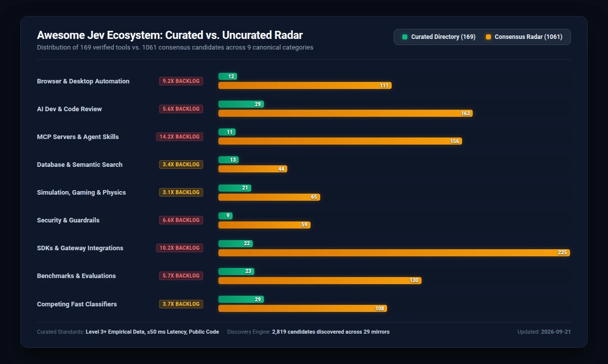

# Awesome Jev Ecosystem Radar  
> [!IMPORTANT]
> **Automated Ecosystem Radar and Staging Backlog:** Unvetted candidate tools discovered across [29 community mirrors](https://github.com/Gerry9000/awesome-jev).
>
> **How to Use the Radar:** The **[Curated Directory (README.md)](README.md)** features production-ready tools meeting our Three-Prong Verification Standard.
> In contrast, this Radar is an excellent resource to mine for hobby projects, hackathon prototypes, maturing tools, and emerging libraries awaiting full evaluation.

The candidate repositories and discussions below were discovered by automated scrapers across [29 community mirrors](https://github.com/Gerry9000/awesome-jev).
They represent the broader, rapidly evolving landscape of fast classification and non-generative AI experiments.
For our verified directory of production tools, interactive demos, and architectural dossiers, see the **[Curated Directory (README.md)](README.md)**.

## Radar Summary
- **Multi-Index Consensus Candidates (Seen in 3+ mirror lists)**: [1017 repositories](#1-multi-index-consensus-candidates)
- **Emerging Community Candidates (Seen in 2 mirror lists)**: [871 repositories](#2-emerging-community-candidates)
- **Single-Mention Discovery Queue**: [5090 repositories](#3-single-mention-discovery-queue)
- **Discovered X Discussions and Media Threads**: [2177 discussions](#4-discovered-x-discussions-and-demos)
- **Triage & Classification (TypeSafe Jev)**: [1017 consensus candidates classified](#1-multi-index-consensus-candidates)
- **Automated Categorization**: Candidate repositories classified across 9 canonical categories via TypeSafe Jev semantic triage. Repository stars (`⭐`) reflect live GitHub stargazers.

## Ecosystem Category Distribution: Curated vs. Uncurated Radar

 
<em>Figure 1: Distribution of 160 curated production implementations vs. 569 consensus candidates discovered across 29 community mirrors.</em>

---

## 1. Multi-Index Consensus Candidates

These candidate repositories appear across 3 or more independent comparison mirrors in the ecosystem:

- **[`sharziki/semdecide`](https://github.com/sharziki/semdecide)** *([16 mirrors](https://github.com/sharziki/semdecide))* `⭐ 38` `🏷️ AI Dev & Code Review` -- Typed semantic decisions for Unix pipelines and CI, powered by TypeSafe AI Jev.
- **[`GodsBoy/jev-agent-skill-router`](https://github.com/GodsBoy/jev-agent-skill-router)** *([15 mirrors](https://github.com/GodsBoy/jev-agent-skill-router))* `⭐ 17` `🏷️ AI Dev & Code Review`
- **[`wy-coliney/jev-browser-use`](https://github.com/wy-coliney/jev-browser-use)** *([15 mirrors](https://github.com/wy-coliney/jev-browser-use))* `⭐ 390` `🏷️ Browser & Automation` -- 5-10x faster browser operations: Jev clicks, Codex thinks and verifies.
- **[`GhalebDweikat/winnow`](https://github.com/GhalebDweikat/winnow)** *([14 mirrors](https://github.com/GhalebDweikat/winnow))* `⭐ 69` `🏷️ AI Dev & Code Review` -- A calibrated context sieve for Claude Code: every tool result is judged by a System One model before it enters.
- **[`dabit3/jev-experiments`](https://github.com/dabit3/jev-experiments)** *([13 mirrors](https://github.com/dabit3/jev-experiments))* `⭐ 370` `🏷️ Uncategorized`
- **[`GiesN/typesafe-jev-workflow`](https://github.com/GiesN/typesafe-jev-workflow)** *([13 mirrors](https://github.com/GiesN/typesafe-jev-workflow))* `⭐ 8` `🏷️ Uncategorized`
- **[`mejiasd3v/pi-jev-router`](https://github.com/mejiasd3v/pi-jev-router)** *([13 mirrors](https://github.com/mejiasd3v/pi-jev-router))* `⭐ 12` `🏷️ SDKs & Gateways`
- **[`sutro-sh/jev-align`](https://github.com/sutro-sh/jev-align)** *([13 mirrors](https://github.com/sutro-sh/jev-align))* `⭐ 276` `🏷️ Benchmarks & Evals` -- Build calibrated AI Functions from human feedback using Jev and GEPA.
- **[`TheoOliveira/pi-jev`](https://github.com/TheoOliveira/pi-jev)** *([13 mirrors](https://github.com/TheoOliveira/pi-jev))* `⭐ 41` `🏷️ AI Dev & Code Review` -- Semantic tool routing and typed System One decisions for the Pi coding agent using TypeSafe Jev
- **[`tumf/jev-cli`](https://github.com/tumf/jev-cli)** *([13 mirrors](https://github.com/tumf/jev-cli))* `⭐ 12` `🏷️ MCP Servers & Skills`
- **[`gtaras7/typesafe-jev`](https://github.com/gtaras7/typesafe-jev)** *([12 mirrors](https://github.com/gtaras7/typesafe-jev))* `⭐ 5` `🏷️ Uncategorized`
- **[`keltokhy/jgrep`](https://github.com/keltokhy/jgrep)** *([12 mirrors](https://github.com/keltokhy/jgrep))* `⭐ 21` `🏷️ Database & Search` -- grep, but the pattern is a description.
- **[`Kevthetech143/super-jev`](https://github.com/Kevthetech143/super-jev)** *([12 mirrors](https://github.com/Kevthetech143/super-jev))* `⭐ 9` `🏷️ AI Dev & Code Review` -- A small, extensible decision-to-action harness for TypeSafe Jev
- **[`luantak/is-malicious`](https://github.com/luantak/is-malicious)** *([12 mirrors](https://github.com/luantak/is-malicious))* `⭐ 23` `🏷️ Security & Moderation`
- **[`razorback16/openjev`](https://github.com/razorback16/openjev)** *([12 mirrors](https://github.com/razorback16/openjev))* `⭐ 321` `🏷️ Alternative Classifiers` -- Open, Jev-compatible System One decision server on DiffusionGemma
- **[`sorrycc/typesafe-snake`](https://github.com/sorrycc/typesafe-snake)** *([12 mirrors](https://github.com/sorrycc/typesafe-snake))* `⭐ 21` `🏷️ Simulation & Physical AI` -- Snake auto-played by TypeSafe's Jev model: one System One choice per tick, legal moves and facts generated in code
- **[`suenot/codex-jev-router`](https://github.com/suenot/codex-jev-router)** *([12 mirrors](https://github.com/suenot/codex-jev-router))* `⭐ 3` `🏷️ AI Dev & Code Review`
- **[`xinyao27/jevonian`](https://github.com/xinyao27/jevonian)** *([12 mirrors](https://github.com/xinyao27/jevonian))* `⭐ 2` `🏷️ Uncategorized`
- **[`24601/Augustus`](https://github.com/24601/Augustus)** *([11 mirrors](https://github.com/24601/Augustus))* `⭐ 6` `🏷️ MCP Servers & Skills` -- Agent skill for finding, building, evaluating, and improving decision-model systems.
- **[`AbdelStark/typesafe-rs`](https://github.com/AbdelStark/typesafe-rs)** *([11 mirrors](https://github.com/AbdelStark/typesafe-rs))* `⭐ 1` `🏷️ Uncategorized`
- **[`asfarsadewa/human-compiler`](https://github.com/asfarsadewa/human-compiler)** *([11 mirrors](https://github.com/asfarsadewa/human-compiler))* `⭐ 0` `🏷️ Uncategorized`
- **[`DanRWilloughby/snifftest`](https://github.com/DanRWilloughby/snifftest)** *([11 mirrors](https://github.com/DanRWilloughby/snifftest))* `⭐ 29` `🏷️ Uncategorized`
- **[`emrickgarrett/OneVOneJev`](https://github.com/emrickgarrett/OneVOneJev)** *([11 mirrors](https://github.com/emrickgarrett/OneVOneJev))* `⭐ 22` `🏷️ Simulation & Physical AI` -- 1v1 Jev quickscope arena -- Three.js + TypeSafe System One
- **[`jmanhype/jev-dspy-lab`](https://github.com/jmanhype/jev-dspy-lab)** *([11 mirrors](https://github.com/jmanhype/jev-dspy-lab))* `⭐ 3` `🏷️ Uncategorized`
- **[`kyotofin/tax-doc-classifier`](https://github.com/kyotofin/tax-doc-classifier)** *([11 mirrors](https://github.com/kyotofin/tax-doc-classifier))* `⭐ 399` `🏷️ Uncategorized` -- Tax document page classifier built on Jev decisions.
- **[`legacybridge-tech/pi-typesafe-jev`](https://github.com/legacybridge-tech/pi-typesafe-jev)** *([11 mirrors](https://github.com/legacybridge-tech/pi-typesafe-jev))* `⭐ 2` `🏷️ Uncategorized`
- **[`NandhaKishorM/laya`](https://github.com/NandhaKishorM/laya)** *([11 mirrors](https://github.com/NandhaKishorM/laya))* `⭐ 17,284` `🏷️ Alternative Classifiers` -- Non-autoregressive System 1 decision engine.
- **[`nexibeo/jev-cookbook`](https://github.com/nexibeo/jev-cookbook)** *([11 mirrors](https://github.com/nexibeo/jev-cookbook))* `⭐ 19` `🏷️ Database & Search` -- Practical, tested recipes for TypeSafe's Jev decision model on OpenRouter: support triage, database indexing, file organizing, tagging, taxonomies, dedupe, PII.
- **[`phyous/tsai-civ2`](https://github.com/phyous/tsai-civ2)** *([11 mirrors](https://github.com/phyous/tsai-civ2))* `⭐ 2` `🏷️ Uncategorized`
- **[`prismhq/jev-router`](https://github.com/prismhq/jev-router)** *([11 mirrors](https://github.com/prismhq/jev-router))* `⭐ 9` `🏷️ SDKs & Gateways`
- **[`raihankhan-rk/diffjury`](https://github.com/raihankhan-rk/diffjury)** *([11 mirrors](https://github.com/raihankhan-rk/diffjury))* `⭐ 5` `🏷️ AI Dev & Code Review`
- **[`replynodes/jev-web-analyzer`](https://github.com/replynodes/jev-web-analyzer)** *([11 mirrors](https://github.com/replynodes/jev-web-analyzer))* `⭐ 3` `🏷️ Browser & Automation`
- **[`siroccomask/snake-jev`](https://github.com/siroccomask/snake-jev)** *([11 mirrors](https://github.com/siroccomask/snake-jev))* `⭐ 0` `🏷️ Uncategorized`
- **[`sufianetaouil/every`](https://github.com/sufianetaouil/every)** *([11 mirrors](https://github.com/sufianetaouil/every))* `⭐ 7` `🏷️ Uncategorized`
- **[`tacticocc/Jevbridge`](https://github.com/tacticocc/Jevbridge)** *([11 mirrors](https://github.com/tacticocc/Jevbridge))* `⭐ 40` `🏷️ MCP Servers & Skills` -- ACP and MCP adapter that bridges TypeSafe Jev with any LLM -- computer use and typed decisions alongside Codex, Claude.
- **[`uehaj/jev-semgrep`](https://github.com/uehaj/jev-semgrep)** *([11 mirrors](https://github.com/uehaj/jev-semgrep))* `⭐ 130` `🏷️ Database & Search` -- grep by meaning, across languages.
- **[`AbdelStark/bicameral`](https://github.com/AbdelStark/bicameral)** *([10 mirrors](https://github.com/AbdelStark/bicameral))* `⭐ 5` `🏷️ Uncategorized`
- **[`AbdelStark/s1-rs`](https://github.com/AbdelStark/s1-rs)** *([10 mirrors](https://github.com/AbdelStark/s1-rs))* `⭐ 1` `🏷️ Alternative Classifiers`
- **[`adarshmishra07/jcm-router`](https://github.com/adarshmishra07/jcm-router)** *([10 mirrors](https://github.com/adarshmishra07/jcm-router))* `⭐ 4` `🏷️ SDKs & Gateways`
- **[`AkashPriyadarshii/jev-scout`](https://github.com/AkashPriyadarshii/jev-scout)** *([10 mirrors](https://github.com/AkashPriyadarshii/jev-scout))* `⭐ 2` `🏷️ AI Dev & Code Review` -- Zero-hallucination open-source repo and crate scout powered by TypeSafe AI Jev System One scoring
- **[`AkashPriyadarshii/jev-superpowers`](https://github.com/AkashPriyadarshii/jev-superpowers)** *([10 mirrors](https://github.com/AkashPriyadarshii/jev-superpowers))* `⭐ 18` `🏷️ AI Dev & Code Review` -- Systematic software development framework for AI coding agents upgraded with TypeSafe Jev System One typed decisions
- **[`anpicasso/hermes-jev-approvals`](https://github.com/anpicasso/hermes-jev-approvals)** *([10 mirrors](https://github.com/anpicasso/hermes-jev-approvals))* `⭐ 13` `🏷️ AI Dev & Code Review`
- **[`bladedevoff/stuntd`](https://github.com/bladedevoff/stuntd)** *([10 mirrors](https://github.com/bladedevoff/stuntd))* `⭐ 31` `🏷️ Alternative Classifiers` -- Local proxy that learns your app's typed LLM decisions and answers them with a Laya head.
- **[`Bodila51/grok-bot-jev`](https://github.com/Bodila51/grok-bot-jev)** *([10 mirrors](https://github.com/Bodila51/grok-bot-jev))* `⭐ 77` `🏷️ MCP Servers & Skills` -- Connect TypeSafe Jev to Grok Bot as a cheap decision layer - usage gates, skill template, examples
- **[`Butochnikov/typesafe-sdk-php`](https://github.com/Butochnikov/typesafe-sdk-php)** *([10 mirrors](https://github.com/Butochnikov/typesafe-sdk-php))* `⭐ 1` `🏷️ SDKs & Gateways`
- **[`DECRUX9812/typesafe-skill-router`](https://github.com/DECRUX9812/typesafe-skill-router)** *([10 mirrors](https://github.com/DECRUX9812/typesafe-skill-router))* `⭐ 13` `🏷️ MCP Servers & Skills`
- **[`devagrawal09/stanley-code`](https://github.com/devagrawal09/stanley-code)** *([10 mirrors](https://github.com/devagrawal09/stanley-code))* `⭐ 113` `🏷️ Uncategorized`
- **[`doeixd/discern`](https://github.com/doeixd/discern)** *([10 mirrors](https://github.com/doeixd/discern))* `⭐ 13` `🏷️ Uncategorized`
- **[`HyunjunJeon/jev-judgment`](https://github.com/HyunjunJeon/jev-judgment)** *([10 mirrors](https://github.com/HyunjunJeon/jev-judgment))* `⭐ 3` `🏷️ Uncategorized`
- **[`iamvatsalpatel/tiershift`](https://github.com/iamvatsalpatel/tiershift)** *([10 mirrors](https://github.com/iamvatsalpatel/tiershift))* `⭐ 3` `🏷️ Uncategorized`
- **[`jerryjliu/docjev`](https://github.com/jerryjliu/docjev)** *([10 mirrors](https://github.com/jerryjliu/docjev))* `⭐ 294` `🏷️ Alternative Classifiers` -- A very fast document classifier/splitter using Jev
- **[`joelhooks/pi-fast-jev-compaction`](https://github.com/joelhooks/pi-fast-jev-compaction)** *([10 mirrors](https://github.com/joelhooks/pi-fast-jev-compaction))* `⭐ 10` `🏷️ Uncategorized`
- **[`kavehmz/typesafe-playground`](https://github.com/kavehmz/typesafe-playground)** *([10 mirrors](https://github.com/kavehmz/typesafe-playground))* `⭐ 12` `🏷️ Uncategorized`
- **[`khordoo/jev-reflex-autonomy-lab`](https://github.com/khordoo/jev-reflex-autonomy-lab)** *([10 mirrors](https://github.com/khordoo/jev-reflex-autonomy-lab))* `⭐ 16` `🏷️ Simulation & Physical AI`
- **[`kshetrajna12/reflex`](https://github.com/kshetrajna12/reflex)** *([10 mirrors](https://github.com/kshetrajna12/reflex))* `⭐ 122` `🏷️ Alternative Classifiers` -- A small open decision model: state + typed questions -> calibrated probabilities.
- **[`kylemclaren/jevsearch`](https://github.com/kylemclaren/jevsearch)** *([10 mirrors](https://github.com/kylemclaren/jevsearch))* `⭐ 7` `🏷️ Database & Search`
- **[`markjaquith/typesafe-ai-playground`](https://github.com/markjaquith/typesafe-ai-playground)** *([10 mirrors](https://github.com/markjaquith/typesafe-ai-playground))* `⭐ 2` `🏷️ Alternative Classifiers` -- A playground for experiments around Jev, TypeSafe's System One model.
- **[`qkal/Canny`](https://github.com/qkal/Canny)** *([10 mirrors](https://github.com/qkal/Canny))* `⭐ 50` `🏷️ AI Dev & Code Review` -- Stops AI coding agents from claiming work is done without evidence.
- **[`r-ms/mini-jev`](https://github.com/r-ms/mini-jev)** *([10 mirrors](https://github.com/r-ms/mini-jev))* `⭐ 47` `🏷️ Benchmarks & Evals` -- mini-Jev: what a Jev-style typed-decision interface looks like on a frozen Qwen3-4 B -- read the option letter's logits instead.
- **[`santos-sanz/jev-audio-beeper`](https://github.com/santos-sanz/jev-audio-beeper)** *([10 mirrors](https://github.com/santos-sanz/jev-audio-beeper))* `⭐ 2` `🏷️ Uncategorized`
- **[`vercel/eve`](https://github.com/vercel/eve)** *([10 mirrors](https://github.com/vercel/eve))* `⭐ 5,324` `🏷️ Uncategorized`
- **[`zhihz/openjev`](https://github.com/zhihz/openjev)** *([10 mirrors](https://github.com/zhihz/openjev))* `⭐ 32` `🏷️ Uncategorized`
- **[`AbdelStark/awesome-typesafe`](https://github.com/AbdelStark/awesome-typesafe)** *([9 mirrors](https://github.com/AbdelStark/awesome-typesafe))* `⭐ 476` `🏷️ Uncategorized`
- **[`AbdelStark/awesome-typesafe-jev`](https://github.com/AbdelStark/awesome-typesafe-jev)** *([9 mirrors](https://github.com/AbdelStark/awesome-typesafe-jev))* `⭐ 476` `🏷️ SDKs & Gateways` -- Awesome Jev: a source-backed field guide to TypeSafe's System One model, with SDKs, live demos, agent tools, and independent evaluations.
- **[`AbdelStark/heist-one`](https://github.com/AbdelStark/heist-one)** *([9 mirrors](https://github.com/AbdelStark/heist-one))* `⭐ 7` `🏷️ Uncategorized`
- **[`AkashPriyadarshii/jev-git`](https://github.com/AkashPriyadarshii/jev-git)** *([9 mirrors](https://github.com/AkashPriyadarshii/jev-git))* `⭐ 2` `🏷️ Uncategorized`
- **[`allebee/pytest-jev`](https://github.com/allebee/pytest-jev)** *([9 mirrors](https://github.com/allebee/pytest-jev))* `⭐ 2` `🏷️ Uncategorized`
- **[`Brainwires/jevwire`](https://github.com/Brainwires/jevwire)** *([9 mirrors](https://github.com/Brainwires/jevwire))* `⭐ 18` `🏷️ Uncategorized`
- **[`burnigtm/jev-mcp`](https://github.com/burnigtm/jev-mcp)** *([9 mirrors](https://github.com/burnigtm/jev-mcp))* `⭐ 37` `🏷️ MCP Servers & Skills` -- MCP server that puts TypeSafe Jev on the coding loop in Cursor, Codex, and any MCP client
- **[`cephalization/jev-triage`](https://github.com/cephalization/jev-triage)** *([9 mirrors](https://github.com/cephalization/jev-triage))* `⭐ 1` `🏷️ AI Dev & Code Review`
- **[`Devin-AXIS/jev-dsh-decision`](https://github.com/Devin-AXIS/jev-dsh-decision)** *([9 mirrors](https://github.com/Devin-AXIS/jev-dsh-decision))* `⭐ 116` `🏷️ Uncategorized`
- **[`DevMortimer/pi-typesafe`](https://github.com/DevMortimer/pi-typesafe)** *([9 mirrors](https://github.com/DevMortimer/pi-typesafe))* `⭐ 42` `🏷️ Uncategorized`
- **[`Dimweaker/jev-libero`](https://github.com/Dimweaker/jev-libero)** *([9 mirrors](https://github.com/Dimweaker/jev-libero))* `⭐ 57` `🏷️ Uncategorized`
- **[`Eliot5566/JEV-Paper-Radar`](https://github.com/Eliot5566/JEV-Paper-Radar)** *([9 mirrors](https://github.com/Eliot5566/JEV-Paper-Radar))* `⭐ 16` `🏷️ AI Dev & Code Review` -- Let Jev read every new arXiv paper each morning and surface the few you should read.
- **[`fazlerocks/jevmail`](https://github.com/fazlerocks/jevmail)** *([9 mirrors](https://github.com/fazlerocks/jevmail))* `⭐ 66` `🏷️ Uncategorized` -- Open-source AI email triage for Gmail.
- **[`FBddcz/embodied-jev`](https://github.com/FBddcz/embodied-jev)** *([9 mirrors](https://github.com/FBddcz/embodied-jev))* `⭐ 192` `🏷️ Simulation & Physical AI` -- EmbodiedJev: MuJoCo robot decision workbench with MiniCPM5-2 B, Jev and compatible model APIs
- **[`forvela/jev-agent-browser`](https://github.com/forvela/jev-agent-browser)** *([9 mirrors](https://github.com/forvela/jev-agent-browser))* `⭐ 8` `🏷️ Browser & Automation`
- **[`frostney/clean-code-review`](https://github.com/frostney/clean-code-review)** *([9 mirrors](https://github.com/frostney/clean-code-review))* `⭐ 10` `🏷️ AI Dev & Code Review`
- **[`GenieRobot/typesafe-ai-rails`](https://github.com/GenieRobot/typesafe-ai-rails)** *([9 mirrors](https://github.com/GenieRobot/typesafe-ai-rails))* `⭐ 2` `🏷️ SDKs & Gateways`
- **[`Heman10x-NGU/openJev-verdict-2.0`](https://github.com/Heman10x-NGU/openJev-verdict-2.0)** *([9 mirrors](https://github.com/Heman10x-NGU/openJev-verdict-2.0))* `⭐ 268` `🏷️ Alternative Classifiers` -- Calibrated 151 M Non-Autoregressive Decision Engine beating TypeSafe Jev & Laya on LocalLLaMA/typed-decisions (77.10% acc, 0.0636 Brier, 0.0144 ECE)
- **[`HyunjunJeon/pi-quiet-ask`](https://github.com/HyunjunJeon/pi-quiet-ask)** *([9 mirrors](https://github.com/HyunjunJeon/pi-quiet-ask))* `⭐ 10` `🏷️ Uncategorized`
- **[`jomatsu/zod-jev`](https://github.com/jomatsu/zod-jev)** *([9 mirrors](https://github.com/jomatsu/zod-jev))* `⭐ 8` `🏷️ Uncategorized`
- **[`keltokhy/jsort`](https://github.com/keltokhy/jsort)** *([9 mirrors](https://github.com/keltokhy/jsort))* `⭐ 18` `🏷️ Uncategorized`
- **[`kevinbadi/jev-voice`](https://github.com/kevinbadi/jev-voice)** *([9 mirrors](https://github.com/kevinbadi/jev-voice))* `⭐ 80` `🏷️ Browser & Automation` -- Talk to your Mac.
- **[`klauswg/jev-guard`](https://github.com/klauswg/jev-guard)** *([9 mirrors](https://github.com/klauswg/jev-guard))* `⭐ 37` `🏷️ Security & Moderation` -- Real-time risk triage gateway for exchange deposits and withdrawals -- Jev (TypeSafe System One) handles triage only; adjudication stays in.
- **[`kylemclaren/jevpdf`](https://github.com/kylemclaren/jevpdf)** *([9 mirrors](https://github.com/kylemclaren/jevpdf))* `⭐ 4` `🏷️ Uncategorized`
- **[`lakeday-org/perch`](https://github.com/lakeday-org/perch)** *([9 mirrors](https://github.com/lakeday-org/perch))* `⭐ 171` `🏷️ Uncategorized`
- **[`MarissaFamularo/citation-verifier`](https://github.com/MarissaFamularo/citation-verifier)** *([9 mirrors](https://github.com/MarissaFamularo/citation-verifier))* `⭐ 7` `🏷️ Uncategorized`
- **[`monteduro/killmyidea`](https://github.com/monteduro/killmyidea)** *([9 mirrors](https://github.com/monteduro/killmyidea))* `⭐ 109` `🏷️ Uncategorized`
- **[`nidhi-singh02/agent-router`](https://github.com/nidhi-singh02/agent-router)** *([9 mirrors](https://github.com/nidhi-singh02/agent-router))* `⭐ 68` `🏷️ AI Dev & Code Review`
- **[`noplan-inc/limpet`](https://github.com/noplan-inc/limpet)** *([9 mirrors](https://github.com/noplan-inc/limpet))* `⭐ 3` `🏷️ Uncategorized`
- **[`Nyarlathoteppppp/pi-heed`](https://github.com/Nyarlathoteppppp/pi-heed)** *([9 mirrors](https://github.com/Nyarlathoteppppp/pi-heed))* `⭐ 7` `🏷️ Uncategorized`
- **[`RINNECODER/jev-behavior-study`](https://github.com/RINNECODER/jev-behavior-study)** *([9 mirrors](https://github.com/RINNECODER/jev-behavior-study))* `⭐ 3` `🏷️ Uncategorized`
- **[`Sac-Y/Jev-cu`](https://github.com/Sac-Y/Jev-cu)** *([9 mirrors](https://github.com/Sac-Y/Jev-cu))* `⭐ 583` `🏷️ Uncategorized`
- **[`scienthoon/jev-ood-calibration`](https://github.com/scienthoon/jev-ood-calibration)** *([9 mirrors](https://github.com/scienthoon/jev-ood-calibration))* `⭐ 6` `🏷️ Benchmarks & Evals`
- **[`shinpr/jev-reranker`](https://github.com/shinpr/jev-reranker)** *([9 mirrors](https://github.com/shinpr/jev-reranker))* `⭐ 4` `🏷️ Database & Search` -- Rerank, filter, and compress JSON search results with TypeSafe AI's Jev.
- **[`spring-ai-community/spring-ai-typesafe`](https://github.com/spring-ai-community/spring-ai-typesafe)** *([9 mirrors](https://github.com/spring-ai-community/spring-ai-typesafe))* `⭐ 29` `🏷️ SDKs & Gateways`
- **[`Tangerg/typesafe-sdk-go`](https://github.com/Tangerg/typesafe-sdk-go)** *([9 mirrors](https://github.com/Tangerg/typesafe-sdk-go))* `⭐ 9` `🏷️ SDKs & Gateways`
- **[`trungdq88/youtube-sponsor-detection`](https://github.com/trungdq88/youtube-sponsor-detection)** *([9 mirrors](https://github.com/trungdq88/youtube-sponsor-detection))* `⭐ 91` `🏷️ Uncategorized`
- **[`usenotra/notra`](https://github.com/usenotra/notra)** *([9 mirrors](https://github.com/usenotra/notra))* `⭐ 213` `🏷️ Uncategorized`
- **[`vercel-labs/ai-cli`](https://github.com/vercel-labs/ai-cli)** *([9 mirrors](https://github.com/vercel-labs/ai-cli))* `⭐ 811` `🏷️ MCP Servers & Skills`
- **[`wuyoscar/jev-skill`](https://github.com/wuyoscar/jev-skill)** *([9 mirrors](https://github.com/wuyoscar/jev-skill))* `⭐ 439` `🏷️ MCP Servers & Skills` -- An awesome collection of Jev use cases, workflows, and agent skills.
- **[`zadescoxp/Jev-Trades`](https://github.com/zadescoxp/Jev-Trades)** *([9 mirrors](https://github.com/zadescoxp/Jev-Trades))* `⭐ 27` `🏷️ Uncategorized` -- Trading bot with the all new TypeSafe AI's first system one model named as Jev
- **[`zhirschtritt/typesafe-go`](https://github.com/zhirschtritt/typesafe-go)** *([9 mirrors](https://github.com/zhirschtritt/typesafe-go))* `⭐ 2` `🏷️ SDKs & Gateways` -- Idiomatic Go SDK for the TypeSafe AI API
- **[`zilliztech/memsearch`](https://github.com/zilliztech/memsearch)** *([9 mirrors](https://github.com/zilliztech/memsearch))* `⭐ 2,662` `🏷️ Benchmarks & Evals`
- **[`allebee/jevk5`](https://github.com/allebee/jevk5)** *([8 mirrors](https://github.com/allebee/jevk5))* `⭐ 110` `🏷️ Alternative Classifiers` -- JevK5: open-weight alternative to TypeSafe Jev.
- **[`altryne/jevify`](https://github.com/altryne/jevify)** *([8 mirrors](https://github.com/altryne/jevify))* `⭐ 25` `🏷️ Uncategorized`
- **[`anishfn/shapeshift`](https://github.com/anishfn/shapeshift)** *([8 mirrors](https://github.com/anishfn/shapeshift))* `⭐ 677` `🏷️ Uncategorized`
- **[`BYK/jev-mcp`](https://github.com/BYK/jev-mcp)** *([8 mirrors](https://github.com/BYK/jev-mcp))* `⭐ 2` `🏷️ MCP Servers & Skills` -- An eval-first MCP server for TypeSafe's Jev, a System One model that returns typed judgments (noul, choice, score) with probabilities.
- **[`choxos/jev-reviewer`](https://github.com/choxos/jev-reviewer)** *([8 mirrors](https://github.com/choxos/jev-reviewer))* `⭐ 32` `🏷️ Uncategorized` -- Data extraction for systematic reviews, quoted from the papers.
- **[`docxology/daf-jev`](https://github.com/docxology/daf-jev)** *([8 mirrors](https://github.com/docxology/daf-jev))* `⭐ 6` `🏷️ SDKs & Gateways` -- daf-jev: composable Python toolkit for TypeSafe's Jev (System One) decision API -- question builders, confidence gates, evaluator, calibration, CLI, MCP.
- **[`EugeneBoondock/jevsql`](https://github.com/EugeneBoondock/jevsql)** *([8 mirrors](https://github.com/EugeneBoondock/jevsql))* `⭐ 5` `🏷️ Database & Search`
- **[`FirasSX914/Janus`](https://github.com/FirasSX914/Janus)** *([8 mirrors](https://github.com/FirasSX914/Janus))* `⭐ 2` `🏷️ Uncategorized`
- **[`Foadsf/jev-for-engineers`](https://github.com/Foadsf/jev-for-engineers)** *([8 mirrors](https://github.com/Foadsf/jev-for-engineers))* `⭐ 3` `🏷️ Uncategorized`
- **[`gaborishka/jev-canvas`](https://github.com/gaborishka/jev-canvas)** *([8 mirrors](https://github.com/gaborishka/jev-canvas))* `⭐ 3` `🏷️ Browser & Automation` -- Draw on a tldraw canvas with your voice and a pointing finger.
- **[`genai-craft/openvons`](https://github.com/genai-craft/openvons)** *([8 mirrors](https://github.com/genai-craft/openvons))* `⭐ 13` `🏷️ Uncategorized`
- **[`haseeb-heaven/jev-system-one`](https://github.com/haseeb-heaven/jev-system-one)** *([8 mirrors](https://github.com/haseeb-heaven/jev-system-one))* `⭐ 4` `🏷️ MCP Servers & Skills` -- A polished OpenAI + TypeSafe Jev terminal interface for answers with transparent decision reports
- **[`hev/reranker`](https://github.com/hev/reranker)** *([8 mirrors](https://github.com/hev/reranker))* `⭐ 9` `🏷️ Database & Search` -- Use Jev (TypeSafe's System One model) as a calibrated reranker: one call, up to 30 documents, a probability per document.
- **[`hotchpotch/jev-reranker`](https://github.com/hotchpotch/jev-reranker)** *([8 mirrors](https://github.com/hotchpotch/jev-reranker))* `⭐ 14` `🏷️ Uncategorized`
- **[`jev-chat/jev-chat-jarvis`](https://github.com/jev-chat/jev-chat-jarvis)** *([8 mirrors](https://github.com/jev-chat/jev-chat-jarvis))* `⭐ 6,668` `🏷️ Browser & Automation` -- 装在手机上的对话副驾：在 QQ / X / 飞书里读懂对方、给出候选回复、一键填入输入框，发不发由你。非侵入，只读屏幕，不 hook 不改包。
- **[`jgridifier/jev-research-eval`](https://github.com/jgridifier/jev-research-eval)** *([8 mirrors](https://github.com/jgridifier/jev-research-eval))* `⭐ 2` `🏷️ Benchmarks & Evals`
- **[`JoshuaSP/open-jev`](https://github.com/JoshuaSP/open-jev)** *([8 mirrors](https://github.com/JoshuaSP/open-jev))* `⭐ 29` `🏷️ Uncategorized`
- **[`jtsang4/jev-cli`](https://github.com/jtsang4/jev-cli)** *([8 mirrors](https://github.com/jtsang4/jev-cli))* `⭐ 3` `🏷️ MCP Servers & Skills`
- **[`keltokhy/jlink`](https://github.com/keltokhy/jlink)** *([8 mirrors](https://github.com/keltokhy/jlink))* `⭐ 4` `🏷️ Uncategorized`
- **[`kiwi0719/jev-edge`](https://github.com/kiwi0719/jev-edge)** *([8 mirrors](https://github.com/kiwi0719/jev-edge))* `⭐ 5` `🏷️ Security & Moderation` -- Typed-judgment admission control at the traffic edge: three-layer prompt-injection and abuse filter for nginx/OpenResty, powered by TypeSafe Jev.
- **[`klauswg/jev-suite`](https://github.com/klauswg/jev-suite)** *([8 mirrors](https://github.com/klauswg/jev-suite))* `⭐ 33` `🏷️ Uncategorized` -- Four decision-quality tools on Jev (TypeSafe System One): Jev answers structured questions, deterministic code keeps the final say.
- **[`komikat/jev-bfs`](https://github.com/komikat/jev-bfs)** *([8 mirrors](https://github.com/komikat/jev-bfs))* `⭐ 0` `🏷️ Uncategorized`
- **[`leonaaardob/fast-dev-compaction`](https://github.com/leonaaardob/fast-dev-compaction)** *([8 mirrors](https://github.com/leonaaardob/fast-dev-compaction))* `⭐ 4` `🏷️ Uncategorized`
- **[`milvus-io/bootcamp`](https://github.com/milvus-io/bootcamp)** *([8 mirrors](https://github.com/milvus-io/bootcamp))* `⭐ 2,446` `🏷️ Benchmarks & Evals`
- **[`milvus-io/milvus-model`](https://github.com/milvus-io/milvus-model)** *([8 mirrors](https://github.com/milvus-io/milvus-model))* `⭐ 61` `🏷️ Database & Search`
- **[`mizchi/jev-gomoku`](https://github.com/mizchi/jev-gomoku)** *([8 mirrors](https://github.com/mizchi/jev-gomoku))* `⭐ 0` `🏷️ Simulation & Physical AI`
- **[`mizchi/jev-lint`](https://github.com/mizchi/jev-lint)** *([8 mirrors](https://github.com/mizchi/jev-lint))* `⭐ 74` `🏷️ AI Dev & Code Review`
- **[`Nisaka520/JevBystander`](https://github.com/Nisaka520/JevBystander)** *([8 mirrors](https://github.com/Nisaka520/JevBystander))* `⭐ 13` `🏷️ Browser & Automation`
- **[`nokia-applied-research/AnyJev`](https://github.com/nokia-applied-research/AnyJev)** *([8 mirrors](https://github.com/nokia-applied-research/AnyJev))* `⭐ 793` `🏷️ Alternative Classifiers` -- Turn any LLM into a Jev-style decision model: typed decisions, real probabilities, no training.
- **[`openlayer-ai/jevals`](https://github.com/openlayer-ai/jevals)** *([8 mirrors](https://github.com/openlayer-ai/jevals))* `⭐ 64` `🏷️ Benchmarks & Evals` -- Agent evals and guardrails as Jev decisions: one request per trace, a fraction of a cent, fast enough for the.
- **[`peterfriese/jev-foundation-models`](https://github.com/peterfriese/jev-foundation-models)** *([8 mirrors](https://github.com/peterfriese/jev-foundation-models))* `⭐ 32` `🏷️ SDKs & Gateways` -- A lightweight, native Swift 6 bridge integrating TypeSafe AI's Jev System One decision model into Apple's Foundation Models framework.
- **[`PistachioAIHQ/jev-synergy-screening`](https://github.com/PistachioAIHQ/jev-synergy-screening)** *([8 mirrors](https://github.com/PistachioAIHQ/jev-synergy-screening))* `⭐ 1` `🏷️ Benchmarks & Evals` -- Jev (TypeSafe System One) × ASReview SYNERGY abstract screening demo -- Choice/Noul vs gold labels
- **[`PromptEngineer48/laya-vs-jev-arena`](https://github.com/PromptEngineer48/laya-vs-jev-arena)** *([8 mirrors](https://github.com/PromptEngineer48/laya-vs-jev-arena))* `⭐ 25` `🏷️ Benchmarks & Evals`
- **[`RafalWilinski/vibecheck`](https://github.com/RafalWilinski/vibecheck)** *([8 mirrors](https://github.com/RafalWilinski/vibecheck))* `⭐ 47` `🏷️ Uncategorized`
- **[`rokbenko/quackd`](https://github.com/rokbenko/quackd)** *([8 mirrors](https://github.com/rokbenko/quackd))* `⭐ 229` `🏷️ Simulation & Physical AI` -- One CLI for all your robots.
- **[`smkrv/jev-calibrate`](https://github.com/smkrv/jev-calibrate)** *([8 mirrors](https://github.com/smkrv/jev-calibrate))* `⭐ 31` `🏷️ Benchmarks & Evals`
- **[`sosopop/jev_stock`](https://github.com/sosopop/jev_stock)** *([8 mirrors](https://github.com/sosopop/jev_stock))* `⭐ 12` `🏷️ Uncategorized`
- **[`TheoLeeCJ/SemIf-OpenJev`](https://github.com/TheoLeeCJ/SemIf-OpenJev)** *([8 mirrors](https://github.com/TheoLeeCJ/SemIf-OpenJev))* `⭐ 4,392` `🏷️ Alternative Classifiers` -- Semantic ifs from open models, on a 3090 at home.
- **[`tontoko/jev-browser`](https://github.com/tontoko/jev-browser)** *([8 mirrors](https://github.com/tontoko/jev-browser))* `⭐ 7` `🏷️ Browser & Automation`
- **[`vinilana/live-jev`](https://github.com/vinilana/live-jev)** *([8 mirrors](https://github.com/vinilana/live-jev))* `⭐ 17` `🏷️ Uncategorized`
- **[`y0usaf/typesafe-cli`](https://github.com/y0usaf/typesafe-cli)** *([8 mirrors](https://github.com/y0usaf/typesafe-cli))* `⭐ 4` `🏷️ MCP Servers & Skills` -- Ask Jev typed questions from the shell: noul, choice, and score answers as numbers, not prose
- **[`yikangy873-gif/jev-desktop`](https://github.com/yikangy873-gif/jev-desktop)** *([8 mirrors](https://github.com/yikangy873-gif/jev-desktop))* `⭐ 63` `🏷️ Browser & Automation` -- TypeSafe Jev action selection inside Codex Computer Use
- **[`zwliJay/jev-forge`](https://github.com/zwliJay/jev-forge)** *([8 mirrors](https://github.com/zwliJay/jev-forge))* `⭐ 20` `🏷️ Uncategorized`
- **[`achimala/jev-paint`](https://github.com/achimala/jev-paint)** *([7 mirrors](https://github.com/achimala/jev-paint))* `⭐ 49` `🏷️ Uncategorized`
- **[`agent-chaperone/agent-chaperone`](https://github.com/agent-chaperone/agent-chaperone)** *([7 mirrors](https://github.com/agent-chaperone/agent-chaperone))* `⭐ 20` `🏷️ MCP Servers & Skills`
- **[`agent-labs-dev/fastbrowse`](https://github.com/agent-labs-dev/fastbrowse)** *([7 mirrors](https://github.com/agent-labs-dev/fastbrowse))* `⭐ 97` `🏷️ Browser & Automation`
- **[`AlbionaHoti/refgarden`](https://github.com/AlbionaHoti/refgarden)** *([7 mirrors](https://github.com/AlbionaHoti/refgarden))* `⭐ 28` `🏷️ Uncategorized`
- **[`Alex314618-create/JevRev`](https://github.com/Alex314618-create/JevRev)** *([7 mirrors](https://github.com/Alex314618-create/JevRev))* `⭐ 306` `🏷️ AI Dev & Code Review` -- An LLM + Jev workflow that changes EVERYTHING.
- **[`allebee/jevgrep`](https://github.com/allebee/jevgrep)** *([7 mirrors](https://github.com/allebee/jevgrep))* `⭐ 1` `🏷️ Database & Search`
- **[`andududu/jeview`](https://github.com/andududu/jeview)** *([7 mirrors](https://github.com/andududu/jeview))* `⭐ 56` `🏷️ Uncategorized`
- **[`ankit-aglawe/tinyjev`](https://github.com/ankit-aglawe/tinyjev)** *([7 mirrors](https://github.com/ankit-aglawe/tinyjev))* `⭐ 25` `🏷️ Uncategorized` -- A tiny jev-like model that answers Choice, Score and Noul questions in one forward pass and returns calibrated probabilities.
- **[`brainstormity/Jev-X-Sentiment-Analysis`](https://github.com/brainstormity/Jev-X-Sentiment-Analysis)** *([7 mirrors](https://github.com/brainstormity/Jev-X-Sentiment-Analysis))* `⭐ 162` `🏷️ Uncategorized`
- **[`chopratejas/invalidate`](https://github.com/chopratejas/invalidate)** *([7 mirrors](https://github.com/chopratejas/invalidate))* `⭐ 18` `🏷️ Uncategorized`
- **[`coldteadotai/abide`](https://github.com/coldteadotai/abide)** *([7 mirrors](https://github.com/coldteadotai/abide))* `⭐ 210` `🏷️ Uncategorized`
- **[`d-date/swift-jev`](https://github.com/d-date/swift-jev)** *([7 mirrors](https://github.com/d-date/swift-jev))* `⭐ 16` `🏷️ SDKs & Gateways`
- **[`devagrawal09/jev-code`](https://github.com/devagrawal09/jev-code)** *([7 mirrors](https://github.com/devagrawal09/jev-code))* `⭐ 113` `🏷️ Uncategorized`
- **[`DomMonte/n8n-nodes-typesafe-ai`](https://github.com/DomMonte/n8n-nodes-typesafe-ai)** *([7 mirrors](https://github.com/DomMonte/n8n-nodes-typesafe-ai))* `⭐ 0` `🏷️ Uncategorized`
- **[`FFatTiger/new-api-plugin-typesafe`](https://github.com/FFatTiger/new-api-plugin-typesafe)** *([7 mirrors](https://github.com/FFatTiger/new-api-plugin-typesafe))* `⭐ 3` `🏷️ MCP Servers & Skills`
- **[`Friedjof/jev-mobile`](https://github.com/Friedjof/jev-mobile)** *([7 mirrors](https://github.com/Friedjof/jev-mobile))* `⭐ 4` `🏷️ Browser & Automation`
- **[`gamesonrblx/Jevbridge`](https://github.com/gamesonrblx/Jevbridge)** *([7 mirrors](https://github.com/gamesonrblx/Jevbridge))* `⭐ 40` `🏷️ Uncategorized`
- **[`grmkris/robo-harness`](https://github.com/grmkris/robo-harness)** *([7 mirrors](https://github.com/grmkris/robo-harness))* `⭐ 2` `🏷️ Simulation & Physical AI`
- **[`hamakyo/jev-starter`](https://github.com/hamakyo/jev-starter)** *([7 mirrors](https://github.com/hamakyo/jev-starter))* `⭐ 2` `🏷️ Uncategorized`
- **[`harshil1712/slidepilot`](https://github.com/harshil1712/slidepilot)** *([7 mirrors](https://github.com/harshil1712/slidepilot))* `⭐ 4` `🏷️ Uncategorized`
- **[`Hawxy/TypeSafeAI.Net`](https://github.com/Hawxy/TypeSafeAI.Net)** *([7 mirrors](https://github.com/Hawxy/TypeSafeAI.Net))* `⭐ 2` `🏷️ SDKs & Gateways`
- **[`hegargarcia/jev-playground`](https://github.com/hegargarcia/jev-playground)** *([7 mirrors](https://github.com/hegargarcia/jev-playground))* `⭐ 0` `🏷️ Uncategorized`
- **[`intikhab49/open-jev-typed-decision-engine`](https://github.com/intikhab49/open-jev-typed-decision-engine)** *([7 mirrors](https://github.com/intikhab49/open-jev-typed-decision-engine))* `⭐ 40` `🏷️ Alternative Classifiers` -- Open reproduction of TypeSafe Jev: a 150 M typed decision engine (noul/choice/score in one non-autoregressive pass, calibrated confidence).
- **[`jerryfane/omp-jev-compaction`](https://github.com/jerryfane/omp-jev-compaction)** *([7 mirrors](https://github.com/jerryfane/omp-jev-compaction))* `⭐ 8` `🏷️ Uncategorized`
- **[`Jevals/jevals-data`](https://github.com/Jevals/jevals-data)** *([7 mirrors](https://github.com/Jevals/jevals-data))* `⭐ 2` `🏷️ Benchmarks & Evals`
- **[`joshlarsen/jev-t-rex-runner`](https://github.com/joshlarsen/jev-t-rex-runner)** *([7 mirrors](https://github.com/joshlarsen/jev-t-rex-runner))* `⭐ 0` `🏷️ Simulation & Physical AI`
- **[`KantaHayashiAI/jev-does-not-play-dice`](https://github.com/KantaHayashiAI/jev-does-not-play-dice)** *([7 mirrors](https://github.com/KantaHayashiAI/jev-does-not-play-dice))* `⭐ 4` `🏷️ Benchmarks & Evals` -- Experiments on Jev’s probability calibration, uncertainty reporting, and forecast probability preservation.
- **[`keltokhy/jselect`](https://github.com/keltokhy/jselect)** *([7 mirrors](https://github.com/keltokhy/jselect))* `⭐ 3` `🏷️ Browser & Automation`
- **[`kitze/pagegrade`](https://github.com/kitze/pagegrade)** *([7 mirrors](https://github.com/kitze/pagegrade))* `⭐ 4` `🏷️ Uncategorized`
- **[`ktaletsk/jevframe`](https://github.com/ktaletsk/jevframe)** *([7 mirrors](https://github.com/ktaletsk/jevframe))* `⭐ 13` `🏷️ Uncategorized`
- **[`lahfir/agent-desktop`](https://github.com/lahfir/agent-desktop)** *([7 mirrors](https://github.com/lahfir/agent-desktop))* `⭐ 1,528` `🏷️ Browser & Automation`
- **[`libingzheren/Jev-Mem`](https://github.com/libingzheren/Jev-Mem)** *([7 mirrors](https://github.com/libingzheren/Jev-Mem))* `⭐ 33` `🏷️ Uncategorized`
- **[`lykycy123/RoboJEV`](https://github.com/lykycy123/RoboJEV)** *([7 mirrors](https://github.com/lykycy123/RoboJEV))* `⭐ 35` `🏷️ Simulation & Physical AI`
- **[`maker-KK/todo-jev`](https://github.com/maker-KK/todo-jev)** *([7 mirrors](https://github.com/maker-KK/todo-jev))* `⭐ 3` `🏷️ Uncategorized`
- **[`malevrigns/agent-jev`](https://github.com/malevrigns/agent-jev)** *([7 mirrors](https://github.com/malevrigns/agent-jev))* `⭐ 307` `🏷️ Alternative Classifiers` -- AgentJev-0.6 B - a fast 'System One' decision model for AI Agents: feed it any unstructured state (diffs, traces, logs).
- **[`mithalouni/system-one-open`](https://github.com/mithalouni/system-one-open)** *([7 mirrors](https://github.com/mithalouni/system-one-open))* `⭐ 33` `🏷️ Alternative Classifiers` -- Open replica of TypeSafe's Jev: typed calibrated decisions in one forward pass, on Gemma 4 E2 B / Gemma 3.
- **[`mizchi/jev-test-filter`](https://github.com/mizchi/jev-test-filter)** *([7 mirrors](https://github.com/mizchi/jev-test-filter))* `⭐ 15` `🏷️ Uncategorized`
- **[`Nasrallah-AL/jev-cli`](https://github.com/Nasrallah-AL/jev-cli)** *([7 mirrors](https://github.com/Nasrallah-AL/jev-cli))* `⭐ 20` `🏷️ MCP Servers & Skills`
- **[`Nisaka520/JevIntent`](https://github.com/Nisaka520/JevIntent)** *([7 mirrors](https://github.com/Nisaka520/JevIntent))* `⭐ 59` `🏷️ MCP Servers & Skills` -- 微信（FkWeChat 插件）：长按消息分析意图 / 情绪 / 回复姿态，只在本机弹提示，对方无感知
- **[`noelzappy/tripwire`](https://github.com/noelzappy/tripwire)** *([7 mirrors](https://github.com/noelzappy/tripwire))* `⭐ 2` `🏷️ Security & Moderation`
- **[`NullPo-jp/PocketJev`](https://github.com/NullPo-jp/PocketJev)** *([7 mirrors](https://github.com/NullPo-jp/PocketJev))* `⭐ 1` `🏷️ Uncategorized`
- **[`phureewat29/got-jev`](https://github.com/phureewat29/got-jev)** *([7 mirrors](https://github.com/phureewat29/got-jev))* `⭐ 2` `🏷️ Uncategorized`
- **[`Premo-Cloud/typesafe-sdk-java`](https://github.com/Premo-Cloud/typesafe-sdk-java)** *([7 mirrors](https://github.com/Premo-Cloud/typesafe-sdk-java))* `⭐ 3` `🏷️ SDKs & Gateways` -- Community Java SDK for Jev, TypeSafe's System One model: typed questions in, typed answers with calibrated probabilities out.
- **[`PyModel/jev-judge-mcp`](https://github.com/PyModel/jev-judge-mcp)** *([7 mirrors](https://github.com/PyModel/jev-judge-mcp))* `⭐ 29` `🏷️ MCP Servers & Skills` -- Typed judgment tools for MCP agents.
- **[`rajdhakad9826/jev-router`](https://github.com/rajdhakad9826/jev-router)** *([7 mirrors](https://github.com/rajdhakad9826/jev-router))* `⭐ 8` `🏷️ SDKs & Gateways`
- **[`rashedInt32/jev-mcp`](https://github.com/rashedInt32/jev-mcp)** *([7 mirrors](https://github.com/rashedInt32/jev-mcp))* `⭐ 7` `🏷️ MCP Servers & Skills` -- MCP server exposing TypeSafe Jev as typed, calibrated judgment tools: classify, score, check, batched ask.
- **[`Ray-Hughes/jevalyn`](https://github.com/Ray-Hughes/jevalyn)** *([7 mirrors](https://github.com/Ray-Hughes/jevalyn))* `⭐ 18` `🏷️ SDKs & Gateways` -- The decision layer for your Rails app.
- **[`ReallyArtificial/jev-by-example`](https://github.com/ReallyArtificial/jev-by-example)** *([7 mirrors](https://github.com/ReallyArtificial/jev-by-example))* `⭐ 2` `🏷️ Uncategorized`
- **[`Rizzo-AI-Academy/rizzo-flow`](https://github.com/Rizzo-AI-Academy/rizzo-flow)** *([7 mirrors](https://github.com/Rizzo-AI-Academy/rizzo-flow))* `⭐ 348` `🏷️ Alternative Classifiers` -- The open, local take on Jev: typed decisions from an LLM, without generating a single token
- **[`rorshopping/jev-on-a-laptop`](https://github.com/rorshopping/jev-on-a-laptop)** *([7 mirrors](https://github.com/rorshopping/jev-on-a-laptop))* `⭐ 23` `🏷️ Uncategorized`
- **[`shaharia-lab/jev-cli`](https://github.com/shaharia-lab/jev-cli)** *([7 mirrors](https://github.com/shaharia-lab/jev-cli))* `⭐ 16` `🏷️ MCP Servers & Skills` -- Command-line tool for TypeSafe AI's Jev model.
- **[`sriganesh/jevibe-check`](https://github.com/sriganesh/jevibe-check)** *([7 mirrors](https://github.com/sriganesh/jevibe-check))* `⭐ 2` `🏷️ Uncategorized`
- **[`steven-shoemaker/hunch`](https://github.com/steven-shoemaker/hunch)** *([7 mirrors](https://github.com/steven-shoemaker/hunch))* `⭐ 3` `🏷️ SDKs & Gateways`
- **[`trycua/cua`](https://github.com/trycua/cua)** *([7 mirrors](https://github.com/trycua/cua))* `⭐ 26,012` `🏷️ Uncategorized`
- **[`win4r/jev-skill-suggester`](https://github.com/win4r/jev-skill-suggester)** *([7 mirrors](https://github.com/win4r/jev-skill-suggester))* `⭐ 32` `🏷️ MCP Servers & Skills`
- **[`yodablocks/jev-orderby-bench`](https://github.com/yodablocks/jev-orderby-bench)** *([7 mirrors](https://github.com/yodablocks/jev-orderby-bench))* `⭐ 0` `🏷️ Benchmarks & Evals`
- **[`Zaious/jev-capability-atlas`](https://github.com/Zaious/jev-capability-atlas)** *([7 mirrors](https://github.com/Zaious/jev-capability-atlas))* `⭐ 24` `🏷️ Benchmarks & Evals` -- Independent, evidence-based map of when TypeSafe's Jev actually holds up vs.
- **[`0x7067/claude-jev`](https://github.com/0x7067/claude-jev)** *([6 mirrors](https://github.com/0x7067/claude-jev))* `⭐ 19` `🏷️ MCP Servers & Skills` -- Claude Code plugin: Jev for rule checks, verbatim compaction, and prompt routing
- **[`3clyp50/a0-typesafe-ai`](https://github.com/3clyp50/a0-typesafe-ai)** *([6 mirrors](https://github.com/3clyp50/a0-typesafe-ai))* `⭐ 5` `🏷️ Uncategorized`
- **[`ajensenwaud/hermes-jev-plugin`](https://github.com/ajensenwaud/hermes-jev-plugin)** *([6 mirrors](https://github.com/ajensenwaud/hermes-jev-plugin))* `⭐ 3` `🏷️ MCP Servers & Skills` -- TypeSafe Jev (System One) decision tools for Hermes Agent: jev_check / jev_route / jev_score / jev_evaluate
- **[`akash-kamat/system-one-gemma`](https://github.com/akash-kamat/system-one-gemma)** *([6 mirrors](https://github.com/akash-kamat/system-one-gemma))* `⭐ 4` `🏷️ Alternative Classifiers` -- Open-source Jev-style System One decision model.
- **[`alterhq/typesafe-sdk-swift`](https://github.com/alterhq/typesafe-sdk-swift)** *([6 mirrors](https://github.com/alterhq/typesafe-sdk-swift))* `⭐ 4` `🏷️ SDKs & Gateways`
- **[`alvarobartt/sys1`](https://github.com/alvarobartt/sys1)** *([6 mirrors](https://github.com/alvarobartt/sys1))* `⭐ 45` `🏷️ SDKs & Gateways` -- System One compatible API for open decision models, written in Rust.
- **[`ARCJ137442/jev-2048`](https://github.com/ARCJ137442/jev-2048)** *([6 mirrors](https://github.com/ARCJ137442/jev-2048))* `⭐ 4` `🏷️ Uncategorized`
- **[`AshutoshVJTI/progressgate`](https://github.com/AshutoshVJTI/progressgate)** *([6 mirrors](https://github.com/AshutoshVJTI/progressgate))* `⭐ 0` `🏷️ Uncategorized`
- **[`bodepudimuneendra-netizen/laya-jev-GraphRAG`](https://github.com/bodepudimuneendra-netizen/laya-jev-GraphRAG)** *([6 mirrors](https://github.com/bodepudimuneendra-netizen/laya-jev-GraphRAG))* `⭐ 39` `🏷️ Database & Search` -- A database-agnostic Agentic GraphRAG framework using swappable System One models (local Laya / cloud Jev).
- **[`bohutang/sift`](https://github.com/bohutang/sift)** *([6 mirrors](https://github.com/bohutang/sift))* `⭐ 10` `🏷️ Database & Search`
- **[`Bud-ro/jev-demos`](https://github.com/Bud-ro/jev-demos)** *([6 mirrors](https://github.com/Bud-ro/jev-demos))* `⭐ 0` `🏷️ Uncategorized`
- **[`bytelabs-oss/clash-jev`](https://github.com/bytelabs-oss/clash-jev)** *([6 mirrors](https://github.com/bytelabs-oss/clash-jev))* `⭐ 33` `🏷️ Simulation & Physical AI` -- A Clash Royale bot with no trained policy: Jev (TypeSafe System One) makes every decision from the live game state
- **[`caiovicentino/jev-shield`](https://github.com/caiovicentino/jev-shield)** *([6 mirrors](https://github.com/caiovicentino/jev-shield))* `⭐ 3` `🏷️ Security & Moderation`
- **[`carldaws/hunch`](https://github.com/carldaws/hunch)** *([6 mirrors](https://github.com/carldaws/hunch))* `⭐ 14` `🏷️ Uncategorized`
- **[`Charlyhno-eng/jev-document-classification`](https://github.com/Charlyhno-eng/jev-document-classification)** *([6 mirrors](https://github.com/Charlyhno-eng/jev-document-classification))* `⭐ 4` `🏷️ Uncategorized`
- **[`CodeAlive-AI/mastra-jev-moderation`](https://github.com/CodeAlive-AI/mastra-jev-moderation)** *([6 mirrors](https://github.com/CodeAlive-AI/mastra-jev-moderation))* `⭐ 3` `🏷️ Security & Moderation`
- **[`danvega/jev-spring-boot-starter`](https://github.com/danvega/jev-spring-boot-starter)** *([6 mirrors](https://github.com/danvega/jev-spring-boot-starter))* `⭐ 36` `🏷️ SDKs & Gateways` -- A simple Spring Boot 4 starter for TypeSafe Jev using Spring MVC and RestClient
- **[`deepanwadhwa/OpenDecision`](https://github.com/deepanwadhwa/OpenDecision)** *([6 mirrors](https://github.com/deepanwadhwa/OpenDecision))* `⭐ 53` `🏷️ Alternative Classifiers` -- OpenDecision is an open-source semantic decision engine like typesafe's jev.
- **[`erendikmenn/jev-rag-benchmark`](https://github.com/erendikmenn/jev-rag-benchmark)** *([6 mirrors](https://github.com/erendikmenn/jev-rag-benchmark))* `⭐ 14` `🏷️ Benchmarks & Evals`
- **[`everyinfra/jev-radar`](https://github.com/everyinfra/jev-radar)** *([6 mirrors](https://github.com/everyinfra/jev-radar))* `⭐ 21` `🏷️ Uncategorized` -- 📡 全网最全 · The world's most comprehensive tracker of the Jev (TypeSafe AI System One) ecosystem -- 220+ documented cases.
- **[`fatwang2/jev-review-action`](https://github.com/fatwang2/jev-review-action)** *([6 mirrors](https://github.com/fatwang2/jev-review-action))* `⭐ 1` `🏷️ AI Dev & Code Review`
- **[`gaborishka/jev-wrapped`](https://github.com/gaborishka/jev-wrapped)** *([6 mirrors](https://github.com/gaborishka/jev-wrapped))* `⭐ 1` `🏷️ SDKs & Gateways`
- **[`gaborishka/jevtown`](https://github.com/gaborishka/jevtown)** *([6 mirrors](https://github.com/gaborishka/jevtown))* `⭐ 3` `🏷️ Uncategorized`
- **[`goodrahstar/jev-column-race`](https://github.com/goodrahstar/jev-column-race)** *([6 mirrors](https://github.com/goodrahstar/jev-column-race))* `⭐ 22` `🏷️ Uncategorized`
- **[`hunkim/solar-mini4-jev`](https://github.com/hunkim/solar-mini4-jev)** *([6 mirrors](https://github.com/hunkim/solar-mini4-jev))* `⭐ 45` `🏷️ Uncategorized`
- **[`huntedman/JevLint`](https://github.com/huntedman/JevLint)** *([6 mirrors](https://github.com/huntedman/JevLint))* `⭐ 11` `🏷️ Uncategorized`
- **[`iapp-technology/openthai-systemone`](https://github.com/iapp-technology/openthai-systemone)** *([6 mirrors](https://github.com/iapp-technology/openthai-systemone))* `⭐ 43` `🏷️ Alternative Classifiers` -- OpenThai-SystemOne: open Thai + English System One decision model (0.8 B, 256-way slot head, Apache-2.0)
- **[`JanOstrowka/typesafe-assist`](https://github.com/JanOstrowka/typesafe-assist)** *([6 mirrors](https://github.com/JanOstrowka/typesafe-assist))* `⭐ 3` `🏷️ Uncategorized`
- **[`jcpsimmons/jev-macos-loop`](https://github.com/jcpsimmons/jev-macos-loop)** *([6 mirrors](https://github.com/jcpsimmons/jev-macos-loop))* `⭐ 20` `🏷️ Uncategorized`
- **[`jev-chat/jev-chat-windows`](https://github.com/jev-chat/jev-chat-windows)** *([6 mirrors](https://github.com/jev-chat/jev-chat-windows))* `⭐ 590` `🏷️ Browser & Automation` -- JevChat-Windows：聊天窗口旁挂的回复辅助。窗口截图 + 本地离线 OCR 读对方消息 → Jev 判断意图 → 3 条候选一键填入，发送永远手动
- **[`joevidev/ui-generator-instinct-jev`](https://github.com/joevidev/ui-generator-instinct-jev)** *([6 mirrors](https://github.com/joevidev/ui-generator-instinct-jev))* `⭐ 7` `🏷️ Uncategorized`
- **[`johnhughes3/LegalForecastBench`](https://github.com/johnhughes3/LegalForecastBench)** *([6 mirrors](https://github.com/johnhughes3/LegalForecastBench))* `⭐ 5` `🏷️ Benchmarks & Evals`
- **[`juspay/neurolink`](https://github.com/juspay/neurolink)** *([6 mirrors](https://github.com/juspay/neurolink))* `⭐ 138` `🏷️ SDKs & Gateways` -- The pipe layer of an AI nervous system -- one interface connecting provider neurons to your application, across three inference.
- **[`keeltrace/hermes-nerve`](https://github.com/keeltrace/hermes-nerve)** *([6 mirrors](https://github.com/keeltrace/hermes-nerve))* `⭐ 27` `🏷️ AI Dev & Code Review` -- Nerve is a supervisory nervous system for Hermes agents, adding typed System One decisions, ranking, verification, token-aware oversight, and an.
- **[`kenhuangus/jev-usecases`](https://github.com/kenhuangus/jev-usecases)** *([6 mirrors](https://github.com/kenhuangus/jev-usecases))* `⭐ 5` `🏷️ Alternative Classifiers` -- Production TypeSafe Jev (System One) use-case harnesses with confidence-gated decision logic
- **[`luigivis/jev-sdk-java`](https://github.com/luigivis/jev-sdk-java)** *([6 mirrors](https://github.com/luigivis/jev-sdk-java))* `⭐ 2` `🏷️ SDKs & Gateways` -- Type-safe Java 21 client for the TypeSafe AI Jev (System One) decision API
- **[`manifoldor/xtags`](https://github.com/manifoldor/xtags)** *([6 mirrors](https://github.com/manifoldor/xtags))* `⭐ 10` `🏷️ Uncategorized` -- 在 X 的时间线上，给每条帖子标出它想让你干什么。判断来自 Jev，一个只返回概率、不生成文本的模型。
- **[`mateonunez/jod`](https://github.com/mateonunez/jod)** *([6 mirrors](https://github.com/mateonunez/jod))* `⭐ 3` `🏷️ Uncategorized`
- **[`matthewp/flue-jev-demo`](https://github.com/matthewp/flue-jev-demo)** *([6 mirrors](https://github.com/matthewp/flue-jev-demo))* `⭐ 9` `🏷️ Uncategorized`
- **[`mattn/go-jev`](https://github.com/mattn/go-jev)** *([6 mirrors](https://github.com/mattn/go-jev))* `⭐ 30` `🏷️ SDKs & Gateways`
- **[`miniLV/Jev-Auto-Router`](https://github.com/miniLV/Jev-Auto-Router)** *([6 mirrors](https://github.com/miniLV/Jev-Auto-Router))* `⭐ 5` `🏷️ AI Dev & Code Review`
- **[`nanami-0713/dsh-jev-decide`](https://github.com/nanami-0713/dsh-jev-decide)** *([6 mirrors](https://github.com/nanami-0713/dsh-jev-decide))* `⭐ 3` `🏷️ MCP Servers & Skills` -- DSH plugin: register TypeSafe Jev (System One decision model) as an agent tool -- jev_decide returns calibrated probabilities (noul/choice/score) for.
- **[`nekuda-ai/WindTunnel`](https://github.com/nekuda-ai/WindTunnel)** *([6 mirrors](https://github.com/nekuda-ai/WindTunnel))* `⭐ 79` `🏷️ Uncategorized`
- **[`notque/vexjoy-agent`](https://github.com/notque/vexjoy-agent)** *([6 mirrors](https://github.com/notque/vexjoy-agent))* `⭐ 423` `🏷️ AI Dev & Code Review` -- VexJoy AI Agent with Jev Intelligent Routing - /do routes plain-English requests to the right specialist agent and gates the.
- **[`Nyarlathoteppppp/pi-jev-context`](https://github.com/Nyarlathoteppppp/pi-jev-context)** *([6 mirrors](https://github.com/Nyarlathoteppppp/pi-jev-context))* `⭐ 6` `🏷️ Uncategorized`
- **[`ollaya-dev/ollaya`](https://github.com/ollaya-dev/ollaya)** *([6 mirrors](https://github.com/ollaya-dev/ollaya))* `⭐ 385` `🏷️ Uncategorized` -- Run open decision models locally: pull and serve Laya, decider, NLI and GLiClass behind a TypeSafe-compatible API.
- **[`Olti1947/jev-java`](https://github.com/Olti1947/jev-java)** *([6 mirrors](https://github.com/Olti1947/jev-java))* `⭐ 3` `🏷️ SDKs & Gateways` -- Idiomatic Java SDK for TypeSafe AI Jev System One decision engine
- **[`openqa-cn/jev-browser`](https://github.com/openqa-cn/jev-browser)** *([6 mirrors](https://github.com/openqa-cn/jev-browser))* `⭐ 102` `🏷️ Browser & Automation`
- **[`pambrose/jev4k`](https://github.com/pambrose/jev4k)** *([6 mirrors](https://github.com/pambrose/jev4k))* `⭐ 5` `🏷️ Uncategorized`
- **[`parth-kp/jev-mail-classifier`](https://github.com/parth-kp/jev-mail-classifier)** *([6 mirrors](https://github.com/parth-kp/jev-mail-classifier))* `⭐ 14` `🏷️ Uncategorized` -- Classify your inbox with Jev (TypeSafe's System One model) -- tag, move, flag, and notify, all config-driven.
- **[`paulsmith/computer-use-jev`](https://github.com/paulsmith/computer-use-jev)** *([6 mirrors](https://github.com/paulsmith/computer-use-jev))* `⭐ 4` `🏷️ Browser & Automation` -- macOS computer use driven by Jev (TypeSafe System One) as the decision maker
- **[`PerryLink/jevcore`](https://github.com/PerryLink/jevcore)** *([6 mirrors](https://github.com/PerryLink/jevcore))* `⭐ 40` `🏷️ SDKs & Gateways` -- TypeSafe Jev for DeepSeek Harness, the Model Context Protocol, and plain Node: typed judgments instead of prose, offline by default.
- **[`philippdubach/pi-jev-router`](https://github.com/philippdubach/pi-jev-router)** *([6 mirrors](https://github.com/philippdubach/pi-jev-router))* `⭐ 14` `🏷️ SDKs & Gateways` -- A minimal Pareto-optimal OpenRouter model router for pi, based on Jev
- **[`Qew7/jev-feels`](https://github.com/Qew7/jev-feels)** *([6 mirrors](https://github.com/Qew7/jev-feels))* `⭐ 9` `🏷️ Uncategorized`
- **[`raihankhan-rk/jevarena`](https://github.com/raihankhan-rk/jevarena)** *([6 mirrors](https://github.com/raihankhan-rk/jevarena))* `⭐ 2` `🏷️ Uncategorized`
- **[`receptron/laya`](https://github.com/receptron/laya)** *([6 mirrors](https://github.com/receptron/laya))* `⭐ 298` `🏷️ Alternative Classifiers` -- Run Laya, the open-source Jev-compatible System-1 decision model, from Node.js / TypeScript via ONNX Runtime
- **[`RenaGao/jev-dataops`](https://github.com/RenaGao/jev-dataops)** *([6 mirrors](https://github.com/RenaGao/jev-dataops))* `⭐ 45` `🏷️ Uncategorized`
- **[`ronadin2002/jev-cua`](https://github.com/ronadin2002/jev-cua)** *([6 mirrors](https://github.com/ronadin2002/jev-cua))* `⭐ 37` `🏷️ Browser & Automation`
- **[`ruban-24/switchboard`](https://github.com/ruban-24/switchboard)** *([6 mirrors](https://github.com/ruban-24/switchboard))* `⭐ 11` `🏷️ AI Dev & Code Review`
- **[`rupeshpoojary9/poorjev`](https://github.com/rupeshpoojary9/poorjev)** *([6 mirrors](https://github.com/rupeshpoojary9/poorjev))* `⭐ 6` `🏷️ Alternative Classifiers` -- Open-source, local Jev alternative: a System One decision layer with provably calibrated confidence (ECE 0.170→0.071).
- **[`savka777/jev-use`](https://github.com/savka777/jev-use)** *([6 mirrors](https://github.com/savka777/jev-use))* `⭐ 92` `🏷️ Uncategorized`
- **[`shimo4228/jev-research-pipeline`](https://github.com/shimo4228/jev-research-pipeline)** *([6 mirrors](https://github.com/shimo4228/jev-research-pipeline))* `⭐ 1` `🏷️ Database & Search`
- **[`ShivamPansuriya/jev-skill-gate`](https://github.com/ShivamPansuriya/jev-skill-gate)** *([6 mirrors](https://github.com/ShivamPansuriya/jev-skill-gate))* `⭐ 4` `🏷️ Benchmarks & Evals`
- **[`ShuhanSun/jev-oas-sentinel`](https://github.com/ShuhanSun/jev-oas-sentinel)** *([6 mirrors](https://github.com/ShuhanSun/jev-oas-sentinel))* `⭐ 4` `🏷️ AI Dev & Code Review` -- Catch breaking API behavior hidden in OpenAPI prose with deterministic checks and TypeSafe JEV System One semantic review.
- **[`simota/tenbin`](https://github.com/simota/tenbin)** *([6 mirrors](https://github.com/simota/tenbin))* `⭐ 2` `🏷️ MCP Servers & Skills` -- MCP server and agent skill for the TypeSafe AI System One API (Jev): decompose a judgment into Choice / Score.
- **[`sumleo/prompt2jev`](https://github.com/sumleo/prompt2jev)** *([6 mirrors](https://github.com/sumleo/prompt2jev))* `⭐ 3` `🏷️ MCP Servers & Skills` -- Agent skill and CLI that turn natural language, an LLM prompt, or the code that runs one into a TypeSafe.
- **[`unicodeveloper/jevocks`](https://github.com/unicodeveloper/jevocks)** *([6 mirrors](https://github.com/unicodeveloper/jevocks))* `⭐ 17` `🏷️ Uncategorized`
- **[`utk2103/jev-studio`](https://github.com/utk2103/jev-studio)** *([6 mirrors](https://github.com/utk2103/jev-studio))* `⭐ 15` `🏷️ Uncategorized`
- **[`vercel-labs/json-render`](https://github.com/vercel-labs/json-render)** *([6 mirrors](https://github.com/vercel-labs/json-render))* `⭐ 18,116` `🏷️ Uncategorized`
- **[`wustep/jev-playground`](https://github.com/wustep/jev-playground)** *([6 mirrors](https://github.com/wustep/jev-playground))* `⭐ 1` `🏷️ Uncategorized` -- Can a System One model steer music?
- **[`xienda/dsh-jev-verify`](https://github.com/xienda/dsh-jev-verify)** *([6 mirrors](https://github.com/xienda/dsh-jev-verify))* `⭐ 1` `🏷️ Benchmarks & Evals` -- Jev (TypeSafe System One) decision tools + live verification benchmark for DeepSeek Harness: jev_decision (choice/score/noul) and jev_verify, honest by design.
- **[`y0usaf/jev-lm`](https://github.com/y0usaf/jev-lm)** *([6 mirrors](https://github.com/y0usaf/jev-lm))* `⭐ 6` `🏷️ Alternative Classifiers` -- A word-level language model whose output layer is Jev: n-gram drafter, Noul chunk verification, bits-per-token eval
- **[`yushen100/wechat-jev-assistant`](https://github.com/yushen100/wechat-jev-assistant)** *([6 mirrors](https://github.com/yushen100/wechat-jev-assistant))* `⭐ 16` `🏷️ Uncategorized`
- **[`zurfyx/jev-browser-skill`](https://github.com/zurfyx/jev-browser-skill)** *([6 mirrors](https://github.com/zurfyx/jev-browser-skill))* `⭐ 2` `🏷️ Browser & Automation`
- **[`1Panel-dev/laya-server`](https://github.com/1Panel-dev/laya-server)** *([5 mirrors](https://github.com/1Panel-dev/laya-server))* `⭐ 72` `🏷️ SDKs & Gateways` -- A self-hosted API and web interface for Laya’s structured decision models, compatible with the TypeSafe Jev API format.
- **[`4esv/jev-eval`](https://github.com/4esv/jev-eval)** *([5 mirrors](https://github.com/4esv/jev-eval))* `⭐ 1` `🏷️ Benchmarks & Evals`
- **[`abhishek085/open-spark-jev`](https://github.com/abhishek085/open-spark-jev)** *([5 mirrors](https://github.com/abhishek085/open-spark-jev))* `⭐ 15` `🏷️ Alternative Classifiers` -- Open-source, local decision models inspired by TypeSafe’s Jev and System One - built on Qwen3 for NVIDIA DGX Spark.
- **[`adhyaay-karnwal/jev-chat`](https://github.com/adhyaay-karnwal/jev-chat)** *([5 mirrors](https://github.com/adhyaay-karnwal/jev-chat))* `⭐ 3` `🏷️ Uncategorized`
- **[`agentgateway/agentgateway`](https://github.com/agentgateway/agentgateway)** *([5 mirrors](https://github.com/agentgateway/agentgateway))* `⭐ 4,990` `🏷️ SDKs & Gateways`
- **[`AgriciDaniel/jev-seo`](https://github.com/AgriciDaniel/jev-seo)** *([5 mirrors](https://github.com/AgriciDaniel/jev-seo))* `⭐ 140` `🏷️ Browser & Automation`
- **[`arunav25/jev-mcp`](https://github.com/arunav25/jev-mcp)** *([5 mirrors](https://github.com/arunav25/jev-mcp))* `⭐ 7` `🏷️ MCP Servers & Skills`
- **[`AskTheWay/dsh-jev-interceptor`](https://github.com/AskTheWay/dsh-jev-interceptor)** *([5 mirrors](https://github.com/AskTheWay/dsh-jev-interceptor))* `⭐ 21` `🏷️ Security & Moderation` -- ⚡ Millisecond System-1 judgement for every tool call in DeepSeek Harness -- Jev-powered risk classification & evidence-gated auto-approval.
- **[`Avinash-jetwani/jevmem`](https://github.com/Avinash-jetwani/jevmem)** *([5 mirrors](https://github.com/Avinash-jetwani/jevmem))* `⭐ 85` `🏷️ AI Dev & Code Review`
- **[`backmeupplz/jev_antispam_bot`](https://github.com/backmeupplz/jev_antispam_bot)** *([5 mirrors](https://github.com/backmeupplz/jev_antispam_bot))* `⭐ 9` `🏷️ Security & Moderation`
- **[`BeLazy167/typesafe-mod`](https://github.com/BeLazy167/typesafe-mod)** *([5 mirrors](https://github.com/BeLazy167/typesafe-mod))* `⭐ 3` `🏷️ Uncategorized`
- **[`bespokelabsai/nimble`](https://github.com/bespokelabsai/nimble)** *([5 mirrors](https://github.com/bespokelabsai/nimble))* `⭐ 1,641` `🏷️ Uncategorized`
- **[`blowxian/jev-fanout-bench`](https://github.com/blowxian/jev-fanout-bench)** *([5 mirrors](https://github.com/blowxian/jev-fanout-bench))* `⭐ 0` `🏷️ Benchmarks & Evals` -- Measured: asking TypeSafe Jev N questions in one call bills the state once.
- **[`BorisLeMeec/jev`](https://github.com/BorisLeMeec/jev)** *([5 mirrors](https://github.com/BorisLeMeec/jev))* `⭐ 14` `🏷️ Uncategorized`
- **[`brnyxx/jev-ra`](https://github.com/brnyxx/jev-ra)** *([5 mirrors](https://github.com/brnyxx/jev-ra))* `⭐ 3` `🏷️ Uncategorized`
- **[`can1357/jegrep`](https://github.com/can1357/jegrep)** *([5 mirrors](https://github.com/can1357/jegrep))* `⭐ 83` `🏷️ Database & Search`
- **[`chalk/ansi-regex`](https://github.com/chalk/ansi-regex)** *([5 mirrors](https://github.com/chalk/ansi-regex))* `⭐ 200` `🏷️ Uncategorized`
- **[`chalk/strip-ansi`](https://github.com/chalk/strip-ansi)** *([5 mirrors](https://github.com/chalk/strip-ansi))* `⭐ 498` `🏷️ Uncategorized`
- **[`ChenYCL/jev-browser-skill`](https://github.com/ChenYCL/jev-browser-skill)** *([5 mirrors](https://github.com/ChenYCL/jev-browser-skill))* `⭐ 2` `🏷️ MCP Servers & Skills` -- Browser use & computer use for coding agents, powered by TypeSafe Jev: calibrated judgments from a System One model, control.
- **[`chez-shanpu/typesafeai-go`](https://github.com/chez-shanpu/typesafeai-go)** *([5 mirrors](https://github.com/chez-shanpu/typesafeai-go))* `⭐ 1` `🏷️ SDKs & Gateways`
- **[`codeitlikemiley/typesafe-sdk-rust`](https://github.com/codeitlikemiley/typesafe-sdk-rust)** *([5 mirrors](https://github.com/codeitlikemiley/typesafe-sdk-rust))* `⭐ 3` `🏷️ SDKs & Gateways`
- **[`collapseindex/jev-ultralightspeed`](https://github.com/collapseindex/jev-ultralightspeed)** *([5 mirrors](https://github.com/collapseindex/jev-ultralightspeed))* `⭐ 12` `🏷️ Uncategorized`
- **[`colliber/duckdb-jev`](https://github.com/colliber/duckdb-jev)** *([5 mirrors](https://github.com/colliber/duckdb-jev))* `⭐ 23` `🏷️ Database & Search`
- **[`CorieW/JevTest`](https://github.com/CorieW/JevTest)** *([5 mirrors](https://github.com/CorieW/JevTest))* `⭐ 0` `🏷️ Uncategorized`
- **[`dakdevs/decide-mcp`](https://github.com/dakdevs/decide-mcp)** *([5 mirrors](https://github.com/dakdevs/decide-mcp))* `⭐ 0` `🏷️ MCP Servers & Skills`
- **[`davila7/claude-code-templates`](https://github.com/davila7/claude-code-templates)** *([5 mirrors](https://github.com/davila7/claude-code-templates))* `⭐ 31,186` `🏷️ AI Dev & Code Review`
- **[`devbackend/jevgo`](https://github.com/devbackend/jevgo)** *([5 mirrors](https://github.com/devbackend/jevgo))* `⭐ 7` `🏷️ SDKs & Gateways` -- Unofficial Go client for the TypeSafe AI System One API (Jev) -- typed questions in, calibrated answers out.
- **[`deyna256/langchain-skill-router`](https://github.com/deyna256/langchain-skill-router)** *([5 mirrors](https://github.com/deyna256/langchain-skill-router))* `⭐ 4` `🏷️ AI Dev & Code Review`
- **[`dnakhoa/jev-deferred-crispification`](https://github.com/dnakhoa/jev-deferred-crispification)** *([5 mirrors](https://github.com/dnakhoa/jev-deferred-crispification))* `⭐ 0` `🏷️ Alternative Classifiers` -- Position paper: the Hidden-Markov and fuzzy primitives missing from TypeSafe AI's Jev and System-One decision models.
- **[`doronp/jevc`](https://github.com/doronp/jevc)** *([5 mirrors](https://github.com/doronp/jevc))* `⭐ 6` `🏷️ AI Dev & Code Review`
- **[`dougsong/jev-android`](https://github.com/dougsong/jev-android)** *([5 mirrors](https://github.com/dougsong/jev-android))* `⭐ 3` `🏷️ SDKs & Gateways`
- **[`ethanplusai/jev-chat-for-twitch`](https://github.com/ethanplusai/jev-chat-for-twitch)** *([5 mirrors](https://github.com/ethanplusai/jev-chat-for-twitch))* `⭐ 10` `🏷️ Uncategorized`
- **[`evoke-build/evoke`](https://github.com/evoke-build/evoke)** *([5 mirrors](https://github.com/evoke-build/evoke))* `⭐ 18` `🏷️ MCP Servers & Skills` -- Software, by reflex.
- **[`f/jev-leftpad`](https://github.com/f/jev-leftpad)** *([5 mirrors](https://github.com/f/jev-leftpad))* `⭐ 82` `🏷️ Uncategorized` -- Left-pad strings with TypeSafe AI's Jev.
- **[`FazalAAli/jev-robotics-demo`](https://github.com/FazalAAli/jev-robotics-demo)** *([5 mirrors](https://github.com/FazalAAli/jev-robotics-demo))* `⭐ 4` `🏷️ Simulation & Physical AI` -- Jev (TypeSafe System One) vs Claude Opus 5 driving a simulated robot arm in MuJoCo
- **[`fgn/jevgo`](https://github.com/fgn/jevgo)** *([5 mirrors](https://github.com/fgn/jevgo))* `⭐ 2` `🏷️ Uncategorized`
- **[`freepik-company/jev-mcp`](https://github.com/freepik-company/jev-mcp)** *([5 mirrors](https://github.com/freepik-company/jev-mcp))* `⭐ 2` `🏷️ MCP Servers & Skills`
- **[`geilt/typesafe-cli`](https://github.com/geilt/typesafe-cli)** *([5 mirrors](https://github.com/geilt/typesafe-cli))* `⭐ 3` `🏷️ MCP Servers & Skills` -- CLI and agent skill for TypeSafe System One (Jev): typed Choice, Score, and Noul judgments.
- **[`glud123/jev-assist`](https://github.com/glud123/jev-assist)** *([5 mirrors](https://github.com/glud123/jev-assist))* `⭐ 4` `🏷️ Uncategorized`
- **[`gudcks0305/jev-java`](https://github.com/gudcks0305/jev-java)** *([5 mirrors](https://github.com/gudcks0305/jev-java))* `⭐ 3` `🏷️ SDKs & Gateways` -- Unofficial Java SDK for TypeSafe Jev and Vercel AI Gateway, with Spring Boot and WebClient support
- **[`guillemus/jev-go`](https://github.com/guillemus/jev-go)** *([5 mirrors](https://github.com/guillemus/jev-go))* `⭐ 1` `🏷️ Uncategorized`
- **[`HarnessRouter/SystemOneHarness`](https://github.com/HarnessRouter/SystemOneHarness)** *([5 mirrors](https://github.com/HarnessRouter/SystemOneHarness))* `⭐ 102` `🏷️ SDKs & Gateways` -- The System One harness for System One models.
- **[`harshithsunku/learn-jev-end-to-end`](https://github.com/harshithsunku/learn-jev-end-to-end)** *([5 mirrors](https://github.com/harshithsunku/learn-jev-end-to-end))* `⭐ 10` `🏷️ Uncategorized`
- **[`himomohi/aside-jev`](https://github.com/himomohi/aside-jev)** *([5 mirrors](https://github.com/himomohi/aside-jev))* `⭐ 8` `🏷️ Browser & Automation` -- Aside agents decide with TypeSafe Jev (System One: Choice/Score/Noul).
- **[`HorusJiang/dsh-jev-tools`](https://github.com/HorusJiang/dsh-jev-tools)** *([5 mirrors](https://github.com/HorusJiang/dsh-jev-tools))* `⭐ 4` `🏷️ Uncategorized`
- **[`hqman/JevScout`](https://github.com/hqman/JevScout)** *([5 mirrors](https://github.com/hqman/JevScout))* `⭐ 32` `🏷️ Uncategorized`
- **[`hyperspaceai/jevcache`](https://github.com/hyperspaceai/jevcache)** *([5 mirrors](https://github.com/hyperspaceai/jevcache))* `⭐ 71` `🏷️ Uncategorized` -- A decision cache for TypeSafe Jev-class models -- memoize decisions so repeats are free, deterministic, and shareable.
- **[`iamaamir/system-one`](https://github.com/iamaamir/system-one)** *([5 mirrors](https://github.com/iamaamir/system-one))* `⭐ 59` `🏷️ Alternative Classifiers` -- Provider-neutral System One runtime for TypeScript and Pi
- **[`Icohen007/jev-play-ping-pong`](https://github.com/Icohen007/jev-play-ping-pong)** *([5 mirrors](https://github.com/Icohen007/jev-play-ping-pong))* `⭐ 2` `🏷️ Simulation & Physical AI`
- **[`iefnaf/pi-jev`](https://github.com/iefnaf/pi-jev)** *([5 mirrors](https://github.com/iefnaf/pi-jev))* `⭐ 8` `🏷️ Uncategorized`
- **[`ilyamk/jev-gmail-ai-spam-filter-and-labeling`](https://github.com/ilyamk/jev-gmail-ai-spam-filter-and-labeling)** *([5 mirrors](https://github.com/ilyamk/jev-gmail-ai-spam-filter-and-labeling))* `⭐ 16` `🏷️ Uncategorized`
- **[`inanna-malick/jev-dsl`](https://github.com/inanna-malick/jev-dsl)** *([5 mirrors](https://github.com/inanna-malick/jev-dsl))* `⭐ 7` `🏷️ Uncategorized`
- **[`instax-dutta/sysone-bench`](https://github.com/instax-dutta/sysone-bench)** *([5 mirrors](https://github.com/instax-dutta/sysone-bench))* `⭐ 4` `🏷️ Benchmarks & Evals` -- First independent head-to-head benchmark of System One decision models (Laya vs Jev) on byte-identical inputs
- **[`irfndi/prism-liquidity-agent`](https://github.com/irfndi/prism-liquidity-agent)** *([5 mirrors](https://github.com/irfndi/prism-liquidity-agent))* `⭐ 80` `🏷️ Uncategorized`
- **[`ItisNoMatter/kojev`](https://github.com/ItisNoMatter/kojev)** *([5 mirrors](https://github.com/ItisNoMatter/kojev))* `⭐ 2` `🏷️ SDKs & Gateways`
- **[`JackZeng/Jev_apps`](https://github.com/JackZeng/Jev_apps)** *([5 mirrors](https://github.com/JackZeng/Jev_apps))* `⭐ 31` `🏷️ Uncategorized`
- **[`jbt95/jev-toolkit`](https://github.com/jbt95/jev-toolkit)** *([5 mirrors](https://github.com/jbt95/jev-toolkit))* `⭐ 1` `🏷️ Uncategorized`
- **[`jiawei686/jev-ultrafast-mcp`](https://github.com/jiawei686/jev-ultrafast-mcp)** *([5 mirrors](https://github.com/jiawei686/jev-ultrafast-mcp))* `⭐ 13` `🏷️ MCP Servers & Skills`
- **[`jourdanlabs/assay-001`](https://github.com/jourdanlabs/assay-001)** *([5 mirrors](https://github.com/jourdanlabs/assay-001))* `⭐ 0` `🏷️ Uncategorized`
- **[`justinhe16/trade-jev`](https://github.com/justinhe16/trade-jev)** *([5 mirrors](https://github.com/justinhe16/trade-jev))* `⭐ 6` `🏷️ Uncategorized`
- **[`jyatesdotdev/jev-logtriage`](https://github.com/jyatesdotdev/jev-logtriage)** *([5 mirrors](https://github.com/jyatesdotdev/jev-logtriage))* `⭐ 1` `🏷️ AI Dev & Code Review`
- **[`karanb192/jev-architect`](https://github.com/karanb192/jev-architect)** *([5 mirrors](https://github.com/karanb192/jev-architect))* `⭐ 6` `🏷️ Uncategorized`
- **[`kaustav1996/reflex`](https://github.com/kaustav1996/reflex)** *([5 mirrors](https://github.com/kaustav1996/reflex))* `⭐ 4` `🏷️ AI Dev & Code Review`
- **[`keeltrace/hermes-jev`](https://github.com/keeltrace/hermes-jev)** *([5 mirrors](https://github.com/keeltrace/hermes-jev))* `⭐ 17` `🏷️ Uncategorized`
- **[`kiarina/labs`](https://github.com/kiarina/labs)** *([5 mirrors](https://github.com/kiarina/labs))* `⭐ 0` `🏷️ Uncategorized`
- **[`kitfunso/hippo-memory`](https://github.com/kitfunso/hippo-memory)** *([5 mirrors](https://github.com/kitfunso/hippo-memory))* `⭐ 759` `🏷️ Database & Search` -- Biologically-inspired memory for AI agents.
- **[`kunobi-ninja/kunobi-jev`](https://github.com/kunobi-ninja/kunobi-jev)** *([5 mirrors](https://github.com/kunobi-ninja/kunobi-jev))* `⭐ 0` `🏷️ Uncategorized`
- **[`kxzk/typesafe-jev-drone-demo`](https://github.com/kxzk/typesafe-jev-drone-demo)** *([5 mirrors](https://github.com/kxzk/typesafe-jev-drone-demo))* `⭐ 1` `🏷️ Simulation & Physical AI`
- **[`lgy1027/jevshield`](https://github.com/lgy1027/jevshield)** *([5 mirrors](https://github.com/lgy1027/jevshield))* `⭐ 2` `🏷️ Security & Moderation` -- Sub-100 ms security gate for AI agent tool calls, powered by TypeSafe's Jev (System-1) decision model.
- **[`lhemerly/mcts-agent`](https://github.com/lhemerly/mcts-agent)** *([5 mirrors](https://github.com/lhemerly/mcts-agent))* `⭐ 5` `🏷️ AI Dev & Code Review`
- **[`liaoyuhua/jev-trip`](https://github.com/liaoyuhua/jev-trip)** *([5 mirrors](https://github.com/liaoyuhua/jev-trip))* `⭐ 8` `🏷️ AI Dev & Code Review`
- **[`Liuziyu77/Valen`](https://github.com/Liuziyu77/Valen)** *([5 mirrors](https://github.com/Liuziyu77/Valen))* `⭐ 252` `🏷️ Alternative Classifiers` -- Train a Jev-like multimodal model by yourself.
- **[`m0rphtail/triagedy`](https://github.com/m0rphtail/triagedy)** *([5 mirrors](https://github.com/m0rphtail/triagedy))* `⭐ 1` `🏷️ AI Dev & Code Review`
- **[`mattn/sqlite3-jev`](https://github.com/mattn/sqlite3-jev)** *([5 mirrors](https://github.com/mattn/sqlite3-jev))* `⭐ 3` `🏷️ Database & Search`
- **[`molis-ai/jev-workbench`](https://github.com/molis-ai/jev-workbench)** *([5 mirrors](https://github.com/molis-ai/jev-workbench))* `⭐ 2` `🏷️ Uncategorized`
- **[`MongLong0214/jev-gate`](https://github.com/MongLong0214/jev-gate)** *([5 mirrors](https://github.com/MongLong0214/jev-gate))* `⭐ 3` `🏷️ SDKs & Gateways`
- **[`Nainish-Rai/jev-frontend-qa`](https://github.com/Nainish-Rai/jev-frontend-qa)** *([5 mirrors](https://github.com/Nainish-Rai/jev-frontend-qa))* `⭐ 2` `🏷️ Browser & Automation`
- **[`nassim-arifette/jevgrep`](https://github.com/nassim-arifette/jevgrep)** *([5 mirrors](https://github.com/nassim-arifette/jevgrep))* `⭐ 54` `🏷️ Database & Search`
- **[`nozomi-koborinai/jev-spec`](https://github.com/nozomi-koborinai/jev-spec)** *([5 mirrors](https://github.com/nozomi-koborinai/jev-spec))* `⭐ 5` `🏷️ Uncategorized`
- **[`omkarghugarkar007/actiongate-jev`](https://github.com/omkarghugarkar007/actiongate-jev)** *([5 mirrors](https://github.com/omkarghugarkar007/actiongate-jev))* `⭐ 2` `🏷️ AI Dev & Code Review`
- **[`omni-/ask-jev`](https://github.com/omni-/ask-jev)** *([5 mirrors](https://github.com/omni-/ask-jev))* `⭐ 1` `🏷️ AI Dev & Code Review` -- Utilizing Jev, the RLCD-type model provided by TypeSafe AI, to independently and cheaply judge agentic coding sessions.
- **[`opaielsheikh/ai-elo-ranker`](https://github.com/opaielsheikh/ai-elo-ranker)** *([5 mirrors](https://github.com/opaielsheikh/ai-elo-ranker))* `⭐ 5` `🏷️ Benchmarks & Evals`
- **[`opaielsheikh/typesafe-migration-guard`](https://github.com/opaielsheikh/typesafe-migration-guard)** *([5 mirrors](https://github.com/opaielsheikh/typesafe-migration-guard))* `⭐ 2` `🏷️ Uncategorized`
- **[`OpenByteInc/QuantDinger`](https://github.com/OpenByteInc/QuantDinger)** *([5 mirrors](https://github.com/OpenByteInc/QuantDinger))* `⭐ 12,025` `🏷️ Uncategorized` -- Open-source AI Trading OS, agent trading, and vibe trading, with Jev System One integration.
- **[`PanAchy/jevvy`](https://github.com/PanAchy/jevvy)** *([5 mirrors](https://github.com/PanAchy/jevvy))* `⭐ 15` `🏷️ Uncategorized`
- **[`phureewat29/jev-got`](https://github.com/phureewat29/jev-got)** *([5 mirrors](https://github.com/phureewat29/jev-got))* `⭐ 2` `🏷️ Uncategorized`
- **[`poiuyjie/jev_project_context`](https://github.com/poiuyjie/jev_project_context)** *([5 mirrors](https://github.com/poiuyjie/jev_project_context))* `⭐ 9` `🏷️ AI Dev & Code Review`
- **[`prasanthj/duckdb-jev`](https://github.com/prasanthj/duckdb-jev)** *([5 mirrors](https://github.com/prasanthj/duckdb-jev))* `⭐ 5` `🏷️ Database & Search`
- **[`rajivkuriakose/typesafe-jev-examples`](https://github.com/rajivkuriakose/typesafe-jev-examples)** *([5 mirrors](https://github.com/rajivkuriakose/typesafe-jev-examples))* `⭐ 2` `🏷️ Uncategorized`
- **[`ranjan2829/AskJev`](https://github.com/ranjan2829/AskJev)** *([5 mirrors](https://github.com/ranjan2829/AskJev))* `⭐ 8` `🏷️ Browser & Automation` -- AskJev -- Jev autopilot for any website + guard on irreversible clicks (TypeSafe System One, not Claude)
- **[`Red5d/jev-cvss`](https://github.com/Red5d/jev-cvss)** *([5 mirrors](https://github.com/Red5d/jev-cvss))* `⭐ 2` `🏷️ Security & Moderation`
- **[`rlaope/jeval`](https://github.com/rlaope/jeval)** *([5 mirrors](https://github.com/rlaope/jeval))* `⭐ 16` `🏷️ Benchmarks & Evals`
- **[`romeromarcelo/jev-retrieval`](https://github.com/romeromarcelo/jev-retrieval)** *([5 mirrors](https://github.com/romeromarcelo/jev-retrieval))* `⭐ 2` `🏷️ Database & Search`
- **[`safzanpirani/pi-jev-skill-picker`](https://github.com/safzanpirani/pi-jev-skill-picker)** *([5 mirrors](https://github.com/safzanpirani/pi-jev-skill-picker))* `⭐ 35` `🏷️ MCP Servers & Skills` -- Rank Pi Agent Skills for the current task with TypeSafe Jev
- **[`SamuelSacco/jev-exploration`](https://github.com/SamuelSacco/jev-exploration)** *([5 mirrors](https://github.com/SamuelSacco/jev-exploration))* `⭐ 3` `🏷️ Uncategorized`
- **[`shamazharikh/qwen-rlcd`](https://github.com/shamazharikh/qwen-rlcd)** *([5 mirrors](https://github.com/shamazharikh/qwen-rlcd))* `⭐ 4` `🏷️ Alternative Classifiers` -- Jev-style calibrated decision model (Choice/Score/Noul) on Qwen3.5-0.8 B
- **[`shimo4228/jev-skill-router`](https://github.com/shimo4228/jev-skill-router)** *([5 mirrors](https://github.com/shimo4228/jev-skill-router))* `⭐ 1` `🏷️ AI Dev & Code Review`
- **[`shitianfang/wakegate`](https://github.com/shitianfang/wakegate)** *([5 mirrors](https://github.com/shitianfang/wakegate))* `⭐ 0` `🏷️ SDKs & Gateways`
- **[`SoundBlaster/Jev4Mellea`](https://github.com/SoundBlaster/Jev4Mellea)** *([5 mirrors](https://github.com/SoundBlaster/Jev4Mellea))* `⭐ 2` `🏷️ Uncategorized`
- **[`spoonnotfound/soupbase`](https://github.com/spoonnotfound/soupbase)** *([5 mirrors](https://github.com/spoonnotfound/soupbase))* `⭐ 3` `🏷️ Uncategorized`
- **[`syumai/jevyoumean`](https://github.com/syumai/jevyoumean)** *([5 mirrors](https://github.com/syumai/jevyoumean))* `⭐ 17` `🏷️ MCP Servers & Skills`
- **[`TanayPadar/gpt-vs-jev`](https://github.com/TanayPadar/gpt-vs-jev)** *([5 mirrors](https://github.com/TanayPadar/gpt-vs-jev))* `⭐ 1` `🏷️ Benchmarks & Evals` -- Compare GPT generated language with JEV structured Noul decisions on the same input.
- **[`TheoLeeCJ/openjev`](https://github.com/TheoLeeCJ/openjev)** *([5 mirrors](https://github.com/TheoLeeCJ/openjev))* `⭐ 3,890` `🏷️ Uncategorized`
- **[`TianyuCodings/JevHarness`](https://github.com/TianyuCodings/JevHarness)** *([5 mirrors](https://github.com/TianyuCodings/JevHarness))* `⭐ 146` `🏷️ Benchmarks & Evals` -- LLM-authored task-specific Jev harnesses with optional full-trajectory reward reflection and GEPA evolution.
- **[`TKY-27/JevSlop`](https://github.com/TKY-27/JevSlop)** *([5 mirrors](https://github.com/TKY-27/JevSlop))* `⭐ 2` `🏷️ Uncategorized`
- **[`TokenTrim/jev-routing-experiment`](https://github.com/TokenTrim/jev-routing-experiment)** *([5 mirrors](https://github.com/TokenTrim/jev-routing-experiment))* `⭐ 2` `🏷️ AI Dev & Code Review`
- **[`trietphan/jev-claw`](https://github.com/trietphan/jev-claw)** *([5 mirrors](https://github.com/trietphan/jev-claw))* `⭐ 4` `🏷️ AI Dev & Code Review`
- **[`tyler-dot-earth/patdown`](https://github.com/tyler-dot-earth/patdown)** *([5 mirrors](https://github.com/tyler-dot-earth/patdown))* `⭐ 14` `🏷️ Uncategorized`
- **[`typakon4/jev-layer`](https://github.com/typakon4/jev-layer)** *([5 mirrors](https://github.com/typakon4/jev-layer))* `⭐ 2` `🏷️ AI Dev & Code Review` -- Portable System-1 decision layer for agent harnesses with host-owned routing, receipts, replay, and fail-open integrations.
- **[`TypeLLM/TypeLLM`](https://github.com/TypeLLM/TypeLLM)** *([5 mirrors](https://github.com/TypeLLM/TypeLLM))* `⭐ 38` `🏷️ AI Dev & Code Review` -- TypeLLM: LLMs with type-safe generation
- **[`TypeSafeAI/jev-harness`](https://github.com/TypeSafeAI/jev-harness)** *([5 mirrors](https://github.com/TypeSafeAI/jev-harness))* `⭐ 18` `🏷️ AI Dev & Code Review` -- A custom coding harness for TypeSafe AI's Jev: an LLM proposes, Jev answers narrow questions, code decides, every step leaves.
- **[`us/jev-local`](https://github.com/us/jev-local)** *([5 mirrors](https://github.com/us/jev-local))* `⭐ 3` `🏷️ Benchmarks & Evals` -- Local Jev-compatible evaluation server: POST /v1/systemone with typed noul/choice/score, open weights, no waitlist
- **[`valksor/typesafe-sdk-go`](https://github.com/valksor/typesafe-sdk-go)** *([5 mirrors](https://github.com/valksor/typesafe-sdk-go))* `⭐ 0` `🏷️ SDKs & Gateways`
- **[`valksor/typesafe-sdk-php`](https://github.com/valksor/typesafe-sdk-php)** *([5 mirrors](https://github.com/valksor/typesafe-sdk-php))* `⭐ 0` `🏷️ SDKs & Gateways`
- **[`Vicente-MD/jev-resilience`](https://github.com/Vicente-MD/jev-resilience)** *([5 mirrors](https://github.com/Vicente-MD/jev-resilience))* `⭐ 2` `🏷️ Uncategorized`
- **[`vinilana/jev-gateway`](https://github.com/vinilana/jev-gateway)** *([5 mirrors](https://github.com/vinilana/jev-gateway))* `⭐ 180` `🏷️ SDKs & Gateways` -- An easy way to use jev with your coding agent for tool calling reasoning
- **[`w3cj/jev-chat`](https://github.com/w3cj/jev-chat)** *([5 mirrors](https://github.com/w3cj/jev-chat))* `⭐ 91` `🏷️ Uncategorized`
- **[`walidboulanouar/jev-agent-kit`](https://github.com/walidboulanouar/jev-agent-kit)** *([5 mirrors](https://github.com/walidboulanouar/jev-agent-kit))* `⭐ 1` `🏷️ Uncategorized`
- **[`wangkuangkuang/jev-mcp-server`](https://github.com/wangkuangkuang/jev-mcp-server)** *([5 mirrors](https://github.com/wangkuangkuang/jev-mcp-server))* `⭐ 3` `🏷️ MCP Servers & Skills` -- MCP server for Jev (TypeSafe System One): the three official question types -- choice, score, noul -- plus batch classify.
- **[`Waxmell114514/jev-compaction`](https://github.com/Waxmell114514/jev-compaction)** *([5 mirrors](https://github.com/Waxmell114514/jev-compaction))* `⭐ 4` `🏷️ MCP Servers & Skills`
- **[`wobsoriano/oxlint-plugin-jev`](https://github.com/wobsoriano/oxlint-plugin-jev)** *([5 mirrors](https://github.com/wobsoriano/oxlint-plugin-jev))* `⭐ 58` `🏷️ MCP Servers & Skills`
- **[`YehuiTang0316/jev-nlgrep`](https://github.com/YehuiTang0316/jev-nlgrep)** *([5 mirrors](https://github.com/YehuiTang0316/jev-nlgrep))* `⭐ 4` `🏷️ Database & Search`
- **[`yijunyu/jev-rs`](https://github.com/yijunyu/jev-rs)** *([5 mirrors](https://github.com/yijunyu/jev-rs))* `⭐ 5` `🏷️ Alternative Classifiers` -- System One judgments (noul/choice/score) from any LLM in one prefill -- a Rust, Jev-compatible /v1/systemone engine
- **[`Zefan-Cai/Open-Jev`](https://github.com/Zefan-Cai/Open-Jev)** *([5 mirrors](https://github.com/Zefan-Cai/Open-Jev))* `⭐ 220` `🏷️ Alternative Classifiers`
- **[`zhulinchng/jevper`](https://github.com/zhulinchng/jevper)** *([5 mirrors](https://github.com/zhulinchng/jevper))* `⭐ 18` `🏷️ SDKs & Gateways` -- Jev-shaped (TypeSafe System One) classification wrapper over OpenAI-like clients
- **[`zilliztech/deep-searcher`](https://github.com/zilliztech/deep-searcher)** *([5 mirrors](https://github.com/zilliztech/deep-searcher))* `⭐ 8,284` `🏷️ Database & Search`
- **[`zsavage8/padflow-jev-evals`](https://github.com/zsavage8/padflow-jev-evals)** *([5 mirrors](https://github.com/zsavage8/padflow-jev-evals))* `⭐ 1` `🏷️ Benchmarks & Evals`
- **[`0xnairb/research_desk`](https://github.com/0xnairb/research_desk)** *([4 mirrors](https://github.com/0xnairb/research_desk))* `⭐ 2` `🏷️ Uncategorized`
- **[`0xtrou/rubikjev`](https://github.com/0xtrou/rubikjev)** *([4 mirrors](https://github.com/0xtrou/rubikjev))* `⭐ 4` `🏷️ Uncategorized`
- **[`6Mikao9/jev-agent-design-with-topk-logits-choices`](https://github.com/6Mikao9/jev-agent-design-with-topk-logits-choices)** *([4 mirrors](https://github.com/6Mikao9/jev-agent-design-with-topk-logits-choices))* `⭐ 23` `🏷️ Alternative Classifiers`
- **[`9pings/notjev`](https://github.com/9pings/notjev)** *([4 mirrors](https://github.com/9pings/notjev))* `⭐ 21` `🏷️ SDKs & Gateways` -- Super fast Jev like server, model agnostic, working with any OpenAI compatible endpoint
- **[`a-Fig/jev-score`](https://github.com/a-Fig/jev-score)** *([4 mirrors](https://github.com/a-Fig/jev-score))* `⭐ 1` `🏷️ Benchmarks & Evals`
- **[`AiPersonacademy/jev-resume-disqualifier`](https://github.com/AiPersonacademy/jev-resume-disqualifier)** *([4 mirrors](https://github.com/AiPersonacademy/jev-resume-disqualifier))* `⭐ 3` `🏷️ Uncategorized`
- **[`alexshpunt/pi-agent-foreman`](https://github.com/alexshpunt/pi-agent-foreman)** *([4 mirrors](https://github.com/alexshpunt/pi-agent-foreman))* `⭐ 0` `🏷️ AI Dev & Code Review`
- **[`amithgc/local-jev`](https://github.com/amithgc/local-jev)** *([4 mirrors](https://github.com/amithgc/local-jev))* `⭐ 1` `🏷️ Alternative Classifiers` -- A local, offline System One server compatible with TypeSafe's Jev API.
- **[`anasbekheit/typesafe-jev-mcp`](https://github.com/anasbekheit/typesafe-jev-mcp)** *([4 mirrors](https://github.com/anasbekheit/typesafe-jev-mcp))* `⭐ 2` `🏷️ MCP Servers & Skills`
- **[`anilsenay/jev`](https://github.com/anilsenay/jev)** *([4 mirrors](https://github.com/anilsenay/jev))* `⭐ 1` `🏷️ Uncategorized`
- **[`aniruddh-krovvidi/switchboard`](https://github.com/aniruddh-krovvidi/switchboard)** *([4 mirrors](https://github.com/aniruddh-krovvidi/switchboard))* `⭐ 0` `🏷️ Uncategorized`
- **[`arielweinberger/jev-autopilot`](https://github.com/arielweinberger/jev-autopilot)** *([4 mirrors](https://github.com/arielweinberger/jev-autopilot))* `⭐ 9` `🏷️ Browser & Automation`
- **[`Arpit-Khandelwal/jev-linkedin-slop-filter`](https://github.com/Arpit-Khandelwal/jev-linkedin-slop-filter)** *([4 mirrors](https://github.com/Arpit-Khandelwal/jev-linkedin-slop-filter))* `⭐ 5` `🏷️ Browser & Automation` -- Slams a BAIT, CORP or BRAG stamp onto LinkedIn engagement-bait, judged live by Jev (TypeSafe System One).
- **[`ashaazami/river-run-typesafe`](https://github.com/ashaazami/river-run-typesafe)** *([4 mirrors](https://github.com/ashaazami/river-run-typesafe))* `⭐ 0` `🏷️ SDKs & Gateways`
- **[`awun8191/jev-resume-analyzer`](https://github.com/awun8191/jev-resume-analyzer)** *([4 mirrors](https://github.com/awun8191/jev-resume-analyzer))* `⭐ 0` `🏷️ Uncategorized`
- **[`ax-llm/ax`](https://github.com/ax-llm/ax)** *([4 mirrors](https://github.com/ax-llm/ax))* `⭐ 2,945` `🏷️ Uncategorized`
- **[`bastani-inc/atomic`](https://github.com/bastani-inc/atomic)** *([4 mirrors](https://github.com/bastani-inc/atomic))* `⭐ 814` `🏷️ Uncategorized`
- **[`BerriAI/litellm`](https://github.com/BerriAI/litellm)** *([4 mirrors](https://github.com/BerriAI/litellm))* `⭐ 59,431` `🏷️ SDKs & Gateways`
- **[`bestagentkits/jev-skillful`](https://github.com/bestagentkits/jev-skillful)** *([4 mirrors](https://github.com/bestagentkits/jev-skillful))* `⭐ 2` `🏷️ MCP Servers & Skills`
- **[`Bewinxed/jevgpt`](https://github.com/Bewinxed/jevgpt)** *([4 mirrors](https://github.com/Bewinxed/jevgpt))* `⭐ 25` `🏷️ Uncategorized`
- **[`bgivenb/flick-computer-use`](https://github.com/bgivenb/flick-computer-use)** *([4 mirrors](https://github.com/bgivenb/flick-computer-use))* `⭐ 22` `🏷️ Browser & Automation` -- Fast browser and macOS computer use for MCP agents.
- **[`binnash/typesafe-sdk`](https://github.com/binnash/typesafe-sdk)** *([4 mirrors](https://github.com/binnash/typesafe-sdk))* `⭐ 1` `🏷️ SDKs & Gateways`
- **[`bl888m/jev-bot`](https://github.com/bl888m/jev-bot)** *([4 mirrors](https://github.com/bl888m/jev-bot))* `⭐ 3` `🏷️ Uncategorized`
- **[`brandonbryant12/transcript-scorecard`](https://github.com/brandonbryant12/transcript-scorecard)** *([4 mirrors](https://github.com/brandonbryant12/transcript-scorecard))* `⭐ 0` `🏷️ Uncategorized`
- **[`buberlo/dsh-jev`](https://github.com/buberlo/dsh-jev)** *([4 mirrors](https://github.com/buberlo/dsh-jev))* `⭐ 23` `🏷️ AI Dev & Code Review`
- **[`buluoray/JevOnly`](https://github.com/buluoray/JevOnly)** *([4 mirrors](https://github.com/buluoray/JevOnly))* `⭐ 5` `🏷️ Uncategorized`
- **[`BunsDev/typesafe-ai-playground`](https://github.com/BunsDev/typesafe-ai-playground)** *([4 mirrors](https://github.com/BunsDev/typesafe-ai-playground))* `⭐ 20` `🏷️ Uncategorized`
- **[`Cairn-ink/cairn-jev-lab`](https://github.com/Cairn-ink/cairn-jev-lab)** *([4 mirrors](https://github.com/Cairn-ink/cairn-jev-lab))* `⭐ 4` `🏷️ Security & Moderation`
- **[`cardotrejos/jev-user-jury`](https://github.com/cardotrejos/jev-user-jury)** *([4 mirrors](https://github.com/cardotrejos/jev-user-jury))* `⭐ 0` `🏷️ Uncategorized`
- **[`carlosedm10/agi-jev-containment`](https://github.com/carlosedm10/agi-jev-containment)** *([4 mirrors](https://github.com/carlosedm10/agi-jev-containment))* `⭐ 4` `🏷️ Security & Moderation`
- **[`cequence-io/openai-scala-client`](https://github.com/cequence-io/openai-scala-client)** *([4 mirrors](https://github.com/cequence-io/openai-scala-client))* `⭐ 249` `🏷️ SDKs & Gateways`
- **[`chengyongru/fastjev`](https://github.com/chengyongru/fastjev)** *([4 mirrors](https://github.com/chengyongru/fastjev))* `⭐ 21` `🏷️ Uncategorized`
- **[`ChenneyZhuang/laya-browser-agent`](https://github.com/ChenneyZhuang/laya-browser-agent)** *([4 mirrors](https://github.com/ChenneyZhuang/laya-browser-agent))* `⭐ 10` `🏷️ Browser & Automation` -- Local, open-source Jev alternative: browser agent decisions with Laya (System One model) on your own machine.
- **[`CheshiAI/Cheshi`](https://github.com/CheshiAI/Cheshi)** *([4 mirrors](https://github.com/CheshiAI/Cheshi))* `⭐ 18` `🏷️ Uncategorized`
- **[`chris-wozniczek/jev-voice-control`](https://github.com/chris-wozniczek/jev-voice-control)** *([4 mirrors](https://github.com/chris-wozniczek/jev-voice-control))* `⭐ 3` `🏷️ Browser & Automation` -- Control your Mac by voice.
- **[`ClemensSchartmueller/jev-guard`](https://github.com/ClemensSchartmueller/jev-guard)** *([4 mirrors](https://github.com/ClemensSchartmueller/jev-guard))* `⭐ 3` `🏷️ Security & Moderation`
- **[`codaaiteam/jev-ai`](https://github.com/codaaiteam/jev-ai)** *([4 mirrors](https://github.com/codaaiteam/jev-ai))* `⭐ 4` `🏷️ Uncategorized`
- **[`cole-gillespie/typesafe-go`](https://github.com/cole-gillespie/typesafe-go)** *([4 mirrors](https://github.com/cole-gillespie/typesafe-go))* `⭐ 1` `🏷️ Uncategorized`
- **[`colinmcdermott/emoji-jev`](https://github.com/colinmcdermott/emoji-jev)** *([4 mirrors](https://github.com/colinmcdermott/emoji-jev))* `⭐ 2` `🏷️ Uncategorized`
- **[`ComposioHQ/composio`](https://github.com/ComposioHQ/composio)** *([4 mirrors](https://github.com/ComposioHQ/composio))* `⭐ 30,289` `🏷️ SDKs & Gateways`
- **[`compozy/compozy`](https://github.com/compozy/compozy)** *([4 mirrors](https://github.com/compozy/compozy))* `⭐ 2,773` `🏷️ Uncategorized`
- **[`Contrastive-LM/CLM`](https://github.com/Contrastive-LM/CLM)** *([4 mirrors](https://github.com/Contrastive-LM/CLM))* `⭐ 1,536` `🏷️ Alternative Classifiers`
- **[`coo-quack/jev-pii-checker`](https://github.com/coo-quack/jev-pii-checker)** *([4 mirrors](https://github.com/coo-quack/jev-pii-checker))* `⭐ 2` `🏷️ Security & Moderation` -- CLI that finds PII in text with TypeSafe Jev: presence, sensitivity, and located spans
- **[`csskrtao/jev-to-answer`](https://github.com/csskrtao/jev-to-answer)** *([4 mirrors](https://github.com/csskrtao/jev-to-answer))* `⭐ 17` `🏷️ Uncategorized`
- **[`danielgshea/jev-as-a-judge`](https://github.com/danielgshea/jev-as-a-judge)** *([4 mirrors](https://github.com/danielgshea/jev-as-a-judge))* `⭐ 76` `🏷️ Benchmarks & Evals`
- **[`DanielKillenberger/jev-predict-skill`](https://github.com/DanielKillenberger/jev-predict-skill)** *([4 mirrors](https://github.com/DanielKillenberger/jev-predict-skill))* `⭐ 3` `🏷️ Uncategorized`
- **[`ddfeyes/jev-mode`](https://github.com/ddfeyes/jev-mode)** *([4 mirrors](https://github.com/ddfeyes/jev-mode))* `⭐ 2` `🏷️ Uncategorized`
- **[`Dearest/plotveil`](https://github.com/Dearest/plotveil)** *([4 mirrors](https://github.com/Dearest/plotveil))* `⭐ 1` `🏷️ Browser & Automation`
- **[`deepansh-saxena/jev-guardrails`](https://github.com/deepansh-saxena/jev-guardrails)** *([4 mirrors](https://github.com/deepansh-saxena/jev-guardrails))* `⭐ 3` `🏷️ Benchmarks & Evals` -- Comparing LLM-as-judge vs TypeSafe Jev for agent guardrails: same rules, same agent, measured on cost, latency, calibration and coverage.
- **[`DeepBlueDynamics/typesafe-arena`](https://github.com/DeepBlueDynamics/typesafe-arena)** *([4 mirrors](https://github.com/DeepBlueDynamics/typesafe-arena))* `⭐ 1` `🏷️ Simulation & Physical AI`
- **[`dhruvmehra/jevbench`](https://github.com/dhruvmehra/jevbench)** *([4 mirrors](https://github.com/dhruvmehra/jevbench))* `⭐ 8` `🏷️ Benchmarks & Evals`
- **[`different-ai/openwork`](https://github.com/different-ai/openwork)** *([4 mirrors](https://github.com/different-ai/openwork))* `⭐ 23,700` `🏷️ Uncategorized`
- **[`dorkitude/webctl`](https://github.com/dorkitude/webctl)** *([4 mirrors](https://github.com/dorkitude/webctl))* `⭐ 143` `🏷️ MCP Servers & Skills`
- **[`dperezcabrera/system-one-chess`](https://github.com/dperezcabrera/system-one-chess)** *([4 mirrors](https://github.com/dperezcabrera/system-one-chess))* `⭐ 3` `🏷️ Simulation & Physical AI`
- **[`dtunai/cu-Jev`](https://github.com/dtunai/cu-Jev)** *([4 mirrors](https://github.com/dtunai/cu-Jev))* `⭐ 3` `🏷️ Uncategorized`
- **[`ellistev/typesafe-minecraft-demo`](https://github.com/ellistev/typesafe-minecraft-demo)** *([4 mirrors](https://github.com/ellistev/typesafe-minecraft-demo))* `⭐ 1` `🏷️ Simulation & Physical AI`
- **[`emnlmn/snap`](https://github.com/emnlmn/snap)** *([4 mirrors](https://github.com/emnlmn/snap))* `⭐ 21` `🏷️ Alternative Classifiers`
- **[`etweisberg/jev-ui`](https://github.com/etweisberg/jev-ui)** *([4 mirrors](https://github.com/etweisberg/jev-ui))* `⭐ 3` `🏷️ Uncategorized`
- **[`FerryCorleone/crush-monitor`](https://github.com/FerryCorleone/crush-monitor)** *([4 mirrors](https://github.com/FerryCorleone/crush-monitor))* `⭐ 180` `🏷️ Uncategorized`
- **[`Gaurav-Gosain/jev-headline-bench`](https://github.com/Gaurav-Gosain/jev-headline-bench)** *([4 mirrors](https://github.com/Gaurav-Gosain/jev-headline-bench))* `⭐ 0` `🏷️ Benchmarks & Evals`
- **[`GeekLinkDev/jev-subtitle-translator`](https://github.com/GeekLinkDev/jev-subtitle-translator)** *([4 mirrors](https://github.com/GeekLinkDev/jev-subtitle-translator))* `⭐ 3` `🏷️ Uncategorized`
- **[`get-convex/convex-evals`](https://github.com/get-convex/convex-evals)** *([4 mirrors](https://github.com/get-convex/convex-evals))* `⭐ 129` `🏷️ Benchmarks & Evals`
- **[`GhrezaKh74/JevTicktRouter`](https://github.com/GhrezaKh74/JevTicktRouter)** *([4 mirrors](https://github.com/GhrezaKh74/JevTicktRouter))* `⭐ 1` `🏷️ AI Dev & Code Review`
- **[`githubnext/localjev`](https://github.com/githubnext/localjev)** *([4 mirrors](https://github.com/githubnext/localjev))* `⭐ 731` `🏷️ Uncategorized`
- **[`HackSing/jev-report`](https://github.com/HackSing/jev-report)** *([4 mirrors](https://github.com/HackSing/jev-report))* `⭐ 0` `🏷️ Uncategorized`
- **[`harshwasan/pi-jev-sentinel`](https://github.com/harshwasan/pi-jev-sentinel)** *([4 mirrors](https://github.com/harshwasan/pi-jev-sentinel))* `⭐ 9` `🏷️ Uncategorized`
- **[`hawkymisc/typed-decision-bert`](https://github.com/hawkymisc/typed-decision-bert)** *([4 mirrors](https://github.com/hawkymisc/typed-decision-bert))* `⭐ 33` `🏷️ Alternative Classifiers` -- Unofficial PoC: a BERT-style encoder decision engine behind a typed-decision (noul / choice / score) HTTP API.
- **[`hellogumbo/should-ai-kill-us-all`](https://github.com/hellogumbo/should-ai-kill-us-all)** *([4 mirrors](https://github.com/hellogumbo/should-ai-kill-us-all))* `⭐ 3` `🏷️ Uncategorized`
- **[`hemanth/jev-chess`](https://github.com/hemanth/jev-chess)** *([4 mirrors](https://github.com/hemanth/jev-chess))* `⭐ 2` `🏷️ Uncategorized`
- **[`hemanth/pkg-gate`](https://github.com/hemanth/pkg-gate)** *([4 mirrors](https://github.com/hemanth/pkg-gate))* `⭐ 0` `🏷️ SDKs & Gateways`
- **[`iammusham/jev-snake`](https://github.com/iammusham/jev-snake)** *([4 mirrors](https://github.com/iammusham/jev-snake))* `⭐ 1` `🏷️ Uncategorized`
- **[`ibrahemid/git-jev-stage`](https://github.com/ibrahemid/git-jev-stage)** *([4 mirrors](https://github.com/ibrahemid/git-jev-stage))* `⭐ 2` `🏷️ Uncategorized`
- **[`idovmamane/dejevu`](https://github.com/idovmamane/dejevu)** *([4 mirrors](https://github.com/idovmamane/dejevu))* `⭐ 12` `🏷️ Benchmarks & Evals`
- **[`imMamdouhaboammar/fable-jev`](https://github.com/imMamdouhaboammar/fable-jev)** *([4 mirrors](https://github.com/imMamdouhaboammar/fable-jev))* `⭐ 9` `🏷️ Uncategorized`
- **[`InsaneArts/typesafe-sdk-swift`](https://github.com/InsaneArts/typesafe-sdk-swift)** *([4 mirrors](https://github.com/InsaneArts/typesafe-sdk-swift))* `⭐ 3` `🏷️ SDKs & Gateways`
- **[`ishantanu/jevmetrics`](https://github.com/ishantanu/jevmetrics)** *([4 mirrors](https://github.com/ishantanu/jevmetrics))* `⭐ 3` `🏷️ Benchmarks & Evals`
- **[`ismaelsoilet/jev-harness`](https://github.com/ismaelsoilet/jev-harness)** *([4 mirrors](https://github.com/ismaelsoilet/jev-harness))* `⭐ 4` `🏷️ AI Dev & Code Review` -- Zero-dependency System One decision harness: 5 semantic gates saving frontier AI agent tokens on trivial errors & doom loops.
- **[`itsmostafa/system-one-connector`](https://github.com/itsmostafa/system-one-connector)** *([4 mirrors](https://github.com/itsmostafa/system-one-connector))* `⭐ 312` `🏷️ MCP Servers & Skills` -- System One MCP connector to evaluate anything fast and cheap.
- **[`JacquesGariepy/ORIGIN-CIVILIZATION`](https://github.com/JacquesGariepy/ORIGIN-CIVILIZATION)** *([4 mirrors](https://github.com/JacquesGariepy/ORIGIN-CIVILIZATION))* `⭐ 3` `🏷️ Simulation & Physical AI`
- **[`jaibhasin/jev-yt-time-saver`](https://github.com/jaibhasin/jev-yt-time-saver)** *([4 mirrors](https://github.com/jaibhasin/jev-yt-time-saver))* `⭐ 6` `🏷️ Uncategorized`
- **[`jammaru/jev-lab`](https://github.com/jammaru/jev-lab)** *([4 mirrors](https://github.com/jammaru/jev-lab))* `⭐ 5` `🏷️ Uncategorized`
- **[`jesset/pi-verdict`](https://github.com/jesset/pi-verdict)** *([4 mirrors](https://github.com/jesset/pi-verdict))* `⭐ 10` `🏷️ Security & Moderation` -- A minimal  permission gate for Pi in the style of Claude Code's auto mode
- **[`jev-chat/jev-chat-jarvis-mac`](https://github.com/jev-chat/jev-chat-jarvis-mac)** *([4 mirrors](https://github.com/jev-chat/jev-chat-jarvis-mac))* `⭐ 409` `🏷️ Security & Moderation` -- 聊天悬浮窗助手（macOS）：屏幕感知 + 本地小模型判断意图与风险，按话术生成回复候选。纯只读。
- **[`jev-ids/jev-ids`](https://github.com/jev-ids/jev-ids)** *([4 mirrors](https://github.com/jev-ids/jev-ids))* `⭐ 3` `🏷️ Uncategorized`
- **[`jiangkoumo/ego-jev`](https://github.com/jiangkoumo/ego-jev)** *([4 mirrors](https://github.com/jiangkoumo/ego-jev))* `⭐ 4` `🏷️ Uncategorized`
- **[`jiawei686/jev-screen-mcp`](https://github.com/jiawei686/jev-screen-mcp)** *([4 mirrors](https://github.com/jiawei686/jev-screen-mcp))* `⭐ 1` `🏷️ MCP Servers & Skills`
- **[`jimmyliao/jev-storyboard-lab`](https://github.com/jimmyliao/jev-storyboard-lab)** *([4 mirrors](https://github.com/jimmyliao/jev-storyboard-lab))* `⭐ 3` `🏷️ Uncategorized`
- **[`jjd-lab/jev-synthetic-survey`](https://github.com/jjd-lab/jev-synthetic-survey)** *([4 mirrors](https://github.com/jjd-lab/jev-synthetic-survey))* `⭐ 1` `🏷️ Benchmarks & Evals` -- Jev vs GPT-4.1 as synthetic survey respondents on Twin-2K-500.
- **[`jon-devlapaz/jev-me`](https://github.com/jon-devlapaz/jev-me)** *([4 mirrors](https://github.com/jon-devlapaz/jev-me))* `⭐ 13` `🏷️ Uncategorized`
- **[`jonathanavis96/jev-kit`](https://github.com/jonathanavis96/jev-kit)** *([4 mirrors](https://github.com/jonathanavis96/jev-kit))* `⭐ 41` `🏷️ MCP Servers & Skills` -- Everything you need to run TypeSafe's Jev with Claude Code: a tool-call guard, tier guard, file search, browser agent, review.
- **[`jujumilk3/jev-calibration-audit`](https://github.com/jujumilk3/jev-calibration-audit)** *([4 mirrors](https://github.com/jujumilk3/jev-calibration-audit))* `⭐ 0` `🏷️ Benchmarks & Evals`
- **[`kataras/jev`](https://github.com/kataras/jev)** *([4 mirrors](https://github.com/kataras/jev))* `⭐ 3` `🏷️ Uncategorized`
- **[`kbhuw/jev-sift`](https://github.com/kbhuw/jev-sift)** *([4 mirrors](https://github.com/kbhuw/jev-sift))* `⭐ 45` `🏷️ Uncategorized`
- **[`Kelbie/hunch`](https://github.com/Kelbie/hunch)** *([4 mirrors](https://github.com/Kelbie/hunch))* `⭐ 4` `🏷️ Uncategorized`
- **[`KesavanKing/jev-browser`](https://github.com/KesavanKing/jev-browser)** *([4 mirrors](https://github.com/KesavanKing/jev-browser))* `⭐ 0` `🏷️ Browser & Automation`
- **[`kevinpita/pi-jev-context`](https://github.com/kevinpita/pi-jev-context)** *([4 mirrors](https://github.com/kevinpita/pi-jev-context))* `⭐ 2` `🏷️ Uncategorized`
- **[`khmuhtadin/n8n-nodes-jev-classification`](https://github.com/khmuhtadin/n8n-nodes-jev-classification)** *([4 mirrors](https://github.com/khmuhtadin/n8n-nodes-jev-classification))* `⭐ 1` `🏷️ SDKs & Gateways` -- n8n community node for Jev by TypeSafe AI: classify, score and check text with calibrated probabilities.
- **[`Kiln-AI/jev_jsonschema`](https://github.com/Kiln-AI/jev_jsonschema)** *([4 mirrors](https://github.com/Kiln-AI/jev_jsonschema))* `⭐ 7` `🏷️ Uncategorized`
- **[`kisshan13/typesafe-ai-go`](https://github.com/kisshan13/typesafe-ai-go)** *([4 mirrors](https://github.com/kisshan13/typesafe-ai-go))* `⭐ 4` `🏷️ SDKs & Gateways` -- Community-maintained Go SDK for the TypeSafe AI System One evaluation API, with typed questions, fluent builders, retries, and examples.
- **[`kotoba-lang/typed-decisions`](https://github.com/kotoba-lang/typed-decisions)** *([4 mirrors](https://github.com/kotoba-lang/typed-decisions))* `⭐ 5` `🏷️ Benchmarks & Evals` -- Jev-shaped typed-decision model (state + Choice/Score/Noul questions -> calibrated probabilities, one pass) on ModernBERT / DeBERTa / LLaDA-MoE, with measured.
- **[`krzyzanowskim/TypeSafe`](https://github.com/krzyzanowskim/TypeSafe)** *([4 mirrors](https://github.com/krzyzanowskim/TypeSafe))* `⭐ 27` `🏷️ Uncategorized`
- **[`kunchenguid/compact-adviser`](https://github.com/kunchenguid/compact-adviser)** *([4 mirrors](https://github.com/kunchenguid/compact-adviser))* `⭐ 181` `🏷️ Uncategorized`
- **[`kurihada/pi-jev-permit`](https://github.com/kurihada/pi-jev-permit)** *([4 mirrors](https://github.com/kurihada/pi-jev-permit))* `⭐ 1` `🏷️ Uncategorized`
- **[`kushals256/jevcache`](https://github.com/kushals256/jevcache)** *([4 mirrors](https://github.com/kushals256/jevcache))* `⭐ 9` `🏷️ Uncategorized`
- **[`kyegomez/open-jev`](https://github.com/kyegomez/open-jev)** *([4 mirrors](https://github.com/kyegomez/open-jev))* `⭐ 11` `🏷️ Uncategorized`
- **[`kyle-pena-nlp/jevchat`](https://github.com/kyle-pena-nlp/jevchat)** *([4 mirrors](https://github.com/kyle-pena-nlp/jevchat))* `⭐ 91` `🏷️ Uncategorized`
- **[`KyleKreuter/jev2048`](https://github.com/KyleKreuter/jev2048)** *([4 mirrors](https://github.com/KyleKreuter/jev2048))* `⭐ 1` `🏷️ Uncategorized`
- **[`lab-dados/jev-anotacao-sentencas`](https://github.com/lab-dados/jev-anotacao-sentencas)** *([4 mirrors](https://github.com/lab-dados/jev-anotacao-sentencas))* `⭐ 0` `🏷️ Uncategorized`
- **[`laravel/ai`](https://github.com/laravel/ai)** *([4 mirrors](https://github.com/laravel/ai))* `⭐ 1,184` `🏷️ SDKs & Gateways`
- **[`LeddoEngano/jev-eyes`](https://github.com/LeddoEngano/jev-eyes)** *([4 mirrors](https://github.com/LeddoEngano/jev-eyes))* `⭐ 1` `🏷️ Uncategorized`
- **[`liao96312/jev-arena-nanojev`](https://github.com/liao96312/jev-arena-nanojev)** *([4 mirrors](https://github.com/liao96312/jev-arena-nanojev))* `⭐ 3` `🏷️ Benchmarks & Evals`
- **[`lirantal/discoprint`](https://github.com/lirantal/discoprint)** *([4 mirrors](https://github.com/lirantal/discoprint))* `⭐ 4` `🏷️ Uncategorized`
- **[`Little-Planet-Labs/jev-playground`](https://github.com/Little-Planet-Labs/jev-playground)** *([4 mirrors](https://github.com/Little-Planet-Labs/jev-playground))* `⭐ 1` `🏷️ Uncategorized`
- **[`logicrw/ask-jev`](https://github.com/logicrw/ask-jev)** *([4 mirrors](https://github.com/logicrw/ask-jev))* `⭐ 1` `🏷️ Uncategorized`
- **[`mattneel/typesafe`](https://github.com/mattneel/typesafe)** *([4 mirrors](https://github.com/mattneel/typesafe))* `⭐ 1` `🏷️ Uncategorized`
- **[`mattneel/typesafe.zig`](https://github.com/mattneel/typesafe.zig)** *([4 mirrors](https://github.com/mattneel/typesafe.zig))* `⭐ 0` `🏷️ Uncategorized`
- **[`mayank953/Jev`](https://github.com/mayank953/Jev)** *([4 mirrors](https://github.com/mayank953/Jev))* `⭐ 17` `🏷️ Uncategorized`
- **[`mgaitan/sqlite-jev`](https://github.com/mgaitan/sqlite-jev)** *([4 mirrors](https://github.com/mgaitan/sqlite-jev))* `⭐ 3` `🏷️ Database & Search`
- **[`mikecann/magic-jev-ball`](https://github.com/mikecann/magic-jev-ball)** *([4 mirrors](https://github.com/mikecann/magic-jev-ball))* `⭐ 2` `🏷️ Uncategorized`
- **[`milanboers/jev-plays-pokemon`](https://github.com/milanboers/jev-plays-pokemon)** *([4 mirrors](https://github.com/milanboers/jev-plays-pokemon))* `⭐ 5` `🏷️ Simulation & Physical AI`
- **[`miuuyy/Astra-Ares`](https://github.com/miuuyy/Astra-Ares)** *([4 mirrors](https://github.com/miuuyy/Astra-Ares))* `⭐ 282` `🏷️ AI Dev & Code Review`
- **[`mizchi/jev-playground`](https://github.com/mizchi/jev-playground)** *([4 mirrors](https://github.com/mizchi/jev-playground))* `⭐ 19` `🏷️ Uncategorized`
- **[`mizzlelover/jev-hub`](https://github.com/mizzlelover/jev-hub)** *([4 mirrors](https://github.com/mizzlelover/jev-hub))* `⭐ 23` `🏷️ Uncategorized`
- **[`mkotlikov/jev-grug`](https://github.com/mkotlikov/jev-grug)** *([4 mirrors](https://github.com/mkotlikov/jev-grug))* `⭐ 4` `🏷️ Uncategorized`
- **[`mmastrac/djev`](https://github.com/mmastrac/djev)** *([4 mirrors](https://github.com/mmastrac/djev))* `⭐ 89` `🏷️ MCP Servers & Skills`
- **[`muratcakmak/jev-guard`](https://github.com/muratcakmak/jev-guard)** *([4 mirrors](https://github.com/muratcakmak/jev-guard))* `⭐ 7` `🏷️ Security & Moderation`
- **[`muse0509/jev-preflight`](https://github.com/muse0509/jev-preflight)** *([4 mirrors](https://github.com/muse0509/jev-preflight))* `⭐ 1` `🏷️ Uncategorized`
- **[`myc0576/SmartMoney-Cub`](https://github.com/myc0576/SmartMoney-Cub)** *([4 mirrors](https://github.com/myc0576/SmartMoney-Cub))* `⭐ 26` `🏷️ Benchmarks & Evals` -- Read-only trading journal and review harness: Jev typed judgments, agent integration, and a reproducible finance benchmark.
- **[`n3ndor/n8n-nodes-typesafe-jev`](https://github.com/n3ndor/n8n-nodes-typesafe-jev)** *([4 mirrors](https://github.com/n3ndor/n8n-nodes-typesafe-jev))* `⭐ 2` `🏷️ Uncategorized`
- **[`Nanako0129/stingray`](https://github.com/Nanako0129/stingray)** *([4 mirrors](https://github.com/Nanako0129/stingray))* `⭐ 5` `🏷️ MCP Servers & Skills`
- **[`Nancy-Chauhan/hearth-jev-rental-search`](https://github.com/Nancy-Chauhan/hearth-jev-rental-search)** *([4 mirrors](https://github.com/Nancy-Chauhan/hearth-jev-rental-search))* `⭐ 9` `🏷️ Uncategorized`
- **[`ndolinschi/lanebreak`](https://github.com/ndolinschi/lanebreak)** *([4 mirrors](https://github.com/ndolinschi/lanebreak))* `⭐ 0` `🏷️ Uncategorized`
- **[`ndolinschi/swarmrouter`](https://github.com/ndolinschi/swarmrouter)** *([4 mirrors](https://github.com/ndolinschi/swarmrouter))* `⭐ 0` `🏷️ SDKs & Gateways`
- **[`ndolinschi/toolgate`](https://github.com/ndolinschi/toolgate)** *([4 mirrors](https://github.com/ndolinschi/toolgate))* `⭐ 2` `🏷️ SDKs & Gateways`
- **[`nekowasabi/jev-routing`](https://github.com/nekowasabi/jev-routing)** *([4 mirrors](https://github.com/nekowasabi/jev-routing))* `⭐ 1` `🏷️ AI Dev & Code Review` -- Go Jev harness for Claude Code, Codex, and Grok Build.
- **[`NiazMorshed2007/jcr`](https://github.com/NiazMorshed2007/jcr)** *([4 mirrors](https://github.com/NiazMorshed2007/jcr))* `⭐ 18` `🏷️ Uncategorized`
- **[`nico-martin/open-jev`](https://github.com/nico-martin/open-jev)** *([4 mirrors](https://github.com/nico-martin/open-jev))* `⭐ 28` `🏷️ Alternative Classifiers`
- **[`nikkoxgonzales/jev-certify`](https://github.com/nikkoxgonzales/jev-certify)** *([4 mirrors](https://github.com/nikkoxgonzales/jev-certify))* `⭐ 0` `🏷️ Uncategorized`
- **[`NobleSpartan6/otto`](https://github.com/NobleSpartan6/otto)** *([4 mirrors](https://github.com/NobleSpartan6/otto))* `⭐ 4` `🏷️ Uncategorized`
- **[`noetion/dsh-jev`](https://github.com/noetion/dsh-jev)** *([4 mirrors](https://github.com/noetion/dsh-jev))* `⭐ 3` `🏷️ MCP Servers & Skills` -- DSH bundle that registers jev_ask for TypeSafe Jev noul, choice, and score answers.
- **[`nourhelmi/pi-jev-compaction`](https://github.com/nourhelmi/pi-jev-compaction)** *([4 mirrors](https://github.com/nourhelmi/pi-jev-compaction))* `⭐ 4` `🏷️ Uncategorized`
- **[`NSStudent/JevSwiftSDK`](https://github.com/NSStudent/JevSwiftSDK)** *([4 mirrors](https://github.com/NSStudent/JevSwiftSDK))* `⭐ 8` `🏷️ SDKs & Gateways`
- **[`ntedvs/commentcop`](https://github.com/ntedvs/commentcop)** *([4 mirrors](https://github.com/ntedvs/commentcop))* `⭐ 1` `🏷️ AI Dev & Code Review`
- **[`obetomuniz/auto-mode-for-paseo`](https://github.com/obetomuniz/auto-mode-for-paseo)** *([4 mirrors](https://github.com/obetomuniz/auto-mode-for-paseo))* `⭐ 4` `🏷️ MCP Servers & Skills` -- Paseo plugin that routes each message to a persona on Codex, Claude, OpenCode, or any other installed provider.
- **[`okinaaudio/live-jev`](https://github.com/okinaaudio/live-jev)** *([4 mirrors](https://github.com/okinaaudio/live-jev))* `⭐ 39` `🏷️ Uncategorized`
- **[`Olli0103/openclaw-typesafe-ai`](https://github.com/Olli0103/openclaw-typesafe-ai)** *([4 mirrors](https://github.com/Olli0103/openclaw-typesafe-ai))* `⭐ 0` `🏷️ SDKs & Gateways`
- **[`onionminionops-beep/pdoom-protocol`](https://github.com/onionminionops-beep/pdoom-protocol)** *([4 mirrors](https://github.com/onionminionops-beep/pdoom-protocol))* `⭐ 0` `🏷️ Uncategorized`
- **[`opaielsheikh/ps2-ai-agent`](https://github.com/opaielsheikh/ps2-ai-agent)** *([4 mirrors](https://github.com/opaielsheikh/ps2-ai-agent))* `⭐ 0` `🏷️ Uncategorized`
- **[`openroboto-ai/jev-robot-control`](https://github.com/openroboto-ai/jev-robot-control)** *([4 mirrors](https://github.com/openroboto-ai/jev-robot-control))* `⭐ 43` `🏷️ Simulation & Physical AI`
- **[`oso95/x-scanner`](https://github.com/oso95/x-scanner)** *([4 mirrors](https://github.com/oso95/x-scanner))* `⭐ 16` `🏷️ Uncategorized`
- **[`owner/repo`](https://github.com/owner/repo)** *([4 mirrors](https://github.com/owner/repo))* `🏷️ Uncategorized`
- **[`Patrick-SCH03/jev-issue-radar`](https://github.com/Patrick-SCH03/jev-issue-radar)** *([4 mirrors](https://github.com/Patrick-SCH03/jev-issue-radar))* `⭐ 1` `🏷️ AI Dev & Code Review`
- **[`pc418/jev-calculator`](https://github.com/pc418/jev-calculator)** *([4 mirrors](https://github.com/pc418/jev-calculator))* `⭐ 1` `🏷️ Uncategorized`
- **[`pekth/draftpulse`](https://github.com/pekth/draftpulse)** *([4 mirrors](https://github.com/pekth/draftpulse))* `⭐ 1` `🏷️ Uncategorized`
- **[`PsiACE/dohnuts`](https://github.com/PsiACE/dohnuts)** *([4 mirrors](https://github.com/PsiACE/dohnuts))* `⭐ 24` `🏷️ Alternative Classifiers` -- Dohnuts builds small multimodal models for direct decisions.
- **[`pydantic/pydantic-ai`](https://github.com/pydantic/pydantic-ai)** *([4 mirrors](https://github.com/pydantic/pydantic-ai))* `⭐ 20,124` `🏷️ AI Dev & Code Review`
- **[`pZacca/askjev`](https://github.com/pZacca/askjev)** *([4 mirrors](https://github.com/pZacca/askjev))* `⭐ 1` `🏷️ Uncategorized`
- **[`qddegtya/qualm`](https://github.com/qddegtya/qualm)** *([4 mirrors](https://github.com/qddegtya/qualm))* `⭐ 1` `🏷️ Uncategorized`
- **[`qingshungLI/everything-about-jev`](https://github.com/qingshungLI/everything-about-jev)** *([4 mirrors](https://github.com/qingshungLI/everything-about-jev))* `⭐ 3` `🏷️ Uncategorized`
- **[`rajasekharponakala/jev-mcp`](https://github.com/rajasekharponakala/jev-mcp)** *([4 mirrors](https://github.com/rajasekharponakala/jev-mcp))* `⭐ 2` `🏷️ MCP Servers & Skills` -- MCP server wrapping TypeSafe's Jev System One models -- typed noul/choice/score judgments for AI agents
- **[`rchovatiya88/cyber-breach-jev`](https://github.com/rchovatiya88/cyber-breach-jev)** *([4 mirrors](https://github.com/rchovatiya88/cyber-breach-jev))* `⭐ 0` `🏷️ Security & Moderation`
- **[`reticlehq/reticle`](https://github.com/reticlehq/reticle)** *([4 mirrors](https://github.com/reticlehq/reticle))* `⭐ 891` `🏷️ Browser & Automation` -- AI agents can generate code, but still struggle to understand what they build.
- **[`rhighs/jev-code`](https://github.com/rhighs/jev-code)** *([4 mirrors](https://github.com/rhighs/jev-code))* `⭐ 20` `🏷️ Uncategorized`
- **[`robokrunch/jev-physical-ai`](https://github.com/robokrunch/jev-physical-ai)** *([4 mirrors](https://github.com/robokrunch/jev-physical-ai))* `⭐ 2` `🏷️ Simulation & Physical AI`
- **[`romiluz13/jevmory`](https://github.com/romiluz13/jevmory)** *([4 mirrors](https://github.com/romiluz13/jevmory))* `⭐ 11` `🏷️ Database & Search`
- **[`saibimajdi/typesafe-dotnet-sdk`](https://github.com/saibimajdi/typesafe-dotnet-sdk)** *([4 mirrors](https://github.com/saibimajdi/typesafe-dotnet-sdk))* `⭐ 6` `🏷️ SDKs & Gateways`
- **[`samdotmak/jev-recall`](https://github.com/samdotmak/jev-recall)** *([4 mirrors](https://github.com/samdotmak/jev-recall))* `⭐ 32` `🏷️ Database & Search` -- Retrieve by relevance, not resemblance: filter an AI assistant's memories with TypeSafe's Jev
- **[`samuelfaj/distill`](https://github.com/samuelfaj/distill)** *([4 mirrors](https://github.com/samuelfaj/distill))* `⭐ 684` `🏷️ Uncategorized`
- **[`scale-venture-partners/riff`](https://github.com/scale-venture-partners/riff)** *([4 mirrors](https://github.com/scale-venture-partners/riff))* `⭐ 6` `🏷️ Uncategorized`
- **[`sdras/jev-webmcp-extension`](https://github.com/sdras/jev-webmcp-extension)** *([4 mirrors](https://github.com/sdras/jev-webmcp-extension))* `⭐ 117` `🏷️ Browser & Automation`
- **[`Selmar/typesafe-jev-calibrate-for-code-review`](https://github.com/Selmar/typesafe-jev-calibrate-for-code-review)** *([4 mirrors](https://github.com/Selmar/typesafe-jev-calibrate-for-code-review))* `⭐ 3` `🏷️ AI Dev & Code Review`
- **[`sgoedecke/system-one`](https://github.com/sgoedecke/system-one)** *([4 mirrors](https://github.com/sgoedecke/system-one))* `⭐ 31` `🏷️ Alternative Classifiers`
- **[`shengjidaguai-china/goutoujunshi-jev-chat`](https://github.com/shengjidaguai-china/goutoujunshi-jev-chat)** *([4 mirrors](https://github.com/shengjidaguai-china/goutoujunshi-jev-chat))* `⭐ 67` `🏷️ Browser & Automation`
- **[`shibadogcap/kyotsu-ai-bench`](https://github.com/shibadogcap/kyotsu-ai-bench)** *([4 mirrors](https://github.com/shibadogcap/kyotsu-ai-bench))* `⭐ 1` `🏷️ Benchmarks & Evals`
- **[`shikaizhong-design/ego-jev-ultrafast`](https://github.com/shikaizhong-design/ego-jev-ultrafast)** *([4 mirrors](https://github.com/shikaizhong-design/ego-jev-ultrafast))* `⭐ 3` `🏷️ Browser & Automation`
- **[`shivam2003-dev/typesafe-triage-guard`](https://github.com/shivam2003-dev/typesafe-triage-guard)** *([4 mirrors](https://github.com/shivam2003-dev/typesafe-triage-guard))* `⭐ 0` `🏷️ AI Dev & Code Review`
- **[`siddicky/omp-typesafe`](https://github.com/siddicky/omp-typesafe)** *([4 mirrors](https://github.com/siddicky/omp-typesafe))* `⭐ 1` `🏷️ Uncategorized`
- **[`sightmap/jev-turbo`](https://github.com/sightmap/jev-turbo)** *([4 mirrors](https://github.com/sightmap/jev-turbo))* `⭐ 2` `🏷️ Uncategorized`
- **[`SiliconLabAI/OpenJev`](https://github.com/SiliconLabAI/OpenJev)** *([4 mirrors](https://github.com/SiliconLabAI/OpenJev))* `⭐ 101` `🏷️ Uncategorized`
- **[`skeptrunedev/jev-recruiter`](https://github.com/skeptrunedev/jev-recruiter)** *([4 mirrors](https://github.com/skeptrunedev/jev-recruiter))* `⭐ 46` `🏷️ Uncategorized`
- **[`Skyvern-AI/jevscape`](https://github.com/Skyvern-AI/jevscape)** *([4 mirrors](https://github.com/Skyvern-AI/jevscape))* `⭐ 8` `🏷️ Browser & Automation`
- **[`smithclay/dbt_jev`](https://github.com/smithclay/dbt_jev)** *([4 mirrors](https://github.com/smithclay/dbt_jev))* `⭐ 3` `🏷️ Database & Search`
- **[`socai-io/socai`](https://github.com/socai-io/socai)** *([4 mirrors](https://github.com/socai-io/socai))* `⭐ 211` `🏷️ Uncategorized`
- **[`Songokou1983/jev-mcp`](https://github.com/Songokou1983/jev-mcp)** *([4 mirrors](https://github.com/Songokou1983/jev-mcp))* `⭐ 2` `🏷️ MCP Servers & Skills`
- **[`steven-shoemaker/hunch-js`](https://github.com/steven-shoemaker/hunch-js)** *([4 mirrors](https://github.com/steven-shoemaker/hunch-js))* `⭐ 3` `🏷️ SDKs & Gateways`
- **[`STRML/omp-jevens-classifier`](https://github.com/STRML/omp-jevens-classifier)** *([4 mirrors](https://github.com/STRML/omp-jevens-classifier))* `⭐ 0` `🏷️ Alternative Classifiers`
- **[`suraj-phanindra/wellposed`](https://github.com/suraj-phanindra/wellposed)** *([4 mirrors](https://github.com/suraj-phanindra/wellposed))* `⭐ 2` `🏷️ AI Dev & Code Review`
- **[`sypherin/jev-trace-classifier`](https://github.com/sypherin/jev-trace-classifier)** *([4 mirrors](https://github.com/sypherin/jev-trace-classifier))* `⭐ 0` `🏷️ Benchmarks & Evals` -- Application of TypeSafe Jev (noul judgment primitive) on the collusion.wiki corpus: agent vs human page authorship, head-to-head vs local Qwen3.8-Flash-Next
- **[`Tatuck/jev-boe-demo`](https://github.com/Tatuck/jev-boe-demo)** *([4 mirrors](https://github.com/Tatuck/jev-boe-demo))* `⭐ 1` `🏷️ Uncategorized`
- **[`Thanh-Mathieu95/jev-model-tokengate`](https://github.com/Thanh-Mathieu95/jev-model-tokengate)** *([4 mirrors](https://github.com/Thanh-Mathieu95/jev-model-tokengate))* `⭐ 4` `🏷️ SDKs & Gateways`
- **[`themsquared/jev-benchmark`](https://github.com/themsquared/jev-benchmark)** *([4 mirrors](https://github.com/themsquared/jev-benchmark))* `⭐ 1` `🏷️ Benchmarks & Evals` -- Reproducible benchmark for TypeSafe AI's Jev on agent tool-call risk classification: accuracy, latency, and whether the confidence score is worth.
- **[`ThinkFlowLab/system1-agents`](https://github.com/ThinkFlowLab/system1-agents)** *([4 mirrors](https://github.com/ThinkFlowLab/system1-agents))* `⭐ 116` `🏷️ Browser & Automation` -- System 1 decision models (Jev, Laya, Cua-S1) as brain for agents: Browser use, computer use, games and robotics
- **[`tshmieldev/sharp`](https://github.com/tshmieldev/sharp)** *([4 mirrors](https://github.com/tshmieldev/sharp))* `⭐ 30` `🏷️ Uncategorized`
- **[`tubone24/jev-practice-speed`](https://github.com/tubone24/jev-practice-speed)** *([4 mirrors](https://github.com/tubone24/jev-practice-speed))* `⭐ 1` `🏷️ Uncategorized`
- **[`twilwa/pi-typesafe`](https://github.com/twilwa/pi-typesafe)** *([4 mirrors](https://github.com/twilwa/pi-typesafe))* `⭐ 0` `🏷️ Uncategorized`
- **[`tylergibbs1/sift`](https://github.com/tylergibbs1/sift)** *([4 mirrors](https://github.com/tylergibbs1/sift))* `⭐ 0` `🏷️ Uncategorized`
- **[`tylerjharden/ailerix`](https://github.com/tylerjharden/ailerix)** *([4 mirrors](https://github.com/tylerjharden/ailerix))* `⭐ 2` `🏷️ Uncategorized`
- **[`tylerjharden/harden-jev-decides`](https://github.com/tylerjharden/harden-jev-decides)** *([4 mirrors](https://github.com/tylerjharden/harden-jev-decides))* `⭐ 1` `🏷️ Uncategorized`
- **[`TypeLLM/pijev`](https://github.com/TypeLLM/pijev)** *([4 mirrors](https://github.com/TypeLLM/pijev))* `⭐ 34` `🏷️ SDKs & Gateways`
- **[`TypeSafeAI/typesafe-playground`](https://github.com/TypeSafeAI/typesafe-playground)** *([4 mirrors](https://github.com/TypeSafeAI/typesafe-playground))* `⭐ 20` `🏷️ Uncategorized`
- **[`typesend/typesafe_ai`](https://github.com/typesend/typesafe_ai)** *([4 mirrors](https://github.com/typesend/typesafe_ai))* `⭐ 0` `🏷️ SDKs & Gateways`
- **[`ufec/jev-block-android-ad`](https://github.com/ufec/jev-block-android-ad)** *([4 mirrors](https://github.com/ufec/jev-block-android-ad))* `⭐ 5` `🏷️ Uncategorized`
- **[`unownone/jevsume`](https://github.com/unownone/jevsume)** *([4 mirrors](https://github.com/unownone/jevsume))* `⭐ 3` `🏷️ AI Dev & Code Review` -- ATS-friendly resume review powered by Jev (TypeSafe System One).
- **[`vehas/thaiexam-jev-charts`](https://github.com/vehas/thaiexam-jev-charts)** *([4 mirrors](https://github.com/vehas/thaiexam-jev-charts))* `⭐ 0` `🏷️ Uncategorized`
- **[`vinnie357/typesafe_sdk_ex`](https://github.com/vinnie357/typesafe_sdk_ex)** *([4 mirrors](https://github.com/vinnie357/typesafe_sdk_ex))* `⭐ 1` `🏷️ SDKs & Gateways`
- **[`virajbhartiya/laya-vs-jev`](https://github.com/virajbhartiya/laya-vs-jev)** *([4 mirrors](https://github.com/virajbhartiya/laya-vs-jev))* `⭐ 100` `🏷️ Uncategorized`
- **[`virattt/ai-hedge-fund`](https://github.com/virattt/ai-hedge-fund)** *([4 mirrors](https://github.com/virattt/ai-hedge-fund))* `⭐ 63,673` `🏷️ Uncategorized`
- **[`virolea/jev`](https://github.com/virolea/jev)** *([4 mirrors](https://github.com/virolea/jev))* `⭐ 3` `🏷️ Uncategorized`
- **[`vitejs/vite`](https://github.com/vitejs/vite)** *([4 mirrors](https://github.com/vitejs/vite))* `⭐ 82,955` `🏷️ Uncategorized`
- **[`vlad-terin/jev-browser`](https://github.com/vlad-terin/jev-browser)** *([4 mirrors](https://github.com/vlad-terin/jev-browser))* `🏷️ Browser & Automation`
- **[`waynesutton/ask-jev-ai`](https://github.com/waynesutton/ask-jev-ai)** *([4 mirrors](https://github.com/waynesutton/ask-jev-ai))* `⭐ 3` `🏷️ Uncategorized`
- **[`wd041216-bit/zero-api-key-web-search`](https://github.com/wd041216-bit/zero-api-key-web-search)** *([4 mirrors](https://github.com/wd041216-bit/zero-api-key-web-search))* `⭐ 17` `🏷️ Browser & Automation`
- **[`weitianxin/JevAny`](https://github.com/weitianxin/JevAny)** *([4 mirrors](https://github.com/weitianxin/JevAny))* `⭐ 17` `🏷️ Alternative Classifiers` -- Calibration-aware reinforcement learning for adaptive decision systems
- **[`wellkilo/codex-jev-preflight`](https://github.com/wellkilo/codex-jev-preflight)** *([4 mirrors](https://github.com/wellkilo/codex-jev-preflight))* `⭐ 2` `🏷️ AI Dev & Code Review`
- **[`Wizhill05/typesafe-image-diffusion`](https://github.com/Wizhill05/typesafe-image-diffusion)** *([4 mirrors](https://github.com/Wizhill05/typesafe-image-diffusion))* `⭐ 0` `🏷️ Uncategorized`
- **[`wundercorp/loki`](https://github.com/wundercorp/loki)** *([4 mirrors](https://github.com/wundercorp/loki))* `⭐ 26` `🏷️ Uncategorized`
- **[`wuxie888/jev-yaba-wechat`](https://github.com/wuxie888/jev-yaba-wechat)** *([4 mirrors](https://github.com/wuxie888/jev-yaba-wechat))* `⭐ 22` `🏷️ Uncategorized`
- **[`XieChengYuan/jev-gomoku`](https://github.com/XieChengYuan/jev-gomoku)** *([4 mirrors](https://github.com/XieChengYuan/jev-gomoku))* `⭐ 3` `🏷️ Simulation & Physical AI`
- **[`xingwudao/OpenJev`](https://github.com/xingwudao/OpenJev)** *([4 mirrors](https://github.com/xingwudao/OpenJev))* `⭐ 5` `🏷️ SDKs & Gateways` -- OpenJev: an independent Jev-inspired System One decision API based on TypeSafe.ai concepts.
- **[`xinwang-nwpu/jev-mobile`](https://github.com/xinwang-nwpu/jev-mobile)** *([4 mirrors](https://github.com/xinwang-nwpu/jev-mobile))* `⭐ 2` `🏷️ Browser & Automation`
- **[`yuyang2230/jev-agent-skill`](https://github.com/yuyang2230/jev-agent-skill)** *([4 mirrors](https://github.com/yuyang2230/jev-agent-skill))* `⭐ 0` `🏷️ MCP Servers & Skills`
- **[`ZephyrDeng/ego-jev`](https://github.com/ZephyrDeng/ego-jev)** *([4 mirrors](https://github.com/ZephyrDeng/ego-jev))* `⭐ 11` `🏷️ Uncategorized`
- **[`zeredy879/minojev`](https://github.com/zeredy879/minojev)** *([4 mirrors](https://github.com/zeredy879/minojev))* `⭐ 25` `🏷️ Uncategorized`
- **[`zhangxaochen/dsh-jev`](https://github.com/zhangxaochen/dsh-jev)** *([4 mirrors](https://github.com/zhangxaochen/dsh-jev))* `⭐ 5` `🏷️ MCP Servers & Skills` -- Jev (System One decision model) plugin suite for DeepSeek Harness (dsh)
- **[`zilliztech/GPTCache`](https://github.com/zilliztech/GPTCache)** *([4 mirrors](https://github.com/zilliztech/GPTCache))* `⭐ 8,205` `🏷️ Database & Search`
- **[`zilliztech/vector-graph-rag`](https://github.com/zilliztech/vector-graph-rag)** *([4 mirrors](https://github.com/zilliztech/vector-graph-rag))* `⭐ 251` `🏷️ Benchmarks & Evals`
- **[`ZJU-REAL/CUA-JEV`](https://github.com/ZJU-REAL/CUA-JEV)** *([4 mirrors](https://github.com/ZJU-REAL/CUA-JEV))* `⭐ 9` `🏷️ Browser & Automation`
- **[`zsoXi/agent-handoff-gate`](https://github.com/zsoXi/agent-handoff-gate)** *([4 mirrors](https://github.com/zsoXi/agent-handoff-gate))* `⭐ 0` `🏷️ AI Dev & Code Review`
- **[`zzz1YAO/DataJev`](https://github.com/zzz1YAO/DataJev)** *([4 mirrors](https://github.com/zzz1YAO/DataJev))* `⭐ 1` `🏷️ Uncategorized`
- **[`0x7067/jev-browse`](https://github.com/0x7067/jev-browse)** *([3 mirrors](https://github.com/0x7067/jev-browse))* `⭐ 3` `🏷️ Browser & Automation`
- **[`0x963D/last-exit`](https://github.com/0x963D/last-exit)** *([3 mirrors](https://github.com/0x963D/last-exit))* `⭐ 0` `🏷️ Uncategorized`
- **[`0xArx/jevegis`](https://github.com/0xArx/jevegis)** *([3 mirrors](https://github.com/0xArx/jevegis))* `⭐ 0` `🏷️ Uncategorized`
- **[`0xBakeer/arbiter`](https://github.com/0xBakeer/arbiter)** *([3 mirrors](https://github.com/0xBakeer/arbiter))* `⭐ 34` `🏷️ Alternative Classifiers`
- **[`0xPlaygrounds/rig`](https://github.com/0xPlaygrounds/rig)** *([3 mirrors](https://github.com/0xPlaygrounds/rig))* `⭐ 8,704` `🏷️ AI Dev & Code Review`
- **[`1104480426-hash/jev-wingman`](https://github.com/1104480426-hash/jev-wingman)** *([3 mirrors](https://github.com/1104480426-hash/jev-wingman))* `⭐ 4` `🏷️ Uncategorized`
- **[`455-dIAO/windows-save-token-jev-setup`](https://github.com/455-dIAO/windows-save-token-jev-setup)** *([3 mirrors](https://github.com/455-dIAO/windows-save-token-jev-setup))* `⭐ 4` `🏷️ Uncategorized`
- **[`4rays/profanity-checker`](https://github.com/4rays/profanity-checker)** *([3 mirrors](https://github.com/4rays/profanity-checker))* `⭐ 1` `🏷️ Security & Moderation`
- **[`aabolfazl/typesafe-local`](https://github.com/aabolfazl/typesafe-local)** *([3 mirrors](https://github.com/aabolfazl/typesafe-local))* `⭐ 8` `🏷️ Uncategorized`
- **[`aaronshaf/opencode-jev-orchestrator`](https://github.com/aaronshaf/opencode-jev-orchestrator)** *([3 mirrors](https://github.com/aaronshaf/opencode-jev-orchestrator))* `⭐ 4` `🏷️ AI Dev & Code Review`
- **[`abhishekashokvkumar/jev-mcp-dispatcher`](https://github.com/abhishekashokvkumar/jev-mcp-dispatcher)** *([3 mirrors](https://github.com/abhishekashokvkumar/jev-mcp-dispatcher))* `⭐ 3` `🏷️ MCP Servers & Skills` -- Natural-language MCP tool dispatcher powered entirely by TypeSafe's Jev -- no general-purpose LLM.
- **[`abhishekmamdapure/jev-information-extraction`](https://github.com/abhishekmamdapure/jev-information-extraction)** *([3 mirrors](https://github.com/abhishekmamdapure/jev-information-extraction))* `⭐ 2` `🏷️ Uncategorized`
- **[`abhishekswe/agent-fastpath`](https://github.com/abhishekswe/agent-fastpath)** *([3 mirrors](https://github.com/abhishekswe/agent-fastpath))* `⭐ 3` `🏷️ AI Dev & Code Review`
- **[`adamnroman/slop-filter`](https://github.com/adamnroman/slop-filter)** *([3 mirrors](https://github.com/adamnroman/slop-filter))* `⭐ 22` `🏷️ Uncategorized`
- **[`adhamelhayek-lab/jev-connector`](https://github.com/adhamelhayek-lab/jev-connector)** *([3 mirrors](https://github.com/adhamelhayek-lab/jev-connector))* `⭐ 0` `🏷️ SDKs & Gateways`
- **[`adtyavrdhn/pydantic-jev-examples`](https://github.com/adtyavrdhn/pydantic-jev-examples)** *([3 mirrors](https://github.com/adtyavrdhn/pydantic-jev-examples))* `⭐ 3` `🏷️ Uncategorized`
- **[`afshinm/laya-mps`](https://github.com/afshinm/laya-mps)** *([3 mirrors](https://github.com/afshinm/laya-mps))* `⭐ 22` `🏷️ Alternative Classifiers`
- **[`agencyenterprise/jev-recipes`](https://github.com/agencyenterprise/jev-recipes)** *([3 mirrors](https://github.com/agencyenterprise/jev-recipes))* `⭐ 11` `🏷️ AI Dev & Code Review`
- **[`agentjido/req_llm`](https://github.com/agentjido/req_llm)** *([3 mirrors](https://github.com/agentjido/req_llm))* `⭐ 581` `🏷️ Uncategorized`
- **[`aidil2105/jev-browser-pilot`](https://github.com/aidil2105/jev-browser-pilot)** *([3 mirrors](https://github.com/aidil2105/jev-browser-pilot))* `⭐ 2` `🏷️ Browser & Automation`
- **[`Aimark-dai/jev-chat-windows-deepseek-jev`](https://github.com/Aimark-dai/jev-chat-windows-deepseek-jev)** *([3 mirrors](https://github.com/Aimark-dai/jev-chat-windows-deepseek-jev))* `⭐ 8` `🏷️ Browser & Automation`
- **[`ajayk/jev-go-sdk`](https://github.com/ajayk/jev-go-sdk)** *([3 mirrors](https://github.com/ajayk/jev-go-sdk))* `⭐ 1` `🏷️ SDKs & Gateways`
- **[`Akramovic1/jev-pilot`](https://github.com/Akramovic1/jev-pilot)** *([3 mirrors](https://github.com/Akramovic1/jev-pilot))* `⭐ 6` `🏷️ MCP Servers & Skills` -- Let Jev steer Claude Code: the right reasoning effort, subagent model and skill for every prompt.
- **[`alexj11324/open-jev-approvals`](https://github.com/alexj11324/open-jev-approvals)** *([3 mirrors](https://github.com/alexj11324/open-jev-approvals))* `⭐ 3` `🏷️ AI Dev & Code Review`
- **[`alexwestco/llm-to-jev`](https://github.com/alexwestco/llm-to-jev)** *([3 mirrors](https://github.com/alexwestco/llm-to-jev))* `⭐ 5` `🏷️ Uncategorized`
- **[`AliceRoselia/Typesafe_chess_eval`](https://github.com/AliceRoselia/Typesafe_chess_eval)** *([3 mirrors](https://github.com/AliceRoselia/Typesafe_chess_eval))* `⭐ 0` `🏷️ Benchmarks & Evals`
- **[`alperenerol/jev-1.13-mini-benchmark`](https://github.com/alperenerol/jev-1.13-mini-benchmark)** *([3 mirrors](https://github.com/alperenerol/jev-1.13-mini-benchmark))* `⭐ 1` `🏷️ Benchmarks & Evals` -- Mini benchmark of TypeSafe's jev-1.13 structured decision model (OpenRouter Decisions API) on labeled support-triage: noul/choice/score, consistency, cost, lessons learned
- **[`alperiox/audio-jevlike`](https://github.com/alperiox/audio-jevlike)** *([3 mirrors](https://github.com/alperiox/audio-jevlike))* `⭐ 1` `🏷️ Alternative Classifiers`
- **[`AnshChoudhary/typesafe-ai-firewall`](https://github.com/AnshChoudhary/typesafe-ai-firewall)** *([3 mirrors](https://github.com/AnshChoudhary/typesafe-ai-firewall))* `⭐ 2` `🏷️ Security & Moderation`
- **[`ansidium/jev-codex-bridge`](https://github.com/ansidium/jev-codex-bridge)** *([3 mirrors](https://github.com/ansidium/jev-codex-bridge))* `⭐ 4` `🏷️ AI Dev & Code Review`
- **[`antTing/jev-accounts-hub`](https://github.com/antTing/jev-accounts-hub)** *([3 mirrors](https://github.com/antTing/jev-accounts-hub))* `⭐ 3` `🏷️ Uncategorized`
- **[`aoprisan/jev-ts-repl`](https://github.com/aoprisan/jev-ts-repl)** *([3 mirrors](https://github.com/aoprisan/jev-ts-repl))* `⭐ 0` `🏷️ Uncategorized`
- **[`apixly-ai/jev-filter`](https://github.com/apixly-ai/jev-filter)** *([3 mirrors](https://github.com/apixly-ai/jev-filter))* `⭐ 1` `🏷️ MCP Servers & Skills`
- **[`ARCJ137442/jev-life`](https://github.com/ARCJ137442/jev-life)** *([3 mirrors](https://github.com/ARCJ137442/jev-life))* `⭐ 1` `🏷️ Simulation & Physical AI`
- **[`ARCJ137442/jev-switch`](https://github.com/ARCJ137442/jev-switch)** *([3 mirrors](https://github.com/ARCJ137442/jev-switch))* `⭐ 1` `🏷️ SDKs & Gateways` -- A fast, local-first gateway for aggregating and routing TypeSafe Jev model endpoints | 一款快速、本地优先的网关，用于聚合与路由 TypeSafe Jev 模型入口
- **[`Argos1111/jev_local`](https://github.com/Argos1111/jev_local)** *([3 mirrors](https://github.com/Argos1111/jev_local))* `⭐ 20` `🏷️ Alternative Classifiers`
- **[`arjun988/Kev`](https://github.com/arjun988/Kev)** *([3 mirrors](https://github.com/arjun988/Kev))* `⭐ 15` `🏷️ Alternative Classifiers` -- Open-source System One decision engine.
- **[`Ashadeepa/typesafe-showcase`](https://github.com/Ashadeepa/typesafe-showcase)** *([3 mirrors](https://github.com/Ashadeepa/typesafe-showcase))* `⭐ 1` `🏷️ Uncategorized` -- Next.js UI showing off TypeSafe's System One model (Jev) -- parallel Noul judgments and a Choice-based citation checker, deployable to.
- **[`ashishakkumar/Jev-Checkpoint`](https://github.com/ashishakkumar/Jev-Checkpoint)** *([3 mirrors](https://github.com/ashishakkumar/Jev-Checkpoint))* `⭐ 0` `🏷️ Uncategorized`
- **[`atarikcaliskan/jevball`](https://github.com/atarikcaliskan/jevball)** *([3 mirrors](https://github.com/atarikcaliskan/jevball))* `⭐ 2` `🏷️ Uncategorized`
- **[`atharvamhaske/typesafe-sdk-go`](https://github.com/atharvamhaske/typesafe-sdk-go)** *([3 mirrors](https://github.com/atharvamhaske/typesafe-sdk-go))* `⭐ 12` `🏷️ SDKs & Gateways`
- **[`aviletek/jev-flow-harness`](https://github.com/aviletek/jev-flow-harness)** *([3 mirrors](https://github.com/aviletek/jev-flow-harness))* `⭐ 0` `🏷️ AI Dev & Code Review`
- **[`Ayush0054/metis`](https://github.com/Ayush0054/metis)** *([3 mirrors](https://github.com/Ayush0054/metis))* `⭐ 1` `🏷️ AI Dev & Code Review`
- **[`badlogic/pi-mono`](https://github.com/badlogic/pi-mono)** *([3 mirrors](https://github.com/badlogic/pi-mono))* `⭐ 108,604` `🏷️ Uncategorized`
- **[`baize7815/jev-mcp-open-source`](https://github.com/baize7815/jev-mcp-open-source)** *([3 mirrors](https://github.com/baize7815/jev-mcp-open-source))* `⭐ 1` `🏷️ MCP Servers & Skills`
- **[`Bald0Wang/jev-docs-zh`](https://github.com/Bald0Wang/jev-docs-zh)** *([3 mirrors](https://github.com/Bald0Wang/jev-docs-zh))* `⭐ 4` `🏷️ Uncategorized`
- **[`bestagentkits/typesafe-demo-mcp`](https://github.com/bestagentkits/typesafe-demo-mcp)** *([3 mirrors](https://github.com/bestagentkits/typesafe-demo-mcp))* `⭐ 0` `🏷️ MCP Servers & Skills`
- **[`blas0/jev-shadcn-lint-eval`](https://github.com/blas0/jev-shadcn-lint-eval)** *([3 mirrors](https://github.com/blas0/jev-shadcn-lint-eval))* `⭐ 0` `🏷️ Benchmarks & Evals`
- **[`blingdivinity/jevseek`](https://github.com/blingdivinity/jevseek)** *([3 mirrors](https://github.com/blingdivinity/jevseek))* `⭐ 4` `🏷️ Alternative Classifiers`
- **[`bojansandhaus/jev-decisions`](https://github.com/bojansandhaus/jev-decisions)** *([3 mirrors](https://github.com/bojansandhaus/jev-decisions))* `⭐ 2` `🏷️ Uncategorized`
- **[`boldbug1/jev-triage`](https://github.com/boldbug1/jev-triage)** *([3 mirrors](https://github.com/boldbug1/jev-triage))* `⭐ 3` `🏷️ AI Dev & Code Review`
- **[`bradAGI/ruling`](https://github.com/bradAGI/ruling)** *([3 mirrors](https://github.com/bradAGI/ruling))* `⭐ 6` `🏷️ Alternative Classifiers`
- **[`brida-ai/reflexbench`](https://github.com/brida-ai/reflexbench)** *([3 mirrors](https://github.com/brida-ai/reflexbench))* `⭐ 5` `🏷️ Benchmarks & Evals` -- ReflexBench -- open benchmark and evaluation harness for System One models and typed decision engines
- **[`buchmark/claude-jev`](https://github.com/buchmark/claude-jev)** *([3 mirrors](https://github.com/buchmark/claude-jev))* `⭐ 5` `🏷️ AI Dev & Code Review`
- **[`bud-ro/jev-demos`](https://github.com/bud-ro/jev-demos)** *([3 mirrors](https://github.com/bud-ro/jev-demos))* `⭐ 0` `🏷️ Uncategorized`
- **[`BunsDev/clarity-judge`](https://github.com/BunsDev/clarity-judge)** *([3 mirrors](https://github.com/BunsDev/clarity-judge))* `⭐ 2` `🏷️ Uncategorized`
- **[`byalex33/changelog.earth`](https://github.com/byalex33/changelog.earth)** *([3 mirrors](https://github.com/byalex33/changelog.earth))* `⭐ 135` `🏷️ Uncategorized`
- **[`cablehead/jev.nu`](https://github.com/cablehead/jev.nu)** *([3 mirrors](https://github.com/cablehead/jev.nu))* `⭐ 8` `🏷️ SDKs & Gateways` -- Nushell module for the TypeSafe System One API: typed decisions with calibrated probabilities
- **[`caijinchun/nanojev-arena`](https://github.com/caijinchun/nanojev-arena)** *([3 mirrors](https://github.com/caijinchun/nanojev-arena))* `⭐ 7` `🏷️ Simulation & Physical AI` -- NanoJev Snake Arena: 1v4 human-vs-AI battleship + 100-agent swarm simulator.
- **[`caiovicentino/jev-align`](https://github.com/caiovicentino/jev-align)** *([3 mirrors](https://github.com/caiovicentino/jev-align))* `⭐ 4` `🏷️ Uncategorized`
- **[`can1357/oh-my-pi`](https://github.com/can1357/oh-my-pi)** *([3 mirrors](https://github.com/can1357/oh-my-pi))* `⭐ 32,819` `🏷️ Uncategorized`
- **[`cardotrejos/jev-ad-preflight`](https://github.com/cardotrejos/jev-ad-preflight)** *([3 mirrors](https://github.com/cardotrejos/jev-ad-preflight))* `⭐ 0` `🏷️ Uncategorized`
- **[`cardotrejos/jev-should-i-apply`](https://github.com/cardotrejos/jev-should-i-apply)** *([3 mirrors](https://github.com/cardotrejos/jev-should-i-apply))* `⭐ 1` `🏷️ Uncategorized`
- **[`carlsonchik/judging-with-typesafe`](https://github.com/carlsonchik/judging-with-typesafe)** *([3 mirrors](https://github.com/carlsonchik/judging-with-typesafe))* `⭐ 1` `🏷️ Benchmarks & Evals`
- **[`cbetz/extremely-specific-council`](https://github.com/cbetz/extremely-specific-council)** *([3 mirrors](https://github.com/cbetz/extremely-specific-council))* `⭐ 0` `🏷️ Uncategorized`
- **[`cbruyndoncx/AskJev-MCP`](https://github.com/cbruyndoncx/AskJev-MCP)** *([3 mirrors](https://github.com/cbruyndoncx/AskJev-MCP))* `⭐ 0` `🏷️ MCP Servers & Skills` -- MCP server for TypeSafe's System One API (Jev): typed choice/noul/score judgments with calibrated probabilities and confidence
- **[`cclank/jevclip`](https://github.com/cclank/jevclip)** *([3 mirrors](https://github.com/cclank/jevclip))* `⭐ 27` `🏷️ Uncategorized`
- **[`CelestoAI/celesto`](https://github.com/CelestoAI/celesto)** *([3 mirrors](https://github.com/CelestoAI/celesto))* `⭐ 966` `🏷️ Uncategorized`
- **[`chalk/ansi-styles`](https://github.com/chalk/ansi-styles)** *([3 mirrors](https://github.com/chalk/ansi-styles))* `⭐ 463` `🏷️ Uncategorized`
- **[`Chandler-Sun/chat2jev`](https://github.com/Chandler-Sun/chat2jev)** *([3 mirrors](https://github.com/Chandler-Sun/chat2jev))* `⭐ 3` `🏷️ SDKs & Gateways`
- **[`Charlyhno-eng/jev-codex-pilot`](https://github.com/Charlyhno-eng/jev-codex-pilot)** *([3 mirrors](https://github.com/Charlyhno-eng/jev-codex-pilot))* `⭐ 3` `🏷️ Uncategorized`
- **[`chenmingtang830/jevarena`](https://github.com/chenmingtang830/jevarena)** *([3 mirrors](https://github.com/chenmingtang830/jevarena))* `⭐ 4` `🏷️ Uncategorized`
- **[`chenrui333/jev-docs`](https://github.com/chenrui333/jev-docs)** *([3 mirrors](https://github.com/chenrui333/jev-docs))* `⭐ 5` `🏷️ SDKs & Gateways` -- Community-maintained history of Jev / TypeSafe System One APIs, SDKs, agent guidance, and engineering best practices.
- **[`christianmat/jev-pokemon`](https://github.com/christianmat/jev-pokemon)** *([3 mirrors](https://github.com/christianmat/jev-pokemon))* `⭐ 81` `🏷️ Uncategorized`
- **[`Chuf-H/jev-tree`](https://github.com/Chuf-H/jev-tree)** *([3 mirrors](https://github.com/Chuf-H/jev-tree))* `⭐ 42` `🏷️ Uncategorized`
- **[`chy4pro/jev-in-mcp`](https://github.com/chy4pro/jev-in-mcp)** *([3 mirrors](https://github.com/chy4pro/jev-in-mcp))* `⭐ 1` `🏷️ MCP Servers & Skills`
- **[`chy4pro/JevBrowserExt`](https://github.com/chy4pro/JevBrowserExt)** *([3 mirrors](https://github.com/chy4pro/JevBrowserExt))* `⭐ 19` `🏷️ Browser & Automation`
- **[`clouatre-labs/decisions-judge-mcp`](https://github.com/clouatre-labs/decisions-judge-mcp)** *([3 mirrors](https://github.com/clouatre-labs/decisions-judge-mcp))* `⭐ 4` `🏷️ MCP Servers & Skills` -- Typed decisions for AI agents as an MCP tool: yes/no probability (noul), choice, and score in one fast request.
- **[`cobusgreyling/Jev`](https://github.com/cobusgreyling/Jev)** *([3 mirrors](https://github.com/cobusgreyling/Jev))* `⭐ 3` `🏷️ Uncategorized`
- **[`cocktailpeanut/jevthoven`](https://github.com/cocktailpeanut/jevthoven)** *([3 mirrors](https://github.com/cocktailpeanut/jevthoven))* `⭐ 12` `🏷️ Uncategorized`
- **[`codeitlikemiley/system-one-adapter-rust`](https://github.com/codeitlikemiley/system-one-adapter-rust)** *([3 mirrors](https://github.com/codeitlikemiley/system-one-adapter-rust))* `⭐ 0` `🏷️ SDKs & Gateways`
- **[`codejunkie99/keel`](https://github.com/codejunkie99/keel)** *([3 mirrors](https://github.com/codejunkie99/keel))* `⭐ 268` `🏷️ AI Dev & Code Review` -- Local-first macOS coding workspace with local Laya and optional Jev decision selection
- **[`CogFlux/opencode-jev-guard`](https://github.com/CogFlux/opencode-jev-guard)** *([3 mirrors](https://github.com/CogFlux/opencode-jev-guard))* `⭐ 2` `🏷️ MCP Servers & Skills`
- **[`collapseindex/jev-builder`](https://github.com/collapseindex/jev-builder)** *([3 mirrors](https://github.com/collapseindex/jev-builder))* `⭐ 3` `🏷️ Uncategorized`
- **[`comoc/jev-minesweeper`](https://github.com/comoc/jev-minesweeper)** *([3 mirrors](https://github.com/comoc/jev-minesweeper))* `⭐ 8` `🏷️ Browser & Automation` -- TypeSafe Jev (System One) にブラウザ上のマインスイーパーを解かせるデモ
- **[`CompleteDotTech/jev-factorio-agent`](https://github.com/CompleteDotTech/jev-factorio-agent)** *([3 mirrors](https://github.com/CompleteDotTech/jev-factorio-agent))* `⭐ 1` `🏷️ Simulation & Physical AI` -- Jev picks what, code owns how - a System One Factorio agent driven by TypeSafe's Jev on FLE
- **[`copyleftdev/jev-labs`](https://github.com/copyleftdev/jev-labs)** *([3 mirrors](https://github.com/copyleftdev/jev-labs))* `⭐ 1` `🏷️ Uncategorized`
- **[`cpaczek/s1s`](https://github.com/cpaczek/s1s)** *([3 mirrors](https://github.com/cpaczek/s1s))* `⭐ 0` `🏷️ Alternative Classifiers`
- **[`ctaxnagomi/instruct-jev`](https://github.com/ctaxnagomi/instruct-jev)** *([3 mirrors](https://github.com/ctaxnagomi/instruct-jev))* `⭐ 1` `🏷️ Alternative Classifiers` -- INSTRUCT_JEV - TypeSafe AI Jev / System One instruction corpus (choice/noul/score), compiled by DeckerGUI.
- **[`ctmx/openrouter-jev-mcp`](https://github.com/ctmx/openrouter-jev-mcp)** *([3 mirrors](https://github.com/ctmx/openrouter-jev-mcp))* `⭐ 0` `🏷️ MCP Servers & Skills`
- **[`dagfinndybvig/Jev_Ontology`](https://github.com/dagfinndybvig/Jev_Ontology)** *([3 mirrors](https://github.com/dagfinndybvig/Jev_Ontology))* `⭐ 8` `🏷️ Uncategorized`
- **[`daniel-farina/nitro`](https://github.com/daniel-farina/nitro)** *([3 mirrors](https://github.com/daniel-farina/nitro))* `⭐ 5` `🏷️ Uncategorized`
- **[`daniel4x/JevEmon`](https://github.com/daniel4x/JevEmon)** *([3 mirrors](https://github.com/daniel4x/JevEmon))* `⭐ 3` `🏷️ Uncategorized`
- **[`danielnc/jev-browse`](https://github.com/danielnc/jev-browse)** *([3 mirrors](https://github.com/danielnc/jev-browse))* `⭐ 6` `🏷️ Browser & Automation`
- **[`davertor/jev-slop-guard`](https://github.com/davertor/jev-slop-guard)** *([3 mirrors](https://github.com/davertor/jev-slop-guard))* `⭐ 3` `🏷️ Security & Moderation`
- **[`davila7/jev-explained`](https://github.com/davila7/jev-explained)** *([3 mirrors](https://github.com/davila7/jev-explained))* `⭐ 27` `🏷️ Uncategorized`
- **[`dchristopoulos/jev-aita`](https://github.com/dchristopoulos/jev-aita)** *([3 mirrors](https://github.com/dchristopoulos/jev-aita))* `⭐ 3` `🏷️ Benchmarks & Evals` -- Benchmark of TypeSafe's Jev against Sonnet 5, GPT-5 nano and local LLMs on 770 Reddit AITA verdicts: Brier scores, latency.
- **[`DDnim/jev-tweet-radar`](https://github.com/DDnim/jev-tweet-radar)** *([3 mirrors](https://github.com/DDnim/jev-tweet-radar))* `⭐ 1` `🏷️ Browser & Automation` -- Chrome extension: score every X post with one Jev (System One Model) call -- worth engaging, buzz, misread, repost/bookmark-worthy, AI-ish
- **[`dfranco-projects/jev-guardbench`](https://github.com/dfranco-projects/jev-guardbench)** *([3 mirrors](https://github.com/dfranco-projects/jev-guardbench))* `⭐ 0` `🏷️ Benchmarks & Evals` -- Can a System One model (TypeSafe Jev, open-source Kev) replace an LLM-as-judge in agent guardrail callbacks?
- **[`dglazkov/jev2ui`](https://github.com/dglazkov/jev2ui)** *([3 mirrors](https://github.com/dglazkov/jev2ui))* `⭐ 1` `🏷️ Uncategorized`
- **[`Dharundp6/jev-carryforward`](https://github.com/Dharundp6/jev-carryforward)** *([3 mirrors](https://github.com/Dharundp6/jev-carryforward))* `⭐ 1` `🏷️ MCP Servers & Skills`
- **[`dingw530/playwright-jev`](https://github.com/dingw530/playwright-jev)** *([3 mirrors](https://github.com/dingw530/playwright-jev))* `⭐ 1` `🏷️ Browser & Automation`
- **[`donvito/ai-backends`](https://github.com/donvito/ai-backends)** *([3 mirrors](https://github.com/donvito/ai-backends))* `⭐ 146` `🏷️ SDKs & Gateways`
- **[`dr-dimitru/claude-jev-plugin`](https://github.com/dr-dimitru/claude-jev-plugin)** *([3 mirrors](https://github.com/dr-dimitru/claude-jev-plugin))* `⭐ 2` `🏷️ MCP Servers & Skills`
- **[`dtduc-git/jev-packs`](https://github.com/dtduc-git/jev-packs)** *([3 mirrors](https://github.com/dtduc-git/jev-packs))* `⭐ 0` `🏷️ Uncategorized`
- **[`dtduc-git/jev-table`](https://github.com/dtduc-git/jev-table)** *([3 mirrors](https://github.com/dtduc-git/jev-table))* `⭐ 0` `🏷️ Uncategorized`
- **[`dtheofr/typesafe-jev-ruby`](https://github.com/dtheofr/typesafe-jev-ruby)** *([3 mirrors](https://github.com/dtheofr/typesafe-jev-ruby))* `⭐ 1` `🏷️ SDKs & Gateways`
- **[`Dujaydis/JevSysUno`](https://github.com/Dujaydis/JevSysUno)** *([3 mirrors](https://github.com/Dujaydis/JevSysUno))* `⭐ 0` `🏷️ Uncategorized`
- **[`dzhng/duet-agent`](https://github.com/dzhng/duet-agent)** *([3 mirrors](https://github.com/dzhng/duet-agent))* `⭐ 44` `🏷️ AI Dev & Code Review`
- **[`E-FL/typesafe-as-a-judge`](https://github.com/E-FL/typesafe-as-a-judge)** *([3 mirrors](https://github.com/E-FL/typesafe-as-a-judge))* `⭐ 2` `🏷️ MCP Servers & Skills`
- **[`edgardcham/huncho`](https://github.com/edgardcham/huncho)** *([3 mirrors](https://github.com/edgardcham/huncho))* `⭐ 1` `🏷️ Uncategorized`
- **[`egma-ai/jev-code-reviewer`](https://github.com/egma-ai/jev-code-reviewer)** *([3 mirrors](https://github.com/egma-ai/jev-code-reviewer))* `⭐ 76` `🏷️ AI Dev & Code Review`
- **[`elie222/inbox-zero`](https://github.com/elie222/inbox-zero)** *([3 mirrors](https://github.com/elie222/inbox-zero))* `⭐ 12,344` `🏷️ Uncategorized`
- **[`elpumberto/barrunto`](https://github.com/elpumberto/barrunto)** *([3 mirrors](https://github.com/elpumberto/barrunto))* `⭐ 2` `🏷️ Uncategorized`
- **[`emirbartu/jev-for-all`](https://github.com/emirbartu/jev-for-all)** *([3 mirrors](https://github.com/emirbartu/jev-for-all))* `⭐ 6` `🏷️ AI Dev & Code Review`
- **[`epergaboni/jevseo`](https://github.com/epergaboni/jevseo)** *([3 mirrors](https://github.com/epergaboni/jevseo))* `⭐ 3` `🏷️ Uncategorized`
- **[`eran-broder/jev-skills`](https://github.com/eran-broder/jev-skills)** *([3 mirrors](https://github.com/eran-broder/jev-skills))* `⭐ 4` `🏷️ MCP Servers & Skills`
- **[`Eric-Zhou-0302/jev-A-share-trader`](https://github.com/Eric-Zhou-0302/jev-A-share-trader)** *([3 mirrors](https://github.com/Eric-Zhou-0302/jev-A-share-trader))* `⭐ 0` `🏷️ Uncategorized`
- **[`eriestra/almond-fastloop`](https://github.com/eriestra/almond-fastloop)** *([3 mirrors](https://github.com/eriestra/almond-fastloop))* `🏷️ Uncategorized`
- **[`eriestra/browser-use-olympics`](https://github.com/eriestra/browser-use-olympics)** *([3 mirrors](https://github.com/eriestra/browser-use-olympics))* `⭐ 0` `🏷️ Browser & Automation`
- **[`EthanAlgoX/jev-trading`](https://github.com/EthanAlgoX/jev-trading)** *([3 mirrors](https://github.com/EthanAlgoX/jev-trading))* `⭐ 3` `🏷️ Uncategorized`
- **[`everyai-com/jev-directory`](https://github.com/everyai-com/jev-directory)** *([3 mirrors](https://github.com/everyai-com/jev-directory))* `⭐ 15` `🏷️ Benchmarks & Evals`
- **[`fabricioctelles/skills`](https://github.com/fabricioctelles/skills)** *([3 mirrors](https://github.com/fabricioctelles/skills))* `⭐ 96` `🏷️ Uncategorized`
- **[`fb55/entities`](https://github.com/fb55/entities)** *([3 mirrors](https://github.com/fb55/entities))* `⭐ 389` `🏷️ Uncategorized`
- **[`fidecastro/jevify`](https://github.com/fidecastro/jevify)** *([3 mirrors](https://github.com/fidecastro/jevify))* `⭐ 44` `🏷️ Benchmarks & Evals`
- **[`Finderchangchang/jev-chat-JARVIS`](https://github.com/Finderchangchang/jev-chat-JARVIS)** *([3 mirrors](https://github.com/Finderchangchang/jev-chat-JARVIS))* `⭐ 4,251` `🏷️ Uncategorized`
- **[`formulahendry/jev-acp`](https://github.com/formulahendry/jev-acp)** *([3 mirrors](https://github.com/formulahendry/jev-acp))* `⭐ 0` `🏷️ SDKs & Gateways`
- **[`FrancoisChastel/jev-code`](https://github.com/FrancoisChastel/jev-code)** *([3 mirrors](https://github.com/FrancoisChastel/jev-code))* `⭐ 25` `🏷️ MCP Servers & Skills` -- Jev, TypeSafe's System One classifier, as a tool inside Claude Code, Codex, Pi, and OpenCode: typed classify, check, score, rank.
- **[`frankda/jev-poly-crypto-demo`](https://github.com/frankda/jev-poly-crypto-demo)** *([3 mirrors](https://github.com/frankda/jev-poly-crypto-demo))* `⭐ 39` `🏷️ Uncategorized`
- **[`fritzprix/systemone-lite`](https://github.com/fritzprix/systemone-lite)** *([3 mirrors](https://github.com/fritzprix/systemone-lite))* `⭐ 3` `🏷️ Alternative Classifiers` -- Toy local System One-style decision API (Jev-shaped).
- **[`g0runmezadam/what-is-jev`](https://github.com/g0runmezadam/what-is-jev)** *([3 mirrors](https://github.com/g0runmezadam/what-is-jev))* `⭐ 1` `🏷️ Uncategorized`
- **[`Gaurav-Gosain/jev-alpha-bench`](https://github.com/Gaurav-Gosain/jev-alpha-bench)** *([3 mirrors](https://github.com/Gaurav-Gosain/jev-alpha-bench))* `⭐ 0` `🏷️ Benchmarks & Evals`
- **[`getexcited/stepwarden`](https://github.com/getexcited/stepwarden)** *([3 mirrors](https://github.com/getexcited/stepwarden))* `⭐ 1` `🏷️ AI Dev & Code Review`
- **[`gmaxxxie/jev-cli`](https://github.com/gmaxxxie/jev-cli)** *([3 mirrors](https://github.com/gmaxxxie/jev-cli))* `⭐ 1` `🏷️ MCP Servers & Skills`
- **[`GoldenLoaf24h/browserclaw`](https://github.com/GoldenLoaf24h/browserclaw)** *([3 mirrors](https://github.com/GoldenLoaf24h/browserclaw))* `⭐ 6` `🏷️ Browser & Automation`
- **[`GPT-AGI/OpenJev`](https://github.com/GPT-AGI/OpenJev)** *([3 mirrors](https://github.com/GPT-AGI/OpenJev))* `⭐ 2` `🏷️ SDKs & Gateways`
- **[`grayrepo-byte/jev_filter_for_x`](https://github.com/grayrepo-byte/jev_filter_for_x)** *([3 mirrors](https://github.com/grayrepo-byte/jev_filter_for_x))* `⭐ 1` `🏷️ Uncategorized`
- **[`greenyamao/Antigravity-mcp-semantic-search-with-TypeSafeAi`](https://github.com/greenyamao/Antigravity-mcp-semantic-search-with-TypeSafeAi)** *([3 mirrors](https://github.com/greenyamao/Antigravity-mcp-semantic-search-with-TypeSafeAi))* `⭐ 1` `🏷️ Database & Search`
- **[`grishahq/decisionbridge`](https://github.com/grishahq/decisionbridge)** *([3 mirrors](https://github.com/grishahq/decisionbridge))* `⭐ 1` `🏷️ Uncategorized`
- **[`Hangzhi/diffusion-jev-sglang`](https://github.com/Hangzhi/diffusion-jev-sglang)** *([3 mirrors](https://github.com/Hangzhi/diffusion-jev-sglang))* `⭐ 4` `🏷️ SDKs & Gateways`
- **[`hardkoded/typesafe-sdk-dotnet`](https://github.com/hardkoded/typesafe-sdk-dotnet)** *([3 mirrors](https://github.com/hardkoded/typesafe-sdk-dotnet))* `⭐ 3` `🏷️ SDKs & Gateways`
- **[`harrymunro/decision-first`](https://github.com/harrymunro/decision-first)** *([3 mirrors](https://github.com/harrymunro/decision-first))* `⭐ 2` `🏷️ Uncategorized`
- **[`hazlema/jev-connect4`](https://github.com/hazlema/jev-connect4)** *([3 mirrors](https://github.com/hazlema/jev-connect4))* `⭐ 1` `🏷️ Simulation & Physical AI`
- **[`heiwa4126/jev-bun1`](https://github.com/heiwa4126/jev-bun1)** *([3 mirrors](https://github.com/heiwa4126/jev-bun1))* `⭐ 0` `🏷️ Uncategorized`
- **[`Hexdigest123/typesafe-comment`](https://github.com/Hexdigest123/typesafe-comment)** *([3 mirrors](https://github.com/Hexdigest123/typesafe-comment))* `⭐ 0` `🏷️ Uncategorized`
- **[`HexyeDEV/JevPR`](https://github.com/HexyeDEV/JevPR)** *([3 mirrors](https://github.com/HexyeDEV/JevPR))* `⭐ 9` `🏷️ Uncategorized`
- **[`hfiguera/typesafe_ai`](https://github.com/hfiguera/typesafe_ai)** *([3 mirrors](https://github.com/hfiguera/typesafe_ai))* `⭐ 0` `🏷️ SDKs & Gateways`
- **[`HiepPP/hiep-paseo-plugin`](https://github.com/HiepPP/hiep-paseo-plugin)** *([3 mirrors](https://github.com/HiepPP/hiep-paseo-plugin))* `⭐ 1` `🏷️ MCP Servers & Skills` -- Local Paseo plugin exposing Jev evaluations through MCP
- **[`himomohi/jev-skill-router`](https://github.com/himomohi/jev-skill-router)** *([3 mirrors](https://github.com/himomohi/jev-skill-router))* `⭐ 3` `🏷️ MCP Servers & Skills`
- **[`HITsz-TMG/JevEmbed`](https://github.com/HITsz-TMG/JevEmbed)** *([3 mirrors](https://github.com/HITsz-TMG/JevEmbed))* `⭐ 32` `🏷️ SDKs & Gateways`
- **[`Hiwoniu/Jev-Case`](https://github.com/Hiwoniu/Jev-Case)** *([3 mirrors](https://github.com/Hiwoniu/Jev-Case))* `⭐ 59` `🏷️ Uncategorized`
- **[`hosseintoussi/jev-flappy-bird`](https://github.com/hosseintoussi/jev-flappy-bird)** *([3 mirrors](https://github.com/hosseintoussi/jev-flappy-bird))* `⭐ 4` `🏷️ Simulation & Physical AI`
- **[`hqman/jev-browser-skill`](https://github.com/hqman/jev-browser-skill)** *([3 mirrors](https://github.com/hqman/jev-browser-skill))* `⭐ 36` `🏷️ Browser & Automation`
- **[`hraness/algal`](https://github.com/hraness/algal)** *([3 mirrors](https://github.com/hraness/algal))* `⭐ 15` `🏷️ Uncategorized`
- **[`i2cjak/RISC-jeV`](https://github.com/i2cjak/RISC-jeV)** *([3 mirrors](https://github.com/i2cjak/RISC-jeV))* `⭐ 1` `🏷️ Uncategorized`
- **[`iamtoomas/JevLint`](https://github.com/iamtoomas/JevLint)** *([3 mirrors](https://github.com/iamtoomas/JevLint))* `⭐ 12` `🏷️ AI Dev & Code Review` -- Configurable semantic linting powered by Jev, with file-level NOUL judgments and a magic-strings plugin.
- **[`IAmUnbounded/save-token-jev-clean`](https://github.com/IAmUnbounded/save-token-jev-clean)** *([3 mirrors](https://github.com/IAmUnbounded/save-token-jev-clean))* `⭐ 66` `🏷️ Uncategorized`
- **[`iJ03l/jear`](https://github.com/iJ03l/jear)** *([3 mirrors](https://github.com/iJ03l/jear))* `⭐ 2` `🏷️ SDKs & Gateways`
- **[`ilkerulusoy/pi-jev-compact`](https://github.com/ilkerulusoy/pi-jev-compact)** *([3 mirrors](https://github.com/ilkerulusoy/pi-jev-compact))* `⭐ 0` `🏷️ Uncategorized`
- **[`innocentdiaz/s1_ruby`](https://github.com/innocentdiaz/s1_ruby)** *([3 mirrors](https://github.com/innocentdiaz/s1_ruby))* `⭐ 2` `🏷️ Uncategorized`
- **[`ipenywis/laya-ultrafast`](https://github.com/ipenywis/laya-ultrafast)** *([3 mirrors](https://github.com/ipenywis/laya-ultrafast))* `⭐ 207` `🏷️ Alternative Classifiers`
- **[`IslamBaraka90/jev-typesafe-real-financial-use-cases`](https://github.com/IslamBaraka90/jev-typesafe-real-financial-use-cases)** *([3 mirrors](https://github.com/IslamBaraka90/jev-typesafe-real-financial-use-cases))* `⭐ 0` `🏷️ Uncategorized`
- **[`ItBayMax/typesafe-ai-jev-example`](https://github.com/ItBayMax/typesafe-ai-jev-example)** *([3 mirrors](https://github.com/ItBayMax/typesafe-ai-jev-example))* `⭐ 2` `🏷️ Uncategorized`
- **[`ItisShikhar/gg-friggin-ez`](https://github.com/ItisShikhar/gg-friggin-ez)** *([3 mirrors](https://github.com/ItisShikhar/gg-friggin-ez))* `⭐ 6` `🏷️ Security & Moderation`
- **[`JabbaKadabra/SystemOneDotNet`](https://github.com/JabbaKadabra/SystemOneDotNet)** *([3 mirrors](https://github.com/JabbaKadabra/SystemOneDotNet))* `⭐ 4` `🏷️ SDKs & Gateways` -- .NET client for TypeSafe System One (Jev) -- typed questions in, typed answers with probabilities and confidence out.
- **[`jackbarunz/jev-tool-router`](https://github.com/jackbarunz/jev-tool-router)** *([3 mirrors](https://github.com/jackbarunz/jev-tool-router))* `⭐ 6` `🏷️ SDKs & Gateways`
- **[`JacobLinCool/jev-paper-judge`](https://github.com/JacobLinCool/jev-paper-judge)** *([3 mirrors](https://github.com/JacobLinCool/jev-paper-judge))* `⭐ 1` `🏷️ Benchmarks & Evals`
- **[`jagsan-cyber/reflex-gate`](https://github.com/jagsan-cyber/reflex-gate)** *([3 mirrors](https://github.com/jagsan-cyber/reflex-gate))* `⭐ 6` `🏷️ SDKs & Gateways` -- Local Jev / System One-compatible gateway -- not TypeSafe’s Jev.
- **[`jaibhasin/jev-flappy-bird`](https://github.com/jaibhasin/jev-flappy-bird)** *([3 mirrors](https://github.com/jaibhasin/jev-flappy-bird))* `⭐ 2` `🏷️ Simulation & Physical AI`
- **[`jamilxt/typesafe-ai-java`](https://github.com/jamilxt/typesafe-ai-java)** *([3 mirrors](https://github.com/jamilxt/typesafe-ai-java))* `⭐ 4` `🏷️ SDKs & Gateways`
- **[`JedimEmO/typesafe-client`](https://github.com/JedimEmO/typesafe-client)** *([3 mirrors](https://github.com/JedimEmO/typesafe-client))* `⭐ 1` `🏷️ SDKs & Gateways`
- **[`Jessie-QingYu/jev-in-the-wild`](https://github.com/Jessie-QingYu/jev-in-the-wild)** *([3 mirrors](https://github.com/Jessie-QingYu/jev-in-the-wild))* `⭐ 2` `🏷️ Uncategorized` -- Real-world Jev use cases, open-source projects, benchmarks and criticism -- what people actually build with TypeSafe AI's Jev, and where.
- **[`jexp/watfile`](https://github.com/jexp/watfile)** *([3 mirrors](https://github.com/jexp/watfile))* `⭐ 2` `🏷️ Uncategorized`
- **[`Jhonnyr97/JevGuard`](https://github.com/Jhonnyr97/JevGuard)** *([3 mirrors](https://github.com/Jhonnyr97/JevGuard))* `⭐ 1` `🏷️ Security & Moderation`
- **[`jiawei686/jev-review-mcp`](https://github.com/jiawei686/jev-review-mcp)** *([3 mirrors](https://github.com/jiawei686/jev-review-mcp))* `⭐ 1` `🏷️ MCP Servers & Skills`
- **[`jiayylu/jev-as-quant`](https://github.com/jiayylu/jev-as-quant)** *([3 mirrors](https://github.com/jiayylu/jev-as-quant))* `⭐ 3` `🏷️ Uncategorized`
- **[`jkrup/jeveryword`](https://github.com/jkrup/jeveryword)** *([3 mirrors](https://github.com/jkrup/jeveryword))* `⭐ 4` `🏷️ Uncategorized`
- **[`JoacoMarc/jev-harness-router`](https://github.com/JoacoMarc/jev-harness-router)** *([3 mirrors](https://github.com/JoacoMarc/jev-harness-router))* `⭐ 1` `🏷️ SDKs & Gateways`
- **[`jon-devlapaz/tink-route`](https://github.com/jon-devlapaz/tink-route)** *([3 mirrors](https://github.com/jon-devlapaz/tink-route))* `⭐ 4` `🏷️ AI Dev & Code Review` -- Dynamic, confidence-aware Agent Skill routing with TypeSafe Jev and Tink
- **[`joshhu/jevtest`](https://github.com/joshhu/jevtest)** *([3 mirrors](https://github.com/joshhu/jevtest))* `⭐ 6` `🏷️ Alternative Classifiers` -- 情緒測謊器：嘴上說「好」，心裡真的好嗎？用 TypeSafe Jev（System One 模型）透過 OpenRouter 即時判斷，並與一般 LLM 對照
- **[`jsk4581/jev-blindspot`](https://github.com/jsk4581/jev-blindspot)** *([3 mirrors](https://github.com/jsk4581/jev-blindspot))* `⭐ 20` `🏷️ AI Dev & Code Review`
- **[`juancamiloqhz/roverlab`](https://github.com/juancamiloqhz/roverlab)** *([3 mirrors](https://github.com/juancamiloqhz/roverlab))* `⭐ 0` `🏷️ Simulation & Physical AI`
- **[`juanlentino/jev-connector`](https://github.com/juanlentino/jev-connector)** *([3 mirrors](https://github.com/juanlentino/jev-connector))* `⭐ 2` `🏷️ SDKs & Gateways`
- **[`justhalfbit/dsh-plugin-jev-effort-selector`](https://github.com/justhalfbit/dsh-plugin-jev-effort-selector)** *([3 mirrors](https://github.com/justhalfbit/dsh-plugin-jev-effort-selector))* `⭐ 5` `🏷️ MCP Servers & Skills`
- **[`jvsteiner/jevex`](https://github.com/jvsteiner/jevex)** *([3 mirrors](https://github.com/jvsteiner/jevex))* `⭐ 3` `🏷️ Uncategorized`
- **[`jxucoder/mimicry`](https://github.com/jxucoder/mimicry)** *([3 mirrors](https://github.com/jxucoder/mimicry))* `⭐ 0` `🏷️ Uncategorized`
- **[`JYeswak/jev_playground`](https://github.com/JYeswak/jev_playground)** *([3 mirrors](https://github.com/JYeswak/jev_playground))* `⭐ 1` `🏷️ Uncategorized`
- **[`KamilPostrozny/pi-fast-jev-compaction`](https://github.com/KamilPostrozny/pi-fast-jev-compaction)** *([3 mirrors](https://github.com/KamilPostrozny/pi-fast-jev-compaction))* `⭐ 2` `🏷️ Uncategorized`
- **[`KamilPostrozny/pi-jev-code`](https://github.com/KamilPostrozny/pi-jev-code)** *([3 mirrors](https://github.com/KamilPostrozny/pi-jev-code))* `⭐ 0` `🏷️ Uncategorized`
- **[`Kaos599/jev-writer`](https://github.com/Kaos599/jev-writer)** *([3 mirrors](https://github.com/Kaos599/jev-writer))* `⭐ 1` `🏷️ Uncategorized`
- **[`karminski/Jev-Quantum`](https://github.com/karminski/Jev-Quantum)** *([3 mirrors](https://github.com/karminski/Jev-Quantum))* `⭐ 25` `🏷️ Uncategorized`
- **[`kesku/jev-freeform`](https://github.com/kesku/jev-freeform)** *([3 mirrors](https://github.com/kesku/jev-freeform))* `⭐ 1` `🏷️ Uncategorized`
- **[`kevthetech143/super-jev`](https://github.com/kevthetech143/super-jev)** *([3 mirrors](https://github.com/kevthetech143/super-jev))* `⭐ 9` `🏷️ AI Dev & Code Review` -- A small, extensible decision-to-action harness for TypeSafe Jev
- **[`kindintelligence/jev-rust-review`](https://github.com/kindintelligence/jev-rust-review)** *([3 mirrors](https://github.com/kindintelligence/jev-rust-review))* `⭐ 2` `🏷️ AI Dev & Code Review`
- **[`KiritoKing/midscene-jev-runner`](https://github.com/KiritoKing/midscene-jev-runner)** *([3 mirrors](https://github.com/KiritoKing/midscene-jev-runner))* `⭐ 7` `🏷️ Browser & Automation`
- **[`koala73/worldmonitor`](https://github.com/koala73/worldmonitor)** *([3 mirrors](https://github.com/koala73/worldmonitor))* `⭐ 87,421` `🏷️ Uncategorized`
- **[`kolawong/fast-compaction-dsh`](https://github.com/kolawong/fast-compaction-dsh)** *([3 mirrors](https://github.com/kolawong/fast-compaction-dsh))* `⭐ 3` `🏷️ AI Dev & Code Review` -- Verdict-based context compaction for DeepSeek Harness -- replaces lossy LLM summaries with fast keep/truncate/drop decisions from jev-latest; everything kept stays.
- **[`komikat/psearch`](https://github.com/komikat/psearch)** *([3 mirrors](https://github.com/komikat/psearch))* `⭐ 1` `🏷️ Database & Search`
- **[`krw82/jev-playwright-mcp`](https://github.com/krw82/jev-playwright-mcp)** *([3 mirrors](https://github.com/krw82/jev-playwright-mcp))* `⭐ 1` `🏷️ MCP Servers & Skills`
- **[`kubet/azdaja`](https://github.com/kubet/azdaja)** *([3 mirrors](https://github.com/kubet/azdaja))* `⭐ 12` `🏷️ Uncategorized`
- **[`kuhung/ask-jev`](https://github.com/kuhung/ask-jev)** *([3 mirrors](https://github.com/kuhung/ask-jev))* `⭐ 8` `🏷️ Uncategorized`
- **[`kuhung/understanding-jev`](https://github.com/kuhung/understanding-jev)** *([3 mirrors](https://github.com/kuhung/understanding-jev))* `⭐ 4` `🏷️ Uncategorized`
- **[`kuldeepsinh19/jev-decision-gateway`](https://github.com/kuldeepsinh19/jev-decision-gateway)** *([3 mirrors](https://github.com/kuldeepsinh19/jev-decision-gateway))* `⭐ 0` `🏷️ SDKs & Gateways`
- **[`kyle-chalmers/typesafe-jev-incident-router`](https://github.com/kyle-chalmers/typesafe-jev-incident-router)** *([3 mirrors](https://github.com/kyle-chalmers/typesafe-jev-incident-router))* `⭐ 7` `🏷️ SDKs & Gateways`
- **[`kyledickey/jev-go`](https://github.com/kyledickey/jev-go)** *([3 mirrors](https://github.com/kyledickey/jev-go))* `⭐ 1` `🏷️ SDKs & Gateways`
- **[`kylehovance-ai/jev-the-janitor`](https://github.com/kylehovance-ai/jev-the-janitor)** *([3 mirrors](https://github.com/kylehovance-ai/jev-the-janitor))* `⭐ 1` `🏷️ Uncategorized`
- **[`lambertsj/beatjev`](https://github.com/lambertsj/beatjev)** *([3 mirrors](https://github.com/lambertsj/beatjev))* `⭐ 0` `🏷️ Uncategorized`
- **[`langchain-ai/langchain`](https://github.com/langchain-ai/langchain)** *([3 mirrors](https://github.com/langchain-ai/langchain))* `⭐ 146,904` `🏷️ AI Dev & Code Review`
- **[`langchain-ai/langchainjs`](https://github.com/langchain-ai/langchainjs)** *([3 mirrors](https://github.com/langchain-ai/langchainjs))* `⭐ 18,220` `🏷️ SDKs & Gateways`
- **[`larguesa/jev-search`](https://github.com/larguesa/jev-search)** *([3 mirrors](https://github.com/larguesa/jev-search))* `⭐ 6` `🏷️ Database & Search`
- **[`leesk212/JEV-CPU`](https://github.com/leesk212/JEV-CPU)** *([3 mirrors](https://github.com/leesk212/JEV-CPU))* `⭐ 19` `🏷️ Alternative Classifiers`
- **[`lexmount/jev-browser-bridge`](https://github.com/lexmount/jev-browser-bridge)** *([3 mirrors](https://github.com/lexmount/jev-browser-bridge))* `⭐ 9` `🏷️ Browser & Automation`
- **[`LiuHao-1443/jev-table-tennis`](https://github.com/LiuHao-1443/jev-table-tennis)** *([3 mirrors](https://github.com/LiuHao-1443/jev-table-tennis))* `⭐ 1` `🏷️ Uncategorized`
- **[`llt22/jev-lab`](https://github.com/llt22/jev-lab)** *([3 mirrors](https://github.com/llt22/jev-lab))* `⭐ 1` `🏷️ Uncategorized`
- **[`luxus/ha-conversation-jev`](https://github.com/luxus/ha-conversation-jev)** *([3 mirrors](https://github.com/luxus/ha-conversation-jev))* `⭐ 2` `🏷️ Uncategorized`
- **[`maayanlevy/mysql-ailike`](https://github.com/maayanlevy/mysql-ailike)** *([3 mirrors](https://github.com/maayanlevy/mysql-ailike))* `⭐ 5` `🏷️ Database & Search`
- **[`MachineLearning-Nerd/jev-tetris`](https://github.com/MachineLearning-Nerd/jev-tetris)** *([3 mirrors](https://github.com/MachineLearning-Nerd/jev-tetris))* `⭐ 0` `🏷️ Simulation & Physical AI`
- **[`madeye/pi-jev`](https://github.com/madeye/pi-jev)** *([3 mirrors](https://github.com/madeye/pi-jev))* `⭐ 11` `🏷️ Uncategorized`
- **[`MahmoudAdelbghany/jev-browser`](https://github.com/MahmoudAdelbghany/jev-browser)** *([3 mirrors](https://github.com/MahmoudAdelbghany/jev-browser))* `⭐ 0` `🏷️ Browser & Automation`
- **[`malDuffin/typesafe-3d-chess`](https://github.com/malDuffin/typesafe-3d-chess)** *([3 mirrors](https://github.com/malDuffin/typesafe-3d-chess))* `⭐ 0` `🏷️ Simulation & Physical AI`
- **[`Mandrilsquad1441/jev-model-router`](https://github.com/Mandrilsquad1441/jev-model-router)** *([3 mirrors](https://github.com/Mandrilsquad1441/jev-model-router))* `⭐ 1` `🏷️ SDKs & Gateways`
- **[`mansicer/jev-plays`](https://github.com/mansicer/jev-plays)** *([3 mirrors](https://github.com/mansicer/jev-plays))* `⭐ 3` `🏷️ Simulation & Physical AI`
- **[`marcus/frost`](https://github.com/marcus/frost)** *([3 mirrors](https://github.com/marcus/frost))* `⭐ 0` `🏷️ Uncategorized`
- **[`marketplace/actions`](https://github.com/marketplace/actions)** *([3 mirrors](https://github.com/marketplace/actions))* `🏷️ Uncategorized`
- **[`Mawfyy/jevflow`](https://github.com/Mawfyy/jevflow)** *([3 mirrors](https://github.com/Mawfyy/jevflow))* `⭐ 9` `🏷️ SDKs & Gateways` -- Probabilistic AI decisions as composable backend primitives -- typed judgments (noul/score/choice), deterministic thresholds, and explainable workflows.
- **[`mcftira/jev-route`](https://github.com/mcftira/jev-route)** *([3 mirrors](https://github.com/mcftira/jev-route))* `⭐ 3` `🏷️ SDKs & Gateways`
- **[`Menny1337/jev-lab`](https://github.com/Menny1337/jev-lab)** *([3 mirrors](https://github.com/Menny1337/jev-lab))* `⭐ 0` `🏷️ Uncategorized`
- **[`metalbear-co/jev-auto-approve`](https://github.com/metalbear-co/jev-auto-approve)** *([3 mirrors](https://github.com/metalbear-co/jev-auto-approve))* `⭐ 8` `🏷️ AI Dev & Code Review`
- **[`metask-ai/metask-jev`](https://github.com/metask-ai/metask-jev)** *([3 mirrors](https://github.com/metask-ai/metask-jev))* `⭐ 2` `🏷️ Uncategorized`
- **[`MiaoWuNYA/rikkahub-sillytavern-android`](https://github.com/MiaoWuNYA/rikkahub-sillytavern-android)** *([3 mirrors](https://github.com/MiaoWuNYA/rikkahub-sillytavern-android))* `⭐ 33` `🏷️ SDKs & Gateways` -- 安卓AI聊天端:无损导入酒馆卡，缓存强省用量，Jev 决策，多维记忆，QQbot，AI群聊，高定制主题，插件系统，强兼容中转站。手机移动端原生支持/Android AI Chatbox: lossless SillyTavern card import, aggressive cache optimization, Jev decisions, multi-dimensional memory, anti-blank-reply, proactive messages, AI group.
- **[`michaelswissa/jevry`](https://github.com/michaelswissa/jevry)** *([3 mirrors](https://github.com/michaelswissa/jevry))* `⭐ 102` `🏷️ Uncategorized`
- **[`milind-soni/tiptour-macos`](https://github.com/milind-soni/tiptour-macos)** *([3 mirrors](https://github.com/milind-soni/tiptour-macos))* `⭐ 654` `🏷️ Uncategorized`
- **[`mingleiw/jev-oncall`](https://github.com/mingleiw/jev-oncall)** *([3 mirrors](https://github.com/mingleiw/jev-oncall))* `⭐ 2` `🏷️ AI Dev & Code Review` -- Incident triage on TypeSafe Jev -- the model judges, plain code decides.
- **[`mintannn/jev-asks-until-sure`](https://github.com/mintannn/jev-asks-until-sure)** *([3 mirrors](https://github.com/mintannn/jev-asks-until-sure))* `⭐ 0` `🏷️ Uncategorized`
- **[`miounet11/jevcode`](https://github.com/miounet11/jevcode)** *([3 mirrors](https://github.com/miounet11/jevcode))* `⭐ 1` `🏷️ Uncategorized`
- **[`misbahsy/doc-router`](https://github.com/misbahsy/doc-router)** *([3 mirrors](https://github.com/misbahsy/doc-router))* `⭐ 26` `🏷️ AI Dev & Code Review`
- **[`MithrilMan/your-signal`](https://github.com/MithrilMan/your-signal)** *([3 mirrors](https://github.com/MithrilMan/your-signal))* `⭐ 2` `🏷️ Browser & Automation`
- **[`mode-io/vllm-jev`](https://github.com/mode-io/vllm-jev)** *([3 mirrors](https://github.com/mode-io/vllm-jev))* `⭐ 50` `🏷️ Uncategorized`
- **[`moezubair/check-risk`](https://github.com/moezubair/check-risk)** *([3 mirrors](https://github.com/moezubair/check-risk))* `⭐ 0` `🏷️ Security & Moderation`
- **[`monotykamary/pi-fabric`](https://github.com/monotykamary/pi-fabric)** *([3 mirrors](https://github.com/monotykamary/pi-fabric))* `⭐ 254` `🏷️ Uncategorized`
- **[`morcoan/JevSeek`](https://github.com/morcoan/JevSeek)** *([3 mirrors](https://github.com/morcoan/JevSeek))* `⭐ 3` `🏷️ Uncategorized`
- **[`myc0576/smartmoney-cub`](https://github.com/myc0576/smartmoney-cub)** *([3 mirrors](https://github.com/myc0576/smartmoney-cub))* `⭐ 26` `🏷️ Benchmarks & Evals` -- Read-only trading journal and review harness: Jev typed judgments, agent integration, and a reproducible finance benchmark.
- **[`n-yokomachi/jev-dev`](https://github.com/n-yokomachi/jev-dev)** *([3 mirrors](https://github.com/n-yokomachi/jev-dev))* `⭐ 0` `🏷️ Uncategorized`
- **[`nadeem4/jev-demo`](https://github.com/nadeem4/jev-demo)** *([3 mirrors](https://github.com/nadeem4/jev-demo))* `⭐ 0` `🏷️ AI Dev & Code Review`
- **[`narulaskaran/jev-data-questions`](https://github.com/narulaskaran/jev-data-questions)** *([3 mirrors](https://github.com/narulaskaran/jev-data-questions))* `⭐ 0` `🏷️ Benchmarks & Evals`
- **[`ndolinschi/cartshield`](https://github.com/ndolinschi/cartshield)** *([3 mirrors](https://github.com/ndolinschi/cartshield))* `⭐ 0` `🏷️ Uncategorized`
- **[`ndolinschi/harnessjudge`](https://github.com/ndolinschi/harnessjudge)** *([3 mirrors](https://github.com/ndolinschi/harnessjudge))* `⭐ 0` `🏷️ Benchmarks & Evals`
- **[`ndolinschi/hiresignal`](https://github.com/ndolinschi/hiresignal)** *([3 mirrors](https://github.com/ndolinschi/hiresignal))* `⭐ 0` `🏷️ Uncategorized`
- **[`ndolinschi/jevplay`](https://github.com/ndolinschi/jevplay)** *([3 mirrors](https://github.com/ndolinschi/jevplay))* `⭐ 0` `🏷️ Uncategorized`
- **[`ndolinschi/mcpmatch`](https://github.com/ndolinschi/mcpmatch)** *([3 mirrors](https://github.com/ndolinschi/mcpmatch))* `⭐ 0` `🏷️ MCP Servers & Skills`
- **[`ndolinschi/pulselane`](https://github.com/ndolinschi/pulselane)** *([3 mirrors](https://github.com/ndolinschi/pulselane))* `⭐ 0` `🏷️ Uncategorized`
- **[`ndolinschi/spendbrake`](https://github.com/ndolinschi/spendbrake)** *([3 mirrors](https://github.com/ndolinschi/spendbrake))* `⭐ 0` `🏷️ Uncategorized`
- **[`ndolinschi/trustgate`](https://github.com/ndolinschi/trustgate)** *([3 mirrors](https://github.com/ndolinschi/trustgate))* `⭐ 0` `🏷️ Security & Moderation`
- **[`neddes/sloppy-jevs-extension`](https://github.com/neddes/sloppy-jevs-extension)** *([3 mirrors](https://github.com/neddes/sloppy-jevs-extension))* `⭐ 0` `🏷️ Uncategorized`
- **[`newuser7171/antivirus`](https://github.com/newuser7171/antivirus)** *([3 mirrors](https://github.com/newuser7171/antivirus))* `⭐ 2` `🏷️ Security & Moderation`
- **[`newuser7171/jev-gamepilot`](https://github.com/newuser7171/jev-gamepilot)** *([3 mirrors](https://github.com/newuser7171/jev-gamepilot))* `⭐ 2` `🏷️ Simulation & Physical AI`
- **[`nexibeo/jev-browser-control`](https://github.com/nexibeo/jev-browser-control)** *([3 mirrors](https://github.com/nexibeo/jev-browser-control))* `⭐ 5` `🏷️ Browser & Automation` -- Let Claude code, chatgpt codex or control your own Chrome.
- **[`nican2018/shade-arena-jev-monitor`](https://github.com/nican2018/shade-arena-jev-monitor)** *([3 mirrors](https://github.com/nican2018/shade-arena-jev-monitor))* `⭐ 0` `🏷️ Uncategorized`
- **[`NorbertBodziony/guard-jev`](https://github.com/NorbertBodziony/guard-jev)** *([3 mirrors](https://github.com/NorbertBodziony/guard-jev))* `⭐ 1` `🏷️ Security & Moderation`
- **[`nssmd/jev-bot`](https://github.com/nssmd/jev-bot)** *([3 mirrors](https://github.com/nssmd/jev-bot))* `⭐ 4` `🏷️ Uncategorized`
- **[`ohernandezdev/jevmod`](https://github.com/ohernandezdev/jevmod)** *([3 mirrors](https://github.com/ohernandezdev/jevmod))* `⭐ 0` `🏷️ Uncategorized`
- **[`ojusave/beat-jev`](https://github.com/ojusave/beat-jev)** *([3 mirrors](https://github.com/ojusave/beat-jev))* `⭐ 0` `🏷️ Uncategorized`
- **[`onlyjq04/jev-agent-hooks`](https://github.com/onlyjq04/jev-agent-hooks)** *([3 mirrors](https://github.com/onlyjq04/jev-agent-hooks))* `⭐ 2` `🏷️ MCP Servers & Skills`
- **[`onlyoneaman/jev-eval`](https://github.com/onlyoneaman/jev-eval)** *([3 mirrors](https://github.com/onlyoneaman/jev-eval))* `⭐ 0` `🏷️ Benchmarks & Evals` -- TypeSafe's Jev vs gpt-5.4-mini and gpt-5.6-luna on four public classification sets: cases, per-item answers, scoring, charts
- **[`ozers/jevsome-projects`](https://github.com/ozers/jevsome-projects)** *([3 mirrors](https://github.com/ozers/jevsome-projects))* `⭐ 1` `🏷️ Uncategorized` -- Open-source projects that provably call Jev, TypeSafe AI's System One model.
- **[`Para-FR/casse-brique-typesafe`](https://github.com/Para-FR/casse-brique-typesafe)** *([3 mirrors](https://github.com/Para-FR/casse-brique-typesafe))* `⭐ 0` `🏷️ Uncategorized`
- **[`paramjeetn/jev-cookbook`](https://github.com/paramjeetn/jev-cookbook)** *([3 mirrors](https://github.com/paramjeetn/jev-cookbook))* `⭐ 5` `🏷️ Uncategorized`
- **[`parkavenue9639/jevloop`](https://github.com/parkavenue9639/jevloop)** *([3 mirrors](https://github.com/parkavenue9639/jevloop))* `⭐ 4` `🏷️ AI Dev & Code Review`
- **[`Parthkomalwad/jevbrief`](https://github.com/Parthkomalwad/jevbrief)** *([3 mirrors](https://github.com/Parthkomalwad/jevbrief))* `⭐ 4` `🏷️ Browser & Automation`
- **[`Pasblinn/jev-lab`](https://github.com/Pasblinn/jev-lab)** *([3 mirrors](https://github.com/Pasblinn/jev-lab))* `⭐ 1` `🏷️ Uncategorized`
- **[`patryckalves/jev-no-enem`](https://github.com/patryckalves/jev-no-enem)** *([3 mirrors](https://github.com/patryckalves/jev-no-enem))* `⭐ 1` `🏷️ Benchmarks & Evals` -- Reproducible benchmark evaluating TypeSafe AI's Jev (System One paradigm) on Brazil's ENEM 2025 standardized exam.
- **[`Peu77/JevFind`](https://github.com/Peu77/JevFind)** *([3 mirrors](https://github.com/Peu77/JevFind))* `⭐ 5` `🏷️ Uncategorized`
- **[`picaye/jev-compaction`](https://github.com/picaye/jev-compaction)** *([3 mirrors](https://github.com/picaye/jev-compaction))* `⭐ 2` `🏷️ Uncategorized`
- **[`pinecone-io/cultivar`](https://github.com/pinecone-io/cultivar)** *([3 mirrors](https://github.com/pinecone-io/cultivar))* `⭐ 40` `🏷️ Benchmarks & Evals` -- Use cultivar to test your Agent Skills and Docs by running them in sandboxes, and across different agents.
- **[`prettier/prettier`](https://github.com/prettier/prettier)** *([3 mirrors](https://github.com/prettier/prettier))* `⭐ 52,301` `🏷️ Uncategorized`
- **[`proshunsuke/jev-tab-order`](https://github.com/proshunsuke/jev-tab-order)** *([3 mirrors](https://github.com/proshunsuke/jev-tab-order))* `⭐ 1` `🏷️ Browser & Automation`
- **[`pst2154/Nemotron_Jev`](https://github.com/pst2154/Nemotron_Jev)** *([3 mirrors](https://github.com/pst2154/Nemotron_Jev))* `⭐ 14` `🏷️ Benchmarks & Evals`
- **[`qs-lll/twitter-jev-guard`](https://github.com/qs-lll/twitter-jev-guard)** *([3 mirrors](https://github.com/qs-lll/twitter-jev-guard))* `⭐ 10` `🏷️ Security & Moderation`
- **[`Query-farm/vgi-typesafe`](https://github.com/Query-farm/vgi-typesafe)** *([3 mirrors](https://github.com/Query-farm/vgi-typesafe))* `⭐ 3` `🏷️ Database & Search` -- A VGI worker exposing TypeSafe System One questions (choice, noul, score) to DuckDB/SQL as LATERAL-joinable table functions
- **[`rainbowpuffpuff/jev-builder-loop`](https://github.com/rainbowpuffpuff/jev-builder-loop)** *([3 mirrors](https://github.com/rainbowpuffpuff/jev-builder-loop))* `⭐ 2` `🏷️ Uncategorized`
- **[`rashedInt32/jev-reach`](https://github.com/rashedInt32/jev-reach)** *([3 mirrors](https://github.com/rashedInt32/jev-reach))* `⭐ 0` `🏷️ Uncategorized`
- **[`RavenValentin/TypeSafe.Jev`](https://github.com/RavenValentin/TypeSafe.Jev)** *([3 mirrors](https://github.com/RavenValentin/TypeSafe.Jev))* `⭐ 1` `🏷️ SDKs & Gateways` -- Typed AI decisions for .NET: ask Jev (TypeSafe AI System One) yes/no, choice and score questions and get a C#.
- **[`Ravinder82/jev-flash-router`](https://github.com/Ravinder82/jev-flash-router)** *([3 mirrors](https://github.com/Ravinder82/jev-flash-router))* `⭐ 3` `🏷️ SDKs & Gateways`
- **[`rawwerks/one-system`](https://github.com/rawwerks/one-system)** *([3 mirrors](https://github.com/rawwerks/one-system))* `⭐ 8` `🏷️ Alternative Classifiers` -- Use local and hosted classifiers aka decision models aka Jev-like models, all through a single TypeSafe API
- **[`rbalch/typesafeai-review`](https://github.com/rbalch/typesafeai-review)** *([3 mirrors](https://github.com/rbalch/typesafeai-review))* `⭐ 0` `🏷️ AI Dev & Code Review`
- **[`rcarmo/go-system-one`](https://github.com/rcarmo/go-system-one)** *([3 mirrors](https://github.com/rcarmo/go-system-one))* `⭐ 3` `🏷️ Alternative Classifiers`
- **[`ReallyArtificial/stuntdouble`](https://github.com/ReallyArtificial/stuntdouble)** *([3 mirrors](https://github.com/ReallyArtificial/stuntdouble))* `⭐ 2` `🏷️ Uncategorized`
- **[`redreamality/jev-skill-selection`](https://github.com/redreamality/jev-skill-selection)** *([3 mirrors](https://github.com/redreamality/jev-skill-selection))* `⭐ 2` `🏷️ MCP Servers & Skills`
- **[`reiswaffel78/jev-agent-toolkit`](https://github.com/reiswaffel78/jev-agent-toolkit)** *([3 mirrors](https://github.com/reiswaffel78/jev-agent-toolkit))* `⭐ 1` `🏷️ AI Dev & Code Review`
- **[`Resadan-dev/jev-zork`](https://github.com/Resadan-dev/jev-zork)** *([3 mirrors](https://github.com/Resadan-dev/jev-zork))* `⭐ 1` `🏷️ Uncategorized`
- **[`RevocGG/typesafe-jev-bridge`](https://github.com/RevocGG/typesafe-jev-bridge)** *([3 mirrors](https://github.com/RevocGG/typesafe-jev-bridge))* `⭐ 3` `🏷️ SDKs & Gateways`
- **[`reycn/smart-switch`](https://github.com/reycn/smart-switch)** *([3 mirrors](https://github.com/reycn/smart-switch))* `⭐ 3` `🏷️ Uncategorized`
- **[`RileyCarney/JevTools`](https://github.com/RileyCarney/JevTools)** *([3 mirrors](https://github.com/RileyCarney/JevTools))* `⭐ 2` `🏷️ AI Dev & Code Review`
- **[`Ripwords/agent-gate-loop`](https://github.com/Ripwords/agent-gate-loop)** *([3 mirrors](https://github.com/Ripwords/agent-gate-loop))* `⭐ 0` `🏷️ AI Dev & Code Review`
- **[`rmosleydb/jev-smart-router`](https://github.com/rmosleydb/jev-smart-router)** *([3 mirrors](https://github.com/rmosleydb/jev-smart-router))* `⭐ 4` `🏷️ SDKs & Gateways`
- **[`rorshopping/jev-browser-local`](https://github.com/rorshopping/jev-browser-local)** *([3 mirrors](https://github.com/rorshopping/jev-browser-local))* `⭐ 3` `🏷️ Browser & Automation`
- **[`royalpinto007/jev-msw`](https://github.com/royalpinto007/jev-msw)** *([3 mirrors](https://github.com/royalpinto007/jev-msw))* `⭐ 1` `🏷️ Uncategorized`
- **[`runta-dev/jot`](https://github.com/runta-dev/jot)** *([3 mirrors](https://github.com/runta-dev/jot))* `⭐ 19` `🏷️ Uncategorized`
- **[`ryanwaits/secondlayer`](https://github.com/ryanwaits/secondlayer)** *([3 mirrors](https://github.com/ryanwaits/secondlayer))* `⭐ 6` `🏷️ Uncategorized`
- **[`Ryu0118/jev-sim-use`](https://github.com/Ryu0118/jev-sim-use)** *([3 mirrors](https://github.com/Ryu0118/jev-sim-use))* `⭐ 9` `🏷️ Browser & Automation` -- 📱 Reach any screen with sim-use at Jev speed
- **[`sabeel111/OpenSourceJev`](https://github.com/sabeel111/OpenSourceJev)** *([3 mirrors](https://github.com/sabeel111/OpenSourceJev))* `⭐ 37` `🏷️ Uncategorized`
- **[`sable-inc/jev-linter-action`](https://github.com/sable-inc/jev-linter-action)** *([3 mirrors](https://github.com/sable-inc/jev-linter-action))* `⭐ 1` `🏷️ AI Dev & Code Review`
- **[`safzanpirani/pong-jev`](https://github.com/safzanpirani/pong-jev)** *([3 mirrors](https://github.com/safzanpirani/pong-jev))* `⭐ 0` `🏷️ Simulation & Physical AI`
- **[`satviksinha/jev-model-router`](https://github.com/satviksinha/jev-model-router)** *([3 mirrors](https://github.com/satviksinha/jev-model-router))* `⭐ 3` `🏷️ SDKs & Gateways`
- **[`sc2musa/Jev_Star`](https://github.com/sc2musa/Jev_Star)** *([3 mirrors](https://github.com/sc2musa/Jev_Star))* `⭐ 39` `🏷️ Simulation & Physical AI`
- **[`sebastianbennis/jev-system-one-reference`](https://github.com/sebastianbennis/jev-system-one-reference)** *([3 mirrors](https://github.com/sebastianbennis/jev-system-one-reference))* `⭐ 2` `🏷️ SDKs & Gateways`
- **[`shantanugoel/jev-games`](https://github.com/shantanugoel/jev-games)** *([3 mirrors](https://github.com/shantanugoel/jev-games))* `⭐ 0` `🏷️ Simulation & Physical AI`
- **[`shapsider/OmniJev`](https://github.com/shapsider/OmniJev)** *([3 mirrors](https://github.com/shapsider/OmniJev))* `⭐ 16` `🏷️ Simulation & Physical AI`
- **[`Shifros/Search-Function-Test`](https://github.com/Shifros/Search-Function-Test)** *([3 mirrors](https://github.com/Shifros/Search-Function-Test))* `⭐ 0` `🏷️ Database & Search`
- **[`Shogo-nfrealmusic/jev-eval`](https://github.com/Shogo-nfrealmusic/jev-eval)** *([3 mirrors](https://github.com/Shogo-nfrealmusic/jev-eval))* `⭐ 0` `🏷️ Benchmarks & Evals`
- **[`Shubham510/typesafe-go`](https://github.com/Shubham510/typesafe-go)** *([3 mirrors](https://github.com/Shubham510/typesafe-go))* `⭐ 0` `🏷️ SDKs & Gateways`
- **[`ShupingR/scam-shield`](https://github.com/ShupingR/scam-shield)** *([3 mirrors](https://github.com/ShupingR/scam-shield))* `⭐ 0` `🏷️ Security & Moderation`
- **[`Silbercue/public-browser`](https://github.com/Silbercue/public-browser)** *([3 mirrors](https://github.com/Silbercue/public-browser))* `⭐ 12` `🏷️ Browser & Automation`
- **[`siliconkernel/vllm-jev-decison`](https://github.com/siliconkernel/vllm-jev-decison)** *([3 mirrors](https://github.com/siliconkernel/vllm-jev-decison))* `⭐ 8` `🏷️ Alternative Classifiers`
- **[`simonw/llm-typesafe`](https://github.com/simonw/llm-typesafe)** *([3 mirrors](https://github.com/simonw/llm-typesafe))* `⭐ 14` `🏷️ MCP Servers & Skills`
- **[`sindresorhus/execa`](https://github.com/sindresorhus/execa)** *([3 mirrors](https://github.com/sindresorhus/execa))* `⭐ 7,609` `🏷️ Uncategorized`
- **[`sindresorhus/is`](https://github.com/sindresorhus/is)** *([3 mirrors](https://github.com/sindresorhus/is))* `⭐ 1,796` `🏷️ Uncategorized`
- **[`skcache/jevtrafficsim`](https://github.com/skcache/jevtrafficsim)** *([3 mirrors](https://github.com/skcache/jevtrafficsim))* `⭐ 1` `🏷️ Simulation & Physical AI`
- **[`smasato/jev-jp-address`](https://github.com/smasato/jev-jp-address)** *([3 mirrors](https://github.com/smasato/jev-jp-address))* `⭐ 0` `🏷️ Uncategorized`
- **[`smithersai/smithers`](https://github.com/smithersai/smithers)** *([3 mirrors](https://github.com/smithersai/smithers))* `⭐ 421` `🏷️ Uncategorized`
- **[`Solido/jev_dart`](https://github.com/Solido/jev_dart)** *([3 mirrors](https://github.com/Solido/jev_dart))* `⭐ 1` `🏷️ SDKs & Gateways`
- **[`SqaaSSL/openclaw-jev-compaction`](https://github.com/SqaaSSL/openclaw-jev-compaction)** *([3 mirrors](https://github.com/SqaaSSL/openclaw-jev-compaction))* `⭐ 1` `🏷️ Uncategorized`
- **[`stefw/lkclean`](https://github.com/stefw/lkclean)** *([3 mirrors](https://github.com/stefw/lkclean))* `⭐ 16` `🏷️ Uncategorized`
- **[`stephanj/parallelConstraintDecoding`](https://github.com/stephanj/parallelConstraintDecoding)** *([3 mirrors](https://github.com/stephanj/parallelConstraintDecoding))* `⭐ 13` `🏷️ Uncategorized`
- **[`Sur-Cai/macos-computer-use-kit`](https://github.com/Sur-Cai/macos-computer-use-kit)** *([3 mirrors](https://github.com/Sur-Cai/macos-computer-use-kit))* `⭐ 4` `🏷️ MCP Servers & Skills`
- **[`Tech-Byte-Frontier/jevgate`](https://github.com/Tech-Byte-Frontier/jevgate)** *([3 mirrors](https://github.com/Tech-Byte-Frontier/jevgate))* `⭐ 6` `🏷️ AI Dev & Code Review`
- **[`teempai/jev-in-codex`](https://github.com/teempai/jev-in-codex)** *([3 mirrors](https://github.com/teempai/jev-in-codex))* `⭐ 4` `🏷️ Uncategorized`
- **[`Teylersf/WindowsJev`](https://github.com/Teylersf/WindowsJev)** *([3 mirrors](https://github.com/Teylersf/WindowsJev))* `⭐ 2` `🏷️ MCP Servers & Skills`
- **[`TheGali/terrarium`](https://github.com/TheGali/terrarium)** *([3 mirrors](https://github.com/TheGali/terrarium))* `⭐ 0` `🏷️ Uncategorized`
- **[`thehan-co/jevriel`](https://github.com/thehan-co/jevriel)** *([3 mirrors](https://github.com/thehan-co/jevriel))* `⭐ 5` `🏷️ Uncategorized`
- **[`thiago-ss/jev-review`](https://github.com/thiago-ss/jev-review)** *([3 mirrors](https://github.com/thiago-ss/jev-review))* `⭐ 0` `🏷️ AI Dev & Code Review`
- **[`thodoh1/FinancialPredictionJev`](https://github.com/thodoh1/FinancialPredictionJev)** *([3 mirrors](https://github.com/thodoh1/FinancialPredictionJev))* `⭐ 0` `🏷️ Uncategorized`
- **[`TholeG/typesafe-chess`](https://github.com/TholeG/typesafe-chess)** *([3 mirrors](https://github.com/TholeG/typesafe-chess))* `⭐ 0` `🏷️ Uncategorized`
- **[`tiandee/codex-jev-router`](https://github.com/tiandee/codex-jev-router)** *([3 mirrors](https://github.com/tiandee/codex-jev-router))* `⭐ 5` `🏷️ SDKs & Gateways`
- **[`ticofab/scala-jev-sdk`](https://github.com/ticofab/scala-jev-sdk)** *([3 mirrors](https://github.com/ticofab/scala-jev-sdk))* `⭐ 6` `🏷️ SDKs & Gateways`
- **[`timpratim/macbrow`](https://github.com/timpratim/macbrow)** *([3 mirrors](https://github.com/timpratim/macbrow))* `⭐ 139` `🏷️ Uncategorized`
- **[`timrogers/formanator`](https://github.com/timrogers/formanator)** *([3 mirrors](https://github.com/timrogers/formanator))* `⭐ 99` `🏷️ Uncategorized`
- **[`tinyhumansai/tinyjevclient`](https://github.com/tinyhumansai/tinyjevclient)** *([3 mirrors](https://github.com/tinyhumansai/tinyjevclient))* `⭐ 0` `🏷️ SDKs & Gateways`
- **[`topherchris420/james_library`](https://github.com/topherchris420/james_library)** *([3 mirrors](https://github.com/topherchris420/james_library))* `⭐ 72` `🏷️ Alternative Classifiers`
- **[`tpaulshippy/shady-town`](https://github.com/tpaulshippy/shady-town)** *([3 mirrors](https://github.com/tpaulshippy/shady-town))* `⭐ 0` `🏷️ Uncategorized`
- **[`TrainLCD/Functions`](https://github.com/TrainLCD/Functions)** *([3 mirrors](https://github.com/TrainLCD/Functions))* `⭐ 0` `🏷️ Uncategorized`
- **[`trophee-bot/typesafe-oracles`](https://github.com/trophee-bot/typesafe-oracles)** *([3 mirrors](https://github.com/trophee-bot/typesafe-oracles))* `⭐ 0` `🏷️ Uncategorized`
- **[`tryaksh/jev-pick-and-place-study`](https://github.com/tryaksh/jev-pick-and-place-study)** *([3 mirrors](https://github.com/tryaksh/jev-pick-and-place-study))* `⭐ 0` `🏷️ Simulation & Physical AI`
- **[`trycatchkamal/typesafe-jev-traffic-demo`](https://github.com/trycatchkamal/typesafe-jev-traffic-demo)** *([3 mirrors](https://github.com/trycatchkamal/typesafe-jev-traffic-demo))* `⭐ 1` `🏷️ Uncategorized`
- **[`TypeSafeAI/clarity-judge`](https://github.com/TypeSafeAI/clarity-judge)** *([3 mirrors](https://github.com/TypeSafeAI/clarity-judge))* `⭐ 2` `🏷️ Benchmarks & Evals`
- **[`typesafeainate/dspy-typesafeify`](https://github.com/typesafeainate/dspy-typesafeify)** *([3 mirrors](https://github.com/typesafeainate/dspy-typesafeify))* `⭐ 63` `🏷️ AI Dev & Code Review`
- **[`UditAkhourii/quicksilver`](https://github.com/UditAkhourii/quicksilver)** *([3 mirrors](https://github.com/UditAkhourii/quicksilver))* `⭐ 63` `🏷️ AI Dev & Code Review` -- Claude Code skill: hand bulk judgment calls to Jev.
- **[`uezo/aiavatarkit`](https://github.com/uezo/aiavatarkit)** *([3 mirrors](https://github.com/uezo/aiavatarkit))* `⭐ 678` `🏷️ Uncategorized`
- **[`useopencompany/opencompany`](https://github.com/useopencompany/opencompany)** *([3 mirrors](https://github.com/useopencompany/opencompany))* `⭐ 7` `🏷️ Uncategorized`
- **[`ussyverse/hermes-jev-router`](https://github.com/ussyverse/hermes-jev-router)** *([3 mirrors](https://github.com/ussyverse/hermes-jev-router))* `⭐ 1` `🏷️ SDKs & Gateways`
- **[`v60samurai/jev-atlas`](https://github.com/v60samurai/jev-atlas)** *([3 mirrors](https://github.com/v60samurai/jev-atlas))* `⭐ 0` `🏷️ Uncategorized`
- **[`vbcherepanov/jev-symfony-bundle`](https://github.com/vbcherepanov/jev-symfony-bundle)** *([3 mirrors](https://github.com/vbcherepanov/jev-symfony-bundle))* `⭐ 1` `🏷️ Uncategorized`
- **[`vercel-labs/jev-ai-sdk-form-router`](https://github.com/vercel-labs/jev-ai-sdk-form-router)** *([3 mirrors](https://github.com/vercel-labs/jev-ai-sdk-form-router))* `⭐ 8` `🏷️ SDKs & Gateways`
- **[`vercel/ai`](https://github.com/vercel/ai)** *([3 mirrors](https://github.com/vercel/ai))* `⭐ 26,901` `🏷️ SDKs & Gateways`
- **[`vinibrsl/gut`](https://github.com/vinibrsl/gut)** *([3 mirrors](https://github.com/vinibrsl/gut))* `⭐ 13` `🏷️ Uncategorized`
- **[`vinilana/jev-browser`](https://github.com/vinilana/jev-browser)** *([3 mirrors](https://github.com/vinilana/jev-browser))* `⭐ 4` `🏷️ Browser & Automation`
- **[`virolea/lintus`](https://github.com/virolea/lintus)** *([3 mirrors](https://github.com/virolea/lintus))* `⭐ 13` `🏷️ Uncategorized`
- **[`vmendes90/jev-shield`](https://github.com/vmendes90/jev-shield)** *([3 mirrors](https://github.com/vmendes90/jev-shield))* `⭐ 3` `🏷️ Security & Moderation`
- **[`vnmoorthy/siege`](https://github.com/vnmoorthy/siege)** *([3 mirrors](https://github.com/vnmoorthy/siege))* `⭐ 0` `🏷️ Uncategorized`
- **[`vynnlee/jev-mail`](https://github.com/vynnlee/jev-mail)** *([3 mirrors](https://github.com/vynnlee/jev-mail))* `⭐ 9` `🏷️ AI Dev & Code Review` -- Autonomous 24/7 Zero-Inbox triage for Gmail powered by TypeSafe Jev System One
- **[`Waxmell114514/jev-trade`](https://github.com/Waxmell114514/jev-trade)** *([3 mirrors](https://github.com/Waxmell114514/jev-trade))* `⭐ 1` `🏷️ SDKs & Gateways`
- **[`WebGrga/btc-jev-signal`](https://github.com/WebGrga/btc-jev-signal)** *([3 mirrors](https://github.com/WebGrga/btc-jev-signal))* `⭐ 2` `🏷️ Uncategorized`
- **[`WebGrga/jev-board-lab`](https://github.com/WebGrga/jev-board-lab)** *([3 mirrors](https://github.com/WebGrga/jev-board-lab))* `⭐ 0` `🏷️ Uncategorized`
- **[`wjw66/deepseek-harness-jev-pre-compaction`](https://github.com/wjw66/deepseek-harness-jev-pre-compaction)** *([3 mirrors](https://github.com/wjw66/deepseek-harness-jev-pre-compaction))* `⭐ 5` `🏷️ Benchmarks & Evals`
- **[`wobsoriano/is-jeven`](https://github.com/wobsoriano/is-jeven)** *([3 mirrors](https://github.com/wobsoriano/is-jeven))* `⭐ 33` `🏷️ Uncategorized`
- **[`wotai-dev/typesafe-jev-tools`](https://github.com/wotai-dev/typesafe-jev-tools)** *([3 mirrors](https://github.com/wotai-dev/typesafe-jev-tools))* `⭐ 1` `🏷️ Uncategorized`
- **[`xingwudao/openjev`](https://github.com/xingwudao/openjev)** *([3 mirrors](https://github.com/xingwudao/openjev))* `⭐ 5` `🏷️ SDKs & Gateways` -- OpenJev: an independent Jev-inspired System One decision API based on TypeSafe.ai concepts.
- **[`yairshy/decido`](https://github.com/yairshy/decido)** *([3 mirrors](https://github.com/yairshy/decido))* `⭐ 1` `🏷️ Uncategorized`
- **[`yangyu666/dsh-jev-prune`](https://github.com/yangyu666/dsh-jev-prune)** *([3 mirrors](https://github.com/yangyu666/dsh-jev-prune))* `⭐ 3` `🏷️ Uncategorized`
- **[`Yasserbhb/Agent-JEV-Tetris`](https://github.com/Yasserbhb/Agent-JEV-Tetris)** *([3 mirrors](https://github.com/Yasserbhb/Agent-JEV-Tetris))* `⭐ 2` `🏷️ Simulation & Physical AI`
- **[`yibie/laya-jev-lab`](https://github.com/yibie/laya-jev-lab)** *([3 mirrors](https://github.com/yibie/laya-jev-lab))* `⭐ 7` `🏷️ Uncategorized`
- **[`YidiDev/jev-benchmark`](https://github.com/YidiDev/jev-benchmark)** *([3 mirrors](https://github.com/YidiDev/jev-benchmark))* `⭐ 3` `🏷️ Benchmarks & Evals`
- **[`yoichiojima-2/deslop`](https://github.com/yoichiojima-2/deslop)** *([3 mirrors](https://github.com/yoichiojima-2/deslop))* `⭐ 0` `🏷️ MCP Servers & Skills`
- **[`yonatangross/orchestkit`](https://github.com/yonatangross/orchestkit)** *([3 mirrors](https://github.com/yonatangross/orchestkit))* `⭐ 283` `🏷️ Uncategorized`
- **[`youkiti/tiab-review-plugin`](https://github.com/youkiti/tiab-review-plugin)** *([3 mirrors](https://github.com/youkiti/tiab-review-plugin))* `⭐ 1` `🏷️ AI Dev & Code Review`
- **[`YuanKJing/Jev-as-Policy`](https://github.com/YuanKJing/Jev-as-Policy)** *([3 mirrors](https://github.com/YuanKJing/Jev-as-Policy))* `⭐ 34` `🏷️ Uncategorized`
- **[`Z761293629/pi-jev-helm`](https://github.com/Z761293629/pi-jev-helm)** *([3 mirrors](https://github.com/Z761293629/pi-jev-helm))* `⭐ 1` `🏷️ Uncategorized`
- **[`Zahrannnn/zcode-jev`](https://github.com/Zahrannnn/zcode-jev)** *([3 mirrors](https://github.com/Zahrannnn/zcode-jev))* `⭐ 0` `🏷️ Uncategorized`
- **[`zbloss/jev-plays-pokemon`](https://github.com/zbloss/jev-plays-pokemon)** *([3 mirrors](https://github.com/zbloss/jev-plays-pokemon))* `⭐ 0` `🏷️ Uncategorized`
- **[`ZeroGold/call-coach-ai`](https://github.com/ZeroGold/call-coach-ai)** *([3 mirrors](https://github.com/ZeroGold/call-coach-ai))* `⭐ 39` `🏷️ Uncategorized`
- **[`zkjoie/jevbus`](https://github.com/zkjoie/jevbus)** *([3 mirrors](https://github.com/zkjoie/jevbus))* `⭐ 2` `🏷️ Uncategorized`
- **[`zszz3/Pi-Jev-Guide`](https://github.com/zszz3/Pi-Jev-Guide)** *([3 mirrors](https://github.com/zszz3/Pi-Jev-Guide))* `⭐ 20` `🏷️ Security & Moderation`

---

## 2. Emerging Community Candidates

These repositories appear across 2 independent comparison mirrors:

- **[`0xjba/jev-swap`](https://github.com/0xjba/jev-swap)** *([2 mirrors](https://github.com/0xjba/jev-swap))* `⭐ 1`
- **[`0xlau/jev-rps`](https://github.com/0xlau/jev-rps)** *([2 mirrors](https://github.com/0xlau/jev-rps))* `⭐ 2`
- **[`0xShin0221/openpoke-meets-jev`](https://github.com/0xShin0221/openpoke-meets-jev)** *([2 mirrors](https://github.com/0xShin0221/openpoke-meets-jev))* `⭐ 1`
- **[`0xwhrari/grok-jev-guard`](https://github.com/0xwhrari/grok-jev-guard)** *([2 mirrors](https://github.com/0xwhrari/grok-jev-guard))* `⭐ 2`
- **[`1jehuang/jcode`](https://github.com/1jehuang/jcode)** *([2 mirrors](https://github.com/1jehuang/jcode))* `⭐ 20,147`
- **[`1jehuang/jev-pr-labeler`](https://github.com/1jehuang/jev-pr-labeler)** *([2 mirrors](https://github.com/1jehuang/jev-pr-labeler))* `⭐ 4`
- **[`1u991yu24k1/typesafe-jev-sdk`](https://github.com/1u991yu24k1/typesafe-jev-sdk)** *([2 mirrors](https://github.com/1u991yu24k1/typesafe-jev-sdk))* `⭐ 0`
- **[`24601/rh-guard`](https://github.com/24601/rh-guard)** *([2 mirrors](https://github.com/24601/rh-guard))* `⭐ 3` -- Reward-hack radar for coding agents: structural denies + TypeSafe Jev System One sidecar for Claude Code & Cursor hooks
- **[`2951461586/Jev-Register-Tool`](https://github.com/2951461586/Jev-Register-Tool)** *([2 mirrors](https://github.com/2951461586/Jev-Register-Tool))* `⭐ 24` -- TypeSafe（Jev / System One）申请 → 确认邮件 → 获批 → 注册 → 建 API Key 全链路工具，纯 HTTP 无浏览器
- **[`455-dIAO/jev-codex-router-skill`](https://github.com/455-dIAO/jev-codex-router-skill)** *([2 mirrors](https://github.com/455-dIAO/jev-codex-router-skill))* `⭐ 2`
- **[`48Nauts-Operator/skill-dash`](https://github.com/48Nauts-Operator/skill-dash)** *([2 mirrors](https://github.com/48Nauts-Operator/skill-dash))* `⭐ 1`
- **[`4anti/jev-broadcast-lab`](https://github.com/4anti/jev-broadcast-lab)** *([2 mirrors](https://github.com/4anti/jev-broadcast-lab))* `⭐ 2`
- **[`4esv/jev-joust`](https://github.com/4esv/jev-joust)** *([2 mirrors](https://github.com/4esv/jev-joust))* `⭐ 0`
- **[`4esv/jev-mario`](https://github.com/4esv/jev-mario)** *([2 mirrors](https://github.com/4esv/jev-mario))* `⭐ 1`
- **[`6Mikao9/jev-native-agent-with-extended-options`](https://github.com/6Mikao9/jev-native-agent-with-extended-options)** *([2 mirrors](https://github.com/6Mikao9/jev-native-agent-with-extended-options))* `⭐ 23`
- **[`a742987/JevLens`](https://github.com/a742987/JevLens)** *([2 mirrors](https://github.com/a742987/JevLens))* `⭐ 0` -- Jev decision visualisation and debugging panel for coding agents.
- **[`AABBAASS1/jev-router`](https://github.com/AABBAASS1/jev-router)** *([2 mirrors](https://github.com/AABBAASS1/jev-router))* `⭐ 2`
- **[`aarora79/jev-samples`](https://github.com/aarora79/jev-samples)** *([2 mirrors](https://github.com/aarora79/jev-samples))* `⭐ 0` -- Runnable samples for Jev, TypeSafe AI's System One model.
- **[`AbdelStark/lejudge-jev-jepa`](https://github.com/AbdelStark/lejudge-jev-jepa)** *([2 mirrors](https://github.com/AbdelStark/lejudge-jev-jepa))* `⭐ 10`
- **[`abeatrix/cline-plugin-jev-browser`](https://github.com/abeatrix/cline-plugin-jev-browser)** *([2 mirrors](https://github.com/abeatrix/cline-plugin-jev-browser))* `⭐ 0`
- **[`Abhinavexists/lev`](https://github.com/Abhinavexists/lev)** *([2 mirrors](https://github.com/Abhinavexists/lev))* `⭐ 13` -- An open System One decision model
- **[`abyakod/JEV_ADK`](https://github.com/abyakod/JEV_ADK)** *([2 mirrors](https://github.com/abyakod/JEV_ADK))* `⭐ 0` -- Agent Development Kit for System-One AI: Sub-100 ms non-autoregressive decision pipelines, guardrails, and dual-brain agent orchestrator powered by TypeSafe AI's Jev
- **[`acharyaanusha/magic-jev`](https://github.com/acharyaanusha/magic-jev)** *([2 mirrors](https://github.com/acharyaanusha/magic-jev))* `⭐ 1`
- **[`adammichaelwood/jev-music-theory-1`](https://github.com/adammichaelwood/jev-music-theory-1)** *([2 mirrors](https://github.com/adammichaelwood/jev-music-theory-1))* `⭐ 2`
- **[`Adityakhalkar/JevEye`](https://github.com/Adityakhalkar/JevEye)** *([2 mirrors](https://github.com/Adityakhalkar/JevEye))* `⭐ 0`
- **[`Adkid-Zephyr/work-with-jev`](https://github.com/Adkid-Zephyr/work-with-jev)** *([2 mirrors](https://github.com/Adkid-Zephyr/work-with-jev))* `⭐ 4`
- **[`afurm/typesafe-sdk-ruby`](https://github.com/afurm/typesafe-sdk-ruby)** *([2 mirrors](https://github.com/afurm/typesafe-sdk-ruby))* `⭐ 1`
- **[`AgriciDaniel/gatekeeper`](https://github.com/AgriciDaniel/gatekeeper)** *([2 mirrors](https://github.com/AgriciDaniel/gatekeeper))* `⭐ 13`
- **[`agricidaniel/jev-seo`](https://github.com/agricidaniel/jev-seo)** *([2 mirrors](https://github.com/agricidaniel/jev-seo))* `⭐ 140`
- **[`AHTOOOXA/jev-cyrillic-audit`](https://github.com/AHTOOOXA/jev-cyrillic-audit)** *([2 mirrors](https://github.com/AHTOOOXA/jev-cyrillic-audit))* `⭐ 0` -- Does TypeSafe's Jev keep its accuracy and calibration on Russian?
- **[`aifabrice/jev-rag`](https://github.com/aifabrice/jev-rag)** *([2 mirrors](https://github.com/aifabrice/jev-rag))* `⭐ 3` -- Local knowledge search with three modes: BM25 + Jev by default, agentic multi-query lexical search + Jev without vectors, and optional BM25 + embeddings/RRF + Jev, with grounded.
- **[`AiPersonacademy/Jev-Video-Hook-Studio`](https://github.com/AiPersonacademy/Jev-Video-Hook-Studio)** *([2 mirrors](https://github.com/AiPersonacademy/Jev-Video-Hook-Studio))* `⭐ 0`
- **[`Aitejiu/jev-harness-lab`](https://github.com/Aitejiu/jev-harness-lab)** *([2 mirrors](https://github.com/Aitejiu/jev-harness-lab))* `⭐ 1`
- **[`aitofy-dev/jev-awesome-skills`](https://github.com/aitofy-dev/jev-awesome-skills)** *([2 mirrors](https://github.com/aitofy-dev/jev-awesome-skills))* `⭐ 2` -- Open-source Jev skills for Claude Code, Codex, Cursor, and Grok.
- **[`ajanm007/jevrag`](https://github.com/ajanm007/jevrag)** *([2 mirrors](https://github.com/ajanm007/jevrag))* `⭐ 1` -- A pluggable decision substrate for RAG pipelines; explicit, calibrated state → Decision → confidence → action gates, with Jev as the first swappable backend.
- **[`ajmeese7/jev-chess`](https://github.com/ajmeese7/jev-chess)** *([2 mirrors](https://github.com/ajmeese7/jev-chess))* `⭐ 1`
- **[`akashpriyadarshii/jev-superpowers`](https://github.com/akashpriyadarshii/jev-superpowers)** *([2 mirrors](https://github.com/akashpriyadarshii/jev-superpowers))* `⭐ 18` -- Systematic software development framework for AI coding agents upgraded with TypeSafe Jev System One typed decisions
- **[`alex314618-create/jevrev`](https://github.com/alex314618-create/jevrev)** *([2 mirrors](https://github.com/alex314618-create/jevrev))* `⭐ 306` -- An LLM + Jev workflow that changes EVERYTHING.
- **[`alexgreensh/eval-genius`](https://github.com/alexgreensh/eval-genius)** *([2 mirrors](https://github.com/alexgreensh/eval-genius))* `⭐ 14`
- **[`AliAkbariAlashti/hands-on-jev`](https://github.com/AliAkbariAlashti/hands-on-jev)** *([2 mirrors](https://github.com/AliAkbariAlashti/hands-on-jev))* `⭐ 0`
- **[`alinademi/jev-decision`](https://github.com/alinademi/jev-decision)** *([2 mirrors](https://github.com/alinademi/jev-decision))* `⭐ 0`
- **[`alitrack/jev-clone`](https://github.com/alitrack/jev-clone)** *([2 mirrors](https://github.com/alitrack/jev-clone))* `⭐ 1`
- **[`allenporter/home-assistant-laya`](https://github.com/allenporter/home-assistant-laya)** *([2 mirrors](https://github.com/allenporter/home-assistant-laya))* `⭐ 3`
- **[`alp82/goodwatch-monorepo`](https://github.com/alp82/goodwatch-monorepo)** *([2 mirrors](https://github.com/alp82/goodwatch-monorepo))* `⭐ 38`
- **[`Alpha-Harper-Franklin/jev-drive`](https://github.com/Alpha-Harper-Franklin/jev-drive)** *([2 mirrors](https://github.com/Alpha-Harper-Franklin/jev-drive))* `⭐ 1`
- **[`alpha-tales/alphaoptimizer`](https://github.com/alpha-tales/alphaoptimizer)** *([2 mirrors](https://github.com/alpha-tales/alphaoptimizer))* `⭐ 4`
- **[`Alurith/jeff`](https://github.com/Alurith/jeff)** *([2 mirrors](https://github.com/Alurith/jeff))* `⭐ 37`
- **[`amanadhav/traderai`](https://github.com/amanadhav/traderai)** *([2 mirrors](https://github.com/amanadhav/traderai))* `⭐ 4`
- **[`amberwhitehead/jevscript`](https://github.com/amberwhitehead/jevscript)** *([2 mirrors](https://github.com/amberwhitehead/jevscript))* `⭐ 1`
- **[`AMMIROSOH/jev-2048-selenium`](https://github.com/AMMIROSOH/jev-2048-selenium)** *([2 mirrors](https://github.com/AMMIROSOH/jev-2048-selenium))* `⭐ 3`
- **[`amr05008/jev-sandbox`](https://github.com/amr05008/jev-sandbox)** *([2 mirrors](https://github.com/amr05008/jev-sandbox))* `⭐ 1`
- **[`Amrit-Nigam/jev-royal`](https://github.com/Amrit-Nigam/jev-royal)** *([2 mirrors](https://github.com/Amrit-Nigam/jev-royal))* `⭐ 2`
- **[`amrit-nigam/jev-royal`](https://github.com/amrit-nigam/jev-royal)** *([2 mirrors](https://github.com/amrit-nigam/jev-royal))* `⭐ 2`
- **[`andrelandgraf/typesafe-on-neon`](https://github.com/andrelandgraf/typesafe-on-neon)** *([2 mirrors](https://github.com/andrelandgraf/typesafe-on-neon))* `⭐ 4`
- **[`AndreuVM/jev-reasoning-navigator`](https://github.com/AndreuVM/jev-reasoning-navigator)** *([2 mirrors](https://github.com/AndreuVM/jev-reasoning-navigator))* `⭐ 1`
- **[`andrewsilber/JevsBistro`](https://github.com/andrewsilber/JevsBistro)** *([2 mirrors](https://github.com/andrewsilber/JevsBistro))* `⭐ 1`
- **[`andyhorn/jev`](https://github.com/andyhorn/jev)** *([2 mirrors](https://github.com/andyhorn/jev))* `⭐ 1`
- **[`andyrewlee/awesome-system-one`](https://github.com/andyrewlee/awesome-system-one)** *([2 mirrors](https://github.com/andyrewlee/awesome-system-one))* `⭐ 1` -- A curated list of System One models, open implementations, agents, SDKs, and benchmarks
- **[`angel291592/Intent-Router`](https://github.com/angel291592/Intent-Router)** *([2 mirrors](https://github.com/angel291592/Intent-Router))* `⭐ 126`
- **[`angrysky56/jev-mcp`](https://github.com/angrysky56/jev-mcp)** *([2 mirrors](https://github.com/angrysky56/jev-mcp))* `⭐ 0`
- **[`Anmol-Srv/jev-video-search`](https://github.com/Anmol-Srv/jev-video-search)** *([2 mirrors](https://github.com/Anmol-Srv/jev-video-search))* `⭐ 0`
- **[`anonymze/jev`](https://github.com/anonymze/jev)** *([2 mirrors](https://github.com/anonymze/jev))* `⭐ 0`
- **[`anpicasso/hermes-jev-curator`](https://github.com/anpicasso/hermes-jev-curator)** *([2 mirrors](https://github.com/anpicasso/hermes-jev-curator))* `⭐ 3`
- **[`AnthonyDavidAdams/jev-search`](https://github.com/AnthonyDavidAdams/jev-search)** *([2 mirrors](https://github.com/AnthonyDavidAdams/jev-search))* `⭐ 1` -- Decision-model agentic search: fetch and parse deterministically, send only the decisions to a calibrated typed-decision model (Jev, or Laya locally).
- **[`anthropics/claude-code`](https://github.com/anthropics/claude-code)** *([2 mirrors](https://github.com/anthropics/claude-code))* `⭐ 148,196`
- **[`antlobach/clojev`](https://github.com/antlobach/clojev)** *([2 mirrors](https://github.com/antlobach/clojev))* `⭐ 1`
- **[`aoprisan/jev-demo`](https://github.com/aoprisan/jev-demo)** *([2 mirrors](https://github.com/aoprisan/jev-demo))* `⭐ 0`
- **[`AppChainAI/Jevatar`](https://github.com/AppChainAI/Jevatar)** *([2 mirrors](https://github.com/AppChainAI/Jevatar))* `⭐ 1`
- **[`AppitStudio/testimonial-miner`](https://github.com/AppitStudio/testimonial-miner)** *([2 mirrors](https://github.com/AppitStudio/testimonial-miner))* `⭐ 0`
- **[`arcj137442/jev-life`](https://github.com/arcj137442/jev-life)** *([2 mirrors](https://github.com/arcj137442/jev-life))* `⭐ 1`
- **[`ArielBubis/Jevflix`](https://github.com/ArielBubis/Jevflix)** *([2 mirrors](https://github.com/ArielBubis/Jevflix))* `⭐ 0`
- **[`arifulislamat/jev-benchmark`](https://github.com/arifulislamat/jev-benchmark)** *([2 mirrors](https://github.com/arifulislamat/jev-benchmark))* `⭐ 0`
- **[`arimanyus/warrenduffer`](https://github.com/arimanyus/warrenduffer)** *([2 mirrors](https://github.com/arimanyus/warrenduffer))* `⭐ 93`
- **[`arthurfiorette/jev-playwright`](https://github.com/arthurfiorette/jev-playwright)** *([2 mirrors](https://github.com/arthurfiorette/jev-playwright))* `⭐ 6`
- **[`ashafizullah/jev-linkedin`](https://github.com/ashafizullah/jev-linkedin)** *([2 mirrors](https://github.com/ashafizullah/jev-linkedin))* `⭐ 0`
- **[`ashishakkumar/jev-checkpoint`](https://github.com/ashishakkumar/jev-checkpoint)** *([2 mirrors](https://github.com/ashishakkumar/jev-checkpoint))* `⭐ 0`
- **[`asp616848/better-jev-for-all`](https://github.com/asp616848/better-jev-for-all)** *([2 mirrors](https://github.com/asp616848/better-jev-for-all))* `⭐ 0` -- Open, self-hostable, faster System One decision model -- API-compatible alternative to TypeSafe's Jev
- **[`AstonyCat/jev-tab-grouper`](https://github.com/AstonyCat/jev-tab-grouper)** *([2 mirrors](https://github.com/AstonyCat/jev-tab-grouper))* `⭐ 3`
- **[`asynq-io/system-one`](https://github.com/asynq-io/system-one)** *([2 mirrors](https://github.com/asynq-io/system-one))* `⭐ 1`
- **[`AtelierArith/JevClient.jl`](https://github.com/AtelierArith/JevClient.jl)** *([2 mirrors](https://github.com/AtelierArith/JevClient.jl))* `⭐ 2`
- **[`autonomous-ai/openharness`](https://github.com/autonomous-ai/openharness)** *([2 mirrors](https://github.com/autonomous-ai/openharness))* `⭐ 971`
- **[`az9713/jev-model-router`](https://github.com/az9713/jev-model-router)** *([2 mirrors](https://github.com/az9713/jev-model-router))* `⭐ 2`
- **[`az9713/jev-projects`](https://github.com/az9713/jev-projects)** *([2 mirrors](https://github.com/az9713/jev-projects))* `⭐ 0`
- **[`azterizm/jev-vs-sovereign-benchmark`](https://github.com/azterizm/jev-vs-sovereign-benchmark)** *([2 mirrors](https://github.com/azterizm/jev-vs-sovereign-benchmark))* `⭐ 3`
- **[`backant-io/jevelry`](https://github.com/backant-io/jevelry)** *([2 mirrors](https://github.com/backant-io/jevelry))* `⭐ 6`
- **[`bahramzada/jev-taxi-dispatch`](https://github.com/bahramzada/jev-taxi-dispatch)** *([2 mirrors](https://github.com/bahramzada/jev-taxi-dispatch))* `⭐ 0`
- **[`baibizhe/jev-decision-benchmarks`](https://github.com/baibizhe/jev-decision-benchmarks)** *([2 mirrors](https://github.com/baibizhe/jev-decision-benchmarks))* `⭐ 1`
- **[`bananadonn/laya-or-jev-pong`](https://github.com/bananadonn/laya-or-jev-pong)** *([2 mirrors](https://github.com/bananadonn/laya-or-jev-pong))* `⭐ 0`
- **[`Barneyjm/decision-circuits`](https://github.com/Barneyjm/decision-circuits)** *([2 mirrors](https://github.com/Barneyjm/decision-circuits))* `⭐ 1`
- **[`baronunread/leanest`](https://github.com/baronunread/leanest)** *([2 mirrors](https://github.com/baronunread/leanest))* `⭐ 3`
- **[`bartlomein/oko`](https://github.com/bartlomein/oko)** *([2 mirrors](https://github.com/bartlomein/oko))* `⭐ 6`
- **[`beese54/jev-ticket-triage`](https://github.com/beese54/jev-ticket-triage)** *([2 mirrors](https://github.com/beese54/jev-ticket-triage))* `⭐ 0` -- Customer support ticket triage: TypeSafe Jev (System One) vs Together.ai LLMs - accuracy, cost, latency, confidence
- **[`BenjaminPolge/jev-architect`](https://github.com/BenjaminPolge/jev-architect)** *([2 mirrors](https://github.com/BenjaminPolge/jev-architect))* `⭐ 2`
- **[`BetterZflyee/dsh-jev-adapter`](https://github.com/BetterZflyee/dsh-jev-adapter)** *([2 mirrors](https://github.com/BetterZflyee/dsh-jev-adapter))* `⭐ 3`
- **[`bewinxed/jevgpt`](https://github.com/bewinxed/jevgpt)** *([2 mirrors](https://github.com/bewinxed/jevgpt))* `⭐ 25`
- **[`BFLabsAI/bf-jev-deep-research`](https://github.com/BFLabsAI/bf-jev-deep-research)** *([2 mirrors](https://github.com/BFLabsAI/bf-jev-deep-research))* `⭐ 0` -- Agent Skill + estudo verbatim sobre a Jev (TypeSafe AI System One Model): choice/score/noul, RLCD, patterns, SDKs.
- **[`bhaiG-de/jev-design-test`](https://github.com/bhaiG-de/jev-design-test)** *([2 mirrors](https://github.com/bhaiG-de/jev-design-test))* `⭐ 27`
- **[`bhaig-de/jev-design-test`](https://github.com/bhaig-de/jev-design-test)** *([2 mirrors](https://github.com/bhaig-de/jev-design-test))* `⭐ 27`
- **[`BhavinM/jev-policy-engine`](https://github.com/BhavinM/jev-policy-engine)** *([2 mirrors](https://github.com/BhavinM/jev-policy-engine))* `⭐ 0`
- **[`bhushankinge/jev-laya-classification-bench`](https://github.com/bhushankinge/jev-laya-classification-bench)** *([2 mirrors](https://github.com/bhushankinge/jev-laya-classification-bench))* `⭐ 0` -- Typed-decision models (Jev API, Laya 421 M) vs Qwen3.5-35 B on 12,000 real U.S.
- **[`bilune/jev-design`](https://github.com/bilune/jev-design)** *([2 mirrors](https://github.com/bilune/jev-design))* `⭐ 55` -- Can a model design a dashboard?
- **[`BipinRajC/Jev-api-experiments`](https://github.com/BipinRajC/Jev-api-experiments)** *([2 mirrors](https://github.com/BipinRajC/Jev-api-experiments))* `⭐ 0` -- Empirical experiments and API research for TypeSafe's Jev System One model trained using RLCD
- **[`Biztactix/n8n-nodes-typesafe`](https://github.com/Biztactix/n8n-nodes-typesafe)** *([2 mirrors](https://github.com/Biztactix/n8n-nodes-typesafe))* `⭐ 0`
- **[`blazskufca/typesafe-sdk-go`](https://github.com/blazskufca/typesafe-sdk-go)** *([2 mirrors](https://github.com/blazskufca/typesafe-sdk-go))* `⭐ 0`
- **[`bnistor4/fotocopiatrice`](https://github.com/bnistor4/fotocopiatrice)** *([2 mirrors](https://github.com/bnistor4/fotocopiatrice))* `⭐ 0`
- **[`Bodila51/muse-jev-playbook`](https://github.com/Bodila51/muse-jev-playbook)** *([2 mirrors](https://github.com/Bodila51/muse-jev-playbook))* `⭐ 20`
- **[`bogusweb/cv-by-jev`](https://github.com/bogusweb/cv-by-jev)** *([2 mirrors](https://github.com/bogusweb/cv-by-jev))* `⭐ 0`
- **[`bokuweb/omg`](https://github.com/bokuweb/omg)** *([2 mirrors](https://github.com/bokuweb/omg))* `⭐ 3`
- **[`boozedog/pi-codemode`](https://github.com/boozedog/pi-codemode)** *([2 mirrors](https://github.com/boozedog/pi-codemode))* `⭐ 28`
- **[`bottlebrushes/jev-orb`](https://github.com/bottlebrushes/jev-orb)** *([2 mirrors](https://github.com/bottlebrushes/jev-orb))* `⭐ 0`
- **[`BoundaryML/baml`](https://github.com/BoundaryML/baml)** *([2 mirrors](https://github.com/BoundaryML/baml))* `⭐ 9,263`
- **[`BoundaryML/feelings`](https://github.com/BoundaryML/feelings)** *([2 mirrors](https://github.com/BoundaryML/feelings))* `⭐ 16`
- **[`bpmforbusiness/jev-agent-harness`](https://github.com/bpmforbusiness/jev-agent-harness)** *([2 mirrors](https://github.com/bpmforbusiness/jev-agent-harness))* `⭐ 0` -- Jev (TypeSafe AI System One) agent harness guide + video manual -- from the LangChain 'Building a Harness with Jev' post.
- **[`brainstormity/jev-x-sentiment-analysis`](https://github.com/brainstormity/jev-x-sentiment-analysis)** *([2 mirrors](https://github.com/brainstormity/jev-x-sentiment-analysis))* `⭐ 162`
- **[`brainwires/jevwire`](https://github.com/brainwires/jevwire)** *([2 mirrors](https://github.com/brainwires/jevwire))* `⭐ 18`
- **[`bramtechs/Focus`](https://github.com/bramtechs/Focus)** *([2 mirrors](https://github.com/bramtechs/Focus))* `⭐ 0`
- **[`brickfrog/moongate`](https://github.com/brickfrog/moongate)** *([2 mirrors](https://github.com/brickfrog/moongate))* `⭐ 0`
- **[`brightshore/jev-net`](https://github.com/brightshore/jev-net)** *([2 mirrors](https://github.com/brightshore/jev-net))* `⭐ 3`
- **[`Bring-AI/jev-numeric`](https://github.com/Bring-AI/jev-numeric)** *([2 mirrors](https://github.com/Bring-AI/jev-numeric))* `⭐ 2`
- **[`Bring-AI/jev-rl`](https://github.com/Bring-AI/jev-rl)** *([2 mirrors](https://github.com/Bring-AI/jev-rl))* `⭐ 3`
- **[`browser-use/browser-harness`](https://github.com/browser-use/browser-harness)** *([2 mirrors](https://github.com/browser-use/browser-harness))* `⭐ 18,031`
- **[`brudarko/jev-mac-voice`](https://github.com/brudarko/jev-mac-voice)** *([2 mirrors](https://github.com/brudarko/jev-mac-voice))* `⭐ 20`
- **[`BubbatheVTOG/pi-jev-anti-slop`](https://github.com/BubbatheVTOG/pi-jev-anti-slop)** *([2 mirrors](https://github.com/BubbatheVTOG/pi-jev-anti-slop))* `⭐ 0`
- **[`buberlo/jev-trader`](https://github.com/buberlo/jev-trader)** *([2 mirrors](https://github.com/buberlo/jev-trader))* `⭐ 25` -- 24/7 market-making system around Jev (TypeSafe System One) decisions: deterministic state, calibrated judgments, hard risk vetoes.
- **[`BunsDev/river-oaks`](https://github.com/BunsDev/river-oaks)** *([2 mirrors](https://github.com/BunsDev/river-oaks))* `⭐ 0`
- **[`BunsDev/typesafe-ui`](https://github.com/BunsDev/typesafe-ui)** *([2 mirrors](https://github.com/BunsDev/typesafe-ui))* `⭐ 5`
- **[`butochnikov/typesafe-sdk-php`](https://github.com/butochnikov/typesafe-sdk-php)** *([2 mirrors](https://github.com/butochnikov/typesafe-sdk-php))* `⭐ 1`
- **[`Cab14bacc/jev-sheets`](https://github.com/Cab14bacc/jev-sheets)** *([2 mirrors](https://github.com/Cab14bacc/jev-sheets))* `⭐ 1`
- **[`CaptainCore/captaincore`](https://github.com/CaptainCore/captaincore)** *([2 mirrors](https://github.com/CaptainCore/captaincore))* `⭐ 72`
- **[`caras-new-voices/jev-test-1`](https://github.com/caras-new-voices/jev-test-1)** *([2 mirrors](https://github.com/caras-new-voices/jev-test-1))* `⭐ 0`
- **[`carldaws/hunch-ts`](https://github.com/carldaws/hunch-ts)** *([2 mirrors](https://github.com/carldaws/hunch-ts))* `⭐ 1`
- **[`carter1111/jevcore`](https://github.com/carter1111/jevcore)** *([2 mirrors](https://github.com/carter1111/jevcore))* `⭐ 1`
- **[`catpotd/agy-jevgate`](https://github.com/catpotd/agy-jevgate)** *([2 mirrors](https://github.com/catpotd/agy-jevgate))* `⭐ 0`
- **[`ccai40359-wq/jev-triage`](https://github.com/ccai40359-wq/jev-triage)** *([2 mirrors](https://github.com/ccai40359-wq/jev-triage))* `⭐ 1`
- **[`cedarmuse-creator/jev-decision-maker-at-meteora`](https://github.com/cedarmuse-creator/jev-decision-maker-at-meteora)** *([2 mirrors](https://github.com/cedarmuse-creator/jev-decision-maker-at-meteora))* `⭐ 0` -- Decision Maker at Meteora - a decision agent for Meteora DLMM liquidity on Solana.
- **[`chaitin/Decis`](https://github.com/chaitin/Decis)** *([2 mirrors](https://github.com/chaitin/Decis))* `⭐ 3` -- Self-hosted, Jev-compatible decision-model API -- one /v1/systemone endpoint, open weights (Laya, kev), one Docker image per engine.
- **[`chalk/chalk`](https://github.com/chalk/chalk)** *([2 mirrors](https://github.com/chalk/chalk))* `⭐ 23,319`
- **[`chalk/supports-color`](https://github.com/chalk/supports-color)** *([2 mirrors](https://github.com/chalk/supports-color))* `⭐ 371`
- **[`chalk/wrap-ansi`](https://github.com/chalk/wrap-ansi)** *([2 mirrors](https://github.com/chalk/wrap-ansi))* `⭐ 140`
- **[`ChasLui/vai2jev`](https://github.com/ChasLui/vai2jev)** *([2 mirrors](https://github.com/ChasLui/vai2jev))* `⭐ 0`
- **[`cheeaun/jevmoji`](https://github.com/cheeaun/jevmoji)** *([2 mirrors](https://github.com/cheeaun/jevmoji))* `⭐ 5`
- **[`cheeriojs/dom-serializer`](https://github.com/cheeriojs/dom-serializer)** *([2 mirrors](https://github.com/cheeriojs/dom-serializer))* `⭐ 148`
- **[`chenmingtang830/jevgraph`](https://github.com/chenmingtang830/jevgraph)** *([2 mirrors](https://github.com/chenmingtang830/jevgraph))* `⭐ 26`
- **[`ChenReuven/jev-slide`](https://github.com/ChenReuven/jev-slide)** *([2 mirrors](https://github.com/ChenReuven/jev-slide))* `⭐ 0`
- **[`chepyle/jev-test`](https://github.com/chepyle/jev-test)** *([2 mirrors](https://github.com/chepyle/jev-test))* `⭐ 0`
- **[`cheshiai/cheshi`](https://github.com/cheshiai/cheshi)** *([2 mirrors](https://github.com/cheshiai/cheshi))* `⭐ 18`
- **[`chigwell/typesafe.pro`](https://github.com/chigwell/typesafe.pro)** *([2 mirrors](https://github.com/chigwell/typesafe.pro))* `⭐ 67`
- **[`chrishan17/claude-jev-mod`](https://github.com/chrishan17/claude-jev-mod)** *([2 mirrors](https://github.com/chrishan17/claude-jev-mod))* `⭐ 1`
- **[`Chronona/jev-llm-benchmark`](https://github.com/Chronona/jev-llm-benchmark)** *([2 mirrors](https://github.com/Chronona/jev-llm-benchmark))* `⭐ 0`
- **[`chuloontop4-code/jev-instance-review`](https://github.com/chuloontop4-code/jev-instance-review)** *([2 mirrors](https://github.com/chuloontop4-code/jev-instance-review))* `⭐ 0` -- Best Roblox Studio Instance Reviewer 2026: Typed Jev Criteria and Exact Citations
- **[`chunxiaoxx/nautilus-compass`](https://github.com/chunxiaoxx/nautilus-compass)** *([2 mirrors](https://github.com/chunxiaoxx/nautilus-compass))* `⭐ 513`
- **[`chy4pro/jev-dev-kit`](https://github.com/chy4pro/jev-dev-kit)** *([2 mirrors](https://github.com/chy4pro/jev-dev-kit))* `⭐ 1`
- **[`chy4pro/jev-realtime-sdk`](https://github.com/chy4pro/jev-realtime-sdk)** *([2 mirrors](https://github.com/chy4pro/jev-realtime-sdk))* `⭐ 0`
- **[`clduab11/jev-test`](https://github.com/clduab11/jev-test)** *([2 mirrors](https://github.com/clduab11/jev-test))* `⭐ 1`
- **[`cline/plugins`](https://github.com/cline/plugins)** *([2 mirrors](https://github.com/cline/plugins))* `⭐ 31`
- **[`CMaintz/jev-guard`](https://github.com/CMaintz/jev-guard)** *([2 mirrors](https://github.com/CMaintz/jev-guard))* `⭐ 1`
- **[`cnrai/openpave-jev`](https://github.com/cnrai/openpave-jev)** *([2 mirrors](https://github.com/cnrai/openpave-jev))* `⭐ 2` -- PAVE skill for non-autoregressive decision models (Jev / Laya / TypeSafe): typed Choice, Score and Noul answers with calibrated probabilities
- **[`codealive-ai/mastra-jev-moderation`](https://github.com/codealive-ai/mastra-jev-moderation)** *([2 mirrors](https://github.com/codealive-ai/mastra-jev-moderation))* `⭐ 3`
- **[`CodeCampusCo/jev-mcp`](https://github.com/CodeCampusCo/jev-mcp)** *([2 mirrors](https://github.com/CodeCampusCo/jev-mcp))* `⭐ 0`
- **[`CodeIA-Academy/jev-mcp`](https://github.com/CodeIA-Academy/jev-mcp)** *([2 mirrors](https://github.com/CodeIA-Academy/jev-mcp))* `⭐ 1`
- **[`coderexpert123/jev-browser-wingman`](https://github.com/coderexpert123/jev-browser-wingman)** *([2 mirrors](https://github.com/coderexpert123/jev-browser-wingman))* `⭐ 0` -- Browser automation where TypeSafe's Jev model picks each step.
- **[`CommandCodeAI/cmd-mod-jev-nudge`](https://github.com/CommandCodeAI/cmd-mod-jev-nudge)** *([2 mirrors](https://github.com/CommandCodeAI/cmd-mod-jev-nudge))* `⭐ 14`
- **[`community-ports/typesafeai-sdk-rust-community`](https://github.com/community-ports/typesafeai-sdk-rust-community)** *([2 mirrors](https://github.com/community-ports/typesafeai-sdk-rust-community))* `⭐ 0`
- **[`CompleteDotTech/paper-package`](https://github.com/CompleteDotTech/paper-package)** *([2 mirrors](https://github.com/CompleteDotTech/paper-package))* `⭐ 1`
- **[`CompleteTech-LLC-AI-Research/jev-311-heatmap`](https://github.com/CompleteTech-LLC-AI-Research/jev-311-heatmap)** *([2 mirrors](https://github.com/CompleteTech-LLC-AI-Research/jev-311-heatmap))* `⭐ 2`
- **[`composiohq/composio`](https://github.com/composiohq/composio)** *([2 mirrors](https://github.com/composiohq/composio))* `⭐ 30,289`
- **[`connectedGraph/claude-jev-warden`](https://github.com/connectedGraph/claude-jev-warden)** *([2 mirrors](https://github.com/connectedGraph/claude-jev-warden))* `⭐ 1`
- **[`cookiespiggy/agentic-rl`](https://github.com/cookiespiggy/agentic-rl)** *([2 mirrors](https://github.com/cookiespiggy/agentic-rl))* `⭐ 112` -- Agentic RL 中文零基础教程（25 章）：从概念到 GRPO 实战，含 TRL 最小可跑示例。第 25 章讲清 Jev / TypeSafe System One 判别模型与 RL 的能力边界 | Chinese Agentic RL tutorial, 25 chapters + Jev-vs-RL boundary.
- **[`cristianoliveira/jeq`](https://github.com/cristianoliveira/jeq)** *([2 mirrors](https://github.com/cristianoliveira/jeq))* `⭐ 10`
- **[`crmne/ruby_llm`](https://github.com/crmne/ruby_llm)** *([2 mirrors](https://github.com/crmne/ruby_llm))* `⭐ 4,413`
- **[`CrowdLinker/JevPromptCoach`](https://github.com/CrowdLinker/JevPromptCoach)** *([2 mirrors](https://github.com/CrowdLinker/JevPromptCoach))* `⭐ 2`
- **[`ctaxnagomi/dgui-hypermem`](https://github.com/ctaxnagomi/dgui-hypermem)** *([2 mirrors](https://github.com/ctaxnagomi/dgui-hypermem))* `⭐ 2`
- **[`cvsgireesh/jev-usher`](https://github.com/cvsgireesh/jev-usher)** *([2 mirrors](https://github.com/cvsgireesh/jev-usher))* `⭐ 1`
- **[`cwdx/1-million-emojis`](https://github.com/cwdx/1-million-emojis)** *([2 mirrors](https://github.com/cwdx/1-million-emojis))* `⭐ 0`
- **[`cwdx/chess-with-jev`](https://github.com/cwdx/chess-with-jev)** *([2 mirrors](https://github.com/cwdx/chess-with-jev))* `⭐ 0`
- **[`cwjechw98-lang/jev-gates`](https://github.com/cwjechw98-lang/jev-gates)** *([2 mirrors](https://github.com/cwjechw98-lang/jev-gates))* `⭐ 0` -- Three gates for any coding agent: a deterministic approval gate before irreversible actions, a completion gate that demands evidence instead of «done», and a rubric regression gate.
- **[`d0nj/opencode-smart-reasoning`](https://github.com/d0nj/opencode-smart-reasoning)** *([2 mirrors](https://github.com/d0nj/opencode-smart-reasoning))* `⭐ 1`
- **[`damingerdai/typesafe-jev-app`](https://github.com/damingerdai/typesafe-jev-app)** *([2 mirrors](https://github.com/damingerdai/typesafe-jev-app))* `⭐ 0`
- **[`dani1005/book-aurora`](https://github.com/dani1005/book-aurora)** *([2 mirrors](https://github.com/dani1005/book-aurora))* `⭐ 6`
- **[`danielhirt/jev-lab`](https://github.com/danielhirt/jev-lab)** *([2 mirrors](https://github.com/danielhirt/jev-lab))* `⭐ 1`
- **[`danielkillenberger/jev-predict-skill`](https://github.com/danielkillenberger/jev-predict-skill)** *([2 mirrors](https://github.com/danielkillenberger/jev-predict-skill))* `⭐ 3`
- **[`danmana/jev-paints`](https://github.com/danmana/jev-paints)** *([2 mirrors](https://github.com/danmana/jev-paints))* `⭐ 0`
- **[`danvega/hello-jev-java`](https://github.com/danvega/hello-jev-java)** *([2 mirrors](https://github.com/danvega/hello-jev-java))* `⭐ 5`
- **[`DarioFontanel/jev-claude-code`](https://github.com/DarioFontanel/jev-claude-code)** *([2 mirrors](https://github.com/DarioFontanel/jev-claude-code))* `⭐ 5`
- **[`darrenli6/jev-block-ad`](https://github.com/darrenli6/jev-block-ad)** *([2 mirrors](https://github.com/darrenli6/jev-block-ad))* `⭐ 0`
- **[`darthblanc/tictacjev`](https://github.com/darthblanc/tictacjev)** *([2 mirrors](https://github.com/darthblanc/tictacjev))* `⭐ 1`
- **[`darwintechlab/claude-jev`](https://github.com/darwintechlab/claude-jev)** *([2 mirrors](https://github.com/darwintechlab/claude-jev))* `⭐ 1` -- Jev System One for Claude Code -- typed Choice/Noul/Score via live TypeSafe API (mirror of opencode-openjev, live-only MCP)
- **[`Das-rebel/a3m-router`](https://github.com/Das-rebel/a3m-router)** *([2 mirrors](https://github.com/Das-rebel/a3m-router))* `⭐ 17` -- ⚡ Adaptive multi-model LLM router -- 80+ providers, Jev System One single-pass routing (model=jev-auto), pheromone-trail failover, parallel ensemble merge.
- **[`dashbi1/jev-sim`](https://github.com/dashbi1/jev-sim)** *([2 mirrors](https://github.com/dashbi1/jev-sim))* `⭐ 1` -- Jev-compatible /v1/systemone server reading typed decisions from LLM logits, benchmarked against TypeSafe's Jev on the same items via JevBench
- **[`datawhalechina/jev-cookbook`](https://github.com/datawhalechina/jev-cookbook)** *([2 mirrors](https://github.com/datawhalechina/jev-cookbook))* `⭐ 24` -- Jev 模型（TypeSafe AI）官方使用文档的中文翻译 | Unofficial Chinese translation of the official Jev (TypeSafe AI) docs -- https://docs.typesafe.ai
- **[`david-cermak/jevlike-esp32`](https://github.com/david-cermak/jevlike-esp32)** *([2 mirrors](https://github.com/david-cermak/jevlike-esp32))* `⭐ 2`
- **[`daviddl9/jev-router`](https://github.com/daviddl9/jev-router)** *([2 mirrors](https://github.com/daviddl9/jev-router))* `⭐ 0`
- **[`ddrdushy/Mario-And-Jev`](https://github.com/ddrdushy/Mario-And-Jev)** *([2 mirrors](https://github.com/ddrdushy/Mario-And-Jev))* `⭐ 0`
- **[`de-niji/jev-hermes`](https://github.com/de-niji/jev-hermes)** *([2 mirrors](https://github.com/de-niji/jev-hermes))* `⭐ 1`
- **[`dealerdefi/Jevmind`](https://github.com/dealerdefi/Jevmind)** *([2 mirrors](https://github.com/dealerdefi/Jevmind))* `⭐ 180`
- **[`decapodlabs/decapod`](https://github.com/decapodlabs/decapod)** *([2 mirrors](https://github.com/decapodlabs/decapod))* `⭐ 235`
- **[`DECRUX9812/openjev`](https://github.com/DECRUX9812/openjev)** *([2 mirrors](https://github.com/DECRUX9812/openjev))* `⭐ 3`
- **[`decrux9812/openjev`](https://github.com/decrux9812/openjev)** *([2 mirrors](https://github.com/decrux9812/openjev))* `⭐ 3`
- **[`deepanwadhwa/opendecision`](https://github.com/deepanwadhwa/opendecision)** *([2 mirrors](https://github.com/deepanwadhwa/opendecision))* `⭐ 53` -- OpenDecision is an open-source semantic decision engine like typesafe's jev.
- **[`deepopen-com/deepopen`](https://github.com/deepopen-com/deepopen)** *([2 mirrors](https://github.com/deepopen-com/deepopen))* `⭐ 1,035`
- **[`deepseek-ai/deepseek-harness`](https://github.com/deepseek-ai/deepseek-harness)** *([2 mirrors](https://github.com/deepseek-ai/deepseek-harness))* `⭐ 236,801`
- **[`denser-org/rerank-bench-jev`](https://github.com/denser-org/rerank-bench-jev)** *([2 mirrors](https://github.com/denser-org/rerank-bench-jev))* `⭐ 1`
- **[`desquaredp/jev-loop-benchmark`](https://github.com/desquaredp/jev-loop-benchmark)** *([2 mirrors](https://github.com/desquaredp/jev-loop-benchmark))* `⭐ 0`
- **[`devin-axis/jev-dsh-decision`](https://github.com/devin-axis/jev-dsh-decision)** *([2 mirrors](https://github.com/devin-axis/jev-dsh-decision))* `⭐ 116`
- **[`devmortimer/pi-typesafe`](https://github.com/devmortimer/pi-typesafe)** *([2 mirrors](https://github.com/devmortimer/pi-typesafe))* `⭐ 42`
- **[`devnolife/jev-vs-tfidf-benchmark`](https://github.com/devnolife/jev-vs-tfidf-benchmark)** *([2 mirrors](https://github.com/devnolife/jev-vs-tfidf-benchmark))* `⭐ 0`
- **[`Devonance/DoomSat`](https://github.com/Devonance/DoomSat)** *([2 mirrors](https://github.com/Devonance/DoomSat))* `⭐ 2`
- **[`df-yamashitamasashi/jev_blog`](https://github.com/df-yamashitamasashi/jev_blog)** *([2 mirrors](https://github.com/df-yamashitamasashi/jev_blog))* `⭐ 0`
- **[`dfinke/jev-experiments`](https://github.com/dfinke/jev-experiments)** *([2 mirrors](https://github.com/dfinke/jev-experiments))* `⭐ 2`
- **[`Dimesio/typesafe-chess`](https://github.com/Dimesio/typesafe-chess)** *([2 mirrors](https://github.com/Dimesio/typesafe-chess))* `⭐ 2`
- **[`dimweaker/jev-libero`](https://github.com/dimweaker/jev-libero)** *([2 mirrors](https://github.com/dimweaker/jev-libero))* `⭐ 57`
- **[`diorrego/toolgate-experiment`](https://github.com/diorrego/toolgate-experiment)** *([2 mirrors](https://github.com/diorrego/toolgate-experiment))* `⭐ 3` -- Benchmarks of MCP tool selection accuracy and latency.
- **[`DoGMaTiiC/hermes-jev`](https://github.com/DoGMaTiiC/hermes-jev)** *([2 mirrors](https://github.com/DoGMaTiiC/hermes-jev))* `⭐ 0` -- Hermes Agent plugin: route each turn to the one skill that fits, via TypeSafe Jev on the Vercel AI Gateway.
- **[`DonaldMurillo/system-one-playground`](https://github.com/DonaldMurillo/system-one-playground)** *([2 mirrors](https://github.com/DonaldMurillo/system-one-playground))* `⭐ 1`
- **[`DowLucas/browser-jev`](https://github.com/DowLucas/browser-jev)** *([2 mirrors](https://github.com/DowLucas/browser-jev))* `⭐ 0`
- **[`dpvinh30092005/jev-1000-com-tam`](https://github.com/dpvinh30092005/jev-1000-com-tam)** *([2 mirrors](https://github.com/dpvinh30092005/jev-1000-com-tam))* `⭐ 0`
- **[`dtduc-git/jevassert`](https://github.com/dtduc-git/jevassert)** *([2 mirrors](https://github.com/dtduc-git/jevassert))* `⭐ 0`
- **[`dtduc-git/jevnav`](https://github.com/dtduc-git/jevnav)** *([2 mirrors](https://github.com/dtduc-git/jevnav))* `⭐ 1`
- **[`duckegg0623-create/jev-wechat-live`](https://github.com/duckegg0623-create/jev-wechat-live)** *([2 mirrors](https://github.com/duckegg0623-create/jev-wechat-live))* `⭐ 5`
- **[`dujaydis/jevsysuno`](https://github.com/dujaydis/jevsysuno)** *([2 mirrors](https://github.com/dujaydis/jevsysuno))* `⭐ 0`
- **[`dusbin/jev-skill`](https://github.com/dusbin/jev-skill)** *([2 mirrors](https://github.com/dusbin/jev-skill))* `⭐ 0`
- **[`dwisiswant0/typesafe-sdk-go`](https://github.com/dwisiswant0/typesafe-sdk-go)** *([2 mirrors](https://github.com/dwisiswant0/typesafe-sdk-go))* `⭐ 1`
- **[`eaisdevelopment/jevmcp`](https://github.com/eaisdevelopment/jevmcp)** *([2 mirrors](https://github.com/eaisdevelopment/jevmcp))* `⭐ 0`
- **[`earendil-works/pi`](https://github.com/earendil-works/pi)** *([2 mirrors](https://github.com/earendil-works/pi))* `⭐ 109,555`
- **[`edgelabs-ai/jev48`](https://github.com/edgelabs-ai/jev48)** *([2 mirrors](https://github.com/edgelabs-ai/jev48))* `⭐ 0`
- **[`Ege-BULUT/jev-play-games`](https://github.com/Ege-BULUT/jev-play-games)** *([2 mirrors](https://github.com/Ege-BULUT/jev-play-games))* `⭐ 1`
- **[`ehui1226/hookmeter-jev`](https://github.com/ehui1226/hookmeter-jev)** *([2 mirrors](https://github.com/ehui1226/hookmeter-jev))* `⭐ 22`
- **[`ekkyarmandi/jev-upwork-job-classification`](https://github.com/ekkyarmandi/jev-upwork-job-classification)** *([2 mirrors](https://github.com/ekkyarmandi/jev-upwork-job-classification))* `⭐ 2`
- **[`elizaOS/eliza`](https://github.com/elizaOS/eliza)** *([2 mirrors](https://github.com/elizaOS/eliza))* `⭐ 19,505`
- **[`ElshinQ/jevaluate`](https://github.com/ElshinQ/jevaluate)** *([2 mirrors](https://github.com/ElshinQ/jevaluate))* `⭐ 1`
- **[`Embodied-AI-System/Qwen3.5-OneForward`](https://github.com/Embodied-AI-System/Qwen3.5-OneForward)** *([2 mirrors](https://github.com/Embodied-AI-System/Qwen3.5-OneForward))* `⭐ 4`
- **[`Emenowicz/jev-sap-commerce`](https://github.com/Emenowicz/jev-sap-commerce)** *([2 mirrors](https://github.com/Emenowicz/jev-sap-commerce))* `⭐ 8`
- **[`emerson-buoy/jev-ticket-classifier`](https://github.com/emerson-buoy/jev-ticket-classifier)** *([2 mirrors](https://github.com/emerson-buoy/jev-ticket-classifier))* `⭐ 0`
- **[`eminetto/typesafe-poc`](https://github.com/eminetto/typesafe-poc)** *([2 mirrors](https://github.com/eminetto/typesafe-poc))* `⭐ 6`
- **[`emipaz/jev`](https://github.com/emipaz/jev)** *([2 mirrors](https://github.com/emipaz/jev))* `⭐ 0`
- **[`emlama/jev-mcp`](https://github.com/emlama/jev-mcp)** *([2 mirrors](https://github.com/emlama/jev-mcp))* `⭐ 0`
- **[`emreozyoruk/hush`](https://github.com/emreozyoruk/hush)** *([2 mirrors](https://github.com/emreozyoruk/hush))* `⭐ 2`
- **[`emretheus/jev-rag-benchmark`](https://github.com/emretheus/jev-rag-benchmark)** *([2 mirrors](https://github.com/emretheus/jev-rag-benchmark))* `⭐ 0` -- Free English RAG benchmark for TypeSafe Jev 1.13 -- frozen candidate pools, calibration, paired bootstrap CIs, $0 runs.
- **[`endomorphosis/JevOps`](https://github.com/endomorphosis/JevOps)** *([2 mirrors](https://github.com/endomorphosis/JevOps))* `⭐ 5`
- **[`EnesYilmazcode/JevMinesweeper`](https://github.com/EnesYilmazcode/JevMinesweeper)** *([2 mirrors](https://github.com/EnesYilmazcode/JevMinesweeper))* `⭐ 1`
- **[`ennsharma/scrollpatrol`](https://github.com/ennsharma/scrollpatrol)** *([2 mirrors](https://github.com/ennsharma/scrollpatrol))* `⭐ 1`
- **[`enoyola/jev-grand-prix`](https://github.com/enoyola/jev-grand-prix)** *([2 mirrors](https://github.com/enoyola/jev-grand-prix))* `⭐ 7`
- **[`erkamyaman/jev-enforce`](https://github.com/erkamyaman/jev-enforce)** *([2 mirrors](https://github.com/erkamyaman/jev-enforce))* `⭐ 8`
- **[`ethanalgox/aistock`](https://github.com/ethanalgox/aistock)** *([2 mirrors](https://github.com/ethanalgox/aistock))* `⭐ 339`
- **[`EthanThatOneKid/zocomputer-jev`](https://github.com/EthanThatOneKid/zocomputer-jev)** *([2 mirrors](https://github.com/EthanThatOneKid/zocomputer-jev))* `⭐ 0`
- **[`etsabary/jev-deterministic-benchmark`](https://github.com/etsabary/jev-deterministic-benchmark)** *([2 mirrors](https://github.com/etsabary/jev-deterministic-benchmark))* `⭐ 1` -- 1,000-decision behavioral benchmark of Jev across 25 deterministic reasoning families.
- **[`Evgen-rus/JEV_voice_browser`](https://github.com/Evgen-rus/JEV_voice_browser)** *([2 mirrors](https://github.com/Evgen-rus/JEV_voice_browser))* `⭐ 0`
- **[`Excalibur9527/dsh-jev`](https://github.com/Excalibur9527/dsh-jev)** *([2 mirrors](https://github.com/Excalibur9527/dsh-jev))* `⭐ 1` -- DSH Plugin（DeepSeek Harness 插件）：每轮对话调用 typesafe.ai systemone(jev) 判定用户情绪/意图，结果注入模型上下文；API Key 与全部参数在 GUI 设置页配置
- **[`fabricioctelles/modelsystem`](https://github.com/fabricioctelles/modelsystem)** *([2 mirrors](https://github.com/fabricioctelles/modelsystem))* `⭐ 1`
- **[`fagnersouza666/Jev-plugin-for-hermes`](https://github.com/fagnersouza666/Jev-plugin-for-hermes)** *([2 mirrors](https://github.com/fagnersouza666/Jev-plugin-for-hermes))* `⭐ 0`
- **[`fajarhide/askgrep`](https://github.com/fajarhide/askgrep)** *([2 mirrors](https://github.com/fajarhide/askgrep))* `⭐ 4`
- **[`fast-facts/jev-mcp`](https://github.com/fast-facts/jev-mcp)** *([2 mirrors](https://github.com/fast-facts/jev-mcp))* `⭐ 0`
- **[`fatelei/jev-compact`](https://github.com/fatelei/jev-compact)** *([2 mirrors](https://github.com/fatelei/jev-compact))* `⭐ 7`
- **[`fb55/domhandler`](https://github.com/fb55/domhandler)** *([2 mirrors](https://github.com/fb55/domhandler))* `⭐ 368`
- **[`fb55/domutils`](https://github.com/fb55/domutils)** *([2 mirrors](https://github.com/fb55/domutils))* `⭐ 228`
- **[`fb55/nth-check`](https://github.com/fb55/nth-check)** *([2 mirrors](https://github.com/fb55/nth-check))* `⭐ 63`
- **[`feliperfpereira/jevBrowser`](https://github.com/feliperfpereira/jevBrowser)** *([2 mirrors](https://github.com/feliperfpereira/jevBrowser))* `⭐ 0`
- **[`fellowship-dev/jev-second-brain`](https://github.com/fellowship-dev/jev-second-brain)** *([2 mirrors](https://github.com/fellowship-dev/jev-second-brain))* `⭐ 1`
- **[`felpsdev/jev-classifier`](https://github.com/felpsdev/jev-classifier)** *([2 mirrors](https://github.com/felpsdev/jev-classifier))* `⭐ 3`
- **[`fiale-plus/jev-cli`](https://github.com/fiale-plus/jev-cli)** *([2 mirrors](https://github.com/fiale-plus/jev-cli))* `⭐ 1`
- **[`filedcom/playjev`](https://github.com/filedcom/playjev)** *([2 mirrors](https://github.com/filedcom/playjev))* `⭐ 11`
- **[`FirasSX914/calibre`](https://github.com/FirasSX914/calibre)** *([2 mirrors](https://github.com/FirasSX914/calibre))* `⭐ 2`
- **[`Flam1ngFir3ball/jev-claude-router`](https://github.com/Flam1ngFir3ball/jev-claude-router)** *([2 mirrors](https://github.com/Flam1ngFir3ball/jev-claude-router))* `⭐ 2`
- **[`flazouh/ego-jev`](https://github.com/flazouh/ego-jev)** *([2 mirrors](https://github.com/flazouh/ego-jev))* `⭐ 1`
- **[`FLock-io/this-that-model`](https://github.com/FLock-io/this-that-model)** *([2 mirrors](https://github.com/FLock-io/this-that-model))* `⭐ 37`
- **[`fol2/jev-playground`](https://github.com/fol2/jev-playground)** *([2 mirrors](https://github.com/fol2/jev-playground))* `⭐ 0`
- **[`fortemate/dicechess-bot-jev`](https://github.com/fortemate/dicechess-bot-jev)** *([2 mirrors](https://github.com/fortemate/dicechess-bot-jev))* `⭐ 0` -- Experimental Dice Chess webhook bot powered by TypeSafe Jev, with adaptive legal-turn selection and no heuristic pre-ranking.
- **[`frederico-kluser/jev-agent-skill`](https://github.com/frederico-kluser/jev-agent-skill)** *([2 mirrors](https://github.com/frederico-kluser/jev-agent-skill))* `⭐ 0` -- Decisões tipadas em milissegundos com o Jev (System One da TypeSafe) via OpenRouter -- state + perguntas noul/choice/score entram, decisões calibradas saem.
- **[`friedjof/jev-mobile`](https://github.com/friedjof/jev-mobile)** *([2 mirrors](https://github.com/friedjof/jev-mobile))* `⭐ 4`
- **[`frolleks/soter`](https://github.com/frolleks/soter)** *([2 mirrors](https://github.com/frolleks/soter))* `⭐ 4`
- **[`fsodanogm2dev/opencode-jev-plugin`](https://github.com/fsodanogm2dev/opencode-jev-plugin)** *([2 mirrors](https://github.com/fsodanogm2dev/opencode-jev-plugin))* `⭐ 0` -- TypeSafe Jev System One decision and aggressive token-saving plugin for OpenCode and OmO
- **[`fstandhartinger/jev-router`](https://github.com/fstandhartinger/jev-router)** *([2 mirrors](https://github.com/fstandhartinger/jev-router))* `⭐ 0`
- **[`furedea/reflex-state`](https://github.com/furedea/reflex-state)** *([2 mirrors](https://github.com/furedea/reflex-state))* `⭐ 0`
- **[`Futureppo/typesafe_register`](https://github.com/Futureppo/typesafe_register)** *([2 mirrors](https://github.com/Futureppo/typesafe_register))* `⭐ 127` -- typesafe.ai注册机，极致优化，无限jev
- **[`g0runmezadam/jev-architecture-research`](https://github.com/g0runmezadam/jev-architecture-research)** *([2 mirrors](https://github.com/g0runmezadam/jev-architecture-research))* `⭐ 2`
- **[`gauravjain14/kernel-lens-jev`](https://github.com/gauravjain14/kernel-lens-jev)** *([2 mirrors](https://github.com/gauravjain14/kernel-lens-jev))* `⭐ 2`
- **[`gavansmyth-arch/jev-chrome-extension`](https://github.com/gavansmyth-arch/jev-chrome-extension)** *([2 mirrors](https://github.com/gavansmyth-arch/jev-chrome-extension))* `⭐ 1`
- **[`gbesse/camunda-jev-connector`](https://github.com/gbesse/camunda-jev-connector)** *([2 mirrors](https://github.com/gbesse/camunda-jev-connector))* `⭐ 0`
- **[`gbesse/directus-extension-jev`](https://github.com/gbesse/directus-extension-jev)** *([2 mirrors](https://github.com/gbesse/directus-extension-jev))* `⭐ 0`
- **[`gbesse/django-jev-decisions`](https://github.com/gbesse/django-jev-decisions)** *([2 mirrors](https://github.com/gbesse/django-jev-decisions))* `⭐ 0`
- **[`gbesse/node-red-contrib-jev-decisions`](https://github.com/gbesse/node-red-contrib-jev-decisions)** *([2 mirrors](https://github.com/gbesse/node-red-contrib-jev-decisions))* `⭐ 0`
- **[`gbesse/temporal-jev-decisions`](https://github.com/gbesse/temporal-jev-decisions)** *([2 mirrors](https://github.com/gbesse/temporal-jev-decisions))* `⭐ 0`
- **[`gbesse/unity-jev-behavior`](https://github.com/gbesse/unity-jev-behavior)** *([2 mirrors](https://github.com/gbesse/unity-jev-behavior))* `⭐ 0`
- **[`gbesse/wordpress-jev-rules`](https://github.com/gbesse/wordpress-jev-rules)** *([2 mirrors](https://github.com/gbesse/wordpress-jev-rules))* `⭐ 0`
- **[`geeklinkdev/jev-subtitle-translator`](https://github.com/geeklinkdev/jev-subtitle-translator)** *([2 mirrors](https://github.com/geeklinkdev/jev-subtitle-translator))* `⭐ 3`
- **[`gemanor/jev-code-review-benchmark`](https://github.com/gemanor/jev-code-review-benchmark)** *([2 mirrors](https://github.com/gemanor/jev-code-review-benchmark))* `⭐ 5`
- **[`generative-computing/mellea`](https://github.com/generative-computing/mellea)** *([2 mirrors](https://github.com/generative-computing/mellea))* `⭐ 1,819`
- **[`geranitin/TYPESAFE_JEV`](https://github.com/geranitin/TYPESAFE_JEV)** *([2 mirrors](https://github.com/geranitin/TYPESAFE_JEV))* `⭐ 0`
- **[`getainode/jebadiah`](https://github.com/getainode/jebadiah)** *([2 mirrors](https://github.com/getainode/jebadiah))* `⭐ 1`
- **[`getsynkora/synkora-ai`](https://github.com/getsynkora/synkora-ai)** *([2 mirrors](https://github.com/getsynkora/synkora-ai))* `⭐ 38`
- **[`gholtzap/jev-codex-model-and-effort-router`](https://github.com/gholtzap/jev-codex-model-and-effort-router)** *([2 mirrors](https://github.com/gholtzap/jev-codex-model-and-effort-router))* `⭐ 3`
- **[`ghrezakh74/jevticktrouter`](https://github.com/ghrezakh74/jevticktrouter)** *([2 mirrors](https://github.com/ghrezakh74/jevticktrouter))* `⭐ 1`
- **[`gitchw/LCT`](https://github.com/gitchw/LCT)** *([2 mirrors](https://github.com/gitchw/LCT))* `⭐ 4` -- Jev-LCT: Open System-One Decision Engine with Free Calibrated Confidence from Recurrent Trajectories
- **[`gloridifice/pi-jev-router`](https://github.com/gloridifice/pi-jev-router)** *([2 mirrors](https://github.com/gloridifice/pi-jev-router))*
- **[`glowbom/glowbom-oss`](https://github.com/glowbom/glowbom-oss)** *([2 mirrors](https://github.com/glowbom/glowbom-oss))* `⭐ 165`
- **[`goldytech/jev-model-routing`](https://github.com/goldytech/jev-model-routing)** *([2 mirrors](https://github.com/goldytech/jev-model-routing))* `⭐ 0` -- Experiments with TypeSafe Jev for typed, confidence-aware model routing across Claude and Kimi.
- **[`goodruizhan/pi-jev-control`](https://github.com/goodruizhan/pi-jev-control)** *([2 mirrors](https://github.com/goodruizhan/pi-jev-control))* `⭐ 1` -- System-One control plane for Pi Coding Agent powered by TypeSafe Jev.
- **[`gooooloo/jev-eval`](https://github.com/gooooloo/jev-eval)** *([2 mirrors](https://github.com/gooooloo/jev-eval))* `⭐ 0`
- **[`gopaljigaur/decide`](https://github.com/gopaljigaur/decide)** *([2 mirrors](https://github.com/gopaljigaur/decide))* `⭐ 1`
- **[`gopinav/jev-demo`](https://github.com/gopinav/jev-demo)** *([2 mirrors](https://github.com/gopinav/jev-demo))* `⭐ 10`
- **[`green-dalii/pi-shift-router`](https://github.com/green-dalii/pi-shift-router)** *([2 mirrors](https://github.com/green-dalii/pi-shift-router))* `⭐ 8` -- Per-turn model routing for the Pi coding agent: a small judge picks the cheap or the strong tier for each message, with multi-model failover, task-level orchestration, and an.
- **[`grizzlypeaksoftware/jev-demo`](https://github.com/grizzlypeaksoftware/jev-demo)** *([2 mirrors](https://github.com/grizzlypeaksoftware/jev-demo))* `⭐ 0`
- **[`gualican/jev-model-router`](https://github.com/gualican/jev-model-router)** *([2 mirrors](https://github.com/gualican/jev-model-router))* `⭐ 2`
- **[`guilhem/jev-ci-selector`](https://github.com/guilhem/jev-ci-selector)** *([2 mirrors](https://github.com/guilhem/jev-ci-selector))* `⭐ 2`
- **[`h0j5bz0adh0-stack/jev-pilot`](https://github.com/h0j5bz0adh0-stack/jev-pilot)** *([2 mirrors](https://github.com/h0j5bz0adh0-stack/jev-pilot))* `⭐ 5`
- **[`h1code2/jev-x-blocker`](https://github.com/h1code2/jev-x-blocker)** *([2 mirrors](https://github.com/h1code2/jev-x-blocker))* `⭐ 1`
- **[`haibt163/jev`](https://github.com/haibt163/jev)** *([2 mirrors](https://github.com/haibt163/jev))* `⭐ 1`
- **[`hamidfarmani/jev-resume-match`](https://github.com/hamidfarmani/jev-resume-match)** *([2 mirrors](https://github.com/hamidfarmani/jev-resume-match))* `⭐ 3`
- **[`hangzhi/diffusion-jev-sglang`](https://github.com/hangzhi/diffusion-jev-sglang)** *([2 mirrors](https://github.com/hangzhi/diffusion-jev-sglang))* `⭐ 4`
- **[`haowenyang188-arch/dsh-jev-judge`](https://github.com/haowenyang188-arch/dsh-jev-judge)** *([2 mirrors](https://github.com/haowenyang188-arch/dsh-jev-judge))* `⭐ 0` -- TypeSafe Jev SystemOne structured-judgment plugin for DeepSeek Harness (jev_judge: noul/choice/score)
- **[`HAR5HA-7663/hunch`](https://github.com/HAR5HA-7663/hunch)** *([2 mirrors](https://github.com/HAR5HA-7663/hunch))* `⭐ 1`
- **[`Hardel-DW/jev.mods`](https://github.com/Hardel-DW/jev.mods)** *([2 mirrors](https://github.com/Hardel-DW/jev.mods))* `⭐ 0`
- **[`harrymunro/beadsort`](https://github.com/harrymunro/beadsort)** *([2 mirrors](https://github.com/harrymunro/beadsort))* `⭐ 6`
- **[`harrymunro/jev-laya-benchmark`](https://github.com/harrymunro/jev-laya-benchmark)** *([2 mirrors](https://github.com/harrymunro/jev-laya-benchmark))* `⭐ 4`
- **[`harshpuri84/slopcheck-jev`](https://github.com/harshpuri84/slopcheck-jev)** *([2 mirrors](https://github.com/harshpuri84/slopcheck-jev))* `⭐ 0`
- **[`harshwasan/jev-sentinel`](https://github.com/harshwasan/jev-sentinel)** *([2 mirrors](https://github.com/harshwasan/jev-sentinel))* `⭐ 9`
- **[`hatt-io/jevkeep`](https://github.com/hatt-io/jevkeep)** *([2 mirrors](https://github.com/hatt-io/jevkeep))* `⭐ 1`
- **[`hectorlcastro09/jev-torneo-animales`](https://github.com/hectorlcastro09/jev-torneo-animales)** *([2 mirrors](https://github.com/hectorlcastro09/jev-torneo-animales))* `⭐ 0`
- **[`hellozenstrategist-lab/eutrya`](https://github.com/hellozenstrategist-lab/eutrya)** *([2 mirrors](https://github.com/hellozenstrategist-lab/eutrya))* `⭐ 15`
- **[`hemanth/hfjev`](https://github.com/hemanth/hfjev)** *([2 mirrors](https://github.com/hemanth/hfjev))* `⭐ 2`
- **[`henryklunaris/hey-jev`](https://github.com/henryklunaris/hey-jev)** *([2 mirrors](https://github.com/henryklunaris/hey-jev))* `⭐ 30`
- **[`herval/openclaw-jev-plugin`](https://github.com/herval/openclaw-jev-plugin)** *([2 mirrors](https://github.com/herval/openclaw-jev-plugin))* `⭐ 2`
- **[`heyman333/jev-skill`](https://github.com/heyman333/jev-skill)** *([2 mirrors](https://github.com/heyman333/jev-skill))* `⭐ 1`
- **[`hfnissum-byte/Hunkpick`](https://github.com/hfnissum-byte/Hunkpick)** *([2 mirrors](https://github.com/hfnissum-byte/Hunkpick))* `⭐ 1`
- **[`hifizz/jev-finance-benchmark`](https://github.com/hifizz/jev-finance-benchmark)** *([2 mirrors](https://github.com/hifizz/jev-finance-benchmark))* `⭐ 0`
- **[`hifizz/jev-readability`](https://github.com/hifizz/jev-readability)** *([2 mirrors](https://github.com/hifizz/jev-readability))* `⭐ 1`
- **[`hiroki-abe-58/sokudan`](https://github.com/hiroki-abe-58/sokudan)** *([2 mirrors](https://github.com/hiroki-abe-58/sokudan))* `⭐ 2`
- **[`hndrr/ComfyUI-Jev`](https://github.com/hndrr/ComfyUI-Jev)** *([2 mirrors](https://github.com/hndrr/ComfyUI-Jev))* `⭐ 5`
- **[`hnegishi/typesafe-ai-ruby`](https://github.com/hnegishi/typesafe-ai-ruby)** *([2 mirrors](https://github.com/hnegishi/typesafe-ai-ruby))* `⭐ 0`
- **[`hoangngochuong24947-gif/jev-figure-router`](https://github.com/hoangngochuong24947-gif/jev-figure-router)** *([2 mirrors](https://github.com/hoangngochuong24947-gif/jev-figure-router))* `⭐ 1`
- **[`HomayoonAlimohammadi/jev-sdk-go`](https://github.com/HomayoonAlimohammadi/jev-sdk-go)** *([2 mirrors](https://github.com/HomayoonAlimohammadi/jev-sdk-go))* `⭐ 1`
- **[`hoshinodis/opencode-context-pruner`](https://github.com/hoshinodis/opencode-context-pruner)** *([2 mirrors](https://github.com/hoshinodis/opencode-context-pruner))* `⭐ 2`
- **[`hotdata-dev/datafusion-jev`](https://github.com/hotdata-dev/datafusion-jev)** *([2 mirrors](https://github.com/hotdata-dev/datafusion-jev))* `⭐ 7`
- **[`hugo-alves/jev-router-playground`](https://github.com/hugo-alves/jev-router-playground)** *([2 mirrors](https://github.com/hugo-alves/jev-router-playground))* `⭐ 2`
- **[`hulryung/jev-testbed`](https://github.com/hulryung/jev-testbed)** *([2 mirrors](https://github.com/hulryung/jev-testbed))* `⭐ 0`
- **[`HuXioAn/jev-telegram-channel-router`](https://github.com/HuXioAn/jev-telegram-channel-router)** *([2 mirrors](https://github.com/HuXioAn/jev-telegram-channel-router))* `⭐ 0` -- Jev as a channel message router | Jev频道消息路由
- **[`hwfengcs/any2jev`](https://github.com/hwfengcs/any2jev)** *([2 mirrors](https://github.com/hwfengcs/any2jev))* `⭐ 6`
- **[`i2cjak/risc-jev`](https://github.com/i2cjak/risc-jev)** *([2 mirrors](https://github.com/i2cjak/risc-jev))* `⭐ 1`
- **[`IamBusy/OpenJev-Vision`](https://github.com/IamBusy/OpenJev-Vision)** *([2 mirrors](https://github.com/IamBusy/OpenJev-Vision))* `⭐ 38`
- **[`iamdin/pi-jev-skill-suggestion`](https://github.com/iamdin/pi-jev-skill-suggestion)** *([2 mirrors](https://github.com/iamdin/pi-jev-skill-suggestion))* `⭐ 0`
- **[`iapp-technology/openthai-systemone-doom`](https://github.com/iapp-technology/openthai-systemone-doom)** *([2 mirrors](https://github.com/iapp-technology/openthai-systemone-doom))* `⭐ 1`
- **[`ibrahemid/jevprune`](https://github.com/ibrahemid/jevprune)** *([2 mirrors](https://github.com/ibrahemid/jevprune))* `⭐ 2`
- **[`ickas/battleship-vs-jev`](https://github.com/ickas/battleship-vs-jev)** *([2 mirrors](https://github.com/ickas/battleship-vs-jev))* `⭐ 0`
- **[`ieee0824/jev-mcp`](https://github.com/ieee0824/jev-mcp)** *([2 mirrors](https://github.com/ieee0824/jev-mcp))* `⭐ 1`
- **[`igrejaborabora/lus222-jev-challenge`](https://github.com/igrejaborabora/lus222-jev-challenge)** *([2 mirrors](https://github.com/igrejaborabora/lus222-jev-challenge))* `⭐ 1`
- **[`iikareem/skillfeed`](https://github.com/iikareem/skillfeed)** *([2 mirrors](https://github.com/iikareem/skillfeed))* `⭐ 2`
- **[`ikashana/jev-dingtalk`](https://github.com/ikashana/jev-dingtalk)** *([2 mirrors](https://github.com/ikashana/jev-dingtalk))* `⭐ 2`
- **[`imanshu03/jev-browser-use`](https://github.com/imanshu03/jev-browser-use)** *([2 mirrors](https://github.com/imanshu03/jev-browser-use))* `⭐ 0`
- **[`imikerussell/beebots`](https://github.com/imikerussell/beebots)** *([2 mirrors](https://github.com/imikerussell/beebots))* `⭐ 93`
- **[`imMamdouhaboammar/get-fable`](https://github.com/imMamdouhaboammar/get-fable)** *([2 mirrors](https://github.com/imMamdouhaboammar/get-fable))* `⭐ 6`
- **[`imohitmayank/jevfill`](https://github.com/imohitmayank/jevfill)** *([2 mirrors](https://github.com/imohitmayank/jevfill))* `⭐ 18`
- **[`imrishit98/jev.aitools.fyi`](https://github.com/imrishit98/jev.aitools.fyi)** *([2 mirrors](https://github.com/imrishit98/jev.aitools.fyi))* `⭐ 2`
- **[`initrd/himalaya-jev-mail-classify`](https://github.com/initrd/himalaya-jev-mail-classify)** *([2 mirrors](https://github.com/initrd/himalaya-jev-mail-classify))* `⭐ 1`
- **[`inso1337/revl`](https://github.com/inso1337/revl)** *([2 mirrors](https://github.com/inso1337/revl))* `⭐ 8` -- A language for safe, universal spatiotemporal composability (Cordis paradigm) and orchestration.
- **[`integralmarketingmx/jev-latam-lead-triage`](https://github.com/integralmarketingmx/jev-latam-lead-triage)** *([2 mirrors](https://github.com/integralmarketingmx/jev-latam-lead-triage))* `⭐ 0`
- **[`integrate-your-mind/jev-codex-plugin`](https://github.com/integrate-your-mind/jev-codex-plugin)** *([2 mirrors](https://github.com/integrate-your-mind/jev-codex-plugin))* `⭐ 3`
- **[`ishantanu/jevtraces`](https://github.com/ishantanu/jevtraces)** *([2 mirrors](https://github.com/ishantanu/jevtraces))* `⭐ 0`
- **[`islee23520/omo-jevlike-router`](https://github.com/islee23520/omo-jevlike-router)** *([2 mirrors](https://github.com/islee23520/omo-jevlike-router))* `⭐ 3`
- **[`ItIsCuthNotCup/MetaCog`](https://github.com/ItIsCuthNotCup/MetaCog)** *([2 mirrors](https://github.com/ItIsCuthNotCup/MetaCog))* `⭐ 26`
- **[`itscloud0/codex-jev-native-router`](https://github.com/itscloud0/codex-jev-native-router)** *([2 mirrors](https://github.com/itscloud0/codex-jev-native-router))* `⭐ 2` -- Experimental native Codex Desktop and CLI model routing with Jev and a configurable allowlist
- **[`j341nono/jev-prompt-optimization`](https://github.com/j341nono/jev-prompt-optimization)** *([2 mirrors](https://github.com/j341nono/jev-prompt-optimization))* `⭐ 1`
- **[`Jackalope-Dev/jackalope`](https://github.com/Jackalope-Dev/jackalope)** *([2 mirrors](https://github.com/Jackalope-Dev/jackalope))* `⭐ 1`
- **[`jackchen13755/dsh-jev-kit`](https://github.com/jackchen13755/dsh-jev-kit)** *([2 mirrors](https://github.com/jackchen13755/dsh-jev-kit))* `⭐ 0`
- **[`jackma5477001/dsh-jev-auto`](https://github.com/jackma5477001/dsh-jev-auto)** *([2 mirrors](https://github.com/jackma5477001/dsh-jev-auto))* `⭐ 0`
- **[`jakenbear/the-jev-enator`](https://github.com/jakenbear/the-jev-enator)** *([2 mirrors](https://github.com/jakenbear/the-jev-enator))* `⭐ 0`
- **[`javiergradiche/ruby_llm-providers-typesafe`](https://github.com/javiergradiche/ruby_llm-providers-typesafe)** *([2 mirrors](https://github.com/javiergradiche/ruby_llm-providers-typesafe))* `⭐ 2`
- **[`JawzoD3TH/JevApi`](https://github.com/JawzoD3TH/JevApi)** *([2 mirrors](https://github.com/JawzoD3TH/JevApi))* `⭐ 1` -- JevApi -- .NET tooling for the TypeSafe AI Jev model, which evaluates typed questions (noul/choice/score) against a state and returns structured answers with probabilities and confidence.
- **[`jaysonsantos/sudoku-jev`](https://github.com/jaysonsantos/sudoku-jev)** *([2 mirrors](https://github.com/jaysonsantos/sudoku-jev))* `⭐ 0`
- **[`jdhornsby/typesafe-jev`](https://github.com/jdhornsby/typesafe-jev)** *([2 mirrors](https://github.com/jdhornsby/typesafe-jev))* `⭐ 0`
- **[`jeffloo886/jev-notion`](https://github.com/jeffloo886/jev-notion)** *([2 mirrors](https://github.com/jeffloo886/jev-notion))* `⭐ 3`
- **[`jeiel85/jevscope`](https://github.com/jeiel85/jevscope)** *([2 mirrors](https://github.com/jeiel85/jevscope))* `⭐ 0`
- **[`jekozyra/pi-typesafe-router`](https://github.com/jekozyra/pi-typesafe-router)** *([2 mirrors](https://github.com/jekozyra/pi-typesafe-router))* `⭐ 0`
- **[`jev-ai/jev-agent-skill`](https://github.com/jev-ai/jev-agent-skill)** *([2 mirrors](https://github.com/jev-ai/jev-agent-skill))* `⭐ 1`
- **[`jev-ai/typesafe-ai-jev`](https://github.com/jev-ai/typesafe-ai-jev)** *([2 mirrors](https://github.com/jev-ai/typesafe-ai-jev))* `⭐ 0`
- **[`jev-ai/typesafe-jev`](https://github.com/jev-ai/typesafe-jev)** *([2 mirrors](https://github.com/jev-ai/typesafe-jev))* `⭐ 0`
- **[`jev-chat/jev-chat-jarvis-ios`](https://github.com/jev-chat/jev-chat-jarvis-ios)** *([2 mirrors](https://github.com/jev-chat/jev-chat-jarvis-ios))* `⭐ 19`
- **[`jev-skills/openjev-multimodal`](https://github.com/jev-skills/openjev-multimodal)** *([2 mirrors](https://github.com/jev-skills/openjev-multimodal))* `⭐ 3`
- **[`jevals/jevals-data`](https://github.com/jevals/jevals-data)** *([2 mirrors](https://github.com/jevals/jevals-data))* `⭐ 2`
- **[`JGalego/Jevs-Garage`](https://github.com/JGalego/Jevs-Garage)** *([2 mirrors](https://github.com/JGalego/Jevs-Garage))* `⭐ 1`
- **[`jhd3197/prompture`](https://github.com/jhd3197/prompture)** *([2 mirrors](https://github.com/jhd3197/prompture))* `⭐ 15`
- **[`jhnwr/scrapy-jev`](https://github.com/jhnwr/scrapy-jev)** *([2 mirrors](https://github.com/jhnwr/scrapy-jev))* `⭐ 0`
- **[`jhonnyr97/jevguard`](https://github.com/jhonnyr97/jevguard)** *([2 mirrors](https://github.com/jhonnyr97/jevguard))* `⭐ 1`
- **[`JimmyWesley/rlcd-gateway`](https://github.com/JimmyWesley/rlcd-gateway)** *([2 mirrors](https://github.com/JimmyWesley/rlcd-gateway))* `⭐ 2`
- **[`Jimuelle07/Helm`](https://github.com/Jimuelle07/Helm)** *([2 mirrors](https://github.com/Jimuelle07/Helm))* `⭐ 13`
- **[`jinlio/mjbrain`](https://github.com/jinlio/mjbrain)** *([2 mirrors](https://github.com/jinlio/mjbrain))* `⭐ 4`
- **[`jlt-commons/lev`](https://github.com/jlt-commons/lev)** *([2 mirrors](https://github.com/jlt-commons/lev))* `⭐ 22`
- **[`jly-engineer/claude-jev`](https://github.com/jly-engineer/claude-jev)** *([2 mirrors](https://github.com/jly-engineer/claude-jev))* `⭐ 0`
- **[`jmelahman/typesafe-sdk-go`](https://github.com/jmelahman/typesafe-sdk-go)** *([2 mirrors](https://github.com/jmelahman/typesafe-sdk-go))* `⭐ 1`
- **[`joaoh82/coffee-under-fire`](https://github.com/joaoh82/coffee-under-fire)** *([2 mirrors](https://github.com/joaoh82/coffee-under-fire))* `⭐ 0`
- **[`john-rocky/coreai-kit`](https://github.com/john-rocky/coreai-kit)** *([2 mirrors](https://github.com/john-rocky/coreai-kit))* `⭐ 115` -- Swift SDK for running chat, vision and speech models on iPhone and Mac with Apple's Core AI.
- **[`JohnsonRan/pi-jev`](https://github.com/JohnsonRan/pi-jev)** *([2 mirrors](https://github.com/JohnsonRan/pi-jev))*
- **[`jolehuit/jev-downloads-sorter`](https://github.com/jolehuit/jev-downloads-sorter)** *([2 mirrors](https://github.com/jolehuit/jev-downloads-sorter))* `⭐ 0`
- **[`jonesmelton/verdict`](https://github.com/jonesmelton/verdict)** *([2 mirrors](https://github.com/jonesmelton/verdict))* `⭐ 0`
- **[`jonymusky/jev-browser-qa`](https://github.com/jonymusky/jev-browser-qa)** *([2 mirrors](https://github.com/jonymusky/jev-browser-qa))* `⭐ 2`
- **[`JordiParraCrespo/typesafe-ai-trading-showcase`](https://github.com/JordiParraCrespo/typesafe-ai-trading-showcase)** *([2 mirrors](https://github.com/JordiParraCrespo/typesafe-ai-trading-showcase))* `⭐ 0`
- **[`joshLong145/jev-cli`](https://github.com/joshLong145/jev-cli)** *([2 mirrors](https://github.com/joshLong145/jev-cli))* `⭐ 3`
- **[`joslynSmall/fast-jev-compaction-pi`](https://github.com/joslynSmall/fast-jev-compaction-pi)** *([2 mirrors](https://github.com/joslynSmall/fast-jev-compaction-pi))* `⭐ 0`
- **[`jsun969/github-categorizing-jev`](https://github.com/jsun969/github-categorizing-jev)** *([2 mirrors](https://github.com/jsun969/github-categorizing-jev))* `⭐ 0`
- **[`jumboly/cogp-jev-lens`](https://github.com/jumboly/cogp-jev-lens)** *([2 mirrors](https://github.com/jumboly/cogp-jev-lens))* `⭐ 0`
- **[`justinfrevert/jev-agent-safety`](https://github.com/justinfrevert/jev-agent-safety)** *([2 mirrors](https://github.com/justinfrevert/jev-agent-safety))* `⭐ 0`
- **[`justintout/systemone`](https://github.com/justintout/systemone)** *([2 mirrors](https://github.com/justintout/systemone))* `⭐ 0` -- An unofficial Go module for interacting with Jev and other System One models
- **[`Kadihx/jev-x-kit`](https://github.com/Kadihx/jev-x-kit)** *([2 mirrors](https://github.com/Kadihx/jev-x-kit))* `⭐ 2` -- Offline $0 decision layer for coding agents: Choice/Score/Noul primitives, BELKI confidence gatekeeper, ultra-planning, red-teaming, research and RLVR self-improvement -- as an MCP server + CLI + Claude Code.
- **[`kaijia323/dsh-plugin-jev`](https://github.com/kaijia323/dsh-plugin-jev)** *([2 mirrors](https://github.com/kaijia323/dsh-plugin-jev))* `⭐ 0`
- **[`KalyanM45/GitHub-Issue-Classification-Using-Jev`](https://github.com/KalyanM45/GitHub-Issue-Classification-Using-Jev)** *([2 mirrors](https://github.com/KalyanM45/GitHub-Issue-Classification-Using-Jev))* `⭐ 0`
- **[`karanb192/jev-skill-scout`](https://github.com/karanb192/jev-skill-scout)** *([2 mirrors](https://github.com/karanb192/jev-skill-scout))* `⭐ 0`
- **[`karimatayuta/tiny-jev`](https://github.com/karimatayuta/tiny-jev)** *([2 mirrors](https://github.com/karimatayuta/tiny-jev))* `⭐ 0`
- **[`keepwonder/jev-hub`](https://github.com/keepwonder/jev-hub)** *([2 mirrors](https://github.com/keepwonder/jev-hub))* `⭐ 0`
- **[`keiffff/jev-kit`](https://github.com/keiffff/jev-kit)** *([2 mirrors](https://github.com/keiffff/jev-kit))* `⭐ 1`
- **[`kelaocai/tweet-radar`](https://github.com/kelaocai/tweet-radar)** *([2 mirrors](https://github.com/kelaocai/tweet-radar))* `⭐ 1`
- **[`kerryrm/systemANE`](https://github.com/kerryrm/systemANE)** *([2 mirrors](https://github.com/kerryrm/systemANE))* `⭐ 14`
- **[`kevinaaaquil/jev-rubix`](https://github.com/kevinaaaquil/jev-rubix)** *([2 mirrors](https://github.com/kevinaaaquil/jev-rubix))* `⭐ 0`
- **[`kierandotai/jev-scout`](https://github.com/kierandotai/jev-scout)** *([2 mirrors](https://github.com/kierandotai/jev-scout))* `⭐ 0`
- **[`kieranklaassen/truffler`](https://github.com/kieranklaassen/truffler)** *([2 mirrors](https://github.com/kieranklaassen/truffler))* `⭐ 39`
- **[`killerz3/jevalyzer`](https://github.com/killerz3/jevalyzer)** *([2 mirrors](https://github.com/killerz3/jevalyzer))* `⭐ 2`
- **[`kinde-starter-kits/jev-agent-authorization`](https://github.com/kinde-starter-kits/jev-agent-authorization)** *([2 mirrors](https://github.com/kinde-starter-kits/jev-agent-authorization))* `⭐ 5`
- **[`King4s/jev-loop`](https://github.com/King4s/jev-loop)** *([2 mirrors](https://github.com/King4s/jev-loop))* `⭐ 0` -- Jev (TypeSafe) decides, Claude Code, Codex or Hermes builds: a decision-driven build loop as MCP server + skill
- **[`kinoko34077/jev-audit`](https://github.com/kinoko34077/jev-audit)** *([2 mirrors](https://github.com/kinoko34077/jev-audit))* `⭐ 0`
- **[`kirin765/jev-email-filter`](https://github.com/kirin765/jev-email-filter)** *([2 mirrors](https://github.com/kirin765/jev-email-filter))* `⭐ 0`
- **[`kleosr/cursor-clijev-compaction`](https://github.com/kleosr/cursor-clijev-compaction)** *([2 mirrors](https://github.com/kleosr/cursor-clijev-compaction))* `⭐ 1`
- **[`klren0312/jev-trade`](https://github.com/klren0312/jev-trade)** *([2 mirrors](https://github.com/klren0312/jev-trade))* `⭐ 0`
- **[`knowlet/jevlens`](https://github.com/knowlet/jevlens)** *([2 mirrors](https://github.com/knowlet/jevlens))* `⭐ 0`
- **[`kolibril13/jev-in-blender-experiment`](https://github.com/kolibril13/jev-in-blender-experiment)** *([2 mirrors](https://github.com/kolibril13/jev-in-blender-experiment))* `⭐ 5`
- **[`KonghaYao/laya-jev`](https://github.com/KonghaYao/laya-jev)** *([2 mirrors](https://github.com/KonghaYao/laya-jev))* `⭐ 1`
- **[`kongyo2/similarity-ts-jev`](https://github.com/kongyo2/similarity-ts-jev)** *([2 mirrors](https://github.com/kongyo2/similarity-ts-jev))* `⭐ 2`
- **[`koolerkx/vibe-discord-bot-jev`](https://github.com/koolerkx/vibe-discord-bot-jev)** *([2 mirrors](https://github.com/koolerkx/vibe-discord-bot-jev))* `⭐ 0`
- **[`Korbeil/opencode-jev-plugin`](https://github.com/Korbeil/opencode-jev-plugin)** *([2 mirrors](https://github.com/Korbeil/opencode-jev-plugin))* `⭐ 0`
- **[`krzyzanowskim/typesafe`](https://github.com/krzyzanowskim/typesafe)** *([2 mirrors](https://github.com/krzyzanowskim/typesafe))* `⭐ 27`
- **[`kunchenguid/firstmate`](https://github.com/kunchenguid/firstmate)** *([2 mirrors](https://github.com/kunchenguid/firstmate))* `⭐ 7,219`
- **[`kunpengtalk/omnistudio`](https://github.com/kunpengtalk/omnistudio)** *([2 mirrors](https://github.com/kunpengtalk/omnistudio))* `⭐ 177`
- **[`Kushwho/jev-codes`](https://github.com/Kushwho/jev-codes)** *([2 mirrors](https://github.com/Kushwho/jev-codes))* `⭐ 4`
- **[`kw2828/OpenJev`](https://github.com/kw2828/OpenJev)** *([2 mirrors](https://github.com/kw2828/OpenJev))* `⭐ 1`
- **[`kyrylosyzonenko/jev-browse`](https://github.com/kyrylosyzonenko/jev-browse)** *([2 mirrors](https://github.com/kyrylosyzonenko/jev-browse))* `⭐ 3`
- **[`l-library/hypr-jev`](https://github.com/l-library/hypr-jev)** *([2 mirrors](https://github.com/l-library/hypr-jev))* `⭐ 0`
- **[`LabGuy94/jevtok`](https://github.com/LabGuy94/jevtok)** *([2 mirrors](https://github.com/LabGuy94/jevtok))* `⭐ 3`
- **[`laguagu/jev-skills`](https://github.com/laguagu/jev-skills)** *([2 mirrors](https://github.com/laguagu/jev-skills))* `⭐ 1`
- **[`laihenyi/pi-Jev-browser`](https://github.com/laihenyi/pi-Jev-browser)** *([2 mirrors](https://github.com/laihenyi/pi-Jev-browser))* `⭐ 1`
- **[`lalitsonawane/jev-one-system`](https://github.com/lalitsonawane/jev-one-system)** *([2 mirrors](https://github.com/lalitsonawane/jev-one-system))* `⭐ 0`
- **[`lalitsonawane/jev-snake`](https://github.com/lalitsonawane/jev-snake)** *([2 mirrors](https://github.com/lalitsonawane/jev-snake))* `⭐ 1` -- Snake autoplay powered by TypeSafe Jev (System One)
- **[`LamplighterPaul/forma-system1-experiment`](https://github.com/LamplighterPaul/forma-system1-experiment)** *([2 mirrors](https://github.com/LamplighterPaul/forma-system1-experiment))* `⭐ 0`
- **[`langchain-ai/docs`](https://github.com/langchain-ai/docs)** *([2 mirrors](https://github.com/langchain-ai/docs))* `⭐ 420`
- **[`Larkspur-Wang/Jev_steer_or_queue`](https://github.com/Larkspur-Wang/Jev_steer_or_queue)** *([2 mirrors](https://github.com/Larkspur-Wang/Jev_steer_or_queue))* `⭐ 2`
- **[`Lasimeri/Intel-Phi-Jev`](https://github.com/Lasimeri/Intel-Phi-Jev)** *([2 mirrors](https://github.com/Lasimeri/Intel-Phi-Jev))* `⭐ 0` -- XKEYSCORE for Jev: TypeSafe System One judgments (noul/choice/score) served locally, with the Xeon Phi cards doing the model's matrix work
- **[`Lasimeri/Mechanical-Jev`](https://github.com/Lasimeri/Mechanical-Jev)** *([2 mirrors](https://github.com/Lasimeri/Mechanical-Jev))* `⭐ 1` -- The asking side of Jev (TypeSafe System One: noul, choice, score) in Rust: client library, mjev CLI, evaluation harness, and Jev reverse engineered from its docs.
- **[`laurentkempe/TypeSafeJevPlayground`](https://github.com/laurentkempe/TypeSafeJevPlayground)** *([2 mirrors](https://github.com/laurentkempe/TypeSafeJevPlayground))* `⭐ 3`
- **[`lawrence3699/jev-style`](https://github.com/lawrence3699/jev-style)** *([2 mirrors](https://github.com/lawrence3699/jev-style))* `⭐ 4` -- Small, calibrated decision models on your own machine: systemone-compatible local server, 6 agent skills, Claude Code guard, MCP tools.
- **[`lazniak/jevskill`](https://github.com/lazniak/jevskill)** *([2 mirrors](https://github.com/lazniak/jevskill))* `⭐ 2`
- **[`LBDavid98/jevidence`](https://github.com/LBDavid98/jevidence)** *([2 mirrors](https://github.com/LBDavid98/jevidence))* `⭐ 0`
- **[`leftspace89/JevBird`](https://github.com/leftspace89/JevBird)** *([2 mirrors](https://github.com/leftspace89/JevBird))* `⭐ 7`
- **[`legostin/jev-mcp`](https://github.com/legostin/jev-mcp)** *([2 mirrors](https://github.com/legostin/jev-mcp))* `⭐ 1`
- **[`lenML/deep-jev-seek`](https://github.com/lenML/deep-jev-seek)** *([2 mirrors](https://github.com/lenML/deep-jev-seek))* `⭐ 2`
- **[`lexingtonhibiki/judgekit`](https://github.com/lexingtonhibiki/judgekit)** *([2 mirrors](https://github.com/lexingtonhibiki/judgekit))* `⭐ 3`
- **[`lhotwll217/jev-cli`](https://github.com/lhotwll217/jev-cli)** *([2 mirrors](https://github.com/lhotwll217/jev-cli))* `⭐ 0`
- **[`lianghsun/jev-tmmluplus-eval`](https://github.com/lianghsun/jev-tmmluplus-eval)** *([2 mirrors](https://github.com/lianghsun/jev-tmmluplus-eval))* `⭐ 3`
- **[`libingzheren/jev-mem`](https://github.com/libingzheren/jev-mem)** *([2 mirrors](https://github.com/libingzheren/jev-mem))* `⭐ 33`
- **[`LiLittleCat/jev-playlist-classify`](https://github.com/LiLittleCat/jev-playlist-classify)** *([2 mirrors](https://github.com/LiLittleCat/jev-playlist-classify))* `⭐ 0` -- Classify large playlists by song language with TypeSafe AI's latest Jev model.
- **[`lim6112j/jev-example`](https://github.com/lim6112j/jev-example)** *([2 mirrors](https://github.com/lim6112j/jev-example))* `⭐ 0`
- **[`litshing/jevcore`](https://github.com/litshing/jevcore)** *([2 mirrors](https://github.com/litshing/jevcore))* `⭐ 1`
- **[`littlewindy123/jev-weekend-shopping-chrome`](https://github.com/littlewindy123/jev-weekend-shopping-chrome)** *([2 mirrors](https://github.com/littlewindy123/jev-weekend-shopping-chrome))* `⭐ 7`
- **[`liuhongrui087-art/jev-routed-agent`](https://github.com/liuhongrui087-art/jev-routed-agent)** *([2 mirrors](https://github.com/liuhongrui087-art/jev-routed-agent))* `⭐ 2`
- **[`liyucheng1997/332_lab-jev-chat`](https://github.com/liyucheng1997/332_lab-jev-chat)** *([2 mirrors](https://github.com/liyucheng1997/332_lab-jev-chat))* `⭐ 136`
- **[`Liyucheng1997/332_lab-jev-chat`](https://github.com/Liyucheng1997/332_lab-jev-chat)** *([2 mirrors](https://github.com/Liyucheng1997/332_lab-jev-chat))* `⭐ 136`
- **[`ljwwwiop/JEV-mini`](https://github.com/ljwwwiop/JEV-mini)** *([2 mirrors](https://github.com/ljwwwiop/JEV-mini))* `⭐ 6` -- JEV-mini is a minimal learning project to train a fast decision-making model.
- **[`lomeshdutta/skill-router`](https://github.com/lomeshdutta/skill-router)** *([2 mirrors](https://github.com/lomeshdutta/skill-router))* `⭐ 2`
- **[`Loule95450/jev-free-router`](https://github.com/Loule95450/jev-free-router)** *([2 mirrors](https://github.com/Loule95450/jev-free-router))* `⭐ 0` -- Dynamic per-turn model router on free OpenCode Zen + Go models (fork of gargpratyush/jev-router)
- **[`lu-zero/systemone`](https://github.com/lu-zero/systemone)** *([2 mirrors](https://github.com/lu-zero/systemone))* `⭐ 0`
- **[`lucasmartins-ai/lcc`](https://github.com/lucasmartins-ai/lcc)** *([2 mirrors](https://github.com/lucasmartins-ai/lcc))* `⭐ 9`
- **[`lucianfialho/jev-model-router`](https://github.com/lucianfialho/jev-model-router)** *([2 mirrors](https://github.com/lucianfialho/jev-model-router))* `⭐ 2`
- **[`luw2007/omp-jev-extensions`](https://github.com/luw2007/omp-jev-extensions)** *([2 mirrors](https://github.com/luw2007/omp-jev-extensions))* `⭐ 1`
- **[`maddygoround/typesafeai-cli`](https://github.com/maddygoround/typesafeai-cli)** *([2 mirrors](https://github.com/maddygoround/typesafeai-cli))* `⭐ 0`
- **[`mahmut-gundogdu/bes-kelime-jev`](https://github.com/mahmut-gundogdu/bes-kelime-jev)** *([2 mirrors](https://github.com/mahmut-gundogdu/bes-kelime-jev))* `⭐ 2`
- **[`mahynotch/newsscore`](https://github.com/mahynotch/newsscore)** *([2 mirrors](https://github.com/mahynotch/newsscore))* `⭐ 0`
- **[`makefunstuff/jev-lsp`](https://github.com/makefunstuff/jev-lsp)** *([2 mirrors](https://github.com/makefunstuff/jev-lsp))* `⭐ 0`
- **[`MakonnenMak/jev-smart-retry`](https://github.com/MakonnenMak/jev-smart-retry)** *([2 mirrors](https://github.com/MakonnenMak/jev-smart-retry))* `⭐ 0`
- **[`mameli/jev-vs-luna`](https://github.com/mameli/jev-vs-luna)** *([2 mirrors](https://github.com/mameli/jev-vs-luna))* `⭐ 0`
- **[`manavarya09/verdict`](https://github.com/manavarya09/verdict)** *([2 mirrors](https://github.com/manavarya09/verdict))* `⭐ 2`
- **[`Manavarya09/verdict`](https://github.com/Manavarya09/verdict)** *([2 mirrors](https://github.com/Manavarya09/verdict))* `⭐ 2`
- **[`mandu5/jevcompat`](https://github.com/mandu5/jevcompat)** *([2 mirrors](https://github.com/mandu5/jevcompat))* `⭐ 0`
- **[`mani-aiml/jev-demos`](https://github.com/mani-aiml/jev-demos)** *([2 mirrors](https://github.com/mani-aiml/jev-demos))* `⭐ 0` -- Demos with Jev, TypeSafe's System One model, one folder per demo.
- **[`MANISH007700/tab-bouncer`](https://github.com/MANISH007700/tab-bouncer)** *([2 mirrors](https://github.com/MANISH007700/tab-bouncer))* `⭐ 5`
- **[`Mant1ssa-smf3kt/chat_jev`](https://github.com/Mant1ssa-smf3kt/chat_jev)** *([2 mirrors](https://github.com/Mant1ssa-smf3kt/chat_jev))* `⭐ 0`
- **[`marceloatoledo/JEV-MCP-REST`](https://github.com/marceloatoledo/JEV-MCP-REST)** *([2 mirrors](https://github.com/marceloatoledo/JEV-MCP-REST))* `⭐ 1`
- **[`marcosmartinez/jev-acento`](https://github.com/marcosmartinez/jev-acento)** *([2 mirrors](https://github.com/marcosmartinez/jev-acento))* `⭐ 0`
- **[`marianimatteo-lexroom/poly-jev`](https://github.com/marianimatteo-lexroom/poly-jev)** *([2 mirrors](https://github.com/marianimatteo-lexroom/poly-jev))* `⭐ 0`
- **[`marissafamularo/citation-verifier`](https://github.com/marissafamularo/citation-verifier)** *([2 mirrors](https://github.com/marissafamularo/citation-verifier))* `⭐ 7`
- **[`marszhongx/pi-jev-score`](https://github.com/marszhongx/pi-jev-score)** *([2 mirrors](https://github.com/marszhongx/pi-jev-score))* `⭐ 1`
- **[`MartinPuli/f1`](https://github.com/MartinPuli/f1)** *([2 mirrors](https://github.com/MartinPuli/f1))* `⭐ 1`
- **[`martinvilu/jev-accelerator`](https://github.com/martinvilu/jev-accelerator)** *([2 mirrors](https://github.com/martinvilu/jev-accelerator))* `⭐ 0`
- **[`masonlee39/Multi-Agent`](https://github.com/masonlee39/Multi-Agent)** *([2 mirrors](https://github.com/masonlee39/Multi-Agent))* `⭐ 19`
- **[`matthew004-web/heyreach-jev-bot`](https://github.com/matthew004-web/heyreach-jev-bot)** *([2 mirrors](https://github.com/matthew004-web/heyreach-jev-bot))* `⭐ 2`
- **[`matthewdonsemail-lab/open-typesafe-camoufox`](https://github.com/matthewdonsemail-lab/open-typesafe-camoufox)** *([2 mirrors](https://github.com/matthewdonsemail-lab/open-typesafe-camoufox))* `⭐ 3`
- **[`MattiooFR/mcp-server-jev`](https://github.com/MattiooFR/mcp-server-jev)** *([2 mirrors](https://github.com/MattiooFR/mcp-server-jev))* `⭐ 1`
- **[`mattt/AnyDecisionModel`](https://github.com/mattt/AnyDecisionModel)** *([2 mirrors](https://github.com/mattt/AnyDecisionModel))* `⭐ 10`
- **[`mavericksxx/typesafe-jev-history-globe`](https://github.com/mavericksxx/typesafe-jev-history-globe)** *([2 mirrors](https://github.com/mavericksxx/typesafe-jev-history-globe))* `⭐ 0`
- **[`Mawfyy/jev-router.nvim`](https://github.com/Mawfyy/jev-router.nvim)** *([2 mirrors](https://github.com/Mawfyy/jev-router.nvim))* `⭐ 2`
- **[`maxlibin/jev-toto`](https://github.com/maxlibin/jev-toto)** *([2 mirrors](https://github.com/maxlibin/jev-toto))* `⭐ 1`
- **[`maxsumrall/jev4j`](https://github.com/maxsumrall/jev4j)** *([2 mirrors](https://github.com/maxsumrall/jev4j))* `⭐ 3`
- **[`mcgalleg/grokbot-jev-jobs`](https://github.com/mcgalleg/grokbot-jev-jobs)** *([2 mirrors](https://github.com/mcgalleg/grokbot-jev-jobs))* `⭐ 0`
- **[`mehdihadeli/typesafe-jev-dotnet-sdk`](https://github.com/mehdihadeli/typesafe-jev-dotnet-sdk)** *([2 mirrors](https://github.com/mehdihadeli/typesafe-jev-dotnet-sdk))* `⭐ 1`
- **[`memorysaver/jev-atari-lab`](https://github.com/memorysaver/jev-atari-lab)** *([2 mirrors](https://github.com/memorysaver/jev-atari-lab))* `⭐ 0`
- **[`memovai/openevals`](https://github.com/memovai/openevals)** *([2 mirrors](https://github.com/memovai/openevals))* `⭐ 2`
- **[`metrox-eth/moss-jev`](https://github.com/metrox-eth/moss-jev)** *([2 mirrors](https://github.com/metrox-eth/moss-jev))* `⭐ 0`
- **[`mgarlabx/Jev-Enem`](https://github.com/mgarlabx/Jev-Enem)** *([2 mirrors](https://github.com/mgarlabx/Jev-Enem))* `⭐ 4`
- **[`mheers/typesafeai-systemone-jev-go`](https://github.com/mheers/typesafeai-systemone-jev-go)** *([2 mirrors](https://github.com/mheers/typesafeai-systemone-jev-go))* `⭐ 1` -- Typed Go client for the TypeSafe System One API (Jev): structured questions and answers your code can act on.
- **[`Micha0827/snapjudge`](https://github.com/Micha0827/snapjudge)** *([2 mirrors](https://github.com/Micha0827/snapjudge))* `⭐ 14`
- **[`micha0827/snapjudge`](https://github.com/micha0827/snapjudge)** *([2 mirrors](https://github.com/micha0827/snapjudge))* `⭐ 14`
- **[`michaelpersonal/jev-trade-cc`](https://github.com/michaelpersonal/jev-trade-cc)** *([2 mirrors](https://github.com/michaelpersonal/jev-trade-cc))* `⭐ 2`
- **[`microchipgnu/jev-hooks`](https://github.com/microchipgnu/jev-hooks)** *([2 mirrors](https://github.com/microchipgnu/jev-hooks))* `⭐ 1`
- **[`minorun365/jev-cloud-quiz`](https://github.com/minorun365/jev-cloud-quiz)** *([2 mirrors](https://github.com/minorun365/jev-cloud-quiz))* `⭐ 2`
- **[`Mintzs/jevify`](https://github.com/Mintzs/jevify)** *([2 mirrors](https://github.com/Mintzs/jevify))* `⭐ 4`
- **[`Miyamura80/among-us-jev`](https://github.com/Miyamura80/among-us-jev)** *([2 mirrors](https://github.com/Miyamura80/among-us-jev))* `⭐ 0`
- **[`mjyoke1111/jev-lab`](https://github.com/mjyoke1111/jev-lab)** *([2 mirrors](https://github.com/mjyoke1111/jev-lab))* `⭐ 0`
- **[`mmastrac/djev-spark`](https://github.com/mmastrac/djev-spark)** *([2 mirrors](https://github.com/mmastrac/djev-spark))* `⭐ 176`
- **[`mmedasani1315/JEV-WebSiteClassifer`](https://github.com/mmedasani1315/JEV-WebSiteClassifer)** *([2 mirrors](https://github.com/mmedasani1315/JEV-WebSiteClassifer))* `⭐ 0`
- **[`mocchalera/naimono-lab`](https://github.com/mocchalera/naimono-lab)** *([2 mirrors](https://github.com/mocchalera/naimono-lab))* `⭐ 0`
- **[`model-clis/jev`](https://github.com/model-clis/jev)** *([2 mirrors](https://github.com/model-clis/jev))* `⭐ 0`
- **[`mohsen1/llm-debugger-vscode-extension`](https://github.com/mohsen1/llm-debugger-vscode-extension)** *([2 mirrors](https://github.com/mohsen1/llm-debugger-vscode-extension))* `⭐ 361`
- **[`mondaychen/semantic-assert`](https://github.com/mondaychen/semantic-assert)** *([2 mirrors](https://github.com/mondaychen/semantic-assert))* `⭐ 4`
- **[`monglong0214/jev-gate`](https://github.com/monglong0214/jev-gate)** *([2 mirrors](https://github.com/monglong0214/jev-gate))* `⭐ 3`
- **[`MorrisZJ/AnyJev`](https://github.com/MorrisZJ/AnyJev)** *([2 mirrors](https://github.com/MorrisZJ/AnyJev))* `⭐ 87`
- **[`mossyfield/ST-jeved`](https://github.com/mossyfield/ST-jeved)** *([2 mirrors](https://github.com/mossyfield/ST-jeved))* `⭐ 32`
- **[`mountainMath/JevR`](https://github.com/mountainMath/JevR)** *([2 mirrors](https://github.com/mountainMath/JevR))* `⭐ 5` -- R client for the TypeSafe Jev System One API
- **[`mpuig/system-one`](https://github.com/mpuig/system-one)** *([2 mirrors](https://github.com/mpuig/system-one))* `⭐ 1`
- **[`mrebbert/Jev-CustomerService-Demo`](https://github.com/mrebbert/Jev-CustomerService-Demo)** *([2 mirrors](https://github.com/mrebbert/Jev-CustomerService-Demo))* `⭐ 0`
- **[`Mrlyk/jev-browser`](https://github.com/Mrlyk/jev-browser)** *([2 mirrors](https://github.com/Mrlyk/jev-browser))* `⭐ 4`
- **[`Mrmimee/hermes-plugin-jev`](https://github.com/Mrmimee/hermes-plugin-jev)** *([2 mirrors](https://github.com/Mrmimee/hermes-plugin-jev))* `⭐ 0`
- **[`MSFT-TKENDRICK/JEV-examples`](https://github.com/MSFT-TKENDRICK/JEV-examples)** *([2 mirrors](https://github.com/MSFT-TKENDRICK/JEV-examples))* `⭐ 0`
- **[`mttrbrts/jev-folio-recursive-classifier`](https://github.com/mttrbrts/jev-folio-recursive-classifier)** *([2 mirrors](https://github.com/mttrbrts/jev-folio-recursive-classifier))* `⭐ 0`
- **[`muhammedilyasy/jev-mail`](https://github.com/muhammedilyasy/jev-mail)** *([2 mirrors](https://github.com/muhammedilyasy/jev-mail))* `⭐ 4`
- **[`mura012/jev-test`](https://github.com/mura012/jev-test)** *([2 mirrors](https://github.com/mura012/jev-test))* `⭐ 0`
- **[`Mushroom-Systems/lichen`](https://github.com/Mushroom-Systems/lichen)** *([2 mirrors](https://github.com/Mushroom-Systems/lichen))* `⭐ 34` -- A local, API-compatible replacement for Jev, TypeSafe's System One model
- **[`mychaelangelo/tempo-jev-demo`](https://github.com/mychaelangelo/tempo-jev-demo)** *([2 mirrors](https://github.com/mychaelangelo/tempo-jev-demo))* `⭐ 2`
- **[`myokoym/misereru-slide-jev`](https://github.com/myokoym/misereru-slide-jev)** *([2 mirrors](https://github.com/myokoym/misereru-slide-jev))* `⭐ 0`
- **[`mzainzulifqar/jev-php-sdk`](https://github.com/mzainzulifqar/jev-php-sdk)** *([2 mirrors](https://github.com/mzainzulifqar/jev-php-sdk))* `⭐ 2`
- **[`n0nuser/battlesnake-jev`](https://github.com/n0nuser/battlesnake-jev)** *([2 mirrors](https://github.com/n0nuser/battlesnake-jev))* `⭐ 0`
- **[`n8mirai/jev2mcp`](https://github.com/n8mirai/jev2mcp)** *([2 mirrors](https://github.com/n8mirai/jev2mcp))* `⭐ 0`
- **[`nabendu82/jev-demo`](https://github.com/nabendu82/jev-demo)** *([2 mirrors](https://github.com/nabendu82/jev-demo))* `⭐ 0`
- **[`nadeemcite/jev-crash-course`](https://github.com/nadeemcite/jev-crash-course)** *([2 mirrors](https://github.com/nadeemcite/jev-crash-course))* `⭐ 1`
- **[`nadyth/jev-crash-course`](https://github.com/nadyth/jev-crash-course)** *([2 mirrors](https://github.com/nadyth/jev-crash-course))* `⭐ 0`
- **[`nainish-rai/jev-frontend-qa`](https://github.com/nainish-rai/jev-frontend-qa)** *([2 mirrors](https://github.com/nainish-rai/jev-frontend-qa))* `⭐ 2`
- **[`nak1b/jev-experiments`](https://github.com/nak1b/jev-experiments)** *([2 mirrors](https://github.com/nak1b/jev-experiments))* `⭐ 0`
- **[`NaluKicks-808/jev-field-guide-skill`](https://github.com/NaluKicks-808/jev-field-guide-skill)** *([2 mirrors](https://github.com/NaluKicks-808/jev-field-guide-skill))* `⭐ 0`
- **[`NaluKicks-808/jev-field-trial`](https://github.com/NaluKicks-808/jev-field-trial)** *([2 mirrors](https://github.com/NaluKicks-808/jev-field-trial))* `⭐ 0`
- **[`nandhakishorm/laya`](https://github.com/nandhakishorm/laya)** *([2 mirrors](https://github.com/nandhakishorm/laya))* `⭐ 17,284` -- Non-autoregressive System 1 decision engine.
- **[`nasrallah-al/jev-cli`](https://github.com/nasrallah-al/jev-cli)** *([2 mirrors](https://github.com/nasrallah-al/jev-cli))* `⭐ 20`
- **[`NatBrian/pokemon-showdown-jev-agent`](https://github.com/NatBrian/pokemon-showdown-jev-agent)** *([2 mirrors](https://github.com/NatBrian/pokemon-showdown-jev-agent))* `⭐ 0` -- Autonomous Pokemon Showdown battle agent powered by Jev AI (System One Model by TypeSafe AI), with a validated poke-env harness, safe fallback decisions, and a live dashboard for.
- **[`neo4j-field/jev-graphrag`](https://github.com/neo4j-field/jev-graphrag)** *([2 mirrors](https://github.com/neo4j-field/jev-graphrag))* `⭐ 1`
- **[`NesanSelvan/resume-ranker-jev`](https://github.com/NesanSelvan/resume-ranker-jev)** *([2 mirrors](https://github.com/NesanSelvan/resume-ranker-jev))* `⭐ 0`
- **[`neurono-ml/typed-lm`](https://github.com/neurono-ml/typed-lm)** *([2 mirrors](https://github.com/neurono-ml/typed-lm))* `⭐ 9`
- **[`nevzataksoy/jev-trader-bybit`](https://github.com/nevzataksoy/jev-trader-bybit)** *([2 mirrors](https://github.com/nevzataksoy/jev-trader-bybit))* `⭐ 0`
- **[`nexibeo/jev-organize`](https://github.com/nexibeo/jev-organize)** *([2 mirrors](https://github.com/nexibeo/jev-organize))* `⭐ 1`
- **[`nextflow-io/nf-jev`](https://github.com/nextflow-io/nf-jev)** *([2 mirrors](https://github.com/nextflow-io/nf-jev))* `⭐ 0`
- **[`niazmorshed2007/jcr`](https://github.com/niazmorshed2007/jcr)** *([2 mirrors](https://github.com/niazmorshed2007/jcr))* `⭐ 18`
- **[`nickthompson480/typesafe-ai-playground`](https://github.com/nickthompson480/typesafe-ai-playground)** *([2 mirrors](https://github.com/nickthompson480/typesafe-ai-playground))* `⭐ 3`
- **[`nicobailon/pi-mcp-adapter`](https://github.com/nicobailon/pi-mcp-adapter)** *([2 mirrors](https://github.com/nicobailon/pi-mcp-adapter))* `⭐ 1,548`
- **[`nicobailon/surf-cli`](https://github.com/nicobailon/surf-cli)** *([2 mirrors](https://github.com/nicobailon/surf-cli))* `⭐ 629`
- **[`NicolaiLassen/open-bonsai-jev`](https://github.com/NicolaiLassen/open-bonsai-jev)** *([2 mirrors](https://github.com/NicolaiLassen/open-bonsai-jev))* `⭐ 6`
- **[`Nisaka520/JevGuide`](https://github.com/Nisaka520/JevGuide)** *([2 mirrors](https://github.com/Nisaka520/JevGuide))* `⭐ 14`
- **[`nisaka520/jevintent`](https://github.com/nisaka520/jevintent)** *([2 mirrors](https://github.com/nisaka520/jevintent))* `⭐ 59` -- 微信（FkWeChat 插件）：长按消息分析意图 / 情绪 / 回复姿态，只在本机弹提示，对方无感知
- **[`nitoba/questions`](https://github.com/nitoba/questions)** *([2 mirrors](https://github.com/nitoba/questions))* `⭐ 5`
- **[`Nolane-x/JEV-language`](https://github.com/Nolane-x/JEV-language)** *([2 mirrors](https://github.com/Nolane-x/JEV-language))* `⭐ 1`
- **[`norbertbodziony/guard-jev`](https://github.com/norbertbodziony/guard-jev)** *([2 mirrors](https://github.com/norbertbodziony/guard-jev))* `⭐ 1`
- **[`novaleolin/jev-evolve`](https://github.com/novaleolin/jev-evolve)** *([2 mirrors](https://github.com/novaleolin/jev-evolve))* `⭐ 0`
- **[`nrdz-labs/fast-jev-opencode`](https://github.com/nrdz-labs/fast-jev-opencode)** *([2 mirrors](https://github.com/nrdz-labs/fast-jev-opencode))* `⭐ 5`
- **[`numerous-com/dgp`](https://github.com/numerous-com/dgp)** *([2 mirrors](https://github.com/numerous-com/dgp))* `⭐ 0`
- **[`nyarlathoteppppp/pi-jev-context`](https://github.com/nyarlathoteppppp/pi-jev-context)** *([2 mirrors](https://github.com/nyarlathoteppppp/pi-jev-context))* `⭐ 6`
- **[`octanevz/jev-playground-openrouter`](https://github.com/octanevz/jev-playground-openrouter)** *([2 mirrors](https://github.com/octanevz/jev-playground-openrouter))* `⭐ 0`
- **[`ogamircs/jev-demo`](https://github.com/ogamircs/jev-demo)** *([2 mirrors](https://github.com/ogamircs/jev-demo))* `⭐ 0`
- **[`okooo5km/jev`](https://github.com/okooo5km/jev)** *([2 mirrors](https://github.com/okooo5km/jev))* `⭐ 8`
- **[`oldmoldycake/jev_vampire_survivors`](https://github.com/oldmoldycake/jev_vampire_survivors)** *([2 mirrors](https://github.com/oldmoldycake/jev_vampire_survivors))* `⭐ 5`
- **[`olivere/systemone`](https://github.com/olivere/systemone)** *([2 mirrors](https://github.com/olivere/systemone))* `⭐ 0` -- Small, standard-library-only Go library for typed decisions with Jev and other System One models.
- **[`olti1947/jev-java`](https://github.com/olti1947/jev-java)** *([2 mirrors](https://github.com/olti1947/jev-java))* `⭐ 3` -- Idiomatic Java SDK for TypeSafe AI Jev System One decision engine
- **[`omkarchougule19/Jev_validation_agent`](https://github.com/omkarchougule19/Jev_validation_agent)** *([2 mirrors](https://github.com/omkarchougule19/Jev_validation_agent))* `⭐ 0`
- **[`omribenami/jev-operated-drone`](https://github.com/omribenami/jev-operated-drone)** *([2 mirrors](https://github.com/omribenami/jev-operated-drone))* `⭐ 1`
- **[`openchamber/openchamber`](https://github.com/openchamber/openchamber)** *([2 mirrors](https://github.com/openchamber/openchamber))* `⭐ 10,664`
- **[`oppih/approval-judge-bridge`](https://github.com/oppih/approval-judge-bridge)** *([2 mirrors](https://github.com/oppih/approval-judge-bridge))* `⭐ 0`
- **[`Orel-doudou-records/ask-me-reasoning-jev`](https://github.com/Orel-doudou-records/ask-me-reasoning-jev)** *([2 mirrors](https://github.com/Orel-doudou-records/ask-me-reasoning-jev))* `⭐ 0`
- **[`org/repo`](https://github.com/org/repo)** *([2 mirrors](https://github.com/org/repo))*
- **[`osrim/readwise-jev-classifier`](https://github.com/osrim/readwise-jev-classifier)** *([2 mirrors](https://github.com/osrim/readwise-jev-classifier))* `⭐ 1`
- **[`P3lerA/jev-computer-use`](https://github.com/P3lerA/jev-computer-use)** *([2 mirrors](https://github.com/P3lerA/jev-computer-use))* `⭐ 0`
- **[`pablozr/JevGuard`](https://github.com/pablozr/JevGuard)** *([2 mirrors](https://github.com/pablozr/JevGuard))* `⭐ 0`
- **[`Paca-AI/paca`](https://github.com/Paca-AI/paca)** *([2 mirrors](https://github.com/Paca-AI/paca))* `⭐ 1,861`
- **[`paddix/JEV`](https://github.com/paddix/JEV)** *([2 mirrors](https://github.com/paddix/JEV))* `⭐ 0`
- **[`PAI-CUHK/MEDJEV`](https://github.com/PAI-CUHK/MEDJEV)** *([2 mirrors](https://github.com/PAI-CUHK/MEDJEV))* `⭐ 1`
- **[`panachy/jevvy`](https://github.com/panachy/jevvy)** *([2 mirrors](https://github.com/panachy/jevvy))* `⭐ 15`
- **[`pankona/japanese-jev-lint`](https://github.com/pankona/japanese-jev-lint)** *([2 mirrors](https://github.com/pankona/japanese-jev-lint))* `⭐ 0`
- **[`parthsidpara/obsidian-auto-tagger-jev`](https://github.com/parthsidpara/obsidian-auto-tagger-jev)** *([2 mirrors](https://github.com/parthsidpara/obsidian-auto-tagger-jev))* `⭐ 1`
- **[`patelvishwa112/jev-system-one-rlcd`](https://github.com/patelvishwa112/jev-system-one-rlcd)** *([2 mirrors](https://github.com/patelvishwa112/jev-system-one-rlcd))* `⭐ 0` -- Jev System One AI & RLCD Reproduction Engine: Sub-70 ms Calibrated Decisions with SmolLM-135 M and 0 Output Tokens
- **[`pavan142/jev-experiments`](https://github.com/pavan142/jev-experiments)** *([2 mirrors](https://github.com/pavan142/jev-experiments))* `⭐ 0`
- **[`PavelLizunov/jev-sentinel`](https://github.com/PavelLizunov/jev-sentinel)** *([2 mirrors](https://github.com/PavelLizunov/jev-sentinel))* `⭐ 0`
- **[`pb-crackers/Jev-Cognigy-QA-Suite`](https://github.com/pb-crackers/Jev-Cognigy-QA-Suite)** *([2 mirrors](https://github.com/pb-crackers/Jev-Cognigy-QA-Suite))* `⭐ 0`
- **[`pCwOrM/werr`](https://github.com/pCwOrM/werr)** *([2 mirrors](https://github.com/pCwOrM/werr))* `⭐ 4` -- Zero-memory System-1 decision engine & TypeSafe Jev wire-compatible runtime powered by Mandelbrot wave dynamics (The Zero-VRAM Gauntlet).
- **[`peakevergreen/jevidence`](https://github.com/peakevergreen/jevidence)** *([2 mirrors](https://github.com/peakevergreen/jevidence))* `⭐ 0`
- **[`pedrocivita/tocket`](https://github.com/pedrocivita/tocket)** *([2 mirrors](https://github.com/pedrocivita/tocket))* `⭐ 39`
- **[`pedroknigge/mcp_jev`](https://github.com/pedroknigge/mcp_jev)** *([2 mirrors](https://github.com/pedroknigge/mcp_jev))* `⭐ 1` -- Open MCP server to run TypeSafe Jev (System One) packs locally -- Choice / Noul / Score for Cursor & agents
- **[`PenglongHuang/jev-demo`](https://github.com/PenglongHuang/jev-demo)** *([2 mirrors](https://github.com/PenglongHuang/jev-demo))* `⭐ 1`
- **[`perrylink/jevcore`](https://github.com/perrylink/jevcore)** *([2 mirrors](https://github.com/perrylink/jevcore))* `⭐ 40` -- TypeSafe Jev for DeepSeek Harness, the Model Context Protocol, and plain Node: typed judgments instead of prose, offline by default.
- **[`petercr/jev-orchestrator`](https://github.com/petercr/jev-orchestrator)** *([2 mirrors](https://github.com/petercr/jev-orchestrator))* `⭐ 0` -- An mini node orchestrator that uses Jev to handle routing to different LLMs based on difficulty.
- **[`pewriebontal/typesafe-sdk-cpp`](https://github.com/pewriebontal/typesafe-sdk-cpp)** *([2 mirrors](https://github.com/pewriebontal/typesafe-sdk-cpp))* `⭐ 3`
- **[`philipbrembeck/pi-advisor`](https://github.com/philipbrembeck/pi-advisor)** *([2 mirrors](https://github.com/philipbrembeck/pi-advisor))* `⭐ 25`
- **[`Pinutss/jev-plugins`](https://github.com/Pinutss/jev-plugins)** *([2 mirrors](https://github.com/Pinutss/jev-plugins))* `⭐ 0`
- **[`pinutss/jev-plugins`](https://github.com/pinutss/jev-plugins)** *([2 mirrors](https://github.com/pinutss/jev-plugins))* `⭐ 0`
- **[`piratchai/jev-integration-report`](https://github.com/piratchai/jev-integration-report)** *([2 mirrors](https://github.com/piratchai/jev-integration-report))* `⭐ 0`
- **[`piyush97/focus-tube`](https://github.com/piyush97/focus-tube)** *([2 mirrors](https://github.com/piyush97/focus-tube))* `⭐ 0`
- **[`planstack-ai/jev-tetris-benchmark`](https://github.com/planstack-ai/jev-tetris-benchmark)** *([2 mirrors](https://github.com/planstack-ai/jev-tetris-benchmark))* `⭐ 0`
- **[`ppradyoth/jev-guard`](https://github.com/ppradyoth/jev-guard)** *([2 mirrors](https://github.com/ppradyoth/jev-guard))* `⭐ 0`
- **[`Pragyan330/WHAT-s-Up-jev`](https://github.com/Pragyan330/WHAT-s-Up-jev)** *([2 mirrors](https://github.com/Pragyan330/WHAT-s-Up-jev))* `⭐ 0`
- **[`prakash7474/Jev_guard`](https://github.com/prakash7474/Jev_guard)** *([2 mirrors](https://github.com/prakash7474/Jev_guard))* `⭐ 0`
- **[`prantikmedhi/anchorlint`](https://github.com/prantikmedhi/anchorlint)** *([2 mirrors](https://github.com/prantikmedhi/anchorlint))* `⭐ 0`
- **[`premo-cloud/typesafe-sdk-java`](https://github.com/premo-cloud/typesafe-sdk-java)** *([2 mirrors](https://github.com/premo-cloud/typesafe-sdk-java))* `⭐ 3` -- Community Java SDK for Jev, TypeSafe's System One model: typed questions in, typed answers with calibrated probabilities out.
- **[`privatenumber/get-tsconfig`](https://github.com/privatenumber/get-tsconfig)** *([2 mirrors](https://github.com/privatenumber/get-tsconfig))* `⭐ 255`
- **[`privatenumber/resolve-pkg-maps`](https://github.com/privatenumber/resolve-pkg-maps)** *([2 mirrors](https://github.com/privatenumber/resolve-pkg-maps))* `⭐ 64`
- **[`priyankark/jev-state`](https://github.com/priyankark/jev-state)** *([2 mirrors](https://github.com/priyankark/jev-state))* `⭐ 4`
- **[`PromptEngineer48/langchain-jev-tutorial`](https://github.com/PromptEngineer48/langchain-jev-tutorial)** *([2 mirrors](https://github.com/PromptEngineer48/langchain-jev-tutorial))* `⭐ 0`
- **[`promptengineer48/laya-vs-jev-arena`](https://github.com/promptengineer48/laya-vs-jev-arena)** *([2 mirrors](https://github.com/promptengineer48/laya-vs-jev-arena))* `⭐ 25`
- **[`promptgtm-shared/clay-jev-people-ranker`](https://github.com/promptgtm-shared/clay-jev-people-ranker)** *([2 mirrors](https://github.com/promptgtm-shared/clay-jev-people-ranker))* `⭐ 1`
- **[`Prophetlab/JevPokerBench`](https://github.com/Prophetlab/JevPokerBench)** *([2 mirrors](https://github.com/Prophetlab/JevPokerBench))* `⭐ 11`
- **[`q93304989-bit/jev-lab`](https://github.com/q93304989-bit/jev-lab)** *([2 mirrors](https://github.com/q93304989-bit/jev-lab))* `⭐ 1`
- **[`qew7/jev-feels`](https://github.com/qew7/jev-feels)** *([2 mirrors](https://github.com/qew7/jev-feels))* `⭐ 9`
- **[`qkal/canny`](https://github.com/qkal/canny)** *([2 mirrors](https://github.com/qkal/canny))* `⭐ 50` -- Stops AI coding agents from claiming work is done without evidence.
- **[`quaeast/vllm2jev`](https://github.com/quaeast/vllm2jev)** *([2 mirrors](https://github.com/quaeast/vllm2jev))* `⭐ 1` -- Jev-compatible adapter for vLLM: use any vLLM-served LLM for Choice, Score, and Noul decisions via logprobs--without modifying the model or vLLM service.
- **[`quantskills/QuantStudio`](https://github.com/quantskills/QuantStudio)** *([2 mirrors](https://github.com/quantskills/QuantStudio))* `⭐ 64`
- **[`QuentinDanblon/pi-fast-jev-compaction`](https://github.com/QuentinDanblon/pi-fast-jev-compaction)** *([2 mirrors](https://github.com/QuentinDanblon/pi-fast-jev-compaction))* `⭐ 2`
- **[`QuicqDev/Jev-vs-ML`](https://github.com/QuicqDev/Jev-vs-ML)** *([2 mirrors](https://github.com/QuicqDev/Jev-vs-ML))* `⭐ 13`
- **[`rahiseko-alt/jev-test1`](https://github.com/rahiseko-alt/jev-test1)** *([2 mirrors](https://github.com/rahiseko-alt/jev-test1))*
- **[`RahulBalakavi/claude-code-jev`](https://github.com/RahulBalakavi/claude-code-jev)** *([2 mirrors](https://github.com/RahulBalakavi/claude-code-jev))* `⭐ 4`
- **[`rahulthakore16/n8n-nodes-jev`](https://github.com/rahulthakore16/n8n-nodes-jev)** *([2 mirrors](https://github.com/rahulthakore16/n8n-nodes-jev))* `⭐ 2`
- **[`Ramneet-Singh/jevopt`](https://github.com/Ramneet-Singh/jevopt)** *([2 mirrors](https://github.com/Ramneet-Singh/jevopt))* `⭐ 4`
- **[`rashedInt32/jev-gates`](https://github.com/rashedInt32/jev-gates)** *([2 mirrors](https://github.com/rashedInt32/jev-gates))* `⭐ 0`
- **[`rashedInt32/jev-lens`](https://github.com/rashedInt32/jev-lens)** *([2 mirrors](https://github.com/rashedInt32/jev-lens))* `⭐ 0`
- **[`RavioliCodes/jev-support-agents`](https://github.com/RavioliCodes/jev-support-agents)** *([2 mirrors](https://github.com/RavioliCodes/jev-support-agents))* `⭐ 0`
- **[`ray-hughes/jevalyn`](https://github.com/ray-hughes/jevalyn)** *([2 mirrors](https://github.com/ray-hughes/jevalyn))* `⭐ 18` -- The decision layer for your Rails app.
- **[`razibit/jev-playground`](https://github.com/razibit/jev-playground)** *([2 mirrors](https://github.com/razibit/jev-playground))* `⭐ 0`
- **[`Readyaddy/open_system_one`](https://github.com/Readyaddy/open_system_one)** *([2 mirrors](https://github.com/Readyaddy/open_system_one))* `⭐ 2`
- **[`realdubb/jev-playground`](https://github.com/realdubb/jev-playground)** *([2 mirrors](https://github.com/realdubb/jev-playground))* `⭐ 0`
- **[`reallyartificial/jev-by-example`](https://github.com/reallyartificial/jev-by-example)** *([2 mirrors](https://github.com/reallyartificial/jev-by-example))* `⭐ 2`
- **[`reallyartificial/stuntdouble`](https://github.com/reallyartificial/stuntdouble)** *([2 mirrors](https://github.com/reallyartificial/stuntdouble))* `⭐ 2`
- **[`realZachi/jevtest`](https://github.com/realZachi/jevtest)** *([2 mirrors](https://github.com/realZachi/jevtest))* `⭐ 3`
- **[`Reindeer-AI/pi-jev-guard`](https://github.com/Reindeer-AI/pi-jev-guard)** *([2 mirrors](https://github.com/Reindeer-AI/pi-jev-guard))* `⭐ 5`
- **[`religa/jfind`](https://github.com/religa/jfind)** *([2 mirrors](https://github.com/religa/jfind))* `⭐ 2`
- **[`renanlalier/jev-benchmark`](https://github.com/renanlalier/jev-benchmark)** *([2 mirrors](https://github.com/renanlalier/jev-benchmark))* `⭐ 0`
- **[`renatosousa/jev-trader`](https://github.com/renatosousa/jev-trader)** *([2 mirrors](https://github.com/renatosousa/jev-trader))* `⭐ 0`
- **[`revsmoke/promptrejectormcp`](https://github.com/revsmoke/promptrejectormcp)** *([2 mirrors](https://github.com/revsmoke/promptrejectormcp))* `⭐ 2`
- **[`rinti/wagtail-jev`](https://github.com/rinti/wagtail-jev)** *([2 mirrors](https://github.com/rinti/wagtail-jev))* `⭐ 0`
- **[`riposta/pi-jev`](https://github.com/riposta/pi-jev)** *([2 mirrors](https://github.com/riposta/pi-jev))* `⭐ 0`
- **[`rishi-raj-jain/ping-pong-jev`](https://github.com/rishi-raj-jain/ping-pong-jev)** *([2 mirrors](https://github.com/rishi-raj-jain/ping-pong-jev))* `⭐ 0`
- **[`RiskAverseTech/toolgate`](https://github.com/RiskAverseTech/toolgate)** *([2 mirrors](https://github.com/RiskAverseTech/toolgate))* `⭐ 2`
- **[`riz007/jev-screen`](https://github.com/riz007/jev-screen)** *([2 mirrors](https://github.com/riz007/jev-screen))* `⭐ 0`
- **[`rizafahmi/pi-jev-task-router`](https://github.com/rizafahmi/pi-jev-task-router)** *([2 mirrors](https://github.com/rizafahmi/pi-jev-task-router))* `⭐ 3`
- **[`robertn702/opencode-jev-router`](https://github.com/robertn702/opencode-jev-router)** *([2 mirrors](https://github.com/robertn702/opencode-jev-router))* `⭐ 1`
- **[`robipop22/Jev-is-odd`](https://github.com/robipop22/Jev-is-odd)** *([2 mirrors](https://github.com/robipop22/Jev-is-odd))* `⭐ 1`
- **[`rohit9mehta/dwim`](https://github.com/rohit9mehta/dwim)** *([2 mirrors](https://github.com/rohit9mehta/dwim))* `⭐ 3`
- **[`rokcso/bluenoise`](https://github.com/rokcso/bluenoise)** *([2 mirrors](https://github.com/rokcso/bluenoise))* `⭐ 90`
- **[`rolki-png/JevArena`](https://github.com/rolki-png/JevArena)** *([2 mirrors](https://github.com/rolki-png/JevArena))* `⭐ 0`
- **[`rsdkrasen/hermes-jev-router`](https://github.com/rsdkrasen/hermes-jev-router)** *([2 mirrors](https://github.com/rsdkrasen/hermes-jev-router))* `⭐ 3`
- **[`rthomas24/jev-realtime-trading`](https://github.com/rthomas24/jev-realtime-trading)** *([2 mirrors](https://github.com/rthomas24/jev-realtime-trading))* `⭐ 4` -- Paper trading agents on a live tape, decided every second by TypeSafe's Jev (System One).
- **[`rtorcato/jev-stocks`](https://github.com/rtorcato/jev-stocks)** *([2 mirrors](https://github.com/rtorcato/jev-stocks))* `⭐ 0`
- **[`rupeshpoojary9/awesome-open-system-one`](https://github.com/rupeshpoojary9/awesome-open-system-one)** *([2 mirrors](https://github.com/rupeshpoojary9/awesome-open-system-one))* `⭐ 3` -- Curated list of the open System One ecosystem: open models, independent benchmarks, calibration and constrained-decoding tooling.
- **[`ruslanlap/jev-gate`](https://github.com/ruslanlap/jev-gate)** *([2 mirrors](https://github.com/ruslanlap/jev-gate))* `⭐ 1`
- **[`russfranky/jev-crawlers`](https://github.com/russfranky/jev-crawlers)** *([2 mirrors](https://github.com/russfranky/jev-crawlers))* `⭐ 1` -- Jev learns your repo's decision norms, then adversarially judges past decisions against them.
- **[`rxova/jev-planner`](https://github.com/rxova/jev-planner)** *([2 mirrors](https://github.com/rxova/jev-planner))* `⭐ 0`
- **[`RyanKung/rotom`](https://github.com/RyanKung/rotom)** *([2 mirrors](https://github.com/RyanKung/rotom))* `⭐ 5`
- **[`sac-y/jev-cu`](https://github.com/sac-y/jev-cu)** *([2 mirrors](https://github.com/sac-y/jev-cu))* `⭐ 583`
- **[`Sachin-chaurasiya/scam-checker-with-jev`](https://github.com/Sachin-chaurasiya/scam-checker-with-jev)** *([2 mirrors](https://github.com/Sachin-chaurasiya/scam-checker-with-jev))* `⭐ 0`
- **[`saembit/jeff-cli`](https://github.com/saembit/jeff-cli)** *([2 mirrors](https://github.com/saembit/jeff-cli))* `⭐ 2`
- **[`SAGAR-TAMANG/sarvam-jev`](https://github.com/SAGAR-TAMANG/sarvam-jev)** *([2 mirrors](https://github.com/SAGAR-TAMANG/sarvam-jev))* `⭐ 59`
- **[`sandeco/pix-golpe`](https://github.com/sandeco/pix-golpe)** *([2 mirrors](https://github.com/sandeco/pix-golpe))* `⭐ 25`
- **[`sanjuacodez/siteclarity`](https://github.com/sanjuacodez/siteclarity)** *([2 mirrors](https://github.com/sanjuacodez/siteclarity))* `⭐ 0`
- **[`Sanoy24/jevpolicy`](https://github.com/Sanoy24/jevpolicy)** *([2 mirrors](https://github.com/Sanoy24/jevpolicy))* `⭐ 1`
- **[`sathariels/jevcheck`](https://github.com/sathariels/jevcheck)** *([2 mirrors](https://github.com/sathariels/jevcheck))* `⭐ 2`
- **[`sathariels/jevtriage`](https://github.com/sathariels/jevtriage)** *([2 mirrors](https://github.com/sathariels/jevtriage))* `⭐ 1`
- **[`satiricalguru/Fast-Jev-Agents`](https://github.com/satiricalguru/Fast-Jev-Agents)** *([2 mirrors](https://github.com/satiricalguru/Fast-Jev-Agents))* `⭐ 2`
- **[`savka777/jev-search`](https://github.com/savka777/jev-search)** *([2 mirrors](https://github.com/savka777/jev-search))* `⭐ 5`
- **[`scarif-labs/jev-software-decision-benchmark`](https://github.com/scarif-labs/jev-software-decision-benchmark)** *([2 mirrors](https://github.com/scarif-labs/jev-software-decision-benchmark))* `⭐ 2`
- **[`schalkneethling/jev-lint`](https://github.com/schalkneethling/jev-lint)** *([2 mirrors](https://github.com/schalkneethling/jev-lint))* `⭐ 0`
- **[`seb4ez/jevguard-mcp`](https://github.com/seb4ez/jevguard-mcp)** *([2 mirrors](https://github.com/seb4ez/jevguard-mcp))* `⭐ 0`
- **[`selcukusta/jev-mailroom`](https://github.com/selcukusta/jev-mailroom)** *([2 mirrors](https://github.com/selcukusta/jev-mailroom))* `⭐ 3`
- **[`sensahin/transcript-lens`](https://github.com/sensahin/transcript-lens)** *([2 mirrors](https://github.com/sensahin/transcript-lens))* `⭐ 18`
- **[`serejkaaa512/jev-content-guard-ext`](https://github.com/serejkaaa512/jev-content-guard-ext)** *([2 mirrors](https://github.com/serejkaaa512/jev-content-guard-ext))* `⭐ 1`
- **[`shailesh-svg/Jev-POC-Lead-Gen`](https://github.com/shailesh-svg/Jev-POC-Lead-Gen)** *([2 mirrors](https://github.com/shailesh-svg/Jev-POC-Lead-Gen))* `⭐ 1`
- **[`shanehull/go-jev`](https://github.com/shanehull/go-jev)** *([2 mirrors](https://github.com/shanehull/go-jev))* `⭐ 0`
- **[`Shanghua-Gao/RSI-Jev`](https://github.com/Shanghua-Gao/RSI-Jev)** *([2 mirrors](https://github.com/Shanghua-Gao/RSI-Jev))* `⭐ 3` -- Typed-decision models (noul / choice / score) trained by a self-improving loop of AI agents -- checkpoints, the code that produced them, and every version that failed.
- **[`shantanugoel/mario-jev`](https://github.com/shantanugoel/mario-jev)** *([2 mirrors](https://github.com/shantanugoel/mario-jev))* `⭐ 13`
- **[`Shashank-H/pi-jev-context-curator`](https://github.com/Shashank-H/pi-jev-context-curator)** *([2 mirrors](https://github.com/Shashank-H/pi-jev-context-curator))* `⭐ 5`
- **[`sherajdev/jev-research`](https://github.com/sherajdev/jev-research)** *([2 mirrors](https://github.com/sherajdev/jev-research))* `⭐ 1`
- **[`shikakufy/ipa-jev-quiz`](https://github.com/shikakufy/ipa-jev-quiz)** *([2 mirrors](https://github.com/shikakufy/ipa-jev-quiz))* `⭐ 0`
- **[`shima78/jev-chess`](https://github.com/shima78/jev-chess)** *([2 mirrors](https://github.com/shima78/jev-chess))* `⭐ 1`
- **[`shinshin86/jev-aituber-tension-sample`](https://github.com/shinshin86/jev-aituber-tension-sample)** *([2 mirrors](https://github.com/shinshin86/jev-aituber-tension-sample))* `⭐ 0`
- **[`shivampansuriya/jev-skill-gate`](https://github.com/shivampansuriya/jev-skill-gate)** *([2 mirrors](https://github.com/shivampansuriya/jev-skill-gate))* `⭐ 4`
- **[`shivanathd/jev-playground`](https://github.com/shivanathd/jev-playground)** *([2 mirrors](https://github.com/shivanathd/jev-playground))* `⭐ 0`
- **[`shuhansun/jev-oas-sentinel`](https://github.com/shuhansun/jev-oas-sentinel)** *([2 mirrors](https://github.com/shuhansun/jev-oas-sentinel))* `⭐ 4` -- Catch breaking API behavior hidden in OpenAPI prose with deterministic checks and TypeSafe JEV System One semantic review.
- **[`shunmoridev/jev-jp-accounting-bench`](https://github.com/shunmoridev/jev-jp-accounting-bench)** *([2 mirrors](https://github.com/shunmoridev/jev-jp-accounting-bench))* `⭐ 0`
- **[`siddicky/jev-gray-swan-arena-judges`](https://github.com/siddicky/jev-gray-swan-arena-judges)** *([2 mirrors](https://github.com/siddicky/jev-gray-swan-arena-judges))* `⭐ 0`
- **[`Siim/jev-claim-vs-measured`](https://github.com/Siim/jev-claim-vs-measured)** *([2 mirrors](https://github.com/Siim/jev-claim-vs-measured))* `⭐ 1`
- **[`siliconlabai/openjev`](https://github.com/siliconlabai/openjev)** *([2 mirrors](https://github.com/siliconlabai/openjev))* `⭐ 101`
- **[`silky-x0/Postmark`](https://github.com/silky-x0/Postmark)** *([2 mirrors](https://github.com/silky-x0/Postmark))* `⭐ 2`
- **[`silverstein/minutes`](https://github.com/silverstein/minutes)** *([2 mirrors](https://github.com/silverstein/minutes))* `⭐ 1,494`
- **[`siren2345/jev-apple-fm`](https://github.com/siren2345/jev-apple-fm)** *([2 mirrors](https://github.com/siren2345/jev-apple-fm))* `⭐ 0`
- **[`sisodias/jev-agent-skills`](https://github.com/sisodias/jev-agent-skills)** *([2 mirrors](https://github.com/sisodias/jev-agent-skills))* `⭐ 0` -- Portable Jev skills for intent, completion, routing, Camofox browser loops and shadow context relevance.
- **[`siyuan-note/siyuan`](https://github.com/siyuan-note/siyuan)** *([2 mirrors](https://github.com/siyuan-note/siyuan))* `⭐ 46,524`
- **[`skastr0/prism`](https://github.com/skastr0/prism)** *([2 mirrors](https://github.com/skastr0/prism))* `⭐ 2`
- **[`slatejack/jev-desktop`](https://github.com/slatejack/jev-desktop)** *([2 mirrors](https://github.com/slatejack/jev-desktop))* `⭐ 0`
- **[`smanx/llm2jev`](https://github.com/smanx/llm2jev)** *([2 mirrors](https://github.com/smanx/llm2jev))* `⭐ 0`
- **[`smarty-kiki/chrome_jev_agent`](https://github.com/smarty-kiki/chrome_jev_agent)** *([2 mirrors](https://github.com/smarty-kiki/chrome_jev_agent))* `⭐ 0`
- **[`smlayero/jev-debtgate`](https://github.com/smlayero/jev-debtgate)** *([2 mirrors](https://github.com/smlayero/jev-debtgate))* `⭐ 1`
- **[`soderlind/ai-provider-for-jev`](https://github.com/soderlind/ai-provider-for-jev)** *([2 mirrors](https://github.com/soderlind/ai-provider-for-jev))* `⭐ 4` -- Connect WordPress to TypeSafe's Jev System One model for structured decisions (choice, score, noul).
- **[`softpudding/jev-frontier-100`](https://github.com/softpudding/jev-frontier-100)** *([2 mirrors](https://github.com/softpudding/jev-frontier-100))* `⭐ 1`
- **[`someka-vrc/obsidian-note-filer`](https://github.com/someka-vrc/obsidian-note-filer)** *([2 mirrors](https://github.com/someka-vrc/obsidian-note-filer))* `⭐ 0`
- **[`SomeshSampat2/jev-android-super`](https://github.com/SomeshSampat2/jev-android-super)** *([2 mirrors](https://github.com/SomeshSampat2/jev-android-super))* `⭐ 3`
- **[`sonnylazuardi/superterminal`](https://github.com/sonnylazuardi/superterminal)** *([2 mirrors](https://github.com/sonnylazuardi/superterminal))* `⭐ 104`
- **[`souvikr/jev-test`](https://github.com/souvikr/jev-test)** *([2 mirrors](https://github.com/souvikr/jev-test))* `⭐ 0`
- **[`Spykoninho/trading-bot-jev`](https://github.com/Spykoninho/trading-bot-jev)** *([2 mirrors](https://github.com/Spykoninho/trading-bot-jev))* `⭐ 0`
- **[`spykoninho/trading-bot-jev`](https://github.com/spykoninho/trading-bot-jev)** *([2 mirrors](https://github.com/spykoninho/trading-bot-jev))* `⭐ 0`
- **[`sqliteai/blink`](https://github.com/sqliteai/blink)** *([2 mirrors](https://github.com/sqliteai/blink))* `⭐ 20` -- An open-source, high-performance System One Model for one-pass typed decisions, with an embeddable C runtime and WebAssembly support.
- **[`SREGym/SREGym`](https://github.com/SREGym/SREGym)** *([2 mirrors](https://github.com/SREGym/SREGym))* `⭐ 301`
- **[`sriharsha8991/JEV-use_cases`](https://github.com/sriharsha8991/JEV-use_cases)** *([2 mirrors](https://github.com/sriharsha8991/JEV-use_cases))* `⭐ 1`
- **[`sseanliu/Jev-Vision`](https://github.com/sseanliu/Jev-Vision)** *([2 mirrors](https://github.com/sseanliu/Jev-Vision))* `⭐ 2`
- **[`stas4000/jev-papers`](https://github.com/stas4000/jev-papers)** *([2 mirrors](https://github.com/stas4000/jev-papers))* `⭐ 6`
- **[`stefafafan/jev`](https://github.com/stefafafan/jev)** *([2 mirrors](https://github.com/stefafafan/jev))* `⭐ 0` -- An unofficial, provider-neutral Unix client for Jev from TypeSafe AI.
- **[`stillmarcus24/jev-verify`](https://github.com/stillmarcus24/jev-verify)** *([2 mirrors](https://github.com/stillmarcus24/jev-verify))* `⭐ 0`
- **[`sting8k/qwen-jev-like`](https://github.com/sting8k/qwen-jev-like)** *([2 mirrors](https://github.com/sting8k/qwen-jev-like))* `⭐ 5`
- **[`stoopid-computers/jev-bot`](https://github.com/stoopid-computers/jev-bot)** *([2 mirrors](https://github.com/stoopid-computers/jev-bot))* `⭐ 1`
- **[`stratonext/software-factory`](https://github.com/stratonext/software-factory)** *([2 mirrors](https://github.com/stratonext/software-factory))* `⭐ 9`
- **[`sudeshkar/jev-corrective-rag`](https://github.com/sudeshkar/jev-corrective-rag)** *([2 mirrors](https://github.com/sudeshkar/jev-corrective-rag))* `⭐ 0`
- **[`suidouble/let-jev-speak`](https://github.com/suidouble/let-jev-speak)** *([2 mirrors](https://github.com/suidouble/let-jev-speak))* `⭐ 2`
- **[`suyash-lyzr/jev-typesafe`](https://github.com/suyash-lyzr/jev-typesafe)** *([2 mirrors](https://github.com/suyash-lyzr/jev-typesafe))* `⭐ 0`
- **[`swang666/polymarket-jev`](https://github.com/swang666/polymarket-jev)** *([2 mirrors](https://github.com/swang666/polymarket-jev))* `⭐ 1`
- **[`SwiftFaze/Jev-Studio`](https://github.com/SwiftFaze/Jev-Studio)** *([2 mirrors](https://github.com/SwiftFaze/Jev-Studio))* `⭐ 0`
- **[`symfony/ai-type-safe-platform`](https://github.com/symfony/ai-type-safe-platform)** *([2 mirrors](https://github.com/symfony/ai-type-safe-platform))* `⭐ 3`
- **[`sysadarsh/zerosweep`](https://github.com/sysadarsh/zerosweep)** *([2 mirrors](https://github.com/sysadarsh/zerosweep))* `⭐ 2`
- **[`tacticocc/jevbridge`](https://github.com/tacticocc/jevbridge)** *([2 mirrors](https://github.com/tacticocc/jevbridge))* `⭐ 40` -- ACP and MCP adapter that bridges TypeSafe Jev with any LLM -- computer use and typed decisions alongside Codex, Claude, Grok, and OpenCode.
- **[`taigrr/gojev`](https://github.com/taigrr/gojev)** *([2 mirrors](https://github.com/taigrr/gojev))* `⭐ 1`
- **[`taiki510/JevPaste`](https://github.com/taiki510/JevPaste)** *([2 mirrors](https://github.com/taiki510/JevPaste))* `⭐ 1`
- **[`Takashi-Matsumura/jev-github-demo`](https://github.com/Takashi-Matsumura/jev-github-demo)** *([2 mirrors](https://github.com/Takashi-Matsumura/jev-github-demo))* `⭐ 0`
- **[`takumi-golf/jev-fill-pdf`](https://github.com/takumi-golf/jev-fill-pdf)** *([2 mirrors](https://github.com/takumi-golf/jev-fill-pdf))* `⭐ 1`
- **[`TakumiNoguchi2004/jev-noul-vs-choice`](https://github.com/TakumiNoguchi2004/jev-noul-vs-choice)** *([2 mirrors](https://github.com/TakumiNoguchi2004/jev-noul-vs-choice))* `⭐ 0`
- **[`talmago/fast_gliner`](https://github.com/talmago/fast_gliner)** *([2 mirrors](https://github.com/talmago/fast_gliner))* `⭐ 13`
- **[`taman-spirit/guardrail-chatbot-jev`](https://github.com/taman-spirit/guardrail-chatbot-jev)** *([2 mirrors](https://github.com/taman-spirit/guardrail-chatbot-jev))* `⭐ 1` -- Vietnam - Content safety guardrails for AI chatbots: input, output and conversation checks over one policy file with Jev
- **[`tamnd/kime`](https://github.com/tamnd/kime)** *([2 mirrors](https://github.com/tamnd/kime))* `⭐ 5` -- Typed decisions over text in milliseconds.
- **[`tanaypadar/gpt-vs-jev`](https://github.com/tanaypadar/gpt-vs-jev)** *([2 mirrors](https://github.com/tanaypadar/gpt-vs-jev))* `⭐ 1` -- Compare GPT generated language with JEV structured Noul decisions on the same input.
- **[`tanayvasishtha/jev-lab`](https://github.com/tanayvasishtha/jev-lab)** *([2 mirrors](https://github.com/tanayvasishtha/jev-lab))* `⭐ 0`
- **[`tanayvasishtha/Slither-Me-Jev`](https://github.com/tanayvasishtha/Slither-Me-Jev)** *([2 mirrors](https://github.com/tanayvasishtha/Slither-Me-Jev))* `⭐ 2`
- **[`TannerMidd/specpi-jev-guard`](https://github.com/TannerMidd/specpi-jev-guard)** *([2 mirrors](https://github.com/TannerMidd/specpi-jev-guard))* `⭐ 9`
- **[`Taveren7/jev-outlook-organizer`](https://github.com/Taveren7/jev-outlook-organizer)** *([2 mirrors](https://github.com/Taveren7/jev-outlook-organizer))* `⭐ 0`
- **[`tayaee/typesafe-ai-jev-demo`](https://github.com/tayaee/typesafe-ai-jev-demo)** *([2 mirrors](https://github.com/tayaee/typesafe-ai-jev-demo))* `⭐ 0`
- **[`tgallice/jev-go`](https://github.com/tgallice/jev-go)** *([2 mirrors](https://github.com/tgallice/jev-go))* `⭐ 0`
- **[`TheBous/jev-flash-review`](https://github.com/TheBous/jev-flash-review)** *([2 mirrors](https://github.com/TheBous/jev-flash-review))* `⭐ 1`
- **[`thedv91/jev-mcp`](https://github.com/thedv91/jev-mcp)** *([2 mirrors](https://github.com/thedv91/jev-mcp))* `⭐ 0`
- **[`thegali/terrarium`](https://github.com/thegali/terrarium)** *([2 mirrors](https://github.com/thegali/terrarium))* `⭐ 0`
- **[`thehumanworks/jev-cli`](https://github.com/thehumanworks/jev-cli)** *([2 mirrors](https://github.com/thehumanworks/jev-cli))* `⭐ 0`
- **[`thenewpotato/privacy-facts`](https://github.com/thenewpotato/privacy-facts)** *([2 mirrors](https://github.com/thenewpotato/privacy-facts))* `⭐ 2`
- **[`theSekyi/jevusecases`](https://github.com/theSekyi/jevusecases)** *([2 mirrors](https://github.com/theSekyi/jevusecases))* `⭐ 1`
- **[`TheWayWithin/jev-bench`](https://github.com/TheWayWithin/jev-bench)** *([2 mirrors](https://github.com/TheWayWithin/jev-bench))* `⭐ 1` -- Does the cited source actually say it?
- **[`thezem/jev-one`](https://github.com/thezem/jev-one)** *([2 mirrors](https://github.com/thezem/jev-one))* `⭐ 1`
- **[`thinkflowlab/system1-agents`](https://github.com/thinkflowlab/system1-agents)** *([2 mirrors](https://github.com/thinkflowlab/system1-agents))* `⭐ 116` -- System 1 decision models (Jev, Laya, Cua-S1) as brain for agents: Browser use, computer use, games and robotics
- **[`Thneoly/r2r-jev`](https://github.com/Thneoly/r2r-jev)** *([2 mirrors](https://github.com/Thneoly/r2r-jev))* `⭐ 1` -- Persistent governance for AI agents -- turn Jev judgments into replayable relation state with R2R.
- **[`thomaszta/jev-req-gate`](https://github.com/thomaszta/jev-req-gate)** *([2 mirrors](https://github.com/thomaszta/jev-req-gate))* `⭐ 0` -- A quality gate for AI-generated requirements, powered by Jev (TypeSafe System One).
- **[`thrashr888/clue`](https://github.com/thrashr888/clue)** *([2 mirrors](https://github.com/thrashr888/clue))* `⭐ 1`
- **[`thumay9700/jev-plays`](https://github.com/thumay9700/jev-plays)** *([2 mirrors](https://github.com/thumay9700/jev-plays))*
- **[`TimMikeladze/JevLang`](https://github.com/TimMikeladze/JevLang)** *([2 mirrors](https://github.com/TimMikeladze/JevLang))* `⭐ 1` -- A policy engine for LLM decisions: declare routes, gates and actions once in TypeScript or Python, and every decision comes validated, explainable, replayable and audited.
- **[`tinystruct/tinystruct-typesafe-sdk`](https://github.com/tinystruct/tinystruct-typesafe-sdk)** *([2 mirrors](https://github.com/tinystruct/tinystruct-typesafe-sdk))* `⭐ 2`
- **[`Tom-R-Main/Footwork`](https://github.com/Tom-R-Main/Footwork)** *([2 mirrors](https://github.com/Tom-R-Main/Footwork))* `⭐ 2`
- **[`tomfrazier/slopmop`](https://github.com/tomfrazier/slopmop)** *([2 mirrors](https://github.com/tomfrazier/slopmop))* `⭐ 1`
- **[`tomohiro-owada/jev-mem`](https://github.com/tomohiro-owada/jev-mem)** *([2 mirrors](https://github.com/tomohiro-owada/jev-mem))* `⭐ 0`
- **[`TomRichner/can-jev-bayes`](https://github.com/TomRichner/can-jev-bayes)** *([2 mirrors](https://github.com/TomRichner/can-jev-bayes))* `⭐ 1`
- **[`tomtyiu/Jev-decision-plugin`](https://github.com/tomtyiu/Jev-decision-plugin)** *([2 mirrors](https://github.com/tomtyiu/Jev-decision-plugin))* `⭐ 0`
- **[`Tongyun1/Jev-in-the-Loop`](https://github.com/Tongyun1/Jev-in-the-Loop)** *([2 mirrors](https://github.com/Tongyun1/Jev-in-the-Loop))* `⭐ 4`
- **[`tonyzdev/PiJ`](https://github.com/tonyzdev/PiJ)** *([2 mirrors](https://github.com/tonyzdev/PiJ))* `⭐ 4`
- **[`tonyzdev/pijev`](https://github.com/tonyzdev/pijev)** *([2 mirrors](https://github.com/tonyzdev/pijev))* `⭐ 4`
- **[`torumitsutake/jev-page-verdict`](https://github.com/torumitsutake/jev-page-verdict)** *([2 mirrors](https://github.com/torumitsutake/jev-page-verdict))* `⭐ 0`
- **[`TOSUKUi/jev-bridge`](https://github.com/TOSUKUi/jev-bridge)** *([2 mirrors](https://github.com/TOSUKUi/jev-bridge))* `⭐ 1` -- Jev-style /v1/systemone API in front of any OpenAI-compatible LLM server (one-token logprob scoring, MIT)
- **[`totally-tim/jev-gate`](https://github.com/totally-tim/jev-gate)** *([2 mirrors](https://github.com/totally-tim/jev-gate))* `⭐ 0`
- **[`Towow-ai/jpp`](https://github.com/Towow-ai/jpp)** *([2 mirrors](https://github.com/Towow-ai/jpp))* `⭐ 8`
- **[`towow-ai/jpp`](https://github.com/towow-ai/jpp)** *([2 mirrors](https://github.com/towow-ai/jpp))* `⭐ 8`
- **[`tphakala/jev-mcp`](https://github.com/tphakala/jev-mcp)** *([2 mirrors](https://github.com/tphakala/jev-mcp))* `⭐ 1`
- **[`trungdq88/jev-tetris`](https://github.com/trungdq88/jev-tetris)** *([2 mirrors](https://github.com/trungdq88/jev-tetris))* `⭐ 16`
- **[`TrustifAI/typed_evals`](https://github.com/TrustifAI/typed_evals)** *([2 mirrors](https://github.com/TrustifAI/typed_evals))* `⭐ 10`
- **[`tryAGI/TypeSafeAI`](https://github.com/tryAGI/TypeSafeAI)** *([2 mirrors](https://github.com/tryAGI/TypeSafeAI))* `⭐ 0`
- **[`turenlabs/jast`](https://github.com/turenlabs/jast)** *([2 mirrors](https://github.com/turenlabs/jast))* `⭐ 1`
- **[`tusharck/jev-inbox-queue`](https://github.com/tusharck/jev-inbox-queue)** *([2 mirrors](https://github.com/tusharck/jev-inbox-queue))* `⭐ 1`
- **[`typellm/pijev`](https://github.com/typellm/pijev)** *([2 mirrors](https://github.com/typellm/pijev))* `⭐ 34`
- **[`typellm/typellm`](https://github.com/typellm/typellm)** *([2 mirrors](https://github.com/typellm/typellm))* `⭐ 38` -- TypeLLM: LLMs with type-safe generation
- **[`typesafe-ai/daggerverse`](https://github.com/typesafe-ai/daggerverse)** *([2 mirrors](https://github.com/typesafe-ai/daggerverse))* `⭐ 16`
- **[`typesafe-ai/Overwatch`](https://github.com/typesafe-ai/Overwatch)** *([2 mirrors](https://github.com/typesafe-ai/Overwatch))* `⭐ 5`
- **[`typesafe-sdk-csharp/typesafe-sdk`](https://github.com/typesafe-sdk-csharp/typesafe-sdk)** *([2 mirrors](https://github.com/typesafe-sdk-csharp/typesafe-sdk))* `⭐ 2`
- **[`Umbylicus/umby-jev-stack`](https://github.com/Umbylicus/umby-jev-stack)** *([2 mirrors](https://github.com/Umbylicus/umby-jev-stack))* `⭐ 1` -- Portable agent skill: TypeSafe Jev as a cheap code-review classifier (HTTP + optional jev-review MCP)
- **[`uspraveen/Jevify`](https://github.com/uspraveen/Jevify)** *([2 mirrors](https://github.com/uspraveen/Jevify))* `⭐ 1`
- **[`vbcherepanov/total-agent-memory`](https://github.com/vbcherepanov/total-agent-memory)** *([2 mirrors](https://github.com/vbcherepanov/total-agent-memory))* `⭐ 72`
- **[`vercel-labs/agent-browser`](https://github.com/vercel-labs/agent-browser)** *([2 mirrors](https://github.com/vercel-labs/agent-browser))* `⭐ 43,229`
- **[`vercel-labs/ai-python`](https://github.com/vercel-labs/ai-python)** *([2 mirrors](https://github.com/vercel-labs/ai-python))* `⭐ 185`
- **[`vercel-labs/fx`](https://github.com/vercel-labs/fx)** *([2 mirrors](https://github.com/vercel-labs/fx))* `⭐ 3,129`
- **[`VeridicalTech/Edward`](https://github.com/VeridicalTech/Edward)** *([2 mirrors](https://github.com/VeridicalTech/Edward))* `⭐ 5`
- **[`vibe-with-me-tools/n8n-nodes-jev`](https://github.com/vibe-with-me-tools/n8n-nodes-jev)** *([2 mirrors](https://github.com/vibe-with-me-tools/n8n-nodes-jev))* `⭐ 2`
- **[`vinilana/jev-gateway-bench`](https://github.com/vinilana/jev-gateway-bench)** *([2 mirrors](https://github.com/vinilana/jev-gateway-bench))* `⭐ 4` -- Benchmark for jev-gateway: real coding agents on chess engine tasks, with Jev routing on and off
- **[`viraatdas/league-of-jev`](https://github.com/viraatdas/league-of-jev)** *([2 mirrors](https://github.com/viraatdas/league-of-jev))* `⭐ 1`
- **[`vizuh/sabi`](https://github.com/vizuh/sabi)** *([2 mirrors](https://github.com/vizuh/sabi))* `⭐ 15`
- **[`VladyslavHontar/clear-head`](https://github.com/VladyslavHontar/clear-head)** *([2 mirrors](https://github.com/VladyslavHontar/clear-head))* `⭐ 2`
- **[`Wang-auspicious/codex-jev-compaction`](https://github.com/Wang-auspicious/codex-jev-compaction)** *([2 mirrors](https://github.com/Wang-auspicious/codex-jev-compaction))* `⭐ 4`
- **[`Wang-auspicious/pi-jev-compaction`](https://github.com/Wang-auspicious/pi-jev-compaction)** *([2 mirrors](https://github.com/Wang-auspicious/pi-jev-compaction))* `⭐ 1`
- **[`WanLanglin/jev-skills`](https://github.com/WanLanglin/jev-skills)** *([2 mirrors](https://github.com/WanLanglin/jev-skills))* `⭐ 1`
- **[`waterme7on/jev-paper-trader`](https://github.com/waterme7on/jev-paper-trader)** *([2 mirrors](https://github.com/waterme7on/jev-paper-trader))* `⭐ 0`
- **[`webgrga/btc-jev-signal`](https://github.com/webgrga/btc-jev-signal)** *([2 mirrors](https://github.com/webgrga/btc-jev-signal))* `⭐ 2`
- **[`webgrga/jev-board-lab`](https://github.com/webgrga/jev-board-lab)** *([2 mirrors](https://github.com/webgrga/jev-board-lab))* `⭐ 0`
- **[`weitianxin/jevany`](https://github.com/weitianxin/jevany)** *([2 mirrors](https://github.com/weitianxin/jevany))* `⭐ 17` -- Calibration-aware reinforcement learning for adaptive decision systems
- **[`wenchenxi/jev-console`](https://github.com/wenchenxi/jev-console)** *([2 mirrors](https://github.com/wenchenxi/jev-console))* `⭐ 1`
- **[`WeSecureYou/Jev-test`](https://github.com/WeSecureYou/Jev-test)** *([2 mirrors](https://github.com/WeSecureYou/Jev-test))* `⭐ 0`
- **[`Wh0rigin/pi-thinking-router-jev`](https://github.com/Wh0rigin/pi-thinking-router-jev)** *([2 mirrors](https://github.com/Wh0rigin/pi-thinking-router-jev))* `⭐ 3`
- **[`whyashthakker/beam-cli`](https://github.com/whyashthakker/beam-cli)** *([2 mirrors](https://github.com/whyashthakker/beam-cli))* `⭐ 11`
- **[`willkelly/jev-evaluation`](https://github.com/willkelly/jev-evaluation)** *([2 mirrors](https://github.com/willkelly/jev-evaluation))* `⭐ 1`
- **[`willprout/magic-8-ball`](https://github.com/willprout/magic-8-ball)** *([2 mirrors](https://github.com/willprout/magic-8-ball))* `⭐ 1`
- **[`win4r/jev-security-scan`](https://github.com/win4r/jev-security-scan)** *([2 mirrors](https://github.com/win4r/jev-security-scan))* `⭐ 10`
- **[`winter-loo/jev-voice-browser`](https://github.com/winter-loo/jev-voice-browser)** *([2 mirrors](https://github.com/winter-loo/jev-voice-browser))* `⭐ 1`
- **[`wizicer/jev_info_site`](https://github.com/wizicer/jev_info_site)** *([2 mirrors](https://github.com/wizicer/jev_info_site))* `⭐ 2`
- **[`wjdjdakf17/jev-study`](https://github.com/wjdjdakf17/jev-study)** *([2 mirrors](https://github.com/wjdjdakf17/jev-study))* `⭐ 0` -- Jev(TypeSafe AI System One Model) 스터디 -- 타입화된 결정·RLCD·confidence-gated routing을 한국어 노트와 TypeScript 목업으로 정리
- **[`wojciechwiesner/jit-context`](https://github.com/wojciechwiesner/jit-context)** *([2 mirrors](https://github.com/wojciechwiesner/jit-context))* `⭐ 8` -- Architectural Moat: JIT-JEV Context OS -- Epistemic runtime & JEV System 1 context gate for AI agents (L0 SQLite WAL <3 ms, Epistemic Invariants I1-I10, CERN Zenodo DOI.
- **[`wquguru/dasheng`](https://github.com/wquguru/dasheng)** *([2 mirrors](https://github.com/wquguru/dasheng))* `⭐ 135`
- **[`WrongStack/WrongStack`](https://github.com/WrongStack/WrongStack)** *([2 mirrors](https://github.com/WrongStack/WrongStack))* `⭐ 332`
- **[`X0EF/jev_projects`](https://github.com/X0EF/jev_projects)** *([2 mirrors](https://github.com/X0EF/jev_projects))* `⭐ 1`
- **[`xerj-org/xerj`](https://github.com/xerj-org/xerj)** *([2 mirrors](https://github.com/xerj-org/xerj))* `⭐ 2,494`
- **[`xhongc/jev-music-tag`](https://github.com/xhongc/jev-music-tag)** *([2 mirrors](https://github.com/xhongc/jev-music-tag))* `⭐ 5`
- **[`xinian5216/chat-signal-analyzer`](https://github.com/xinian5216/chat-signal-analyzer)** *([2 mirrors](https://github.com/xinian5216/chat-signal-analyzer))* `⭐ 0`
- **[`xuan7zhang/jev-toolspace`](https://github.com/xuan7zhang/jev-toolspace)** *([2 mirrors](https://github.com/xuan7zhang/jev-toolspace))* `⭐ 1`
- **[`Xubqpanda/JevRepo`](https://github.com/Xubqpanda/JevRepo)** *([2 mirrors](https://github.com/Xubqpanda/JevRepo))* `⭐ 3`
- **[`xucian/talktojev`](https://github.com/xucian/talktojev)** *([2 mirrors](https://github.com/xucian/talktojev))* `⭐ 3`
- **[`XYenon/ajevt-browser`](https://github.com/XYenon/ajevt-browser)** *([2 mirrors](https://github.com/XYenon/ajevt-browser))* `⭐ 2`
- **[`yagi469/playground-Jev`](https://github.com/yagi469/playground-Jev)** *([2 mirrors](https://github.com/yagi469/playground-Jev))* `⭐ 0`
- **[`yakubmurcek/should-i-jev`](https://github.com/yakubmurcek/should-i-jev)** *([2 mirrors](https://github.com/yakubmurcek/should-i-jev))* `⭐ 0`
- **[`yamadashy/jev-labeler-action`](https://github.com/yamadashy/jev-labeler-action)** *([2 mirrors](https://github.com/yamadashy/jev-labeler-action))* `⭐ 0`
- **[`YanfLIZi56/jev-starter`](https://github.com/YanfLIZi56/jev-starter)** *([2 mirrors](https://github.com/YanfLIZi56/jev-starter))* `⭐ 3`
- **[`yanglei070-ux/bili-hardcore-jev`](https://github.com/yanglei070-ux/bili-hardcore-jev)** *([2 mirrors](https://github.com/yanglei070-ux/bili-hardcore-jev))* `⭐ 2`
- **[`YaoApp/yao`](https://github.com/YaoApp/yao)** *([2 mirrors](https://github.com/YaoApp/yao))* `⭐ 8,026` -- ✨ All your agents and workspaces in one place, on every device you own.
- **[`yaredtekile/jev-2048`](https://github.com/yaredtekile/jev-2048)** *([2 mirrors](https://github.com/yaredtekile/jev-2048))* `⭐ 0`
- **[`yatharth1706/jev-automation`](https://github.com/yatharth1706/jev-automation)** *([2 mirrors](https://github.com/yatharth1706/jev-automation))* `⭐ 2`
- **[`yibie/jev-engineering-zh`](https://github.com/yibie/jev-engineering-zh)** *([2 mirrors](https://github.com/yibie/jev-engineering-zh))* `⭐ 126`
- **[`YIRC99/yanwai`](https://github.com/YIRC99/yanwai)** *([2 mirrors](https://github.com/YIRC99/yanwai))* `⭐ 28`
- **[`yo4e/JevPip`](https://github.com/yo4e/JevPip)** *([2 mirrors](https://github.com/yo4e/JevPip))* `⭐ 0`
- **[`yongkyu4803/gqai-jev`](https://github.com/yongkyu4803/gqai-jev)** *([2 mirrors](https://github.com/yongkyu4803/gqai-jev))* `⭐ 0`
- **[`youyo/decio`](https://github.com/youyo/decio)** *([2 mirrors](https://github.com/youyo/decio))* `⭐ 2`
- **[`yshraj/jev-traffic-race`](https://github.com/yshraj/jev-traffic-race)** *([2 mirrors](https://github.com/yshraj/jev-traffic-race))* `⭐ 0`
- **[`yuankjing/jev-as-policy`](https://github.com/yuankjing/jev-as-policy)** *([2 mirrors](https://github.com/yuankjing/jev-as-policy))* `⭐ 34`
- **[`YueBit/robodiag-harness`](https://github.com/YueBit/robodiag-harness)** *([2 mirrors](https://github.com/YueBit/robodiag-harness))* `⭐ 23`
- **[`yutkat/github-star-organizer-jev`](https://github.com/yutkat/github-star-organizer-jev)** *([2 mirrors](https://github.com/yutkat/github-star-organizer-jev))* `⭐ 1`
- **[`yzbcs/Should-I-Jev`](https://github.com/yzbcs/Should-I-Jev)** *([2 mirrors](https://github.com/yzbcs/Should-I-Jev))* `⭐ 1`
- **[`yzxoi/RSI-Jev-Slay-the-Spire-2`](https://github.com/yzxoi/RSI-Jev-Slay-the-Spire-2)** *([2 mirrors](https://github.com/yzxoi/RSI-Jev-Slay-the-Spire-2))* `⭐ 3`
- **[`z761293629/pi-jev-helm`](https://github.com/z761293629/pi-jev-helm)** *([2 mirrors](https://github.com/z761293629/pi-jev-helm))* `⭐ 1`
- **[`Zafer-Liu/jev-xiangqi`](https://github.com/Zafer-Liu/jev-xiangqi)** *([2 mirrors](https://github.com/Zafer-Liu/jev-xiangqi))* `⭐ 1`
- **[`zahrannnn/zcode-jev`](https://github.com/zahrannnn/zcode-jev)** *([2 mirrors](https://github.com/zahrannnn/zcode-jev))* `⭐ 0`
- **[`zaious/jev-capability-atlas`](https://github.com/zaious/jev-capability-atlas)** *([2 mirrors](https://github.com/zaious/jev-capability-atlas))* `⭐ 24` -- Independent, evidence-based map of when TypeSafe's Jev actually holds up vs.
- **[`zavocc/ground-zero`](https://github.com/zavocc/ground-zero)** *([2 mirrors](https://github.com/zavocc/ground-zero))* `⭐ 0`
- **[`zchee/typesafe-sdk-rust`](https://github.com/zchee/typesafe-sdk-rust)** *([2 mirrors](https://github.com/zchee/typesafe-sdk-rust))* `⭐ 1`
- **[`zcoder-run/rust-sysone`](https://github.com/zcoder-run/rust-sysone)** *([2 mirrors](https://github.com/zcoder-run/rust-sysone))* `⭐ 4`
- **[`zebedelu/chess-vs-jev`](https://github.com/zebedelu/chess-vs-jev)** *([2 mirrors](https://github.com/zebedelu/chess-vs-jev))* `⭐ 0`
- **[`zefan-cai/open-jev`](https://github.com/zefan-cai/open-jev)** *([2 mirrors](https://github.com/zefan-cai/open-jev))* `⭐ 220`
- **[`zefir1990/openjev-experiments`](https://github.com/zefir1990/openjev-experiments)** *([2 mirrors](https://github.com/zefir1990/openjev-experiments))* `⭐ 1`
- **[`zephel01/Jev-sample`](https://github.com/zephel01/Jev-sample)** *([2 mirrors](https://github.com/zephel01/Jev-sample))* `⭐ 0`
- **[`zephyrdeng/pi-review`](https://github.com/zephyrdeng/pi-review)** *([2 mirrors](https://github.com/zephyrdeng/pi-review))* `⭐ 16`
- **[`ZhangYiqun018/jev-dimabsa`](https://github.com/ZhangYiqun018/jev-dimabsa)** *([2 mirrors](https://github.com/ZhangYiqun018/jev-dimabsa))* `⭐ 7`
- **[`zhazhahuiyuxiaoxiao/jev-personal-radar`](https://github.com/zhazhahuiyuxiaoxiao/jev-personal-radar)** *([2 mirrors](https://github.com/zhazhahuiyuxiaoxiao/jev-personal-radar))* `⭐ 0`
- **[`zhouzihao11/jev-dllm`](https://github.com/zhouzihao11/jev-dllm)** *([2 mirrors](https://github.com/zhouzihao11/jev-dllm))* `⭐ 3`
- **[`zhuyansen/jev-support-pulse`](https://github.com/zhuyansen/jev-support-pulse)** *([2 mirrors](https://github.com/zhuyansen/jev-support-pulse))* `⭐ 1`
- **[`ziozzang/hearim`](https://github.com/ziozzang/hearim)** *([2 mirrors](https://github.com/ziozzang/hearim))* `⭐ 5`
- **[`ziqi-jin/agent-to-trust`](https://github.com/ziqi-jin/agent-to-trust)** *([2 mirrors](https://github.com/ziqi-jin/agent-to-trust))* `⭐ 8`
- **[`ziyacivan/s1decide`](https://github.com/ziyacivan/s1decide)** *([2 mirrors](https://github.com/ziyacivan/s1decide))* `⭐ 1`
- **[`ZizhuangCui/codex-jev-imagegen`](https://github.com/ZizhuangCui/codex-jev-imagegen)** *([2 mirrors](https://github.com/ZizhuangCui/codex-jev-imagegen))* `⭐ 0`
- **[`zmtomorrow/typear`](https://github.com/zmtomorrow/typear)** *([2 mirrors](https://github.com/zmtomorrow/typear))* `⭐ 38`
- **[`Zogrus/jev-technical-term`](https://github.com/Zogrus/jev-technical-term)** *([2 mirrors](https://github.com/Zogrus/jev-technical-term))* `⭐ 0`
- **[`zoidsh/tenet`](https://github.com/zoidsh/tenet)** *([2 mirrors](https://github.com/zoidsh/tenet))* `⭐ 4`
- **[`zsj-a11y/jev-in-jev`](https://github.com/zsj-a11y/jev-in-jev)** *([2 mirrors](https://github.com/zsj-a11y/jev-in-jev))* `⭐ 1`
- **[`zsoXi/FeedGate`](https://github.com/zsoXi/FeedGate)** *([2 mirrors](https://github.com/zsoXi/FeedGate))* `⭐ 1`
- **[`zurk/hekajev`](https://github.com/zurk/hekajev)** *([2 mirrors](https://github.com/zurk/hekajev))* `⭐ 6`
- **[`Zyw052/astrbot_plugin_jev_radar`](https://github.com/Zyw052/astrbot_plugin_jev_radar)** *([2 mirrors](https://github.com/Zyw052/astrbot_plugin_jev_radar))* `⭐ 0` -- Jev 意图雷达 -- 用 TypeSafe SystemOne(Jev) 读懂消息背后的意图、情绪与风险
- **[`zzsong1023/jev-market-reflex`](https://github.com/zzsong1023/jev-market-reflex)** *([2 mirrors](https://github.com/zzsong1023/jev-market-reflex))* `⭐ 3`

---

## 3. Single-Mention Discovery Queue

<b>View All 5090 Single-Mention Repositories</b> <i>(Click to expand)</i>

- [`007m7/jev-chat`](https://github.com/007m7/jev-chat)
- [`007M7/jev-chat`](https://github.com/007M7/jev-chat)
- [`019ec6e2/pi-jev-compact`](https://github.com/019ec6e2/pi-jev-compact)
- [`01burark-oss/systemcel`](https://github.com/01burark-oss/systemcel)
- [`020909/kyroslabs-kepler-1`](https://github.com/020909/kyroslabs-kepler-1)
- [`0M4R0/jev-discord-bot`](https://github.com/0M4R0/jev-discord-bot)
- [`0m4r0/jev-discord-bot`](https://github.com/0m4r0/jev-discord-bot)
- [`0mis/astra-jev-new-vegas`](https://github.com/0mis/astra-jev-new-vegas)
- [`0pilatos0/jev-browser-mcp`](https://github.com/0pilatos0/jev-browser-mcp) -- MCP server that lets an LLM drive a browser quickly and cheaply: Jev decides each step, code executes it.
- [`0x15f/is-jodd`](https://github.com/0x15f/is-jodd)
- [`0x1f/pi-jev-multi-provider`](https://github.com/0x1f/pi-jev-multi-provider)
- [`0x963d/last-exit`](https://github.com/0x963d/last-exit)
- [`0xagentlabs/jev-five`](https://github.com/0xagentlabs/jev-five)
- [`0xagentlabs/jev-game-arena`](https://github.com/0xagentlabs/jev-game-arena)
- [`0xagentlabs/jev-xiangqi`](https://github.com/0xagentlabs/jev-xiangqi)
- [`0xarx/jevegis`](https://github.com/0xarx/jevegis)
- [`0xbakeer/arbiter`](https://github.com/0xbakeer/arbiter)
- [`0xjba/BennyFit`](https://github.com/0xjba/BennyFit)
- [`0xjba/bennyfit`](https://github.com/0xjba/bennyfit)
- [`0xlf/pi-jev-multi-provider`](https://github.com/0xlf/pi-jev-multi-provider)
- [`0xm0w/ship-checklist`](https://github.com/0xm0w/ship-checklist)
- [`0xMaxMa/jev-loop`](https://github.com/0xMaxMa/jev-loop)
- [`0xnairb/jevpot`](https://github.com/0xnairb/jevpot)
- [`0xNatoshi/jev-codex-router,274,JavaScript,,2026-09-17`](https://github.com/0xNatoshi/jev-codex-router,274,JavaScript,,2026-09-17)
- [`0xplaygrounds/rig`](https://github.com/0xplaygrounds/rig)
- [`0xshikhar/jev-fuse`](https://github.com/0xshikhar/jev-fuse)
- [`0xStoneyStark/roomtone`](https://github.com/0xStoneyStark/roomtone)
- [`0xstoneystark/roomtone`](https://github.com/0xstoneystark/roomtone)
- [`0xwhrari/jev-agent-switch,0,JavaScript,,2026-09-25,Portable`](https://github.com/0xwhrari/jev-agent-switch,0,JavaScript,,2026-09-25,Portable)
- [`1104480426-hash/jev-qq-assist`](https://github.com/1104480426-hash/jev-qq-assist)
- [`1105623876/qwenpaw-jev-memory-gate`](https://github.com/1105623876/qwenpaw-jev-memory-gate)
- [`123satyajeet123/jev-wide`](https://github.com/123satyajeet123/jev-wide)
- [`123Satyajeet123/jev-wide`](https://github.com/123Satyajeet123/jev-wide)
- [`123skywalker/Neriv`](https://github.com/123skywalker/Neriv) -- An open Jev-like System-One model and serving stack for fast typed probabilistic decisions.
- [`1475505/jev-api-adapter`](https://github.com/1475505/jev-api-adapter)
- [`1612535983/deepreseach-learing`](https://github.com/1612535983/deepreseach-learing)
- [`173787247/dsh-wsl-jev`](https://github.com/173787247/dsh-wsl-jev) -- DeepSeek Harness WSL plugin: TypeSafe Jev / OpenRouter System One (jev_ask / check / rank)
- [`1816586742-stack/jev-craft`](https://github.com/1816586742-stack/jev-craft)
- [`1aifanatic/jev-uipath-coded-agent`](https://github.com/1aifanatic/jev-uipath-coded-agent)
- [`1aifanatic/uipath-maestroflow-jev`](https://github.com/1aifanatic/uipath-maestroflow-jev)
- [`1cyberlangke1/minicpm-jev-like`](https://github.com/1cyberlangke1/minicpm-jev-like)
- [`1cyberlangke1/rwkv-jev-like`](https://github.com/1cyberlangke1/rwkv-jev-like)
- [`1deat0r/jcua`](https://github.com/1deat0r/jcua)
- [`1deat0r/Jev-Grep`](https://github.com/1deat0r/Jev-Grep)
- [`1npo/jev-gmail-labeler`](https://github.com/1npo/jev-gmail-labeler)
- [`1panel-dev/laya-server`](https://github.com/1panel-dev/laya-server) -- A self-hosted API and web interface for Laya’s structured decision models, compatible with the TypeSafe Jev API format.
- [`1Panel-dev/laya-server,72,TypeScript,,2026-09-23`](https://github.com/1Panel-dev/laya-server,72,TypeScript,,2026-09-23)
- [`1u991yu24k1/typesafe-jev-sdk,0,Rust,,2026-09-22,TypeSafe`](https://github.com/1u991yu24k1/typesafe-jev-sdk,0,Rust,,2026-09-22,TypeSafe)
- [`1wu-davy-2/jev-chat-windows`](https://github.com/1wu-davy-2/jev-chat-windows)
- [`2023Anita/codex-jev-assistant`](https://github.com/2023Anita/codex-jev-assistant)
- [`202620325-spec/Jev-LLM`](https://github.com/202620325-spec/Jev-LLM)
- [`202wh/loving-artist-practice`](https://github.com/202wh/loving-artist-practice)
- [`207studio/jev-aside-tools,0,,,2026-09-21,Opt-in`](https://github.com/207studio/jev-aside-tools,0,,,2026-09-21,Opt-in)
- [`207studio/jev-claude-tools,0,Python,,2026-09-21`](https://github.com/207studio/jev-claude-tools,0,Python,,2026-09-21)
- [`207studio/jev-skills,0,,,2026-09-22`](https://github.com/207studio/jev-skills,0,,,2026-09-22)
- [`224096-cmd/jev-lab`](https://github.com/224096-cmd/jev-lab)
- [`2389-research/jev-plays-pokemon`](https://github.com/2389-research/jev-plays-pokemon)
- [`2389-research/typesafe-go`](https://github.com/2389-research/typesafe-go)
- [`2389-research/typesafe-go,2,Go,,2026-09-17`](https://github.com/2389-research/typesafe-go,2,Go,,2026-09-17)
- [`2456868764/jevguide`](https://github.com/2456868764/jevguide)
- [`24601/augustus`](https://github.com/24601/augustus) -- Agent skill for finding, building, evaluating, and improving decision-model systems.
- [`24601/Augustus,11,Python,,2026-09-18`](https://github.com/24601/Augustus,11,Python,,2026-09-18)
- [`247arjun/JevPlayground`](https://github.com/247arjun/JevPlayground)
- [`2951461586/Jev-Register-Tool,28,Python,,2026-09-20,TypeSafe（Jev`](https://github.com/2951461586/Jev-Register-Tool,28,Python,,2026-09-20,TypeSafe（Jev)
- [`2nd1st/jevsus`](https://github.com/2nd1st/jevsus)
- [`419vive/jev-crm-decision-board`](https://github.com/419vive/jev-crm-decision-board)
- [`455-diao/windows-save-token-jev-setup`](https://github.com/455-diao/windows-save-token-jev-setup)
- [`47vigen/catherd`](https://github.com/47vigen/catherd) -- Herds coding agents: autopilot builds from your own Claude Code session -- Claude plans and verifies, Codex and opencode write the code, Jev picks the model.
- [`48nauts-operator/skill-dash`](https://github.com/48nauts-operator/skill-dash)
- [`4nt0ineB/jev-from-java`](https://github.com/4nt0ineB/jev-from-java) -- Calling TypeSafe's Jev from Java with a hand-typed API contract.
- [`4nt0ineB/typed-decision-bench`](https://github.com/4nt0ineB/typed-decision-bench)
- [`4nt0ineb/typed-decision-bench`](https://github.com/4nt0ineb/typed-decision-bench)
- [`54Lynnn/graphify-jev`](https://github.com/54Lynnn/graphify-jev) -- Next-gen Codebase Knowledge Graph with TypeSafe JEV Semantic Navigation & Zero Vector DB.
- [`54Lynnn/graphify-jev,0,Python,,2026-09-26`](https://github.com/54Lynnn/graphify-jev,0,Python,,2026-09-26)
- [`54yyyu/rev`](https://github.com/54yyyu/rev)
- [`6mikao9/jev-agent-design-with-topk-logits-choices`](https://github.com/6mikao9/jev-agent-design-with-topk-logits-choices)
- [`6Mikao9/more-options-for-jev`](https://github.com/6Mikao9/more-options-for-jev)
- [`7155/course-learning`](https://github.com/7155/course-learning)
- [`916099/jev-cttai-plugin`](https://github.com/916099/jev-cttai-plugin) -- Codex MCP plugin for structured Jev judgments through CTTAI; bilingual setup and release notes.
- [`99hansling/bb-jev-browser`](https://github.com/99hansling/bb-jev-browser)
- [`9sako6/learn-jev`](https://github.com/9sako6/learn-jev)
- [`a-chris/pi-ask-jeff`](https://github.com/a-chris/pi-ask-jeff)
- [`a-chris/pi-ask-jeff,0,TypeScript,,2026-09-22`](https://github.com/a-chris/pi-ask-jeff,0,TypeScript,,2026-09-22)
- [`a-dev/quizbun`](https://github.com/a-dev/quizbun)
- [`a-fig/jev-score`](https://github.com/a-fig/jev-score)
- [`a/one`](https://github.com/a/one)
- [`a/one\`](https://github.com/a/one\)
- [`a3s-lab/apofasi`](https://github.com/a3s-lab/apofasi)
- [`A79-ai/jev-incall-assistance`](https://github.com/A79-ai/jev-incall-assistance)
- [`a79-ai/jev-incall-assistance`](https://github.com/a79-ai/jev-incall-assistance)
- [`a920604a/engineernews`](https://github.com/a920604a/engineernews)
- [`aabbaass1/jev-router`](https://github.com/aabbaass1/jev-router)
- [`AABBAASS1/jev-router,2,Python,,2026-09-21`](https://github.com/AABBAASS1/jev-router,2,Python,,2026-09-21)
- [`aaddrick/building-with-typesafe-jev`](https://github.com/aaddrick/building-with-typesafe-jev) -- Unofficial skill that teaches coding agents to build with TypeSafe AI's Jev: typed decisions, calibrated confidence, and prior art from 150+ community projects.
- [`aadhil-kh/jevx`](https://github.com/aadhil-kh/jevx)
- [`aadilghani1/qc-use`](https://github.com/aadilghani1/qc-use)
- [`aakgna/jevcal`](https://github.com/aakgna/jevcal)
- [`aamanlamba/jev-explore`](https://github.com/aamanlamba/jev-explore)
- [`aarithooda/personal-information-acquiring-agent`](https://github.com/aarithooda/personal-information-acquiring-agent)
- [`aarongunasingh/ask-twice`](https://github.com/aarongunasingh/ask-twice)
- [`aaronmeis/learn-jev`](https://github.com/aaronmeis/learn-jev)
- [`aarora79/my-ai-assets`](https://github.com/aarora79/my-ai-assets)
- [`aayanrehman/trustlens`](https://github.com/aayanrehman/trustlens)
- [`ab2webco/orca-jev-advisor`](https://github.com/ab2webco/orca-jev-advisor)
- [`abchatterjee7/jev-spring-boot-starter-demo`](https://github.com/abchatterjee7/jev-spring-boot-starter-demo)
- [`abdair-coca/JevCharacter`](https://github.com/abdair-coca/JevCharacter)
- [`abdelstark/awesome-typesafe`](https://github.com/abdelstark/awesome-typesafe)
- [`abdelstark/awesome-typesafe-jev`](https://github.com/abdelstark/awesome-typesafe-jev) -- Awesome Jev: a source-backed field guide to TypeSafe's System One model, with SDKs, live demos, agent tools, and independent evaluations.
- [`AbdelStark/awesome-typesafe-jev,528,HTML,,2026-09-17`](https://github.com/AbdelStark/awesome-typesafe-jev,528,HTML,,2026-09-17)
- [`abdelstark/bicameral`](https://github.com/abdelstark/bicameral)
- [`abdelstark/heist-one`](https://github.com/abdelstark/heist-one)
- [`AbdelStark/reachy-jev`](https://github.com/AbdelStark/reachy-jev) -- Typed Jev decision primitives for Reachy Mini applications.
- [`abdelstark/s1-rs`](https://github.com/abdelstark/s1-rs)
- [`abdelstark/typesafe-rs`](https://github.com/abdelstark/typesafe-rs)
- [`AbdelStark/typesafe-rs,2,Rust,,2026-09-16,Latency-first`](https://github.com/AbdelStark/typesafe-rs,2,Rust,,2026-09-16,Latency-first)
- [`abdullahaamuda-code/jev-decide`](https://github.com/abdullahaamuda-code/jev-decide) -- System One decision layer for browser automation: offload page-state judgments to TypeSafe Jev -- element picks, challenge detection, routing.
- [`abe17124/jev-laya-chess-bench`](https://github.com/abe17124/jev-laya-chess-bench)
- [`abeldzan/jev-rs`](https://github.com/abeldzan/jev-rs)
- [`abgregs/jev-skill-router,0,TypeScript,,2026-09-21`](https://github.com/abgregs/jev-skill-router,0,TypeScript,,2026-09-21)
- [`abhaybhargav/juardrails`](https://github.com/abhaybhargav/juardrails)
- [`abhibansal60/tidy`](https://github.com/abhibansal60/tidy)
- [`abhimanyupandian/laya-js`](https://github.com/abhimanyupandian/laya-js) -- Run Laya in the browser (WebGPU/WASM) or Node.js with ONNX Runtime.
- [`AbhinayAmbati/jev-pilot`](https://github.com/AbhinayAmbati/jev-pilot)
- [`abhishek085/JevControl`](https://github.com/abhishek085/JevControl) -- Benchmarking framework: System One (Jev) decision models vs System Two (LLM) harnesses -- routing, context scoring, fact-checking.
- [`abhishek085/JevControl,0,Python,,2026-09-23`](https://github.com/abhishek085/JevControl,0,Python,,2026-09-23)
- [`abhishekashokvkumar/jev-mcp-dispatcher,4,Python`](https://github.com/abhishekashokvkumar/jev-mcp-dispatcher,4,Python)
- [`abhishekmishragithub/semantic-microscope`](https://github.com/abhishekmishragithub/semantic-microscope)
- [`abhisheksharma001/jev-skill`](https://github.com/abhisheksharma001/jev-skill)
- [`abhisheksharma001/jev-skill,0,Python,,2026-09-21`](https://github.com/abhisheksharma001/jev-skill,0,Python,,2026-09-21)
- [`abhishekswe/agent-fastpath,3,TypeScript,,2026-09-21`](https://github.com/abhishekswe/agent-fastpath,3,TypeScript,,2026-09-21)
- [`abhyodaya1/intel_engine`](https://github.com/abhyodaya1/intel_engine)
- [`abinashray008/fraud-classifier`](https://github.com/abinashray008/fraud-classifier)
- [`AbnormalPilot/jev-playground`](https://github.com/AbnormalPilot/jev-playground)
- [`abnormalpilot/jev-playground`](https://github.com/abnormalpilot/jev-playground)
- [`aboisvert/jevvy`](https://github.com/aboisvert/jevvy)
- [`above-the-fold/typesafe-sdk-swift`](https://github.com/above-the-fold/typesafe-sdk-swift)
- [`abp002/story-shapes`](https://github.com/abp002/story-shapes) -- The shape of a story, read passage by passage by a System One model that decides instead of writing.
- [`achimala/jevinci`](https://github.com/achimala/jevinci)
- [`acidkill/JevCompass`](https://github.com/acidkill/JevCompass) -- Tool and skill suggestions for Codex Desktop and CLI, with local-first privacy and optional Jev ranking
- [`acifani/actual-jev`](https://github.com/acifani/actual-jev)
- [`ackness/covel`](https://github.com/ackness/covel)
- [`acoyfellow/edit`](https://github.com/acoyfellow/edit)
- [`actions-marketplace-validations/guilhem_jev-ci-selector`](https://github.com/actions-marketplace-validations/guilhem_jev-ci-selector)
- [`actions-marketplace-validations/holasoymalva_jev-test-impact`](https://github.com/actions-marketplace-validations/holasoymalva_jev-test-impact)
- [`actions-marketplace-validations/sathariels_jevtriage`](https://github.com/actions-marketplace-validations/sathariels_jevtriage)
- [`adagora/jev-experiments`](https://github.com/adagora/jev-experiments)
- [`adagora/try_pixelRAG_optional_BM25_hybrid_JEV`](https://github.com/adagora/try_pixelRAG_optional_BM25_hybrid_JEV)
- [`adamelhirch/jev-browsing-agent`](https://github.com/adamelhirch/jev-browsing-agent)
- [`adamjralph/skill-broker`](https://github.com/adamjralph/skill-broker)
- [`adamnroman/slop-filter,22,JavaScript,,2026-09-20`](https://github.com/adamnroman/slop-filter,22,JavaScript,,2026-09-20)
- [`AdamPippert/granite-decisions`](https://github.com/AdamPippert/granite-decisions)
- [`adams100111/typesafe-laravel`](https://github.com/adams100111/typesafe-laravel)
- [`adams100111/typesafe-php`](https://github.com/adams100111/typesafe-php)
- [`adarshmishra07/jcm-router,6,TypeScript`](https://github.com/adarshmishra07/jcm-router,6,TypeScript)
- [`adarshvermaa/trading_bot`](https://github.com/adarshvermaa/trading_bot)
- [`Addition2000/book-of-answers`](https://github.com/Addition2000/book-of-answers)
- [`addition2000/book-of-answers`](https://github.com/addition2000/book-of-answers)
- [`adebmbng/jev-trade-prediction`](https://github.com/adebmbng/jev-trade-prediction)
- [`ademczuk/jev-backlog-triage`](https://github.com/ademczuk/jev-backlog-triage)
- [`adibirzu/llm-router-axi`](https://github.com/adibirzu/llm-router-axi)
- [`adigulalkari/Jev_GC`](https://github.com/adigulalkari/Jev_GC)
- [`adilmoujahid/jev-banking77-demo`](https://github.com/adilmoujahid/jev-banking77-demo)
- [`Adilmp/does-jev-confidence-mean-anything`](https://github.com/Adilmp/does-jev-confidence-mean-anything)
- [`AditiSonawane96/jev-model-test`](https://github.com/AditiSonawane96/jev-model-test)
- [`aditisonawane96/jev-model-test`](https://github.com/aditisonawane96/jev-model-test)
- [`adityahimaone/switchyard`](https://github.com/adityahimaone/switchyard)
- [`Adityakhalkar/JevNQL`](https://github.com/Adityakhalkar/JevNQL)
- [`adityamukherjee42/jev-topic-identification`](https://github.com/adityamukherjee42/jev-topic-identification)
- [`adiun/jev-clinical-trial-prototype,0,TypeScript,,2026-09-18,Testing`](https://github.com/adiun/jev-clinical-trial-prototype,0,TypeScript,,2026-09-18,Testing)
- [`Adkid-Zephyr/chinese-workflow-decision-bench`](https://github.com/Adkid-Zephyr/chinese-workflow-decision-bench)
- [`adkid-zephyr/work-with-jev`](https://github.com/adkid-zephyr/work-with-jev)
- [`adlternative/tally`](https://github.com/adlternative/tally)
- [`admiller007/twitter-bookmark`](https://github.com/admiller007/twitter-bookmark)
- [`AdoCbl/JEV-RESUME-POLISHER`](https://github.com/AdoCbl/JEV-RESUME-POLISHER)
- [`adocbl/jev-resume-polisher`](https://github.com/adocbl/jev-resume-polisher)
- [`adon68/jev-xhs-emoji-demo`](https://github.com/adon68/jev-xhs-emoji-demo)
- [`Adrian-lzr/jev-spire-brain`](https://github.com/Adrian-lzr/jev-spire-brain)
- [`adtureven/JevRecall`](https://github.com/adtureven/JevRecall)
- [`advillalba/jev-system-one-demo,0,Python,,2026-09-24,Shell`](https://github.com/advillalba/jev-system-one-demo,0,Python,,2026-09-24,Shell)
- [`ady95/jev_tutorial`](https://github.com/ady95/jev_tutorial)
- [`ady95/ragas-jev`](https://github.com/ady95/ragas-jev)
- [`adyoi/jev-system-one-playground`](https://github.com/adyoi/jev-system-one-playground) -- Windows Forms playground for Jev System One -- visualize and evaluate TypeSafe primitives (Choice, Score, Noul) with a 3-pane editor, preset builders, and simulated API evaluation.
- [`AE-AlphaEdge/grokskill-jev`](https://github.com/AE-AlphaEdge/grokskill-jev)
- [`aeluyo8-blip/jev-swarm`](https://github.com/aeluyo8-blip/jev-swarm)
- [`aesgalexis/model-switch`](https://github.com/aesgalexis/model-switch)
- [`Aether-254/ask-jev`](https://github.com/Aether-254/ask-jev)
- [`afanjul/jev-llm`](https://github.com/afanjul/jev-llm)
- [`affirmitv/bitrate-advisor`](https://github.com/affirmitv/bitrate-advisor)
- [`affirmitv/bitrate-advisor,0,TypeScript`](https://github.com/affirmitv/bitrate-advisor,0,TypeScript)
- [`affirmitv/ghosthands`](https://github.com/affirmitv/ghosthands)
- [`aftely1337/typesafe-ai-opencode-free`](https://github.com/aftely1337/typesafe-ai-opencode-free)
- [`afurm/typesafe-sdk-ruby,1,Ruby,,2026-09-20`](https://github.com/afurm/typesafe-sdk-ruby,1,Ruby,,2026-09-20)
- [`agentconnect-md/agentconnect`](https://github.com/agentconnect-md/agentconnect)
- [`agentculture/jev-factory`](https://github.com/agentculture/jev-factory) -- Jev factory: turns nvsh's Tool-Jev fine-tune process into a reusable pipeline for building jev-like models, with knobs and per-run decision tools, then fine-tunes its own model to drive.
- [`AgenticAPP-Web/Jev-Research-Index`](https://github.com/AgenticAPP-Web/Jev-Research-Index)
- [`agentik-os/jev-radar`](https://github.com/agentik-os/jev-radar)
- [`agentiloop/agent`](https://github.com/agentiloop/agent)
- [`AgentiLoop/Agent`](https://github.com/AgentiLoop/Agent)
- [`Agents365-ai/adecider`](https://github.com/Agents365-ai/adecider)
- [`agentscope-ai/agentscope`](https://github.com/agentscope-ai/agentscope)
- [`Agnuxo1/Universal-Cognitive-Architecture-JEV-v2,2,HTML,,2026-09-22`](https://github.com/Agnuxo1/Universal-Cognitive-Architecture-JEV-v2,2,HTML,,2026-09-22)
- [`AgoraIO-Community/convoai-jev-vad`](https://github.com/AgoraIO-Community/convoai-jev-vad)
- [`agostynah/lulu-harness`](https://github.com/agostynah/lulu-harness)
- [`agugliotta/jev-kmp`](https://github.com/agugliotta/jev-kmp) -- TypeSafe Jev Kotlin Multiplatform (KMP) SDK for Android, iOS, and JVM.
- [`ahmadswalih/jev-chess-test`](https://github.com/ahmadswalih/jev-chess-test)
- [`ahoo/cpa-plugin-systemone`](https://github.com/ahoo/cpa-plugin-systemone) -- Native SystemOne (Jev) provider for CLIProxyAPI: chat-compatible jev-1.13 models with weighted key pool and failover
- [`ai-dev-2024/JevLab`](https://github.com/ai-dev-2024/JevLab)
- [`ai-ecoverse/jev-omni.js`](https://github.com/ai-ecoverse/jev-omni.js)
- [`ai-ecoverse/kev.js,1,TypeScript,,2026-09-21`](https://github.com/ai-ecoverse/kev.js,1,TypeScript,,2026-09-21)
- [`ai-freer/jev-feishu,0,Python,,2026-09-26,macOS`](https://github.com/ai-freer/jev-feishu,0,Python,,2026-09-26,macOS)
- [`ai-suifeng/comment-jev-chrome`](https://github.com/ai-suifeng/comment-jev-chrome)
- [`ai-that-works/ai-that-works`](https://github.com/ai-that-works/ai-that-works)
- [`AI-Unleashed/jev-showcase`](https://github.com/AI-Unleashed/jev-showcase) -- Interactive showcase of TypeSafe's Jev System One model (choice / score / noul) via OpenRouter -- zero-dependency Node app
- [`AIAnytime/jev-crash-course`](https://github.com/AIAnytime/jev-crash-course) -- All projects for learning Jev, a model that makes decisions instead of writing text.
- [`aias/red-cliff-record`](https://github.com/aias/red-cliff-record)
- [`AidenHadisi/mayi`](https://github.com/AidenHadisi/mayi)
- [`aieo-product/jev-gamebenchmark`](https://github.com/aieo-product/jev-gamebenchmark)
- [`aignlai/reflexroute`](https://github.com/aignlai/reflexroute)
- [`AIGNLAI/ReflexRoute`](https://github.com/AIGNLAI/ReflexRoute)
- [`aijnek/jev_rag`](https://github.com/aijnek/jev_rag)
- [`ailiheizi/codejev`](https://github.com/ailiheizi/codejev)
- [`aimcc-org/aimcc-jev-mcp`](https://github.com/aimcc-org/aimcc-jev-mcp)
- [`aimcc-org/aimcc-jev-mcp,0,TypeScript,,2026-09-22,codex`](https://github.com/aimcc-org/aimcc-jev-mcp,0,TypeScript,,2026-09-22,codex)
- [`aimcc-org/codex-jev-mcp`](https://github.com/aimcc-org/codex-jev-mcp)
- [`aimer1319-lgtm/jev-hft`](https://github.com/aimer1319-lgtm/jev-hft)
- [`Aimlessss/rust-jev-typesafe-trade-decision-engine`](https://github.com/Aimlessss/rust-jev-typesafe-trade-decision-engine)
- [`AiPersonacademy/apa-agent-harness`](https://github.com/AiPersonacademy/apa-agent-harness)
- [`AiPersonacademy/apa-persona-engine`](https://github.com/AiPersonacademy/apa-persona-engine)
- [`AiPersonacademy/apa-scraping-suite`](https://github.com/AiPersonacademy/apa-scraping-suite)
- [`AiPersonacademy/jev-gateway`](https://github.com/AiPersonacademy/jev-gateway) -- Official JEV Gateway & Reverse Proxy for Cursor, Claude Code, and autonomous AI agents.
- [`aipersonacademy/jev-resume-disqualifier`](https://github.com/aipersonacademy/jev-resume-disqualifier)
- [`aipersonacademy/jev-sales-radar`](https://github.com/aipersonacademy/jev-sales-radar)
- [`aipoch/open-science`](https://github.com/aipoch/open-science)
- [`AIsa-team/worth-replying`](https://github.com/AIsa-team/worth-replying)
- [`aishwary-dongre/jev-xray`](https://github.com/aishwary-dongre/jev-xray) -- Decision forensics for System One models.
- [`aitofy-dev/jev-awesome-skills,2,TypeScript,,2026-09-21`](https://github.com/aitofy-dev/jev-awesome-skills,2,TypeScript,,2026-09-21)
- [`aiwithenoch/Jev-Skill,0,Python,,2026-09-20`](https://github.com/aiwithenoch/Jev-Skill,0,Python,,2026-09-20)
- [`Ajasra/jev-hooks`](https://github.com/Ajasra/jev-hooks)
- [`ajayk/jev-go-sdk,1,Go,,2026-09-20,Dependency-free`](https://github.com/ajayk/jev-go-sdk,1,Go,,2026-09-20,Dependency-free)
- [`ajensenwaud/hermes-jev-plugin,7,Python,TypeSafe`](https://github.com/ajensenwaud/hermes-jev-plugin,7,Python,TypeSafe)
- [`ajmeese7/hdd-analyzer`](https://github.com/ajmeese7/hdd-analyzer)
- [`ajr-khll/fuck-around-w-jev`](https://github.com/ajr-khll/fuck-around-w-jev)
- [`ak--47/ak-jev`](https://github.com/ak--47/ak-jev)
- [`ak2k2/liljevduel`](https://github.com/ak2k2/liljevduel)
- [`ak4631/jev-medical-example`](https://github.com/ak4631/jev-medical-example)
- [`akakaule/nimbus`](https://github.com/akakaule/nimbus)
- [`akanthed/jev-migrate`](https://github.com/akanthed/jev-migrate)
- [`akanthed/jev-watch`](https://github.com/akanthed/jev-watch)
- [`akash-kamat/jev-craft`](https://github.com/akash-kamat/jev-craft)
- [`akash-kamat/jev-llm`](https://github.com/akash-kamat/jev-llm)
- [`Akashdb5/jev-outreach-router`](https://github.com/Akashdb5/jev-outreach-router)
- [`Akashdb5/jev-router`](https://github.com/Akashdb5/jev-router)
- [`Akashdb5/jev-sql-guard`](https://github.com/Akashdb5/jev-sql-guard)
- [`akashpriyadarshii/jev-git`](https://github.com/akashpriyadarshii/jev-git)
- [`AkashPriyadarshii/jev-git,5,Rust,Sub-second`](https://github.com/AkashPriyadarshii/jev-git,5,Rust,Sub-second)
- [`akashpriyadarshii/jev-scout`](https://github.com/akashpriyadarshii/jev-scout) -- Zero-hallucination open-source repo and crate scout powered by TypeSafe AI Jev System One scoring
- [`AkashPriyadarshii/jev-scout,5,Rust,Zero-hallucination`](https://github.com/AkashPriyadarshii/jev-scout,5,Rust,Zero-hallucination)
- [`AkashPriyadarshii/jev-seo\`](https://github.com/AkashPriyadarshii/jev-seo\)
- [`AkashPriyadarshii/jev-superpowers,27,HTML,,2026-09-18,Systematic`](https://github.com/AkashPriyadarshii/jev-superpowers,27,HTML,,2026-09-18,Systematic)
- [`Akeel-Majeed/JEValuate`](https://github.com/Akeel-Majeed/JEValuate)
- [`akeel-majeed/jevaluate`](https://github.com/akeel-majeed/jevaluate)
- [`akeldgord/JevDeck`](https://github.com/akeldgord/JevDeck)
- [`AkiraWinds/jev-game`](https://github.com/AkiraWinds/jev-game)
- [`akivet/Mica-v0.1-4B`](https://github.com/akivet/Mica-v0.1-4B)
- [`akollegger/zebra-space`](https://github.com/akollegger/zebra-space)
- [`akriot/open-jev-website`](https://github.com/akriot/open-jev-website)
- [`aksharahegde/should-we-meet`](https://github.com/aksharahegde/should-we-meet)
- [`Akshat-Rai0/COMP_USE_X_JEV`](https://github.com/Akshat-Rai0/COMP_USE_X_JEV)
- [`akynte/boundedcode`](https://github.com/akynte/boundedcode)
- [`alaithuy385-byte/jev-decision-skill`](https://github.com/alaithuy385-byte/jev-decision-skill)
- [`alanhuangyoo/wev`](https://github.com/alanhuangyoo/wev)
- [`alanyoungcy/jev-agent,0,TypeScript,,2026-09-20,Agent`](https://github.com/alanyoungcy/jev-agent,0,TypeScript,,2026-09-20,Agent)
- [`albionahoti/refgarden`](https://github.com/albionahoti/refgarden)
- [`albrand/ai-config-kit`](https://github.com/albrand/ai-config-kit)
- [`albri/nxk`](https://github.com/albri/nxk)
- [`aldokruger/jev-skill`](https://github.com/aldokruger/jev-skill)
- [`alecstein/rceb-repair-form`](https://github.com/alecstein/rceb-repair-form)
- [`alekseitylindus/s1gate`](https://github.com/alekseitylindus/s1gate)
- [`aleksvega/aleksvega`](https://github.com/aleksvega/aleksvega)
- [`aleksvega/jev-skill-router`](https://github.com/aleksvega/jev-skill-router)
- [`aleksvega/jev-skill-router,0,JavaScript,,2026-09-21`](https://github.com/aleksvega/jev-skill-router,0,JavaScript,,2026-09-21)
- [`aleksvega/jev-stack`](https://github.com/aleksvega/jev-stack) -- One command (npx jev-stack) to install the Jev-powered agent toolset: context compaction, pre-push guardrail, 0.5 s browser agent, skill router, CDP launcher
- [`alektebel/jev-mindustry`](https://github.com/alektebel/jev-mindustry)
- [`alekzihz/jev-decision`](https://github.com/alekzihz/jev-decision)
- [`Alexander-68/jev-skill,0,Python,,2026-09-22,Skill`](https://github.com/Alexander-68/jev-skill,0,Python,,2026-09-22,Skill)
- [`alexander-voronkov/laya-web-poc`](https://github.com/alexander-voronkov/laya-web-poc)
- [`AlexanderJiazx/AutoJev`](https://github.com/AlexanderJiazx/AutoJev)
- [`Alexandre-Borghi/jev-ncr-demo`](https://github.com/Alexandre-Borghi/jev-ncr-demo)
- [`alexei-led/claude-router`](https://github.com/alexei-led/claude-router)
- [`alexei-led/claude-router,0,JavaScript,,2026-09-22`](https://github.com/alexei-led/claude-router,0,JavaScript,,2026-09-22)
- [`alexei-led/pi-model-router`](https://github.com/alexei-led/pi-model-router) -- Independent Pi extension for four-tier model routing with optional privacy-gated Jev advice, deterministic baselines, budget controls, and safe fallbacks.
- [`alexhawat/judge-jev`](https://github.com/alexhawat/judge-jev)
- [`alexmeckes/jev-the-spire`](https://github.com/alexmeckes/jev-the-spire)
- [`alexmy21/bonsai-ewm`](https://github.com/alexmy21/bonsai-ewm)
- [`alexmy21/ewm-state-machine`](https://github.com/alexmy21/ewm-state-machine)
- [`alexw1111/laya-cuda`](https://github.com/alexw1111/laya-cuda)
- [`aley3567/awsome-jev-sight`](https://github.com/aley3567/awsome-jev-sight)
- [`aley3567/bright-sight`](https://github.com/aley3567/bright-sight)
- [`alfonsograziano/jev-alphabetical-prior`](https://github.com/alfonsograziano/jev-alphabetical-prior)
- [`AlgoVaultLabs/algovault-integrations`](https://github.com/AlgoVaultLabs/algovault-integrations)
- [`ali-rehman-ML/modern-bert-jev`](https://github.com/ali-rehman-ML/modern-bert-jev) -- Pick the best option from a list, with percentages you can trust.
- [`aliakbarialashti/hands-on-jev`](https://github.com/aliakbarialashti/hands-on-jev)
- [`alibowbow/jev`](https://github.com/alibowbow/jev)
- [`aliceroselia/typesafe_chess_eval`](https://github.com/aliceroselia/typesafe_chess_eval)
- [`alisson-p/ysat-jev`](https://github.com/alisson-p/ysat-jev)
- [`AliUraish/Jev_SO101`](https://github.com/AliUraish/Jev_SO101)
- [`Allan-Nava/hookgate`](https://github.com/Allan-Nava/hookgate)
- [`allebee/jevk5,109,Python,,2026-09-22,JevK5`](https://github.com/allebee/jevk5,109,Python,,2026-09-22,JevK5)
- [`allenporter/home-assistant-typesafe`](https://github.com/allenporter/home-assistant-typesafe)
- [`allenporter/home-assistant-typesafe,1,Python,,2026-09-20`](https://github.com/allenporter/home-assistant-typesafe,1,Python,,2026-09-20)
- [`almcc/slop-linter`](https://github.com/almcc/slop-linter)
- [`alongL/jevTetris`](https://github.com/alongL/jevTetris)
- [`alongL/openJev`](https://github.com/alongL/openJev)
- [`alpbahadur/jevrouter`](https://github.com/alpbahadur/jevrouter)
- [`alpha-harper-franklin/jev-drive`](https://github.com/alpha-harper-franklin/jev-drive)
- [`alpha-harper-franklin/jev-multimodal`](https://github.com/alpha-harper-franklin/jev-multimodal)
- [`alpha-harper-franklin/jev-vla`](https://github.com/alpha-harper-franklin/jev-vla)
- [`alpha-harper-franklin/jev-wam`](https://github.com/alpha-harper-franklin/jev-wam)
- [`AlphaPerseii3000/jev-effort-router`](https://github.com/AlphaPerseii3000/jev-effort-router)
- [`alseif0x/jev-inbox-triage`](https://github.com/alseif0x/jev-inbox-triage)
- [`alsoleg89/decide`](https://github.com/alsoleg89/decide)
- [`alsoleg89/decide,1,Python,,2026-09-19,Bulk`](https://github.com/alsoleg89/decide,1,Python,,2026-09-19,Bulk)
- [`alsoleg89/jev-bouncer`](https://github.com/alsoleg89/jev-bouncer)
- [`alsoleg89/jev-guard`](https://github.com/alsoleg89/jev-guard)
- [`altanapps/security-sandbox-jev`](https://github.com/altanapps/security-sandbox-jev)
- [`altregubov/jev-antigravity-decider`](https://github.com/altregubov/jev-antigravity-decider)
- [`altregubov/jev-antigravity-mcp`](https://github.com/altregubov/jev-antigravity-mcp)
- [`altslate-labs/jevable-code`](https://github.com/altslate-labs/jevable-code)
- [`AltSlate-Labs/jevable-code,0,Python,,2026-09-21`](https://github.com/AltSlate-Labs/jevable-code,0,Python,,2026-09-21)
- [`alurith/jeff`](https://github.com/alurith/jeff)
- [`alvations/elipokemon`](https://github.com/alvations/elipokemon)
- [`alxcrt/is-odd-jev`](https://github.com/alxcrt/is-odd-jev)
- [`amali-s/story-arc`](https://github.com/amali-s/story-arc)
- [`amaljithkuttamath/amaljithkuttamathhub.io`](https://github.com/amaljithkuttamath/amaljithkuttamathhub.io)
- [`amansahani/jev-laya-openai-comparison`](https://github.com/amansahani/jev-laya-openai-comparison)
- [`amansoory/JEV2048`](https://github.com/amansoory/JEV2048)
- [`amany9000/jev-agent-memory`](https://github.com/amany9000/jev-agent-memory)
- [`amany9000/jev-agent-memory,0,Python,,2026-09-26,Jev`](https://github.com/amany9000/jev-agent-memory,0,Python,,2026-09-26,Jev)
- [`amapara27/jev-pilot`](https://github.com/amapara27/jev-pilot)
- [`amartyakumar11/x-ceed`](https://github.com/amartyakumar11/x-ceed)
- [`amazedsaint/jevduck`](https://github.com/amazedsaint/jevduck)
- [`amazingjoe/pi-saver`](https://github.com/amazingjoe/pi-saver)
- [`amidabuddha/jev-decision-mcp`](https://github.com/amidabuddha/jev-decision-mcp)
- [`amigos-robot/amigos-jev`](https://github.com/amigos-robot/amigos-jev)
- [`Amine-LG/jev-creature-forge`](https://github.com/Amine-LG/jev-creature-forge)
- [`amine-lg/jev-creature-forge`](https://github.com/amine-lg/jev-creature-forge)
- [`amithkk/jev-experiments`](https://github.com/amithkk/jev-experiments)
- [`AmoghCreator/doom-jev`](https://github.com/AmoghCreator/doom-jev)
- [`amycardoso/jev-palette`](https://github.com/amycardoso/jev-palette)
- [`AnakinRM/jev-confidence-kit`](https://github.com/AnakinRM/jev-confidence-kit)
- [`anakinrm/jev-confidence-kit`](https://github.com/anakinrm/jev-confidence-kit)
- [`anasbekheit/typesafe-jev-mcp,2,Rust,,2026-09-20,MCP`](https://github.com/anasbekheit/typesafe-jev-mcp,2,Rust,,2026-09-20,MCP)
- [`anchorshell/relay`](https://github.com/anchorshell/relay)
- [`andepants/feed-rubric`](https://github.com/andepants/feed-rubric)
- [`andepants/feed-rubric,0,TypeScript,,2026-09-21`](https://github.com/andepants/feed-rubric,0,TypeScript,,2026-09-21)
- [`AnderHonorato/Agente-sem-Texto-Jev-Claude-`](https://github.com/AnderHonorato/Agente-sem-Texto-Jev-Claude-)
- [`andreaserradev-gbj/jev-access-day`](https://github.com/andreaserradev-gbj/jev-access-day)
- [`andreaserradev-gbj/jev-access-day,0,TypeScript`](https://github.com/andreaserradev-gbj/jev-access-day,0,TypeScript)
- [`andrelandgraf/rate-my-pricing`](https://github.com/andrelandgraf/rate-my-pricing)
- [`andrelandgraf/safer-with-jev,6,TypeScript,Neon`](https://github.com/andrelandgraf/safer-with-jev,6,TypeScript,Neon)
- [`andresguc1/hal-test`](https://github.com/andresguc1/hal-test)
- [`andrest04/jev-lab`](https://github.com/andrest04/jev-lab)
- [`Andrew-2120042/sky.jev`](https://github.com/Andrew-2120042/sky.jev)
- [`andrewdeng318/paperclip-plugin-jev`](https://github.com/andrewdeng318/paperclip-plugin-jev)
- [`AndrewPrifer/jimothy`](https://github.com/AndrewPrifer/jimothy)
- [`andrewprifer/jimothy`](https://github.com/andrewprifer/jimothy)
- [`andreylukin/jev-bcp`](https://github.com/andreylukin/jev-bcp)
- [`Andrflor/jev-test-robot`](https://github.com/Andrflor/jev-test-robot)
- [`andrizre/contoh-jev`](https://github.com/andrizre/contoh-jev)
- [`andrueandersoncs/jev-cli`](https://github.com/andrueandersoncs/jev-cli)
- [`andrueandersoncs/jev-cli,1,HTML,,2026-09-21,Ask`](https://github.com/andrueandersoncs/jev-cli,1,HTML,,2026-09-21,Ask)
- [`andrueandersoncs/jev-semantic-linter`](https://github.com/andrueandersoncs/jev-semantic-linter)
- [`andrueandersoncs/lion`](https://github.com/andrueandersoncs/lion)
- [`andrueandersoncs/visual-jev`](https://github.com/andrueandersoncs/visual-jev)
- [`anduriroshan/jev-doom-game`](https://github.com/anduriroshan/jev-doom-game)
- [`AndyBoWu/learning-jev-lab`](https://github.com/AndyBoWu/learning-jev-lab)
- [`andyholst/hermes-typesafe-jev`](https://github.com/andyholst/hermes-typesafe-jev)
- [`andyholst/hermes-typesafe-jev,0,Python`](https://github.com/andyholst/hermes-typesafe-jev,0,Python)
- [`AndyTheFactory/jev-skill`](https://github.com/AndyTheFactory/jev-skill)
- [`Ang-dot/bnb-agent-studio-jev-trading-terminal`](https://github.com/Ang-dot/bnb-agent-studio-jev-trading-terminal) -- JEV Trading Terminal -- BNB Chain launch monitoring, paper trading, and Living Brain memory
- [`angel291592/intent-router`](https://github.com/angel291592/intent-router)
- [`angelgalvisc/snake-arena-jev-vs-llms`](https://github.com/angelgalvisc/snake-arena-jev-vs-llms)
- [`angeloseby/jev-trace`](https://github.com/angeloseby/jev-trace)
- [`angribot/pi-jev`](https://github.com/angribot/pi-jev)
- [`angrysky56/jev-mcp,0,TypeScript,,2026-09-20,Jev`](https://github.com/angrysky56/jev-mcp,0,TypeScript,,2026-09-20,Jev)
- [`Anil-matcha/awesome-agent-apis`](https://github.com/Anil-matcha/awesome-agent-apis)
- [`Anil-matcha/awesome-generative-ai-apps`](https://github.com/Anil-matcha/awesome-generative-ai-apps)
- [`Anil-matcha/awesome-gpt-6-astra`](https://github.com/Anil-matcha/awesome-gpt-6-astra)
- [`Anil-matcha/open-business-agents`](https://github.com/Anil-matcha/open-business-agents)
- [`AnilDeshpande/jev-youtube-demo`](https://github.com/AnilDeshpande/jev-youtube-demo) -- Jev (TypeSafe) vs GPT-4o-mini: classifying YouTube comments with a Judgement Model -- demo for CT-YT-2026-043
- [`aninibread/jev-3s`](https://github.com/aninibread/jev-3s)
- [`anish-inf/jev-llm`](https://github.com/anish-inf/jev-llm)
- [`anishfn/shapeshift,676,TypeScript,,2026-09-22`](https://github.com/anishfn/shapeshift,676,TypeScript,,2026-09-22)
- [`ankepoipoi/wechat-response-jev-agent`](https://github.com/ankepoipoi/wechat-response-jev-agent)
- [`ankit-realfast/snake-jev,0,Python,,2026-09-23`](https://github.com/ankit-realfast/snake-jev,0,Python,,2026-09-23)
- [`ankitkapooor/autocode`](https://github.com/ankitkapooor/autocode)
- [`anmol-srv/jev-video-search`](https://github.com/anmol-srv/jev-video-search)
- [`anmol-srv/sigil`](https://github.com/anmol-srv/sigil)
- [`AnmolSaini16/jev-sentinel`](https://github.com/AnmolSaini16/jev-sentinel)
- [`anomalyco/models.dev`](https://github.com/anomalyco/models.dev)
- [`anshchoudhary/typesafe-ai-firewall`](https://github.com/anshchoudhary/typesafe-ai-firewall)
- [`anson-gzy/jev-paste`](https://github.com/anson-gzy/jev-paste)
- [`Anson-gzy/jev-paste`](https://github.com/Anson-gzy/jev-paste)
- [`ant4g0nist/joxide`](https://github.com/ant4g0nist/joxide)
- [`anthony-maio/eve-rlcd`](https://github.com/anthony-maio/eve-rlcd)
- [`anthonyprosser/spotify-to-mp3`](https://github.com/anthonyprosser/spotify-to-mp3)
- [`antoniofaical/digital-twin-classifier-jev`](https://github.com/antoniofaical/digital-twin-classifier-jev)
- [`antoniofaical/startup-theme-adherence-classifier-jev`](https://github.com/antoniofaical/startup-theme-adherence-classifier-jev)
- [`antting/jev-accounts-hub`](https://github.com/antting/jev-accounts-hub)
- [`anubis44197/kit_hub`](https://github.com/anubis44197/kit_hub)
- [`anupsahoo/multi-agent-ticket-triage`](https://github.com/anupsahoo/multi-agent-ticket-triage)
- [`anuragfolio/figma-jev-console-mcp`](https://github.com/anuragfolio/figma-jev-console-mcp) -- Live two-way bridge between a running web app and Figma.
- [`anuran-de/tripwire`](https://github.com/anuran-de/tripwire)
- [`anurg/jev-starter`](https://github.com/anurg/jev-starter)
- [`anusornc/jev-decision-engine`](https://github.com/anusornc/jev-decision-engine) -- Ultra-fast System 1 AI structured decision engine & type-safe DSL for AI agents, supporting Jev AI and OpenThai-SystemOne.
- [`anxiety471/idle-mmo-bot`](https://github.com/anxiety471/idle-mmo-bot)
- [`anxkhn/JevPlaysPokemon`](https://github.com/anxkhn/JevPlaysPokemon)
- [`anyran/jev-swot`](https://github.com/anyran/jev-swot)
- [`aoi-yoneda/haikyuBattleJev`](https://github.com/aoi-yoneda/haikyuBattleJev)
- [`aoprisan/tavern-brawl`](https://github.com/aoprisan/tavern-brawl)
- [`aoprisan/typesafe-ai-rust-sdk`](https://github.com/aoprisan/typesafe-ai-rust-sdk)
- [`apache/airflow`](https://github.com/apache/airflow)
- [`api-evangelist/typesafe-ai`](https://github.com/api-evangelist/typesafe-ai) -- TypeSafe AI is a San Francisco AI lab building System One models -- a class of model trained to return typed, calibrated decisions for software instead of generated.
- [`apiplant/laya-rs`](https://github.com/apiplant/laya-rs) -- Rust reimplementation of Laya, a sub-35 ms non-autoregressive typed-decision engine (ModernBERT encoder + RLCD-trained decision head), built from scratch on candle.
- [`apolenkov/jev-codex-router-lab,0,TypeScript,,2026-09-21,Evidence-first`](https://github.com/apolenkov/jev-codex-router-lab,0,TypeScript,,2026-09-21,Evidence-first)
- [`apolinario/decision-index`](https://github.com/apolinario/decision-index)
- [`apolinario/decision-index,3,Python,,2026-09-22,Decision`](https://github.com/apolinario/decision-index,3,Python,,2026-09-22,Decision)
- [`apoorvjin/jev-bot`](https://github.com/apoorvjin/jev-bot)
- [`appier-research/structure-gen`](https://github.com/appier-research/structure-gen)
- [`appitstudio/testimonial-miner`](https://github.com/appitstudio/testimonial-miner)
- [`applex250/jev-skill-laya`](https://github.com/applex250/jev-skill-laya)
- [`applex250/jev-skill-laya,0,Python,,2026-09-21,Fork`](https://github.com/applex250/jev-skill-laya,0,Python,,2026-09-21,Fork)
- [`appsprout-dev/unsga3`](https://github.com/appsprout-dev/unsga3)
- [`APUS-AI-Lab/fast-browser-use`](https://github.com/APUS-AI-Lab/fast-browser-use)
- [`apus-ai-lab/fast-browser-use`](https://github.com/apus-ai-lab/fast-browser-use)
- [`Araiseimitsu/jev-use`](https://github.com/Araiseimitsu/jev-use)
- [`arashari/youtube-judol-userscript-jev`](https://github.com/arashari/youtube-judol-userscript-jev)
- [`AravDharnikota/apush-debate-jev`](https://github.com/AravDharnikota/apush-debate-jev)
- [`aravdharnikota/apush-debate-jev`](https://github.com/aravdharnikota/apush-debate-jev)
- [`archi-max/jev-civ6`](https://github.com/archi-max/jev-civ6)
- [`arcj137442/jev-switch`](https://github.com/arcj137442/jev-switch) -- A fast, local-first gateway for aggregating and routing TypeSafe Jev model endpoints | 一款快速、本地优先的网关，用于聚合与路由 TypeSafe Jev 模型入口
- [`ARCJ137442/jev-switch,1,Rust,,2026-09-22`](https://github.com/ARCJ137442/jev-switch,1,Rust,,2026-09-22)
- [`arczhi/jet`](https://github.com/arczhi/jet)
- [`ardada2468/typedecide`](https://github.com/ardada2468/typedecide)
- [`arielbubis/jevflix`](https://github.com/arielbubis/jevflix)
- [`ariigrangetto/emailClasJev`](https://github.com/ariigrangetto/emailClasJev)
- [`Arize-ai/openinference`](https://github.com/Arize-ai/openinference)
- [`arize-ai/openinference`](https://github.com/arize-ai/openinference)
- [`Arize-ai/phoenix`](https://github.com/Arize-ai/phoenix)
- [`arize-ai/phoenix`](https://github.com/arize-ai/phoenix)
- [`Arkane-o7/Sentinel`](https://github.com/Arkane-o7/Sentinel)
- [`arkane-o7/sentinel`](https://github.com/arkane-o7/sentinel)
- [`ArmanJR/Jev-Persian-Benchmark`](https://github.com/ArmanJR/Jev-Persian-Benchmark) -- A Quick Typesafe's Jev Evaluation on Persian
- [`armmosikyan66/zappi-cli`](https://github.com/armmosikyan66/zappi-cli)
- [`armur-ai/pentest-swarm-ai`](https://github.com/armur-ai/pentest-swarm-ai)
- [`arnab621/typesafe-jev-plugin`](https://github.com/arnab621/typesafe-jev-plugin)
- [`arnab621/typesafe-jev-plugin,1,Python,,2026-09-22`](https://github.com/arnab621/typesafe-jev-plugin,1,Python,,2026-09-22)
- [`arnabgho/rlcd-lite`](https://github.com/arnabgho/rlcd-lite) -- Simplified RL for Calibrated Decisions: parallel constrained JSON decoding + GRPO with proper-scoring-rule rewards + calibration eval (Jev/RLCD reconstruction)
- [`Arnav-Menon/jev-readonly-mcp`](https://github.com/Arnav-Menon/jev-readonly-mcp)
- [`arnavm-codes/jevfence`](https://github.com/arnavm-codes/jevfence)
- [`arnodjiang/Vision-JEV`](https://github.com/arnodjiang/Vision-JEV)
- [`Arohtea/jev-readout`](https://github.com/Arohtea/jev-readout)
- [`Arpit-Khandelwal/jev-linkedin-slop-filter,5,JavaScript,,2026-09-22`](https://github.com/Arpit-Khandelwal/jev-linkedin-slop-filter,5,JavaScript,,2026-09-22)
- [`arrmlet/dehydrator`](https://github.com/arrmlet/dehydrator)
- [`arronhc/windows2text`](https://github.com/arronhc/windows2text)
- [`arslanr-com/perfectrecall`](https://github.com/arslanr-com/perfectrecall)
- [`arthurkatcher/jev-realm-of-iron,1,JavaScript,,2026-09-26`](https://github.com/arthurkatcher/jev-realm-of-iron,1,JavaScript,,2026-09-26)
- [`Artid1994/Fast-Decision-Router-JEV-Concept-`](https://github.com/Artid1994/Fast-Decision-Router-JEV-Concept-)
- [`ArturSkowronski/kNES`](https://github.com/ArturSkowronski/kNES)
- [`arunav25/jev-mcp,8,JavaScript,Connect`](https://github.com/arunav25/jev-mcp,8,JavaScript,Connect)
- [`aruniyer/jevcoder,0,TypeScript,Jev-routed`](https://github.com/aruniyer/jevcoder,0,TypeScript,Jev-routed)
- [`arunnaudiyal786/rocket-jev`](https://github.com/arunnaudiyal786/rocket-jev)
- [`aryamangoenka/traceassert`](https://github.com/aryamangoenka/traceassert)
- [`aryaminus/cua`](https://github.com/aryaminus/cua)
- [`Aryan-stark/jev-voice,0,Python,,2026-09-26`](https://github.com/Aryan-stark/jev-voice,0,Python,,2026-09-26)
- [`aryanchauhanoffical/no-hallucination`](https://github.com/aryanchauhanoffical/no-hallucination)
- [`aryanthegamedev3465-collab/tiny-decision`](https://github.com/aryanthegamedev3465-collab/tiny-decision) -- ?
- [`ascurse/typed-judge-kit`](https://github.com/ascurse/typed-judge-kit)
- [`aseemprasad/jevguard`](https://github.com/aseemprasad/jevguard)
- [`asfarsadewa/orders`](https://github.com/asfarsadewa/orders)
- [`asfarsadewa/werewolf`](https://github.com/asfarsadewa/werewolf)
- [`ash-project/ash_ai`](https://github.com/ash-project/ash_ai)
- [`ash20pk/beat-the-reviewer`](https://github.com/ash20pk/beat-the-reviewer)
- [`Ash20pk/beat-the-reviewer`](https://github.com/Ash20pk/beat-the-reviewer)
- [`Ashadeepa/typesafe-jev-model-use-cases`](https://github.com/Ashadeepa/typesafe-jev-model-use-cases) -- Runnable demos of TypeSafe's System One model (Jev) -- parallel Noul judgments and a Choice-based citation/claim checker
- [`ashadeepa/typesafe-showcase`](https://github.com/ashadeepa/typesafe-showcase) -- Next.js UI showing off TypeSafe's System One model (Jev) -- parallel Noul judgments and a Choice-based citation checker, deployable to Vercel
- [`Ashfaqbs/jev-mcp-spring`](https://github.com/Ashfaqbs/jev-mcp-spring)
- [`Ashfaqbs/jev-mcp-spring,2,Java,,2026-09-20,Java`](https://github.com/Ashfaqbs/jev-mcp-spring,2,Java,,2026-09-20,Java)
- [`ashutoshvjti/progressgate`](https://github.com/ashutoshvjti/progressgate)
- [`ashwin-aggarwal/buildwJev`](https://github.com/ashwin-aggarwal/buildwJev)
- [`ashwin-aggarwal/Detective-Jev`](https://github.com/ashwin-aggarwal/Detective-Jev)
- [`asimog/cancerjev`](https://github.com/asimog/cancerjev)
- [`asktheway/dsh-jev-interceptor`](https://github.com/asktheway/dsh-jev-interceptor) -- ⚡ Millisecond System-1 judgement for every tool call in DeepSeek Harness -- Jev-powered risk classification & evidence-gated auto-approval.
- [`asp616848/better-jev-bench`](https://github.com/asp616848/better-jev-bench)
- [`assadiandre/jev-search`](https://github.com/assadiandre/jev-search)
- [`assembledadam/typesafe-jev-benchmarking,0,Python,,2026-09-23`](https://github.com/assembledadam/typesafe-jev-benchmarking,0,Python,,2026-09-23)
- [`AStheTECH/mewcp-jev`](https://github.com/AStheTECH/mewcp-jev)
- [`AStheTECH/mewcp-jev,0,Python,JEV`](https://github.com/AStheTECH/mewcp-jev,0,Python,JEV)
- [`AstonyCat/jev-tab-grouper,3,JavaScript,,2026-09-20`](https://github.com/AstonyCat/jev-tab-grouper,3,JavaScript,,2026-09-20)
- [`AstrBotDevs/astrbot_plugin_reply_gate`](https://github.com/AstrBotDevs/astrbot_plugin_reply_gate)
- [`astrbotdevs/astrbot_plugin_reply_gate`](https://github.com/astrbotdevs/astrbot_plugin_reply_gate)
- [`Astro-Han/decision-head-rlcd`](https://github.com/Astro-Han/decision-head-rlcd) -- Where does a decision model's generalisation come from?
- [`ASV-Labs/ask-jev-series`](https://github.com/ASV-Labs/ask-jev-series)
- [`asv-labs/ask-jev-series`](https://github.com/asv-labs/ask-jev-series)
- [`asv-labs/the-claw`](https://github.com/asv-labs/the-claw)
- [`Asymptote-Labs/agent-beacon`](https://github.com/Asymptote-Labs/agent-beacon)
- [`asymptote-labs/agent-beacon`](https://github.com/asymptote-labs/agent-beacon)
- [`asymptotelabs/beacon`](https://github.com/asymptotelabs/beacon)
- [`atakhadiviom/jev-context-engine`](https://github.com/atakhadiviom/jev-context-engine)
- [`ATANU0023/agent_pilot_with_JEV`](https://github.com/ATANU0023/agent_pilot_with_JEV)
- [`AtelierArith/JevClient.jl,2,Julia,,2026-09-22,Unofficial`](https://github.com/AtelierArith/JevClient.jl,2,Julia,,2026-09-22,Unofficial)
- [`atharvadomale/daily-huggingface-ai-papers`](https://github.com/atharvadomale/daily-huggingface-ai-papers)
- [`atheory-ai/typesafe-sdk-go`](https://github.com/atheory-ai/typesafe-sdk-go)
- [`Atikpui007/jev-sift`](https://github.com/Atikpui007/jev-sift)
- [`atliq/jev-ai-use-cases`](https://github.com/atliq/jev-ai-use-cases)
- [`atmaneayoubdev/jev-ar`](https://github.com/atmaneayoubdev/jev-ar) -- Arabic intent routing for RAG apps and assistants: MSA, Emirati, Saudi and code-switched Arabic.
- [`atozuser0224/JevIs`](https://github.com/atozuser0224/JevIs)
- [`atr0phy/jev-sandbox`](https://github.com/atr0phy/jev-sandbox)
- [`atrl/pokemon-jev-readable`](https://github.com/atrl/pokemon-jev-readable)
- [`AttackJev/AttackJev`](https://github.com/AttackJev/AttackJev)
- [`AtticusG3/okx-jev-desk`](https://github.com/AtticusG3/okx-jev-desk) -- Multi-bot crypto trading desk.
- [`AtticusG3/okx-jev-desk,0,TypeScript,,2026-09-26`](https://github.com/AtticusG3/okx-jev-desk,0,TypeScript,,2026-09-26)
- [`atulify/omp-plugin-jev-router,1,TypeScript,,2026-09-21,Route`](https://github.com/atulify/omp-plugin-jev-router,1,TypeScript,,2026-09-21,Route)
- [`audreyt/paseo-spacedock`](https://github.com/audreyt/paseo-spacedock)
- [`auggie246/dsh-jev`](https://github.com/auggie246/dsh-jev)
- [`augustoolucas/fast-opencode-compaction`](https://github.com/augustoolucas/fast-opencode-compaction)
- [`AuroraPixel/jev-browser-use`](https://github.com/AuroraPixel/jev-browser-use)
- [`auschoi96/jev-pi-token-reduction`](https://github.com/auschoi96/jev-pi-token-reduction)
- [`auser/forge`](https://github.com/auser/forge)
- [`Austin-TB/wikiJev`](https://github.com/Austin-TB/wikiJev)
- [`austinheaton/jev`](https://github.com/austinheaton/jev)
- [`authrain-cloud-abdullahformuli/jev-ultrafast`](https://github.com/authrain-cloud-abdullahformuli/jev-ultrafast)
- [`automaticdai/jev-semantic-cost-map`](https://github.com/automaticdai/jev-semantic-cost-map)
- [`autometrixai/jev-clinic-triage-eval`](https://github.com/autometrixai/jev-clinic-triage-eval)
- [`Autometrixai/jev-clinic-triage-eval,0,Python,,2026-09-21`](https://github.com/Autometrixai/jev-clinic-triage-eval,0,Python,,2026-09-21)
- [`autonull/senars12`](https://github.com/autonull/senars12)
- [`auxon/bsv-os`](https://github.com/auxon/bsv-os)
- [`av/naiou`](https://github.com/av/naiou)
- [`avinash-jetwani/jevmem`](https://github.com/avinash-jetwani/jevmem)
- [`AviroopPaul/jev-playground`](https://github.com/AviroopPaul/jev-playground)
- [`avirooppaul/jev-playground`](https://github.com/avirooppaul/jev-playground)
- [`AvixoSec/jev-harness`](https://github.com/AvixoSec/jev-harness)
- [`avshalomd/longjev,1,Python,Long`](https://github.com/avshalomd/longjev,1,Python,Long)
- [`awch-D/Jev-Bench`](https://github.com/awch-D/Jev-Bench)
- [`awlevin/typesafe-computer-use,1001,Python,MIT,2026-09-26,2026-09-26`](https://github.com/awlevin/typesafe-computer-use,1001,Python,MIT,2026-09-26,2026-09-26)
- [`axiomarchitecture/axiom-agent-runtime`](https://github.com/axiomarchitecture/axiom-agent-runtime)
- [`ayali/node-red-contrib-jev`](https://github.com/ayali/node-red-contrib-jev)
- [`AymanKhan9/Jev-Code`](https://github.com/AymanKhan9/Jev-Code)
- [`ayush0054/metis`](https://github.com/ayush0054/metis)
- [`Ayush0054/metis,2,Python,Metis`](https://github.com/Ayush0054/metis,2,Python,Metis)
- [`ayushap18/tracegraph,1,TypeScript,,2026-09-25`](https://github.com/ayushap18/tracegraph,1,TypeScript,,2026-09-25)
- [`AyushArtesian/jev_ai_poc`](https://github.com/AyushArtesian/jev_ai_poc)
- [`ayushkushwaha609/Jev-resume-screener`](https://github.com/ayushkushwaha609/Jev-resume-screener)
- [`az9713/jev-email-triage`](https://github.com/az9713/jev-email-triage)
- [`b0bleet/syn`](https://github.com/b0bleet/syn)
- [`B0und/jev_content_filter`](https://github.com/B0und/jev_content_filter)
- [`ba2slk/jev-command-gate`](https://github.com/ba2slk/jev-command-gate)
- [`Baba88611/detroit-ai-player`](https://github.com/Baba88611/detroit-ai-player)
- [`baba88611/detroit-ai-player`](https://github.com/baba88611/detroit-ai-player)
- [`babanomania/bro-source`](https://github.com/babanomania/bro-source)
- [`babanomania/linkedin-bullshit-filter`](https://github.com/babanomania/linkedin-bullshit-filter)
- [`babybear-labs/system-one`](https://github.com/babybear-labs/system-one)
- [`badgerbees/jev-oasis`](https://github.com/badgerbees/jev-oasis)
- [`baggiiiie/pi-stuff`](https://github.com/baggiiiie/pi-stuff)
- [`baize7815/jev-mcp-open-source,1,TypeScript,,2026-09-22`](https://github.com/baize7815/jev-mcp-open-source,1,TypeScript,,2026-09-22)
- [`bakertony-hash/aiconnect4`](https://github.com/bakertony-hash/aiconnect4)
- [`balazsorban44/nvim-jev-plugin`](https://github.com/balazsorban44/nvim-jev-plugin)
- [`bald0wang/jev-docs-zh`](https://github.com/bald0wang/jev-docs-zh)
- [`baldaworks/callee`](https://github.com/baldaworks/callee)
- [`baldpanda/jev-sandbox`](https://github.com/baldpanda/jev-sandbox)
- [`balewgize/jev-ticket-triage`](https://github.com/balewgize/jev-ticket-triage)
- [`bamideletewogbade/gods-eye-view,0,,,2026-09-23`](https://github.com/bamideletewogbade/gods-eye-view,0,,,2026-09-23)
- [`banjtheman/jev-brotato`](https://github.com/banjtheman/jev-brotato)
- [`banjtheman/jev-vampire-survivors,0,Python,,2026-09-23`](https://github.com/banjtheman/jev-vampire-survivors,0,Python,,2026-09-23)
- [`Barba-Tech-CO/jev-claude-skill`](https://github.com/Barba-Tech-CO/jev-claude-skill)
- [`barba-tech-co/jev-claude-skill`](https://github.com/barba-tech-co/jev-claude-skill)
- [`Barba-Tech-CO/jev-claude-skill,0,Python,,2026-09-19`](https://github.com/Barba-Tech-CO/jev-claude-skill,0,Python,,2026-09-19)
- [`baremetaldevx86/jev-harness`](https://github.com/baremetaldevx86/jev-harness)
- [`barglabs/jev-judge-calibration`](https://github.com/barglabs/jev-judge-calibration) -- Preregistered calibration test of TypeSafe Jev 1.13 as a judge of agent completion reports (2026-09-20): protocol, errata, harness, corpus, result
- [`BargLabs/jev-judge-calibration`](https://github.com/BargLabs/jev-judge-calibration) -- Preregistered calibration test of TypeSafe Jev 1.13 as a judge of agent completion reports (2026-09-20): protocol, errata, harness, corpus, result
- [`bariskisir/jevsharp`](https://github.com/bariskisir/jevsharp)
- [`bariskisir/JevSharp`](https://github.com/bariskisir/JevSharp)
- [`barneyjm/circuit`](https://github.com/barneyjm/circuit) -- Open-weights System One models (text, images, audio) and the harness that trains and measures them: LoRA plus a pointer readout head, code-labeled data, calibration on the scoreboard.
- [`Barneyjm/circuit`](https://github.com/Barneyjm/circuit) -- Open-weights System One models (text, images, audio) and the harness that trains and measures them: LoRA plus a pointer readout head, code-labeled data, calibration on the scoreboard.
- [`barneyjm/decision-circuits`](https://github.com/barneyjm/decision-circuits)
- [`barretts/sf-pi-jev-like-rlcd-guardrails`](https://github.com/barretts/sf-pi-jev-like-rlcd-guardrails)
- [`basi/typesafe-ai-php-client,0,PHP,,2026-09-24,PHP`](https://github.com/basi/typesafe-ai-php-client,0,PHP,,2026-09-24,PHP)
- [`basmilius/homey-jev`](https://github.com/basmilius/homey-jev)
- [`bastian-seifert/armin`](https://github.com/bastian-seifert/armin)
- [`Battleplus/jev_research`](https://github.com/Battleplus/jev_research)
- [`bbinwang/llm-jev`](https://github.com/bbinwang/llm-jev)
- [`bcharleson/jev-gtm-cookbook`](https://github.com/bcharleson/jev-gtm-cookbook)
- [`bebe0307mz/jevs-kitchen-chaos,0,TypeScript`](https://github.com/bebe0307mz/jevs-kitchen-chaos,0,TypeScript)
- [`BeBetterCoder/jev-decision-mcp`](https://github.com/BeBetterCoder/jev-decision-mcp)
- [`Beckettsapere824/Jev-ic`](https://github.com/Beckettsapere824/Jev-ic)
- [`beingcognitive/jev-go`](https://github.com/beingcognitive/jev-go)
- [`beingcognitive/jev-songwriter`](https://github.com/beingcognitive/jev-songwriter)
- [`BeiZi6/jev-introduction`](https://github.com/BeiZi6/jev-introduction)
- [`belazy167/typesafe-mod`](https://github.com/belazy167/typesafe-mod)
- [`BellWoodpp/Jev-AI`](https://github.com/BellWoodpp/Jev-AI)
- [`benevalterjr/branch.dev`](https://github.com/benevalterjr/branch.dev)
- [`benjamincanac/avelune`](https://github.com/benjamincanac/avelune)
- [`benjamincanac/tia`](https://github.com/benjamincanac/tia)
- [`benjaminjackson/sloplint`](https://github.com/benjaminjackson/sloplint)
- [`benjaminpolge/jev-architect`](https://github.com/benjaminpolge/jev-architect)
- [`BenjisCollector/rocky`](https://github.com/BenjisCollector/rocky)
- [`benjiscollector/rocky`](https://github.com/benjiscollector/rocky)
- [`BennyKok/omg.dev`](https://github.com/BennyKok/omg.dev)
- [`bennyp11/jev-smart-copypaste`](https://github.com/bennyp11/jev-smart-copypaste)
- [`bensheridan/semantic-lint`](https://github.com/bensheridan/semantic-lint)
- [`bensheridan/tdd-gate`](https://github.com/bensheridan/tdd-gate)
- [`bensyverson/goodall`](https://github.com/bensyverson/goodall)
- [`Bentlybro/siftr`](https://github.com/Bentlybro/siftr)
- [`benwyrosdick/laya-api`](https://github.com/benwyrosdick/laya-api)
- [`berkayturk/appstore-precheck`](https://github.com/berkayturk/appstore-precheck)
- [`BerriAI/liteagents`](https://github.com/BerriAI/liteagents)
- [`berriai/liteagents`](https://github.com/berriai/liteagents)
- [`berriai/litellm`](https://github.com/berriai/litellm)
- [`BerriAI/litellm-docs`](https://github.com/BerriAI/litellm-docs)
- [`beso1225/codex-jev-harness`](https://github.com/beso1225/codex-jev-harness)
- [`beso1225/jev-jotworthy`](https://github.com/beso1225/jev-jotworthy)
- [`bestagentkits/jev-skillful,4,TypeScript,,2026-09-17`](https://github.com/bestagentkits/jev-skillful,4,TypeScript,,2026-09-17)
- [`BestNathan/system-one-code-explore`](https://github.com/BestNathan/system-one-code-explore) -- Research runtime for System One models to explore and localize code through progressively disclosed state and action spaces.
- [`bestony/bestony-userscripts`](https://github.com/bestony/bestony-userscripts)
- [`betalyra/effect-uai`](https://github.com/betalyra/effect-uai)
- [`bethamil/tetris-jev`](https://github.com/bethamil/tetris-jev)
- [`betterzflyee/dsh-jev-adapter`](https://github.com/betterzflyee/dsh-jev-adapter)
- [`bflabsai/bf-jev-deep-research`](https://github.com/bflabsai/bf-jev-deep-research) -- Agent Skill + estudo verbatim sobre a Jev (TypeSafe AI System One Model): choice/score/noul, RLCD, patterns, SDKs.
- [`bgivenb/flick-computer-use,22,TypeScript,,2026-09-24`](https://github.com/bgivenb/flick-computer-use,22,TypeScript,,2026-09-24)
- [`bgokden/assay`](https://github.com/bgokden/assay)
- [`bgrablin/hermes-switchyard`](https://github.com/bgrablin/hermes-switchyard)
- [`bhaktofmahakal/onemetric-ai-assessment,0,TypeScript,,2026-09-24,Deterministic`](https://github.com/bhaktofmahakal/onemetric-ai-assessment,0,TypeScript,,2026-09-24,Deterministic)
- [`bharath-ramaprasad/infra-guardian`](https://github.com/bharath-ramaprasad/infra-guardian)
- [`bhaskarpraveen/jev-healthcare-support-router`](https://github.com/bhaskarpraveen/jev-healthcare-support-router)
- [`bhavikprit/instinct-ai`](https://github.com/bhavikprit/instinct-ai) -- ⚡ Universal System-1 AI Runtime & Dual-Brain Gateway.
- [`bhavikprit/reflex-ai`](https://github.com/bhavikprit/reflex-ai)
- [`bhavinm/jev-policy-studio`](https://github.com/bhavinm/jev-policy-studio)
- [`bhcbhc/Jev-Rubik-Cube-Restoration`](https://github.com/bhcbhc/Jev-Rubik-Cube-Restoration)
- [`bidurkhatri/jev-mcp-lab`](https://github.com/bidurkhatri/jev-mcp-lab)
- [`BilalUchiha/vibecheck-mcp`](https://github.com/BilalUchiha/vibecheck-mcp)
- [`bilaluchiha/vibecheck-mcp`](https://github.com/bilaluchiha/vibecheck-mcp)
- [`BilalUchiha/vibecheck-mcp,0,TypeScript,,2026-09-22`](https://github.com/BilalUchiha/vibecheck-mcp,0,TypeScript,,2026-09-22)
- [`bilaluygurai/jev-dashboard`](https://github.com/bilaluygurai/jev-dashboard)
- [`BillionsBobby/JevRouter,246,TypeScript,MIT,2026-09-26,2026-09-26`](https://github.com/BillionsBobby/JevRouter,246,TypeScript,MIT,2026-09-26,2026-09-26)
- [`billshoap/hermesfixes`](https://github.com/billshoap/hermesfixes)
- [`binbandit/jev-demo`](https://github.com/binbandit/jev-demo)
- [`binbandit/local-laya`](https://github.com/binbandit/local-laya)
- [`binbin2002/RoboJev`](https://github.com/binbin2002/RoboJev)
- [`bing-hai/jev-game`](https://github.com/bing-hai/jev-game)
- [`bingelsworth/judgejev`](https://github.com/bingelsworth/judgejev)
- [`bipinrajc/jev-api-experiments`](https://github.com/bipinrajc/jev-api-experiments) -- Empirical experiments and API research for TypeSafe's Jev System One model trained using RLCD
- [`birdhalfbaked/not-jev`](https://github.com/birdhalfbaked/not-jev)
- [`bismawy/pi-jev-eye`](https://github.com/bismawy/pi-jev-eye) -- Ultra-lean supervisor for Pi coding agent using local regex filters, verification state tracking, and TypeSafe Jev semantic gate
- [`bitnovus/jev-spam-eval,3,Jupyter`](https://github.com/bitnovus/jev-spam-eval,3,Jupyter)
- [`bitsocialnet/ai-moderation-challenge`](https://github.com/bitsocialnet/ai-moderation-challenge)
- [`biztactix/n8n-nodes-typesafe`](https://github.com/biztactix/n8n-nodes-typesafe)
- [`Bizuayeu/GenericJevMCP-via-DiffusionGemma`](https://github.com/Bizuayeu/GenericJevMCP-via-DiffusionGemma)
- [`bjaysingh/claudewhisperer`](https://github.com/bjaysingh/claudewhisperer)
- [`bkarak/jev-mac`](https://github.com/bkarak/jev-mac) -- Typed-decision engine (choice / score / noul) on Apple foundation models, after the laya-mlx architecture
- [`blackbuck/paste-guard`](https://github.com/blackbuck/paste-guard)
- [`blackopsrepl/jev-team-calendar`](https://github.com/blackopsrepl/jev-team-calendar)
- [`blacksinisterx/jev-guard`](https://github.com/blacksinisterx/jev-guard)
- [`blacksinisterx/jev-langgraph`](https://github.com/blacksinisterx/jev-langgraph)
- [`blacksinisterx/jev-router`](https://github.com/blacksinisterx/jev-router)
- [`Blakeem/logit-classifier,0,Python,,2026-09-22`](https://github.com/Blakeem/logit-classifier,0,Python,,2026-09-22)
- [`blakestone-x/jev-mcp@v0.2.1`](https://github.com/blakestone-x/jev-mcp@v0.2.1)
- [`blakestone-x/jev-mcp@v0.2.1\`](https://github.com/blakestone-x/jev-mcp@v0.2.1\)
- [`blck-snwmn/playground-jev`](https://github.com/blck-snwmn/playground-jev)
- [`blisspixel/fragr`](https://github.com/blisspixel/fragr)
- [`Blue-And-White/Grill-Jev`](https://github.com/Blue-And-White/Grill-Jev) -- Use when the user wants Jev-assisted task execution or delegates task decisions to Jev.
- [`Blueangel98/jev-general-agent`](https://github.com/Blueangel98/jev-general-agent)
- [`bmccarn/tracecheck`](https://github.com/bmccarn/tracecheck)
- [`bnymn1306/jev-github-quality-gate`](https://github.com/bnymn1306/jev-github-quality-gate)
- [`bobbywzl/unitos`](https://github.com/bobbywzl/unitos)
- [`bobostudio/cabinet`](https://github.com/bobostudio/cabinet)
- [`bochen2029-pixel/isobar`](https://github.com/bochen2029-pixel/isobar)
- [`bodepudimuneendra-netizen/laya-jev-graphrag`](https://github.com/bodepudimuneendra-netizen/laya-jev-graphrag) -- A database-agnostic Agentic GraphRAG framework using swappable System One models (local Laya / cloud Jev).
- [`Bodila51/grok-b`](https://github.com/Bodila51/grok-b)
- [`bodila51/grok-bot-jev`](https://github.com/bodila51/grok-bot-jev) -- Connect TypeSafe Jev to Grok Bot as a cheap decision layer - usage gates, skill template, examples
- [`Bodila51/grok-bot-jev,83,Python,,2026-09-19`](https://github.com/Bodila51/grok-bot-jev,83,Python,,2026-09-19)
- [`bodila51/jev-chooses-a-llm`](https://github.com/bodila51/jev-chooses-a-llm)
- [`Bodila51/Jev-chooses-a-LLM`](https://github.com/Bodila51/Jev-chooses-a-LLM)
- [`Bodila51/Jev-chooses-a-LLM,2,TypeScript,,2026-09-20`](https://github.com/Bodila51/Jev-chooses-a-LLM,2,TypeScript,,2026-09-20)
- [`Bodila51/jev-hft-model-router`](https://github.com/Bodila51/jev-hft-model-router)
- [`bodila51/jev-hft-model-router`](https://github.com/bodila51/jev-hft-model-router)
- [`bogusweb/ship-game-with-jev`](https://github.com/bogusweb/ship-game-with-jev)
- [`bojansandhaus/jev-decisions-hermes`](https://github.com/bojansandhaus/jev-decisions-hermes) -- Jev Decisions Plugin for Hermes (and other AI Agents): tool risk reviews, human approval recommendations, evidence checks, a local decision journal, local decision supervision, and learned corrections.
- [`bojansandhaus/jev-home-assistant-sentinel`](https://github.com/bojansandhaus/jev-home-assistant-sentinel)
- [`bojansandhaus/jev-lcm-dsh-compaction`](https://github.com/bojansandhaus/jev-lcm-dsh-compaction)
- [`bojansandhaus/jev-lcm-hermes-compaction`](https://github.com/bojansandhaus/jev-lcm-hermes-compaction)
- [`boldbug1/jev-triage,3,Go,,2026-09-20`](https://github.com/boldbug1/jev-triage,3,Go,,2026-09-20)
- [`BoltDoggy/typesafe-docs-zh,0,JavaScript,,2026-09-22,本目录是`](https://github.com/BoltDoggy/typesafe-docs-zh,0,JavaScript,,2026-09-22,本目录是)
- [`bonghancho/jev-ai-gateway-sample`](https://github.com/bonghancho/jev-ai-gateway-sample)
- [`bonsai/furui`](https://github.com/bonsai/furui)
- [`Bonzokoles/36_chambers`](https://github.com/Bonzokoles/36_chambers) -- Federated knowledge retrieval engine for AI agents.
- [`boriscardano/herdr-jev-router,0,Python,Mandatory`](https://github.com/boriscardano/herdr-jev-router,0,Python,Mandatory)
- [`borislemeec/jev`](https://github.com/borislemeec/jev)
- [`bornakapusta/slop-guard`](https://github.com/bornakapusta/slop-guard)
- [`bothuany/jev-browser-mcp`](https://github.com/bothuany/jev-browser-mcp)
- [`bouncerguy/jevwrapper`](https://github.com/bouncerguy/jevwrapper)
- [`boundaryml/baml`](https://github.com/boundaryml/baml)
- [`BowmanStephen/jev-stage-a-explainer`](https://github.com/BowmanStephen/jev-stage-a-explainer) -- Jev Stage A explainer -- quiet Read-mode scorecard for the frozen 20-post calibration spike
- [`bpmforbusiness/jev-agent-harness,0,,,2026-09-22`](https://github.com/bpmforbusiness/jev-agent-harness,0,,,2026-09-22)
- [`BR-Tavares/jev_yolo`](https://github.com/BR-Tavares/jev_yolo)
- [`bradagi/ruling`](https://github.com/bradagi/ruling)
- [`brainstormity/Jev-For-Dummies`](https://github.com/brainstormity/Jev-For-Dummies)
- [`brainwagon/ai-brief`](https://github.com/brainwagon/ai-brief)
- [`Brainwires/jev-mcp`](https://github.com/Brainwires/jev-mcp)
- [`bramtechs/focus`](https://github.com/bramtechs/focus)
- [`bravesfan133/minuspod-jev-proxy`](https://github.com/bravesfan133/minuspod-jev-proxy)
- [`BrayanperezBalladares/jev-agent-routing-lab,0,TypeScript,,2026-09-26`](https://github.com/BrayanperezBalladares/jev-agent-routing-lab,0,TypeScript,,2026-09-26)
- [`BrendanH18/jev-lab`](https://github.com/BrendanH18/jev-lab)
- [`BrendanH18/jev_fsd`](https://github.com/BrendanH18/jev_fsd)
- [`brian-w-zhang/askjev,0,Python,,2026-09-24`](https://github.com/brian-w-zhang/askjev,0,Python,,2026-09-24)
- [`brianluby/momus-review`](https://github.com/brianluby/momus-review)
- [`BrickerP/jev-plays-pokemon-red`](https://github.com/BrickerP/jev-plays-pokemon-red)
- [`brickerp/jev-plays-pokemon-red`](https://github.com/brickerp/jev-plays-pokemon-red)
- [`BrickerP/tg-crush`](https://github.com/BrickerP/tg-crush)
- [`brida-ai/reflex`](https://github.com/brida-ai/reflex)
- [`brida-ai/sdk`](https://github.com/brida-ai/sdk)
- [`brightshore/jev-net,3,C`](https://github.com/brightshore/jev-net,3,C)
- [`bring-ai/jev-rl`](https://github.com/bring-ai/jev-rl)
- [`BriyanPatel/script-judge`](https://github.com/BriyanPatel/script-judge)
- [`brokensbone/media-collection-manager`](https://github.com/brokensbone/media-collection-manager)
- [`brokkai/mjolnir`](https://github.com/brokkai/mjolnir)
- [`browser-use/jev-ultrafast,20513,Python,MIT,2026-09-25,2026-09-26`](https://github.com/browser-use/jev-ultrafast,20513,Python,MIT,2026-09-25,2026-09-26)
- [`brunogpj/jarvis-ai-os,0,JavaScript,,2026-09-24`](https://github.com/brunogpj/jarvis-ai-os,0,JavaScript,,2026-09-24)
- [`BrunooMoniz/polymarket-btc-5m-agent`](https://github.com/BrunooMoniz/polymarket-btc-5m-agent)
- [`brunopivetta88/jev-claude`](https://github.com/brunopivetta88/jev-claude)
- [`BSHaidar/JevRepo`](https://github.com/BSHaidar/JevRepo)
- [`bspiritxp/jev-cli`](https://github.com/bspiritxp/jev-cli) -- CLI client for TypeSafe Jev (System One) structured decisions: noul / choice / score / classify
- [`bspiritxp/jev-cli,0,Python,,2026-09-23,CLI`](https://github.com/bspiritxp/jev-cli,0,Python,,2026-09-23,CLI)
- [`Btheriot83/jev-academy`](https://github.com/Btheriot83/jev-academy)
- [`bubbathevtog/pi-jev-anti-slop`](https://github.com/bubbathevtog/pi-jev-anti-slop)
- [`BubbatheVTOG/pi-jev-redact`](https://github.com/BubbatheVTOG/pi-jev-redact)
- [`BubbatheVTOG/pi-jev-tool-guard`](https://github.com/BubbatheVTOG/pi-jev-tool-guard)
- [`buberlo/jev-trader,25,Python,,2026-09-19`](https://github.com/buberlo/jev-trader,25,Python,,2026-09-19)
- [`buckmoon/jev-issue-router`](https://github.com/buckmoon/jev-issue-router)
- [`buddy/minesweeper`](https://github.com/buddy/minesweeper)
- [`bugkiwi/elons-job`](https://github.com/bugkiwi/elons-job)
- [`bugkiwi/turing-jail`](https://github.com/bugkiwi/turing-jail)
- [`buildaistack/jev-agent-harness,1,Java,,2026-09-22,A`](https://github.com/buildaistack/jev-agent-harness,1,Java,,2026-09-22,A)
- [`builderio/agent-native`](https://github.com/builderio/agent-native)
- [`bulldozer2003/opencode-calibrated-access`](https://github.com/bulldozer2003/opencode-calibrated-access)
- [`bulldozer2003/typesafe-ai`](https://github.com/bulldozer2003/typesafe-ai)
- [`buluoray/jevonly`](https://github.com/buluoray/jevonly)
- [`bunsdev/clarity-judge`](https://github.com/bunsdev/clarity-judge)
- [`bunsdev/river-oaks`](https://github.com/bunsdev/river-oaks)
- [`bunsdev/typesafe-ai-playground`](https://github.com/bunsdev/typesafe-ai-playground)
- [`bunsdev/typesafe-ui`](https://github.com/bunsdev/typesafe-ui)
- [`burgerwdev/what-is-jev`](https://github.com/burgerwdev/what-is-jev)
- [`bvicsay/adaptmypage`](https://github.com/bvicsay/adaptmypage)
- [`bvolpato/kevala`](https://github.com/bvolpato/kevala)
- [`byk/jev-mcp`](https://github.com/byk/jev-mcp) -- An eval-first MCP server for TypeSafe's Jev, a System One model that returns typed judgments (noul, choice, score) with probabilities instead of generated text.
- [`BYK/jev-mcp,3,TypeScript`](https://github.com/BYK/jev-mcp,3,TypeScript)
- [`bytelabs-oss/clash-jev,33,Python,,2026-09-21,A`](https://github.com/bytelabs-oss/clash-jev,33,Python,,2026-09-21,A)
- [`ByteSliceHQ/looms`](https://github.com/ByteSliceHQ/looms)
- [`c85/jev-smb`](https://github.com/c85/jev-smb)
- [`ca7ai/jev-prompt-sentry`](https://github.com/ca7ai/jev-prompt-sentry)
- [`cab14bacc/jev-sheets`](https://github.com/cab14bacc/jev-sheets)
- [`cablehead/jev.nu,8,Nushell,,2026-09-18,Nushell`](https://github.com/cablehead/jev.nu,8,Nushell,,2026-09-18,Nushell)
- [`cabra-lat/fps-basegame`](https://github.com/cabra-lat/fps-basegame)
- [`cachix/jev-action`](https://github.com/cachix/jev-action)
- [`cadeos/jev-grounds`](https://github.com/cadeos/jev-grounds)
- [`cahaseler/jevlint,1,TypeScript,,2026-09-22`](https://github.com/cahaseler/jevlint,1,TypeScript,,2026-09-22)
- [`caiovicentino/eikos`](https://github.com/caiovicentino/eikos)
- [`caizili999/jev-chat-windows`](https://github.com/caizili999/jev-chat-windows)
- [`calebl/ynab-mcp-server`](https://github.com/calebl/ynab-mcp-server)
- [`calebvergene/jev-control-mac`](https://github.com/calebvergene/jev-control-mac)
- [`calelamb/jevskillz`](https://github.com/calelamb/jevskillz)
- [`caliber-ai-org/ai-setup`](https://github.com/caliber-ai-org/ai-setup)
- [`calvingit/jev-demo`](https://github.com/calvingit/jev-demo)
- [`cameroncooke/AXe`](https://github.com/cameroncooke/AXe)
- [`CankatSarac/jev-arcade`](https://github.com/CankatSarac/jev-arcade)
- [`cankatsarac/jev-arcade`](https://github.com/cankatsarac/jev-arcade)
- [`cannacre8ive/switchboard-ai`](https://github.com/cannacre8ive/switchboard-ai)
- [`canok07/jev-router`](https://github.com/canok07/jev-router)
- [`captain-corgi/typesafe-sdk-go`](https://github.com/captain-corgi/typesafe-sdk-go)
- [`captaincore/captaincore`](https://github.com/captaincore/captaincore)
- [`caramellumm/jev-crap`](https://github.com/caramellumm/jev-crap)
- [`Carl-Lee91/Jev-VoC`](https://github.com/Carl-Lee91/Jev-VoC)
- [`carlaiau/can-jev-play`](https://github.com/carlaiau/can-jev-play)
- [`carlaiau/jev-reranking`](https://github.com/carlaiau/jev-reranking)
- [`carlaiau/read-with-jev`](https://github.com/carlaiau/read-with-jev)
- [`carlaiau/readwithjev`](https://github.com/carlaiau/readwithjev)
- [`carlchou0dailyfresh/jev-gates`](https://github.com/carlchou0dailyfresh/jev-gates)
- [`carllippert/jev-router,0,TypeScript,Express`](https://github.com/carllippert/jev-router,0,TypeScript,Express)
- [`CarlosCaoLopez/HACKSPAIN-2026`](https://github.com/CarlosCaoLopez/HACKSPAIN-2026)
- [`carlsonchik/judging-with-typesafe,2,Python,,2026-09-17,Скилл`](https://github.com/carlsonchik/judging-with-typesafe,2,Python,,2026-09-17,Скилл)
- [`casereed/latch`](https://github.com/casereed/latch)
- [`cassiomc1/fast-jev-compaction-alt`](https://github.com/cassiomc1/fast-jev-compaction-alt)
- [`CatCatUncle/openworkbuddy`](https://github.com/CatCatUncle/openworkbuddy)
- [`catcatuncle/openworkbuddy`](https://github.com/catcatuncle/openworkbuddy)
- [`catorch/jev-domain-auctions`](https://github.com/catorch/jev-domain-auctions)
- [`catsonkeyboard/sgs`](https://github.com/catsonkeyboard/sgs)
- [`caudena/beam_weaver`](https://github.com/caudena/beam_weaver)
- [`cavack/neww-terfallh`](https://github.com/cavack/neww-terfallh)
- [`cavack/waterfallhunter`](https://github.com/cavack/waterfallhunter)
- [`cayman2142/social-credit,0,JavaScript,,2026-09-25,The`](https://github.com/cayman2142/social-credit,0,JavaScript,,2026-09-25,The)
- [`cbroker1/jev-un-squadron`](https://github.com/cbroker1/jev-un-squadron)
- [`cbroker1/jev-un-squadron,0,Python,,2026-09-21`](https://github.com/cbroker1/jev-un-squadron,0,Python,,2026-09-21)
- [`cbruyndoncx/askjev-mcp`](https://github.com/cbruyndoncx/askjev-mcp) -- MCP server for TypeSafe's System One API (Jev): typed choice/noul/score judgments with calibrated probabilities and confidence
- [`cbruyndoncx/AskJev-MCP,1,JavaScript,MCP`](https://github.com/cbruyndoncx/AskJev-MCP,1,JavaScript,MCP)
- [`ccdepsilon/jev-browser-memory-assistant`](https://github.com/ccdepsilon/jev-browser-memory-assistant) -- Jev 浏览器记忆助手：本地 BM25 + multilingual E5 召回，TypeSafe Jev 语义重排。
- [`ccozad/jev-experiments`](https://github.com/ccozad/jev-experiments)
- [`cdsassj00/jev-automation-showcase`](https://github.com/cdsassj00/jev-automation-showcase)
- [`cdubiel08/jev-ercot,0,TypeScript,,2026-09-26`](https://github.com/cdubiel08/jev-ercot,0,TypeScript,,2026-09-26)
- [`cdubiel08/jev-test-triage,0,Python,,2026-09-26`](https://github.com/cdubiel08/jev-test-triage,0,Python,,2026-09-26)
- [`ceamkrier/semantic-firewall`](https://github.com/ceamkrier/semantic-firewall)
- [`Ceciile/jev-use-cases-typefast,0,,,2026-09-23,typesafe.ai`](https://github.com/Ceciile/jev-use-cases-typefast,0,,,2026-09-23,typesafe.ai)
- [`CeciliaW888/jev-town,0,TypeScript,,2026-09-19`](https://github.com/CeciliaW888/jev-town,0,TypeScript,,2026-09-19)
- [`cedrecs/jev-yarn`](https://github.com/cedrecs/jev-yarn)
- [`celestios/synthetic_colony`](https://github.com/celestios/synthetic_colony)
- [`celestoai/celesto`](https://github.com/celestoai/celesto)
- [`celolopes/jev-dev-harness`](https://github.com/celolopes/jev-dev-harness)
- [`ceobe-dev/routerbasedjev`](https://github.com/ceobe-dev/routerbasedjev)
- [`Ceobe-dev/routerBasedJev`](https://github.com/Ceobe-dev/routerBasedJev)
- [`cephalization/jev-oxlint`](https://github.com/cephalization/jev-oxlint)
- [`cerredz/Vidbyte-Jev-Skills,0,,,2026-09-22,A`](https://github.com/cerredz/Vidbyte-Jev-Skills,0,,,2026-09-22,A)
- [`cesarhdz/jev-test`](https://github.com/cesarhdz/jev-test)
- [`cfcosta/vs1`](https://github.com/cfcosta/vs1)
- [`Ch1mpleo/Cross-Harness-Jev-Router`](https://github.com/Ch1mpleo/Cross-Harness-Jev-Router)
- [`chahero/driving-jev`](https://github.com/chahero/driving-jev)
- [`chaitanyatakmoge-maker/Jev-mobile-test`](https://github.com/chaitanyatakmoge-maker/Jev-mobile-test)
- [`chalkychalk42/jev`](https://github.com/chalkychalk42/jev) -- A guide-directed leveling agent for a private TBC 2.4.3 server, built so it gets cheaper to run the longer it runs
- [`chandler-sun/chat2jev`](https://github.com/chandler-sun/chat2jev)
- [`chanrute/jev-ui`](https://github.com/chanrute/jev-ui)
- [`chapel/hermes-jev-skills`](https://github.com/chapel/hermes-jev-skills)
- [`Charan-2004/Flying-Jev,0,JavaScript,,2026-09-26,Realistic`](https://github.com/Charan-2004/Flying-Jev,0,JavaScript,,2026-09-26,Realistic)
- [`charleeagni/JevPiano`](https://github.com/charleeagni/JevPiano)
- [`charlesdove977/claude-x-jev`](https://github.com/charlesdove977/claude-x-jev)
- [`CharlesFeng0314/JEV_control_your_roboarm`](https://github.com/CharlesFeng0314/JEV_control_your_roboarm) -- JEV robot decision loop with an experiment scene.
- [`CharlesHYF/jev-test`](https://github.com/CharlesHYF/jev-test)
- [`CharlieChenyuZhang/jev-trading`](https://github.com/CharlieChenyuZhang/jev-trading)
- [`charliepgarcia/jev-mcp`](https://github.com/charliepgarcia/jev-mcp)
- [`charliepgarcia/jev-mcp,1,Python,,2026-09-21,Lightweight`](https://github.com/charliepgarcia/jev-mcp,1,Python,,2026-09-21,Lightweight)
- [`charlyhno-eng/jev-codex-pilot`](https://github.com/charlyhno-eng/jev-codex-pilot)
- [`charlyhno-eng/jev-document-classification`](https://github.com/charlyhno-eng/jev-document-classification)
- [`charlypoly/jev-fetch-webpage`](https://github.com/charlypoly/jev-fetch-webpage)
- [`ChasLui/ds2jev`](https://github.com/ChasLui/ds2jev)
- [`chaslui/vai2jev`](https://github.com/chaslui/vai2jev)
- [`chaspy/jev-education`](https://github.com/chaspy/jev-education)
- [`chaspy/jev-playground`](https://github.com/chaspy/jev-playground)
- [`chayan-bit/Jev-Frame`](https://github.com/chayan-bit/Jev-Frame) -- Typed, auditable Jev decisions for Python agents, with an optional shared runtime, offline previews, and calibration.
- [`chayan-bit/jev-harness`](https://github.com/chayan-bit/jev-harness) -- Attach bounded, auditable Jev advisory, shadow judgments, and threshold calibration to any agent harness, with no new authority.
- [`chcknnbn/jev-webui`](https://github.com/chcknnbn/jev-webui)
- [`chellappanrajan/typesafe-ai-demo`](https://github.com/chellappanrajan/typesafe-ai-demo)
- [`chemany/jeva,1,Python,,2026-09-23`](https://github.com/chemany/jeva,1,Python,,2026-09-23)
- [`chengyongru/notiq`](https://github.com/chengyongru/notiq)
- [`chenhg5/jev-3d-world`](https://github.com/chenhg5/jev-3d-world)
- [`chenjingdev/jev`](https://github.com/chenjingdev/jev)
- [`chenneyzhuang/laya-browser-agent`](https://github.com/chenneyzhuang/laya-browser-agent) -- Local, open-source Jev alternative: browser agent decisions with Laya (System One model) on your own machine.
- [`ChenneyZhuang/localdecide`](https://github.com/ChenneyZhuang/localdecide)
- [`chenreuven/jev-slide`](https://github.com/chenreuven/jev-slide)
- [`chenrui333/jev-docs,5,Python,,2026-09-21`](https://github.com/chenrui333/jev-docs,5,Python,,2026-09-21)
- [`chensirui2008/fast-jev-compaction`](https://github.com/chensirui2008/fast-jev-compaction)
- [`chensterman/talos,0,TypeScript`](https://github.com/chensterman/talos,0,TypeScript)
- [`chepyle/jev-test,0,Python,,2026-09-22,Reproducible`](https://github.com/chepyle/jev-test,0,Python,,2026-09-22,Reproducible)
- [`chewcw/project-scale-jev-demonstration`](https://github.com/chewcw/project-scale-jev-demonstration)
- [`chinazhangsan999-crypto/jev-ios`](https://github.com/chinazhangsan999-crypto/jev-ios)
- [`choas/jev-service-desk-demo`](https://github.com/choas/jev-service-desk-demo)
- [`chocopc123/jev-oogiri-grand-prix`](https://github.com/chocopc123/jev-oogiri-grand-prix)
- [`Chorylee7/JEV`](https://github.com/Chorylee7/JEV)
- [`chorylee7/jev`](https://github.com/chorylee7/jev)
- [`chosenxu/newsletter-link-harvester`](https://github.com/chosenxu/newsletter-link-harvester)
- [`chosenxu/raindrop-collection-governance`](https://github.com/chosenxu/raindrop-collection-governance)
- [`choxos/JevVsLLM`](https://github.com/choxos/JevVsLLM)
- [`choxos/LetJevDecide`](https://github.com/choxos/LetJevDecide)
- [`chrishan17/wuziqi`](https://github.com/chrishan17/wuziqi)
- [`chrismathew3/fast-jev-codex`](https://github.com/chrismathew3/fast-jev-codex)
- [`ChristianAlexander/laya_ex`](https://github.com/ChristianAlexander/laya_ex)
- [`ChristianCruzArango/triaje-ambulancias`](https://github.com/ChristianCruzArango/triaje-ambulancias)
- [`christiancruzarango/triaje-ambulancias`](https://github.com/christiancruzarango/triaje-ambulancias)
- [`ChristianTracy/jev-terrarium-dinosaurs`](https://github.com/ChristianTracy/jev-terrarium-dinosaurs)
- [`christiantracy/jev-terrarium-dinosaurs`](https://github.com/christiantracy/jev-terrarium-dinosaurs)
- [`chronona/jev-llm-benchmark`](https://github.com/chronona/jev-llm-benchmark)
- [`chuf-h/jev-tree`](https://github.com/chuf-h/jev-tree)
- [`chujianyun/jev-demo`](https://github.com/chujianyun/jev-demo)
- [`chujianyun/skills`](https://github.com/chujianyun/skills)
- [`chuongtran-wego/jev_plays_dino`](https://github.com/chuongtran-wego/jev_plays_dino)
- [`Church-of-Lane/Csharp-Jef-SDK`](https://github.com/Church-of-Lane/Csharp-Jef-SDK)
- [`church-of-lane/csharp-jef-sdk`](https://github.com/church-of-lane/csharp-jef-sdk)
- [`church-of-lane/lane`](https://github.com/church-of-lane/lane)
- [`chy4pro/jev-for-chrome,29,TypeScript,,2026-09-18`](https://github.com/chy4pro/jev-for-chrome,29,TypeScript,,2026-09-18)
- [`chyiiiiiiiiiiii/flutter-jev`](https://github.com/chyiiiiiiiiiiii/flutter-jev) -- Driving a Flutter app with Jev, a model that picks from options and cannot write.
- [`ciaran-slow/jev-basics`](https://github.com/ciaran-slow/jev-basics)
- [`cipherTing/sael`](https://github.com/cipherTing/sael)
- [`cipherting/sael`](https://github.com/cipherting/sael)
- [`cipherTing/sael,0,Go,,2026-09-21`](https://github.com/cipherTing/sael,0,Go,,2026-09-21)
- [`circuit-overtime/circuit-overtime`](https://github.com/circuit-overtime/circuit-overtime)
- [`citrolabs/ego-lite`](https://github.com/citrolabs/ego-lite)
- [`ckcat/feed`](https://github.com/ckcat/feed)
- [`ckirchhoff2021/knowledge-base`](https://github.com/ckirchhoff2021/knowledge-base)
- [`ckyong826/supplier-flow-rag`](https://github.com/ckyong826/supplier-flow-rag)
- [`clankagent/pi-jev`](https://github.com/clankagent/pi-jev)
- [`claudfuen/jev-genui`](https://github.com/claudfuen/jev-genui)
- [`claudiuthree/dualtron-jev-parts-finder`](https://github.com/claudiuthree/dualtron-jev-parts-finder)
- [`Clawbuilders/web-qa-jev-agent`](https://github.com/Clawbuilders/web-qa-jev-agent)
- [`Clawbuilders/web-qa-jev-agent,0,TypeScript`](https://github.com/Clawbuilders/web-qa-jev-agent,0,TypeScript)
- [`clearoy/jev-experiment`](https://github.com/clearoy/jev-experiment)
- [`clemensschartmueller/jev-guard`](https://github.com/clemensschartmueller/jev-guard)
- [`Clementtang/jev-eval`](https://github.com/Clementtang/jev-eval) -- Stance test of TypeSafe Jev vs Claude on Taiwan sovereignty questions, in Traditional Chinese, Simplified Chinese and English
- [`Clevis22/hermes-deep-research,0,Python,,2026-09-22`](https://github.com/Clevis22/hermes-deep-research,0,Python,,2026-09-22)
- [`clouatre-labs/decisions-judge-mcp,4,JavaScript,,2026-09-20`](https://github.com/clouatre-labs/decisions-judge-mcp,4,JavaScript,,2026-09-20)
- [`cloudbtl/jevrag`](https://github.com/cloudbtl/jevrag)
- [`cloudbtl/JevRAG`](https://github.com/cloudbtl/JevRAG)
- [`clownware/bouncer`](https://github.com/clownware/bouncer)
- [`clueless-creations/brigade`](https://github.com/clueless-creations/brigade)
- [`clueless-creations/fast-decision`](https://github.com/clueless-creations/fast-decision)
- [`clueless-creations/jev-ios-ultrafast`](https://github.com/clueless-creations/jev-ios-ultrafast)
- [`cmaintz/jev-guard`](https://github.com/cmaintz/jev-guard)
- [`CMaintz/jev-sort`](https://github.com/CMaintz/jev-sort)
- [`CMaintz/jev-triage`](https://github.com/CMaintz/jev-triage)
- [`CN-AlbertWu96/DoomJev`](https://github.com/CN-AlbertWu96/DoomJev)
- [`co1smos/jev-demo`](https://github.com/co1smos/jev-demo)
- [`coasty-ai/JevCode`](https://github.com/coasty-ai/JevCode)
- [`cobusgreyling/jev`](https://github.com/cobusgreyling/jev)
- [`codaaiteam/jev-agent-tools,0,HTML,,2026-09-24`](https://github.com/codaaiteam/jev-agent-tools,0,HTML,,2026-09-24)
- [`codaaiteam/jev-computer-use`](https://github.com/codaaiteam/jev-computer-use) -- Gate any agent's actions (Claude Code / Codex / opencode / computer-use) with a typed, calibrated Jev safety decision.
- [`codaaiteam/jev-mcp`](https://github.com/codaaiteam/jev-mcp)
- [`codaaiteam/jev-mcp,2,JavaScript`](https://github.com/codaaiteam/jev-mcp,2,JavaScript)
- [`codaaiteam/jev-skill,0,,,2026-09-19`](https://github.com/codaaiteam/jev-skill,0,,,2026-09-19)
- [`codaaiteam/jev-skill-router,0,HTML,,2026-09-24`](https://github.com/codaaiteam/jev-skill-router,0,HTML,,2026-09-24)
- [`codaaiteam/jev-typesafe-ai`](https://github.com/codaaiteam/jev-typesafe-ai)
- [`codealitle/jev-agents,0,,,2026-09-24`](https://github.com/codealitle/jev-agents,0,,,2026-09-24)
- [`codebam/jev-guardrails`](https://github.com/codebam/jev-guardrails) -- Jev-backed guardrails for agent tool calls: library, native OpenCode/Hermes/DeepSeek Harness hooks, and a hosted eval-credit service.
- [`codebuffdev/jev-with-java`](https://github.com/codebuffdev/jev-with-java)
- [`codecampusco/jev-mcp`](https://github.com/codecampusco/jev-mcp)
- [`codechap/mcp-server-jev`](https://github.com/codechap/mcp-server-jev)
- [`codeia-academy/jev-mcp`](https://github.com/codeia-academy/jev-mcp)
- [`CodeIA-Academy/jev-mcp,1,Python,,2026-09-20`](https://github.com/CodeIA-Academy/jev-mcp,1,Python,,2026-09-20)
- [`codejunkie99/codex-model-routing`](https://github.com/codejunkie99/codex-model-routing)
- [`codejunkie99/jev-engineering`](https://github.com/codejunkie99/jev-engineering)
- [`codenamev/ruby-laya`](https://github.com/codenamev/ruby-laya)
- [`codepawl/tacet`](https://github.com/codepawl/tacet)
- [`coderayzhang/ai-daily-digest`](https://github.com/coderayzhang/ai-daily-digest)
- [`Codercise/jev-in-practice`](https://github.com/Codercise/jev-in-practice)
- [`codercise/jev-in-practice`](https://github.com/codercise/jev-in-practice)
- [`coderhh/jev-snake`](https://github.com/coderhh/jev-snake)
- [`coderinpajamas/jev-mlx`](https://github.com/coderinpajamas/jev-mlx)
- [`codesoda/openjev-rs`](https://github.com/codesoda/openjev-rs)
- [`codesoda/systemone`](https://github.com/codesoda/systemone)
- [`CodeVoyager21932/jev-wechat-helper`](https://github.com/CodeVoyager21932/jev-wechat-helper)
- [`codewitheren/jev-openrouter-demo`](https://github.com/codewitheren/jev-openrouter-demo)
- [`codewitheugene/nextstep-hacks-2026`](https://github.com/codewitheugene/nextstep-hacks-2026)
- [`codicate/pi-grail,0,TypeScript,,2026-09-26,Minimal`](https://github.com/codicate/pi-grail,0,TypeScript,,2026-09-26,Minimal)
- [`coding-hermes/auger`](https://github.com/coding-hermes/auger)
- [`CodingAbdullah/jev-agent-chess`](https://github.com/CodingAbdullah/jev-agent-chess) -- Utilizes Jev (System One model) for chess gameplay.
- [`CodingAbdullah/jev-agent-chess,0,TypeScript,,2026-09-24,Utilizes`](https://github.com/CodingAbdullah/jev-agent-chess,0,TypeScript,,2026-09-24,Utilizes)
- [`cog-pr/jev-hackathon`](https://github.com/cog-pr/jev-hackathon)
- [`cog-pr/jev-hackathon-demo`](https://github.com/cog-pr/jev-hackathon-demo)
- [`cognesy/instructor-php`](https://github.com/cognesy/instructor-php)
- [`cognitive-fab/polyx`](https://github.com/cognitive-fab/polyx)
- [`colazeta/criminal_infiltration_in_legal_economy_review`](https://github.com/colazeta/criminal_infiltration_in_legal_economy_review)
- [`colbyford/jev-binder-classification`](https://github.com/colbyford/jev-binder-classification)
- [`ColinClark/claude-code-jev-router`](https://github.com/ColinClark/claude-code-jev-router)
- [`ColinDargent/tri-emails-jev`](https://github.com/ColinDargent/tri-emails-jev)
- [`colindargent/tri-emails-jev`](https://github.com/colindargent/tri-emails-jev)
- [`colinmcdermott/emoji-jev,4,TypeScript,Emoji`](https://github.com/colinmcdermott/emoji-jev,4,TypeScript,Emoji)
- [`colinmcdermott/grok-jev-router`](https://github.com/colinmcdermott/grok-jev-router)
- [`collapseindex/dinostomp`](https://github.com/collapseindex/dinostomp) -- A verification layer for AI evaluations.
- [`coltonspears/JevClassifier`](https://github.com/coltonspears/JevClassifier) -- Visual Jev task complexity classifier and GPT-6 model routing demo with live OpenRouter analytics
- [`coltonspears/JevClassifier,0,TypeScript,,2026-09-25,Visual`](https://github.com/coltonspears/JevClassifier,0,TypeScript,,2026-09-25,Visual)
- [`comet-ml/opik`](https://github.com/comet-ml/opik)
- [`commandcodeai/cmd-mod-jev-nudge`](https://github.com/commandcodeai/cmd-mod-jev-nudge)
- [`commonweavelabs-crypto/tierllama`](https://github.com/commonweavelabs-crypto/tierllama)
- [`completedottech/jev-factorio-agent`](https://github.com/completedottech/jev-factorio-agent) -- Jev picks what, code owns how - a System One Factorio agent driven by TypeSafe's Jev on FLE
- [`completedottech/paper-package`](https://github.com/completedottech/paper-package)
- [`CompleteTech-LLC-AI-Research/jev-context-fabric`](https://github.com/CompleteTech-LLC-AI-Research/jev-context-fabric)
- [`CompleteTech-LLC-AI-Research/jev-prune-kit`](https://github.com/CompleteTech-LLC-AI-Research/jev-prune-kit)
- [`ComposioHQ/awesome-claude-skills`](https://github.com/ComposioHQ/awesome-claude-skills)
- [`CondadosAI/jev-omni-eval`](https://github.com/CondadosAI/jev-omni-eval) -- What Jev-Omni's decision head buys: three readouts of one Gemma 4 12 B forward pass on DecisionBench, BLINK and MMStar, with calibration
- [`CondorCommodore/jev-git-graph`](https://github.com/CondorCommodore/jev-git-graph)
- [`condorcommodore/jev-git-graph`](https://github.com/condorcommodore/jev-git-graph)
- [`confident-ai/deepeval`](https://github.com/confident-ai/deepeval)
- [`confident-christmasfactor2015/jev-ultrafast-mcp`](https://github.com/confident-christmasfactor2015/jev-ultrafast-mcp) -- Delegate browser operations to an ultra-fast MCP server, executing full page tasks in seconds with one tool call.
- [`conradipui-glitch/jev-gates`](https://github.com/conradipui-glitch/jev-gates)
- [`contacto939/kit-jev`](https://github.com/contacto939/kit-jev) -- Kit gratuito para probar Jev (TypeSafe) con tus datos: clasificador, test de indexación, las pruebas del vídeo y habilidad para Claude Code.
- [`contrastive-lm/clm`](https://github.com/contrastive-lm/clm)
- [`coo-quack/sensitive-canary`](https://github.com/coo-quack/sensitive-canary)
- [`cooper667/jev-browse`](https://github.com/cooper667/jev-browse)
- [`copilotkit/copilotkit`](https://github.com/copilotkit/copilotkit)
- [`copyleftdev/braess-router`](https://github.com/copyleftdev/braess-router)
- [`CorieW/JevExplore`](https://github.com/CorieW/JevExplore)
- [`coriew/jevtest`](https://github.com/coriew/jevtest)
- [`corlin/JevUserStory`](https://github.com/corlin/JevUserStory)
- [`cornelflorea/jev-test`](https://github.com/cornelflorea/jev-test)
- [`Correa-Gui/jev-benchmark-demo`](https://github.com/Correa-Gui/jev-benchmark-demo)
- [`Correa-Gui/jev-benchmark-demo,0,Python,,2026-09-23`](https://github.com/Correa-Gui/jev-benchmark-demo,0,Python,,2026-09-23)
- [`crackercat/feed`](https://github.com/crackercat/feed)
- [`craigh33/adk-go-jev`](https://github.com/craigh33/adk-go-jev)
- [`craigh33/adk-go-typesafe`](https://github.com/craigh33/adk-go-typesafe)
- [`craxrev/jevgate`](https://github.com/craxrev/jevgate)
- [`crazyooo/jev-router-desktop-adapter`](https://github.com/crazyooo/jev-router-desktop-adapter) -- Unofficial local Jev Router adapter for the Codex desktop app on macOS
- [`crazyooo/jev-router-desktop-adapter,0,JavaScript,,2026-09-23,Unofficial`](https://github.com/crazyooo/jev-router-desktop-adapter,0,JavaScript,,2026-09-23,Unofficial)
- [`CristianAlCubo/FindmeAJob`](https://github.com/CristianAlCubo/FindmeAJob)
- [`cristianalcubo/findmeajob`](https://github.com/cristianalcubo/findmeajob)
- [`croit/aiplane`](https://github.com/croit/aiplane)
- [`croll83/jarvis`](https://github.com/croll83/jarvis)
- [`Crypt0nik/voxjev`](https://github.com/Crypt0nik/voxjev)
- [`crypt0nik/voxjev`](https://github.com/crypt0nik/voxjev)
- [`crzyc0d3r/jev-agent-judge,0,Python,,2026-09-25`](https://github.com/crzyc0d3r/jev-agent-judge,0,Python,,2026-09-25)
- [`csabag/ryotide`](https://github.com/csabag/ryotide)
- [`csabika98/typesafe-sdk-java`](https://github.com/csabika98/typesafe-sdk-java)
- [`cskwork/pi-jev-router`](https://github.com/cskwork/pi-jev-router)
- [`cslawyer1985/dsh-jev-router`](https://github.com/cslawyer1985/dsh-jev-router) -- DSH 插件 · 用 Jev（TypeSafe System One）判定推理强度：默认只切思考强度（零缓存代价），自动模型路由出厂关闭 + 硬门禁 + 成本闸。作者 chenshi.ai
- [`CSlawyer1985/dsh-jev-router`](https://github.com/CSlawyer1985/dsh-jev-router) -- DSH 插件 · 用 Jev（TypeSafe System One）判定推理强度：默认只切思考强度（零缓存代价），自动模型路由出厂关闭 + 硬门禁 + 成本闸。作者 chenshi.ai
- [`CSlawyer1985/dsh-jev-router,0,JavaScript,,2026-09-25,DSH`](https://github.com/CSlawyer1985/dsh-jev-router,0,JavaScript,,2026-09-25,DSH)
- [`csprague96/email-triage`](https://github.com/csprague96/email-triage)
- [`csswork/JevDemo`](https://github.com/csswork/JevDemo)
- [`ctaxnagomi/instruct-jev,1,Python`](https://github.com/ctaxnagomi/instruct-jev,1,Python)
- [`ctmx/openrouter-jev-mcp,0,Python,High-speed`](https://github.com/ctmx/openrouter-jev-mcp,0,Python,High-speed)
- [`ctnicholas/jev-workflow-builder`](https://github.com/ctnicholas/jev-workflow-builder)
- [`CTNicholas/jev-workflow-builder`](https://github.com/CTNicholas/jev-workflow-builder)
- [`ctrimm/jev-wcag-auditor`](https://github.com/ctrimm/jev-wcag-auditor)
- [`cubinh2005/jev-demo`](https://github.com/cubinh2005/jev-demo)
- [`cuipengfei/agc`](https://github.com/cuipengfei/agc)
- [`curajorge/judgment-map`](https://github.com/curajorge/judgment-map)
- [`cx18121/jev-search`](https://github.com/cx18121/jev-search)
- [`cxyfreedom/website-hot-hub`](https://github.com/cxyfreedom/website-hot-hub)
- [`cyanheads/jev-harness`](https://github.com/cyanheads/jev-harness)
- [`cyanheads/jev-harness,0,TypeScript,,2026-09-18`](https://github.com/cyanheads/jev-harness,0,TypeScript,,2026-09-18)
- [`Cyberesia/jev-traps`](https://github.com/Cyberesia/jev-traps)
- [`cyberofficial/dsh-plugin-jev`](https://github.com/cyberofficial/dsh-plugin-jev)
- [`cyberspace-cs/jev-agent-routing`](https://github.com/cyberspace-cs/jev-agent-routing)
- [`cyberspace-cs/jev-agent-routing,0,HTML,,2026-09-21`](https://github.com/cyberspace-cs/jev-agent-routing,0,HTML,,2026-09-21)
- [`cyberspace-cs/jev-harness-integration`](https://github.com/cyberspace-cs/jev-harness-integration)
- [`cyriusweng/omp-jev-gate`](https://github.com/cyriusweng/omp-jev-gate)
- [`cyrusasco/JevCompact`](https://github.com/cyrusasco/JevCompact)
- [`cyrusasco/jevcompact`](https://github.com/cyrusasco/jevcompact)
- [`cyrusasco/typesafe-mcp`](https://github.com/cyrusasco/typesafe-mcp)
- [`cyrusasco/typesafe-mcp,0,JavaScript,,2026-09-19`](https://github.com/cyrusasco/typesafe-mcp,0,JavaScript,,2026-09-19)
- [`Cyvid7-Darus10/docfriction`](https://github.com/Cyvid7-Darus10/docfriction)
- [`cyvid7-darus10/docfriction`](https://github.com/cyvid7-darus10/docfriction)
- [`czinegeroland/review-gate`](https://github.com/czinegeroland/review-gate)
- [`d-date/swift-jev\`](https://github.com/d-date/swift-jev\)
- [`d0nj/opencode-smart-reasoning,1,TypeScript,,2026-09-22`](https://github.com/d0nj/opencode-smart-reasoning,1,TypeScript,,2026-09-22)
- [`D3v0ps/jev`](https://github.com/D3v0ps/jev)
- [`da-vinci-noob/pi-jev-model-router`](https://github.com/da-vinci-noob/pi-jev-model-router)
- [`daanser/trans_helper_prism`](https://github.com/daanser/trans_helper_prism)
- [`dabaicai001/jeves-desk`](https://github.com/dabaicai001/jeves-desk)
- [`daemonchen/jev-system-one-tutorial`](https://github.com/daemonchen/jev-system-one-tutorial)
- [`dafsic/jev-xmr`](https://github.com/dafsic/jev-xmr)
- [`dagote/JevBlock`](https://github.com/dagote/JevBlock)
- [`dagucloud/dagu`](https://github.com/dagucloud/dagu)
- [`daidr/browser-jev`](https://github.com/daidr/browser-jev)
- [`dakires/tft-openoverlay`](https://github.com/dakires/tft-openoverlay)
- [`daltonrpj/jev-flow`](https://github.com/daltonrpj/jev-flow)
- [`damanimehul/RLCR`](https://github.com/damanimehul/RLCR)
- [`damian87x/jev-browser-use,0,Python,,2026-09-23`](https://github.com/damian87x/jev-browser-use,0,Python,,2026-09-23)
- [`damian87x/jev-claude-orchestrator`](https://github.com/damian87x/jev-claude-orchestrator)
- [`damian87x/jev-claude-orchestrator,0,Python,,2026-09-22`](https://github.com/damian87x/jev-claude-orchestrator,0,Python,,2026-09-22)
- [`damian87x/jev-pi-model-router,0,JavaScript,,2026-09-24`](https://github.com/damian87x/jev-pi-model-router,0,JavaScript,,2026-09-24)
- [`damian87x/jev-pi-skills,0,JavaScript,,2026-09-24`](https://github.com/damian87x/jev-pi-skills,0,JavaScript,,2026-09-24)
- [`damienen/jev-as-llm`](https://github.com/damienen/jev-as-llm)
- [`damienen/slop-alarm,0,TypeScript,,2026-09-23`](https://github.com/damienen/slop-alarm,0,TypeScript,,2026-09-23)
- [`damiensmith1/jev-gmail-filter`](https://github.com/damiensmith1/jev-gmail-filter)
- [`damiensmith1/jevfilter`](https://github.com/damiensmith1/jevfilter)
- [`damiensmith1/semantic-pubsub-jev`](https://github.com/damiensmith1/semantic-pubsub-jev) -- Pub/sub that routes messages by what they mean.
- [`dandacompany/jev-gatekeeper`](https://github.com/dandacompany/jev-gatekeeper) -- Local judge first, cloud Jev second: a privacy-first request router (llama.cpp + TypeSafe Jev)
- [`daneknudsen8-maker/jev-voice-control`](https://github.com/daneknudsen8-maker/jev-voice-control)
- [`daniel-dia/jev-anime-stats`](https://github.com/daniel-dia/jev-anime-stats)
- [`daniel-farina/nitro,5,Rust,,2026-09-20,Grok`](https://github.com/daniel-farina/nitro,5,Rust,,2026-09-20,Grok)
- [`daniel4x/jevemon`](https://github.com/daniel4x/jevemon)
- [`DanieleMenchetti/jev-langchain`](https://github.com/DanieleMenchetti/jev-langchain)
- [`danieljohnmorris/omp-jev-router`](https://github.com/danieljohnmorris/omp-jev-router) -- OMP extension that routes each turn to a model, and each delegated task to an agent, using a Jev capability classification plus live provider quota
- [`danieljohnmorris/omp-jev-router,0,TypeScript,,2026-09-24`](https://github.com/danieljohnmorris/omp-jev-router,0,TypeScript,,2026-09-24)
- [`danieljvdm/effect-agent`](https://github.com/danieljvdm/effect-agent)
- [`danielmriley/hip-jev`](https://github.com/danielmriley/hip-jev)
- [`danieluszta/jev-classification-guide`](https://github.com/danieluszta/jev-classification-guide)
- [`danielwanwx/research-engine`](https://github.com/danielwanwx/research-engine)
- [`danielyedaniel/jevme`](https://github.com/danielyedaniel/jevme)
- [`Danijel-Enoch/banger-tweet`](https://github.com/Danijel-Enoch/banger-tweet)
- [`danijel-enoch/banger-tweet`](https://github.com/danijel-enoch/banger-tweet)
- [`danilocecilia/sleep-on-it`](https://github.com/danilocecilia/sleep-on-it)
- [`danm3rcurius/po-radar`](https://github.com/danm3rcurius/po-radar)
- [`danna-zhou/jev-mcp,0,JavaScript,,2026-09-23,MCP`](https://github.com/danna-zhou/jev-mcp,0,JavaScript,,2026-09-23,MCP)
- [`dannote/jev_nx`](https://github.com/dannote/jev_nx)
- [`dannyliv/scam-signal-lens`](https://github.com/dannyliv/scam-signal-lens)
- [`dannyowelch/jev-noul-vs-choice`](https://github.com/dannyowelch/jev-noul-vs-choice) -- Interactive Jev demo: Noul vs yes/no Choice disagree (TypeSafe jev-1.13 jaggedness)
- [`dannyowelch/jev-noul-vs-choice,0,TypeScript,,2026-09-24,Interactive`](https://github.com/dannyowelch/jev-noul-vs-choice,0,TypeScript,,2026-09-24,Interactive)
- [`dannyowelch/jev-skill-suggester`](https://github.com/dannyowelch/jev-skill-suggester) -- Jev skill suggestion demo: rank and gate which agent skill to load for a request (TypeSafe Choice + Noul)
- [`dannyowelch/jev-skill-suggester,0,TypeScript,,2026-09-23,Jev`](https://github.com/dannyowelch/jev-skill-suggester,0,TypeScript,,2026-09-23,Jev)
- [`danrwilloughby/snifftest`](https://github.com/danrwilloughby/snifftest)
- [`DansiDanutz/fake-real-jev,0,JavaScript,,2026-09-26,How`](https://github.com/DansiDanutz/fake-real-jev,0,JavaScript,,2026-09-26,How)
- [`dansya-arsana/jev-harness`](https://github.com/dansya-arsana/jev-harness) -- Jev (TypeSafe) as the decision layer for Claude Code: permission gate, skill routing, conditional instructions, effort-tiered subagents, context packs.
- [`dante01yoon/laya-jev-arena`](https://github.com/dante01yoon/laya-jev-arena)
- [`danvega/jev-spring-boot-starter,37,Java,,2026-09-20,A`](https://github.com/danvega/jev-spring-boot-starter,37,Java,,2026-09-20,A)
- [`dariozfold6-wez2/JEV-CHAT`](https://github.com/dariozfold6-wez2/JEV-CHAT)
- [`darjss/catan-game`](https://github.com/darjss/catan-game)
- [`DarlingGoose/typesafe-ai-go`](https://github.com/DarlingGoose/typesafe-ai-go)
- [`darlinggoose/typesafe-ai-go`](https://github.com/darlinggoose/typesafe-ai-go)
- [`darrenli6/jev-demo`](https://github.com/darrenli6/jev-demo) -- JEV Studio is a small Next.js evaluation lab for turning natural-language input into structured signals with the Typesafe SystemOne API.
- [`darrenli6/jev-snake`](https://github.com/darrenli6/jev-snake)
- [`darthzen/jev-mcp`](https://github.com/darthzen/jev-mcp)
- [`darthzen/jev-mcp,0,Python,,2026-09-22,MCP`](https://github.com/darthzen/jev-mcp,0,Python,,2026-09-22,MCP)
- [`darwintechlab/openjev,3,JavaScript,,2026-09-24,OpenJev`](https://github.com/darwintechlab/openjev,3,JavaScript,,2026-09-24,OpenJev)
- [`daryl9441/laya-learning-demo`](https://github.com/daryl9441/laya-learning-demo)
- [`das-rebel/a3m-router`](https://github.com/das-rebel/a3m-router) -- ⚡ Adaptive multi-model LLM router -- 80+ providers, Jev System One single-pass routing (model=jev-auto), pheromone-trail failover, parallel ensemble merge.
- [`DataGobes/jev-demos`](https://github.com/DataGobes/jev-demos) -- Small, honest demos of TypeSafe's Jev inside tools data engineers already use
- [`datamonsterr/jev_auto_select_skills`](https://github.com/datamonsterr/jev_auto_select_skills)
- [`daud4653/jev-model-router`](https://github.com/daud4653/jev-model-router)
- [`davafons/focus-jev`](https://github.com/davafons/focus-jev)
- [`daveebbelaar/ai-cookbook`](https://github.com/daveebbelaar/ai-cookbook)
- [`davehardy20/pi-skills`](https://github.com/davehardy20/pi-skills)
- [`davext/classifier-wiki-race,0,JavaScript,,2026-09-17`](https://github.com/davext/classifier-wiki-race,0,JavaScript,,2026-09-17)
- [`david-buck/localjev-mcp`](https://github.com/david-buck/localjev-mcp)
- [`David-Lolly/Jev-Compatible`](https://github.com/David-Lolly/Jev-Compatible)
- [`Davidasx/pi-typesafe-approve`](https://github.com/Davidasx/pi-typesafe-approve)
- [`Davidasx/pi-typesafe-approve,2,TypeScript,,2026-09-25`](https://github.com/Davidasx/pi-typesafe-approve,2,TypeScript,,2026-09-25)
- [`Davidcreador/pi-dcp`](https://github.com/Davidcreador/pi-dcp)
- [`davidcreador/pi-dcp`](https://github.com/davidcreador/pi-dcp)
- [`davide-desio-eleva/kirograph`](https://github.com/davide-desio-eleva/kirograph)
- [`davidkotler/jev-browser-tests`](https://github.com/davidkotler/jev-browser-tests)
- [`davidrydberg/freshdesk-triage-jev`](https://github.com/davidrydberg/freshdesk-triage-jev)
- [`davidrydberg/git-judge-jev`](https://github.com/davidrydberg/git-judge-jev)
- [`DavidSnir/JevOps`](https://github.com/DavidSnir/JevOps)
- [`davidsnir/jevops`](https://github.com/davidsnir/jevops)
- [`davidzha712/ha-jev-autopilot`](https://github.com/davidzha712/ha-jev-autopilot)
- [`davidzha712/ha-jev-autopilot``](https://github.com/davidzha712/ha-jev-autopilot`)
- [`davyjones7321/jev-state-engine`](https://github.com/davyjones7321/jev-state-engine)
- [`dbredesen/jev-sheets`](https://github.com/dbredesen/jev-sheets)
- [`dbreunig/building-with-jev-skill,134,,,2026-09-17,2026-09-26`](https://github.com/dbreunig/building-with-jev-skill,134,,,2026-09-17,2026-09-26)
- [`dbssman/jev-connect-four`](https://github.com/dbssman/jev-connect-four)
- [`dbssman/jev-minesweeper`](https://github.com/dbssman/jev-minesweeper)
- [`dbssman/jev-snake`](https://github.com/dbssman/jev-snake)
- [`dcode9/d-games`](https://github.com/dcode9/d-games)
- [`ddesmond/explore-jev`](https://github.com/ddesmond/explore-jev)
- [`ddlaws0n/jevportfolio`](https://github.com/ddlaws0n/jevportfolio)
- [`ddrdushy/mario-and-jev`](https://github.com/ddrdushy/mario-and-jev)
- [`deadpackets/swiperepublic`](https://github.com/deadpackets/swiperepublic)
- [`deadpackets/unitedstatesofjev`](https://github.com/deadpackets/unitedstatesofjev)
- [`DeadPackets/UnitedStatesOfJev`](https://github.com/DeadPackets/UnitedStatesOfJev)
- [`dealerdefi/jevmind`](https://github.com/dealerdefi/jevmind)
- [`dearest/plotveil`](https://github.com/dearest/plotveil)
- [`debasishhh/jevguard`](https://github.com/debasishhh/jevguard)
- [`DecapodLabs/decapod`](https://github.com/DecapodLabs/decapod)
- [`DeccansoftAITeam/jev-model`](https://github.com/DeccansoftAITeam/jev-model)
- [`DeccansoftAITeam/jev-model,0,TypeScript,,2026-09-26`](https://github.com/DeccansoftAITeam/jev-model,0,TypeScript,,2026-09-26)
- [`decrux9812/openjev-lm`](https://github.com/decrux9812/openjev-lm)
- [`decrux9812/typesafe-skill-router`](https://github.com/decrux9812/typesafe-skill-router)
- [`deemkeen/jevgeni`](https://github.com/deemkeen/jevgeni)
- [`deep-diver/mini-jev`](https://github.com/deep-diver/mini-jev)
- [`deepansh-saxena/jevcode,1,TypeScript,,2026-09-22`](https://github.com/deepansh-saxena/jevcode,1,TypeScript,,2026-09-22)
- [`deepbluedynamics/typesafe-arena`](https://github.com/deepbluedynamics/typesafe-arena)
- [`deepdave98/jev-playground`](https://github.com/deepdave98/jev-playground) -- Weekly builds on Jev (TypeSafe AI), benchmarked honestly enough to publish.
- [`deepdivekr/agent-driver`](https://github.com/deepdivekr/agent-driver)
- [`deepusleepy/jeff`](https://github.com/deepusleepy/jeff)
- [`dees91/agent-skill-manager`](https://github.com/dees91/agent-skill-manager)
- [`deesatzed/JevEdge0`](https://github.com/deesatzed/JevEdge0)
- [`DefensiveSniper/jev-subagent-router`](https://github.com/DefensiveSniper/jev-subagent-router)
- [`DejaAI2/JevNext`](https://github.com/DejaAI2/JevNext) -- Decision model on a Qwen3-0.6 B backbone with LoRA: fused decision endpoint (/v1/systemone) + OpenAI-compatible chat completions with thinking, SSE streaming and vLLM-style sampling, running on Apple Silicon.
- [`DejaAI2/MiniJev`](https://github.com/DejaAI2/MiniJev)
- [`dejager/Maybe`](https://github.com/dejager/Maybe)
- [`delexw/claude-code-trace`](https://github.com/delexw/claude-code-trace)
- [`delight0517/jev-token-saving-system`](https://github.com/delight0517/jev-token-saving-system) -- Jev-based local-first ChatGPT token-saving router, durable Aside Mac bridge, paired measurement tools, and aggregate results
- [`delineas/jev-review`](https://github.com/delineas/jev-review)
- [`DelvisorLabs/Pyro`](https://github.com/DelvisorLabs/Pyro) -- Self-hosted prompt monitoring with System One Models
- [`denikuchero/jev-chess-lab`](https://github.com/denikuchero/jev-chess-lab)
- [`denizak/simple_harness`](https://github.com/denizak/simple_harness)
- [`dennisonbertram/jev-browser`](https://github.com/dennisonbertram/jev-browser)
- [`derekshiii/DriveJev`](https://github.com/derekshiii/DriveJev)
- [`derwells/sieve`](https://github.com/derwells/sieve)
- [`designnotdrum/fast-jev-compaction-codex`](https://github.com/designnotdrum/fast-jev-compaction-codex)
- [`dested/alt-tv-rewind`](https://github.com/dested/alt-tv-rewind)
- [`dev-amanydv/jev-speedtest`](https://github.com/dev-amanydv/jev-speedtest)
- [`dev-willbird1936/pi-compact-jev`](https://github.com/dev-willbird1936/pi-compact-jev)
- [`dev1556/jev-reranker-benchmark`](https://github.com/dev1556/jev-reranker-benchmark)
- [`deva981001/jev-workflow-codex`](https://github.com/deva981001/jev-workflow-codex)
- [`devagrawal09/jev-review,621,TypeScript,MIT,2026-09-17,2026-09-26`](https://github.com/devagrawal09/jev-review,621,TypeScript,MIT,2026-09-17,2026-09-26)
- [`devapro/omp-auto-typesafe`](https://github.com/devapro/omp-auto-typesafe)
- [`DevArthurM/YesOrNoJev`](https://github.com/DevArthurM/YesOrNoJev)
- [`devAwfuul/JevEngine`](https://github.com/devAwfuul/JevEngine)
- [`devbackend/jevgo,7,Go,,2026-09-21`](https://github.com/devbackend/jevgo,7,Go,,2026-09-21)
- [`developerinlondon/assay`](https://github.com/developerinlondon/assay)
- [`devinrobinson1/dstack`](https://github.com/devinrobinson1/dstack)
- [`deviprasadshetty-dev/jev-independent-test-report`](https://github.com/deviprasadshetty-dev/jev-independent-test-report)
- [`devjonasmax/cheater-or-not`](https://github.com/devjonasmax/cheater-or-not)
- [`devjonasmax/resume-ai`](https://github.com/devjonasmax/resume-ai)
- [`devjtv/jev-gate`](https://github.com/devjtv/jev-gate)
- [`devjtv/jev-router`](https://github.com/devjtv/jev-router)
- [`DevMortimer/pi-warden,146,TypeScript,MIT,2026-09-26,2026-09-26`](https://github.com/DevMortimer/pi-warden,146,TypeScript,MIT,2026-09-26,2026-09-26)
- [`devonance/doomsat`](https://github.com/devonance/doomsat)
- [`Devonance/rover-claude-jev-demo`](https://github.com/Devonance/rover-claude-jev-demo)
- [`devsangho/jev-robotics-example`](https://github.com/devsangho/jev-robotics-example)
- [`devtooligan/jevscan-evm`](https://github.com/devtooligan/jevscan-evm)
- [`devvgwardo/ghost-route`](https://github.com/devvgwardo/ghost-route)
- [`dewaken/xy-problem`](https://github.com/dewaken/xy-problem)
- [`dexmac221/doomgemma`](https://github.com/dexmac221/doomgemma)
- [`deyna256/langchain-loadout`](https://github.com/deyna256/langchain-loadout)
- [`dfa1/typesafe-java,0,Java,,2026-09-19,Java`](https://github.com/dfa1/typesafe-java,0,Java,,2026-09-19,Java)
- [`dfinke/Jev`](https://github.com/dfinke/Jev)
- [`dfinke/jev`](https://github.com/dfinke/jev)
- [`dg-coreylweathers/jev-voice-agent`](https://github.com/dg-coreylweathers/jev-voice-agent)
- [`dglazkov/gev`](https://github.com/dglazkov/gev)
- [`dgu0323/xcrystal`](https://github.com/dgu0323/xcrystal)
- [`dhanushnehru/dhanushnehru`](https://github.com/dhanushnehru/dhanushnehru)
- [`dhanushnehru/jev-sec-audit`](https://github.com/dhanushnehru/jev-sec-audit)
- [`dhdbv-cbs/turtle-soup-bot`](https://github.com/dhdbv-cbs/turtle-soup-bot)
- [`dhhieu113pro/open-jev`](https://github.com/dhhieu113pro/open-jev)
- [`dhirajpatra/agent-harness-with-jev-llm`](https://github.com/dhirajpatra/agent-harness-with-jev-llm)
- [`dholzric/jevmarket`](https://github.com/dholzric/jevmarket)
- [`diamitani/jev-backend-qa`](https://github.com/diamitani/jev-backend-qa)
- [`Didixdan/jev-games-poc`](https://github.com/Didixdan/jev-games-poc) -- Many games resolved using Typesafe AI SystemOne model
- [`diego-ruas/omp-jev-router`](https://github.com/diego-ruas/omp-jev-router) -- Jev Decision Layer for Oh My Pi: per-prompt model + thinking routing via cached Jev triage and config-driven policy
- [`diego-ruas/omp-jev-router,0,TypeScript,,2026-09-23,Jev`](https://github.com/diego-ruas/omp-jev-router,0,TypeScript,,2026-09-23,Jev)
- [`diegozhou114-cloud/jev-agent-quality,0,TypeScript,,2026-09-22`](https://github.com/diegozhou114-cloud/jev-agent-quality,0,TypeScript,,2026-09-22)
- [`digitalfoudnry-vb/JevBrowser`](https://github.com/digitalfoudnry-vb/JevBrowser)
- [`DihRJ/claude-code-jev-compaction`](https://github.com/DihRJ/claude-code-jev-compaction)
- [`dihrj/claude-code-jev-compaction`](https://github.com/dihrj/claude-code-jev-compaction)
- [`dililianxice/jev-inner-speech-bci`](https://github.com/dililianxice/jev-inner-speech-bci)
- [`Dililianxice/jev-inner-speech-bci`](https://github.com/Dililianxice/jev-inner-speech-bci)
- [`Dillettant/jev-test`](https://github.com/Dillettant/jev-test)
- [`dillettant/jev-test`](https://github.com/dillettant/jev-test)
- [`diluteoxygen/jevname`](https://github.com/diluteoxygen/jevname)
- [`diluteoxygen/JevPalette`](https://github.com/diluteoxygen/JevPalette)
- [`diluteoxygen/jevpalette`](https://github.com/diluteoxygen/jevpalette)
- [`Dimesio/typesafe-chess,2,JavaScript,FUn`](https://github.com/Dimesio/typesafe-chess,2,JavaScript,FUn)
- [`dimiscodes/tavli`](https://github.com/dimiscodes/tavli)
- [`dimitrichakma/habit-tracker`](https://github.com/dimitrichakma/habit-tracker)
- [`DineshKuppan/jev-banking-routing-go`](https://github.com/DineshKuppan/jev-banking-routing-go)
- [`dino-kupinic/blackrose`](https://github.com/dino-kupinic/blackrose)
- [`dipendra-sharma/jev-cli`](https://github.com/dipendra-sharma/jev-cli)
- [`dipendra-sharma/jev-cli,0,Go,,2026-09-21`](https://github.com/dipendra-sharma/jev-cli,0,Go,,2026-09-21)
- [`dirien/jev-router`](https://github.com/dirien/jev-router) -- Pass-through model router for Claude Code and Codex CLI that picks a model tier per human turn with Jev, TypeSafe AI's decision model
- [`dirien/jev-router,0,JavaScript,,2026-09-24`](https://github.com/dirien/jev-router,0,JavaScript,,2026-09-24)
- [`dirnbauer/typo3-webcon-jev`](https://github.com/dirnbauer/typo3-webcon-jev) -- Typed decisions from TypeSafe AI's Jev model inside TYPO3: a decision editor and playground in the backend, powermail_cond operators, and submission routing
- [`DiscreteTom/jev-sts2`](https://github.com/DiscreteTom/jev-sts2)
- [`dishambha/jev-train-station-assistant`](https://github.com/dishambha/jev-train-station-assistant) -- A simple Python train station assistant built with Jev that uses natural-language input and Noul confidence scoring to route users based on whether they have lost something.
- [`distil-labs/invoice-processing-pipeline`](https://github.com/distil-labs/invoice-processing-pipeline)
- [`divyanshudhruv/oev`](https://github.com/divyanshudhruv/oev)
- [`dizk/pi-jev-lens`](https://github.com/dizk/pi-jev-lens)
- [`Dj-Shortcut/rekordbox-jev`](https://github.com/Dj-Shortcut/rekordbox-jev)
- [`djancyp/oido-systemone`](https://github.com/djancyp/oido-systemone)
- [`djangobeatty/textured`](https://github.com/djangobeatty/textured)
- [`dje96/demo-grocery-web`](https://github.com/dje96/demo-grocery-web)
- [`djtang-404/ai-turtle-soup`](https://github.com/djtang-404/ai-turtle-soup)
- [`dleess/jev`](https://github.com/dleess/jev)
- [`DM010727/jev-superpowers-review`](https://github.com/DM010727/jev-superpowers-review)
- [`dmakam/jev-search-intent-classifier`](https://github.com/dmakam/jev-search-intent-classifier) -- Sort search queries by intent and product with Jev (TypeSafe AI's System One model), gated on confidence.
- [`dmitrysobolev/jev-spring-boot-bookstore`](https://github.com/dmitrysobolev/jev-spring-boot-bookstore)
- [`dnellis74/doctrine`](https://github.com/dnellis74/doctrine)
- [`dngames/JevChess`](https://github.com/dngames/JevChess)
- [`Doctor9Trio/skill-switcher,0,HTML,,2026-09-23`](https://github.com/Doctor9Trio/skill-switcher,0,HTML,,2026-09-23)
- [`dohv/model-advisor-tester`](https://github.com/dohv/model-advisor-tester)
- [`doitrous/hx`](https://github.com/doitrous/hx)
- [`dolphin-wood/jev-rogue`](https://github.com/dolphin-wood/jev-rogue)
- [`dolphinminer/jev-rss`](https://github.com/dolphinminer/jev-rss)
- [`dom-actions/doma`](https://github.com/dom-actions/doma)
- [`dominusDeus/jev-trader-fork`](https://github.com/dominusDeus/jev-trader-fork)
- [`dommonte/n8n-nodes-typesafe-ai`](https://github.com/dommonte/n8n-nodes-typesafe-ai)
- [`donaldmurillo/system-one-playground`](https://github.com/donaldmurillo/system-one-playground)
- [`Donatasramanauskas007/open-jev`](https://github.com/Donatasramanauskas007/open-jev) -- Score options in one pass with Gemma 3 4 B on MLX or PyTorch, no decoding, for fast, efficient choice ranking.
- [`dongjune8931/JevOps-Lab`](https://github.com/dongjune8931/JevOps-Lab)
- [`donliggett/julius`](https://github.com/donliggett/julius)
- [`dopecape/typesafe-ai-test`](https://github.com/dopecape/typesafe-ai-test)
- [`DotNetVibeCoderz/Vibe_SDK`](https://github.com/DotNetVibeCoderz/Vibe_SDK)
- [`dottxt-ai/outlines`](https://github.com/dottxt-ai/outlines)
- [`doublerobust/rjif`](https://github.com/doublerobust/rjif)
- [`Dovahkkin/slay-the-spire-jev-bot`](https://github.com/Dovahkkin/slay-the-spire-jev-bot)
- [`dowlucas/browser-jev`](https://github.com/dowlucas/browser-jev)
- [`dowwie/validator`](https://github.com/dowwie/validator)
- [`dpaluy/pi-jev-compact`](https://github.com/dpaluy/pi-jev-compact)
- [`dperezcabrera/system-one-poker`](https://github.com/dperezcabrera/system-one-poker)
- [`dpshde/bible-jev-climb,0,Python,,2026-09-22,Cross-reference`](https://github.com/dpshde/bible-jev-climb,0,Python,,2026-09-22,Cross-reference)
- [`draganm/go-jev`](https://github.com/draganm/go-jev)
- [`dragonlin-ai/llmbridge`](https://github.com/dragonlin-ai/llmbridge)
- [`draiagent/ai-to-agent-jev-mcp`](https://github.com/draiagent/ai-to-agent-jev-mcp)
- [`drbree82/typeJev`](https://github.com/drbree82/typeJev)
- [`dre-pin/jev-treasure-hunt`](https://github.com/dre-pin/jev-treasure-hunt)
- [`dreamblooms/dohnuts.cpp`](https://github.com/dreamblooms/dohnuts.cpp)
- [`DreamBlooms/dohnuts.cpp`](https://github.com/DreamBlooms/dohnuts.cpp)
- [`drewsmash/roboscoutai`](https://github.com/drewsmash/roboscoutai)
- [`drillan/6916b16e8ea31a8ec36c8f59d6483150`](https://github.com/drillan/6916b16e8ea31a8ec36c8f59d6483150)
- [`droidrun/mobile-jev,405,JavaScript,MIT,2026-09-17,2026-09-26`](https://github.com/droidrun/mobile-jev,405,JavaScript,MIT,2026-09-17,2026-09-26)
- [`dromara/liteflow`](https://github.com/dromara/liteflow)
- [`drowzeys/keys-mcode-continuous-context-browser-decision-enhancement-pack`](https://github.com/drowzeys/keys-mcode-continuous-context-browser-decision-enhancement-pack)
- [`drowzeys/keys-MiniMax-Code-CLI-Browser-Scroll-Context-Enhancement-Pack-with-Jev-Ultrafast-Integration`](https://github.com/drowzeys/keys-MiniMax-Code-CLI-Browser-Scroll-Context-Enhancement-Pack-with-Jev-Ultrafast-Integration)
- [`drycool/jev-mcp`](https://github.com/drycool/jev-mcp) -- MCP server exposing the Jev router as agent tools: route a query, get the answer plus provenance.
- [`drycool/jev-mcp,0,Go,,2026-09-22`](https://github.com/drycool/jev-mcp,0,Go,,2026-09-22)
- [`drycool/jev-router`](https://github.com/drycool/jev-router) -- Ultra-low latency System-1 decision router for AI agents powered by Laya, FTS5 & LightRAG
- [`dsaad68/fuzzy-jev`](https://github.com/dsaad68/fuzzy-jev) -- Ask Jev typed questions about text and get calibrated probabilities back, then turn them into decisions with fuzzy rules (AND, OR, NOT, hedges, Mamdani outputs) and draw the.
- [`dsk003/LinkedInNoiseFilterWithJev`](https://github.com/dsk003/LinkedInNoiseFilterWithJev)
- [`dspachos/jev-dspy`](https://github.com/dspachos/jev-dspy)
- [`dtduc-git/jevassert,0,Python,,2026-09-19`](https://github.com/dtduc-git/jevassert,0,Python,,2026-09-19)
- [`dtjohnson83/rag-gate`](https://github.com/dtjohnson83/rag-gate)
- [`dtsuka/jev-review`](https://github.com/dtsuka/jev-review)
- [`dttfrancesco/lossless-rewrite`](https://github.com/dttfrancesco/lossless-rewrite)
- [`dtunai/cu-jev`](https://github.com/dtunai/cu-jev)
- [`dubinc/dub`](https://github.com/dubinc/dub)
- [`dugufeng666/jev-ai-guide`](https://github.com/dugufeng666/jev-ai-guide)
- [`duketopceo/jev-compact`](https://github.com/duketopceo/jev-compact) -- Moving-highlight context compaction for agent harnesses -- Jev-scored span retention, tombstone restore via MCP
- [`DumoeDss/jev-demos`](https://github.com/DumoeDss/jev-demos)
- [`duolahypercho/codex-router`](https://github.com/duolahypercho/codex-router)
- [`dusbin/jev-skill,0,JavaScript,,2026-09-20,参考`](https://github.com/dusbin/jev-skill,0,JavaScript,,2026-09-20,参考)
- [`dushyantzz/ghosthand`](https://github.com/dushyantzz/ghosthand)
- [`DuvInc/jev-table-import-mapper`](https://github.com/DuvInc/jev-table-import-mapper)
- [`dwroy/wow-jev`](https://github.com/dwroy/wow-jev)
- [`dxd-dechao/jev-playground`](https://github.com/dxd-dechao/jev-playground)
- [`dxx1958693250-ops/jev-experiment`](https://github.com/dxx1958693250-ops/jev-experiment)
- [`Dyrean/jev-recommendation`](https://github.com/Dyrean/jev-recommendation)
- [`dyronrh/open-jev-play-dino-runner`](https://github.com/dyronrh/open-jev-play-dino-runner)
- [`e-fl/typesafe-as-a-judge`](https://github.com/e-fl/typesafe-as-a-judge)
- [`e-vega-ws/jev-grapejs-demo`](https://github.com/e-vega-ws/jev-grapejs-demo)
- [`eachann1024/pi-jev-reply`](https://github.com/eachann1024/pi-jev-reply)
- [`earendil-works/pi-coding-agent`](https://github.com/earendil-works/pi-coding-agent)
- [`early-effect/hexis,0,Scala,,2026-09-21,ZIO`](https://github.com/early-effect/hexis,0,Scala,,2026-09-21,ZIO)
- [`earlyaidopters/away-together-starter`](https://github.com/earlyaidopters/away-together-starter)
- [`ec812/typesafe-playground`](https://github.com/ec812/typesafe-playground)
- [`echohello-dev/jev-mcp`](https://github.com/echohello-dev/jev-mcp) -- Minimal MCP server exposing TypeSafe/OpenRouter /api/alpha/decisions as five judgment tools
- [`echohello-dev/jev-mcp,0,TypeScript,,2026-09-21,Minimal`](https://github.com/echohello-dev/jev-mcp,0,TypeScript,,2026-09-21,Minimal)
- [`echohello-dev/jevctl`](https://github.com/echohello-dev/jevctl)
- [`eddydong/JevTest,0,HTML,,2026-09-21`](https://github.com/eddydong/JevTest,0,HTML,,2026-09-21)
- [`edgefloor/docktape-lead-agent`](https://github.com/edgefloor/docktape-lead-agent)
- [`edlontech/sycophant`](https://github.com/edlontech/sycophant)
- [`edoigtrd/Mirave`](https://github.com/edoigtrd/Mirave)
- [`edoigtrd/mirave`](https://github.com/edoigtrd/mirave)
- [`edom18/jev-playground`](https://github.com/edom18/jev-playground)
- [`edrache/jevworms`](https://github.com/edrache/jevworms)
- [`edwardyen724-g/jev-compactor`](https://github.com/edwardyen724-g/jev-compactor)
- [`EdytaKucharska/ticket-quest`](https://github.com/EdytaKucharska/ticket-quest)
- [`Effect-TS/effect`](https://github.com/Effect-TS/effect)
- [`effect-ts/effect`](https://github.com/effect-ts/effect)
- [`effective-shipping/slop-fold`](https://github.com/effective-shipping/slop-fold)
- [`Egbertjing/vllm-jev`](https://github.com/Egbertjing/vllm-jev)
- [`ege-bulut/jev-play-games`](https://github.com/ege-bulut/jev-play-games)
- [`eh-tools/dsh-plugin`](https://github.com/eh-tools/dsh-plugin)
- [`eitaar/jev-skill-router,0,TypeScript,,2026-09-23`](https://github.com/eitaar/jev-skill-router,0,TypeScript,,2026-09-23)
- [`Ejokey/lightjev`](https://github.com/Ejokey/lightjev)
- [`ejokey/lightjev`](https://github.com/ejokey/lightjev)
- [`ejs-5/jev-benchmark,0,Python,,2026-09-23`](https://github.com/ejs-5/jev-benchmark,0,Python,,2026-09-23)
- [`ekagraagarwal/steve`](https://github.com/ekagraagarwal/steve)
- [`ekizito96/Turn`](https://github.com/ekizito96/Turn)
- [`ekizito96/turn`](https://github.com/ekizito96/turn)
- [`ekzhang/openjev-sglang（⭐**123**）`](https://github.com/ekzhang/openjev-sglang（⭐**123**）)
- [`elbruno/ElBruno.AI.Jev`](https://github.com/elbruno/ElBruno.AI.Jev)
- [`eldhoabe/-analyzepost`](https://github.com/eldhoabe/-analyzepost)
- [`Eliot5566/jev-arena`](https://github.com/Eliot5566/jev-arena) -- Write a fighter in plain English.
- [`Eliot5566/JEV-Paper-Radar``](https://github.com/Eliot5566/JEV-Paper-Radar`)
- [`Eliovp-BV/Jev-Radar`](https://github.com/Eliovp-BV/Jev-Radar)
- [`eliran-turgeman/reaper`](https://github.com/eliran-turgeman/reaper)
- [`elisaul77/jev-snake`](https://github.com/elisaul77/jev-snake) -- La culebrita jugada por Jev, el modelo de decisión de TypeSafe (OpenRouter): cuánto rinde sin entrenamiento y cuánto depende de cómo le describes el estado
- [`elizaos/eliza`](https://github.com/elizaos/eliza)
- [`ella0333/jev-slot-machine`](https://github.com/ella0333/jev-slot-machine)
- [`elliothux/tweet-911`](https://github.com/elliothux/tweet-911)
- [`elliothux/tweet-911,3,TypeScript,,2026-09-20`](https://github.com/elliothux/tweet-911,3,TypeScript,,2026-09-20)
- [`elmata2/lavega`](https://github.com/elmata2/lavega)
- [`ElSnacko/Open-JEV-VLA`](https://github.com/ElSnacko/Open-JEV-VLA)
- [`elue-dev/jev_elixir`](https://github.com/elue-dev/jev_elixir) -- jev_elixir is a small, idiomatic interface for making typed decisions with Jev.
- [`Elue-dev/jev_elixir`](https://github.com/Elue-dev/jev_elixir) -- jev_elixir is a small, idiomatic interface for making typed decisions with Jev.
- [`elyal2/jev-mcp`](https://github.com/elyal2/jev-mcp)
- [`embabel/embabel-agent`](https://github.com/embabel/embabel-agent)
- [`embodied-ai-system/qwen3.5-oneforward`](https://github.com/embodied-ai-system/qwen3.5-oneforward)
- [`emilesilvis/jev-experiment`](https://github.com/emilesilvis/jev-experiment) -- Reproducible Jev and GPT-4o mini classification experiments, findings, and explanatory report.
- [`EmilianoVeron/jev-cms`](https://github.com/EmilianoVeron/jev-cms)
- [`emilianoveron/jev-cms`](https://github.com/emilianoveron/jev-cms)
- [`EmilianoVeron/jev-skill`](https://github.com/EmilianoVeron/jev-skill)
- [`emilianoveron/jev-skill`](https://github.com/emilianoveron/jev-skill)
- [`EmilianoVeron/jev-skill,0,,,2026-09-19`](https://github.com/EmilianoVeron/jev-skill,0,,,2026-09-19)
- [`emipasca/jev-ecosystem-sim`](https://github.com/emipasca/jev-ecosystem-sim)
- [`emirbartu/opencode-system-one`](https://github.com/emirbartu/opencode-system-one)
- [`emirfs/ai-news-hub`](https://github.com/emirfs/ai-news-hub)
- [`emlama/jev-mcp,0,Python,,2026-09-21,A`](https://github.com/emlama/jev-mcp,0,Python,,2026-09-21,A)
- [`Emlembow/jev-graph-search`](https://github.com/Emlembow/jev-graph-search)
- [`emlembow/jev-graph-search`](https://github.com/emlembow/jev-graph-search)
- [`EmreKaplaner/rag-jev`](https://github.com/EmreKaplaner/rag-jev)
- [`emrickgarrett/onevonejev`](https://github.com/emrickgarrett/onevonejev) -- 1v1 Jev quickscope arena -- Three.js + TypeSafe System One
- [`emrickgarrett/OneVOneJev,39,TypeScript,,2026-09-17`](https://github.com/emrickgarrett/OneVOneJev,39,TypeScript,,2026-09-17)
- [`en/billing`](https://github.com/en/billing)
- [`en/rest`](https://github.com/en/rest)
- [`EndeavorYen/JevPilot-Vision`](https://github.com/EndeavorYen/JevPilot-Vision)
- [`endomorphosis/jevops`](https://github.com/endomorphosis/jevops)
- [`endomorphosis/lift_coding`](https://github.com/endomorphosis/lift_coding)
- [`enesdemir143/jev-laya-benchmark`](https://github.com/enesdemir143/jev-laya-benchmark) -- Local benchmark comparing TypeSafe Jev and Laya-MLX for structured issue classification
- [`EnesDemir143/jev-laya-benchmark`](https://github.com/EnesDemir143/jev-laya-benchmark) -- Local benchmark comparing TypeSafe Jev and Laya-MLX for structured issue classification
- [`EnesYilmazcode/FlyJev2048`](https://github.com/EnesYilmazcode/FlyJev2048)
- [`enesyilmazcode/flyjevpong`](https://github.com/enesyilmazcode/flyjevpong)
- [`enriquejuncorichi-create/pi-jev-assist`](https://github.com/enriquejuncorichi-create/pi-jev-assist)
- [`enterpilot/gomodel`](https://github.com/enterpilot/gomodel)
- [`enucatl/docker-browser-use`](https://github.com/enucatl/docker-browser-use)
- [`equationalapplications/expo-llm-wiki`](https://github.com/equationalapplications/expo-llm-wiki)
- [`equinoxfintech/ai-detector`](https://github.com/equinoxfintech/ai-detector)
- [`eralabs-ai/jev-dom`](https://github.com/eralabs-ai/jev-dom)
- [`eran-broder/jev-skills,4,TypeScript,,2026-09-23,Skills`](https://github.com/eran-broder/jev-skills,4,TypeScript,,2026-09-23,Skills)
- [`erboland/jev-fund`](https://github.com/erboland/jev-fund)
- [`erezk-pontera/JevUI`](https://github.com/erezk-pontera/JevUI)
- [`erhanmeydan/jev2048`](https://github.com/erhanmeydan/jev2048)
- [`eric-chen-igs/jev-260921-demo`](https://github.com/eric-chen-igs/jev-260921-demo)
- [`eric-zhou-0302/jev-a-share-trader`](https://github.com/eric-zhou-0302/jev-a-share-trader)
- [`ericboehs/wrangle`](https://github.com/ericboehs/wrangle)
- [`EricCheng2222/vox-ambient-assistant,0,TypeScript,,2026-09-21,Privacy-first`](https://github.com/EricCheng2222/vox-ambient-assistant,0,TypeScript,,2026-09-21,Privacy-first)
- [`erickardus/jev-lab`](https://github.com/erickardus/jev-lab)
- [`EricLott/jev-power-platform-detector`](https://github.com/EricLott/jev-power-platform-detector)
- [`ericmaddox/system1-mcp`](https://github.com/ericmaddox/system1-mcp)
- [`ericwanderlust/jev-codex-router`](https://github.com/ericwanderlust/jev-codex-router) -- Auto (Jev) model routing designed for Codex GPT-6 Luna, Sol, and Astra
- [`eriestra/blockly-jev`](https://github.com/eriestra/blockly-jev)
- [`erik-dunteman/ChatJev,7,Python,,2026-09-20,Turning`](https://github.com/erik-dunteman/ChatJev,7,Python,,2026-09-20,Turning)
- [`Eriskii/ErisLint`](https://github.com/Eriskii/ErisLint)
- [`eriskii/erislint`](https://github.com/eriskii/erislint)
- [`ErlendFax/nl-lint`](https://github.com/ErlendFax/nl-lint)
- [`erlendfax/nl-lint`](https://github.com/erlendfax/nl-lint)
- [`ernosto0/jevkit`](https://github.com/ernosto0/jevkit)
- [`Eronmmer/jev-cua`](https://github.com/Eronmmer/jev-cua)
- [`erseco/questionator`](https://github.com/erseco/questionator)
- [`ersinkoc/JevBenchmarkLab`](https://github.com/ersinkoc/JevBenchmarkLab)
- [`erwins-enkel/shepherd`](https://github.com/erwins-enkel/shepherd)
- [`eSaadster/jev-effort-router`](https://github.com/eSaadster/jev-effort-router) -- Claude Code plugin: per-prompt reasoning-effort routing with TypeSafe Jev
- [`esinocchi/jev-tool-router`](https://github.com/esinocchi/jev-tool-router)
- [`esterhuizen/laya-packet-analyser`](https://github.com/esterhuizen/laya-packet-analyser)
- [`esturban/esturban`](https://github.com/esturban/esturban)
- [`ethan-ab/xscout-jev`](https://github.com/ethan-ab/xscout-jev) -- Watch X for the news that matters to you, judged by Jev, and get alerted in Slack.
- [`EthanAlgoX/AIStock`](https://github.com/EthanAlgoX/AIStock)
- [`ethanalgox/jev-trading`](https://github.com/ethanalgox/jev-trading)
- [`ethanalgox/localjev`](https://github.com/ethanalgox/localjev)
- [`EthanAlgoX/LocalJev`](https://github.com/EthanAlgoX/LocalJev)
- [`ethanthatonekid/zocomputer-jev`](https://github.com/ethanthatonekid/zocomputer-jev)
- [`EthanThatOneKid/zocomputer-jev,0,,A`](https://github.com/EthanThatOneKid/zocomputer-jev,0,,A)
- [`ethereumdegen/jev-discord-bot`](https://github.com/ethereumdegen/jev-discord-bot)
- [`EtienneLescot/jev-router,0,HTML`](https://github.com/EtienneLescot/jev-router,0,HTML)
- [`etnt/unsafe-c-finder`](https://github.com/etnt/unsafe-c-finder)
- [`eugeneboondock/jevsql`](https://github.com/eugeneboondock/jevsql)
- [`evan-zhang/openclaw-typesafe-plugin`](https://github.com/evan-zhang/openclaw-typesafe-plugin)
- [`evangit2/ambient-pi`](https://github.com/evangit2/ambient-pi)
- [`EvanGruhlkey/JevSweep`](https://github.com/EvanGruhlkey/JevSweep)
- [`evangruhlkey/jevsweep`](https://github.com/evangruhlkey/jevsweep)
- [`evgen-rus/jev_voice_browser`](https://github.com/evgen-rus/jev_voice_browser)
- [`Ex8-ca/jev-router`](https://github.com/Ex8-ca/jev-router)
- [`Ex8-ca/jev-router,4,Python,,2026-09-24,Hermes`](https://github.com/Ex8-ca/jev-router,4,Python,,2026-09-24,Hermes)
- [`Excalibur9527/dsh-jev,1,JavaScript,,2026-09-22,DSH`](https://github.com/Excalibur9527/dsh-jev,1,JavaScript,,2026-09-22,DSH)
- [`exfly/laya-jev-compatible-server`](https://github.com/exfly/laya-jev-compatible-server) -- A TypeSafe Jev-compatible HTTP server (POST /v1/systemone)
- [`expanso-io/demo-expanso-jev`](https://github.com/expanso-io/demo-expanso-jev)
- [`explorer1092/openclaw-zh`](https://github.com/explorer1092/openclaw-zh)
- [`exYze/rift`](https://github.com/exYze/rift)
- [`eyenpi/actionreflex`](https://github.com/eyenpi/actionreflex)
- [`fable22/research-library`](https://github.com/fable22/research-library)
- [`facetomyself/typesafe-console-protocol`](https://github.com/facetomyself/typesafe-console-protocol)
- [`facilestudio/kori`](https://github.com/facilestudio/kori)
- [`fagnersouza666/jev-plugin-for-hermes`](https://github.com/fagnersouza666/jev-plugin-for-hermes)
- [`FahadArfin/Jev_Unreal`](https://github.com/FahadArfin/Jev_Unreal)
- [`fajarnuha/klassify`](https://github.com/fajarnuha/klassify)
- [`falconiere/toolu`](https://github.com/falconiere/toolu)
- [`fanly/Jev-awesome`](https://github.com/fanly/Jev-awesome)
- [`fanly/jev-awesome`](https://github.com/fanly/jev-awesome)
- [`Faresabdelghany/jev-browser-test`](https://github.com/Faresabdelghany/jev-browser-test)
- [`fastygo/lex`](https://github.com/fastygo/lex)
- [`fatelei/jev-resume`](https://github.com/fatelei/jev-resume)
- [`fatsopanda-v3/jev-linkedin-slop`](https://github.com/fatsopanda-v3/jev-linkedin-slop)
- [`faulker/lmr-rs`](https://github.com/faulker/lmr-rs)
- [`faulker/myphin`](https://github.com/faulker/myphin)
- [`favoyang/jevfast-public`](https://github.com/favoyang/jevfast-public)
- [`FazalAAli/jev-robotics-demo,5,Python,,2026-09-19,Jev`](https://github.com/FazalAAli/jev-robotics-demo,5,Python,,2026-09-19,Jev)
- [`fazlerocks/jev-adblock`](https://github.com/fazlerocks/jev-adblock)
- [`FBddcz/agentic-jev`](https://github.com/FBddcz/agentic-jev)
- [`fbddcz/agentic-jev`](https://github.com/fbddcz/agentic-jev)
- [`fbddcz/embodied-jev`](https://github.com/fbddcz/embodied-jev) -- EmbodiedJev: MuJoCo robot decision workbench with MiniCPM5-2 B, Jev and compatible model APIs
- [`fbettag/elixir-jev`](https://github.com/fbettag/elixir-jev)
- [`fblissjr/jev-experiments`](https://github.com/fblissjr/jev-experiments)
- [`feder-cr/jev`](https://github.com/feder-cr/jev) -- jevos is an open-source alternative to Jev for yes/no decisions that runs on your laptop.
- [`feikukuai/qwen3.8_jev`](https://github.com/feikukuai/qwen3.8_jev)
- [`FeiLiuEM/open-medical-jev`](https://github.com/FeiLiuEM/open-medical-jev) -- Jev/OpenJev-level results from frozen open models -- within ~2 pts of Jev on national medical exams (level with the OpenJev run; ≈3× Laya's released checkpoints); no fine-tuning, no.
- [`felipeadeildo/pi-ask-permission`](https://github.com/felipeadeildo/pi-ask-permission)
- [`felipemillar/jev-ai`](https://github.com/felipemillar/jev-ai)
- [`feliperfpereira/jevbrowser`](https://github.com/feliperfpereira/jevbrowser)
- [`fellowship-dev/jev-second-brain@0fd1bba7b733efb38e586cf47fbccaa2d3c2b3ae`](https://github.com/fellowship-dev/jev-second-brain@0fd1bba7b733efb38e586cf47fbccaa2d3c2b3ae)
- [`fellowship-dev/navvi`](https://github.com/fellowship-dev/navvi)
- [`fengliner/jev-tank-battle`](https://github.com/fengliner/jev-tank-battle)
- [`fereshteh-dev/joblens`](https://github.com/fereshteh-dev/joblens)
- [`ferrycorleone/crush-monitor`](https://github.com/ferrycorleone/crush-monitor)
- [`ferxalbs/aether-hold`](https://github.com/ferxalbs/aether-hold)
- [`ferxalbs/needle-lens`](https://github.com/ferxalbs/needle-lens)
- [`fewhnhouse/jev-review-action`](https://github.com/fewhnhouse/jev-review-action)
- [`ffattiger/new-api-plugin-typesafe`](https://github.com/ffattiger/new-api-plugin-typesafe)
- [`ffazecaldy/elysiumagent`](https://github.com/ffazecaldy/elysiumagent)
- [`ffazecaldy/elysiumharness`](https://github.com/ffazecaldy/elysiumharness)
- [`fhshaik/typesafe-mario,402,Python,,2026-09-16,2026-09-26`](https://github.com/fhshaik/typesafe-mario,402,Python,,2026-09-16,2026-09-26)
- [`finetuningsingh/intelliprompter`](https://github.com/finetuningsingh/intelliprompter)
- [`finetuningsingh/jev-chatbot`](https://github.com/finetuningsingh/jev-chatbot)
- [`Finn-Fengming/fast-jev`](https://github.com/Finn-Fengming/fast-jev)
- [`finrod21/jev-transaction-guard`](https://github.com/finrod21/jev-transaction-guard)
- [`firassx914/janus`](https://github.com/firassx914/janus)
- [`flaviusapop/jev-router`](https://github.com/flaviusapop/jev-router)
- [`flaviusapop/jev-router,3,JavaScript`](https://github.com/flaviusapop/jev-router,3,JavaScript)
- [`flenard/chrome-x-post-qualifier`](https://github.com/flenard/chrome-x-post-qualifier)
- [`flenard/chrome-x-post-qualifier,0,TypeScript,,2026-09-22`](https://github.com/flenard/chrome-x-post-qualifier,0,TypeScript,,2026-09-22)
- [`florian-hoenicke/jev-gpt`](https://github.com/florian-hoenicke/jev-gpt)
- [`florianhirson/jev-demo`](https://github.com/florianhirson/jev-demo)
- [`FlorianRiquelme/jev-kit`](https://github.com/FlorianRiquelme/jev-kit)
- [`florianriquelme/jev-kit`](https://github.com/florianriquelme/jev-kit)
- [`fly2abhishek/jev-field-tests`](https://github.com/fly2abhishek/jev-field-tests)
- [`fly88oj/jebii`](https://github.com/fly88oj/jebii)
- [`flyersworder/agent-contracts`](https://github.com/flyersworder/agent-contracts)
- [`flyryan/ai-news-aggregator`](https://github.com/flyryan/ai-news-aggregator)
- [`foadsf/jev-for-engineers`](https://github.com/foadsf/jev-for-engineers)
- [`fogmoe/necro`](https://github.com/fogmoe/necro)
- [`fooSynaptic/jev-any-llm`](https://github.com/fooSynaptic/jev-any-llm) -- Wrap any instruct LLM into Jev-mode prediction -- and make those decisions SUPER fast.
- [`fordnox/e592d0f68b543fd044be8e6d040863a0`](https://github.com/fordnox/e592d0f68b543fd044be8e6d040863a0)
- [`foreverwonder/jev-disk-mvp`](https://github.com/foreverwonder/jev-disk-mvp)
- [`formigacamuflada/jev-computer-use`](https://github.com/formigacamuflada/jev-computer-use)
- [`fornhere/hafiza-os`](https://github.com/fornhere/hafiza-os)
- [`forvela/jev-agent-browser,13,JavaScript`](https://github.com/forvela/jev-agent-browser,13,JavaScript)
- [`Foshowithit/jev-rcos-study`](https://github.com/Foshowithit/jev-rcos-study)
- [`Fox-Islam/jev-bias-bench`](https://github.com/Fox-Islam/jev-bias-bench)
- [`fox-islam/jev-bias-bench`](https://github.com/fox-islam/jev-bias-bench)
- [`Fox-Islam/typesafe-sdk-php`](https://github.com/Fox-Islam/typesafe-sdk-php)
- [`Foxtailsss-Andy/Anna-Agent`](https://github.com/Foxtailsss-Andy/Anna-Agent)
- [`foxtailsss-andy/anna-agent`](https://github.com/foxtailsss-andy/anna-agent)
- [`fr4j4/system-one-arena`](https://github.com/fr4j4/system-one-arena)
- [`francesco0242/matchcn`](https://github.com/francesco0242/matchcn)
- [`francoischastel/jev-code`](https://github.com/francoischastel/jev-code) -- Jev, TypeSafe's System One classifier, as a tool inside Claude Code, Codex, Pi, and OpenCode: typed classify, check, score, rank, and ask, plus one-command setup.
- [`frankchu91/jev-duo`](https://github.com/frankchu91/jev-duo)
- [`frankie137/jev-web-ui`](https://github.com/frankie137/jev-web-ui)
- [`frankied003/fraud-jev`](https://github.com/frankied003/fraud-jev)
- [`franknoh/OpenJev`](https://github.com/franknoh/OpenJev)
- [`FranprzDev/Jev-To-Hackathon`](https://github.com/FranprzDev/Jev-To-Hackathon)
- [`freddyfel1/jev-loop`](https://github.com/freddyfel1/jev-loop)
- [`frederickrohn/jev-harness`](https://github.com/frederickrohn/jev-harness)
- [`frederico-kluser/jev-agent-skill,0,JavaScript,,2026-09-24`](https://github.com/frederico-kluser/jev-agent-skill,0,JavaScript,,2026-09-24)
- [`fredrsat/stil-lint`](https://github.com/fredrsat/stil-lint)
- [`FreedomIntelligence/Tiermem`](https://github.com/FreedomIntelligence/Tiermem)
- [`freedomintelligence/tiermem`](https://github.com/freedomintelligence/tiermem)
- [`freeleepm/new-api-jev-plugin`](https://github.com/freeleepm/new-api-jev-plugin)
- [`freeman-jiang/jev-snake`](https://github.com/freeman-jiang/jev-snake)
- [`freepeak/agentloop`](https://github.com/freepeak/agentloop)
- [`freepik-company/jev-mcp,3,Go,,2026-09-21,MCP`](https://github.com/freepik-company/jev-mcp,3,Go,,2026-09-21,MCP)
- [`frimoldi/jev-palette`](https://github.com/frimoldi/jev-palette)
- [`frodi-karlsson/onesie,0,Go,,2026-09-20,Possibly`](https://github.com/frodi-karlsson/onesie,0,Go,,2026-09-20,Possibly)
- [`frontend-army/jev-test`](https://github.com/frontend-army/jev-test)
- [`frontierlabai/JevHub`](https://github.com/frontierlabai/JevHub)
- [`frontierlabai/jevhub`](https://github.com/frontierlabai/jevhub)
- [`fronttribe/grain`](https://github.com/fronttribe/grain)
- [`frostist/jev-interrogator`](https://github.com/frostist/jev-interrogator)
- [`frquintero/jev-typesafe-spike`](https://github.com/frquintero/jev-typesafe-spike)
- [`frty2-ai/apply-jev`](https://github.com/frty2-ai/apply-jev)
- [`frubot/kataru`](https://github.com/frubot/kataru)
- [`fruitflyworld/fruit-fly-world`](https://github.com/fruitflyworld/fruit-fly-world)
- [`fruitymcdoo/JevChat`](https://github.com/fruitymcdoo/JevChat)
- [`fsans/jev-skill,0,Python,,2026-09-20`](https://github.com/fsans/jev-skill,0,Python,,2026-09-20)
- [`fscm44xyz/jevtrace`](https://github.com/fscm44xyz/jevtrace)
- [`fsmiamoto/pi-jev-prune`](https://github.com/fsmiamoto/pi-jev-prune)
- [`fuadqemberov/crypto-scalper-rust`](https://github.com/fuadqemberov/crypto-scalper-rust)
- [`fuji-soho/jev-mcp-server`](https://github.com/fuji-soho/jev-mcp-server)
- [`fullcolorcoder/reflex-jev`](https://github.com/fullcolorcoder/reflex-jev)
- [`furukawa3152/jev_test`](https://github.com/furukawa3152/jev_test)
- [`futex-ai/ai`](https://github.com/futex-ai/ai)
- [`futureppo/typesafe_register`](https://github.com/futureppo/typesafe_register) -- typesafe.ai注册机，极致优化，无限jev
- [`futurepresentlabs/pcbbench`](https://github.com/futurepresentlabs/pcbbench)
- [`Fuwn/typesafe-mcp`](https://github.com/Fuwn/typesafe-mcp)
- [`fuwn/typesafe-mcp`](https://github.com/fuwn/typesafe-mcp)
- [`g0runmezadam/jev-architecture-research,2,Python,,2026-09-22,Black-box`](https://github.com/g0runmezadam/jev-architecture-research,2,Python,,2026-09-22,Black-box)
- [`g0runmezadam/jev-architecture-research}`](https://github.com/g0runmezadam/jev-architecture-research})
- [`gabazureus/jevextract`](https://github.com/gabazureus/jevextract)
- [`gabedsam01/decision-maker`](https://github.com/gabedsam01/decision-maker)
- [`gabepauli/jev-bookmarker`](https://github.com/gabepauli/jev-bookmarker)
- [`gaborishka/jev-canvas,8,JavaScript,,2026-09-19`](https://github.com/gaborishka/jev-canvas,8,JavaScript,,2026-09-19)
- [`Gabriel382/BioJev`](https://github.com/Gabriel382/BioJev) -- BioJev is a biomedical decision-model benchmark and adaptation framework built on OpenJev, with reproducible multi-dataset evaluation, biomedical NLI, relation extraction, calibration, and cross-dataset generalization experiments.
- [`gabrielbigardi/tibiajevbot`](https://github.com/gabrielbigardi/tibiajevbot)
- [`gadc047-sudo/online-backgammon`](https://github.com/gadc047-sudo/online-backgammon)
- [`gagar1/enterprise-jev-poc`](https://github.com/gagar1/enterprise-jev-poc)
- [`galactic717/vybir`](https://github.com/galactic717/vybir)
- [`galitianu/jev4j,1,Java,,2026-09-20`](https://github.com/galitianu/jev4j,1,Java,,2026-09-20)
- [`gamesonrblx/jevbridge`](https://github.com/gamesonrblx/jevbridge)
- [`gamesonrblx/JevML`](https://github.com/gamesonrblx/JevML)
- [`Gamma-Software/jev-signals-lab`](https://github.com/Gamma-Software/jev-signals-lab)
- [`ganeshariyur-web/linkedin-radar`](https://github.com/ganeshariyur-web/linkedin-radar)
- [`ganeshvg18/upgrade-radar`](https://github.com/ganeshvg18/upgrade-radar)
- [`ganotchvfx/jev-benchmarks`](https://github.com/ganotchvfx/jev-benchmarks)
- [`GaNotchVFX/jev-benchmarks,0,Python,,2026-09-21`](https://github.com/GaNotchVFX/jev-benchmarks,0,Python,,2026-09-21)
- [`Gaoridang/jev-day0-fast-compaction`](https://github.com/Gaoridang/jev-day0-fast-compaction)
- [`gargpratyush/jev-router,431,JavaScript,MIT,2026-09-19,2026-09-26`](https://github.com/gargpratyush/jev-router,431,JavaScript,MIT,2026-09-19,2026-09-26)
- [`gargpratyush/journey-evals`](https://github.com/gargpratyush/journey-evals)
- [`Garonix/jev-playground`](https://github.com/Garonix/jev-playground)
- [`garry-schuette/browser-use-with-jev`](https://github.com/garry-schuette/browser-use-with-jev)
- [`garygentry/jev-poc`](https://github.com/garygentry/jev-poc)
- [`gastonmira/typesafe-triage-demo`](https://github.com/gastonmira/typesafe-triage-demo)
- [`gaurav-gosain/jev-alpha-bench`](https://github.com/gaurav-gosain/jev-alpha-bench)
- [`gaurav-gosain/jev-headline-bench`](https://github.com/gaurav-gosain/jev-headline-bench)
- [`gaurav047/job-applications-tracker`](https://github.com/gaurav047/job-applications-tracker)
- [`gauravahuja7/careerradar`](https://github.com/gauravahuja7/careerradar)
- [`gauravk310/jev-api`](https://github.com/gauravk310/jev-api)
- [`gauravkhuraana/jev-qa-demos`](https://github.com/gauravkhuraana/jev-qa-demos)
- [`Gazer2020/jev-btzsc`](https://github.com/Gazer2020/jev-btzsc)
- [`gazer2020/jev-btzsc`](https://github.com/gazer2020/jev-btzsc)
- [`gbesse/agent-capsule`](https://github.com/gbesse/agent-capsule)
- [`gbesse/agent-mandates`](https://github.com/gbesse/agent-mandates)
- [`gbesse/airbyte-jev,0,Python,,2026-09-26,Community`](https://github.com/gbesse/airbyte-jev,0,Python,,2026-09-26,Community)
- [`gbesse/argo-jev,0,Python,,2026-09-26,Community`](https://github.com/gbesse/argo-jev,0,Python,,2026-09-26,Community)
- [`gbesse/autonomy-meter`](https://github.com/gbesse/autonomy-meter)
- [`gbesse/bevy-jev`](https://github.com/gbesse/bevy-jev)
- [`gbesse/dagster-jev,0,Python,,2026-09-26,Dagster`](https://github.com/gbesse/dagster-jev,0,Python,,2026-09-26,Dagster)
- [`gbesse/decision-hub`](https://github.com/gbesse/decision-hub)
- [`gbesse/decision-solver`](https://github.com/gbesse/decision-solver)
- [`gbesse/decision-workbench`](https://github.com/gbesse/decision-workbench)
- [`gbesse/decisionpacks`](https://github.com/gbesse/decisionpacks)
- [`gbesse/exceptionos`](https://github.com/gbesse/exceptionos)
- [`gbesse/figma-jev-review`](https://github.com/gbesse/figma-jev-review)
- [`gbesse/flink-jev,0,Java,,2026-09-26,Flink`](https://github.com/gbesse/flink-jev,0,Java,,2026-09-26,Flink)
- [`gbesse/formbricks-jev,0,Python,,2026-09-26,Community`](https://github.com/gbesse/formbricks-jev,0,Python,,2026-09-26,Community)
- [`gbesse/intentbus`](https://github.com/gbesse/intentbus)
- [`gbesse/jev-banc-francais`](https://github.com/gbesse/jev-banc-francais)
- [`gbesse/jev-bluffcall`](https://github.com/gbesse/jev-bluffcall)
- [`gbesse/jev-brandsafety`](https://github.com/gbesse/jev-brandsafety)
- [`gbesse/jev-cardgen`](https://github.com/gbesse/jev-cardgen)
- [`gbesse/jev-codebook`](https://github.com/gbesse/jev-codebook)
- [`gbesse/jev-columns`](https://github.com/gbesse/jev-columns)
- [`gbesse/jev-contract-graph`](https://github.com/gbesse/jev-contract-graph)
- [`gbesse/jev-crowdsim`](https://github.com/gbesse/jev-crowdsim)
- [`gbesse/jev-datagouv-join`](https://github.com/gbesse/jev-datagouv-join)
- [`gbesse/jev-duelarena`](https://github.com/gbesse/jev-duelarena)
- [`gbesse/jev-exposure-radar`](https://github.com/gbesse/jev-exposure-radar)
- [`gbesse/jev-extract`](https://github.com/gbesse/jev-extract)
- [`gbesse/jev-fingerprint`](https://github.com/gbesse/jev-fingerprint)
- [`gbesse/jev-hemicycle`](https://github.com/gbesse/jev-hemicycle)
- [`gbesse/jev-judgmentwall`](https://github.com/gbesse/jev-judgmentwall)
- [`gbesse/jev-lab`](https://github.com/gbesse/jev-lab)
- [`gbesse/jev-label`](https://github.com/gbesse/jev-label)
- [`gbesse/jev-legifrance-impact`](https://github.com/gbesse/jev-legifrance-impact)
- [`gbesse/jev-marches`](https://github.com/gbesse/jev-marches)
- [`gbesse/jev-marianne`](https://github.com/gbesse/jev-marianne)
- [`gbesse/jev-meetingpulse`](https://github.com/gbesse/jev-meetingpulse)
- [`gbesse/jev-mistral-reflex`](https://github.com/gbesse/jev-mistral-reflex)
- [`gbesse/jev-openfisca-intake`](https://github.com/gbesse/jev-openfisca-intake)
- [`gbesse/jev-pairs`](https://github.com/gbesse/jev-pairs)
- [`gbesse/jev-pii`](https://github.com/gbesse/jev-pii)
- [`gbesse/jev-premiere-markers`](https://github.com/gbesse/jev-premiere-markers)
- [`gbesse/jev-proxy`](https://github.com/gbesse/jev-proxy)
- [`gbesse/jev-regwatch`](https://github.com/gbesse/jev-regwatch)
- [`gbesse/jev-rerank-server`](https://github.com/gbesse/jev-rerank-server)
- [`gbesse/jev-roast`](https://github.com/gbesse/jev-roast)
- [`gbesse/jev-screen`](https://github.com/gbesse/jev-screen)
- [`gbesse/jev-tar`](https://github.com/gbesse/jev-tar)
- [`gbesse/jev-timemachine`](https://github.com/gbesse/jev-timemachine)
- [`gbesse/jev-trace`](https://github.com/gbesse/jev-trace)
- [`gbesse/jev-unreal-statetree`](https://github.com/gbesse/jev-unreal-statetree)
- [`gbesse/jev-utility`](https://github.com/gbesse/jev-utility)
- [`gbesse/kestra-jev,0,Python,,2026-09-26,Community`](https://github.com/gbesse/kestra-jev,0,Python,,2026-09-26,Community)
- [`gbesse/mariadb-jev`](https://github.com/gbesse/mariadb-jev) -- Semantic SQL predicates for MariaDB powered by TypeSafe Jev
- [`gbesse/mariadb-jev,0,C++,,2026-09-26,Semantic`](https://github.com/gbesse/mariadb-jev,0,C++,,2026-09-26,Semantic)
- [`gbesse/matchgraph`](https://github.com/gbesse/matchgraph)
- [`gbesse/meaning-diff`](https://github.com/gbesse/meaning-diff)
- [`gbesse/meilisearch-jev,0,Python,,2026-09-26,Community`](https://github.com/gbesse/meilisearch-jev,0,Python,,2026-09-26,Community)
- [`gbesse/metabase-jev,0,Python,,2026-09-26,Community`](https://github.com/gbesse/metabase-jev,0,Python,,2026-09-26,Community)
- [`gbesse/nifi-jev,0,Java,,2026-09-26,Apache`](https://github.com/gbesse/nifi-jev,0,Java,,2026-09-26,Apache)
- [`gbesse/pinot-jev`](https://github.com/gbesse/pinot-jev) -- Semantic SQL predicates for Apache Pinot powered by TypeSafe Jev
- [`gbesse/pulsar-jev,0,Python,,2026-09-26,Community`](https://github.com/gbesse/pulsar-jev,0,Python,,2026-09-26,Community)
- [`gbesse/question-forge`](https://github.com/gbesse/question-forge)
- [`gbesse/reflex-godot`](https://github.com/gbesse/reflex-godot)
- [`gbesse/roblox-jev-studio`](https://github.com/gbesse/roblox-jev-studio)
- [`gbesse/seatunnel-jev,0,Python,,2026-09-26,Community`](https://github.com/gbesse/seatunnel-jev,0,Python,,2026-09-26,Community)
- [`gbesse/semantic-watch`](https://github.com/gbesse/semantic-watch)
- [`gbesse/spark-jev,0,Python,,2026-09-26,PySpark`](https://github.com/gbesse/spark-jev,0,Python,,2026-09-26,PySpark)
- [`gbesse/strapi-plugin-jev-review,0,JavaScript,,2026-09-26,Strapi`](https://github.com/gbesse/strapi-plugin-jev-review,0,JavaScript,,2026-09-26,Strapi)
- [`gbesse/worldkit`](https://github.com/gbesse/worldkit)
- [`gdamiani1/jev-feed-triage`](https://github.com/gdamiani1/jev-feed-triage)
- [`gdamiani1/sieve`](https://github.com/gdamiani1/sieve)
- [`gdrpaul3-byte/jev-agent-router,0,JavaScript,,2026-09-24`](https://github.com/gdrpaul3-byte/jev-agent-router,0,JavaScript,,2026-09-24)
- [`geekfoxcharlie/agentpulse`](https://github.com/geekfoxcharlie/agentpulse)
- [`Geemal2004/jev-pybullet-decision-layer`](https://github.com/Geemal2004/jev-pybullet-decision-layer)
- [`geilt/typesafe-cli,4,Python,,2026-09-17`](https://github.com/geilt/typesafe-cli,4,Python,,2026-09-17)
- [`generallymatthew/factlabel`](https://github.com/generallymatthew/factlabel)
- [`genierobot/typesafe-ai-rails`](https://github.com/genierobot/typesafe-ai-rails)
- [`genspark-ai/genoffice`](https://github.com/genspark-ai/genoffice)
- [`gentaron/genesisvault`](https://github.com/gentaron/genesisvault)
- [`gentaron/ideaz`](https://github.com/gentaron/ideaz)
- [`Georgakopoulos-Soares-lab/biosafe_jev`](https://github.com/Georgakopoulos-Soares-lab/biosafe_jev)
- [`getainode/ainode`](https://github.com/getainode/ainode)
- [`getanyapi-com/lurk`](https://github.com/getanyapi-com/lurk)
- [`getaskclaw/amber`](https://github.com/getaskclaw/amber)
- [`getmissionctrl/hs-jev`](https://github.com/getmissionctrl/hs-jev) -- Haskell client for TypeSafe's System One (Jev) decision API -- typed, batched Choice/Score/Noul over http-client
- [`gexiuzhen-sketch/jev-chinese-console`](https://github.com/gexiuzhen-sketch/jev-chinese-console)
- [`ggilestro/jevguard-wp,0,PHP,,2026-09-22`](https://github.com/ggilestro/jevguard-wp,0,PHP,,2026-09-22)
- [`ggml-org/llama.cpp`](https://github.com/ggml-org/llama.cpp)
- [`ghalebdweikat/winnow`](https://github.com/ghalebdweikat/winnow) -- A calibrated context sieve for Claude Code: every tool result is judged by a System One model before it enters context.
- [`ghubnab99/jev-enterprise-decision-fabric`](https://github.com/ghubnab99/jev-enterprise-decision-fabric)
- [`giesn/typesafe-jev-workflow`](https://github.com/giesn/typesafe-jev-workflow)
- [`Gilbert09/jev-cli,1,TypeScript,,2026-09-19`](https://github.com/Gilbert09/jev-cli,1,TypeScript,,2026-09-19)
- [`gilmarTelles/celonis-jev`](https://github.com/gilmarTelles/celonis-jev)
- [`ginguhere/trying_JEV`](https://github.com/ginguhere/trying_JEV)
- [`ginovva320/typesafe-sdk-golang`](https://github.com/ginovva320/typesafe-sdk-golang)
- [`gitchw/lct`](https://github.com/gitchw/lct) -- Jev-LCT: Open System-One Decision Engine with Free Calibrated Confidence from Recurrent Trajectories
- [`github30/openjev`](https://github.com/github30/openjev) -- Open-weight System One model (Jev-compatible): calibrated noul / choice / score decisions in one forward pass, no text generation.
- [`GitHub30/OpenJev`](https://github.com/GitHub30/OpenJev) -- Open-weight System One model (Jev-compatible): calibrated noul / choice / score decisions in one forward pass, no text generation.
- [`Gitmaxd/agent-seek`](https://github.com/Gitmaxd/agent-seek)
- [`GitNimay/jev-plays-tetris,1,JavaScript,,2026-09-22,Solo`](https://github.com/GitNimay/jev-plays-tetris,1,JavaScript,,2026-09-22,Solo)
- [`GitSujal/duck-jev,0,Python,,2026-09-25,Jev`](https://github.com/GitSujal/duck-jev,0,Python,,2026-09-25,Jev)
- [`giuliosmall/pg_typesafe,87,C,MIT,2026-09-24,2026-09-26`](https://github.com/giuliosmall/pg_typesafe,87,C,MIT,2026-09-24,2026-09-26)
- [`giustino98/system-one-bench`](https://github.com/giustino98/system-one-bench)
- [`gkvoelkl/rust-bevy-jev-ants`](https://github.com/gkvoelkl/rust-bevy-jev-ants) -- An ant colony where every ant asks Game: TypeSafe Jev what to do next -- you are the queen, and your only control is a text field.
- [`gkvoelkl/rust-bevy-jev-ants,0,Rust,,2026-09-23`](https://github.com/gkvoelkl/rust-bevy-jev-ants,0,Rust,,2026-09-23)
- [`glacer06/SysOne-Wrapper`](https://github.com/glacer06/SysOne-Wrapper) -- System One Model wrapper and management for realtime adjustment flexible usage.
- [`glamboyosa/docket`](https://github.com/glamboyosa/docket)
- [`glebmish/jev-watchdog`](https://github.com/glebmish/jev-watchdog)
- [`glennwiz/jev-discord-bot`](https://github.com/glennwiz/jev-discord-bot) -- Discord bot for TypeSafe's Jev (System One): /jev choice, score and noul
- [`glennwiz/jev-discord-bot,0,Rust,,2026-09-26`](https://github.com/glennwiz/jev-discord-bot,0,Rust,,2026-09-26)
- [`gliangquan/awesome-ai-radar`](https://github.com/gliangquan/awesome-ai-radar)
- [`glubiz/zirv-cli`](https://github.com/glubiz/zirv-cli)
- [`Gm1654/jev-decisionops`](https://github.com/Gm1654/jev-decisionops) -- Production-ready invoice decision engine powered by TypeSafe JEV.
- [`gmaxxxie/jev-router,1,TypeScript`](https://github.com/gmaxxxie/jev-router,1,TypeScript)
- [`GMR714/jev-decision-lab`](https://github.com/GMR714/jev-decision-lab) -- Measured bilingual support routing benchmark with Jev decisions, calibrated gate and LLM baselines
- [`gnapse/jev`](https://github.com/gnapse/jev)
- [`Godefroy/micdrop`](https://github.com/Godefroy/micdrop)
- [`godefroy/micdrop`](https://github.com/godefroy/micdrop)
- [`godmodeai2025/jevcoreml`](https://github.com/godmodeai2025/jevcoreml)
- [`GodModeAI2025/JevCoreML`](https://github.com/GodModeAI2025/JevCoreML)
- [`godsboy/jev-agent-skill-router`](https://github.com/godsboy/jev-agent-skill-router)
- [`godspede/construct-auto-classifier`](https://github.com/godspede/construct-auto-classifier)
- [`godxue1/Jev_in_the_wild`](https://github.com/godxue1/Jev_in_the_wild) -- First survey and analysis of Jev's application ecosystem.
- [`goinghamm9/synforma`](https://github.com/goinghamm9/synforma)
- [`gokulnair2001/Convoy`](https://github.com/gokulnair2001/Convoy)
- [`gokulnair2001/convoy`](https://github.com/gokulnair2001/convoy)
- [`goldenloaf24h/browserclaw`](https://github.com/goldenloaf24h/browserclaw)
- [`golergka/jev-plays-starcraft-2`](https://github.com/golergka/jev-plays-starcraft-2)
- [`golgor/pi-extensions`](https://github.com/golgor/pi-extensions)
- [`goodnight000/exact-paste`](https://github.com/goodnight000/exact-paste)
- [`goodrahstar/pdf-race`](https://github.com/goodrahstar/pdf-race)
- [`gopalanj/jevons`](https://github.com/gopalanj/jevons)
- [`gordan-code/dsh-jev-advisor,0,JavaScript,,2026-09-22`](https://github.com/gordan-code/dsh-jev-advisor,0,JavaScript,,2026-09-22)
- [`gordan-code/jev-entropy-gate`](https://github.com/gordan-code/jev-entropy-gate) -- Decide which code-migration sites can be safely auto-rewritten, using Jev's calibrated probability entropy.
- [`gordan-code/jev-metrics`](https://github.com/gordan-code/jev-metrics)
- [`gordonjun2/crypto-trading-analysis`](https://github.com/gordonjun2/crypto-trading-analysis)
- [`gordonwei/victoria-gateway`](https://github.com/gordonwei/victoria-gateway)
- [`gorefilip20/forex-and-memecoin-trading-`](https://github.com/gorefilip20/forex-and-memecoin-trading-)
- [`goulinkh/omp-semantic-policy`](https://github.com/goulinkh/omp-semantic-policy)
- [`govindup63/skillpick`](https://github.com/govindup63/skillpick)
- [`gowthamgts/pi-stuff`](https://github.com/gowthamgts/pi-stuff)
- [`gowthxm07/Smart-Home-Automation-Using-Jev`](https://github.com/gowthxm07/Smart-Home-Automation-Using-Jev)
- [`goya4140/jev-reward-model-evaluation`](https://github.com/goya4140/jev-reward-model-evaluation)
- [`gpayo/jev-thunderbird-filter`](https://github.com/gpayo/jev-thunderbird-filter)
- [`gpazo/jev-vphone-cli`](https://github.com/gpazo/jev-vphone-cli)
- [`gpt-agi/openjev`](https://github.com/gpt-agi/openjev)
- [`gpuwangge/newsdeepdive`](https://github.com/gpuwangge/newsdeepdive)
- [`GracieZGC/jev-chat-analyzer`](https://github.com/GracieZGC/jev-chat-analyzer)
- [`gradient30/typesafe-handbook`](https://github.com/gradient30/typesafe-handbook)
- [`Grant-Visser/magic-8-ball-v2,0,JavaScript,,2026-09-26`](https://github.com/Grant-Visser/magic-8-ball-v2,0,JavaScript,,2026-09-26)
- [`grapefruit0205/jev-save`](https://github.com/grapefruit0205/jev-save)
- [`grappange/jev`](https://github.com/grappange/jev)
- [`grayslawson/ha-switchboard`](https://github.com/grayslawson/ha-switchboard)
- [`greenyamao/antigravity-mcp-semantic-search-with-typesafeai`](https://github.com/greenyamao/antigravity-mcp-semantic-search-with-typesafeai)
- [`greenyamao/Antigravity-mcp-semantic-search-with-TypeSafeAi,2,Python,,2026-09-16`](https://github.com/greenyamao/Antigravity-mcp-semantic-search-with-TypeSafeAi,2,Python,,2026-09-16)
- [`gregb100/gavel,1,Python,,2026-09-18`](https://github.com/gregb100/gavel,1,Python,,2026-09-18)
- [`greghavens/jev-graph-builder`](https://github.com/greghavens/jev-graph-builder)
- [`gregjonesio/jev-nfl`](https://github.com/gregjonesio/jev-nfl)
- [`greptimeteam/greptimedb`](https://github.com/greptimeteam/greptimedb)
- [`grgy078033/grill-jev`](https://github.com/grgy078033/grill-jev)
- [`Growth-Kinetics/jev-context`](https://github.com/Growth-Kinetics/jev-context)
- [`grunte12/graphmory`](https://github.com/grunte12/graphmory)
- [`grzegorznowak/noul`](https://github.com/grzegorznowak/noul)
- [`gtaras7/typesafe-jev,8,TypeScript`](https://github.com/gtaras7/typesafe-jev,8,TypeScript)
- [`gtnao/jev-lint`](https://github.com/gtnao/jev-lint)
- [`gtwatts/pi-jev-typesafe`](https://github.com/gtwatts/pi-jev-typesafe)
- [`guanxuyu-sv/Visual-Jev`](https://github.com/guanxuyu-sv/Visual-Jev)
- [`guchengod/typesafe-sdk-go`](https://github.com/guchengod/typesafe-sdk-go)
- [`GuGuGuGun/battle_jev`](https://github.com/GuGuGuGun/battle_jev)
- [`guidance-ai/guidance`](https://github.com/guidance-ai/guidance)
- [`guidance-ai/jsonschemabench`](https://github.com/guidance-ai/jsonschemabench)
- [`Guilherme-devcode/jev-rag-studio`](https://github.com/Guilherme-devcode/jev-rag-studio) -- Chat analítico com RAG + TypeSafe Jev: intenção, filtros e rerank em uma única chamada.
- [`guilhermeb-ferrarezi/quiz-jev`](https://github.com/guilhermeb-ferrarezi/quiz-jev)
- [`GuilhermeBars/jev-skill,0,Python,,2026-09-23,Skill`](https://github.com/GuilhermeBars/jev-skill,0,Python,,2026-09-23,Skill)
- [`gulagala001/jevify`](https://github.com/gulagala001/jevify)
- [`gunzero5158/zenith-quant`](https://github.com/gunzero5158/zenith-quant)
- [`guoriyue/RoboJev`](https://github.com/guoriyue/RoboJev)
- [`guptadivyanshu765/n8n-nodes-jev-router`](https://github.com/guptadivyanshu765/n8n-nodes-jev-router)
- [`gurkirat309/JEV_COMMAND_GUARD`](https://github.com/gurkirat309/JEV_COMMAND_GUARD)
- [`gurkirat309/jev_command_guard`](https://github.com/gurkirat309/jev_command_guard)
- [`gvkhosla/typesafe-pi`](https://github.com/gvkhosla/typesafe-pi)
- [`gwxcsny53/jev-watchtower`](https://github.com/gwxcsny53/jev-watchtower)
- [`gxinxing/jev-call`](https://github.com/gxinxing/jev-call) -- Reusable Jev System One CLI and Agent Skill
- [`gxx0720/jev-codex-router`](https://github.com/gxx0720/jev-codex-router)
- [`GY19A/jev-stage`](https://github.com/GY19A/jev-stage)
- [`gyozameronpanofficial/human-exe-jev`](https://github.com/gyozameronpanofficial/human-exe-jev)
- [`h1bomb/bluff`](https://github.com/h1bomb/bluff)
- [`hackclub/ai`](https://github.com/hackclub/ai)
- [`Hacke2367/JEV_MODEL`](https://github.com/Hacke2367/JEV_MODEL)
- [`hacksing/jev-report`](https://github.com/hacksing/jev-report)
- [`halfspin-qc/jev-reviews`](https://github.com/halfspin-qc/jev-reviews)
- [`halfspin-qc/jev-reviews,2,Astro,,2026-09-22,TypeSafe`](https://github.com/halfspin-qc/jev-reviews,2,Astro,,2026-09-22,TypeSafe)
- [`hamakyo/jev-mahjong-bench`](https://github.com/hamakyo/jev-mahjong-bench)
- [`hamakyo/jev-starter,2,TypeScript`](https://github.com/hamakyo/jev-starter,2,TypeScript)
- [`hamr-hub/z-jev`](https://github.com/hamr-hub/z-jev) -- Z-Jev: Jev-style non-autoregressive decision head (Choice/Score/Noul) on the open GLM-5 architecture
- [`HamsterPark/Jev-Huarongdao`](https://github.com/HamsterPark/Jev-Huarongdao)
- [`HamsterPark/Jev-Xiangqi`](https://github.com/HamsterPark/Jev-Xiangqi)
- [`HanboyLee/typesafe-decision-skill,1,,,2026-09-21`](https://github.com/HanboyLee/typesafe-decision-skill,1,,,2026-09-21)
- [`hangarbay/jev.mcp,0,Go`](https://github.com/hangarbay/jev.mcp,0,Go)
- [`hanno-labs/decision-bench`](https://github.com/hanno-labs/decision-bench)
- [`Hanno-Labs/decision-bench`](https://github.com/Hanno-Labs/decision-bench)
- [`hanno-labs/jev-compatible-server`](https://github.com/hanno-labs/jev-compatible-server)
- [`Hanno-Labs/jev-compatible-server`](https://github.com/Hanno-Labs/jev-compatible-server)
- [`hanshs474/jevx-client`](https://github.com/hanshs474/jevx-client)
- [`hanshs474/jevx-client,0,TypeScript,,2026-09-21,Typed`](https://github.com/hanshs474/jevx-client,0,TypeScript,,2026-09-21,Typed)
- [`hanshs474/jevx-mcp,0,TypeScript,,2026-09-22,MCP`](https://github.com/hanshs474/jevx-mcp,0,TypeScript,,2026-09-22,MCP)
- [`hanzpo/dogfight-bench`](https://github.com/hanzpo/dogfight-bench)
- [`HaoyuJiangdasak/jev-wechat-native`](https://github.com/HaoyuJiangdasak/jev-wechat-native) -- 在微信聊天气泡内显示结构化解读：只做理解，不发送消息、不写入聊天数据库。微信升级后可跨版本重新定位。
- [`har5ha-7663/hunch`](https://github.com/har5ha-7663/hunch)
- [`HAR5HA-7663/jev-compact,0,TypeScript,,2026-09-23`](https://github.com/HAR5HA-7663/jev-compact,0,TypeScript,,2026-09-23)
- [`hardel-dw/jev.mods`](https://github.com/hardel-dw/jev.mods)
- [`hardik500/dragon-voice-control`](https://github.com/hardik500/dragon-voice-control)
- [`hardness1020/learn-agent-architecture`](https://github.com/hardness1020/learn-agent-architecture)
- [`Hari31416/typesafe-demo-finance-tracking-app`](https://github.com/Hari31416/typesafe-demo-finance-tracking-app)
- [`hari31416/typesafe-demo-finance-tracking-app`](https://github.com/hari31416/typesafe-demo-finance-tracking-app)
- [`harlan-zw/harlan-agent-kit`](https://github.com/harlan-zw/harlan-agent-kit)
- [`harlanljones/jev-experiments`](https://github.com/harlanljones/jev-experiments)
- [`harlanljones/jev-roster-shapes`](https://github.com/harlanljones/jev-roster-shapes)
- [`harlanljones/sabr-jev`](https://github.com/harlanljones/sabr-jev)
- [`HarnessRouter/harnessrouter`](https://github.com/HarnessRouter/harnessrouter)
- [`harodggg/jev-x-filter`](https://github.com/harodggg/jev-x-filter)
- [`harodggg/jev-x-filter,0,JavaScript,,2026-09-24`](https://github.com/harodggg/jev-x-filter,0,JavaScript,,2026-09-24)
- [`harperreed/harperreed`](https://github.com/harperreed/harperreed)
- [`harrismcc/shelter-surrender-triage`](https://github.com/harrismcc/shelter-surrender-triage)
- [`harsheetamorey/jev-evaluation`](https://github.com/harsheetamorey/jev-evaluation)
- [`harshil1712/slidepilot,5,TypeScript`](https://github.com/harshil1712/slidepilot,5,TypeScript)
- [`harshit-d3v/jev_project,0,TypeScript,,2026-09-19`](https://github.com/harshit-d3v/jev_project,0,TypeScript,,2026-09-19)
- [`Harshitnehra/jev`](https://github.com/Harshitnehra/jev)
- [`harshsinha-12/library-estimate`](https://github.com/harshsinha-12/library-estimate)
- [`harukishimo/hori_checker`](https://github.com/harukishimo/hori_checker)
- [`hashgraph-online/awesome-codex-plugins`](https://github.com/hashgraph-online/awesome-codex-plugins)
- [`Haslab-dev/pandu-jev`](https://github.com/Haslab-dev/pandu-jev) -- Pandu, is mini Jev model, inspired by Jev.
- [`hasso5703/dgx-spark-qwen38`](https://github.com/hasso5703/dgx-spark-qwen38)
- [`hatif03/try-typesafe-app`](https://github.com/hatif03/try-typesafe-app)
- [`Hatuw/jev-chat-feishu`](https://github.com/Hatuw/jev-chat-feishu)
- [`hatuw/jev-chat-feishu`](https://github.com/hatuw/jev-chat-feishu)
- [`havietkok-sys/BizzJev`](https://github.com/havietkok-sys/BizzJev)
- [`havietkok-sys/bizzjev`](https://github.com/havietkok-sys/bizzjev)
- [`havlan/jev-go`](https://github.com/havlan/jev-go)
- [`hawkyre/jevx`](https://github.com/hawkyre/jevx)
- [`hawxy/typesafeai.net`](https://github.com/hawxy/typesafeai.net)
- [`haxudev/jev-benchmark,0,Jupyter`](https://github.com/haxudev/jev-benchmark,0,Jupyter)
- [`haydarsahin0/Jev`](https://github.com/haydarsahin0/Jev)
- [`haystackeditor/stop-rules`](https://github.com/haystackeditor/stop-rules)
- [`hazlema/jev-patterns,0,TypeScript,,2026-09-24`](https://github.com/hazlema/jev-patterns,0,TypeScript,,2026-09-24)
- [`hazlema/jev-riffs`](https://github.com/hazlema/jev-riffs) -- Music pattern ripper: MIDI → interval tokens → code mines candidate motifs → Jev (TypeSafe System One) grades their significance.
- [`hazlema/jev-riffs,3,TypeScript,,2026-09-25`](https://github.com/hazlema/jev-riffs,3,TypeScript,,2026-09-25)
- [`hberardi/ettore`](https://github.com/hberardi/ettore)
- [`hc-nolan/iocarena`](https://github.com/hc-nolan/iocarena)
- [`hcl-z/jev-guard`](https://github.com/hcl-z/jev-guard)
- [`hcl-z/pi-jev-gate,1,TypeScript,,2026-09-22`](https://github.com/hcl-z/pi-jev-gate,1,TypeScript,,2026-09-22)
- [`hctdip/jev-calib`](https://github.com/hctdip/jev-calib) -- Calibration certificates for decision models - machine-verifiable stability evidence (sha256 self-digest, CI-issued)
- [`HCTDIP/jev-calib`](https://github.com/HCTDIP/jev-calib) -- Calibration certificates for decision models - machine-verifiable stability evidence (sha256 self-digest, CI-issued)
- [`HCTDIP/jevkit,0,Python,,2026-09-21`](https://github.com/HCTDIP/jevkit,0,Python,,2026-09-21)
- [`hdkiller/jev-panerelay`](https://github.com/hdkiller/jev-panerelay)
- [`heddendorp/jev-sort`](https://github.com/heddendorp/jev-sort)
- [`hedronite/hedrondb`](https://github.com/hedronite/hedrondb)
- [`hehuihuang/jev-orange-book`](https://github.com/hehuihuang/jev-orange-book)
- [`heliowap/delegador`](https://github.com/heliowap/delegador)
- [`hello-wy/sub2api`](https://github.com/hello-wy/sub2api)
- [`Helongzhou/Jev-hypit`](https://github.com/Helongzhou/Jev-hypit)
- [`heman10x-ngu/openjev-verdict-2.0`](https://github.com/heman10x-ngu/openjev-verdict-2.0) -- Calibrated 151 M Non-Autoregressive Decision Engine beating TypeSafe Jev & Laya on LocalLLaMA/typed-decisions (77.10% acc, 0.0636 Brier, 0.0144 ECE)
- [`Heman10x-NGU/Verdict-open-jev,104,Python`](https://github.com/Heman10x-NGU/Verdict-open-jev,104,Python)
- [`hemanth/jevish`](https://github.com/hemanth/jevish)
- [`hemanth/jevql`](https://github.com/hemanth/jevql)
- [`hemanth/tc39-atlas`](https://github.com/hemanth/tc39-atlas)
- [`hemanth/traffic-guard`](https://github.com/hemanth/traffic-guard)
- [`hemloeth/jev-todo`](https://github.com/hemloeth/jev-todo)
- [`HenkDz/butterfly-jev`](https://github.com/HenkDz/butterfly-jev)
- [`henriquekieckbusch/henriquekieckbusch-module-jev`](https://github.com/henriquekieckbusch/henriquekieckbusch-module-jev)
- [`henrykey/jev-mcp,0,Python,,2026-09-23,MCP`](https://github.com/henrykey/jev-mcp,0,Python,,2026-09-23,MCP)
- [`herakles-dev/typesafe-claude-kit`](https://github.com/herakles-dev/typesafe-claude-kit)
- [`herakles-dev/typesafe-claude-kit,2,Python,,2026-09-22`](https://github.com/herakles-dev/typesafe-claude-kit,2,Python,,2026-09-22)
- [`hermespromox/browserjev`](https://github.com/hermespromox/browserjev)
- [`HermeticOrmus/ormus-jev`](https://github.com/HermeticOrmus/ormus-jev)
- [`hermeticormus/ormus-jev-cua-linux`](https://github.com/hermeticormus/ormus-jev-cua-linux)
- [`heswy/Jev-Benchmark`](https://github.com/heswy/Jev-Benchmark)
- [`hewenyu/jev-card-agent`](https://github.com/hewenyu/jev-card-agent)
- [`hexdigest123/typesafe-comment`](https://github.com/hexdigest123/typesafe-comment)
- [`hexuria/allowly`](https://github.com/hexuria/allowly)
- [`hexyedev/jevpr`](https://github.com/hexyedev/jevpr)
- [`heyaozh/system-one`](https://github.com/heyaozh/system-one)
- [`heyimMarc/jev-calibration-probe`](https://github.com/heyimMarc/jev-calibration-probe) -- Measures whether the Jev model's noul probabilities are calibrated, on a task with known ground truth: does this diff weaken a Java test suite?
- [`heyman333/jev-model-classifier`](https://github.com/heyman333/jev-model-classifier)
- [`hfnissum-byte/hunkpick`](https://github.com/hfnissum-byte/hunkpick)
- [`hfnissum-byte/jevmerge`](https://github.com/hfnissum-byte/jevmerge)
- [`hgqimo/JevRanker`](https://github.com/hgqimo/JevRanker)
- [`hgqimo/jevranker`](https://github.com/hgqimo/jevranker)
- [`hhdfh782/Jev-MiniMax-H3`](https://github.com/hhdfh782/Jev-MiniMax-H3)
- [`hichem300/bruv`](https://github.com/hichem300/bruv)
- [`HiddenFox/jev-kit`](https://github.com/HiddenFox/jev-kit)
- [`hide-G/magi-system-on-jev`](https://github.com/hide-G/magi-system-on-jev)
- [`hieppp/hiep-paseo-plugin`](https://github.com/hieppp/hiep-paseo-plugin) -- Local Paseo plugin exposing Jev evaluations through MCP
- [`higress-group/HiRoute`](https://github.com/higress-group/HiRoute)
- [`hikaruegashira/jev-kitchen`](https://github.com/hikaruegashira/jev-kitchen)
- [`HikaruEgashira/jev-kitchen`](https://github.com/HikaruEgashira/jev-kitchen)
- [`HikaruEgashira/pi-prompt-enhancer`](https://github.com/HikaruEgashira/pi-prompt-enhancer)
- [`HikaruEgashira/pi-prompt-enhancer,0,TypeScript,,2026-09-21,pi`](https://github.com/HikaruEgashira/pi-prompt-enhancer,0,TypeScript,,2026-09-21,pi)
- [`HIKKYG59/vrc-jev-agent,0,Python,,2026-09-22`](https://github.com/HIKKYG59/vrc-jev-agent,0,Python,,2026-09-22)
- [`himanshu231204/jev_model`](https://github.com/himanshu231204/jev_model)
- [`himanshu231204/jev_model_routers`](https://github.com/himanshu231204/jev_model_routers)
- [`himomohi/jev-skill-router,3,Python,,2026-09-22,Keep`](https://github.com/himomohi/jev-skill-router,3,Python,,2026-09-22,Keep)
- [`hinstein/jev-vip`](https://github.com/hinstein/jev-vip)
- [`Hinstein/jev-vip`](https://github.com/Hinstein/jev-vip)
- [`Hiper-nexus/ai-launcher`](https://github.com/Hiper-nexus/ai-launcher)
- [`hiper-nexus/ai-launcher`](https://github.com/hiper-nexus/ai-launcher)
- [`hiper2d/werewolf-ai-party-game`](https://github.com/hiper2d/werewolf-ai-party-game)
- [`Hiragi0w0/jev-sample`](https://github.com/Hiragi0w0/jev-sample)
- [`hiro1202/jev-review-gate-poc`](https://github.com/hiro1202/jev-review-gate-poc)
- [`hiroyannnn/yuru-come`](https://github.com/hiroyannnn/yuru-come)
- [`histmeisah/Jev_Star`](https://github.com/histmeisah/Jev_Star)
- [`HisuiKoh/jev-vtuber-ime-core`](https://github.com/HisuiKoh/jev-vtuber-ime-core)
- [`HiveScaleSystems/jev-guard`](https://github.com/HiveScaleSystems/jev-guard) -- AI chat moderation for Minecraft (Paper/Folia) and Hytale servers, powered by TypeSafe's Jev model.
- [`HiveScaleSystems/jev-guard,0,Java,,2026-09-26`](https://github.com/HiveScaleSystems/jev-guard,0,Java,,2026-09-26)
- [`hiwoniu/jev-case`](https://github.com/hiwoniu/jev-case)
- [`hj01857655/jev-router,1,JavaScript,,2026-09-21`](https://github.com/hj01857655/jev-router,1,JavaScript,,2026-09-21)
- [`hldwsd/minesweeper-jev`](https://github.com/hldwsd/minesweeper-jev)
- [`Hldwsd/minesweeper-jev`](https://github.com/Hldwsd/minesweeper-jev)
- [`hoangngochuong24947-gif/jev-patent-disclosure`](https://github.com/hoangngochuong24947-gif/jev-patent-disclosure)
- [`hoaphm/jev-decision-maker`](https://github.com/hoaphm/jev-decision-maker)
- [`hokauz/inference-triage`](https://github.com/hokauz/inference-triage)
- [`Hol1kgmg/jev-trpg`](https://github.com/Hol1kgmg/jev-trpg)
- [`holasoymalva/jev-test-impact`](https://github.com/holasoymalva/jev-test-impact)
- [`HolyWill90/Jev-Decides-MCP`](https://github.com/HolyWill90/Jev-Decides-MCP)
- [`homenshum/jev-swap`](https://github.com/homenshum/jev-swap)
- [`HopLee6/Qwev`](https://github.com/HopLee6/Qwev)
- [`hopletstudio/omp-jev-mcp-ranker`](https://github.com/hopletstudio/omp-jev-mcp-ranker)
- [`Horace-Maxwell/horosa-skill`](https://github.com/Horace-Maxwell/horosa-skill)
- [`horace-maxwell/horosa-skill`](https://github.com/horace-maxwell/horosa-skill)
- [`horusjiang/dsh-jev-tools`](https://github.com/horusjiang/dsh-jev-tools)
- [`hosamsh/jev-mind2web`](https://github.com/hosamsh/jev-mind2web)
- [`house-of-imaginations/rsdecider-inference`](https://github.com/house-of-imaginations/rsdecider-inference)
- [`Hoyant-Su/JevSpawn`](https://github.com/Hoyant-Su/JevSpawn)
- [`hqvdvn-cmd/astra-jev-benchmark`](https://github.com/hqvdvn-cmd/astra-jev-benchmark)
- [`hr98w/jev-visual,287,Python,MIT,2026-09-21,2026-09-26`](https://github.com/hr98w/jev-visual,287,Python,MIT,2026-09-21,2026-09-26)
- [`hraness/gobstopper`](https://github.com/hraness/gobstopper)
- [`hraness/xcb`](https://github.com/hraness/xcb)
- [`hrstmr/typesafe-ai-sdk`](https://github.com/hrstmr/typesafe-ai-sdk)
- [`hrtaym1114-github/x-jev-gate`](https://github.com/hrtaym1114-github/x-jev-gate) -- X draft gate powered by TypeSafe Jev (System One): hard secret checks + Noul scores before you publish.
- [`hsiangnianian/glyphweave`](https://github.com/hsiangnianian/glyphweave)
- [`hteariH/stopspam-jev-bot`](https://github.com/hteariH/stopspam-jev-bot)
- [`huaaudio/jevsim`](https://github.com/huaaudio/jevsim)
- [`huaizuo2022/jev-ultrafast`](https://github.com/huaizuo2022/jev-ultrafast)
- [`hugo-alves/jev-router-playground,2,JavaScript,Interactive`](https://github.com/hugo-alves/jev-router-playground,2,JavaScript,Interactive)
- [`Hugo-DDT/JevTape`](https://github.com/Hugo-DDT/JevTape)
- [`hugo-ddt/jevtape`](https://github.com/hugo-ddt/jevtape)
- [`hulryung-uo/anima3`](https://github.com/hulryung-uo/anima3)
- [`hulupeep/specflow`](https://github.com/hulupeep/specflow)
- [`human-agent-society/reef`](https://github.com/human-agent-society/reef)
- [`human-cosmos/JevPick`](https://github.com/human-cosmos/JevPick)
- [`humanoid-jev/humanoid-jevhub.io`](https://github.com/humanoid-jev/humanoid-jevhub.io)
- [`huncijr/Gambler-Jev`](https://github.com/huncijr/Gambler-Jev)
- [`huntedman/jevlint`](https://github.com/huntedman/jevlint)
- [`HunterXing/typesafe-ai-jev-skill,0,JavaScript,,2026-09-25,Portable`](https://github.com/HunterXing/typesafe-ai-jev-skill,0,JavaScript,,2026-09-25,Portable)
- [`HusDev/LinguaTrace`](https://github.com/HusDev/LinguaTrace)
- [`husdev/linguatrace`](https://github.com/husdev/linguatrace)
- [`HusDev/pisocheck`](https://github.com/HusDev/pisocheck)
- [`husdev/pisocheck`](https://github.com/husdev/pisocheck)
- [`hussainanjar/play-with-jev`](https://github.com/hussainanjar/play-with-jev)
- [`huxioan/jev-telegram-channel-router`](https://github.com/huxioan/jev-telegram-channel-router) -- Jev as a channel message router | Jev频道消息路由
- [`huzeyfe07/jev-route`](https://github.com/huzeyfe07/jev-route) -- Async, typed intent & tool routing for Python agents: Jev decides, a confidence gate stops weak decisions before they reach a privileged tool.
- [`hxutixnnn/ui-jev`](https://github.com/hxutixnnn/ui-jev)
- [`hyeoki0831-stack/jev_disaster_tweets`](https://github.com/hyeoki0831-stack/jev_disaster_tweets) -- JEV를 이용한 Kaggle 재난 트윗 zero-shot 분류 실험 및 threshold calibration, batch inference 구현
- [`hyhkjiy/twitter-viewer`](https://github.com/hyhkjiy/twitter-viewer)
- [`hyperspaceai/jevcache,73,,,2026-09-18`](https://github.com/hyperspaceai/jevcache,73,,,2026-09-18)
- [`hyprstream/hyprstream`](https://github.com/hyprstream/hyprstream)
- [`hyspacex/jev-router,0,Python`](https://github.com/hyspacex/jev-router,0,Python)
- [`hyunjunjeon/jev-judgment`](https://github.com/hyunjunjeon/jev-judgment)
- [`hyunjunjeon/pi-quiet-ask`](https://github.com/hyunjunjeon/pi-quiet-ask)
- [`i-madhav/jevxlaya-mlx`](https://github.com/i-madhav/jevxlaya-mlx)
- [`i-priyanshuverma/laravel-jev-demo`](https://github.com/i-priyanshuverma/laravel-jev-demo)
- [`i3u8/jev-skill-selection`](https://github.com/i3u8/jev-skill-selection)
- [`iago-leal/jev-study`](https://github.com/iago-leal/jev-study)
- [`iamaamir/pi-bifrost`](https://github.com/iamaamir/pi-bifrost)
- [`iambusy/openjev-vision`](https://github.com/iambusy/openjev-vision)
- [`iamdgarcia/openJev`](https://github.com/iamdgarcia/openJev)
- [`iamlemec/llama.cpp`](https://github.com/iamlemec/llama.cpp)
- [`iamnakul133/fuzzy_ai`](https://github.com/iamnakul133/fuzzy_ai)
- [`iamnigellee/JEV`](https://github.com/iamnigellee/JEV)
- [`iamomiid/jev-inbox`](https://github.com/iamomiid/jev-inbox)
- [`iamtalha-arshad/ex_typesafe_ai,0,Elixir,,2026-09-24`](https://github.com/iamtalha-arshad/ex_typesafe_ai,0,Elixir,,2026-09-24)
- [`iamtoomas/jevlint`](https://github.com/iamtoomas/jevlint) -- Configurable semantic linting powered by Jev, with file-level NOUL judgments and a magic-strings plugin.
- [`iamunbounded/save-token-jev-clean`](https://github.com/iamunbounded/save-token-jev-clean)
- [`ianlintner/auth-audit-jev`](https://github.com/ianlintner/auth-audit-jev)
- [`ianlintner/jev-router,0,Python`](https://github.com/ianlintner/jev-router,0,Python)
- [`ianluo/skills`](https://github.com/ianluo/skills)
- [`ianrtracey/www`](https://github.com/ianrtracey/www)
- [`ianwijma/skill-library-skill`](https://github.com/ianwijma/skill-library-skill)
- [`iAziz786/omp-jev-decision`](https://github.com/iAziz786/omp-jev-decision) -- omp extension: a read-tier `decision` tool backed by TypeSafe System One (Jev) -- typed choice/noul/score questions over any state, answered with probabilities and token cost
- [`ibedwi/ai-jev-chat-playground`](https://github.com/ibedwi/ai-jev-chat-playground)
- [`ibrahimcesar/jevdev`](https://github.com/ibrahimcesar/jevdev)
- [`icecodenew/anti-fwd-spam`](https://github.com/icecodenew/anti-fwd-spam)
- [`icf1re/jev-rime-rerank`](https://github.com/icf1re/jev-rime-rerank)
- [`ickma2311/jev-baselines-eval`](https://github.com/ickma2311/jev-baselines-eval)
- [`icohen007/jev-play-ping-pong`](https://github.com/icohen007/jev-play-ping-pong)
- [`ideas-to-life/jev-cv-jd-evaluator`](https://github.com/ideas-to-life/jev-cv-jd-evaluator)
- [`ieee0824/jev-mcp,1,Rust,,2026-09-20,A`](https://github.com/ieee0824/jev-mcp,1,Rust,,2026-09-20,A)
- [`ifoster01/jev-effort`](https://github.com/ifoster01/jev-effort)
- [`igloomatics/jev-ai-detector`](https://github.com/igloomatics/jev-ai-detector)
- [`IgorGanapolsky/ThumbGate`](https://github.com/IgorGanapolsky/ThumbGate)
- [`igorkasyanchuk/voice_control`](https://github.com/igorkasyanchuk/voice_control)
- [`igrosny/choola`](https://github.com/igrosny/choola)
- [`ij03l/jear`](https://github.com/ij03l/jear)
- [`iJ03l/jear,3,Rust,Jev-routed`](https://github.com/iJ03l/jear,3,Rust,Jev-routed)
- [`IlhamKassim/jev-sandbox`](https://github.com/IlhamKassim/jev-sandbox)
- [`imaimai17468/jev-stg`](https://github.com/imaimai17468/jev-stg)
- [`imasavior/jev-system-one-notes`](https://github.com/imasavior/jev-system-one-notes)
- [`imchong/robotics_notebooks`](https://github.com/imchong/robotics_notebooks)
- [`imendezval/JevResearch`](https://github.com/imendezval/JevResearch) -- A modular AutoML framework that uses Jev as a fast decision controller for experiment selection, with optional classical optimizers and autoregressive LLM escalation for open-ended search.
- [`immamdouhaboammar/fable-jev`](https://github.com/immamdouhaboammar/fable-jev)
- [`immamdouhaboammar/get-fable`](https://github.com/immamdouhaboammar/get-fable)
- [`immanuelsavio/jev-experiment`](https://github.com/immanuelsavio/jev-experiment)
- [`imom39a/jev-playground`](https://github.com/imom39a/jev-playground)
- [`imom39a/minesweeper-thinking-lab`](https://github.com/imom39a/minesweeper-thinking-lab)
- [`imranrkhan13/jevscope`](https://github.com/imranrkhan13/jevscope)
- [`imserhatdemir/jevspace`](https://github.com/imserhatdemir/jevspace)
- [`imsukhe/jev`](https://github.com/imsukhe/jev)
- [`imsukhe/jev-ai-skill`](https://github.com/imsukhe/jev-ai-skill)
- [`ImXforever/typesafe-jev-1.13`](https://github.com/ImXforever/typesafe-jev-1.13)
- [`imyousuf/codeeagle`](https://github.com/imyousuf/codeeagle)
- [`individual11/jev-feedbin-filter`](https://github.com/individual11/jev-feedbin-filter)
- [`inematds/jev`](https://github.com/inematds/jev)
- [`inematds/jev-curso`](https://github.com/inematds/jev-curso)
- [`InfamousCube/JevPilot`](https://github.com/InfamousCube/JevPilot)
- [`infosiragpt-ops/siragpt-app`](https://github.com/infosiragpt-ops/siragpt-app)
- [`Infrawrench/Jeeves`](https://github.com/Infrawrench/Jeeves)
- [`ingbyr/lzmodels`](https://github.com/ingbyr/lzmodels)
- [`inhabitants/laya-invaders`](https://github.com/inhabitants/laya-invaders)
- [`inhabitants/laya-snake-cuda`](https://github.com/inhabitants/laya-snake-cuda)
- [`insanearts/typesafe-sdk-swift`](https://github.com/insanearts/typesafe-sdk-swift)
- [`insession-space/claude-ship`](https://github.com/insession-space/claude-ship)
- [`integrallis/models`](https://github.com/integrallis/models)
- [`integrate-your-mind/jev-nethack`](https://github.com/integrate-your-mind/jev-nethack)
- [`inteligenciamilgrau/jevstudio`](https://github.com/inteligenciamilgrau/jevstudio)
- [`intelliDean/reflexgate,0,TypeScript,,2026-09-23`](https://github.com/intelliDean/reflexgate,0,TypeScript,,2026-09-23)
- [`InterfazeAI/lev`](https://github.com/InterfazeAI/lev)
- [`intikhab49/open-jev-typed-decision-engine,44,Python,,2026-09-19`](https://github.com/intikhab49/open-jev-typed-decision-engine,44,Python,,2026-09-19)
- [`INV-0998421/Payment-jev82cr6`](https://github.com/INV-0998421/Payment-jev82cr6)
- [`INV-45745120/billing-message-jev1lo4v`](https://github.com/INV-45745120/billing-message-jev1lo4v)
- [`INV64165496596/order-confirm-poxl9jev`](https://github.com/INV64165496596/order-confirm-poxl9jev)
- [`inversionkinescope38/t58-quant-algo-backtester-public`](https://github.com/inversionkinescope38/t58-quant-algo-backtester-public)
- [`Inverx/JevRE`](https://github.com/Inverx/JevRE)
- [`inverx/jevre`](https://github.com/inverx/jevre)
- [`ioluca/fili_jev`](https://github.com/ioluca/fili_jev)
- [`iomiras/sponsor-skipper`](https://github.com/iomiras/sponsor-skipper)
- [`ioOvOoi/Pi-Jev`](https://github.com/ioOvOoi/Pi-Jev)
- [`ioovooi/pi-jev`](https://github.com/ioovooi/pi-jev)
- [`IOsonoTAN/jev-support-ticket`](https://github.com/IOsonoTAN/jev-support-ticket)
- [`IoTone/jevracket`](https://github.com/IoTone/jevracket)
- [`iotone/jevracket`](https://github.com/iotone/jevracket)
- [`ipaulsmith/e5c3ae3a492a455435d5bfc161404312`](https://github.com/ipaulsmith/e5c3ae3a492a455435d5bfc161404312)
- [`IPECTER/jev-runway`](https://github.com/IPECTER/jev-runway)
- [`iresharma/codeloom.engine`](https://github.com/iresharma/codeloom.engine)
- [`Iron-LYK/OmniJev`](https://github.com/Iron-LYK/OmniJev)
- [`Isaac0424/Jev_experiment`](https://github.com/Isaac0424/Jev_experiment)
- [`isavita/grid-duel-lab`](https://github.com/isavita/grid-duel-lab)
- [`ishaangupta-YB/JEV-tests`](https://github.com/ishaangupta-YB/JEV-tests)
- [`ishaanlabs/laya-support-ticket-triage`](https://github.com/ishaanlabs/laya-support-ticket-triage)
- [`ishesatoshi/smalljev`](https://github.com/ishesatoshi/smalljev)
- [`isHeSatoshi/smalljev`](https://github.com/isHeSatoshi/smalljev)
- [`ishiyamaism/ai-decision-bench`](https://github.com/ishiyamaism/ai-decision-bench)
- [`isiomaC/jevkit`](https://github.com/isiomaC/jevkit)
- [`isiomac/jevkit`](https://github.com/isiomac/jevkit)
- [`iskandeur/system1-system2`](https://github.com/iskandeur/system1-system2)
- [`islambaraka90/jev-typesafe-real-financial-use-cases`](https://github.com/islambaraka90/jev-typesafe-real-financial-use-cases)
- [`islee23520/omo-jevlike-router,3,Python`](https://github.com/islee23520/omo-jevlike-router,3,Python)
- [`ismailakdag/typesafe-jev`](https://github.com/ismailakdag/typesafe-jev)
- [`italoalmeida0/laya-system-one,0,JavaScript,,2026-09-23`](https://github.com/italoalmeida0/laya-system-one,0,JavaScript,,2026-09-23)
- [`itani404/jev-explained,0,TypeScript,,2026-09-24`](https://github.com/itani404/jev-explained,0,TypeScript,,2026-09-24)
- [`itbaymax/typesafe-ai-jev-example`](https://github.com/itbaymax/typesafe-ai-jev-example)
- [`itiscuthnotcup/adcopier`](https://github.com/itiscuthnotcup/adcopier)
- [`itiscuthnotcup/metacog`](https://github.com/itiscuthnotcup/metacog)
- [`itisshikhar/gg-friggin-ez`](https://github.com/itisshikhar/gg-friggin-ez)
- [`ItisShikhar/gg-friggin-ez,7,TypeScript`](https://github.com/ItisShikhar/gg-friggin-ez,7,TypeScript)
- [`its-panzer/skilltree,0,JavaScript`](https://github.com/its-panzer/skilltree,0,JavaScript)
- [`itsadrianxv/jev-quant`](https://github.com/itsadrianxv/jev-quant) -- C++ trading system leveraging TypeSafe Jev.
- [`itsArnavPrasad/jev-folder-sort`](https://github.com/itsArnavPrasad/jev-folder-sort)
- [`itsaslamopenclawdata/GrowthCompany_JevOutputs`](https://github.com/itsaslamopenclawdata/GrowthCompany_JevOutputs)
- [`itsKarad/jev-poker`](https://github.com/itsKarad/jev-poker)
- [`itsmostafa/typesafe-mcp,312,Go,MIT,2026-09-25,2026-09-26`](https://github.com/itsmostafa/typesafe-mcp,312,Go,MIT,2026-09-25,2026-09-26)
- [`itsNairr/JevTerm`](https://github.com/itsNairr/JevTerm)
- [`itsvishalpat/jev-demo`](https://github.com/itsvishalpat/jev-demo)
- [`itzsupra13/jev-is-not-odd`](https://github.com/itzsupra13/jev-is-not-odd)
- [`ItzSupra13/jev-is-not-odd`](https://github.com/ItzSupra13/jev-is-not-odd)
- [`IvanAmamiya/jev-like-qwen-classifier`](https://github.com/IvanAmamiya/jev-like-qwen-classifier)
- [`ivanovskyi/typesafe-ai-gateway`](https://github.com/ivanovskyi/typesafe-ai-gateway)
- [`ivo-toby/jev_one_off_benchmark`](https://github.com/ivo-toby/jev_one_off_benchmark)
- [`ivorpad/skillranker`](https://github.com/ivorpad/skillranker)
- [`iwish-ved-prakash/jev-proto`](https://github.com/iwish-ved-prakash/jev-proto)
- [`izam-mohammed/decisionsmith`](https://github.com/izam-mohammed/decisionsmith) -- Use and fine-tune System One models (Jev, Laya) on your data, with an LLM as the teacher.
- [`izzuddin8803/jev-showdown`](https://github.com/izzuddin8803/jev-showdown)
- [`j-ctang/claude-code-jev-prune`](https://github.com/j-ctang/claude-code-jev-prune) -- Jev Prune for Claude Code: lossless context pruning, compaction and filtering
- [`j12003lpz/davinci`](https://github.com/j12003lpz/davinci)
- [`j1s4nn/jevXagent`](https://github.com/j1s4nn/jevXagent)
- [`j341nono/jev-test`](https://github.com/j341nono/jev-test)
- [`j7708git/jev-proxy`](https://github.com/j7708git/jev-proxy)
- [`JabbaKadabra/JevDotNet`](https://github.com/JabbaKadabra/JevDotNet)
- [`jabbakadabra/systemonedotnet`](https://github.com/jabbakadabra/systemonedotnet) -- .NET client for TypeSafe System One (Jev) -- typed questions in, typed answers with probabilities and confidence out.
- [`JabbaKadabra/SystemOneDotNet,4,C`](https://github.com/JabbaKadabra/SystemOneDotNet,4,C)
- [`jabbslad/pi-jev-tools`](https://github.com/jabbslad/pi-jev-tools)
- [`Jabbslad/pi-jev-tools`](https://github.com/Jabbslad/pi-jev-tools)
- [`jacintofleta/geojev`](https://github.com/jacintofleta/geojev)
- [`jackalope-dev/jackalope`](https://github.com/jackalope-dev/jackalope)
- [`jackasser/jev-hub`](https://github.com/jackasser/jev-hub) -- TypeSafe AI の Jev（System One モデル）まとめ。公式ドキュメント・SDK・ゲートウェイ・互換実装・解説・独立評価を一次ソース確認のうえ日英で掲載。
- [`jackie-cqz/dsh-jev-plugin`](https://github.com/jackie-cqz/dsh-jev-plugin) -- DeepSeek Harness plugin for TypeSafe Jev: typed decisions, configurable guardrails, and Web UI result cards.
- [`jackkfan0305/ticket-triage`](https://github.com/jackkfan0305/ticket-triage)
- [`jackmuva/jev-workflow-runner`](https://github.com/jackmuva/jev-workflow-runner)
- [`jacks3tr/Jev-Desktop`](https://github.com/jacks3tr/Jev-Desktop)
- [`jackson-heylion/jev-gomoku`](https://github.com/jackson-heylion/jev-gomoku)
- [`jackzeng/jev_apps`](https://github.com/jackzeng/jev_apps)
- [`jackzh26/jev-live`](https://github.com/jackzh26/jev-live)
- [`JacobEGarcia/jev-explained`](https://github.com/JacobEGarcia/jev-explained) -- Jev, honestly - an autoplaying animated explainer: decision models, calibration, and the JevBench race
- [`JacobEGarcia/jev-robot-arm`](https://github.com/JacobEGarcia/jev-robot-arm)
- [`jacobjerryarackal/Jev-vs-Human-Deep-Space-Interceptor`](https://github.com/jacobjerryarackal/Jev-vs-Human-Deep-Space-Interceptor)
- [`JacobLinCool/jev-ai-detector`](https://github.com/JacobLinCool/jev-ai-detector)
- [`jacoblincool/jev-ai-detector`](https://github.com/jacoblincool/jev-ai-detector)
- [`jacoblincool/jev-paper-judge`](https://github.com/jacoblincool/jev-paper-judge)
- [`jacoblincool/weave-in`](https://github.com/jacoblincool/weave-in)
- [`jacquesgariepy/origin-civilization`](https://github.com/jacquesgariepy/origin-civilization)
- [`jadentripp/jev-keyboard`](https://github.com/jadentripp/jev-keyboard)
- [`jadeonstudio/jev-agent-control`](https://github.com/jadeonstudio/jev-agent-control)
- [`jaehunshin-git/typesafe-jev-lab`](https://github.com/jaehunshin-git/typesafe-jev-lab)
- [`jaewgwon/jevis`](https://github.com/jaewgwon/jevis)
- [`jagadeeswara-reddy-p/play-jev-tictactoe`](https://github.com/jagadeeswara-reddy-p/play-jev-tictactoe)
- [`jagreehal/pydantic-ai-jev-example`](https://github.com/jagreehal/pydantic-ai-jev-example)
- [`Jaimejourney/mbti-jev-explorer`](https://github.com/Jaimejourney/mbti-jev-explorer)
- [`jal-co/jev-agent-browser,0,Python,Jev`](https://github.com/jal-co/jev-agent-browser,0,Python,Jev)
- [`james947/codex-jev`](https://github.com/james947/codex-jev)
- [`jamesacklin/linear-triage`](https://github.com/jamesacklin/linear-triage)
- [`JamesANZ/ChatJev`](https://github.com/JamesANZ/ChatJev)
- [`jamesanz/chatjev`](https://github.com/jamesanz/chatjev)
- [`JamesANZ/jev-chrome-blocker-extension`](https://github.com/JamesANZ/jev-chrome-blocker-extension)
- [`jamesanz/jev-chrome-blocker-extension`](https://github.com/jamesanz/jev-chrome-blocker-extension)
- [`jamescazzetta/five-lines`](https://github.com/jamescazzetta/five-lines)
- [`jamescorbett/mlx-vlm`](https://github.com/jamescorbett/mlx-vlm)
- [`jamesward/hello-zio-bedrock`](https://github.com/jamesward/hello-zio-bedrock)
- [`jamesward/jev-llm-c4`](https://github.com/jamesward/jev-llm-c4)
- [`jamesward/zio-evals`](https://github.com/jamesward/zio-evals)
- [`jamiejefferson/hatch`](https://github.com/jamiejefferson/hatch)
- [`jamilxt/typesafe-ai-java,4,Java,,2026-09-20,Community-maintained`](https://github.com/jamilxt/typesafe-ai-java,4,Java,,2026-09-20,Community-maintained)
- [`jammaru/jev-affected`](https://github.com/jammaru/jev-affected)
- [`jamubc/opencode-langsearch`](https://github.com/jamubc/opencode-langsearch)
- [`jan-barg/jev-traffic-control`](https://github.com/jan-barg/jev-traffic-control)
- [`janampatel/multi-agent-rag-lit-review`](https://github.com/janampatel/multi-agent-rag-lit-review)
- [`JanDalhuysen/jev-clash-royale-test`](https://github.com/JanDalhuysen/jev-clash-royale-test)
- [`jangya/jev-in-action`](https://github.com/jangya/jev-in-action)
- [`janostrowka/typesafe-assist`](https://github.com/janostrowka/typesafe-assist)
- [`jaredpalmer/kev,7185,Python,Apache-2.0,2026-09-26,2026-09-26`](https://github.com/jaredpalmer/kev,7185,Python,Apache-2.0,2026-09-26,2026-09-26)
- [`jarrodwatts/jev-trader,2461,TypeScript,MIT,2026-09-17,2026-09-26`](https://github.com/jarrodwatts/jev-trader,2461,TypeScript,MIT,2026-09-17,2026-09-26)
- [`jason-allen-oneal/openclaw-plugin-typesafe-ai,0,TypeScript`](https://github.com/jason-allen-oneal/openclaw-plugin-typesafe-ai,0,TypeScript)
- [`jason-doyle/jev-parallel-dispatch`](https://github.com/jason-doyle/jev-parallel-dispatch)
- [`jasonaw98/scam-check-jev`](https://github.com/jasonaw98/scam-check-jev)
- [`jasonduncan/libtypesafe,0,C++,,2026-09-25,Unofficial`](https://github.com/jasonduncan/libtypesafe,0,C++,,2026-09-25,Unofficial)
- [`jasonduncan/semantic-operators`](https://github.com/jasonduncan/semantic-operators) -- An abstraction for System One models, currently supporting TypeSafe's Jev and Laya.
- [`jaswanthsanjay88/rev`](https://github.com/jaswanthsanjay88/rev)
- [`javiercancela/ConvGame`](https://github.com/javiercancela/ConvGame)
- [`javiercancela/convgame`](https://github.com/javiercancela/convgame)
- [`javiergradiche/ruby_llm-providers-typesafe,2,Ruby,,2026-09-18`](https://github.com/javiergradiche/ruby_llm-providers-typesafe,2,Ruby,,2026-09-18)
- [`javsanesq/jevlab`](https://github.com/javsanesq/jevlab)
- [`jawauntb/mapvest`](https://github.com/jawauntb/mapvest)
- [`jayeshvpatil/jev-agent-risk-gate,0,Python,,2026-09-23`](https://github.com/jayeshvpatil/jev-agent-risk-gate,0,Python,,2026-09-23)
- [`jaygajera17/JevPulse`](https://github.com/jaygajera17/JevPulse)
- [`jaymandava/jay-pi`](https://github.com/jaymandava/jay-pi)
- [`jayozer/jevzero`](https://github.com/jayozer/jevzero)
- [`jaysonsantos/sudoku-jev,0,TypeScript,Sudoku`](https://github.com/jaysonsantos/sudoku-jev,0,TypeScript,Sudoku)
- [`jb-akp/jev-avatar,1,HTML,,2026-09-24`](https://github.com/jb-akp/jev-avatar,1,HTML,,2026-09-24)
- [`jbellsolutions/jev-agent-kit`](https://github.com/jbellsolutions/jev-agent-kit)
- [`jbsx/indecision`](https://github.com/jbsx/indecision)
- [`jbt95/jev-toolkit,2,TypeScript,,2026-09-21`](https://github.com/jbt95/jev-toolkit,2,TypeScript,,2026-09-21)
- [`jburns24/jev-demo`](https://github.com/jburns24/jev-demo) -- playing with jev-latest evaluation model
- [`jcdavis131/dottie`](https://github.com/jcdavis131/dottie)
- [`jcressler/fast-jev-compaction-codex`](https://github.com/jcressler/fast-jev-compaction-codex)
- [`jcressler/jev-codex-token-saver`](https://github.com/jcressler/jev-codex-token-saver)
- [`jcs130/minecraft-ai-friend`](https://github.com/jcs130/minecraft-ai-friend)
- [`jdeun/schemarouter`](https://github.com/jdeun/schemarouter)
- [`jdubba1/icloud-google-calendar-sync`](https://github.com/jdubba1/icloud-google-calendar-sync)
- [`Je1zzz/Jev-Codex-accelerator`](https://github.com/Je1zzz/Jev-Codex-accelerator)
- [`jeanjeanloic/seo-aeo-jev-skills,0,,,2026-09-24`](https://github.com/jeanjeanloic/seo-aeo-jev-skills,0,,,2026-09-24)
- [`jeanniejoshi/jev`](https://github.com/jeanniejoshi/jev)
- [`jeanniejoshi/typesafe-jev-clean-beauty-guide`](https://github.com/jeanniejoshi/typesafe-jev-clean-beauty-guide)
- [`jedimemo/typesafe-client`](https://github.com/jedimemo/typesafe-client)
- [`JedimEmO/typesafe-client,2,Rust,,2026-09-16,Unofficial`](https://github.com/JedimEmO/typesafe-client,2,Rust,,2026-09-16,Unofficial)
- [`jeffonelson/jev-bigquery-cloudrun`](https://github.com/jeffonelson/jev-bigquery-cloudrun)
- [`jeffyuysw/jev-xianhui`](https://github.com/jeffyuysw/jev-xianhui)
- [`jeffyuysw/jev-xianhui-windows`](https://github.com/jeffyuysw/jev-xianhui-windows)
- [`jeiel85/jevscope,0,TypeScript,Local-first`](https://github.com/jeiel85/jevscope,0,TypeScript,Local-first)
- [`jeonck/clinic-checklist`](https://github.com/jeonck/clinic-checklist)
- [`JeonKH81/jev-for-gmail`](https://github.com/JeonKH81/jev-for-gmail)
- [`jerelvelarde/jev-copilotkit,1,TypeScript,,2026-09-21,CopilotKit`](https://github.com/jerelvelarde/jev-copilotkit,1,TypeScript,,2026-09-21,CopilotKit)
- [`JeremyEltho/jev-applybot`](https://github.com/JeremyEltho/jev-applybot)
- [`JeremyEltho/jev-comparison`](https://github.com/JeremyEltho/jev-comparison)
- [`jeronimorepetto/dwarfai-miners`](https://github.com/jeronimorepetto/dwarfai-miners)
- [`jerryfane/oh-my-pi`](https://github.com/jerryfane/oh-my-pi)
- [`jerryxff26-alt/session-top`](https://github.com/jerryxff26-alt/session-top)
- [`jessie-qingyu/jev-in-the-wild`](https://github.com/jessie-qingyu/jev-in-the-wild) -- Real-world Jev use cases, open-source projects, benchmarks and criticism -- what people actually build with TypeSafe AI's Jev, and where it fails.
- [`jev-ai/jev-agent-skill,1,,,2026-09-21,Jev`](https://github.com/jev-ai/jev-agent-skill,1,,,2026-09-21,Jev)
- [`jev-ai/system-one-jev`](https://github.com/jev-ai/system-one-jev)
- [`jev-ai/typesafe-ai`](https://github.com/jev-ai/typesafe-ai)
- [`jev-chat/jev-chathub.io`](https://github.com/jev-chat/jev-chathub.io)
- [`jev-jarvis/jev-jarvis`](https://github.com/jev-jarvis/jev-jarvis)
- [`jevaidev/jev-ai-radar`](https://github.com/jevaidev/jev-ai-radar)
- [`jevaidev/jev-project-classifier`](https://github.com/jevaidev/jev-project-classifier)
- [`Jevals/Jevals`](https://github.com/Jevals/Jevals)
- [`jevals/jevals`](https://github.com/jevals/jevals)
- [`jevbook/jevbook-cli,0,JavaScript,,2026-09-19`](https://github.com/jevbook/jevbook-cli,0,JavaScript,,2026-09-19)
- [`jevbook/jevscan`](https://github.com/jevbook/jevscan)
- [`JevForge/jev-ci-pathfinder`](https://github.com/JevForge/jev-ci-pathfinder)
- [`JevForge/jev-cloud-cost-guardian`](https://github.com/JevForge/jev-cloud-cost-guardian)
- [`JevForge/jev-flaky-detective`](https://github.com/JevForge/jev-flaky-detective)
- [`JevForge/jev-pr-profiler`](https://github.com/JevForge/jev-pr-profiler)
- [`JevForge/jev-security-sentinel`](https://github.com/JevForge/jev-security-sentinel)
- [`jevnewsdev/jev-news`](https://github.com/jevnewsdev/jev-news)
- [`jevsaidit/jev-said-it`](https://github.com/jevsaidit/jev-said-it) -- A model commits a probability on-chain before anyone answers.
- [`jflam/jev1`](https://github.com/jflam/jev1)
- [`jfrader/jev-mcp`](https://github.com/jfrader/jev-mcp)
- [`jfrader/jev-mcp,0,Go,,2026-09-21,Unofficial`](https://github.com/jfrader/jev-mcp,0,Go,,2026-09-21,Unofficial)
- [`JGalego/J3v`](https://github.com/JGalego/J3v)
- [`jgalego/jevs-garage`](https://github.com/jgalego/jevs-garage)
- [`jhd3197/Prompture`](https://github.com/jhd3197/Prompture)
- [`jiangkoumo/ego-decision-layer`](https://github.com/jiangkoumo/ego-decision-layer) -- Pluggable decision layer for the ego lite browser: one System One (Jev) call per step replaces the per-step LLM turn, and the backend can be swapped for a.
- [`jiangxiluning/Visual-Jev`](https://github.com/jiangxiluning/Visual-Jev)
- [`jiangyan/jev-demo`](https://github.com/jiangyan/jev-demo)
- [`JiangZehua/Game-Jev`](https://github.com/JiangZehua/Game-Jev)
- [`jiawei686/jev-legal-clause-mcp`](https://github.com/jiawei686/jev-legal-clause-mcp) -- 合同条款风险点标注 MCP (Jev noul): 10 类风险概率 + 人工复审建议
- [`jiawei686/jev-legal-clause-mcp,1,TypeScript,,2026-09-21,合同条款风险点标注`](https://github.com/jiawei686/jev-legal-clause-mcp,1,TypeScript,,2026-09-21,合同条款风险点标注)
- [`jiawei686/jev-paper-review-mcp,1,TypeScript,,2026-09-21,论文审稿打分`](https://github.com/jiawei686/jev-paper-review-mcp,1,TypeScript,,2026-09-21,论文审稿打分)
- [`JiaWeiXie/jev-enhanced-plugin`](https://github.com/JiaWeiXie/jev-enhanced-plugin)
- [`jiaweixie/jev-enhanced-plugin`](https://github.com/jiaweixie/jev-enhanced-plugin)
- [`jiayao/jev-grep`](https://github.com/jiayao/jev-grep)
- [`Jibalmi/Tez`](https://github.com/Jibalmi/Tez)
- [`jibalmi/tez`](https://github.com/jibalmi/tez)
- [`jijaraba/jijaraba`](https://github.com/jijaraba/jijaraba)
- [`jijaraba/LogiPulseAI_JEV`](https://github.com/jijaraba/LogiPulseAI_JEV)
- [`jijaraba/logipulseai_jev`](https://github.com/jijaraba/logipulseai_jev)
- [`jimbobbennett/typesafe-guardrails`](https://github.com/jimbobbennett/typesafe-guardrails)
- [`jimmyhealer/jev-semantic-explorer`](https://github.com/jimmyhealer/jev-semantic-explorer)
- [`jimmyhealer/jevex`](https://github.com/jimmyhealer/jevex)
- [`jimmywesley/rlcd-gateway`](https://github.com/jimmywesley/rlcd-gateway)
- [`jimuelle07/helm`](https://github.com/jimuelle07/helm)
- [`Jimuelle07/live-love-jev`](https://github.com/Jimuelle07/live-love-jev) -- Claude Code plugin that cuts token usage: routes coding subagents to cheap OpenCode Go models, filters long output, and hands off context -- powered by TypeSafe Jev.
- [`jingfang-635/jev-ultrafast`](https://github.com/jingfang-635/jev-ultrafast)
- [`Jithin-jith/Jev-AI-Model`](https://github.com/Jithin-jith/Jev-AI-Model) -- Hands-on repository for **Jev**, the groundbreaking "System One" model created by **TypeSafe AI**
- [`jiwenbo0803-hub/btc-jev-radar`](https://github.com/jiwenbo0803-hub/btc-jev-radar)
- [`jiyeonseo/jev-e2e`](https://github.com/jiyeonseo/jev-e2e) -- Playwright e2e harness for saram.fan (plan/generate/heal-ready, multi-target skeleton)
- [`jjd-lab/jev-browsecomp`](https://github.com/jjd-lab/jev-browsecomp)
- [`jkalend/jev-realms`](https://github.com/jkalend/jev-realms)
- [`jkudish/jev-agent-tools`](https://github.com/jkudish/jev-agent-tools) -- Jev transport/provider layer: multi-provider transport layer that supports fail-closed validation.
- [`jkudish/jev-agent-tools,1,JavaScript,,2026-09-23,Jev`](https://github.com/jkudish/jev-agent-tools,1,JavaScript,,2026-09-23,Jev)
- [`jkudish/jev-browser,274,JavaScript,MIT,2026-09-26,2026-09-26`](https://github.com/jkudish/jev-browser,274,JavaScript,MIT,2026-09-26,2026-09-26)
- [`jkudish/jev-mcp,384,JavaScript,MIT,2026-09-26,2026-09-26`](https://github.com/jkudish/jev-mcp,384,JavaScript,MIT,2026-09-26,2026-09-26)
- [`jlegends/opencode-jev-compaction`](https://github.com/jlegends/opencode-jev-compaction)
- [`JLegends/opencode-jev-compaction`](https://github.com/JLegends/opencode-jev-compaction)
- [`jlmelis/tldr-radar`](https://github.com/jlmelis/tldr-radar)
- [`jlov7/jev-decision-lab`](https://github.com/jlov7/jev-decision-lab)
- [`jlowin/vibecheck`](https://github.com/jlowin/vibecheck)
- [`jmgb/gmail-inbox-bot`](https://github.com/jmgb/gmail-inbox-bot)
- [`jms-dcksn/jev-pii-guardrail`](https://github.com/jms-dcksn/jev-pii-guardrail) -- A UiPath coded agent with a custom PII detection guardrail on the LLM boundary, built on the TypeSafe Jev model as a LangChain awrap_model_call middleware.
- [`jms-dcksn/uipath-jev-guardrail-connector`](https://github.com/jms-dcksn/uipath-jev-guardrail-connector) -- UiPath bring-your-own-guardrail connector backed by the TypeSafe Jev System One model: plain-language agent policies enforced as calibrated probabilities.
- [`joa/code-compact-jev`](https://github.com/joa/code-compact-jev)
- [`joacomarc/jev-harness-router`](https://github.com/joacomarc/jev-harness-router)
- [`JoaoClemer/jev-lab`](https://github.com/JoaoClemer/jev-lab) -- O Jev (TypeSafe AI) como guardrail em tempo real e como pré-avaliador de agentes conversacionais de negócio.
- [`joaoh82/yardsort`](https://github.com/joaoh82/yardsort)
- [`joaomloureiro-daredata/jev-typesafeai-test`](https://github.com/joaomloureiro-daredata/jev-typesafeai-test)
- [`joaovaleri/jev-shortlist`](https://github.com/joaovaleri/jev-shortlist)
- [`joaovaleri/jevkenpo`](https://github.com/joaovaleri/jevkenpo)
- [`joaovaleri/ruleworld`](https://github.com/joaovaleri/ruleworld)
- [`joasasantos/neurosploit`](https://github.com/joasasantos/neurosploit)
- [`jodan-alberts/sokit`](https://github.com/jodan-alberts/sokit)
- [`joe325132514132636-svg/jev-100-benchmark`](https://github.com/joe325132514132636-svg/jev-100-benchmark)
- [`joe325132514132636-svg/jev-100-benchmark,0,HTML,,2026-09-21,Independent`](https://github.com/joe325132514132636-svg/jev-100-benchmark,0,HTML,,2026-09-21,Independent)
- [`joelakaufmann-lgtm/nrs-navigator`](https://github.com/joelakaufmann-lgtm/nrs-navigator)
- [`JoelGeyerWork/jev-guard`](https://github.com/JoelGeyerWork/jev-guard)
- [`JoelHarlander/mmmgc_modelrouter`](https://github.com/JoelHarlander/mmmgc_modelrouter)
- [`joelharlander/mmmgc_modelrouter`](https://github.com/joelharlander/mmmgc_modelrouter)
- [`joemaddalone/jev-transcript-analyzer-demo`](https://github.com/joemaddalone/jev-transcript-analyzer-demo)
- [`JoeSlain/jev-gliclass-bench`](https://github.com/JoeSlain/jev-gliclass-bench)
- [`johanmatsgard/jev-svenska-triage`](https://github.com/johanmatsgard/jev-svenska-triage) -- Testing TypeSafe's Jev on 100 Swedish social media comments.
- [`john222333/martin-lab`](https://github.com/john222333/martin-lab)
- [`JohnCari/rossrecall`](https://github.com/JohnCari/rossrecall)
- [`johncari/rossrecall`](https://github.com/johncari/rossrecall)
- [`johnhughes3/legalforecastbench`](https://github.com/johnhughes3/legalforecastbench)
- [`johnkidenda/freightlodge-voice-quote`](https://github.com/johnkidenda/freightlodge-voice-quote)
- [`johnpozy/codriver`](https://github.com/johnpozy/codriver)
- [`johnsonran/pi-jev`](https://github.com/johnsonran/pi-jev)
- [`jomatsu/pi-jev-auto-mode,27,TypeScript,,2026-09-17`](https://github.com/jomatsu/pi-jev-auto-mode,27,TypeScript,,2026-09-17)
- [`jon-devlapaz/tink`](https://github.com/jon-devlapaz/tink)
- [`jon-devlapaz/tink-route,4,Python,,2026-09-21`](https://github.com/jon-devlapaz/tink-route,4,Python,,2026-09-21)
- [`jonaed1230/typesafe-ai`](https://github.com/jonaed1230/typesafe-ai)
- [`jonaslinde/hermes-jev-capability-router`](https://github.com/jonaslinde/hermes-jev-capability-router)
- [`jonatasperaza/jev-voice-windows`](https://github.com/jonatasperaza/jev-voice-windows)
- [`jonathanhhenson/open-cricket`](https://github.com/jonathanhhenson/open-cricket)
- [`jonkthomas/jev-shadow`](https://github.com/jonkthomas/jev-shadow)
- [`JonusNattapong/jev-my-bro`](https://github.com/JonusNattapong/jev-my-bro)
- [`joonan-lab/byeori`](https://github.com/joonan-lab/byeori)
- [`JordanDalton/jev-mermaid`](https://github.com/JordanDalton/jev-mermaid)
- [`jordandalton/jev-mermaid`](https://github.com/jordandalton/jev-mermaid)
- [`jordilopez/pi-smart-router`](https://github.com/jordilopez/pi-smart-router)
- [`jordiparracrespo/typesafe-ai-trading-showcase`](https://github.com/jordiparracrespo/typesafe-ai-trading-showcase)
- [`Jorgediamanto/jev-playground`](https://github.com/Jorgediamanto/jev-playground)
- [`jorgediamanto/jev-playground`](https://github.com/jorgediamanto/jev-playground)
- [`jorgefspereira/opencode-auto-jev`](https://github.com/jorgefspereira/opencode-auto-jev) -- OpenCode plugin that adds an Auto (Jev) virtual model which routes each prompt to a configured real model using TypeSafe AI (Jev).
- [`jose-salcedo-sp/recall`](https://github.com/jose-salcedo-sp/recall)
- [`jose-troche/live-rubric`](https://github.com/jose-troche/live-rubric)
- [`JosephHardy91/jev_efficiency`](https://github.com/JosephHardy91/jev_efficiency)
- [`josephoibrahim/synapse`](https://github.com/josephoibrahim/synapse)
- [`joshirod/acervo`](https://github.com/joshirod/acervo)
- [`joshLong145/jev-cli,3,Python,,2026-09-21,A`](https://github.com/joshLong145/jev-cli,3,Python,,2026-09-21,A)
- [`joshuaeroman/plasmallm`](https://github.com/joshuaeroman/plasmallm)
- [`joshuasp/open-jev`](https://github.com/joshuasp/open-jev)
- [`JoshuaSP/open-jev,41,Python,,2026-09-16`](https://github.com/JoshuaSP/open-jev,41,Python,,2026-09-16)
- [`Joymfl/dag-jev`](https://github.com/Joymfl/dag-jev)
- [`jozefRudy/patterns`](https://github.com/jozefRudy/patterns)
- [`jozefrudy/patterns`](https://github.com/jozefrudy/patterns)
- [`jozso39/jev-model-router-for-claude,0,JavaScript,,2026-09-24,Claude`](https://github.com/jozso39/jev-model-router-for-claude,0,JavaScript,,2026-09-24,Claude)
- [`jpanasuk-netizen/15-min-BTC-JAP,1,Python`](https://github.com/jpanasuk-netizen/15-min-BTC-JAP,1,Python)
- [`jpanasuk-netizen/jaspers-trade-bot`](https://github.com/jpanasuk-netizen/jaspers-trade-bot)
- [`jpollard-cs/jev-observatory`](https://github.com/jpollard-cs/jev-observatory)
- [`jpoloni/jev-trader`](https://github.com/jpoloni/jev-trader)
- [`jpowersdev/neuralint`](https://github.com/jpowersdev/neuralint)
- [`jpvajda/jev-demo`](https://github.com/jpvajda/jev-demo)
- [`jpXproject/jev-mt5-hft-framework`](https://github.com/jpXproject/jev-mt5-hft-framework)
- [`jsherman999/engineer-assistant`](https://github.com/jsherman999/engineer-assistant)
- [`jsherman999/jev_local_web_seatch-`](https://github.com/jsherman999/jev_local_web_seatch-)
- [`jssantogit/orchestra`](https://github.com/jssantogit/orchestra)
- [`jstxn/agentdir`](https://github.com/jstxn/agentdir)
- [`jtayped/rungs`](https://github.com/jtayped/rungs)
- [`jtsang4/jev-cli,4,TypeScript,,2026-09-17`](https://github.com/jtsang4/jev-cli,4,TypeScript,,2026-09-17)
- [`juancristobalgd1/jevRemote`](https://github.com/juancristobalgd1/jevRemote)
- [`juanegido/jev-pr-judge`](https://github.com/juanegido/jev-pr-judge)
- [`juanegido/jev-pr-judge,2,TypeScript,,2026-09-17`](https://github.com/juanegido/jev-pr-judge,2,TypeScript,,2026-09-17)
- [`juanegido/jev-startup-validator`](https://github.com/juanegido/jev-startup-validator)
- [`juanegido/promesometro`](https://github.com/juanegido/promesometro)
- [`juangchuank-ops/jev2api`](https://github.com/juangchuank-ops/jev2api) -- TypeSafe Jev (typesafe.ai) 反向代理网关：原生 /v1/systemone 透传 + OpenAI 兼容层，含号池与控制台
- [`juanjosell/web-actimax`](https://github.com/juanjosell/web-actimax)
- [`juanlentino/signal-and-noise-tools`](https://github.com/juanlentino/signal-and-noise-tools)
- [`jubi55-git/shared-jev-gateway`](https://github.com/jubi55-git/shared-jev-gateway)
- [`juhiechandra/jev-cyber`](https://github.com/juhiechandra/jev-cyber)
- [`jukkatupamaki/better-call-jev`](https://github.com/jukkatupamaki/better-call-jev)
- [`jul1en-lin/pi-jev-compaction`](https://github.com/jul1en-lin/pi-jev-compaction)
- [`Jul1en-Lin/pi-jev-compaction`](https://github.com/Jul1en-Lin/pi-jev-compaction)
- [`julardepick/jev-examiner`](https://github.com/julardepick/jev-examiner)
- [`JulesHuisman/jev-eval`](https://github.com/JulesHuisman/jev-eval)
- [`julianhintermann-cmd/JevControl`](https://github.com/julianhintermann-cmd/JevControl)
- [`JulianLee1117/jev-moneyprinter`](https://github.com/JulianLee1117/jev-moneyprinter)
- [`july24/pier`](https://github.com/july24/pier)
- [`jumboly/jev-client,0,TypeScript,,2026-09-25,TypeSafe`](https://github.com/jumboly/jev-client,0,TypeScript,,2026-09-25,TypeSafe)
- [`jumpseat-inc/pi-council`](https://github.com/jumpseat-inc/pi-council)
- [`jun-wu05/buy-or-wait`](https://github.com/jun-wu05/buy-or-wait)
- [`JuneYaooo/jev-healthcare-lab`](https://github.com/JuneYaooo/jev-healthcare-lab)
- [`JunhyeokJang1006/jev_test`](https://github.com/JunhyeokJang1006/jev_test)
- [`Juniebentonitic2834/NanoJev`](https://github.com/Juniebentonitic2834/NanoJev) -- Build a 0.6 B parallel decision model that turns states into probability distributions--no output-token decoding needed.
- [`junma11/medjev`](https://github.com/junma11/medjev)
- [`JunMa11/MedJev`](https://github.com/JunMa11/MedJev)
- [`JussCubs/jev-conductor-router`](https://github.com/JussCubs/jev-conductor-router) -- Task, quota and outcome-aware Conductor routing with Jev.
- [`just-be-dev/jev-sat`](https://github.com/just-be-dev/jev-sat)
- [`justindumascarr/jev`](https://github.com/justindumascarr/jev)
- [`justinedevs/meta-architect`](https://github.com/justinedevs/meta-architect) -- Meta-Architect (MA) is a workflow layer that adds architecture, evidence, and release-gate discipline on top of Codex, MCP, and other 55+ AI coding agents -- without replacing them.
- [`JustineDevs/meta-architect`](https://github.com/JustineDevs/meta-architect) -- Meta-Architect (MA) is a workflow layer that adds architecture, evidence, and release-gate discipline on top of Codex, MCP, and other 55+ AI coding agents -- without replacing them.
- [`justinroderick/jev-test`](https://github.com/justinroderick/jev-test)
- [`justrach/folio`](https://github.com/justrach/folio)
- [`jwgwalton/jev-calibration-testing`](https://github.com/jwgwalton/jev-calibration-testing) -- Testing the validity of the probabilities emitted by JEV
- [`JxWayne890/jev-control-plane`](https://github.com/JxWayne890/jev-control-plane)
- [`jxwayne890/jev-control-plane`](https://github.com/jxwayne890/jev-control-plane)
- [`jxxfdgd/jev-ai-slop-detector`](https://github.com/jxxfdgd/jev-ai-slop-detector)
- [`jxxfdgd/jev-ai-slop-detector,1,JavaScript,,2026-09-22`](https://github.com/jxxfdgd/jev-ai-slop-detector,1,JavaScript,,2026-09-22)
- [`jxzxl07/JevBar`](https://github.com/jxzxl07/JevBar)
- [`jyeswak/jev_playground`](https://github.com/jyeswak/jev_playground)
- [`jyje/pilot-typesafeai-jev`](https://github.com/jyje/pilot-typesafeai-jev)
- [`Jyonn/RecJev`](https://github.com/Jyonn/RecJev)
- [`JyothiKumar03/just-jev-it`](https://github.com/JyothiKumar03/just-jev-it)
- [`jyothikumar03/just-jev-it`](https://github.com/jyothikumar03/just-jev-it)
- [`jzhg6/jev-embodied-media-agent`](https://github.com/jzhg6/jev-embodied-media-agent)
- [`k3ntaw/orchestrator`](https://github.com/k3ntaw/orchestrator)
- [`k4its1t/jevlens`](https://github.com/k4its1t/jevlens)
- [`kabeza/JEV_ebaysearch`](https://github.com/kabeza/JEV_ebaysearch)
- [`kabishou-lab/keepdrop`](https://github.com/kabishou-lab/keepdrop)
- [`kabukisensei/coop-agent`](https://github.com/kabukisensei/coop-agent)
- [`kachar/jev-tool-search`](https://github.com/kachar/jev-tool-search) -- Tool search for LLM agents: BM25 vs embeddings vs rerankers vs Jev on 525 real MCP tools, plus an experimental Jev search engine
- [`kachray/jevBrowserAgent`](https://github.com/kachray/jevBrowserAgent)
- [`kadihx/jev-x-kit`](https://github.com/kadihx/jev-x-kit) -- Offline $0 decision layer for coding agents: Choice/Score/Noul primitives, BELKI confidence gatekeeper, ultra-planning, red-teaming, research and RLVR self-improvement -- as an MCP server + CLI + Claude Code.
- [`kaerez/JevUI`](https://github.com/kaerez/JevUI)
- [`kai-feinberg/jev-theme-designer`](https://github.com/kai-feinberg/jev-theme-designer)
- [`kairugakuo2/jev-arena`](https://github.com/kairugakuo2/jev-arena)
- [`kaiserama/im-in-danger`](https://github.com/kaiserama/im-in-danger)
- [`kaitoy/jev-rca`](https://github.com/kaitoy/jev-rca)
- [`kallurayaankit/jev-flight-agent`](https://github.com/kallurayaankit/jev-flight-agent)
- [`kallurayaankit/jev-safety-gate`](https://github.com/kallurayaankit/jev-safety-gate)
- [`KaLM-Embedding/KaLM-Jev`](https://github.com/KaLM-Embedding/KaLM-Jev)
- [`kalyanm45/github-issue-classification-using-jev`](https://github.com/kalyanm45/github-issue-classification-using-jev)
- [`kamilpostrozny/pi-jev-code`](https://github.com/kamilpostrozny/pi-jev-code)
- [`kamo-shika/jev-bench`](https://github.com/kamo-shika/jev-bench)
- [`kanaharu20/jev-learn`](https://github.com/kanaharu20/jev-learn)
- [`kane201x/ai`](https://github.com/kane201x/ai)
- [`kang915-deep/Jev4agent`](https://github.com/kang915-deep/Jev4agent)
- [`kangshifu1/jev-skills-market,0,JavaScript,,2026-09-19`](https://github.com/kangshifu1/jev-skills-market,0,JavaScript,,2026-09-19)
- [`kantahayashiai/jev-does-not-play-dice`](https://github.com/kantahayashiai/jev-does-not-play-dice) -- Experiments on Jev’s probability calibration, uncertainty reporting, and forecast probability preservation.
- [`kaos599/jev-writer`](https://github.com/kaos599/jev-writer)
- [`karanb192/jev-skill-scout,0,JavaScript,,2026-09-19`](https://github.com/karanb192/jev-skill-scout,0,JavaScript,,2026-09-19)
- [`karishnu/flagship-jev`](https://github.com/karishnu/flagship-jev)
- [`karl-michaud/jevpire`](https://github.com/karl-michaud/jevpire)
- [`karminski/jev-quantum`](https://github.com/karminski/jev-quantum)
- [`kataras/jev,3,Go,,2026-09-21`](https://github.com/kataras/jev,3,Go,,2026-09-21)
- [`kataras/kataras`](https://github.com/kataras/kataras)
- [`katya4oyu/jev-systemone-local`](https://github.com/katya4oyu/jev-systemone-local) -- Local System One-compatible decision server for Laya backends
- [`KaushikKC/JevScope`](https://github.com/KaushikKC/JevScope)
- [`kaushikkc/jevscope`](https://github.com/kaushikkc/jevscope)
- [`kaustav1996/kaustav1996`](https://github.com/kaustav1996/kaustav1996)
- [`kausthubhk/constraint-witness-jev`](https://github.com/kausthubhk/constraint-witness-jev)
- [`kavbad/potion`](https://github.com/kavbad/potion)
- [`kazuhideoki/jev-search`](https://github.com/kazuhideoki/jev-search)
- [`kazz187/jev-sdk-go`](https://github.com/kazz187/jev-sdk-go)
- [`kazz187/jev-sdk-go,0,Go,,2026-09-17`](https://github.com/kazz187/jev-sdk-go,0,Go,,2026-09-17)
- [`kbitgood/jev-cdp`](https://github.com/kbitgood/jev-cdp)
- [`kcb-swe-gh/typesafe-ai-jev`](https://github.com/kcb-swe-gh/typesafe-ai-jev)
- [`kcc989/keeled`](https://github.com/kcc989/keeled)
- [`kcd-dev/jev-skill,0,Python,,2026-09-21,jev-skill,2026-09-26`](https://github.com/kcd-dev/jev-skill,0,Python,,2026-09-21,jev-skill,2026-09-26)
- [`keeltrace/hermes-nerve,26,Python,,2026-09-18`](https://github.com/keeltrace/hermes-nerve,26,Python,,2026-09-18)
- [`Keitark/jev-cats-and-dogs`](https://github.com/Keitark/jev-cats-and-dogs)
- [`Keitark/jev-gamebook-demo`](https://github.com/Keitark/jev-gamebook-demo)
- [`Keitark/jev-rogue`](https://github.com/Keitark/jev-rogue)
- [`kejun/jev-engineering-handbook`](https://github.com/kejun/jev-engineering-handbook)
- [`kelbie/hunch`](https://github.com/kelbie/hunch)
- [`kellengary/jev-lint`](https://github.com/kellengary/jev-lint)
- [`kellystuard/jev-gmail-classifier`](https://github.com/kellystuard/jev-gmail-classifier) -- Google Apps Script that classifies Gmail messages with Jev, TypeSafe's decision-only AI model.
- [`keltokhy/jgrep,104,Python`](https://github.com/keltokhy/jgrep,104,Python)
- [`kelwinssavoia/kss-skill`](https://github.com/kelwinssavoia/kss-skill)
- [`Kemsekov/custom-jev`](https://github.com/Kemsekov/custom-jev)
- [`KEN513507/Jev-doom-ai-research`](https://github.com/KEN513507/Jev-doom-ai-research)
- [`kenmori/jev-dojo`](https://github.com/kenmori/jev-dojo) -- Jev（TypeSafe AI の System One モデル）を級・段で学ぶハンズオン教材。APIキーなしで動くサンプルとテスト付き / Hands-on course for Jev (TypeSafe AI's System One model), in Japanese and English
- [`kenmori/jev-dojo,0,TypeScript,,2026-09-24`](https://github.com/kenmori/jev-dojo,0,TypeScript,,2026-09-24)
- [`kennethashley/fez`](https://github.com/kennethashley/fez)
- [`KennyKang7012/typesafe-chicken-egg`](https://github.com/KennyKang7012/typesafe-chicken-egg)
- [`kennykang7012/typesafe-chicken-egg`](https://github.com/kennykang7012/typesafe-chicken-egg)
- [`kentaro/jev-fizzbuzz`](https://github.com/kentaro/jev-fizzbuzz)
- [`kentaro/jev-shogi`](https://github.com/kentaro/jev-shogi)
- [`kentcdodds/kody`](https://github.com/kentcdodds/kody)
- [`kenz1117/dsh-engram`](https://github.com/kenz1117/dsh-engram)
- [`keremt-dev/jev.decide`](https://github.com/keremt-dev/jev.decide)
- [`kerpopule/hermes-jev-skills,850,Python,,2026-09-18`](https://github.com/kerpopule/hermes-jev-skills,850,Python,,2026-09-18)
- [`kesavanking/jev-browser`](https://github.com/kesavanking/jev-browser)
- [`Ketankhunti/typesafe-sdk-rust`](https://github.com/Ketankhunti/typesafe-sdk-rust)
- [`kevhill/jev-hierarchy`](https://github.com/kevhill/jev-hierarchy)
- [`kevin9327/jev-harness,1,Python,JevHarness`](https://github.com/kevin9327/jev-harness,1,Python,JevHarness)
- [`kevin9327/jev-master,0,Python,,2026-09-18,Typed`](https://github.com/kevin9327/jev-master,0,Python,,2026-09-18,Typed)
- [`kevinarce/exonotes`](https://github.com/kevinarce/exonotes)
- [`kevinqpeng/jev-mcp`](https://github.com/kevinqpeng/jev-mcp)
- [`kevinwindisch/trex-jev-bot,0,JavaScript,,2026-09-24,A`](https://github.com/kevinwindisch/trex-jev-bot,0,JavaScript,,2026-09-24,A)
- [`kgonia/typesafe-sdk-java`](https://github.com/kgonia/typesafe-sdk-java)
- [`KHAEntertainment/jev-skill,0,Python,,2026-09-23`](https://github.com/KHAEntertainment/jev-skill,0,Python,,2026-09-23)
- [`khaledsalshibani/jev-ci-classifier`](https://github.com/khaledsalshibani/jev-ci-classifier)
- [`khanhnd61-vr/simplest-jev`](https://github.com/khanhnd61-vr/simplest-jev)
- [`khimaros/verdict`](https://github.com/khimaros/verdict)
- [`khudayarovich/jev-voice-agent`](https://github.com/khudayarovich/jev-voice-agent)
- [`khvavuong/jev-probe`](https://github.com/khvavuong/jev-probe)
- [`kidzik/jiffy`](https://github.com/kidzik/jiffy)
- [`kieran-a-egan/pi-software-factory`](https://github.com/kieran-a-egan/pi-software-factory)
- [`kierandotai/jev-client,2,TypeScript,,2026-09-19`](https://github.com/kierandotai/jev-client,2,TypeScript,,2026-09-19)
- [`KiishiAD/jev-loan-identity-benchmark`](https://github.com/KiishiAD/jev-loan-identity-benchmark)
- [`kijung4290/gmail-mail-triage,0,JavaScript,로컬`](https://github.com/kijung4290/gmail-mail-triage,0,JavaScript,로컬)
- [`kijung4290/maeum-on-attendance-care,0,JavaScript,어르신`](https://github.com/kijung4290/maeum-on-attendance-care,0,JavaScript,어르신)
- [`kiln-ai/kiln`](https://github.com/kiln-ai/kiln)
- [`kimjooyoon/gooo-jev`](https://github.com/kimjooyoon/gooo-jev) -- Provider-neutral typed decision receipts for Go and .gooo execution plans
- [`kinde-starter-kits/jev-agent-authorization,5,TypeScript,,2026-09-23`](https://github.com/kinde-starter-kits/jev-agent-authorization,5,TypeScript,,2026-09-23)
- [`kinfey/jevonnx`](https://github.com/kinfey/jevonnx)
- [`kingdsa/jev-chinese-grader`](https://github.com/kingdsa/jev-chinese-grader)
- [`kiritoking/midscene-jev-runner`](https://github.com/kiritoking/midscene-jev-runner)
- [`kirkins/hermes-jev-adaptive-effort`](https://github.com/kirkins/hermes-jev-adaptive-effort)
- [`kiroclawai/system-one-blueprint`](https://github.com/kiroclawai/system-one-blueprint) -- Jev-class System One model blueprint -- built from open components (50 M encoder + parallel decision heads, Needle3 distillation, RLCD path)
- [`kirodotdev/kirocrew`](https://github.com/kirodotdev/kirocrew)
- [`kirylka/flue-guard`](https://github.com/kirylka/flue-guard)
- [`kisshan13/typesafe-ai-go,5,Go,,2026-09-20`](https://github.com/kisshan13/typesafe-ai-go,5,Go,,2026-09-20)
- [`kitecosmic/synsema`](https://github.com/kitecosmic/synsema)
- [`kitepon/dotagents`](https://github.com/kitepon/dotagents)
- [`kitoutou999/firefox-jev-mcp`](https://github.com/kitoutou999/firefox-jev-mcp)
- [`kitoutou999/firefox-jev-mcp,1,JavaScript,,2026-09-23`](https://github.com/kitoutou999/firefox-jev-mcp,1,JavaScript,,2026-09-23)
- [`kitze/pagegrade,7,TypeScript`](https://github.com/kitze/pagegrade,7,TypeScript)
- [`kitze/skillbox,248,TypeScript,MIT,2026-09-19,2026-09-26`](https://github.com/kitze/skillbox,248,TypeScript,MIT,2026-09-19,2026-09-26)
- [`kitze/unclutter,304,TypeScript,MIT,2026-09-18,2026-09-26`](https://github.com/kitze/unclutter,304,TypeScript,MIT,2026-09-18,2026-09-26)
- [`kiuckhuang/laya-jev`](https://github.com/kiuckhuang/laya-jev)
- [`kiwi0719/jev-edge,36,Lua,,2026-09-21`](https://github.com/kiwi0719/jev-edge,36,Lua,,2026-09-21)
- [`kixixixixi/jev-text-assert`](https://github.com/kixixixixi/jev-text-assert)
- [`kjmagnan1s/karnak`](https://github.com/kjmagnan1s/karnak)
- [`kjman678/typesafe-jev-challenge`](https://github.com/kjman678/typesafe-jev-challenge)
- [`KJMAN678/typesafe-jev-challenge`](https://github.com/KJMAN678/typesafe-jev-challenge)
- [`kkdev92/jev-dotnet`](https://github.com/kkdev92/jev-dotnet) -- An unofficial .NET 10 client for Jev, TypeSafe's System One API.
- [`KKloudTarus/taurus-jev-sdk-go`](https://github.com/KKloudTarus/taurus-jev-sdk-go)
- [`KKloudTarus/taurus-jev-sdk-go,3,Go,,2026-09-24`](https://github.com/KKloudTarus/taurus-jev-sdk-go,3,Go,,2026-09-24)
- [`kkwelfare/jev-route-screening-public`](https://github.com/kkwelfare/jev-route-screening-public)
- [`klappy/ma8ic8all-jev`](https://github.com/klappy/ma8ic8all-jev) -- 🎱✨ Ma8ic 8all -- ask the ball, get a real answer.
- [`klappy/ma8ic8all-jev,0,JavaScript,,2026-09-25`](https://github.com/klappy/ma8ic8all-jev,0,JavaScript,,2026-09-25)
- [`klauswg/jev-guard,37,Java,,2026-09-22`](https://github.com/klauswg/jev-guard,37,Java,,2026-09-22)
- [`klauswg/jev-suite,33,Java,,2026-09-22`](https://github.com/klauswg/jev-suite,33,Java,,2026-09-22)
- [`kleosr/cursor-clijev-compaction,1,TypeScript,,2026-09-18`](https://github.com/kleosr/cursor-clijev-compaction,1,TypeScript,,2026-09-18)
- [`kloki/milkman`](https://github.com/kloki/milkman)
- [`kmtshn/jev`](https://github.com/kmtshn/jev)
- [`KNambiarDJsc/Jev-Reactor`](https://github.com/KNambiarDJsc/Jev-Reactor)
- [`knambiardjsc/second-thought`](https://github.com/knambiardjsc/second-thought)
- [`Knight-Ops/burn-jev`](https://github.com/Knight-Ops/burn-jev) -- Burn implementation of a simple System One model.
- [`knishika62/laya-mlx-demo`](https://github.com/knishika62/laya-mlx-demo)
- [`Knowledgator/GLiClass`](https://github.com/Knowledgator/GLiClass)
- [`knowlet/jev-agentworld-web-simulator`](https://github.com/knowlet/jev-agentworld-web-simulator)
- [`knowlet/jev-agentworld-web-simulator,0,TypeScript`](https://github.com/knowlet/jev-agentworld-web-simulator,0,TypeScript)
- [`knowlet/JevGuard-NSFA`](https://github.com/knowlet/JevGuard-NSFA)
- [`knoxmcken/jev-projects`](https://github.com/knoxmcken/jev-projects)
- [`knuckles92/openwhisper`](https://github.com/knuckles92/openwhisper)
- [`Knuckles92/OpenWhisper`](https://github.com/Knuckles92/OpenWhisper)
- [`kodai305/nba-akinator`](https://github.com/kodai305/nba-akinator)
- [`kodawarimax/jev-ultrafast`](https://github.com/kodawarimax/jev-ultrafast) -- Jevの思想を参考にした非公式スキルとコード参照CLI。Claude Code・Codex・Antigravity向け。
- [`kofanlabs/jev-browser-chrome`](https://github.com/kofanlabs/jev-browser-chrome)
- [`kofanlabs/typesafe-computer-use-windows`](https://github.com/kofanlabs/typesafe-computer-use-windows)
- [`kofujimura/jev-obniz-led`](https://github.com/kofujimura/jev-obniz-led)
- [`koksalkapucuoglu/resume-enhance`](https://github.com/koksalkapucuoglu/resume-enhance)
- [`koladev32/jev-classify`](https://github.com/koladev32/jev-classify)
- [`komorra/Eugeniusz`](https://github.com/komorra/Eugeniusz)
- [`kong75/jev-directory`](https://github.com/kong75/jev-directory)
- [`kongbai006/jev-wa-mimo`](https://github.com/kongbai006/jev-wa-mimo) -- Jev chat assistant for WA (WAuxiliary) WeChat module
- [`kongbai006/jev-wekit-mimo`](https://github.com/kongbai006/jev-wekit-mimo)
- [`konghayao/laya-jev`](https://github.com/konghayao/laya-jev)
- [`koojy/jev-plugins`](https://github.com/koojy/jev-plugins)
- [`koppert/opencode-security-guard`](https://github.com/koppert/opencode-security-guard)
- [`korallis/korwf-pi`](https://github.com/korallis/korwf-pi)
- [`korbeil/opencode-jev-plugin`](https://github.com/korbeil/opencode-jev-plugin)
- [`koriym/semantic-browser`](https://github.com/koriym/semantic-browser)
- [`korjavin/idkcraft`](https://github.com/korjavin/idkcraft)
- [`koroteeww/telegram-jev-classifier,0,Python,,2026-09-23,using`](https://github.com/koroteeww/telegram-jev-classifier,0,Python,,2026-09-23,using)
- [`kostysh/goblin-hr`](https://github.com/kostysh/goblin-hr)
- [`kotalakishanreddy/laya-plus`](https://github.com/kotalakishanreddy/laya-plus)
- [`kourin1996/jev-playground`](https://github.com/kourin1996/jev-playground)
- [`Kourin1996/jev-playground`](https://github.com/Kourin1996/jev-playground)
- [`Koushik890/jev-firewall`](https://github.com/Koushik890/jev-firewall)
- [`KouyamaCreate/jevtetris`](https://github.com/KouyamaCreate/jevtetris)
- [`kouyamacreate/jevtetris`](https://github.com/kouyamacreate/jevtetris)
- [`koz/anti-dead-internet`](https://github.com/koz/anti-dead-internet)
- [`KranzL/Jevflake,13,HCL,,2026-09-20,Ask`](https://github.com/KranzL/Jevflake,13,HCL,,2026-09-20,Ask)
- [`krisitown/jev-router,2,TypeScript,,2026-09-21`](https://github.com/krisitown/jev-router,2,TypeScript,,2026-09-21)
- [`krsna-smnt/jev-moral-dilemmas`](https://github.com/krsna-smnt/jev-moral-dilemmas)
- [`krustyc/monthly-invoice`](https://github.com/krustyc/monthly-invoice)
- [`KrzysztofStaron/jev-games`](https://github.com/KrzysztofStaron/jev-games)
- [`KsanaDock/jev-go`](https://github.com/KsanaDock/jev-go)
- [`ksenxx/kiss_ai`](https://github.com/ksenxx/kiss_ai)
- [`kshadow07/jev-editor`](https://github.com/kshadow07/jev-editor)
- [`ksin751119/jev-cases`](https://github.com/ksin751119/jev-cases)
- [`kspviswa/chakravyuha-jev`](https://github.com/kspviswa/chakravyuha-jev)
- [`ksyung1228/jev-decision-tool`](https://github.com/ksyung1228/jev-decision-tool)
- [`kt3k/jevchat`](https://github.com/kt3k/jevchat)
- [`kt3k/jevmaze`](https://github.com/kt3k/jevmaze)
- [`ktrack723/wargame`](https://github.com/ktrack723/wargame)
- [`kuchris/laya-snake-cuda`](https://github.com/kuchris/laya-snake-cuda)
- [`kuitai77/coin`](https://github.com/kuitai77/coin)
- [`Kumzha/jev-benchmark,0,Python,,2026-09-20`](https://github.com/Kumzha/jev-benchmark,0,Python,,2026-09-20)
- [`kunal52/plants_vs_zombies_jev`](https://github.com/kunal52/plants_vs_zombies_jev)
- [`kunchenguid/no-mistakes`](https://github.com/kunchenguid/no-mistakes)
- [`kunobi-ninja/kunobi-jev,1,Rust,,2026-09-17,Rust`](https://github.com/kunobi-ninja/kunobi-jev,1,Rust,,2026-09-17,Rust)
- [`kunpengtalk/OmniStudio`](https://github.com/kunpengtalk/OmniStudio)
- [`kurogedelic/open-jev-classifier`](https://github.com/kurogedelic/open-jev-classifier)
- [`kurousa/jev`](https://github.com/kurousa/jev)
- [`kyledickey/jev-go,1,Go,TypeSafe.ai`](https://github.com/kyledickey/jev-go,1,Go,TypeSafe.ai)
- [`kylehovance-ai/jev-the-janitor,1,Python,,2026-09-23`](https://github.com/kylehovance-ai/jev-the-janitor,1,Python,,2026-09-23)
- [`Kylejeong2/jev-judge`](https://github.com/Kylejeong2/jev-judge)
- [`kylekreuter/jev2048`](https://github.com/kylekreuter/jev2048)
- [`kylemclaren/jev-search`](https://github.com/kylemclaren/jev-search)
- [`kylemclaren/jevpdf,4,TypeScript,Ask`](https://github.com/kylemclaren/jevpdf,4,TypeScript,Ask)
- [`kylemclaren/jevql,13,Go`](https://github.com/kylemclaren/jevql,13,Go)
- [`kylemclaren/jevsearch,7,TypeScript,Site`](https://github.com/kylemclaren/jevsearch,7,TypeScript,Site)
- [`kyr0/typed-decision-bench`](https://github.com/kyr0/typed-decision-bench)
- [`kyu1204/jgrep,36,TypeScript,,2026-09-19`](https://github.com/kyu1204/jgrep,36,TypeScript,,2026-09-19)
- [`kyu1204/oh-my-harness`](https://github.com/kyu1204/oh-my-harness)
- [`kyzoeth/siftrcode`](https://github.com/kyzoeth/siftrcode)
- [`kz-95/kz-harness`](https://github.com/kz-95/kz-harness)
- [`L1vsun/JEV-Trading-BOT`](https://github.com/L1vsun/JEV-Trading-BOT)
- [`l49227554-byte/Openclaw-`](https://github.com/l49227554-byte/Openclaw-)
- [`l49227554-byte/openclaw-`](https://github.com/l49227554-byte/openclaw-)
- [`lab-emi/ChipJev`](https://github.com/lab-emi/ChipJev)
- [`lab-emi/chiplaya`](https://github.com/lab-emi/chiplaya) -- ChipLaya: a typed decision model for analog circuit design (Laya fine-tuned for amplifier topology decisions).
- [`lab-emi/ChipLaya`](https://github.com/lab-emi/ChipLaya) -- ChipLaya: a typed decision model for analog circuit design (Laya fine-tuned for amplifier topology decisions).
- [`labguy94/jevtok`](https://github.com/labguy94/jevtok)
- [`lafollett-labs/typesafe-jev-dojo`](https://github.com/lafollett-labs/typesafe-jev-dojo)
- [`Lagnajit09/sgrep`](https://github.com/Lagnajit09/sgrep)
- [`laguagu/jev-skills,3,,,2026-09-20`](https://github.com/laguagu/jev-skills,3,,,2026-09-20)
- [`laihenyi/pi-jev-browser`](https://github.com/laihenyi/pi-jev-browser)
- [`laihenyi/pi-Jev-browser,1,TypeScript,,2026-09-19`](https://github.com/laihenyi/pi-Jev-browser,1,TypeScript,,2026-09-19)
- [`lakoreai/sev`](https://github.com/lakoreai/sev)
- [`lambertsj/beatjevv`](https://github.com/lambertsj/beatjevv)
- [`lamplighterpaul/forma-system1-experiment`](https://github.com/lamplighterpaul/forma-system1-experiment)
- [`lancedb/lancedb`](https://github.com/lancedb/lancedb)
- [`lancejohnson/pi-jev-thinking,0,TypeScript,,2026-09-26,pi`](https://github.com/lancejohnson/pi-jev-thinking,0,TypeScript,,2026-09-26,pi)
- [`Lancer59/SystemOneModels`](https://github.com/Lancer59/SystemOneModels) -- Testing out System One Models
- [`larches-technologies/openclaw-jev-router`](https://github.com/larches-technologies/openclaw-jev-router)
- [`larguesa/jev-search@v0.2.0`](https://github.com/larguesa/jev-search@v0.2.0)
- [`larguesa/jev-search``](https://github.com/larguesa/jev-search`)
- [`Lasimeri/Intel-Phi-Jev,0,Rust,,2026-09-24`](https://github.com/Lasimeri/Intel-Phi-Jev,0,Rust,,2026-09-24)
- [`Lasimeri/Mechanical-Jev,1,Rust,,2026-09-24`](https://github.com/Lasimeri/Mechanical-Jev,1,Rust,,2026-09-24)
- [`lastlad/jev-model-router`](https://github.com/lastlad/jev-model-router)
- [`laszloblum/jev-triage-router`](https://github.com/laszloblum/jev-triage-router)
- [`lateos-ai/reflex`](https://github.com/lateos-ai/reflex)
- [`latitude-dev/latitude-llm`](https://github.com/latitude-dev/latitude-llm)
- [`laurentkempe/typesafejevplayground`](https://github.com/laurentkempe/typesafejevplayground)
- [`LauricellaAndrea/Jev-browser-remote`](https://github.com/LauricellaAndrea/Jev-browser-remote)
- [`lauricellaandrea/jev-browser-remote`](https://github.com/lauricellaandrea/jev-browser-remote)
- [`lavallee/mk-jev-fly-brain`](https://github.com/lavallee/mk-jev-fly-brain)
- [`lavenir7/jev2048`](https://github.com/lavenir7/jev2048)
- [`laween-alsulaivany/shouldicare`](https://github.com/laween-alsulaivany/shouldicare)
- [`lawrence3699/Jev-Style-0.8B-Decision-v3-GGUF`](https://github.com/lawrence3699/Jev-Style-0.8B-Decision-v3-GGUF) -- GitHub mirror of the chaoliangUNSW/Jev-Style-0.8 B-Decision-v3-GGUF Hugging Face model
- [`lawrence3699/Jev-Style-0.8B-Decision-v3-MLX`](https://github.com/lawrence3699/Jev-Style-0.8B-Decision-v3-MLX) -- GitHub mirror of the chaoliangUNSW/Jev-Style-0.8 B-Decision-v3-MLX Hugging Face model
- [`lawrence3699/Jev-Style-Qwen3.5-2B-Decision-v2`](https://github.com/lawrence3699/Jev-Style-Qwen3.5-2B-Decision-v2) -- GitHub mirror of the chaoliangUNSW/Jev-Style-Qwen3.5-2 B-Decision-v2 Hugging Face model
- [`lawrence3699/Jev-Style-Qwen3.5-2B-Decision-v2-GGUF`](https://github.com/lawrence3699/Jev-Style-Qwen3.5-2B-Decision-v2-GGUF) -- GitHub mirror of the chaoliangUNSW/Jev-Style-Qwen3.5-2 B-Decision-v2-GGUF Hugging Face model
- [`lawrence3699/Jev-Style-Qwen3.5-2B-Decision-v2-MLX-bf16`](https://github.com/lawrence3699/Jev-Style-Qwen3.5-2B-Decision-v2-MLX-bf16) -- GitHub mirror of the chaoliangUNSW/Jev-Style-Qwen3.5-2 B-Decision-v2-MLX-bf16 Hugging Face model
- [`lawzhougc/jev-openclash`](https://github.com/lawzhougc/jev-openclash)
- [`lbdavid98/jevidence`](https://github.com/lbdavid98/jevidence)
- [`lbp97541135/repomesh_go_ver`](https://github.com/lbp97541135/repomesh_go_ver)
- [`ldbumble/taskuary`](https://github.com/ldbumble/taskuary)
- [`le0u0/jev-model-router`](https://github.com/le0u0/jev-model-router)
- [`LeandroSantosP/email-classifier`](https://github.com/LeandroSantosP/email-classifier)
- [`leandrosantosp/email-classifier`](https://github.com/leandrosantosp/email-classifier)
- [`learningbydoingnow/laya-case`](https://github.com/learningbydoingnow/laya-case)
- [`leddoengano/jev-eyes`](https://github.com/leddoengano/jev-eyes)
- [`leecoder/jev-evaluation`](https://github.com/leecoder/jev-evaluation)
- [`Leenaa-patil/jev-MORPH`](https://github.com/Leenaa-patil/jev-MORPH)
- [`leepokai/jev-adrank`](https://github.com/leepokai/jev-adrank)
- [`leepokai/jev-chain-of-thought`](https://github.com/leepokai/jev-chain-of-thought)
- [`leepokai/llm-prompt-techniques-on-jev`](https://github.com/leepokai/llm-prompt-techniques-on-jev)
- [`leesk212/jev-cpu`](https://github.com/leesk212/jev-cpu)
- [`leesk212/JEV-MCP`](https://github.com/leesk212/JEV-MCP)
- [`leeyang1990/jev-auto-part`](https://github.com/leeyang1990/jev-auto-part)
- [`legostin/jev-mcp,1,TypeScript,,2026-09-23`](https://github.com/legostin/jev-mcp,1,TypeScript,,2026-09-23)
- [`lemon5227/computer-use-ultra`](https://github.com/lemon5227/computer-use-ultra)
- [`lemonhall/jev-showcase`](https://github.com/lemonhall/jev-showcase)
- [`lenml/deep-jev-seek`](https://github.com/lenml/deep-jev-seek)
- [`lennon-li/hma`](https://github.com/lennon-li/hma)
- [`leojacinto/my-name-jev`](https://github.com/leojacinto/my-name-jev)
- [`leokessel-lgtm/jev-codex-partner`](https://github.com/leokessel-lgtm/jev-codex-partner)
- [`leomfu/gmail-classifier`](https://github.com/leomfu/gmail-classifier)
- [`leonardjke/go-jev`](https://github.com/leonardjke/go-jev)
- [`Leongwind/jev-boss`](https://github.com/Leongwind/jev-boss)
- [`leonininder/remember-me`](https://github.com/leonininder/remember-me)
- [`leoprn/public-banking-orchestrator`](https://github.com/leoprn/public-banking-orchestrator)
- [`leoprodz/ask.omarchy`](https://github.com/leoprodz/ask.omarchy)
- [`letnull19A/jev-classifire`](https://github.com/letnull19A/jev-classifire)
- [`letr007/letcode`](https://github.com/letr007/letcode)
- [`levi-qiao/semaloom`](https://github.com/levi-qiao/semaloom)
- [`levi-qiao/SemaLoom,1,Python,,2026-09-11`](https://github.com/levi-qiao/SemaLoom,1,Python,,2026-09-11)
- [`lezgoverci/jev-docs`](https://github.com/lezgoverci/jev-docs)
- [`lezgoverci/jev2api`](https://github.com/lezgoverci/jev2api)
- [`LHLLHL-hailong/jev_enhance_harness,0,TypeScript,,2026-09-25,Pi`](https://github.com/LHLLHL-hailong/jev_enhance_harness,0,TypeScript,,2026-09-25,Pi)
- [`lhotwll217/jev-cli,1,TypeScript,,2026-09-18`](https://github.com/lhotwll217/jev-cli,1,TypeScript,,2026-09-18)
- [`lhviet/jev-bridge`](https://github.com/lhviet/jev-bridge)
- [`Li-Evan/jev-handbook`](https://github.com/Li-Evan/jev-handbook)
- [`li-evan/jev-handbook`](https://github.com/li-evan/jev-handbook)
- [`LiamCarlin/Navi`](https://github.com/LiamCarlin/Navi)
- [`liamcarlin/navi`](https://github.com/liamcarlin/navi)
- [`LiamSherline/jev-lead-scorer`](https://github.com/LiamSherline/jev-lead-scorer)
- [`liamsherline/jev-lead-scorer`](https://github.com/liamsherline/jev-lead-scorer)
- [`lianghsun/jev-tmmluplus-eval,3,Python,,2026-09-23`](https://github.com/lianghsun/jev-tmmluplus-eval,3,Python,,2026-09-23)
- [`lianjiexu08-ui/goal-guided-brain`](https://github.com/lianjiexu08-ui/goal-guided-brain)
- [`liao96312/NanoJev`](https://github.com/liao96312/NanoJev)
- [`licensedsaucer9-web/jev-opportunities`](https://github.com/licensedsaucer9-web/jev-opportunities)
- [`LilDojd/jevons`](https://github.com/LilDojd/jevons)
- [`lildojd/jevons`](https://github.com/lildojd/jevons)
- [`lilittlecat/jev-playlist-classify`](https://github.com/lilittlecat/jev-playlist-classify) -- Classify large playlists by song language with TypeSafe AI's latest Jev model.
- [`limboinf/semantic-live-caption`](https://github.com/limboinf/semantic-live-caption)
- [`LiNan1984/typesafe-curl,0,,,2026-09-21`](https://github.com/LiNan1984/typesafe-curl,0,,,2026-09-21)
- [`LingXuanYin/jev-chat`](https://github.com/LingXuanYin/jev-chat)
- [`LingyeNBird/codesafe`](https://github.com/LingyeNBird/codesafe)
- [`LingyeNBird/codesafe,3,Go,,2026-09-20,Fast`](https://github.com/LingyeNBird/codesafe,3,Go,,2026-09-20,Fast)
- [`linny006/agent-eval-harness`](https://github.com/linny006/agent-eval-harness)
- [`linny006/awesome-agent-skills`](https://github.com/linny006/awesome-agent-skills)
- [`linny006/llm-agents-radar`](https://github.com/linny006/llm-agents-radar)
- [`linny006/llm-eval-tracker`](https://github.com/linny006/llm-eval-tracker)
- [`liodali/jev-cmdline-classifier`](https://github.com/liodali/jev-cmdline-classifier)
- [`lioensky/vcpchat`](https://github.com/lioensky/vcpchat)
- [`lioensky/vcptoolbox`](https://github.com/lioensky/vcptoolbox)
- [`liou666/senseek`](https://github.com/liou666/senseek)
- [`liq22/PT01-jev-phm`](https://github.com/liq22/PT01-jev-phm)
- [`listepo/cox`](https://github.com/listepo/cox)
- [`litshing/hermes-jev-plugins`](https://github.com/litshing/hermes-jev-plugins)
- [`little-planet-labs/jev-playground`](https://github.com/little-planet-labs/jev-playground)
- [`littlewindy123/jev-bili-filter`](https://github.com/littlewindy123/jev-bili-filter)
- [`liu-x27/XavierJev`](https://github.com/liu-x27/XavierJev) -- A decision layer for agent control flow: yes/no, choice and rubric questions answered from one token's probabilities, measured against labelled sets
- [`LIUFelix2004/jev-mas`](https://github.com/LIUFelix2004/jev-mas)
- [`liuhao-1443/jev-table-tennis`](https://github.com/liuhao-1443/jev-table-tennis)
- [`liuwei997/jev-like-model-playground`](https://github.com/liuwei997/jev-like-model-playground)
- [`liuziyu77/valen`](https://github.com/liuziyu77/valen) -- Train a Jev-like multimodal model by yourself.
- [`Liyucheng1997/332_lab-jev-chat\`](https://github.com/Liyucheng1997/332_lab-jev-chat\)
- [`ljy8072/jev-agent-router`](https://github.com/ljy8072/jev-agent-router)
- [`llaplace-dev/jev-overcome-cartpole`](https://github.com/llaplace-dev/jev-overcome-cartpole)
- [`llm-learner/headroom`](https://github.com/llm-learner/headroom)
- [`llmer/jev-goldwrong`](https://github.com/llmer/jev-goldwrong)
- [`lm-sys/FastChat`](https://github.com/lm-sys/FastChat)
- [`lm-sys/RouteLLM`](https://github.com/lm-sys/RouteLLM)
- [`lmvdz/rpg-jev`](https://github.com/lmvdz/rpg-jev)
- [`lnyo-cly/ai4j`](https://github.com/lnyo-cly/ai4j)
- [`LocoLoboZ/jev-seatbelts`](https://github.com/LocoLoboZ/jev-seatbelts)
- [`logan-anderson/jev-as-a-llm`](https://github.com/logan-anderson/jev-as-a-llm)
- [`logan-han/hearth`](https://github.com/logan-han/hearth)
- [`logan-markewich/jeff,251,Python,MIT,2026-09-20,2026-09-26`](https://github.com/logan-markewich/jeff,251,Python,MIT,2026-09-20,2026-09-26)
- [`londrwus/tano_hackathon`](https://github.com/londrwus/tano_hackathon)
- [`LonelyFellas/codex-jev-cua`](https://github.com/LonelyFellas/codex-jev-cua)
- [`LonelyFellas/jev-codex-cua`](https://github.com/LonelyFellas/jev-codex-cua)
- [`longkou1988/cnki-skills`](https://github.com/longkou1988/cnki-skills)
- [`lookfwd/jev-fact-checker`](https://github.com/lookfwd/jev-fact-checker)
- [`lookfwd/jev-fact-checker,0,TypeScript,Uses`](https://github.com/lookfwd/jev-fact-checker,0,TypeScript,Uses)
- [`lookski/openjev`](https://github.com/lookski/openjev)
- [`loongWoong/jev-zen`](https://github.com/loongWoong/jev-zen)
- [`lorenzejay/convo-flow-example-jev`](https://github.com/lorenzejay/convo-flow-example-jev)
- [`lose4578/jev-robotics-eval`](https://github.com/lose4578/jev-robotics-eval)
- [`louis-szeto/open-jev-bridge`](https://github.com/louis-szeto/open-jev-bridge)
- [`louispaulet/jev-playground`](https://github.com/louispaulet/jev-playground)
- [`LouisUltra/jev-deep-dive`](https://github.com/LouisUltra/jev-deep-dive)
- [`louisultra/jev-deep-dive`](https://github.com/louisultra/jev-deep-dive)
- [`loule95450/jev-free-router`](https://github.com/loule95450/jev-free-router) -- Dynamic per-turn model router on free OpenCode Zen + Go models (fork of gargpratyush/jev-router)
- [`Loule95450/jev-free-router,0,JavaScript,Dynamic`](https://github.com/Loule95450/jev-free-router,0,JavaScript,Dynamic)
- [`louloulin/upup`](https://github.com/louloulin/upup)
- [`lovstudio/jis`](https://github.com/lovstudio/jis)
- [`lqwlove/luckey52-jev-game`](https://github.com/lqwlove/luckey52-jev-game)
- [`lucarizzo03/raised`](https://github.com/lucarizzo03/raised)
- [`lucasbaruj4/jev-context-gate`](https://github.com/lucasbaruj4/jev-context-gate)
- [`lucasfth/config`](https://github.com/lucasfth/config)
- [`lucasjinreal/crane`](https://github.com/lucasjinreal/crane)
- [`lucasnscr/healthcare-agent`](https://github.com/lucasnscr/healthcare-agent)
- [`lucassarcanjo/jev-doc-classification`](https://github.com/lucassarcanjo/jev-doc-classification)
- [`lucast4049/openjev`](https://github.com/lucast4049/openjev) -- Run fast, calibrated, typed decisions on open System One models with a Jev-compatible API.
- [`lucasxu666666/x-bookmarks-extension`](https://github.com/lucasxu666666/x-bookmarks-extension)
- [`LucasZhangTJU/guandan-jev`](https://github.com/LucasZhangTJU/guandan-jev)
- [`lucianoon/backoffice-agents`](https://github.com/lucianoon/backoffice-agents)
- [`lucioamor/lovable-skills`](https://github.com/lucioamor/lovable-skills)
- [`luckberonne/mini-jev`](https://github.com/luckberonne/mini-jev) -- Clasificador de comandos de shell de una sola pasada (solo lectura / reversible / destructivo), inspirado en Jev
- [`lue-di/JevTrade`](https://github.com/lue-di/JevTrade)
- [`luhayes/jev-agent-router`](https://github.com/luhayes/jev-agent-router)
- [`luigivis/jev-sdk-java,5,Java,,2026-09-21,Type-safe`](https://github.com/luigivis/jev-sdk-java,5,Java,,2026-09-21,Type-safe)
- [`luisrapalino/jev-smart-bets`](https://github.com/luisrapalino/jev-smart-bets)
- [`LuisTellezSirocco/commit-jev-resumen`](https://github.com/LuisTellezSirocco/commit-jev-resumen)
- [`luizribeiro/jevrs`](https://github.com/luizribeiro/jevrs)
- [`lukascaha/jev-profanity`](https://github.com/lukascaha/jev-profanity)
- [`lukeliu95/ra2-commander`](https://github.com/lukeliu95/ra2-commander)
- [`luminousyyh/laya-decide`](https://github.com/luminousyyh/laya-decide)
- [`lutr0/chain-analyst`](https://github.com/lutr0/chain-analyst)
- [`luukmuu/jev-follow-along`](https://github.com/luukmuu/jev-follow-along)
- [`Luv1881/jev-guardrails`](https://github.com/Luv1881/jev-guardrails)
- [`luw2007/omp-jev-extensions,1,TypeScript,,2026-09-19,OMP`](https://github.com/luw2007/omp-jev-extensions,1,TypeScript,,2026-09-19,OMP)
- [`luxus/ha-conversation-jev``](https://github.com/luxus/ha-conversation-jev`)
- [`LuXZ1z/Jev-Living-Melody`](https://github.com/LuXZ1z/Jev-Living-Melody)
- [`lvtd-llc/games`](https://github.com/lvtd-llc/games)
- [`lvzhaobo/bluff-royale`](https://github.com/lvzhaobo/bluff-royale)
- [`lvzhaobo/jev-assayer`](https://github.com/lvzhaobo/jev-assayer)
- [`lvzhaobo/jev-loop`](https://github.com/lvzhaobo/jev-loop)
- [`lw24-1936/study-work`](https://github.com/lw24-1936/study-work)
- [`lwyxzm/maestro-jev`](https://github.com/lwyxzm/maestro-jev)
- [`LXBWOW/dsh-completion-supervisor`](https://github.com/LXBWOW/dsh-completion-supervisor)
- [`LXBWOW/dsh-context-curator`](https://github.com/LXBWOW/dsh-context-curator)
- [`LXBWOW/dsh-teacher-consult`](https://github.com/LXBWOW/dsh-teacher-consult)
- [`LYchoon/paper-radar-jev`](https://github.com/LYchoon/paper-radar-jev)
- [`lyjw131/lyjwpage`](https://github.com/lyjw131/lyjwpage)
- [`lyjw131/mactelemetryhub`](https://github.com/lyjw131/mactelemetryhub)
- [`lykycy123/robojev`](https://github.com/lykycy123/robojev)
- [`lynellf/pi-conductor`](https://github.com/lynellf/pi-conductor)
- [`lyramakesmusic/jevbot`](https://github.com/lyramakesmusic/jevbot)
- [`m-iibuchi/jev-forward`](https://github.com/m-iibuchi/jev-forward)
- [`m-mizutani/semgate`](https://github.com/m-mizutani/semgate)
- [`m0rphtail/papaya`](https://github.com/m0rphtail/papaya)
- [`m1ng112/jev-ime-ja`](https://github.com/m1ng112/jev-ime-ja)
- [`MA22DE/git-star-list-sort`](https://github.com/MA22DE/git-star-list-sort)
- [`ma22de/git-star-list-sort`](https://github.com/ma22de/git-star-list-sort)
- [`Macasacker/design-review`](https://github.com/Macasacker/design-review) -- design review tool for use by a systemone model
- [`machaomc/jev-checkpoint`](https://github.com/machaomc/jev-checkpoint)
- [`machinelearning-nerd/jev-tetris`](https://github.com/machinelearning-nerd/jev-tetris)
- [`maciejczub/skill-siujev`](https://github.com/maciejczub/skill-siujev)
- [`Madhumasa84/jrx`](https://github.com/Madhumasa84/jrx)
- [`madhurjyadc/kibu`](https://github.com/madhurjyadc/kibu)
- [`madikhan33/jev_codex`](https://github.com/madikhan33/jev_codex)
- [`Madikhan33/jev_codex`](https://github.com/Madikhan33/jev_codex)
- [`madmax983/thales`](https://github.com/madmax983/thales)
- [`maguro777R/jev-test`](https://github.com/maguro777R/jev-test)
- [`Mahad-007/jev-why`](https://github.com/Mahad-007/jev-why) -- Causal attribution and calibration for TypeSafe Jev decisions.
- [`MahdiHedhli/foreman-jev-evaluation`](https://github.com/MahdiHedhli/foreman-jev-evaluation)
- [`mahdihedhli/foreman-jev-evaluation`](https://github.com/mahdihedhli/foreman-jev-evaluation)
- [`Maher-Reven/calibrant`](https://github.com/Maher-Reven/calibrant)
- [`maher-reven/calibrant`](https://github.com/maher-reven/calibrant)
- [`mahmoudadelbghany/jev-browser`](https://github.com/mahmoudadelbghany/jev-browser)
- [`mahmoudimus/feed`](https://github.com/mahmoudimus/feed)
- [`maiasalti/wait-which-model`](https://github.com/maiasalti/wait-which-model)
- [`Mairuis/jev-doudizhu`](https://github.com/Mairuis/jev-doudizhu)
- [`maito1201/jev-harness`](https://github.com/maito1201/jev-harness)
- [`majidansari786/Jev-Laya-Use-Cases-`](https://github.com/majidansari786/Jev-Laya-Use-Cases-) -- Practical examples and patterns for using Laya for classification, routing, scoring, structured decisions, and workflow automation.
- [`makefinks/jev-feed-filter`](https://github.com/makefinks/jev-feed-filter)
- [`maker-kk/todo-jev`](https://github.com/maker-kk/todo-jev)
- [`makia9879/pi-jev-router`](https://github.com/makia9879/pi-jev-router)
- [`makiisthenes/JevAIExperimentation`](https://github.com/makiisthenes/JevAIExperimentation)
- [`makonnenmak/jev-smart-retry`](https://github.com/makonnenmak/jev-smart-retry)
- [`MakonnenMak/jev-smart-retry-lab`](https://github.com/MakonnenMak/jev-smart-retry-lab)
- [`malaya-zemlya/likely,1,Python,,2026-09-24`](https://github.com/malaya-zemlya/likely,1,Python,,2026-09-24)
- [`malduffin/typesafe-3d-chess`](https://github.com/malduffin/typesafe-3d-chess)
- [`mamorubaseball/jev-stock-predictor`](https://github.com/mamorubaseball/jev-stock-predictor)
- [`manali-co/yapp`](https://github.com/manali-co/yapp)
- [`mandarkashikar/linkedin-slop-filter`](https://github.com/mandarkashikar/linkedin-slop-filter)
- [`Mandrilsquad1441/jev-model-router,1,TypeScript`](https://github.com/Mandrilsquad1441/jev-model-router,1,TypeScript)
- [`manhua-man/jev-pilot-reflex`](https://github.com/manhua-man/jev-pilot-reflex)
- [`manifoldfrs/dotfiles`](https://github.com/manifoldfrs/dotfiles)
- [`manish-anchan/noulgate`](https://github.com/manish-anchan/noulgate)
- [`manish007700/tab-bouncer`](https://github.com/manish007700/tab-bouncer)
- [`MANISH007700/tidy`](https://github.com/MANISH007700/tidy)
- [`manish007700/tidy`](https://github.com/manish007700/tidy)
- [`manojlds/classifier-bench,0,TypeScript,,2026-09-22`](https://github.com/manojlds/classifier-bench,0,TypeScript,,2026-09-22)
- [`mant1ssa-smf3kt/chat_jev`](https://github.com/mant1ssa-smf3kt/chat_jev)
- [`Manta-Boardgame/jev-chat`](https://github.com/Manta-Boardgame/jev-chat)
- [`manta-boardgame/jev-chat`](https://github.com/manta-boardgame/jev-chat)
- [`manyamkarthik/laya-issue-triage`](https://github.com/manyamkarthik/laya-issue-triage)
- [`manyeya/modisa-jev`](https://github.com/manyeya/modisa-jev)
- [`Mapika/decider,504,Python,Apache-2.0,2026-09-25,2026-09-26`](https://github.com/Mapika/decider,504,Python,Apache-2.0,2026-09-25,2026-09-26)
- [`maplezzk/pi-extensions`](https://github.com/maplezzk/pi-extensions)
- [`maraichr/jev-triage`](https://github.com/maraichr/jev-triage)
- [`marandaneto/typesafe-sdk-swift`](https://github.com/marandaneto/typesafe-sdk-swift)
- [`marcAllari/jev-mcp-router`](https://github.com/marcAllari/jev-mcp-router)
- [`marcbara/jev-preflop-poker`](https://github.com/marcbara/jev-preflop-poker)
- [`marcelmichau/fake-survey-generator`](https://github.com/marcelmichau/fake-survey-generator)
- [`marceloatoledo/jev-mcp-rest`](https://github.com/marceloatoledo/jev-mcp-rest)
- [`marceloatoledo/jevMcp`](https://github.com/marceloatoledo/jevMcp)
- [`marcelocantos/jevons`](https://github.com/marcelocantos/jevons)
- [`marcelocruzrpa/jev-computer-use`](https://github.com/marcelocruzrpa/jev-computer-use)
- [`marcelomar21/demo-tetris-jev`](https://github.com/marcelomar21/demo-tetris-jev)
- [`marcemarin/marcemarin`](https://github.com/marcemarin/marcemarin)
- [`marcemarin/typesafe-laravel`](https://github.com/marcemarin/typesafe-laravel)
- [`marcosoliveeira1/laya-api`](https://github.com/marcosoliveeira1/laya-api)
- [`MarcosSete/jev-doom`](https://github.com/MarcosSete/jev-doom)
- [`marianoberton/agent-evals`](https://github.com/marianoberton/agent-evals)
- [`MarkChu-git/typesafe-mcp`](https://github.com/MarkChu-git/typesafe-mcp)
- [`markchu-git/typesafe-mcp`](https://github.com/markchu-git/typesafe-mcp)
- [`MarkChu-git/typesafe-mcp,1,TypeScript,,2026-09-21,Research`](https://github.com/MarkChu-git/typesafe-mcp,1,TypeScript,,2026-09-21,Research)
- [`markfive-proto/typesafe-vs-deepseek`](https://github.com/markfive-proto/typesafe-vs-deepseek)
- [`markusbug/jevymarket`](https://github.com/markusbug/jevymarket)
- [`markylaredo/openjev-mcp`](https://github.com/markylaredo/openjev-mcp)
- [`marlonthynk/jev-playground`](https://github.com/marlonthynk/jev-playground)
- [`MartianInGreen/NoYouDoNot`](https://github.com/MartianInGreen/NoYouDoNot)
- [`martianingreen/noyoudonot`](https://github.com/martianingreen/noyoudonot)
- [`MartinesEmanuel/athena-jev`](https://github.com/MartinesEmanuel/athena-jev)
- [`martinopiaggi/summarize`](https://github.com/martinopiaggi/summarize)
- [`martinpuli/f1`](https://github.com/martinpuli/f1)
- [`marvikomo/code-lens-ai`](https://github.com/marvikomo/code-lens-ai)
- [`masaki-shinkawa/jev-mcp`](https://github.com/masaki-shinkawa/jev-mcp)
- [`maskedband1t/rlcd`](https://github.com/maskedband1t/rlcd)
- [`masonlee39/multi-agent`](https://github.com/masonlee39/multi-agent)
- [`masonweb3/liuyao,0,TypeScript,,2026-09-25,中国风六爻起卦网站`](https://github.com/masonweb3/liuyao,0,TypeScript,,2026-09-25,中国风六爻起卦网站)
- [`matejgordon/ha-jev-conversation`](https://github.com/matejgordon/ha-jev-conversation) -- Czech Home Assistant Assist agent on TypeSafe Jev: typed decisions in ~300 ms, confirmations for locks and garage
- [`mathixu/jev-dotnet-sdk`](https://github.com/mathixu/jev-dotnet-sdk)
- [`mathixu/jev-dotnet-sdk,0,C`](https://github.com/mathixu/jev-dotnet-sdk,0,C)
- [`matiasbinagora/tetris-jev`](https://github.com/matiasbinagora/tetris-jev)
- [`matrixorigin/Astra`](https://github.com/matrixorigin/Astra)
- [`matrixorigin/astra`](https://github.com/matrixorigin/astra)
- [`matt-cochran/jevitate`](https://github.com/matt-cochran/jevitate)
- [`matt-riley/lore`](https://github.com/matt-riley/lore)
- [`matt-riley/pi-extensions`](https://github.com/matt-riley/pi-extensions)
- [`matthew004-web/heyreach-jev-bot,2,Python,,2026-09-23`](https://github.com/matthew004-web/heyreach-jev-bot,2,Python,,2026-09-23)
- [`matthewman/jev-snake`](https://github.com/matthewman/jev-snake)
- [`mattioofr/mcp-server-jev`](https://github.com/mattioofr/mcp-server-jev)
- [`MattiooFR/mcp-server-jev,1,JavaScript,,2026-09-20`](https://github.com/MattiooFR/mcp-server-jev,1,JavaScript,,2026-09-20)
- [`MattiTynka/JEV-RTS,1,JavaScript,,2026-09-23,Web`](https://github.com/MattiTynka/JEV-RTS,1,JavaScript,,2026-09-23,Web)
- [`mattn/go-jev,30,Go,,2026-09-23`](https://github.com/mattn/go-jev,30,Go,,2026-09-23)
- [`mattt/anydecisionmodel`](https://github.com/mattt/anydecisionmodel)
- [`matu79go/jev-hanko`](https://github.com/matu79go/jev-hanko)
- [`mauropello/stop-the-slop`](https://github.com/mauropello/stop-the-slop)
- [`maurorosero/hermes-jev-helper`](https://github.com/maurorosero/hermes-jev-helper)
- [`Mawfyy/jev-router.nvim,2,Lua,,2026-09-20`](https://github.com/Mawfyy/jev-router.nvim,2,Lua,,2026-09-20)
- [`maxanstey-meridian/waduno-atomiser`](https://github.com/maxanstey-meridian/waduno-atomiser)
- [`maxim-saplin/llm_chess`](https://github.com/maxim-saplin/llm_chess)
- [`maximebrmd/relanmo`](https://github.com/maximebrmd/relanmo)
- [`maximgladkov/jev-bot`](https://github.com/maximgladkov/jev-bot)
- [`maximhq/bifrost`](https://github.com/maximhq/bifrost)
- [`MaxIvanyshen/jev-review`](https://github.com/MaxIvanyshen/jev-review)
- [`maxkimambo/jev-mcp,0,JavaScript,,2026-09-25`](https://github.com/maxkimambo/jev-mcp,0,JavaScript,,2026-09-25)
- [`maxlibin/jev-rubiks`](https://github.com/maxlibin/jev-rubiks)
- [`maxlibin/moomoo-jev-trader`](https://github.com/maxlibin/moomoo-jev-trader)
- [`maxthelion/music-jev`](https://github.com/maxthelion/music-jev)
- [`maxvaega/gmail-jev-guard`](https://github.com/maxvaega/gmail-jev-guard)
- [`may3rr/jev-verifier-eval`](https://github.com/may3rr/jev-verifier-eval)
- [`mayank953/jev`](https://github.com/mayank953/jev)
- [`maybern-tripp-smith/fedjev-bench`](https://github.com/maybern-tripp-smith/fedjev-bench)
- [`MayberryDT/chartroom`](https://github.com/MayberryDT/chartroom)
- [`mayberrydt/chartroom`](https://github.com/mayberrydt/chartroom)
- [`mayonaka-ratori/60s-magic`](https://github.com/mayonaka-ratori/60s-magic)
- [`mazukriez/jev-ai-model-security-protection-tool`](https://github.com/mazukriez/jev-ai-model-security-protection-tool) -- Jev AI Model (Typesafe.ai) security protection and vulnerability scanner tools
- [`Mazukriez/Jev-AI-Model-Security-protection-tool`](https://github.com/Mazukriez/Jev-AI-Model-Security-protection-tool) -- Jev AI Model (Typesafe.ai) security protection and vulnerability scanner tools
- [`mbburabak/jev-safety-benchmark`](https://github.com/mbburabak/jev-safety-benchmark)
- [`mbilskilets/jevex`](https://github.com/mbilskilets/jevex)
- [`mbonnardot/judgment-base-agent`](https://github.com/mbonnardot/judgment-base-agent)
- [`mcmcmcmmmc/laya-codex-router`](https://github.com/mcmcmcmmmc/laya-codex-router)
- [`mdgchamomile/pi-jev`](https://github.com/mdgchamomile/pi-jev) -- Experimental consent-gated Jev routing and public-passage reranking for Pi
- [`MDGChamomile/pi-jev`](https://github.com/MDGChamomile/pi-jev) -- Experimental consent-gated Jev routing and public-passage reranking for Pi
- [`MDGChamomile/pi-jev,0,JavaScript,,2026-09-21,Experimental`](https://github.com/MDGChamomile/pi-jev,0,JavaScript,,2026-09-21,Experimental)
- [`meaningfree/jev-work`](https://github.com/meaningfree/jev-work)
- [`meetr1912/jev-arena`](https://github.com/meetr1912/jev-arena)
- [`meetr1912/jev-bracket`](https://github.com/meetr1912/jev-bracket)
- [`meetr1912/jev-sonar`](https://github.com/meetr1912/jev-sonar)
- [`meetr1912/jev-vickrey`](https://github.com/meetr1912/jev-vickrey)
- [`meetsoni15/trending-radar`](https://github.com/meetsoni15/trending-radar)
- [`mehanshbarthwal-lab/universal-agent-skills`](https://github.com/mehanshbarthwal-lab/universal-agent-skills)
- [`meijustory123/OpenJev-Kit`](https://github.com/meijustory123/OpenJev-Kit)
- [`mejiasd3v/pg-jev`](https://github.com/mejiasd3v/pg-jev)
- [`mejiasd3v/pi-jev-router,15,JavaScript,Automatic`](https://github.com/mejiasd3v/pi-jev-router,15,JavaScript,Automatic)
- [`mekashef/paideia-genesis`](https://github.com/mekashef/paideia-genesis)
- [`meksof/spam-detector`](https://github.com/meksof/spam-detector)
- [`memeshee/nansen-league`](https://github.com/memeshee/nansen-league)
- [`menny1337/jev-lab`](https://github.com/menny1337/jev-lab)
- [`Mentioum/judgement`](https://github.com/Mentioum/judgement)
- [`mentioum/judgement`](https://github.com/mentioum/judgement)
- [`mercatorproj/myjev`](https://github.com/mercatorproj/myjev)
- [`merijjeyn/jive`](https://github.com/merijjeyn/jive)
- [`mertbasar0/openclaw-tool-prefilter`](https://github.com/mertbasar0/openclaw-tool-prefilter)
- [`mesopelagique/typesafe-sdk-4d`](https://github.com/mesopelagique/typesafe-sdk-4d)
- [`meta-llama/PurpleLlama`](https://github.com/meta-llama/PurpleLlama)
- [`metademicteam/Jeedle`](https://github.com/metademicteam/Jeedle)
- [`metademicteam/jeedle`](https://github.com/metademicteam/jeedle)
- [`metaholf/ai-jev-minigame`](https://github.com/metaholf/ai-jev-minigame)
- [`metalagman/layajev`](https://github.com/metalagman/layajev)
- [`metrox-eth/moss-jev,0,JavaScript,MOSS`](https://github.com/metrox-eth/moss-jev,0,JavaScript,MOSS)
- [`mgecawicz/jev_bot`](https://github.com/mgecawicz/jev_bot)
- [`Mhashimea/jev-llm-support-router`](https://github.com/Mhashimea/jev-llm-support-router)
- [`mhingston/jev-agent-browser`](https://github.com/mhingston/jev-agent-browser)
- [`mhingston/jev-cli`](https://github.com/mhingston/jev-cli)
- [`mhingston/jev-cli,0,TypeScript,,2026-09-20`](https://github.com/mhingston/jev-cli,0,TypeScript,,2026-09-20)
- [`MI-1222/local-jev`](https://github.com/MI-1222/local-jev)
- [`miaopj0325-collab/jev_mcp`](https://github.com/miaopj0325-collab/jev_mcp)
- [`miaowunya/rikkahub-sillytavern-android`](https://github.com/miaowunya/rikkahub-sillytavern-android) -- 安卓AI聊天端:无损导入酒馆卡，缓存强省用量，Jev 决策，多维记忆，QQbot，AI群聊，高定制主题，插件系统，强兼容中转站。手机移动端原生支持/Android AI Chatbox: lossless SillyTavern card import, aggressive cache optimization, Jev decisions, multi-dimensional memory, anti-blank-reply, proactive messages, AI group chat, SillyTavern themes, plugin system, Native mobile.
- [`MIbrahim-Nasir/Jev-Coder`](https://github.com/MIbrahim-Nasir/Jev-Coder)
- [`michael-han-dev/jev-copy-paste`](https://github.com/michael-han-dev/jev-copy-paste)
- [`michael54/jev-agent-lab,0,Python,Jev`](https://github.com/michael54/jev-agent-lab,0,Python,Jev)
- [`michaelhitzker/JevKit`](https://github.com/michaelhitzker/JevKit)
- [`michaeljabbour/amplifier-bundle-fast-decisions`](https://github.com/michaeljabbour/amplifier-bundle-fast-decisions)
- [`Michaelliv/runline`](https://github.com/Michaelliv/runline)
- [`michaelvasandani/j-mail`](https://github.com/michaelvasandani/j-mail)
- [`michaelwave369/phios`](https://github.com/michaelwave369/phios)
- [`Michele-deng/michele-codex-router,0,TypeScript,,2026-09-26`](https://github.com/Michele-deng/michele-codex-router,0,TypeScript,,2026-09-26)
- [`MichelKerkmeester/skilled-agent-harness_spec-driven-loops`](https://github.com/MichelKerkmeester/skilled-agent-harness_spec-driven-loops)
- [`michelkerkmeester/skilled-agent-harness_spec-driven-loops`](https://github.com/michelkerkmeester/skilled-agent-harness_spec-driven-loops)
- [`micic-mihajlo/jev-tool-runner`](https://github.com/micic-mihajlo/jev-tool-runner)
- [`microdeft/jev-directory`](https://github.com/microdeft/jev-directory)
- [`midhunkrishna-ops/terrajev`](https://github.com/midhunkrishna-ops/terrajev) -- terraform-jev: AI-powered Terraform plan analysis using TypeSafe's System One model Automatically classify, categorize, and extract structured insights from Terraform plans.
- [`MidnightLabDev/AI-Slop-Detector-for-LinkedIn,0,JavaScript,,2026-09-22,Chrome`](https://github.com/MidnightLabDev/AI-Slop-Detector-for-LinkedIn,0,JavaScript,,2026-09-22,Chrome)
- [`midorisawa/Shirakawa`](https://github.com/midorisawa/Shirakawa)
- [`midorisawa/shirakawa`](https://github.com/midorisawa/shirakawa)
- [`mihado/inference`](https://github.com/mihado/inference)
- [`miiiladiii244/jev-test`](https://github.com/miiiladiii244/jev-test)
- [`mik-pe/knut`](https://github.com/mik-pe/knut)
- [`mikakostoev/jev-voice-control`](https://github.com/mikakostoev/jev-voice-control)
- [`mikekelly/ex_jev`](https://github.com/mikekelly/ex_jev)
- [`mikekelly/s1m`](https://github.com/mikekelly/s1m)
- [`mikelninh/commons`](https://github.com/mikelninh/commons)
- [`MiladBahariQaragoz/HighwayEnv-But-Jev-is-Driving,2,Python,,2026-09-20`](https://github.com/MiladBahariQaragoz/HighwayEnv-But-Jev-is-Driving,2,Python,,2026-09-20)
- [`milanterhes/ai-column-jev`](https://github.com/milanterhes/ai-column-jev)
- [`miles990/jev-newbie`](https://github.com/miles990/jev-newbie)
- [`miles990/jev-newbie,0,HTML,,2026-09-19`](https://github.com/miles990/jev-newbie,0,HTML,,2026-09-19)
- [`MillionSend/millionsend`](https://github.com/MillionSend/millionsend)
- [`Milluna/jev-cloth`](https://github.com/Milluna/jev-cloth)
- [`milo318/mailordinal`](https://github.com/milo318/mailordinal)
- [`milojarow/jev-skills,0,Shell,,2026-09-19,Jev`](https://github.com/milojarow/jev-skills,0,Shell,,2026-09-19,Jev)
- [`milvus-io/milvus-model@a5c59e849db2875cfe91d0e59438958f5ec9d54e`](https://github.com/milvus-io/milvus-model@a5c59e849db2875cfe91d0e59438958f5ec9d54e)
- [`minghanminghan/jev-demo`](https://github.com/minghanminghan/jev-demo)
- [`minhgv/jev-mcp,0,TypeScript,TypeSafe`](https://github.com/minhgv/jev-mcp,0,TypeScript,TypeSafe)
- [`minhlucvan/dsh-plugin-jev`](https://github.com/minhlucvan/dsh-plugin-jev)
- [`minhnghia2k3/jev-k8s-awareness`](https://github.com/minhnghia2k3/jev-k8s-awareness)
- [`minholi/chatwoot-mcp`](https://github.com/minholi/chatwoot-mcp)
- [`minilv/jev-auto-router`](https://github.com/minilv/jev-auto-router)
- [`minorcell/jev-2048`](https://github.com/minorcell/jev-2048)
- [`mintannn/THE-HUNDRED-EYES`](https://github.com/mintannn/THE-HUNDRED-EYES)
- [`mintannn/THE-HUNDRED-EYES,0,TypeScript,,2026-09-21`](https://github.com/mintannn/THE-HUNDRED-EYES,0,TypeScript,,2026-09-21)
- [`mionax/decisionops`](https://github.com/mionax/decisionops)
- [`miounet11/jevcode,1,TypeScript,,2026-09-18`](https://github.com/miounet11/jevcode,1,TypeScript,,2026-09-18)
- [`miqui/jev-airline-ops-cancel-flights`](https://github.com/miqui/jev-airline-ops-cancel-flights)
- [`misaalya/jev-search`](https://github.com/misaalya/jev-search)
- [`misaalya/jev-traversal`](https://github.com/misaalya/jev-traversal)
- [`misaalya/snbt-jev-bench`](https://github.com/misaalya/snbt-jev-bench)
- [`misael-cs/opencode-jev`](https://github.com/misael-cs/opencode-jev)
- [`Mishkun/judge-jev`](https://github.com/Mishkun/judge-jev)
- [`mishrasanjeev/agentic-org`](https://github.com/mishrasanjeev/agentic-org)
- [`miso-taku/Jev_Requirements_Reviewer`](https://github.com/miso-taku/Jev_Requirements_Reviewer)
- [`Mistertelecom/NEXUS-AI-Gateway-with-JEV`](https://github.com/Mistertelecom/NEXUS-AI-Gateway-with-JEV)
- [`MIt9/building-with-laya-skill,1,JavaScript,,2026-09-23`](https://github.com/MIt9/building-with-laya-skill,1,JavaScript,,2026-09-23)
- [`mithrilman/your-signal`](https://github.com/mithrilman/your-signal)
- [`mitkox/esf`](https://github.com/mitkox/esf)
- [`mittal-parth/jev-experiments`](https://github.com/mittal-parth/jev-experiments)
- [`miuuyy/astra-ares`](https://github.com/miuuyy/astra-ares)
- [`miyamura80/among-us-jev`](https://github.com/miyamura80/among-us-jev)
- [`mizchi/ast-grep-jev`](https://github.com/mizchi/ast-grep-jev)
- [`mizchi/jev-persona-memory`](https://github.com/mizchi/jev-persona-memory)
- [`mizorewww/laya-coreml`](https://github.com/mizorewww/laya-coreml)
- [`mizuamedesu/SuperTuxKart-Jev`](https://github.com/mizuamedesu/SuperTuxKart-Jev)
- [`mizzlr/whisper-typer`](https://github.com/mizzlr/whisper-typer)
- [`mizzsugar/stackchan_like_jev_game`](https://github.com/mizzsugar/stackchan_like_jev_game)
- [`mjdileep/OpenJev`](https://github.com/mjdileep/OpenJev)
- [`mjpaulus/agentic-ds`](https://github.com/mjpaulus/agentic-ds)
- [`mk20mm/jev-compaction`](https://github.com/mk20mm/jev-compaction)
- [`mkeco/Cerebellum-2B`](https://github.com/mkeco/Cerebellum-2B)
- [`mkruglikov/droidjev`](https://github.com/mkruglikov/droidjev)
- [`ML-GSAI/LLaDA`](https://github.com/ML-GSAI/LLaDA)
- [`mleyvaz/jev-typed-evaluation-collapse`](https://github.com/mleyvaz/jev-typed-evaluation-collapse)
- [`mlnima/jev-mcp`](https://github.com/mlnima/jev-mcp)
- [`MM-sheng/jevspeak`](https://github.com/MM-sheng/jevspeak)
- [`mmedasani1315/jev-websiteclassifer`](https://github.com/mmedasani1315/jev-websiteclassifer)
- [`mmornati/system-one-router`](https://github.com/mmornati/system-one-router)
- [`MO7YW4NG/JEVPapers`](https://github.com/MO7YW4NG/JEVPapers)
- [`moamenfathy/jev_voice_computer_use`](https://github.com/moamenfathy/jev_voice_computer_use)
- [`moamenFathy/Jev_voice_computer_use`](https://github.com/moamenFathy/Jev_voice_computer_use)
- [`MobAI-App/mobai-ci`](https://github.com/MobAI-App/mobai-ci)
- [`mode-io/vllm-jev,49,Python,,2026-09-24,Native`](https://github.com/mode-io/vllm-jev,49,Python,,2026-09-24,Native)
- [`model-collapse/jev-bench`](https://github.com/model-collapse/jev-bench) -- JevBench: an open, model-agnostic benchmark for typed decision models (Choice/Score/Noul)
- [`modular-agent/modular-agent-jev`](https://github.com/modular-agent/modular-agent-jev)
- [`MoeclubM/PlayJev`](https://github.com/MoeclubM/PlayJev)
- [`moedesux/tic-tac-toe-jev`](https://github.com/moedesux/tic-tac-toe-jev)
- [`moelahmady/shunt-jev`](https://github.com/moelahmady/shunt-jev)
- [`moguone/jev-lab`](https://github.com/moguone/jev-lab)
- [`mohamedkuch/jev-dor`](https://github.com/mohamedkuch/jev-dor)
- [`mohannadize/jev-ielts-test`](https://github.com/mohannadize/jev-ielts-test)
- [`MohdAnas010/jev-and-ai-sdk`](https://github.com/MohdAnas010/jev-and-ai-sdk)
- [`MohibShaikh/jev-skillbench`](https://github.com/MohibShaikh/jev-skillbench)
- [`mohibshaikh/jev-skillbench`](https://github.com/mohibshaikh/jev-skillbench)
- [`MohibShaikh/jev-skillbench,2,Python,,2026-09-23`](https://github.com/MohibShaikh/jev-skillbench,2,Python,,2026-09-23)
- [`mohit-singh-13/testing-jev`](https://github.com/mohit-singh-13/testing-jev)
- [`mohit-singh-13/Testing-Jev`](https://github.com/mohit-singh-13/Testing-Jev)
- [`mohit67890/imajev`](https://github.com/mohit67890/imajev) -- Open Jev-style typed-decision model that also takes images: photo + app state + typed questions in, calibrated probabilities out, locally.
- [`mohitagw15856/pm-claude-skills`](https://github.com/mohitagw15856/pm-claude-skills)
- [`mohitsharma-2007/aegis-bot`](https://github.com/mohitsharma-2007/aegis-bot)
- [`MohitSV/jev-calibration-audit`](https://github.com/MohitSV/jev-calibration-audit) -- Exact-target audit of the probabilities returned by calibration-trained decision models (TypeSafe Jev, RLCD)
- [`moisesfilho/typesafe-jev-opencode`](https://github.com/moisesfilho/typesafe-jev-opencode)
- [`mojomast/TurboSlop`](https://github.com/mojomast/TurboSlop)
- [`mojomast/turboslop`](https://github.com/mojomast/turboslop)
- [`mojomast/velvetrp`](https://github.com/mojomast/velvetrp)
- [`mokie24/handy-jev-postprocessing`](https://github.com/mokie24/handy-jev-postprocessing)
- [`mokimeow/jev-fabric`](https://github.com/mokimeow/jev-fabric)
- [`mokuichi147/polynarrator`](https://github.com/mokuichi147/polynarrator)
- [`Mokusei-Hana/Jev-mcp`](https://github.com/Mokusei-Hana/Jev-mcp)
- [`MoLeMo-Lab/mojev`](https://github.com/MoLeMo-Lab/mojev)
- [`molemo-lab/mojev`](https://github.com/molemo-lab/mojev)
- [`molime/aivena-jornada40`](https://github.com/molime/aivena-jornada40)
- [`momo0205/jev-decision-lab`](https://github.com/momo0205/jev-decision-lab)
- [`MonforteGG/jev-plays-super-mario-land`](https://github.com/MonforteGG/jev-plays-super-mario-land)
- [`MONISMALIK1/ai-dungeon-game,0,Python,,2026-09-22`](https://github.com/MONISMALIK1/ai-dungeon-game,0,Python,,2026-09-22)
- [`monotykamary/is-jrecord`](https://github.com/monotykamary/is-jrecord)
- [`monotykamary/jev-fabric`](https://github.com/monotykamary/jev-fabric) -- Native process orchestration with typed, explicit Jev decisions.
- [`monstercode2/jev-local`](https://github.com/monstercode2/jev-local)
- [`moomooskycow/polymorph`](https://github.com/moomooskycow/polymorph)
- [`moonshot-partners/jev-qa`](https://github.com/moonshot-partners/jev-qa)
- [`MoonTory/pi-jev-harness,0,TypeScript`](https://github.com/MoonTory/pi-jev-harness,0,TypeScript)
- [`moraxh/Buggo`](https://github.com/moraxh/Buggo)
- [`moraxh/buggo`](https://github.com/moraxh/buggo)
- [`morcoan/JMP`](https://github.com/morcoan/JMP)
- [`morcoan/JMP,3,Python,,2026-09-18`](https://github.com/morcoan/JMP,3,Python,,2026-09-18)
- [`morethancoder/ideacheck`](https://github.com/morethancoder/ideacheck)
- [`morganlinton/Albatross`](https://github.com/morganlinton/Albatross)
- [`morganlinton/albatross`](https://github.com/morganlinton/albatross)
- [`mori-ikuri/jev-divination-lab`](https://github.com/mori-ikuri/jev-divination-lab)
- [`morinokami/hunk-triage`](https://github.com/morinokami/hunk-triage)
- [`moritalous/jev-persona-panel`](https://github.com/moritalous/jev-persona-panel)
- [`moritzkremb/jev-voice-browser,324,JavaScript,MIT,2026-09-21,2026-09-26`](https://github.com/moritzkremb/jev-voice-browser,324,JavaScript,MIT,2026-09-21,2026-09-26)
- [`moritzkremb/voice-browser-extension`](https://github.com/moritzkremb/voice-browser-extension)
- [`morler/pi-jev-core`](https://github.com/morler/pi-jev-core) -- Minimal Jev judgment core for Pi and other TypeScript apps: noul/choice/score across TypeSafe, OpenRouter, Cloudflare, Vercel, and local llama-server (JevK5)
- [`MoRohn/meridian-demo`](https://github.com/MoRohn/meridian-demo)
- [`morohn/meridian-demo`](https://github.com/morohn/meridian-demo)
- [`morohn/stack4that`](https://github.com/morohn/stack4that)
- [`moruku36/messenger-human-firewall`](https://github.com/moruku36/messenger-human-firewall)
- [`mossyfield/st-jeved`](https://github.com/mossyfield/st-jeved)
- [`moto-taka/jev-orchestrator`](https://github.com/moto-taka/jev-orchestrator)
- [`moto-taka/vercel-jev-mcp`](https://github.com/moto-taka/vercel-jev-mcp)
- [`mpatrone/jev-chat`](https://github.com/mpatrone/jev-chat)
- [`mpnikhil/dev-0.4b`](https://github.com/mpnikhil/dev-0.4b)
- [`mr04vv/jev-playground`](https://github.com/mr04vv/jev-playground)
- [`mravagna/magic-jev-ball`](https://github.com/mravagna/magic-jev-ball)
- [`MrBug1024/jev-decision-maker`](https://github.com/MrBug1024/jev-decision-maker)
- [`MrChessT/JevState-`](https://github.com/MrChessT/JevState-)
- [`mrdesjardins/jev-send-guard`](https://github.com/mrdesjardins/jev-send-guard)
- [`MrDiamondBallz/jev-agent-integration`](https://github.com/MrDiamondBallz/jev-agent-integration)
- [`mrebbert/jev-customerservice-demo`](https://github.com/mrebbert/jev-customerservice-demo)
- [`mrkhachaturov/ipranges`](https://github.com/mrkhachaturov/ipranges)
- [`mrmimee/hermes-plugin-jev`](https://github.com/mrmimee/hermes-plugin-jev)
- [`mrmps/hotdog,5,Python,,2026-09-22`](https://github.com/mrmps/hotdog,5,Python,,2026-09-22)
- [`mrmt/elevator-three`](https://github.com/mrmt/elevator-three)
- [`mrnugget/jev-shell-history,112,TypeScript,,2026-09-18,2026-09-26`](https://github.com/mrnugget/jev-shell-history,112,TypeScript,,2026-09-18,2026-09-26)
- [`mrrasmussendk/jev.net`](https://github.com/mrrasmussendk/jev.net)
- [`MrWaradana/jev-test`](https://github.com/MrWaradana/jev-test)
- [`ms-codehorizon/forkery-case-study,0,,,2026-09-26`](https://github.com/ms-codehorizon/forkery-case-study,0,,,2026-09-26)
- [`msft-tkendrick/jev-examples`](https://github.com/msft-tkendrick/jev-examples)
- [`mshk/jev-translation-checker`](https://github.com/mshk/jev-translation-checker)
- [`msilvalcs/alinha-curriculo`](https://github.com/msilvalcs/alinha-curriculo)
- [`msrshahrukh100/jev-resume-screener,0,Python,,2026-09-23`](https://github.com/msrshahrukh100/jev-resume-screener,0,Python,,2026-09-23)
- [`mstf-svndk/jev-windows-voice`](https://github.com/mstf-svndk/jev-windows-voice)
- [`Mu99Ti/Jevops`](https://github.com/Mu99Ti/Jevops)
- [`muffedd/jev-virality-predictor`](https://github.com/muffedd/jev-virality-predictor)
- [`Muhammad-Zain01/jev-real-usecases`](https://github.com/Muhammad-Zain01/jev-real-usecases)
- [`muhandis525/jev-esp32s3-gateway`](https://github.com/muhandis525/jev-esp32s3-gateway)
- [`MuleSoft-Forge/mule4-jev-connector`](https://github.com/MuleSoft-Forge/mule4-jev-connector)
- [`mundulabs/gradula`](https://github.com/mundulabs/gradula)
- [`muneeebnaveeed/jev-browser-standalone`](https://github.com/muneeebnaveeed/jev-browser-standalone)
- [`munirad7s/jev-escape`](https://github.com/munirad7s/jev-escape)
- [`murat-saglam/herdr-jev`](https://github.com/murat-saglam/herdr-jev) -- Herdr plugin: know why each coding agent stopped.
- [`muratcanberber/jev-thefishgame`](https://github.com/muratcanberber/jev-thefishgame)
- [`muratcanberber/JEV-TheFishGame`](https://github.com/muratcanberber/JEV-TheFishGame)
- [`muratmirgun/owncode`](https://github.com/muratmirgun/owncode)
- [`murongg/JevRepoTriage`](https://github.com/murongg/JevRepoTriage)
- [`MusicStudioNYC/lossless-compact`](https://github.com/MusicStudioNYC/lossless-compact)
- [`musicstudionyc/lossless-compact`](https://github.com/musicstudionyc/lossless-compact)
- [`muskanpaliwal/skill-picker`](https://github.com/muskanpaliwal/skill-picker)
- [`musman550/musfira-ai-jev-isnt-new-tech-its-marketing-targets-people-who-think-ai`](https://github.com/musman550/musfira-ai-jev-isnt-new-tech-its-marketing-targets-people-who-think-ai)
- [`musman550/musfira-ai-made-the-horizontal-open-source-model-for-jev-with-rlcd-and`](https://github.com/musman550/musfira-ai-made-the-horizontal-open-source-model-for-jev-with-rlcd-and) -- Made the horizontal open-source model for Jev with RLCD, and it surpasses all the Jev benchmarks
- [`musman550/musfira-ai-made-the-horizontal-open-source-model-for-jev-with-rlcd-and,0,HTML,,2026-09-18`](https://github.com/musman550/musfira-ai-made-the-horizontal-open-source-model-for-jev-with-rlcd-and,0,HTML,,2026-09-18)
- [`mustapha-rashiduddin/jev-nixos-setup`](https://github.com/mustapha-rashiduddin/jev-nixos-setup) -- Running Jev (TypeSafe System One) from a NixOS flake: packaging, CLI, sops key storage
- [`mustapha-rashiduddin/jev-nixos-setup,0,,,2026-09-26`](https://github.com/mustapha-rashiduddin/jev-nixos-setup,0,,,2026-09-26)
- [`musubi-labs/musubi-jev`](https://github.com/musubi-labs/musubi-jev)
- [`mwatkins03-netizen/AI-Grading-Dilemmas-`](https://github.com/mwatkins03-netizen/AI-Grading-Dilemmas-)
- [`mwatkins03-netizen/ai-grading-dilemmas-`](https://github.com/mwatkins03-netizen/ai-grading-dilemmas-)
- [`myc0576/Smartmoney-Cub`](https://github.com/myc0576/Smartmoney-Cub) -- Read-only trading journal and review harness: Jev typed judgments, agent integration, and a reproducible finance benchmark.
- [`myhusky-stack/jev-compliance-demo`](https://github.com/myhusky-stack/jev-compliance-demo)
- [`myon-bioinformatics/mcp-toolcall-lab`](https://github.com/myon-bioinformatics/mcp-toolcall-lab)
- [`mywwave/cursor-jev`](https://github.com/mywwave/cursor-jev) -- Cursor plugin that routes subagents with TypeSafe Jev and exposes Choice, Score, and Noul as MCP tools.
- [`n0nuser/battlesnake-jev,0,Go,,2026-09-19`](https://github.com/n0nuser/battlesnake-jev,0,Go,,2026-09-19)
- [`n23eos/jev-skills,3,Python,,2026-09-22`](https://github.com/n23eos/jev-skills,3,Python,,2026-09-22)
- [`n4ze3m/hmm`](https://github.com/n4ze3m/hmm)
- [`Nabsku/pi-follow-through`](https://github.com/Nabsku/pi-follow-through)
- [`nabsku/pi-follow-through`](https://github.com/nabsku/pi-follow-through)
- [`NachiketKandari/jev-laya-explore`](https://github.com/NachiketKandari/jev-laya-explore)
- [`NachoLLMJS/jev-btc-arena`](https://github.com/NachoLLMJS/jev-btc-arena)
- [`Nachom3/jevTrader`](https://github.com/Nachom3/jevTrader)
- [`nadeem4/ai-experiments`](https://github.com/nadeem4/ai-experiments)
- [`nadeemcite/nadeemcite`](https://github.com/nadeemcite/nadeemcite)
- [`nagmudit/jev-primitives`](https://github.com/nagmudit/jev-primitives)
- [`nahid-sparktales/agent-dispatcher`](https://github.com/nahid-sparktales/agent-dispatcher)
- [`NakliTechie/llamacpp-jev`](https://github.com/NakliTechie/llamacpp-jev)
- [`naklitechie/verdict`](https://github.com/naklitechie/verdict)
- [`nalantishantha/Jev_Snake_Game`](https://github.com/nalantishantha/Jev_Snake_Game)
- [`nalukicks-808/jev-field-guide-skill`](https://github.com/nalukicks-808/jev-field-guide-skill)
- [`nalukicks-808/jev-field-trial`](https://github.com/nalukicks-808/jev-field-trial)
- [`nalukicks-808/vault-search-bench`](https://github.com/nalukicks-808/vault-search-bench)
- [`namayasai/backstage-jev-operations-support`](https://github.com/namayasai/backstage-jev-operations-support)
- [`NAME0x0/Jevlet`](https://github.com/NAME0x0/Jevlet)
- [`name0x0/jevlet`](https://github.com/name0x0/jevlet)
- [`namenu/pi-jev-effort`](https://github.com/namenu/pi-jev-effort)
- [`Nanako0129/lorenzini`](https://github.com/Nanako0129/lorenzini)
- [`nanako0129/nanako0129`](https://github.com/nanako0129/nanako0129)
- [`nanako0129/stingray`](https://github.com/nanako0129/stingray)
- [`nanami-0713/jev-resume-screening`](https://github.com/nanami-0713/jev-resume-screening)
- [`NandaKishorM/laya`](https://github.com/NandaKishorM/laya)
- [`nandansrikrishna/jev-agent-tool,0,Python`](https://github.com/nandansrikrishna/jev-agent-tool,0,Python)
- [`nangcr/typesafe-sdk-go`](https://github.com/nangcr/typesafe-sdk-go)
- [`narceliosousa-coder/jev-architecture-3d`](https://github.com/narceliosousa-coder/jev-architecture-3d) -- Cena 3D interativa da arquitetura do modelo Jev (TypeSafe AI, System One Model)
- [`nardinmarcus/pi-jev-typesafe`](https://github.com/nardinmarcus/pi-jev-typesafe)
- [`narekgevorgyan/ultrabrowse`](https://github.com/narekgevorgyan/ultrabrowse)
- [`narphorium/nl-logic-interpreter`](https://github.com/narphorium/nl-logic-interpreter)
- [`narumiruna/pi-extensions`](https://github.com/narumiruna/pi-extensions)
- [`Nash171/dotmaster`](https://github.com/Nash171/dotmaster)
- [`nash171/dotmaster`](https://github.com/nash171/dotmaster)
- [`Nasrallah-AL/jev-cli,22,TypeScript,,2026-09-18,Command-line`](https://github.com/Nasrallah-AL/jev-cli,22,TypeScript,,2026-09-18,Command-line)
- [`natbrian/pokemon-showdown-jev-agent`](https://github.com/natbrian/pokemon-showdown-jev-agent) -- Autonomous Pokemon Showdown battle agent powered by Jev AI (System One Model by TypeSafe AI), with a validated poke-env harness, safe fallback decisions, and a live dashboard for.
- [`NatBrian/pokemon-showdown-jev-agent,0,JavaScript,,2026-09-22`](https://github.com/NatBrian/pokemon-showdown-jev-agent,0,JavaScript,,2026-09-22)
- [`nateecho32-stack/mefi-studio`](https://github.com/nateecho32-stack/mefi-studio)
- [`NatersGonnaN8/talk-to-jev`](https://github.com/NatersGonnaN8/talk-to-jev)
- [`nathan1313/issue-triage-bot`](https://github.com/nathan1313/issue-triage-bot)
- [`nathan1313/issue-triage-bot,0,Python,,2026-09-21`](https://github.com/nathan1313/issue-triage-bot,0,Python,,2026-09-21)
- [`nathan1658/jev-tab-grouper`](https://github.com/nathan1658/jev-tab-grouper) -- Chrome extension: group tabs by domain, or by category using TypeSafe Jev
- [`naveenreddy61/jev-experiments`](https://github.com/naveenreddy61/jev-experiments)
- [`navidkashani/jev-guard`](https://github.com/navidkashani/jev-guard)
- [`navopw/laya-onnx`](https://github.com/navopw/laya-onnx)
- [`nayeemrahman13/dMel-Jev`](https://github.com/nayeemrahman13/dMel-Jev)
- [`naz3eh/raycast-jev`](https://github.com/naz3eh/raycast-jev)
- [`nazariimoroz/JevWrapperPP`](https://github.com/nazariimoroz/JevWrapperPP)
- [`NB3025/hello-jev`](https://github.com/NB3025/hello-jev)
- [`ncsound919/og-glass`](https://github.com/ncsound919/og-glass)
- [`NearCai/JevLight`](https://github.com/NearCai/JevLight)
- [`neco75/jev-demo`](https://github.com/neco75/jev-demo)
- [`nedcut/gm-bench`](https://github.com/nedcut/gm-bench)
- [`neddes/sloppy-jevs-extension,1,JavaScript,,2026-09-17,Open-source`](https://github.com/neddes/sloppy-jevs-extension,1,JavaScript,,2026-09-17,Open-source)
- [`NeerajMohanty/RFxCheck`](https://github.com/NeerajMohanty/RFxCheck)
- [`neerajmohanty/rfxcheck`](https://github.com/neerajmohanty/rfxcheck)
- [`neerajvipparla/dev-tab-autopilot`](https://github.com/neerajvipparla/dev-tab-autopilot)
- [`neesenk/model-proxy`](https://github.com/neesenk/model-proxy)
- [`negretemdev/radextract`](https://github.com/negretemdev/radextract)
- [`Neha/agent-battle-royale`](https://github.com/Neha/agent-battle-royale)
- [`neha/agent-battle-royale`](https://github.com/neha/agent-battle-royale)
- [`neilbauman21-hub/verdict`](https://github.com/neilbauman21-hub/verdict)
- [`neilmc81/qwen-omarchy-control`](https://github.com/neilmc81/qwen-omarchy-control)
- [`neko233-com/laya-go`](https://github.com/neko233-com/laya-go)
- [`nekomaho/jev-test-project`](https://github.com/nekomaho/jev-test-project)
- [`nekowasabi/jev-routing-go`](https://github.com/nekowasabi/jev-routing-go)
- [`nekowasabi/jev-routing-mcp`](https://github.com/nekowasabi/jev-routing-mcp)
- [`nekuda-ai/windtunnel`](https://github.com/nekuda-ai/windtunnel)
- [`nemalabs/voicevox-jev-proxy`](https://github.com/nemalabs/voicevox-jev-proxy)
- [`NemanjaManic/ci-gatekeeper-bot-jev`](https://github.com/NemanjaManic/ci-gatekeeper-bot-jev)
- [`nemanjamanic/heart-disease-prediction`](https://github.com/nemanjamanic/heart-disease-prediction)
- [`Neoo-Blue/vibecheck`](https://github.com/Neoo-Blue/vibecheck)
- [`neoo-blue/vibecheck`](https://github.com/neoo-blue/vibecheck)
- [`Neoo-Blue/vibecheck,0,Kotlin,,2026-09-21`](https://github.com/Neoo-Blue/vibecheck,0,Kotlin,,2026-09-21)
- [`neostryder/mercury`](https://github.com/neostryder/mercury)
- [`neozhu/jev-audit`](https://github.com/neozhu/jev-audit)
- [`NerdishShah/playwright-cli-jev-bakeoff`](https://github.com/NerdishShah/playwright-cli-jev-bakeoff) -- Bake-off: Playwright CLI vs CLI+Jev vs Playwright MCP (Mini Kanban + dense Shopify Sauce demo)
- [`nesanselvan/resume-ranker-jev`](https://github.com/nesanselvan/resume-ranker-jev)
- [`netcode001/jev`](https://github.com/netcode001/jev)
- [`neuron-core/neuron-ai`](https://github.com/neuron-core/neuron-ai)
- [`NevaMind-AI/jev-town`](https://github.com/NevaMind-AI/jev-town)
- [`NevaMind-AI/JevTown`](https://github.com/NevaMind-AI/JevTown)
- [`nevamind-ai/jevtown`](https://github.com/nevamind-ai/jevtown)
- [`newbie1668/jev-hs-assistant`](https://github.com/newbie1668/jev-hs-assistant)
- [`newfull5/malkuth`](https://github.com/newfull5/malkuth)
- [`newuser7171/jev-ndr`](https://github.com/newuser7171/jev-ndr)
- [`nexibeo/jev-cookbook,28,JavaScript`](https://github.com/nexibeo/jev-cookbook,28,JavaScript)
- [`nexscope-ai/jev-amazon-keyword-checker`](https://github.com/nexscope-ai/jev-amazon-keyword-checker)
- [`nextechnologies-my/mortar`](https://github.com/nextechnologies-my/mortar)
- [`nft-syou/jev-poker`](https://github.com/nft-syou/jev-poker)
- [`ngallodev-software/agent-workflow-typesafe-ai,1,Python`](https://github.com/ngallodev-software/agent-workflow-typesafe-ai,1,Python)
- [`ngocquang/jev-tetris-fork`](https://github.com/ngocquang/jev-tetris-fork)
- [`ngocvychu38-web/cube-lab`](https://github.com/ngocvychu38-web/cube-lab)
- [`ngpestelos-mirrors/hermes-agent`](https://github.com/ngpestelos-mirrors/hermes-agent)
- [`ngpestelos-mirrors/openclaw`](https://github.com/ngpestelos-mirrors/openclaw)
- [`ngpool/jev-divin`](https://github.com/ngpool/jev-divin)
- [`nguyenthieutoan/n8n-nodes-openrouter-official`](https://github.com/nguyenthieutoan/n8n-nodes-openrouter-official)
- [`nhchoi98/demo_trend_searcher`](https://github.com/nhchoi98/demo_trend_searcher)
- [`Nibir1/typesafe-go`](https://github.com/Nibir1/typesafe-go)
- [`nibir1/typesafe-go`](https://github.com/nibir1/typesafe-go)
- [`nibzard/decision-model-benchmark`](https://github.com/nibzard/decision-model-benchmark)
- [`nicelgueta/typesafe-api,0,Rust,,2026-09-22,rust`](https://github.com/nicelgueta/typesafe-api,0,Rust,,2026-09-22,rust)
- [`nickorsk2017/horse-racing-ai-jev`](https://github.com/nickorsk2017/horse-racing-ai-jev)
- [`nicksonthc/jev-lamplight-house`](https://github.com/nicksonthc/jev-lamplight-house)
- [`nickwinder/jev-judge`](https://github.com/nickwinder/jev-judge)
- [`nickwinder/jev-judge,0,JavaScript,,2026-09-21,Jev`](https://github.com/nickwinder/jev-judge,0,JavaScript,,2026-09-21,Jev)
- [`nickylin/jev-harness`](https://github.com/nickylin/jev-harness)
- [`nico-martin/open-jev-demo`](https://github.com/nico-martin/open-jev-demo)
- [`nicobailon/pi-interactive-shell`](https://github.com/nicobailon/pi-interactive-shell)
- [`NicolasMontone/jev-evals,3,TypeScript`](https://github.com/NicolasMontone/jev-evals,3,TypeScript)
- [`nicolasmontone/jev-tool-permissions`](https://github.com/nicolasmontone/jev-tool-permissions)
- [`NicolasMontone/jev-tool-permissions`](https://github.com/NicolasMontone/jev-tool-permissions)
- [`NicolasRisso/JevMCP,0,Python,,2026-09-22`](https://github.com/NicolasRisso/JevMCP,0,Python,,2026-09-22)
- [`NicoSKOOL/jev-internal-links`](https://github.com/NicoSKOOL/jev-internal-links)
- [`nifrajs/nifra-decisions`](https://github.com/nifrajs/nifra-decisions)
- [`nifrajs/nifra-link-safety`](https://github.com/nifrajs/nifra-link-safety)
- [`nighthawk6389/Jev-credit-agreement-parser`](https://github.com/nighthawk6389/Jev-credit-agreement-parser)
- [`nighthawk6389/jev-playground`](https://github.com/nighthawk6389/jev-playground)
- [`nik1tsyganov/conclave`](https://github.com/nik1tsyganov/conclave)
- [`nik1tsyganov/jev-mcp`](https://github.com/nik1tsyganov/jev-mcp) -- MCP stdio servers for TypeSafe Jev typed judgments and a separate local Laya-MLX decision model
- [`nik1tsyganov/jev-mcp,0,JavaScript,,2026-09-25,MCP`](https://github.com/nik1tsyganov/jev-mcp,0,JavaScript,,2026-09-25,MCP)
- [`nikheck/jev-benchmark`](https://github.com/nikheck/jev-benchmark)
- [`NikHeck/jev-benchmark`](https://github.com/NikHeck/jev-benchmark)
- [`nikhil1raghav/jev-playground`](https://github.com/nikhil1raghav/jev-playground)
- [`Nilesh1404/jev`](https://github.com/Nilesh1404/jev)
- [`nine-minds/alga-psa`](https://github.com/nine-minds/alga-psa)
- [`ninjasweb/jev-blog-filter`](https://github.com/ninjasweb/jev-blog-filter)
- [`nipundavid/ai-experiments`](https://github.com/nipundavid/ai-experiments)
- [`nirgal-soft/typesafe-rs`](https://github.com/nirgal-soft/typesafe-rs)
- [`nisaka520/jevbystander`](https://github.com/nisaka520/jevbystander)
- [`nishimotz/hello-jev`](https://github.com/nishimotz/hello-jev)
- [`nitoba/opencode-jev-router`](https://github.com/nitoba/opencode-jev-router)
- [`nitro527/jev_project`](https://github.com/nitro527/jev_project)
- [`nixz0824/rag-jev`](https://github.com/nixz0824/rag-jev)
- [`Nixz0824/rag-jev`](https://github.com/Nixz0824/rag-jev)
- [`nizki-kasaph/claudecode`](https://github.com/nizki-kasaph/claudecode)
- [`NLPark-Cran/jev-tangpu`](https://github.com/NLPark-Cran/jev-tangpu)
- [`nmokaria27/job-scraper-bot`](https://github.com/nmokaria27/job-scraper-bot)
- [`nnennandukwe/jev-agentic-workflow-evals,0,Python,,2026-09-22`](https://github.com/nnennandukwe/jev-agentic-workflow-evals,0,Python,,2026-09-22)
- [`noahbclarkson/typesafe-api-rs`](https://github.com/noahbclarkson/typesafe-api-rs)
- [`noahsabaj/ww3watch`](https://github.com/noahsabaj/ww3watch)
- [`noblespartan6/otto`](https://github.com/noblespartan6/otto)
- [`nobody/x\`](https://github.com/nobody/x\)
- [`nodaysidle/cursorpad`](https://github.com/nodaysidle/cursorpad)
- [`noelserdna/cartas-ciberseguridad-jev`](https://github.com/noelserdna/cartas-ciberseguridad-jev)
- [`noetion/dsh-jev,4,TypeScript`](https://github.com/noetion/dsh-jev,4,TypeScript)
- [`nohunt-bot/local-jev`](https://github.com/nohunt-bot/local-jev)
- [`nokia-applied-research/anyjev`](https://github.com/nokia-applied-research/anyjev) -- Turn any LLM into a Jev-style decision model: typed decisions, real probabilities, no training.
- [`nola-lang/nola-typesafe-test`](https://github.com/nola-lang/nola-typesafe-test)
- [`nolane-x/jev-language`](https://github.com/nolane-x/jev-language)
- [`nomanjack/smart-paste`](https://github.com/nomanjack/smart-paste)
- [`nomarcus/foodsim`](https://github.com/nomarcus/foodsim)
- [`nomekogenkah/qualitycheck`](https://github.com/nomekogenkah/qualitycheck)
- [`nomideusz/laya-railway`](https://github.com/nomideusz/laya-railway)
- [`nomper/codex-jev`](https://github.com/nomper/codex-jev) -- Jev-powered selective context handoffs for Codex, with a GitHub Copilot portability plan.
- [`nonfake/job-classifier-search`](https://github.com/nonfake/job-classifier-search)
- [`noperator/siftrank`](https://github.com/noperator/siftrank)
- [`NOPLAB/jev_navigation`](https://github.com/NOPLAB/jev_navigation)
- [`norisuke0131/todoapp`](https://github.com/norisuke0131/todoapp)
- [`notdogus/ai-adblocker`](https://github.com/notdogus/ai-adblocker)
- [`nothingmn/Jev.Sdk`](https://github.com/nothingmn/Jev.Sdk)
- [`nothingmn/jev.sdk`](https://github.com/nothingmn/jev.sdk)
- [`nothingmn/vectorize.hindsight.sdk`](https://github.com/nothingmn/vectorize.hindsight.sdk)
- [`notsointresting/jev-plays-chess`](https://github.com/notsointresting/jev-plays-chess)
- [`notsointresting/shouldiapply`](https://github.com/notsointresting/shouldiapply)
- [`notsointresting/sift`](https://github.com/notsointresting/sift)
- [`notvasub/people-search-with-jev`](https://github.com/notvasub/people-search-with-jev) -- Jev-guided routing for public professional people search: experiment evidence and implementation blueprint
- [`NotXf1le/choosekit`](https://github.com/NotXf1le/choosekit)
- [`notxf1le/choosekit`](https://github.com/notxf1le/choosekit)
- [`notzsph/zjev`](https://github.com/notzsph/zjev)
- [`NourEldinShobier/claude-tuning,0,TypeScript,,2026-09-22`](https://github.com/NourEldinShobier/claude-tuning,0,TypeScript,,2026-09-22)
- [`noureldinshobier/web-search`](https://github.com/noureldinshobier/web-search)
- [`nozo-moto/jev-reverse`](https://github.com/nozo-moto/jev-reverse)
- [`npow/jev-hanabi,0,Python,,2026-09-23`](https://github.com/npow/jev-hanabi,0,Python,,2026-09-23)
- [`ns2250225/voice-magic`](https://github.com/ns2250225/voice-magic)
- [`nshcr/jevs`](https://github.com/nshcr/jevs)
- [`nshelia/jev-ultrafast`](https://github.com/nshelia/jev-ultrafast)
- [`nsillik/jevvin-off`](https://github.com/nsillik/jevvin-off)
- [`nsstudent/jevswiftsdk`](https://github.com/nsstudent/jevswiftsdk)
- [`ntoombs19/pest-plugin-jev`](https://github.com/ntoombs19/pest-plugin-jev)
- [`nullpo-jp/pocketjev`](https://github.com/nullpo-jp/pocketjev)
- [`nullspace1/jev-graph`](https://github.com/nullspace1/jev-graph)
- [`nuroctane/nur-cli`](https://github.com/nuroctane/nur-cli)
- [`Nuu-maan/pastewise`](https://github.com/Nuu-maan/pastewise)
- [`Nuu-maan/undertone`](https://github.com/Nuu-maan/undertone)
- [`NVIDIA-NeMo/Switchyard`](https://github.com/NVIDIA-NeMo/Switchyard)
- [`nvkudva/laya-server`](https://github.com/nvkudva/laya-server)
- [`nvnv19309/jev-citation-verifier-skill`](https://github.com/nvnv19309/jev-citation-verifier-skill)
- [`nyarlathoteppppp/pi-heed`](https://github.com/nyarlathoteppppp/pi-heed)
- [`nylon-memory/NylonME`](https://github.com/nylon-memory/NylonME)
- [`nyu-dl/dl4marco-bert`](https://github.com/nyu-dl/dl4marco-bert)
- [`oaklight/krino`](https://github.com/oaklight/krino)
- [`objectgraph/jev-samegame-bench`](https://github.com/objectgraph/jev-samegame-bench)
- [`Obrais-cloud/ticket-rerank`](https://github.com/Obrais-cloud/ticket-rerank)
- [`obrais-cloud/ticket-rerank`](https://github.com/obrais-cloud/ticket-rerank)
- [`obrais-cloud/typesafe-mcp`](https://github.com/obrais-cloud/typesafe-mcp)
- [`Obrais-cloud/typesafe-translate`](https://github.com/Obrais-cloud/typesafe-translate)
- [`obrais-cloud/typesafe-translate`](https://github.com/obrais-cloud/typesafe-translate)
- [`oceanByte/tsai-cli`](https://github.com/oceanByte/tsai-cli)
- [`ocknamo/sandbox`](https://github.com/ocknamo/sandbox)
- [`Octalab-Inc/jqv`](https://github.com/Octalab-Inc/jqv)
- [`octalide/sift`](https://github.com/octalide/sift)
- [`octanevz/jev-playground-openrouter,0,JavaScript,Local`](https://github.com/octanevz/jev-playground-openrouter,0,JavaScript,Local)
- [`Octapull/jev-guardrail`](https://github.com/Octapull/jev-guardrail)
- [`octkmr/jev-demo`](https://github.com/octkmr/jev-demo)
- [`Ode98/guessing-game-v2`](https://github.com/Ode98/guessing-game-v2)
- [`ode98/guessing-game-v2`](https://github.com/ode98/guessing-game-v2)
- [`oficcejo/aiagents-stock`](https://github.com/oficcejo/aiagents-stock)
- [`oguressive/sample-jev`](https://github.com/oguressive/sample-jev)
- [`ohernandezdev/jev-pr-review`](https://github.com/ohernandezdev/jev-pr-review)
- [`ohmyjiro/jev-judge`](https://github.com/ohmyjiro/jev-judge)
- [`OhMyKing/JevTuringMachine`](https://github.com/OhMyKing/JevTuringMachine)
- [`oiupoyt/jev-8ball`](https://github.com/oiupoyt/jev-8ball)
- [`oiupoyt/JevPlays`](https://github.com/oiupoyt/JevPlays)
- [`okjpg/jev-hermes-router`](https://github.com/okjpg/jev-hermes-router) -- Escolhe o modelo certo pra cada mensagem no Hermes, usando o Jev da TypeSafe.
- [`okohlbacher/consent-check,0,Python,,2026-09-24`](https://github.com/okohlbacher/consent-check,0,Python,,2026-09-24)
- [`Okura66/kahn1`](https://github.com/Okura66/kahn1)
- [`okura66/kahn1`](https://github.com/okura66/kahn1)
- [`olie0512/goal-run`](https://github.com/olie0512/goal-run)
- [`olivdx/jev-mcp,0,Python,,2026-09-21`](https://github.com/olivdx/jev-mcp,0,Python,,2026-09-21)
- [`OliverMao/TeleJev`](https://github.com/OliverMao/TeleJev)
- [`olivier-motium/jev-doom`](https://github.com/olivier-motium/jev-doom)
- [`olli0103/openclaw-typesafe-ai`](https://github.com/olli0103/openclaw-typesafe-ai)
- [`Olti1947/jev-java,6,Java,Idiomatic`](https://github.com/Olti1947/jev-java,6,Java,Idiomatic)
- [`olxxx/jev-playground`](https://github.com/olxxx/jev-playground)
- [`olympiorenno/yes-or-no-jev`](https://github.com/olympiorenno/yes-or-no-jev)
- [`OmarAlaaeldein/jev-verifier-skill`](https://github.com/OmarAlaaeldein/jev-verifier-skill)
- [`omaralaaeldein/jev-verifier-skill`](https://github.com/omaralaaeldein/jev-verifier-skill)
- [`omarmujahid/jev-decision-bench`](https://github.com/omarmujahid/jev-decision-bench)
- [`OmarMujahid/jev-decision-bench`](https://github.com/OmarMujahid/jev-decision-bench)
- [`omauser119/jaxmodels`](https://github.com/omauser119/jaxmodels)
- [`omerfeyzioglu/JevOps`](https://github.com/omerfeyzioglu/JevOps)
- [`omkarghugarkar007/system-one-model-finetuning`](https://github.com/omkarghugarkar007/system-one-model-finetuning)
- [`omni-jev/omni-jevhub.io`](https://github.com/omni-jev/omni-jevhub.io)
- [`Omni-Scientist/Awesome-AI-Scientist`](https://github.com/Omni-Scientist/Awesome-AI-Scientist)
- [`Omni-Scientist/Awesome-RSI`](https://github.com/Omni-Scientist/Awesome-RSI)
- [`omnifroodle/couchbase_notebooks`](https://github.com/omnifroodle/couchbase_notebooks)
- [`omribenami/Jev-operated-tello-drone`](https://github.com/omribenami/Jev-operated-tello-drone)
- [`onepayzk-glitch/dsh-typesafe-ask`](https://github.com/onepayzk-glitch/dsh-typesafe-ask)
- [`oneryalcin/hunch`](https://github.com/oneryalcin/hunch) -- dbt for judgments: declarative, tested, versioned semantic decisions powered by System One models like Jev
- [`OniReimu/Edge-Computing-JEV,0,Python,,2026-09-25`](https://github.com/OniReimu/Edge-Computing-JEV,0,Python,,2026-09-25)
- [`onlyjq04/jev-agent-hooks,2,JavaScript,,2026-09-20`](https://github.com/onlyjq04/jev-agent-hooks,2,JavaScript,,2026-09-20)
- [`oomol-lab/open-connector`](https://github.com/oomol-lab/open-connector)
- [`opaielsheikh/zero-shot-vision-robotics`](https://github.com/opaielsheikh/zero-shot-vision-robotics)
- [`open-factoryai/myJEV`](https://github.com/open-factoryai/myJEV) -- Turn any state into structured, calibrated decisions.
- [`open-orcha/orcha`](https://github.com/open-orcha/orcha)
- [`openagentsinc/openagents`](https://github.com/openagentsinc/openagents)
- [`openai/following-instructions-human-feedback`](https://github.com/openai/following-instructions-human-feedback)
- [`openbyteinc/quantdinger`](https://github.com/openbyteinc/quantdinger) -- Open-source AI Trading OS, agent trading, and vibe trading, with Jev System One integration.
- [`openclaw/docs`](https://github.com/openclaw/docs)
- [`openclaw/openclaw`](https://github.com/openclaw/openclaw)
- [`openconstruct/askjev`](https://github.com/openconstruct/askjev)
- [`opencx-labs/zevals`](https://github.com/opencx-labs/zevals)
- [`opennekopaw/jevflow`](https://github.com/opennekopaw/jevflow)
- [`OpenNekoPaw/JevFlow`](https://github.com/OpenNekoPaw/JevFlow)
- [`OpenRouterTeam/ai-sdk-provider`](https://github.com/OpenRouterTeam/ai-sdk-provider)
- [`openrouterteam/ai-sdk-provider`](https://github.com/openrouterteam/ai-sdk-provider)
- [`openrouterteam/go-sdk`](https://github.com/openrouterteam/go-sdk)
- [`OpenSWE/jev-browser-use-mcp`](https://github.com/OpenSWE/jev-browser-use-mcp)
- [`openwhat007/jev-rerank`](https://github.com/openwhat007/jev-rerank) -- Relevance re-ranking for query/candidate lists, powered by TypeSafe's Jev Noul primitive.
- [`openwhat007/jev-rerank,1,Python,,2026-09-26`](https://github.com/openwhat007/jev-rerank,1,Python,,2026-09-26)
- [`opeoginni/oc-plugins`](https://github.com/opeoginni/oc-plugins)
- [`OpeOginni/oc-plugins`](https://github.com/OpeOginni/oc-plugins)
- [`opsiaadi/opnroute-jev`](https://github.com/opsiaadi/opnroute-jev)
- [`oqzl/JevSamples`](https://github.com/oqzl/JevSamples)
- [`oracle0703/xyai`](https://github.com/oracle0703/xyai)
- [`orama254/rangaza-sentiment-simulator`](https://github.com/orama254/rangaza-sentiment-simulator)
- [`Oranquelui/astra-jev-harness`](https://github.com/Oranquelui/astra-jev-harness)
- [`oranquelui/astra-jev-harness`](https://github.com/oranquelui/astra-jev-harness)
- [`orcawhisperer/typesafe-sdk-go`](https://github.com/orcawhisperer/typesafe-sdk-go)
- [`orel-doudou-records/ask-me-reasoning-jev`](https://github.com/orel-doudou-records/ask-me-reasoning-jev)
- [`orgward/jev-demo`](https://github.com/orgward/jev-demo)
- [`original0211/jev-perp-paper-trader`](https://github.com/original0211/jev-perp-paper-trader)
- [`orlenko/lifeproj`](https://github.com/orlenko/lifeproj)
- [`OrMizL/jev-skill-router-bench`](https://github.com/OrMizL/jev-skill-router-bench)
- [`OrMizL/jev-skill-router-bench,0,Python,,2026-09-22`](https://github.com/OrMizL/jev-skill-router-bench,0,Python,,2026-09-22)
- [`ormus-solutions/aurum-gate`](https://github.com/ormus-solutions/aurum-gate)
- [`Ormus-Solutions/karat-filter,0,TypeScript,,2026-09-20,Retrieve-then-judge`](https://github.com/Ormus-Solutions/karat-filter,0,TypeScript,,2026-09-20,Retrieve-then-judge)
- [`Ormus-Solutions/quicksilver-judge,0,TypeScript,,2026-09-20`](https://github.com/Ormus-Solutions/quicksilver-judge,0,TypeScript,,2026-09-20)
- [`ornab74/naza-jev-research`](https://github.com/ornab74/naza-jev-research)
- [`orthogonal-sh/cli`](https://github.com/orthogonal-sh/cli)
- [`orthogonal-sh/typescript`](https://github.com/orthogonal-sh/typescript)
- [`orvn/jev-jigs`](https://github.com/orvn/jev-jigs)
- [`orvn/typesafe-tidbits`](https://github.com/orvn/typesafe-tidbits)
- [`OsirianLegacy/JevTactics`](https://github.com/OsirianLegacy/JevTactics)
- [`osrim/readwise-jev-classifier,1,TypeScript,,2026-09-21,Proof`](https://github.com/osrim/readwise-jev-classifier,1,TypeScript,,2026-09-21,Proof)
- [`osuki-dev/opencode-osuki-agent`](https://github.com/osuki-dev/opencode-osuki-agent)
- [`osuki-dev/opencode-osuki-agent,1,TypeScript,,2026-09-20,Effect-native`](https://github.com/osuki-dev/opencode-osuki-agent,1,TypeScript,,2026-09-20,Effect-native)
- [`oswarld/notion-skills`](https://github.com/oswarld/notion-skills)
- [`otokunaga2/jev-go`](https://github.com/otokunaga2/jev-go)
- [`OuchengLiu/Jev-Game-Theory-Arena`](https://github.com/OuchengLiu/Jev-Game-Theory-Arena) -- Play poker, liar's dice, prisoner's dilemma and more against Jev, TypeSafe's System One model.
- [`our0boros/AnyLM2Jev`](https://github.com/our0boros/AnyLM2Jev)
- [`ourines/hermes-jev`](https://github.com/ourines/hermes-jev)
- [`overfit-lab/OpenJev`](https://github.com/overfit-lab/OpenJev)
- [`owainlewis/jev-examples`](https://github.com/owainlewis/jev-examples)
- [`owner/name`](https://github.com/owner/name)
- [`oxwen11/pi-jev-skill-suggestion,1,,,2026-09-19,Pi`](https://github.com/oxwen11/pi-jev-skill-suggestion,1,,,2026-09-19,Pi)
- [`ozekimasaki/cutline`](https://github.com/ozekimasaki/cutline)
- [`ozerohax/omp-bash-security`](https://github.com/ozerohax/omp-bash-security)
- [`ozzy2438/apply-os`](https://github.com/ozzy2438/apply-os)
- [`ozzy2438/apply-os,0`](https://github.com/ozzy2438/apply-os,0)
- [`ozzy2438/personal-decision-inbox,0`](https://github.com/ozzy2438/personal-decision-inbox,0)
- [`p2kalita/Building-a-Harness-with-Jev-LangChain`](https://github.com/p2kalita/Building-a-Harness-with-Jev-LangChain)
- [`p3lera/jev-computer-use`](https://github.com/p3lera/jev-computer-use)
- [`pablotz/jobhunt`](https://github.com/pablotz/jobhunt)
- [`pablozr/jevguard`](https://github.com/pablozr/jevguard)
- [`paca-ai/paca`](https://github.com/paca-ai/paca)
- [`paddix/jev`](https://github.com/paddix/jev)
- [`pahndev/JevLikeDiffusionGemma`](https://github.com/pahndev/JevLikeDiffusionGemma)
- [`pai-cuhk/medjev`](https://github.com/pai-cuhk/medjev)
- [`PAI-CUHK/SLEEPJEV`](https://github.com/PAI-CUHK/SLEEPJEV)
- [`pai-cuhk/sleepjev`](https://github.com/pai-cuhk/sleepjev)
- [`pakkio/openjev`](https://github.com/pakkio/openjev)
- [`palladiumailab-collabmAILab/jev-guided-minimax-h3-sparse-attention`](https://github.com/palladiumailab-collabmAILab/jev-guided-minimax-h3-sparse-attention)
- [`palladiumailab-collabmAILab/MCP-Jev`](https://github.com/palladiumailab-collabmAILab/MCP-Jev)
- [`pally-sai-tilak/primus-decision`](https://github.com/pally-sai-tilak/primus-decision)
- [`paluigi-moltis/jev-classifier,0,Python,,2026-09-20,Text`](https://github.com/paluigi-moltis/jev-classifier,0,Python,,2026-09-20,Text)
- [`pambrose/laya-server`](https://github.com/pambrose/laya-server)
- [`Panebianco00/jev-claude`](https://github.com/Panebianco00/jev-claude)
- [`pangelini777/PoC-BetterContext,1,TypeScript,,2026-09-21,JEV`](https://github.com/pangelini777/PoC-BetterContext,1,TypeScript,,2026-09-21,JEV)
- [`panios/jev-opensanctions-benchmark`](https://github.com/panios/jev-opensanctions-benchmark)
- [`pantos12/mailverdict`](https://github.com/pantos12/mailverdict)
- [`papr-ai/paprwork`](https://github.com/papr-ai/paprwork)
- [`para-fr/casse-brique-typesafe`](https://github.com/para-fr/casse-brique-typesafe)
- [`paragonvideomaking/paragon-JEV`](https://github.com/paragonvideomaking/paragon-JEV)
- [`pareshbhangale/docweave,0,Python,,2026-09-26`](https://github.com/pareshbhangale/docweave,0,Python,,2026-09-26)
- [`pareshbhangale/jev---job-hiring-content-detector`](https://github.com/pareshbhangale/jev---job-hiring-content-detector)
- [`paritosh100/Jev-vs-LLM`](https://github.com/paritosh100/Jev-vs-LLM)
- [`Parth1811/JevFlow`](https://github.com/Parth1811/JevFlow)
- [`parzivale/jev-bot`](https://github.com/parzivale/jev-bot)
- [`pasblinn/jev-lab`](https://github.com/pasblinn/jev-lab)
- [`pasta99/RewardingDoubt`](https://github.com/pasta99/RewardingDoubt)
- [`pathak-r/how-good-is-jev`](https://github.com/pathak-r/how-good-is-jev)
- [`patrick-sch03/jev-issue-radar`](https://github.com/patrick-sch03/jev-issue-radar)
- [`patricklaflamme/typesafe-llm-router`](https://github.com/patricklaflamme/typesafe-llm-router)
- [`patrickogilvie/popcomputer-structured-chat`](https://github.com/patrickogilvie/popcomputer-structured-chat)
- [`pattoor/JEV-agent-opencv,1,Python,,2026-09-21,Juego`](https://github.com/pattoor/JEV-agent-opencv,1,Python,,2026-09-21,Juego)
- [`paulgoodchild/SkillsCheck`](https://github.com/paulgoodchild/SkillsCheck)
- [`Paulo83-dev/ARTIGO---PSICOMETRIA---JEV-CC-`](https://github.com/Paulo83-dev/ARTIGO---PSICOMETRIA---JEV-CC-) -- Esperimentos para o Artigo de Psicometria com modelod de previsão JEV (Modelo System one)
- [`pauloportella/codex-dots`](https://github.com/pauloportella/codex-dots)
- [`paulsmith/computer-use-jev,6,Go,,2026-09-16,macOS`](https://github.com/paulsmith/computer-use-jev,6,Go,,2026-09-16,macOS)
- [`paulsonnentag/scrap`](https://github.com/paulsonnentag/scrap)
- [`pavankristipati/jev-field-notes`](https://github.com/pavankristipati/jev-field-notes) -- Hands-on lab testing Jev, a System One classification model: cost, latency, and rate limits from one evening of calls
- [`pavellizunov/jev-sentinel`](https://github.com/pavellizunov/jev-sentinel)
- [`pavlealeksic/jev-hermes`](https://github.com/pavlealeksic/jev-hermes)
- [`pavy23/jev_typesafeai_test`](https://github.com/pavy23/jev_typesafeai_test)
- [`pawarbi/jev-bias-audit,0,HTML,,2026-09-23`](https://github.com/pawarbi/jev-bias-audit,0,HTML,,2026-09-23)
- [`pawelmamcarz/linkedin-ai-slop,0,TypeScript,,2026-09-23,LinkedIn`](https://github.com/pawelmamcarz/linkedin-ai-slop,0,TypeScript,,2026-09-23,LinkedIn)
- [`pb-crackers/jev-cognigy-qa-suite`](https://github.com/pb-crackers/jev-cognigy-qa-suite)
- [`pcarrier/plz`](https://github.com/pcarrier/plz)
- [`pcc-labs/tetris`](https://github.com/pcc-labs/tetris)
- [`pcparts001/pi-jev-reasoning-router-lite`](https://github.com/pcparts001/pi-jev-reasoning-router-lite)
- [`pcworm/answerr`](https://github.com/pcworm/answerr)
- [`pcworm/werr`](https://github.com/pcworm/werr) -- Zero-memory System-1 decision engine & TypeSafe Jev wire-compatible runtime powered by Mandelbrot wave dynamics (The Zero-VRAM Gauntlet).
- [`pCwOrM/werr,4,Python,,2026-09-18,Zero-memory`](https://github.com/pCwOrM/werr,4,Python,,2026-09-18,Zero-memory)
- [`pdbz199/local-decision-model`](https://github.com/pdbz199/local-decision-model)
- [`pdrpinto/jevtrim`](https://github.com/pdrpinto/jevtrim)
- [`peach-zhang/typesafe-go`](https://github.com/peach-zhang/typesafe-go)
- [`pedro-labsabs/opjev`](https://github.com/pedro-labsabs/opjev)
- [`pedro-pscunha/guideme-python`](https://github.com/pedro-pscunha/guideme-python)
- [`pedro-pscunha/guideme-rust`](https://github.com/pedro-pscunha/guideme-rust)
- [`pedro-pscunha/guideme-typescript`](https://github.com/pedro-pscunha/guideme-typescript)
- [`PedroAlvarado/jev-scout,0,TypeScript,,2026-09-23`](https://github.com/PedroAlvarado/jev-scout,0,TypeScript,,2026-09-23)
- [`pedroarruda07/jev-plays-tetris`](https://github.com/pedroarruda07/jev-plays-tetris)
- [`pedroborgesdev/awsbuildertool`](https://github.com/pedroborgesdev/awsbuildertool)
- [`pedrorau/feedback-radar-jev`](https://github.com/pedrorau/feedback-radar-jev)
- [`pelazas/jev-cmdtab`](https://github.com/pelazas/jev-cmdtab)
- [`pengchujin/ad-radar`](https://github.com/pengchujin/ad-radar)
- [`PengyiZhang/jev-vlm-decisions`](https://github.com/PengyiZhang/jev-vlm-decisions)
- [`penouc/x-lens`](https://github.com/penouc/x-lens)
- [`pepedesigner/Sandbase-jev-trader`](https://github.com/pepedesigner/Sandbase-jev-trader)
- [`pepperoni21/jev-rust`](https://github.com/pepperoni21/jev-rust)
- [`pepperoni21/jev-rust,0,Rust,,2026-09-26,Typesafe`](https://github.com/pepperoni21/jev-rust,0,Rust,,2026-09-26,Typesafe)
- [`peptidehackers/jev-router`](https://github.com/peptidehackers/jev-router) -- Calibrated schema-typed decision heads with Wilson-certified act-or-escalate routing -- the SalesRLAgent/Jev 'System One' paradigm, open-sourced March 2025 (arXiv 2503.23303)
- [`peptidehackers/jev-router,0,Python,,2026-09-26`](https://github.com/peptidehackers/jev-router,0,Python,,2026-09-26)
- [`periodblue/jev-project-atlas`](https://github.com/periodblue/jev-project-atlas)
- [`perixtar/jev-e2e`](https://github.com/perixtar/jev-e2e)
- [`perrydunnit/strudel-jev-jam`](https://github.com/perrydunnit/strudel-jev-jam)
- [`PerryLink/jevcore,40,TypeScript,,2026-09-20`](https://github.com/PerryLink/jevcore,40,TypeScript,,2026-09-20)
- [`perrylink/laya-mcp`](https://github.com/perrylink/laya-mcp)
- [`pertrai1/my-opencode`](https://github.com/pertrai1/my-opencode)
- [`peskycipher/jevBMAD`](https://github.com/peskycipher/jevBMAD)
- [`PeterNg2333/jev-nlp`](https://github.com/PeterNg2333/jev-nlp)
- [`peternguyen777/ai-icon-generator`](https://github.com/peternguyen777/ai-icon-generator)
- [`PeterP22/jev-triage`](https://github.com/PeterP22/jev-triage)
- [`peterp22/jev-triage`](https://github.com/peterp22/jev-triage)
- [`peterwadsackett/agenticworkshop`](https://github.com/peterwadsackett/agenticworkshop)
- [`peu77/jevfind`](https://github.com/peu77/jevfind)
- [`pfoundation/ocadvisortool`](https://github.com/pfoundation/ocadvisortool)
- [`pgarvie/laya`](https://github.com/pgarvie/laya)
- [`phamhongviet/pi-ext-model-router`](https://github.com/phamhongviet/pi-ext-model-router)
- [`phd-peter/ego-jev`](https://github.com/phd-peter/ego-jev)
- [`PhiDung-hub/jev-context-compaction`](https://github.com/PhiDung-hub/jev-context-compaction) -- Jev-guided transcript compaction for Claude Code.
- [`PhiDung-hub/jev-router,0,Rust,,2026-09-24`](https://github.com/PhiDung-hub/jev-router,0,Rust,,2026-09-24)
- [`PhiDung-hub/typesafe-rust,0,Rust,,2026-09-24`](https://github.com/PhiDung-hub/typesafe-rust,0,Rust,,2026-09-24)
- [`philippdubach/pi-jev-router,13,TypeScript,,2026-09-20`](https://github.com/philippdubach/pi-jev-router,13,TypeScript,,2026-09-20)
- [`philosophyAIEDU/260921jev`](https://github.com/philosophyAIEDU/260921jev)
- [`phin-tech/pi-jev-approver`](https://github.com/phin-tech/pi-jev-approver)
- [`photuris/overseer-judge`](https://github.com/photuris/overseer-judge)
- [`phuhao00/jev-behavior-tree,0,HTML,Game`](https://github.com/phuhao00/jev-behavior-tree,0,HTML,Game)
- [`phunterlau/Jev-plus-reasoning`](https://github.com/phunterlau/Jev-plus-reasoning)
- [`phureewat29/jev-moviebox`](https://github.com/phureewat29/jev-moviebox)
- [`phuthuycoding/jev-audit`](https://github.com/phuthuycoding/jev-audit)
- [`pianistprogrammer/Jev-Browser`](https://github.com/pianistprogrammer/Jev-Browser)
- [`PICDEV-collap/binance-jev-prediction-bot`](https://github.com/PICDEV-collap/binance-jev-prediction-bot)
- [`pickle-debug/jev-chat-jarvis-ios`](https://github.com/pickle-debug/jev-chat-jarvis-ios)
- [`PierrunoYT/JevFlow`](https://github.com/PierrunoYT/JevFlow)
- [`Pikaryu729/deslopify`](https://github.com/Pikaryu729/deslopify)
- [`pikaryu729/deslopify`](https://github.com/pikaryu729/deslopify)
- [`pimalaya/himalaya`](https://github.com/pimalaya/himalaya)
- [`PinableAgents/typesafe-sdk-go`](https://github.com/PinableAgents/typesafe-sdk-go)
- [`Pioneer113/jev-chrome-mcp`](https://github.com/Pioneer113/jev-chrome-mcp)
- [`piperendervt-glitch/jev-video-context-field`](https://github.com/piperendervt-glitch/jev-video-context-field)
- [`piperendervt-glitch/jev-visual-refinement`](https://github.com/piperendervt-glitch/jev-visual-refinement)
- [`pisitkul/jev-mcp-opencode`](https://github.com/pisitkul/jev-mcp-opencode)
- [`pistachioaihq/jev-synergy-screening`](https://github.com/pistachioaihq/jev-synergy-screening) -- Jev (TypeSafe System One) × ASReview SYNERGY abstract screening demo -- Choice/Noul vs gold labels
- [`PistachioAIHQ/jev-synergy-screening,2,Python,,2026-09-16`](https://github.com/PistachioAIHQ/jev-synergy-screening,2,Python,,2026-09-16)
- [`pithings/advo`](https://github.com/pithings/advo)
- [`pithings/advocaat,93,TypeScript,MIT,2026-09-18,2026-09-26`](https://github.com/pithings/advocaat,93,TypeScript,MIT,2026-09-18,2026-09-26)
- [`PIXELZX0/XI-V-Bench`](https://github.com/PIXELZX0/XI-V-Bench) -- XI-V Bench 1.0 -- multilingual decision benchmark for System One models (en/ko/zh/ja, easy/standard/hard, 384 items)
- [`piyush97/piyushmehta.com`](https://github.com/piyush97/piyushmehta.com)
- [`piyushpawar54/system-one-bench`](https://github.com/piyushpawar54/system-one-bench)
- [`piyushsonawane07/trueKeep-jev`](https://github.com/piyushsonawane07/trueKeep-jev)
- [`piyushsonawane07/truekeep-jev`](https://github.com/piyushsonawane07/truekeep-jev)
- [`pjdurden/jevkit-js`](https://github.com/pjdurden/jevkit-js)
- [`pjmenon45/Jev-IOT`](https://github.com/pjmenon45/Jev-IOT)
- [`pjt3591oo/laya-server`](https://github.com/pjt3591oo/laya-server)
- [`Pk13055/jev-playgroud`](https://github.com/Pk13055/jev-playgroud)
- [`pku-yuangroup/openai4s`](https://github.com/pku-yuangroup/openai4s)
- [`Placidoe/jev-rsi-lab`](https://github.com/Placidoe/jev-rsi-lab) -- Reproducible, policy-gated Memory-RSI experiments on public and synthetic data
- [`plenoai/pleno-anonymize`](https://github.com/plenoai/pleno-anonymize)
- [`plm66/hermes-delegate`](https://github.com/plm66/hermes-delegate)
- [`plurp911/jev-cli,0,Rust,,2026-09-24`](https://github.com/plurp911/jev-cli,0,Rust,,2026-09-24)
- [`pmerlin1/sf-early-learning-mcp`](https://github.com/pmerlin1/sf-early-learning-mcp)
- [`pmerlin1/sf-early-learning-mcp,0,JavaScript,,2026-09-21`](https://github.com/pmerlin1/sf-early-learning-mcp,0,JavaScript,,2026-09-21)
- [`pmkrafts/shopper-gaze-mart-jev`](https://github.com/pmkrafts/shopper-gaze-mart-jev)
- [`Pnawei/Jev-chat`](https://github.com/Pnawei/Jev-chat)
- [`pnthn-ai/polar_llama`](https://github.com/pnthn-ai/polar_llama)
- [`poisson-labs/jev-replay,0,Python,,2026-09-23`](https://github.com/poisson-labs/jev-replay,0,Python,,2026-09-23)
- [`poiuyjie/jev_project_context,9,Python,,2026-09-22`](https://github.com/poiuyjie/jev_project_context,9,Python,,2026-09-22)
- [`polaminggkub-debug/jev-watch`](https://github.com/polaminggkub-debug/jev-watch) -- Watchdog for AI coding agents: stops Codex/OpenCode when they loop, stall or drift off task, then resumes the same session with a correction.
- [`polidog/jev`](https://github.com/polidog/jev) -- Unofficial, provider-neutral CLI for TypeSafe Jev (TypeSafe, Cloudflare, Vercel).
- [`pome-sh/digital-twins`](https://github.com/pome-sh/digital-twins)
- [`pomykalakyle/jev-youtube-filter`](https://github.com/pomykalakyle/jev-youtube-filter)
- [`ponyo877/jev-realtime-brain-scanner`](https://github.com/ponyo877/jev-realtime-brain-scanner)
- [`ponyo877/jev-telop-live`](https://github.com/ponyo877/jev-telop-live)
- [`poponline63/hermes-jev-north-star`](https://github.com/poponline63/hermes-jev-north-star)
- [`PostHog/lmjtfy`](https://github.com/PostHog/lmjtfy)
- [`posthog/lmjtfy`](https://github.com/posthog/lmjtfy)
- [`Postman-Devrel/JevPong`](https://github.com/Postman-Devrel/JevPong)
- [`postman-devrel/jevpong`](https://github.com/postman-devrel/jevpong)
- [`poupar-ai/musaranho-cli`](https://github.com/poupar-ai/musaranho-cli)
- [`powerpuff-kitty/agentic-harness-cli`](https://github.com/powerpuff-kitty/agentic-harness-cli)
- [`pozapas/awesome-system-one-models`](https://github.com/pozapas/awesome-system-one-models) -- Curated, evidence-graded list of System One models (typed probabilistic decision models), with genealogy, open and hosted models, datasets, tooling, graded evidence, a failure atlas and design patterns.
- [`pozapas/system-one-models-survey`](https://github.com/pozapas/system-one-models-survey) -- Census, evidence ledger, benchmark harness and results for the survey of System One (typed probabilistic decision) models
- [`ppramanik62/yc-jev-bench`](https://github.com/ppramanik62/yc-jev-bench)
- [`PPRAMANIK62/yc-jev-bench`](https://github.com/PPRAMANIK62/yc-jev-bench)
- [`pragyan330/what-s-up-jev`](https://github.com/pragyan330/what-s-up-jev)
- [`prakash5284/jev-vs-llm-resume-jd-eval`](https://github.com/prakash5284/jev-vs-llm-resume-jd-eval)
- [`prakash7474/jev_guard`](https://github.com/prakash7474/jev_guard)
- [`prakash7474/JevShield`](https://github.com/prakash7474/JevShield) -- Hardened TypeScript SDK & Desktop IDE for TypeSafe AI’s Jev decision engine--adding state determinism, prompt-injection defense, tree chunking, and Gemini Flash routing.
- [`prakashgbe/jev-agent-demo,0,Python,,2026-09-23,A`](https://github.com/prakashgbe/jev-agent-demo,0,Python,,2026-09-23,A)
- [`pranay-tecnomi/jev-2048,0,JavaScript,,2026-09-25,Watch`](https://github.com/pranay-tecnomi/jev-2048,0,JavaScript,,2026-09-25,Watch)
- [`pratikgorji/jev-guide`](https://github.com/pratikgorji/jev-guide) -- An illustrated guide to TypeSafe AI’s Jev model, explaining typed decisions, calibrated probabilities, RLCD training, and practical use cases with simple examples.
- [`pravinrajah14/jev-exploration`](https://github.com/pravinrajah14/jev-exploration)
- [`precisit/one-pass-specialists`](https://github.com/precisit/one-pass-specialists)
- [`prefecthq/fastmcp`](https://github.com/prefecthq/fastmcp)
- [`Prescott-Data/jarviscore-framework`](https://github.com/Prescott-Data/jarviscore-framework)
- [`prestonkakukdev/Agent-Defense`](https://github.com/prestonkakukdev/Agent-Defense)
- [`prestonkakukdev/agent-defense`](https://github.com/prestonkakukdev/agent-defense)
- [`prestonkakukdev/Jev-Defense`](https://github.com/prestonkakukdev/Jev-Defense) -- A Jev-powered security guard for AI agents: blocks dangerous tool calls, strips prompt injection, scans skills.
- [`prismhq/jev-router,13,Python`](https://github.com/prismhq/jev-router,13,Python)
- [`priyalwalpita/jev`](https://github.com/priyalwalpita/jev)
- [`probir-sarkar/ai-tic-tac-toe`](https://github.com/probir-sarkar/ai-tic-tac-toe)
- [`programadormarin/typesafe-sdk-go`](https://github.com/programadormarin/typesafe-sdk-go)
- [`programalyst/realtime-vision-decision-agent`](https://github.com/programalyst/realtime-vision-decision-agent)
- [`ProjectsArea/jev-ai-example-xox-game`](https://github.com/ProjectsArea/jev-ai-example-xox-game)
- [`promiseeuler/JevSwitch`](https://github.com/promiseeuler/JevSwitch)
- [`promiseeuler/jevswitch`](https://github.com/promiseeuler/jevswitch)
- [`promptengineer48/langchain-jev-tutorial`](https://github.com/promptengineer48/langchain-jev-tutorial)
- [`PromptEngineer48/laya-vs-jev-arena,30,JavaScript,,2026-09-21`](https://github.com/PromptEngineer48/laya-vs-jev-arena,30,JavaScript,,2026-09-21)
- [`prophetlab/jevpokerbench`](https://github.com/prophetlab/jevpokerbench)
- [`protectai/llm-guard`](https://github.com/protectai/llm-guard)
- [`proxy303-wq/parallax`](https://github.com/proxy303-wq/parallax)
- [`pruthvirajg/jev-integrate`](https://github.com/pruthvirajg/jev-integrate)
- [`psiace/dohnuts`](https://github.com/psiace/dohnuts) -- Dohnuts builds small multimodal models for direct decisions.
- [`psmon/agentzerolite`](https://github.com/psmon/agentzerolite)
- [`PSPDFKit-labs/docsignals`](https://github.com/PSPDFKit-labs/docsignals)
- [`pspdfkit-labs/docsignals`](https://github.com/pspdfkit-labs/docsignals)
- [`pst2154/nemotron_jev`](https://github.com/pst2154/nemotron_jev)
- [`psyb0t/decidealot`](https://github.com/psyb0t/decidealot)
- [`psyb0t/vibecheck`](https://github.com/psyb0t/vibecheck)
- [`psychaos/ai-team-harness`](https://github.com/psychaos/ai-team-harness)
- [`puddingagent/puddingagent`](https://github.com/puddingagent/puddingagent)
- [`pujux/hass-hunch`](https://github.com/pujux/hass-hunch)
- [`Pukujan/jev-classifier,0,Python,,2026-09-26`](https://github.com/Pukujan/jev-classifier,0,Python,,2026-09-26)
- [`pulkitxm/jev-reader`](https://github.com/pulkitxm/jev-reader)
- [`pulseaiclub/phi`](https://github.com/pulseaiclub/phi)
- [`punkcanyang/claude-jev-gate`](https://github.com/punkcanyang/claude-jev-gate) -- Claude Code: Jev tool gate + Anthropic-compatible proxy (route + trim→compress)
- [`punkcanyang/hermes-jev-router,1,Python,,2026-09-25,Hermes`](https://github.com/punkcanyang/hermes-jev-router,1,Python,,2026-09-25,Hermes)
- [`pur4v/jeveloper`](https://github.com/pur4v/jeveloper)
- [`pwang724/wc3env`](https://github.com/pwang724/wc3env)
- [`pymodel/jev-judge-mcp`](https://github.com/pymodel/jev-judge-mcp) -- Typed judgment tools for MCP agents.
- [`pythagoras-yamamoto/openqda`](https://github.com/pythagoras-yamamoto/openqda)
- [`pyTony/Jev-scan`](https://github.com/pyTony/Jev-scan)
- [`pzacca/askjev`](https://github.com/pzacca/askjev)
- [`q3learners/jev-demofast`](https://github.com/q3learners/jev-demofast)
- [`QAInsights/jmeter-ai`](https://github.com/QAInsights/jmeter-ai)
- [`qainsights/jmeter-ai`](https://github.com/qainsights/jmeter-ai)
- [`QCJLchina/Jev-chat-assistant`](https://github.com/QCJLchina/Jev-chat-assistant)
- [`qiaohaojie/Jev-MongoDB`](https://github.com/qiaohaojie/Jev-MongoDB)
- [`Qingbolan/jev2rec`](https://github.com/Qingbolan/jev2rec)
- [`Qingbolan/Jev2SemOpt`](https://github.com/Qingbolan/Jev2SemOpt)
- [`qingshungli/everything-about-jev`](https://github.com/qingshungli/everything-about-jev)
- [`qinpei-dev/Doubao-jev-agent`](https://github.com/qinpei-dev/Doubao-jev-agent)
- [`qishiyexu/jev-traffic`](https://github.com/qishiyexu/jev-traffic)
- [`qiz029/dscode`](https://github.com/qiz029/dscode)
- [`qualixar/jev-codex-workbench`](https://github.com/qualixar/jev-codex-workbench)
- [`qualixar/jev-decision-layer`](https://github.com/qualixar/jev-decision-layer) -- Typed decision layer for coding agents -- Claude Code, Codex, Antigravity, Hermes, VS Code.
- [`quangliz/dan`](https://github.com/quangliz/dan)
- [`quantskills/quantstudio`](https://github.com/quantskills/quantstudio)
- [`quantum-box/jev_lab`](https://github.com/quantum-box/jev_lab)
- [`QuentinCody/interlinked-cli`](https://github.com/QuentinCody/interlinked-cli)
- [`quentindanblon/pi-fast-jev-compaction`](https://github.com/quentindanblon/pi-fast-jev-compaction)
- [`query-farm/vgi-typesafe`](https://github.com/query-farm/vgi-typesafe) -- A VGI worker exposing TypeSafe System One questions (choice, noul, score) to DuckDB/SQL as LATERAL-joinable table functions
- [`Query-farm/vgi-typesafe,4,Python,,2026-09-18`](https://github.com/Query-farm/vgi-typesafe,4,Python,,2026-09-18)
- [`quinnjr/opencode-jev-compaction`](https://github.com/quinnjr/opencode-jev-compaction)
- [`Quintui/jev-use-cases,1,TypeScript,,2026-09-24,Demo`](https://github.com/Quintui/jev-use-cases,1,TypeScript,,2026-09-24,Demo)
- [`quoctuancqt/cc-harness`](https://github.com/quoctuancqt/cc-harness)
- [`quolu/jev-bookmarks`](https://github.com/quolu/jev-bookmarks) -- Chrome履歴から目的に合うページを選び、Jevで操作して役立ったURLだけをプロジェクトごとに記録するCLI
- [`qybaihe/mu`](https://github.com/qybaihe/mu)
- [`qzqdz/jevtree`](https://github.com/qzqdz/jevtree)
- [`R055LE/jev-plays-pokemon`](https://github.com/R055LE/jev-plays-pokemon)
- [`r33drichards/laya-vision`](https://github.com/r33drichards/laya-vision)
- [`r4ai/laya-web`](https://github.com/r4ai/laya-web)
- [`ra2web/jev-helper`](https://github.com/ra2web/jev-helper)
- [`raboija/pacmanlocaljev`](https://github.com/raboija/pacmanlocaljev)
- [`rachit-srivastava-devx/jev-classification-benchmark`](https://github.com/rachit-srivastava-devx/jev-classification-benchmark)
- [`radicalgeek/rembr`](https://github.com/radicalgeek/rembr)
- [`RadRebelSam/jev-decision-lab`](https://github.com/RadRebelSam/jev-decision-lab)
- [`RadxRk/insurance-claims`](https://github.com/RadxRk/insurance-claims)
- [`radxrk/insurance-claims`](https://github.com/radxrk/insurance-claims)
- [`rafaeelricco/job-kit-ai`](https://github.com/rafaeelricco/job-kit-ai)
- [`rafaemush/resolve`](https://github.com/rafaemush/resolve)
- [`rafalwilinski/vibecheck`](https://github.com/rafalwilinski/vibecheck)
- [`RafalWilinski/vibecheck,47,JavaScript,,2026-09-20,2026-09-26`](https://github.com/RafalWilinski/vibecheck,47,JavaScript,,2026-09-20,2026-09-26)
- [`raghavnarain3/jev-gemini-decision-benchmark`](https://github.com/raghavnarain3/jev-gemini-decision-benchmark)
- [`rahiseko-alt/Jev-write`](https://github.com/rahiseko-alt/Jev-write)
- [`rahulpawar-31/jev-job-scorer`](https://github.com/rahulpawar-31/jev-job-scorer)
- [`RAHULREDDYYSR/jev-snake`](https://github.com/RAHULREDDYYSR/jev-snake)
- [`raihankhan-rk/jevarena,3,TypeScript`](https://github.com/raihankhan-rk/jevarena,3,TypeScript)
- [`raitoxlol/hermes-slash-router`](https://github.com/raitoxlol/hermes-slash-router)
- [`rajarshidattapy/Jev_harness`](https://github.com/rajarshidattapy/Jev_harness)
- [`rajasekharponakala/awesome-system1-decision-models`](https://github.com/rajasekharponakala/awesome-system1-decision-models)
- [`rajasekharponakala/jev-mcp,2,Python,,2026-09-21`](https://github.com/rajasekharponakala/jev-mcp,2,Python,,2026-09-21)
- [`Rajatgdev/JEV_Agent`](https://github.com/Rajatgdev/JEV_Agent)
- [`rajdhakad9826/jev-router,10,TypeScript`](https://github.com/rajdhakad9826/jev-router,10,TypeScript)
- [`rajdhakad9826/routeKit`](https://github.com/rajdhakad9826/routeKit)
- [`rajeev-sg/adaptive-ui-runtime`](https://github.com/rajeev-sg/adaptive-ui-runtime)
- [`Rajeev-SG/jev-tests`](https://github.com/Rajeev-SG/jev-tests)
- [`Rajmeet/jev-phone`](https://github.com/Rajmeet/jev-phone)
- [`rajsinghtech/catanbot`](https://github.com/rajsinghtech/catanbot)
- [`rakshabharvada/cantrefuse.deck`](https://github.com/rakshabharvada/cantrefuse.deck)
- [`rakshita-devurkar/syncroute`](https://github.com/rakshita-devurkar/syncroute)
- [`RamkailashChoudhary/jev-spring-decision`](https://github.com/RamkailashChoudhary/jev-spring-decision)
- [`randilt/jev-policies,0,Go,,2026-09-22`](https://github.com/randilt/jev-policies,0,Go,,2026-09-22)
- [`Randy0609/agent-jev-harness`](https://github.com/Randy0609/agent-jev-harness)
- [`raniellimontagna/jev-guard-mcp`](https://github.com/raniellimontagna/jev-guard-mcp)
- [`ranjan2829/askjev`](https://github.com/ranjan2829/askjev) -- AskJev -- Jev autopilot for any website + guard on irreversible clicks (TypeSafe System One, not Claude)
- [`ranjan2829/AskJev,9,TypeScript,,2026-09-17`](https://github.com/ranjan2829/AskJev,9,TypeScript,,2026-09-17)
- [`raphael-liu/jev-skill,0,Python,,2026-09-21`](https://github.com/raphael-liu/jev-skill,0,Python,,2026-09-21)
- [`rashedint32/jev-lens`](https://github.com/rashedint32/jev-lens)
- [`rashedInt32/jev-lens.nvim`](https://github.com/rashedInt32/jev-lens.nvim)
- [`rashedint32/jev-mcp`](https://github.com/rashedint32/jev-mcp) -- MCP server exposing TypeSafe Jev as typed, calibrated judgment tools: classify, score, check, batched ask.
- [`rashedInt32/jev-mcp,8,TypeScript`](https://github.com/rashedInt32/jev-mcp,8,TypeScript)
- [`rashedint32/jev-reach`](https://github.com/rashedint32/jev-reach)
- [`rashedInt32/jury.nvim`](https://github.com/rashedInt32/jury.nvim)
- [`rashedint32/jury.nvim`](https://github.com/rashedint32/jury.nvim)
- [`Rassl/usejev`](https://github.com/Rassl/usejev)
- [`rassl/usejev`](https://github.com/rassl/usejev)
- [`RastislavDujava/jev-classification-prompting`](https://github.com/RastislavDujava/jev-classification-prompting)
- [`rastislavdujava/jev-classification-prompting`](https://github.com/rastislavdujava/jev-classification-prompting)
- [`Rasukarusan/chrome-extension-jev-x`](https://github.com/Rasukarusan/chrome-extension-jev-x)
- [`ratimon/openquok-monorepo`](https://github.com/ratimon/openquok-monorepo)
- [`raullazaro/dsh-jev-plugin`](https://github.com/raullazaro/dsh-jev-plugin)
- [`ravenrepo/jevengineeringgate`](https://github.com/ravenrepo/jevengineeringgate)
- [`ravenvalentin/typesafe.jev`](https://github.com/ravenvalentin/typesafe.jev) -- Typed AI decisions for .NET: ask Jev (TypeSafe AI System One) yes/no, choice and score questions and get a C# enum with calibrated probabilities back.
- [`raveuk/Fuel_Price_JevAI`](https://github.com/raveuk/Fuel_Price_JevAI)
- [`ravi3594444/jev-agent1`](https://github.com/ravi3594444/jev-agent1)
- [`ravinarayanan89/JevForce`](https://github.com/ravinarayanan89/JevForce)
- [`ravinder82/jev-flash-router`](https://github.com/ravinder82/jev-flash-router)
- [`raviolicodes/jev-support-agents`](https://github.com/raviolicodes/jev-support-agents)
- [`Rawson08/the-llm-dispatcher`](https://github.com/Rawson08/the-llm-dispatcher)
- [`rawson08/the-llm-dispatcher`](https://github.com/rawson08/the-llm-dispatcher)
- [`rayanweragala/jev-call-router`](https://github.com/rayanweragala/jev-call-router)
- [`razaanstha/ulka`](https://github.com/razaanstha/ulka)
- [`Razeefshaik/JevEval`](https://github.com/Razeefshaik/JevEval) -- Jev Model evaluation for multi agent routing
- [`RazerLight67/JevDemo`](https://github.com/RazerLight67/JevDemo)
- [`razorback16/openjev,445,Python,Apache-2.0,2026-09-25,2026-09-26`](https://github.com/razorback16/openjev,445,Python,Apache-2.0,2026-09-25,2026-09-26)
- [`rc-code-jp/jev-playground`](https://github.com/rc-code-jp/jev-playground)
- [`rcarmo/go-pherence`](https://github.com/rcarmo/go-pherence)
- [`rcerucci/hl-jev`](https://github.com/rcerucci/hl-jev)
- [`rchandnaWUSTL/jev-test-fantasy-football`](https://github.com/rchandnaWUSTL/jev-test-fantasy-football)
- [`rchovatiya88/cyber-breach-jev,1,JavaScript,Cyber-Breach`](https://github.com/rchovatiya88/cyber-breach-jev,1,JavaScript,Cyber-Breach)
- [`rcpeken/jev-calibration`](https://github.com/rcpeken/jev-calibration)
- [`rdk16/jevudio`](https://github.com/rdk16/jevudio)
- [`rdtiv/chatprob`](https://github.com/rdtiv/chatprob)
- [`rdxtremeity-1/jev-reranking`](https://github.com/rdxtremeity-1/jev-reranking)
- [`reactive-skills/reactive-skills`](https://github.com/reactive-skills/reactive-skills)
- [`realbogart/jev`](https://github.com/realbogart/jev) -- Haskell library for using TypeSafe AI's Jev
- [`realdubb/jev-playground,0,TypeScript`](https://github.com/realdubb/jev-playground,0,TypeScript)
- [`ReallyArtificial/jev-by-example,2,JavaScript`](https://github.com/ReallyArtificial/jev-by-example,2,JavaScript)
- [`ReallyArtificial/stuntdouble,2,JavaScript,Shadow`](https://github.com/ReallyArtificial/stuntdouble,2,JavaScript,Shadow)
- [`reallygood83/jev-router`](https://github.com/reallygood83/jev-router)
- [`realxhabib/JevAIRouter`](https://github.com/realxhabib/JevAIRouter)
- [`realZachi/pg-jev,364,Shell,NOASSERTION,2026-09-18,2026-09-26`](https://github.com/realZachi/pg-jev,364,Shell,NOASSERTION,2026-09-18,2026-09-26)
- [`realZachi/typesafe-adblock,81,JavaScript,MIT,2026-09-17,2026-09-26`](https://github.com/realZachi/typesafe-adblock,81,JavaScript,MIT,2026-09-17,2026-09-26)
- [`Reamd7/omp-fast-jev-compaction`](https://github.com/Reamd7/omp-fast-jev-compaction)
- [`red5d/jev-cvss`](https://github.com/red5d/jev-cvss)
- [`redamoon/jev-work`](https://github.com/redamoon/jev-work)
- [`redhatpanda/jev-regress-bench`](https://github.com/redhatpanda/jev-regress-bench)
- [`redreamality/jev-skill-selection,2,Python,,2026-09-21,Pre-message`](https://github.com/redreamality/jev-skill-selection,2,Python,,2026-09-21,Pre-message)
- [`reetamdey-alt/jev-agent-eval,0,Python,,2026-09-22,Production-grade`](https://github.com/reetamdey-alt/jev-agent-eval,0,Python,,2026-09-22,Production-grade)
- [`reetamdey-alt/jev-agent-eval-clean,0,Python,,2026-09-22,evaluation`](https://github.com/reetamdey-alt/jev-agent-eval-clean,0,Python,,2026-09-22,evaluation)
- [`RefoundAI/jev-editor-skill`](https://github.com/RefoundAI/jev-editor-skill)
- [`refoundai/jev-editor-skill`](https://github.com/refoundai/jev-editor-skill)
- [`reinhard-z/vision-jev`](https://github.com/reinhard-z/vision-jev)
- [`Reisenbug/TerraBlind`](https://github.com/Reisenbug/TerraBlind)
- [`reiswaffel78/jev-agent-toolkit,2,JavaScript`](https://github.com/reiswaffel78/jev-agent-toolkit,2,JavaScript)
- [`renagao/jev-dataops`](https://github.com/renagao/jev-dataops)
- [`renatobardi/jev-o-matic`](https://github.com/renatobardi/jev-o-matic)
- [`Renwang-Huang/arbitype`](https://github.com/Renwang-Huang/arbitype)
- [`renwang-huang/arbitype`](https://github.com/renwang-huang/arbitype)
- [`repos/typesafe-ai`](https://github.com/repos/typesafe-ai)
- [`resadan-dev/jev-zork`](https://github.com/resadan-dev/jev-zork)
- [`resumocast/jev-mcp,0,Go,,2026-09-20,Community`](https://github.com/resumocast/jev-mcp,0,Go,,2026-09-20,Community)
- [`revazi/pi-tmux-orchestrator`](https://github.com/revazi/pi-tmux-orchestrator)
- [`revocgg/typesafe-jev-bridge`](https://github.com/revocgg/typesafe-jev-bridge)
- [`RevocGG/typesafe-jev-bridge,3,JavaScript,,2026-09-20`](https://github.com/RevocGG/typesafe-jev-bridge,3,JavaScript,,2026-09-20)
- [`revsmoke/leisurelarry`](https://github.com/revsmoke/leisurelarry)
- [`rexbuilds/jev-triage`](https://github.com/rexbuilds/jev-triage)
- [`rexleimo/aios`](https://github.com/rexleimo/aios)
- [`Reza2kn/Bev`](https://github.com/Reza2kn/Bev)
- [`reza2kn/bev`](https://github.com/reza2kn/bev)
- [`rezastd/living-npc-world`](https://github.com/rezastd/living-npc-world)
- [`rezoch340/jev-chat-JARVIS-windows`](https://github.com/rezoch340/jev-chat-JARVIS-windows)
- [`rhelmer/filelathe`](https://github.com/rhelmer/filelathe)
- [`rheono/html-jev`](https://github.com/rheono/html-jev)
- [`ria-ahyoung/medium-trends-daily`](https://github.com/ria-ahyoung/medium-trends-daily)
- [`RichardoMrMu/jev-mini`](https://github.com/RichardoMrMu/jev-mini) -- Put Jev's three headline claims on trial on your own GPU.
- [`riclib/llm-wires`](https://github.com/riclib/llm-wires)
- [`Riddle1001/my_madeup_jev_terms`](https://github.com/Riddle1001/my_madeup_jev_terms)
- [`riemannulus/jev-merge-queue-decision`](https://github.com/riemannulus/jev-merge-queue-decision)
- [`rikinshah787/evalos`](https://github.com/rikinshah787/evalos)
- [`rikkooo/jev-trade`](https://github.com/rikkooo/jev-trade)
- [`riku1128-tong/jev_test_action`](https://github.com/riku1128-tong/jev_test_action)
- [`rileycarney/jevtools`](https://github.com/rileycarney/jevtools)
- [`rilfi/token-optimizer-jev-mcp-experimental`](https://github.com/rilfi/token-optimizer-jev-mcp-experimental)
- [`ringzerosec/jev-runtime-security`](https://github.com/ringzerosec/jev-runtime-security)
- [`rinnecoder/jev-behavior-study`](https://github.com/rinnecoder/jev-behavior-study)
- [`rioriost/rspamd-jev`](https://github.com/rioriost/rspamd-jev)
- [`ripwords/agent-gate-loop`](https://github.com/ripwords/agent-gate-loop)
- [`ripwords/photobook-generator`](https://github.com/ripwords/photobook-generator)
- [`Rishabh9306/jev-eth-trader`](https://github.com/Rishabh9306/jev-eth-trader)
- [`rishaviitd/system_one_models`](https://github.com/rishaviitd/system_one_models) -- System One model experiments, starting with Kev-4 B fine-tuning on Banking77 using LoRA.
- [`rishhavv/tabjev`](https://github.com/rishhavv/tabjev)
- [`rishi-raj-jain/flappy-jev`](https://github.com/rishi-raj-jain/flappy-jev)
- [`rishi-raj-jain/hn-thread-judge`](https://github.com/rishi-raj-jain/hn-thread-judge)
- [`rishvaiyer/jevmap`](https://github.com/rishvaiyer/jevmap)
- [`rivendale/hsi-operator`](https://github.com/rivendale/hsi-operator)
- [`RiwRiwara/jev-computer`](https://github.com/RiwRiwara/jev-computer)
- [`riwriwara/jev-computer`](https://github.com/riwriwara/jev-computer)
- [`riz007/jev-guard`](https://github.com/riz007/jev-guard)
- [`riz007/yolo-shell`](https://github.com/riz007/yolo-shell)
- [`rizzo-ai-academy/rizzo-flow`](https://github.com/rizzo-ai-academy/rizzo-flow) -- The open, local take on Jev: typed decisions from an LLM, without generating a single token
- [`rjvim/ai-skills`](https://github.com/rjvim/ai-skills)
- [`rlaope/jeval,20,Python,,2026-09-20`](https://github.com/rlaope/jeval,20,Python,,2026-09-20)
- [`rmakiyama/raincheck`](https://github.com/rmakiyama/raincheck)
- [`rmwahid/jev-cordhub`](https://github.com/rmwahid/jev-cordhub)
- [`rnunley/jev-v-laya`](https://github.com/rnunley/jev-v-laya)
- [`Roasbeef/jevlar`](https://github.com/Roasbeef/jevlar)
- [`Roasbeef/loom-skill-selector`](https://github.com/Roasbeef/loom-skill-selector)
- [`roasbeef/loom-skill-selector`](https://github.com/roasbeef/loom-skill-selector)
- [`robbyczgw-cla/hermes-web-search-plus`](https://github.com/robbyczgw-cla/hermes-web-search-plus)
- [`robertjndw/gosys1`](https://github.com/robertjndw/gosys1)
- [`robertn702/opencode-jev-router,1,TypeScript,,2026-09-22`](https://github.com/robertn702/opencode-jev-router,1,TypeScript,,2026-09-22)
- [`robertnowell/tranquility-base`](https://github.com/robertnowell/tranquility-base)
- [`robertogallea/laravel-judgment`](https://github.com/robertogallea/laravel-judgment) -- Judgment as a first-class Laravel primitive: probabilistic assessments with deterministic decisions, powered by Jev.
- [`robertzu43/system-one-security-triage`](https://github.com/robertzu43/system-one-security-triage)
- [`Robertzu43/system-one-security-triage`](https://github.com/Robertzu43/system-one-security-triage)
- [`Robincodes-Sandbox/laravel-jev-classifier`](https://github.com/Robincodes-Sandbox/laravel-jev-classifier)
- [`Robinfxa/jev2agent`](https://github.com/Robinfxa/jev2agent)
- [`robinroy03/tinderjev`](https://github.com/robinroy03/tinderjev)
- [`robipop22/jev-is-odd`](https://github.com/robipop22/jev-is-odd)
- [`robs87/starred-index`](https://github.com/robs87/starred-index)
- [`robwent/jev-tic-tac-toe`](https://github.com/robwent/jev-tic-tac-toe)
- [`robzolkos/omarchy-issue-classifier`](https://github.com/robzolkos/omarchy-issue-classifier)
- [`Rocketstradingco/memory-router`](https://github.com/Rocketstradingco/memory-router)
- [`rocketstradingco/memory-router`](https://github.com/rocketstradingco/memory-router)
- [`RoderickQiu/qualm`](https://github.com/RoderickQiu/qualm)
- [`rodert/jevplayer`](https://github.com/rodert/jevplayer)
- [`Rodert/JevPlayer`](https://github.com/Rodert/JevPlayer)
- [`RodolfoBonis/jev-vs-laya-dino`](https://github.com/RodolfoBonis/jev-vs-laya-dino) -- POC: dois System One Models (Jev vs Laya) jogando o jogo real do dinossauro do Chrome, com comparacao de latencia, custo e performance ao vivo.
- [`rodolphomarinho-dev/regulatory-ai`](https://github.com/rodolphomarinho-dev/regulatory-ai)
- [`rodolphomarinho-dev/rodolphomarinho-dev`](https://github.com/rodolphomarinho-dev/rodolphomarinho-dev)
- [`rodriveiga01/second-thought`](https://github.com/rodriveiga01/second-thought)
- [`rogeriochaves/jev-experiments`](https://github.com/rogeriochaves/jev-experiments)
- [`roguefort-dev/TrashCompact`](https://github.com/roguefort-dev/TrashCompact)
- [`roguefort-dev/trashcompact`](https://github.com/roguefort-dev/trashcompact)
- [`Rohan0603/jev-tic-tac-toe`](https://github.com/Rohan0603/jev-tic-tac-toe) -- React Tic-Tac-Toe powered by TypeSafe Jev System One decisions.
- [`rohanarun/computer-use-cache`](https://github.com/rohanarun/computer-use-cache)
- [`rohit23ahuja/hello-world-jev`](https://github.com/rohit23ahuja/hello-world-jev)
- [`rohitgarud/llm-schema-lite`](https://github.com/rohitgarud/llm-schema-lite)
- [`roisol144/before-you-send`](https://github.com/roisol144/before-you-send)
- [`rolki-png/jevarena`](https://github.com/rolki-png/jevarena)
- [`rolki-png/JevArena,1,TypeScript,Two`](https://github.com/rolki-png/JevArena,1,TypeScript,Two)
- [`rolottr/x-jev-classifier`](https://github.com/rolottr/x-jev-classifier)
- [`rolottr/x-jev-classifier,1,JavaScript,,2026-09-18`](https://github.com/rolottr/x-jev-classifier,1,JavaScript,,2026-09-18)
- [`Romain-Jochum/typesafe-jev-decision-studio`](https://github.com/Romain-Jochum/typesafe-jev-decision-studio) -- Fast, calibrated System One decision platform powered by TypeSafe Jev via OpenRouter.
- [`RomainFranceschini/typesafe_ai_sdk`](https://github.com/RomainFranceschini/typesafe_ai_sdk)
- [`romainfranceschini/typesafe_ai_sdk`](https://github.com/romainfranceschini/typesafe_ai_sdk)
- [`romanmeclazcke/codex-sift`](https://github.com/romanmeclazcke/codex-sift)
- [`romanpert/sancho`](https://github.com/romanpert/sancho)
- [`RomanSlack/jev-drone,198,Python,MIT,2026-09-24,2026-09-26`](https://github.com/RomanSlack/jev-drone,198,Python,MIT,2026-09-24,2026-09-26)
- [`romrom-20/Training-Jev`](https://github.com/romrom-20/Training-Jev)
- [`rongxinzy/LightJev`](https://github.com/rongxinzy/LightJev)
- [`Ronny011/jev-playground`](https://github.com/Ronny011/jev-playground)
- [`roprgm/tierjev`](https://github.com/roprgm/tierjev)
- [`Rorogogogo/jev-browser-relay`](https://github.com/Rorogogogo/jev-browser-relay)
- [`rorogogogo/jev-browser-relay`](https://github.com/rorogogogo/jev-browser-relay)
- [`rorshopping/jev-bench`](https://github.com/rorshopping/jev-bench)
- [`rorshopping/jev-router`](https://github.com/rorshopping/jev-router)
- [`rosemary1812/miniflow`](https://github.com/rosemary1812/miniflow)
- [`Roshan-Kumar-Sharma/explore-jev`](https://github.com/Roshan-Kumar-Sharma/explore-jev)
- [`Roshan-Kumar-Sharma/the-confidence-game`](https://github.com/Roshan-Kumar-Sharma/the-confidence-game)
- [`roshan-kumar-sharma/the-confidence-game`](https://github.com/roshan-kumar-sharma/the-confidence-game)
- [`roshan-shaik-ml/fast-jev-opencode,0,JavaScript,,2026-09-26`](https://github.com/roshan-shaik-ml/fast-jev-opencode,0,JavaScript,,2026-09-26)
- [`rotsl/layaagent`](https://github.com/rotsl/layaagent)
- [`RouteWorks/RouterArena`](https://github.com/RouteWorks/RouterArena)
- [`royam0820/Jev-Emojis`](https://github.com/royam0820/Jev-Emojis)
- [`Royhu1/jev-poker-trainer`](https://github.com/Royhu1/jev-poker-trainer)
- [`Roylaffman/jevGIS`](https://github.com/Roylaffman/jevGIS)
- [`royosherove/graphlin`](https://github.com/royosherove/graphlin)
- [`RoyWiggins/jevlang`](https://github.com/RoyWiggins/jevlang)
- [`rscottstevens-byte/jev`](https://github.com/rscottstevens-byte/jev)
- [`rsdkrasen/hermes-jev-router,3,Python`](https://github.com/rsdkrasen/hermes-jev-router,3,Python)
- [`rthomas24/jev-realtime`](https://github.com/rthomas24/jev-realtime)
- [`RubenVP2/jev-game`](https://github.com/RubenVP2/jev-game)
- [`RubenVroman/Hearth`](https://github.com/RubenVroman/Hearth)
- [`rubenvroman/hearth`](https://github.com/rubenvroman/hearth)
- [`RubyBrewsday/jevcumber`](https://github.com/RubyBrewsday/jevcumber)
- [`rudransh2004/carve-jev`](https://github.com/rudransh2004/carve-jev)
- [`RudyJunyu/Jev-MCP`](https://github.com/RudyJunyu/Jev-MCP)
- [`RudyJunyu/Jev-MCP,1,Go,,2026-09-17,Jev`](https://github.com/RudyJunyu/Jev-MCP,1,Go,,2026-09-17,Jev)
- [`ruikairen72-svg/Jev_model`](https://github.com/ruikairen72-svg/Jev_model)
- [`ruivalim/exu-base`](https://github.com/ruivalim/exu-base)
- [`Running-Dolphins/jev-bench`](https://github.com/Running-Dolphins/jev-bench)
- [`running-dolphins/jev-bench`](https://github.com/running-dolphins/jev-bench)
- [`rupeshs/flappybird-jev-test`](https://github.com/rupeshs/flappybird-jev-test) -- Testing flappy bird with SystemOne Jev like model locally
- [`russfranky/jev-crawlers,1,JavaScript`](https://github.com/russfranky/jev-crawlers,1,JavaScript)
- [`russleyshaw/typesafe-jev-gate`](https://github.com/russleyshaw/typesafe-jev-gate)
- [`rust4ai/spice`](https://github.com/rust4ai/spice)
- [`rustybladerunner/jev-skills,0,,,2026-09-20`](https://github.com/rustybladerunner/jev-skills,0,,,2026-09-20)
- [`ruthvik-01/web-scrapper`](https://github.com/ruthvik-01/web-scrapper)
- [`ruyianry/jevgym`](https://github.com/ruyianry/jevgym)
- [`rvshankar45-jpg/rvshankar45-jpghub.io`](https://github.com/rvshankar45-jpg/rvshankar45-jpghub.io)
- [`rwjdk/jev-dotnet`](https://github.com/rwjdk/jev-dotnet)
- [`ryan-sunny/dbt-assay`](https://github.com/ryan-sunny/dbt-assay)
- [`ryanbeales/decision-proxy`](https://github.com/ryanbeales/decision-proxy)
- [`RyanErkal/jevcast`](https://github.com/RyanErkal/jevcast)
- [`ryanng1403/jev-cli`](https://github.com/ryanng1403/jev-cli)
- [`RyanNg1403/jev-cli`](https://github.com/RyanNg1403/jev-cli)
- [`RyanNg1403/jev-cli,0,TypeScript,,2026-09-21,High-performance`](https://github.com/RyanNg1403/jev-cli,0,TypeScript,,2026-09-21,High-performance)
- [`ryantsai/jev-llm-router`](https://github.com/ryantsai/jev-llm-router)
- [`ryanwaits/buoy`](https://github.com/ryanwaits/buoy)
- [`ryanzen9/xflow`](https://github.com/ryanzen9/xflow)
- [`rybens92/typed-gguf`](https://github.com/rybens92/typed-gguf)
- [`ryokobachan/slither-jev`](https://github.com/ryokobachan/slither-jev)
- [`RyoyaYahagi/Trader-Jev`](https://github.com/RyoyaYahagi/Trader-Jev)
- [`rythmn1111/doom-war`](https://github.com/rythmn1111/doom-war)
- [`ryuchan00/jev_practice`](https://github.com/ryuchan00/jev_practice)
- [`s-0-a-r/typesafe-eval,0,Python,,2026-09-26`](https://github.com/s-0-a-r/typesafe-eval,0,Python,,2026-09-26)
- [`s-hiraoku/jev-checkkit`](https://github.com/s-hiraoku/jev-checkkit)
- [`s-hiraoku/jev-page-checker`](https://github.com/s-hiraoku/jev-page-checker)
- [`S-O-A-TECH/Jev-search-Kor`](https://github.com/S-O-A-TECH/Jev-search-Kor)
- [`s2422114/jev_app`](https://github.com/s2422114/jev_app)
- [`saahityaedams/factorio-jev`](https://github.com/saahityaedams/factorio-jev)
- [`saahmadnejad/cline-option-scorer`](https://github.com/saahmadnejad/cline-option-scorer) -- Calibrated Jev 1.13 percentages for Cline ask_question options -- PreToolUse/PostToolUse hooks, a Cline plugin, a universal MCP server and a CLI.
- [`saapai/jev,0,JavaScript,,2026-09-23`](https://github.com/saapai/jev,0,JavaScript,,2026-09-23)
- [`sabamen88/poker-theory-knowledge-base`](https://github.com/sabamen88/poker-theory-knowledge-base)
- [`sabeel111/opensourcejev`](https://github.com/sabeel111/opensourcejev)
- [`sachin-chaurasiya/scam-checker-with-jev`](https://github.com/sachin-chaurasiya/scam-checker-with-jev)
- [`sacrtap/webchat-jev-analysis`](https://github.com/sacrtap/webchat-jev-analysis)
- [`SadiqOnGithub/jev-lab`](https://github.com/SadiqOnGithub/jev-lab)
- [`saeedabdf/jev-screening-benchmark`](https://github.com/saeedabdf/jev-screening-benchmark)
- [`saembit/jeff`](https://github.com/saembit/jeff)
- [`saembit/jeff,1,Python,,2026-09-22`](https://github.com/saembit/jeff,1,Python,,2026-09-22)
- [`saembit/jeff-ink`](https://github.com/saembit/jeff-ink)
- [`saembit/n8n-nodes-jeff`](https://github.com/saembit/n8n-nodes-jeff)
- [`safzanpirani/pi-jev-skill-picker,35,TypeScript,,2026-09-20,Rank`](https://github.com/safzanpirani/pi-jev-skill-picker,35,TypeScript,,2026-09-20,Rank)
- [`sagarmainkar/jev-wall`](https://github.com/sagarmainkar/jev-wall)
- [`Sagnik2503/blink-duel`](https://github.com/Sagnik2503/blink-duel)
- [`sagnik2503/blink-duel`](https://github.com/sagnik2503/blink-duel)
- [`sah1l/jev-battleship`](https://github.com/sah1l/jev-battleship)
- [`sahil-coder-30/jev-langgraph-router`](https://github.com/sahil-coder-30/jev-langgraph-router)
- [`Sahil-coder-30/jev-langgraph-router`](https://github.com/Sahil-coder-30/jev-langgraph-router)
- [`sai-harsha-k/relay-macos-assistant`](https://github.com/sai-harsha-k/relay-macos-assistant)
- [`saif27217/jev-hermes,0,Python,,2026-09-24`](https://github.com/saif27217/jev-hermes,0,Python,,2026-09-24)
- [`Saik0s/diffusiongemma-jev-macos`](https://github.com/Saik0s/diffusiongemma-jev-macos)
- [`SAITS-Swiss-AI-Tech-Services/jev-mcp`](https://github.com/SAITS-Swiss-AI-Tech-Services/jev-mcp)
- [`saits-swiss-ai-tech-services/jev-mcp`](https://github.com/saits-swiss-ai-tech-services/jev-mcp)
- [`SAITS-Swiss-AI-Tech-Services/jev-mcp,0,Python,,2026-09-21`](https://github.com/SAITS-Swiss-AI-Tech-Services/jev-mcp,0,Python,,2026-09-21)
- [`saksham-malhotra-27/jev-relevance`](https://github.com/saksham-malhotra-27/jev-relevance)
- [`sallout/laya-coreml-vs-jev-benchmark,0,Python,,2026-09-24`](https://github.com/sallout/laya-coreml-vs-jev-benchmark,0,Python,,2026-09-24)
- [`Salmandabbakuti/typesafe-jev-demo`](https://github.com/Salmandabbakuti/typesafe-jev-demo)
- [`salomh46-rgb/jev-system-one-skill`](https://github.com/salomh46-rgb/jev-system-one-skill) -- Прекратите тратить 3 секунды на диалоговые вызовы LLM для принятия простых решений.
- [`SamanPandey-in/jevrail`](https://github.com/SamanPandey-in/jevrail)
- [`samanpandey-in/jevrail`](https://github.com/samanpandey-in/jevrail)
- [`samarkandiy/Ollaya-Web-UI`](https://github.com/samarkandiy/Ollaya-Web-UI)
- [`samarkundal/expect-semantic`](https://github.com/samarkundal/expect-semantic)
- [`samat2003/mini-Jev`](https://github.com/samat2003/mini-Jev)
- [`samchon/typia`](https://github.com/samchon/typia)
- [`sameerkhan24/decidekit`](https://github.com/sameerkhan24/decidekit)
- [`Samge0/jev-arena`](https://github.com/Samge0/jev-arena)
- [`SamsadSajid/Harness-with-jev`](https://github.com/SamsadSajid/Harness-with-jev)
- [`samtay32/jev-system-architect,3`](https://github.com/samtay32/jev-system-architect,3)
- [`samTime101/Jev-emoji-reactor`](https://github.com/samTime101/Jev-emoji-reactor) -- integrated latest decision making model jev to classify emoji reading the semantics of text
- [`samuelbagin1/doc-ai-assistent`](https://github.com/samuelbagin1/doc-ai-assistent)
- [`samuelsacco/jev-exploration`](https://github.com/samuelsacco/jev-exploration)
- [`samula2/jeff`](https://github.com/samula2/jeff)
- [`samyakjain0606/jev-is-here`](https://github.com/samyakjain0606/jev-is-here)
- [`samyung0/capy-notebook`](https://github.com/samyung0/capy-notebook)
- [`san3ncrypt3d/jev-security-prioritization`](https://github.com/san3ncrypt3d/jev-security-prioritization)
- [`san3ncrypt3d/jev-security-prioritization,0,Python,,2026-09-24`](https://github.com/san3ncrypt3d/jev-security-prioritization,0,Python,,2026-09-24)
- [`sandipan-ai95/jev_agent`](https://github.com/sandipan-ai95/jev_agent)
- [`sandipan-ai95/Jev_Agent`](https://github.com/sandipan-ai95/Jev_Agent)
- [`sandrotaje/pi-jev-concise`](https://github.com/sandrotaje/pi-jev-concise)
- [`sanmai/typesafe-ai-php`](https://github.com/sanmai/typesafe-ai-php)
- [`sanohiro/jev-opt`](https://github.com/sanohiro/jev-opt)
- [`sanoy24/jevpolicy`](https://github.com/sanoy24/jevpolicy)
- [`Santiago-j-s/jev-proxy`](https://github.com/Santiago-j-s/jev-proxy)
- [`santiago-j-s/jev-proxy`](https://github.com/santiago-j-s/jev-proxy)
- [`sapair-og/cognicode`](https://github.com/sapair-og/cognicode)
- [`sapereaude2014/groupconnect`](https://github.com/sapereaude2014/groupconnect)
- [`saratangajalaoffl/jeeva`](https://github.com/saratangajalaoffl/jeeva)
- [`sarathchandrabellam/jev-vs-llm-ticket-router`](https://github.com/sarathchandrabellam/jev-vs-llm-ticket-router)
- [`SarathChandraBellam/jev-vs-llm-ticket-router`](https://github.com/SarathChandraBellam/jev-vs-llm-ticket-router)
- [`sarathi-aiml/jevsql`](https://github.com/sarathi-aiml/jevsql)
- [`SaremS/jevscan`](https://github.com/SaremS/jevscan)
- [`sarthakagrawal927/meme-lab`](https://github.com/sarthakagrawal927/meme-lab)
- [`sarthakxv/jev-hud`](https://github.com/sarthakxv/jev-hud)
- [`sathariels/jev-guard`](https://github.com/sathariels/jev-guard)
- [`sathwikkuncham/laya-snake-arena`](https://github.com/sathwikkuncham/laya-snake-arena)
- [`satiricalguru/fast-jev-agents`](https://github.com/satiricalguru/fast-jev-agents)
- [`satiricalguru/hinge-jev`](https://github.com/satiricalguru/hinge-jev)
- [`satoshihiraishi/kotlin-jev`](https://github.com/satoshihiraishi/kotlin-jev)
- [`satyawikananda/gits`](https://github.com/satyawikananda/gits)
- [`Sauhard74/mem-jev`](https://github.com/Sauhard74/mem-jev)
- [`Saumya-patel-31/Thalamus`](https://github.com/Saumya-patel-31/Thalamus)
- [`saumya-patel-31/thalamus`](https://github.com/saumya-patel-31/thalamus)
- [`sawa-it/jev-expense-classifier`](https://github.com/sawa-it/jev-expense-classifier)
- [`SawyerHood/sawyer-plugins`](https://github.com/SawyerHood/sawyer-plugins)
- [`sawzhang/jev-demo`](https://github.com/sawzhang/jev-demo)
- [`sb-saksham/hinglish-jev-noul`](https://github.com/sb-saksham/hinglish-jev-noul)
- [`sc2musa/jev_star`](https://github.com/sc2musa/jev_star)
- [`scbrown/camayoc`](https://github.com/scbrown/camayoc)
- [`scd-24/truthcv`](https://github.com/scd-24/truthcv)
- [`scd13150/st-mind-compass`](https://github.com/scd13150/st-mind-compass)
- [`schalkneethling/jev-3000`](https://github.com/schalkneethling/jev-3000) -- Demo of TypeSafe's Jev decision model: Noul, Choice, Score
- [`schalkneethling/jev-3000,0,TypeScript,,2026-09-24`](https://github.com/schalkneethling/jev-3000,0,TypeScript,,2026-09-24)
- [`schuettc/pi-extensions`](https://github.com/schuettc/pi-extensions)
- [`scienthoon/luce`](https://github.com/scienthoon/luce)
- [`scifisatan/dump`](https://github.com/scifisatan/dump)
- [`scottgal/stylomail`](https://github.com/scottgal/stylomail)
- [`scuilla/jev-testing`](https://github.com/scuilla/jev-testing)
- [`sd109/typesafe-go`](https://github.com/sd109/typesafe-go)
- [`sd109/typesafe-go,3,Go,,2026-09-19,A`](https://github.com/sd109/typesafe-go,3,Go,,2026-09-19,A)
- [`sdras/shopping-cart-webmcp`](https://github.com/sdras/shopping-cart-webmcp)
- [`Seabass-up/jev-workflow-patterns`](https://github.com/Seabass-up/jev-workflow-patterns) -- Documentation and Codex skills for code-controlled Jev workflow patterns
- [`seahsky/kelpie`](https://github.com/seahsky/kelpie)
- [`seanockert/movie-finder`](https://github.com/seanockert/movie-finder)
- [`seb4ez/jevguard`](https://github.com/seb4ez/jevguard)
- [`seb4ez/jevguard-mcp,0,Python,,2026-09-20,Official`](https://github.com/seb4ez/jevguard-mcp,0,Python,,2026-09-20,Official)
- [`SebasPinto/moviejev`](https://github.com/SebasPinto/moviejev)
- [`sebaspinto/moviejev`](https://github.com/sebaspinto/moviejev)
- [`sebastianbugal/jev`](https://github.com/sebastianbugal/jev)
- [`sebastianbugal/jev,0,JavaScript`](https://github.com/sebastianbugal/jev,0,JavaScript)
- [`sechan9999/jev`](https://github.com/sechan9999/jev)
- [`sed-ndi/test-jev`](https://github.com/sed-ndi/test-jev)
- [`sedthh/xjevboost`](https://github.com/sedthh/xjevboost)
- [`seekerzz/myrsssync`](https://github.com/seekerzz/myrsssync)
- [`seethinajayadileep/jev-desk`](https://github.com/seethinajayadileep/jev-desk)
- [`selcukusta/jev-mailroom,3,Python,,2026-09-20`](https://github.com/selcukusta/jev-mailroom,3,Python,,2026-09-20)
- [`Sellestial/hubspot-jev-benchmark,0,Python,,2026-09-23`](https://github.com/Sellestial/hubspot-jev-benchmark,0,Python,,2026-09-23)
- [`selmar/typesafe-jev-calibrate-for-code-review`](https://github.com/selmar/typesafe-jev-calibrate-for-code-review)
- [`senoldogann/chatgpt-system`](https://github.com/senoldogann/chatgpt-system)
- [`SENZO-NCEKANA/jev-triage-benchmark`](https://github.com/SENZO-NCEKANA/jev-triage-benchmark) -- Independent benchmark of TypeSafe's Jev against GPT-4.1-mini on 200 labelled enquiries.
- [`serejaris/voice-browser`](https://github.com/serejaris/voice-browser)
- [`serejkaaa512/jev-projects-review`](https://github.com/serejkaaa512/jev-projects-review)
- [`serendptai/swiftagent-be`](https://github.com/serendptai/swiftagent-be)
- [`SergeiGolos/ask-jev`](https://github.com/SergeiGolos/ask-jev)
- [`sergio2526/jev-colombia-locator`](https://github.com/sergio2526/jev-colombia-locator)
- [`serpent7776/jevsh`](https://github.com/serpent7776/jevsh)
- [`serpent7776/JevWantstoBeaMillionaire`](https://github.com/serpent7776/JevWantstoBeaMillionaire) -- Jev (or other agent) plays Who Wants to Be a Millionaire (and you can play along)
- [`serverpod/starguide`](https://github.com/serverpod/starguide)
- [`sfmqrb/awesome-decision-models`](https://github.com/sfmqrb/awesome-decision-models)
- [`shaharia-lab/jev-cli,29,Rust,,2026-09-19`](https://github.com/shaharia-lab/jev-cli,29,Rust,,2026-09-19)
- [`shaheersystems/jev-test`](https://github.com/shaheersystems/jev-test)
- [`ShahJahanApurbo/jev-support,0,TypeScript,,2026-09-20`](https://github.com/ShahJahanApurbo/jev-support,0,TypeScript,,2026-09-20)
- [`ShahriarBijoy/eslint-plugin-jev`](https://github.com/ShahriarBijoy/eslint-plugin-jev)
- [`shahriarbijoy/eslint-plugin-jev`](https://github.com/shahriarbijoy/eslint-plugin-jev)
- [`shaifulshabuj/jev-test`](https://github.com/shaifulshabuj/jev-test)
- [`shailesh-svg/jev-poc-lead-gen`](https://github.com/shailesh-svg/jev-poc-lead-gen)
- [`Shakibuzzaman3104/claude-jev-funnel`](https://github.com/Shakibuzzaman3104/claude-jev-funnel)
- [`shalevamin/jevii`](https://github.com/shalevamin/jevii)
- [`Shalimov04/open-jev`](https://github.com/Shalimov04/open-jev) -- Distil a prompt into a small, fast, calibrated classifier.
- [`shamala/typesafe-smart-inbox`](https://github.com/shamala/typesafe-smart-inbox)
- [`shanghua-gao/rsi-jev`](https://github.com/shanghua-gao/rsi-jev) -- Typed-decision models (noul / choice / score) trained by a self-improving loop of AI agents -- checkpoints, the code that produced them, and every version that failed.
- [`shangshuo/gentlemans-gentleman`](https://github.com/shangshuo/gentlemans-gentleman)
- [`shantanugoel/ask-jev-skill,40,Python,,2026-09-17`](https://github.com/shantanugoel/ask-jev-skill,40,Python,,2026-09-17)
- [`shantanugoel/tetris-ai,1,JavaScript`](https://github.com/shantanugoel/tetris-ai,1,JavaScript)
- [`shantanugoel/yolo-jev`](https://github.com/shantanugoel/yolo-jev)
- [`shaoqisama/jev-ableton-operator`](https://github.com/shaoqisama/jev-ableton-operator)
- [`Sharkelot/classify-goblin`](https://github.com/Sharkelot/classify-goblin)
- [`Shashank-H/jev-trader`](https://github.com/Shashank-H/jev-trader) -- An automated trader using SystemOne model - TypesafeAI Jev
- [`Shashank-H/pi-jev-model-router`](https://github.com/Shashank-H/pi-jev-model-router)
- [`shashwatc12/watermelon`](https://github.com/shashwatc12/watermelon)
- [`shaul1991/jev_route`](https://github.com/shaul1991/jev_route)
- [`shaunie2fly/jev-8-ball-oracle`](https://github.com/shaunie2fly/jev-8-ball-oracle)
- [`shauryajain07/ghost-user`](https://github.com/shauryajain07/ghost-user)
- [`Shawny-W/JEV`](https://github.com/Shawny-W/JEV)
- [`Shawny-W/ProjectJEV`](https://github.com/Shawny-W/ProjectJEV)
- [`shayanalibuilds/jev-model-routing-benchmark`](https://github.com/shayanalibuilds/jev-model-routing-benchmark)
- [`SheaCrow/jev-rag`](https://github.com/SheaCrow/jev-rag)
- [`Shearerbeard/jev-driver`](https://github.com/Shearerbeard/jev-driver) -- Typed Rust driver for TypeSafe AI's Jev (System One) decision model
- [`sheepice/Jev-WBC`](https://github.com/sheepice/Jev-WBC)
- [`shellneko/minigrid-jev`](https://github.com/shellneko/minigrid-jev)
- [`shengzing/local-vl-jev`](https://github.com/shengzing/local-vl-jev)
- [`sheshisheri-hi/jev-vs-llm-stock-policy`](https://github.com/sheshisheri-hi/jev-vs-llm-stock-policy)
- [`shetautnetjer/jev-cli,0,Python,,2026-09-22`](https://github.com/shetautnetjer/jev-cli,0,Python,,2026-09-22)
- [`shev-pro/dama-jev`](https://github.com/shev-pro/dama-jev)
- [`shhh-hoo/CueLight`](https://github.com/shhh-hoo/CueLight)
- [`shhh-hoo/cuelight`](https://github.com/shhh-hoo/cuelight)
- [`shhivv/arc-cua`](https://github.com/shhivv/arc-cua)
- [`shhivv/third-hand`](https://github.com/shhivv/third-hand)
- [`shi3z/deepseekv4.1-a100-custom`](https://github.com/shi3z/deepseekv4.1-a100-custom)
- [`shibammitra24/jev-guard`](https://github.com/shibammitra24/jev-guard)
- [`shifros/search-function-test`](https://github.com/shifros/search-function-test)
- [`Shifty-Eye-Games/foreman-jev`](https://github.com/Shifty-Eye-Games/foreman-jev)
- [`shijianjian/RoboJEV`](https://github.com/shijianjian/RoboJEV)
- [`shima78/agentshield`](https://github.com/shima78/agentshield)
- [`shima78/cv-job-fit-scorer`](https://github.com/shima78/cv-job-fit-scorer)
- [`shimo4228/jev-skill-router,4,Python,,2026-09-21`](https://github.com/shimo4228/jev-skill-router,4,Python,,2026-09-21)
- [`shimoverse/inbox-triage`](https://github.com/shimoverse/inbox-triage)
- [`shinpr/agent-clinic`](https://github.com/shinpr/agent-clinic)
- [`shiqinguo/jev4jobhunter`](https://github.com/shiqinguo/jev4jobhunter)
- [`shirenchuang/jingliu`](https://github.com/shirenchuang/jingliu)
- [`shiunko/jev-demo`](https://github.com/shiunko/jev-demo)
- [`shivakrishna-k/jev-agent-routing-benchmark`](https://github.com/shivakrishna-k/jev-agent-routing-benchmark)
- [`shivamnarkar47/Jev-testcase`](https://github.com/shivamnarkar47/Jev-testcase)
- [`ShivamPansuriya/jev-skill-gate,7,JavaScript,,2026-09-17`](https://github.com/ShivamPansuriya/jev-skill-gate,7,JavaScript,,2026-09-17)
- [`ShivaniKumar1/Jev-Chess`](https://github.com/ShivaniKumar1/Jev-Chess) -- Jev Plays Chess Using DigitalOcean /v1/systemone Endpoint
- [`shivprime94/dealscout`](https://github.com/shivprime94/dealscout)
- [`shm11C3/jev-checkup`](https://github.com/shm11C3/jev-checkup)
- [`shoaib-asghar/jev-probe`](https://github.com/shoaib-asghar/jev-probe)
- [`ShotsOnTarget/jev-abc`](https://github.com/ShotsOnTarget/jev-abc)
- [`shreyansh-singh74/ultrafast`](https://github.com/shreyansh-singh74/ultrafast)
- [`shreytalreja25/jev-vs-the-world`](https://github.com/shreytalreja25/jev-vs-the-world)
- [`Shrishkd/JEV-MODEL`](https://github.com/Shrishkd/JEV-MODEL)
- [`shubham10divakar/BioJev`](https://github.com/shubham10divakar/BioJev)
- [`shubham10divakar/CodeJev`](https://github.com/shubham10divakar/CodeJev)
- [`shubham10divakar/FinanceJev`](https://github.com/shubham10divakar/FinanceJev)
- [`shubham10divakar/HealthJev`](https://github.com/shubham10divakar/HealthJev)
- [`shubham10divakar/PlantJev`](https://github.com/shubham10divakar/PlantJev)
- [`shubham510/typesafe-go`](https://github.com/shubham510/typesafe-go)
- [`shubhamjoshipromail-svg/opspilot-ai`](https://github.com/shubhamjoshipromail-svg/opspilot-ai)
- [`shubhangi013/prompt-oscilloscope`](https://github.com/shubhangi013/prompt-oscilloscope)
- [`shubs5758/jev-guard`](https://github.com/shubs5758/jev-guard)
- [`shuenrui/jev-godfather`](https://github.com/shuenrui/jev-godfather)
- [`shuhansun/jev-oas-sentinel-demo`](https://github.com/shuhansun/jev-oas-sentinel-demo)
- [`shunta-furukawa/jev-ad-match`](https://github.com/shunta-furukawa/jev-ad-match)
- [`shupingr/scam-shield`](https://github.com/shupingr/scam-shield)
- [`shuymn/hermes-agent`](https://github.com/shuymn/hermes-agent)
- [`Shzzzy/-jev`](https://github.com/Shzzzy/-jev)
- [`Shzzzy/mummy-maze-jev-lab`](https://github.com/Shzzzy/mummy-maze-jev-lab)
- [`sickn33/agentic-awesome-skills`](https://github.com/sickn33/agentic-awesome-skills)
- [`siddicky/omp-typesafe,2,TypeScript,TypeSafe`](https://github.com/siddicky/omp-typesafe,2,TypeScript,TypeSafe)
- [`sidhasadhak/jev-perfume-advisor`](https://github.com/sidhasadhak/jev-perfume-advisor)
- [`sidneeuncharged29/jev-visual`](https://github.com/sidneeuncharged29/jev-visual) -- Run vision-language model inference on Apple Silicon with Qwen3.5-0.8 B via MLX; answer image questions, score options, and interact through browser, CLI, or HTTP API.
- [`Sidneeuncharged29/jev-visual`](https://github.com/Sidneeuncharged29/jev-visual) -- Run vision-language model inference on Apple Silicon with Qwen3.5-0.8 B via MLX; answer image questions, score options, and interact through browser, CLI, or HTTP API.
- [`significant-gravitas/autogpt`](https://github.com/significant-gravitas/autogpt)
- [`Significant-Gravitas/AutoGPT`](https://github.com/Significant-Gravitas/AutoGPT)
- [`siiick/pi-pignon`](https://github.com/siiick/pi-pignon)
- [`siiick/pi-pignon,2,TypeScript,,2026-09-23`](https://github.com/siiick/pi-pignon,2,TypeScript,,2026-09-23)
- [`sijiaoh/jevgrep`](https://github.com/sijiaoh/jevgrep)
- [`silbercue/public-browser`](https://github.com/silbercue/public-browser)
- [`SilentBless/omp-classifier`](https://github.com/SilentBless/omp-classifier)
- [`silentbless/omp-classifier`](https://github.com/silentbless/omp-classifier)
- [`sileod/tasksource`](https://github.com/sileod/tasksource)
- [`silky-x0/postmark`](https://github.com/silky-x0/postmark)
- [`silkyland/use-jev`](https://github.com/silkyland/use-jev)
- [`Silthus/jev-pr-dashboard`](https://github.com/Silthus/jev-pr-dashboard)
- [`silvaan/nav-jev`](https://github.com/silvaan/nav-jev)
- [`silvariasereneblossom/jeverifier`](https://github.com/silvariasereneblossom/jeverifier)
- [`simics-ja/jev-mail-demo`](https://github.com/simics-ja/jev-mail-demo)
- [`simodepth96/cannibalization_classifier_jev`](https://github.com/simodepth96/cannibalization_classifier_jev)
- [`simon-zj1/jev-exam`](https://github.com/simon-zj1/jev-exam) -- 用 Jev（TypeSafe System One 决策模型）把上传的学习材料变成可自动判分的自助考试：逐得分点判定、置信门控、错题本与薄弱点。支持 DeepSeek / 智谱 GLM / 通义千问 / Kimi / OpenAI / Claude 等自带 Key。Self-exam generator and point-level grader built on a decision model.
- [`Simon-zj1/jev-exam`](https://github.com/Simon-zj1/jev-exam) -- 用 Jev（TypeSafe System One 决策模型）把上传的学习材料变成可自动判分的自助考试：逐得分点判定、置信门控、错题本与薄弱点。支持 DeepSeek / 智谱 GLM / 通义千问 / Kimi / OpenAI / Claude 等自带 Key。Self-exam generator and point-level grader built on a decision model.
- [`Simon-zj1/jev-exam,0,TypeScript,,2026-09-22,用`](https://github.com/Simon-zj1/jev-exam,0,TypeScript,,2026-09-22,用)
- [`simonjisu/learning-jev`](https://github.com/simonjisu/learning-jev)
- [`simonmesmith/jev-banking77-experiment`](https://github.com/simonmesmith/jev-banking77-experiment)
- [`simonmesmith/jev-bbq-experiment`](https://github.com/simonmesmith/jev-bbq-experiment)
- [`simonschubert/linuxcommandlibrary`](https://github.com/simonschubert/linuxcommandlibrary)
- [`simonsez9510/jev-cite-check`](https://github.com/simonsez9510/jev-cite-check)
- [`simonw/simonw`](https://github.com/simonw/simonw)
- [`simstudioai/sim`](https://github.com/simstudioai/sim)
- [`simxnherrera/jevr`](https://github.com/simxnherrera/jevr)
- [`sindresorhus/awesome`](https://github.com/sindresorhus/awesome)
- [`sindresorhus/got`](https://github.com/sindresorhus/got)
- [`sinfiny/sunvai`](https://github.com/sinfiny/sunvai)
- [`singhdevhub-lovepreet/firstlight`](https://github.com/singhdevhub-lovepreet/firstlight)
- [`sinsniwal/hey-cli`](https://github.com/sinsniwal/hey-cli)
- [`sionex-code/bx`](https://github.com/sionex-code/bx)
- [`sir-ad/jev-agentic-workflows,0,JavaScript,,2026-09-23`](https://github.com/sir-ad/jev-agentic-workflows,0,JavaScript,,2026-09-23)
- [`sirkirby/routr`](https://github.com/sirkirby/routr)
- [`sisodias/jev-agent-skills,0,Python,,2026-09-21`](https://github.com/sisodias/jev-agent-skills,0,Python,,2026-09-21)
- [`sispehar/jev-for-splunk`](https://github.com/sispehar/jev-for-splunk) -- Splunk app: the | jev search command asks TypeSafe Jev typed questions about your events and adds calibrated probabilities, choices and scores as fields, cached in the KV.
- [`Siuver/omp-ask-jev`](https://github.com/Siuver/omp-ask-jev)
- [`sivamondi/jev-model-router`](https://github.com/sivamondi/jev-model-router)
- [`sivvish/ship-no-ship`](https://github.com/sivvish/ship-no-ship)
- [`sk-ent/rakitsu`](https://github.com/sk-ent/rakitsu)
- [`sk123qaq/hermes-plugin-jev-approval`](https://github.com/sk123qaq/hermes-plugin-jev-approval)
- [`sk8metalme/jev-practice`](https://github.com/sk8metalme/jev-practice)
- [`sk9911/JEV-CreditFraud`](https://github.com/sk9911/JEV-CreditFraud)
- [`skastr0/yakjev`](https://github.com/skastr0/yakjev)
- [`sktime303/orjev,0,,,2026-09-26,Validated`](https://github.com/sktime303/orjev,0,,,2026-09-26,Validated)
- [`skundu42/kev`](https://github.com/skundu42/kev) -- A 400 M-parameter encoder only System One model for decision-making and classification.
- [`skyblueearthjapan/JEV-PCUse`](https://github.com/skyblueearthjapan/JEV-PCUse)
- [`skyfallsin/jev-browser`](https://github.com/skyfallsin/jev-browser)
- [`skylence-org/claudecode-jev-marketplace`](https://github.com/skylence-org/claudecode-jev-marketplace)
- [`skytodmoon/jev-p`](https://github.com/skytodmoon/jev-p)
- [`skyvern-ai/jevscape`](https://github.com/skyvern-ai/jevscape)
- [`SkywalkerDarren/feed-lens`](https://github.com/SkywalkerDarren/feed-lens)
- [`slashdaemon/jev-expert`](https://github.com/slashdaemon/jev-expert)
- [`slashdaemon/jev-expert,0,Shell,,2026-09-22`](https://github.com/slashdaemon/jev-expert,0,Shell,,2026-09-22)
- [`slateeho/jev-xray-grafana`](https://github.com/slateeho/jev-xray-grafana) -- Jev-powered Xray + Grafana observability for IPs and websites -- classify traffic by site category, enrich it with WHOIS, DNS and network signals, detect routing anomalies, analyze traffic.
- [`slatinwine/jev-cua`](https://github.com/slatinwine/jev-cua)
- [`slatinwine/jevy`](https://github.com/slatinwine/jevy)
- [`slay22/agenttest`](https://github.com/slay22/agenttest)
- [`sleepy0x13/jevia-harness`](https://github.com/sleepy0x13/jevia-harness)
- [`sliday/jev-chess-algo`](https://github.com/sliday/jev-chess-algo)
- [`Slityak/rajzolj-mircinek,0,TypeScript,,2026-09-23,Draw`](https://github.com/Slityak/rajzolj-mircinek,0,TypeScript,,2026-09-23,Draw)
- [`sljeff/jev-llm`](https://github.com/sljeff/jev-llm)
- [`smallnest/laya-jev-api`](https://github.com/smallnest/laya-jev-api)
- [`smallshellctw/whichrepo`](https://github.com/smallshellctw/whichrepo)
- [`smarthi/assembly-jev-router`](https://github.com/smarthi/assembly-jev-router)
- [`smarthi/assembly-jev-router,2,Assembly,,2026-09-21,Apple`](https://github.com/smarthi/assembly-jev-router,2,Assembly,,2026-09-21,Apple)
- [`smatyi111/hl-ladder`](https://github.com/smatyi111/hl-ladder)
- [`smilior/jev-book-samples`](https://github.com/smilior/jev-book-samples)
- [`Smith2912/jev-context-mcp`](https://github.com/Smith2912/jev-context-mcp) -- Local MCP server for bounded Jev-assisted context, routing, and registered workflows
- [`smixs/code-quality,13,TypeScript,,2026-09-21`](https://github.com/smixs/code-quality,13,TypeScript,,2026-09-21)
- [`sneldao/stoppage`](https://github.com/sneldao/stoppage)
- [`snevadalabs/jev-kmp`](https://github.com/snevadalabs/jev-kmp) -- Kotlin Multiplatform SDK for the TypeSafe / Jev System One API -- typed questions with calibrated probabilities instead of generated text.
- [`snow-leosanches/banco-f-demo`](https://github.com/snow-leosanches/banco-f-demo)
- [`socai-io/jev-social,89,JavaScript,MIT,2026-09-26,2026-09-26`](https://github.com/socai-io/jev-social,89,JavaScript,MIT,2026-09-26,2026-09-26)
- [`Sodelin/Luna-Jev-ADK-Resesrch-Integration`](https://github.com/Sodelin/Luna-Jev-ADK-Resesrch-Integration)
- [`Sofiyaan12/jev-support-routing`](https://github.com/Sofiyaan12/jev-support-routing)
- [`Sohammhatre10/jev-stock-selection-base`](https://github.com/Sohammhatre10/jev-stock-selection-base)
- [`sohryuu101/fast-jev-compaction`](https://github.com/sohryuu101/fast-jev-compaction)
- [`solhosty/last-train-jev`](https://github.com/solhosty/last-train-jev)
- [`solido/jev_dart`](https://github.com/solido/jev_dart)
- [`Solizardking/clawd-jev-trading-machine`](https://github.com/Solizardking/clawd-jev-trading-machine) -- clawd-JEV-trading machine: JEV-on-Solana paper trader.
- [`Solizardking/jev-trader-solana`](https://github.com/Solizardking/jev-trader-solana) -- Dry-run multi-venue JEV trader on Solana: Jupiter + DFlow spot best-price routing, Imperial perps at 1x, CoinGecko regime gate, fail-closed.
- [`soloa715/valorant-mc`](https://github.com/soloa715/valorant-mc)
- [`solovieff/tg_accessor`](https://github.com/solovieff/tg_accessor)
- [`Solviren77/jev-lab`](https://github.com/Solviren77/jev-lab)
- [`somacosf/jev-minesweeper-harness`](https://github.com/somacosf/jev-minesweeper-harness)
- [`someshsampat2/jev-android-super`](https://github.com/someshsampat2/jev-android-super)
- [`songokou1983/jev-mcp`](https://github.com/songokou1983/jev-mcp)
- [`Songokou1983/jev-mcp,2,Python,,2026-09-22,Local`](https://github.com/Songokou1983/jev-mcp,2,Python,,2026-09-22,Local)
- [`sonson0910/jev-router,1,JavaScript,,2026-09-21,Fail-open`](https://github.com/sonson0910/jev-router,1,JavaScript,,2026-09-21,Fail-open)
- [`sophia-phillipa/master-jev-hook`](https://github.com/sophia-phillipa/master-jev-hook) -- Hooks and MCP that make Claude Code, Claude Desktop and Codex delegate decisions to TypeSafe JEV through a local gateway.
- [`sophia-phillipa/master-jev-hook,0,TypeScript,,2026-09-25`](https://github.com/sophia-phillipa/master-jev-hook,0,TypeScript,,2026-09-25)
- [`sophiasama/manufacturing-assistant-agent-framework`](https://github.com/sophiasama/manufacturing-assistant-agent-framework)
- [`Soumya-prog-tech/laptop-voice-control`](https://github.com/Soumya-prog-tech/laptop-voice-control)
- [`soumya-prog-tech/laptop-voice-control`](https://github.com/soumya-prog-tech/laptop-voice-control)
- [`soumyacodes007/jev-experiments`](https://github.com/soumyacodes007/jev-experiments)
- [`soundblaster/jev4mellea`](https://github.com/soundblaster/jev4mellea)
- [`soundblaster/swiftdecision`](https://github.com/soundblaster/swiftdecision)
- [`SoundBlaster/SwiftDecision`](https://github.com/SoundBlaster/SwiftDecision)
- [`SoundBlaster/SwiftJev`](https://github.com/SoundBlaster/SwiftJev)
- [`soundblaster/swiftjev`](https://github.com/soundblaster/swiftjev)
- [`southleft/component-charades`](https://github.com/southleft/component-charades)
- [`southleft/component-charades,2,TypeScript,,2026-09-22`](https://github.com/southleft/component-charades,2,TypeScript,,2026-09-22)
- [`souvikr/jev-test,0,Python,Test`](https://github.com/souvikr/jev-test,0,Python,Test)
- [`sovereign-communication/harness`](https://github.com/sovereign-communication/harness)
- [`soyelmismo/openproxy`](https://github.com/soyelmismo/openproxy)
- [`spate141/jev-wordfeel`](https://github.com/spate141/jev-wordfeel)
- [`specialsouth2004/autogpt`](https://github.com/specialsouth2004/autogpt)
- [`sperictao/dsh-auto-review-jev`](https://github.com/sperictao/dsh-auto-review-jev)
- [`spheal363/opportunity_agent`](https://github.com/spheal363/opportunity_agent)
- [`SportTanec/jev-cli`](https://github.com/SportTanec/jev-cli)
- [`SportTanec/jev-cli,0,,,2026-09-22,use`](https://github.com/SportTanec/jev-cli,0,,,2026-09-22,use)
- [`sporttanec/jev-tool`](https://github.com/sporttanec/jev-tool)
- [`SportTanec/jev-tool`](https://github.com/SportTanec/jev-tool)
- [`sprah/jev-monid-poc,1,JavaScript,,2026-09-25,Proof-of-concept`](https://github.com/sprah/jev-monid-poc,1,JavaScript,,2026-09-25,Proof-of-concept)
- [`spring-ai-community/spring-ai-typesafe,37,Java,,2026-09-20`](https://github.com/spring-ai-community/spring-ai-typesafe,37,Java,,2026-09-20)
- [`sqaassl/openclaw-jev-compaction`](https://github.com/sqaassl/openclaw-jev-compaction)
- [`sqhh99/personal-site`](https://github.com/sqhh99/personal-site)
- [`srameshv/tonight-recs-app`](https://github.com/srameshv/tonight-recs-app)
- [`sregym/sregym`](https://github.com/sregym/sregym)
- [`sri-vijay-kalki/jev-first-impressions`](https://github.com/sri-vijay-kalki/jev-first-impressions)
- [`sriharsha8991/jev-use_cases`](https://github.com/sriharsha8991/jev-use_cases)
- [`SRjoeee/jev-paper`](https://github.com/SRjoeee/jev-paper)
- [`srknkrbb/jev-ecc`](https://github.com/srknkrbb/jev-ecc) -- Jev (TypeSafe AI System One) decision layer for ECC / Claude Code: risk gate, triage & routing, review triage, OTel/Grafana flow
- [`srodriguezbottero/qa-ai-harness`](https://github.com/srodriguezbottero/qa-ai-harness)
- [`ssd1051/hearmemory`](https://github.com/ssd1051/hearmemory)
- [`ssd1051/hearmemory@e5eaabe05d8b5a9c77f830f14fdf77951931d666`](https://github.com/ssd1051/hearmemory@e5eaabe05d8b5a9c77f830f14fdf77951931d666)
- [`sshh12/nanojev`](https://github.com/sshh12/nanojev)
- [`ssimarplaha/jev_test`](https://github.com/ssimarplaha/jev_test)
- [`Sskift/jev-sts2-agent`](https://github.com/Sskift/jev-sts2-agent)
- [`st1ne/jev-gem-scan`](https://github.com/st1ne/jev-gem-scan)
- [`st1ne/jev-gem-scan,2,HTML,,2026-09-21`](https://github.com/st1ne/jev-gem-scan,2,HTML,,2026-09-21)
- [`stacklok/typesafe-go`](https://github.com/stacklok/typesafe-go)
- [`stanfordnlp/dspy`](https://github.com/stanfordnlp/dspy)
- [`StanleyOneG/pi-jev-any-decision`](https://github.com/StanleyOneG/pi-jev-any-decision)
- [`stanleyyoga123/jev-screening`](https://github.com/stanleyyoga123/jev-screening)
- [`stardeckai/lgtm`](https://github.com/stardeckai/lgtm)
- [`starhn87/jev-agent-optimizer`](https://github.com/starhn87/jev-agent-optimizer) -- Jev-powered model and effort routing, plus search and memory selection for Codex and Claude Code.
- [`starhn87/jev-agent-optimizer,0,TypeScript,,2026-09-25`](https://github.com/starhn87/jev-agent-optimizer,0,TypeScript,,2026-09-25)
- [`stas4000/jev-clerk`](https://github.com/stas4000/jev-clerk)
- [`stas4000/jev-geo-audit`](https://github.com/stas4000/jev-geo-audit)
- [`stas4000/jev-linkmap`](https://github.com/stas4000/jev-linkmap)
- [`stbenjam/jev-eight-ball`](https://github.com/stbenjam/jev-eight-ball)
- [`steamdollar/codex-config`](https://github.com/steamdollar/codex-config)
- [`steelwalrus/jev-needs-review`](https://github.com/steelwalrus/jev-needs-review)
- [`STEERIX-home/robo-jev`](https://github.com/STEERIX-home/robo-jev)
- [`stefafafan/setup-jev`](https://github.com/stefafafan/setup-jev)
- [`stefanoCassola/jev-governor`](https://github.com/stefanoCassola/jev-governor)
- [`StefanoITA/ts-jev-cost-calculator`](https://github.com/StefanoITA/ts-jev-cost-calculator)
- [`stefh/typesafe-ai.sdk`](https://github.com/stefh/typesafe-ai.sdk)
- [`StephenChan-1/Jev-usecases`](https://github.com/StephenChan-1/Jev-usecases)
- [`stephenlb/truetype.ai-open`](https://github.com/stephenlb/truetype.ai-open)
- [`Stephonomon/scribe-verify`](https://github.com/Stephonomon/scribe-verify)
- [`stephonomon/scribe-verify`](https://github.com/stephonomon/scribe-verify)
- [`stephotee/survey-qc-with-jev`](https://github.com/stephotee/survey-qc-with-jev)
- [`stern9/jev-bench`](https://github.com/stern9/jev-bench) -- Benchmark TypeSafe's Jev (System One model) vs Claude on structured decisions: accuracy, latency, calibration, cost
- [`stevenke1981/jev-agent-toolkit`](https://github.com/stevenke1981/jev-agent-toolkit)
- [`stevenke1981/jev-codex-harness`](https://github.com/stevenke1981/jev-codex-harness)
- [`stevenke1981/Jev-ocu`](https://github.com/stevenke1981/Jev-ocu)
- [`steventsao/jevzen`](https://github.com/steventsao/jevzen)
- [`stiermid/laya-serve`](https://github.com/stiermid/laya-serve)
- [`STiFLeR7/Jev-LLM-Playground`](https://github.com/STiFLeR7/Jev-LLM-Playground)
- [`stifler7/jev-llm-playground`](https://github.com/stifler7/jev-llm-playground)
- [`STiFLeR7/Jev-LLM-Playground,0,JavaScript,,2026-09-21`](https://github.com/STiFLeR7/Jev-LLM-Playground,0,JavaScript,,2026-09-21)
- [`stilesja/jev-ivr`](https://github.com/stilesja/jev-ivr)
- [`stolinski/gpui-agent`](https://github.com/stolinski/gpui-agent)
- [`StoneHub/jev-tab-organizer`](https://github.com/StoneHub/jev-tab-organizer)
- [`stperic/jev-medhallu-benchmark`](https://github.com/stperic/jev-medhallu-benchmark)
- [`street-labs/buzz-agents`](https://github.com/street-labs/buzz-agents)
- [`STRML/omp-classifier`](https://github.com/STRML/omp-classifier)
- [`strml/omp-classifier`](https://github.com/strml/omp-classifier)
- [`strml/omp-jevens-classifier`](https://github.com/strml/omp-jevens-classifier)
- [`STRML/omp-jevens-classifier,1,TypeScript,,2026-09-16,Jev-powered`](https://github.com/STRML/omp-jevens-classifier,1,TypeScript,,2026-09-16,Jev-powered)
- [`strombolini/armada`](https://github.com/strombolini/armada)
- [`studee/jev-games`](https://github.com/studee/jev-games)
- [`Studio-Sasquatch/typesafe-sdk-elixir`](https://github.com/Studio-Sasquatch/typesafe-sdk-elixir)
- [`Stumble/jev-go,5,Go,Community`](https://github.com/Stumble/jev-go,5,Go,Community)
- [`sub-surface/jev`](https://github.com/sub-surface/jev)
- [`SuchintK/jev-call-screener`](https://github.com/SuchintK/jev-call-screener)
- [`suenot/codex-jev-router-benchmarks`](https://github.com/suenot/codex-jev-router-benchmarks) -- Reproducible benchmarks, reports, and traces for Codex Jev Router
- [`suenot/codex-jev-router-benchmarks,0,JavaScript,,2026-09-24`](https://github.com/suenot/codex-jev-router-benchmarks,0,JavaScript,,2026-09-24)
- [`suenot/jev-bots-bench`](https://github.com/suenot/jev-bots-bench) -- Reproducible Jev decision-engine trading benchmark and public results dashboard
- [`suffro/decguard`](https://github.com/suffro/decguard)
- [`sugarforever/tryjev`](https://github.com/sugarforever/tryjev)
- [`sugarforever/yummy-pi-extensions`](https://github.com/sugarforever/yummy-pi-extensions)
- [`sumanmichael/jevlang`](https://github.com/sumanmichael/jevlang)
- [`sumit-narang/jev-playground`](https://github.com/sumit-narang/jev-playground)
- [`sumitrevolt/leadgenrationaivoiceagent`](https://github.com/sumitrevolt/leadgenrationaivoiceagent)
- [`sumleo/RLCDAlignBench`](https://github.com/sumleo/RLCDAlignBench) -- RLCDAlignBench: 44 alignment-failure detection benchmarks and code for 'Just Ask Jev' (RLCD zero-shot detector of AI alignment failures)
- [`summeredge/JevRouter`](https://github.com/summeredge/JevRouter)
- [`sunchojack/jev-mcp`](https://github.com/sunchojack/jev-mcp)
- [`sungatetop/jev-robot`](https://github.com/sungatetop/jev-robot)
- [`sungatetop/Jev-robot`](https://github.com/sungatetop/Jev-robot)
- [`SunnyBagal/Conductor_Jev_Agent`](https://github.com/SunnyBagal/Conductor_Jev_Agent)
- [`SunnyKikiHK/jev-replacement`](https://github.com/SunnyKikiHK/jev-replacement)
- [`Sunwood-ai-labs/jev-colab-lab`](https://github.com/Sunwood-ai-labs/jev-colab-lab)
- [`sunwood-ai-labs/jev-flight-combat`](https://github.com/sunwood-ai-labs/jev-flight-combat)
- [`sunwood-ai-labs/jevdash`](https://github.com/sunwood-ai-labs/jevdash)
- [`sunyifeng11111/typesafe-minesweeper`](https://github.com/sunyifeng11111/typesafe-minesweeper)
- [`sunznx/skills`](https://github.com/sunznx/skills)
- [`SuparvaCode/naturalcodz`](https://github.com/SuparvaCode/naturalcodz)
- [`superagents-lab/jev-search,469,TypeScript,MIT,2026-09-20,2026-09-26`](https://github.com/superagents-lab/jev-search,469,TypeScript,MIT,2026-09-20,2026-09-26)
- [`superinstance/ai-writings`](https://github.com/superinstance/ai-writings)
- [`supermonk/gemma-jev`](https://github.com/supermonk/gemma-jev)
- [`Supprocom/TypeSafeAI-SDK`](https://github.com/Supprocom/TypeSafeAI-SDK)
- [`supprocom/typesafeai-sdk`](https://github.com/supprocom/typesafeai-sdk)
- [`supratikb23/jevcanvas`](https://github.com/supratikb23/jevcanvas)
- [`SupratikB23/JevCanvas`](https://github.com/SupratikB23/JevCanvas)
- [`SupratimSircar05/jev-zig-cli`](https://github.com/SupratimSircar05/jev-zig-cli)
- [`supremedreamz/jev-fastloop`](https://github.com/supremedreamz/jev-fastloop)
- [`SupremeDreamZ/jev-fastloop`](https://github.com/SupremeDreamZ/jev-fastloop)
- [`sur-cai/macos-computer-use-kit`](https://github.com/sur-cai/macos-computer-use-kit)
- [`Sur-Cai/macos-computer-use-kit,4,Python,,2026-09-22`](https://github.com/Sur-Cai/macos-computer-use-kit,4,Python,,2026-09-22)
- [`surajkushvaha/tic-tac-toe-with-jev`](https://github.com/surajkushvaha/tic-tac-toe-with-jev)
- [`sureshbujji/jev-eval-lab`](https://github.com/sureshbujji/jev-eval-lab) -- Eval harness for TypeSafe Jev decision models: golden-dataset evaluation, calibration metrics, and schema-guarantee tests for typed decisions (Choice / Score / Noul)
- [`sureshbujji/jev-eval-lab,0,Python,,2026-09-23`](https://github.com/sureshbujji/jev-eval-lab,0,Python,,2026-09-23)
- [`Suryals/jev-router-lab,0,Python,,2026-09-23,Shadow-mode`](https://github.com/Suryals/jev-router-lab,0,Python,,2026-09-23,Shadow-mode)
- [`suryanshu-singh/capbroker`](https://github.com/suryanshu-singh/capbroker)
- [`sushantvema/jev-usecases`](https://github.com/sushantvema/jev-usecases)
- [`sustyuxiao/laya-server`](https://github.com/sustyuxiao/laya-server)
- [`svitaTLCO/jev-skill`](https://github.com/svitaTLCO/jev-skill)
- [`svitaTLCO/jev-skill,0,Python,,2026-09-21`](https://github.com/svitaTLCO/jev-skill,0,Python,,2026-09-21)
- [`svmanth/jmarket`](https://github.com/svmanth/jmarket)
- [`sw-ml-study/demo-decision-model`](https://github.com/sw-ml-study/demo-decision-model)
- [`swamp-club/swamp-extensions`](https://github.com/swamp-club/swamp-extensions)
- [`swap-mitra/jev-techstack-classifier`](https://github.com/swap-mitra/jev-techstack-classifier)
- [`swappysh/setup`](https://github.com/swappysh/setup)
- [`swarna04/jev-routing`](https://github.com/swarna04/jev-routing)
- [`swastik2012/crypto-bot`](https://github.com/swastik2012/crypto-bot)
- [`SwastikGorai/unslopify`](https://github.com/SwastikGorai/unslopify)
- [`swastikgorai/unslopify`](https://github.com/swastikgorai/unslopify)
- [`sweet-butters/korea-ai-contest-tracker`](https://github.com/sweet-butters/korea-ai-contest-tracker)
- [`Sweet-Butters/korea-ai-contest-tracker,0,HTML,,2026-09-22`](https://github.com/Sweet-Butters/korea-ai-contest-tracker,0,HTML,,2026-09-22)
- [`SwiftFaze/jev-dev`](https://github.com/SwiftFaze/jev-dev)
- [`swiftfaze/jev-studio`](https://github.com/swiftfaze/jev-studio)
- [`swipswaps/opencode-deepseek-jev`](https://github.com/swipswaps/opencode-deepseek-jev)
- [`sxinyuhoo/jev-mine-sweeping`](https://github.com/sxinyuhoo/jev-mine-sweeping)
- [`sxlanes/bleed`](https://github.com/sxlanes/bleed)
- [`syabdulr/responsible-ai-harness`](https://github.com/syabdulr/responsible-ai-harness)
- [`syanhg/JevBrowser`](https://github.com/syanhg/JevBrowser)
- [`syedabbasshaheer-art/jev-atlas`](https://github.com/syedabbasshaheer-art/jev-atlas) -- A category-anchored catalogue of 1,442 shipped projects -- what each one is for, what it is built from, and which capability does which job.
- [`symfony/ai`](https://github.com/symfony/ai)
- [`syntaxerror64/open-jev`](https://github.com/syntaxerror64/open-jev) -- An open-source effort to rebuild the principles behind TypeSafe AI’s Jev using PyTorch.
- [`synthet/jev-mcp`](https://github.com/synthet/jev-mcp)
- [`sypherin/jev-trace-classifier,1,Python`](https://github.com/sypherin/jev-trace-classifier,1,Python)
- [`sysone-help/sysone`](https://github.com/sysone-help/sysone)
- [`systemfsoftware/systemfsoftware`](https://github.com/systemfsoftware/systemfsoftware)
- [`systemonemodels/systemonemodels-sdk`](https://github.com/systemonemodels/systemonemodels-sdk)
- [`syy706/x-reply-shield`](https://github.com/syy706/x-reply-shield)
- [`szczyglis-dev/py-gpt`](https://github.com/szczyglis-dev/py-gpt)
- [`t-klug/t-klughub.io`](https://github.com/t-klug/t-klughub.io)
- [`t-lind/accessor`](https://github.com/t-lind/accessor)
- [`T-moz/typesafe-ai-dart`](https://github.com/T-moz/typesafe-ai-dart)
- [`taifoon-io/n8n-nodes-typesafe`](https://github.com/taifoon-io/n8n-nodes-typesafe)
- [`TAIPANBOX/typryx`](https://github.com/TAIPANBOX/typryx)
- [`taipanbox/typryx`](https://github.com/taipanbox/typryx)
- [`taituo/jev`](https://github.com/taituo/jev)
- [`taiwan-hackathon-collection/scanner`](https://github.com/taiwan-hackathon-collection/scanner)
- [`takafumikobayashi/jev-snap-lab`](https://github.com/takafumikobayashi/jev-snap-lab)
- [`Takamasa045/ctxfilter-jev`](https://github.com/Takamasa045/ctxfilter-jev) -- Opt-in local ctxfilter extraction and bounded Jev MCP relevance judgments
- [`Takamasa045/ctxfilter-jev,0,Python,,2026-09-20,Opt-in`](https://github.com/Takamasa045/ctxfilter-jev,0,Python,,2026-09-20,Opt-in)
- [`Takashi-Matsumura/jev-demo`](https://github.com/Takashi-Matsumura/jev-demo)
- [`takashi-matsumura/jev-github-demo`](https://github.com/takashi-matsumura/jev-github-demo)
- [`takeshiue/jevsh`](https://github.com/takeshiue/jevsh)
- [`takeshy/obsidian-llm-hub`](https://github.com/takeshy/obsidian-llm-hub)
- [`taketetsu1982/copyeditor`](https://github.com/taketetsu1982/copyeditor)
- [`takezou621/jev-mcp`](https://github.com/takezou621/jev-mcp)
- [`takuminoguchi2004/jev-noul-vs-choice`](https://github.com/takuminoguchi2004/jev-noul-vs-choice)
- [`takuyaabe/jev-vj`](https://github.com/takuyaabe/jev-vj)
- [`talal-tahir-do/jev-ticket-triage`](https://github.com/talal-tahir-do/jev-ticket-triage)
- [`talex-touch/flint`](https://github.com/talex-touch/flint)
- [`talya1412/jev-harness`](https://github.com/talya1412/jev-harness) -- TypeSafe Jev (System One) integrations for OMP, MCP, Claude Code, and Pi -- fail-open decision routing, gating, and verbatim compaction.
- [`Talya1412/jev-harness`](https://github.com/Talya1412/jev-harness) -- TypeSafe Jev (System One) integrations for OMP, MCP, Claude Code, and Pi -- fail-open decision routing, gating, and verbatim compaction.
- [`taman-spirit/guardrail-chatbot-jev@python`](https://github.com/taman-spirit/guardrail-chatbot-jev@python)
- [`taman-spirit/product-skill-jev`](https://github.com/taman-spirit/product-skill-jev)
- [`tamaratran/fast-jev-compaction,6951,TypeScript,MIT,2026-09-18,2026-09-26`](https://github.com/tamaratran/fast-jev-compaction,6951,TypeScript,MIT,2026-09-18,2026-09-26)
- [`tamaratran/jev-pruner,151,TypeScript,MIT,2026-09-23,2026-09-26`](https://github.com/tamaratran/jev-pruner,151,TypeScript,MIT,2026-09-23,2026-09-26)
- [`tameernoor/aotn-jev-invoices`](https://github.com/tameernoor/aotn-jev-invoices) -- Jev judges invoices, code decides.
- [`tangbl93/multica-agent-capacity`](https://github.com/tangbl93/multica-agent-capacity)
- [`tangerg/typesafe-sdk-go`](https://github.com/tangerg/typesafe-sdk-go)
- [`tanghaojin/x-smart-tags`](https://github.com/tanghaojin/x-smart-tags)
- [`Tango-Tango/ex_typesafe`](https://github.com/Tango-Tango/ex_typesafe)
- [`tango-tango/ex_typesafe`](https://github.com/tango-tango/ex_typesafe)
- [`tanimoto1996/mrs-setlist`](https://github.com/tanimoto1996/mrs-setlist)
- [`TannerMidd/SpecPi`](https://github.com/TannerMidd/SpecPi)
- [`TanStack/ai`](https://github.com/TanStack/ai)
- [`tanstack/ai`](https://github.com/tanstack/ai)
- [`tantantan-lab/lifeos`](https://github.com/tantantan-lab/lifeos)
- [`taodav/jev_deep_rl`](https://github.com/taodav/jev_deep_rl)
- [`tapsin/jev-local`](https://github.com/tapsin/jev-local)
- [`taruo/jev-adblocker`](https://github.com/taruo/jev-adblocker)
- [`tashfeenahmed/jev-deepresearch`](https://github.com/tashfeenahmed/jev-deepresearch)
- [`Tatendaz/model-picker`](https://github.com/Tatendaz/model-picker)
- [`tatendaz/model-picker`](https://github.com/tatendaz/model-picker)
- [`tatsuo48/jev-poc`](https://github.com/tatsuo48/jev-poc)
- [`tatuck/jev-boe-demo`](https://github.com/tatuck/jev-boe-demo)
- [`Taufique-Ansari/dunjev`](https://github.com/Taufique-Ansari/dunjev)
- [`taufique-ansari/dunjev`](https://github.com/taufique-ansari/dunjev)
- [`TauricResearch/TradingAgents`](https://github.com/TauricResearch/TradingAgents)
- [`tauricresearch/tradingagents`](https://github.com/tauricresearch/tradingagents)
- [`taveren7/jev-outlook-organizer`](https://github.com/taveren7/jev-outlook-organizer)
- [`tayden-b/agent-airlock`](https://github.com/tayden-b/agent-airlock)
- [`Taylor-eOS/jev-deberta`](https://github.com/Taylor-eOS/jev-deberta)
- [`tbphp/gpt-load`](https://github.com/tbphp/gpt-load)
- [`tcfialho/jev-compact`](https://github.com/tcfialho/jev-compact)
- [`tcheeric/jev-java`](https://github.com/tcheeric/jev-java)
- [`tcruz-commits/Jev-routing`](https://github.com/tcruz-commits/Jev-routing)
- [`tcruz1978-afk/jev-model-routing`](https://github.com/tcruz1978-afk/jev-model-routing)
- [`teamgbg/rust-adapters-api-typesafe,0,TypeScript,,2026-09-22,Typed`](https://github.com/teamgbg/rust-adapters-api-typesafe,0,TypeScript,,2026-09-22,Typed)
- [`Tech-Byte-Frontier/jevgate,6,Rust,,2026-09-18`](https://github.com/Tech-Byte-Frontier/jevgate,6,Rust,,2026-09-18)
- [`technomad641/play-with-jev`](https://github.com/technomad641/play-with-jev)
- [`tedliou/decision-model-playground`](https://github.com/tedliou/decision-model-playground)
- [`tedliou/decision-model-playground,1,Python,A`](https://github.com/tedliou/decision-model-playground,1,Python,A)
- [`teilomillet/kayak`](https://github.com/teilomillet/kayak)
- [`TejaPriyan/Sureband`](https://github.com/TejaPriyan/Sureband)
- [`teknium1/hermes-and-jev-play-minecraft`](https://github.com/teknium1/hermes-and-jev-play-minecraft)
- [`telusko-aliens/Jev---TypeSafe-AI`](https://github.com/telusko-aliens/Jev---TypeSafe-AI)
- [`temporal-community/temporal-agent-harness`](https://github.com/temporal-community/temporal-agent-harness)
- [`ten1987/jev-meme-radar`](https://github.com/ten1987/jev-meme-radar)
- [`tenfingerseddy/voicebind`](https://github.com/tenfingerseddy/voicebind)
- [`Tenkei/jev-decision-bench`](https://github.com/Tenkei/jev-decision-bench) -- A reproducible, self-hosted benchmark for comparing JEV and LLM decision-making on your own datasets, models, and evaluation policies.
- [`tenkoh/jev-playground`](https://github.com/tenkoh/jev-playground)
- [`TentacleCat/JevDice`](https://github.com/TentacleCat/JevDice)
- [`tentacode/jevendsdestrucs`](https://github.com/tentacode/jevendsdestrucs)
- [`tenuo-ai/tenuo`](https://github.com/tenuo-ai/tenuo)
- [`terry623/jev-demo`](https://github.com/terry623/jev-demo)
- [`terryds/jevplayground`](https://github.com/terryds/jevplayground)
- [`tetsuya-dev-jp/jev-pacman`](https://github.com/tetsuya-dev-jp/jev-pacman)
- [`texasoct/jev-gateway`](https://github.com/texasoct/jev-gateway)
- [`TexasOct/jev-gateway`](https://github.com/TexasOct/jev-gateway)
- [`teylersf/windowsjev`](https://github.com/teylersf/windowsjev)
- [`tfolkman/jev-village`](https://github.com/tfolkman/jev-village)
- [`thalesaugusto0/typesafe-router-pipeline`](https://github.com/thalesaugusto0/typesafe-router-pipeline)
- [`thanakijwanavit/cursor-jev`](https://github.com/thanakijwanavit/cursor-jev)
- [`thanh-abaii/ud-jev-decision-workflow`](https://github.com/thanh-abaii/ud-jev-decision-workflow)
- [`thatjuan/agent-skills`](https://github.com/thatjuan/agent-skills)
- [`ThatLinuxGuyYouKnow/jev-hold-em`](https://github.com/ThatLinuxGuyYouKnow/jev-hold-em)
- [`the-data-sherpa/project_blackout`](https://github.com/the-data-sherpa/project_blackout)
- [`TheAdaply/jev-apply`](https://github.com/TheAdaply/jev-apply)
- [`theadaply/jev-apply`](https://github.com/theadaply/jev-apply)
- [`theanimatedmonk/experiments-with-jev`](https://github.com/theanimatedmonk/experiments-with-jev)
- [`theapiwalks-alt/Jev-Browser`](https://github.com/theapiwalks-alt/Jev-Browser)
- [`thecnfor/shizurak`](https://github.com/thecnfor/shizurak)
- [`TheCoder30ec4/model_router_python`](https://github.com/TheCoder30ec4/model_router_python)
- [`thecoderpanda/shipit-gate`](https://github.com/thecoderpanda/shipit-gate)
- [`TheEleventhAvatar/triage-bot`](https://github.com/TheEleventhAvatar/triage-bot)
- [`TheEleventhAvatar/triage-bot,1,TypeScript`](https://github.com/TheEleventhAvatar/triage-bot,1,TypeScript)
- [`thegovind/blink`](https://github.com/thegovind/blink)
- [`thehumanworks/jevgrep`](https://github.com/thehumanworks/jevgrep)
- [`thejoeejoee/git-judge-commits`](https://github.com/thejoeejoee/git-judge-commits)
- [`thejorgg/omp-jev`](https://github.com/thejorgg/omp-jev)
- [`thelau/jev-tetris`](https://github.com/thelau/jev-tetris)
- [`themaker00001/jevflash`](https://github.com/themaker00001/jevflash)
- [`themsquared/jev-benchmark,1,Python,,2026-09-17`](https://github.com/themsquared/jev-benchmark,1,Python,,2026-09-17)
- [`theneao/ai-finance-daily`](https://github.com/theneao/ai-finance-daily)
- [`TheoLeeCJ/SemIf,4384,Python,MIT,2026-09-23,2026-09-26`](https://github.com/TheoLeeCJ/SemIf,4384,Python,MIT,2026-09-23,2026-09-26)
- [`theoleecj/semif-openjev`](https://github.com/theoleecj/semif-openjev) -- Semantic ifs from open models, on a 3090 at home.
- [`theonedev/onedev`](https://github.com/theonedev/onedev)
- [`TheOnlyArtz/JevIsraeliElections`](https://github.com/TheOnlyArtz/JevIsraeliElections)
- [`theooliveira/pi-jev`](https://github.com/theooliveira/pi-jev) -- Semantic tool routing and typed System One decisions for the Pi coding agent using TypeSafe Jev
- [`theosunny/jev_life_skills`](https://github.com/theosunny/jev_life_skills)
- [`theosunny/jev_stock`](https://github.com/theosunny/jev_stock)
- [`ThePatriczek/playwright-recast`](https://github.com/ThePatriczek/playwright-recast)
- [`thepatriczek/playwright-recast`](https://github.com/thepatriczek/playwright-recast)
- [`ThePFMind/jev-mcp`](https://github.com/ThePFMind/jev-mcp)
- [`thepfmind/jev-mcp`](https://github.com/thepfmind/jev-mcp)
- [`ThePFMind/jev-mcp,0,Python,,2026-09-21`](https://github.com/ThePFMind/jev-mcp,0,Python,,2026-09-21)
- [`ThePikey/AOS_GLM_language`](https://github.com/ThePikey/AOS_GLM_language)
- [`TheRealF/bivio`](https://github.com/TheRealF/bivio)
- [`therealf/bivio`](https://github.com/therealf/bivio)
- [`therealtinhtute/vietfont`](https://github.com/therealtinhtute/vietfont)
- [`TheronEagle/jev-sdk`](https://github.com/TheronEagle/jev-sdk)
- [`thesammykins/jev_ampcode`](https://github.com/thesammykins/jev_ampcode)
- [`thesekyi/jevusecases`](https://github.com/thesekyi/jevusecases)
- [`theseriousprogrammer/qwenjev`](https://github.com/theseriousprogrammer/qwenjev)
- [`TheSeriousProgrammer/QwenJev`](https://github.com/TheSeriousProgrammer/QwenJev)
- [`Thestral12/pr-sieve`](https://github.com/Thestral12/pr-sieve)
- [`thevilledev/typesafe-scheduler-diagnostics`](https://github.com/thevilledev/typesafe-scheduler-diagnostics)
- [`TheWayWithin/jev-bench,1,Python,,2026-09-20`](https://github.com/TheWayWithin/jev-bench,1,Python,,2026-09-20)
- [`TheWebDevel/jev-fanout`](https://github.com/TheWebDevel/jev-fanout)
- [`thezem/jev-one,1,TypeScript`](https://github.com/thezem/jev-one,1,TypeScript)
- [`ThiagaoBR/typesafe_agent_gates`](https://github.com/ThiagaoBR/typesafe_agent_gates)
- [`thiagoadril/typesafe-docs`](https://github.com/thiagoadril/typesafe-docs)
- [`thijmenkam/jev-benchmarks`](https://github.com/thijmenkam/jev-benchmarks)
- [`thinganother675-lab/jev-agent-router,0,Python,,2026-09-25,Local`](https://github.com/thinganother675-lab/jev-agent-router,0,Python,,2026-09-25,Local)
- [`thinkinaixyz/deepchat`](https://github.com/thinkinaixyz/deepchat)
- [`ThinkyMiner/Winnow`](https://github.com/ThinkyMiner/Winnow)
- [`this-Mike-guy/jev-compare`](https://github.com/this-Mike-guy/jev-compare)
- [`thisisandreeeee/jev-benchmarks,0,Python,,2026-09-19,Benchmark`](https://github.com/thisisandreeeee/jev-benchmarks,0,Python,,2026-09-19,Benchmark)
- [`thisisjorge/jev-control-room`](https://github.com/thisisjorge/jev-control-room)
- [`thisisnsh/aithing`](https://github.com/thisisnsh/aithing)
- [`thisyearnofear/voisss`](https://github.com/thisyearnofear/voisss)
- [`thneoly/r2r-jev`](https://github.com/thneoly/r2r-jev) -- Persistent governance for AI agents -- turn Jev judgments into replayable relation state with R2R.
- [`thodoh1/financialpredictionjev`](https://github.com/thodoh1/financialpredictionjev)
- [`tholeg/typesafe-chess`](https://github.com/tholeg/typesafe-chess)
- [`thomasbrueggemann/jeffrey`](https://github.com/thomasbrueggemann/jeffrey)
- [`thomasgauthier/jev.cpp`](https://github.com/thomasgauthier/jev.cpp)
- [`thomasschafer/jev-bench`](https://github.com/thomasschafer/jev-bench)
- [`thomaszta/jev-req-gate,0,Python,,2026-09-26`](https://github.com/thomaszta/jev-req-gate,0,Python,,2026-09-26)
- [`thonawit/slop-filter`](https://github.com/thonawit/slop-filter)
- [`thrun-11/investment-committee`](https://github.com/thrun-11/investment-committee)
- [`thruwire/foreman,572,Python,MIT,2026-09-26,2026-09-26`](https://github.com/thruwire/foreman,572,Python,MIT,2026-09-26,2026-09-26)
- [`ThyFriendlyFox/jev-curate`](https://github.com/ThyFriendlyFox/jev-curate)
- [`ThyFriendlyFox/jev-triage`](https://github.com/ThyFriendlyFox/jev-triage)
- [`ThyFriendlyFox/jev-triage,0,Python`](https://github.com/ThyFriendlyFox/jev-triage,0,Python)
- [`tibor-src/jev-laravel-test`](https://github.com/tibor-src/jev-laravel-test)
- [`tic-top/llm2jev`](https://github.com/tic-top/llm2jev)
- [`TickerDev/jevfanity`](https://github.com/TickerDev/jevfanity)
- [`tickerdev/jevfanity`](https://github.com/tickerdev/jevfanity)
- [`tidepool-heavy-industries/tidepool`](https://github.com/tidepool-heavy-industries/tidepool)
- [`tidusvn05/hungjury`](https://github.com/tidusvn05/hungjury)
- [`tiendvlp/jevai`](https://github.com/tiendvlp/jevai)
- [`Tiger-zzZ/jev-gold`](https://github.com/Tiger-zzZ/jev-gold)
- [`timlevett/ask-jev`](https://github.com/timlevett/ask-jev)
- [`timlevett/jev-tool-opencode`](https://github.com/timlevett/jev-tool-opencode)
- [`timnikolov/jev-system-one-ai-engine`](https://github.com/timnikolov/jev-system-one-ai-engine)
- [`timsamart/jev-graph-walk`](https://github.com/timsamart/jev-graph-walk)
- [`TimurHaryo/jev-toolkit`](https://github.com/TimurHaryo/jev-toolkit) -- Jev (TypeSafe AI) decisions in Claude Code hooks plus a benchmark harness.
- [`tincke10/Jevest`](https://github.com/tincke10/Jevest)
- [`tincke10/jevest`](https://github.com/tincke10/jevest)
- [`tinnel123666888/OmniJev`](https://github.com/tinnel123666888/OmniJev)
- [`tinyhumansai/openhuman`](https://github.com/tinyhumansai/openhuman)
- [`tinyhumansai/tinyhivemind`](https://github.com/tinyhumansai/tinyhivemind)
- [`tinystruct/tinystruct`](https://github.com/tinystruct/tinystruct)
- [`tixplop/forge-flows-with-jev`](https://github.com/tixplop/forge-flows-with-jev)
- [`tizerluo/deweb-mcp-playground`](https://github.com/tizerluo/deweb-mcp-playground)
- [`tjkimcloud/jev-site-auditor`](https://github.com/tjkimcloud/jev-site-auditor)
- [`TJurijs/jev_sandbox`](https://github.com/TJurijs/jev_sandbox)
- [`tky-27/jevslop`](https://github.com/tky-27/jevslop)
- [`tmbmartell/jev-mcp`](https://github.com/tmbmartell/jev-mcp) -- Servidor MCP que expõe o Jev (TypeSafe System One) como ferramenta de julgamento tipado para agentes: Noul, Choice e Score com validação por regra.
- [`tmbmartell/jev-mcp,0,Python,,2026-09-24`](https://github.com/tmbmartell/jev-mcp,0,Python,,2026-09-24)
- [`To3akaRin/Jev-agent`](https://github.com/To3akaRin/Jev-agent)
- [`To3akaRin/Jev-agent,0,Swift,,2026-09-21`](https://github.com/To3akaRin/Jev-agent,0,Swift,,2026-09-21)
- [`tobegit3hub/systemone-open-service`](https://github.com/tobegit3hub/systemone-open-service) -- The open service for system one models.
- [`Todmy/jevqa`](https://github.com/Todmy/jevqa)
- [`todmy/jevqa`](https://github.com/todmy/jevqa)
- [`togethercomputer/tev1`](https://github.com/togethercomputer/tev1)
- [`togishima/subagent-dispatcher`](https://github.com/togishima/subagent-dispatcher)
- [`TokenTrim/jev-agent-failure-benchmark,3,Python,Benchmarking`](https://github.com/TokenTrim/jev-agent-failure-benchmark,3,Python,Benchmarking)
- [`tokentrim/jev-routing-experiment`](https://github.com/tokentrim/jev-routing-experiment)
- [`TokenTrim/jev-routing-experiment,3,Python,Benchmarking`](https://github.com/TokenTrim/jev-routing-experiment,3,Python,Benchmarking)
- [`Tokol/DecisionServiceJev,0,,,2026-09-26`](https://github.com/Tokol/DecisionServiceJev,0,,,2026-09-26)
- [`TokyoHunter/jev-animal-finder`](https://github.com/TokyoHunter/jev-animal-finder)
- [`tokyohunter/jev-animal-finder`](https://github.com/tokyohunter/jev-animal-finder)
- [`tom-r-main/footwork`](https://github.com/tom-r-main/footwork)
- [`Tomdachs/jev-replay-lab`](https://github.com/Tomdachs/jev-replay-lab)
- [`tomdachs/jev-replay-lab`](https://github.com/tomdachs/jev-replay-lab)
- [`tomerab1/vampire-survivor,0,Rust,,2026-09-24,Vampire-Survivors-style`](https://github.com/tomerab1/vampire-survivor,0,Rust,,2026-09-24,Vampire-Survivors-style)
- [`tomjo21/learning_jev`](https://github.com/tomjo21/learning_jev)
- [`tomrichner/can-jev-bayes`](https://github.com/tomrichner/can-jev-bayes)
- [`tomsen02/jev-bombergirl`](https://github.com/tomsen02/jev-bombergirl)
- [`tomtyiu/jev-decision-plugin`](https://github.com/tomtyiu/jev-decision-plugin)
- [`tonbiattack/jev-sql-danger-checker`](https://github.com/tonbiattack/jev-sql-danger-checker)
- [`tonbiattack/jev-test-failure-triager`](https://github.com/tonbiattack/jev-test-failure-triager)
- [`tonhowtf/omniget`](https://github.com/tonhowtf/omniget)
- [`toniprada/ride-hailing-jev-demo`](https://github.com/toniprada/ride-hailing-jev-demo)
- [`tonours/etabli`](https://github.com/tonours/etabli)
- [`tonyp-mr/jev-curation-engine`](https://github.com/tonyp-mr/jev-curation-engine)
- [`Tonyrj3268/jev-pilot`](https://github.com/Tonyrj3268/jev-pilot)
- [`toorop/jev-skill`](https://github.com/toorop/jev-skill)
- [`toorop/pi-jev-router`](https://github.com/toorop/pi-jev-router)
- [`topqaz/vision-jev`](https://github.com/topqaz/vision-jev)
- [`toshinoritakata/music-cocktail`](https://github.com/toshinoritakata/music-cocktail)
- [`tosukui/jev-bridge`](https://github.com/tosukui/jev-bridge) -- Jev-style /v1/systemone API in front of any OpenAI-compatible LLM server (one-token logprob scoring, MIT)
- [`towzai/dsh-memory-jev`](https://github.com/towzai/dsh-memory-jev)
- [`toyin5/reflex`](https://github.com/toyin5/reflex)
- [`tpaulshippy/syft-listening`](https://github.com/tpaulshippy/syft-listening)
- [`tpellet/jevify`](https://github.com/tpellet/jevify)
- [`tphakala/jev-mcp,1,Go,,2026-09-21,MCP`](https://github.com/tphakala/jev-mcp,1,Go,,2026-09-21,MCP)
- [`tr1v3r/dsh-jev`](https://github.com/tr1v3r/dsh-jev)
- [`traderjaeil-lgtm/JEV-Scalping`](https://github.com/traderjaeil-lgtm/JEV-Scalping)
- [`TranBaVinhSon/jev-agent-compaction,0`](https://github.com/TranBaVinhSon/jev-agent-compaction,0)
- [`TranBaVinhSon/jev-auto-routing`](https://github.com/TranBaVinhSon/jev-auto-routing)
- [`TranBaVinhSon/jev-snake`](https://github.com/TranBaVinhSon/jev-snake)
- [`tranbavinhson/jev-snake`](https://github.com/tranbavinhson/jev-snake)
- [`trancong12102/agentskills`](https://github.com/trancong12102/agentskills)
- [`transitive-bullshit/doom-or-bloom`](https://github.com/transitive-bullshit/doom-or-bloom)
- [`trebuchetdynamics/pi-toolset`](https://github.com/trebuchetdynamics/pi-toolset)
- [`trifleen/jev-vs-luna-phishing`](https://github.com/trifleen/jev-vs-luna-phishing)
- [`trivektor/english-2-sql`](https://github.com/trivektor/english-2-sql)
- [`trivikrama-madhusudhana/onpurpose`](https://github.com/trivikrama-madhusudhana/onpurpose)
- [`troy-ll/openreach`](https://github.com/troy-ll/openreach)
- [`truevis/classifier,0,Python,,2026-09-18,Bare-bones`](https://github.com/truevis/classifier,0,Python,,2026-09-18,Bare-bones)
- [`trufyrelabs/tru-jev-harness`](https://github.com/trufyrelabs/tru-jev-harness)
- [`trustifai/typed_evals`](https://github.com/trustifai/typed_evals)
- [`tryagi/typesafeai`](https://github.com/tryagi/typesafeai)
- [`Trystan-SA/laya-candle`](https://github.com/Trystan-SA/laya-candle) -- JEV-like Rust port using Laya, 100% local, no Python.
- [`TS0047/jev-triage-demo`](https://github.com/TS0047/jev-triage-demo)
- [`tsagaanbayr1/jev-tetris`](https://github.com/tsagaanbayr1/jev-tetris)
- [`tseitz/tunewrangler`](https://github.com/tseitz/tunewrangler)
- [`tsnAnh/pikachu`](https://github.com/tsnAnh/pikachu)
- [`tsnanh/pikachu`](https://github.com/tsnanh/pikachu)
- [`ttlequals0/minuspodjev`](https://github.com/ttlequals0/minuspodjev)
- [`ttlequals0/MinusPodJev`](https://github.com/ttlequals0/MinusPodJev)
- [`tttaliesin/jev-context`](https://github.com/tttaliesin/jev-context) -- Local judgment and evidence-preserving context coordination for Codex
- [`tu11aa/squadrant`](https://github.com/tu11aa/squadrant)
- [`tuhinmitra888/ai-jev-ticket-triage`](https://github.com/tuhinmitra888/ai-jev-ticket-triage) -- Support ticket triage using TypeSafe (Jev) typed AI judgments + plain TypeScript routing rules
- [`TullyStewart/clj-jev`](https://github.com/TullyStewart/clj-jev)
- [`tune-77/tune_lease_55`](https://github.com/tune-77/tune_lease_55)
- [`turenlabs/lisa`](https://github.com/turenlabs/lisa) -- LISA: Leak, Injection & Simplicity Auditor.
- [`TuriAsim/Jev-Model-Evaluation`](https://github.com/TuriAsim/Jev-Model-Evaluation) -- This repository consists of scenario-based Jev model evaluation and comparative analysis with LLMs.
- [`tusharkkp/JevFlow`](https://github.com/tusharkkp/JevFlow)
- [`twilso24/jev_router`](https://github.com/twilso24/jev_router) -- Standalone TypeSafe Jev-based auto-routing for Agent Zero
- [`twilso24/jev_router,0,Python,,2026-09-23,Standalone`](https://github.com/twilso24/jev_router,0,Python,,2026-09-23,Standalone)
- [`tx-smitht/jev-focus-guard`](https://github.com/tx-smitht/jev-focus-guard)
- [`Txy02/jev-agent`](https://github.com/Txy02/jev-agent)
- [`txy02/jev-agent`](https://github.com/txy02/jev-agent)
- [`Txy02/jev-agent,0,Python,,2026-09-21,agent`](https://github.com/Txy02/jev-agent,0,Python,,2026-09-21,agent)
- [`Txy02/jev-harness`](https://github.com/Txy02/jev-harness)
- [`txy02/jev-harness`](https://github.com/txy02/jev-harness)
- [`tycoding/jev-java-sdk`](https://github.com/tycoding/jev-java-sdk)
- [`tyleree/jevbot`](https://github.com/tyleree/jevbot)
- [`tylerjharden/harden-jev-decides,2,TypeScript,,2026-09-16,JEV`](https://github.com/tylerjharden/harden-jev-decides,2,TypeScript,,2026-09-16,JEV)
- [`tylervick/jevplays`](https://github.com/tylervick/jevplays)
- [`typesafe-ai/overwatch`](https://github.com/typesafe-ai/overwatch)
- [`typesafe-ai/skills（⭐128`](https://github.com/typesafe-ai/skills（⭐128)
- [`typesafe-ai/typesafe-aihub.io`](https://github.com/typesafe-ai/typesafe-aihub.io)
- [`typesafe-sdk-csharp/typesafe-agent-framework`](https://github.com/typesafe-sdk-csharp/typesafe-agent-framework)
- [`typesafeai/clarity-judge`](https://github.com/typesafeai/clarity-judge)
- [`typesafeai/typesafe-playground`](https://github.com/typesafeai/typesafe-playground)
- [`TypeSafeAI/typesafe-ui`](https://github.com/TypeSafeAI/typesafe-ui)
- [`TyrellD1/typesafe-ai_smoke-test,0,HTML`](https://github.com/TyrellD1/typesafe-ai_smoke-test,0,HTML)
- [`u007/minicpm5-jev`](https://github.com/u007/minicpm5-jev) -- MiniCPM5-2 B-8bit as a Jev-compatible typed-decision service on Apple Silicon (llm2jev + MLX), with reproducible JevBench results
- [`u007/ocode`](https://github.com/u007/ocode)
- [`u7chan/pi-lab`](https://github.com/u7chan/pi-lab)
- [`UditJain2622004/Jev-Trading`](https://github.com/UditJain2622004/Jev-Trading)
- [`ueagohbbcd/jev-gateway`](https://github.com/ueagohbbcd/jev-gateway)
- [`uehaj/jev-conway-lifegame`](https://github.com/uehaj/jev-conway-lifegame)
- [`uesgugikouhei-oss/jev-ja-eval`](https://github.com/uesgugikouhei-oss/jev-ja-eval)
- [`ufec/typesafe-sdk-kotlin`](https://github.com/ufec/typesafe-sdk-kotlin)
- [`uh-joan/jev-warning-letter-classifier`](https://github.com/uh-joan/jev-warning-letter-classifier)
- [`uhhfeef/jev-lm`](https://github.com/uhhfeef/jev-lm)
- [`uibuckets/jev-starter`](https://github.com/uibuckets/jev-starter)
- [`uist1idrju3i/study-jev`](https://github.com/uist1idrju3i/study-jev)
- [`ujiuji1259/jev-abr-geocoder`](https://github.com/ujiuji1259/jev-abr-geocoder)
- [`umaidashi/jev-speakfill`](https://github.com/umaidashi/jev-speakfill)
- [`umarshahzad0001/jev-sorter`](https://github.com/umarshahzad0001/jev-sorter)
- [`umbylicus/umby-jev-stack`](https://github.com/umbylicus/umby-jev-stack) -- Portable agent skill: TypeSafe Jev as a cheap code-review classifier (HTTP + optional jev-review MCP)
- [`umgbhalla/jevx`](https://github.com/umgbhalla/jevx)
- [`umianta/jev-vllm`](https://github.com/umianta/jev-vllm)
- [`umputun/tg-spam`](https://github.com/umputun/tg-spam)
- [`umstek/zero-shot-ie-bench`](https://github.com/umstek/zero-shot-ie-bench) -- 38 zero-shot information-extraction & classification systems across 23 families -- extractors, classifiers, cross-encoder rerankers and typed-decision engines, local + hosted (OpenRouter) -- demos, accuracy/latency/cost benchmarks, 9-language suite, web.
- [`undefined-ui/second-brain-os`](https://github.com/undefined-ui/second-brain-os)
- [`unimtx/typesafe-sdk-go`](https://github.com/unimtx/typesafe-sdk-go)
- [`universam1/jevselector`](https://github.com/universam1/jevselector)
- [`unownone/jevsume,3,TypeScript,,2026-09-17`](https://github.com/unownone/jevsume,3,TypeScript,,2026-09-17)
- [`up1/demo-jev-bug-serverity-assignment`](https://github.com/up1/demo-jev-bug-serverity-assignment)
- [`UpHash-Network/mini-jev`](https://github.com/UpHash-Network/mini-jev) -- Typed decisions from frozen local LLMs, with reproducible evaluation and experimental residual-head training.
- [`usail-hkust/JevLight`](https://github.com/usail-hkust/JevLight)
- [`uspraveen/jevify`](https://github.com/uspraveen/jevify)
- [`ussyverse/hermes-jev-router,2,Python,Experimental`](https://github.com/ussyverse/hermes-jev-router,2,Python,Experimental)
- [`UtpalJayNadiger/find`](https://github.com/UtpalJayNadiger/find)
- [`utpaljaynadiger/find`](https://github.com/utpaljaynadiger/find)
- [`uzuradev/cookie-clicker-jev`](https://github.com/uzuradev/cookie-clicker-jev)
- [`v3moreno/ask-jev`](https://github.com/v3moreno/ask-jev) -- Agent skill + CLI for Jev, TypeSafe AI's hosted System One decision model -- remote counterpart to ask-laya
- [`Vaibhaav-Tiwari/fly-doom-jev`](https://github.com/Vaibhaav-Tiwari/fly-doom-jev)
- [`vaibhavgupta5/Jev-Email-Classifier`](https://github.com/vaibhavgupta5/Jev-Email-Classifier)
- [`VakeDomen/DIY-Jev`](https://github.com/VakeDomen/DIY-Jev)
- [`valsecchi75/squint`](https://github.com/valsecchi75/squint)
- [`valuecodes/jev-on-air`](https://github.com/valuecodes/jev-on-air)
- [`vamsi243/JEVChess`](https://github.com/vamsi243/JEVChess)
- [`vamsikrishna2421/jev-usecases`](https://github.com/vamsikrishna2421/jev-usecases)
- [`van-vanich/agent-tool-router`](https://github.com/van-vanich/agent-tool-router)
- [`vanhiep99w/jev-idea`](https://github.com/vanhiep99w/jev-idea)
- [`vankleben/jev-arm-lab`](https://github.com/vankleben/jev-arm-lab)
- [`Vankleben/jev-arm-lab`](https://github.com/Vankleben/jev-arm-lab)
- [`vansh-attri/Jev_findshorts`](https://github.com/vansh-attri/Jev_findshorts)
- [`vanthiet1/JevGuarAgent`](https://github.com/vanthiet1/JevGuarAgent)
- [`vardhantech123/all-about-jev`](https://github.com/vardhantech123/all-about-jev)
- [`vasanthsreeram/myNameisJevToo`](https://github.com/vasanthsreeram/myNameisJevToo) -- Convert any causal LM into a Jev-style typed decision model -- no training, no new weights.
- [`Vatsa10/typesafe-computer-use-win`](https://github.com/Vatsa10/typesafe-computer-use-win)
- [`vayungodara/jev-lint`](https://github.com/vayungodara/jev-lint)
- [`vb2250158/dsh-jev-context-gate`](https://github.com/vb2250158/dsh-jev-context-gate)
- [`VBS2004/jev-plays-super-mario-bros`](https://github.com/VBS2004/jev-plays-super-mario-bros)
- [`vbs2004/jev-plays-super-mario-bros`](https://github.com/vbs2004/jev-plays-super-mario-bros)
- [`VBS2004/jevcut`](https://github.com/VBS2004/jevcut)
- [`vcjdeboer/jev-reliability`](https://github.com/vcjdeboer/jev-reliability)
- [`vdustr/gomoku-arena`](https://github.com/vdustr/gomoku-arena)
- [`vectorize-io/hindsight`](https://github.com/vectorize-io/hindsight)
- [`vedang/pi-progress-bar`](https://github.com/vedang/pi-progress-bar)
- [`veighnsche/can-lang`](https://github.com/veighnsche/can-lang)
- [`Velclaw/jev-and-ai-sdk`](https://github.com/Velclaw/jev-and-ai-sdk)
- [`velesxbt/argus`](https://github.com/velesxbt/argus)
- [`velesxbt/argus,2,Python,,2026-09-14`](https://github.com/velesxbt/argus,2,Python,,2026-09-14)
- [`vellum-ai/vellum-assistant`](https://github.com/vellum-ai/vellum-assistant)
- [`vemuladasaradha1/jevguard-colab-deploy,1,Python,,2026-09-25,Jev`](https://github.com/vemuladasaradha1/jevguard-colab-deploy,1,Python,,2026-09-25,Jev)
- [`venkateshv1266/my-pi-setup`](https://github.com/venkateshv1266/my-pi-setup)
- [`VennIntelligence/jev-drive`](https://github.com/VennIntelligence/jev-drive)
- [`Venomous-101/n8n-nodes-jev-ai`](https://github.com/Venomous-101/n8n-nodes-jev-ai)
- [`venumadhav7484/jev-bot`](https://github.com/venumadhav7484/jev-bot)
- [`vercel-labs/ai-cli,816,TypeScript,,2026-09-23,2026-09-26`](https://github.com/vercel-labs/ai-cli,816,TypeScript,,2026-09-23,2026-09-26)
- [`vercel-labs/jev-v0-api-auto-routing`](https://github.com/vercel-labs/jev-v0-api-auto-routing)
- [`vercel-labs/skills`](https://github.com/vercel-labs/skills)
- [`veronalabs/spamlens,1,PHP,,2026-09-21`](https://github.com/veronalabs/spamlens,1,PHP,,2026-09-21)
- [`vflores-io/jev-agent-router,1,JavaScript,,2026-09-23,A`](https://github.com/vflores-io/jev-agent-router,1,JavaScript,,2026-09-23,A)
- [`vgabriel45/polymarket-btc5m-jev-trading`](https://github.com/vgabriel45/polymarket-btc5m-jev-trading)
- [`VGabriel45/polymarket-btc5m-jev-trading`](https://github.com/VGabriel45/polymarket-btc5m-jev-trading)
- [`VGabriel45/polymarket-btc5m-jev-trading,31,TypeScript,,2026-09-21,5m`](https://github.com/VGabriel45/polymarket-btc5m-jev-trading,31,TypeScript,,2026-09-21,5m)
- [`vicksiyi/qwen-2.5-1b-rlcd`](https://github.com/vicksiyi/qwen-2.5-1b-rlcd) -- Local MLX decision probability demo derived from harshatheg/Qwen-2.5-1 B-RLCD on Hugging Face
- [`vicpon/signals`](https://github.com/vicpon/signals)
- [`Victor-Casado/if-ai`](https://github.com/Victor-Casado/if-ai)
- [`victor-casado/if-ai`](https://github.com/victor-casado/if-ai)
- [`vidavida1970/jev-strategic-decision-automation`](https://github.com/vidavida1970/jev-strategic-decision-automation)
- [`vidux/iso-jevdit`](https://github.com/vidux/iso-jevdit)
- [`viguru24/youtube`](https://github.com/viguru24/youtube)
- [`VihaanAgarwal/jev-diff`](https://github.com/VihaanAgarwal/jev-diff)
- [`vihaanagarwal/jev-diff`](https://github.com/vihaanagarwal/jev-diff)
- [`viko-max/jev-decision-bench`](https://github.com/viko-max/jev-decision-bench) -- Jev vs DeepSeek closed-world decision benchmark: calibration, abstention, schema validity and cost vs question fan-out
- [`vikramlingam/excelpilot`](https://github.com/vikramlingam/excelpilot)
- [`vikramlingam/excelpilot,0,Python,,2026-09-20,ExcelPilot`](https://github.com/vikramlingam/excelpilot,0,Python,,2026-09-20,ExcelPilot)
- [`vinaychawla-ops/jev-adk-guardrail-example`](https://github.com/vinaychawla-ops/jev-adk-guardrail-example) -- Jev (TypeSafe decision model) as a risk guardrail inside a Google ADK agent's before_tool_callback.
- [`vinaychawla-ops/jev-adk-model-router`](https://github.com/vinaychawla-ops/jev-adk-model-router) -- Jev (TypeSafe decision model) as a per-request model router for Google ADK agents (before_model_callback).
- [`vinaychawla-ops/jev-openrouter-example,0,Python,Minimal`](https://github.com/vinaychawla-ops/jev-openrouter-example,0,Python,Minimal)
- [`vincent-lxc/pulse-on-monad`](https://github.com/vincent-lxc/pulse-on-monad)
- [`vineetagarwal54/jev-mcp-middleware`](https://github.com/vineetagarwal54/jev-mcp-middleware)
- [`vineetagarwal54/jev-mcp-middleware,0,TypeScript,,2026-09-21,Semantic`](https://github.com/vineetagarwal54/jev-mcp-middleware,0,TypeScript,,2026-09-21,Semantic)
- [`vinilana/jev-eval-agent,105,HTML,,2026-09-17,2026-09-26`](https://github.com/vinilana/jev-eval-agent,105,HTML,,2026-09-17,2026-09-26)
- [`vinilana/jev-gateway-bench,4,JavaScript`](https://github.com/vinilana/jev-gateway-bench,4,JavaScript)
- [`vinilana/live-jev,19,JavaScript`](https://github.com/vinilana/live-jev,19,JavaScript)
- [`vinnylarouge/jevlike,1307,Python,MIT,2026-09-16,2026-09-26`](https://github.com/vinnylarouge/jevlike,1307,Python,MIT,2026-09-16,2026-09-26)
- [`vinodjagwani/jev-claude-demo`](https://github.com/vinodjagwani/jev-claude-demo)
- [`vinsonws/jev-page-tester`](https://github.com/vinsonws/jev-page-tester)
- [`Vipea/jev-inbox-triage`](https://github.com/Vipea/jev-inbox-triage)
- [`vipulls-69/jev-rental`](https://github.com/vipulls-69/jev-rental)
- [`vipulshetty/jev-triage-app`](https://github.com/vipulshetty/jev-triage-app)
- [`viralcodex/jelight`](https://github.com/viralcodex/jelight)
- [`viratvishnu13/systemone-onnx`](https://github.com/viratvishnu13/systemone-onnx)
- [`virtualman333/jev-decision-arena`](https://github.com/virtualman333/jev-decision-arena)
- [`virtualramblas/gromacs_jev_agent`](https://github.com/virtualramblas/gromacs_jev_agent)
- [`vishalbitit/jev-prior-auth-triage`](https://github.com/vishalbitit/jev-prior-auth-triage)
- [`vishalsachdev/harvest-classifier`](https://github.com/vishalsachdev/harvest-classifier)
- [`vishalyadav28/resume-jev-match`](https://github.com/vishalyadav28/resume-jev-match)
- [`vishesh-baghel/typesafe`](https://github.com/vishesh-baghel/typesafe)
- [`VisheshKumar99/JEV-Assistent`](https://github.com/VisheshKumar99/JEV-Assistent)
- [`vishivishvish/jev-typesafeai`](https://github.com/vishivishvish/jev-typesafeai)
- [`vishnuanalytics/supply_chain_digital_twin`](https://github.com/vishnuanalytics/supply_chain_digital_twin)
- [`vishxrad/clashroyale-jev`](https://github.com/vishxrad/clashroyale-jev)
- [`vitorepf/traco-ios`](https://github.com/vitorepf/traco-ios)
- [`vittoriobrehautduran/decisionmakertest`](https://github.com/vittoriobrehautduran/decisionmakertest)
- [`vivanrajath/jr-arch`](https://github.com/vivanrajath/jr-arch)
- [`vkpdeveloper/mrsecret,1,TypeScript`](https://github.com/vkpdeveloper/mrsecret,1,TypeScript)
- [`vlad-terin/jev-use`](https://github.com/vlad-terin/jev-use)
- [`vlados/laravel-spam-guard`](https://github.com/vlados/laravel-spam-guard)
- [`vladzima/jev-x`](https://github.com/vladzima/jev-x)
- [`vladzima/jev-x,2,JavaScript,,2026-09-20`](https://github.com/vladzima/jev-x,2,JavaScript,,2026-09-20)
- [`vlasvar/jev-research`](https://github.com/vlasvar/jev-research)
- [`Vles0123/ai-junshi-jev`](https://github.com/Vles0123/ai-junshi-jev) -- ai 军师 jev 改进版：macOS 微信逐条消息解读、抖音私信分析与参考回复。用户自备 API Key，MIT 开源。
- [`vllm-project/vllm`](https://github.com/vllm-project/vllm)
- [`vmeyet/slack-tui`](https://github.com/vmeyet/slack-tui)
- [`void2610/gmail-triage`](https://github.com/void2610/gmail-triage)
- [`voidning/design-chat`](https://github.com/voidning/design-chat)
- [`voidning/jev-combinators`](https://github.com/voidning/jev-combinators)
- [`voidning/probflow`](https://github.com/voidning/probflow)
- [`voidrco/voidr-app`](https://github.com/voidrco/voidr-app)
- [`volcengine/openviking`](https://github.com/volcengine/openviking)
- [`volcengine/OpenViking`](https://github.com/volcengine/OpenViking)
- [`Vonage-Community/demo-video-javascript-jev-starter,0,JavaScript,,2026-09-25,This`](https://github.com/Vonage-Community/demo-video-javascript-jev-starter,0,JavaScript,,2026-09-25,This)
- [`voxmenthe/code-search-jev`](https://github.com/voxmenthe/code-search-jev)
- [`vrash/jeval`](https://github.com/vrash/jeval)
- [`vrazraz/jev-voice-gate`](https://github.com/vrazraz/jev-voice-gate)
- [`vtavakkoli/simple-jev`](https://github.com/vtavakkoli/simple-jev)
- [`vtrivedy/jev-plays-games`](https://github.com/vtrivedy/jev-plays-games)
- [`vtstech/agentkthx`](https://github.com/vtstech/agentkthx)
- [`vvedantb/vmem`](https://github.com/vvedantb/vmem)
- [`vyacheslav-startsev/jev-support-router,2,Python,,2026-09-19`](https://github.com/vyacheslav-startsev/jev-support-router,2,Python,,2026-09-19)
- [`Vybavnag/jev-triage-race,0,Python,,2026-09-22`](https://github.com/Vybavnag/jev-triage-race,0,Python,,2026-09-22)
- [`wadadanet/faq-jev-router`](https://github.com/wadadanet/faq-jev-router)
- [`waddle-zoo/signal-weave`](https://github.com/waddle-zoo/signal-weave)
- [`wafaa-alhayek/masroufi`](https://github.com/wafaa-alhayek/masroufi)
- [`wafaa-alhayek/masroufi,0,Python,,2026-09-23`](https://github.com/wafaa-alhayek/masroufi,0,Python,,2026-09-23)
- [`wahahaorg/jev-mcp`](https://github.com/wahahaorg/jev-mcp)
- [`wahahjiahao/emojev`](https://github.com/wahahjiahao/emojev)
- [`waHAHJIAHAO/EmoJev`](https://github.com/waHAHJIAHAO/EmoJev)
- [`wakamenod/jev-first-error.el`](https://github.com/wakamenod/jev-first-error.el)
- [`wakamenod/jev.el`](https://github.com/wakamenod/jev.el)
- [`WallerChen/jev-measured`](https://github.com/WallerChen/jev-measured)
- [`wallfacers/jev-pi-router`](https://github.com/wallfacers/jev-pi-router)
- [`wandering-beans/JevTex`](https://github.com/wandering-beans/JevTex)
- [`Wandersport/WS-Jev`](https://github.com/Wandersport/WS-Jev)
- [`wang-auspicious/codex-jev-compaction`](https://github.com/wang-auspicious/codex-jev-compaction)
- [`wang-auspicious/pi-jev-compaction`](https://github.com/wang-auspicious/pi-jev-compaction)
- [`wanghai673/jev-browser-skill`](https://github.com/wanghai673/jev-browser-skill)
- [`wangkuangkuang/jev-mcp-server,3,Python,,2026-09-22`](https://github.com/wangkuangkuang/jev-mcp-server,3,Python,,2026-09-22)
- [`wangw0922/jev-mail`](https://github.com/wangw0922/jev-mail)
- [`WangYu0611/jevymarket-direct`](https://github.com/WangYu0611/jevymarket-direct)
- [`wangyu0611/jevymarket-direct`](https://github.com/wangyu0611/jevymarket-direct)
- [`wangzhezbz/jev-pilot`](https://github.com/wangzhezbz/jev-pilot) -- An all-in-one Jev plugin for Codex.
- [`wanlanglin/jev-skills`](https://github.com/wanlanglin/jev-skills)
- [`WanLanglin/jev-skills,1,Python,,2026-09-21`](https://github.com/WanLanglin/jev-skills,1,Python,,2026-09-21)
- [`wany-i/jev-ads-analysis`](https://github.com/wany-i/jev-ads-analysis)
- [`Wany-i/jev-ads-analysis`](https://github.com/Wany-i/jev-ads-analysis)
- [`Wany-i/jev-decision-layer`](https://github.com/Wany-i/jev-decision-layer) -- 把决策模型（typesafe/jev-1.13，经 OpenRouter 的 decisions 端点调用）封装成业务决策工具：注册表驱动，带置信度门控与硬约束。非官方项目。
- [`warjiang/jev-examples`](https://github.com/warjiang/jev-examples)
- [`wasikarn/matt-harness`](https://github.com/wasikarn/matt-harness)
- [`waxmell114514/jev-trade`](https://github.com/waxmell114514/jev-trade)
- [`WayneCui/jev-rules`](https://github.com/WayneCui/jev-rules)
- [`waynegault/oilwatch`](https://github.com/waynegault/oilwatch)
- [`waynesutton/ask-je`](https://github.com/waynesutton/ask-je)
- [`wayshard/wayshard`](https://github.com/wayshard/wayshard)
- [`wbuecksler/jev-voice-browser-chrome-extension`](https://github.com/wbuecksler/jev-voice-browser-chrome-extension)
- [`wdlctc/jev-recommend`](https://github.com/wdlctc/jev-recommend) -- Jev-style typed decision models as recommenders: pointwise vs isolated-mask vs listwise LLM scoring on MovieLens, with calibration, latency and cold-item transfer results
- [`web3w/promosift-extension,0,JavaScript,,2026-09-22,PromoSift`](https://github.com/web3w/promosift-extension,0,JavaScript,,2026-09-22,PromoSift)
- [`webmatze/jev-demo`](https://github.com/webmatze/jev-demo)
- [`webneat/llama-jev`](https://github.com/webneat/llama-jev)
- [`webNeat/llama-jev,0,TypeScript,,2026-09-19,Reproducing`](https://github.com/webNeat/llama-jev,0,TypeScript,,2026-09-19,Reproducing)
- [`wei-b0/gram-render`](https://github.com/wei-b0/gram-render)
- [`weizq7/detective_jev`](https://github.com/weizq7/detective_jev)
- [`wendaoheri/jev-browser`](https://github.com/wendaoheri/jev-browser)
- [`wendyeq/dsh-jev-router`](https://github.com/wendyeq/dsh-jev-router) -- Optional session-pinned Jev routing plugin for DeepSeek Harness
- [`wendyeq/dsh-jev-router,0,TypeScript,,2026-09-24,Optional`](https://github.com/wendyeq/dsh-jev-router,0,TypeScript,,2026-09-24,Optional)
- [`wenyuchiou/awesome-agentic-ai-zh`](https://github.com/wenyuchiou/awesome-agentic-ai-zh)
- [`wesecureyou/jev-test`](https://github.com/wesecureyou/jev-test)
- [`WesleySmits/codex-triage`](https://github.com/WesleySmits/codex-triage)
- [`wesleysmits/spark-jev-email-triage`](https://github.com/wesleysmits/spark-jev-email-triage)
- [`WesleySmits/spark-jev-email-triage`](https://github.com/WesleySmits/spark-jev-email-triage)
- [`whamp/skills`](https://github.com/whamp/skills)
- [`what-my-names/operit-jev-skills,0,Python,,2026-09-23,Jev`](https://github.com/what-my-names/operit-jev-skills,0,Python,,2026-09-23,Jev)
- [`whilehq/whileai-sdk`](https://github.com/whilehq/whileai-sdk)
- [`whit33y/jev-demo`](https://github.com/whit33y/jev-demo)
- [`whit33y/Jev-demo`](https://github.com/whit33y/Jev-demo)
- [`who-is-cola/ai-weather-model`](https://github.com/who-is-cola/ai-weather-model)
- [`who/naming-things`](https://github.com/who/naming-things)
- [`who/otel-judge`](https://github.com/who/otel-judge)
- [`wikigsroom/Jev-Wiki-Book`](https://github.com/wikigsroom/Jev-Wiki-Book)
- [`willfish/pi-observational-memory-jev`](https://github.com/willfish/pi-observational-memory-jev)
- [`willgriffin/pi-fusion-matrix`](https://github.com/willgriffin/pi-fusion-matrix)
- [`willkelly/jev-evaluation,1,Python,,2026-09-20`](https://github.com/willkelly/jev-evaluation,1,Python,,2026-09-20)
- [`wiltonn/jevParser`](https://github.com/wiltonn/jevParser)
- [`win4r/jev-skill-suggester,33,Python,,2026-09-19`](https://github.com/win4r/jev-skill-suggester,33,Python,,2026-09-19)
- [`win4r/pi-jev-router`](https://github.com/win4r/pi-jev-router)
- [`win4r/pi-jev-router,12,TypeScript,,2026-09-20`](https://github.com/win4r/pi-jev-router,12,TypeScript,,2026-09-20)
- [`windy/dsk-jev`](https://github.com/windy/dsk-jev)
- [`Wing9897/jev.tg`](https://github.com/Wing9897/jev.tg)
- [`winniw111/jev-ultrafast-portfolio`](https://github.com/winniw111/jev-ultrafast-portfolio)
- [`winwiny/codex-model-routing`](https://github.com/winwiny/codex-model-routing)
- [`WiredMind2/jev`](https://github.com/WiredMind2/jev)
- [`wiredmind2/jev`](https://github.com/wiredmind2/jev)
- [`wisalkhanmv/jevllm`](https://github.com/wisalkhanmv/jevllm)
- [`wisent-ai/brama`](https://github.com/wisent-ai/brama)
- [`withoneai/awesome-one`](https://github.com/withoneai/awesome-one)
- [`wizhill05/typesafe-image-diffusion`](https://github.com/wizhill05/typesafe-image-diffusion)
- [`wlawrencelo/Claude-code-Codex-Jev-harness`](https://github.com/wlawrencelo/Claude-code-Codex-Jev-harness)
- [`wlstmd/jev-demo-code`](https://github.com/wlstmd/jev-demo-code)
- [`wnoronha/jeb,1,Rust,,2026-09-24`](https://github.com/wnoronha/jeb,1,Rust,,2026-09-24)
- [`wondertwins/jev-benchmark,7,Python,,2026-09-16`](https://github.com/wondertwins/jev-benchmark,7,Python,,2026-09-16)
- [`work4life2/jev-fc-buddy`](https://github.com/work4life2/jev-fc-buddy)
- [`workglow-dev/libs`](https://github.com/workglow-dev/libs)
- [`workszop/jev-dev,1,HTML,,2026-09-20,Jev`](https://github.com/workszop/jev-dev,1,HTML,,2026-09-20,Jev)
- [`wr0x00/jev_mcp`](https://github.com/wr0x00/jev_mcp)
- [`wr0x00/jev_mcp,0,Python,,2026-09-21`](https://github.com/wr0x00/jev_mcp,0,Python,,2026-09-21)
- [`wsmontes/michelin-jev-search`](https://github.com/wsmontes/michelin-jev-search)
- [`wsoule/dispatch`](https://github.com/wsoule/dispatch)
- [`wssaidong/kong-jev-router`](https://github.com/wssaidong/kong-jev-router)
- [`wuhao19831214/classroom-signal-console`](https://github.com/wuhao19831214/classroom-signal-console)
- [`Wujiaowang/plain-language-gate`](https://github.com/Wujiaowang/plain-language-gate)
- [`wusi321/jev-decision-skills`](https://github.com/wusi321/jev-decision-skills)
- [`wuyoscar/jev-skill,501,Python,,2026-09-20`](https://github.com/wuyoscar/jev-skill,501,Python,,2026-09-20)
- [`wwwyo/jev-playground`](https://github.com/wwwyo/jev-playground) -- Playground for TypeSafe AI's Jev: typed judgments (noul / choice / score) with probabilities
- [`WXK-AI/jev-opus`](https://github.com/WXK-AI/jev-opus)
- [`wy-coliney/jev-browser-use,555,JavaScript,MIT,2026-09-23,2026-09-26`](https://github.com/wy-coliney/jev-browser-use,555,JavaScript,MIT,2026-09-23,2026-09-26)
- [`wyattjoh/demur`](https://github.com/wyattjoh/demur)
- [`wyattjoh/zen-bookmarks`](https://github.com/wyattjoh/zen-bookmarks)
- [`wylu1037/pi-jev-checkpoints`](https://github.com/wylu1037/pi-jev-checkpoints)
- [`x/pi-jev`](https://github.com/x/pi-jev)
- [`x96x64/ctxjev`](https://github.com/x96x64/ctxjev)
- [`xafold/jev-router`](https://github.com/xafold/jev-router) -- jev-router: automatic model and effort switching for Claude Code
- [`xafold/jev-router,3,Rust,,2026-09-25,jev-router`](https://github.com/xafold/jev-router,3,Rust,,2026-09-25,jev-router)
- [`xAndreiLi/pi-jev-wiki`](https://github.com/xAndreiLi/pi-jev-wiki)
- [`xavierforge/jev_experiments`](https://github.com/xavierforge/jev_experiments)
- [`xawt/prism`](https://github.com/xawt/prism)
- [`xD3I/PZ_Optimization`](https://github.com/xD3I/PZ_Optimization)
- [`XDeviation/pi-jev-router`](https://github.com/XDeviation/pi-jev-router)
- [`XDeviation/pi-jev-router,0,TypeScript,,2026-09-23,Adaptive`](https://github.com/XDeviation/pi-jev-router,0,TypeScript,,2026-09-23,Adaptive)
- [`xfgong/dsh-jev-loop`](https://github.com/xfgong/dsh-jev-loop)
- [`xianggelila177/videoadguard-jev`](https://github.com/xianggelila177/videoadguard-jev)
- [`xianggelila177/VideoAdGuard-Jev`](https://github.com/xianggelila177/VideoAdGuard-Jev)
- [`xiaobai1017/ai-town`](https://github.com/xiaobai1017/ai-town)
- [`xiaobaicai66695/jev-agent-eval`](https://github.com/xiaobaicai66695/jev-agent-eval)
- [`xiaoguangzi/aichat`](https://github.com/xiaoguangzi/aichat)
- [`xiaohu0x/jevhunt`](https://github.com/xiaohu0x/jevhunt)
- [`xiaohuaxi/jev-study`](https://github.com/xiaohuaxi/jev-study)
- [`xiaoMingChina/jevcn`](https://github.com/xiaoMingChina/jevcn)
- [`xiaomingchina/jevcn`](https://github.com/xiaomingchina/jevcn)
- [`xiechengyuan/jev-gomoku`](https://github.com/xiechengyuan/jev-gomoku)
- [`XieChengYuan/jev-playground`](https://github.com/XieChengYuan/jev-playground)
- [`xienda/dsh-jev-verify,2,JavaScript,,2026-09-21`](https://github.com/xienda/dsh-jev-verify,2,JavaScript,,2026-09-21)
- [`ximhear/jev-kr-name-age`](https://github.com/ximhear/jev-kr-name-age)
- [`ximing/jev-snake-game`](https://github.com/ximing/jev-snake-game)
- [`XingQiPan/rwkv-jev`](https://github.com/XingQiPan/rwkv-jev) -- 基于 RWKV-7 (g1 k-1b) 的 Jev 式零生成决策引擎：受限 softmax 直读概率分布，支持 noul/choice/score 三原语，TypeSafe /v1/systemone 接口兼容，JevBench v1.2 公开集实测 acc 0.541 / p50 87 ms
- [`xisheng821-design/jev_decision_bench`](https://github.com/xisheng821-design/jev_decision_bench)
- [`xjfyt/jev-cpu-demo`](https://github.com/xjfyt/jev-cpu-demo)
- [`XLCYun/nl-jev`](https://github.com/XLCYun/nl-jev)
- [`xm1233/weekend-dinner-jev`](https://github.com/xm1233/weekend-dinner-jev)
- [`xmarshall41/jev`](https://github.com/xmarshall41/jev)
- [`XMoyas/web_attack_detection_jev`](https://github.com/XMoyas/web_attack_detection_jev)
- [`xmoyas/web_attack_detection_jev`](https://github.com/xmoyas/web_attack_detection_jev)
- [`xnuonux/jev-reflex`](https://github.com/xnuonux/jev-reflex)
- [`Xopher00/jevdevice`](https://github.com/Xopher00/jevdevice)
- [`xopher00/jevdevice`](https://github.com/xopher00/jevdevice)
- [`xpressabhi/jev-browser`](https://github.com/xpressabhi/jev-browser)
- [`xuboboo/ashare-trader`](https://github.com/xuboboo/ashare-trader)
- [`Xubqpanda/everything2jev`](https://github.com/Xubqpanda/everything2jev)
- [`Xubqpanda/JevLoop`](https://github.com/Xubqpanda/JevLoop)
- [`xucian/fbyte-jev-vs-claude`](https://github.com/xucian/fbyte-jev-vs-claude)
- [`xuehangai/jevhttp`](https://github.com/xuehangai/jevhttp)
- [`xujiongx/jev2048`](https://github.com/xujiongx/jev2048)
- [`xuminghai1/tetris-ai`](https://github.com/xuminghai1/tetris-ai)
- [`xvin-zr/jev-texas`](https://github.com/xvin-zr/jev-texas)
- [`xxkuboxx/jev-eval`](https://github.com/xxkuboxx/jev-eval)
- [`xxvw/jgrep`](https://github.com/xxvw/jgrep)
- [`Xy2002/poker-jev-test-bench`](https://github.com/Xy2002/poker-jev-test-bench)
- [`xyenon/ajevt-browser`](https://github.com/xyenon/ajevt-browser)
- [`xyzzzh/GroundingJev`](https://github.com/xyzzzh/GroundingJev)
- [`xz-dev/pi-jev-todo-audit`](https://github.com/xz-dev/pi-jev-todo-audit) -- Pi extension that audits rpiv-todo board drift every 10 agent loops using TypeSafe's jev model, injecting corrective nudges when the agent wanders off-task
- [`xzyozi/jev-localsystem`](https://github.com/xzyozi/jev-localsystem)
- [`y/pi-jev`](https://github.com/y/pi-jev)
- [`y0usaf/typesafe-mcp`](https://github.com/y0usaf/typesafe-mcp)
- [`Y91R/jev-box`](https://github.com/Y91R/jev-box)
- [`y9Finsi/jev-mcp`](https://github.com/y9Finsi/jev-mcp)
- [`yagi469/playground-jev`](https://github.com/yagi469/playground-jev)
- [`Yaklede/codex-jev-auto`](https://github.com/Yaklede/codex-jev-auto)
- [`yamyam-rvc/bonsai-decision-engine`](https://github.com/yamyam-rvc/bonsai-decision-engine)
- [`yanjieze/paper-list`](https://github.com/yanjieze/paper-list)
- [`yannip1234/ask-jev`](https://github.com/yannip1234/ask-jev)
- [`yans75/smartrade`](https://github.com/yans75/smartrade)
- [`yAntPower/jev-decision-lab`](https://github.com/yAntPower/jev-decision-lab) -- A self-hosted, bilingual playground for Jev’s Choice, Noul, and Score judgments.
- [`Yanwei-0808/jev-driving-agent-demo`](https://github.com/Yanwei-0808/jev-driving-agent-demo)
- [`yaoapp/yao`](https://github.com/yaoapp/yao) -- ✨ All your agents and workspaces in one place, on every device you own.
- [`yaohongbinsdu/jev`](https://github.com/yaohongbinsdu/jev)
- [`Yaro60/jev-research`](https://github.com/Yaro60/jev-research)
- [`yaro60/jev-research`](https://github.com/yaro60/jev-research)
- [`yasdelayu/jev-crypto-scout`](https://github.com/yasdelayu/jev-crypto-scout)
- [`Yasir-Khan-7/jev-sentinel`](https://github.com/Yasir-Khan-7/jev-sentinel) -- Prompt injection protection & tool-call guardrails for LangChain / LangGraph AI agents.
- [`yasserbhb/agent-jev-tetris`](https://github.com/yasserbhb/agent-jev-tetris)
- [`yasu0903/jev-poc`](https://github.com/yasu0903/jev-poc)
- [`yasuhito/jev-computer-use`](https://github.com/yasuhito/jev-computer-use)
- [`Yaxin9Luo/spending-effort-with-jev`](https://github.com/Yaxin9Luo/spending-effort-with-jev) -- Jev-powered /effort advisor for Claude Code: tells you when to switch effort, per prompt
- [`ycs77/jev-girlfriend-analysis`](https://github.com/ycs77/jev-girlfriend-analysis)
- [`ydmw74/jev-skill-router,0,Python,,2026-09-23`](https://github.com/ydmw74/jev-skill-router,0,Python,,2026-09-23)
- [`yeachan-heo/oh-my-claudecode`](https://github.com/yeachan-heo/oh-my-claudecode)
- [`Yeachan-Heo/oh-my-claudecode`](https://github.com/Yeachan-Heo/oh-my-claudecode)
- [`yebrwe/jev-trade`](https://github.com/yebrwe/jev-trade)
- [`YEDASAVG/Stratum`](https://github.com/YEDASAVG/Stratum)
- [`yedasavg/stratum`](https://github.com/yedasavg/stratum)
- [`yehuitang0316/jev-nlgrep`](https://github.com/yehuitang0316/jev-nlgrep)
- [`yeoman/stringify-object`](https://github.com/yeoman/stringify-object)
- [`ygivenx/jev-try`](https://github.com/ygivenx/jev-try)
- [`yhdhappy/JEV-Model-Router`](https://github.com/yhdhappy/JEV-Model-Router) -- JEV Model Router: task-aware AI model routing for agent-driven development
- [`yibie/pi-jev-browser`](https://github.com/yibie/pi-jev-browser)
- [`YidiDev/jev-benchmark,3,Python,,2026-09-23`](https://github.com/YidiDev/jev-benchmark,3,Python,,2026-09-23)
- [`YiLight0/paperfocus`](https://github.com/YiLight0/paperfocus)
- [`yilight0/paperfocus`](https://github.com/yilight0/paperfocus)
- [`Ying-Kai-Liao/jev-browser,90,JavaScript,,2026-09-16`](https://github.com/Ying-Kai-Liao/jev-browser,90,JavaScript,,2026-09-16)
- [`yinjf2005/econpaper-architect-jev-v1.0.1`](https://github.com/yinjf2005/econpaper-architect-jev-v1.0.1) -- EconPaper Architect is an architect skill tailored for economic academic papers (journal submissions, dissertations, working papers, and policy research).
- [`yinwenpeng/BenchmarkingZeroShot`](https://github.com/yinwenpeng/BenchmarkingZeroShot)
- [`yirbz/tell`](https://github.com/yirbz/tell)
- [`yirc99/yanwai`](https://github.com/yirc99/yanwai)
- [`yixuexiaoao/astrbot_plugin_typesafe_autoreply`](https://github.com/yixuexiaoao/astrbot_plugin_typesafe_autoreply)
- [`YIZY-API/yizy-web-app`](https://github.com/YIZY-API/yizy-web-app)
- [`ykitaa/jev_playground`](https://github.com/ykitaa/jev_playground)
- [`yldm-tech/loom`](https://github.com/yldm-tech/loom)
- [`yn01/jev-stormboard`](https://github.com/yn01/jev-stormboard)
- [`ynnyh/model-preflight`](https://github.com/ynnyh/model-preflight)
- [`yoanbernabeu/demo-symfony-typesafe`](https://github.com/yoanbernabeu/demo-symfony-typesafe)
- [`yodablocks/jevq`](https://github.com/yodablocks/jevq)
- [`yodablocks/jobbyjev`](https://github.com/yodablocks/jobbyjev)
- [`yodakeisuke/fpna-jev-master-matching`](https://github.com/yodakeisuke/fpna-jev-master-matching)
- [`yodhcn/simple-jev-docker`](https://github.com/yodhcn/simple-jev-docker)
- [`yogeshvar/open-jev-mcp,0,Python,,2026-09-22,Route`](https://github.com/yogeshvar/open-jev-mcp,0,Python,,2026-09-22,Route)
- [`yohanargentina-oss/foq`](https://github.com/yohanargentina-oss/foq) -- ⚡ Foq -- the FREE, local, open-source alternative to Jev.
- [`yohanargentina-oss/Foq`](https://github.com/yohanargentina-oss/Foq) -- ⚡ Foq -- the FREE, local, open-source alternative to Jev.
- [`yoheinakajima/glance`](https://github.com/yoheinakajima/glance)
- [`yongqixue99-hue/ai-style-score`](https://github.com/yongqixue99-hue/ai-style-score)
- [`yottayoshida/jev-intent-review`](https://github.com/yottayoshida/jev-intent-review)
- [`youdotcom-oss/risk-analysis-server`](https://github.com/youdotcom-oss/risk-analysis-server)
- [`youseiushida/jev-center`](https://github.com/youseiushida/jev-center)
- [`youshinh/md-memo`](https://github.com/youshinh/md-memo)
- [`ysfwrld/insuranceaudittask`](https://github.com/ysfwrld/insuranceaudittask)
- [`yslinear/cartpole-jev`](https://github.com/yslinear/cartpole-jev)
- [`yt-dlp/yt-dlp`](https://github.com/yt-dlp/yt-dlp)
- [`yuan-phd/jev-rlcd-research`](https://github.com/yuan-phd/jev-rlcd-research)
- [`yuanzheyanggg/dreamdm`](https://github.com/yuanzheyanggg/dreamdm)
- [`yubol-bobo/jev-as-a-judge`](https://github.com/yubol-bobo/jev-as-a-judge)
- [`yucel-gumus/devcontrol-ai`](https://github.com/yucel-gumus/devcontrol-ai)
- [`yuebit/robodiag-harness`](https://github.com/yuebit/robodiag-harness)
- [`yueyuhoshizora/trackradar`](https://github.com/yueyuhoshizora/trackradar)
- [`YugabyteDB-Samples/meko-jev-code-review-agent`](https://github.com/YugabyteDB-Samples/meko-jev-code-review-agent) -- A code review check that learns from reviewer rulings without fine-tuning.
- [`yuki-dev26/jev-test`](https://github.com/yuki-dev26/jev-test)
- [`yung-chih-lo/open-everyday-bike`](https://github.com/yung-chih-lo/open-everyday-bike)
- [`yunhai-dev/laya2typesafeapi`](https://github.com/yunhai-dev/laya2typesafeapi)
- [`yunusey/typesafe-sdk-cpp`](https://github.com/yunusey/typesafe-sdk-cpp)
- [`yurenju/jev-playground`](https://github.com/yurenju/jev-playground)
- [`yusukebe/hono-jev-router,51,TypeScript,Route`](https://github.com/yusukebe/hono-jev-router,51,TypeScript,Route)
- [`yusupsupriyadi/jev-skill,1,JavaScript,,2026-09-22,Claude`](https://github.com/yusupsupriyadi/jev-skill,1,JavaScript,,2026-09-22,Claude)
- [`YUTA-fywoo/jev-gui-delegate`](https://github.com/YUTA-fywoo/jev-gui-delegate)
- [`YutaOkkotsu712/JevMon`](https://github.com/YutaOkkotsu712/JevMon)
- [`YUUM321/jev-klondike-benchmark,0,Python,,2026-09-24`](https://github.com/YUUM321/jev-klondike-benchmark,0,Python,,2026-09-24)
- [`yuvrajrox/laya-jev-eval`](https://github.com/yuvrajrox/laya-jev-eval)
- [`yuyaforest/jev-dual-spectrum-phishing-guardian`](https://github.com/yuyaforest/jev-dual-spectrum-phishing-guardian)
- [`YuyaForest/JEV-Gemini-Nikkei-Japan-Sentiment`](https://github.com/YuyaForest/JEV-Gemini-Nikkei-Japan-Sentiment) -- 日経平均株価（^N225）1時間足ヒストリカルデータ × TypeSafe AI Jev (System 1) × Gemini 3.8 Flash (System 2)。 リアルタイムな市場データから、日本市場のリアルなお気持ち（市場心理・センチメント）を6段階で判定・可視化する金融センチメント分析プラットフォーム。
- [`yuyaforest/jev-prompt-injection-guardian`](https://github.com/yuyaforest/jev-prompt-injection-guardian)
- [`yuyang2230/jev-agent-skill,0,Python,Free`](https://github.com/yuyang2230/jev-agent-skill,0,Python,Free)
- [`yym68686/uni-api-web`](https://github.com/yym68686/uni-api-web)
- [`yzbcs/should-i-jev`](https://github.com/yzbcs/should-i-jev)
- [`yzyialy/crush-monitor`](https://github.com/yzyialy/crush-monitor)
- [`Yzywil/jev-windows`](https://github.com/Yzywil/jev-windows)
- [`zachlandes/jevzf`](https://github.com/zachlandes/jevzf)
- [`ZackLiang/fin-jev`](https://github.com/ZackLiang/fin-jev)
- [`zadescoxp/jev-trades`](https://github.com/zadescoxp/jev-trades) -- Trading bot with the all new TypeSafe AI's first system one model named as Jev
- [`zadescoxp/Jev-Trades\r`](https://github.com/zadescoxp/Jev-Trades\r)
- [`Zafer-Liu/jev-demo-rag`](https://github.com/Zafer-Liu/jev-demo-rag)
- [`zafer-liu/jev-demo-rag`](https://github.com/zafer-liu/jev-demo-rag)
- [`zafer-liu/jev-xiangqi`](https://github.com/zafer-liu/jev-xiangqi)
- [`zaferayan/jev-example`](https://github.com/zaferayan/jev-example)
- [`zaferayan/laya-vs-jev`](https://github.com/zaferayan/laya-vs-jev)
- [`zahariivanov87/jev-classifier,0,Python,,2026-09-24,Simple`](https://github.com/zahariivanov87/jev-classifier,0,Python,,2026-09-24,Simple)
- [`zahere-dev/sentiment-analysis-with-jev`](https://github.com/zahere-dev/sentiment-analysis-with-jev)
- [`zakkie/jev-dns-filter`](https://github.com/zakkie/jev-dns-filter)
- [`zampierid4p/n8n-nodes-typesafe`](https://github.com/zampierid4p/n8n-nodes-typesafe)
- [`zanuka/nocciolo`](https://github.com/zanuka/nocciolo)
- [`zazencodes/zazencodes-season-3`](https://github.com/zazencodes/zazencodes-season-3)
- [`zboubkiller/jev-plays-sts2`](https://github.com/zboubkiller/jev-plays-sts2)
- [`Zboubkiller/jev-plays-sts2`](https://github.com/Zboubkiller/jev-plays-sts2)
- [`zbryikt/fbjev`](https://github.com/zbryikt/fbjev)
- [`zbush/jev-context`](https://github.com/zbush/jev-context)
- [`zceeeeee/jev-web-decesion-test`](https://github.com/zceeeeee/jev-web-decesion-test)
- [`zchee/typesafe-sdk-rust,1,Rust,,2026-09-18`](https://github.com/zchee/typesafe-sdk-rust,1,Rust,,2026-09-18)
- [`Zeb88/jev-approach-control`](https://github.com/Zeb88/jev-approach-control)
- [`zeb88/jev-approach-control`](https://github.com/zeb88/jev-approach-control)
- [`zebedelu/sudoku-vs-jev`](https://github.com/zebedelu/sudoku-vs-jev)
- [`zeeshan8281/slo-router`](https://github.com/zeeshan8281/slo-router)
- [`zeke/jev`](https://github.com/zeke/jev)
- [`zenitsu0509/jev-if-statement`](https://github.com/zenitsu0509/jev-if-statement)
- [`zephyrdeng/ego-jev`](https://github.com/zephyrdeng/ego-jev)
- [`ZephyrDeng/pi-review`](https://github.com/ZephyrDeng/pi-review)
- [`zereight/muse-jev-skill-router`](https://github.com/zereight/muse-jev-skill-router)
- [`zerodegress/jevinf`](https://github.com/zerodegress/jevinf)
- [`zerogold/call-coach-ai`](https://github.com/zerogold/call-coach-ai)
- [`zerox-01/jev-atlas`](https://github.com/zerox-01/jev-atlas) -- Continuously updated public index of real TypeSafe JEV projects, videos, articles, and open-source demos.
- [`ZeroX-01/jev-atlas`](https://github.com/ZeroX-01/jev-atlas) -- Continuously updated public index of real TypeSafe JEV projects, videos, articles, and open-source demos.
- [`zgt47/jev-chat-windows-47`](https://github.com/zgt47/jev-chat-windows-47)
- [`zhangcy122/OpenJev,33,Python,,2026-09-20`](https://github.com/zhangcy122/OpenJev,33,Python,,2026-09-20)
- [`zhangyang-crazy-one/jev-cm`](https://github.com/zhangyang-crazy-one/jev-cm)
- [`zhangzhangco/dsh-tier-router`](https://github.com/zhangzhangco/dsh-tier-router)
- [`zhengge6/crush-monitor-with-jev`](https://github.com/zhengge6/crush-monitor-with-jev)
- [`zhengge6/haogan`](https://github.com/zhengge6/haogan)
- [`zhengge6/jev-crush`](https://github.com/zhengge6/jev-crush)
- [`ZhengSJCode/jev-dsh`](https://github.com/ZhengSJCode/jev-dsh) -- System One (TypeSafe Jev) decision tool for DeepSeek Harness -- bounded choice / noul / score judgments as an agent tool + skill.
- [`zhengsjcode/jev-lint`](https://github.com/zhengsjcode/jev-lint)
- [`zhentong98/jev-mahjong`](https://github.com/zhentong98/jev-mahjong)
- [`zhentong98/jev-tetris`](https://github.com/zhentong98/jev-tetris)
- [`zhijianzhouml/CELEUS-JEV`](https://github.com/zhijianzhouml/CELEUS-JEV)
- [`zhlei07/open-system-one`](https://github.com/zhlei07/open-system-one)
- [`zhonggheart/codex-auto-router`](https://github.com/zhonggheart/codex-auto-router)
- [`ZHUBoer/ego-jev`](https://github.com/ZHUBoer/ego-jev)
- [`zhulinchng/jevper,18,Python,,2026-09-23,Jev-shaped`](https://github.com/zhulinchng/jevper,18,Python,,2026-09-23,Jev-shaped)
- [`zhumin2/jev-tutorial`](https://github.com/zhumin2/jev-tutorial)
- [`zhuobichen/weflow-cli`](https://github.com/zhuobichen/weflow-cli)
- [`zhuyansen/jev-issue-pulse`](https://github.com/zhuyansen/jev-issue-pulse)
- [`zhuyansen/jev-news-cold-start`](https://github.com/zhuyansen/jev-news-cold-start)
- [`zhuyansen/x-reply-filter`](https://github.com/zhuyansen/x-reply-filter)
- [`zhysfl/learn-jev`](https://github.com/zhysfl/learn-jev)
- [`ZHYsfl/learn-jev`](https://github.com/ZHYsfl/learn-jev)
- [`ZihuaEvan/GUI_JEV`](https://github.com/ZihuaEvan/GUI_JEV)
- [`ZIJIAN004/jev-switchboard`](https://github.com/ZIJIAN004/jev-switchboard)
- [`ziwon/jev-actor`](https://github.com/ziwon/jev-actor)
- [`ziwon/jev-iab-explorer`](https://github.com/ziwon/jev-iab-explorer)
- [`zixiang0623/Jev`](https://github.com/zixiang0623/Jev)
- [`zixiang0623/Jev-Minecraft`](https://github.com/zixiang0623/Jev-Minecraft)
- [`zixiang0623/Jev-Openrouter`](https://github.com/zixiang0623/Jev-Openrouter)
- [`ZiyaoLi/browser-use-with-jev`](https://github.com/ZiyaoLi/browser-use-with-jev)
- [`ziyu/realtime-agent`](https://github.com/ziyu/realtime-agent)
- [`zizhuangcui/codex-jev-imagegen`](https://github.com/zizhuangcui/codex-jev-imagegen)
- [`zjason-jx/law-query-assistant`](https://github.com/zjason-jx/law-query-assistant)
- [`ZJemYoung/jev-chat-windows-laya`](https://github.com/ZJemYoung/jev-chat-windows-laya)
- [`zjgulai/Jev-dsh`](https://github.com/zjgulai/Jev-dsh)
- [`ZJUCQR/DepthJev`](https://github.com/ZJUCQR/DepthJev)
- [`zk-hypersolid/doc-drift-check`](https://github.com/zk-hypersolid/doc-drift-check)
- [`zkousama/jagged`](https://github.com/zkousama/jagged)
- [`zlw212481725-beep/jev-reflex`](https://github.com/zlw212481725-beep/jev-reflex)
- [`zlzayn/ai-decision-maker`](https://github.com/zlzayn/ai-decision-maker)
- [`zlZayn/AI-decision-maker`](https://github.com/zlZayn/AI-decision-maker)
- [`zmtomorrow/TypeAR`](https://github.com/zmtomorrow/TypeAR)
- [`zogrus/jev-technical-term`](https://github.com/zogrus/jev-technical-term)
- [`zojeda/llama-cpp-system-one`](https://github.com/zojeda/llama-cpp-system-one)
- [`ZongxingH/gemini-quality-gate-jev`](https://github.com/ZongxingH/gemini-quality-gate-jev)
- [`zox2m/JevFace`](https://github.com/zox2m/JevFace)
- [`zozo123/gemma-to-jev`](https://github.com/zozo123/gemma-to-jev)
- [`zsoxi/agent-handoff-gate`](https://github.com/zsoxi/agent-handoff-gate)
- [`zszz3/pi-jev-guide`](https://github.com/zszz3/pi-jev-guide)
- [`ztanruan/JevPlane`](https://github.com/ztanruan/JevPlane)
- [`ztanruan/jevplane`](https://github.com/ztanruan/jevplane)
- [`Ztrura/Jev-MedQA`](https://github.com/Ztrura/Jev-MedQA)
- [`zulfifazhar/system-one`](https://github.com/zulfifazhar/system-one)
- [`zulimazuli/Jev-playground`](https://github.com/zulimazuli/Jev-playground) -- Small Vite + TypeScript playground for the Jev decision model on OpenRouter
- [`zulimazuli/Jev-playground,0,TypeScript,,2026-09-26,Small`](https://github.com/zulimazuli/Jev-playground,0,TypeScript,,2026-09-26,Small)
- [`Zumka1991/jev-telegram-admin`](https://github.com/Zumka1991/jev-telegram-admin)
- [`zwlijay/jev-forge`](https://github.com/zwlijay/jev-forge)
- [`zyh3699/jev-embodied`](https://github.com/zyh3699/jev-embodied)
- [`zyw052/astrbot_plugin_jev_radar`](https://github.com/zyw052/astrbot_plugin_jev_radar) -- Jev 意图雷达 -- 用 TypeSafe SystemOne(Jev) 读懂消息背后的意图、情绪与风险
- [`zzsong1023/jev-market-reflex,3,TypeScript,Fast`](https://github.com/zzsong1023/jev-market-reflex,3,TypeScript,Fast)
- [`zzx060828/isaac-sol-jev-agent,0,Python,,2026-09-25`](https://github.com/zzx060828/isaac-sol-jev-agent,0,Python,,2026-09-25)
- [`zzyong24/moonlit-topic-engine`](https://github.com/zzyong24/moonlit-topic-engine)
- [`zzz1yao/datajev`](https://github.com/zzz1yao/datajev)

---

## 4. Discovered X Discussions and Demos

Unvetted discussion threads and video demonstrations tracked across ecosystem mirrors:

- [https://x.com/0X_Vetra/status/2102423572207550662](https://x.com/0X_Vetra/status/2102423572207550662)
- [https://x.com/0bullnet/status/2100652480648360352](https://x.com/0bullnet/status/2100652480648360352)
- [https://x.com/0chob/status/2102497463265640798](https://x.com/0chob/status/2102497463265640798)
- [https://x.com/0niheei/status/2102728716455448884](https://x.com/0niheei/status/2102728716455448884)
- [https://x.com/0x0SojalSec/status/2101134552005828803](https://x.com/0x0SojalSec/status/2101134552005828803)
- [https://x.com/0x0SojalSec/status/2102547858486702368](https://x.com/0x0SojalSec/status/2102547858486702368)
- [https://x.com/0x0SojalSec/status/2102570286810099997](https://x.com/0x0SojalSec/status/2102570286810099997)
- [https://x.com/0xABANN/status/2102028793397321799](https://x.com/0xABANN/status/2102028793397321799)
- [https://x.com/0xAIGOAT/status/2102546567286669438](https://x.com/0xAIGOAT/status/2102546567286669438)
- [https://x.com/0xAIGOAT/status/2102741017661456849](https://x.com/0xAIGOAT/status/2102741017661456849)
- [https://x.com/0xAsm0d3us/status/2100518573118779547](https://x.com/0xAsm0d3us/status/2100518573118779547)
- [https://x.com/0xBOYD/status/2100539883836018697](https://x.com/0xBOYD/status/2100539883836018697)
- [https://x.com/0xBOYD/status/2100599760004522490](https://x.com/0xBOYD/status/2100599760004522490)
- [https://x.com/0xBOYD/status/2100619702003208701](https://x.com/0xBOYD/status/2100619702003208701)
- [https://x.com/0xBakeer/status/2101597047635705987](https://x.com/0xBakeer/status/2101597047635705987)
- [https://x.com/0xBynode/status/2102716004660842523](https://x.com/0xBynode/status/2102716004660842523)
- [https://x.com/0xCaps/status/2101053797279666303](https://x.com/0xCaps/status/2101053797279666303)
- [https://x.com/0xCaps/status/2101240580512591952](https://x.com/0xCaps/status/2101240580512591952)
- [https://x.com/0xCaps/status/2101974658442526862](https://x.com/0xCaps/status/2101974658442526862)
- [https://x.com/0xCarnagee/status/2101793910142259500](https://x.com/0xCarnagee/status/2101793910142259500)
- [https://x.com/0xCarnagee/status/2102559228737012087](https://x.com/0xCarnagee/status/2102559228737012087)
- [https://x.com/0xChainThought/status/2102396788887912563](https://x.com/0xChainThought/status/2102396788887912563)
- [https://x.com/0xChonsy/status/2102389788389040584](https://x.com/0xChonsy/status/2102389788389040584)
- [https://x.com/0xChonsy/status/2102746544109724052](https://x.com/0xChonsy/status/2102746544109724052)
- [https://x.com/0xClodex/status/2102477450341208277](https://x.com/0xClodex/status/2102477450341208277)
- [https://x.com/0xCodez/status/2102443885351911500](https://x.com/0xCodez/status/2102443885351911500)
- [https://x.com/0xCodila/status/2102447757722050959](https://x.com/0xCodila/status/2102447757722050959)
- [https://x.com/0xKaspie/status/2102052707024466181](https://x.com/0xKaspie/status/2102052707024466181)
- [https://x.com/0xKiyoro/status/2101544074591236375](https://x.com/0xKiyoro/status/2101544074591236375)
- [https://x.com/0xKiyoro/status/2102060645151539305](https://x.com/0xKiyoro/status/2102060645151539305)
- [https://x.com/0xKiyoro/status/2102586877446390162](https://x.com/0xKiyoro/status/2102586877446390162)
- [https://x.com/0xLogicrw/status/2100478725393686556](https://x.com/0xLogicrw/status/2100478725393686556)
- [https://x.com/0xLogicrw/status/2100861912590205411](https://x.com/0xLogicrw/status/2100861912590205411)
- [https://x.com/0xMorlex/status/2101676757082341786](https://x.com/0xMorlex/status/2101676757082341786)
- [https://x.com/0xMortyx/status/2102418994510639280](https://x.com/0xMortyx/status/2102418994510639280)
- [https://x.com/0xMortyx/status/2102762224720716232](https://x.com/0xMortyx/status/2102762224720716232)
- [https://x.com/0xMovez/status/2101007482919227841](https://x.com/0xMovez/status/2101007482919227841)
- [https://x.com/0xMovez/status/2101746812738850945](https://x.com/0xMovez/status/2101746812738850945)
- [https://x.com/0xMuizz/status/2100652804150833607](https://x.com/0xMuizz/status/2100652804150833607)
- [https://x.com/0xRicker/status/2102432538480234946](https://x.com/0xRicker/status/2102432538480234946)
- [https://x.com/0xRunix/status/2102030484871995769](https://x.com/0xRunix/status/2102030484871995769)
- [https://x.com/0xSkik/status/2102483067914834137](https://x.com/0xSkik/status/2102483067914834137)
- [https://x.com/0xSolty/status/2101413803678105744](https://x.com/0xSolty/status/2101413803678105744)
- [https://x.com/0xSolty/status/2101763071014498528](https://x.com/0xSolty/status/2101763071014498528)
- [https://x.com/0xSolty/status/2102452262077378721](https://x.com/0xSolty/status/2102452262077378721)
- [https://x.com/0xSpikez/status/2102448251127357864](https://x.com/0xSpikez/status/2102448251127357864)
- [https://x.com/0xTreff/status/2101997289715773761](https://x.com/0xTreff/status/2101997289715773761)
- [https://x.com/0xUYZ/status/2101209643683107086](https://x.com/0xUYZ/status/2101209643683107086)
- [https://x.com/0x_Leonn/status/2102387938508104150](https://x.com/0x_Leonn/status/2102387938508104150)
- [https://x.com/0x_exit/status/2102523501928145403](https://x.com/0x_exit/status/2102523501928145403)

<b>View 2127 Additional X Discussion Links</b> <i>(Click to expand)</i>

- [https://x.com/0x_freddy/status/2102386533214912969](https://x.com/0x_freddy/status/2102386533214912969)
- [https://x.com/0x_rody/status/2102071432700104846](https://x.com/0x_rody/status/2102071432700104846)
- [https://x.com/0x_rody/status/2102403963865759871](https://x.com/0x_rody/status/2102403963865759871)
- [https://x.com/0xaniol/status/2101076982373191927](https://x.com/0xaniol/status/2101076982373191927)
- [https://x.com/0xchewa/status/2102015328582508980](https://x.com/0xchewa/status/2102015328582508980)
- [https://x.com/0xidanlevin/status/2100937437325205568](https://x.com/0xidanlevin/status/2100937437325205568)
- [https://x.com/0xironyAditya/status/2100689091058921635](https://x.com/0xironyAditya/status/2100689091058921635)
- [https://x.com/0xkaushik_k/status/2100928490367230201](https://x.com/0xkaushik_k/status/2100928490367230201)
- [https://x.com/0xkkai/status/2102764873499206076](https://x.com/0xkkai/status/2102764873499206076)
- [https://x.com/0xmigi/status/2100694891839824324](https://x.com/0xmigi/status/2100694891839824324)
- [https://x.com/0xnineinch/status/2101761209309827469](https://x.com/0xnineinch/status/2101761209309827469)
- [https://x.com/0xnirlin/status/2101047345496617218](https://x.com/0xnirlin/status/2101047345496617218)
- [https://x.com/0xnoonez/status/2102045236851548503](https://x.com/0xnoonez/status/2102045236851548503)
- [https://x.com/0xnoonez/status/2102338128929280289](https://x.com/0xnoonez/status/2102338128929280289)
- [https://x.com/0xnoonez/status/2102502363810402662](https://x.com/0xnoonez/status/2102502363810402662)
- [https://x.com/0xwhippa/status/2102518451432575271](https://x.com/0xwhippa/status/2102518451432575271)
- [https://x.com/0xwhrrari/status/2102035137848381455](https://x.com/0xwhrrari/status/2102035137848381455)
- [https://x.com/0xyoussea/status/2102294324079735228](https://x.com/0xyoussea/status/2102294324079735228)
- [https://x.com/10Xpraash/status/2101746524548161689](https://x.com/10Xpraash/status/2101746524548161689)
- [https://x.com/123olp/status/2102025016984625316](https://x.com/123olp/status/2102025016984625316)
- [https://x.com/145k4/status/2100647394211680286](https://x.com/145k4/status/2100647394211680286)
- [https://x.com/145k4/status/2100933101966758250](https://x.com/145k4/status/2100933101966758250)
- [https://x.com/1920web1080/status/2102405349110104121](https://x.com/1920web1080/status/2102405349110104121)
- [https://x.com/1a1n1d1y/status/2101658223979970704](https://x.com/1a1n1d1y/status/2101658223979970704)
- [https://x.com/1kleos1/status/2102738512889954372](https://x.com/1kleos1/status/2102738512889954372)
- [https://x.com/29meat_ai/status/2101619628187218291](https://x.com/29meat_ai/status/2101619628187218291)
- [https://x.com/29meat_ai/status/2102664261466308790](https://x.com/29meat_ai/status/2102664261466308790)
- [https://x.com/40jobseeking/status/2102564127285866546](https://x.com/40jobseeking/status/2102564127285866546)
- [https://x.com/40jobseeking/status/2102577673591775347](https://x.com/40jobseeking/status/2102577673591775347)
- [https://x.com/51bodila/status/2101096030641238236](https://x.com/51bodila/status/2101096030641238236)
- [https://x.com/7okesh/status/2101937286653096059](https://x.com/7okesh/status/2101937286653096059)
- [https://x.com/8823scholar/status/2101177824921215026](https://x.com/8823scholar/status/2101177824921215026)
- [https://x.com/ADesiHCI/status/2102114286390898707](https://x.com/ADesiHCI/status/2102114286390898707)
- [https://x.com/AIgossipTalks/status/2101262006640857109](https://x.com/AIgossipTalks/status/2101262006640857109)
- [https://x.com/AInebosuke/status/2101537902853513490](https://x.com/AInebosuke/status/2101537902853513490)
- [https://x.com/AIsaOneHQ/status/2100894473085489510](https://x.com/AIsaOneHQ/status/2100894473085489510)
- [https://x.com/ASofiMahmudi/status/2100985031703269425](https://x.com/ASofiMahmudi/status/2100985031703269425)
- [https://x.com/ASofiMahmudi/status/2101393722730553807](https://x.com/ASofiMahmudi/status/2101393722730553807)
- [https://x.com/AbdelStark/status/2100628873356693788](https://x.com/AbdelStark/status/2100628873356693788)
- [https://x.com/AbhinavXJ/status/2102107645713023058](https://x.com/AbhinavXJ/status/2102107645713023058)
- [https://x.com/AdhyaayK/status/2100409470006255975](https://x.com/AdhyaayK/status/2100409470006255975)
- [https://x.com/AdilMouja/status/2101424882315669818](https://x.com/AdilMouja/status/2101424882315669818)
- [https://x.com/AiAircle34052/status/2102337181763371239](https://x.com/AiAircle34052/status/2102337181763371239)
- [https://x.com/Akhila_988/status/2102171891410825520](https://x.com/Akhila_988/status/2102171891410825520)
- [https://x.com/AkshaySubr42403/status/2102534648920260676](https://x.com/AkshaySubr42403/status/2102534648920260676)
- [https://x.com/AlanDaitch/status/2100438353946513815](https://x.com/AlanDaitch/status/2100438353946513815)
- [https://x.com/AlanDaitch/status/2100757989212754085](https://x.com/AlanDaitch/status/2100757989212754085)
- [https://x.com/AlejandroRomaan/status/2100668711061602608](https://x.com/AlejandroRomaan/status/2100668711061602608)
- [https://x.com/AlexAITrends/status/2102150753850708082](https://x.com/AlexAITrends/status/2102150753850708082)
- [https://x.com/AmirKodro/status/2101760551642968520](https://x.com/AmirKodro/status/2101760551642968520)
- [https://x.com/Anand_naraya/status/2102006876607283314](https://x.com/Anand_naraya/status/2102006876607283314)
- [https://x.com/Andrew_Blumson/status/2102019991868465626](https://x.com/Andrew_Blumson/status/2102019991868465626)
- [https://x.com/AndriiSolokh/status/2101180068814860549](https://x.com/AndriiSolokh/status/2101180068814860549)
- [https://x.com/AngelPadillaRam/status/2100963480027480457](https://x.com/AngelPadillaRam/status/2100963480027480457)
- [https://x.com/Angus_Flint/status/2101872088210710948](https://x.com/Angus_Flint/status/2101872088210710948)
- [https://x.com/Aniketx/status/2102364532433990097](https://x.com/Aniketx/status/2102364532433990097)
- [https://x.com/Anmol_Srv/status/2102025733208166589](https://x.com/Anmol_Srv/status/2102025733208166589)
- [https://x.com/AnnatarXBT/status/2102665268162076922](https://x.com/AnnatarXBT/status/2102665268162076922)
- [https://x.com/Anot/status/2100761008352493918](https://x.com/Anot/status/2100761008352493918)
- [https://x.com/Anot/status/2100822237221724317](https://x.com/Anot/status/2100822237221724317)
- [https://x.com/AnotherCodingX/status/2100780180977725577](https://x.com/AnotherCodingX/status/2100780180977725577)
- [https://x.com/AntonOdelski/status/2100257867647299917](https://x.com/AntonOdelski/status/2100257867647299917)
- [https://x.com/AnushkaaTyagii/status/2101274250141446612](https://x.com/AnushkaaTyagii/status/2101274250141446612)
- [https://x.com/ArchitectFray/status/2100560955692454117](https://x.com/ArchitectFray/status/2100560955692454117)
- [https://x.com/ArchiveExplorer/status/2101302017301909810](https://x.com/ArchiveExplorer/status/2101302017301909810)
- [https://x.com/Argona0x/status/2102420702762602991](https://x.com/Argona0x/status/2102420702762602991)
- [https://x.com/ArielSh/status/2101637517359341701](https://x.com/ArielSh/status/2101637517359341701)
- [https://x.com/ArpanTripathi20/status/2101011926301991070](https://x.com/ArpanTripathi20/status/2101011926301991070)
- [https://x.com/ArshanKhanifar/status/2102232365929996359](https://x.com/ArshanKhanifar/status/2102232365929996359)
- [https://x.com/ArthurLabMRP/status/2102680148852322563](https://x.com/ArthurLabMRP/status/2102680148852322563)
- [https://x.com/ArtyShatilov/status/2102170150149726507](https://x.com/ArtyShatilov/status/2102170150149726507)
- [https://x.com/AskVenice/status/2101095644467511578](https://x.com/AskVenice/status/2101095644467511578)
- [https://x.com/BSPK_/status/2101255662970028065](https://x.com/BSPK_/status/2101255662970028065)
- [https://x.com/BalesTJason/status/2102069780496761026](https://x.com/BalesTJason/status/2102069780496761026)
- [https://x.com/Bart_Mol/status/2100694860877513007](https://x.com/Bart_Mol/status/2100694860877513007)
- [https://x.com/BenjamMartin/status/2101268411019915435](https://x.com/BenjamMartin/status/2101268411019915435)
- [https://x.com/BertrandDiouly/status/2102752597413372101](https://x.com/BertrandDiouly/status/2102752597413372101)
- [https://x.com/BhosalePratim/status/2100986774742765991](https://x.com/BhosalePratim/status/2100986774742765991)
- [https://x.com/BillyJacobson/status/2102501216051712162](https://x.com/BillyJacobson/status/2102501216051712162)
- [https://x.com/BillyJacobson/status/2102501430980378934](https://x.com/BillyJacobson/status/2102501430980378934)
- [https://x.com/Bk23544/status/2102021494112981347](https://x.com/Bk23544/status/2102021494112981347)
- [https://x.com/Blueprint_Biz/status/2102222824215625751](https://x.com/Blueprint_Biz/status/2102222824215625751)
- [https://x.com/BogardKc/status/2101479145968636276](https://x.com/BogardKc/status/2101479145968636276)
- [https://x.com/BogdanBurlacu/status/2101198798982672537](https://x.com/BogdanBurlacu/status/2101198798982672537)
- [https://x.com/BogdanDragomir/status/2100705473402229138](https://x.com/BogdanDragomir/status/2100705473402229138)
- [https://x.com/BogdanDragomir/status/2101308008240177586](https://x.com/BogdanDragomir/status/2101308008240177586)
- [https://x.com/Brandondoyle/status/2102424355829653835](https://x.com/Brandondoyle/status/2102424355829653835)
- [https://x.com/BratNinitux/status/2101763161623818340](https://x.com/BratNinitux/status/2101763161623818340)
- [https://x.com/BuildWithKhalil/status/2100364868733812987](https://x.com/BuildWithKhalil/status/2100364868733812987)
- [https://x.com/BuilderShivam/status/2101014788575035689](https://x.com/BuilderShivam/status/2101014788575035689)
- [https://x.com/BukunmiOA/status/2100879606924345747](https://x.com/BukunmiOA/status/2100879606924345747)
- [https://x.com/BurhanUsman/status/2101419720763207986](https://x.com/BurhanUsman/status/2101419720763207986)
- [https://x.com/BurhanUsman/status/2101641842441732297](https://x.com/BurhanUsman/status/2101641842441732297)
- [https://x.com/CamiloSilvaC/status/2101140692927913999](https://x.com/CamiloSilvaC/status/2101140692927913999)
- [https://x.com/Carbaj0/status/2101942660680368367](https://x.com/Carbaj0/status/2101942660680368367)
- [https://x.com/Carbaj0/status/2102061478438211812](https://x.com/Carbaj0/status/2102061478438211812)
- [https://x.com/CarolMonroe/status/2101747586126557230](https://x.com/CarolMonroe/status/2101747586126557230)
- [https://x.com/CarolMonroe/status/2101877994335977536](https://x.com/CarolMonroe/status/2101877994335977536)
- [https://x.com/CharlieMolthrop/status/2100715812470301133](https://x.com/CharlieMolthrop/status/2100715812470301133)
- [https://x.com/CharlieMolthrop/status/2100946286136406421](https://x.com/CharlieMolthrop/status/2100946286136406421)
- [https://x.com/Chrisondesk/status/2101894289475485849](https://x.com/Chrisondesk/status/2101894289475485849)
- [https://x.com/CleaneraMade/status/2101852322414432531](https://x.com/CleaneraMade/status/2101852322414432531)
- [https://x.com/ClementDelangue/status/2102071917926613310](https://x.com/ClementDelangue/status/2102071917926613310)
- [https://x.com/ClementDelangue/status/2102085295650828487](https://x.com/ClementDelangue/status/2102085295650828487)
- [https://x.com/ClementDelangue/status/2102140443194503358](https://x.com/ClementDelangue/status/2102140443194503358)
- [https://x.com/CloudflareDev/status/2100688880798159254](https://x.com/CloudflareDev/status/2100688880798159254)
- [https://x.com/ClownStates/status/2100428471944053096](https://x.com/ClownStates/status/2100428471944053096)
- [https://x.com/CodingGarden/status/2100665210419950031](https://x.com/CodingGarden/status/2100665210419950031)
- [https://x.com/CoinSh0t/status/2101626821783482843](https://x.com/CoinSh0t/status/2101626821783482843)
- [https://x.com/CoinSh0t/status/2102063535723262029](https://x.com/CoinSh0t/status/2102063535723262029)
- [https://x.com/CombosFun_AI/status/2101570862508089785](https://x.com/CombosFun_AI/status/2101570862508089785)
- [https://x.com/CompleteSkeptic/status/2099925682726002904](https://x.com/CompleteSkeptic/status/2099925682726002904)
- [https://x.com/CompleteSkeptic/status/2099925687465570372](https://x.com/CompleteSkeptic/status/2099925687465570372)
- [https://x.com/CompleteSkeptic/status/2101370481328984475](https://x.com/CompleteSkeptic/status/2101370481328984475)
- [https://x.com/CompleteSkeptic/status/2101376493704315048](https://x.com/CompleteSkeptic/status/2101376493704315048)
- [https://x.com/CompleteSkeptic/status/2101719837592743944](https://x.com/CompleteSkeptic/status/2101719837592743944)
- [https://x.com/CompleteSkeptic/status/2101796685903188086](https://x.com/CompleteSkeptic/status/2101796685903188086)
- [https://x.com/CompleteSkeptic/status/2102166782664749173](https://x.com/CompleteSkeptic/status/2102166782664749173)
- [https://x.com/CompleteSkeptic/status/2102282924699840980](https://x.com/CompleteSkeptic/status/2102282924699840980)
- [https://x.com/CompleteSkeptic/status/2102294042185023816](https://x.com/CompleteSkeptic/status/2102294042185023816)
- [https://x.com/CompleteSkeptic/status/2102513797441462513](https://x.com/CompleteSkeptic/status/2102513797441462513)
- [https://x.com/CompleteSkeptic/status/2102515801421185267](https://x.com/CompleteSkeptic/status/2102515801421185267)
- [https://x.com/CompleteSkeptic/status/2102616999318958145](https://x.com/CompleteSkeptic/status/2102616999318958145)
- [https://x.com/CompleteSkeptic/status/2102840267007205630](https://x.com/CompleteSkeptic/status/2102840267007205630)
- [https://x.com/CompleteSkeptic/status/2103156606318108892](https://x.com/CompleteSkeptic/status/2103156606318108892)
- [https://x.com/CompleteSkeptic/status/2103515857909678542](https://x.com/CompleteSkeptic/status/2103515857909678542)
- [https://x.com/CompleteSkeptic/status/2103641648362348929](https://x.com/CompleteSkeptic/status/2103641648362348929)
- [https://x.com/CompleteSkeptic/status/2103654904275537968](https://x.com/CompleteSkeptic/status/2103654904275537968)
- [https://x.com/ConvictionFAQ/status/2101019068702879952](https://x.com/ConvictionFAQ/status/2101019068702879952)
- [https://x.com/DIYgod/status/2101886889150292085](https://x.com/DIYgod/status/2101886889150292085)
- [https://x.com/DXhusni/status/2100746693033816557](https://x.com/DXhusni/status/2100746693033816557)
- [https://x.com/DagmawiBabi/status/2100618066459553796](https://x.com/DagmawiBabi/status/2100618066459553796)
- [https://x.com/DailyAITracker/status/2101897628510494812](https://x.com/DailyAITracker/status/2101897628510494812)
- [https://x.com/Dain0x/status/2102430540569669747](https://x.com/Dain0x/status/2102430540569669747)
- [https://x.com/DanFessler/status/2100462684370256134](https://x.com/DanFessler/status/2100462684370256134)
- [https://x.com/DanRWilloughby/status/2100963528261751073](https://x.com/DanRWilloughby/status/2100963528261751073)
- [https://x.com/DanRWilloughby/status/2100965562977300548](https://x.com/DanRWilloughby/status/2100965562977300548)
- [https://x.com/DanRWilloughby/status/2100990605308441076](https://x.com/DanRWilloughby/status/2100990605308441076)
- [https://x.com/DanielMizr43248/status/2100469687314522505](https://x.com/DanielMizr43248/status/2100469687314522505)
- [https://x.com/DanielMizr43248/status/2100714507303829829](https://x.com/DanielMizr43248/status/2100714507303829829)
- [https://x.com/DanielPrevoznik/status/2100409832314491062](https://x.com/DanielPrevoznik/status/2100409832314491062)
- [https://x.com/DanielPrevoznik/status/2100756529653633249](https://x.com/DanielPrevoznik/status/2100756529653633249)
- [https://x.com/DanielZambrini/status/2100735301111222282](https://x.com/DanielZambrini/status/2100735301111222282)
- [https://x.com/DaniiarAbdiev/status/2100851116498186415](https://x.com/DaniiarAbdiev/status/2100851116498186415)
- [https://x.com/Dannnnnok/status/2102049755744321999](https://x.com/Dannnnnok/status/2102049755744321999)
- [https://x.com/DarrenTheLi/status/2102372866318803016](https://x.com/DarrenTheLi/status/2102372866318803016)
- [https://x.com/Dayhaysoos/status/2100968892591968320](https://x.com/Dayhaysoos/status/2100968892591968320)
- [https://x.com/Dee_Tay_ler/status/2101806093517402322](https://x.com/Dee_Tay_ler/status/2101806093517402322)
- [https://x.com/DeemosTech/status/2102040715723522440](https://x.com/DeemosTech/status/2102040715723522440)
- [https://x.com/Deepusleepy/status/2101736440975839277](https://x.com/Deepusleepy/status/2101736440975839277)
- [https://x.com/Delroy715/status/2100882724068491471](https://x.com/Delroy715/status/2100882724068491471)
- [https://x.com/Delroy715/status/2102567373110718814](https://x.com/Delroy715/status/2102567373110718814)
- [https://x.com/Delroy715/status/2102666587173990740](https://x.com/Delroy715/status/2102666587173990740)
- [https://x.com/DennisAdriaans/status/2100616874719347136](https://x.com/DennisAdriaans/status/2100616874719347136)
- [https://x.com/DevKiper/status/2100940830471061661](https://x.com/DevKiper/status/2100940830471061661)
- [https://x.com/Dia_Nexus/status/2100591120468308142](https://x.com/Dia_Nexus/status/2100591120468308142)
- [https://x.com/DicksonWuML/status/2101108417331142863](https://x.com/DicksonWuML/status/2101108417331142863)
- [https://x.com/Divyanshueth/status/2100997199102677033](https://x.com/Divyanshueth/status/2100997199102677033)
- [https://x.com/Efe_berke_c/status/2101605513490243702](https://x.com/Efe_berke_c/status/2101605513490243702)
- [https://x.com/Eito_Miyamura/status/2102450162941792338](https://x.com/Eito_Miyamura/status/2102450162941792338)
- [https://x.com/ElaichMarouane/status/2101314158612672740](https://x.com/ElaichMarouane/status/2101314158612672740)
- [https://x.com/EliaAlberti/status/2100941050978164894](https://x.com/EliaAlberti/status/2100941050978164894)
- [https://x.com/EmilHovv/status/2102020842427428938](https://x.com/EmilHovv/status/2102020842427428938)
- [https://x.com/EmilWagman/status/2101377808643576149](https://x.com/EmilWagman/status/2101377808643576149)
- [https://x.com/EngMoElgaraihy/status/2100858880548864358](https://x.com/EngMoElgaraihy/status/2100858880548864358)
- [https://x.com/Entelic_Aria/status/2100937627973415340](https://x.com/Entelic_Aria/status/2100937627973415340)
- [https://x.com/EricMao06/status/2102709070985895973](https://x.com/EricMao06/status/2102709070985895973)
- [https://x.com/EyLuismi/status/2101480262555103610](https://x.com/EyLuismi/status/2101480262555103610)
- [https://x.com/EyphanMandraci/status/2101611357732847805](https://x.com/EyphanMandraci/status/2101611357732847805)
- [https://x.com/FabioAngela79/status/2100734272839516557](https://x.com/FabioAngela79/status/2100734272839516557)
- [https://x.com/FabioAngela79/status/2101013867627159592](https://x.com/FabioAngela79/status/2101013867627159592)
- [https://x.com/Fabulous_7781/status/2101414888891662834](https://x.com/Fabulous_7781/status/2101414888891662834)
- [https://x.com/FarouqAldori/status/2100711180704641520](https://x.com/FarouqAldori/status/2100711180704641520)
- [https://x.com/FazAliDev/status/2101327974335422525](https://x.com/FazAliDev/status/2101327974335422525)
- [https://x.com/FerdinandTerme/status/2102650141152793033](https://x.com/FerdinandTerme/status/2102650141152793033)
- [https://x.com/FinalventNet/status/2101135945122906350](https://x.com/FinalventNet/status/2101135945122906350)
- [https://x.com/FinanceYF5/status/2101585391140905034](https://x.com/FinanceYF5/status/2101585391140905034)
- [https://x.com/FiniYang/status/2102246440961724515](https://x.com/FiniYang/status/2102246440961724515)
- [https://x.com/Fl0/status/2101689050688024823](https://x.com/Fl0/status/2101689050688024823)
- [https://x.com/Flandermaxx/status/2102457468592730142](https://x.com/Flandermaxx/status/2102457468592730142)
- [https://x.com/Fluxora_Studios/status/2101239322749915587](https://x.com/Fluxora_Studios/status/2101239322749915587)
- [https://x.com/ForgeRunsAI/status/2100638080378286489](https://x.com/ForgeRunsAI/status/2100638080378286489)
- [https://x.com/ForgeRunsAI/status/2102108906646593834](https://x.com/ForgeRunsAI/status/2102108906646593834)
- [https://x.com/FrankDa18249347/status/2102197241331290121](https://x.com/FrankDa18249347/status/2102197241331290121)
- [https://x.com/GOROman/status/2100948504596398276](https://x.com/GOROman/status/2100948504596398276)
- [https://x.com/GOROman/status/2100979174953611724](https://x.com/GOROman/status/2100979174953611724)
- [https://x.com/GOROman/status/2100983031138042155](https://x.com/GOROman/status/2100983031138042155)
- [https://x.com/GabiDev98/status/2102073217670107364](https://x.com/GabiDev98/status/2102073217670107364)
- [https://x.com/Gbahdeyboh/status/2102669303535567264](https://x.com/Gbahdeyboh/status/2102669303535567264)
- [https://x.com/GeekCatX/status/2101223068580643172](https://x.com/GeekCatX/status/2101223068580643172)
- [https://x.com/GeekCatX/status/2101229558636986463](https://x.com/GeekCatX/status/2101229558636986463)
- [https://x.com/GeekCatX/status/2101971059041763451](https://x.com/GeekCatX/status/2101971059041763451)
- [https://x.com/GeyzsoN/status/2100598525470048646](https://x.com/GeyzsoN/status/2100598525470048646)
- [https://x.com/GoSailGlobal/status/2100859307671855113](https://x.com/GoSailGlobal/status/2100859307671855113)
- [https://x.com/GoSailGlobal/status/2100877682972258619](https://x.com/GoSailGlobal/status/2100877682972258619)
- [https://x.com/GoSailGlobal/status/2102745333167997403](https://x.com/GoSailGlobal/status/2102745333167997403)
- [https://x.com/GodName794/status/2102020300640756219](https://x.com/GodName794/status/2102020300640756219)
- [https://x.com/GodName794/status/2102199799160475707](https://x.com/GodName794/status/2102199799160475707)
- [https://x.com/Godefroy/status/2102420081753919684](https://x.com/Godefroy/status/2102420081753919684)
- [https://x.com/Godefroy/status/2103583148575768597](https://x.com/Godefroy/status/2103583148575768597)
- [https://x.com/GoktugVatandas/status/2101623582560330095](https://x.com/GoktugVatandas/status/2101623582560330095)
- [https://x.com/GonnabeNikhil/status/2101971257541705867](https://x.com/GonnabeNikhil/status/2101971257541705867)
- [https://x.com/Goosusuu/status/2101588131153883329](https://x.com/Goosusuu/status/2101588131153883329)
- [https://x.com/Grgo6_/status/2101132929220964474](https://x.com/Grgo6_/status/2101132929220964474)
- [https://x.com/GroverInnovate/status/2101034633462977016](https://x.com/GroverInnovate/status/2101034633462977016)
- [https://x.com/GrungeCoder/status/2101591461288423442](https://x.com/GrungeCoder/status/2101591461288423442)
- [https://x.com/GrungeCoder/status/2101618816052568328](https://x.com/GrungeCoder/status/2101618816052568328)
- [https://x.com/GulatiYajat/status/2100963005764919517](https://x.com/GulatiYajat/status/2100963005764919517)
- [https://x.com/GulatiYajat/status/2101700254555140561](https://x.com/GulatiYajat/status/2101700254555140561)
- [https://x.com/Gyome1_/status/2102426814178001180](https://x.com/Gyome1_/status/2102426814178001180)
- [https://x.com/HHouaiss/status/2100677818782822461](https://x.com/HHouaiss/status/2100677818782822461)
- [https://x.com/HHouaiss/status/2101046650516943093](https://x.com/HHouaiss/status/2101046650516943093)
- [https://x.com/Hankyone/status/2101692805051482263](https://x.com/Hankyone/status/2101692805051482263)
- [https://x.com/HixonStudio/status/2101799228951371784](https://x.com/HixonStudio/status/2101799228951371784)
- [https://x.com/HixonStudio/status/2102024810356228500](https://x.com/HixonStudio/status/2102024810356228500)
- [https://x.com/Hosseinberg/status/2100857562099007587](https://x.com/Hosseinberg/status/2100857562099007587)
- [https://x.com/HugoDuprez/status/2100953089003921543](https://x.com/HugoDuprez/status/2100953089003921543)
- [https://x.com/Hyde_ai3/status/2102512043446407476](https://x.com/Hyde_ai3/status/2102512043446407476)
- [https://x.com/IFITALEX/status/2102369318499406149](https://x.com/IFITALEX/status/2102369318499406149)
- [https://x.com/I_am_oil_oil/status/2102066556486427133](https://x.com/I_am_oil_oil/status/2102066556486427133)
- [https://x.com/Ibelick/status/2101752873302258026](https://x.com/Ibelick/status/2101752873302258026)
- [https://x.com/IgalPines/status/2102424740442894457](https://x.com/IgalPines/status/2102424740442894457)
- [https://x.com/IndraVahan/status/2100929105382564113](https://x.com/IndraVahan/status/2100929105382564113)
- [https://x.com/Iruhdam24/status/2101397946654720394](https://x.com/Iruhdam24/status/2101397946654720394)
- [https://x.com/IsaacSin12/status/2100833538224668699](https://x.com/IsaacSin12/status/2100833538224668699)
- [https://x.com/Ishwarinfra/status/2100470056316776553](https://x.com/Ishwarinfra/status/2100470056316776553)
- [https://x.com/Isichan_Hitori/status/2101823727667441671](https://x.com/Isichan_Hitori/status/2101823727667441671)
- [https://x.com/ItsDanielHung/status/2101036327441686718](https://x.com/ItsDanielHung/status/2101036327441686718)
- [https://x.com/ItsukiDev/status/2101823140582011011](https://x.com/ItsukiDev/status/2101823140582011011)
- [https://x.com/IurySza/status/2101770705155010568](https://x.com/IurySza/status/2101770705155010568)
- [https://x.com/JDHyper/status/2101882683391352890](https://x.com/JDHyper/status/2101882683391352890)
- [https://x.com/J_niwacis/status/2100791658346676691](https://x.com/J_niwacis/status/2100791658346676691)
- [https://x.com/J_niwacis/status/2101174407859511575](https://x.com/J_niwacis/status/2101174407859511575)
- [https://x.com/JackSk35800/status/2102243060189147353](https://x.com/JackSk35800/status/2102243060189147353)
- [https://x.com/JackdeS11/status/2102596308930589121](https://x.com/JackdeS11/status/2102596308930589121)
- [https://x.com/Jackywine/status/2101609759040586186](https://x.com/Jackywine/status/2101609759040586186)
- [https://x.com/JacquesGariepy/status/2101357762923884852](https://x.com/JacquesGariepy/status/2101357762923884852)
- [https://x.com/Jadfyd/status/2101908433700278758](https://x.com/Jadfyd/status/2101908433700278758)
- [https://x.com/JanDalhuysen/status/2101334340353318993](https://x.com/JanDalhuysen/status/2101334340353318993)
- [https://x.com/JasonSteving/status/2102520055796011448](https://x.com/JasonSteving/status/2102520055796011448)
- [https://x.com/Jasperschoormns/status/2101421618056622436](https://x.com/Jasperschoormns/status/2101421618056622436)
- [https://x.com/Jdevreede2/status/2101305337601016178](https://x.com/Jdevreede2/status/2101305337601016178)
- [https://x.com/Jessiecs007/status/2102532892283056499](https://x.com/Jessiecs007/status/2102532892283056499)
- [https://x.com/JesterMule/status/2100662962042396728](https://x.com/JesterMule/status/2100662962042396728)
- [https://x.com/Jon_iy/status/2100397782322364792](https://x.com/Jon_iy/status/2100397782322364792)
- [https://x.com/JonyShaik/status/2100827590781214981](https://x.com/JonyShaik/status/2100827590781214981)
- [https://x.com/JoshARosen/status/2100573432089866717](https://x.com/JoshARosen/status/2100573432089866717)
- [https://x.com/JulianGoldieSEO/status/2101374009669571045](https://x.com/JulianGoldieSEO/status/2101374009669571045)
- [https://x.com/JulianGoldieSEO/status/2101389360864129359](https://x.com/JulianGoldieSEO/status/2101389360864129359)
- [https://x.com/JulianGoldieSEO/status/2102389956891009493](https://x.com/JulianGoldieSEO/status/2102389956891009493)
- [https://x.com/JulianGoldieSEO/status/2102405054632538525](https://x.com/JulianGoldieSEO/status/2102405054632538525)
- [https://x.com/JulianGoldieSEO/status/2102432110200107413](https://x.com/JulianGoldieSEO/status/2102432110200107413)
- [https://x.com/JulianGoldieSEO/status/2102444312273228234](https://x.com/JulianGoldieSEO/status/2102444312273228234)
- [https://x.com/JulianGoldieSEO/status/2102525850541519134](https://x.com/JulianGoldieSEO/status/2102525850541519134)
- [https://x.com/JunMa_AI4Health/status/2102230939111702659](https://x.com/JunMa_AI4Health/status/2102230939111702659)
- [https://x.com/JungleSilicon/status/2101668698008301825](https://x.com/JungleSilicon/status/2101668698008301825)
- [https://x.com/Juris_Savos/status/2100989012966031417](https://x.com/Juris_Savos/status/2100989012966031417)
- [https://x.com/JustinPerea/status/2101996047257972932](https://x.com/JustinPerea/status/2101996047257972932)
- [https://x.com/KanaWorks_AI/status/2101638176691679569](https://x.com/KanaWorks_AI/status/2101638176691679569)
- [https://x.com/KanaWorks_AI/status/2101974231810449540](https://x.com/KanaWorks_AI/status/2101974231810449540)
- [https://x.com/Kantorcodes/status/2100607286498488587](https://x.com/Kantorcodes/status/2100607286498488587)
- [https://x.com/KarnikShreyas/status/2101359643847274711](https://x.com/KarnikShreyas/status/2101359643847274711)
- [https://x.com/KashyapVisharad/status/2101319684578795577](https://x.com/KashyapVisharad/status/2101319684578795577)
- [https://x.com/KashyapVisharad/status/2102350346031149183](https://x.com/KashyapVisharad/status/2102350346031149183)
- [https://x.com/Kavishanx/status/2101369223423701239](https://x.com/Kavishanx/status/2101369223423701239)
- [https://x.com/KeibaStat/status/2101473486418161988](https://x.com/KeibaStat/status/2101473486418161988)
- [https://x.com/KevinKelbie/status/2102603408637124705](https://x.com/KevinKelbie/status/2102603408637124705)
- [https://x.com/KevinMagnan/status/2100587059928764726](https://x.com/KevinMagnan/status/2100587059928764726)
- [https://x.com/KevinShengHui/status/2100963923143098712](https://x.com/KevinShengHui/status/2100963923143098712)
- [https://x.com/KhazzanYassine/status/2102746552376725756](https://x.com/KhazzanYassine/status/2102746552376725756)
- [https://x.com/KillerQueenAndy/status/2102613810981048408](https://x.com/KillerQueenAndy/status/2102613810981048408)
- [https://x.com/KinasRemek/status/2100953553917313180](https://x.com/KinasRemek/status/2100953553917313180)
- [https://x.com/Kostastsale/status/2100362415187833048](https://x.com/Kostastsale/status/2100362415187833048)
- [https://x.com/KostyaAI/status/2101925503430967540](https://x.com/KostyaAI/status/2101925503430967540)
- [https://x.com/KostyaAI/status/2102527162242748481](https://x.com/KostyaAI/status/2102527162242748481)
- [https://x.com/Kuldeepzzz/status/2101166296973119555](https://x.com/Kuldeepzzz/status/2101166296973119555)
- [https://x.com/LamplighterPaul/status/2100899181120360693](https://x.com/LamplighterPaul/status/2100899181120360693)
- [https://x.com/LayerX_tech/status/2100887864594895154](https://x.com/LayerX_tech/status/2100887864594895154)
- [https://x.com/LeahW_2077/status/2101894926250168654](https://x.com/LeahW_2077/status/2101894926250168654)
- [https://x.com/LeoTava8/status/2100822293803143208](https://x.com/LeoTava8/status/2100822293803143208)
- [https://x.com/LidaMidorin/status/2102292533103788484](https://x.com/LidaMidorin/status/2102292533103788484)
- [https://x.com/LinQ444/status/2101695168542073072](https://x.com/LinQ444/status/2101695168542073072)
- [https://x.com/LinearUncle/status/2102423502414618729](https://x.com/LinearUncle/status/2102423502414618729)
- [https://x.com/LiorNsnd/status/2102404691846139905](https://x.com/LiorNsnd/status/2102404691846139905)
- [https://x.com/LiuweijiaVip/status/2101228302342176877](https://x.com/LiuweijiaVip/status/2101228302342176877)
- [https://x.com/LiuweijiaVip/status/2101232538413105565](https://x.com/LiuweijiaVip/status/2101232538413105565)
- [https://x.com/LoicBerthelot/status/2102691174708359245](https://x.com/LoicBerthelot/status/2102691174708359245)
- [https://x.com/Lonely__MH/status/2101823975349244095](https://x.com/Lonely__MH/status/2101823975349244095)
- [https://x.com/LordMarket22/status/2102374855022883293](https://x.com/LordMarket22/status/2102374855022883293)
- [https://x.com/LuckyBullCat/status/2101040766613102799](https://x.com/LuckyBullCat/status/2101040766613102799)
- [https://x.com/LufzzLiz/status/2101323323947049288](https://x.com/LufzzLiz/status/2101323323947049288)
- [https://x.com/LukasCantCode/status/2102223232913055805](https://x.com/LukasCantCode/status/2102223232913055805)
- [https://x.com/LukeParkerDev/status/2100533086912139585](https://x.com/LukeParkerDev/status/2100533086912139585)
- [https://x.com/LuquiGoncalves/status/2101104687827050984](https://x.com/LuquiGoncalves/status/2101104687827050984)
- [https://x.com/LxKus/status/2100611468580323414](https://x.com/LxKus/status/2100611468580323414)
- [https://x.com/MKhordoo/status/2100950317852455039](https://x.com/MKhordoo/status/2100950317852455039)
- [https://x.com/MKhordoo/status/2101040416300630033](https://x.com/MKhordoo/status/2101040416300630033)
- [https://x.com/MLB_Connection/status/2102585805512520137](https://x.com/MLB_Connection/status/2102585805512520137)
- [https://x.com/MLB_Connection/status/2102612925152461304](https://x.com/MLB_Connection/status/2102612925152461304)
- [https://x.com/MMMusol/status/2101256485464383783](https://x.com/MMMusol/status/2101256485464383783)
- [https://x.com/MMMusol/status/2101576725876650398](https://x.com/MMMusol/status/2101576725876650398)
- [https://x.com/MOulitzky/status/2100865465333490028](https://x.com/MOulitzky/status/2100865465333490028)
- [https://x.com/Maaland/status/2101343304856023424](https://x.com/Maaland/status/2101343304856023424)
- [https://x.com/MajdAICode/status/2102721549115457770](https://x.com/MajdAICode/status/2102721549115457770)
- [https://x.com/Majin_AppSheet/status/2101659641386274883](https://x.com/Majin_AppSheet/status/2101659641386274883)
- [https://x.com/MalayVasa/status/2101649868305653889](https://x.com/MalayVasa/status/2101649868305653889)
- [https://x.com/ManishRaanaa/status/2101738552044535934](https://x.com/ManishRaanaa/status/2101738552044535934)
- [https://x.com/Maoku/status/2100611986358927627](https://x.com/Maoku/status/2100611986358927627)
- [https://x.com/MarcelooMendes/status/2100969755318370699](https://x.com/MarcelooMendes/status/2100969755318370699)
- [https://x.com/MarcoIannello/status/2100622449268191524](https://x.com/MarcoIannello/status/2100622449268191524)
- [https://x.com/MartinSWDev/status/2100278904447475920](https://x.com/MartinSWDev/status/2100278904447475920)
- [https://x.com/Max_Grigoryev/status/2101054907390501100](https://x.com/Max_Grigoryev/status/2101054907390501100)
- [https://x.com/Max_brandkernel/status/2100699431309897845](https://x.com/Max_brandkernel/status/2100699431309897845)
- [https://x.com/MaziyarPanahi/status/2101294513507451268](https://x.com/MaziyarPanahi/status/2101294513507451268)
- [https://x.com/Meliwat93/status/2100404711283188181](https://x.com/Meliwat93/status/2100404711283188181)
- [https://x.com/Mellon0x/status/2102068354903056566](https://x.com/Mellon0x/status/2102068354903056566)
- [https://x.com/MemovaAI/status/2102183506809851970](https://x.com/MemovaAI/status/2102183506809851970)
- [https://x.com/Michael50663932/status/2101009609087389712](https://x.com/Michael50663932/status/2101009609087389712)
- [https://x.com/Michael50663932/status/2101321665393099141](https://x.com/Michael50663932/status/2101321665393099141)
- [https://x.com/Michaelzsguo/status/2101729721323053561](https://x.com/Michaelzsguo/status/2101729721323053561)
- [https://x.com/Michaelzsguo/status/2102190802160005277](https://x.com/Michaelzsguo/status/2102190802160005277)
- [https://x.com/MichitakaTsuda/status/2100971640184074565](https://x.com/MichitakaTsuda/status/2100971640184074565)
- [https://x.com/Mifmasterz/status/2101296433408417841](https://x.com/Mifmasterz/status/2101296433408417841)
- [https://x.com/MinLiBuilds/status/2101649130724683850](https://x.com/MinLiBuilds/status/2101649130724683850)
- [https://x.com/MinatoYuichiro/status/2101840140922724661](https://x.com/MinatoYuichiro/status/2101840140922724661)
- [https://x.com/MingtianZhang/status/2100579236960682120](https://x.com/MingtianZhang/status/2100579236960682120)
- [https://x.com/Minsi_AI/status/2101851724000743852](https://x.com/Minsi_AI/status/2101851724000743852)
- [https://x.com/MisbahSy/status/2101428297062330489](https://x.com/MisbahSy/status/2101428297062330489)
- [https://x.com/Mnilax/status/2101015355133227348](https://x.com/Mnilax/status/2101015355133227348)
- [https://x.com/Mnilax/status/2101711455255241077](https://x.com/Mnilax/status/2101711455255241077)
- [https://x.com/Mnilax/status/2102126178928607723](https://x.com/Mnilax/status/2102126178928607723)
- [https://x.com/Mnilax/status/2102417833535643652](https://x.com/Mnilax/status/2102417833535643652)
- [https://x.com/Mnilax/status/2102502691444322606](https://x.com/Mnilax/status/2102502691444322606)
- [https://x.com/Mnilax/status/2102760642872508510](https://x.com/Mnilax/status/2102760642872508510)
- [https://x.com/Moore/status/2102078191758102998](https://x.com/Moore/status/2102078191758102998)
- [https://x.com/MorganFeeney/status/2102483276006896033](https://x.com/MorganFeeney/status/2102483276006896033)
- [https://x.com/MrAhmadAwais/status/2102456912486989945](https://x.com/MrAhmadAwais/status/2102456912486989945)
- [https://x.com/MrHydeDev/status/2101689340556390874](https://x.com/MrHydeDev/status/2101689340556390874)
- [https://x.com/N01ennn/status/2101639021143244848](https://x.com/N01ennn/status/2101639021143244848)
- [https://x.com/N01ennn/status/2102735837335011637](https://x.com/N01ennn/status/2102735837335011637)
- [https://x.com/NANDEMO_BUILD/status/2101741606147948908](https://x.com/NANDEMO_BUILD/status/2101741606147948908)
- [https://x.com/NFT_Chen/status/2101675124747338229](https://x.com/NFT_Chen/status/2101675124747338229)
- [https://x.com/Nain1sh/status/2102711464062804303](https://x.com/Nain1sh/status/2102711464062804303)
- [https://x.com/NameisDkp/status/2102753628356509822](https://x.com/NameisDkp/status/2102753628356509822)
- [https://x.com/NathanFlurry/status/2100036101809619314](https://x.com/NathanFlurry/status/2100036101809619314)
- [https://x.com/NathanOyler/status/2101173030605201480](https://x.com/NathanOyler/status/2101173030605201480)
- [https://x.com/NathanWilbanks_/status/2100685798488076790](https://x.com/NathanWilbanks_/status/2100685798488076790)
- [https://x.com/NathanWilbanks_/status/2102503575498760409](https://x.com/NathanWilbanks_/status/2102503575498760409)
- [https://x.com/NawafAi_/status/2101713357883498947](https://x.com/NawafAi_/status/2101713357883498947)
- [https://x.com/Neel490/status/2100618722318688753](https://x.com/Neel490/status/2100618722318688753)
- [https://x.com/Neel490/status/2100760976006021371](https://x.com/Neel490/status/2100760976006021371)
- [https://x.com/Neel490/status/2101028527978020920](https://x.com/Neel490/status/2101028527978020920)
- [https://x.com/Neriousy/status/2100613859052491031](https://x.com/Neriousy/status/2100613859052491031)
- [https://x.com/NesanSelvan04/status/2100844705588347238](https://x.com/NesanSelvan04/status/2100844705588347238)
- [https://x.com/Netlify/status/2100633528975196186](https://x.com/Netlify/status/2100633528975196186)
- [https://x.com/Nicmauro/status/2101343496879714382](https://x.com/Nicmauro/status/2101343496879714382)
- [https://x.com/NicoSaraintaris/status/2100745151622664392](https://x.com/NicoSaraintaris/status/2100745151622664392)
- [https://x.com/NicoSaraintaris/status/2100938146175152323](https://x.com/NicoSaraintaris/status/2100938146175152323)
- [https://x.com/Nin19536/status/2101318933072715870](https://x.com/Nin19536/status/2101318933072715870)
- [https://x.com/Nin19536/status/2101506134834327816](https://x.com/Nin19536/status/2101506134834327816)
- [https://x.com/Nitikshofficial/status/2101793368619745524](https://x.com/Nitikshofficial/status/2101793368619745524)
- [https://x.com/Nomandsign/status/2101330997723955279](https://x.com/Nomandsign/status/2101330997723955279)
- [https://x.com/NuCode/status/2100724340677595247](https://x.com/NuCode/status/2100724340677595247)
- [https://x.com/OKtamajun/status/2102064393899188433](https://x.com/OKtamajun/status/2102064393899188433)
- [https://x.com/OccupyingM/status/2102130055786938798](https://x.com/OccupyingM/status/2102130055786938798)
- [https://x.com/OhansEmmanuel/status/2101034822760288452](https://x.com/OhansEmmanuel/status/2101034822760288452)
- [https://x.com/OneWaveAI/status/2102163589020655655](https://x.com/OneWaveAI/status/2102163589020655655)
- [https://x.com/OneWaveAI/status/2102194222191292668](https://x.com/OneWaveAI/status/2102194222191292668)
- [https://x.com/OnerBiberkoku/status/2100631665336836308](https://x.com/OnerBiberkoku/status/2100631665336836308)
- [https://x.com/OnrampBitcoin/status/2102390330947449285](https://x.com/OnrampBitcoin/status/2102390330947449285)
- [https://x.com/OpenChamberAI/status/2102423502414618729](https://x.com/OpenChamberAI/status/2102423502414618729)
- [https://x.com/OpenDevLog/status/2100743740549702044](https://x.com/OpenDevLog/status/2100743740549702044)
- [https://x.com/OpenRouter/status/2100744709589316009](https://x.com/OpenRouter/status/2100744709589316009)
- [https://x.com/OpenRouter/status/2101061688338575739](https://x.com/OpenRouter/status/2101061688338575739)
- [https://x.com/OpenRouter/status/2101412965765529853](https://x.com/OpenRouter/status/2101412965765529853)
- [https://x.com/OpenRouter/status/2102103905815396635](https://x.com/OpenRouter/status/2102103905815396635)
- [https://x.com/OpenRouter/status/2102125748723339774](https://x.com/OpenRouter/status/2102125748723339774)
- [https://x.com/OpenRouter/status/2102367448586744127](https://x.com/OpenRouter/status/2102367448586744127)
- [https://x.com/OpenRouter/status/2102418328979435759](https://x.com/OpenRouter/status/2102418328979435759)
- [https://x.com/OpenRouter/status/2103610898690855161](https://x.com/OpenRouter/status/2103610898690855161)
- [https://x.com/OriSilver/status/2100941251478458871](https://x.com/OriSilver/status/2100941251478458871)
- [https://x.com/PabloDegod/status/2102101679738925444](https://x.com/PabloDegod/status/2102101679738925444)
- [https://x.com/PaulTakisaki/status/2102033481266319856](https://x.com/PaulTakisaki/status/2102033481266319856)
- [https://x.com/PavanChhalani/status/2102552901399044205](https://x.com/PavanChhalani/status/2102552901399044205)
- [https://x.com/PhilYoussef/status/2100186640149033457](https://x.com/PhilYoussef/status/2100186640149033457)
- [https://x.com/Poensgi/status/2101210604216213930](https://x.com/Poensgi/status/2101210604216213930)
- [https://x.com/Politas_180/status/2101315654896730495](https://x.com/Politas_180/status/2101315654896730495)
- [https://x.com/PranavRamesh123/status/2102612677797560742](https://x.com/PranavRamesh123/status/2102612677797560742)
- [https://x.com/Priyanshh91/status/2100982553436176813](https://x.com/Priyanshh91/status/2100982553436176813)
- [https://x.com/Priyanshh91/status/2101033914261532886](https://x.com/Priyanshh91/status/2101033914261532886)
- [https://x.com/Puristonline/status/2102553760547602688](https://x.com/Puristonline/status/2102553760547602688)
- [https://x.com/Py2K4/status/2102037758051221672](https://x.com/Py2K4/status/2102037758051221672)
- [https://x.com/QianXigua01/status/2101728728531284053](https://x.com/QianXigua01/status/2101728728531284053)
- [https://x.com/QiaoGeorge/status/2101865689099424218](https://x.com/QiaoGeorge/status/2101865689099424218)
- [https://x.com/QingQ77/status/2101174948416848376](https://x.com/QingQ77/status/2101174948416848376)
- [https://x.com/R0u9h/status/2100485683744026996](https://x.com/R0u9h/status/2100485683744026996)
- [https://x.com/R0u9h/status/2100534723177263336](https://x.com/R0u9h/status/2100534723177263336)
- [https://x.com/RBilgil/status/2100976648552169805](https://x.com/RBilgil/status/2100976648552169805)
- [https://x.com/ROAS_HACK/status/2102739686384955633](https://x.com/ROAS_HACK/status/2102739686384955633)
- [https://x.com/Rare_matt/status/2102565101291344332](https://x.com/Rare_matt/status/2102565101291344332)
- [https://x.com/Raytar/status/2102499845407740160](https://x.com/Raytar/status/2102499845407740160)
- [https://x.com/ReStructureAI/status/2102254799156650025](https://x.com/ReStructureAI/status/2102254799156650025)
- [https://x.com/ReindentAI/status/2100912441911648457](https://x.com/ReindentAI/status/2100912441911648457)
- [https://x.com/Rishabh_SJ/status/2102704683341234253](https://x.com/Rishabh_SJ/status/2102704683341234253)
- [https://x.com/RiverKhan/status/2101062992624243062](https://x.com/RiverKhan/status/2101062992624243062)
- [https://x.com/Rossst_03/status/2102479231280439477](https://x.com/Rossst_03/status/2102479231280439477)
- [https://x.com/RoundtableSpace/status/2100793182438985991](https://x.com/RoundtableSpace/status/2100793182438985991)
- [https://x.com/RoundtableSpace/status/2101872796423135340](https://x.com/RoundtableSpace/status/2101872796423135340)
- [https://x.com/RoundtableSpace/status/2102506975380591082](https://x.com/RoundtableSpace/status/2102506975380591082)
- [https://x.com/Roxx_0x/status/2102494926516736493](https://x.com/Roxx_0x/status/2102494926516736493)
- [https://x.com/RubanBhatia/status/2102058731206782982](https://x.com/RubanBhatia/status/2102058731206782982)
- [https://x.com/RubyBrewsday/status/2101130224360419631](https://x.com/RubyBrewsday/status/2101130224360419631)
- [https://x.com/SShikang/status/2102743181909705043](https://x.com/SShikang/status/2102743181909705043)
- [https://x.com/SUOHA_AI/status/2101000339948282090](https://x.com/SUOHA_AI/status/2101000339948282090)
- [https://x.com/SUOHA_AI/status/2101275294451515740](https://x.com/SUOHA_AI/status/2101275294451515740)
- [https://x.com/SUOHA_AI/status/2101640575812239406](https://x.com/SUOHA_AI/status/2101640575812239406)
- [https://x.com/SUOHA_AI/status/2102734061672214609](https://x.com/SUOHA_AI/status/2102734061672214609)
- [https://x.com/SaaiArora/status/2100807349363741132](https://x.com/SaaiArora/status/2100807349363741132)
- [https://x.com/Saber5656/status/2101408139501555934](https://x.com/Saber5656/status/2101408139501555934)
- [https://x.com/Saboo_Shubham_/status/2101576462042366114](https://x.com/Saboo_Shubham_/status/2101576462042366114)
- [https://x.com/Saccc_c/status/2100864907046768890](https://x.com/Saccc_c/status/2100864907046768890)
- [https://x.com/SafaElmali/status/2100709851336683730](https://x.com/SafaElmali/status/2100709851336683730)
- [https://x.com/SafaElmali/status/2102138295949943004](https://x.com/SafaElmali/status/2102138295949943004)
- [https://x.com/SakaneBTC/status/2101902015194636573](https://x.com/SakaneBTC/status/2101902015194636573)
- [https://x.com/SakaneBTC/status/2102614388440199299](https://x.com/SakaneBTC/status/2102614388440199299)
- [https://x.com/SakaneBTC/status/2102691953897042207](https://x.com/SakaneBTC/status/2102691953897042207)
- [https://x.com/SakshamMalhot27/status/2102739222574821827](https://x.com/SakshamMalhot27/status/2102739222574821827)
- [https://x.com/SamGCoder/status/2100363928492790078](https://x.com/SamGCoder/status/2100363928492790078)
- [https://x.com/SamiBizConsult/status/2101372265963110530](https://x.com/SamiBizConsult/status/2101372265963110530)
- [https://x.com/SamiBizConsult/status/2102317476814246126](https://x.com/SamiBizConsult/status/2102317476814246126)
- [https://x.com/SandbaseAI/status/2101695244345765917](https://x.com/SandbaseAI/status/2101695244345765917)
- [https://x.com/SandbaseAI/status/2102751661072781382](https://x.com/SandbaseAI/status/2102751661072781382)
- [https://x.com/SaulFloresJr/status/2101476735497957683](https://x.com/SaulFloresJr/status/2101476735497957683)
- [https://x.com/Saurav_sah11/status/2102152496663962104](https://x.com/Saurav_sah11/status/2102152496663962104)
- [https://x.com/ScottWilderHQ/status/2102470140160078166](https://x.com/ScottWilderHQ/status/2102470140160078166)
- [https://x.com/Sentdex/status/2101828851458293827](https://x.com/Sentdex/status/2101828851458293827)
- [https://x.com/Sentdex/status/2102192643480678651](https://x.com/Sentdex/status/2102192643480678651)
- [https://x.com/SethCronin/status/2101875380407713986](https://x.com/SethCronin/status/2101875380407713986)
- [https://x.com/ShahriarBijoy/status/2101468251372781601](https://x.com/ShahriarBijoy/status/2101468251372781601)
- [https://x.com/SharmaTushar1/status/2101734696048841037](https://x.com/SharmaTushar1/status/2101734696048841037)
- [https://x.com/Shelpid_WI3M/status/2101640135683055827](https://x.com/Shelpid_WI3M/status/2101640135683055827)
- [https://x.com/ShenSeanChen/status/2102234040535494876](https://x.com/ShenSeanChen/status/2102234040535494876)
- [https://x.com/SigGravitas/status/2100325221932958134](https://x.com/SigGravitas/status/2100325221932958134)
- [https://x.com/SiliconFlowAI/status/2102794117977903544](https://x.com/SiliconFlowAI/status/2102794117977903544)
- [https://x.com/SimAudience/status/2101117203060019431](https://x.com/SimAudience/status/2101117203060019431)
- [https://x.com/SimAudience/status/2101268144069521645](https://x.com/SimAudience/status/2101268144069521645)
- [https://x.com/SimAudience/status/2101344243453468795](https://x.com/SimAudience/status/2101344243453468795)
- [https://x.com/SimonasDip/status/2101664257238618294](https://x.com/SimonasDip/status/2101664257238618294)
- [https://x.com/SinghDevHub/status/2102086884998664521](https://x.com/SinghDevHub/status/2102086884998664521)
- [https://x.com/Skoorbkaz/status/2101144295524679785](https://x.com/Skoorbkaz/status/2101144295524679785)
- [https://x.com/Skrilla_git/status/2102488355350921225](https://x.com/Skrilla_git/status/2102488355350921225)
- [https://x.com/Skrilla_git/status/2102755168911520213](https://x.com/Skrilla_git/status/2102755168911520213)
- [https://x.com/SlivenRed/status/2100901254633574668](https://x.com/SlivenRed/status/2100901254633574668)
- [https://x.com/Slonski_rt/status/2102072798571270567](https://x.com/Slonski_rt/status/2102072798571270567)
- [https://x.com/Sofi_Shvets/status/2101813487941062997](https://x.com/Sofi_Shvets/status/2101813487941062997)
- [https://x.com/Sollersxl/status/2101779573511729329](https://x.com/Sollersxl/status/2101779573511729329)
- [https://x.com/Solomonrojie/status/2101738072366854381](https://x.com/Solomonrojie/status/2101738072366854381)
- [https://x.com/Souradip3000/status/2101264259846205603](https://x.com/Souradip3000/status/2101264259846205603)
- [https://x.com/SpikeCalls/status/2102508777836597307](https://x.com/SpikeCalls/status/2102508777836597307)
- [https://x.com/Sprytixl/status/2102483174970560836](https://x.com/Sprytixl/status/2102483174970560836)
- [https://x.com/Sprytixl/status/2102704420517490958](https://x.com/Sprytixl/status/2102704420517490958)
- [https://x.com/Steve8708/status/2102536901467295796](https://x.com/Steve8708/status/2102536901467295796)
- [https://x.com/Steven_AI_Dev/status/2102018709552341213](https://x.com/Steven_AI_Dev/status/2102018709552341213)
- [https://x.com/StrateGeee/status/2100247334961426434](https://x.com/StrateGeee/status/2100247334961426434)
- [https://x.com/StuSim/status/2100690465251283065](https://x.com/StuSim/status/2100690465251283065)
- [https://x.com/SubhashY0310/status/2102106091924713569](https://x.com/SubhashY0310/status/2102106091924713569)
- [https://x.com/Sxfyhvx/status/2100929250882691464](https://x.com/Sxfyhvx/status/2100929250882691464)
- [https://x.com/Syaor4n/status/2100572561520095623](https://x.com/Syaor4n/status/2100572561520095623)
- [https://x.com/SyedZawwarAhmed/status/2101354335573770574](https://x.com/SyedZawwarAhmed/status/2101354335573770574)
- [https://x.com/Tafar_m/status/2102684400743772323](https://x.com/Tafar_m/status/2102684400743772323)
- [https://x.com/Taj_youknow/status/2102484373748732399](https://x.com/Taj_youknow/status/2102484373748732399)
- [https://x.com/Taj_youknow/status/2102753488761749945](https://x.com/Taj_youknow/status/2102753488761749945)
- [https://x.com/TamirSPIRITT/status/2101079101997982037](https://x.com/TamirSPIRITT/status/2101079101997982037)
- [https://x.com/Taodav/status/2101716888464117846](https://x.com/Taodav/status/2101716888464117846)
- [https://x.com/TatsuCodeAI/status/2100922443577643348](https://x.com/TatsuCodeAI/status/2100922443577643348)
- [https://x.com/Taufiq_ansari01/status/2100906203396337686](https://x.com/Taufiq_ansari01/status/2100906203396337686)
- [https://x.com/TechieSapien/status/2101998302476788057](https://x.com/TechieSapien/status/2101998302476788057)
- [https://x.com/Technop54777070/status/2102107087438258477](https://x.com/Technop54777070/status/2102107087438258477)
- [https://x.com/TelepathicPug/status/2101823295838429669](https://x.com/TelepathicPug/status/2101823295838429669)
- [https://x.com/Teyhouse/status/2100555273718907064](https://x.com/Teyhouse/status/2100555273718907064)
- [https://x.com/Thao19872017/status/2102635229408293156](https://x.com/Thao19872017/status/2102635229408293156)
- [https://x.com/TheAIInsiderN/status/2101457846231584902](https://x.com/TheAIInsiderN/status/2101457846231584902)
- [https://x.com/TheAIInsiderN/status/2102001482425852074](https://x.com/TheAIInsiderN/status/2102001482425852074)
- [https://x.com/TheAIInsiderN/status/2102696698648621104](https://x.com/TheAIInsiderN/status/2102696698648621104)
- [https://x.com/TheAIInsiderN/status/2102723746465206476](https://x.com/TheAIInsiderN/status/2102723746465206476)
- [https://x.com/TheBalkanHacker/status/2100962091498684848](https://x.com/TheBalkanHacker/status/2100962091498684848)
- [https://x.com/TheBalkanHacker/status/2101053413546963056](https://x.com/TheBalkanHacker/status/2101053413546963056)
- [https://x.com/TheCreatorAbove/status/2100593442824798451](https://x.com/TheCreatorAbove/status/2100593442824798451)
- [https://x.com/TheINAOG/status/2101065506652319854](https://x.com/TheINAOG/status/2101065506652319854)
- [https://x.com/TheMattBerman/status/2100654891756589230](https://x.com/TheMattBerman/status/2100654891756589230)
- [https://x.com/TheMattBerman/status/2101439340588974096](https://x.com/TheMattBerman/status/2101439340588974096)
- [https://x.com/TheOtherGandhi_/status/2102437745994199226](https://x.com/TheOtherGandhi_/status/2102437745994199226)
- [https://x.com/TheVinhNguyen4/status/2102434211378716699](https://x.com/TheVinhNguyen4/status/2102434211378716699)
- [https://x.com/TheoTabah/status/2102399975137100135](https://x.com/TheoTabah/status/2102399975137100135)
- [https://x.com/TheosTT04/status/2101993249481384290](https://x.com/TheosTT04/status/2101993249481384290)
- [https://x.com/TheosTT04/status/2102359639379812763](https://x.com/TheosTT04/status/2102359639379812763)
- [https://x.com/ThinkingMatthew/status/2100969119772258623](https://x.com/ThinkingMatthew/status/2100969119772258623)
- [https://x.com/TimothyZ77/status/2101042229720793104](https://x.com/TimothyZ77/status/2101042229720793104)
- [https://x.com/TomSolidPM/status/2102552586209394971](https://x.com/TomSolidPM/status/2102552586209394971)
- [https://x.com/Tonebird_ai/status/2102190208498471368](https://x.com/Tonebird_ai/status/2102190208498471368)
- [https://x.com/TonyisntStark/status/2101189516979822671](https://x.com/TonyisntStark/status/2101189516979822671)
- [https://x.com/TonyisntStark/status/2101217336800034866](https://x.com/TonyisntStark/status/2101217336800034866)
- [https://x.com/TreeCityWes/status/2101078021486809115](https://x.com/TreeCityWes/status/2101078021486809115)
- [https://x.com/TslShahir/status/2102131273003332050](https://x.com/TslShahir/status/2102131273003332050)
- [https://x.com/TumaySolak20465/status/2102482177766375482](https://x.com/TumaySolak20465/status/2102482177766375482)
- [https://x.com/TurboGuo/status/2101050585021886597](https://x.com/TurboGuo/status/2101050585021886597)
- [https://x.com/TvWoo/status/2101987161214239168](https://x.com/TvWoo/status/2101987161214239168)
- [https://x.com/TvWoo/status/2102246070604738964](https://x.com/TvWoo/status/2102246070604738964)
- [https://x.com/TylerMaran/status/2102107759483453733](https://x.com/TylerMaran/status/2102107759483453733)
- [https://x.com/VacekvVita/status/2100609341145465325](https://x.com/VacekvVita/status/2100609341145465325)
- [https://x.com/VacekvVita/status/2101247925829468549](https://x.com/VacekvVita/status/2101247925829468549)
- [https://x.com/VaibhavSisinty/status/2100619641827836222](https://x.com/VaibhavSisinty/status/2100619641827836222)
- [https://x.com/VibeMarketer_/status/2102427229699428789](https://x.com/VibeMarketer_/status/2102427229699428789)
- [https://x.com/VibeMarketer_/status/2102571165420327146](https://x.com/VibeMarketer_/status/2102571165420327146)
- [https://x.com/VillageIdiotDuh/status/2101681063294816452](https://x.com/VillageIdiotDuh/status/2101681063294816452)
- [https://x.com/VipulDivyanshu/status/2102291267120193609](https://x.com/VipulDivyanshu/status/2102291267120193609)
- [https://x.com/Vipul_Sharma/status/2101048652169089314](https://x.com/Vipul_Sharma/status/2101048652169089314)
- [https://x.com/VisheshBaghell/status/2100536228827496721](https://x.com/VisheshBaghell/status/2100536228827496721)
- [https://x.com/VladTerin/status/2100762694223618177](https://x.com/VladTerin/status/2100762694223618177)
- [https://x.com/VoltexGar/status/2102731792729927864](https://x.com/VoltexGar/status/2102731792729927864)
- [https://x.com/Vpoile1/status/2101405077575508052](https://x.com/Vpoile1/status/2101405077575508052)
- [https://x.com/Vpoile1/status/2101405199827149139](https://x.com/Vpoile1/status/2101405199827149139)
- [https://x.com/Vybhav/status/2100609472750047263](https://x.com/Vybhav/status/2100609472750047263)
- [https://x.com/W33baker/status/2100927795484369231](https://x.com/W33baker/status/2100927795484369231)
- [https://x.com/W3_Btc/status/2102086796045602954](https://x.com/W3_Btc/status/2102086796045602954)
- [https://x.com/W3_Btc/status/2102093064411955642](https://x.com/W3_Btc/status/2102093064411955642)
- [https://x.com/WMjjRpISUEt2QZZ/status/2100597575829385694](https://x.com/WMjjRpISUEt2QZZ/status/2100597575829385694)
- [https://x.com/WanderSamsara/status/2100969346004852747](https://x.com/WanderSamsara/status/2100969346004852747)
- [https://x.com/WarlockTome/status/2101312284308172803](https://x.com/WarlockTome/status/2101312284308172803)
- [https://x.com/WillDobrev/status/2101734156593926575](https://x.com/WillDobrev/status/2101734156593926575)
- [https://x.com/Xianbao_QIAN/status/2102543377472610409](https://x.com/Xianbao_QIAN/status/2102543377472610409)
- [https://x.com/Xiongtai6/status/2102701608828305445](https://x.com/Xiongtai6/status/2102701608828305445)
- [https://x.com/YGaitsgory/status/2100931274311434442](https://x.com/YGaitsgory/status/2100931274311434442)
- [https://x.com/Yarilo7brigada/status/2100946657965912253](https://x.com/Yarilo7brigada/status/2100946657965912253)
- [https://x.com/Yarilo7brigada/status/2101340023614578889](https://x.com/Yarilo7brigada/status/2101340023614578889)
- [https://x.com/Yarilo7brigada/status/2101999493965398187](https://x.com/Yarilo7brigada/status/2101999493965398187)
- [https://x.com/Yarilo7brigada/status/2102755295332372757](https://x.com/Yarilo7brigada/status/2102755295332372757)
- [https://x.com/YoAmmaar/status/2100920115449766320](https://x.com/YoAmmaar/status/2100920115449766320)
- [https://x.com/YogiNotTheBear/status/2101357657131233396](https://x.com/YogiNotTheBear/status/2101357657131233396)
- [https://x.com/YouTube_AIno/status/2102402943219839255](https://x.com/YouTube_AIno/status/2102402943219839255)
- [https://x.com/YouWareAI/status/2102598283948372339](https://x.com/YouWareAI/status/2102598283948372339)
- [https://x.com/YouWareJP/status/2102624047666442684](https://x.com/YouWareJP/status/2102624047666442684)
- [https://x.com/Yuchenj_UW/status/2103627959810801857](https://x.com/Yuchenj_UW/status/2103627959810801857)
- [https://x.com/YunfengB/status/2101172428861059351](https://x.com/YunfengB/status/2101172428861059351)
- [https://x.com/ZHO_ZHO_ZHO/status/2101031959648784402](https://x.com/ZHO_ZHO_ZHO/status/2101031959648784402)
- [https://x.com/ZHO_ZHO_ZHO/status/2101534153942720714](https://x.com/ZHO_ZHO_ZHO/status/2101534153942720714)
- [https://x.com/ZHO_ZHO_ZHO/status/2101551309522645430](https://x.com/ZHO_ZHO_ZHO/status/2101551309522645430)
- [https://x.com/ZHO_ZHO_ZHO/status/2102139594561191962](https://x.com/ZHO_ZHO_ZHO/status/2102139594561191962)
- [https://x.com/ZHO_ZHO_ZHO/status/2102347016840028273](https://x.com/ZHO_ZHO_ZHO/status/2102347016840028273)
- [https://x.com/Zack_AI_Lab/status/2101299805217493390](https://x.com/Zack_AI_Lab/status/2101299805217493390)
- [https://x.com/Zefan_Cai/status/2102682845915619333](https://x.com/Zefan_Cai/status/2102682845915619333)
- [https://x.com/_GauravGosain/status/2100111398277959715](https://x.com/_GauravGosain/status/2100111398277959715)
- [https://x.com/_MaxBlade/status/2100634359099232678](https://x.com/_MaxBlade/status/2100634359099232678)
- [https://x.com/_MaxBlade/status/2100967959879471519](https://x.com/_MaxBlade/status/2100967959879471519)
- [https://x.com/_avichawla/status/2101563610644496464](https://x.com/_avichawla/status/2101563610644496464)
- [https://x.com/_can1357/status/2102524775470084280](https://x.com/_can1357/status/2102524775470084280)
- [https://x.com/_crydevil_/status/2101297201469079564](https://x.com/_crydevil_/status/2101297201469079564)
- [https://x.com/_foreverpiano/status/2101996018997043661](https://x.com/_foreverpiano/status/2101996018997043661)
- [https://x.com/_hosty/status/2100980502362517801](https://x.com/_hosty/status/2100980502362517801)
- [https://x.com/_iamkartiks_/status/2102092735754957126](https://x.com/_iamkartiks_/status/2102092735754957126)
- [https://x.com/_jaechung/status/2102302888404115641](https://x.com/_jaechung/status/2102302888404115641)
- [https://x.com/_kayato/status/2102643279141666977](https://x.com/_kayato/status/2102643279141666977)
- [https://x.com/_koushikde_/status/2102055249443983604](https://x.com/_koushikde_/status/2102055249443983604)
- [https://x.com/_opinionateddev/status/2101864284703613007](https://x.com/_opinionateddev/status/2101864284703613007)
- [https://x.com/_pulkitxm/status/2101689338798973354](https://x.com/_pulkitxm/status/2101689338798973354)
- [https://x.com/_pulkitxm/status/2101789245832937506](https://x.com/_pulkitxm/status/2101789245832937506)
- [https://x.com/_serinuntius/status/2100497307112452332](https://x.com/_serinuntius/status/2100497307112452332)
- [https://x.com/_serinuntius/status/2100497721367175312](https://x.com/_serinuntius/status/2100497721367175312)
- [https://x.com/_shafinsiddique/status/2101517492883431899](https://x.com/_shafinsiddique/status/2101517492883431899)
- [https://x.com/_shubhankar/status/2100834561995493476](https://x.com/_shubhankar/status/2100834561995493476)
- [https://x.com/_shubhankar/status/2101830589620056160](https://x.com/_shubhankar/status/2101830589620056160)
- [https://x.com/_smontlouis/status/2100570538007527719](https://x.com/_smontlouis/status/2100570538007527719)
- [https://x.com/_trou3/status/2101209823790711161](https://x.com/_trou3/status/2101209823790711161)
- [https://x.com/_xpn_/status/2102150280854868159](https://x.com/_xpn_/status/2102150280854868159)
- [https://x.com/_yuhanluo/status/2101901020691648957](https://x.com/_yuhanluo/status/2101901020691648957)
- [https://x.com/a1exstone/status/2101687438653497633](https://x.com/a1exstone/status/2101687438653497633)
- [https://x.com/a1exstone/status/2102472886111838643](https://x.com/a1exstone/status/2102472886111838643)
- [https://x.com/a_captaincook/status/2102205359100457023](https://x.com/a_captaincook/status/2102205359100457023)
- [https://x.com/a_ramabadran/status/2102430712150569280](https://x.com/a_ramabadran/status/2102430712150569280)
- [https://x.com/aaayandev/status/2102137061490794730](https://x.com/aaayandev/status/2102137061490794730)
- [https://x.com/aadhilkh/status/2101316158024815075](https://x.com/aadhilkh/status/2101316158024815075)
- [https://x.com/aadhilkh/status/2101319794243092695](https://x.com/aadhilkh/status/2101319794243092695)
- [https://x.com/aadhilkh/status/2101624643291627719](https://x.com/aadhilkh/status/2101624643291627719)
- [https://x.com/aadhrik/status/2102159282728841320](https://x.com/aadhrik/status/2102159282728841320)
- [https://x.com/aadityansha_06/status/2101680888455246253](https://x.com/aadityansha_06/status/2101680888455246253)
- [https://x.com/aaronrubin/status/2101455538043212139](https://x.com/aaronrubin/status/2101455538043212139)
- [https://x.com/aayanrehmanai/status/2102128588837232810](https://x.com/aayanrehmanai/status/2102128588837232810)
- [https://x.com/abdulsaboooor/status/2101013687565959393](https://x.com/abdulsaboooor/status/2101013687565959393)
- [https://x.com/abhegd/status/2102195682257854602](https://x.com/abhegd/status/2102195682257854602)
- [https://x.com/abhi_s_tanwar/status/2102118723129843866](https://x.com/abhi_s_tanwar/status/2102118723129843866)
- [https://x.com/abolbuild/status/2100509548339408972](https://x.com/abolbuild/status/2100509548339408972)
- [https://x.com/abolbuild/status/2100523868913807410](https://x.com/abolbuild/status/2100523868913807410)
- [https://x.com/abolbuild/status/2100690370912805049](https://x.com/abolbuild/status/2100690370912805049)
- [https://x.com/ace_the_agent/status/2101773185511211167](https://x.com/ace_the_agent/status/2101773185511211167)
- [https://x.com/acharyaagamya/status/2101129105676861621](https://x.com/acharyaagamya/status/2101129105676861621)
- [https://x.com/adamisnotroman/status/2101549596048543843](https://x.com/adamisnotroman/status/2101549596048543843)
- [https://x.com/adammiribyan/status/2100988421426839942](https://x.com/adammiribyan/status/2100988421426839942)
- [https://x.com/adiletech/status/2100776353914073308](https://x.com/adiletech/status/2100776353914073308)
- [https://x.com/adiletech/status/2100780526969692451](https://x.com/adiletech/status/2100780526969692451)
- [https://x.com/adin_ron/status/2102433115918725337](https://x.com/adin_ron/status/2102433115918725337)
- [https://x.com/aditya005/status/2101016584571818106](https://x.com/aditya005/status/2101016584571818106)
- [https://x.com/adriaansaeezdev/status/2102736053220016200](https://x.com/adriaansaeezdev/status/2102736053220016200)
- [https://x.com/adriancortexbt/status/2101670746883768607](https://x.com/adriancortexbt/status/2101670746883768607)
- [https://x.com/adriancortexbt/status/2102099108387545297](https://x.com/adriancortexbt/status/2102099108387545297)
- [https://x.com/adrianmg/status/2100970810483823086](https://x.com/adrianmg/status/2100970810483823086)
- [https://x.com/agent_journal/status/2100611808545632758](https://x.com/agent_journal/status/2100611808545632758)
- [https://x.com/agentcardhq/status/2102073471664537677](https://x.com/agentcardhq/status/2102073471664537677)
- [https://x.com/agentgateway/status/2100615437973074097](https://x.com/agentgateway/status/2100615437973074097)
- [https://x.com/agentslopzone/status/2101339313870889028](https://x.com/agentslopzone/status/2101339313870889028)
- [https://x.com/agentslopzone/status/2102110628810813746](https://x.com/agentslopzone/status/2102110628810813746)
- [https://x.com/agentspanel/status/2101316231466991755](https://x.com/agentspanel/status/2101316231466991755)
- [https://x.com/agrimsingh/status/2101149562274562475](https://x.com/agrimsingh/status/2101149562274562475)
- [https://x.com/ahab_developer/status/2101605212108800348](https://x.com/ahab_developer/status/2101605212108800348)
- [https://x.com/ahmedgagan11/status/2100895104055836914](https://x.com/ahmedgagan11/status/2100895104055836914)
- [https://x.com/ahmedgagan11/status/2100925308975161549](https://x.com/ahmedgagan11/status/2100925308975161549)
- [https://x.com/ahmedgagan11/status/2100955502075388250](https://x.com/ahmedgagan11/status/2100955502075388250)
- [https://x.com/ai2humannetwork/status/2102687134369091975](https://x.com/ai2humannetwork/status/2102687134369091975)
- [https://x.com/aiRobertDaily/status/2101584423347220897](https://x.com/aiRobertDaily/status/2101584423347220897)
- [https://x.com/ai_300/status/2102291814686593035](https://x.com/ai_300/status/2102291814686593035)
- [https://x.com/ai_7days_lab/status/2102019721176756559](https://x.com/ai_7days_lab/status/2102019721176756559)
- [https://x.com/ai_agent_dev/status/2100396115808190792](https://x.com/ai_agent_dev/status/2100396115808190792)
- [https://x.com/ai_security_CT/status/2102173029275230263](https://x.com/ai_security_CT/status/2102173029275230263)
- [https://x.com/ai_smallbiz/status/2101282951103443267](https://x.com/ai_smallbiz/status/2101282951103443267)
- [https://x.com/ai_xiaomu/status/2101619124812357850](https://x.com/ai_xiaomu/status/2101619124812357850)
- [https://x.com/aibuilderclub_/status/2101316543317684368](https://x.com/aibuilderclub_/status/2101316543317684368)
- [https://x.com/aiedge_/status/2101870531754799287](https://x.com/aiedge_/status/2101870531754799287)
- [https://x.com/airesearch12/status/2101925455037095982](https://x.com/airesearch12/status/2101925455037095982)
- [https://x.com/airesearch12/status/2102748391658684561](https://x.com/airesearch12/status/2102748391658684561)
- [https://x.com/aisikream/status/2101974883806937197](https://x.com/aisikream/status/2101974883806937197)
- [https://x.com/ajaypv4/status/2101666186001863083](https://x.com/ajaypv4/status/2101666186001863083)
- [https://x.com/akafukusou/status/2100575139956244701](https://x.com/akafukusou/status/2100575139956244701)
- [https://x.com/akafukusou/status/2100643727178092903](https://x.com/akafukusou/status/2100643727178092903)
- [https://x.com/akbuilds_/status/2101470121944338726](https://x.com/akbuilds_/status/2101470121944338726)
- [https://x.com/akimm_27/status/2101444816395514114](https://x.com/akimm_27/status/2101444816395514114)
- [https://x.com/akimm_27/status/2101446185542119794](https://x.com/akimm_27/status/2101446185542119794)
- [https://x.com/akira_papa_IT/status/2100581114293506163](https://x.com/akira_papa_IT/status/2100581114293506163)
- [https://x.com/akira_papa_IT/status/2100590065357639971](https://x.com/akira_papa_IT/status/2100590065357639971)
- [https://x.com/akiyoshisan/status/2101606819848417716](https://x.com/akiyoshisan/status/2101606819848417716)
- [https://x.com/akras14/status/2101933291419099148](https://x.com/akras14/status/2101933291419099148)
- [https://x.com/aksssrao/status/2100560844459475368](https://x.com/aksssrao/status/2100560844459475368)
- [https://x.com/aksssrao/status/2101595948455809265](https://x.com/aksssrao/status/2101595948455809265)
- [https://x.com/alamosaravali/status/2101061200402690503](https://x.com/alamosaravali/status/2101061200402690503)
- [https://x.com/alber_tostring/status/2101248891555324047](https://x.com/alber_tostring/status/2101248891555324047)
- [https://x.com/albertobeicas/status/2102313719346958773](https://x.com/albertobeicas/status/2102313719346958773)
- [https://x.com/albicodes/status/2100720936852857271](https://x.com/albicodes/status/2100720936852857271)
- [https://x.com/albicodes/status/2101005086348488797](https://x.com/albicodes/status/2101005086348488797)
- [https://x.com/aleksey_ignatov/status/2102391862279688373](https://x.com/aleksey_ignatov/status/2102391862279688373)
- [https://x.com/alessandro_a0/status/2100573356294607245](https://x.com/alessandro_a0/status/2100573356294607245)
- [https://x.com/alex__bit/status/2102139341653024913](https://x.com/alex__bit/status/2102139341653024913)
- [https://x.com/alikayhanx/status/2101672593832996883](https://x.com/alikayhanx/status/2101672593832996883)
- [https://x.com/alin_zone/status/2102671376268370160](https://x.com/alin_zone/status/2102671376268370160)
- [https://x.com/alpesdream/status/2100768016862675144](https://x.com/alpesdream/status/2100768016862675144)
- [https://x.com/alphabatcher/status/2102493746558333262](https://x.com/alphabatcher/status/2102493746558333262)
- [https://x.com/alphabatcher/status/2102654298257543297](https://x.com/alphabatcher/status/2102654298257543297)
- [https://x.com/altory_y/status/2102046874362323276](https://x.com/altory_y/status/2102046874362323276)
- [https://x.com/altryne/status/2100606640097771901](https://x.com/altryne/status/2100606640097771901)
- [https://x.com/altryne/status/2100739055923425589](https://x.com/altryne/status/2100739055923425589)
- [https://x.com/amasen02/status/2101630729910366424](https://x.com/amasen02/status/2101630729910366424)
- [https://x.com/amazedsaint/status/2101030005060853800](https://x.com/amazedsaint/status/2101030005060853800)
- [https://x.com/amir_ship/status/2101788868089729155](https://x.com/amir_ship/status/2101788868089729155)
- [https://x.com/amirhusain_tx/status/2101689234851860851](https://x.com/amirhusain_tx/status/2101689234851860851)
- [https://x.com/amit_mirgal/status/2101639897232617750](https://x.com/amit_mirgal/status/2101639897232617750)
- [https://x.com/amit_y11/status/2101553142802661706](https://x.com/amit_y11/status/2101553142802661706)
- [https://x.com/amodexbt/status/2102452809622839611](https://x.com/amodexbt/status/2102452809622839611)
- [https://x.com/amya_wilks/status/2102125617177043039](https://x.com/amya_wilks/status/2102125617177043039)
- [https://x.com/andersjw_/status/2101212374955106378](https://x.com/andersjw_/status/2101212374955106378)
- [https://x.com/anderslie/status/2100388704644919662](https://x.com/anderslie/status/2100388704644919662)
- [https://x.com/andymarrows/status/2101723708448489766](https://x.com/andymarrows/status/2101723708448489766)
- [https://x.com/andymarrows/status/2101733629655179687](https://x.com/andymarrows/status/2101733629655179687)
- [https://x.com/andytng28/status/2100434574019121254](https://x.com/andytng28/status/2100434574019121254)
- [https://x.com/andytng28/status/2100525172096716950](https://x.com/andytng28/status/2100525172096716950)
- [https://x.com/andytng28/status/2102699495691841810](https://x.com/andytng28/status/2102699495691841810)
- [https://x.com/andywang/status/2102265179543400907](https://x.com/andywang/status/2102265179543400907)
- [https://x.com/angelgalvisc/status/2101700437074203017](https://x.com/angelgalvisc/status/2101700437074203017)
- [https://x.com/anis_marrouchi/status/2102026141884141989](https://x.com/anis_marrouchi/status/2102026141884141989)
- [https://x.com/anish_hg/status/2101382613332381914](https://x.com/anish_hg/status/2101382613332381914)
- [https://x.com/anishfn/status/2102327334485557422](https://x.com/anishfn/status/2102327334485557422)
- [https://x.com/ankitatr_/status/2102278336705937893](https://x.com/ankitatr_/status/2102278336705937893)
- [https://x.com/ankittharol/status/2102263906433732647](https://x.com/ankittharol/status/2102263906433732647)
- [https://x.com/ann_nnng/status/2101918688068919576](https://x.com/ann_nnng/status/2101918688068919576)
- [https://x.com/anshuc/status/2100708588922573272](https://x.com/anshuc/status/2100708588922573272)
- [https://x.com/anshuc/status/2101040309522121072](https://x.com/anshuc/status/2101040309522121072)
- [https://x.com/anthonyriera/status/2100611323562233976](https://x.com/anthonyriera/status/2100611323562233976)
- [https://x.com/antiyro/status/2101272879409053944](https://x.com/antiyro/status/2101272879409053944)
- [https://x.com/aowang/status/2100770166619652330](https://x.com/aowang/status/2100770166619652330)
- [https://x.com/aowang/status/2100772813166772245](https://x.com/aowang/status/2100772813166772245)
- [https://x.com/aqhayami/status/2101152038520529229](https://x.com/aqhayami/status/2101152038520529229)
- [https://x.com/aravindballa/status/2100600122929504353](https://x.com/aravindballa/status/2100600122929504353)
- [https://x.com/argos_M1111/status/2100999697456660934](https://x.com/argos_M1111/status/2100999697456660934)
- [https://x.com/argos_M1111/status/2101009663445942393](https://x.com/argos_M1111/status/2101009663445942393)
- [https://x.com/argos_M1111/status/2101330185044074958](https://x.com/argos_M1111/status/2101330185044074958)
- [https://x.com/arielweinberger/status/2100687687057285215](https://x.com/arielweinberger/status/2100687687057285215)
- [https://x.com/arielweinberger/status/2100734952274907166](https://x.com/arielweinberger/status/2100734952274907166)
- [https://x.com/arifcodes/status/2100162790061113634](https://x.com/arifcodes/status/2100162790061113634)
- [https://x.com/arlooooooo/status/2100809471908069798](https://x.com/arlooooooo/status/2100809471908069798)
- [https://x.com/arni0x9053/status/2101470134996959681](https://x.com/arni0x9053/status/2101470134996959681)
- [https://x.com/arni0x9053/status/2102166644877307960](https://x.com/arni0x9053/status/2102166644877307960)
- [https://x.com/arrakis_ai/status/2101126279022211135](https://x.com/arrakis_ai/status/2101126279022211135)
- [https://x.com/arre_ankit/status/2101081321661775953](https://x.com/arre_ankit/status/2101081321661775953)
- [https://x.com/arztral/status/2101859216482775201](https://x.com/arztral/status/2101859216482775201)
- [https://x.com/asantossanz/status/2100521357679186355](https://x.com/asantossanz/status/2100521357679186355)
- [https://x.com/ashkans_dev/status/2101014737383206914](https://x.com/ashkans_dev/status/2101014737383206914)
- [https://x.com/ashthepeasant/status/2102758684837462022](https://x.com/ashthepeasant/status/2102758684837462022)
- [https://x.com/asta_td/status/2101594395799916616](https://x.com/asta_td/status/2101594395799916616)
- [https://x.com/atomic_chat_hq/status/2100644221279424925](https://x.com/atomic_chat_hq/status/2100644221279424925)
- [https://x.com/atominac_98/status/2101879018244993196](https://x.com/atominac_98/status/2101879018244993196)
- [https://x.com/atsepio/status/2101764387526554008](https://x.com/atsepio/status/2101764387526554008)
- [https://x.com/atsurokishii/status/2100877439350272505](https://x.com/atsurokishii/status/2100877439350272505)
- [https://x.com/attrip/status/2101915424090996896](https://x.com/attrip/status/2101915424090996896)
- [https://x.com/augdrak/status/2100271950337597607](https://x.com/augdrak/status/2100271950337597607)
- [https://x.com/automataroom/status/2102228666449351165](https://x.com/automataroom/status/2102228666449351165)
- [https://x.com/avinashmohan/status/2100657016285061483](https://x.com/avinashmohan/status/2100657016285061483)
- [https://x.com/aviz85/status/2100150169270419572](https://x.com/aviz85/status/2100150169270419572)
- [https://x.com/avrldotdev/status/2102354597314748446](https://x.com/avrldotdev/status/2102354597314748446)
- [https://x.com/awlevin/status/2100262612428894676](https://x.com/awlevin/status/2100262612428894676)
- [https://x.com/ayami_marketing/status/2102044873864188081](https://x.com/ayami_marketing/status/2102044873864188081)
- [https://x.com/ayomosuro/status/2100748938425073925](https://x.com/ayomosuro/status/2100748938425073925)
- [https://x.com/ayousanz/status/2100766795661758642](https://x.com/ayousanz/status/2100766795661758642)
- [https://x.com/ayousanz/status/2100804974762762386](https://x.com/ayousanz/status/2100804974762762386)
- [https://x.com/b0dre/status/2102362736839512538](https://x.com/b0dre/status/2102362736839512538)
- [https://x.com/b_sagnnik/status/2100633299794481343](https://x.com/b_sagnnik/status/2100633299794481343)
- [https://x.com/b_szafranow/status/2102306964239966253](https://x.com/b_szafranow/status/2102306964239966253)
- [https://x.com/bairdcodes/status/2100223186868597190](https://x.com/bairdcodes/status/2100223186868597190)
- [https://x.com/balaena01/status/2101504117172502839](https://x.com/balaena01/status/2101504117172502839)
- [https://x.com/bangbuilds/status/2102049977451287008](https://x.com/bangbuilds/status/2102049977451287008)
- [https://x.com/bangbuilds/status/2102310493289640445](https://x.com/bangbuilds/status/2102310493289640445)
- [https://x.com/bangbuilds/status/2102621899482407282](https://x.com/bangbuilds/status/2102621899482407282)
- [https://x.com/banjtheman/status/2102095712196382827](https://x.com/banjtheman/status/2102095712196382827)
- [https://x.com/banjtheman/status/2102449999288135889](https://x.com/banjtheman/status/2102449999288135889)
- [https://x.com/battarchicken/status/2102441245738234077](https://x.com/battarchicken/status/2102441245738234077)
- [https://x.com/be_arsh/status/2101026864341164110](https://x.com/be_arsh/status/2101026864341164110)
- [https://x.com/beamnxw/status/2102095524627177613](https://x.com/beamnxw/status/2102095524627177613)
- [https://x.com/bendersej/status/2100960073853935630](https://x.com/bendersej/status/2100960073853935630)
- [https://x.com/beni_il_/status/2100617387116568956](https://x.com/beni_il_/status/2100617387116568956)
- [https://x.com/bethanymarz/status/2102243184470294586](https://x.com/bethanymarz/status/2102243184470294586)
- [https://x.com/bfzli/status/2102350916699467901](https://x.com/bfzli/status/2102350916699467901)
- [https://x.com/bhasin_jai_/status/2101389370322502101](https://x.com/bhasin_jai_/status/2101389370322502101)
- [https://x.com/bhatsy/status/2101854008851730881](https://x.com/bhatsy/status/2101854008851730881)
- [https://x.com/bhatsy/status/2102038708379603404](https://x.com/bhatsy/status/2102038708379603404)
- [https://x.com/bijanbowen/status/2100756715197043122](https://x.com/bijanbowen/status/2100756715197043122)
- [https://x.com/bilal_harouchi/status/2100979294306488814](https://x.com/bilal_harouchi/status/2100979294306488814)
- [https://x.com/biluneg/status/2101800600019124420](https://x.com/biluneg/status/2101800600019124420)
- [https://x.com/bitslix/status/2100766212439363937](https://x.com/bitslix/status/2100766212439363937)
- [https://x.com/bl888m_eth/status/2101684333413368021](https://x.com/bl888m_eth/status/2101684333413368021)
- [https://x.com/bl888m_eth/status/2102056629822959868](https://x.com/bl888m_eth/status/2102056629822959868)
- [https://x.com/bl888m_eth/status/2102417420300468735](https://x.com/bl888m_eth/status/2102417420300468735)
- [https://x.com/bl888m_eth/status/2102750909021474993](https://x.com/bl888m_eth/status/2102750909021474993)
- [https://x.com/blacklist_ryu/status/2101743682382958877](https://x.com/blacklist_ryu/status/2101743682382958877)
- [https://x.com/blockchainys/status/2102676184420991299](https://x.com/blockchainys/status/2102676184420991299)
- [https://x.com/blu3mo/status/2100408913870909767](https://x.com/blu3mo/status/2100408913870909767)
- [https://x.com/blu3mo/status/2100409077633311182](https://x.com/blu3mo/status/2100409077633311182)
- [https://x.com/blueedgetechno/status/2102510277266948429](https://x.com/blueedgetechno/status/2102510277266948429)
- [https://x.com/blumbuilds/status/2101143279505162551](https://x.com/blumbuilds/status/2101143279505162551)
- [https://x.com/blumbuilds/status/2101303285168664622](https://x.com/blumbuilds/status/2101303285168664622)
- [https://x.com/blune66/status/2101683580321804459](https://x.com/blune66/status/2101683580321804459)
- [https://x.com/bnl5110_/status/2102104753111224690](https://x.com/bnl5110_/status/2102104753111224690)
- [https://x.com/bohnen/status/2101256247760818654](https://x.com/bohnen/status/2101256247760818654)
- [https://x.com/boiopollo/status/2100472612828721336](https://x.com/boiopollo/status/2100472612828721336)
- [https://x.com/boiopollo/status/2101218934594629792](https://x.com/boiopollo/status/2101218934594629792)
- [https://x.com/bolau_/status/2101429151219823022](https://x.com/bolau_/status/2101429151219823022)
- [https://x.com/bond_ai1/status/2101556210516316223](https://x.com/bond_ai1/status/2101556210516316223)
- [https://x.com/bonduelleioat/status/2102680389823160583](https://x.com/bonduelleioat/status/2102680389823160583)
- [https://x.com/boyney123/status/2102070798655582255](https://x.com/boyney123/status/2102070798655582255)
- [https://x.com/br_huni/status/2102042688916709743](https://x.com/br_huni/status/2102042688916709743)
- [https://x.com/brian_lovin/status/2101321554130809156](https://x.com/brian_lovin/status/2101321554130809156)
- [https://x.com/bubosees/status/2102427259759935636](https://x.com/bubosees/status/2102427259759935636)
- [https://x.com/bubosees/status/2102545024768422218](https://x.com/bubosees/status/2102545024768422218)
- [https://x.com/buildingadlicio/status/2100721721711980908](https://x.com/buildingadlicio/status/2100721721711980908)
- [https://x.com/buildingadlicio/status/2101131500653609312](https://x.com/buildingadlicio/status/2101131500653609312)
- [https://x.com/burningalexis/status/2101217951089402347](https://x.com/burningalexis/status/2101217951089402347)
- [https://x.com/camsoft2000/status/2100629073542218203](https://x.com/camsoft2000/status/2100629073542218203)
- [https://x.com/camsoft2000/status/2100648648434434298](https://x.com/camsoft2000/status/2100648648434434298)
- [https://x.com/camsoft2000/status/2100675440004289011](https://x.com/camsoft2000/status/2100675440004289011)
- [https://x.com/camsoft2000/status/2100838015857782784](https://x.com/camsoft2000/status/2100838015857782784)
- [https://x.com/carlaeng/status/2102495604425543945](https://x.com/carlaeng/status/2102495604425543945)
- [https://x.com/carlaiau/status/2101136036990734755](https://x.com/carlaiau/status/2101136036990734755)
- [https://x.com/carlaiau/status/2102519449517785191](https://x.com/carlaiau/status/2102519449517785191)
- [https://x.com/carlesnunez/status/2101430997325869135](https://x.com/carlesnunez/status/2101430997325869135)
- [https://x.com/carlesnunez/status/2101431328365535695](https://x.com/carlesnunez/status/2101431328365535695)
- [https://x.com/carlosmarcialt/status/2100979161196052855](https://x.com/carlosmarcialt/status/2100979161196052855)
- [https://x.com/carrabre/status/2101035345643221239](https://x.com/carrabre/status/2101035345643221239)
- [https://x.com/cbarmorecpa/status/2101276366855676227](https://x.com/cbarmorecpa/status/2101276366855676227)
- [https://x.com/ch3nweiii/status/2102745528220160139](https://x.com/ch3nweiii/status/2102745528220160139)
- [https://x.com/chalkers/status/2100429696941080886](https://x.com/chalkers/status/2100429696941080886)
- [https://x.com/chalkers/status/2100466530459017458](https://x.com/chalkers/status/2100466530459017458)
- [https://x.com/chandamamz/status/2101066294816920063](https://x.com/chandamamz/status/2101066294816920063)
- [https://x.com/chaosengineerr/status/2102244378290864616](https://x.com/chaosengineerr/status/2102244378290864616)
- [https://x.com/charlielamb/status/2100946207530955145](https://x.com/charlielamb/status/2100946207530955145)
- [https://x.com/chata/status/2101331708662698304](https://x.com/chata/status/2101331708662698304)
- [https://x.com/chddaniel/status/2100919415554617537](https://x.com/chddaniel/status/2100919415554617537)
- [https://x.com/chenchengpro/status/2100516953496670430](https://x.com/chenchengpro/status/2100516953496670430)
- [https://x.com/chengyongru/status/2102380673030123933](https://x.com/chengyongru/status/2102380673030123933)
- [https://x.com/chensterman/status/2100618896080540014](https://x.com/chensterman/status/2100618896080540014)
- [https://x.com/chesny/status/2101938912423735654](https://x.com/chesny/status/2101938912423735654)
- [https://x.com/chesny/status/2102008701754409204](https://x.com/chesny/status/2102008701754409204)
- [https://x.com/chesny/status/2102670197001994690](https://x.com/chesny/status/2102670197001994690)
- [https://x.com/chetaslua/status/2100473581251748216](https://x.com/chetaslua/status/2100473581251748216)
- [https://x.com/chetaslua/status/2100602714204049588](https://x.com/chetaslua/status/2100602714204049588)
- [https://x.com/chg80333/status/2102176073471725986](https://x.com/chg80333/status/2102176073471725986)
- [https://x.com/chhddavid/status/2100917936806678916](https://x.com/chhddavid/status/2100917936806678916)
- [https://x.com/chillychillingt/status/2102657621585170858](https://x.com/chillychillingt/status/2102657621585170858)
- [https://x.com/chiziaruhoma/status/2100679584878325861](https://x.com/chiziaruhoma/status/2100679584878325861)
- [https://x.com/chiziaruhoma/status/2100878555047514390](https://x.com/chiziaruhoma/status/2100878555047514390)
- [https://x.com/chomado/status/2102625920008028434](https://x.com/chomado/status/2102625920008028434)
- [https://x.com/chongdashu/status/2101256555668836843](https://x.com/chongdashu/status/2101256555668836843)
- [https://x.com/chris_not_busy/status/2102349211127955925](https://x.com/chris_not_busy/status/2102349211127955925)
- [https://x.com/chrisbrownridge/status/2102506677094482115](https://x.com/chrisbrownridge/status/2102506677094482115)
- [https://x.com/chrispyprojects/status/2100636591848919503](https://x.com/chrispyprojects/status/2100636591848919503)
- [https://x.com/chrisspickett/status/2102855582969725198](https://x.com/chrisspickett/status/2102855582969725198)
- [https://x.com/chrono_it/status/2101248586793341057](https://x.com/chrono_it/status/2101248586793341057)
- [https://x.com/ciatelarlanta/status/2101359413957177377](https://x.com/ciatelarlanta/status/2101359413957177377)
- [https://x.com/cielogames/status/2101259333673836866](https://x.com/cielogames/status/2101259333673836866)
- [https://x.com/cinkotweets/status/2102435164760551909](https://x.com/cinkotweets/status/2102435164760551909)
- [https://x.com/cipherwrk/status/2100965547454374316](https://x.com/cipherwrk/status/2100965547454374316)
- [https://x.com/cjzafir/status/2100991512020725788](https://x.com/cjzafir/status/2100991512020725788)
- [https://x.com/claudecode84/status/2101688081237541344](https://x.com/claudecode84/status/2101688081237541344)
- [https://x.com/claudeicular/status/2102578820104470888](https://x.com/claudeicular/status/2102578820104470888)
- [https://x.com/cmdrvl/status/2100937318760599594](https://x.com/cmdrvl/status/2100937318760599594)
- [https://x.com/coastyai/status/2101131296881992141](https://x.com/coastyai/status/2101131296881992141)
- [https://x.com/coastyai/status/2101141892067156219](https://x.com/coastyai/status/2101141892067156219)
- [https://x.com/cocktailpeanut/status/2100277062309179521](https://x.com/cocktailpeanut/status/2100277062309179521)
- [https://x.com/codegirl007/status/2101650540803604540](https://x.com/codegirl007/status/2101650540803604540)
- [https://x.com/codex_aca/status/2102593813348835405](https://x.com/codex_aca/status/2102593813348835405)
- [https://x.com/cogentgene1/status/2101111331256504456](https://x.com/cogentgene1/status/2101111331256504456)
- [https://x.com/cohki0305/status/2101171958335643750](https://x.com/cohki0305/status/2101171958335643750)
- [https://x.com/cola_runner/status/2102083742353523006](https://x.com/cola_runner/status/2102083742353523006)
- [https://x.com/combatsheep/status/2101241552215671028](https://x.com/combatsheep/status/2101241552215671028)
- [https://x.com/composio/status/2102562025952137304](https://x.com/composio/status/2102562025952137304)
- [https://x.com/coocka_/status/2102516435113169098](https://x.com/coocka_/status/2102516435113169098)
- [https://x.com/coolish/status/2100570517954838897](https://x.com/coolish/status/2100570517954838897)
- [https://x.com/copilot_shogo/status/2100925744599966026](https://x.com/copilot_shogo/status/2100925744599966026)
- [https://x.com/coreyganim/status/2102446829530968078](https://x.com/coreyganim/status/2102446829530968078)
- [https://x.com/corocorodev/status/2101965550054244525](https://x.com/corocorodev/status/2101965550054244525)
- [https://x.com/cosara22/status/2102358811067687113](https://x.com/cosara22/status/2102358811067687113)
- [https://x.com/cosara22/status/2102380215943254303](https://x.com/cosara22/status/2102380215943254303)
- [https://x.com/crislenta/status/2100457614073327754](https://x.com/crislenta/status/2100457614073327754)
- [https://x.com/crislenta/status/2102427714120478811](https://x.com/crislenta/status/2102427714120478811)
- [https://x.com/cristianexer/status/2102128437058302184](https://x.com/cristianexer/status/2102128437058302184)
- [https://x.com/cristicrtu/status/2100625826559537379](https://x.com/cristicrtu/status/2100625826559537379)
- [https://x.com/crossiBuilds/status/2100972788164985043](https://x.com/crossiBuilds/status/2100972788164985043)
- [https://x.com/crypto_dev_1/status/2102081831042416935](https://x.com/crypto_dev_1/status/2102081831042416935)
- [https://x.com/cskadarla/status/2100977720670728556](https://x.com/cskadarla/status/2100977720670728556)
- [https://x.com/ctatedev/status/2101022101750571357](https://x.com/ctatedev/status/2101022101750571357)
- [https://x.com/cutetoxicguy/status/2102671438381543533](https://x.com/cutetoxicguy/status/2102671438381543533)
- [https://x.com/cviklihamar/status/2101301125697699962](https://x.com/cviklihamar/status/2101301125697699962)
- [https://x.com/cyberesian/status/2100558071768416561](https://x.com/cyberesian/status/2100558071768416561)
- [https://x.com/dabit3/status/2100756930054504776](https://x.com/dabit3/status/2100756930054504776)
- [https://x.com/dabit3/status/2100780008193020049](https://x.com/dabit3/status/2100780008193020049)
- [https://x.com/dabit3/status/2100960281769738433](https://x.com/dabit3/status/2100960281769738433)
- [https://x.com/dair_ai/status/2101775443300872536](https://x.com/dair_ai/status/2101775443300872536)
- [https://x.com/dair_ai/status/2102762841698898127](https://x.com/dair_ai/status/2102762841698898127)
- [https://x.com/dair_ai/status/2103147453717545278](https://x.com/dair_ai/status/2103147453717545278)
- [https://x.com/dakshgup/status/2101678769022841297](https://x.com/dakshgup/status/2101678769022841297)
- [https://x.com/dani_avila7/status/2101715724821463538](https://x.com/dani_avila7/status/2101715724821463538)
- [https://x.com/daniel_mac8/status/2100335929273524541](https://x.com/daniel_mac8/status/2100335929273524541)
- [https://x.com/danmana/status/2100545412780220877](https://x.com/danmana/status/2100545412780220877)
- [https://x.com/danmana/status/2100991925364969827](https://x.com/danmana/status/2100991925364969827)
- [https://x.com/dannylivshits/status/2102252669784260769](https://x.com/dannylivshits/status/2102252669784260769)
- [https://x.com/danshipper/status/2099947471518474522](https://x.com/danshipper/status/2099947471518474522)
- [https://x.com/dansyu_callenge/status/2101613378791964847](https://x.com/dansyu_callenge/status/2101613378791964847)
- [https://x.com/dao_npc/status/2102307462271648188](https://x.com/dao_npc/status/2102307462271648188)
- [https://x.com/darvasch/status/2101442431409356829](https://x.com/darvasch/status/2101442431409356829)
- [https://x.com/dave_xt/status/2100723103143997510](https://x.com/dave_xt/status/2100723103143997510)
- [https://x.com/davidandress__/status/2100701554286178611](https://x.com/davidandress__/status/2100701554286178611)
- [https://x.com/davidfano/status/2101780094524051878](https://x.com/davidfano/status/2101780094524051878)
- [https://x.com/davidmokos_/status/2102501546336371030](https://x.com/davidmokos_/status/2102501546336371030)
- [https://x.com/dazxlr/status/2101675207203405945](https://x.com/dazxlr/status/2101675207203405945)
- [https://x.com/dazxlr/status/2101681769527566347](https://x.com/dazxlr/status/2101681769527566347)
- [https://x.com/dbillson/status/2101657637871837578](https://x.com/dbillson/status/2101657637871837578)
- [https://x.com/ddalcu/status/2102380423095497085](https://x.com/ddalcu/status/2102380423095497085)
- [https://x.com/ddlaws0n/status/2101768880897007969](https://x.com/ddlaws0n/status/2101768880897007969)
- [https://x.com/de1lymoon/status/2102748149848662191](https://x.com/de1lymoon/status/2102748149848662191)
- [https://x.com/dealerdefi/status/2102167087309369731](https://x.com/dealerdefi/status/2102167087309369731)
- [https://x.com/dealerdefi/status/2102529476043091988](https://x.com/dealerdefi/status/2102529476043091988)
- [https://x.com/deanimatedmonk/status/2102753725219778965](https://x.com/deanimatedmonk/status/2102753725219778965)
- [https://x.com/debichanchan/status/2101629628863664576](https://x.com/debichanchan/status/2101629628863664576)
- [https://x.com/debichanchan/status/2101932981606817820](https://x.com/debichanchan/status/2101932981606817820)
- [https://x.com/dedene/status/2101770592055935114](https://x.com/dedene/status/2101770592055935114)
- [https://x.com/deepakgupta392/status/2100676785520431212](https://x.com/deepakgupta392/status/2100676785520431212)
- [https://x.com/deepamkapur/status/2102355777893941521](https://x.com/deepamkapur/status/2102355777893941521)
- [https://x.com/defileo/status/2102190191419281826](https://x.com/defileo/status/2102190191419281826)
- [https://x.com/defileo/status/2102381113230692353](https://x.com/defileo/status/2102381113230692353)
- [https://x.com/defileo/status/2102511743830569420](https://x.com/defileo/status/2102511743830569420)
- [https://x.com/deifosv/status/2102434255330832807](https://x.com/deifosv/status/2102434255330832807)
- [https://x.com/deifosv/status/2102551046778446142](https://x.com/deifosv/status/2102551046778446142)
- [https://x.com/demmy_s/status/2101014579317027140](https://x.com/demmy_s/status/2101014579317027140)
- [https://x.com/denisyarats/status/2102252088067850507](https://x.com/denisyarats/status/2102252088067850507)
- [https://x.com/densancar/status/2101030551280910636](https://x.com/densancar/status/2101030551280910636)
- [https://x.com/depletionmode/status/2100587299536802258](https://x.com/depletionmode/status/2100587299536802258)
- [https://x.com/desertantlabs/status/2102423007494889785](https://x.com/desertantlabs/status/2102423007494889785)
- [https://x.com/devprojects/status/2102157395082260890](https://x.com/devprojects/status/2102157395082260890)
- [https://x.com/dexhorthy/status/2100496400547041778](https://x.com/dexhorthy/status/2100496400547041778)
- [https://x.com/dexhorthy/status/2101477631904661619](https://x.com/dexhorthy/status/2101477631904661619)
- [https://x.com/dexhorthy/status/2101770896679772531](https://x.com/dexhorthy/status/2101770896679772531)
- [https://x.com/dexhorthy/status/2102447433603313813](https://x.com/dexhorthy/status/2102447433603313813)
- [https://x.com/dhaiwat/status/2101517699432034791](https://x.com/dhaiwat/status/2101517699432034791)
- [https://x.com/dhruv_ko/status/2102258860925038625](https://x.com/dhruv_ko/status/2102258860925038625)
- [https://x.com/dhruvamin/status/2100435492043145277](https://x.com/dhruvamin/status/2100435492043145277)
- [https://x.com/dhythm_dev/status/2101655208560644372](https://x.com/dhythm_dev/status/2101655208560644372)
- [https://x.com/diegocabezas01/status/2102005420927971378](https://x.com/diegocabezas01/status/2102005420927971378)
- [https://x.com/digitalshane_/status/2100399951872205224](https://x.com/digitalshane_/status/2100399951872205224)
- [https://x.com/dimentary/status/2101018760371171420](https://x.com/dimentary/status/2101018760371171420)
- [https://x.com/divinprnc/status/2100715669062832216](https://x.com/divinprnc/status/2100715669062832216)
- [https://x.com/divinprnc/status/2101414760323436669](https://x.com/divinprnc/status/2101414760323436669)
- [https://x.com/djannias/status/2102609809505677732](https://x.com/djannias/status/2102609809505677732)
- [https://x.com/djmalvarado/status/2102546451624816649](https://x.com/djmalvarado/status/2102546451624816649)
- [https://x.com/djrio_vr/status/2102031720531034427](https://x.com/djrio_vr/status/2102031720531034427)
- [https://x.com/dobbythelaughm/status/2100917746846556518](https://x.com/dobbythelaughm/status/2100917746846556518)
- [https://x.com/dobbythelaughm/status/2100979733374926930](https://x.com/dobbythelaughm/status/2100979733374926930)
- [https://x.com/doerstokyo342/status/2101083855193301236](https://x.com/doerstokyo342/status/2101083855193301236)
- [https://x.com/dominik_rapacki/status/2101307068036633080](https://x.com/dominik_rapacki/status/2101307068036633080)
- [https://x.com/dongxi_nlp/status/2100475029460799584](https://x.com/dongxi_nlp/status/2100475029460799584)
- [https://x.com/dongxi_nlp/status/2100813094951748074](https://x.com/dongxi_nlp/status/2100813094951748074)
- [https://x.com/dongxi_nlp/status/2101183155294117913](https://x.com/dongxi_nlp/status/2101183155294117913)
- [https://x.com/dongxi_nlp/status/2102615749663531012](https://x.com/dongxi_nlp/status/2102615749663531012)
- [https://x.com/dongxi_nlp/status/2102647304264298856](https://x.com/dongxi_nlp/status/2102647304264298856)
- [https://x.com/dopiotrek/status/2101365774073868746](https://x.com/dopiotrek/status/2101365774073868746)
- [https://x.com/doranobic/status/2101957287225295020](https://x.com/doranobic/status/2101957287225295020)
- [https://x.com/dotey/status/2100109937237987823](https://x.com/dotey/status/2100109937237987823)
- [https://x.com/doyc_1/status/2101711735233396972](https://x.com/doyc_1/status/2101711735233396972)
- [https://x.com/dparksdev/status/2100949987571974537](https://x.com/dparksdev/status/2100949987571974537)
- [https://x.com/dprophecyguy/status/2101199688410312950](https://x.com/dprophecyguy/status/2101199688410312950)
- [https://x.com/dqnamo/status/2100593115233222750](https://x.com/dqnamo/status/2100593115233222750)
- [https://x.com/draginol/status/2101309585370095735](https://x.com/draginol/status/2101309585370095735)
- [https://x.com/draginol/status/2101882375479099486](https://x.com/draginol/status/2101882375479099486)
- [https://x.com/dragosroua/status/2101580463991316806](https://x.com/dragosroua/status/2101580463991316806)
- [https://x.com/dreamerjavier/status/2102039059740680618](https://x.com/dreamerjavier/status/2102039059740680618)
- [https://x.com/dsqjaffa/status/2100914580394307857](https://x.com/dsqjaffa/status/2100914580394307857)
- [https://x.com/dsqjaffa/status/2102564195921436935](https://x.com/dsqjaffa/status/2102564195921436935)
- [https://x.com/dustin_podell/status/2100451281013969078](https://x.com/dustin_podell/status/2100451281013969078)
- [https://x.com/dustin_podell/status/2100458335405588607](https://x.com/dustin_podell/status/2100458335405588607)
- [https://x.com/dwhitedesign/status/2100368024649769384](https://x.com/dwhitedesign/status/2100368024649769384)
- [https://x.com/dylayed/status/2102610425653440654](https://x.com/dylayed/status/2102610425653440654)
- [https://x.com/ediggs/status/2102408596411535853](https://x.com/ediggs/status/2102408596411535853)
- [https://x.com/edon_d/status/2101237870778257774](https://x.com/edon_d/status/2101237870778257774)
- [https://x.com/edwartnoyola/status/2101799243811876866](https://x.com/edwartnoyola/status/2101799243811876866)
- [https://x.com/ego_agent/status/2100970015977804008](https://x.com/ego_agent/status/2100970015977804008)
- [https://x.com/ego_agent/status/2102050427206619525](https://x.com/ego_agent/status/2102050427206619525)
- [https://x.com/eightbeat8b/status/2101873362213724652](https://x.com/eightbeat8b/status/2101873362213724652)
- [https://x.com/ekzhang1/status/2100651678110515383](https://x.com/ekzhang1/status/2100651678110515383)
- [https://x.com/elberacasa/status/2101463653987876912](https://x.com/elberacasa/status/2101463653987876912)
- [https://x.com/elixirforum/status/2100495661942677648](https://x.com/elixirforum/status/2100495661942677648)
- [https://x.com/ellfyy_/status/2102530671734341867](https://x.com/ellfyy_/status/2102530671734341867)
- [https://x.com/ellfyy_/status/2102700647955009679](https://x.com/ellfyy_/status/2102700647955009679)
- [https://x.com/elpumberto/status/2100530802794561714](https://x.com/elpumberto/status/2100530802794561714)
- [https://x.com/elpumberto/status/2101607375421460881](https://x.com/elpumberto/status/2101607375421460881)
- [https://x.com/eltokh7/status/2101016673109016622](https://x.com/eltokh7/status/2101016673109016622)
- [https://x.com/eltokh7/status/2102562391699423469](https://x.com/eltokh7/status/2102562391699423469)
- [https://x.com/elvissun/status/2102441622604791971](https://x.com/elvissun/status/2102441622604791971)
- [https://x.com/emergingbits/status/2102022270172475889](https://x.com/emergingbits/status/2102022270172475889)
- [https://x.com/emile_rib22/status/2100646488003019258](https://x.com/emile_rib22/status/2100646488003019258)
- [https://x.com/emmjay_init/status/2101810507166687314](https://x.com/emmjay_init/status/2101810507166687314)
- [https://x.com/encryptjustice/status/2101681218232431052](https://x.com/encryptjustice/status/2101681218232431052)
- [https://x.com/enekes_abel/status/2101971214780518634](https://x.com/enekes_abel/status/2101971214780518634)
- [https://x.com/engmaxxing/status/2102425426153115829](https://x.com/engmaxxing/status/2102425426153115829)
- [https://x.com/entropy1996/status/2102743716767346765](https://x.com/entropy1996/status/2102743716767346765)
- [https://x.com/ephraimduncan/status/2100454070536351824](https://x.com/ephraimduncan/status/2100454070536351824)
- [https://x.com/ephraimduncan/status/2100524915007144289](https://x.com/ephraimduncan/status/2100524915007144289)
- [https://x.com/eptwts/status/2100724278400332061](https://x.com/eptwts/status/2100724278400332061)
- [https://x.com/eres2k/status/2100474445525639231](https://x.com/eres2k/status/2100474445525639231)
- [https://x.com/erhanmeydan/status/2100946643109421457](https://x.com/erhanmeydan/status/2100946643109421457)
- [https://x.com/eric_khun/status/2101182341981077954](https://x.com/eric_khun/status/2101182341981077954)
- [https://x.com/eric_khun/status/2101333573597003821](https://x.com/eric_khun/status/2101333573597003821)
- [https://x.com/ericosiu/status/2102181612133966298](https://x.com/ericosiu/status/2102181612133966298)
- [https://x.com/ericosiu/status/2102427708235919697](https://x.com/ericosiu/status/2102427708235919697)
- [https://x.com/ericosiu/status/2102518303411278147](https://x.com/ericosiu/status/2102518303411278147)
- [https://x.com/ericzakariasson/status/2101144294304457030](https://x.com/ericzakariasson/status/2101144294304457030)
- [https://x.com/eridots/status/2101444001798779258](https://x.com/eridots/status/2101444001798779258)
- [https://x.com/erik_kokalj/status/2102758519908811133](https://x.com/erik_kokalj/status/2102758519908811133)
- [https://x.com/erikdunteman/status/2101533797527454109](https://x.com/erikdunteman/status/2101533797527454109)
- [https://x.com/essjaykay755/status/2102040390727856354](https://x.com/essjaykay755/status/2102040390727856354)
- [https://x.com/ethank_6/status/2102069493510090838](https://x.com/ethank_6/status/2102069493510090838)
- [https://x.com/ethanplusai/status/2101120021447483402](https://x.com/ethanplusai/status/2101120021447483402)
- [https://x.com/ethanplusai/status/2101347270314614963](https://x.com/ethanplusai/status/2101347270314614963)
- [https://x.com/eugene_mindset/status/2102065669302829438](https://x.com/eugene_mindset/status/2102065669302829438)
- [https://x.com/euglena1215/status/2101132105342443725](https://x.com/euglena1215/status/2101132105342443725)
- [https://x.com/evanyi_81/status/2101304557699727596](https://x.com/evanyi_81/status/2101304557699727596)
- [https://x.com/everton_dev/status/2101058122634666079](https://x.com/everton_dev/status/2101058122634666079)
- [https://x.com/evgheni_D/status/2101227893120553458](https://x.com/evgheni_D/status/2101227893120553458)
- [https://x.com/eviljer/status/2100944650945298529](https://x.com/eviljer/status/2100944650945298529)
- [https://x.com/explosss1ve/status/2102339233323036853](https://x.com/explosss1ve/status/2102339233323036853)
- [https://x.com/faadilhshaik/status/2100086301894881578](https://x.com/faadilhshaik/status/2100086301894881578)
- [https://x.com/fabriciocarraro/status/2102131298932285629](https://x.com/fabriciocarraro/status/2102131298932285629)
- [https://x.com/fajarhide/status/2101927785480761804](https://x.com/fajarhide/status/2101927785480761804)
- [https://x.com/fakeWow_/status/2100869351293513806](https://x.com/fakeWow_/status/2100869351293513806)
- [https://x.com/fakeWow_/status/2100889184861110572](https://x.com/fakeWow_/status/2100889184861110572)
- [https://x.com/farynth/status/2100436395420475460](https://x.com/farynth/status/2100436395420475460)
- [https://x.com/fayazara/status/2100953838891192789](https://x.com/fayazara/status/2100953838891192789)
- [https://x.com/fazlerocks/status/2101363028692545822](https://x.com/fazlerocks/status/2101363028692545822)
- [https://x.com/fazlerocks/status/2102359122754834650](https://x.com/fazlerocks/status/2102359122754834650)
- [https://x.com/fazxes/status/2100300097695232164](https://x.com/fazxes/status/2100300097695232164)
- [https://x.com/felix_trz/status/2102068488273822183](https://x.com/felix_trz/status/2102068488273822183)
- [https://x.com/felixnjenga_/status/2100704201797939569](https://x.com/felixnjenga_/status/2100704201797939569)
- [https://x.com/fernandoviac/status/2100678949193789605](https://x.com/fernandoviac/status/2100678949193789605)
- [https://x.com/ffsxdev/status/2100795422922924119](https://x.com/ffsxdev/status/2100795422922924119)
- [https://x.com/filicroval/status/2100963424163307712](https://x.com/filicroval/status/2100963424163307712)
- [https://x.com/filicroval/status/2101692321364406600](https://x.com/filicroval/status/2101692321364406600)
- [https://x.com/florianhoenicke/status/2101333502369083690](https://x.com/florianhoenicke/status/2101333502369083690)
- [https://x.com/fluixoo/status/2102418894984216611](https://x.com/fluixoo/status/2102418894984216611)
- [https://x.com/fluixoo/status/2102439027999732188](https://x.com/fluixoo/status/2102439027999732188)
- [https://x.com/flyuniqueee/status/2101895175920553985](https://x.com/flyuniqueee/status/2101895175920553985)
- [https://x.com/fomomofosol/status/2101133910919073892](https://x.com/fomomofosol/status/2101133910919073892)
- [https://x.com/fran_rimoldi/status/2101084847548850410](https://x.com/fran_rimoldi/status/2101084847548850410)
- [https://x.com/fran_rimoldi/status/2101674418741121457](https://x.com/fran_rimoldi/status/2101674418741121457)
- [https://x.com/francchen/status/2102588731559735389](https://x.com/francchen/status/2102588731559735389)
- [https://x.com/francescoinweb3/status/2101372526513336330](https://x.com/francescoinweb3/status/2101372526513336330)
- [https://x.com/francip/status/2100949194064425433](https://x.com/francip/status/2100949194064425433)
- [https://x.com/frankiedigiac/status/2100594253952921944](https://x.com/frankiedigiac/status/2100594253952921944)
- [https://x.com/furoku/status/2100576115429699603](https://x.com/furoku/status/2100576115429699603)
- [https://x.com/furoku/status/2100752206601560198](https://x.com/furoku/status/2100752206601560198)
- [https://x.com/fuxuemingzhu/status/2102326167630147884](https://x.com/fuxuemingzhu/status/2102326167630147884)
- [https://x.com/fuzzzypan/status/2102056646281437577](https://x.com/fuzzzypan/status/2102056646281437577)
- [https://x.com/fyraux/status/2101810890014167313](https://x.com/fyraux/status/2101810890014167313)
- [https://x.com/gabcoin_/status/2101831051597259103](https://x.com/gabcoin_/status/2101831051597259103)
- [https://x.com/gabefosse/status/2101742703704985641](https://x.com/gabefosse/status/2101742703704985641)
- [https://x.com/gabrycina/status/2100545285659480128](https://x.com/gabrycina/status/2100545285659480128)
- [https://x.com/gaiking2013/status/2102639924562563445](https://x.com/gaiking2013/status/2102639924562563445)
- [https://x.com/gakutarou_pmf/status/2100937350557978745](https://x.com/gakutarou_pmf/status/2100937350557978745)
- [https://x.com/galfrevn/status/2101395778686312726](https://x.com/galfrevn/status/2101395778686312726)
- [https://x.com/ganjidotme/status/2101024692526280706](https://x.com/ganjidotme/status/2101024692526280706)
- [https://x.com/gareofeasttown/status/2100432098049855612](https://x.com/gareofeasttown/status/2100432098049855612)
- [https://x.com/garrrikkotua/status/2102006594879844757](https://x.com/garrrikkotua/status/2102006594879844757)
- [https://x.com/gauravisnotme/status/2102097556671266865](https://x.com/gauravisnotme/status/2102097556671266865)
- [https://x.com/gavinowensnet/status/2100972896931713489](https://x.com/gavinowensnet/status/2100972896931713489)
- [https://x.com/gdechichi/status/2102144051197915162](https://x.com/gdechichi/status/2102144051197915162)
- [https://x.com/geeorgey/status/2101962395648417917](https://x.com/geeorgey/status/2101962395648417917)
- [https://x.com/geeorgey/status/2101972279026737208](https://x.com/geeorgey/status/2101972279026737208)
- [https://x.com/geeorgey/status/2102093822985687435](https://x.com/geeorgey/status/2102093822985687435)
- [https://x.com/genviral_/status/2102653038335066365](https://x.com/genviral_/status/2102653038335066365)
- [https://x.com/gianmauric/status/2101568319736213952](https://x.com/gianmauric/status/2101568319736213952)
- [https://x.com/gigabit_million/status/2101124023375774073](https://x.com/gigabit_million/status/2101124023375774073)
- [https://x.com/gigabit_million/status/2101285853859545263](https://x.com/gigabit_million/status/2101285853859545263)
- [https://x.com/gigabit_million/status/2101813176887390398](https://x.com/gigabit_million/status/2101813176887390398)
- [https://x.com/giginet/status/2101665861551693887](https://x.com/giginet/status/2101665861551693887)
- [https://x.com/gillinghammer/status/2101527024938389806](https://x.com/gillinghammer/status/2101527024938389806)
- [https://x.com/gillinghammer/status/2101677829960192298](https://x.com/gillinghammer/status/2101677829960192298)
- [https://x.com/gippp69/status/2102098368486838380](https://x.com/gippp69/status/2102098368486838380)
- [https://x.com/gippp69/status/2102361073206587588](https://x.com/gippp69/status/2102361073206587588)
- [https://x.com/gippp69/status/2102726296291680275](https://x.com/gippp69/status/2102726296291680275)
- [https://x.com/giswqs/status/2102491184908144881](https://x.com/giswqs/status/2102491184908144881)
- [https://x.com/godlovesu_n/status/2100610873819840951](https://x.com/godlovesu_n/status/2100610873819840951)
- [https://x.com/godlovesu_n/status/2100972334182219919](https://x.com/godlovesu_n/status/2100972334182219919)
- [https://x.com/gojiteji/status/2101990059142737998](https://x.com/gojiteji/status/2101990059142737998)
- [https://x.com/gokayfem/status/2101022590722810271](https://x.com/gokayfem/status/2101022590722810271)
- [https://x.com/gonlenidefi/status/2102103449722646987](https://x.com/gonlenidefi/status/2102103449722646987)
- [https://x.com/gonlenidefi/status/2102489839920628025](https://x.com/gonlenidefi/status/2102489839920628025)
- [https://x.com/gooby_esq/status/2101467099327529155](https://x.com/gooby_esq/status/2101467099327529155)
- [https://x.com/googlegemma/status/2102536894169096357](https://x.com/googlegemma/status/2102536894169096357)
- [https://x.com/gorillasu/status/2100962570052030550](https://x.com/gorillasu/status/2100962570052030550)
- [https://x.com/gosrum/status/2101254577794490830](https://x.com/gosrum/status/2101254577794490830)
- [https://x.com/gosrum/status/2101268238516527343](https://x.com/gosrum/status/2101268238516527343)
- [https://x.com/gosrum/status/2102032193443058059](https://x.com/gosrum/status/2102032193443058059)
- [https://x.com/gotham_wotham/status/2100665687735931101](https://x.com/gotham_wotham/status/2100665687735931101)
- [https://x.com/gowthamgts/status/2101635898991587785](https://x.com/gowthamgts/status/2101635898991587785)
- [https://x.com/gpj/status/2102485292423012393](https://x.com/gpj/status/2102485292423012393)
- [https://x.com/grabbou/status/2100720457888534710](https://x.com/grabbou/status/2100720457888534710)
- [https://x.com/gregce10/status/2100748797722664975](https://x.com/gregce10/status/2100748797722664975)
- [https://x.com/gregpr07/status/2100411066966749359](https://x.com/gregpr07/status/2100411066966749359)
- [https://x.com/grsl_fr/status/2102031737509269655](https://x.com/grsl_fr/status/2102031737509269655)
- [https://x.com/gucci0915/status/2102317047837327596](https://x.com/gucci0915/status/2102317047837327596)
- [https://x.com/guikyoki/status/2100671641961263197](https://x.com/guikyoki/status/2100671641961263197)
- [https://x.com/gusfadlallah/status/2101367991011103110](https://x.com/gusfadlallah/status/2101367991011103110)
- [https://x.com/gusta_nas/status/2101999631110701065](https://x.com/gusta_nas/status/2101999631110701065)
- [https://x.com/h100envy/status/2102052409950515654](https://x.com/h100envy/status/2102052409950515654)
- [https://x.com/hAru_mAki_ch/status/2101994638102127086](https://x.com/hAru_mAki_ch/status/2101994638102127086)
- [https://x.com/hackertrader/status/2101647998807609675](https://x.com/hackertrader/status/2101647998807609675)
- [https://x.com/hakimel/status/2102355980621324494](https://x.com/hakimel/status/2102355980621324494)
- [https://x.com/halfmage/status/2101276996978229687](https://x.com/halfmage/status/2101276996978229687)
- [https://x.com/hametgholizadeh/status/2101289895624917076](https://x.com/hametgholizadeh/status/2101289895624917076)
- [https://x.com/hamiltonulmer/status/2100370557405667768](https://x.com/hamiltonulmer/status/2100370557405667768)
- [https://x.com/hammertime_one/status/2102456921810980895](https://x.com/hammertime_one/status/2102456921810980895)
- [https://x.com/hamzaansari09/status/2102331969434681719](https://x.com/hamzaansari09/status/2102331969434681719)
- [https://x.com/hanakoxbt/status/2102504267206492357](https://x.com/hanakoxbt/status/2102504267206492357)
- [https://x.com/hari65535/status/2100968425967493414](https://x.com/hari65535/status/2100968425967493414)
- [https://x.com/hari_trinay/status/2101118529936519453](https://x.com/hari_trinay/status/2101118529936519453)
- [https://x.com/harshpatel071/status/2100664983935971379](https://x.com/harshpatel071/status/2100664983935971379)
- [https://x.com/harshpatel071/status/2100689095202885722](https://x.com/harshpatel071/status/2100689095202885722)
- [https://x.com/hashsriram/status/2102255321590939996](https://x.com/hashsriram/status/2102255321590939996)
- [https://x.com/hashtodi/status/2102755210636689413](https://x.com/hashtodi/status/2102755210636689413)
- [https://x.com/hckmstrrahul/status/2102040278937055404](https://x.com/hckmstrrahul/status/2102040278937055404)
- [https://x.com/healthyboy5/status/2100805054060269974](https://x.com/healthyboy5/status/2100805054060269974)
- [https://x.com/healthyboy5/status/2101292605292392499](https://x.com/healthyboy5/status/2101292605292392499)
- [https://x.com/healthyboy5/status/2102070538525085801](https://x.com/healthyboy5/status/2102070538525085801)
- [https://x.com/heman10x/status/2100836659533336676](https://x.com/heman10x/status/2100836659533336676)
- [https://x.com/heyDhavall/status/2099926342095798783](https://x.com/heyDhavall/status/2099926342095798783)
- [https://x.com/heyakbarali/status/2100903054685921742](https://x.com/heyakbarali/status/2100903054685921742)
- [https://x.com/heykathan/status/2100680287042814326](https://x.com/heykathan/status/2100680287042814326)
- [https://x.com/heykumaonx/status/2101233217764569154](https://x.com/heykumaonx/status/2101233217764569154)
- [https://x.com/heyorvian/status/2102710192848732203](https://x.com/heyorvian/status/2102710192848732203)
- [https://x.com/heystefan_/status/2101369117496521042](https://x.com/heystefan_/status/2101369117496521042)
- [https://x.com/heyxviraj/status/2102048070649405592](https://x.com/heyxviraj/status/2102048070649405592)
- [https://x.com/hhkkmon/status/2100443314957038010](https://x.com/hhkkmon/status/2100443314957038010)
- [https://x.com/higgsfield_ai/status/2101022473248727177](https://x.com/higgsfield_ai/status/2101022473248727177)
- [https://x.com/higgsfield_ai/status/2101024623370567913](https://x.com/higgsfield_ai/status/2101024623370567913)
- [https://x.com/higgsfield_ai/status/2101117855622463719](https://x.com/higgsfield_ai/status/2101117855622463719)
- [https://x.com/hik4_n/status/2101173099425345927](https://x.com/hik4_n/status/2101173099425345927)
- [https://x.com/hirykawa_/status/2100750049152278747](https://x.com/hirykawa_/status/2100750049152278747)
- [https://x.com/hiteshkar/status/2100598773290303641](https://x.com/hiteshkar/status/2100598773290303641)
- [https://x.com/hityyhz/status/2101017732913529326](https://x.com/hityyhz/status/2101017732913529326)
- [https://x.com/hityyhz/status/2102745635170500617](https://x.com/hityyhz/status/2102745635170500617)
- [https://x.com/hochulambo/status/2101335377671782901](https://x.com/hochulambo/status/2101335377671782901)
- [https://x.com/hochulambo/status/2101690706968338669](https://x.com/hochulambo/status/2101690706968338669)
- [https://x.com/holyokehirsch/status/2101826113689268673](https://x.com/holyokehirsch/status/2101826113689268673)
- [https://x.com/homebrewrobots/status/2102079871388201146](https://x.com/homebrewrobots/status/2102079871388201146)
- [https://x.com/hongming731/status/2101489900164116821](https://x.com/hongming731/status/2101489900164116821)
- [https://x.com/hongming731/status/2101502731500536199](https://x.com/hongming731/status/2101502731500536199)
- [https://x.com/hongming731/status/2102192210318164301](https://x.com/hongming731/status/2102192210318164301)
- [https://x.com/hongming731/status/2102192282367914319](https://x.com/hongming731/status/2102192282367914319)
- [https://x.com/hope_rythmn/status/2102178634870264308](https://x.com/hope_rythmn/status/2102178634870264308)
- [https://x.com/hope_rythmn/status/2102184995209228714](https://x.com/hope_rythmn/status/2102184995209228714)
- [https://x.com/hosicix/status/2100675822386331674](https://x.com/hosicix/status/2100675822386331674)
- [https://x.com/hosicix/status/2100699124945326537](https://x.com/hosicix/status/2100699124945326537)
- [https://x.com/hosseintoussi/status/2101291155883282624](https://x.com/hosseintoussi/status/2101291155883282624)
- [https://x.com/hosseintoussi/status/2101644118686375956](https://x.com/hosseintoussi/status/2101644118686375956)
- [https://x.com/hota911/status/2101130463037530229](https://x.com/hota911/status/2101130463037530229)
- [https://x.com/hqmank/status/2100933183931900346](https://x.com/hqmank/status/2100933183931900346)
- [https://x.com/hqmank/status/2101529876469522673](https://x.com/hqmank/status/2101529876469522673)
- [https://x.com/hr98w/status/2100646513412292873](https://x.com/hr98w/status/2100646513412292873)
- [https://x.com/hrishioa/status/2101842370052669903](https://x.com/hrishioa/status/2101842370052669903)
- [https://x.com/hrswatigupta/status/2102745441091920210](https://x.com/hrswatigupta/status/2102745441091920210)
- [https://x.com/httptetsuo/status/2101778562978042243](https://x.com/httptetsuo/status/2101778562978042243)
- [https://x.com/huangyihe/status/2101669687579033881](https://x.com/huangyihe/status/2101669687579033881)
- [https://x.com/huangyun_122/status/2102094087784743163](https://x.com/huangyun_122/status/2102094087784743163)
- [https://x.com/huangyun_122/status/2102112025627476146](https://x.com/huangyun_122/status/2102112025627476146)
- [https://x.com/humanmadeltd/status/2102714457847976227](https://x.com/humanmadeltd/status/2102714457847976227)
- [https://x.com/hunterweb303/status/2102591120203304969](https://x.com/hunterweb303/status/2102591120203304969)
- [https://x.com/huoshan007/status/2102316469908353465](https://x.com/huoshan007/status/2102316469908353465)
- [https://x.com/husain_j53/status/2101007440393408702](https://x.com/husain_j53/status/2101007440393408702)
- [https://x.com/huxlab/status/2101511344688341354](https://x.com/huxlab/status/2101511344688341354)
- [https://x.com/huxlab/status/2101968117064945718](https://x.com/huxlab/status/2101968117064945718)
- [https://x.com/hxhdb_jp/status/2101600969276686759](https://x.com/hxhdb_jp/status/2101600969276686759)
- [https://x.com/hxiao/status/2100973209114075330](https://x.com/hxiao/status/2100973209114075330)
- [https://x.com/i2cjak/status/2100454307405365673](https://x.com/i2cjak/status/2100454307405365673)
- [https://x.com/iAmAustinPiazza/status/2102112514846740749](https://x.com/iAmAustinPiazza/status/2102112514846740749)
- [https://x.com/iamAdityaAnjana/status/2100438907611660510](https://x.com/iamAdityaAnjana/status/2100438907611660510)
- [https://x.com/iamAliAgha/status/2100384606818333011](https://x.com/iamAliAgha/status/2100384606818333011)
- [https://x.com/iamAnish/status/2101306033146847458](https://x.com/iamAnish/status/2101306033146847458)
- [https://x.com/iamMrDuncan/status/2100467548298899918](https://x.com/iamMrDuncan/status/2100467548298899918)
- [https://x.com/iam_zachi/status/2100529273186472318](https://x.com/iam_zachi/status/2100529273186472318)
- [https://x.com/iam_zachi/status/2100679300756435135](https://x.com/iam_zachi/status/2100679300756435135)
- [https://x.com/iam_zachi/status/2100700176444731780](https://x.com/iam_zachi/status/2100700176444731780)
- [https://x.com/iamfakhrealam/status/2102045103774941372](https://x.com/iamfakhrealam/status/2102045103774941372)
- [https://x.com/iammusham/status/2100494363742945703](https://x.com/iammusham/status/2100494363742945703)
- [https://x.com/iamrexei/status/2102419154238078987](https://x.com/iamrexei/status/2102419154238078987)
- [https://x.com/iannuttall/status/2100668908227162567](https://x.com/iannuttall/status/2100668908227162567)
- [https://x.com/iannuttall/status/2100888635943883244](https://x.com/iannuttall/status/2100888635943883244)
- [https://x.com/iannuttall/status/2102443273339994558](https://x.com/iannuttall/status/2102443273339994558)
- [https://x.com/identityTorn/status/2100475121324728615](https://x.com/identityTorn/status/2100475121324728615)
- [https://x.com/idleshubh/status/2102429846660079971](https://x.com/idleshubh/status/2102429846660079971)
- [https://x.com/idovmamane/status/2102383572543746103](https://x.com/idovmamane/status/2102383572543746103)
- [https://x.com/ifahimreza/status/2100616988746023102](https://x.com/ifahimreza/status/2100616988746023102)
- [https://x.com/ilyasycom/status/2101549394684441027](https://x.com/ilyasycom/status/2101549394684441027)
- [https://x.com/im_payam/status/2101024843193835617](https://x.com/im_payam/status/2101024843193835617)
- [https://x.com/imarikchakma/status/2100587614927741435](https://x.com/imarikchakma/status/2100587614927741435)
- [https://x.com/imjaredz/status/2101465520209883172](https://x.com/imjaredz/status/2101465520209883172)
- [https://x.com/imjszhang/status/2101890445056106659](https://x.com/imjszhang/status/2101890445056106659)
- [https://x.com/immortalhowwl/status/2102370482871767524](https://x.com/immortalhowwl/status/2102370482871767524)
- [https://x.com/immortalhowwl/status/2102392930870677921](https://x.com/immortalhowwl/status/2102392930870677921)
- [https://x.com/imohitmayank/status/2101954225781772319](https://x.com/imohitmayank/status/2101954225781772319)
- [https://x.com/imost/status/2101158125042901229](https://x.com/imost/status/2101158125042901229)
- [https://x.com/indierdcr/status/2102352335246942637](https://x.com/indierdcr/status/2102352335246942637)
- [https://x.com/injaneity/status/2100290364657848538](https://x.com/injaneity/status/2100290364657848538)
- [https://x.com/instantricecook/status/2100814590300889426](https://x.com/instantricecook/status/2100814590300889426)
- [https://x.com/invinciDesigns/status/2102692751519383609](https://x.com/invinciDesigns/status/2102692751519383609)
- [https://x.com/iparaskev/status/2101750053568491752](https://x.com/iparaskev/status/2101750053568491752)
- [https://x.com/irabukht/status/2101090579127951694](https://x.com/irabukht/status/2101090579127951694)
- [https://x.com/ironcarbs/status/2100708731780563407](https://x.com/ironcarbs/status/2100708731780563407)
- [https://x.com/isNickMa/status/2100566407524344225](https://x.com/isNickMa/status/2100566407524344225)
- [https://x.com/isaac_flath/status/2100623016644223175](https://x.com/isaac_flath/status/2100623016644223175)
- [https://x.com/ishiki_emo/status/2101259359682756769](https://x.com/ishiki_emo/status/2101259359682756769)
- [https://x.com/ishiki_emo/status/2101274249319395357](https://x.com/ishiki_emo/status/2101274249319395357)
- [https://x.com/ishuagra02/status/2101025059909353718](https://x.com/ishuagra02/status/2101025059909353718)
- [https://x.com/ishuagra02/status/2101801015649374508](https://x.com/ishuagra02/status/2101801015649374508)
- [https://x.com/itsayush__/status/2100600179615518918](https://x.com/itsayush__/status/2100600179615518918)
- [https://x.com/itscellou/status/2101721165719089434](https://x.com/itscellou/status/2101721165719089434)
- [https://x.com/itsjack/status/2101700330354327671](https://x.com/itsjack/status/2101700330354327671)
- [https://x.com/itsmainstreamtv/status/2102514524868018514](https://x.com/itsmainstreamtv/status/2102514524868018514)
- [https://x.com/itsnoahd/status/2101078288307478861](https://x.com/itsnoahd/status/2101078288307478861)
- [https://x.com/itspraveeny/status/2101333228808499692](https://x.com/itspraveeny/status/2101333228808499692)
- [https://x.com/itsronakag/status/2101591273794859486](https://x.com/itsronakag/status/2101591273794859486)
- [https://x.com/ivaavimusic/status/2101389575868580099](https://x.com/ivaavimusic/status/2101389575868580099)
- [https://x.com/ivy432hz/status/2101679424634789963](https://x.com/ivy432hz/status/2101679424634789963)
- [https://x.com/iwasakoya/status/2100471523358474709](https://x.com/iwasakoya/status/2100471523358474709)
- [https://x.com/iwashi86/status/2100713337436930288](https://x.com/iwashi86/status/2100713337436930288)
- [https://x.com/j_lamberts/status/2100577481698734255](https://x.com/j_lamberts/status/2100577481698734255)
- [https://x.com/j_lamberts/status/2100592556081832131](https://x.com/j_lamberts/status/2100592556081832131)
- [https://x.com/jacintofleta/status/2101915138735399147](https://x.com/jacintofleta/status/2101915138735399147)
- [https://x.com/jack_burrr/status/2100719196808315149](https://x.com/jack_burrr/status/2100719196808315149)
- [https://x.com/jackcheng/status/2100729670991802386](https://x.com/jackcheng/status/2100729670991802386)
- [https://x.com/jackrudenko/status/2102557605264552356](https://x.com/jackrudenko/status/2102557605264552356)
- [https://x.com/jackson99ai/status/2101246982979310022](https://x.com/jackson99ai/status/2101246982979310022)
- [https://x.com/jacobilin/status/2101555617945055236](https://x.com/jacobilin/status/2101555617945055236)
- [https://x.com/jacobilin/status/2101772612984561937](https://x.com/jacobilin/status/2101772612984561937)
- [https://x.com/jacobs__blue/status/2101188130665800124](https://x.com/jacobs__blue/status/2101188130665800124)
- [https://x.com/jacques_codes/status/2102456011453857842](https://x.com/jacques_codes/status/2102456011453857842)
- [https://x.com/jagenaujagenau/status/2100622352333574460](https://x.com/jagenaujagenau/status/2100622352333574460)
- [https://x.com/jake_gwon/status/2101194639948787818](https://x.com/jake_gwon/status/2101194639948787818)
- [https://x.com/james2_0/status/2101785784990970155](https://x.com/james2_0/status/2101785784990970155)
- [https://x.com/jamiepinheiro/status/2100704841786114215](https://x.com/jamiepinheiro/status/2100704841786114215)
- [https://x.com/jan__kubica/status/2100636173249007696](https://x.com/jan__kubica/status/2100636173249007696)
- [https://x.com/japan19840824/status/2102730635492343899](https://x.com/japan19840824/status/2102730635492343899)
- [https://x.com/jarrodwatts/status/2100356151468585346](https://x.com/jarrodwatts/status/2100356151468585346)
- [https://x.com/jasonlu_ai/status/2101071647730205135](https://x.com/jasonlu_ai/status/2101071647730205135)
- [https://x.com/jasonzhou1993/status/2101988970565603489](https://x.com/jasonzhou1993/status/2101988970565603489)
- [https://x.com/jaunatis_q/status/2102719714258792948](https://x.com/jaunatis_q/status/2102719714258792948)
- [https://x.com/jawadbhimani/status/2100779779045916775](https://x.com/jawadbhimani/status/2100779779045916775)
- [https://x.com/jdrhyne/status/2102519484724695453](https://x.com/jdrhyne/status/2102519484724695453)
- [https://x.com/jerry543/status/2100987079488409741](https://x.com/jerry543/status/2100987079488409741)
- [https://x.com/jetwaniavinash/status/2101750500668358684](https://x.com/jetwaniavinash/status/2101750500668358684)
- [https://x.com/jetwaniavinash/status/2102053156829937785](https://x.com/jetwaniavinash/status/2102053156829937785)
- [https://x.com/jevcoinxyz/status/2100697612835766310](https://x.com/jevcoinxyz/status/2100697612835766310)
- [https://x.com/jevonstonk/status/2102750077454577818](https://x.com/jevonstonk/status/2102750077454577818)
- [https://x.com/jiayao/status/2101108866713063804](https://x.com/jiayao/status/2101108866713063804)
- [https://x.com/jiayuan_jy/status/2100876273061102006](https://x.com/jiayuan_jy/status/2100876273061102006)
- [https://x.com/joaobnobre/status/2100486780298383801](https://x.com/joaobnobre/status/2100486780298383801)
- [https://x.com/joevidev/status/2100600987631448270](https://x.com/joevidev/status/2100600987631448270)
- [https://x.com/johancutych/status/2100890907151143266](https://x.com/johancutych/status/2100890907151143266)
- [https://x.com/john_bortotti/status/2101019513676345555](https://x.com/john_bortotti/status/2101019513676345555)
- [https://x.com/johnjoubert/status/2100491137496547834](https://x.com/johnjoubert/status/2100491137496547834)
- [https://x.com/johnjoubert/status/2101999087331491904](https://x.com/johnjoubert/status/2101999087331491904)
- [https://x.com/johnsandovaI/status/2102222760131101044](https://x.com/johnsandovaI/status/2102222760131101044)
- [https://x.com/johnyeo_/status/2100987661926252737](https://x.com/johnyeo_/status/2100987661926252737)
- [https://x.com/jokinglp/status/2101789037992247533](https://x.com/jokinglp/status/2101789037992247533)
- [https://x.com/jokinglp/status/2102118899709821094](https://x.com/jokinglp/status/2102118899709821094)
- [https://x.com/jokkemann222/status/2102143796871942450](https://x.com/jokkemann222/status/2102143796871942450)
- [https://x.com/jolehuit/status/2101087590661414975](https://x.com/jolehuit/status/2101087590661414975)
- [https://x.com/jozef_gherman/status/2100627898436571555](https://x.com/jozef_gherman/status/2100627898436571555)
- [https://x.com/jpmontoya271/status/2102420153829056638](https://x.com/jpmontoya271/status/2102420153829056638)
- [https://x.com/jpn3616/status/2100928337078358511](https://x.com/jpn3616/status/2100928337078358511)
- [https://x.com/jpschroeder/status/2100347770867458384](https://x.com/jpschroeder/status/2100347770867458384)
- [https://x.com/juanmaagd/status/2100454527841529856](https://x.com/juanmaagd/status/2100454527841529856)
- [https://x.com/juanmacias/status/2100463494629925048](https://x.com/juanmacias/status/2100463494629925048)
- [https://x.com/juminoz/status/2100768849528586320](https://x.com/juminoz/status/2100768849528586320)
- [https://x.com/juminoz/status/2100832108855857325](https://x.com/juminoz/status/2100832108855857325)
- [https://x.com/juminoz/status/2100846091281506370](https://x.com/juminoz/status/2100846091281506370)
- [https://x.com/junhoh0ng/status/2100999241326047596](https://x.com/junhoh0ng/status/2100999241326047596)
- [https://x.com/jurlycat/status/2102593454903832652](https://x.com/jurlycat/status/2102593454903832652)
- [https://x.com/justALEXWORTEGA/status/2100341039986798930](https://x.com/justALEXWORTEGA/status/2100341039986798930)
- [https://x.com/just_aryansingh/status/2100617080395710748](https://x.com/just_aryansingh/status/2100617080395710748)
- [https://x.com/justkrup/status/2101702454069100620](https://x.com/justkrup/status/2101702454069100620)
- [https://x.com/jxnlco/status/2103885150828544302](https://x.com/jxnlco/status/2103885150828544302)
- [https://x.com/kacpersinilo/status/2100544757248278933](https://x.com/kacpersinilo/status/2100544757248278933)
- [https://x.com/kaif9998/status/2101761144226824309](https://x.com/kaif9998/status/2101761144226824309)
- [https://x.com/kaiwlson/status/2101741764449051087](https://x.com/kaiwlson/status/2101741764449051087)
- [https://x.com/kalenjordan/status/2102194463107866822](https://x.com/kalenjordan/status/2102194463107866822)
- [https://x.com/kalyandechiraju/status/2101338153294635151](https://x.com/kalyandechiraju/status/2101338153294635151)
- [https://x.com/kaorixbt/status/2102392477898486198](https://x.com/kaorixbt/status/2102392477898486198)
- [https://x.com/karaage0703/status/2101199000728944703](https://x.com/karaage0703/status/2101199000728944703)
- [https://x.com/karishnu/status/2102435080996315549](https://x.com/karishnu/status/2102435080996315549)
- [https://x.com/karminski3/status/2100717944565354595](https://x.com/karminski3/status/2100717944565354595)
- [https://x.com/karminski3/status/2100724328975462779](https://x.com/karminski3/status/2100724328975462779)
- [https://x.com/karminski3/status/2100873867321647496](https://x.com/karminski3/status/2100873867321647496)
- [https://x.com/karminski3/status/2101419754888245626](https://x.com/karminski3/status/2101419754888245626)
- [https://x.com/karminski3/status/2101839176224391358](https://x.com/karminski3/status/2101839176224391358)
- [https://x.com/karminski3/status/2101923782407639249](https://x.com/karminski3/status/2101923782407639249)
- [https://x.com/karminski3/status/2101941770003361893](https://x.com/karminski3/status/2101941770003361893)
- [https://x.com/karthiknish/status/2101314761556426893](https://x.com/karthiknish/status/2101314761556426893)
- [https://x.com/kavehmz/status/2100616111771238881](https://x.com/kavehmz/status/2100616111771238881)
- [https://x.com/kei_output_1104/status/2101589851191869875](https://x.com/kei_output_1104/status/2101589851191869875)
- [https://x.com/kei_output_1104/status/2101649606123856310](https://x.com/kei_output_1104/status/2101649606123856310)
- [https://x.com/keiranhaax/status/2100723829257421230](https://x.com/keiranhaax/status/2100723829257421230)
- [https://x.com/keitowebai/status/2102612729634898233](https://x.com/keitowebai/status/2102612729634898233)
- [https://x.com/kejunz/status/2102303761528246666](https://x.com/kejunz/status/2102303761528246666)
- [https://x.com/kelamoaba/status/2100568894909849660](https://x.com/kelamoaba/status/2100568894909849660)
- [https://x.com/kenonews/status/2101025013243555971](https://x.com/kenonews/status/2101025013243555971)
- [https://x.com/kenonews/status/2101656436136661163](https://x.com/kenonews/status/2101656436136661163)
- [https://x.com/kenonews/status/2102399496667734479](https://x.com/kenonews/status/2102399496667734479)
- [https://x.com/kentaro/status/2100937615642185842](https://x.com/kentaro/status/2100937615642185842)
- [https://x.com/kernullist/status/2101638295121776940](https://x.com/kernullist/status/2101638295121776940)
- [https://x.com/kevbuildsapps/status/2101061936834023754](https://x.com/kevbuildsapps/status/2101061936834023754)
- [https://x.com/kevinkern/status/2101032931456168098](https://x.com/kevinkern/status/2101032931456168098)
- [https://x.com/keyengtee/status/2102657387224314219](https://x.com/keyengtee/status/2102657387224314219)
- [https://x.com/kgsi/status/2100740717454954548](https://x.com/kgsi/status/2100740717454954548)
- [https://x.com/khemmapich/status/2102120625691304379](https://x.com/khemmapich/status/2102120625691304379)
- [https://x.com/khoa_solo/status/2101138098239447130](https://x.com/khoa_solo/status/2101138098239447130)
- [https://x.com/kinari_kuramoto/status/2101937847674835406](https://x.com/kinari_kuramoto/status/2101937847674835406)
- [https://x.com/kis/status/2101294352790348072](https://x.com/kis/status/2101294352790348072)
- [https://x.com/kis/status/2101426969971916863](https://x.com/kis/status/2101426969971916863)
- [https://x.com/kis/status/2101800107968782645](https://x.com/kis/status/2101800107968782645)
- [https://x.com/kiyoshi_shin/status/2102038713580794278](https://x.com/kiyoshi_shin/status/2102038713580794278)
- [https://x.com/kiyoshi_shin/status/2102116631166255389](https://x.com/kiyoshi_shin/status/2102116631166255389)
- [https://x.com/kiyoshi_shin/status/2102308183255769556](https://x.com/kiyoshi_shin/status/2102308183255769556)
- [https://x.com/kmad/status/2100339921714323624](https://x.com/kmad/status/2100339921714323624)
- [https://x.com/kmelve/status/2100753906607468947](https://x.com/kmelve/status/2100753906607468947)
- [https://x.com/kobatch_tk/status/2102033314643411045](https://x.com/kobatch_tk/status/2102033314643411045)
- [https://x.com/kodykoala/status/2100943346575253515](https://x.com/kodykoala/status/2100943346575253515)
- [https://x.com/kokushing/status/2101300938040574218](https://x.com/kokushing/status/2101300938040574218)
- [https://x.com/konaito_copilot/status/2101236853844377911](https://x.com/konaito_copilot/status/2101236853844377911)
- [https://x.com/koneko59/status/2101303124921356682](https://x.com/koneko59/status/2101303124921356682)
- [https://x.com/konstantinsaifo/status/2102097858346311939](https://x.com/konstantinsaifo/status/2102097858346311939)
- [https://x.com/kote2/status/2101201087399428361](https://x.com/kote2/status/2101201087399428361)
- [https://x.com/kote2/status/2102055283334013019](https://x.com/kote2/status/2102055283334013019)
- [https://x.com/kraayenJon/status/2101157548346794059](https://x.com/kraayenJon/status/2101157548346794059)
- [https://x.com/krispuckett/status/2101058974670000421](https://x.com/krispuckett/status/2101058974670000421)
- [https://x.com/kristianvtr/status/2102387154630394085](https://x.com/kristianvtr/status/2102387154630394085)
- [https://x.com/kriticdamage/status/2101101905879654894](https://x.com/kriticdamage/status/2101101905879654894)
- [https://x.com/krzysztoffduda/status/2100521764451131610](https://x.com/krzysztoffduda/status/2100521764451131610)
- [https://x.com/krzysztoffduda/status/2101914990911312078](https://x.com/krzysztoffduda/status/2101914990911312078)
- [https://x.com/kshetrajna/status/2100739853101195744](https://x.com/kshetrajna/status/2100739853101195744)
- [https://x.com/kualts/status/2102226460710719618](https://x.com/kualts/status/2102226460710719618)
- [https://x.com/kuma_XXP/status/2102760789300162610](https://x.com/kuma_XXP/status/2102760789300162610)
- [https://x.com/kurtbuhler/status/2101085486031012250](https://x.com/kurtbuhler/status/2101085486031012250)
- [https://x.com/kushagrchitkar/status/2100686524065222698](https://x.com/kushagrchitkar/status/2100686524065222698)
- [https://x.com/kushayush9/status/2101212380697100439](https://x.com/kushayush9/status/2101212380697100439)
- [https://x.com/kushbhuwalka/status/2100731050075050485](https://x.com/kushbhuwalka/status/2100731050075050485)
- [https://x.com/kwindla/status/2101394993957274021](https://x.com/kwindla/status/2101394993957274021)
- [https://x.com/kyamilass/status/2101095353697357921](https://x.com/kyamilass/status/2101095353697357921)
- [https://x.com/kylejeong/status/2100320242895552791](https://x.com/kylejeong/status/2100320242895552791)
- [https://x.com/kylejeong/status/2100622054945095934](https://x.com/kylejeong/status/2100622054945095934)
- [https://x.com/kylejeong/status/2100827289349132657](https://x.com/kylejeong/status/2100827289349132657)
- [https://x.com/kylejeong/status/2102561749404971460](https://x.com/kylejeong/status/2102561749404971460)
- [https://x.com/kylemclaren/status/2100953409973108759](https://x.com/kylemclaren/status/2100953409973108759)
- [https://x.com/kylemclaren/status/2102038326588878950](https://x.com/kylemclaren/status/2102038326588878950)
- [https://x.com/kynichol/status/2100945511003885815](https://x.com/kynichol/status/2100945511003885815)
- [https://x.com/kyr0stack/status/2102507316033839426](https://x.com/kyr0stack/status/2102507316033839426)
- [https://x.com/kzkhykw/status/2100895571062218978](https://x.com/kzkhykw/status/2100895571062218978)
- [https://x.com/kzkhykw/status/2102038395296022607](https://x.com/kzkhykw/status/2102038395296022607)
- [https://x.com/laoyingkhq/status/2102636422234845242](https://x.com/laoyingkhq/status/2102636422234845242)
- [https://x.com/laputa_kodama/status/2101479532515426468](https://x.com/laputa_kodama/status/2101479532515426468)
- [https://x.com/laura_llin/status/2101899469805736407](https://x.com/laura_llin/status/2101899469805736407)
- [https://x.com/laura_llin/status/2101939425668436384](https://x.com/laura_llin/status/2101939425668436384)
- [https://x.com/leanxbt/status/2101360891703017785](https://x.com/leanxbt/status/2101360891703017785)
- [https://x.com/leeadkins/status/2101730133614772466](https://x.com/leeadkins/status/2101730133614772466)
- [https://x.com/leecobaby/status/2101954931829645588](https://x.com/leecobaby/status/2101954931829645588)
- [https://x.com/leecobaby/status/2101959889606328403](https://x.com/leecobaby/status/2101959889606328403)
- [https://x.com/legitamit/status/2100713197502173373](https://x.com/legitamit/status/2100713197502173373)
- [https://x.com/lennox_saint/status/2102313163932983584](https://x.com/lennox_saint/status/2102313163932983584)
- [https://x.com/lennox_saint/status/2102721286615265372](https://x.com/lennox_saint/status/2102721286615265372)
- [https://x.com/leojrr/status/2100470174130250127](https://x.com/leojrr/status/2100470174130250127)
- [https://x.com/letshahid/status/2100931843680043096](https://x.com/letshahid/status/2100931843680043096)
- [https://x.com/levie/status/2101007708044574906](https://x.com/levie/status/2101007708044574906)
- [https://x.com/lftrb/status/2101050075279712613](https://x.com/lftrb/status/2101050075279712613)
- [https://x.com/libapi_/status/2101656468026269840](https://x.com/libapi_/status/2101656468026269840)
- [https://x.com/libukai/status/2100984923926728920](https://x.com/libukai/status/2100984923926728920)
- [https://x.com/lifesinger/status/2102764610109813192](https://x.com/lifesinger/status/2102764610109813192)
- [https://x.com/lifesinger/status/2102772248985870349](https://x.com/lifesinger/status/2102772248985870349)
- [https://x.com/limbopeng/status/2100937995637673986](https://x.com/limbopeng/status/2100937995637673986)
- [https://x.com/limbopeng/status/2100997073382568308](https://x.com/limbopeng/status/2100997073382568308)
- [https://x.com/limbopeng/status/2101734780882891174](https://x.com/limbopeng/status/2101734780882891174)
- [https://x.com/linguinelabs/status/2101745712744775809](https://x.com/linguinelabs/status/2101745712744775809)
- [https://x.com/literallydenis/status/2100622868878868603](https://x.com/literallydenis/status/2100622868878868603)
- [https://x.com/liuuuk311/status/2100520115183714666](https://x.com/liuuuk311/status/2100520115183714666)
- [https://x.com/lobsternft_lol/status/2102422109708566833](https://x.com/lobsternft_lol/status/2102422109708566833)
- [https://x.com/logesh_umapathi/status/2102315546490343543](https://x.com/logesh_umapathi/status/2102315546490343543)
- [https://x.com/loktar00/status/2101851403790512615](https://x.com/loktar00/status/2101851403790512615)
- [https://x.com/lomeshdutta/status/2100833655518367871](https://x.com/lomeshdutta/status/2100833655518367871)
- [https://x.com/lostingz001/status/2101934790018773143](https://x.com/lostingz001/status/2101934790018773143)
- [https://x.com/luccacerf/status/2101471720020254824](https://x.com/luccacerf/status/2101471720020254824)
- [https://x.com/luckeyfaraday/status/2100622223014842432](https://x.com/luckeyfaraday/status/2100622223014842432)
- [https://x.com/lucky_note_lab/status/2101820180137685482](https://x.com/lucky_note_lab/status/2101820180137685482)
- [https://x.com/luisf_mc/status/2102237061822767171](https://x.com/luisf_mc/status/2102237061822767171)
- [https://x.com/lukaskeledzija/status/2100516936958271928](https://x.com/lukaskeledzija/status/2100516936958271928)
- [https://x.com/luki_notlowkey/status/2101365293402534216](https://x.com/luki_notlowkey/status/2101365293402534216)
- [https://x.com/lukisimi/status/2102757256152678836](https://x.com/lukisimi/status/2102757256152678836)
- [https://x.com/luongnv89/status/2102025676983288133](https://x.com/luongnv89/status/2102025676983288133)
- [https://x.com/luta_ai/status/2101504154191675671](https://x.com/luta_ai/status/2101504154191675671)
- [https://x.com/lypy/status/2101826306841202952](https://x.com/lypy/status/2101826306841202952)
- [https://x.com/lypy/status/2102044979174560017](https://x.com/lypy/status/2102044979174560017)
- [https://x.com/lypy/status/2102406124771197408](https://x.com/lypy/status/2102406124771197408)
- [https://x.com/m_hatayama/status/2101946922370302456](https://x.com/m_hatayama/status/2101946922370302456)
- [https://x.com/m_rakutko/status/2100696115456679989](https://x.com/m_rakutko/status/2100696115456679989)
- [https://x.com/maail/status/2102038738838962316](https://x.com/maail/status/2102038738838962316)
- [https://x.com/maail/status/2102227956324266290](https://x.com/maail/status/2102227956324266290)
- [https://x.com/maddiedreese/status/2101448014896505003](https://x.com/maddiedreese/status/2101448014896505003)
- [https://x.com/maestrooth/status/2102453475078533209](https://x.com/maestrooth/status/2102453475078533209)
- [https://x.com/magmagK/status/2101592394206761293](https://x.com/magmagK/status/2101592394206761293)
- [https://x.com/mah_lab/status/2100873512760283567](https://x.com/mah_lab/status/2100873512760283567)
- [https://x.com/mahirb22/status/2100749397864681735](https://x.com/mahirb22/status/2100749397864681735)
- [https://x.com/mahirb22/status/2101023899265692100](https://x.com/mahirb22/status/2101023899265692100)
- [https://x.com/malekoo/status/2100439840575684910](https://x.com/malekoo/status/2100439840575684910)
- [https://x.com/manabu_imanaga/status/2101590930075623905](https://x.com/manabu_imanaga/status/2101590930075623905)
- [https://x.com/manfye/status/2101549781160259821](https://x.com/manfye/status/2101549781160259821)
- [https://x.com/manmeet_sethi/status/2102050897887146459](https://x.com/manmeet_sethi/status/2102050897887146459)
- [https://x.com/manthan_surkar/status/2101221041830027290](https://x.com/manthan_surkar/status/2101221041830027290)
- [https://x.com/manu_jsx/status/2102512561769877563](https://x.com/manu_jsx/status/2102512561769877563)
- [https://x.com/mar_vn_nv_cie/status/2101332047281459240](https://x.com/mar_vn_nv_cie/status/2101332047281459240)
- [https://x.com/marcelpociot/status/2100520134481735729](https://x.com/marcelpociot/status/2100520134481735729)
- [https://x.com/marcelpociot/status/2100906882365788167](https://x.com/marcelpociot/status/2100906882365788167)
- [https://x.com/marcelpociot/status/2100907261593829675](https://x.com/marcelpociot/status/2100907261593829675)
- [https://x.com/marckohlbrugge/status/2101344345857069558](https://x.com/marckohlbrugge/status/2101344345857069558)
- [https://x.com/marcus_lowe/status/2100315518930661861](https://x.com/marcus_lowe/status/2100315518930661861)
- [https://x.com/marfinxx/status/2102023625863790817](https://x.com/marfinxx/status/2102023625863790817)
- [https://x.com/marimo_io/status/2102110429820633577](https://x.com/marimo_io/status/2102110429820633577)
- [https://x.com/marinatrajk/status/2102173897676185658](https://x.com/marinatrajk/status/2102173897676185658)
- [https://x.com/mariojankovic/status/2100711375332835645](https://x.com/mariojankovic/status/2100711375332835645)
- [https://x.com/mariojankovic/status/2100996843131863071](https://x.com/mariojankovic/status/2100996843131863071)
- [https://x.com/mark1nhu/status/2100620075090792490](https://x.com/mark1nhu/status/2100620075090792490)
- [https://x.com/markgadala/status/2101131295061385718](https://x.com/markgadala/status/2101131295061385718)
- [https://x.com/markgadala/status/2101490226212294733](https://x.com/markgadala/status/2101490226212294733)
- [https://x.com/maruo_ai_info/status/2102344042545656064](https://x.com/maruo_ai_info/status/2102344042545656064)
- [https://x.com/masafumi/status/2101119726256837089](https://x.com/masafumi/status/2101119726256837089)
- [https://x.com/masahirochaen/status/2101587412816380413](https://x.com/masahirochaen/status/2101587412816380413)
- [https://x.com/masahirochaen/status/2101611863507419411](https://x.com/masahirochaen/status/2101611863507419411)
- [https://x.com/mat_m_a_t/status/2101846169228050448](https://x.com/mat_m_a_t/status/2101846169228050448)
- [https://x.com/matiwojt/status/2101435209774219381](https://x.com/matiwojt/status/2101435209774219381)
- [https://x.com/matthew_hartman/status/2102100386987360603](https://x.com/matthew_hartman/status/2102100386987360603)
- [https://x.com/matthewabides/status/2102700585271353426](https://x.com/matthewabides/status/2102700585271353426)
- [https://x.com/mattheworiordan/status/2100937732012822897](https://x.com/mattheworiordan/status/2100937732012822897)
- [https://x.com/mattheworiordan/status/2101354190958145764](https://x.com/mattheworiordan/status/2101354190958145764)
- [https://x.com/mattheworiordan/status/2101355032469778477](https://x.com/mattheworiordan/status/2101355032469778477)
- [https://x.com/mattn_jp/status/2100795484441112710](https://x.com/mattn_jp/status/2100795484441112710)
- [https://x.com/mattsimpsn/status/2100342554394865771](https://x.com/mattsimpsn/status/2100342554394865771)
- [https://x.com/matu79go/status/2101878718138605593](https://x.com/matu79go/status/2101878718138605593)
- [https://x.com/maubaron/status/2100738237237002706](https://x.com/maubaron/status/2100738237237002706)
- [https://x.com/max_web_artisan/status/2101639445606703246](https://x.com/max_web_artisan/status/2101639445606703246)
- [https://x.com/max_web_artisan/status/2101712148191727701](https://x.com/max_web_artisan/status/2101712148191727701)
- [https://x.com/max_web_artisan/status/2101743488018657404](https://x.com/max_web_artisan/status/2101743488018657404)
- [https://x.com/maxxspotter/status/2100476853920129024](https://x.com/maxxspotter/status/2100476853920129024)
- [https://x.com/maze_rapid/status/2101247727816651102](https://x.com/maze_rapid/status/2101247727816651102)
- [https://x.com/md_taqui_imam/status/2102650420480880941](https://x.com/md_taqui_imam/status/2102650420480880941)
- [https://x.com/mdlahfir/status/2100314182201802811](https://x.com/mdlahfir/status/2100314182201802811)
- [https://x.com/mdlahfir/status/2100399709995356266](https://x.com/mdlahfir/status/2100399709995356266)
- [https://x.com/mdlahfir/status/2101855581044916612](https://x.com/mdlahfir/status/2101855581044916612)
- [https://x.com/me_barnyx/status/2102708705372295459](https://x.com/me_barnyx/status/2102708705372295459)
- [https://x.com/measure_plan/status/2101315424247820309](https://x.com/measure_plan/status/2101315424247820309)
- [https://x.com/meenster/status/2100670116358996229](https://x.com/meenster/status/2100670116358996229)
- [https://x.com/meghwal11/status/2101672730659525003](https://x.com/meghwal11/status/2101672730659525003)
- [https://x.com/megurosumi/status/2101656868645216490](https://x.com/megurosumi/status/2101656868645216490)
- [https://x.com/megurosumi/status/2101657719392612542](https://x.com/megurosumi/status/2101657719392612542)
- [https://x.com/megurosumi/status/2101658510891352421](https://x.com/megurosumi/status/2101658510891352421)
- [https://x.com/merccante/status/2102719975676862555](https://x.com/merccante/status/2102719975676862555)
- [https://x.com/metrox_eth/status/2101021471644733867](https://x.com/metrox_eth/status/2101021471644733867)
- [https://x.com/mhadifilms/status/2101307823800115603](https://x.com/mhadifilms/status/2101307823800115603)
- [https://x.com/mhdzainm/status/2101552356190208501](https://x.com/mhdzainm/status/2101552356190208501)
- [https://x.com/michaelaubry/status/2101868080477724712](https://x.com/michaelaubry/status/2101868080477724712)
- [https://x.com/michhachula/status/2101052463847547279](https://x.com/michhachula/status/2101052463847547279)
- [https://x.com/mick__net/status/2101232326239756368](https://x.com/mick__net/status/2101232326239756368)
- [https://x.com/mightyking/status/2100939189869002819](https://x.com/mightyking/status/2100939189869002819)
- [https://x.com/miguelperedo/status/2101370330719686836](https://x.com/miguelperedo/status/2101370330719686836)
- [https://x.com/mikegee/status/2100845388655960112](https://x.com/mikegee/status/2100845388655960112)
- [https://x.com/mikehostetler/status/2100638443126554687](https://x.com/mikehostetler/status/2100638443126554687)
- [https://x.com/mikehostetler/status/2100946109308748079](https://x.com/mikehostetler/status/2100946109308748079)
- [https://x.com/mikemenard_com/status/2100760534987464875](https://x.com/mikemenard_com/status/2100760534987464875)
- [https://x.com/mikemenard_com/status/2100984306583703858](https://x.com/mikemenard_com/status/2100984306583703858)
- [https://x.com/mikemenard_com/status/2101045885257843001](https://x.com/mikemenard_com/status/2101045885257843001)
- [https://x.com/milindlabs/status/2100515910754750741](https://x.com/milindlabs/status/2100515910754750741)
- [https://x.com/milindlabs/status/2100631847155994852](https://x.com/milindlabs/status/2100631847155994852)
- [https://x.com/miniroutersh/status/2102422771892416610](https://x.com/miniroutersh/status/2102422771892416610)
- [https://x.com/misakism13/status/2102305405280080143](https://x.com/misakism13/status/2102305405280080143)
- [https://x.com/miscfunks/status/2100643494901539033](https://x.com/miscfunks/status/2100643494901539033)
- [https://x.com/mitch0z/status/2101697940733448546](https://x.com/mitch0z/status/2101697940733448546)
- [https://x.com/mittalparth_/status/2100817199686619348](https://x.com/mittalparth_/status/2100817199686619348)
- [https://x.com/miu21590/status/2101857866378362926](https://x.com/miu21590/status/2101857866378362926)
- [https://x.com/mizorewww/status/2101473552956555427](https://x.com/mizorewww/status/2101473552956555427)
- [https://x.com/mkoushikbhargav/status/2101174185209000436](https://x.com/mkoushikbhargav/status/2101174185209000436)
- [https://x.com/mkoushikbhargav/status/2101245413227741646](https://x.com/mkoushikbhargav/status/2101245413227741646)
- [https://x.com/mkoushikbhargav/status/2101247093662953934](https://x.com/mkoushikbhargav/status/2101247093662953934)
- [https://x.com/mmastrac/status/2101011110132601054](https://x.com/mmastrac/status/2101011110132601054)
- [https://x.com/mmateonunez/status/2100612699394597125](https://x.com/mmateonunez/status/2100612699394597125)
- [https://x.com/mmmikhaeel/status/2102105486501822826](https://x.com/mmmikhaeel/status/2102105486501822826)
- [https://x.com/mn0g0znalll/status/2102739493996384436](https://x.com/mn0g0znalll/status/2102739493996384436)
- [https://x.com/mo_kechaou/status/2101614020021059639](https://x.com/mo_kechaou/status/2101614020021059639)
- [https://x.com/mocchalera/status/2100931921874411668](https://x.com/mocchalera/status/2100931921874411668)
- [https://x.com/moelabs_dev/status/2100341324335464893](https://x.com/moelabs_dev/status/2100341324335464893)
- [https://x.com/mohritaroh/status/2101325806119035332](https://x.com/mohritaroh/status/2101325806119035332)
- [https://x.com/momito/status/2102032346308342149](https://x.com/momito/status/2102032346308342149)
- [https://x.com/montyspeaks/status/2101539726842863774](https://x.com/montyspeaks/status/2101539726842863774)
- [https://x.com/monymonykay/status/2101512320522363116](https://x.com/monymonykay/status/2101512320522363116)
- [https://x.com/morethancoder/status/2101434212146405386](https://x.com/morethancoder/status/2101434212146405386)
- [https://x.com/moritzkremb/status/2100566009312940457](https://x.com/moritzkremb/status/2100566009312940457)
- [https://x.com/moritzkremb/status/2100715237267660873](https://x.com/moritzkremb/status/2100715237267660873)
- [https://x.com/moritzkremb/status/2100895894287839255](https://x.com/moritzkremb/status/2100895894287839255)
- [https://x.com/moritzkremb/status/2102031209018634312](https://x.com/moritzkremb/status/2102031209018634312)
- [https://x.com/moritzkremb/status/2102537239662096658](https://x.com/moritzkremb/status/2102537239662096658)
- [https://x.com/mormonnegro/status/2100408498446111031](https://x.com/mormonnegro/status/2100408498446111031)
- [https://x.com/morpphhhaw/status/2102410144965374334](https://x.com/morpphhhaw/status/2102410144965374334)
- [https://x.com/mossy2026/status/2101687829680050438](https://x.com/mossy2026/status/2101687829680050438)
- [https://x.com/mot0aki/status/2102210520870977745](https://x.com/mot0aki/status/2102210520870977745)
- [https://x.com/motatoeshq/status/2101849857782923691](https://x.com/motatoeshq/status/2101849857782923691)
- [https://x.com/motiondotdev/status/2102018548381974917](https://x.com/motiondotdev/status/2102018548381974917)
- [https://x.com/motomiki_lab/status/2101813335910146532](https://x.com/motomiki_lab/status/2101813335910146532)
- [https://x.com/mousoommudoi/status/2101060704128348618](https://x.com/mousoommudoi/status/2101060704128348618)
- [https://x.com/movermandana/status/2101348383512293844](https://x.com/movermandana/status/2101348383512293844)
- [https://x.com/mtropolis_chris/status/2100811463048810560](https://x.com/mtropolis_chris/status/2100811463048810560)
- [https://x.com/mtropolis_chris/status/2100927820050366734](https://x.com/mtropolis_chris/status/2100927820050366734)
- [https://x.com/mttcnnng/status/2100971168912048153](https://x.com/mttcnnng/status/2100971168912048153)
- [https://x.com/multimodalart/status/2102296665331999098](https://x.com/multimodalart/status/2102296665331999098)
- [https://x.com/muse_jp_sol/status/2101332990978600992](https://x.com/muse_jp_sol/status/2101332990978600992)
- [https://x.com/mustafaergisi/status/2101794050781090153](https://x.com/mustafaergisi/status/2101794050781090153)
- [https://x.com/mustafaergisi/status/2102109971655909645](https://x.com/mustafaergisi/status/2102109971655909645)
- [https://x.com/mvanhorn/status/2100761338918363550](https://x.com/mvanhorn/status/2100761338918363550)
- [https://x.com/mvanhorn/status/2100788572316139655](https://x.com/mvanhorn/status/2100788572316139655)
- [https://x.com/mxfp4/status/2101070906852298910](https://x.com/mxfp4/status/2101070906852298910)
- [https://x.com/mykhailen/status/2100448352424853666](https://x.com/mykhailen/status/2100448352424853666)
- [https://x.com/n8mirai/status/2102181854472261893](https://x.com/n8mirai/status/2102181854472261893)
- [https://x.com/n8mirai/status/2102557570174943644](https://x.com/n8mirai/status/2102557570174943644)
- [https://x.com/nabendu82/status/2101302792849674447](https://x.com/nabendu82/status/2101302792849674447)
- [https://x.com/nabendu82/status/2101695378760577343](https://x.com/nabendu82/status/2101695378760577343)
- [https://x.com/nagasawa_item/status/2101961345134624906](https://x.com/nagasawa_item/status/2101961345134624906)
- [https://x.com/nagasawa_item/status/2102046189411606866](https://x.com/nagasawa_item/status/2102046189411606866)
- [https://x.com/nagata_hideyuki/status/2100695580096016611](https://x.com/nagata_hideyuki/status/2100695580096016611)
- [https://x.com/nagata_hideyuki/status/2100714926474182831](https://x.com/nagata_hideyuki/status/2100714926474182831)
- [https://x.com/nailthy62/status/2101388186916454439](https://x.com/nailthy62/status/2101388186916454439)
- [https://x.com/nao_1000ri/status/2101129046860157117](https://x.com/nao_1000ri/status/2101129046860157117)
- [https://x.com/naobit_/status/2101682262857363563](https://x.com/naobit_/status/2101682262857363563)
- [https://x.com/nateherk/status/2101330780702068969](https://x.com/nateherk/status/2101330780702068969)
- [https://x.com/naz3eh/status/2101334918144102416](https://x.com/naz3eh/status/2101334918144102416)
- [https://x.com/neat_snap/status/2101488262594306175](https://x.com/neat_snap/status/2101488262594306175)
- [https://x.com/nedwize/status/2100973868324417852](https://x.com/nedwize/status/2100973868324417852)
- [https://x.com/nedzen/status/2101770097945989381](https://x.com/nedzen/status/2101770097945989381)
- [https://x.com/negishoyu/status/2100569308225241170](https://x.com/negishoyu/status/2100569308225241170)
- [https://x.com/neil_xbt/status/2102309423523758178](https://x.com/neil_xbt/status/2102309423523758178)
- [https://x.com/nelsonpatrao/status/2102780634103939560](https://x.com/nelsonpatrao/status/2102780634103939560)
- [https://x.com/nelsonpatrao/status/2102788177257722316](https://x.com/nelsonpatrao/status/2102788177257722316)
- [https://x.com/nemumusitocha/status/2100903883153473751](https://x.com/nemumusitocha/status/2100903883153473751)
- [https://x.com/neogoose_btw/status/2101174909942772045](https://x.com/neogoose_btw/status/2101174909942772045)
- [https://x.com/neogoose_btw/status/2101428888874410069](https://x.com/neogoose_btw/status/2101428888874410069)
- [https://x.com/nerdytanay/status/2100465397267144815](https://x.com/nerdytanay/status/2100465397267144815)
- [https://x.com/nestymee/status/2102077670788042844](https://x.com/nestymee/status/2102077670788042844)
- [https://x.com/neural_avb/status/2100560729401426247](https://x.com/neural_avb/status/2100560729401426247)
- [https://x.com/neural_avb/status/2100881974780993668](https://x.com/neural_avb/status/2100881974780993668)
- [https://x.com/next_adventureX/status/2100871733658157198](https://x.com/next_adventureX/status/2100871733658157198)
- [https://x.com/niazmorshed_/status/2100465662867218857](https://x.com/niazmorshed_/status/2100465662867218857)
- [https://x.com/nicbstme/status/2101176704312164717](https://x.com/nicbstme/status/2101176704312164717)
- [https://x.com/nicdunz/status/2101030098866454822](https://x.com/nicdunz/status/2101030098866454822)
- [https://x.com/nicdunz/status/2101380521687171281](https://x.com/nicdunz/status/2101380521687171281)
- [https://x.com/nicekate8888/status/2100801746977399203](https://x.com/nicekate8888/status/2100801746977399203)
- [https://x.com/nicekate8888/status/2101196168323875102](https://x.com/nicekate8888/status/2101196168323875102)
- [https://x.com/nicekate8888/status/2101908148110217220](https://x.com/nicekate8888/status/2101908148110217220)
- [https://x.com/nickfromlater/status/2100963628484624670](https://x.com/nickfromlater/status/2100963628484624670)
- [https://x.com/nickfthedev/status/2101037081719902327](https://x.com/nickfthedev/status/2101037081719902327)
- [https://x.com/nickfthedev/status/2101045790470799697](https://x.com/nickfthedev/status/2101045790470799697)
- [https://x.com/nickfthedev/status/2101181929299038625](https://x.com/nickfthedev/status/2101181929299038625)
- [https://x.com/nicknisi/status/2100986176370786768](https://x.com/nicknisi/status/2100986176370786768)
- [https://x.com/nicky_sap/status/2101131448636023058](https://x.com/nicky_sap/status/2101131448636023058)
- [https://x.com/nicodotdev/status/2101925770432008665](https://x.com/nicodotdev/status/2101925770432008665)
- [https://x.com/nicolasmore_/status/2101035899240767542](https://x.com/nicolasmore_/status/2101035899240767542)
- [https://x.com/nidhisinghattri/status/2100617830890885415](https://x.com/nidhisinghattri/status/2100617830890885415)
- [https://x.com/nielsmdt99/status/2100570381513839005](https://x.com/nielsmdt99/status/2100570381513839005)
- [https://x.com/nielsmouthaan/status/2100543809465577665](https://x.com/nielsmouthaan/status/2100543809465577665)
- [https://x.com/nifuchi222222/status/2101104999615066445](https://x.com/nifuchi222222/status/2101104999615066445)
- [https://x.com/nikhilraj__/status/2101917424107012448](https://x.com/nikhilraj__/status/2101917424107012448)
- [https://x.com/nikunj/status/2101006585481073093](https://x.com/nikunj/status/2101006585481073093)
- [https://x.com/nikunj/status/2101077053567332618](https://x.com/nikunj/status/2101077053567332618)
- [https://x.com/ninjaswebcom/status/2102079624389771443](https://x.com/ninjaswebcom/status/2102079624389771443)
- [https://x.com/ninjaswebcom/status/2102172944898142711](https://x.com/ninjaswebcom/status/2102172944898142711)
- [https://x.com/nito_b_a/status/2100949243485700547](https://x.com/nito_b_a/status/2100949243485700547)
- [https://x.com/niwanotorico/status/2102624056172519750](https://x.com/niwanotorico/status/2102624056172519750)
- [https://x.com/njpCoder/status/2100938813707366848](https://x.com/njpCoder/status/2100938813707366848)
- [https://x.com/noah_covey/status/2102634930098585856](https://x.com/noah_covey/status/2102634930098585856)
- [https://x.com/noisyb0y1/status/2102722194241372287](https://x.com/noisyb0y1/status/2102722194241372287)
- [https://x.com/nomad_amaraa/status/2101560914101059843](https://x.com/nomad_amaraa/status/2101560914101059843)
- [https://x.com/nonepcbl/status/2102500860743860428](https://x.com/nonepcbl/status/2102500860743860428)
- [https://x.com/norbertbodziony/status/2100544998391349310](https://x.com/norbertbodziony/status/2100544998391349310)
- [https://x.com/notf/status/2101915884663308796](https://x.com/notf/status/2101915884663308796)
- [https://x.com/nottecore/status/2101021237417787819](https://x.com/nottecore/status/2101021237417787819)
- [https://x.com/nottecore/status/2102040878231491055](https://x.com/nottecore/status/2102040878231491055)
- [https://x.com/notthatchirag/status/2102549002487238854](https://x.com/notthatchirag/status/2102549002487238854)
- [https://x.com/npaka123/status/2100202335104598393](https://x.com/npaka123/status/2100202335104598393)
- [https://x.com/npaka123/status/2101460638883315761](https://x.com/npaka123/status/2101460638883315761)
- [https://x.com/npaka123/status/2101867946448736382](https://x.com/npaka123/status/2101867946448736382)
- [https://x.com/npceo_/status/2102154533971677481](https://x.com/npceo_/status/2102154533971677481)
- [https://x.com/ntedvs/status/2100579021633548593](https://x.com/ntedvs/status/2100579021633548593)
- [https://x.com/numaausaumon/status/2101313680440807908](https://x.com/numaausaumon/status/2101313680440807908)
- [https://x.com/numankhannnnn/status/2102780024411869576](https://x.com/numankhannnnn/status/2102780024411869576)
- [https://x.com/nuthemedia/status/2101194008156627056](https://x.com/nuthemedia/status/2101194008156627056)
- [https://x.com/nutlope/status/2100426999546184123](https://x.com/nutlope/status/2100426999546184123)
- [https://x.com/nutlope/status/2100614659690713543](https://x.com/nutlope/status/2100614659690713543)
- [https://x.com/nutlope/status/2101010773157761481](https://x.com/nutlope/status/2101010773157761481)
- [https://x.com/nwtseira/status/2102712826880217355](https://x.com/nwtseira/status/2102712826880217355)
- [https://x.com/o8dotrun/status/2101051113659125857](https://x.com/o8dotrun/status/2101051113659125857)
- [https://x.com/o_kwasniewski/status/2100966838905585687](https://x.com/o_kwasniewski/status/2100966838905585687)
- [https://x.com/objectgraph/status/2100626348725207104](https://x.com/objectgraph/status/2100626348725207104)
- [https://x.com/ojigineko_tips/status/2101642545101242537](https://x.com/ojigineko_tips/status/2101642545101242537)
- [https://x.com/ojusave/status/2100846896776626402](https://x.com/ojusave/status/2100846896776626402)
- [https://x.com/okapi_fukugyo/status/2101578909045399909](https://x.com/okapi_fukugyo/status/2101578909045399909)
- [https://x.com/okkshitij/status/2101191491989148119](https://x.com/okkshitij/status/2101191491989148119)
- [https://x.com/okkshitij/status/2102224278590554379](https://x.com/okkshitij/status/2102224278590554379)
- [https://x.com/old_pgmrs_will/status/2100914367785234655](https://x.com/old_pgmrs_will/status/2100914367785234655)
- [https://x.com/old_pgmrs_will/status/2100959743875649632](https://x.com/old_pgmrs_will/status/2100959743875649632)
- [https://x.com/olearycrew/status/2100965636314746999](https://x.com/olearycrew/status/2100965636314746999)
- [https://x.com/omarelbasat/status/2101786937526739398](https://x.com/omarelbasat/status/2101786937526739398)
- [https://x.com/omarjpeg/status/2101047036863037753](https://x.com/omarjpeg/status/2101047036863037753)
- [https://x.com/omarsar0/status/2099933100440494105](https://x.com/omarsar0/status/2099933100440494105)
- [https://x.com/omarsar0/status/2100638430229357046](https://x.com/omarsar0/status/2100638430229357046)
- [https://x.com/omarsar0/status/2100693601021997193](https://x.com/omarsar0/status/2100693601021997193)
- [https://x.com/omarsar0/status/2101349932569370826](https://x.com/omarsar0/status/2101349932569370826)
- [https://x.com/omarsar0/status/2101443311454036477](https://x.com/omarsar0/status/2101443311454036477)
- [https://x.com/omarsar0/status/2101696753749655863](https://x.com/omarsar0/status/2101696753749655863)
- [https://x.com/omarsar0/status/2101774405521301681](https://x.com/omarsar0/status/2101774405521301681)
- [https://x.com/omarsar0/status/2101775584661573692](https://x.com/omarsar0/status/2101775584661573692)
- [https://x.com/omarsar0/status/2102066232383979749](https://x.com/omarsar0/status/2102066232383979749)
- [https://x.com/omarsar0/status/2102113906529538496](https://x.com/omarsar0/status/2102113906529538496)
- [https://x.com/omarsar0/status/2102762406204076532](https://x.com/omarsar0/status/2102762406204076532)
- [https://x.com/omarsar0/status/2102763652101161232](https://x.com/omarsar0/status/2102763652101161232)
- [https://x.com/omarsar0/status/2102934356108972278](https://x.com/omarsar0/status/2102934356108972278)
- [https://x.com/omarsar0/status/2103139055013646646](https://x.com/omarsar0/status/2103139055013646646)
- [https://x.com/omarsar0/status/2103513870904053936](https://x.com/omarsar0/status/2103513870904053936)
- [https://x.com/omarsar0/status/2103529287676567888](https://x.com/omarsar0/status/2103529287676567888)
- [https://x.com/omarsar0/status/2103603205821366311](https://x.com/omarsar0/status/2103603205821366311)
- [https://x.com/omarsar0/status/2103875089779261682](https://x.com/omarsar0/status/2103875089779261682)
- [https://x.com/omerfrkdemiral/status/2101391893414465621](https://x.com/omerfrkdemiral/status/2101391893414465621)
- [https://x.com/op7418/status/2101536330018918793](https://x.com/op7418/status/2101536330018918793)
- [https://x.com/openclaw/status/2102488199486656862](https://x.com/openclaw/status/2102488199486656862)
- [https://x.com/openclaw/status/2102955928693989413](https://x.com/openclaw/status/2102955928693989413)
- [https://x.com/openmayhem_ai/status/2102473869785526580](https://x.com/openmayhem_ai/status/2102473869785526580)
- [https://x.com/openroboto/status/2101310974359941332](https://x.com/openroboto/status/2101310974359941332)
- [https://x.com/openrouter/status/2100744709589316009](https://x.com/openrouter/status/2100744709589316009)
- [https://x.com/oragnes/status/2101156068814667942](https://x.com/oragnes/status/2101156068814667942)
- [https://x.com/osarupolice/status/2102329887130521669](https://x.com/osarupolice/status/2102329887130521669)
- [https://x.com/oscabriel/status/2102254083679965231](https://x.com/oscabriel/status/2102254083679965231)
- [https://x.com/ostynhyss/status/2100987585384345890](https://x.com/ostynhyss/status/2100987585384345890)
- [https://x.com/osushi_cr/status/2101539880149160295](https://x.com/osushi_cr/status/2101539880149160295)
- [https://x.com/otani_ai_memo/status/2100631273849159993](https://x.com/otani_ai_memo/status/2100631273849159993)
- [https://x.com/otani_ai_memo/status/2100868079899296075](https://x.com/otani_ai_memo/status/2100868079899296075)
- [https://x.com/otousan19/status/2101155598926778552](https://x.com/otousan19/status/2101155598926778552)
- [https://x.com/otto_explorer/status/2100971155297603662](https://x.com/otto_explorer/status/2100971155297603662)
- [https://x.com/otto_explorer/status/2101249350601171378](https://x.com/otto_explorer/status/2101249350601171378)
- [https://x.com/ouchi/status/2101098459940212934](https://x.com/ouchi/status/2101098459940212934)
- [https://x.com/p_rabtsevich/status/2101735215659946373](https://x.com/p_rabtsevich/status/2101735215659946373)
- [https://x.com/painn_x/status/2102697706598613391](https://x.com/painn_x/status/2102697706598613391)
- [https://x.com/pallavmac/status/2100703517778350559](https://x.com/pallavmac/status/2100703517778350559)
- [https://x.com/pallavmac/status/2101068150091485574](https://x.com/pallavmac/status/2101068150091485574)
- [https://x.com/paoloanzn/status/2102466908415279455](https://x.com/paoloanzn/status/2102466908415279455)
- [https://x.com/paonx_eth/status/2102005825589936383](https://x.com/paonx_eth/status/2102005825589936383)
- [https://x.com/parasite_jpn/status/2100757840122286238](https://x.com/parasite_jpn/status/2100757840122286238)
- [https://x.com/patsupyon/status/2101422210275762363](https://x.com/patsupyon/status/2101422210275762363)
- [https://x.com/patsupyon/status/2101614199353024526](https://x.com/patsupyon/status/2101614199353024526)
- [https://x.com/paulNL/status/2101759927039508783](https://x.com/paulNL/status/2101759927039508783)
- [https://x.com/pdp/status/2102125246522478695](https://x.com/pdp/status/2102125246522478695)
- [https://x.com/perceptnet/status/2101413903578120494](https://x.com/perceptnet/status/2101413903578120494)
- [https://x.com/personne_natsu/status/2101658946096570685](https://x.com/personne_natsu/status/2101658946096570685)
- [https://x.com/peytoncasper/status/2101724786401632613](https://x.com/peytoncasper/status/2101724786401632613)
- [https://x.com/pgol80/status/2102759773363978682](https://x.com/pgol80/status/2102759773363978682)
- [https://x.com/phughes9000/status/2100780092104274415](https://x.com/phughes9000/status/2100780092104274415)
- [https://x.com/picocreator/status/2101006253829046539](https://x.com/picocreator/status/2101006253829046539)
- [https://x.com/pierreeliottlal/status/2100912453999587657](https://x.com/pierreeliottlal/status/2100912453999587657)
- [https://x.com/piyush_yip/status/2101997596202152375](https://x.com/piyush_yip/status/2101997596202152375)
- [https://x.com/piyush_yip/status/2102254052293894325](https://x.com/piyush_yip/status/2102254052293894325)
- [https://x.com/piyushnp/status/2101525383313240446](https://x.com/piyushnp/status/2101525383313240446)
- [https://x.com/play_syllabyte/status/2100635102464069714](https://x.com/play_syllabyte/status/2100635102464069714)
- [https://x.com/poetengineer__/status/2102515821029245166](https://x.com/poetengineer__/status/2102515821029245166)
- [https://x.com/polidog/status/2101113353196466547](https://x.com/polidog/status/2101113353196466547)
- [https://x.com/posi_posi8/status/2101668611081568423](https://x.com/posi_posi8/status/2101668611081568423)
- [https://x.com/ppweni/status/2100891358223388966](https://x.com/ppweni/status/2100891358223388966)
- [https://x.com/pramodk73/status/2101207939428258013](https://x.com/pramodk73/status/2101207939428258013)
- [https://x.com/pranaysuyash/status/2102093481833553938](https://x.com/pranaysuyash/status/2102093481833553938)
- [https://x.com/prasenx/status/2101302619759411708](https://x.com/prasenx/status/2101302619759411708)
- [https://x.com/prayag_sonar/status/2102631547371483394](https://x.com/prayag_sonar/status/2102631547371483394)
- [https://x.com/prayushkale/status/2102343509030363142](https://x.com/prayushkale/status/2102343509030363142)
- [https://x.com/priyansh0327/status/2100943264459407757](https://x.com/priyansh0327/status/2100943264459407757)
- [https://x.com/prkeshari/status/2101047374286119296](https://x.com/prkeshari/status/2101047374286119296)
- [https://x.com/prkeshari/status/2101048015720951975](https://x.com/prkeshari/status/2101048015720951975)
- [https://x.com/psychedelicflyn/status/2101344792844079298](https://x.com/psychedelicflyn/status/2101344792844079298)
- [https://x.com/punit_arani/status/2102041407372566774](https://x.com/punit_arani/status/2102041407372566774)
- [https://x.com/pupilcc/status/2102376926199607474](https://x.com/pupilcc/status/2102376926199607474)
- [https://x.com/purefunctor/status/2100796490516169184](https://x.com/purefunctor/status/2100796490516169184)
- [https://x.com/putrikarunian/status/2101165276532543813](https://x.com/putrikarunian/status/2101165276532543813)
- [https://x.com/qkl2058/status/2102371080522322167](https://x.com/qkl2058/status/2102371080522322167)
- [https://x.com/qkl2058/status/2102662500315705421](https://x.com/qkl2058/status/2102662500315705421)
- [https://x.com/quarbby/status/2101196171243098435](https://x.com/quarbby/status/2101196171243098435)
- [https://x.com/rafalwilinski/status/2100882207879434359](https://x.com/rafalwilinski/status/2100882207879434359)
- [https://x.com/raihankhan_rk/status/2100584682664628454](https://x.com/raihankhan_rk/status/2100584682664628454)
- [https://x.com/raihankhan_rk/status/2100951738606035176](https://x.com/raihankhan_rk/status/2100951738606035176)
- [https://x.com/raihankhan_rk/status/2101333813842620522](https://x.com/raihankhan_rk/status/2101333813842620522)
- [https://x.com/rainisto/status/2101280082102821045](https://x.com/rainisto/status/2101280082102821045)
- [https://x.com/rainn_vibes/status/2101881195365822927](https://x.com/rainn_vibes/status/2101881195365822927)
- [https://x.com/rajuborda/status/2101862731813191862](https://x.com/rajuborda/status/2101862731813191862)
- [https://x.com/rajumaz/status/2101146104628973698](https://x.com/rajumaz/status/2101146104628973698)
- [https://x.com/rammcodes/status/2102742107975012749](https://x.com/rammcodes/status/2102742107975012749)
- [https://x.com/rauchg/status/2100307962262872105](https://x.com/rauchg/status/2100307962262872105)
- [https://x.com/razaanstha/status/2100645675591520612](https://x.com/razaanstha/status/2100645675591520612)
- [https://x.com/razaanstha/status/2100708222847853043](https://x.com/razaanstha/status/2100708222847853043)
- [https://x.com/rbnnghs/status/2101702935751364614](https://x.com/rbnnghs/status/2101702935751364614)
- [https://x.com/rchan0687587257/status/2101349181969535431](https://x.com/rchan0687587257/status/2101349181969535431)
- [https://x.com/reachjalil/status/2100770321943196102](https://x.com/reachjalil/status/2100770321943196102)
- [https://x.com/realanshull/status/2102104595048902754](https://x.com/realanshull/status/2102104595048902754)
- [https://x.com/realdora_eth/status/2102036344130191370](https://x.com/realdora_eth/status/2102036344130191370)
- [https://x.com/realgalleryx/status/2101812945722499077](https://x.com/realgalleryx/status/2101812945722499077)
- [https://x.com/realgalleryx/status/2102021551998554419](https://x.com/realgalleryx/status/2102021551998554419)
- [https://x.com/realy0usaf/status/2100106949874335851](https://x.com/realy0usaf/status/2100106949874335851)
- [https://x.com/reczko_konrad/status/2100406220746055741](https://x.com/reczko_konrad/status/2100406220746055741)
- [https://x.com/reczko_konrad/status/2100646448324833512](https://x.com/reczko_konrad/status/2100646448324833512)
- [https://x.com/reddmachine/status/2101447233745117466](https://x.com/reddmachine/status/2101447233745117466)
- [https://x.com/redp314/status/2100489858951073858](https://x.com/redp314/status/2100489858951073858)
- [https://x.com/redp314/status/2100585126652481915](https://x.com/redp314/status/2100585126652481915)
- [https://x.com/redp314/status/2101935665663328491](https://x.com/redp314/status/2101935665663328491)
- [https://x.com/reiraxbt/status/2102045194614939700](https://x.com/reiraxbt/status/2102045194614939700)
- [https://x.com/remymount/status/2101802367352008900](https://x.com/remymount/status/2101802367352008900)
- [https://x.com/remymount/status/2102033194404950249](https://x.com/remymount/status/2102033194404950249)
- [https://x.com/rewind02/status/2102739436060459414](https://x.com/rewind02/status/2102739436060459414)
- [https://x.com/rfgarcia/status/2101659113591623727](https://x.com/rfgarcia/status/2101659113591623727)
- [https://x.com/rfitzpatrick_io/status/2102740840418353629](https://x.com/rfitzpatrick_io/status/2102740840418353629)
- [https://x.com/rherton/status/2101005942913729001](https://x.com/rherton/status/2101005942913729001)
- [https://x.com/rheum_ai/status/2100454043361722798](https://x.com/rheum_ai/status/2100454043361722798)
- [https://x.com/richard_epsilla/status/2101619962477781446](https://x.com/richard_epsilla/status/2101619962477781446)
- [https://x.com/richard_meng_01/status/2101897102557425680](https://x.com/richard_meng_01/status/2101897102557425680)
- [https://x.com/richardcsuwandi/status/2100603807894053252](https://x.com/richardcsuwandi/status/2100603807894053252)
- [https://x.com/richyjudge/status/2101369844230758403](https://x.com/richyjudge/status/2101369844230758403)
- [https://x.com/richyjudge/status/2101687492151853470](https://x.com/richyjudge/status/2101687492151853470)
- [https://x.com/richyjudge/status/2101778748630560768](https://x.com/richyjudge/status/2101778748630560768)
- [https://x.com/rick_boers/status/2101110301693444123](https://x.com/rick_boers/status/2101110301693444123)
- [https://x.com/rick_boers/status/2101348296438771879](https://x.com/rick_boers/status/2101348296438771879)
- [https://x.com/riku720720/status/2100705558512963602](https://x.com/riku720720/status/2100705558512963602)
- [https://x.com/riku720720/status/2100710286466637975](https://x.com/riku720720/status/2100710286466637975)
- [https://x.com/riku720720/status/2100738087584481657](https://x.com/riku720720/status/2100738087584481657)
- [https://x.com/rileybrown/status/2100404532119269426](https://x.com/rileybrown/status/2100404532119269426)
- [https://x.com/rileybrown/status/2100425868053008758](https://x.com/rileybrown/status/2100425868053008758)
- [https://x.com/rileybrown/status/2100607709317861879](https://x.com/rileybrown/status/2100607709317861879)
- [https://x.com/rinte0321/status/2100736454850908344](https://x.com/rinte0321/status/2100736454850908344)
- [https://x.com/rinte0321/status/2100749640866165092](https://x.com/rinte0321/status/2100749640866165092)
- [https://x.com/riseandshaheen/status/2101293864413970444](https://x.com/riseandshaheen/status/2101293864413970444)
- [https://x.com/riseandshaheen/status/2101655637960839504](https://x.com/riseandshaheen/status/2101655637960839504)
- [https://x.com/rishi_raj_jain_/status/2102015585416855823](https://x.com/rishi_raj_jain_/status/2102015585416855823)
- [https://x.com/rishi_raj_jain_/status/2102365625834447312](https://x.com/rishi_raj_jain_/status/2102365625834447312)
- [https://x.com/rishivenkat30/status/2102524694557790336](https://x.com/rishivenkat30/status/2102524694557790336)
- [https://x.com/road_ninjart/status/2102229395582902315](https://x.com/road_ninjart/status/2102229395582902315)
- [https://x.com/robj3d3/status/2100722975645598191](https://x.com/robj3d3/status/2100722975645598191)
- [https://x.com/robj3d3/status/2101074194260000982](https://x.com/robj3d3/status/2101074194260000982)
- [https://x.com/robo_denis/status/2100576702220918864](https://x.com/robo_denis/status/2100576702220918864)
- [https://x.com/rodenlab/status/2102154848053432443](https://x.com/rodenlab/status/2102154848053432443)
- [https://x.com/rohan1chaudhari/status/2102340139800527225](https://x.com/rohan1chaudhari/status/2102340139800527225)
- [https://x.com/rohanpaul_ai/status/2101435924790026437](https://x.com/rohanpaul_ai/status/2101435924790026437)
- [https://x.com/rohanpaul_ai/status/2102859958039777717](https://x.com/rohanpaul_ai/status/2102859958039777717)
- [https://x.com/rohit9m/status/2101884207610171655](https://x.com/rohit9m/status/2101884207610171655)
- [https://x.com/roiyaruRIZ/status/2101130711067431018](https://x.com/roiyaruRIZ/status/2101130711067431018)
- [https://x.com/rokcso/status/2100876608340910548](https://x.com/rokcso/status/2100876608340910548)
- [https://x.com/rolottr/status/2100951484846199063](https://x.com/rolottr/status/2100951484846199063)
- [https://x.com/rolottr/status/2101446700023808264](https://x.com/rolottr/status/2101446700023808264)
- [https://x.com/rom1trs/status/2102043849820450880](https://x.com/rom1trs/status/2102043849820450880)
- [https://x.com/romanbuildsaas/status/2100891604735099103](https://x.com/romanbuildsaas/status/2100891604735099103)
- [https://x.com/rory_builds/status/2100606378184171682](https://x.com/rory_builds/status/2100606378184171682)
- [https://x.com/roshanchandna/status/2101419433415581797](https://x.com/roshanchandna/status/2101419433415581797)
- [https://x.com/rowansail/status/2100922845345783928](https://x.com/rowansail/status/2100922845345783928)
- [https://x.com/roylee0x/status/2101498725411746098](https://x.com/roylee0x/status/2101498725411746098)
- [https://x.com/roylee0x/status/2102219367245394020](https://x.com/roylee0x/status/2102219367245394020)
- [https://x.com/rrmdp/status/2101353740297031840](https://x.com/rrmdp/status/2101353740297031840)
- [https://x.com/rrmdp/status/2102435256833823210](https://x.com/rrmdp/status/2102435256833823210)
- [https://x.com/runzhuotao/status/2101735994496291160](https://x.com/runzhuotao/status/2101735994496291160)
- [https://x.com/rvaniaaaa/status/2102462445184856306](https://x.com/rvaniaaaa/status/2102462445184856306)
- [https://x.com/ryanvogel/status/2100042788851101842](https://x.com/ryanvogel/status/2100042788851101842)
- [https://x.com/ryanvogel/status/2100068006592123055](https://x.com/ryanvogel/status/2100068006592123055)
- [https://x.com/ryanvogel/status/2100218045549412499](https://x.com/ryanvogel/status/2100218045549412499)
- [https://x.com/ryma_jp/status/2100821307898429720](https://x.com/ryma_jp/status/2100821307898429720)
- [https://x.com/ryma_jp/status/2100847072392192061](https://x.com/ryma_jp/status/2100847072392192061)
- [https://x.com/rymaaaar/status/2102532621804687637](https://x.com/rymaaaar/status/2102532621804687637)
- [https://x.com/s16h_/status/2102434671326032148](https://x.com/s16h_/status/2102434671326032148)
- [https://x.com/s1rozha_/status/2102683178301362359](https://x.com/s1rozha_/status/2102683178301362359)
- [https://x.com/s3ththompson/status/2100975114753892550](https://x.com/s3ththompson/status/2100975114753892550)
- [https://x.com/s_tat1204/status/2100994179380007367](https://x.com/s_tat1204/status/2100994179380007367)
- [https://x.com/saadahsan/status/2102505598235603130](https://x.com/saadahsan/status/2102505598235603130)
- [https://x.com/sachpatro97/status/2101064273187274838](https://x.com/sachpatro97/status/2101064273187274838)
- [https://x.com/safabilici/status/2102149481986691363](https://x.com/safabilici/status/2102149481986691363)
- [https://x.com/sagar_builds/status/2100978402174120134](https://x.com/sagar_builds/status/2100978402174120134)
- [https://x.com/saisantosh_ssk/status/2102760012036628930](https://x.com/saisantosh_ssk/status/2102760012036628930)
- [https://x.com/saisuiwa/status/2101439046606361011](https://x.com/saisuiwa/status/2101439046606361011)
- [https://x.com/saivenna5/status/2102224856913748073](https://x.com/saivenna5/status/2102224856913748073)
- [https://x.com/saketh_bsv/status/2102510799348756654](https://x.com/saketh_bsv/status/2102510799348756654)
- [https://x.com/sald_ra/status/2101342588368511048](https://x.com/sald_ra/status/2101342588368511048)
- [https://x.com/sald_ra/status/2101342591086452755](https://x.com/sald_ra/status/2101342591086452755)
- [https://x.com/samuraipreneur/status/2101390628789625060](https://x.com/samuraipreneur/status/2101390628789625060)
- [https://x.com/santychuy_dev/status/2101430917835206994](https://x.com/santychuy_dev/status/2101430917835206994)
- [https://x.com/saragordic/status/2101752219687378985](https://x.com/saragordic/status/2101752219687378985)
- [https://x.com/sarthakcodes/status/2102076270083486158](https://x.com/sarthakcodes/status/2102076270083486158)
- [https://x.com/sarvagya_kul/status/2100980770206879849](https://x.com/sarvagya_kul/status/2100980770206879849)
- [https://x.com/sashatwitts/status/2101033458596188389](https://x.com/sashatwitts/status/2101033458596188389)
- [https://x.com/sat0xshi/status/2101115419449077974](https://x.com/sat0xshi/status/2101115419449077974)
- [https://x.com/sawyerhood/status/2100994779291259187](https://x.com/sawyerhood/status/2100994779291259187)
- [https://x.com/sciencedegens/status/2102090345115009139](https://x.com/sciencedegens/status/2102090345115009139)
- [https://x.com/scottyfost/status/2100999355486339348](https://x.com/scottyfost/status/2100999355486339348)
- [https://x.com/scrapsonsolana/status/2102465221549850902](https://x.com/scrapsonsolana/status/2102465221549850902)
- [https://x.com/sector_sol/status/2102735005306802492](https://x.com/sector_sol/status/2102735005306802492)
- [https://x.com/seflless/status/2101670433821004192](https://x.com/seflless/status/2101670433821004192)
- [https://x.com/sengpt/status/2100562912121082303](https://x.com/sengpt/status/2100562912121082303)
- [https://x.com/sengpt/status/2101231206801027398](https://x.com/sengpt/status/2101231206801027398)
- [https://x.com/serhiikar/status/2102710682311344202](https://x.com/serhiikar/status/2102710682311344202)
- [https://x.com/seth_codes_/status/2102691946569642216](https://x.com/seth_codes_/status/2102691946569642216)
- [https://x.com/sethrosen/status/2100605193985368259](https://x.com/sethrosen/status/2100605193985368259)
- [https://x.com/sgondala2/status/2102502554114617836](https://x.com/sgondala2/status/2102502554114617836)
- [https://x.com/sh1ma/status/2102387516083233000](https://x.com/sh1ma/status/2102387516083233000)
- [https://x.com/shaihulud43/status/2102003362472583336](https://x.com/shaihulud43/status/2102003362472583336)
- [https://x.com/shaivpidadi/status/2102079160050979240](https://x.com/shaivpidadi/status/2102079160050979240)
- [https://x.com/shakuji/status/2101180907822719468](https://x.com/shakuji/status/2101180907822719468)
- [https://x.com/shannon_fano/status/2100639390468833379](https://x.com/shannon_fano/status/2100639390468833379)
- [https://x.com/sharvinshah26/status/2101280824025030759](https://x.com/sharvinshah26/status/2101280824025030759)
- [https://x.com/sheherenow_/status/2102242154399850662](https://x.com/sheherenow_/status/2102242154399850662)
- [https://x.com/shi3z/status/2101191780268220764](https://x.com/shi3z/status/2101191780268220764)
- [https://x.com/shi3z/status/2101513277339828303](https://x.com/shi3z/status/2101513277339828303)
- [https://x.com/shields_pikes/status/2101629789417476220](https://x.com/shields_pikes/status/2101629789417476220)
- [https://x.com/shields_pikes/status/2102232350449135728](https://x.com/shields_pikes/status/2102232350449135728)
- [https://x.com/shimo_adiem/status/2101622535167336888](https://x.com/shimo_adiem/status/2101622535167336888)
- [https://x.com/shingo2000/status/2101325874201325884](https://x.com/shingo2000/status/2101325874201325884)
- [https://x.com/shinshin86/status/2101211342678180236](https://x.com/shinshin86/status/2101211342678180236)
- [https://x.com/shinshin86/status/2101514831383961919](https://x.com/shinshin86/status/2101514831383961919)
- [https://x.com/shirasu59s/status/2101306090931585100](https://x.com/shirasu59s/status/2101306090931585100)
- [https://x.com/shivilizationn/status/2102144095447883870](https://x.com/shivilizationn/status/2102144095447883870)
- [https://x.com/shmidtqq/status/2102391900820963699](https://x.com/shmidtqq/status/2102391900820963699)
- [https://x.com/shogo0032/status/2102026389033742750](https://x.com/shogo0032/status/2102026389033742750)
- [https://x.com/short_usd/status/2102653943507546405](https://x.com/short_usd/status/2102653943507546405)
- [https://x.com/shuvam360/status/2101186415891734728](https://x.com/shuvam360/status/2101186415891734728)
- [https://x.com/shwetabjaj/status/2101108199990739303](https://x.com/shwetabjaj/status/2101108199990739303)
- [https://x.com/shwetabjaj/status/2102646974734553242](https://x.com/shwetabjaj/status/2102646974734553242)
- [https://x.com/shwetabjaj/status/2102652838132527528](https://x.com/shwetabjaj/status/2102652838132527528)
- [https://x.com/sid19arya0/status/2100458351440048258](https://x.com/sid19arya0/status/2100458351440048258)
- [https://x.com/sidmanale643/status/2102078962147238209](https://x.com/sidmanale643/status/2102078962147238209)
- [https://x.com/sidodtv/status/2101542581696155968](https://x.com/sidodtv/status/2101542581696155968)
- [https://x.com/sidodtv/status/2101995122896654455](https://x.com/sidodtv/status/2101995122896654455)
- [https://x.com/silentguyy66/status/2102725349901516962](https://x.com/silentguyy66/status/2102725349901516962)
- [https://x.com/simplifyinAI/status/2102021706613473287](https://x.com/simplifyinAI/status/2102021706613473287)
- [https://x.com/sin_ceriously/status/2102081664646029722](https://x.com/sin_ceriously/status/2102081664646029722)
- [https://x.com/singh_abinashi/status/2101491068004901342](https://x.com/singh_abinashi/status/2101491068004901342)
- [https://x.com/singularity_sah/status/2101354623319626153](https://x.com/singularity_sah/status/2101354623319626153)
- [https://x.com/singularity_sah/status/2102112625891099045](https://x.com/singularity_sah/status/2102112625891099045)
- [https://x.com/siroccomask/status/2100526283805675875](https://x.com/siroccomask/status/2100526283805675875)
- [https://x.com/skeptrune/status/2101209390992994570](https://x.com/skeptrune/status/2101209390992994570)
- [https://x.com/skipday_io/status/2100584528293335390](https://x.com/skipday_io/status/2100584528293335390)
- [https://x.com/sleepmagican/status/2101454430231265692](https://x.com/sleepmagican/status/2101454430231265692)
- [https://x.com/slvDev/status/2100589330481791353](https://x.com/slvDev/status/2100589330481791353)
- [https://x.com/smardio/status/2101535285184200806](https://x.com/smardio/status/2101535285184200806)
- [https://x.com/smhumair/status/2101595413425864883](https://x.com/smhumair/status/2101595413425864883)
- [https://x.com/smhumair/status/2101676418040266818](https://x.com/smhumair/status/2101676418040266818)
- [https://x.com/smthomas3/status/2102541387086324106](https://x.com/smthomas3/status/2102541387086324106)
- [https://x.com/soloninjakun/status/2101960740504838327](https://x.com/soloninjakun/status/2101960740504838327)
- [https://x.com/soloninjakun/status/2102748787500548601](https://x.com/soloninjakun/status/2102748787500548601)
- [https://x.com/sopersone/status/2102131227709018353](https://x.com/sopersone/status/2102131227709018353)
- [https://x.com/sora19ai/status/2101493817409216889](https://x.com/sora19ai/status/2101493817409216889)
- [https://x.com/sorajate/status/2101810187971805483](https://x.com/sorajate/status/2101810187971805483)
- [https://x.com/sotak/status/2100701152824185319](https://x.com/sotak/status/2100701152824185319)
- [https://x.com/sotamiyajima/status/2101583783363596720](https://x.com/sotamiyajima/status/2101583783363596720)
- [https://x.com/soumyadesign/status/2101920794200912382](https://x.com/soumyadesign/status/2101920794200912382)
- [https://x.com/spectnfa/status/2102387203003301982](https://x.com/spectnfa/status/2102387203003301982)
- [https://x.com/sreexts/status/2102230115245551867](https://x.com/sreexts/status/2102230115245551867)
- [https://x.com/sriniously/status/2101618638822470057](https://x.com/sriniously/status/2101618638822470057)
- [https://x.com/srming95/status/2101345668623216863](https://x.com/srming95/status/2101345668623216863)
- [https://x.com/srming95/status/2101607180042424716](https://x.com/srming95/status/2101607180042424716)
- [https://x.com/ssbengale/status/2100641006962323875](https://x.com/ssbengale/status/2100641006962323875)
- [https://x.com/stablebun/status/2100614911898390589](https://x.com/stablebun/status/2100614911898390589)
- [https://x.com/starmexxx/status/2102390247061348713](https://x.com/starmexxx/status/2102390247061348713)
- [https://x.com/starmexxx/status/2102674537280061683](https://x.com/starmexxx/status/2102674537280061683)
- [https://x.com/startupideaspod/status/2101056417129959670](https://x.com/startupideaspod/status/2101056417129959670)
- [https://x.com/stas_sorokin_/status/2101335212131012644](https://x.com/stas_sorokin_/status/2101335212131012644)
- [https://x.com/stas_sorokin_/status/2102148123590263094](https://x.com/stas_sorokin_/status/2102148123590263094)
- [https://x.com/stas_sorokin_/status/2102493981900743038](https://x.com/stas_sorokin_/status/2102493981900743038)
- [https://x.com/stas_sorokin_/status/2102725184511717579](https://x.com/stas_sorokin_/status/2102725184511717579)
- [https://x.com/stbenjam/status/2100773290767786468](https://x.com/stbenjam/status/2100773290767786468)
- [https://x.com/stbenjam/status/2100783751101846005](https://x.com/stbenjam/status/2100783751101846005)
- [https://x.com/stefanjblos/status/2100633209092424035](https://x.com/stefanjblos/status/2100633209092424035)
- [https://x.com/steipete/status/2102839395766472969](https://x.com/steipete/status/2102839395766472969)
- [https://x.com/stemonteduro/status/2100552043903553682](https://x.com/stemonteduro/status/2100552043903553682)
- [https://x.com/steph4n/status/2101820466302259448](https://x.com/steph4n/status/2101820466302259448)
- [https://x.com/stevekrouse/status/2100287368221659289](https://x.com/stevekrouse/status/2100287368221659289)
- [https://x.com/stevekrouse/status/2100321685081559542](https://x.com/stevekrouse/status/2100321685081559542)
- [https://x.com/stevenelliott/status/2100434631099285878](https://x.com/stevenelliott/status/2100434631099285878)
- [https://x.com/stevesecreti/status/2101318777635799324](https://x.com/stevesecreti/status/2101318777635799324)
- [https://x.com/stevibe/status/2101684349104247036](https://x.com/stevibe/status/2101684349104247036)
- [https://x.com/stoufax/status/2100899469843673218](https://x.com/stoufax/status/2100899469843673218)
- [https://x.com/stringsaeed/status/2101107781227147679](https://x.com/stringsaeed/status/2101107781227147679)
- [https://x.com/studio_yebisu/status/2100686990090047569](https://x.com/studio_yebisu/status/2100686990090047569)
- [https://x.com/studio_yebisu/status/2101065176069886152](https://x.com/studio_yebisu/status/2101065176069886152)
- [https://x.com/suh_sunaneko/status/2101469071955128726](https://x.com/suh_sunaneko/status/2101469071955128726)
- [https://x.com/suidouble/status/2101698132761280711](https://x.com/suidouble/status/2101698132761280711)
- [https://x.com/sumjitg/status/2100898769470627948](https://x.com/sumjitg/status/2100898769470627948)
- [https://x.com/sunils34/status/2102157870473126305](https://x.com/sunils34/status/2102157870473126305)
- [https://x.com/sup_nim/status/2101687838240858430](https://x.com/sup_nim/status/2101687838240858430)
- [https://x.com/superalesha/status/2101344360323293682](https://x.com/superalesha/status/2101344360323293682)
- [https://x.com/superoo7/status/2102585992083538214](https://x.com/superoo7/status/2102585992083538214)
- [https://x.com/superrieu/status/2102440312324956290](https://x.com/superrieu/status/2102440312324956290)
- [https://x.com/svatsa159/status/2100457458514976840](https://x.com/svatsa159/status/2100457458514976840)
- [https://x.com/sven_ai/status/2101848385456390653](https://x.com/sven_ai/status/2101848385456390653)
- [https://x.com/swyx/status/2101873256097804529](https://x.com/swyx/status/2101873256097804529)
- [https://x.com/sxhivs/status/2101367048223982065](https://x.com/sxhivs/status/2101367048223982065)
- [https://x.com/sxhivs/status/2101729362194432184](https://x.com/sxhivs/status/2101729362194432184)
- [https://x.com/sydneyrunkle/status/2100754364545761643](https://x.com/sydneyrunkle/status/2100754364545761643)
- [https://x.com/tachibanayu24/status/2101275691308470686](https://x.com/tachibanayu24/status/2101275691308470686)
- [https://x.com/tadeodonegana/status/2101326792715915634](https://x.com/tadeodonegana/status/2101326792715915634)
- [https://x.com/tadeodonegana/status/2102143687090122910](https://x.com/tadeodonegana/status/2102143687090122910)
- [https://x.com/tair/status/2102054413955129458](https://x.com/tair/status/2102054413955129458)
- [https://x.com/taira_daishiro/status/2101516075586462021](https://x.com/taira_daishiro/status/2101516075586462021)
- [https://x.com/takamasa045/status/2100810121953837404](https://x.com/takamasa045/status/2100810121953837404)
- [https://x.com/takamasa045/status/2101621510477844984](https://x.com/takamasa045/status/2101621510477844984)
- [https://x.com/takamasa045/status/2101650596558446724](https://x.com/takamasa045/status/2101650596558446724)
- [https://x.com/takeshi_engr/status/2100898418860400928](https://x.com/takeshi_engr/status/2100898418860400928)
- [https://x.com/taku_sid/status/2100830436176064597](https://x.com/taku_sid/status/2100830436176064597)
- [https://x.com/tamarajtran/status/2100694549362553153](https://x.com/tamarajtran/status/2100694549362553153)
- [https://x.com/tanaysoni_/status/2101020844092756072](https://x.com/tanaysoni_/status/2101020844092756072)
- [https://x.com/tarasshyn/status/2101043617649340678](https://x.com/tarasshyn/status/2101043617649340678)
- [https://x.com/tarasshyn/status/2102383372303577259](https://x.com/tarasshyn/status/2102383372303577259)
- [https://x.com/tarat_211/status/2100523142754050072](https://x.com/tarat_211/status/2100523142754050072)
- [https://x.com/tarat_211/status/2100625153109504483](https://x.com/tarat_211/status/2100625153109504483)
- [https://x.com/tarini_axory/status/2102641360595730549](https://x.com/tarini_axory/status/2102641360595730549)
- [https://x.com/taylorotwell/status/2100700952923713641](https://x.com/taylorotwell/status/2100700952923713641)
- [https://x.com/tazr_dev/status/2101073889266925822](https://x.com/tazr_dev/status/2101073889266925822)
- [https://x.com/tbleckert/status/2100718136542585137](https://x.com/tbleckert/status/2100718136542585137)
- [https://x.com/tbytefrontier/status/2102652078099411082](https://x.com/tbytefrontier/status/2102652078099411082)
- [https://x.com/tdinh_me/status/2100793777103466615](https://x.com/tdinh_me/status/2100793777103466615)
- [https://x.com/techs44576/status/2100882869334003767](https://x.com/techs44576/status/2100882869334003767)
- [https://x.com/techvignesh/status/2102514026886414693](https://x.com/techvignesh/status/2102514026886414693)
- [https://x.com/techwithemma/status/2101402501002186777](https://x.com/techwithemma/status/2101402501002186777)
- [https://x.com/tedbuildsapps/status/2100852246778933693](https://x.com/tedbuildsapps/status/2100852246778933693)
- [https://x.com/tedpak3/status/2102423260063526939](https://x.com/tedpak3/status/2102423260063526939)
- [https://x.com/tenfingers/status/2102166895109853256](https://x.com/tenfingers/status/2102166895109853256)
- [https://x.com/tensorfiend/status/2101415848510660976](https://x.com/tensorfiend/status/2101415848510660976)
- [https://x.com/tensorfish/status/2101250607038464221](https://x.com/tensorfish/status/2101250607038464221)
- [https://x.com/tensyoku_kura/status/2101572540456112449](https://x.com/tensyoku_kura/status/2101572540456112449)
- [https://x.com/testingcatalog/status/2099968075861008781](https://x.com/testingcatalog/status/2099968075861008781)
- [https://x.com/tetsu_tetsu333/status/2102035483308023949](https://x.com/tetsu_tetsu333/status/2102035483308023949)
- [https://x.com/tetsuro731/status/2101481013029531799](https://x.com/tetsuro731/status/2101481013029531799)
- [https://x.com/textlayerai/status/2100998343254257898](https://x.com/textlayerai/status/2100998343254257898)
- [https://x.com/thdxr/status/2100288951978164647](https://x.com/thdxr/status/2100288951978164647)
- [https://x.com/theRaz0r/status/2100898307186864593](https://x.com/theRaz0r/status/2100898307186864593)
- [https://x.com/the_cyw/status/2101020586931875932](https://x.com/the_cyw/status/2101020586931875932)
- [https://x.com/the_robvb/status/2100583932525793431](https://x.com/the_robvb/status/2100583932525793431)
- [https://x.com/theappcypher/status/2101095181382721998](https://x.com/theappcypher/status/2101095181382721998)
- [https://x.com/theappcypher/status/2102108234404241437](https://x.com/theappcypher/status/2102108234404241437)
- [https://x.com/thechrisbetz/status/2100587131898912915](https://x.com/thechrisbetz/status/2100587131898912915)
- [https://x.com/thedelost/status/2102725886478803297](https://x.com/thedelost/status/2102725886478803297)
- [https://x.com/thegreatest_sv/status/2102102057276588346](https://x.com/thegreatest_sv/status/2102102057276588346)
- [https://x.com/theiskaa/status/2101742625413906511](https://x.com/theiskaa/status/2101742625413906511)
- [https://x.com/thekitze/status/2100556122570792999](https://x.com/thekitze/status/2100556122570792999)
- [https://x.com/thekitze/status/2100570975175877106](https://x.com/thekitze/status/2100570975175877106)
- [https://x.com/thekitze/status/2100595129874817340](https://x.com/thekitze/status/2100595129874817340)
- [https://x.com/thekitze/status/2100616530275029139](https://x.com/thekitze/status/2100616530275029139)
- [https://x.com/thekitze/status/2100857642566758849](https://x.com/thekitze/status/2100857642566758849)
- [https://x.com/thekitze/status/2100873520951808403](https://x.com/thekitze/status/2100873520951808403)
- [https://x.com/thel3l/status/2100803060432073078](https://x.com/thel3l/status/2100803060432073078)
- [https://x.com/thelau/status/2101321144179831047](https://x.com/thelau/status/2101321144179831047)
- [https://x.com/themkmaker/status/2100961111319429403](https://x.com/themkmaker/status/2100961111319429403)
- [https://x.com/thenightshipper/status/2101241514492092666](https://x.com/thenightshipper/status/2101241514492092666)
- [https://x.com/theo/status/2100762304862384257](https://x.com/theo/status/2100762304862384257)
- [https://x.com/therealdanvega/status/2101042918412697874](https://x.com/therealdanvega/status/2101042918412697874)
- [https://x.com/thibault_mthh/status/2100572184435417305](https://x.com/thibault_mthh/status/2100572184435417305)
- [https://x.com/thilakbhat95/status/2100846150056309107](https://x.com/thilakbhat95/status/2100846150056309107)
- [https://x.com/thisisclaireli/status/2101438195238162648](https://x.com/thisisclaireli/status/2101438195238162648)
- [https://x.com/thisiskp_/status/2101846703091376219](https://x.com/thisiskp_/status/2101846703091376219)
- [https://x.com/thoughtcrime___/status/2101588851194229228](https://x.com/thoughtcrime___/status/2101588851194229228)
- [https://x.com/timche_/status/2100893095147565523](https://x.com/timche_/status/2100893095147565523)
- [https://x.com/tinykitten8/status/2100618835443453969](https://x.com/tinykitten8/status/2100618835443453969)
- [https://x.com/tioocoo/status/2101252635982537033](https://x.com/tioocoo/status/2101252635982537033)
- [https://x.com/tk_researcher/status/2102233127599108349](https://x.com/tk_researcher/status/2102233127599108349)
- [https://x.com/toanmbui/status/2102114470092853392](https://x.com/toanmbui/status/2102114470092853392)
- [https://x.com/tobiaswup/status/2102046994248224826](https://x.com/tobiaswup/status/2102046994248224826)
- [https://x.com/token_wala/status/2101873307809419624](https://x.com/token_wala/status/2101873307809419624)
- [https://x.com/toksdotdev/status/2101084662793666618](https://x.com/toksdotdev/status/2101084662793666618)
- [https://x.com/tollstile/status/2101550704963797307](https://x.com/tollstile/status/2101550704963797307)
- [https://x.com/tommyvedvik/status/2100903520425677027](https://x.com/tommyvedvik/status/2100903520425677027)
- [https://x.com/tomoaki_imai/status/2101209529681654118](https://x.com/tomoaki_imai/status/2101209529681654118)
- [https://x.com/tomoima525/status/2101415402194796784](https://x.com/tomoima525/status/2101415402194796784)
- [https://x.com/tonbistudio/status/2102036374694293610](https://x.com/tonbistudio/status/2102036374694293610)
- [https://x.com/tr_mz_/status/2102073111495487639](https://x.com/tr_mz_/status/2102073111495487639)
- [https://x.com/tripoai/status/2101988205642092805](https://x.com/tripoai/status/2101988205642092805)
- [https://x.com/triviwritescode/status/2102072231887245740](https://x.com/triviwritescode/status/2102072231887245740)
- [https://x.com/trycua/status/2100649543079502213](https://x.com/trycua/status/2100649543079502213)
- [https://x.com/trycua/status/2100649546481070362](https://x.com/trycua/status/2100649546481070362)
- [https://x.com/trycua/status/2101014004927729737](https://x.com/trycua/status/2101014004927729737)
- [https://x.com/trytenjin/status/2101817410307137937](https://x.com/trytenjin/status/2101817410307137937)
- [https://x.com/trzaskun/status/2101636370733126055](https://x.com/trzaskun/status/2101636370733126055)
- [https://x.com/tspy/status/2100864234523685146](https://x.com/tspy/status/2100864234523685146)
- [https://x.com/tsuyoshi_osiire/status/2100714613381960186](https://x.com/tsuyoshi_osiire/status/2100714613381960186)
- [https://x.com/tsuyoshi_osiire/status/2100734646824902713](https://x.com/tsuyoshi_osiire/status/2100734646824902713)
- [https://x.com/tsuyoshi_osiire/status/2101814103946023190](https://x.com/tsuyoshi_osiire/status/2101814103946023190)
- [https://x.com/tuncerdeniz/status/2100531853090341220](https://x.com/tuncerdeniz/status/2100531853090341220)
- [https://x.com/tutao0123/status/2101708919970447703](https://x.com/tutao0123/status/2101708919970447703)
- [https://x.com/tvytlx/status/2100532408894599678](https://x.com/tvytlx/status/2100532408894599678)
- [https://x.com/typesafeai/status/2099944756931596454](https://x.com/typesafeai/status/2099944756931596454)
- [https://x.com/typesafeai/status/2100376436272173088](https://x.com/typesafeai/status/2100376436272173088)
- [https://x.com/typesafeai/status/2101024808565870752](https://x.com/typesafeai/status/2101024808565870752)
- [https://x.com/typesafeai/status/2101093678311997520](https://x.com/typesafeai/status/2101093678311997520)
- [https://x.com/typesafeai/status/2101097027174309926](https://x.com/typesafeai/status/2101097027174309926)
- [https://x.com/typesafeai/status/2101445845212365129](https://x.com/typesafeai/status/2101445845212365129)
- [https://x.com/typesafeai/status/2101490102866493522](https://x.com/typesafeai/status/2101490102866493522)
- [https://x.com/typesafeai/status/2101786156572823624](https://x.com/typesafeai/status/2101786156572823624)
- [https://x.com/typesafeai/status/2102121915733405896](https://x.com/typesafeai/status/2102121915733405896)
- [https://x.com/typesafeai/status/2102178536970985861](https://x.com/typesafeai/status/2102178536970985861)
- [https://x.com/typesafeai/status/2102206611024716181](https://x.com/typesafeai/status/2102206611024716181)
- [https://x.com/typesafeai/status/2102281508950307159](https://x.com/typesafeai/status/2102281508950307159)
- [https://x.com/typesafeai/status/2102483632585920833](https://x.com/typesafeai/status/2102483632585920833)
- [https://x.com/typesafeai/status/2102484110363275374](https://x.com/typesafeai/status/2102484110363275374)
- [https://x.com/typesafeai/status/2102488989983015332](https://x.com/typesafeai/status/2102488989983015332)
- [https://x.com/typesafeai/status/2102628596879880649](https://x.com/typesafeai/status/2102628596879880649)
- [https://x.com/typesafeai/status/2102900621284417806](https://x.com/typesafeai/status/2102900621284417806)
- [https://x.com/typesafeai/status/2102950669858767194](https://x.com/typesafeai/status/2102950669858767194)
- [https://x.com/typesafeai/status/2102965218720756045](https://x.com/typesafeai/status/2102965218720756045)
- [https://x.com/typesafeai/status/2102979122964406712](https://x.com/typesafeai/status/2102979122964406712)
- [https://x.com/typesafeai/status/2103162217076318276](https://x.com/typesafeai/status/2103162217076318276)
- [https://x.com/typesafeai/status/2103165951781032167](https://x.com/typesafeai/status/2103165951781032167)
- [https://x.com/typesafeai/status/2103196683932983335](https://x.com/typesafeai/status/2103196683932983335)
- [https://x.com/typesafeai/status/2103218258405118035](https://x.com/typesafeai/status/2103218258405118035)
- [https://x.com/typesafeai/status/2103233636413903158](https://x.com/typesafeai/status/2103233636413903158)
- [https://x.com/typesafeai/status/2103569575061451137](https://x.com/typesafeai/status/2103569575061451137)
- [https://x.com/typesafeai/status/2103587838004785352](https://x.com/typesafeai/status/2103587838004785352)
- [https://x.com/typesafeai/status/2103612889655353346](https://x.com/typesafeai/status/2103612889655353346)
- [https://x.com/u7niversal/status/2102078027957969271](https://x.com/u7niversal/status/2102078027957969271)
- [https://x.com/uemuragame5683/status/2101343009510244605](https://x.com/uemuragame5683/status/2101343009510244605)
- [https://x.com/uezochan/status/2100608556823388486](https://x.com/uezochan/status/2100608556823388486)
- [https://x.com/unclecode/status/2102391927723483489](https://x.com/unclecode/status/2102391927723483489)
- [https://x.com/unicodeveloper/status/2100965455506628834](https://x.com/unicodeveloper/status/2100965455506628834)
- [https://x.com/upstash/status/2102350313630187769](https://x.com/upstash/status/2102350313630187769)
- [https://x.com/urivalev/status/2100605364341239934](https://x.com/urivalev/status/2100605364341239934)
- [https://x.com/useBuddy/status/2101043821161177381](https://x.com/useBuddy/status/2101043821161177381)
- [https://x.com/useBuddy/status/2102039447676014933](https://x.com/useBuddy/status/2102039447676014933)
- [https://x.com/usedhonda/status/2101579836527653342](https://x.com/usedhonda/status/2101579836527653342)
- [https://x.com/usutaku_channel/status/2100829343954173965](https://x.com/usutaku_channel/status/2100829343954173965)
- [https://x.com/utpalnadiger/status/2101880142666805285](https://x.com/utpalnadiger/status/2101880142666805285)
- [https://x.com/v1ctortxt/status/2101932691038048547](https://x.com/v1ctortxt/status/2101932691038048547)
- [https://x.com/v3code_editor/status/2101740198623072621](https://x.com/v3code_editor/status/2101740198623072621)
- [https://x.com/v_sattinger/status/2100561859581456838](https://x.com/v_sattinger/status/2100561859581456838)
- [https://x.com/v_sattinger/status/2100888216463122453](https://x.com/v_sattinger/status/2100888216463122453)
- [https://x.com/v_sattinger/status/2100945255608586312](https://x.com/v_sattinger/status/2100945255608586312)
- [https://x.com/vammu920/status/2100591409447174261](https://x.com/vammu920/status/2100591409447174261)
- [https://x.com/vayungodara/status/2100626286687211589](https://x.com/vayungodara/status/2100626286687211589)
- [https://x.com/vayungodara/status/2100706477757321621](https://x.com/vayungodara/status/2100706477757321621)
- [https://x.com/vcastellm/status/2100697178708549968](https://x.com/vcastellm/status/2100697178708549968)
- [https://x.com/venturetwins/status/2101341075684434245](https://x.com/venturetwins/status/2101341075684434245)
- [https://x.com/venturetwins/status/2101393861667115437](https://x.com/venturetwins/status/2101393861667115437)
- [https://x.com/verbove/status/2101253528501027128](https://x.com/verbove/status/2101253528501027128)
- [https://x.com/verbove/status/2101329544800075877](https://x.com/verbove/status/2101329544800075877)
- [https://x.com/verbove/status/2102390206150185003](https://x.com/verbove/status/2102390206150185003)
- [https://x.com/vercel/status/2101077346203971900](https://x.com/vercel/status/2101077346203971900)
- [https://x.com/vercel_dev/status/2100378959653507175](https://x.com/vercel_dev/status/2100378959653507175)
- [https://x.com/vercel_dev/status/2101116818463281579](https://x.com/vercel_dev/status/2101116818463281579)
- [https://x.com/verysmallwoods/status/2102183268137206157](https://x.com/verysmallwoods/status/2102183268137206157)
- [https://x.com/vicky_grok/status/2102398164892619106](https://x.com/vicky_grok/status/2102398164892619106)
- [https://x.com/vicmakes_stuff/status/2101301130924081425](https://x.com/vicmakes_stuff/status/2101301130924081425)
- [https://x.com/vince_builds/status/2101681862795997459](https://x.com/vince_builds/status/2101681862795997459)
- [https://x.com/vincevenerito/status/2101252969198956955](https://x.com/vincevenerito/status/2101252969198956955)
- [https://x.com/vinnylarouge/status/2100170846346097083](https://x.com/vinnylarouge/status/2100170846346097083)
- [https://x.com/vinnylarouge/status/2100281651930513460](https://x.com/vinnylarouge/status/2100281651930513460)
- [https://x.com/vishy1027/status/2100725570590126399](https://x.com/vishy1027/status/2100725570590126399)
- [https://x.com/vivekkmkpinn/status/2101473066366759045](https://x.com/vivekkmkpinn/status/2101473066366759045)
- [https://x.com/vivekkmkpinn/status/2101510014938624480](https://x.com/vivekkmkpinn/status/2101510014938624480)
- [https://x.com/vivekkmkpinn/status/2101932654719299738](https://x.com/vivekkmkpinn/status/2101932654719299738)
- [https://x.com/vladdubchak_x/status/2100870244004683886](https://x.com/vladdubchak_x/status/2100870244004683886)
- [https://x.com/vladdubchak_x/status/2100952403121967298](https://x.com/vladdubchak_x/status/2100952403121967298)
- [https://x.com/voidisomorphism/status/2100572933974307310](https://x.com/voidisomorphism/status/2100572933974307310)
- [https://x.com/volcano_youtube/status/2101285313079558556](https://x.com/volcano_youtube/status/2101285313079558556)
- [https://x.com/voratheexplora/status/2102595079697277113](https://x.com/voratheexplora/status/2102595079697277113)
- [https://x.com/vshamanov/status/2101814135851720880](https://x.com/vshamanov/status/2101814135851720880)
- [https://x.com/w1nklerr/status/2101712752641224830](https://x.com/w1nklerr/status/2101712752641224830)
- [https://x.com/w1nklerr/status/2102053301202141414](https://x.com/w1nklerr/status/2102053301202141414)
- [https://x.com/w1nklerr/status/2102101853672452255](https://x.com/w1nklerr/status/2102101853672452255)
- [https://x.com/w1nklerr/status/2102480958385541561](https://x.com/w1nklerr/status/2102480958385541561)
- [https://x.com/waynesutton/status/2100487878992388279](https://x.com/waynesutton/status/2100487878992388279)
- [https://x.com/wenhsu_/status/2101311135030878558](https://x.com/wenhsu_/status/2101311135030878558)
- [https://x.com/whereischarly/status/2100623855282749843](https://x.com/whereischarly/status/2100623855282749843)
- [https://x.com/whosfranki/status/2102195316829077686](https://x.com/whosfranki/status/2102195316829077686)
- [https://x.com/whosfranki/status/2102409604306997549](https://x.com/whosfranki/status/2102409604306997549)
- [https://x.com/whycallqq/status/2101270905670291536](https://x.com/whycallqq/status/2101270905670291536)
- [https://x.com/whydeso/status/2102392470898352612](https://x.com/whydeso/status/2102392470898352612)
- [https://x.com/will_caskets/status/2100968037117780130](https://x.com/will_caskets/status/2100968037117780130)
- [https://x.com/wk__2023/status/2101645602660512187](https://x.com/wk__2023/status/2101645602660512187)
- [https://x.com/wk__2023/status/2101923673028665576](https://x.com/wk__2023/status/2101923673028665576)
- [https://x.com/wld_basha/status/2100562299085828566](https://x.com/wld_basha/status/2100562299085828566)
- [https://x.com/wmoto_ai/status/2100454049359577516](https://x.com/wmoto_ai/status/2100454049359577516)
- [https://x.com/wobsoriano/status/2100813615410634997](https://x.com/wobsoriano/status/2100813615410634997)
- [https://x.com/wobsoriano/status/2101080178617471088](https://x.com/wobsoriano/status/2101080178617471088)
- [https://x.com/woody_research/status/2101724539956711891](https://x.com/woody_research/status/2101724539956711891)
- [https://x.com/worldofray/status/2101451785298645438](https://x.com/worldofray/status/2101451785298645438)
- [https://x.com/wormuth/status/2100575305370882257](https://x.com/wormuth/status/2100575305370882257)
- [https://x.com/wowinsight_rina/status/2102282866919174528](https://x.com/wowinsight_rina/status/2102282866919174528)
- [https://x.com/wquguru/status/2101612397882671345](https://x.com/wquguru/status/2101612397882671345)
- [https://x.com/wsvn53/status/2100923067375767562](https://x.com/wsvn53/status/2100923067375767562)
- [https://x.com/wundercorp/status/2100619500966056196](https://x.com/wundercorp/status/2100619500966056196)
- [https://x.com/wuyang_zhou/status/2100727660875808913](https://x.com/wuyang_zhou/status/2100727660875808913)
- [https://x.com/wwwalkerrun/status/2101841297724301713](https://x.com/wwwalkerrun/status/2101841297724301713)
- [https://x.com/xhackjp1/status/2101105660066967951](https://x.com/xhackjp1/status/2101105660066967951)
- [https://x.com/xiangxiang103/status/2101162590072357286](https://x.com/xiangxiang103/status/2101162590072357286)
- [https://x.com/xiaomovps/status/2100759235407884762](https://x.com/xiaomovps/status/2100759235407884762)
- [https://x.com/xiaomovps/status/2100849182127149335](https://x.com/xiaomovps/status/2100849182127149335)
- [https://x.com/xiaomovps/status/2100923960493818177](https://x.com/xiaomovps/status/2100923960493818177)
- [https://x.com/xiaomovps/status/2101218235920314823](https://x.com/xiaomovps/status/2101218235920314823)
- [https://x.com/xin_pai88825/status/2102253938007511493](https://x.com/xin_pai88825/status/2102253938007511493)
- [https://x.com/xmglab/status/2102022029876859102](https://x.com/xmglab/status/2102022029876859102)
- [https://x.com/xmyttle/status/2102447835665097135](https://x.com/xmyttle/status/2102447835665097135)
- [https://x.com/xmyttle/status/2102736991230349805](https://x.com/xmyttle/status/2102736991230349805)
- [https://x.com/xucian_/status/2100957733960736889](https://x.com/xucian_/status/2100957733960736889)
- [https://x.com/yachimat_manga/status/2102343921221161328](https://x.com/yachimat_manga/status/2102343921221161328)
- [https://x.com/yama_kiyo/status/2101550815718826043](https://x.com/yama_kiyo/status/2101550815718826043)
- [https://x.com/yanashi/status/2101476396459790389](https://x.com/yanashi/status/2101476396459790389)
- [https://x.com/yanashi/status/2102360070537286061](https://x.com/yanashi/status/2102360070537286061)
- [https://x.com/yanhua1010/status/2100781603966632021](https://x.com/yanhua1010/status/2100781603966632021)
- [https://x.com/yanhua1010/status/2101257759497089171](https://x.com/yanhua1010/status/2101257759497089171)
- [https://x.com/yanhua1010/status/2102750052158669254](https://x.com/yanhua1010/status/2102750052158669254)
- [https://x.com/yaojingang/status/2101867443820113982](https://x.com/yaojingang/status/2101867443820113982)
- [https://x.com/yared_tekile/status/2101292287649030475](https://x.com/yared_tekile/status/2101292287649030475)
- [https://x.com/yatharth170699/status/2100986863788159191](https://x.com/yatharth170699/status/2100986863788159191)
- [https://x.com/yatharth170699/status/2101704988993130654](https://x.com/yatharth170699/status/2101704988993130654)
- [https://x.com/yegor/status/2101368226911232406](https://x.com/yegor/status/2101368226911232406)
- [https://x.com/yerkeRakhimov/status/2102641015438152140](https://x.com/yerkeRakhimov/status/2102641015438152140)
- [https://x.com/yibie/status/2100619188062523695](https://x.com/yibie/status/2100619188062523695)
- [https://x.com/ym2sp2gzqc/status/2100514000706654290](https://x.com/ym2sp2gzqc/status/2100514000706654290)
- [https://x.com/ynishi2015/status/2101557601792377137](https://x.com/ynishi2015/status/2101557601792377137)
- [https://x.com/yoheinakajima/status/2100674306405814568](https://x.com/yoheinakajima/status/2100674306405814568)
- [https://x.com/yoheinakajima/status/2100777327005511709](https://x.com/yoheinakajima/status/2100777327005511709)
- [https://x.com/yonsan434343/status/2102394467445883145](https://x.com/yonsan434343/status/2102394467445883145)
- [https://x.com/yonyoniz/status/2101967022808502653](https://x.com/yonyoniz/status/2101967022808502653)
- [https://x.com/yorksyo/status/2101509452579168545](https://x.com/yorksyo/status/2101509452579168545)
- [https://x.com/yosuga_sys/status/2100527828089586127](https://x.com/yosuga_sys/status/2100527828089586127)
- [https://x.com/ytiralugins/status/2102145892769804419](https://x.com/ytiralugins/status/2102145892769804419)
- [https://x.com/ytiskw/status/2100785155191550016](https://x.com/ytiskw/status/2100785155191550016)
- [https://x.com/ytk141/status/2101672148553416865](https://x.com/ytk141/status/2101672148553416865)
- [https://x.com/yu_ichi_suzuki/status/2101616002119471163](https://x.com/yu_ichi_suzuki/status/2101616002119471163)
- [https://x.com/yuhasbeentaken/status/2101231502038339798](https://x.com/yuhasbeentaken/status/2101231502038339798)
- [https://x.com/yukihamada/status/2102606174604632161](https://x.com/yukihamada/status/2102606174604632161)
- [https://x.com/yukihiko_a/status/2102067720997175524](https://x.com/yukihiko_a/status/2102067720997175524)
- [https://x.com/yukix2000/status/2101911998619656646](https://x.com/yukix2000/status/2101911998619656646)
- [https://x.com/yukke_/status/2102255801062834237](https://x.com/yukke_/status/2102255801062834237)
- [https://x.com/yukyu30/status/2101259309506277704](https://x.com/yukyu30/status/2101259309506277704)
- [https://x.com/yupengfei990919/status/2101503163337711814](https://x.com/yupengfei990919/status/2101503163337711814)
- [https://x.com/yurshevv/status/2102036888756371605](https://x.com/yurshevv/status/2102036888756371605)
- [https://x.com/yusukebe/status/2100750454393348237](https://x.com/yusukebe/status/2100750454393348237)
- [https://x.com/yutosuzuki/status/2101293998879150566](https://x.com/yutosuzuki/status/2101293998879150566)
- [https://x.com/yutosuzuki/status/2101307857191006463](https://x.com/yutosuzuki/status/2101307857191006463)
- [https://x.com/yuvalav/status/2102269968930791643](https://x.com/yuvalav/status/2102269968930791643)
- [https://x.com/yuzxfred/status/2100652136878981337](https://x.com/yuzxfred/status/2100652136878981337)
- [https://x.com/yyyole/status/2100879695017632025](https://x.com/yyyole/status/2100879695017632025)
- [https://x.com/yyyole/status/2101184012899537092](https://x.com/yyyole/status/2101184012899537092)
- [https://x.com/zadescoxp/status/2100675952317792734](https://x.com/zadescoxp/status/2100675952317792734)
- [https://x.com/zahlekhan/status/2100681083176226921](https://x.com/zahlekhan/status/2100681083176226921)
- [https://x.com/zaidbul/status/2100949713138729135](https://x.com/zaidbul/status/2100949713138729135)
- [https://x.com/zain_hoda/status/2100720719470494126](https://x.com/zain_hoda/status/2100720719470494126)
- [https://x.com/zain_hoda/status/2100992526417031678](https://x.com/zain_hoda/status/2100992526417031678)
- [https://x.com/zalmaytech/status/2101147462966907316](https://x.com/zalmaytech/status/2101147462966907316)
- [https://x.com/zaneccampbell/status/2101152803775205665](https://x.com/zaneccampbell/status/2101152803775205665)
- [https://x.com/zettelkastten/status/2101793561343631568](https://x.com/zettelkastten/status/2101793561343631568)
- [https://x.com/zhallen122/status/2101806504416293202](https://x.com/zhallen122/status/2101806504416293202)
- [https://x.com/zhao_spenc/status/2100833745859461451](https://x.com/zhao_spenc/status/2100833745859461451)
- [https://x.com/zhayujie/status/2102009189765881894](https://x.com/zhayujie/status/2102009189765881894)
- [https://x.com/zhilinjerrywag/status/2101576651238711642](https://x.com/zhilinjerrywag/status/2101576651238711642)
- [https://x.com/zhongerxin/status/2101362956969922733](https://x.com/zhongerxin/status/2101362956969922733)
- [https://x.com/ziozio001/status/2100481014980297125](https://x.com/ziozio001/status/2100481014980297125)
- [https://x.com/ziwenxu_/status/2100984628811084144](https://x.com/ziwenxu_/status/2100984628811084144)
- [https://x.com/zmikmik/status/2100408669209022880](https://x.com/zmikmik/status/2100408669209022880)
- [https://x.com/zostaff/status/2101330437658362038](https://x.com/zostaff/status/2101330437658362038)
- [https://x.com/zostaff/status/2101693557664862537](https://x.com/zostaff/status/2101693557664862537)
- [https://x.com/zostaff/status/2102108217966723527](https://x.com/zostaff/status/2102108217966723527)
- [https://x.com/zostaff/status/2102419278049710330](https://x.com/zostaff/status/2102419278049710330)
- [https://x.com/zxdubx/status/2100604919120121960](https://x.com/zxdubx/status/2100604919120121960)

