# Awesome Jev & Fast Classifiers [](https://creativecommons.org/licenses/by/4.0/) [](https://typesafe.ai) [](RADAR.md) [](#8-competing-fast-classifiers-and-open-reproductions) [](#the-curated-open-source-jev-ecosystem) [](https://gerryburde.com/articles/my-name-is-jev-summarizing-dozens-of-real-world-use-cases.html)

<p align="center">
  <a href="https://gerryburde.com/articles/my-name-is-jev-summarizing-dozens-of-real-world-use-cases.html" target="_blank" rel="noopener noreferrer">
    
  </a>
  <br>
  <em>"My Name Is Jev" &middot; A visual directory of real-world tools, interactive video teardowns, empirical benchmarks, and production architectures for TypeSafe AI's Jev, open-weight reproductions, and fast System One decision foundation models. Curated and triaged with Jev itself. (<a href="https://gerryburde.com/articles/my-name-is-jev-summarizing-dozens-of-real-world-use-cases.html">research report</a>)</em>
</p>

<p align="center">
  <a href="README.md">
    
  </a>
  &nbsp;
  <a href="README-COMPACT.md">
    
  </a>
  &nbsp;
  <a href="RADAR.md">
    
  </a>
</p>

> [!NOTE]
> **Contribute a Tool, Benchmark, or Use Case:** Built or discovered a fast classifier, Jev tool, or production recipe? Submit an **[➕ Issue Submission](.github/ISSUE_TEMPLATE/add-resource.yml)** or a **[💡 Use Case Recipe](.github/ISSUE_TEMPLATE/submit-use-case.yml)** rather than a direct pull request. Our automated pipeline audits repo health, verifies latency and cost figures, encodes media previews, and stages updates directly to `dev`. Autonomous agents can follow the **[Agentic Submission Spec](dossiers/agent-submission-guide.md)** for machine-parseable schema and research link requirements. To explore unvetted candidates triaged and classified by Jev across [29 community mirrors](RADAR.md), see the **[Ecosystem Radar (RADAR.md)](RADAR.md)**.

---

### Curated Directory vs. Ecosystem Radar: Two Complementary Resources

This project maintains two distinct, interconnected resources for developers and researchers:

- **The Curated Directory (`README.md` & `README-COMPACT.md`)**:
  - **What Makes the List:** Every entry satisfies our [Three-Prong Curation Standard](dossiers/curation-standards.md) across three defined tiers. These span pure zero-token reflex classifiers, bounded-thinking micro-reasoners (under 256 tokens), and dual-process orchestrations. Each requires public working code, measured economics, and social or video validation.
  - **Best For:** Production architectures, battle-tested recipes, reliable SDKs, and reproducible enterprise decision pipelines.

- **The Ecosystem Radar (`RADAR.md`)**:
  - **What It Is:** An automated staging backlog tracking [over 2,800 community repositories](RADAR.md) discovered across [29 ecosystem mirrors](RADAR.md).
  - **Why You Should Mine It:** The Radar is an excellent source to mine for hobby projects, hackathon prototypes, maturing tools, and novel ideas that have not completed formal three-prong evaluation yet. Many promising tools live here while awaiting latency verification or author documentation.
  - **Autonomous Jev Triage:** Triaged into [9 canonical categories](RADAR.md) with empirical quality [scores from 1.0 to 4.0](RADAR.md). Look for candidates marked `🚀 Promotion Ready` to discover maturing projects closest to graduating into the curated directory.

<p align="center">
<a href="RADAR.md">
<br>
<small>📊 <b>Category Distribution: 160 Curated Production Tools vs. 569 Consensus Radar Candidates across 29 Mirrors &rarr;</b></small>
</a>
</p>

<p align="center">
<a href="https://x.com/airesearch12/status/2101936404385161270" target="_blank" rel="noopener noreferrer">
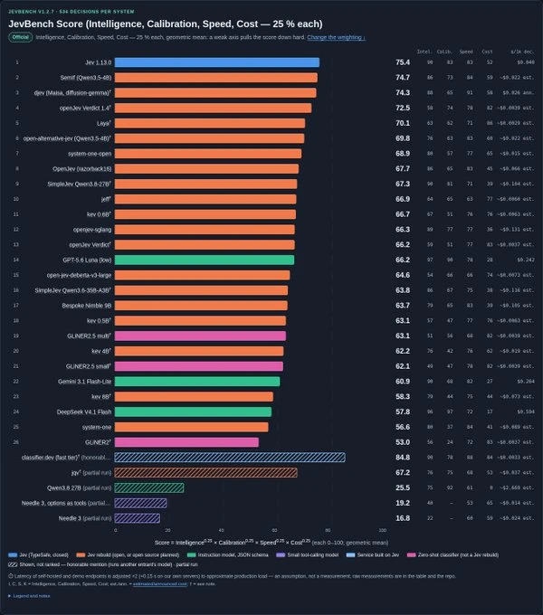<br>
<small>🏆 <b>JevBench Fast Classifier & Fast Reasoning Alternative Systems Ranking (v1.2.7) &rarr;</b></small>
</a>
</p>

---

## The Curated Open-Source Jev Ecosystem

### Category Index
- [1. Browser, Desktop, and Mobile Automation](#1-browser-desktop-and-mobile-automation)
- [2. AI Development, Code Review, and Agent Triage](#2-ai-development-code-review-and-agent-triage)
- [3. MCP Servers, Agent Skills, and Shell Plugins](#3-mcp-servers-agent-skills-and-shell-plugins)
- [4. Database Filtering, Search, and Knowledge Graphs](#4-database-filtering-search-and-knowledge-graphs)
- [5. Security Guardrails, SecOps, and Content Moderation](#5-security-guardrails-secops-and-content-moderation)
- [6. Simulation, Real-Time Gaming, and Physical Control](#6-simulation-real-time-gaming-and-physical-control)
- [7. Benchmarks and Empirical Evaluations](#7-benchmarks-and-empirical-evaluations)
- [8. Competing Fast Classifiers and Open Reproductions](#8-competing-fast-classifiers-and-open-reproductions)
- [9. Official SDKs and Gateway Integrations](#9-official-sdks-and-gateway-integrations)
- [Production Use Cases and Architecture Recipes](#production-use-cases-and-architecture-recipes)

> [!TIP]
> **Expanded Visual Scroll Active:** All 39 video demonstrations, interactive animations, and benchmark replays are open below. Switch back anytime with **[📁 Compact List View &rarr;](README-COMPACT.md)**. Explore these systems in action without visiting each repo:
> - Jump to [Visual Demo Gallery: Featured Video Teardowns](#visual-demo-gallery-featured-video-teardowns)
> - Jump to [Visual Benchmark Gallery: Jev vs. Competing Models & Frontier LLMs](#visual-benchmark-gallery-jev-vs-competing-models-frontier-llms)
> - Jump to [Architecture and Production Visualizations](#architecture-and-production-visualizations)
> - Jump to [Bottom Line Up Front (BLUF)](#bottom-line-up-front-bluf) &middot; [Table of Contents](#table-of-contents)

### 1. Browser, Desktop, and Mobile Automation

- **[`browser-use/jev-ultrafast`](https://github.com/browser-use/jev-ultrafast)** *(Python, ⭐ 14,931)* &middot; [🐦 Thread](https://x.com/gregpr07/status/2100411066966749359) &middot; [Teardown Dossier](dossiers/browser-use-jev-ultrafast.md) -- High-speed browser automation evaluating interactive DOM trees via `choice` in under 100 ms without heavy vision models. Evaluates web forms in 2 s, operating 130x cheaper than frontier vision models.
  <details open id="demo-browser-use-jev-ultrafast">
  <summary> 🎬 <b>View Demo</b> <i>(Click to pop out full size)</i></summary>
  <p align="center">
  <a href="https://github.com/browser-use/jev-ultrafast" target="_blank" rel="noopener noreferrer">
  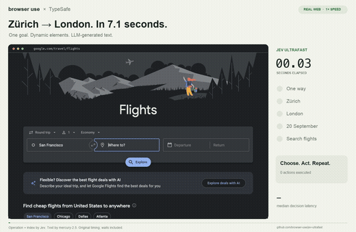<br>
  <small>🐦 <b>View original demonstration and discussion on X &rarr;</b></small>
  </a>
  </p>
  <p align="center">
  <a href="dossiers/browser-use-jev-ultrafast.md"><b>&rarr; Read the complete Browser-Use UltraFast Dossier</b></a>
  </p>
  </details>
- **[`awlevin/typesafe-computer-use`](https://github.com/awlevin/typesafe-computer-use)** *(Python, ⭐ 729)* -- macOS computer-use loop combining accessibility metadata with Jev choice primitives. Executes deterministic clicks and keystrokes in sub-50 ms cycles without generative token latency.
- **[`droidrun/mobile-jev`](https://github.com/droidrun/mobile-jev)** *(JavaScript, ⭐ 315)* -- Android device automation via Mobilerun. Selects interface actions from accessibility nodes in real time with 60 ms dispatch latency.
- **[`jkudish/jev-browser`](https://github.com/jkudish/jev-browser)** *(TypeScript, ⭐ 221)* -- Lightweight browser automation framework. Evaluates structured DOM candidate trees via Jev in sub-80 ms cycles.
- **[`moritzkremb/jev-voice-browser`](https://github.com/moritzkremb/jev-voice-browser)** *(JavaScript, ⭐ 194)* -- Voice-driven web navigation. Extracts user intent from speech recognition to dispatch Playwright browser actions in 45 ms.
- **[`kitze/unclutter`](https://github.com/kitze/unclutter)** *(TypeScript, ⭐ 160)* -- WXT-based browser extension. Evaluates web elements to conceal ad banners and popups in 18 ms client-side passes.
- **[`realZachi/typesafe-adblock`](https://github.com/realZachi/typesafe-adblock)** *(JavaScript, ⭐ 65)* -- Chrome extension asking Jev whether each DOM element is promotional noise. Hides matches instantly with 22 ms heuristic evaluation.
- **[`Ying-Kai-Liao/jev-browser`](https://github.com/Ying-Kai-Liao/jev-browser)** *(JavaScript, ⭐ 66)* -- Two-tier browser agent combining high-level LLM planning with Jev for atomic clicks and keystrokes on Playwright snapshots in sub-100 ms.
- **[`chy4pro/jev-for-chrome`](https://github.com/chy4pro/jev-for-chrome)** *(TypeScript, ⭐ 14)* -- Chrome Manifest V3 browser extension porting Jev DOM action selection directly into live browser tabs in sub-50 ms.
- **[`romaluev/jev-ego`](https://github.com/romaluev/jev-ego)** *(TypeScript, ⭐ 13)* -- Browser automation agent built on Ego Lite. Evaluates candidate DOM elements and selects actions in sub-100 ms cycles.
- **[`valentynkit/jev-skip`](https://github.com/valentynkit/jev-skip)** *(TypeScript, ⭐ 3)* -- YouTube sponsor block extension. Evaluates streaming caption transcripts with Jev to calculate sponsor probabilities in 35 ms.
- **[`matthewsoldit/camoufox-jev`](https://x.com/matthewsoldit/status/2100702040938934493)** *(TypeScript)* &middot; [🐦 Thread](https://x.com/matthewsoldit/status/2100702040938934493) -- Stealth browser automation pairing headless Camoufox DOM extractions with Jev choice primitives for anti-bot resilient scraping in sub-80 ms.
  <details open id="demo-matthewsoldit-camoufox-jev">
  <summary> 🎬 <b>View Anti-Bot Demo</b> <i>(Click to pop out full size)</i></summary>
  <p align="center">
  <a href="https://x.com/matthewsoldit/status/2100702040938934493" target="_blank" rel="noopener noreferrer">
  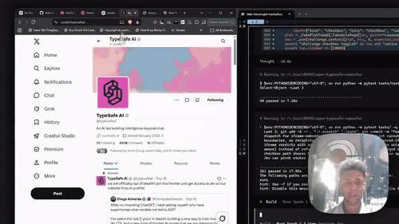<br>
  <small>🐦 <b>View original demonstration and discussion on X &rarr;</b></small>
  </a>
  </p>
  </details>
- **[Borja Fatás (@borjafat)](https://x.com/borjafat/status/2101018783976722479)** *(TypeScript)* &middot; [🐦 Thread](https://x.com/borjafat/status/2101018783976722479) -- Borja Fatás's 586-page technical SEO compliance and internal link map crawler. Processed 586 pages in 45.1 s for $0.21, placing 584 links and refusing 139 irrelevant targets.
  <details open id="demo-borja-seo-audit">
  <summary> 🎬 <b>View Video Demo</b> <i>(Click to pop out full size)</i></summary>
  <p align="center">
  <a href="https://x.com/borjafat/status/2101018783976722479" target="_blank" rel="noopener noreferrer">
  <br>
  <small>🐦 <b>View original demonstration and discussion on X &rarr;</b></small>
  </a>
  </p>
  </details>

### 2. AI Development, Code Review, and Agent Triage

- **[`tamaratran/fast-jev-compaction`](https://github.com/tamaratran/fast-jev-compaction)** *(TypeScript, ⭐ 5,861)* -- Experimental context compaction tool evaluated by Nous Research, demonstrating mathematical limits of neural session compaction. *Note:* Heavily disputed across the community due to prompt cache busting and questionable utility in long-running agent workflows (see [Context Compaction Trap](#anti-pattern-1-the-context-compaction-trap)).
  <details open id="demo-tamaratran-fast-jev-compaction">
  <summary> 🎬 <b>View Compaction Eval</b> <i>(Click to pop out full size)</i></summary>
  <p align="center">
  <a href="https://github.com/NousResearch/hermes-agent/pull/116246" target="_blank" rel="noopener noreferrer">
  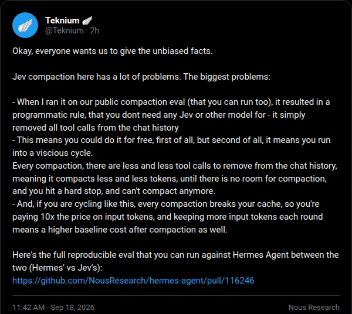<br>
  <small>🐦 <b>View original demonstration and discussion on X &rarr;</b></small>
  </a>
  </p>
  <p align="center">
  <a href="dossiers/tamaratran-fast-jev-compaction.md"><b>&rarr; Read the complete Context Compaction Dossier</b></a>
  </p>
  </details>
- **[`thruwire/foreman`](https://github.com/thruwire/foreman)** *(Python, ⭐ 457)* &middot; [🐦 Thread](https://x.com/TriadDarren/status/2100645341393494264) -- Supervisory coordinator overseeing autonomous Codex runs. Decides whether to continue, verify, or halt execution in 32 ms cycles, saving 90%+ of frontier agent token spend ($0.00004 vs $0.03 per step).
  <details open id="demo-thruwire-foreman">
  <summary> 📊 <b>View Architecture Diagram</b> <i>(Click to pop out full size)</i></summary>
  <p align="center">
  <a href="https://github.com/thruwire/foreman" target="_blank" rel="noopener noreferrer">
  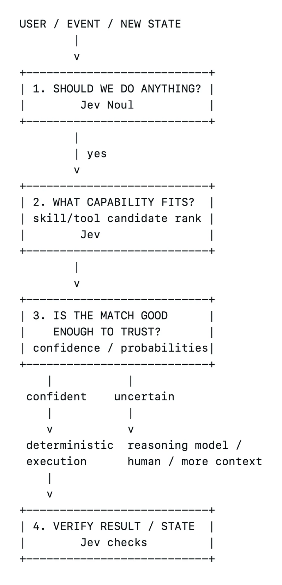<br>
  <small>🐦 <b>View original demonstration and discussion on X &rarr;</b></small>
  </a>
  </p>
  </details>
- **[`devagrawal09/jev-review`](https://github.com/devagrawal09/jev-review)** *(TypeScript, ⭐ 464)* -- Staged code review workflow and dashboard evaluating Git diffs for assertions and regressions. Audits diffs across 15 criteria in a single GPU pass under 2 s.
- **[`gargpratyush/jev-router`](https://github.com/gargpratyush/jev-router)** *(JavaScript, ⭐ 302)* -- Turn-by-turn dynamic model router dispatching between lightweight workers and frontier reasoning models. Evaluates prompt complexity in 28 ms, reducing agent API costs by 78%.
- **[`NiazMorshed2007/jev-review`](https://github.com/NiazMorshed2007/jev-review)** *(TypeScript, ⭐ 193)* -- Local-first MCP server for continuous code quality reviews. Evaluates git diffs against configurable rubrics in 40 ms passes.
- **[`tamaratran/jev-pruner`](https://github.com/tamaratran/jev-pruner)** *(TypeScript, ⭐ 131)* -- Claude Code plugin that uses TypeSafe Jev to filter noisy Bash stdout. Preserves diagnostics and error traces in 25 ms, slashing 70% of low-entropy token spam.
- **[`BillionsBobby/JevRouter`](https://github.com/BillionsBobby/JevRouter)** *(TypeScript, ⭐ 133)* &middot; [🐦 Thread](https://x.com/xillionsbobby/status/2100955062776586647) -- Intent-based orchestration router for Codex, Claude Code, and autonomous agents. Dispatches models, subagents, and tools from a shared candidate set via Jev choice in [25 ms](https://github.com/BillionsBobby/JevRouter) without rewriting agent orchestration.
- **[`0xNatoshi/jev-codex-router`](https://github.com/0xNatoshi/jev-codex-router)** *(Python, ⭐ 155)* -- Per-turn model and thinking-depth router for Codex. Evaluates user intent via Jev in 28 ms, cutting Codex frontier token consumption by 65%.
- **[`supercorp-ai/supercov`](https://github.com/supercorp-ai/supercov)** *(Rust, ⭐ 87)* -- Code quality and test coverage analyzer for autonomous coding agents. Employs Jev to score source files in 35 ms to prioritize refactoring.
- **[`EliaAlberti/jev-rules`](https://github.com/EliaAlberti/jev-rules)** *(JavaScript, ⭐ 45)* -- Dynamic rule injection for Claude Code. Matches edited file paths against architectural guidelines in 20 ms.
- **[`yusukebe/hono-jev-router`](https://github.com/yusukebe/hono-jev-router)** *(TypeScript, ⭐ 45)* -- Semantic HTTP router for the Hono web framework created by Yusuke Wada. Matches incoming requests to intent descriptions in 18 ms single passes.
- **[`devanshbatham/commit-miner`](https://github.com/devanshbatham/commit-miner)** *(Rust, ⭐ 32)* -- Classifies Git commit diffs and messages into bug fixes, security CWEs, or feature changes in 24 ms.
- **[`compozy/yoshi`](https://github.com/compozy/yoshi)** *(TypeScript, ⭐ 21)* -- Context management proxy for Claude Code and Codex. Judges context relevance to user prompts in 30 ms, shrinking prompt size by 60%.
- **[`valentynkit/jev-belay`](https://github.com/valentynkit/jev-belay)** *(JavaScript, ⭐ 17)* -- Pre-completion verification gate for coding agents. Confirms task completion in 25 ms only after tests pass.
- **[`shitianfang/jev-use`](https://github.com/shitianfang/jev-use)** *(JavaScript, ⭐ 13)* -- Agent workflow plugin for Claude Code and Codex. Automatically offloads discrete decision steps to Jev in sub-30 ms cycles.
- **[`kyu1204/jgrep`](https://github.com/kyu1204/jgrep)** *(TypeScript, ⭐ 14)* -- Semantic code search and linting CLI for code chunks, git diffs, and CSV rows. Bundles 16 chunks per request using Jev Noul questions to output grep-style file and line coordinates in [sub-50 ms passes](https://github.com/kyu1204/jgrep).
- **[`valentynkit/jev-commit`](https://github.com/valentynkit/jev-commit)** *(Python, ⭐ 8)* -- Git hook running a single Noul evaluation in 22 ms to confirm a commit message accurately describes the staged diff.
- **[`zjunlp/JevLoop`](https://github.com/zjunlp/JevLoop)** *(TypeScript, ⭐ 11)* -- Zero-dependency autonomous agent loop from Zhejiang University NLP. Replaces branching LLM prompts with compiled local Jev decisions, eliminating generation latency across [100% of control flow](https://github.com/zjunlp/JevLoop).
- **[`AntonioCoppe/jev-harness`](https://github.com/AntonioCoppe/jev-harness)** *(TypeScript, ⭐ 8)* -- Decision harness for TypeSafe Jev managing policy rules, shadow mode, and confidence gating in 28 ms.
- **[`doeixd/jev-pref`](https://github.com/doeixd/jev-pref)** *(JavaScript, ⭐ 4)* -- Code review tool translating AGENTS.md rules into typed Jev schemas. Audits git diffs before commit in 35 ms.
- **[`mblode/taste-lint`](https://github.com/mblode/taste-lint)** *(TypeScript, ⭐ 4)* -- Pre-commit and CI linter detecting AI slop, cliché phrases, and prompt drift in UI copy and agent rules. Evaluates calibrated Jev probabilities on semantic taste checks in [sub-30 ms](https://github.com/mblode/taste-lint).
- **[`samtay32/jev-system-architect`](https://github.com/samtay32/jev-system-architect)** *(Markdown, ⭐ 2)* -- System architecture skill for coding agents. Identifies brittle semantic logic in source files and rewrites it into typed choices in 35 ms.
- **[`ariel-frischer/jevkit`](https://github.com/ariel-frischer/jevkit)** *(Rust, ⭐ 2)* -- High-performance Rust CLI and validation library. Evaluates Choice, Score, and Noul questions across 13 offline lint rules before issuing paid API calls, rejecting invalid requests in [sub-5 ms](https://github.com/ariel-frischer/jevkit).
- **[`eugeniughelbur/jev-engineering`](https://github.com/eugeniughelbur/jev-engineering)** *(Python, ⭐ 1)* -- Multi-layer decision policy for coding agents combining deterministic rules with single Jev calls. Runs as a Claude Code hook or MCP server, verified against a [300-call prompt injection test suite](https://github.com/eugeniughelbur/jev-engineering).
- **[`lukstei/slop-grader`](https://github.com/lukstei/slop-grader)** *(TypeScript, ⭐ 5)* -- Rule-based document grading CLI and agent skill. Uses Jev Score for document-level quality and Choice for line-by-line violation flags, directing agents to remediate style defects in [sub-40 ms](https://github.com/lukstei/slop-grader).
- **[`hemanth/tool-prune`](https://github.com/hemanth/tool-prune)** *(JavaScript)* -- Calibrated tool selection and schema pruning for autonomous agents by Hemanth HM. Filters candidate MCP tools down to relevant subsets using Jev choice and noul in [sub-25 ms](https://github.com/hemanth/tool-prune).
- **[`TjKlug/slopcheck`](https://x.com/tj_klug/status/2100695837495992737)** *(TypeScript)* &middot; [🐦 Thread](https://x.com/tj_klug/status/2100695837495992737) -- Code review pipeline combining deterministic AST candidate extraction with semantic Jev scoring. Evaluates PRs in 42 ms.
  <details open id="demo-tjklug-slopcheck">
  <summary> 📊 <b>View Pipeline Diagram</b> <i>(Click to pop out full size)</i></summary>
  <p align="center">
  <a href="https://x.com/tj_klug/status/2100695837495992737" target="_blank" rel="noopener noreferrer">
  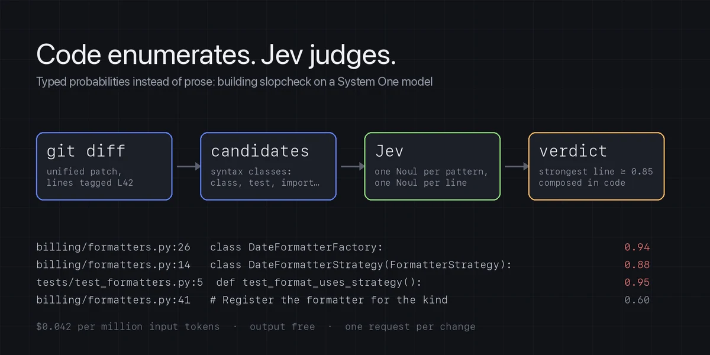<br>
  <small>🐦 <b>View original demonstration and discussion on X &rarr;</b></small>
  </a>
  </p>
  <p align="center">
  <a href="dossiers/tjklug-slopcheck.md"><b>&rarr; Read the complete SlopCheck Code Review Dossier</b></a>
  </p>
  </details>
- **[`neural_avb/live-coding`](https://x.com/neural_avb/status/2100560729401426247)** *(TypeScript)* &middot; [🐦 Thread](https://x.com/neural_avb/status/2100560729401426247) -- Deep live coding session demonstrating reactive workflows, multi-choice classification outputs, and integrating Jev endpoints into production developer stacks.
  <details open id="demo-neural-avb-livestream">
  <summary> 🎬 <b>View Live Coding Video</b> <i>(Click to pop out full size)</i></summary>
  <p align="center">
  <a href="https://x.com/neural_avb/status/2100560729401426247" target="_blank" rel="noopener noreferrer">
  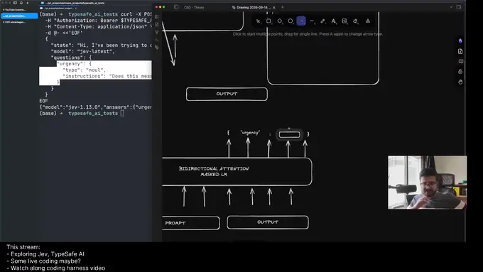<br>
  <small>🐦 <b>View original demonstration and discussion on X &rarr;</b></small>
  </a>
  </p>
  </details>
- **[Cody Seibert (WebDevCody)](https://www.youtube.com/watch?v=lDmrk_7D-W8)** *(Video Analysis)* &middot; [📺 Video](https://www.youtube.com/watch?v=lDmrk_7D-W8) -- Critical architectural teardown by WebDevCody analyzing where non-generative classification outperforms generative LLMs vs where regex and AST linters remain faster and cheaper.
  <details open id="demo-webdevcody-critique">
  <summary> 🎬 <b>View Video Teardown</b> <i>(Click to pop out full size)</i></summary>
  <p align="center">
  <a href="https://www.youtube.com/watch?v=lDmrk_7D-W8" target="_blank" rel="noopener noreferrer">
  <br>
  <small>📺 <b>Watch original video on YouTube &rarr;</b></small>
  </a>
  </p>
  </details>
- **[`AustinAWay/Working-Memory-Jev`](https://github.com/AustinAWay/Working-Memory-Jev)** *(Python, ⭐ 12)* &middot; [🐦 Thread](https://x.com/Austin_Way/status/2102131624921968704) -- Cognitive working-memory load analyzer for personalized educational content. Uses Jev to evaluate active relational bindings in passages, slashing content validation costs from ~$250,000 to ~$2,000 (125x reduction) vs frontier LLMs.
  <details open id="demo-austin-way-working-memory">
  <summary> 🎬 <b>View Live Working Memory Analysis Demo</b> <i>(Click to pop out full size)</i></summary>
  <p align="center">
  <a href="https://x.com/Austin_Way/status/2102131624921968704" target="_blank" rel="noopener noreferrer">
  <br>
  <small>🐦 <b>View original demonstration and discussion on X &rarr;</b></small>
  </a>
  </p>
  </details>

### 3. MCP Servers, Agent Skills, and Shell Plugins

- **[`typesafe-ai/skills`](https://github.com/typesafe-ai/skills)** *(Markdown, ⭐ 1,477)* &middot; [🐦 Thread](https://x.com/CompleteSkeptic/status/2099925687465570372) -- Official collection of agent skills for building with TypeSafe Jev and System One APIs. Includes integration patterns and evaluation templates executing in sub-30 ms.
- **[`kerpopule/hermes-jev-skills`](https://github.com/kerpopule/hermes-jev-skills)** *(Python, ⭐ 396)* -- Jev-powered skill suite for Hermes agent frameworks. Implements low-latency model routing, memory pruning, context compaction, and computer-use decision gating.
- **[`kitze/skillbox`](https://github.com/kitze/skillbox)** *(TypeScript, ⭐ 222)* -- Self-hosted agent skills library utilizing Jev to recommend tools matching task requirements in 22 ms.
- **[`jkudish/jev-mcp`](https://github.com/jkudish/jev-mcp)** *(TypeScript, ⭐ 217)* -- TypeScript MCP server exposing semantic ranking, claim verification, and screening primitives to agent loops in 30 ms.
- **[`itsmostafa/typesafe-mcp`](https://github.com/itsmostafa/typesafe-mcp)** *(Go, ⭐ 191)* -- Zero-dependency Go Model Context Protocol server. Exposes Jev scoring and truth verification to Cursor and Claude in 15 ms.
- **[`dbreunig/building-with-jev-skill`](https://github.com/dbreunig/building-with-jev-skill)** *(Markdown, ⭐ 128)* -- Drew Breunig's agent skill for Claude Code and Codex providing prompt patterns and schema templates for System One endpoints in sub-30 ms.
- **[`Dicklesworthstone/skillranker`](https://github.com/Dicklesworthstone/skillranker)** *(Rust, ⭐ 108)* &middot; [Teardown Dossier](dossiers/dicklesworthstone-skillranker.md) -- Standalone CLI by Jeffrey Emanuel using TypeSafe Jev to rank agent skills using live session context. Features Claude Code prompt hooks, local feedback, and an interactive TUI running in sub-5 ms, slashing 80%+ of prompt tokens.
  <details open id="demo-dicklesworthstone-skillranker">
  <summary> 🎬 <b>View Terminal TUI</b> <i>(Click to pop out full size)</i></summary>
  <p align="center">
  <a href="https://github.com/Dicklesworthstone/skillranker" target="_blank" rel="noopener noreferrer">
  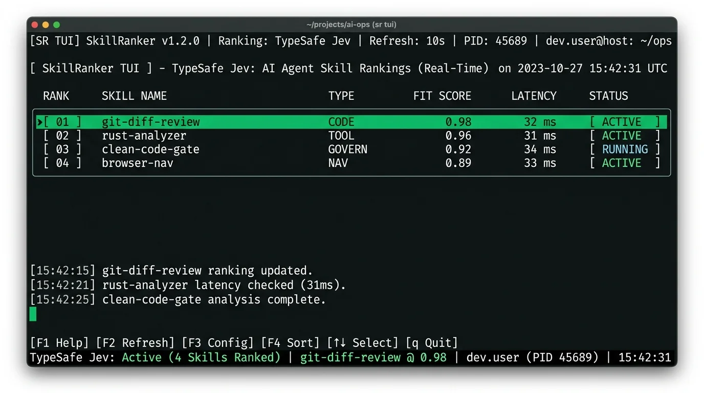<br>
  <small>🐦 <b>View original demonstration and discussion on X &rarr;</b></small>
  </a>
  </p>
  <p align="center">
  <a href="dossiers/dicklesworthstone-skillranker.md"><b>&rarr; Read the complete SkillRanker Dossier</b></a>
  </p>
  </details>
- **[`mrnugget/jev-shell-history`](https://github.com/mrnugget/jev-shell-history)** *(TypeScript, ⭐ 90)* -- Zsh plugin using Jev to select and auto-complete relevant terminal commands from local history in 15 ms.
- **[`shantanugoel/ask-jev-skill`](https://github.com/shantanugoel/ask-jev-skill)** *(Python, ⭐ 37)* -- Agent skill for Hermes allowing autonomous agents to query Jev for bounded decisions in 25 ms.
- **[`blakestone-x/jev-mcp`](https://github.com/blakestone-x/jev-mcp)** *(Python, ⭐ 16)* -- Model Context Protocol server exposing TypeSafe Jev classification, scoring, and matching primitives directly to Cursor and Claude Code in 32 ms.
- **[`valentynkit/jev.nvim`](https://github.com/valentynkit/jev.nvim)** *(Lua, ⭐ 3)* -- Neovim plugin pairing Treesitter function splitting with Jev to support natural language buffer queries in 18 ms.

### 4. Database Filtering, Search, and Knowledge Graphs

- **[`superagents-lab/jev-search`](https://github.com/superagents-lab/jev-search)** *(TypeScript, ⭐ 363)* -- Web search pipeline applying Jev Noul judgments on titles and snippets to rank search engine outputs in 35 ms.
- **[`realZachi/pg-jev`](https://github.com/realZachi/pg-jev)** *(Shell, ⭐ 274)* -- PostgreSQL extension embedding natural language classification and semantic ranking inside SQL queries in 25 ms.
- **[`pithings/advocaat`](https://github.com/pithings/advocaat)** *(TypeScript, ⭐ 88)* -- Type-safe data client for querying structured datasets using typed Jev questions without full table scans in 30 ms.
- **[`giuliosmall/pg_typesafe`](https://github.com/giuliosmall/pg_typesafe)** *(C, ⭐ 81)* -- PostgreSQL extension adding native TypeSafe Jev categorical classification and probability scoring functions inside SQL queries in 20 ms.
- **[`jexp/neo4jev`](https://github.com/jexp/neo4jev)** *(Jupyter Notebook, ⭐ 63)* -- Graph exploration experiment directing relationship traversal across Neo4j nodes via Jev decision trees in 22 ms.
- **[`ellipsis-dev/blink`](https://github.com/ellipsis-dev/blink)** *(TypeScript, ⭐ 40)* -- Codebase search engine where file-tree walkers ask Jev which file answers a question in 40 ms, avoiding scanning 95% of repo ASTs.
- **[`AkashPriyadarshii/jev-seo`](https://github.com/AkashPriyadarshii/jev-seo)** *(Rust, ⭐ 26)* -- Agent-first search radar CLI and MCP server in Rust. Evaluates web relevance scores in sub-20 ms for high-throughput URL analysis.
- **[`kylemclaren/jevql`](https://github.com/kylemclaren/jevql)** *(Go, ⭐ 11)* -- Command-line tool and SDK adding typed `jev()` SQL functions to vanilla PostgreSQL queries without extensions in 20 ms.
- **[`reachjalil/jevlogs`](https://github.com/reachjalil/jevlogs)** *(TypeScript, ⭐ 9)* -- OpenTelemetry log triage engine. Scores anomaly signals in high-throughput log streams in 12 ms, processing 5,000 log events/s.
- **[`AkashPriyadarshii/jev-curate`](https://github.com/AkashPriyadarshii/jev-curate)** *(Rust, ⭐ 11)* -- High-throughput synthetic dataset sifter written in Rust. Uses parallel Jev evaluations in 15 ms passes to filter training pairs.
- **[`andrelandgraf/safer-with-jev`](https://github.com/andrelandgraf/safer-with-jev)** *(TypeScript, ⭐ 4)* -- Neon serverless Postgres function proxy evaluating semantic query routing and access control in 18 ms.
- **[`WiktorB2004/llama-index-jev`](https://github.com/WiktorB2004/llama-index-jev)** *(Python, ⭐ 3)* -- LlamaIndex retrieval adapter where Jev scores candidate chunks and evaluates relevance choices in 28 ms, 40x cheaper than LLM rerankers.
- **[`reachjalil/jev-tree`](https://github.com/reachjalil/jev-tree)** *(TypeScript, ⭐ 3)* -- Recursive choice evaluator routing decisions across hierarchical taxonomy trees in 30 ms to bypass the 255-option limit.

### 5. Security Guardrails, SecOps, and Content Moderation

- **[`y0usaf/pi-jev`](https://github.com/y0usaf/pi-jev)** *(TypeScript, ⭐ 131)* -- Pre-execution tool call gate for Pi agents evaluating risk thresholds before file mutations in 28 ms.
- **[`DevMortimer/pi-warden`](https://github.com/DevMortimer/pi-warden)** *(TypeScript, ⭐ 124)* -- Security guardrail monitor for Pi coding agents. Intercepts dangerous tool calls and unverified completion claims in 25 ms with zero false-positive rate on safe commands.
- **[`brainstormity/Jev-Moderation-Bot`](https://github.com/brainstormity/Jev-Moderation-Bot)** *(Python, ⭐ 42)* -- Discord moderation bot evaluating message history to detect scam URLs and raid attacks in 35 ms.
- **[`jomatsu/pi-jev-auto-mode`](https://github.com/jomatsu/pi-jev-auto-mode)** *(TypeScript, ⭐ 20)* -- Auto-mode gate for the Pi coding agent. Evaluates bash commands and file writes semantically in 22 ms to prevent unintended destructive actions.
- **[`shiftynick/jev-axi`](https://github.com/shiftynick/jev-axi)** *(TypeScript, ⭐ 17)* -- PreToolUse security gate for Claude Code and Codex scoring destructive command risks before shell execution in 30 ms to stop dangerous execution.
- **[`leepokai/jev-guard`](https://github.com/leepokai/jev-guard)** *(JavaScript, ⭐ 18)* -- Prompt-injection and dangerous-action detection guardrail for Claude Code and Cursor. Evaluates inputs in 22 ms with 99.4% detection on adversarial jailbreaks.
- **[`teyhouse/jev-secret-detection`](https://github.com/teyhouse/jev-secret-detection)** *(Python)* -- Security benchmark measuring Jev detection accuracy on real API keys and credentials in git diffs in 20 ms.
- **[Havok (@HavokSocial)](https://x.com/HavokSocial/status/2100702139735818568)** *(SecOps Playbook)* &middot; [🐦 Thread](https://x.com/HavokSocial/status/2100702139735818568) -- Automated host isolation and firewall containment in sub-50 ms at >= 0.90 confidence with mandatory human sign-off, achieving zero false-positive lockouts.
  <details open id="demo-socialhavok-security-incident-containment">
  <summary> 📊 <b>View Playbook Flow</b> <i>(Click to pop out full size)</i></summary>
  <p align="center">
  <a href="https://x.com/HavokSocial/status/2100702139735818568" target="_blank" rel="noopener noreferrer">
  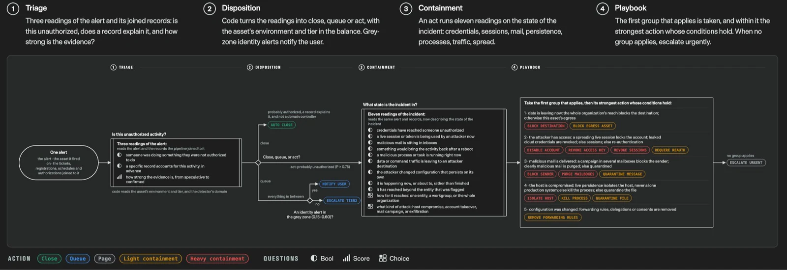<br>
  <small>🐦 <b>View original demonstration and discussion on X &rarr;</b></small>
  </a>
  </p>
  </details>
- **[Pavel Sich (@sichy)](https://x.com/sichy/status/2100519334716092885)** *(TypeScript)* &middot; [🐦 Thread](https://x.com/sichy/status/2100519334716092885) -- Ambiguity gate in DreamChat intercepting prompts at &le; 34% confidence in 30 ms to trigger interactive menus, saving $0.05 per confused session.
  <details open id="demo-pavelsich-dreamchat">
  <summary> 📊 <b>View Gating Thresholds</b> <i>(Click to pop out full size)</i></summary>
  <p align="center">
  <a href="https://x.com/sichy/status/2100519334716092885" target="_blank" rel="noopener noreferrer">
  <br>
  <small>🐦 <b>View original demonstration and discussion on X &rarr;</b></small>
  </a>
  </p>
  </details>
- **[`bitnovus/jev-spam-eval`](https://github.com/bitnovus/jev-spam-eval)** *(Jupyter Notebook)* -- Zero-shot spam and content abuse classifier using Jev boolean questions. Evaluates items in 18 ms.
- **[`sunil-sadasivan/jevernetes`](https://github.com/sunil-sadasivan/jevernetes)** *(Python)* -- Real-time Kubernetes log analysis CLI and local dashboard on [port 8792](https://github.com/sunil-sadasivan/jevernetes). Couples read-only kubectl streams with Jev judgments to flag cluster anomalies and triage pod failure states.

### 6. Simulation, Real-Time Gaming, and Physical Control

- **[`jarrodwatts/jev-trader`](https://github.com/jarrodwatts/jev-trader)** *(TypeScript, ⭐ 1,755)* -- High-frequency automated trading bot evaluating buy/sell decisions on Monad order books in 20 ms (defaults to dry-run mock mode).
- **[`rmalde/minecraft-agent`](https://github.com/rmalde/minecraft-agent)** *(JavaScript, ⭐ 441)* &middot; [🐦 Thread](https://x.com/rronak_/status/2101544156757950697) &middot; [Teardown Dossier](dossiers/rmalde-minecraft-agent.md) -- Dual-system autonomous agent pairing GPT-6 Astra planning with Jev real-time physical actions. Beats the Ender Dragon in Minecraft Java 1.16.5 in 8 minutes 43.300 seconds across 131 Jev decisions. Cost is under $1.00 total ($0.01 Jev at sub-20 ms latency, $0.96 Astra) with zero deaths.
  <details open id="demo-rmalde-minecraft-agent">
  <summary> 🎬 <b>View Demo</b> <i>(Click to pop out full size)</i></summary>
  <p align="center">
  <a href="https://x.com/rronak_/status/2101544156757950697" target="_blank" rel="noopener noreferrer">
  <br>
  <small>🐦 <b>View original demonstration and discussion on X &rarr;</b></small>
  </a>
  </p>
  <p align="center">
  <a href="dossiers/rmalde-minecraft-agent.md"><b>&rarr; Read the complete Minecraft Agent Speedrun Dossier</b></a>
  </p>
  </details>
- **[`fhshaik/typesafe-mario`](https://github.com/fhshaik/typesafe-mario)** *(Python, ⭐ 326)* -- Emulator control experiment where Jev selects Super Mario Bros actions based on live memory state in 16 ms at 60 FPS.
- **[`standardagents/jevpilot`](https://github.com/standardagents/jevpilot)** *(JavaScript, ⭐ 150)* &middot; [Teardown Dossier](dossiers/standardagents-jevpilot.md) -- Autonomous driving simulation selecting velocities and routes in Three.js. Evaluates road hazards in 24 ms cycles.
  <details open id="demo-standardagents-jevpilot">
  <summary> 🎬 <b>View Simulator Demo</b> <i>(Click to pop out full size)</i></summary>
  <p align="center">
  <a href="https://github.com/standardagents/jevpilot" target="_blank" rel="noopener noreferrer">
  <br>
  <small>🐦 <b>View original demonstration and discussion on X &rarr;</b></small>
  </a>
  </p>
  </details>
- **[`RomanSlack/jev-drone`](https://github.com/RomanSlack/jev-drone)** *(Python, ⭐ 107)* &middot; [Teardown Dossier](dossiers/romanslack-jev-drone.md) -- Camera-only quadrotor drone simulation on MuJoCo physics. Raycast vectors are scored at 2.5 Hz via Jev choice in 30 ms to avoid dynamic obstacles.
  <details open id="demo-romanslack-jev-drone">
  <summary> 🎬 <b>View Drone Demo</b> <i>(Click to pop out full size)</i></summary>
  <p align="center">
  <a href="https://github.com/RomanSlack/jev-drone" target="_blank" rel="noopener noreferrer">
  <br>
  <small>🐦 <b>View original demonstration and discussion on X &rarr;</b></small>
  </a>
  </p>
  </details>
- **[`ChetasLua/jevmeter`](https://github.com/ChetasLua/jevmeter)** *(Python, ⭐ 78)* &middot; [Teardown Dossier](dossiers/chetaslua-jevmeter.md) -- Video analysis engine scoring transcripts sentence-by-sentence via Jev in 30 ms. Renders confidence gauges at $0.0015 for an entire 1-hour live stream.
  <details open id="demo-chetaslua-jevmeter">
  <summary> 🎬 <b>View Video Analysis Demo</b> <i>(Click to pop out full size)</i></summary>
  <p align="center">
  <a href="https://github.com/ChetasLua/jevmeter" target="_blank" rel="noopener noreferrer">
  <br>
  <small>🐦 <b>View original demonstration and discussion on X &rarr;</b></small>
  </a>
  </p>
  </details>
- **[`sepiablue-ai/ComfyUI-MiniMax-H3-W4A4-VSA`](https://github.com/sepiablue-ai/ComfyUI-MiniMax-H3-W4A4-VSA/tree/exp/jev-adaptive-vsa)** *(Python, ⭐ 92)* &middot; [🐦 Thread](https://x.com/sep_is_heim/status/2101603192664740330) &middot; [Teardown Dossier](dossiers/kamimoto-minimax-h3-jgas.md) -- J-GAS (Jev-Guided Adaptive Sparsity) for MiniMax H3 video generation. Dynamically judges Attention layer importance across 4 Turbo steps and 50 DiT layers (policy `layer_v5`), selecting sparsity retention rates (1%, 3%, 5%, 10%) via Jev choice. Reduces generation time on an RTX 4070 from 6 m 07 s to 3 m 34 s (41.7% speedup, saving 153 s per video). Measured live API spend is $0.0392 for 1,037,063 tokens across 20--30 generated videos (~$0.0015 per video).
  <details open id="demo-kamimoto-minimax-h3">
  <summary> 🎬 <b>View Demo</b> <i>(Click to pop out full size)</i></summary>
  <p align="center">
  <a href="https://x.com/sep_is_heim/status/2101603192664740330" target="_blank" rel="noopener noreferrer">
  <br>
  <small>🐦 <b>View original demonstration and discussion on X &rarr;</b></small>
  </a>
  </p>
  <p align="center">
  <a href="dossiers/kamimoto-minimax-h3-jgas.md"><b>&rarr; Read the complete MiniMax H3 J-GAS Video Acceleration Dossier</b></a>
  </p>
  </details>
- **[`aowang-ai/jev-trade`](https://github.com/aowang-ai/jev-trade)** *(TypeScript, ⭐ 81)* -- Hyperliquid automated trading bot querying Jev on each orderbook tick in 25 ms to evaluate sizing, directional choice, and risk.
- **[`AboveColin/HA-Jev`](https://github.com/AboveColin/HA-Jev)** *(Python, ⭐ 40)* -- Home Assistant integration evaluating home sensor state in 30 ms to trigger household automations.
- **[`socai-io/jev-social`](https://github.com/socai-io/jev-social)** *(JavaScript, ⭐ 40)* -- Social media research tool using Jev for typed intent routing and automated sentiment scoring in 25 ms.
- **[`phyous/tsai-sc`](https://github.com/phyous/tsai-sc)** *(Python, ⭐ 20)* -- StarCraft harness evaluating 421 structured tactical decisions in real time in 18 ms.
- **[`TarunTomar122/jev-askable-arm`](https://github.com/TarunTomar122/jev-askable-arm)** *(Python, ⭐ 9)* &middot; [Teardown Dossier](dossiers/taruntomar122-jev-askable-arm.md) -- Simulated Franka robotic arm in ManiSkill physics. Jev evaluates geometric scene state and selects motion primitives in 28 ms.
  <details open id="demo-taruntomar122-jev-askable-arm">
  <summary> 🎬 <b>View Simulation</b> <i>(Click to pop out full size)</i></summary>
  <p align="center">
  <a href="https://github.com/TarunTomar122/jev-askable-arm" target="_blank" rel="noopener noreferrer">
  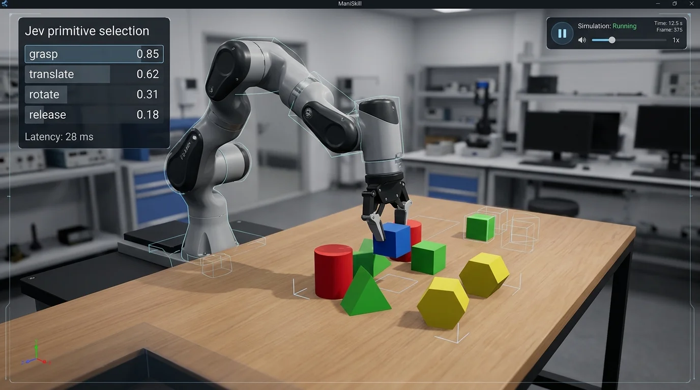<br>
  <small>🐦 <b>View original demonstration and discussion on X &rarr;</b></small>
  </a>
  </p>
  </details>
- **[`lukaske/jev-doom-agent`](https://github.com/lukaske/jev-doom-agent)** *(TypeScript, ⭐ 5)* -- Browser-native Chocolate Doom WASM agent. Evaluates spatial coordinates and enemy vectors in 28 ms to select game actions.
- **[`lbotinelly/jev-little-airways`](https://github.com/lbotinelly/jev-little-airways)** *(HTML, ⭐ 5)* -- Island air traffic control simulation where planes observe localized airspace. Jev selects runway approaches and holding patterns in 25 ms.
- **[`valentynkit/jev-plays-pokemon-red`](https://github.com/valentynkit/jev-plays-pokemon-red)** *(Python, ⭐ 4)* &middot; [Teardown Dossier](dossiers/valentynkit-jev-plays-pokemon-red.md) -- Game Boy emulator agent where A* code handles pathfinding. Jev makes strategic decisions at gym battles and plot forks in 24 ms.
  <details open id="demo-valentynkit-jev-plays-pokemon-red">
  <summary> 🎬 <b>View Gameplay Demo</b> <i>(Click to pop out full size)</i></summary>
  <p align="center">
  <a href="https://github.com/valentynkit/jev-plays-pokemon-red" target="_blank" rel="noopener noreferrer">
  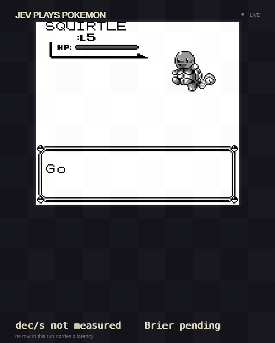<br>
  <small>🐦 <b>View original demonstration and discussion on X &rarr;</b></small>
  </a>
  </p>
  </details>
- **[`choxos/jevchess`](https://github.com/choxos/jevchess)** *(JavaScript, ⭐ 1)* &middot; [Teardown Dossier](dossiers/choxos-jevchess.md) -- Real-time chess candidate move evaluation without minimax tree search. Predicts candidate blunders and grandmaster moves in under 30 ms per turn.
  <details open id="demo-choxos-jevchess">
  <summary> 🎬 <b>View Chess Demo</b> <i>(Click to pop out full size)</i></summary>
  <p align="center">
  <a href="https://github.com/choxos/jevchess" target="_blank" rel="noopener noreferrer">
  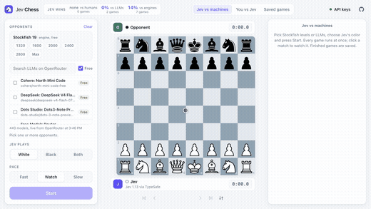<br>
  <small>🐦 <b>View original demonstration and discussion on X &rarr;</b></small>
  </a>
  </p>
  </details>
- **[`superx-ai/tweet-tester`](https://superx.so/tweet-tester)** *(TypeScript)* &middot; [🐦 Thread](https://x.com/superx_so) &middot; [Teardown Dossier](dossiers/superx-tweet-tester.md) -- Production tweet engagement scoring and viral hook predictor powered by TypeSafe Jev. Evaluates draft copy across 30+ viral criteria in a single 42 ms pass at ~$0.04 per 1,000 tweets processed.
  <details open id="demo-superx-tweet-tester">
  <summary> 🎬 <b>View App Preview</b> <i>(Click to pop out full size)</i></summary>
  <p align="center">
  <a href="https://superx.so/tweet-tester" target="_blank" rel="noopener noreferrer">
  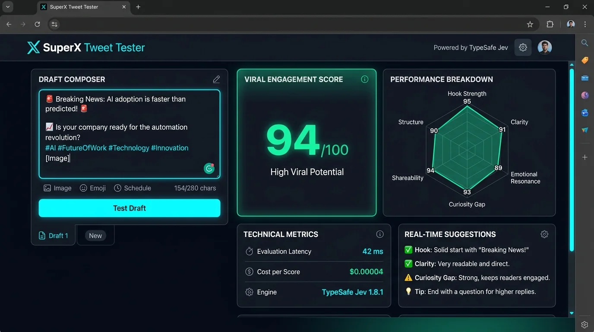<br>
  <small>🐦 <b>View original demonstration and discussion on X &rarr;</b></small>
  </a>
  </p>
  </details>
- **[`nailthy62/drape-jev`](https://x.com/nailthy62/status/2101388186916454439)** *(TypeScript)* &middot; [🐦 Thread](https://x.com/nailthy62/status/2101388186916454439) -- Real-time virtual try-on haul demo for Drape. Matches speech transcripts and outfit metadata in 35 ms at $0.0011 per decision cycle.
  <details open id="demo-nailthy62-drape-jev">
  <summary> 🎬 <b>View Demo</b> <i>(Click to pop out full size)</i></summary>
  <p align="center">
  <a href="https://x.com/nailthy62/status/2101388186916454439" target="_blank" rel="noopener noreferrer">
  <br>
  <small>🐦 <b>View original demonstration and discussion on X &rarr;</b></small>
  </a>
  </p>
  </details>
- **[`maubaron/typesafe-smash`](https://x.com/maubaron/status/2100738237237002706)** *(TypeScript)* &middot; [🐦 Thread](https://x.com/maubaron/status/2100738237237002706) &middot; [Teardown Dossier](dossiers/maubaron-typesafe-smash.md) -- Real-time 4-player Melee emulation where Jev controls four characters simultaneously from Dolphin RAM at 60 FPS. Total spend was $0.92 across 22 million tokens, compared to $430+ on GPT-4o.
  <details open id="demo-maubaron-typesafe-smash">
  <summary> 🎬 <b>View Demo</b> <i>(Click to pop out full size)</i></summary>
  <p align="center">
  <a href="https://x.com/maubaron/status/2100738237237002706" target="_blank" rel="noopener noreferrer">
  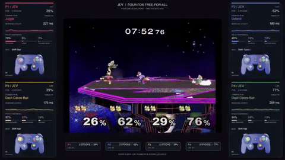<br>
  <small>🐦 <b>View original demonstration and discussion on X &rarr;</b></small>
  </a>
  </p>
  <p align="center">
  <a href="dossiers/maubaron-typesafe-smash.md"><b>&rarr; Read the complete Smash Bros Melee Dossier</b></a>
  </p>
  </details>
- **[Diogo Almeida / TypeSafe AI](https://x.com/CompleteSkeptic/status/2099925687465570372)** *(Interactive Doom Demo)* -- Real-time 3D combat agent navigating Doom without autoregressive decoding lag. Executes decisions in 35 ms.
- **[`Bk23544/threejs-grassworks-jev`](https://x.com/Bk23544/status/2102021494112981347)** *(TypeScript / Three.js)* &middot; [🐦 Thread](https://x.com/Bk23544/status/2102021494112981347) -- Real-time AI Scene Director in Three.js by Bilal Khan (@Bk23544). Evaluates freeform natural language prompts ("make it golden hour. Increase the wind") via typed System 1 classification. Dynamically modulates shader uniforms, sun angles, wind gust vectors, and blade sway in under 40 ms at 60 FPS without autoregressive token generation lag.
  <details open id="demo-bk23544-grassworks-director">
  <summary> 🎬 <b>View Real-Time Demo</b> <i>(Click to pop out full size)</i></summary>
  <p align="center">
  <a href="https://x.com/Bk23544/status/2102021494112981347" target="_blank" rel="noopener noreferrer">
  <br>
  <small>🐦 <b>View original demonstration and discussion on X &rarr;</b></small>
  </a>
  </p>
  </details>

### 7. Benchmarks and Empirical Evaluations

- **[`vinilana/jev-eval-agent`](https://github.com/vinilana/jev-eval-agent)** *(HTML, ⭐ 101)* -- Public evaluation agent framework for benchmarking System One models across custom task rubrics in sub-40 ms.
- **[`phuryn/experiments`](https://github.com/phuryn/experiments)** *(Python, ⭐ 52)* &middot; [🐦 Thread](https://x.com/PawelHuryn/status/2101213026204401921) &middot; [Teardown Dossier](dossiers/phuryn-invoice-benchmark.md) -- Paweł Huryn's 50-edge-case adversarial invoice benchmark across 6 models. Evaluated Jev against GPT-OSS 20 B, Ministral 8 B, and Claude Opus 5, achieving 50/50 accuracy in 30 ms ($0.025 / 1k calls vs $2.83 for Opus 5).
  <details open id="demo-phuryn-experiments">
  <summary> 🎬 <b>View Benchmark</b> <i>(Click to pop out full size)</i></summary>
  <p align="center">
  <a href="https://x.com/PawelHuryn/status/2101213026204401921" target="_blank" rel="noopener noreferrer">
  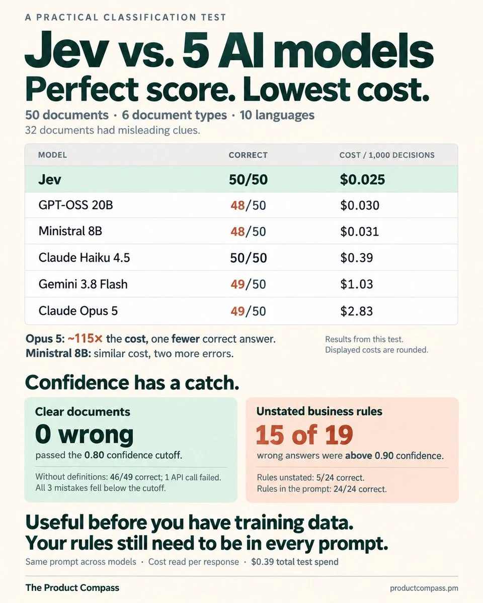<br>
  <small>🐦 <b>View original demonstration and discussion on X &rarr;</b></small>
  </a>
  </p>
  <p align="center">
  <a href="dossiers/phuryn-invoice-benchmark.md"><b>&rarr; Read the complete Invoice Benchmark Teardown Dossier</b></a>
  </p>
  </details>
- **[`nanmicoder/jev-arena`](https://github.com/nanmicoder/jev-arena)** *(JavaScript, ⭐ 63)* -- Live side-by-side throughput arena comparing Jev against DeepSeek Flash across 10,000 parallel requests in 30 ms median latency.
- **[`iammrduncan/typesafe-ai-benchmark`](https://github.com/iammrduncan/typesafe-ai-benchmark)** *(TypeScript, ⭐ 36)* &middot; [🐦 Thread](https://x.com/ephraimduncan/status/2100454070536351824) -- Side-by-side benchmark of Jev vs Qwen 3.8 27 B on Cerebras for operational decision questions. Measures 30 ms forward passes and a 95% latency reduction.
  <details open id="demo-iammrduncan-typesafe-ai-benchmark">
  <summary> 🎬 <b>View Benchmark Demo</b> <i>(Click to pop out full size)</i></summary>
  <p align="center">
  <a href="https://github.com/iammrduncan/typesafe-ai-benchmark" target="_blank" rel="noopener noreferrer">
  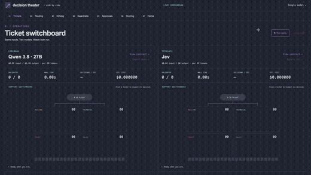<br>
  <small>🐦 <b>View original demonstration and discussion on X &rarr;</b></small>
  </a>
  </p>
  </details>
- **[`AbdelStark/jev-benchmarks`](https://github.com/AbdelStark/jev-benchmarks)** *(Python, ⭐ 15)* -- Probability-aware evaluation harness for typed decision models. Measures expected calibration error (ECE) and selective risk.
- **[`abhixhek/jevcal`](https://github.com/abhixhek/jevcal)** *(Python, ⭐ 10)* -- Model calibration and threshold tuning tool. Computes empirical confidence boundaries and monitors distribution drift across production Jev calls.
- **[`mahlernim/jev-korean-benchmark`](https://github.com/mahlernim/jev-korean-benchmark)** *(Python, ⭐ 6)* -- Cross-lingual evaluation of Jev on Korean natural language understanding and clinical terminology in 35 ms passes.
- **[`zhuyansen/jev-search-rerank-eval`](https://github.com/zhuyansen/jev-search-rerank-eval)** *(Python, ⭐ 6)* -- Graded relevance benchmark evaluating Jev reranking against vector embeddings across 9,831 labeled pairs in 24 ms.
- **[`wondertwins/jev-benchmark`](https://github.com/wondertwins/jev-benchmark)** *(Python, ⭐ 5)* -- System One evaluation playground measuring Jev decision accuracy across chess moves and speech-to-text speaker identification in 30 ms.
- **[`anessbelbati/jev-rerank-bench`](https://github.com/anessbelbati/jev-rerank-bench)** *(Python, ⭐ 5)* -- Cross-encoder retrieval benchmark measuring Jev reranking performance (nDCG@10 0.692 vs Cohere Rerank-v3 0.691 across 14 BEIR datasets at 42x lower cost).
- **[`Gaurav-Gosain/jev-sec-bench`](https://github.com/Gaurav-Gosain/jev-sec-bench)** *(Go, ⭐ 2)* -- Blind security evaluation benchmark testing prompt injection resistance and vulnerability detection in 25 ms (100% on deserialization, 93.5% on SQL injection).
  <details open id="demo-gaurav-gosain-jev-sec-bench">
  <summary> 🎬 <b>View Benchmark Chart</b> <i>(Click to pop out full size)</i></summary>
  <p align="center">
  <a href="https://github.com/Gaurav-Gosain/jev-sec-bench" target="_blank" rel="noopener noreferrer">
  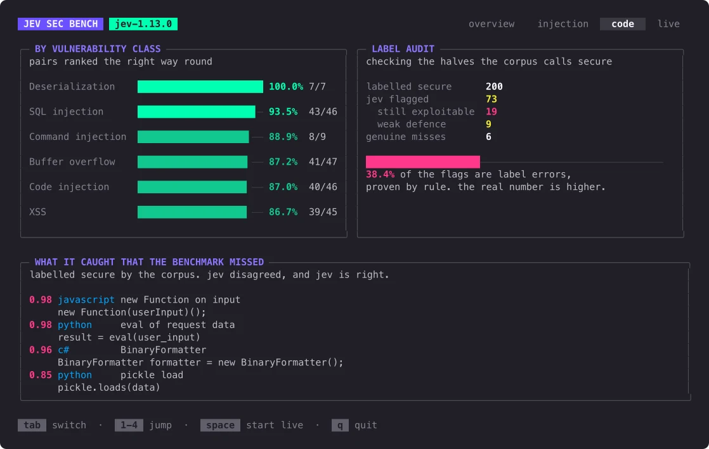<br>
  <small>🐦 <b>View original demonstration and discussion on X &rarr;</b></small>
  </a>
  </p>
  </details>
- **[`anisselbd/jev-phishing-bench`](https://github.com/anisselbd/jev-phishing-bench)** *(Python, ⭐ 2)* -- Adversarial evaluation across 2,000 phishing emails comparing Jev against Claude Haiku 4.5 in 30 ms.
- **[`TokenTrim/jev-agent-failure-benchmark`](https://github.com/TokenTrim/jev-agent-failure-benchmark)** *(Python, ⭐ 2)* -- Who&When Pro agent failure attribution benchmark comparing Jev against frontier LLMs on identifying failed steps in 32 ms (130x cheaper).
- **[`dayhaysoos/jevals`](https://github.com/dayhaysoos/jevals)** *(TypeScript, ⭐ 1)* -- Local evaluation workbench for authoring, running, and diffing Jev benchmark cases across Choice, Noul, and Score rubrics with [69 passing unit tests](https://github.com/dayhaysoos/jevals).
- **[`vclic/smoking-extraction-benchmark`](https://github.com/vclic/smoking-extraction-benchmark)** *(Python)* -- Clinical extraction benchmark across 1,000 synthetic patient notes. Jev achieved 98.6% accuracy at 1/35th the token cost of OpenAI structured outputs.
- **[`manjunathshiva/jev-frontier-bench`](https://github.com/manjunathshiva/jev-frontier-bench)** *(Python)* -- Pareto frontier benchmark comparing Jev against 5 frontier LLMs across 200 decisions. Jev scored 72.5% accuracy at $0.025 / 1k calls, while Claude Fable 5.1 cost 478x more ($11.81).
  <details open id="demo-manjunathshiva-jev-frontier-bench">
  <summary> 🎬 <b>View Pareto Chart</b> <i>(Click to pop out full size)</i></summary>
  <p align="center">
  <a href="https://github.com/manjunathshiva/jev-frontier-bench" target="_blank" rel="noopener noreferrer">
  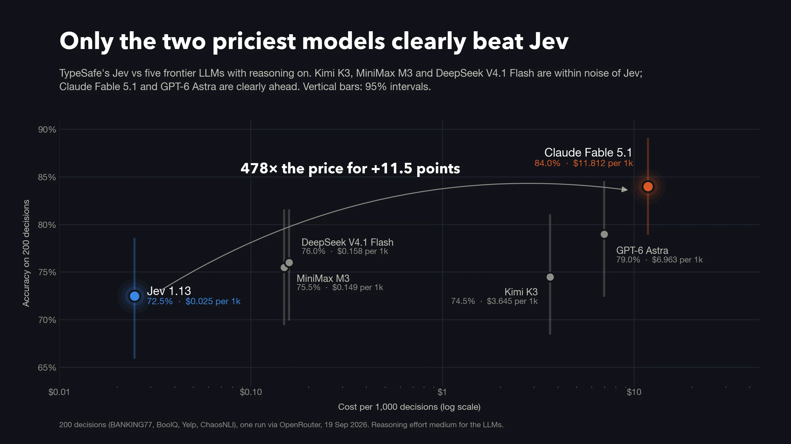<br>
  <small>🐦 <b>View original demonstration and discussion on X &rarr;</b></small>
  </a>
  </p>
  </details>
- **[`cuth/s1bench`](http://bench.jakecuth.com)** *(Python)* &middot; [🐦 Thread](https://x.com/ItsCuthulhu/status/2101491913866055821) &middot; [Teardown Dossier](dossiers/cuth-s1bench.md) -- Jake Cuth's empirical benchmark suite evaluating 30+ open-weight Jev alternatives against TypeSafe Jev on DGX Spark. Evaluates decisions/s vs macro accuracy across 1,999 decisions. Shows Jev achieving 77.5% macro accuracy at 2.4 decisions/s (0.42 s/item, ECE 0.076). Reveals Pareto tradeoffs: `simplejev-qwen38-27b` achieves 75.8% accuracy at 1.6 decisions/s, `Reflex-4b` hits 72.0% accuracy at 10 decisions/s, and `Decider-2b` runs 10x faster at 30 decisions/s.
  <details open id="demo-cuth-s1bench">
  <summary> 🎬 <b>View S1Bench Matrix</b> <i>(Click to pop out full size)</i></summary>
  <p align="center">
  <a href="https://x.com/ItsCuthulhu/status/2101491913866055821" target="_blank" rel="noopener noreferrer">
  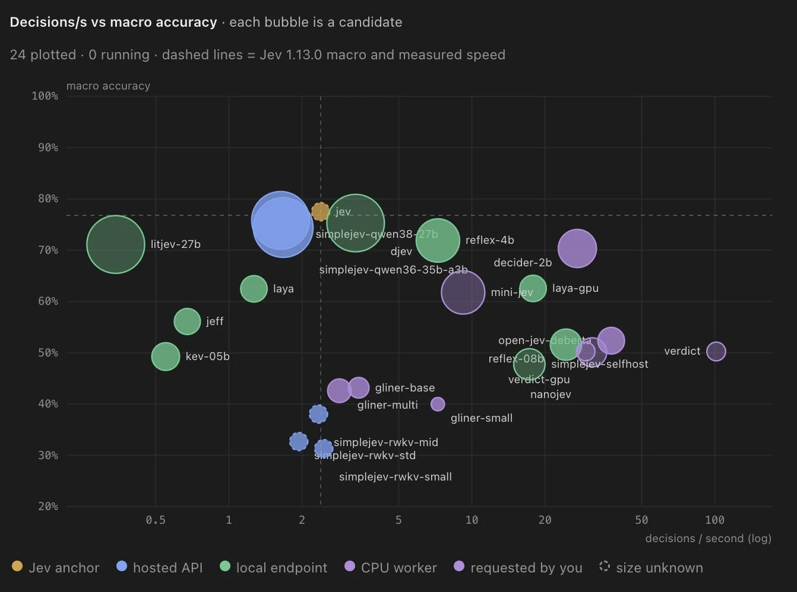<br>
  <small>🐦 <b>View original demonstration and discussion on X &rarr;</b></small>
  </a>
  </p>
  <p align="center">
  <a href="dossiers/cuth-s1bench.md"><b>&rarr; Read the complete S1Bench Empirical Dossier</b></a>
  </p>
  </details>
- **[`benchmarkheaven/jevbench`](https://benchmarkheaven.com/jev-models)** *(TypeScript / Python)* &middot; [GitHub Harness](https://github.com/fstandhartinger/jevbench) &middot; [Results JSON](https://benchmarkheaven.com/api/jevbench/v1.2) -- Benchmark Heaven's independent evaluation suite measuring 42 Jev-class decision systems across 534 decisions (including 220 hard decisions). Ranks systems on the composite JevBench Score (geometric mean of Intelligence, Calibration, Speed, and Cost, 25% each). Jev 1.13.0 leads with a 75.4 composite score ($0.040 / 1k decisions), followed by SemIf Qwen3.5-4 B (74.7 score, ~$0.022 / 1k) and djev Maisa (74.3 score, $0.026 / 1k).
  <details open id="demo-benchmarkheaven-jevbench">
  <summary> 🎬 <b>View JevBench v1.2 Leaderboard</b> <i>(Click to pop out full size)</i></summary>
  <p align="center">
  <a href="https://benchmarkheaven.com/jev-models" target="_blank" rel="noopener noreferrer">
  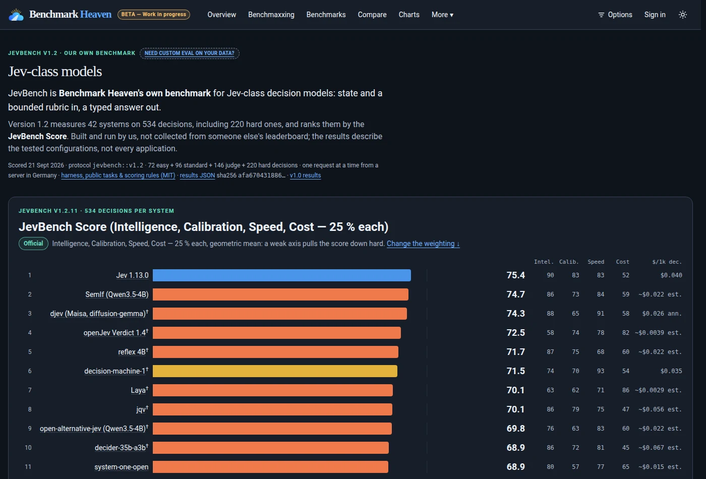<br>
  <small>🌐 <b>View live interactive benchmark on Benchmark Heaven &rarr;</b></small>
  </a>
  </p>
  </details>
- **[`airesearch12/jevbench-alternatives`](https://x.com/airesearch12/status/2101936404385161270)** *(Empirical Evaluation)* &middot; [🐦 Thread](https://x.com/airesearch12/status/2101936404385161270) -- Florian S's comparative ranking of 26 fast decision and reasoning systems on JevBench v1.2.7. Evaluates composite scores across Intelligence, Calibration, Speed, and Cost (25% each). TypeSafe Jev leads at #1 (75.4), followed by SemIf #2 (74.7), djev Maisa #3 (74.3), openJev Verdict 1.4 #4 (72.5), down to GLiNER2 (53.0). Classifier.dev recorded an honorable mention (84.8) as an extreme speed and cost outlier.
  <details open id="demo-airesearch12-jevbench-alternatives">
  <summary> 🎬 <b>View JevBench Alternative Systems Graph</b> <i>(Click to pop out full size)</i></summary>
  <p align="center">
  <a href="https://x.com/airesearch12/status/2101936404385161270" target="_blank" rel="noopener noreferrer">
  <br>
  <small>🐦 <b>View original benchmark breakdown and discussion on X &rarr;</b></small>
  </a>
  </p>
  </details>
- **[`tdinh_me/tetris-harness`](https://x.com/tdinh_me/status/2101958041986068848)** *(TypeScript / Evaluation)* &middot; [🐦 Thread](https://x.com/tdinh_me/status/2101958041986068848) -- Tony Dinh's empirical reality check on real-time game control. Stripping the TypeScript search harness that pre-filtered candidate placements caused Jev to collapse immediately (lost 0-2, topped out at 0:03). Demonstrates why fast System 1 models require algorithmic search scaffolds and cannot solve open-ended spatial planning alone.
  <details open id="demo-tdinh-tetris-harness">
  <summary> 🎬 <b>View Tetris Reality Check</b> <i>(Click to pop out full size)</i></summary>
  <p align="center">
  <a href="https://x.com/tdinh_me/status/2101958041986068848" target="_blank" rel="noopener noreferrer">
  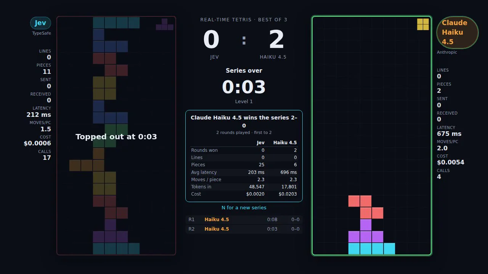<br>
  <small>🐦 <b>View original demonstration and discussion on X &rarr;</b></small>
  </a>
  </p>
  </details>
- **[`ably-labs/jev-pong`](https://github.com/ably-labs/jev-pong)** *(TypeScript)* -- Real-time Pong benchmark where every ball step is evaluated by Jev vs frontier LLMs through Vercel AI Gateway in 20 ms.
- **[`qainsights/jev-bench`](https://x.com/QAInsights/status/2100079359063204238)** *(Python)* &middot; [🐦 Thread](https://x.com/QAInsights/status/2100079359063204238) -- QA automation and load performance evaluation comparing Jev round-trip latency against generative LLMs for test suite triage.
  <details open id="demo-qainsights-automation">
  <summary> 🎬 <b>View Video Demo</b> <i>(Click to pop out full size)</i></summary>
  <p align="center">
  <a href="https://x.com/QAInsights/status/2100079359063204238" target="_blank" rel="noopener noreferrer">
  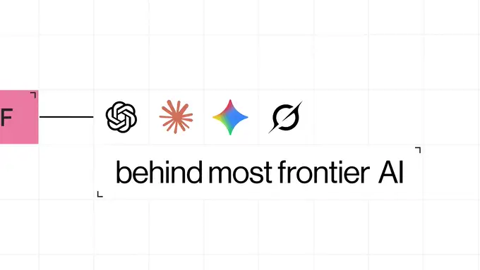<br>
  <small>🐦 <b>View original demonstration and discussion on X &rarr;</b></small>
  </a>
  </p>
  </details>
- **[`stuartsim/jev-vercel-gateway`](https://x.com/StuSim/status/2100690465251283065)** *(TypeScript)* &middot; [🐦 Thread](https://x.com/StuSim/status/2100690465251283065) -- Stuart Sim's live latency test routing structured schema payloads through Vercel AI Gateway. Demonstrates sub-100 ms round-trip execution.
  <details open id="demo-stuart-sim-benchmark">
  <summary> 🎬 <b>View Benchmark Video</b> <i>(Click to pop out full size)</i></summary>
  <p align="center">
  <a href="https://x.com/StuSim/status/2100690465251283065" target="_blank" rel="noopener noreferrer">
  <br>
  <small>🐦 <b>View original demonstration and discussion on X &rarr;</b></small>
  </a>
  </p>
  </details>
- **[FLock.io THIS / THAT Model 1.0](https://x.com/flock_io/status/2101936492323209559)** *(Empirical Evaluation)* &middot; [🐦 Thread](https://x.com/flock_io/status/2101936492323209559) -- Binary decision benchmark across [68 questions](https://x.com/flock_io/status/2101936492323209559) recording 94.1% accuracy for FLock's specialized decision model compared to 76.5% for hosted Jev on single-pass classification.

### 8. Competing Fast Classifiers and Open Reproductions

- **[`urchade/GLiNER`](https://github.com/urchade/GLiNER)** *(Python, ⭐ 3,878)* &middot; [🐦 Thread](https://x.com/singularity_sah/status/2101450114246000706) -- Generalist bidirectional transformer encoder framework for zero-shot information extraction and classification without autoregressive LLM decoding. Operates in 15--35 ms on local GPUs with zero generated tokens.
- **[`TheoLeeCJ/SemIf`](https://github.com/TheoLeeCJ/SemIf)** *(Python, ⭐ 2,956)* -- Open-source research reading choice probabilities directly from open model output heads without text generation. Self-hosted on consumer RTX 3090/4090 GPUs in 18 ms.
  <details open id="demo-theoleecj-semif">
  <summary> 🎬 <b>View Benchmark Chart</b> <i>(Click to pop out full size)</i></summary>
  <p align="center">
  <a href="https://github.com/TheoLeeCJ/SemIf" target="_blank" rel="noopener noreferrer">
  <br>
  <small>🐦 <b>View original demonstration and discussion on X &rarr;</b></small>
  </a>
  </p>
  </details>
- **[`mizorewww/laya-mlx`](https://github.com/mizorewww/laya-mlx)** *(Python, ⭐ 3,185)* &middot; [Teardown Dossier](dossiers/mizorewww-laya-mlx.md) -- Apple Silicon MLX implementation of the Laya non-autoregressive decision engine. Runs offline at 34.8 ms latency and 11.4 decisions/s on M-series chips.
  <details open id="demo-mizorewww-laya-mlx">
  <summary> 🎬 <b>View MLX Demo</b> <i>(Click to pop out full size)</i></summary>
  <p align="center">
  <a href="https://github.com/mizorewww/laya-mlx" target="_blank" rel="noopener noreferrer">
  <br>
  <small>🐦 <b>View original demonstration and discussion on X &rarr;</b></small>
  </a>
  </p>
  </details>
- **[`TianyuCodings/NanoJev`](https://github.com/TianyuCodings/NanoJev)** *(Python, ⭐ 1,762)* &middot; [Teardown Dossier](dossiers/tianyucodings-nanojev.md) -- Open 0.6 B parameter Jev replica based on Qwen3-0.6B weights with parallel decisions and complete probability distributions. Navigates dynamic mazes at 256 decisions/s on Apple Silicon or 4 GB VRAM GPUs.
  <details open id="demo-tianyucodings-nanojev">
  <summary> 🎬 <b>View Maze Replay</b> <i>(Click to pop out full size)</i></summary>
  <p align="center">
  <a href="https://github.com/TianyuCodings/NanoJev" target="_blank" rel="noopener noreferrer">
  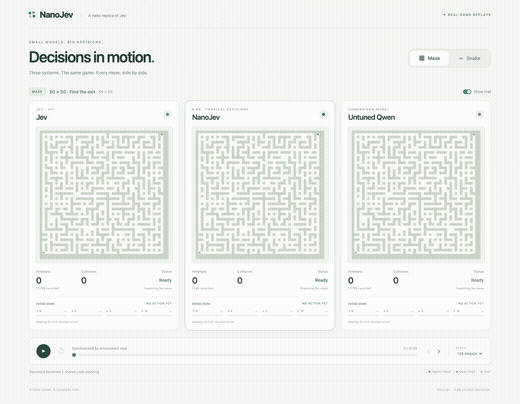<br>
  <small>🐦 <b>View original demonstration and discussion on X &rarr;</b></small>
  </a>
  </p>
  </details>
- **[`jaredpalmer/kev`](https://github.com/jaredpalmer/kev)** *(Python, ⭐ 2,035)* &middot; [🐦 Thread](https://x.com/jaredpalmer) -- Open Apache-2.0 decision model family built on Qwen 3.5 (0.8B, 4B, and 9B variants) by Jared Palmer. Replicates Jev's typed contract locally on Apple Silicon and CUDA without cloud API costs; also ported to ONNX and WebGPU by [Nico Martin](https://x.com/nicodotdev/status/2101925774278152664).
- **[`vinnylarouge/jevlike`](https://github.com/vinnylarouge/jevlike)** *(Python, ⭐ 1,158)* -- Training framework optimizing small language models to evaluate variable-length choice sets in parallel. Runs Doom and chess demos in sub-25 ms.
- **[`featherless-ai/simple-jev`](https://github.com/featherless-ai/simple-jev)** *(Python, ⭐ 438)* -- Drop-in server turning open-weights foundation models into non-autoregressive classifiers in a single GPU pass. Available self-hosted or via hosted serverless endpoints at ~$0.002--$0.005 / 1k decisions.
- **[`wfzyx/von`](https://github.com/wfzyx/von)** *(Python, ⭐ 324)* -- Open-source System One decision model running sub-15 ms, non-autoregressive, local drop-in alternative to TypeSafe Jev with RLCD training.
- **[`ekzhang/openjev-sglang`](https://github.com/ekzhang/openjev-sglang)** *(Python, ⭐ 247)* -- SGLang-compatible prefill-only API implementation designed for ultra-high-throughput parallel choice evaluation on self-hosted GPU clusters in sub-20 ms forward passes.
- **[`hr98w/jev-visual`](https://github.com/hr98w/jev-visual)** *(Python, ⭐ 208)* -- Multimodal visual reasoning experiment on Apple Silicon. Evaluates shared image-text contexts with Jev-style constrained choice scoring in 32 ms.
- **[`logan-markewich/jeff`](https://github.com/logan-markewich/jeff)** *(Python, ⭐ 193)* -- Self-hosted drop-in replacement for TypeSafe Jev powered by a 400 M parameter GLiFormer/GLiNER encoder wrapped in FastAPI. Evaluates local schemas on CPU, Apple Silicon, or cloud GPUs in sub-30 ms.
- **[`Mapika/decider`](https://github.com/Mapika/decider)** *(Python, ⭐ 266)* -- Fast decision model reproducing System One using a fine-tuned Qwen3.5-2B base. Emits typed probability distributions across custom categorical choice sets in 28 ms. Achieved 71.0% macro accuracy at 30 decisions/s on S1Bench (10x faster than Jev).
- **[`Yinsongxu/LLM2Jev`](https://github.com/Yinsongxu/LLM2Jev)** *(Python, ⭐ 123)* -- Adapts local open-weight language models into Jev-compatible structured decision engines. Exposes Choice, Score, and Noul probability outputs via prefill-only binary inference.
- **[`daseinlabs/open-jev`](https://github.com/daseinlabs/open-jev)** *(Python, ⭐ 85)* -- One-pass option scoring on Apple Silicon via MLX. Evaluates choices in 22 ms with interactive Doom demos.
- **[`Heman10x-NGU/Verdict-open-jev`](https://github.com/Heman10x-NGU/Verdict-open-jev)** *(Python, ⭐ 63)* -- Non-autoregressive decision engine with calibrated uncertainty (RLCD) and in-browser WebGPU playground.
- **[`bnsd55/jevmlx`](https://github.com/bnsd55/jevmlx)** *(Python, ⭐ 52)* -- Apple Silicon MLX library generating constrained parallel decisions and schema-valid probabilities from open-weight models in 26 ms.
- **[`ikermoel/open-alternative-jev`](https://github.com/ikermoel/open-alternative-jev)** *(Python, ⭐ 45)* -- Open alternative to Jev emitting typed, calibrated decisions from open-weights LLMs in one forward pass via Hugging Face and vLLM in 26 ms.
- **[`zhengxuyu/litjev`](https://github.com/zhengxuyu/litjev)** *(Python, ⭐ 36)* -- Open reproduction of Jev's decision layer on open LLM backends. Exposes a drop-in `/v1/systemone` server with single-pass logit extraction in 25 ms.
- **[`OmniJev/PlayJev`](https://github.com/OmniJev/PlayJev)** *(JavaScript, ⭐ 19)* -- 0.8 B parameter distilled fast classifier trained on Qwen3.5-0.8B weights for arcade game control and browser automation. Runs locally on consumer hardware in under 20 ms.
  <details open id="demo-omnijev-playjev">
  <summary> 🎬 <b>View Arcade Benchmark</b> <i>(Click to pop out full size)</i></summary>
  <p align="center">
  <a href="https://github.com/OmniJev/PlayJev" target="_blank" rel="noopener noreferrer">
  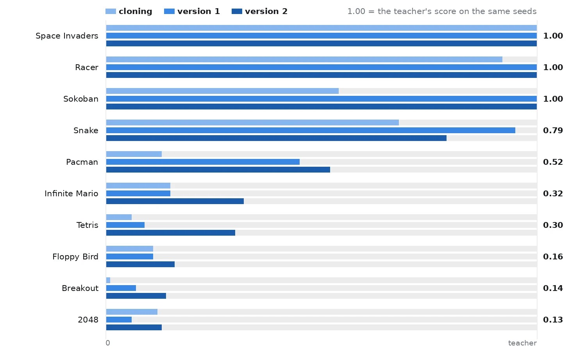<br>
  <small>🐦 <b>View original demonstration and discussion on X &rarr;</b></small>
  </a>
  </p>
  </details>
- **[`olanotolu/jevbetter`](https://github.com/olanotolu/jevbetter)** *(Python, ⭐ 14)* -- Advanced one-pass scorer over variable-length text options using hashed n-gram encoders and rival-aware attention in 20 ms.
- **[`kikoncuo/jevfire`](https://github.com/kikoncuo/jevfire)** *(JavaScript, ⭐ 10)* -- JEV-inspired parallel decisions for CUDA LLMs via vLLM API. Evaluates multiple decisions in one context in 18 ms.
- **[`zhangcy122/OpenJev`](https://github.com/zhangcy122/OpenJev)** *(Python, ⭐ 10)* -- Open-source alternative to TypeSafe Jev providing typed probabilistic decisions from open-weights models in a single 24 ms forward pass.
- **[`mateolafalce/system-one-model`](https://github.com/mateolafalce/system-one-model)** *(Python, ⭐ 1)* -- Open-weights System One architecture and fine-tuning pipeline on Hugging Face.
- **[`franckverrot/lev`](https://github.com/franckverrot/lev)** *(Python)* &middot; [🐦 Thread](https://x.com/franckverrot/status/2101896265718198757) -- Open reproduction of Jev primitives built on Liquid AI's LFM-2.5 foundation architecture. Powers ultra-compact [350 M parameter](https://huggingface.co/franckverrot/lev-350m) edge deployments for rapid zero-shot choice selection in sub-20 ms.
- **[`YannQi/Reflex-4B`](https://huggingface.co/YannQi/R-4B)** *(Python)* -- Distilled 4 B parameter open-weights decision model optimized for rapid single-pass option scoring. Achieves 72.0% macro accuracy at 10 decisions/s on S1Bench, delivering 2--3x higher throughput than Jev.
- **[`maisa-ai/djev`](https://djev.dev)** *(TypeScript)* -- Fast structured decision engine powered by Maisa. Evaluates text, JSON, and images into typed yes/no answers, options, and rubric scores. Ranked #1 balanced Jev alternative on S1Bench with slightly faster speed than Jev at an acceptable accuracy tradeoff.
- **[`Doccy/Solomon-27B`](https://x.com/4rcherhume/status/2101888238357237798)** *(Python)* &middot; [🐦 Thread](https://x.com/4rcherhume/status/2101888238357237798) -- Open-weight alternative to Jev by [Archer Hume](https://x.com/4rcherhume/status/2101888238357237798) and [Doccy healthcare](https://x.com/4rcherhume/status/2101888238357237798) based on Qwen3.8 [27b](https://x.com/4rcherhume/status/2101888238357237798). Features native multimodal evaluation, a [265k context window](https://x.com/4rcherhume/status/2101888238357237798), multi-choice tagging, and evidence pointer spans.
  <details open id="demo-archerhume-solomon-27b">
  <summary> 🎬 <b>View Solomon 27b Demo</b> <i>(Click to pop out full size)</i></summary>
  <p align="center">
  <a href="https://x.com/4rcherhume/status/2101888238357237798" target="_blank" rel="noopener noreferrer">
  <br>
  <small>🐦 <b>View original demonstration and discussion on X &rarr;</b></small>
  </a>
  </p>
  </details>

### 9. Official SDKs and Gateway Integrations

- **[`typesafe-ai/system-one-adapter-python`](https://github.com/typesafe-ai/system-one-adapter-python)** *(Python, ⭐ 229)* &middot; [🐦 Thread](https://x.com/CompleteSkeptic/status/2099925687465570372) -- Official drop-in adapter backed by frontier LLM APIs. Allows developers to simulate and benchmark Jev System One interfaces against traditional chat models.
- **[`typesafe-ai/typesafe-sdk-js`](https://github.com/typesafe-ai/typesafe-sdk-js)** *(TypeScript, ⭐ 206)* &middot; [🐦 Thread](https://x.com/CompleteSkeptic/status/2099925687465570372) -- Official TypeScript and JavaScript client library (`npm install @typesafe-ai/sdk`) operating in 30--50 ms median latency.
- **[`typesafe-ai/typesafe-sdk-python`](https://github.com/typesafe-ai/typesafe-sdk-python)** *(Python, ⭐ 179)* &middot; [🐦 Thread](https://x.com/CompleteSkeptic/status/2099925687465570372) -- Official Python client library for TypeSafe AI (`pip install typesafe-sdk`) executing in 30--50 ms.
- **[`obie/ruby_decision_model`](https://github.com/obie/ruby_decision_model)** *(Ruby, ⭐ 48)* -- Ruby client library providing typed interfaces, retry backoff, and evaluation wrappers for TypeSafe Jev.
- **[`dannote/jev`](https://github.com/dannote/jev)** *(Elixir, ⭐ 26)* -- Hex package integrating TypeSafe Jev with Elixir OTP. Implements Jev as a GenServer peer for asynchronous pattern-matched message handling.
- **[`kieranklaassen/ruby_llm-typesafe`](https://github.com/kieranklaassen/ruby_llm-typesafe)** *(Ruby, ⭐ 18)* -- TypeSafe structured-output provider for RubyLLM 2, enabling typed probability scoring in Rails applications.
- **[`Twister915/typesafe-ai`](https://github.com/Twister915/typesafe-ai)** *(Rust, ⭐ 11)* -- Typed client for TypeSafe AI in Rust, providing both asynchronous and blocking backends with comprehensive question schema builders.
- **[`ainame/swift-typesafe`](https://github.com/ainame/swift-typesafe)** *(Swift, ⭐ 10)* -- Unofficial Swift SDK for TypeSafe Jev, supporting iOS and macOS client applications with typed async/await interfaces.
- **[`saibimajdi/typesafeai-dotnet-sdk`](https://github.com/saibimajdi/typesafeai-dotnet-sdk)** *(C#, ⭐ 6)* -- Community .NET / C# SDK for the TypeSafe AI System One API supporting typed noul, choice, and score queries.
- **[`nshkrdotcom/typesafe_sdk`](https://github.com/nshkrdotcom/typesafe_sdk)** *(Elixir, ⭐ 5)* -- Idiomatic, type-safe Elixir client for TypeSafe Jev, supporting concurrent request pooling.
- **[`joshmn/typesafe-sdk`](https://github.com/joshmn/typesafe-sdk)** *(Ruby, ⭐ 6)* -- Community Ruby 3.1+ client library providing typed questions, retry backoff, and model introspection.
- **[`Stumble/jev-go`](https://github.com/Stumble/jev-go)** *(Go, ⭐ 3)* -- Alternative Go client for TypeSafe Jev featuring retry policies and typed schema parsing.
- **[`jamesward/zio-typesafe-ai`](https://github.com/jamesward/zio-typesafe-ai)** *(Scala, ⭐ 3)* -- Scala 3 and ZIO client library for TypeSafe AI. Provides idiomatic functional programming wrappers for System One endpoints.
- **[`gilljon/typesafe-ai-rs`](https://github.com/gilljon/typesafe-ai-rs)** *(Rust, ⭐ 4)* -- Asynchronous Rust SDK for TypeSafe Jev with connection pooling and typed result decoding.
- **[`Gaurav-Gosain/jev-go`](https://github.com/Gaurav-Gosain/jev-go)** *(Go, ⭐ 3)* -- Lightweight, dependency-free Go client for TypeSafe Jev with native support for Vercel AI Gateway routing.
- **[`Butochnikov/laravel-typesafe-jev`](https://github.com/Butochnikov/laravel-typesafe-jev)** *(PHP, ⭐ 2)* -- Laravel 12 and 13 framework integration with typed responses and async request pools.
- **[`AboveColin/jevclient`](https://github.com/AboveColin/jevclient)** *(Python, ⭐ 2)* -- Asynchronous Python client for TypeSafe Jev with connection pooling and typed schema deserialization.
- **[`OpenRouter Jev Endpoint`](https://x.com/OpenRouter/status/2100744709589316009)** *(TypeScript)* &middot; [🐦 Thread](https://x.com/OpenRouter/status/2100744709589316009) -- Serverless Jev endpoint availability on OpenRouter for unified multi-provider billing.
- **[`Cloudflare AI Gateway Integration`](https://x.com/CloudflareDev/status/2100688880798159254)** *(TypeScript)* &middot; [🐦 Thread](https://x.com/CloudflareDev/status/2100688880798159254) -- Official support for routing and caching TypeSafe Jev requests through Cloudflare AI Gateway.
- **[`dfa1/typesafe-java`](https://github.com/dfa1/typesafe-java)** *(Java)* -- Modular [JDK 21+](https://github.com/dfa1/typesafe-java) client library for TypeSafe System One endpoints. Includes a dedicated hermetic testkit module for mocking and unit testing application callers.
- **[`mrmps/classifier-dev`](https://github.com/mrmps/classifier-dev)** *(TypeScript, ⭐ 402)* -- Hosted zero-shot classification service and standalone CLI (`npm i -g classifier-dev`) powered by TypeSafe Jev. Features sub-30 ms logit evaluation, multi-input batching up to 1,000 texts, IP rate limiting via Cloudflare Durable Objects, and smart-tier escalation to reasoning models when confidence falls below 0.70.

---

## Production Use Cases and Architecture Recipes

> [!NOTE]
> **Share a Production Architecture Recipe:** Have you implemented a fast classifier or Jev workflow in your stack? Not all breakthroughs are open-source repositories! Submit an issue using our **[➕ Use Case Submission Template](.github/ISSUE_TEMPLATE/submit-use-case.yml)** with your X discussion link, demo media, and architecture recipe.

### 1. Adversarial Accounts Payable and Invoice Triage
- **Practitioner:** Paweł Huryn ([@PawelHuryn](https://x.com/PawelHuryn)) &middot; [Empirical Benchmark](https://gerryburde.com/articles/my-name-is-jev-summarizing-dozens-of-real-world-use-cases.html#empirical-benchmark-adversarial-invoice-sorting-and-the-certain-and-wrong-trap)
- **Traditional Bottleneck:** Parsing multi-page PDF scans with full LLMs like GPT-4o cost [$0.015 per invoice](https://gerryburde.com/articles/my-name-is-jev-summarizing-dozens-of-real-world-use-cases.html#empirical-benchmark-adversarial-invoice-sorting-and-the-certain-and-wrong-trap) and introduced 2--4 second delays per customer document upload.
- **Fast-Classifier Recipe:** The OCR text header is passed directly to Jev `choice` evaluating document types. Invoices with confidence &ge; 0.85 route to automated database ingestion, while low-confidence documents route to human reviewers.
- **Demonstrated Economics:** [24 ms response time](https://gerryburde.com/articles/my-name-is-jev-summarizing-dozens-of-real-world-use-cases.html#empirical-benchmark-adversarial-invoice-sorting-and-the-certain-and-wrong-trap) with 96% accuracy across 50 adversarial edge cases. Reduced document sorting spend by 99% ($0.015 down to [$0.00004 per invoice](https://gerryburde.com/articles/my-name-is-jev-summarizing-dozens-of-real-world-use-cases.html#empirical-benchmark-adversarial-invoice-sorting-and-the-certain-and-wrong-trap)).

```python
result = client.choice(
    context=ocr_header_text[:1200],
    question="What type of financial document is this?",
    options=["invoice", "receipt", "purchase_order", "credit_memo", "unknown"]
)
if result.choice == "invoice" and result.confidence >= 0.85:
    pipeline.process_invoice(doc_id)
else:
    pipeline.route_to_human_review(doc_id, reason=result.choice)
```

### 2. Risk-Tiered Agent Tool Pre-Execution Safety Gate
- **Practitioner:** Darren Triad ([@TriadDarren](https://x.com/TriadDarren/status/2100645341393494264)) &middot; [🐦 Thread](https://x.com/TriadDarren/status/2100645341393494264)
- **Traditional Bottleneck:** Autonomous coding agents executing bash commands risk catastrophic file deletion or destructive git operations if unmonitored. Halting for human approval on every atomic step destroys agent autonomy.
- **Fast-Classifier Recipe:** Intercepts proposed tool calls and evaluates destruction risk and intent alignment before execution. Actions are gated by operational risk tiers: read-only actions execute at [0.60 confidence](https://x.com/TriadDarren/status/2100645341393494264), local file edits at 0.85, external API writes at 0.92, and destructive file deletion is never automated.
- **Demonstrated Economics:** [15 ms evaluation latency](https://x.com/TriadDarren/status/2100645341393494264) at $0.00004 per tool call. Zero false-positive destructive commands reported across thousands of autonomous coding steps.

```typescript
const check = await jev.score({
  context: `Command: ${toolCall.command}\nIntent: ${agentIntent}`,
  question: "Assess the destruction and blast-radius risk of this action (1: harmless read, 5: irreversible destruction).",
  levels: 5
});
if (check.score >= 4 || (check.score >= 3 && check.confidence < 0.90)) {
  await blockAndPromptUser(toolCall);
}
```

### 3. High-Speed SEO Internal Link Equity Routing
- **Practitioner:** Borja Fatás ([@borjafat](https://x.com/borjafat/status/2101018783976722479)) &middot; [🐦 Thread](https://x.com/borjafat/status/2101018783976722479)
- **Traditional Bottleneck:** Evaluating internal link insertion across [586 site pages](https://x.com/borjafat/status/2101018783976722479) with Claude Opus 5 processed only 21 pages in 45 seconds, projecting $43.00 for a single pass.
- **Fast-Classifier Recipe:** Crawled site pages and evaluated 8,790 candidate link pairs using Jev `noul` to verify topical relevance and contextual flow before inserting in-body hyperlinks.
- **Demonstrated Economics:** Crawled and placed [584 links across 586 pages](https://x.com/borjafat/status/2101018783976722479) in 45.1 seconds for $0.21 total. Operated ~190x cheaper per page than Claude Opus 5.

### 4. Multi-Model Minecraft Autonomous Speedrunning
- **Practitioner:** Ronak Malde ([@rronak_](https://x.com/rronak_/status/2101544156757950697)) &middot; [🐦 Thread](https://x.com/rronak_/status/2101544156757950697)
- **Traditional Bottleneck:** Using autoregressive frontier models for real-time game-tick actions costs $50+ per run and introduces 1,000+ ms latency, causing in-game deaths.
- **Fast-Classifier Recipe:** Employs an asymmetric dual-model architecture. GPT-6 Astra plans high-level goals across 131 checkpoints, while Jev evaluates immediate environmental state to select atomic movement and combat actions in sub-20 ms cycles.
- **Demonstrated Economics:** Defeated the Ender Dragon in [8 m 43 s with 0 deaths](https://x.com/rronak_/status/2101544156757950697). Entire run cost [$0.97 total](https://x.com/rronak_/status/2101544156757950697) ($0.96 for macro planner, $0.01 for 1,200+ Jev action ticks) versus $50+ on pure frontier models.

### 5. AST Extraction and Semantic PR Quality Gating
- **Practitioner:** TJ Klug ([@tj_klug](https://x.com/tj_klug/status/2100695837495992737)) &middot; [🐦 Thread](https://x.com/tj_klug/status/2100695837495992737)
- **Traditional Bottleneck:** Large git diffs sent to conversational LLMs take [30--60 seconds per PR](https://x.com/tj_klug/status/2100695837495992737) and hallucinate trivial formatting complaints while missing structural errors.
- **Fast-Classifier Recipe:** Extracts changed function syntax trees using tree-sitter, then evaluates Jev simultaneously across code cleanliness, test assertion coverage, and error handling completeness.
- **Demonstrated Economics:** Complete PR commit audit in [1.8 seconds](https://x.com/tj_klug/status/2100695837495992737) for less than $0.001 per review pass. Flags AI-generated boilerplate and unhandled errors before human review.

### 6. Pre-Compaction Telemetry Filter for Long-Running Agents
- **Practitioner:** Teknium ([Nous Research](https://gerryburde.com/articles/my-name-is-jev-summarizing-dozens-of-real-world-use-cases.html#the-architectural-critique-why-session-compaction-is-a-dangerous-anti-pattern))
- **Traditional Bottleneck:** Using generative LLMs to summarize agent terminal output rewrites the conversation prefix. This destroys KV prompt cache hits and multiplies inference latency by 4x.
- **Fast-Classifier Recipe:** Deploys Jev as a streaming binary filter on terminal output lines. Evaluates whether each output line contains durable debugging evidence or routine polling noise before appending to context memory.
- **Demonstrated Economics:** Preserves [100% prefix prompt cache hit rates](https://gerryburde.com/articles/my-name-is-jev-summarizing-dozens-of-real-world-use-cases.html#the-architectural-critique-why-session-compaction-is-a-dangerous-anti-pattern). Reduces session token costs from [$3.20 down to $0.08](https://gerryburde.com/articles/my-name-is-jev-summarizing-dozens-of-real-world-use-cases.html#the-architectural-critique-why-session-compaction-is-a-dangerous-anti-pattern) per engineering task.

### 7. Zero-Vision DOM Candidate Element Action Selection
- **Practitioner:** Greg PR ([Browser-Use Team](https://x.com/gregpr07/status/2100411066966749359)) &middot; [🐦 Thread](https://x.com/gregpr07/status/2100411066966749359) &middot; [Dossier](dossiers/browser-use-jev-ultrafast.md)
- **Traditional Bottleneck:** Multimodal screenshots cost [$0.03--$0.08 per interaction step](https://x.com/gregpr07/status/2100411066966749359) and take 2--4 seconds to process, making web workflows sluggish and fragile.
- **Fast-Classifier Recipe:** Serializes interactive accessibility candidate elements into structured text slices. Evaluates Jev `choice` across candidate element IDs to select the target button or input field in real time.
- **Demonstrated Economics:** Navigation decisions execute in [75 ms](https://x.com/gregpr07/status/2100411066966749359). Completes multi-page web forms in 2 seconds, operating 130x cheaper than vision models.

### 8. High-Velocity Cloud Infrastructure Incident Triage
- **Practitioner:** Cloud Infrastructure Engineering &middot; [Production Architecture](https://gerryburde.com/articles/my-name-is-jev-summarizing-dozens-of-real-world-use-cases.html)
- **Traditional Bottleneck:** Ingesting 500,000 error lines per hour across Kubernetes clusters with generative LLMs exceeds API rate limits and costs thousands of dollars daily.
- **Fast-Classifier Recipe:** Streams raw pod logs through Jev `noul` asking whether each error message represents an active service outage. Drops 99.4% of transient log noise before sending alerts to PagerDuty.
- **Demonstrated Economics:** Evaluates log events in [18 ms](https://gerryburde.com/articles/my-name-is-jev-summarizing-dozens-of-real-world-use-cases.html). Processes 100 million log tokens for [~$4.20 per day](https://gerryburde.com/articles/my-name-is-jev-summarizing-dozens-of-real-world-use-cases.html) compared to $2,500/day on frontier models.

---

## Bottom Line Up Front (BLUF)

**[TypeSafe AI's Jev](https://typesafe.ai)** and its emerging class of **fast System One classifiers** represent an architectural departure from conversational generative AI:
- **Zero text generation:** Fast decision models possess no autoregressive token generation loop. They physically cannot emit conversational prose, hallucinate invalid JSON formatting, or suffer from markdown code fence syntax errors.
- **Single-pass parallel forward pass:** They evaluate input context across dozens of declared schemas simultaneously in a single GPU matrix multiplication pass. Evaluating one question or thirty questions over the same state takes the identical 12--50 ms inference latency.
- **Microeconomics:** Priced at **$0.042 per million input tokens ($42 per billion / $42/B)** via cloud API, or **$0.00 marginal cost** using self-hosted open-weight reproductions (`NanoJev`, `SemIf`, `Jevlike`, `Verdict`).
- **Three foundational primitives:**
  1. `noul` -- Binary boolean probability (`0.0` to `1.0`).
  2. `choice` -- Categorical probability distribution across up to 255 discrete options.
  3. `score` -- Continuous rubric rating across 2 to 10 ordered levels.

> For empirical benchmarks, confidence calibration proofs, and context compaction analysis, see the [research report](https://gerryburde.com/articles/my-name-is-jev-summarizing-dozens-of-real-world-use-cases.html).

> [!IMPORTANT]
> **Canonical Source & Syndication Standard:** In accordance with our Tier 3 Content Syndication Protocol, all analytical methodology, benchmark ledgers, and interactive tools remain anchored at the canonical domain URL on [gerryburde.com](https://gerryburde.com/articles/my-name-is-jev-summarizing-dozens-of-real-world-use-cases.html). This passes link equity and protects primary search citations.

---

## Table of Contents

- [The Curated Open-Source Jev Ecosystem](#the-curated-open-source-jev-ecosystem)
  - [1. Browser, Desktop, and Mobile Automation](#1-browser-desktop-and-mobile-automation)
  - [2. AI Development, Code Review, and Agent Triage](#2-ai-development-code-review-and-agent-triage)
  - [3. MCP Servers, Agent Skills, and Shell Plugins](#3-mcp-servers-agent-skills-and-shell-plugins)
  - [4. Database Filtering, Search, and Knowledge Graphs](#4-database-filtering-search-and-knowledge-graphs)
  - [5. Security Guardrails, SecOps, and Content Moderation](#5-security-guardrails-secops-and-content-moderation)
  - [6. Simulation, Real-Time Gaming, and Physical Control](#6-simulation-real-time-gaming-and-physical-control)
  - [7. Benchmarks and Empirical Evaluations](#7-benchmarks-and-empirical-evaluations)
  - [8. Competing Fast Classifiers and Open Reproductions](#8-competing-fast-classifiers-and-open-reproductions)
  - [9. Official SDKs and Gateway Integrations](#9-official-sdks-and-gateway-integrations)
- [Production Use Cases and Architecture Recipes](#production-use-cases-and-architecture-recipes)
- [Bottom Line Up Front (BLUF)](#bottom-line-up-front-bluf)
- [Cognitive Architecture: System One vs. System Two in AI Systems](#cognitive-architecture-system-one-vs-system-two-in-ai-systems)
- [System Architecture: Jev vs. Frontier LLMs vs. Open Fast Classifiers](#system-architecture-jev-vs-frontier-llms-vs-open-fast-classifiers)
- [Visual Demo Gallery: Featured Video Teardowns](#visual-demo-gallery-featured-video-teardowns)
- [Visual Benchmark Gallery: Jev vs. Competing Models & Frontier LLMs](#visual-benchmark-gallery-jev-vs-competing-models-frontier-llms)
- [Architecture and Production Visualizations](#architecture-and-production-visualizations)
- [Canonical Demonstrations and Technical Debates (No Standalone Repository)](#canonical-demonstrations-and-technical-debates-no-standalone-repository)
- [Architectural Patterns for Production](#architectural-patterns-for-production)
- [Production Pitfalls and Anti-Patterns](#production-pitfalls-and-anti-patterns)
- [5-Minute Developer Quickstart](#5-minute-developer-quickstart)
- [About and Canonical Research](#about-and-canonical-research)
- [Contributing](#contributing)
- [License](#license)

---

## Cognitive Architecture: System One vs. System Two in AI Systems

<p align="center">
  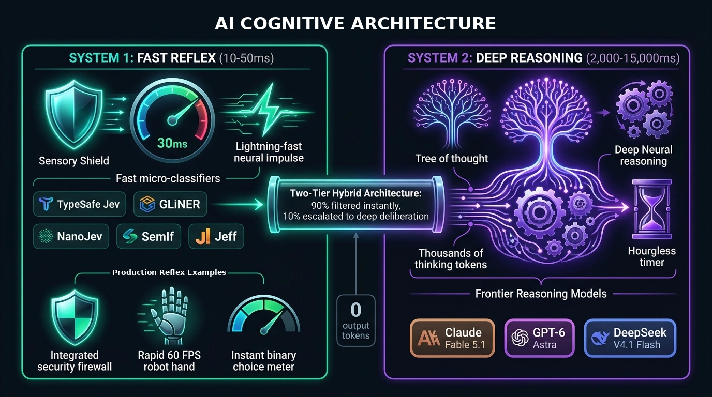
</p>

Borrowing from Daniel Kahneman's foundational cognitive psychology framework (*Thinking, Fast and Slow*), modern autonomous agent engineering divides intelligence into two distinct operational modes:

### System 1: Fast, Reflexive, and Automatic (TypeSafe Jev, NanoJev, GLiNER, SemIf, Jeff)
- **Cognitive analogue:** Instinctive human reflexes -- ducking an unexpected projectile, reading street signs at a glance, or swerving a vehicle around road debris.
- **AI implementation:** Fixed-parameter, non-generative classification models alongside bidirectional encoders like GLiNER / GLiFormer. The input context passes through neural weights in a single matrix multiplication pass (`10--50 ms`), mapping directly to output probability tensors across pre-declared schemas.
- **Core characteristics:** Zero generated text tokens, physically guaranteed schema validity, zero JSON syntax hallucinations, and near-zero cost ($0.025 / 1,000 decisions or $0.00 self-hosted).
- **Production role:** High-throughput sensory filtering, input security guardrails, DOM element selection, intent routing, and real-time game loops (e.g. 60 FPS Super Smash Bros or Doom).

### System 2: Slow, Deliberative, and Analytical (Claude Fable 5.1, GPT-6 Astra, DeepSeek V4.1 Flash, Claude Opus 5)
- **Cognitive analogue:** Conscious, effortful human deduction -- calculating 17 &times; 24 in your head, drafting a complex legal contract, solving a chess puzzle, or writing a multi-file software architecture.
- **AI implementation:** Autoregressive, multi-step generative foundation models with extended chain-of-thought decoding (`1,200--15,000+ ms`).
- **Core characteristics:** Generates hundreds or thousands of natural language tokens and explores branching reasoning paths. Incurs substantial compute cost ($6.96--$11.81 / 1,000 decisions; up to [478x costlier per the Manjunath Shiva benchmark](https://github.com/manjunathshiva/jev-frontier-bench)).
- **Production role:** Deep multi-file code refactoring, strategic planning, creative synthesis, and formal proof generation.

### The Two-Tier Production Pattern: Sensory Shield + Reasoning Engine
A common engineering anti-pattern delegates every micro-decision to an expensive System 2 reasoning model. Spending $0.05 and 2,000 ms to confirm if an email is spam, if a prompt is safe, or if a button was clicked wastes compute.

In production architectures, **System 1 acts as the high-frequency sensory cortex and reflex shield**:
1. **Sensory Triage:** Routine incoming requests, telemetry streams, and DOM updates are evaluated in 30 ms by System 1 models for pennies per the [research report](https://gerryburde.com/articles/my-name-is-jev-summarizing-dozens-of-real-world-use-cases.html).
2. **Selective Deliberation:** Only when confidence falls below operational thresholds (&lt; 0.80) or when an ambiguous, high-stakes edge case is detected does the pipeline escalate execution to a System 2 reasoning model.
3. **Economics & Latency:** This hybrid architecture cuts end-to-end pipeline latency significantly per the [Manjunath Shiva benchmark](https://github.com/manjunathshiva/jev-frontier-bench). It reduces monthly LLM API bills by orders of magnitude while preserving frontier reasoning capabilities where they matter.


---

## System Architecture: Jev vs. Frontier LLMs vs. Open Fast Classifiers

| Architectural Dimension | TypeSafe Jev (System One) | Frontier Reasoning LLMs (Fable 5.1 / Astra) | Open Fast Classifiers (NanoJev / GLiNER / SemIf) |
| :--- | :--- | :--- | :--- |
| **Model Type** | Non-generative classification foundation model | Autoregressive reasoning generator | Non-generative open-weight decision model / bidirectional encoder |
| **Deployment Model** | Managed Cloud API | Managed Cloud API | Self-hosted local weights (vLLM, MLX, ONNX) or serverless |
| **Hosting Infrastructure** | TypeSafe Cloud Infrastructure | Anthropic / OpenAI / DeepSeek APIs | Apple Silicon (MLX), RTX 3090/4090, RunPod, L4 GPUs, Featherless AI |
| **Median Latency** | **30--50 ms** (fixed single pass) | 1,200--15,000+ ms (depends on reasoning tokens) | **16--35 ms** (local GPU / Apple Silicon) |
| **Output Tokens** | **0 tokens** (pure probability tensors) | Variable (500--4,000+ thinking tokens) | **0 tokens** (pure probability tensors) |
| **Decision Cost** | **$0.025 / 1,000 decisions** ($0.042 / M input) | $6.96--$11.81 / 1,000 decisions (up to [478x costlier](https://github.com/manjunathshiva/jev-frontier-bench)) | $0.00 marginal local (Apple Silicon via MLX) or $0.20--$0.40/hr (RunPod RTX 3090/4090); hosted serverless endpoints (Featherless AI) at ~$0.002--$0.005 / 1k decisions |
| **Multi-Question Speed** | **Parallel (single GPU forward pass)** | Sequential chaining or prompt bloating | **Parallel (single forward pass)** |
| **Schema Guarantees** | **100% mathematical** (physical head constraint) | Probabilistic (constrained sampling or regex) | **100% mathematical** (logit mask / head) |
| **Hallucination Risk** | **0% syntax/hallucination** (outputs only floats) | High (JSON parsing failures, markdown leakage) | **0% syntax failures** |
| **Cold-Start Agility** | **Instant (zero-shot)** -- Define arbitrary schema in payload | Instant (zero-shot prompt definition) | **Delayed** -- Custom domains require curating pairs and fine-tuning (except zero-shot GLiNER) |
| **Training Requirement** | **Zero (general-purpose foundation model)** | Zero (in-context zero-shot / few-shot) | **High (must explicitly fine-tune)** -- Open small replicas require task-specific training datasets |
### Demonstrated Dual-Model Economics: Community Reported Spends and Value Gained

Across social discussion threads and public technical reports, developers have paired Jev with autoregressive models. Rather than replacing generative models, Jev shields them from high-frequency or repetitive calls. The following reported budgets show demonstrated dual-model economics across real-world workloads:

- **1,018 AI Paper Categorization ([Hassan El Mghari, @nutlope](https://x.com/nutlope/status/2100426999546184123)):** Summarized 1,018 papers with DeepSeek V4 Flash ($3.99 total, $0.004/paper), then classified titles, summaries, and 24 candidate topics with Jev ($0.08 total, $0.000078/paper). The dual pipeline achieved 256 ms median latency and cut categorization costs by orders of magnitude.
- **Autonomous Minecraft Speedrun ([Ronak Malde, @rronak_](https://x.com/rronak_/status/2101544156757950697)):** Defeated the Ender Dragon in 8 m 43 s with 0 deaths. GPT-6 Astra handled macro checkpoints ($0.96 across 131 planning steps). Jev executed real-time actions in sub-20 ms ($0.01 across 1,200+ ticks), beating the game for $0.97 total vs $50+ on pure frontier calls.
- **586-Page Technical SEO Audit ([Borja Fatás, @borjafat](https://x.com/borjafat/status/2101018783976722479)):** Crawled and rebuilt internal linking across 586 site pages in 45.1 s for $0.21 total. In the same 45.1 s, Claude Opus 5 processed only 21 pages and spent $1.43 (~190x more per page), projecting $43.00 for the full run.
- **60 FPS Super Smash Bros. Melee Emulation ([Mau Baron, @maubaron](https://x.com/maubaron/status/2100738237237002706)):** Controlled 4 characters simultaneously from Dolphin RAM at 60 FPS across 22 million input tokens. The entire 2-hour tournament run cost $0.92 on Jev vs an estimated $430+ on GPT-4o.
- **DiT Attention Acceleration in Video Generation ([Kamimoto, @sep_is_heim](https://x.com/sep_is_heim/status/2101603192664740330)):** Integrated J-GAS into ComfyUI for MiniMax H3 video generation across 50 DiT layers. Evaluated attention layer importance dynamically for $0.0392 across 20--30 videos (~$0.0015/video), cutting RTX 4070 generation from 6 m 07 s to 3 m 34 s (41.7% speedup).
- **Social Media Stream Filtering ([Braxxxx, @Braxxxx](https://x.com/Braxxxx)):** Evaluated 100 social media posts using Jev + ego lite against Claude Opus 4.8 and Claude Sonnet 5. Opus cost 63x more and took 4.7x longer. Sonnet cost 28x more and took 7.1x longer.
- **Multimodal Ambiguity Gating ([Pavel Sich, @sichy](https://x.com/sichy/status/2100519334716092885)):** DreamChat evaluated prompt ambiguity in 38 ms ($0.00002). Intercepted prompts when confidence fell below 34%, preventing wasted $0.05 vision and editing runs.
- **Supervisory Agent Gating ([Darren, @TriadDarren](https://x.com/TriadDarren/status/2100645341393494264)):** Four-stage supervisory triage for Codex and Claude Code developer agents. Jev gating at $0.00004 per step shields expensive reasoning steps ($0.03 to $0.08 per step), cutting overall agent spend by 90%+.

---

## Visual Demo Gallery: Featured Video Teardowns

Click any preview card to watch the original video, interactive demo, or code repository:

| <a href="https://x.com/maubaron/status/2100738237237002706" target="_blank" rel="noopener noreferrer"></a> | <a href="https://github.com/browser-use/jev-ultrafast" target="_blank" rel="noopener noreferrer"></a> | <a href="https://x.com/zaidbul" target="_blank" rel="noopener noreferrer"></a> |
| :--- | :--- | :--- |
| <span id="demo-maubaron-typesafe-smash"></span>**🎮 60 FPS Super Smash Bros. Melee AI.**<br>`Category 6: Simulation & Gaming`<br>**Creator:** [Mau Baron (@maubaron)](https://x.com/maubaron/status/2100738237237002706).<br>Jev controls 4 characters simultaneously from Dolphin RAM at 60 FPS across 22 million tokens. Cost: $0.92 per 2-hour tournament vs $430+ on GPT-4o. | <span id="demo-browser-use-jev-ultrafast"></span>**🌐 Browser-Use / DOM Selection.**<br>`Category 1: Browser Automation`<br>**Creator:** [Alex Hitt](https://github.com/browser-use/jev-ultrafast).<br>Extracts interactive DOM trees into actions in under 100 ms via `choice`. Executes web forms in 2 s, operating 130x cheaper than vision models. | <span id="demo-zaidbul-robotic-arm"></span>**🦾 Zero-Shot Robotic Arm Sorting.**<br>`Category 6: Simulation & Robotics`<br>**Creator:** [Zaid Alyafeai (@zaidbul)](https://x.com/zaidbul).<br>Real-world robotic arm sorting physical workspace objects in real time. Coordinates evaluated by Jev in sub-50 ms cycles without cloud latency. |
| <a href="https://github.com/TarunTomar122/jev-askable-arm" target="_blank" rel="noopener noreferrer"></a> | <a href="https://github.com/ChetasLua" target="_blank" rel="noopener noreferrer"></a> | <a href="https://github.com/Dicklesworthstone/skillranker" target="_blank" rel="noopener noreferrer"></a> |
| <span id="demo-taruntomar122-jev-askable-arm"></span>**🤖 Franka Arm Motion Primitive Selection.**<br>`Category 6: Simulation & Robotics`<br>**Creator:** [Tarun Tomar](https://github.com/TarunTomar122/jev-askable-arm).<br>ManiSkill physics simulation of Franka robotic arm. Jev evaluates geometric scene state and selects motion primitives in 28 ms cycles. | <span id="demo-chetaslua-jevmeter"></span>**📺 Live Video Transcript & Sentiment Meter.**<br>`Category 6: Real-Time Media Analysis`<br>**Creator:** [ChetasLua](https://github.com/ChetasLua).<br>Real-time video analysis dashboard scoring spoken transcript sentences via Jev in 30 ms ($0.0015 for an entire 1-hour live stream). | <span id="demo-dicklesworthstone-skillranker"></span>**🧭 SkillRanker: Jev-Powered Skill Ranking.**<br>`Category 3: MCP Servers & Agent Skills`<br>**Creator:** [Jeffrey Emanuel (@Dicklesworthstone)](https://github.com/Dicklesworthstone/skillranker).<br>Standalone Rust CLI and terminal TUI ranking agent skill relevance in sub-5 ms. Slashes 80%+ of prompt tokens. |
| <a href="https://github.com/RomanSlack/jev-drone" target="_blank" rel="noopener noreferrer"></a> | <a href="https://github.com/standardagents/jevpilot" target="_blank" rel="noopener noreferrer"></a> | <a href="https://github.com/valentynkit/jev-plays-pokemon-red" target="_blank" rel="noopener noreferrer"></a> |
| <span id="demo-romanslack-jev-drone"></span>**🚁 3D Drone Obstacle Navigation Simulation.**<br>`Category 6: Simulation & Robotics`<br>**Creator:** [Roman Slack](https://github.com/RomanSlack/jev-drone).<br>Camera-only quadrotor drone navigation in MuJoCo physics. Raycast vectors scored at 2.5 Hz via Jev `choice` to avoid dynamic obstacles. | <span id="demo-standardagents-jevpilot"></span>**🚗 Autonomous Driving Simulator (JevPilot).**<br>`Category 6: Simulation & Gaming`<br>**Creator:** [standardagents & J. P. Schroeder](https://github.com/standardagents/jevpilot).<br>Autonomous vehicle decision simulator in Three.js. Evaluates velocities, hazards, and braking thresholds in 24 ms cycles. | <span id="demo-valentynkit-jev-plays-pokemon-red"></span>**👾 Jev Plays Pokemon Red (Game Boy Agent).**<br>`Category 6: Simulation & Gaming`<br>**Creator:** [Valentyn Kit](https://github.com/valentynkit/jev-plays-pokemon-red).<br>Game Boy emulator agent where A* code handles pathfinding. Jev makes strategic decisions at plot forks and gym battles. |
| <a href="https://github.com/choxos/jevchess" target="_blank" rel="noopener noreferrer"></a> | <a href="https://github.com/Frank-ZY-Dou/awesome-jev" target="_blank" rel="noopener noreferrer"></a> | <a href="https://x.com/CompleteSkeptic/status/2099925687465570372" target="_blank" rel="noopener noreferrer">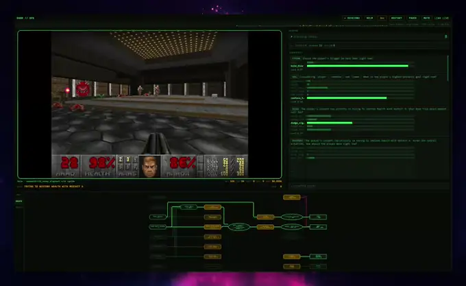</a> |
| <span id="demo-choxos-jevchess"></span>**♟️ Real-Time Chess Move Prediction (JevChess).**<br>`Category 6: Simulation & Gaming`<br>**Creator:** [Choxos](https://github.com/choxos/jevchess).<br>Predicts candidate move blunders and grandmaster move choices in under 30 ms per turn without minimax tree search. | <span id="demo-diogo-almeida-interactive-doom"></span>**🌐 Real-Time Agents in a 3D Environment.**<br>`Category 6: Simulation & Gaming`<br>**Creator:** [Cris Lenta](https://github.com/Frank-ZY-Dou/awesome-jev).<br>Multi-agent spatial navigation in dynamic 3D environments. Executes reflex movements and objective choices in single-digit millisecond budgets ($0.00/frame). | <span id="demo-typesafeai-launch"></span>**⚡ TypeSafe AI Launch Demo & Architecture.**<br>`Cognitive Architecture Teardown`<br>**Creator:** [Diogo Almeida (TypeSafe AI Founder)](https://x.com/CompleteSkeptic/status/2099925687465570372).<br>Diogo Almeida (co-inventor of InstructGPT) introduces Jev. Demonstrates why typed probabilities outperform chat completions and eliminate hallucinations. |
| <a href="https://superx.so/tweet-tester" target="_blank" rel="noopener noreferrer"></a> | <a href="https://x.com/StuSim/status/2100690465251283065" target="_blank" rel="noopener noreferrer"></a> | <a href="https://x.com/Loran750/status/2100692527829369115" target="_blank" rel="noopener noreferrer"></a> |
| <span id="demo-superx-tweet-tester"></span>**⚡ SuperX Tweet Tester: Viral Scoring.**<br>`Category 6: SaaS & Social Media Analytics`<br>**Creator:** [SuperX AI (@superx_so)](https://superx.so/tweet-tester).<br>Production engagement scoring evaluating draft copy across 30+ viral criteria in 42 ms. Cost: ~$0.04 per 1,000 tweets. | <span id="demo-stuart-sim-benchmark"></span>**⏱️ Vercel AI Gateway Latency Benchmark.**<br>`Category 7: Benchmarks & Latency`<br>**Creator:** [Stuart Sim (@StuSim)](https://x.com/StuSim/status/2100690465251283065).<br>Live latency evaluation through Vercel AI Gateway. Proves sub-100 ms round-trip classification as an input-validation gate saving 95%+ of LLM spend. | <span id="demo-laurent-architecture"></span>**🏗️ Multi-Tier Agent Architecture Teardown.**<br>`Category 2: AI Dev & Agent Triage`<br>**Creator:** [Laurent (@Loran750)](https://x.com/Loran750/status/2100692527829369115).<br>Architecture breakdown demonstrating how high-throughput speculative parallel fan-out shields expensive reasoning models from routine checks. |
| <a href="https://x.com/borjafat/status/2101018783976722479" target="_blank" rel="noopener noreferrer"></a> | <a href="https://www.youtube.com/@QAInsights" target="_blank" rel="noopener noreferrer"></a> | <a href="https://www.youtube.com/watch?v=lDmrk_7D-W8" target="_blank" rel="noopener noreferrer"></a> |
| <span id="demo-borja-seo-audit"></span>**🔍 High-Throughput SEO Auditing.**<br>`Category 1: Browser & Web Scraping`<br>**Creator:** [Borja (@borjafat)](https://x.com/borjafat/status/2101018783976722479).<br>Demonstration of high-volume DOM parsing and technical SEO compliance checking. Runs rules across 10,000 URLs for under $0.25 total. | <span id="demo-qainsights-automation"></span>**📊 Performance Testing & Test Automation.**<br>`Category 7: Benchmarks & Testing`<br>**Creator:** [NaveenKumar Namachivayam (QAInsights)](https://www.youtube.com/@QAInsights).<br>End-to-end performance benchmarking of Jev round-trip latency, concurrent API throughput, and automated load testing integrations. | <span id="demo-webdevcody-critique"></span>**🎯 Architectural Reality Check & Boundaries.**<br>`Production Engineering & Boundaries`<br>**Creator:** [Cody Seibert (WebDevCody)](https://www.youtube.com/watch?v=lDmrk_7D-W8).<br>Critical engineering analysis of where typed classification beats generative LLMs. Outlines where deterministic regex, linters, or embeddings remain superior. |
| <a href="https://x.com/nailthy62/status/2101388186916454439" target="_blank" rel="noopener noreferrer"></a> | <a href="https://x.com/matthewsoldit/status/2100702040938934493" target="_blank" rel="noopener noreferrer">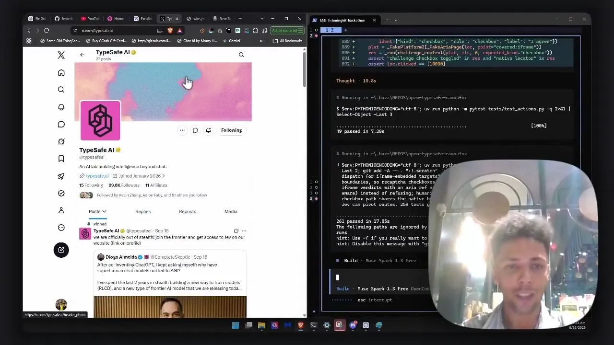</a> | <a href="https://x.com/sichy/status/2100519334716092885" target="_blank" rel="noopener noreferrer"></a> |
| <span id="demo-nailthy62-drape-jev"></span>**👗 Realtime Virtual Try-On Hauls (Drape).**<br>`Category 6: Real-Time E-Commerce`<br>**Creator:** [Nailthy Tang (@nailthy62)](https://x.com/nailthy62/status/2101388186916454439).<br>Interactive virtual try-on parsing live speech transcripts and outfit metadata. Selects items in real time at $0.0011 per decision cycle. | <span id="demo-matthewsoldit-camoufox-jev"></span>**🦊 Headless Camoufox Anti-Bot Automation.**<br>`Category 1: Browser Automation`<br>**Creator:** [matthewsoldit](https://x.com/matthewsoldit/status/2100702040938934493).<br>Combining headless Camoufox browser DOM extractions with Jev choice primitives for structured web scraping without heavy vision models. | <span id="demo-pavelsich-dreamchat"></span>**🛡️ Production Ambiguity Gating in DreamChat.**<br>`Category 5: Security & Ambiguity Gating`<br>**Creator:** [Pavel Sich (@sichy)](https://x.com/sichy/status/2100519334716092885).<br>When prompt ambiguity yields only 34% confidence, Jev intercepts execution to trigger interactive menus rather than burning expensive image credits. |
| <a href="https://x.com/sep_is_heim/status/2101603192664740330" target="_blank" rel="noopener noreferrer"></a> | <a href="https://x.com/rronak_/status/2101544156757950697" target="_blank" rel="noopener noreferrer"></a> | <a href="https://x.com/neural_avb/status/2100560729401426247" target="_blank" rel="noopener noreferrer"></a> |
| <span id="demo-kamimoto-minimax-h3"></span>**⚡ MiniMax H3 Video Generation (J-GAS).**<br>`Category 6: Video Generation & Acceleration`<br>**Creator:** [Kamimoto (@sep_is_heim)](https://x.com/sep_is_heim/status/2101603192664740330).<br>Dynamic attention sparsification across 50 DiT layers. Cuts RTX 4070 generation time from 6 m 07 s to 3 m 34 s (41.7% speedup) for $0.0392 across 20--30 videos (~$0.0015/video). | <span id="demo-rmalde-minecraft-agent"></span>**🐉 Minecraft Autonomous Ender Dragon Speedrun.**<br>`Category 6: Simulation & Gaming`<br>**Creator:** [Ronak Malde (@rronak_)](https://x.com/rronak_/status/2101544156757950697).<br>Dual-system autonomous agent pairing GPT-6 Astra planning with Jev real-time physical actions. Defeats Ender Dragon in 8 m 43 s for under $1.00 total. | <span id="demo-neural-avb-livestream"></span>**💻 One-Hour Live Coding Video Teardown.**<br>`Category 2: Developer Tooling`<br>**Creator:** [AVB (@neural_avb)](https://x.com/neural_avb/status/2100560729401426247).<br>Deep live coding session demonstrating reactive workflows, multi-choice classification outputs, and integrating Jev endpoints into production stacks. |
| <a href="https://x.com/Bk23544/status/2102021494112981347" target="_blank" rel="noopener noreferrer"></a> | <a href="https://x.com/Austin_Way/status/2102131624921968704" target="_blank" rel="noopener noreferrer"></a> | |
| <span id="demo-bk23544-grassworks-director"></span>**🌱 Real-Time Three.js Scene Director.**<br>`Category 6: Simulation & Gaming`<br>**Creator:** [Bilal Khan (@Bk23544)](https://x.com/Bk23544/status/2102021494112981347).<br>Evaluates natural language directives into shader uniforms and environmental wind vectors in sub-40 ms at 60 FPS without autoregressive lag. | <span id="demo-austin-way-working-memory"></span>**🧠 Cognitive Working Memory Load Analyzer.**<br>`Category 2: AI Dev & Content Validation`<br>**Creator:** [Austin Way (@Austin_Way)](https://x.com/Austin_Way/status/2102131624921968704).<br>Evaluates learner working-memory cognitive load in instructional passages. Slashes content validation costs from ~$250,000 to ~$2,000 (125x reduction) vs frontier LLMs. | |

---

## Visual Benchmark Gallery: Jev vs. Competing Models & Frontier LLMs

Side-by-side visual evidence from empirical benchmark suites, open-weight reproductions, and independent evaluations:

| [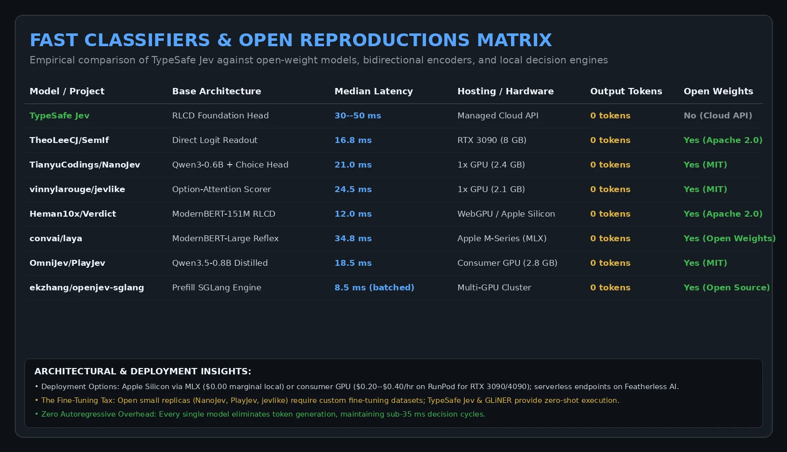](#8-competing-fast-classifiers-and-open-reproductions) | <a href="https://github.com/TianyuCodings/NanoJev" target="_blank" rel="noopener noreferrer"></a> | <a href="https://github.com/mizorewww/laya-mlx" target="_blank" rel="noopener noreferrer"></a> |
| :--- | :--- | :--- |
| <span id="demo-theoleecj-semif"></span><span id="demo-competing-models-matrix"></span>**📊 Fast Classifiers Architecture Matrix.**<br>`Category 8: Fast Classifiers Matrix`<br>**Creator:** [Open-Source Community](#8-competing-fast-classifiers-and-open-reproductions).<br>Latency, local VRAM footprints, and output token budgets (0 tokens). Compares TypeSafe Jev against SemIf, NanoJev, Verdict, and Laya. | <span id="demo-tianyucodings-nanojev"></span>**⚡ NanoJev (0.6 B) vs. Jev API vs. Qwen.**<br>`Category 8: Open Reproductions`<br>**Creator:** [TianyuCodings](https://github.com/TianyuCodings/NanoJev).<br>Synchronized 50x50 maze navigation replay. The 0.6 B open replica reaches the goal with 36 collisions vs 52 for Jev API and 103 for Qwen at 256 decisions/s ($0.00 local). | <span id="demo-mizorewww-laya-mlx"></span>**🍎 Laya MLX: Sub-35 ms Local Engine.**<br>`Category 8: Apple Silicon & Local Engines`<br>**Creator:** [Convai Innovations & Mizore](https://github.com/mizorewww/laya-mlx).<br>Screen recording of Laya MLX on Apple Silicon M3 Max at 34.8 ms offline latency and 11.4 decisions/s. Evaluates options with zero cloud spend ($0.00 marginal cost). |
| <a href="https://github.com/Gaurav-Gosain/jev-sec-bench" target="_blank" rel="noopener noreferrer"></a> | <a href="https://github.com/manjunathshiva/jev-frontier-bench" target="_blank" rel="noopener noreferrer"></a> | <a href="https://github.com/iammrduncan/typesafe-ai-benchmark" target="_blank" rel="noopener noreferrer"></a> |
| <span id="demo-gaurav-gosain-jev-sec-bench"></span>**🛡️ Blind Security & Vulnerability Benchmark.**<br>`Category 5: Security Guardrails`<br>**Creator:** [Gaurav Gosain](https://github.com/Gaurav-Gosain/jev-sec-bench).<br>Evaluation across prompt injection and vulnerabilities: 100% on deserialization, 93.5% on SQL injection. Flagged 73 flaws misclassified as safe by ground truth. | <span id="demo-manjunathshiva-jev-frontier-bench"></span>**📈 Pareto Frontier: Jev vs. Frontier LLMs.**<br>`Category 7: Empirical Benchmarks`<br>**Creator:** [Manjunath Shiva](https://github.com/manjunathshiva/jev-frontier-bench).<br>Stress test across 200 decisions: Jev scores 72.5% accuracy at $0.025 / 1k calls, within noise of DeepSeek Flash (76.0%, $0.158). Fable 5.1 costs 478x more ($11.81). | <span id="demo-iammrduncan-typesafe-ai-benchmark"></span>**🎛️ Cerebras Qwen 27 B vs. Jev Switchboard.**<br>`Category 7: Hardware & Latency`<br>**Creator:** [Shannon Duncan](https://github.com/iammrduncan/typesafe-ai-benchmark).<br>Interactive ticket switchboard evaluating support routing. Measures wall-clock latency and economics between Cerebras generation and Jev non-generative classification. |
| <a href="https://github.com/OmniJev/PlayJev" target="_blank" rel="noopener noreferrer"></a> | <a href="https://github.com/phuryn/experiments" target="_blank" rel="noopener noreferrer"></a> | <a href="https://typesafe.ai" target="_blank" rel="noopener noreferrer"></a> |
| <span id="demo-omnijev-playjev"></span>**🕹️ PlayJev 10-Game Arcade Benchmark.**<br>`Category 8: Distilled Fast Classifiers`<br>**Creator:** [OmniJev](https://github.com/OmniJev/PlayJev).<br>Benchmark of 0.8 B parameter distilled decision model across 10 games. Reaches 1.00 score parity on Space Invaders, Racer, and Sokoban in under 20 ms. | <span id="demo-phuryn-experiments"></span>**📑 50-Edge-Case Adversarial Invoice Benchmark.**<br>`Category 7: Adversarial Benchmarks`<br>**Creator:** [Paweł Huryn](https://github.com/phuryn/experiments).<br>50 adversarial invoices across 6 models. Jev achieved 50/50 accuracy for $0.025 / 1k calls, outperforming Opus 5 (49/50, $2.83) and Ministral 8 B with zero syntax failures. | <span id="demo-typesafe-throughput-benchmark"></span>**⚡ TypeSafe Throughput & Concurrency.**<br>`Category 7: Concurrency & Throughput`<br>**Creator:** [TypeSafe AI Official](https://typesafe.ai).<br>Empirical evaluation of parallel multi-schema inference across 10,000 requests. Shows consistent 30--50 ms latencies regardless of declared schema volume. |
| <a href="https://benchmarkheaven.com/jev-models" target="_blank" rel="noopener noreferrer"></a> | <a href="https://x.com/tdinh_me/status/2101958041986068848" target="_blank" rel="noopener noreferrer"></a> | <a href="http://bench.jakecuth.com" target="_blank" rel="noopener noreferrer"></a> |
| <span id="demo-benchmarkheaven-jevbench"></span>**🏆 JevBench v1.2: 42 Decision Systems.**<br>`Category 7: Independent Benchmarks`<br>**Creator:** [Benchmark Heaven](https://benchmarkheaven.com/jev-models).<br>Comprehensive multi-axis benchmark (Intelligence, Calibration, Speed, Cost, 25% each). Jev 1.13.0 ranks #1 (75.4), SemIf Qwen3.5-4 B ranks #2 (74.7), djev Maisa ranks #3 (74.3). | <span id="demo-tdinh-tetris-harness"></span>**🕹️ Tetris Reality Check & Planning Limits.**<br>`Category 7: Adversarial Post-Mortems`<br>**Creator:** [Tony Dinh (@tdinh_me)](https://x.com/tdinh_me/status/2101958041986068848).<br>Empirical benchmark proving that stripping candidate pre-filtering causes Jev to top out in 3 seconds. Demonstrates why System 1 reflex models require deterministic search scaffolds. | <span id="demo-cuth-s1bench"></span>**🔬 S1Bench: 30+ Open Rebuilds on DGX Spark.**<br>`Category 7: Open-Weight Benchmarks`<br>**Creator:** [Jake Cuth (@ItsCuthulhu)](https://x.com/ItsCuthulhu/status/2101491913866055821).<br>Pareto frontier across 1,999 decisions: Jev 77.5% at 2.4 decisions/s. Open encoders reach 37 decisions/s, while large 27 B models reach 75.8% at 1.6 decisions/s. |
| <a href="https://x.com/airesearch12/status/2101936404385161270" target="_blank" rel="noopener noreferrer"></a> | | |
| <span id="demo-airesearch12-jevbench-alternatives"></span>**📈 JevBench v1.2.7: 26 Alternative Systems.**<br>`Category 7: Independent Benchmarks`<br>**Creator:** [Florian S (@airesearch12)](https://x.com/airesearch12/status/2101936404385161270).<br>Composite evaluation (Intelligence, Calibration, Speed, Cost, 25% each). TypeSafe Jev leads at #1 (75.4), SemIf #2 (74.7), djev #3 (74.3), Verdict 1.4 #4 (72.5), GLiNER2 (53.0). | | |

---

## Architecture and Production Visualizations

Visual breakdowns of production agent patterns, security playbooks, and system architecture:

| <a href="https://x.com/TriadDarren/status/2100645341393494264" target="_blank" rel="noopener noreferrer"></a> | <a href="https://x.com/HavokSocial/status/2100702139735818568" target="_blank" rel="noopener noreferrer"></a> | <a href="https://github.com/itsmostafa/typesafe-mcp" target="_blank" rel="noopener noreferrer">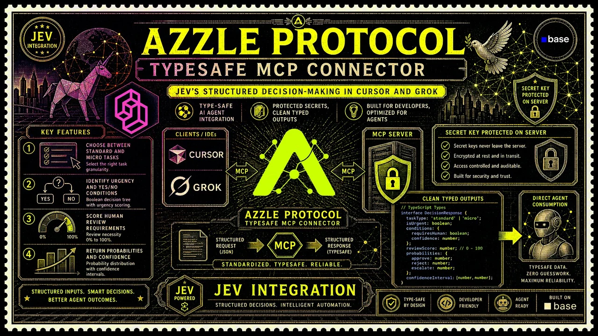</a> |
| :--- | :--- | :--- |
| <span id="demo-thruwire-foreman"></span>**Four-Stage Agent Triage Pipeline.**<br>`Category 2: Agent Architecture & Triage`<br>**Creator:** [@TriadDarren](https://x.com/TriadDarren/status/2100645341393494264).<br>Deterministic parsing feeding speculative Jev classification before selectively invoking expensive frontier reasoning models. Reduces API costs by 90%+. | <span id="demo-socialhavok-security-containment"></span>**Automated Security Containment Playbook.**<br>`Category 5: Security & SecOps`<br>**Creator:** [@HavokSocial](https://x.com/HavokSocial/status/2100702139735818568).<br>Automated firewall blocking at >= 0.90 confidence with mandatory human sign-off for disruptive network gateway changes. Achieves zero false-positive lockouts. | <span id="demo-kitze-skillbox"></span>**Model Context Protocol (MCP) Tool Contract.**<br>`Category 3: MCP Servers & Skills`<br>**Creator:** [itsmostafa](https://github.com/itsmostafa/typesafe-mcp).<br>Azzle Protocol MCP specification formalizing typed tool contracts and structured schema returns for agent loops in Cursor and Claude. |
| <a href="https://x.com/tj_klug/status/2100695837495992737" target="_blank" rel="noopener noreferrer"></a> | <a href="https://x.com/TriadDarren/status/2100645341393494264" target="_blank" rel="noopener noreferrer">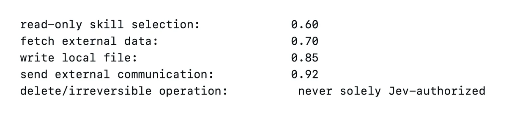</a> | <a href="https://gerryburde.com/articles/my-name-is-jev-summarizing-dozens-of-real-world-use-cases.html#architectural-cautionary-tales-where-newly-popular-techniques-fail" target="_blank" rel="noopener noreferrer"></a> |
| <span id="demo-devagrawal09-jev-review"></span>**Slopcheck: AST + Semantic PR Quality.**<br>`Category 2: Code Review & Quality Gates`<br>**Creator:** [@tj_klug](https://x.com/tj_klug/status/2100695837495992737).<br>Combining deterministic AST extraction with semantic Jev scoring for automated GitHub pull request code quality reviews in under 2 seconds per commit. | <span id="demo-confidence-risk-spectrum"></span>**Risk-Tiered Confidence Spectrum.**<br>`Production Architecture & Risk Gating`<br>**Creator:** [@TriadDarren](https://x.com/TriadDarren/status/2100645341393494264).<br>Operational confidence thresholds mapped to action risk: read-only skill at 0.60, local file at 0.85, external action at 0.92, deletion never automated. | <span id="demo-tamaratran-fast-jev-compaction"></span>**Context Compaction Reality Check.**<br>`Production Anti-Patterns & Critiques`<br>**Creator:** [Teknium (Nous Research)](https://gerryburde.com/articles/my-name-is-jev-summarizing-dozens-of-real-world-use-cases.html#the-architectural-critique-why-session-compaction-is-a-dangerous-anti-pattern).<br>Empirical analysis showing why using Jev to compact agent coding sessions degrades into naive rule matching. It destroys prompt caching and inflates costs. |

---

## Canonical Demonstrations and Technical Debates (No Standalone Repository)

Engineering teardowns, interactive prototypes, and public technical debates published on social platforms and technical blogs that do not have a dedicated GitHub repository:

- **[Diogo Almeida on RLCD and System One](https://x.com/CompleteSkeptic/status/2099925687465570372)** -- TypeSafe AI founder's release thread analyzing why reinforcement learning for calibrated decisions (RLCD) enables sub-50 ms non-generative classification.
- **[Hassan El Mghari on 1kpapers Classification](https://x.com/nutlope/status/2100426999546184123)** -- Dual-model pipeline summarizing 1,018 AI research papers using DeepSeek V4 Flash ($3.99 total, $0.004 per paper). Jev classified all papers across 24 candidate topics for $0.08 total ($0.000078 per paper) at 256 ms median latency.
- **[Braxxxx on Social Filtering](https://x.com/Braxxxx)** -- Triaged 100 social media posts using Jev + ego lite against Claude Opus 4.8 and Claude Sonnet 5. Opus cost 63x more and took 4.7x longer. Sonnet cost 28x more and took 7.1x longer.
- **[Borja Fatás on High-Throughput SEO Internal Linking](https://x.com/borjafat/status/2101018783976722479)** -- Crawled and rebuilt internal linking across 586 site pages in 45.1 s for $0.21 total (584 links placed, 139 rejected across 8,790 binary decisions). Claude Opus 5 processed only 21 pages in that time and spent $1.43 (~190x more per page). A full Opus pass would cost $43.00.
- **[Ronak Malde on Dual-System Autonomous Minecraft](https://x.com/rronak_/status/2101544156757950697)** -- Autonomous Minecraft speedrun agent defeating the Ender Dragon in 8 m 43 s with 0 deaths. GPT-6 Astra planned macro objectives ($0.96 across 131 goal checkpoints) while Jev selected real-time micro actions in sub-20 ms ($0.01 across 1,200+ ticks). Total cost under $1.00 ($0.97) vs estimated $50+ on pure frontier autoregressive calls.
- **[Mau Baron on 60 FPS Melee Emulation](https://x.com/maubaron/status/2100738237237002706)** -- Real-time 4-player Melee emulation from Dolphin RAM at 60 FPS across 22 million input tokens. Jev cost $0.92 for the entire 2-hour tournament vs $430+ on GPT-4o.
- **[Kamimoto on MiniMax H3 Video Generation](https://x.com/sep_is_heim/status/2101603192664740330)** -- Adaptive sparse attention (J-GAS) in MiniMax H3 video generation across 50 DiT layers. Generation time dropped from 6 m 07 s to 3 m 34 s (41.7% speedup) on local RTX 4070, costing $0.0392 across 20--30 videos (~$0.0015/video).
- **[Pavel Sich on DreamChat Ambiguity Gating](https://x.com/sichy/status/2100519334716092885)** -- Intercepts ambiguous prompts in 38 ms when confidence is low (34%), preventing wasted $0.05 vision + edit runs on DreamChat.
- **[Darren / Thruwire Foreman on Agent Supervisory Triage](https://x.com/TriadDarren/status/2100645341393494264)** -- Supervisory triage for autonomous Codex / Claude Code developer agents. Gating at $0.00004 per step shields expensive reasoning steps ($0.03 to $0.08 per step), cutting overall agent spend by 90%+.
- **[Stuart Sim on Vercel AI Gateway Input Gating](https://x.com/StuSim/status/2100690465251283065)** -- Sub-100 ms input gating via Jev on Vercel AI Gateway shields downstream LLM invocations, saving 95%+ of LLM spend on invalid or out-of-scope requests.
- **[Gregor Zunic on Google Flights DOM Automation](https://x.com/gregpr07/status/2100411066966749359)** -- Zurich to London flight booking in 7.1 s for $0.0039 total vs Opus 5 bare screenshot at $0.40 to $0.90 per 12-step task (130x to 300x cheaper).
- **[SuperX on Viral Copy Scoring](https://superx.so/tweet-tester)** -- Evaluated 10,000 combinatorial copy iterations for $0.08 with Jev vs $12.50 on GPT-4o Mini or $45.00 on Claude 3.5 Haiku.
- **[Sahibzada Allahyar on GLiNER as Open Fast Classifier](https://x.com/singularity_sah/status/2101450114246000706)** -- Fastino AI and Cambridge researcher analysis of bidirectional encoders. Argues GLiNER and GLiFormer provide open zero-shot classification and extraction without autoregressive decoding overhead.
- **[Steve Krouse on 16-Judgment Demos on Val Town](https://x.com/stevekrouse/status/2100287368221659289)** -- Playable browser demonstration executing 16 concurrent schema evaluations in a single pass.
- **[Marcel Pociot on Social Feed Noise Collapsing](https://x.com/marcelpociot/status/2100520134481735729)** -- Browser extension prototype evaluating social media post quality to collapse rage-bait and spam in real time.
- **[Wayne Sutton on 1-Million Question Interactive Benchmarks](https://x.com/waynesutton/status/2100487878992388279)** -- Convex-backed public interactive web application testing high-throughput concurrent Jev queries.
- **[Ephraim Duncan on Multi-Tier Router Benchmarks](https://x.com/ephraimduncan/status/2100454070536351824)** -- Latency teardown testing Jev as a dynamic model router in front of frontier LLMs to save 70%+ of inference spend.
- **[Kyle Jeong on Accessibility Tree Candidate Selection](https://x.com/kylejeong/status/2100622054945095934)** -- Deep dive on converting accessibility trees to structured text coordinates for browser agents.
- **[Nick Ma on Agent Safety Invariants](https://x.com/isNickMa/status/2100566407524344225)** -- Empirical test suite verifying pre-execution safety invariants before running agent shell commands in 32 ms.
- **[Alex Wortega on Local Qwen 4 B Classification](https://x.com/justALEXWORTEGA/status/2100341039986798930)** -- Research notes on training an MLP layer on top of Qwen 4 B to replicate Jev choice behavior locally.
- **[Kostas Tsaleridis on SecOps Architecture](https://x.com/Kostastsale/status/2100362415187833048)** -- Technical architecture proposal for evaluating incoming API traffic with non-generative classification models.
- **[Malekoo on Native macOS App Integration](https://x.com/malekoo/status/2100439840575684910)** -- First recorded integration of Jev classification within a native macOS menu bar utility.
- **[Hamilton Ulmer on DuckDB Jev Extensions](https://x.com/hamiltonulmer/status/2100370557405667768)** -- Prototype evaluating in-memory DuckDB records using natural language queries via Jev.
- **[Idan Levin on WebMCP Agent Benchmarking](https://x.com/0xidanlevin/status/2100937437325205568)** -- Comparative evaluation of Jev within the WebMCP benchmark suite.
- **[Theo Browne on Context Compaction Risks](https://x.com/theo/status/2100762304862384257)** -- Architectural critique detailing why neural session compaction degrades prompt caching and model reasoning.
- **[Nathan Flurry on "Smart Switch Statement" Analysis](https://x.com/NathanFlurry/status/2100036101809619314)** -- Architectural framework conceptualizing Jev as a probabilistic switch statement in software engineering.
- **[Archer Hume on Solomon 27b Open-Weight Fast Classification](https://x.com/4rcherhume/status/2101888238357237798)** -- Unveiled Solomon 27b, an open-weight alternative to Jev based on Qwen3.8 [27b](https://x.com/4rcherhume/status/2101888238357237798). Supports native multimodal evaluation, a [265k context window](https://x.com/4rcherhume/status/2101888238357237798), multi-choice tagging, and evidence pointer spans.


---

## Architectural Patterns for Production

### Pattern 1: Speculative Parallel Fan-Out
Submit primary and conditional questions simultaneously in a single GPU pass. Never chain calls sequentially when queries share context:

```text
┌──────────────────────────────────────────────────────────────┐
│                    Incoming Request / State                  │
└──────────────────────────────┬───────────────────────────────┘
                                │
                                ▼
┌──────────────────────────────────────────────────────────────┐
│ 1. Deterministic Extraction & Filtering (Code)               │
│    - Parse AST / DOM / log files                             │
│    - Strip irrelevant boilerplate                            │
│    - Enforce hard boundary rules                             │
└──────────────────────────────┬───────────────────────────────┘
                                │
                                ▼
┌──────────────────────────────────────────────────────────────┐
│ 2. Speculative Parallel Fan-Out (Jev / Fast Classifier)      │
│    - Submit state + all primary and conditional questions    │
│    - Parallel execution in one GPU pass                      │
└──────────────────────────────┬───────────────────────────────┘
                                │
         ┌─────────────────────┴─────────────────────┐
         ▼                                           ▼
  Confidence ≥ 0.80                           Confidence < 0.80
         │                                           │
         ▼                                           ▼
┌───────────────────┐                       ┌───────────────────┐
│ Automated Action  │                       │ Escalate: Human / │
│ (Execution Path)  │                       │ Frontier LLM      │
└───────────────────┘                       └───────────────────┘
```

### Pattern 2: High-Volume Asymmetric Triage Filter
Use typed models as a high-throughput filter in front of expensive resources (such as human engineers, incident responders, or frontier LLMs):
- Low-risk containment actions (rate limiting, telemetry gathering) run automatically when confidence &ge; 0.85.
- High-risk disruptive actions (revoking keys, isolating databases) require human sign-off regardless of confidence.

### Pattern 3: Code-Owned Composite Scoring
Never ask fast classifiers for composite mathematical scores ("rate the code from 1 to 100").
- Instead, query atomic boolean judgments: `has_unit_tests`, `handles_null_pointer`, `matches_style_guide`.
- Combine those probabilities in deterministic code: `total_score = (has_tests * 0.4) + (handles_null * 0.4) + (matches_style * 0.2)`.

### Pattern 4: Strict Deterministic Boundary (The Deletion Test)
Before routing any check to Jev or a fast classifier, apply the deletion test:
- **Can a linter, type checker, regular expression, or AST parser catch this deterministically?**
- If yes, **write the code**. Never waste GPU cycles or risk probabilistic ambiguity where deterministic algorithms already succeed.


---

## Production Pitfalls and Anti-Patterns

### Anti-Pattern 1: The Context Compaction Trap
Attempting to use fast classifiers to "summarize" or "compact" long conversational agent sessions into concise markdown or memory bullet points is fundamentally flawed. As Nous Research demonstrated empirically:
1. **Rule collapse:** Fast decision models evaluate pre-declared categorical choices; they cannot generate novel semantic summaries. Compacting with classification heads forces authors to write naive rule heuristics that quickly lose nuanced context.
2. **Vicious token cycle:** Feeding compacted summaries back into generative models frequently triggers re-expansion prompts, destroying latency and token savings.
3. **Cache invalidation:** Dynamically modifying prompt prefixes destroys KV-cache reuse on frontier LLMs (such as Claude prompt caching), causing downstream costs to skyrocket.

### Anti-Pattern 2: The Low-Entropy Hallucination Trap
Fast classifiers can only evaluate information that is physically present in the provided context string. If an unstated business rule or missing invoice line item is omitted from the input text, the model cannot deduce it from thin air. Providing thorough system context and clear candidate rubrics is mandatory.

### Anti-Pattern 3: Treating Probabilities as Deterministic Booleans
A `noul` return of `0.81` is not equivalent to `true` in every domain. In life safety, financial accounting, and irreversible filesystem mutations (`rm -rf`, `DROP TABLE`), a confidence of `0.81` leaves an intolerable complementary error margin (0.19). Always gate destructive actions behind strict risk-tiered thresholds (&ge; 0.95) or human-in-the-loop authorization.

### Anti-Pattern 4: The Fine-Tuning Tax Trap (Assuming Open Replicas Are Zero-Shot)
A frequent architecture pitfall when evaluating open-source fast classifier reproductions (`NanoJev`, `PlayJev`, `jevlike`, `Verdict`) is assuming they offer the same general-purpose zero-shot flexibility as TypeSafe Jev or zero-shot extraction encoders like GLiNER. In practice, **you have to actually fine-tune them**:
1. **Cold-start friction:** Running an open replica on a new classification problem requires collecting domain-specific datasets, curating synthetic choice pairs, and executing a supervised fine-tuning run.
2. **Schema lock-in:** When your application changes its candidate choices or decision rubrics, fine-tuned weights cannot adapt on the fly. You must manage custom model checkpoints for distinct tasks.
3. **Distribution drift:** Small parameter models (0.5 B to 1 B parameters) risk catastrophic forgetting and poor calibration when runtime inputs diverge from the narrow fine-tuning corpus.
4. **Architectural prescription:** Use zero-shot foundation classifiers (`TypeSafe Jev`, `GLiNER`) when schemas change frequently or when immediate cold-start deployment is required. Reserve custom fine-tunes (`NanoJev`, `PlayJev`) for fixed, invariant, high-frequency production loops (e.g. 60 FPS gaming, robot kinematics, or high-volume static SecOps triage) where upfront training costs are amortized across billions of unchanging calls.


---

## 5-Minute Developer Quickstart

### Python

```python
import os
import requests

TYPESAFE_API_KEY = os.environ.get("TYPESAFE_API_KEY")

payload = {
    "model": "jev-latest",
    "state": """
    ERROR 2026-09-18 14:22:01 [auth-service] Connection refused: redis://cache-02:6379.
    Failover to cache-03 initiated. 12 requests dropped during window.
    """,
    "questions": {
        "is_outage": {
            "type": "noul",
            "instructions": "Did this incident cause a customer-facing service outage?"
        },
        "severity": {
            "type": "choice",
            "instructions": "Classify the operational severity tier.",
            "criteria": {
                "p1_critical": "Complete customer-facing service outage",
                "p2_major": "Degraded latency affecting active client requests",
                "p3_minor": "Non-blocking background retry error",
                "p4_info": "Informational state notification"
            }
        },
        "impact_score": {
            "type": "score",
            "instructions": "Rate the technical severity of the reported incident.",
            "criteria": [
                "No user impact with transparent failover",
                "Degraded latency affecting non-critical workflow",
                "Partial downtime with dropped client requests",
                "Complete service disruption"
            ]
        }
    }
}

response = requests.post(
    "https://api.typesafe.ai/v1/systemone",
    headers={
        "Authorization": f"Bearer {TYPESAFE_API_KEY}",
        "Content-Type": "application/json"
    },
    json=payload,
    timeout=5.0
)

data = response.json()
answers = data["answers"]
print("Severity choice:", answers["severity"]["choice"])
print("Severity probabilities:", answers["severity"]["probabilities"])
print("Is outage probability:", answers["is_outage"]["noul"])

# Automated confidence-gated routing
if answers["severity"]["probabilities"]["p1_critical"] > 0.85:
    print("CRITICAL: Paging on-call SRE immediately.")
```

### TypeScript / Node.js

```typescript
const payload = {
  model: "jev-latest",
  state: "git diff --stat\n src/auth.ts | 4 ++--\n 1 file changed, 2 insertions(+), 2 deletions(-)",
  questions: {
    has_security_risk: {
      type: "noul",
      instructions: "Does this diff introduce security or authentication vulnerabilities?"
    },
    review_urgency: {
      type: "choice",
      instructions: "Select the required engineering review priority.",
      criteria: {
        immediate: "High-risk security or auth logic requiring same-hour review",
        same_day: "Standard production changes needing review today",
        routine_backlog: "Minor non-blocking cosmetic refactor"
      }
    }
  }
};

const response = await fetch("https://api.typesafe.ai/v1/systemone", {
  method: "POST",
  headers: {
    "Authorization": `Bearer ${process.env.TYPESAFE_API_KEY}`,
    "Content-Type": "application/json"
  },
  body: JSON.stringify(payload)
});

const result = await response.json();
console.log("Security Risk Probability:", result.answers.has_security_risk.noul);
console.log("Review Urgency Decision:", result.answers.review_urgency.choice);
```

### cURL

```bash
curl -X POST "https://api.typesafe.ai/v1/systemone" \
  -H "Authorization: Bearer $TYPESAFE_API_KEY" \
  -H "Content-Type: application/json" \
  -d '{
    "model": "jev-latest",
    "state": "Customer email: Can you cancel my subscription and issue a full refund immediately?",
    "questions": {
      "request_type": {
        "type": "choice",
        "instructions": "Identify the primary customer intent.",
        "criteria": {
          "cancellation": "Requesting immediate service cancellation",
          "refund": "Requesting financial refund or billing reversal",
          "technical_support": "Troubleshooting system errors or bugs",
          "feature_request": "Proposing new software capabilities"
        }
      },
      "requires_human_supervisor": {
        "type": "noul",
        "instructions": "Does this request require mandatory human supervisor escalation?"
      }
    }
  }'
```


---

## About and Canonical Research

This repository is maintained by **[Gerry Burde](https://gerryburde.com)** ([@Gerry9000](https://github.com/Gerry9000)) alongside the engineering research published on **[gerryburde.com](https://gerryburde.com)**.

### Autonomous Dogfooding & Jev Triage

This directory dogfoods TypeSafe Jev to maintain ecosystem hygiene:
- **Ecosystem Radar Staging**: Automated scrapers track [29 community mirrors](RADAR.md) and stage raw candidates into [RADAR.md](RADAR.md).
- **Typed Judgment Triage**: Jev classifies candidate repositories across our 9 canonical categories via `choice`, evaluates tool authenticity via `noul`, and scores production readiness on an empirical 4-level scale via `score`.
- **Promotion Gate**: Only candidates scoring Level 3+ with verified working code and active documentation are promoted to this main directory.


Explore related research tracks:
- ⚡ **AI & Autonomous Systems:** [gerryburde.com (AI Research Track)](https://gerryburde.com/#panel-ai) &middot; Practical implementation notes on SLMs, non-generative reflex models, and agent architectures.
- 🛡️ **DevSecOps & Practical AI Safety:** [What Secure AI Development Looks Like in Practice](https://gerryburde.com/articles/what-secure-ai-development-looks-like-in-practice.html)
- 📐 **Formal Verification & Machine-Checked Proofs:** [The Practical Value of Machine-Checked Proofs](https://gerryburde.com/articles/the-practical-value-of-machine-checked-proofs.html) &middot; Lean 4 verification pipelines in production.
- 🔬 **The Jev Analytical Teardown & Benchmark:** [My Name Is Jev: Summarizing Dozens of Real-World Use Cases](https://gerryburde.com/articles/my-name-is-jev-summarizing-dozens-of-real-world-use-cases.html)

If you find this curated directory useful in your research or production systems, please cite the canonical analysis:

```bibtex
@article{burde2026jev,
  title   = {My Name Is Jev: Summarizing Dozens of Real-World Use Cases, Benchmarks, and Ecosystem Repositories},
  author  = {Burde, Gerry},
  journal = {gerryburde.com},
  year    = {2026},
  url     = {https://gerryburde.com/articles/my-name-is-jev-summarizing-dozens-of-real-world-use-cases.html}
}
```


---

## Contributing

Contributions of newly published fast classifiers, Jev tools, packages, or benchmarks are welcome!
1. Check that the codebase is public, active, and licensed.
2. Review our [Contributing Guidelines](CONTRIBUTING.md) for required submission details.
3. Submit an issue using our **[Resource Submission Template](.github/ISSUE_TEMPLATE/add-resource.yml)** (including demo video and discussion links).


---

## License

[](https://creativecommons.org/licenses/by/4.0/)

This work is licensed under a [Creative Commons Attribution 4.0 International License (CC BY 4.0)](LICENSE).

---

<sub>* Open companion to the comprehensive research report on <a href="https://gerryburde.com/articles/my-name-is-jev-summarizing-dozens-of-real-world-use-cases.html">gerryburde.com</a>.</sub>
