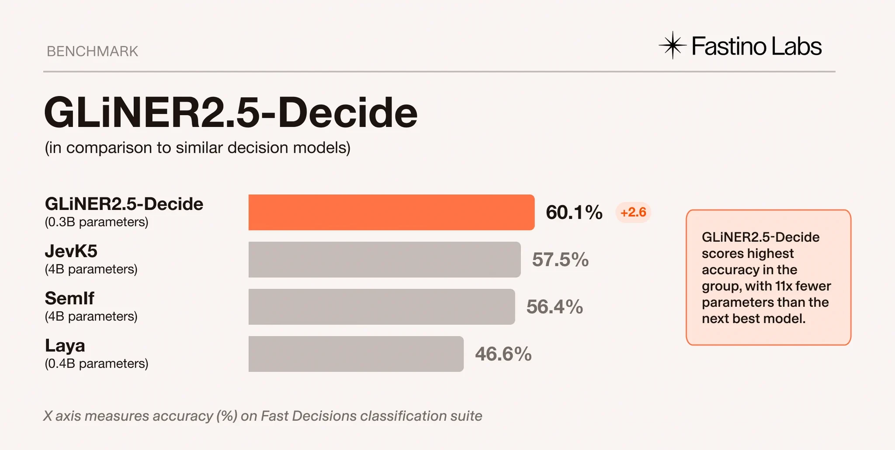
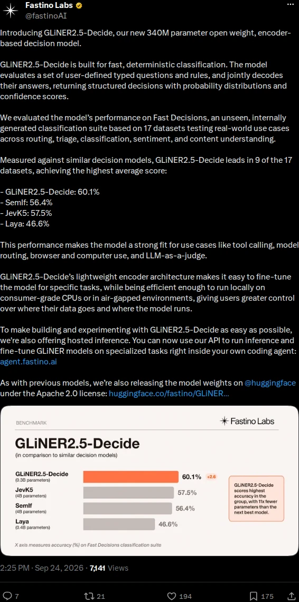

# GLiNER2.5-Decide: 340 M Parameter Open-Weight Decision Encoder

#### 1. Post & Repository Overview
* **Author**: Fastino Labs ([`@fastinoAI`](https://x.com/fastinoAI)).
* **Model**: [`fastino/GLiNER2.5-Decide`](https://huggingface.co/fastino/GLiNER2.5-Decide) *(Apache 2.0, Open Weights)*.
* **Codebase**: [`fastino-ai/GLiNER2`](https://github.com/fastino-ai/GLiNER2) *(Python, ⭐ 2,163)*.
* **Canonical Thread**: [`https://x.com/fastinoAI/status/2103188985292157353`](https://x.com/fastinoAI/status/2103188985292157353).
* **Launch Analysis**: [`https://fastino.ai/blog/gliner-2-5-decide-open-weight-decision-model`](https://fastino.ai/blog/gliner-2-5-decide-open-weight-decision-model).
* **Benchmark Dataset**: [`https://huggingface.co/datasets/fastino/fast-decisions`](https://huggingface.co/datasets/fastino/fast-decisions).
* **Demonstration Media**: Fast Decisions benchmark comparison chart (`media/fastino-gliner2-5-decide-benchmark.webp`) and launch announcement screenshot (`media/fastino-gliner2-5-decide-tweet.webp`).

---

#### 2. Cognitive Architecture & Technical Mechanism
* **Bidirectional Encoder Backbone**:
  * Utilizes a lightweight 340 M parameter bidirectional encoder post-trained specifically for constrained classification and multi-task decision making.
  * Processes input documents and target schemas jointly in a single forward pass without autoregressive token generation per the [`Fastino Model Card`](https://huggingface.co/fastino/GLiNER2.5-Decide).
* **Constrained Joint Decoding**:
  * Evaluates user-defined typed questions, label inventories, and explicit rules such as mutual exclusions, implications, and bounds.
  * Searches the valid solution space to return coherent multi-question decisions with calibrated probability distributions and confidence scores.
* **Span Extraction & Structured Records**:
  * Combines categorical classification with exact character-level span offsets for extracted entities and relations.
  * Allows agent systems to perform routing, safety filtering, and argument parsing simultaneously per the [`GLiNER2 Guide`](https://github.com/fastino-ai/GLiNER2).

---

#### 3. Empirical Results & Economics
* **Accuracy on Fast Decisions Benchmark**:
  * Achieves 60.1% average accuracy across 17 unseen real-world datasets in the [`Fast Decisions Benchmark`](https://huggingface.co/datasets/fastino/fast-decisions).
  * Leads in 9 of the 17 benchmark datasets, notably scoring 75.3% on support intent routing and 64.3% on banking intent per the [`Fastino Launch Blog`](https://fastino.ai/blog/gliner-2-5-decide-open-weight-decision-model).
  * Outperforms 4 B parameter decoder models including JevK5 (57.5%) and SemIf (56.4%), as well as encoder models like GLiFormer (49.0%) and Laya (46.6%) in the [`Evaluation Suite`](https://huggingface.co/datasets/fastino/fast-decisions).
* **Inference Latency & Hardware Efficiency**:
  * Delivers 38.3 ms p50 latency on NVIDIA V100, 43.4 ms on L4, and 47.3 ms on A100 for a 64-token payload under a 15-label schema in the [`Fastino Latency Teardown`](https://fastino.ai/blog/gliner-2-5-decide-open-weight-decision-model).
  * Scales to 52.6 ms at 1,024 tokens on A100. Sustains 167.3 ms p50 locally on a 48-vCPU Intel Xeon CPU without GPU acceleration per the [`Hardware Benchmark`](https://fastino.ai/blog/gliner-2-5-decide-open-weight-decision-model).
* **Marginal Economics**:
  * Incurs $0.00 marginal cost on self-hosted infrastructure. Available under the Apache 2.0 open-weight license with optional hosted API endpoints at [`agent.fastino.ai`](https://agent.fastino.ai).

---

#### 4. Visual Assets & Artifacts
* **Fast Decisions Benchmark Chart**:
  

    
  

* **Launch Announcement on X**:
  

    
  

